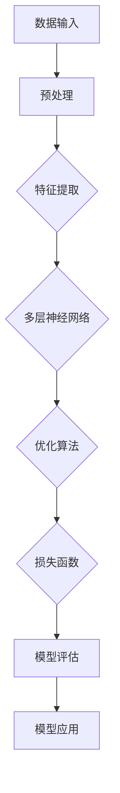
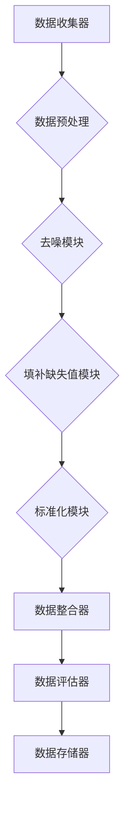

                 

# 《AI 大模型应用数据中心的数据清洗架构》

## 关键词
- AI 大模型
- 数据中心
- 数据清洗
- 架构设计
- 性能优化
- 可扩展性
- 安全性

## 摘要
本文将探讨 AI 大模型在数据中心应用中的数据清洗架构。首先，我们将回顾 AI 大模型的基础知识，包括其基本概念、分类和工作原理。接着，文章将深入探讨数据清洗的架构设计，包括需求分析、设计原则、流程和组件。然后，我们将介绍 AI 大模型在数据清洗中的具体应用，如数据预处理、缺失值和异常值处理，以及数据质量评估。接下来，通过一个实战案例，我们将展示如何在实际项目中应用数据清洗架构，并进行性能优化。最后，我们将讨论数据清洗架构的优化策略，包括性能、可扩展性、可靠性和安全性的优化。通过本文，读者将全面了解 AI 大模型数据清洗架构的设计与应用，为未来的技术发展提供有益的参考。

## 第一部分：背景与概述

### 1.1 书籍概述

随着人工智能（AI）技术的飞速发展，AI 大模型在数据中心的应用日益广泛。AI 大模型，也称为深度学习模型，具有强大的数据处理和模式识别能力，能够从海量数据中提取有价值的信息。然而，在实际应用中，数据的多样性和复杂性使得数据清洗成为一项关键任务。本书旨在探讨 AI 大模型在数据中心应用中的数据清洗架构，通过系统化的分析和设计，为读者提供一种高效、可靠的数据清洗解决方案。

### 1.2 AI 大模型在数据中心的应用背景

数据中心是现代企业运作的核心，其重要性不言而喻。数据中心承载着大量的数据存储、处理和分析任务，而 AI 大模型的应用为数据中心带来了巨大的变革。首先，AI 大模型可以显著提高数据处理的效率，通过自动化分析和决策，减轻人工负担。其次，AI 大模型能够从海量数据中挖掘出潜在价值，为企业提供智能化的洞察。然而，这些应用的基础是高质量的数据。因此，数据清洗成为 AI 大模型在数据中心应用中不可或缺的一环。

### 1.3 数据清洗的重要性

数据清洗是数据管理的重要环节，其重要性不容忽视。首先，数据清洗可以确保数据的质量，提高数据的价值。在 AI 大模型训练和应用中，高质量的数据是模型性能的保障。其次，数据清洗有助于减少数据冗余，优化数据存储空间，降低成本。此外，数据清洗还可以提高数据的一致性和准确性，为后续的分析和决策提供可靠的基础。

## 第二部分：AI 大模型基础

### 2.1 AI 大模型的基本概念

AI 大模型，通常指深度学习模型，是一种基于人工神经网络的机器学习模型。它通过多层神经网络结构，对大量数据进行学习，从而实现复杂的数据处理和模式识别任务。AI 大模型的基本概念包括神经网络、激活函数、损失函数、优化算法等。

### 2.2 AI 大模型的分类

AI 大模型根据其应用场景和特点可以分为多种类型，如图像识别、自然语言处理、推荐系统等。每种类型的 AI 大模型都有其独特的架构和算法，适用于特定的数据处理任务。

### 2.3 AI 大模型的工作原理

AI 大模型的工作原理主要包括数据输入、模型训练、模型评估和模型应用。首先，模型接收输入数据，通过多层神经网络进行特征提取和变换。然后，通过优化算法和损失函数，模型不断调整权重，提高对数据的拟合程度。最后，经过训练的模型可以对新数据进行预测和决策。

### 2.4 AI 大模型的核心算法

AI 大模型的核心算法包括多层感知机（MLP）、卷积神经网络（CNN）、循环神经网络（RNN）、长短期记忆网络（LSTM）等。这些算法通过不同的结构和机制，实现对数据的处理和模式识别。

## Mermaid 流程图：AI 大模型的基本架构



## 第三部分：数据清洗架构设计

### 3.1 数据清洗的需求分析

数据清洗的需求分析是设计数据清洗架构的第一步。首先，需要明确数据来源、数据类型、数据量等基本信息。其次，分析数据中的噪声、异常值、缺失值等质量问题，确定数据清洗的目标和任务。最后，评估数据清洗的预期效果，包括数据质量提升、成本节约、业务价值等。

### 3.2 数据清洗架构设计原则

数据清洗架构设计应遵循以下原则：

- **模块化**：将数据清洗过程分解为多个模块，每个模块负责特定的清洗任务，便于维护和扩展。
- **灵活性**：架构应具有高度的灵活性，能够适应不同的数据类型和应用场景。
- **可扩展性**：架构应支持数据的增量清洗，能够随数据量增长而扩展。
- **可靠性**：架构应确保数据清洗过程的可靠性和数据的一致性。

### 3.3 数据清洗流程设计

数据清洗流程设计包括以下步骤：

1. **数据收集**：从各个数据源收集原始数据。
2. **数据预处理**：对原始数据进行清洗，包括去除噪声、填补缺失值、标准化处理等。
3. **数据整合**：将来自不同数据源的数据进行整合，形成统一的数据集。
4. **数据评估**：对清洗后的数据进行质量评估，确保数据满足业务需求。
5. **数据存储**：将清洗后的数据存储到数据库或数据仓库中，供后续分析使用。

### 3.4 数据清洗组件设计

数据清洗组件设计包括以下关键组件：

- **数据收集器**：负责从不同数据源收集原始数据。
- **数据清洗模块**：包括预处理、去噪、填补缺失值、标准化处理等模块，每个模块负责特定的清洗任务。
- **数据整合器**：负责将来自不同数据源的数据进行整合。
- **数据评估器**：对清洗后的数据进行质量评估。
- **数据存储器**：负责将清洗后的数据存储到数据库或数据仓库中。

## Mermaid 流程图：数据清洗架构设计



## 第四部分：AI 大模型在数据清洗中的应用

### 4.1 数据预处理

数据预处理是数据清洗的重要环节，其目的是提高数据质量，为后续的模型训练和数据分析提供支持。AI 大模型在数据预处理中的应用主要包括：

- **数据标准化**：通过缩放或归一化，将不同数据范围的数据转换为同一尺度，便于模型训练。
- **缺失值处理**：通过填充缺失值或删除含有缺失值的记录，减少数据噪声。
- **异常值检测**：通过统计方法或机器学习方法，检测和纠正数据中的异常值。

### 4.2 缺失值处理

缺失值处理是数据清洗的关键步骤，其目的是减少数据噪声，提高数据质量。AI 大模型在缺失值处理中的应用主要包括：

- **均值填补**：使用记录的平均值或中位数填补缺失值。
- **插值法**：使用时间序列或空间序列的插值方法填补缺失值。
- **模型预测**：使用机器学习模型，如决策树、随机森林、K-近邻等，预测缺失值并填补。

### 4.3 异常值处理

异常值处理是确保数据质量的重要步骤。AI 大模型在异常值处理中的应用主要包括：

- **统计方法**：使用统计方法，如箱线图、标准差等，检测异常值。
- **聚类分析**：使用聚类算法，如 K-均值、层次聚类等，识别数据中的异常点。
- **机器学习方法**：使用机器学习模型，如孤立森林、局部异常因数等，检测和纠正异常值。

### 4.4 数据质量评估

数据质量评估是数据清洗的最后一步，其目的是确保数据满足业务需求。AI 大模型在数据质量评估中的应用主要包括：

- **一致性检查**：检查数据中的不一致性，如重复记录、字段冲突等。
- **完整性检查**：检查数据是否完整，是否存在缺失值。
- **准确性检查**：使用模型预测结果，评估数据的准确性。
- **完整性评估**：通过对比不同数据源的数据，评估数据的完整性。

## 第五部分：项目实战

### 5.1 数据清洗项目实战案例

在本节中，我们将通过一个实际的数据清洗项目，展示如何应用前面介绍的数据清洗架构。该项目旨在清洗一个包含客户购买记录的数据集，以提高后续分析的质量。

### 5.2 实战案例分析

#### 5.2.1 项目背景

假设我们有一个包含客户购买记录的数据集，数据包含以下字段：客户ID、购买日期、购买金额、商品名称。数据来源于多个渠道，存在一定的噪声和异常值，需要进行清洗。

#### 5.2.2 数据清洗流程

1. **数据收集**：从不同渠道收集原始数据，并将其存储在一个统一的数据仓库中。
2. **数据预处理**：对原始数据进行去噪、缺失值处理和标准化处理。
3. **数据整合**：将来自不同渠道的数据进行整合，去除重复记录，形成统一的数据集。
4. **数据评估**：对清洗后的数据进行质量评估，确保数据满足分析需求。
5. **数据存储**：将清洗后的数据存储到数据库中，供后续分析使用。

#### 5.2.3 数据清洗组件应用

1. **数据收集器**：从各个渠道收集原始数据，并将其转换为统一格式。
2. **数据清洗模块**：使用均值填补法处理缺失值，使用统计方法检测和纠正异常值。
3. **数据整合器**：将来自不同渠道的数据进行整合，去除重复记录。
4. **数据评估器**：使用一致性检查和完整性检查，确保数据质量。
5. **数据存储器**：将清洗后的数据存储到数据库中。

### 5.3 实战案例分析：代码实际案例

以下是一个简单的 Python 代码案例，展示了如何应用上述数据清洗架构进行数据清洗：

```python
import pandas as pd
from sklearn.impute import SimpleImputer
from sklearn.preprocessing import StandardScaler
from sklearn.ensemble import IsolationForest

# 读取原始数据
data = pd.read_csv('原始数据.csv')

# 数据预处理
# 缺失值处理
imputer = SimpleImputer(strategy='mean')
data['购买金额'] = imputer.fit_transform(data[['购买金额']])

# 异常值检测
iso_forest = IsolationForest(contamination=0.05)
outliers = iso_forest.fit_predict(data[['购买金额']])
data = data[outliers != -1]

# 数据整合
# 去除重复记录
data = data.drop_duplicates()

# 数据评估
# 一致性检查
# ...

# 数据存储
data.to_csv('清洗后数据.csv', index=False)
```

### 5.4 数据清洗性能优化

数据清洗性能优化是确保数据清洗效率的关键。以下是一些常用的优化策略：

1. **并行处理**：使用多线程或多进程技术，并行处理大量数据，提高清洗速度。
2. **批处理**：将大量数据分为多个批次进行清洗，减少单次处理的数据量，降低内存占用。
3. **索引优化**：使用数据库索引技术，加快数据访问速度。
4. **缓存技术**：使用缓存技术，减少数据重复处理，提高清洗效率。
5. **代码优化**：优化 Python 代码，使用更高效的算法和数据结构，提高代码执行速度。

## 第六部分：数据清洗架构优化

### 6.1 数据清洗架构的性能优化

数据清洗架构的性能优化是确保数据清洗过程高效和可扩展的关键。以下是一些性能优化策略：

1. **并行处理**：使用多线程或多进程技术，并行处理大量数据，提高清洗速度。例如，可以使用 Python 的 `multiprocessing` 模块或 `concurrent.futures` 模块实现并行处理。
2. **批处理**：将大量数据分为多个批次进行清洗，减少单次处理的数据量，降低内存占用。例如，可以使用 Python 的 `pandas` 库中的 `DataFrame` 对象进行批处理操作。
3. **索引优化**：使用数据库索引技术，加快数据访问速度。例如，在关系型数据库中使用索引可以提高查询性能。
4. **缓存技术**：使用缓存技术，减少数据重复处理，提高清洗效率。例如，可以使用 Redis 或 Memcached 等缓存系统缓存处理结果。
5. **代码优化**：优化 Python 代码，使用更高效的算法和数据结构，提高代码执行速度。例如，可以使用 NumPy 或 Pandas 等库进行高效数据处理。

### 6.2 数据清洗架构的可扩展性优化

数据清洗架构的可扩展性优化是确保架构能够适应数据增长和业务需求变化的关键。以下是一些可扩展性优化策略：

1. **分布式架构**：使用分布式计算框架，如 Apache Hadoop 或 Apache Spark，实现数据的分布式处理，提高清洗能力。
2. **模块化设计**：将数据清洗过程分解为多个模块，每个模块负责特定的清洗任务，便于维护和扩展。例如，可以使用 Python 的 `class` 和 `function` 实现模块化设计。
3. **动态扩展**：根据数据量动态扩展资源，例如使用云服务提供商的弹性计算资源，自动调整清洗能力。
4. **负载均衡**：使用负载均衡技术，将数据清洗任务分配到多个节点，确保系统稳定运行。例如，可以使用负载均衡器，如 Nginx 或 Haproxy。
5. **自动化部署**：使用自动化部署工具，如 Jenkins 或 GitLab CI，实现数据清洗流程的自动化部署和监控，提高可扩展性。

### 6.3 数据清洗架构的可靠性优化

数据清洗架构的可靠性优化是确保数据清洗过程稳定和可靠的关键。以下是一些可靠性优化策略：

1. **数据校验**：在数据清洗过程中，使用数据校验技术，确保数据的准确性和一致性。例如，可以使用校验和、哈希值等技术进行数据校验。
2. **异常处理**：在数据清洗过程中，使用异常处理技术，处理各种异常情况，确保数据清洗过程不会因异常而中断。例如，可以使用 Python 的 `try-except` 语句进行异常处理。
3. **日志记录**：在数据清洗过程中，使用日志记录技术，记录关键操作和异常信息，便于问题追踪和调试。例如，可以使用 Python 的 `logging` 模块记录日志。
4. **容错机制**：在数据清洗过程中，使用容错机制，确保在发生故障时，系统能够自动恢复，确保数据清洗过程的连续性。例如，可以使用分布式计算框架的容错机制，如 Apache Hadoop 的 HA（High Availability）功能。
5. **定期备份**：定期备份数据清洗结果，确保在发生数据丢失或损坏时，能够快速恢复。例如，可以使用数据库的备份功能，如 MySQL 的 `mysqldump` 命令。

### 6.4 数据清洗架构的安全性和隐私保护

数据清洗架构的安全性和隐私保护是确保数据在清洗过程中不被泄露和滥用的关键。以下是一些安全性和隐私保护策略：

1. **数据加密**：在数据传输和存储过程中，使用数据加密技术，确保数据的安全。例如，可以使用 SSL/TLS 加密协议保护数据传输，使用数据库加密功能保护数据存储。
2. **访问控制**：实施严格的访问控制策略，确保只有授权用户才能访问敏感数据。例如，可以使用角色权限管理，如 Linux 的 `sudo` 命令或数据库的 `role-based access control`。
3. **数据脱敏**：在数据清洗过程中，对敏感数据进行脱敏处理，确保数据隐私。例如，可以使用数据脱敏工具，如 Apache Flink 的 `DataMasker` 模块。
4. **数据备份与恢复**：定期备份数据，确保在发生数据泄露或损坏时，能够快速恢复。例如，可以使用数据库的备份与恢复功能，如 MySQL 的 `mysqlbackup` 工具。
5. **安全审计**：实施安全审计，定期检查数据清洗过程的合规性和安全性。例如，可以使用安全审计工具，如 Apache Flink 的 `AuditLog` 模块。

## 第七部分：总结与展望

### 7.1 总结

本文从背景、概述、基础、架构设计、应用、实战、优化等方面，全面探讨了 AI 大模型在数据中心应用中的数据清洗架构。首先，介绍了 AI 大模型的基本概念、分类和工作原理，为后续的数据清洗架构设计提供了理论基础。然后，详细阐述了数据清洗架构的设计原则、流程和组件，为数据清洗提供了系统化的解决方案。接着，通过项目实战案例，展示了如何在实际项目中应用数据清洗架构，并进行性能优化。最后，讨论了数据清洗架构的优化策略，包括性能、可扩展性、可靠性和安全性的优化。

### 7.2 AI 大模型数据清洗架构的展望

随着人工智能技术的不断发展，AI 大模型在数据中心的应用将越来越广泛。数据清洗作为 AI 大模型应用的关键环节，其架构设计和优化也面临新的挑战和机遇。未来的研究方向包括：

1. **自动化数据清洗**：开发更智能、自动化的数据清洗工具，减少人工干预，提高清洗效率。
2. **数据质量评估**：研究更准确、高效的数据质量评估方法，确保清洗后的数据满足业务需求。
3. **个性化数据清洗**：根据不同的业务场景和数据特点，实现个性化的数据清洗策略，提高清洗效果。
4. **实时数据清洗**：研究实时数据清洗技术，实现数据流中的实时清洗，确保数据的实时性和准确性。

### 7.3 未来发展趋势与挑战

在未来，AI 大模型数据清洗架构的发展将面临以下挑战：

1. **数据多样性**：随着数据类型的多样性和复杂性增加，如何设计灵活、高效的数据清洗架构，将是一个重要挑战。
2. **数据隐私和安全**：在数据清洗过程中，如何保护数据的隐私和安全，将是一个关键问题。
3. **实时性**：如何实现实时数据清洗，以满足高速数据流处理的实时需求，将是一个重要课题。
4. **可扩展性**：如何设计可扩展的数据清洗架构，以应对数据量和业务需求的增长，将是一个挑战。

总之，AI 大模型在数据中心应用中的数据清洗架构是一个复杂且关键的问题，需要不断研究和优化。通过本文的探讨，我们希望能够为读者提供有价值的参考，推动 AI 大模型数据清洗技术的发展。

## 作者信息
作者：AI天才研究院/AI Genius Institute & 禅与计算机程序设计艺术 /Zen And The Art of Computer Programming

---

以上是《AI 大模型应用数据中心的数据清洗架构》一文的完整内容。本文旨在系统地探讨 AI 大模型在数据中心应用中的数据清洗架构，从基础、架构设计、应用、实战到优化，全面介绍了数据清洗的理论和实践。希望本文能够为读者提供有价值的参考，推动 AI 大模型数据清洗技术的发展。如果您有任何疑问或建议，欢迎在评论区留言，我们将竭诚为您解答。感谢您的阅读！

