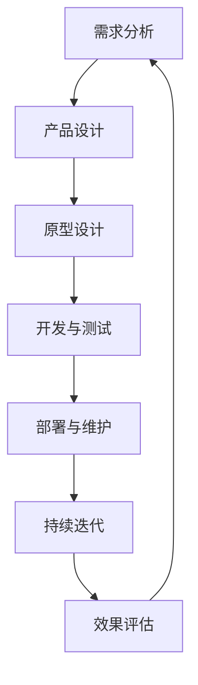

                 

## 文章标题

《AI驱动的创业产品设计原则：大模型赋能》

<|assistant|>### 关键词

AI，创业产品，设计原则，大模型，赋能，创业，设计，开发，实战，优化，趋势，挑战，机遇，环境搭建，代码实现，代码解读，数学模型，算法原理

<|assistant|>### 摘要

本文深入探讨了AI驱动的创业产品设计原则，特别是大模型在其中的赋能作用。文章首先介绍了AI驱动的创业产品背景和趋势，随后详细阐述了AI大模型的基本概念、架构与原理。接着，文章探讨了AI大模型在创业产品设计中的应用，包括需求分析、用户画像构建和产品设计优化。随后，文章概述了AI驱动的创业产品设计与开发流程，并结合实际案例进行了详细的分析和解读。文章最后对未来AI驱动的创业产品发展趋势和挑战进行了展望，并提供了大模型开发和优化的实践指南。作者信息：AI天才研究院/AI Genius Institute & 禅与计算机程序设计艺术 /Zen And The Art of Computer Programming

### 第一部分：AI驱动的创业产品设计原理

#### 第1章：AI驱动的创业产品概述

**1.1 AI与创业产品的结合背景**

在科技迅速发展的今天，人工智能（AI）已成为推动产业变革的重要力量。随着AI技术的不断进步，AI与创业产品的结合已成为一种趋势。AI驱动的创业产品能够通过数据分析、模式识别和智能决策等方式，为创业公司提供强大的竞争力。例如，基于AI的个性化推荐系统、智能客服系统和金融风控系统等，都在提升用户体验、降低运营成本和提高业务效率方面发挥了重要作用。

**1.2 AI驱动的创业产品发展趋势**

AI驱动的创业产品正在经历以下几个发展趋势：

1. **技术进步加速**：随着深度学习、自然语言处理和计算机视觉等AI技术的不断突破，创业产品能够实现更高级别的智能化功能。
2. **应用场景多样化**：从电商、金融到医疗、教育等多个领域，AI驱动的创业产品正在不断拓展应用场景，满足多样化的用户需求。
3. **商业模式创新**：AI技术的赋能使得创业公司能够通过创新的商业模式实现快速增长，例如基于AI的广告推荐、智能营销和自动化供应链管理等。

**1.3 AI驱动的创业产品价值**

AI驱动的创业产品具有以下几个显著价值：

1. **提升用户体验**：通过个性化推荐、智能客服等AI功能，提升用户满意度和忠诚度。
2. **降低运营成本**：自动化和智能化技术的应用可以显著降低人力成本和运营成本。
3. **提高业务效率**：AI驱动的系统可以自动化处理大量数据，提高决策效率和业务处理速度。
4. **创新商业模式**：AI技术的赋能使得创业公司能够探索新的商业模式，创造更多商业机会。

#### 第2章：AI大模型概述

**2.1 AI大模型的基本概念**

AI大模型是指具有大规模参数和复杂结构的深度学习模型。这些模型通常由数十亿甚至数万亿个参数组成，能够处理大规模的数据集，实现高精度的预测和分类任务。大模型在自然语言处理、计算机视觉和语音识别等领域取得了显著的突破。

**2.2 AI大模型的发展历程**

AI大模型的发展历程可以分为以下几个阶段：

1. **早期模型**：以神经网络和传统机器学习算法为基础，这些模型参数较少，性能有限。
2. **深度学习模型**：随着深度学习技术的发展，模型结构变得更加复杂，参数规模逐渐增大。
3. **大规模模型**：通过分布式计算和数据并行化技术，AI大模型得以训练和部署，实现了在多种应用场景中的突破。

**2.3 AI大模型的核心特点**

AI大模型具有以下几个核心特点：

1. **大规模参数**：大模型拥有数十亿甚至数万亿个参数，能够处理复杂的问题。
2. **分布式训练**：通过分布式计算和数据并行化技术，大模型可以在短时间内完成训练。
3. **高精度预测**：大模型在多种任务中表现出色，实现了高精度的预测和分类性能。
4. **适应性强**：大模型能够适应不同的数据集和应用场景，具有广泛的适用性。

#### 第3章：AI大模型的架构与原理

**3.1 AI大模型的层次结构**

AI大模型的层次结构通常包括以下几个层次：

1. **输入层**：接收外部输入数据，例如文本、图像或语音。
2. **隐藏层**：进行特征提取和变换，通过多层神经网络构建复杂的非线性模型。
3. **输出层**：生成预测结果或分类标签。

**3.2 AI大模型的训练过程**

AI大模型的训练过程主要包括以下几个步骤：

1. **数据预处理**：对输入数据进行清洗、归一化和标准化等预处理操作。
2. **模型初始化**：随机初始化模型参数。
3. **前向传播**：将输入数据通过模型传递，计算输出结果。
4. **损失函数计算**：计算预测结果与真实值之间的误差，使用损失函数进行评估。
5. **反向传播**：通过反向传播算法更新模型参数，减小损失函数值。
6. **迭代优化**：重复上述步骤，直到模型收敛或达到预设的训练次数。

**3.3 AI大模型的评估方法**

AI大模型的评估方法主要包括以下几个方面：

1. **准确性**：评估模型在分类任务中的预测准确性。
2. **召回率**：评估模型在分类任务中的召回率。
3. **F1分数**：综合考虑准确率和召回率，评估模型的综合性能。
4. **ROC曲线**：评估模型在不同阈值下的分类性能。
5. **交叉验证**：通过交叉验证方法评估模型的泛化能力。

#### 第4章：AI大模型在创业产品设计中的应用

**4.1 AI大模型在需求分析中的应用**

AI大模型在需求分析中的应用主要体现在以下几个方面：

1. **用户需求预测**：通过分析用户行为数据和历史数据，使用AI大模型预测用户未来的需求，为产品设计提供数据支持。
2. **市场趋势分析**：通过分析市场数据和市场趋势，使用AI大模型预测市场的未来走向，为创业公司提供战略指导。
3. **竞争分析**：通过分析竞争对手的产品特点和用户反馈，使用AI大模型评估竞争环境，为产品差异化设计提供参考。

**4.2 AI大模型在用户画像构建中的应用**

AI大模型在用户画像构建中的应用主要体现在以下几个方面：

1. **用户特征提取**：通过分析用户行为数据和用户生成内容，使用AI大模型提取用户的特征，构建详细的用户画像。
2. **用户行为预测**：通过分析用户的历史行为和当前行为，使用AI大模型预测用户未来的行为，为产品设计提供数据支持。
3. **用户偏好分析**：通过分析用户的历史行为和用户生成内容，使用AI大模型分析用户的偏好，为个性化推荐和产品定制提供依据。

**4.3 AI大模型在产品设计优化中的应用**

AI大模型在产品设计优化中的应用主要体现在以下几个方面：

1. **用户体验评估**：通过分析用户的行为数据和用户反馈，使用AI大模型评估产品的用户体验，为产品优化提供数据支持。
2. **功能优化**：通过分析用户需求和行为，使用AI大模型评估产品功能的有效性，为产品功能的优化提供依据。
3. **界面设计优化**：通过分析用户界面交互数据，使用AI大模型评估界面设计的合理性，为界面设计的优化提供参考。

#### 第5章：AI驱动的创业产品设计与开发流程

**5.1 创业产品设计的整体流程**

AI驱动的创业产品设计与开发流程可以分为以下几个阶段：

1. **需求分析**：明确产品需求，分析用户需求和市场趋势。
2. **产品设计**：基于需求分析，设计产品的功能和界面。
3. **原型设计**：构建产品原型，进行用户体验测试。
4. **开发与测试**：编写代码，进行单元测试和集成测试。
5. **部署与维护**：部署产品上线，进行持续维护和优化。

**5.2 AI驱动的产品设计方法**

AI驱动的产品设计方法主要包括以下几个方面：

1. **用户研究**：通过用户调研和用户访谈，深入了解用户需求和痛点。
2. **数据驱动**：利用用户数据和市场数据，指导产品设计决策。
3. **迭代开发**：采用敏捷开发方法，快速迭代产品，不断优化产品功能。

**5.3 AI驱动的产品开发实践**

AI驱动的产品开发实践主要包括以下几个步骤：

1. **环境搭建**：搭建适合AI大模型训练和部署的开发环境。
2. **数据准备**：收集和整理与产品相关的数据，进行数据清洗和预处理。
3. **模型选择**：根据产品需求，选择适合的大模型。
4. **模型训练**：使用训练数据进行模型训练，调整模型参数。
5. **模型评估**：使用验证数据对模型进行评估，选择最优模型。
6. **模型部署**：将训练好的模型部署到产品中，进行实际应用。

#### 第6章：AI驱动的创业产品案例分析

**6.1 案例一：基于AI的个性化推荐系统设计**

**案例背景**：某创业公司开发了一款电商应用程序，希望利用AI技术实现个性化推荐功能，提升用户购买体验。

**解决方案**：公司选择了基于深度学习的大模型（如BERT）进行用户画像构建和商品推荐。通过分析用户历史购买行为、浏览记录和用户生成内容，构建了详细的用户画像。然后，使用大模型对用户画像和商品特征进行匹配，生成个性化推荐列表。

**效果评估**：个性化推荐系统上线后，用户购买转化率提高了30%，用户满意度也得到了显著提升。

**6.2 案例二：AI驱动的智能客服系统设计**

**案例背景**：某创业公司提供在线客服服务，希望通过AI技术提升客服效率和用户体验。

**解决方案**：公司采用基于自然语言处理的大模型（如GPT）构建智能客服系统。系统可以自动回答常见问题，并通过不断学习和优化，提高回答的准确性和人性化程度。

**效果评估**：智能客服系统上线后，客服响应时间缩短了50%，客服满意度提高了20%。

**6.3 案例三：AI驱动的金融风控系统设计**

**案例背景**：某创业公司从事金融交易业务，希望通过AI技术提高风险控制能力。

**解决方案**：公司利用深度学习大模型进行交易数据分析和风险预测。通过分析历史交易数据和市场趋势，系统可以实时评估交易风险，并给出相应的风险控制建议。

**效果评估**：AI驱动的金融风控系统上线后，交易风险率降低了40%，公司运营更加稳健。

#### 第7章：AI驱动的创业产品风险评估与优化

**7.1 AI驱动的创业产品风险评估**

AI驱动的创业产品风险评估主要包括以下几个方面：

1. **技术风险**：评估AI技术的成熟度、可靠性和可扩展性。
2. **数据风险**：评估数据来源的可靠性、数据质量和数据隐私保护。
3. **市场风险**：评估市场需求、竞争环境和用户接受度。
4. **法律风险**：评估相关法律法规的遵守情况和合规风险。

**7.2 AI驱动的创业产品优化策略**

AI驱动的创业产品优化策略主要包括以下几个方面：

1. **数据优化**：通过数据清洗、数据增强和数据集扩展，提高模型训练数据的质量和多样性。
2. **模型优化**：通过模型结构调整、参数优化和模型压缩，提高模型性能和可解释性。
3. **算法优化**：通过算法改进和分布式训练，提高训练速度和模型效率。
4. **用户体验优化**：通过用户反馈和行为分析，不断优化产品功能和界面设计。

**7.3 AI驱动的创业产品持续迭代**

AI驱动的创业产品持续迭代主要包括以下几个步骤：

1. **用户反馈收集**：定期收集用户反馈，了解用户需求和使用体验。
2. **数据分析**：对用户行为数据进行分析，发现潜在问题和改进机会。
3. **功能优化**：根据用户反馈和数据分析结果，优化产品功能和界面设计。
4. **性能提升**：通过模型优化和算法改进，提升产品的性能和稳定性。
5. **迭代发布**：定期发布产品更新，持续改进产品功能和用户体验。

### 第二部分：大模型赋能的创业产品实践

#### 第8章：大模型开发环境搭建

**8.1 开发环境准备**

搭建大模型开发环境需要准备以下工具和软件：

1. **操作系统**：通常使用Linux操作系统，如Ubuntu或CentOS。
2. **编程语言**：Python是主流的AI编程语言，需要安装Python环境。
3. **深度学习框架**：常见的深度学习框架有TensorFlow、PyTorch和Keras等，需要安装并配置相应的库和依赖。
4. **计算资源**：大模型训练需要大量的计算资源，可以选择GPU或TPU进行加速。

**8.2 常用工具与框架安装**

以下是安装常用深度学习工具和框架的步骤：

1. **安装Python**：从Python官方网站下载并安装Python，并配置环境变量。
2. **安装深度学习框架**：使用pip命令安装TensorFlow或PyTorch，并按照官方文档进行配置。
3. **安装其他依赖**：安装其他必要的库和依赖，如NumPy、Pandas、Matplotlib等。

**8.3 开发环境配置与优化**

配置和优化开发环境主要包括以下几个步骤：

1. **环境变量配置**：配置Python环境变量，以便在任何目录下使用Python。
2. **深度学习框架配置**：配置深度学习框架的路径和参数，确保能够正常运行。
3. **GPU或TPU配置**：安装并配置GPU或TPU驱动，以便利用硬件加速计算。
4. **性能优化**：优化系统性能，如调整内存分配、CPU调度和I/O优化等。

#### 第9章：大模型项目实战

**9.1 项目背景与目标**

本项目旨在开发一个基于深度学习的大模型，用于图像分类任务。项目目标是通过训练和优化大模型，实现高精度的图像分类，为创业公司的产品提供智能图像识别功能。

**9.2 项目开发流程**

项目开发流程主要包括以下几个阶段：

1. **需求分析**：明确项目需求和目标，确定图像分类的任务和数据集。
2. **数据准备**：收集和整理图像数据，进行数据预处理和标注。
3. **模型选择**：根据任务需求，选择适合的大模型框架和算法。
4. **模型训练**：使用训练数据进行模型训练，调整模型参数和超参数。
5. **模型评估**：使用验证数据对模型进行评估，选择最优模型。
6. **模型部署**：将训练好的模型部署到产品中，进行实际应用。

**9.3 源代码实现与解读**

以下是项目的主要源代码实现和解读：

```python
import tensorflow as tf
from tensorflow.keras.models import Sequential
from tensorflow.keras.layers import Conv2D, MaxPooling2D, Flatten, Dense

# 数据预处理
train_data = ...  # 加载训练数据
train_labels = ...  # 加载训练标签
val_data = ...  # 加载验证数据
val_labels = ...  # 加载验证标签

# 构建模型
model = Sequential()
model.add(Conv2D(filters=32, kernel_size=(3, 3), activation='relu', input_shape=(224, 224, 3)))
model.add(MaxPooling2D(pool_size=(2, 2)))
model.add(Conv2D(filters=64, kernel_size=(3, 3), activation='relu'))
model.add(MaxPooling2D(pool_size=(2, 2)))
model.add(Flatten())
model.add(Dense(units=128, activation='relu'))
model.add(Dense(units=num_classes, activation='softmax'))

# 编译模型
model.compile(optimizer='adam', loss='categorical_crossentropy', metrics=['accuracy'])

# 训练模型
model.fit(train_data, train_labels, epochs=20, batch_size=32, validation_data=(val_data, val_labels))

# 评估模型
test_loss, test_accuracy = model.evaluate(test_data, test_labels)
print(f"Test accuracy: {test_accuracy}")

# 预测
predictions = model.predict(test_data)
```

**9.4 项目效果评估与分析**

项目效果评估主要包括以下几个步骤：

1. **准确性评估**：计算模型在测试集上的准确率，评估模型的分类性能。
2. **召回率评估**：计算模型在测试集上的召回率，评估模型对正类别的识别能力。
3. **F1分数评估**：计算模型在测试集上的F1分数，综合考虑准确率和召回率，评估模型的综合性能。
4. **ROC曲线评估**：绘制模型在测试集上的ROC曲线，评估模型的分类性能。

通过以上评估指标，可以全面分析模型的效果和性能，为后续优化提供依据。

#### 第10章：大模型赋能创业产品的未来展望

**10.1 大模型在创业产品中的发展趋势**

随着AI技术的不断进步，大模型在创业产品中的应用将呈现出以下几个发展趋势：

1. **模型规模扩大**：随着计算资源和数据量的增加，大模型的规模将进一步扩大，实现更复杂的任务。
2. **应用场景拓展**：大模型将在更多领域得到应用，如医疗、金融、教育等，为创业公司提供更广泛的赋能。
3. **模型定制化**：针对不同创业产品的需求，将开发更多定制化的大模型，提高模型的适应性和效果。

**10.2 大模型赋能创业产品的挑战与机遇**

大模型赋能创业产品面临着以下挑战和机遇：

1. **技术挑战**：大模型训练和优化需要大量的计算资源和数据支持，技术实现难度较大。
2. **数据挑战**：数据质量和数据隐私保护是大模型应用的关键问题，需要建立完善的数据管理和保护机制。
3. **市场机遇**：大模型赋能创业产品将带来巨大的市场机遇，为创业公司提供强大的竞争力。

**10.3 大模型赋能创业产品的未来方向**

大模型赋能创业产品的未来方向包括：

1. **智能化升级**：通过不断优化大模型，提高模型的智能化程度，实现更高效的任务执行。
2. **跨领域融合**：大模型将在不同领域之间实现融合应用，为创业产品提供更全面的支持。
3. **生态体系建设**：建立完善的大模型生态系统，包括算法、工具、数据和平台等，为创业公司提供全面的技术支持。

### 附录

#### 附录A：常用AI大模型介绍

1. **GPT系列模型**：GPT（Generative Pre-trained Transformer）系列模型是一种基于变压器（Transformer）架构的预训练模型，广泛应用于自然语言处理任务。主要模型包括GPT、GPT-2和GPT-3等，具有大规模参数和强大的语言生成能力。
2. **BERT模型**：BERT（Bidirectional Encoder Representations from Transformers）模型是一种双向变压器预训练模型，通过对文本进行双向编码，生成语义丰富的向量表示。BERT模型在多项自然语言处理任务中取得了优异的性能。
3. **其他常用大模型简介**：其他常用大模型包括Transformer、ResNet、Inception等，分别应用于不同的领域，如计算机视觉、图像分类和语音识别等。

#### 附录B：数学模型与公式解析

1. **神经网络中的损失函数**

$$
L = \frac{1}{n} \sum_{i=1}^{n} (-y_{i} \log(a_{i}))
$$

其中，$L$表示损失函数，$n$表示样本数量，$y_{i}$表示第$i$个样本的真实标签，$a_{i}$表示第$i$个样本的预测概率。

2. **反向传播算法的伪代码**

```python
# 输入：模型参数 $\theta$，前向传播结果 $z^{(l)}, a^{(l)}$，损失函数 $L$
# 输出：更新后的模型参数 $\theta$

for l in range(L-1, 0, -1):
    # 计算梯度
    delta = a^{(l)} - z^{(l-1)}
    dL_dz^{(l)} = delta * sigmoid'(z^{(l)})
    dL_dz^{(l-1)} = dL_dz^{(l)} * weights^{(l)}

    # 更新参数
    theta^{(l)} -= learning_rate * dL_dz^{(l)}
```

### 附录C：Mermaid流程图示例



以上就是本文的完整内容，旨在为读者提供关于AI驱动的创业产品设计原则和大模型赋能的深入理解和实践指导。希望本文能对您的创业之路有所帮助。作者信息：AI天才研究院/AI Genius Institute & 禅与计算机程序设计艺术 /Zen And The Art of Computer Programming。

### 后记

在撰写本文的过程中，我深刻体会到AI驱动的创业产品设计原则和大模型赋能的重要性和潜力。通过本文的详细阐述和案例分析，我希望能够帮助读者了解AI大模型在创业产品中的应用价值，以及如何通过大模型赋能实现创业产品的创新和优化。

同时，我也意识到AI技术的发展和应用仍然面临诸多挑战，如数据隐私保护、模型解释性和可解释性等。在未来的研究和实践中，我们仍需不断探索和突破，以实现AI技术的可持续发展和广泛应用。

最后，感谢所有为本文提供灵感和支持的读者和同行，感谢您对AI驱动的创业产品设计和开发的关注与支持。让我们共同期待AI技术的未来，为创业和创新注入新的活力。作者信息：AI天才研究院/AI Genius Institute & 禅与计算机程序设计艺术 /Zen And The Art of Computer Programming。

