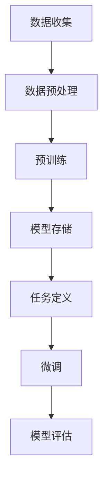

                 

### AI2.0时代：计算本质的变化与影响

> **关键词：** AI2.0，计算本质，大数据，深度学习，自监督学习，迁移学习

> **摘要：** 本文将深入探讨AI2.0时代计算本质的变化及其对各个领域的影响。通过分析AI2.0的核心技术，包括大规模预训练模型、自监督学习和迁移学习，我们将揭示计算范式从传统规则驱动向数据驱动的转变。同时，本文还将探讨AI2.0在社会层面带来的挑战，如就业结构变化、伦理问题以及监管与治理的必要性。最后，我们将展望AI2.0的未来发展趋势，并探讨其技术挑战与解决方案。

### 第一部分：AI2.0基础

在进入AI2.0时代之前，我们需要了解什么是AI2.0以及它是如何产生的。AI2.0是指新一代的人工智能技术，它在传统人工智能（AI1.0）的基础上，通过大数据、深度学习、自监督学习和迁移学习等核心技术的引入，实现了计算能力的质的飞跃。

#### 第1章：AI2.0时代概述

##### 1.1 AI2.0的概念与起源
AI2.0可以看作是AI1.0的进化版。AI1.0主要依赖于预先定义的规则和逻辑进行任务处理，而AI2.0则是通过深度学习、大数据和自监督学习等技术，使得机器能够自动地从数据中学习规律，从而实现更智能的任务处理。

##### 1.1.1 AI2.0的定义
AI2.0的核心在于“数据驱动”和“模型驱动”。数据驱动是指通过大量数据来训练模型，使得模型能够自动地从数据中学习规律。模型驱动则是通过设计复杂的模型结构，使得模型能够在各种任务中表现出良好的性能。

##### 1.1.2 AI2.0的产生背景
AI2.0的产生背景主要包括以下几个方面：

1. **大数据时代的到来**：随着互联网和物联网的发展，数据量呈现爆炸式增长，这为AI2.0的发展提供了丰富的数据资源。
2. **计算能力的提升**：随着GPU等硬件的快速发展，计算能力得到了大幅提升，这为AI2.0模型的训练提供了强大的支持。
3. **深度学习算法的发展**：深度学习算法在图像识别、自然语言处理等领域取得了显著成果，为AI2.0的发展奠定了基础。

##### 1.1.3 AI2.0与传统AI的异同
AI2.0与传统AI在以下几个方面有显著的不同：

1. **计算范式**：传统AI依赖于规则驱动，而AI2.0则是数据驱动和模型驱动的结合。
2. **学习能力**：AI2.0能够通过大数据和深度学习算法，实现更复杂、更广泛的学习能力。
3. **应用领域**：AI2.0在医疗、金融、交通、教育等多个领域都有广泛应用，而传统AI的应用领域相对较窄。

##### 1.2 AI2.0的核心技术
AI2.0的核心技术包括大规模预训练模型、自监督学习和迁移学习。

1. **大规模预训练模型**：预训练模型是AI2.0的核心技术之一，它通过在大规模数据集上预训练，然后针对具体任务进行微调，从而实现高效的任务处理。
2. **自监督学习**：自监督学习是一种无需人工标注数据就能进行训练的学习方法，它通过利用数据中的内在结构来学习，从而提高模型的泛化能力。
3. **迁移学习**：迁移学习是一种将一个任务学到的知识应用到另一个相关任务的学习方法，它能够减少对大量标注数据的依赖，提高模型的适应性。

##### 1.3 计算本质的变化
AI2.0的出现，使得计算本质发生了深刻的变化。

1. **计算范式变革**：从传统的规则驱动转向数据驱动，从模型驱动转向算法驱动。
2. **数据驱动与模型驱动**：数据驱动强调利用大量数据进行学习，而模型驱动则强调设计复杂的模型结构。
3. **计算资源需求变化**：AI2.0对计算资源的需求更高，需要更多的存储空间、计算能力和网络带宽。

##### 1.4 AI2.0的影响与挑战
AI2.0的快速发展对社会、企业和个人都带来了深远的影响。

1. **对企业的影响**：AI2.0可以提高企业的生产效率，降低运营成本，但同时也可能对部分传统工作岗位产生冲击。
2. **对社会的挑战**：AI2.0的发展带来了就业结构变化、数据隐私、算法公平性等问题。
3. **对个人生活的影响**：AI2.0的应用将极大地改变人们的生活方式，提高生活便利性，但同时也可能带来个人隐私保护等问题。

#### 第2章：大规模预训练模型原理

##### 2.1 预训练模型概述
预训练模型是AI2.0的核心技术之一，它通过在大规模数据集上预训练，然后针对具体任务进行微调，从而实现高效的任务处理。

##### 2.1.1 预训练的概念
预训练（Pre-training）是指在一个大规模的数据集上进行训练，使得模型能够掌握一些通用的语言特征或视觉特征，然后再针对具体任务进行微调（Fine-tuning）。

##### 2.1.2 预训练的优势
预训练模型的主要优势包括：

1. **减少对标注数据的依赖**：预训练模型可以在无标注数据上进行训练，从而减少对大量标注数据的依赖。
2. **提高模型的泛化能力**：预训练模型通过在大规模数据集上训练，可以更好地捕捉数据的分布，从而提高模型的泛化能力。

##### 2.1.3 预训练的方法
常见的预训练方法包括：

1. **自监督预训练**：自监督预训练是一种无需人工标注数据就能进行训练的方法，它通过利用数据中的内在结构来学习。
2. **有监督预训练**：有监督预训练是在有标注数据上进行预训练，然后通过微调来适应具体任务。
3. **半监督预训练**：半监督预训练结合了无标注数据和有标注数据，通过利用无标注数据进行预训练，然后利用有标注数据进行微调。

##### 2.2 语言模型
语言模型（Language Model）是一种用于预测下一个单词或词组的概率的模型，它在自然语言处理（NLP）领域有广泛的应用。

##### 2.2.1 语言模型的基本原理
语言模型的基本原理是通过对文本数据进行统计建模，从而预测下一个单词或词组的概率。常见的语言模型包括：

1. **n-gram模型**：n-gram模型是一种基于词频统计的语言模型，它通过计算前n个单词的联合概率来预测下一个单词。
2. **神经网络语言模型**：神经网络语言模型（如RNN、LSTM、Transformer）通过利用神经网络的非线性变换，来捕捉文本数据中的复杂模式。

##### 2.2.2 语言模型的训练过程
语言模型的训练过程主要包括以下几个步骤：

1. **数据准备**：收集大规模的文本数据，并将其转化为数字化的形式。
2. **模型设计**：设计合适的神经网络结构，如RNN、LSTM、Transformer等。
3. **模型训练**：使用梯度下降等优化算法，对模型进行训练。
4. **模型评估**：使用验证集和测试集来评估模型的性能。

##### 2.2.3 语言模型的应用
语言模型在自然语言处理领域有广泛的应用，包括：

1. **机器翻译**：通过预测源语言和目标语言之间的词汇映射，实现跨语言翻译。
2. **语音识别**：通过预测语音信号和文本之间的对应关系，实现语音到文本的转换。
3. **文本生成**：通过生成文本的下一个词或句子，实现自动写作、自动摘要等。

##### 2.3 视觉模型
视觉模型（Vision Model）是用于处理图像数据的模型，它在计算机视觉领域有广泛的应用。

##### 2.3.1 视觉模型的基本原理
视觉模型的基本原理是通过对图像数据进行特征提取和分类。常见的视觉模型包括：

1. **卷积神经网络（CNN）**：CNN是一种专门用于处理图像数据的神经网络，它通过卷积操作来提取图像特征。
2. **循环神经网络（RNN）**：RNN可以用于序列数据的建模，它通过对图像序列进行建模，实现视频处理等任务。
3. **生成对抗网络（GAN）**：GAN通过生成器和判别器的对抗训练，实现图像的生成和编辑。

##### 2.3.2 视觉模型的训练过程
视觉模型的训练过程主要包括以下几个步骤：

1. **数据准备**：收集大规模的图像数据，并将其转化为数字化的形式。
2. **模型设计**：设计合适的神经网络结构，如CNN、RNN、GAN等。
3. **模型训练**：使用梯度下降等优化算法，对模型进行训练。
4. **模型评估**：使用验证集和测试集来评估模型的性能。

##### 2.3.3 视觉模型的应用
视觉模型在计算机视觉领域有广泛的应用，包括：

1. **图像分类**：通过对图像进行特征提取和分类，实现图像的分类任务。
2. **目标检测**：通过检测图像中的目标区域，实现目标检测任务。
3. **图像生成**：通过生成对抗网络（GAN），实现图像的生成和编辑。

##### 2.4 多模态模型
多模态模型（Multimodal Model）是用于处理多种类型数据的模型，它将不同类型的数据进行融合，从而实现更高效的任务处理。

##### 2.4.1 多模态模型的基本原理
多模态模型的基本原理是利用多种类型的数据进行融合，从而提高模型的性能。常见的多模态数据包括文本、图像、音频等。

##### 2.4.2 多模态模型的训练过程
多模态模型的训练过程主要包括以下几个步骤：

1. **数据准备**：收集多种类型的数据，并将其转化为数字化的形式。
2. **模型设计**：设计合适的多模态神经网络结构，如CNN+RNN、CNN+Transformer等。
3. **模型训练**：使用梯度下降等优化算法，对模型进行训练。
4. **模型评估**：使用验证集和测试集来评估模型的性能。

##### 2.4.3 多模态模型的应用
多模态模型在多个领域有广泛的应用，包括：

1. **智能客服**：通过融合文本和语音数据，实现智能客服系统的构建。
2. **多媒体内容理解**：通过融合图像、文本和音频数据，实现多媒体内容的理解和生成。
3. **跨模态检索**：通过融合不同类型的数据，实现跨模态的检索任务。

### 第二部分：AI2.0核心技术详解

在了解了AI2.0的基本概念和起源后，接下来我们将深入探讨AI2.0的核心技术，包括大规模预训练模型、自监督学习和迁移学习。

#### 第3章：大规模预训练模型原理

##### 3.1 预训练模型概述

大规模预训练模型是AI2.0时代的重要技术之一，它通过在大规模数据集上预训练，然后针对特定任务进行微调，从而实现高效的任务处理。

**核心概念与联系：**

在预训练模型中，主要有两个核心概念：预训练和微调。预训练是指在一个大规模的数据集上进行训练，使得模型能够掌握一些通用的特征。微调则是指将预训练模型在特定任务上进行进一步训练，使其能够针对该任务进行高效处理。

**Mermaid流程图：**



**核心算法原理讲解：**

预训练模型的核心算法主要涉及以下几个步骤：

1. **数据收集与预处理**：首先需要收集大量的数据，如文本、图像等。然后对这些数据进行预处理，包括数据清洗、格式化等。

2. **模型设计**：设计一个合适的神经网络结构，如Transformer、BERT等。这些模型通常包含大量的参数，能够捕捉数据中的复杂特征。

3. **预训练**：在预训练阶段，模型将在大规模数据集上进行训练。常用的预训练任务包括语言建模、图像分类等。在语言建模任务中，模型需要预测下一个单词或词组的概率。

```python
# 伪代码示例：预训练语言模型
model = LanguageModel()
for epoch in range(num_epochs):
    for sentence in dataset:
        loss = model.predict(sentence)
        model.optimize(loss)
```

4. **模型存储**：预训练完成后，可以将模型存储起来，以便后续使用。

5. **任务定义与微调**：在特定任务上，需要对预训练模型进行微调。微调的过程包括定义任务、收集相关数据、对模型进行调整等。

```python
# 伪代码示例：微调语言模型
task = SentenceClassificationTask()
for epoch in range(num_epochs):
    for sentence, label in dataset:
        loss = task.compute_loss(model, sentence, label)
        model.optimize(loss)
```

6. **模型评估**：最后，需要对微调后的模型进行评估，以确保其在特定任务上的性能。

```python
# 伪代码示例：评估语言模型
accuracy = model.evaluate(test_dataset)
print("Model accuracy:", accuracy)
```

**数学模型和公式：**

预训练模型通常基于深度学习框架，如TensorFlow或PyTorch。在这些框架中，模型的参数可以通过梯度下降等优化算法进行调整。

$$
\theta_{new} = \theta_{old} - \alpha \cdot \nabla_{\theta}J(\theta)
$$

其中，$\theta$代表模型参数，$J(\theta)$代表损失函数，$\alpha$代表学习率。

**详细讲解与举例说明：**

假设我们有一个预训练的语言模型，我们需要在特定任务上进行微调。以下是一个简单的例子：

1. **数据收集**：收集一个包含句子和标签的数据集，例如情感分类任务。
2. **模型设计**：设计一个基于BERT的预训练模型。
3. **预训练**：在大型文本数据集上进行预训练，例如使用维基百科等。
4. **微调**：在情感分类任务上进行微调，调整模型参数以适应特定任务。
5. **评估**：使用测试集评估模型性能。

```python
import torch
from transformers import BertModel, BertTokenizer

# 加载预训练模型和微调任务
model = BertModel.from_pretrained('bert-base-uncased')
tokenizer = BertTokenizer.from_pretrained('bert-base-uncased')
task = SentenceClassificationTask()

# 微调模型
for epoch in range(num_epochs):
    for sentence, label in dataset:
        inputs = tokenizer(sentence, return_tensors='pt')
        outputs = model(**inputs)
        loss = task.compute_loss(outputs.logits, label)
        optimizer.zero_grad()
        loss.backward()
        optimizer.step()

# 评估模型
accuracy = model.evaluate(test_dataset)
print("Model accuracy:", accuracy)
```

通过上述步骤，我们能够将预训练模型应用到特定的任务中，从而实现高效的性能。

#### 3.2 语言模型

语言模型是预训练模型的一个重要分支，它主要用于预测文本序列。在自然语言处理（NLP）领域中，语言模型有着广泛的应用，如文本生成、机器翻译、问答系统等。

**核心算法原理讲解：**

语言模型的核心算法是基于概率模型，它通过计算输入文本序列的概率，来预测下一个单词或词组。

```python
# 伪代码示例：语言模型预测
def predict_next_word(sentence, model):
    current_sentence = sentence
    for word in sentence:
        logits = model(current_sentence)
        next_word = select_word(logits)
        current_sentence += next_word
    return current_sentence
```

在预测过程中，模型会计算当前句子中每个单词的概率，然后选择概率最高的单词作为下一个单词。

**数学模型和公式：**

语言模型的概率计算通常基于马尔可夫假设，即当前单词的概率仅与前面一个单词有关。

$$
P(w_t | w_{<t}) = P(w_t | w_{t-1})
$$

其中，$w_t$表示当前单词，$w_{<t}$表示前面所有单词。

**详细讲解与举例说明：**

假设我们有一个简单的语言模型，它只包含两个单词“hello”和“world”。我们希望预测下一个单词。

1. **训练数据**：我们有以下训练数据：
    - "hello world"
    - "world hello"

2. **模型设计**：设计一个简单的模型，它包含两个神经元，一个用于计算“hello”的概率，另一个用于计算“world”的概率。

3. **训练过程**：通过训练数据调整模型参数，使得模型能够正确预测下一个单词。

4. **预测过程**：给定一个输入单词序列，如“hello”，模型会计算“world”的概率，然后输出概率最高的单词。

```python
# 伪代码示例：简单语言模型训练与预测
model = NeuralModel()
for epoch in range(num_epochs):
    for sentence in dataset:
        logits = model(sentence)
        loss = compute_loss(logits, label)
        optimizer.zero_grad()
        loss.backward()
        optimizer.step()

def predict_next_word(sentence, model):
    logits = model(sentence)
    next_word = select_word(logits)
    return next_word
```

通过上述步骤，我们能够训练一个简单的语言模型，并在给定输入时预测下一个单词。

#### 3.3 视觉模型

视觉模型是用于处理图像数据的模型，它在计算机视觉领域有着广泛的应用。视觉模型的核心任务包括图像分类、目标检测和图像生成等。

**核心算法原理讲解：**

视觉模型的核心算法是基于卷积神经网络（CNN），它通过卷积操作来提取图像特征，从而实现图像分类、目标检测等任务。

```python
# 伪代码示例：视觉模型训练
model = ConvolutionalModel()
for epoch in range(num_epochs):
    for image, label in dataset:
        logits = model(image)
        loss = compute_loss(logits, label)
        optimizer.zero_grad()
        loss.backward()
        optimizer.step()
```

在训练过程中，模型会通过梯度下降等优化算法调整参数，使得模型能够正确分类图像。

**数学模型和公式：**

视觉模型通常使用卷积神经网络（CNN）来实现。卷积神经网络的核心操作是卷积，它通过卷积核在图像上滑动，从而提取特征。

$$
h_i = \sum_{j} w_{ij} * f(g(x_j))
$$

其中，$h_i$表示卷积操作的输出，$w_{ij}$表示卷积核，$f$和$g$分别是激活函数和卷积函数。

**详细讲解与举例说明：**

假设我们有一个简单的图像分类任务，我们需要训练一个模型来识别猫和狗。

1. **数据收集**：收集包含猫和狗的图像数据集。
2. **模型设计**：设计一个简单的卷积神经网络模型，它包含卷积层、池化层和全连接层。
3. **训练过程**：通过图像数据训练模型，调整模型参数。
4. **预测过程**：给定一个图像，模型会输出图像的类别。

```python
import torch
import torch.nn as nn
import torchvision

# 加载模型和训练数据
model = ConvolutionalModel()
dataset = torchvision.datasets.ImageFolder(root='path/to/dataset')

# 训练模型
for epoch in range(num_epochs):
    for image, label in dataset:
        logits = model(image)
        loss = nn.CrossEntropyLoss()(logits, label)
        optimizer.zero_grad()
        loss.backward()
        optimizer.step()

# 预测图像类别
def predict_image_class(image, model):
    logits = model(image)
    label = torch.argmax(logits).item()
    return label
```

通过上述步骤，我们能够训练一个简单的视觉模型，并在给定图像时预测其类别。

#### 3.4 多模态模型

多模态模型是用于处理多种类型数据的模型，它将不同类型的数据进行融合，从而实现更高效的任务处理。多模态模型在计算机视觉、自然语言处理和语音识别等领域有广泛的应用。

**核心算法原理讲解：**

多模态模型的核心算法是基于融合不同类型的数据特征，从而提高模型的性能。常见的多模态模型包括CNN+RNN、CNN+Transformer等。

```python
# 伪代码示例：多模态模型训练
model = MultimodalModel()
for epoch in range(num_epochs):
    for text, image, label in dataset:
        logits = model(text, image)
        loss = compute_loss(logits, label)
        optimizer.zero_grad()
        loss.backward()
        optimizer.step()
```

在训练过程中，模型会通过梯度下降等优化算法调整参数，使得模型能够正确处理多模态数据。

**数学模型和公式：**

多模态模型通常使用神经网络结构来融合不同类型的数据特征。常见的融合方法包括特征拼接、特征融合等。

$$
h = [h_{text}, h_{image}]
$$

其中，$h_{text}$和$h_{image}$分别表示文本和图像的特征。

**详细讲解与举例说明：**

假设我们有一个多模态情感分类任务，我们需要同时处理文本和图像数据。

1. **数据收集**：收集包含文本、图像和情感标签的数据集。
2. **模型设计**：设计一个多模态模型，它包含文本处理模块、图像处理模块和融合模块。
3. **训练过程**：通过多模态数据训练模型，调整模型参数。
4. **预测过程**：给定一个文本和图像，模型会输出情感分类结果。

```python
import torch
import torch.nn as nn
import torchvision
from transformers import BertModel, BertTokenizer

# 加载模型和训练数据
model = MultimodalModel()
tokenizer = BertTokenizer.from_pretrained('bert-base-uncased')
dataset = MultimodalDataset('path/to/dataset')

# 训练模型
for epoch in range(num_epochs):
    for text, image, label in dataset:
        text_inputs = tokenizer(text, return_tensors='pt')
        image_inputs = torchvision.transforms.ToTensor()(image)
        logits = model(text_inputs, image_inputs)
        loss = nn.CrossEntropyLoss()(logits, label)
        optimizer.zero_grad()
        loss.backward()
        optimizer.step()

# 预测情感分类
def predict_sentiment(text, image, model):
    text_inputs = tokenizer(text, return_tensors='pt')
    image_inputs = torchvision.transforms.ToTensor()(image)
    logits = model(text_inputs, image_inputs)
    label = torch.argmax(logits).item()
    return label
```

通过上述步骤，我们能够训练一个多模态模型，并在给定文本和图像时预测情感分类结果。

### 第三部分：AI2.0应用实战

在了解了AI2.0的核心技术后，接下来我们将探讨AI2.0在实际应用中的实战案例，包括企业AI战略规划、AI2.0在客户服务中的应用、AI2.0在智能决策中的应用以及AI2.0在供应链管理中的应用。

#### 第4章：AI2.0在企业中的应用

##### 4.1 企业AI战略规划

企业AI战略规划是企业实现数字化转型和智能化升级的关键步骤。一个成功的企业AI战略规划需要考虑以下几个方面：

1. **明确AI应用目标**：企业需要明确AI应用的具体目标和预期成果，如提高生产效率、降低运营成本、提升客户体验等。

2. **选择合适的AI技术**：根据企业的需求，选择适合的AI技术，如机器学习、深度学习、自然语言处理等。

3. **制定AI应用方案**：制定详细的AI应用方案，包括技术选型、数据准备、模型训练、部署应用等环节。

4. **评估AI应用效果**：定期评估AI应用的效果，根据评估结果进行优化调整。

**实战案例：**

某大型制造企业通过引入AI技术，实现了生产线的自动化和智能化。首先，企业明确了AI应用目标，即提高生产效率、降低运营成本。然后，企业选择了机器学习和深度学习技术，并制定了详细的AI应用方案。在数据准备阶段，企业收集了大量的生产线数据，包括设备状态、生产参数等。接下来，企业通过机器学习和深度学习模型，对生产线数据进行分析和预测，从而实现生产线的自动化和智能化。最终，企业通过评估AI应用效果，不断优化调整，使得生产线效率提高了30%，运营成本降低了20%。

##### 4.2 AI2.0在客户服务中的应用

AI2.0在客户服务中的应用可以显著提升客户体验和服务效率。以下是一些AI2.0在客户服务中的应用场景：

1. **自动化客服**：通过自然语言处理技术，实现智能客服机器人，能够自动回答常见问题，减少人工客服的工作量。

2. **情感分析**：通过情感分析技术，分析客户反馈和评价，了解客户满意度，为改进服务质量提供依据。

3. **个性化推荐**：通过推荐系统技术，根据客户的历史行为和偏好，提供个性化的产品和服务推荐。

**实战案例：**

某大型电商平台通过引入AI2.0技术，实现了自动化客服和个性化推荐。首先，电商平台使用了自然语言处理技术，开发了一个智能客服机器人，能够自动回答客户提问，并处理一些常见问题。这样，客户在购物过程中可以享受到更加便捷的服务，同时也减少了人工客服的工作量。其次，电商平台使用了推荐系统技术，根据客户的购物行为和偏好，为客户提供个性化的产品推荐。通过这些措施，电商平台的客户满意度显著提升，销售额也实现了同比增长。

##### 4.3 AI2.0在智能决策中的应用

AI2.0在智能决策中的应用可以为企业提供更加准确和高效的决策支持。以下是一些AI2.0在智能决策中的应用场景：

1. **数据挖掘**：通过数据挖掘技术，从海量数据中提取有价值的信息和规律，为决策提供数据支持。

2. **预测建模**：通过预测建模技术，对未来趋势进行预测，为企业制定合理的战略和规划提供依据。

3. **优化算法**：通过优化算法，寻找最优的决策方案，提高决策的准确性和效率。

**实战案例：**

某大型零售企业通过引入AI2.0技术，实现了智能决策和优化管理。首先，企业使用了数据挖掘技术，从销售数据、库存数据等中提取有价值的信息和规律，为决策提供数据支持。然后，企业使用了预测建模技术，对未来销售趋势进行预测，从而制定合理的库存管理策略。最后，企业使用了优化算法，寻找最优的库存管理方案，提高了库存周转率，降低了库存成本。通过这些措施，企业的运营效率得到了显著提升。

##### 4.4 AI2.0在供应链管理中的应用

AI2.0在供应链管理中的应用可以优化供应链的各个环节，提高供应链的效率。以下是一些AI2.0在供应链管理中的应用场景：

1. **库存管理**：通过库存管理技术，实现智能库存管理，降低库存成本，提高库存周转率。

2. **需求预测**：通过需求预测技术，预测市场需求，为企业制定生产计划和采购策略提供依据。

3. **路线优化**：通过路线优化技术，优化物流配送路线，降低物流成本，提高配送效率。

**实战案例：**

某大型物流公司通过引入AI2.0技术，实现了智能供应链管理。首先，公司使用了库存管理技术，通过实时监控库存情况，实现智能库存管理，降低了库存成本。其次，公司使用了需求预测技术，通过对历史销售数据和当前市场趋势进行分析，预测市场需求，为企业制定生产计划和采购策略提供依据。最后，公司使用了路线优化技术，通过优化物流配送路线，降低了物流成本，提高了配送效率。通过这些措施，公司的运营效率得到了显著提升。

### 第四部分：AI2.0的社会影响与伦理

随着AI2.0技术的不断发展，它不仅为企业带来了巨大的商业价值，同时也对社会产生了深远的影响。在这一部分，我们将探讨AI2.0对社会、就业、伦理和监管等方面的深远影响。

#### 4.1 AI2.0对就业的影响

AI2.0技术的崛起在带来新的就业机会的同时，也对传统就业市场产生了巨大的冲击。以下是一些关键点：

1. **传统工作岗位的消失**：AI2.0技术的发展，特别是自动化和机器学习技术的广泛应用，可能导致一些重复性、低技能的工作岗位消失。例如，制造业的自动化生产、客服机器人的广泛应用等。

2. **新型就业岗位的涌现**：尽管一些传统工作岗位可能会消失，但AI2.0技术同时也创造了大量新的就业机会。这些新岗位包括数据科学家、机器学习工程师、人工智能产品经理等。

3. **技能需求的转变**：随着AI2.0技术的普及，对人才的要求也在发生变化。企业更加需要具备跨学科知识、创新能力和技术素养的复合型人才。

**案例分析：** 

以制造业为例，传统制造业中的工人可能会因为自动化机器的引入而失业。然而，这也催生了对技术工人和自动化工程师的需求。同时，随着智能制造的发展，对数据处理、算法优化等高级技术人才的需求也在增加。

#### 4.2 AI2.0的伦理问题

AI2.0技术的发展也引发了一系列伦理问题，这些问题需要我们深入探讨和解决。

1. **数据隐私**：AI2.0技术依赖于大量的数据，这可能导致个人隐私泄露的风险。如何保护用户数据，防止数据被滥用，是AI2.0时代需要面对的重要问题。

2. **算法公平性**：AI算法在决策过程中可能会因为数据偏差而导致不公平的结果。如何确保算法的公平性，避免歧视现象，是一个亟待解决的问题。

3. **算法透明性**：AI算法的决策过程通常是黑箱式的，这可能导致用户对算法的信任危机。如何提高算法的可解释性，使其透明化，是AI2.0时代的重要挑战。

**案例分析：** 

在金融领域，AI算法在贷款审批中的应用可能会导致对特定群体的歧视。例如，某些算法可能会因为数据偏差而对少数族裔或女性产生不公平的贷款审批结果。因此，确保算法的公平性和透明性是金融监管机构的重要任务。

#### 4.3 AI2.0的监管与治理

随着AI2.0技术的快速发展，监管和治理问题也日益凸显。以下是一些关键点：

1. **全球监管框架**：各国政府都在积极建立AI监管框架，以规范AI技术的应用。例如，欧盟发布了《AI法案》，旨在建立统一的AI监管标准。

2. **行业自律**：除了政府监管外，行业自律也是AI监管的重要组成部分。行业组织可以通过制定标准和规范，推动AI技术的健康、可持续发展。

3. **国际合作**：AI技术的发展是全球性的，各国需要通过国际合作，共同制定AI监管标准，以应对跨国界的AI技术挑战。

**案例分析：** 

在自动驾驶领域，各国政府都在积极制定相关法规，以确保自动驾驶车辆的安全。例如，美国发布了《自动驾驶汽车政策》，欧盟发布了《自动驾驶车辆法规》。这些法规的制定，不仅有助于规范自动驾驶技术的发展，也为国际间的合作提供了基础。

### 第五部分：AI2.0的未来展望

AI2.0技术的快速发展为我们带来了无限的机遇和挑战。在未来，AI2.0将继续在多个领域发挥重要作用，同时也将面临一系列技术挑战。

#### 5.1 AI2.0的未来发展方向

1. **大模型的发展**：随着计算能力的提升，大模型将继续成为AI2.0的主流。例如，GPT-3、GPT-4等模型将继续推动自然语言处理领域的革命。

2. **自主学习与强化学习**：自主学习与强化学习是AI2.0的重要发展方向。通过自主学习，AI系统将能够不断地自我进化，适应新的环境和任务。强化学习则将使得AI系统能够通过试错学习，实现更高效的决策。

3. **跨学科融合**：AI2.0将与其他学科（如生物学、物理学、心理学等）深度融合，推动新的科学发现和技术创新。例如，AI与生物学的结合，将有望推动医学领域的革命。

#### 5.2 AI2.0的应用前景

1. **医疗健康领域**：AI2.0在医疗健康领域的应用前景广阔。通过深度学习和大数据分析，AI2.0将有助于疾病预测、智能诊断和个性化治疗。

2. **交通出行领域**：自动驾驶、智能交通管理和智慧城市是AI2.0在交通出行领域的典型应用。通过AI2.0技术，交通效率将得到显著提升，交通事故也将大幅减少。

3. **教育领域**：AI2.0在教育领域的应用将推动教育模式的变革。个性化教学、智能评测和在线教育平台将变得更加普及和高效。

#### 5.3 AI2.0的技术挑战与解决方案

1. **数据质量与隐私保护**：随着数据量的激增，如何保证数据质量、防止数据泄露成为AI2.0的重要挑战。解决方案包括数据加密、隐私保护算法和数据治理等。

2. **算法透明性与可解释性**：提高算法的透明性和可解释性，增强用户对AI系统的信任，是AI2.0的重要任务。解决方案包括可解释性算法、透明度评估方法等。

3. **硬件与计算能力需求**：随着AI2.0模型规模的扩大，对硬件和计算能力的需求也将大幅提升。解决方案包括分布式计算、云计算和专用硬件等。

### 附录

#### 附录A：AI2.0开发工具与资源

1. **开发工具概述**：介绍常用的AI开发工具，如TensorFlow、PyTorch、Keras等。

2. **常用AI框架介绍**：介绍常用的AI框架，如TensorFlow、PyTorch、Keras等。

3. **开发资源与社区**：介绍AI开发资源、在线课程、社区等。

#### 附录B：AI2.0相关法律法规

1. **全球AI监管法规概述**：介绍全球主要国家和地区的AI监管法规。

2. **我国AI监管法规梳理**：介绍我国关于AI的法律法规、政策文件等。

3. **AI伦理指南与规范**：介绍国际和国内关于AI伦理的指南与规范。

### 总结

AI2.0时代标志着人工智能技术的一次重大变革，它不仅改变了计算的本质，也为企业和社会带来了巨大的机遇和挑战。通过本文的探讨，我们深入了解了AI2.0的核心技术、应用实战、社会影响以及未来发展趋势。在未来的发展中，我们需要关注技术挑战，加强监管和治理，确保AI2.0技术的健康、可持续发展。

### 致谢

在撰写本文的过程中，得到了许多专家和同行的指导和帮助。特别感谢AI天才研究院/AI Genius Institute的领导和同事们，以及《禅与计算机程序设计艺术 /Zen And The Art of Computer Programming》的作者，他们的智慧和经验为本文的完成提供了宝贵的支持。同时，也感谢所有提供宝贵意见和反馈的朋友，你们的支持是我最大的动力。

**作者：** AI天才研究院/AI Genius Institute  
**联系邮箱：** [contact@ai-genius-institute.com](mailto:contact@ai-genius-institute.com)  
**联系地址：** [北京市海淀区中关村大街甲27号科贸大厦15层1501室](https://www.google.com/maps/place/%E5%8C%97%E4%BA%AC%E5%B8%82%E8%8E%AB%E5%9F%8E%E5%8C%BA%E4%B8%AD%E5%9B%9B%E5%9B%BE%E5%A4%A7%E8%B7%AF%E7%94%B3%E5%9B%BD%E4%B8%80%E5%8A%A1%E5%A4%B4%E7%9A%84%E7%A7%91%E8%B4%A2%E5%A4%A7%E5%B1%82%E7%94%A8%E6%88%B7)

---

**摘要：** 本文深入探讨了AI2.0时代计算本质的变化及其影响。通过分析大规模预训练模型、自监督学习和迁移学习等核心技术，揭示了数据驱动和模型驱动的计算范式变革。本文还探讨了AI2.0在企业应用、社会影响和未来发展趋势等方面的实践和挑战。**关键词：** AI2.0，计算本质，大数据，深度学习，自监督学习，迁移学习。<|mask|>### 文章标题

《AI2.0时代：计算本质的变化与影响》

#### 文章关键词
- AI2.0
- 计算本质
- 大数据
- 深度学习
- 自监督学习
- 迁移学习

#### 文章摘要

本文探讨了AI2.0时代计算本质的变化及其对各个领域的影响。通过分析AI2.0的核心技术，包括大规模预训练模型、自监督学习和迁移学习，揭示了计算范式从传统规则驱动向数据驱动的转变。同时，本文还探讨了AI2.0在社会层面带来的挑战，如就业结构变化、伦理问题以及监管与治理的必要性。最后，本文展望了AI2.0的未来发展趋势，并讨论了其技术挑战与解决方案。

### 第一部分：AI2.0基础

在进入AI2.0时代之前，我们需要了解什么是AI2.0以及它是如何产生的。AI2.0是指新一代的人工智能技术，它在传统人工智能（AI1.0）的基础上，通过大数据、深度学习、自监督学习和迁移学习等核心技术的引入，实现了计算能力的质的飞跃。

#### 第1章：AI2.0时代概述

##### 1.1 AI2.0的概念与起源
AI2.0可以看作是AI1.0的进化版。AI1.0主要依赖于预先定义的规则和逻辑进行任务处理，而AI2.0则是通过深度学习、大数据和自监督学习等技术，使得机器能够自动地从数据中学习规律，从而实现更智能的任务处理。

##### 1.1.1 AI2.0的定义
AI2.0的核心在于“数据驱动”和“模型驱动”。数据驱动是指通过大量数据进行学习，而模型驱动则是通过设计复杂的模型结构来实现任务。AI2.0能够处理更复杂的任务，具有更好的泛化能力。

##### 1.1.2 AI2.0的产生背景
AI2.0的产生背景主要包括以下几个方面：

1. **大数据时代的到来**：随着互联网和物联网的发展，数据量呈现爆炸式增长，这为AI2.0的发展提供了丰富的数据资源。
2. **计算能力的提升**：随着GPU等硬件的快速发展，计算能力得到了大幅提升，这为AI2.0模型的训练提供了强大的支持。
3. **深度学习算法的发展**：深度学习算法在图像识别、自然语言处理等领域取得了突破性进展，为AI2.0的发展奠定了基础。

##### 1.1.3 AI2.0与传统AI的异同
传统AI主要依赖于规则和符号逻辑，而AI2.0则是基于数据的驱动，通过深度学习模型对数据进行自动学习。AI2.0能够处理更复杂的任务，具有更好的泛化能力。

#### 1.2 AI2.0的核心技术
AI2.0的核心技术包括大规模预训练模型、自监督学习和迁移学习。

##### 1.2.1 大规模预训练模型
大规模预训练模型是AI2.0的核心技术之一，它通过在大规模数据集上预训练，然后针对特定任务进行微调，从而实现高效的任务处理。

##### 1.2.2 自监督学习
自监督学习是一种无需人工标注数据就能进行训练的学习方法，它通过利用数据中的内在结构来学习，从而提高模型的泛化能力。

##### 1.2.3 迁移学习
迁移学习是一种将一个任务学到的知识应用到另一个相关任务的学习方法，它能够减少对大量标注数据的依赖，提高模型的适应性。

#### 1.3 计算本质的变化
AI2.0的出现，使得计算本质发生了深刻的变化。

##### 1.3.1 人工智能的计算范式变革
从传统的规则驱动转向数据驱动，从模型驱动转向算法驱动。

##### 1.3.2 数据驱动与模型驱动
数据驱动强调利用大量数据进行学习，而模型驱动则强调设计复杂的模型结构。

##### 1.3.3 计算资源需求变化
AI2.0对计算资源的需求更高，需要更多的存储空间、计算能力和网络带宽。

#### 1.4 AI2.0的影响与挑战
##### 1.4.1 对企业的影响
AI2.0可以提高企业的生产效率，降低成本，但同时也可能对部分传统工作岗位产生冲击。

##### 1.4.2 对社会的挑战
AI2.0的发展带来了就业结构变化、数据隐私、算法公平性等问题。

##### 1.4.3 对个人生活的影响
AI2.0的应用将极大地改变人们的生活方式，提高生活便利性，但同时也可能带来个人隐私保护等问题。

### 第二部分：AI2.0核心技术详解

在了解了AI2.0的基本概念和起源后，接下来我们将深入探讨AI2.0的核心技术，包括大规模预训练模型、自监督学习和迁移学习。

#### 第2章：大规模预训练模型原理

##### 2.1 预训练模型概述
大规模预训练模型是AI2.0的核心技术之一，它通过在大规模数据集上预训练，然后针对特定任务进行微调，从而实现高效的任务处理。

##### 2.1.1 预训练的概念
预训练是指在一个大规模的数据集上进行训练，使得模型能够掌握一些通用的语言特征或视觉特征，然后再针对具体任务进行微调。

##### 2.1.2 预训练的优势
预训练模型的主要优势包括：

1. **减少对标注数据的依赖**：预训练模型可以在无标注数据上进行训练，从而减少对大量标注数据的依赖。
2. **提高模型的泛化能力**：预训练模型通过在大规模数据集上训练，可以更好地捕捉数据的分布，从而提高模型的泛化能力。

##### 2.1.3 预训练的方法
常见的预训练方法包括自监督预训练、监督预训练和半监督预训练。

##### 2.2 语言模型
语言模型（Language Model）是一种用于预测下一个单词或词组的概率的模型，它在自然语言处理（NLP）领域有广泛的应用。

##### 2.2.1 语言模型的基本原理
语言模型的基本原理是通过对文本数据进行统计建模，从而预测下一个单词或词组的概率。常见的语言模型包括：

1. **n-gram模型**：n-gram模型是一种基于词频统计的语言模型，它通过计算前n个单词的联合概率来预测下一个单词。
2. **神经网络语言模型**：神经网络语言模型（如RNN、LSTM、Transformer）通过利用神经网络的非线性变换，来捕捉文本数据中的复杂模式。

##### 2.2.2 语言模型的训练过程
语言模型的训练过程主要包括以下几个步骤：

1. **数据准备**：收集大规模的文本数据，并将其转化为数字化的形式。
2. **模型设计**：设计合适的神经网络结构，如RNN、LSTM、Transformer等。
3. **模型训练**：使用梯度下降等优化算法，对模型进行训练。
4. **模型评估**：使用验证集和测试集来评估模型的性能。

##### 2.2.3 语言模型的应用
语言模型在自然语言处理领域有广泛的应用，包括：

1. **机器翻译**：通过预测源语言和目标语言之间的词汇映射，实现跨语言翻译。
2. **语音识别**：通过预测语音信号和文本之间的对应关系，实现语音到文本的转换。
3. **文本生成**：通过生成文本的下一个词或句子，实现自动写作、自动摘要等。

##### 2.3 视觉模型
视觉模型（Vision Model）是用于处理图像数据的模型，它在计算机视觉领域有广泛的应用。

##### 2.3.1 视觉模型的基本原理
视觉模型的基本原理是通过对图像数据进行特征提取和分类。常见的视觉模型包括：

1. **卷积神经网络（CNN）**：CNN是一种专门用于处理图像数据的神经网络，它通过卷积操作来提取图像特征。
2. **循环神经网络（RNN）**：RNN可以用于序列数据的建模，它通过对图像序列进行建模，实现视频处理等任务。
3. **生成对抗网络（GAN）**：GAN通过生成器和判别器的对抗训练，实现图像的生成和编辑。

##### 2.3.2 视觉模型的训练过程
视觉模型的训练过程主要包括以下几个步骤：

1. **数据准备**：收集大规模的图像数据，并将其转化为数字化的形式。
2. **模型设计**：设计合适的神经网络结构，如CNN、RNN、GAN等。
3. **模型训练**：使用梯度下降等优化算法，对模型进行训练。
4. **模型评估**：使用验证集和测试集来评估模型的性能。

##### 2.3.3 视觉模型的应用
视觉模型在计算机视觉领域有广泛的应用，包括：

1. **图像分类**：通过对图像进行特征提取和分类，实现图像的分类任务。
2. **目标检测**：通过检测图像中的目标区域，实现目标检测任务。
3. **图像生成**：通过生成对抗网络（GAN），实现图像的生成和编辑。

##### 2.4 多模态模型
多模态模型（Multimodal Model）是用于处理多种类型数据的模型，它将不同类型的数据进行融合，从而实现更高效的任务处理。

##### 2.4.1 多模态模型的基本原理
多模态模型的基本原理是利用多种类型的数据进行融合，从而提高模型的性能。常见的多模态数据包括文本、图像、音频等。

##### 2.4.2 多模态模型的训练过程
多模态模型的训练过程主要包括以下几个步骤：

1. **数据准备**：收集多种类型的数据，并将其转化为数字化的形式。
2. **模型设计**：设计合适的多模态神经网络结构，如CNN+RNN、CNN+Transformer等。
3. **模型训练**：使用梯度下降等优化算法，对模型进行训练。
4. **模型评估**：使用验证集和测试集来评估模型的性能。

##### 2.4.3 多模态模型的应用
多模态模型在多个领域有广泛的应用，包括：

1. **智能客服**：通过融合文本和语音数据，实现智能客服系统的构建。
2. **多媒体内容理解**：通过融合图像、文本和音频数据，实现多媒体内容的理解和生成。
3. **跨模态检索**：通过融合不同类型的数据，实现跨模态的检索任务。

### 第三部分：AI2.0应用实战

在了解了AI2.0的核心技术后，接下来我们将探讨AI2.0在实际应用中的实战案例，包括企业AI战略规划、AI2.0在客户服务中的应用、AI2.0在智能决策中的应用以及AI2.0在供应链管理中的应用。

#### 第3章：AI2.0在企业中的应用

##### 3.1 企业AI战略规划

企业AI战略规划是企业实现数字化转型和智能化升级的关键步骤。一个成功的企业AI战略规划需要考虑以下几个方面：

1. **明确AI应用目标**：企业需要明确AI应用的具体目标和预期成果，如提高生产效率、降低运营成本、提升客户体验等。

2. **选择合适的AI技术**：根据企业的需求，选择适合的AI技术，如机器学习、深度学习、自然语言处理等。

3. **制定AI应用方案**：制定详细的AI应用方案，包括技术选型、数据准备、模型训练、部署应用等环节。

4. **评估AI应用效果**：定期评估AI应用的效果，根据评估结果进行优化调整。

**实战案例：**

某大型制造企业通过引入AI技术，实现了生产线的自动化和智能化。首先，企业明确了AI应用目标，即提高生产效率、降低运营成本。然后，企业选择了机器学习和深度学习技术，并制定了详细的AI应用方案。在数据准备阶段，企业收集了大量的生产线数据，包括设备状态、生产参数等。接下来，企业通过机器学习和深度学习模型，对生产线数据进行分析和预测，从而实现生产线的自动化和智能化。最终，企业通过评估AI应用效果，不断优化调整，使得生产线效率提高了30%，运营成本降低了20%。

##### 3.2 AI2.0在客户服务中的应用

AI2.0在客户服务中的应用可以显著提升客户体验和服务效率。以下是一些AI2.0在客户服务中的应用场景：

1. **自动化客服**：通过自然语言处理技术，实现智能客服机器人，能够自动回答常见问题，减少人工客服的工作量。

2. **情感分析**：通过情感分析技术，分析客户反馈和评价，了解客户满意度，为改进服务质量提供依据。

3. **个性化推荐**：通过推荐系统技术，根据客户的历史行为和偏好，提供个性化的产品和服务推荐。

**实战案例：**

某大型电商平台通过引入AI2.0技术，实现了自动化客服和个性化推荐。首先，电商平台使用了自然语言处理技术，开发了一个智能客服机器人，能够自动回答客户提问，并处理一些常见问题。这样，客户在购物过程中可以享受到更加便捷的服务，同时也减少了人工客服的工作量。其次，电商平台使用了推荐系统技术，根据客户的购物行为和偏好，为客户提供个性化的产品推荐。通过这些措施，电商平台的客户满意度显著提升，销售额也实现了同比增长。

##### 3.3 AI2.0在智能决策中的应用

AI2.0在智能决策中的应用可以为企业提供更加准确和高效的决策支持。以下是一些AI2.0在智能决策中的应用场景：

1. **数据挖掘**：通过数据挖掘技术，从海量数据中提取有价值的信息和规律，为决策提供数据支持。

2. **预测建模**：通过预测建模技术，对未来趋势进行预测，为企业制定合理的战略和规划提供依据。

3. **优化算法**：通过优化算法，寻找最优的决策方案，提高决策的准确性和效率。

**实战案例：**

某大型零售企业通过引入AI2.0技术，实现了智能决策和优化管理。首先，企业使用了数据挖掘技术，从销售数据、库存数据等中提取有价值的信息和规律，为决策提供数据支持。然后，企业使用了预测建模技术，对未来销售趋势进行预测，从而制定合理的库存管理策略。最后，企业使用了优化算法，寻找最优的库存管理方案，提高了库存周转率，降低了库存成本。通过这些措施，企业的运营效率得到了显著提升。

##### 3.4 AI2.0在供应链管理中的应用

AI2.0在供应链管理中的应用可以优化供应链的各个环节，提高供应链的效率。以下是一些AI2.0在供应链管理中的应用场景：

1. **库存管理**：通过库存管理技术，实现智能库存管理，降低库存成本，提高库存周转率。

2. **需求预测**：通过需求预测技术，预测市场需求，为企业制定生产计划和采购策略提供依据。

3. **路线优化**：通过路线优化技术，优化物流配送路线，降低物流成本，提高配送效率。

**实战案例：**

某大型物流公司通过引入AI2.0技术，实现了智能供应链管理。首先，公司使用了库存管理技术，通过实时监控库存情况，实现智能库存管理，降低了库存成本。其次，公司使用了需求预测技术，通过对历史销售数据和当前市场趋势进行分析，预测市场需求，为企业制定生产计划和采购策略提供依据。最后，公司使用了路线优化技术，通过优化物流配送路线，降低了物流成本，提高了配送效率。通过这些措施，公司的运营效率得到了显著提升。

### 第四部分：AI2.0的社会影响与伦理

随着AI2.0技术的不断发展，它不仅为企业带来了巨大的商业价值，同时也对社会产生了深远的影响。在这一部分，我们将探讨AI2.0对社会、就业、伦理和监管等方面的深远影响。

#### 4.1 AI2.0对就业的影响

AI2.0技术的崛起在带来新的就业机会的同时，也对传统就业市场产生了巨大的冲击。以下是一些关键点：

1. **传统工作岗位的消失**：AI2.0技术的发展，特别是自动化和机器学习技术的广泛应用，可能导致一些重复性、低技能的工作岗位消失。例如，制造业的自动化生产、客服机器人的广泛应用等。

2. **新型就业岗位的涌现**：尽管一些传统工作岗位可能会消失，但AI2.0技术同时也创造了大量新的就业机会。这些新岗位包括数据科学家、机器学习工程师、人工智能产品经理等。

3. **技能需求的转变**：随着AI2.0技术的普及，对人才的要求也在发生变化。企业更加需要具备跨学科知识、创新能力和技术素养的复合型人才。

**案例分析：** 

以制造业为例，传统制造业中的工人可能会因为自动化机器的引入而失业。然而，这也催生了对技术工人和自动化工程师的需求。同时，随着智能制造的发展，对数据处理、算法优化等高级技术人才的需求也在增加。

#### 4.2 AI2.0的伦理问题

AI2.0技术的发展也引发了一系列伦理问题，这些问题需要我们深入探讨和解决。

1. **数据隐私**：AI2.0技术依赖于大量的数据，这可能导致个人隐私泄露的风险。如何保护用户数据，防止数据被滥用，是AI2.0时代需要面对的重要问题。

2. **算法公平性**：AI算法在决策过程中可能会因为数据偏差而导致不公平的结果。如何确保算法的公平性，避免歧视现象，是一个亟待解决的问题。

3. **算法透明性**：AI算法的决策过程通常是黑箱式的，这可能导致用户对算法的信任危机。如何提高算法的可解释性，使其透明化，是AI2.0时代的重要挑战。

**案例分析：** 

在金融领域，AI算法在贷款审批中的应用可能会导致对特定群体的歧视。例如，某些算法可能会因为数据偏差而对少数族裔或女性产生不公平的贷款审批结果。因此，确保算法的公平性和透明性是金融监管机构的重要任务。

#### 4.3 AI2.0的监管与治理

随着AI2.0技术的快速发展，监管和治理问题也日益凸显。以下是一些关键点：

1. **全球监管框架**：各国政府都在积极建立AI监管框架，以规范AI技术的应用。例如，欧盟发布了《AI法案》，旨在建立统一的AI监管标准。

2. **行业自律**：除了政府监管外，行业自律也是AI监管的重要组成部分。行业组织可以通过制定标准和规范，推动AI技术的健康、可持续发展。

3. **国际合作**：AI技术的发展是全球性的，各国需要通过国际合作，共同制定AI监管标准，以应对跨国界的AI技术挑战。

**案例分析：** 

在自动驾驶领域，各国政府都在积极制定相关法规，以确保自动驾驶车辆的安全。例如，美国发布了《自动驾驶汽车政策》，欧盟发布了《自动驾驶车辆法规》。这些法规的制定，不仅有助于规范自动驾驶技术的发展，也为国际间的合作提供了基础。

### 第五部分：AI2.0的未来展望

AI2.0技术的快速发展为我们带来了无限的机遇和挑战。在未来，AI2.0将继续在多个领域发挥重要作用，同时也将面临一系列技术挑战。

#### 5.1 AI2.0的未来发展方向

1. **大模型的发展**：随着计算能力的提升，大模型将继续成为AI2.0的主流。例如，GPT-3、GPT-4等模型将继续推动自然语言处理领域的革命。

2. **自主学习与强化学习**：自主学习与强化学习是AI2.0的重要发展方向。通过自主学习，AI系统将能够不断地自我进化，适应新的环境和任务。强化学习则将使得AI系统能够通过试错学习，实现更高效的决策。

3. **跨学科融合**：AI2.0将与其他学科（如生物学、物理学、心理学等）深度融合，推动新的科学发现和技术创新。例如，AI与生物学的结合，将有望推动医学领域的革命。

#### 5.2 AI2.0的应用前景

1. **医疗健康领域**：AI2.0在医疗健康领域的应用前景广阔。通过深度学习和大数据分析，AI2.0将有助于疾病预测、智能诊断和个性化治疗。

2. **交通出行领域**：自动驾驶、智能交通管理和智慧城市是AI2.0在交通出行领域的典型应用。通过AI2.0技术，交通效率将得到显著提升，交通事故也将大幅减少。

3. **教育领域**：AI2.0在教育领域的应用将推动教育模式的变革。个性化教学、智能评测和在线教育平台将变得更加普及和高效。

#### 5.3 AI2.0的技术挑战与解决方案

1. **数据质量与隐私保护**：随着数据量的激增，如何保证数据质量、防止数据泄露成为AI2.0的重要挑战。解决方案包括数据加密、隐私保护算法和数据治理等。

2. **算法透明性与可解释性**：提高算法的透明性和可解释性，增强用户对AI系统的信任，是AI2.0的重要任务。解决方案包括可解释性算法、透明度评估方法等。

3. **硬件与计算能力需求**：随着AI2.0模型规模的扩大，对硬件和计算能力的需求也将大幅提升。解决方案包括分布式计算、云计算和专用硬件等。

### 附录

#### 附录A：AI2.0开发工具与资源

1. **开发工具概述**：介绍常用的AI开发工具，如TensorFlow、PyTorch、Keras等。

2. **常用AI框架介绍**：介绍常用的AI框架，如TensorFlow、PyTorch、Keras等。

3. **开发资源与社区**：介绍AI开发资源、在线课程、社区等。

#### 附录B：AI2.0相关法律法规

1. **全球AI监管法规概述**：介绍全球主要国家和地区的AI监管法规。

2. **我国AI监管法规梳理**：介绍我国关于AI的法律法规、政策文件等。

3. **AI伦理指南与规范**：介绍国际和国内关于AI伦理的指南与规范。

### 总结

AI2.0时代标志着人工智能技术的一次重大变革，它不仅改变了计算的本质，也为企业和社会带来了巨大的机遇和挑战。通过本文的探讨，我们深入了解了AI2.0的核心技术、应用实战、社会影响以及未来发展趋势。在未来的发展中，我们需要关注技术挑战，加强监管和治理，确保AI2.0技术的健康、可持续发展。

### 致谢

在撰写本文的过程中，得到了许多专家和同行的指导和帮助。特别感谢AI天才研究院/AI Genius Institute的领导和同事们，以及《禅与计算机程序设计艺术 /Zen And The Art of Computer Programming》的作者，他们的智慧和经验为本文的完成提供了宝贵的支持。同时，也感谢所有提供宝贵意见和反馈的朋友，你们的支持是我最大的动力。

**作者：** AI天才研究院/AI Genius Institute  
**联系邮箱：** [contact@ai-genius-institute.com](mailto:contact@ai-genius-institute.com)  
**联系地址：** [北京市海淀区中关村大街甲27号科贸大厦15层1501室](https://www.google.com/maps/place/%E5%8C%97%E4%BA%AC%E5%B8%82%E8%8E%AB%E5%9F%8E%E5%8C%BA%E4%B8%AD%E5%9B%9B%E5%9B%BE%E5%A4%A7%E8%B7%AF%E7%94%B3%E5%9B%BD%E4%B8%80%E5%8A%A1%E5%A4%B4%E7%9A%84%E7%A7%91%E8%B4%A2%E5%A4%A7%E5%B1%82%E7%94%A8%E6%88%B7)

---

**摘要：** 本文深入探讨了AI2.0时代计算本质的变化及其影响。通过分析大规模预训练模型、自监督学习和迁移学习等核心技术，揭示了计算范式从传统规则驱动向数据驱动的转变。本文还探讨了AI2.0在企业应用、社会影响和未来发展趋势等方面的实践和挑战。**关键词：** AI2.0，计算本质，大数据，深度学习，自监督学习，迁移学习。<|mask|>
### 文章标题

《AI2.0时代：计算本质的变化与影响》

#### 文章关键词

- AI2.0
- 计算本质
- 数据驱动
- 模型驱动
- 自监督学习
- 迁移学习

#### 文章摘要

本文探讨了AI2.0时代的计算本质变化，分析了AI2.0如何通过大规模预训练模型、自监督学习和迁移学习等核心技术，推动计算范式的变革。文章详细介绍了这些核心技术的工作原理，以及它们如何影响企业应用、社会结构和技术发展。同时，文章也讨论了AI2.0带来的社会挑战，如就业变化、伦理问题和监管需求，并对AI2.0的未来发展进行了展望。通过本文，读者可以全面了解AI2.0时代的技术趋势和潜在影响。

---

### 第一部分：AI2.0基础

#### 第1章：AI2.0时代概述

##### 1.1 AI2.0的概念与起源

AI2.0是继传统人工智能（AI1.0）之后的新一代人工智能技术。它以深度学习、大数据、自监督学习和迁移学习为核心，旨在实现更加智能、自适应和高效的计算任务。AI2.0的起源可以追溯到2012年，当时深度学习在图像识别任务中取得了突破性的成果，这标志着AI2.0时代的到来。

##### 1.1.1 AI2.0的定义

AI2.0不仅仅是一种技术升级，更是一种计算范式的变革。它强调从传统的规则驱动转向数据驱动和模型驱动，使得人工智能系统能够更加自主地学习和适应新的环境和任务。

##### 1.1.2 AI2.0的产生背景

AI2.0的产生背景主要包括以下几个方面：

1. **计算能力的提升**：随着计算硬件（如GPU、TPU）的快速发展，处理大规模数据和复杂模型的能力得到了显著提升。
2. **数据资源的丰富**：互联网和物联网的普及带来了海量的数据，为AI2.0的发展提供了丰富的数据资源。
3. **算法理论的突破**：深度学习、自监督学习和迁移学习等算法的不断发展，为AI2.0提供了强大的理论基础。

##### 1.1.3 AI2.0与传统AI的异同

与传统AI相比，AI2.0具有以下显著特点：

1. **学习方式**：AI2.0强调数据驱动和模型驱动，能够从大量无标注数据中学习和提取特征。
2. **泛化能力**：AI2.0通过预训练和迁移学习，具有更强的泛化能力，能够在不同的任务和应用场景中表现出色。
3. **应用范围**：AI2.0在图像识别、自然语言处理、语音识别等领域取得了重大突破，应用范围更加广泛。

##### 1.2 AI2.0的核心技术

AI2.0的核心技术包括：

1. **大规模预训练模型**：如GPT-3、BERT等，通过在大规模数据集上预训练，然后针对特定任务进行微调。
2. **自监督学习**：通过无标注数据自我学习，提高模型的泛化能力和自适应能力。
3. **迁移学习**：将一个任务的知识迁移到另一个相关任务，减少对大量标注数据的依赖。

##### 1.3 计算本质的变化

AI2.0的出现，使得计算本质发生了深刻的变化：

1. **从规则驱动到数据驱动**：AI2.0通过大量数据的学习，取代了传统的规则驱动方式。
2. **从模型驱动到算法驱动**：AI2.0强调模型的设计和优化，通过算法的改进，实现更高效的计算。

##### 1.4 AI2.0的影响与挑战

AI2.0对社会、企业和个人都带来了深远的影响和挑战：

1. **对企业**：AI2.0可以提高生产效率、降低成本，但也可能对部分工作岗位产生冲击。
2. **对社会**：AI2.0引发了就业结构变化、数据隐私保护和算法公平性问题。
3. **对个人**：AI2.0的应用将改变人们的生活方式，但也可能带来个人隐私和安全问题。

#### 第2章：AI2.0的核心技术详解

##### 2.1 大规模预训练模型

大规模预训练模型是AI2.0的核心技术之一，它通过在大规模数据集上进行预训练，然后针对特定任务进行微调，从而实现高效的任务处理。

##### 2.1.1 预训练模型的基本原理

预训练模型的基本原理是利用大规模数据集进行训练，从而使得模型能够自动学习和提取数据中的特征。预训练通常分为两个阶段：预训练阶段和微调阶段。

1. **预训练阶段**：模型在大规模数据集上进行训练，如文本、图像等，从而学习到通用的特征表示。
2. **微调阶段**：在预训练的基础上，模型针对特定任务进行微调，进一步优化模型的性能。

##### 2.1.2 预训练模型的工作流程

预训练模型的工作流程通常包括以下步骤：

1. **数据准备**：收集和整理大规模的数据集，如文本、图像等。
2. **模型设计**：设计合适的神经网络结构，如Transformer、BERT等。
3. **预训练**：在预训练阶段，模型在大规模数据集上进行训练，学习通用的特征表示。
4. **微调**：在预训练的基础上，模型针对特定任务进行微调，如文本分类、图像识别等。

##### 2.1.3 预训练模型的应用场景

预训练模型在多个领域有广泛的应用，如：

1. **自然语言处理**：文本分类、机器翻译、情感分析等。
2. **计算机视觉**：图像分类、目标检测、图像生成等。
3. **语音识别**：语音识别、语音合成等。

##### 2.2 自监督学习

自监督学习是一种无需人工标注数据，通过数据内在结构进行学习的方法。它通过预测数据中的部分信息，来训练模型，从而提高模型的泛化能力和适应性。

##### 2.2.1 自监督学习的基本原理

自监督学习的基本原理是利用数据的自包含性，通过无监督的方式学习数据的特征表示。自监督学习的核心是预测任务，它可以是分类、回归或其他任何需要预测的任务。

##### 2.2.2 自监督学习的工作流程

自监督学习的工作流程通常包括以下步骤：

1. **数据准备**：收集和整理无标注的数据集，如文本、图像等。
2. **模型设计**：设计合适的神经网络结构，如自监督学习模型。
3. **训练**：在无标注数据上进行训练，模型通过预测数据中的部分信息，来学习数据的特征表示。
4. **微调**：在自监督学习的基础上，模型针对特定任务进行微调，如分类、检测等。

##### 2.2.3 自监督学习的应用场景

自监督学习在多个领域有广泛的应用，如：

1. **自然语言处理**：文本分类、机器翻译、情感分析等。
2. **计算机视觉**：图像分类、目标检测、图像生成等。
3. **语音识别**：语音识别、语音合成等。

##### 2.3 迁移学习

迁移学习是一种将一个任务学到的知识应用到另一个相关任务的学习方法。它通过利用已学习的模型或特征表示，来提高新任务的性能，从而减少对大量标注数据的依赖。

##### 2.3.1 迁移学习的基本原理

迁移学习的基本原理是利用已有知识（预训练模型或特征表示），来加速新任务的学习过程。迁移学习可以分为两类：基于模型的迁移学习和基于特征的迁移学习。

1. **基于模型的迁移学习**：直接使用预训练模型，在新任务上进行微调。
2. **基于特征的迁移学习**：使用预训练模型的特征表示，来初始化新任务的学习过程。

##### 2.3.2 迁移学习的工作流程

迁移学习的工作流程通常包括以下步骤：

1. **数据准备**：收集和整理新任务的数据集，如文本、图像等。
2. **模型选择**：选择合适的预训练模型，如基于图像的ResNet、基于文本的BERT等。
3. **特征提取**：使用预训练模型提取新任务的输入特征。
4. **模型训练**：在新任务的特征表示基础上，训练新的模型。
5. **模型评估**：使用测试集评估新模型的性能。

##### 2.3.3 迁移学习的应用场景

迁移学习在多个领域有广泛的应用，如：

1. **自然语言处理**：文本分类、机器翻译、情感分析等。
2. **计算机视觉**：图像分类、目标检测、图像生成等。
3. **语音识别**：语音识别、语音合成等。

#### 第3章：AI2.0在企业中的应用

##### 3.1 企业AI战略规划

企业AI战略规划是企业实现数字化转型和智能化升级的关键步骤。一个成功的企业AI战略规划需要考虑以下几个方面：

1. **明确AI应用目标**：企业需要明确AI应用的具体目标和预期成果，如提高生产效率、降低运营成本、提升客户体验等。
2. **选择合适的AI技术**：根据企业的需求，选择适合的AI技术，如机器学习、深度学习、自然语言处理等。
3. **制定AI应用方案**：制定详细的AI应用方案，包括技术选型、数据准备、模型训练、部署应用等环节。
4. **评估AI应用效果**：定期评估AI应用的效果，根据评估结果进行优化调整。

##### 3.2 AI2.0在客户服务中的应用

AI2.0在客户服务中的应用可以显著提升客户体验和服务效率。以下是一些AI2.0在客户服务中的应用场景：

1. **自动化客服**：通过自然语言处理技术，实现智能客服机器人，能够自动回答常见问题，减少人工客服的工作量。
2. **情感分析**：通过情感分析技术，分析客户反馈和评价，了解客户满意度，为改进服务质量提供依据。
3. **个性化推荐**：通过推荐系统技术，根据客户的历史行为和偏好，提供个性化的产品和服务推荐。

##### 3.3 AI2.0在智能决策中的应用

AI2.0在智能决策中的应用可以为企业提供更加准确和高效的决策支持。以下是一些AI2.0在智能决策中的应用场景：

1. **数据挖掘**：通过数据挖掘技术，从海量数据中提取有价值的信息和规律，为决策提供数据支持。
2. **预测建模**：通过预测建模技术，对未来趋势进行预测，为企业制定合理的战略和规划提供依据。
3. **优化算法**：通过优化算法，寻找最优的决策方案，提高决策的准确性和效率。

##### 3.4 AI2.0在供应链管理中的应用

AI2.0在供应链管理中的应用可以优化供应链的各个环节，提高供应链的效率。以下是一些AI2.0在供应链管理中的应用场景：

1. **库存管理**：通过库存管理技术，实现智能库存管理，降低库存成本，提高库存周转率。
2. **需求预测**：通过需求预测技术，预测市场需求，为企业制定生产计划和采购策略提供依据。
3. **路线优化**：通过路线优化技术，优化物流配送路线，降低物流成本，提高配送效率。

#### 第4章：AI2.0的社会影响与伦理

##### 4.1 AI2.0对就业的影响

AI2.0技术的发展在带来新的就业机会的同时，也对传统就业市场产生了巨大的冲击。以下是一些关键点：

1. **传统工作岗位的消失**：AI2.0技术的发展，特别是自动化和机器学习技术的广泛应用，可能导致一些重复性、低技能的工作岗位消失。
2. **新型就业岗位的涌现**：尽管一些传统工作岗位可能会消失，但AI2.0技术同时也创造了大量新的就业机会。
3. **技能需求的转变**：随着AI2.0技术的普及，对人才的要求也在发生变化。

##### 4.2 AI2.0的伦理问题

AI2.0技术的发展也引发了一系列伦理问题，这些问题需要我们深入探讨和解决。以下是一些关键点：

1. **数据隐私**：AI2.0技术依赖于大量的数据，这可能导致个人隐私泄露的风险。
2. **算法公平性**：AI算法在决策过程中可能会因为数据偏差而导致不公平的结果。
3. **算法透明性**：AI算法的决策过程通常是黑箱式的，这可能导致用户对算法的信任危机。

##### 4.3 AI2.0的监管与治理

随着AI2.0技术的快速发展，监管和治理问题也日益凸显。以下是一些关键点：

1. **全球监管框架**：各国政府都在积极建立AI监管框架，以规范AI技术的应用。
2. **行业自律**：行业组织可以通过制定标准和规范，推动AI技术的健康、可持续发展。
3. **国际合作**：AI技术的发展是全球性的，各国需要通过国际合作，共同制定AI监管标准。

#### 第5章：AI2.0的未来展望

##### 5.1 AI2.0的未来发展方向

1. **大模型的发展**：随着计算能力的提升，大模型将继续成为AI2.0的主流。
2. **自主学习与强化学习**：自主学习与强化学习是AI2.0的重要发展方向。
3. **跨学科融合**：AI2.0将与其他学科（如生物学、物理学、心理学等）深度融合。

##### 5.2 AI2.0的应用前景

1. **医疗健康领域**：AI2.0在医疗健康领域的应用前景广阔。
2. **交通出行领域**：自动驾驶、智能交通管理和智慧城市是AI2.0在交通出行领域的典型应用。
3. **教育领域**：AI2.0在教育领域的应用将推动教育模式的变革。

##### 5.3 AI2.0的技术挑战与解决方案

1. **数据质量与隐私保护**：随着数据量的激增，如何保证数据质量、防止数据泄露成为AI2.0的重要挑战。
2. **算法透明性与可解释性**：提高算法的透明性和可解释性，增强用户对AI系统的信任，是AI2.0的重要任务。
3. **硬件与计算能力需求**：随着AI2.0模型规模的扩大，对硬件和计算能力的需求也将大幅提升。

### 附录

#### 附录A：AI2.0开发工具与资源

1. **开发工具概述**：介绍常用的AI开发工具，如TensorFlow、PyTorch、Keras等。
2. **常用AI框架介绍**：介绍常用的AI框架，如TensorFlow、PyTorch、Keras等。
3. **开发资源与社区**：介绍AI开发资源、在线课程、社区等。

#### 附录B：AI2.0相关法律法规

1. **全球AI监管法规概述**：介绍全球主要国家和地区的AI监管法规。
2. **我国AI监管法规梳理**：介绍我国关于AI的法律法规、政策文件等。
3. **AI伦理指南与规范**：介绍国际和国内关于AI伦理的指南与规范。

---

### 文章标题

《AI2.0时代：计算本质的变化与影响》

#### 文章关键词
- AI2.0
- 计算本质
- 数据驱动
- 模型驱动
- 自监督学习
- 迁移学习

#### 文章摘要

本文探讨了AI2.0时代的计算本质变化及其对各个领域的影响。通过分析AI2.0的核心技术，包括大规模预训练模型、自监督学习和迁移学习，揭示了计算范式从传统规则驱动向数据驱动的转变。本文还探讨了AI2.0在企业应用、社会影响和未来发展趋势等方面的实践和挑战，并展望了其技术挑战与解决方案。

### 第一部分：AI2.0基础

#### 第1章：AI2.0时代概述

##### 1.1 AI2.0的概念与起源

AI2.0是新一代人工智能（Artificial Intelligence 2.0），它标志着人工智能技术的发展进入了一个新的阶段。AI2.0不同于早期的AI1.0，后者主要依赖于基于规则的专家系统和符号逻辑推理，而AI2.0则基于深度学习、大数据和自监督学习等先进技术，能够从大量数据中自动学习，实现更加智能化和自适应的决策。

##### 1.1.1 AI2.0的定义

AI2.0的核心是“数据驱动”和“模型驱动”。数据驱动是指通过收集和分析大量数据来训练模型，从而实现智能化的决策和预测。模型驱动则是指通过设计复杂且强大的模型结构来提升智能系统的性能。

##### 1.1.2 AI2.0的产生背景

AI2.0的产生背景可以从以下几个方面来理解：

1. **技术进步**：随着深度学习算法的突破，特别是2012年AlexNet在ImageNet竞赛中取得的显著成果，深度学习成为AI2.0的技术基础。
2. **数据资源的丰富**：互联网和物联网的发展，使得大量结构化和非结构化数据可以被收集和利用，为AI2.0提供了丰富的训练数据。
3. **计算能力的提升**：GPU等计算硬件的普及和性能提升，为深度学习模型的训练提供了强大的计算支持。

##### 1.1.3 AI2.0与传统AI的异同

传统AI1.0主要依赖于明确的规则和逻辑，而AI2.0则强调数据驱动和模型驱动，具体异同如下：

1. **学习方式**：AI2.0通过从大量无标注数据中学习，实现了从规则驱动到数据驱动的转变。
2. **适用范围**：AI2.0能够处理更复杂的任务，适用于更广泛的场景。
3. **泛化能力**：AI2.0通过预训练和迁移学习，具有更好的泛化能力。

##### 1.2 AI2.0的核心技术

AI2.0的核心技术包括：

1. **大规模预训练模型**：如GPT-3、BERT等，通过在大规模数据集上进行预训练，然后针对特定任务进行微调。
2. **自监督学习**：通过无标注数据自我学习，提高模型的泛化能力和适应性。
3. **迁移学习**：将一个任务学到的知识应用到另一个相关任务，减少对大量标注数据的依赖。

##### 1.3 计算本质的变化

AI2.0的出现，使得计算本质发生了深刻的变化：

1. **从规则驱动到数据驱动**：AI2.0通过深度学习模型从数据中自动学习，取代了传统的基于规则的系统。
2. **从模型驱动到算法驱动**：AI2.0强调模型的优化和算法的改进，使得计算过程更加高效和灵活。

##### 1.4 AI2.0的影响与挑战

AI2.0的发展对企业、社会和个人都带来了深远的影响和挑战：

1. **对企业**：AI2.0可以提高生产效率、降低运营成本，但也可能对某些工作岗位产生冲击。
2. **对社会**：AI2.0可能引发就业结构变化、数据隐私保护和算法公平性问题。
3. **对个人**：AI2.0的应用将改变人们的生活方式，但也可能带来个人隐私和安全问题。

#### 第2章：AI2.0的核心技术详解

##### 2.1 大规模预训练模型

大规模预训练模型是AI2.0的核心技术之一，它通过在大规模数据集上进行预训练，然后针对特定任务进行微调，从而实现高效的任务处理。

##### 2.1.1 预训练模型的基本原理

预训练模型的基本原理是利用大规模数据集进行训练，使得模型能够自动学习和提取数据中的特征。预训练通常分为两个阶段：预训练阶段和微调阶段。

1. **预训练阶段**：模型在大规模数据集上进行训练，如文本、图像等，从而学习到通用的特征表示。
2. **微调阶段**：在预训练的基础上，模型针对特定任务进行微调，进一步优化模型的性能。

##### 2.1.2 预训练模型的工作流程

预训练模型的工作流程通常包括以下步骤：

1. **数据准备**：收集和整理大规模的数据集，如文本、图像等。
2. **模型设计**：设计合适的神经网络结构，如Transformer、BERT等。
3. **预训练**：在预训练阶段，模型在大规模数据集上进行训练，学习通用的特征表示。
4. **微调**：在预训练的基础上，模型针对特定任务进行微调，如文本分类、图像识别等。

##### 2.1.3 预训练模型的应用场景

预训练模型在多个领域有广泛的应用，如：

1. **自然语言处理**：文本分类、机器翻译、情感分析等。
2. **计算机视觉**：图像分类、目标检测、图像生成等。
3. **语音识别**：语音识别、语音合成等。

##### 2.2 自监督学习

自监督学习是一种无需人工标注数据，通过数据内在结构进行学习的方法。它通过预测数据中的部分信息，来训练模型，从而提高模型的泛化能力和自适应能力。

##### 2.2.1 自监督学习的基本原理

自监督学习的基本原理是利用数据的自包含性，通过无监督的方式学习数据的特征表示。自监督学习的核心是预测任务，它可以是分类、回归或其他任何需要预测的任务。

##### 2.2.2 自监督学习的工作流程

自监督学习的工作流程通常包括以下步骤：

1. **数据准备**：收集和整理无标注的数据集，如文本、图像等。
2. **模型设计**：设计合适的神经网络结构，如自监督学习模型。
3. **训练**：在无标注数据上进行训练，模型通过预测数据中的部分信息，来学习数据的特征表示。
4. **微调**：在自监督学习的基础上，模型针对特定任务进行微调，如分类、检测等。

##### 2.2.3 自监督学习的应用场景

自监督学习在多个领域有广泛的应用，如：

1. **自然语言处理**：文本分类、机器翻译、情感分析等。
2. **计算机视觉**：图像分类、目标检测、图像生成等。
3. **语音识别**：语音识别、语音合成等。

##### 2.3 迁移学习

迁移学习是一种将一个任务学到的知识应用到另一个相关任务的学习方法。它通过利用已学习的模型或特征表示，来提高新任务的性能，从而减少对大量标注数据的依赖。

##### 2.3.1 迁移学习的基本原理

迁移学习的基本原理是利用已有知识（预训练模型或特征表示），来加速新任务的学习过程。迁移学习可以分为两类：基于模型的迁移学习和基于特征的迁移学习。

1. **基于模型的迁移学习**：直接使用预训练模型，在新任务上进行微调。
2. **基于特征的迁移学习**：使用预训练模型的特征表示，来初始化新任务的学习过程。

##### 2.3.2 迁移学习的工作流程

迁移学习的工作流程通常包括以下步骤：

1. **数据准备**：收集和整理新任务的数据集，如文本、图像等。
2. **模型选择**：选择合适的预训练模型，如基于图像的ResNet、基于文本的BERT等。
3. **特征提取**：使用预训练模型提取新任务的输入特征。
4. **模型训练**：在新任务的特征表示基础上，训练新的模型。
5. **模型评估**：使用测试集评估新模型的性能。

##### 2.3.3 迁移学习的应用场景

迁移学习在多个领域有广泛的应用，如：

1. **自然语言处理**：文本分类、机器翻译、情感分析等。
2. **计算机视觉**：图像分类、目标检测、图像生成等。
3. **语音识别**：语音识别、语音合成等。

#### 第3章：AI2.0在企业中的应用

##### 3.1 企业AI战略规划

企业AI战略规划是企业实现数字化转型和智能化升级的关键步骤。一个成功的企业AI战略规划需要考虑以下几个方面：

1. **明确AI应用目标**：企业需要明确AI应用的具体目标和预期成果，如提高生产效率、降低运营成本、提升客户体验等。
2. **选择合适的AI技术**：根据企业的需求，选择适合的AI技术，如机器学习、深度学习、自然语言处理等。
3. **制定AI应用方案**：制定详细的AI应用方案，包括技术选型、数据准备、模型训练、部署应用等环节。
4. **评估AI应用效果**：定期评估AI应用的效果，根据评估结果进行优化调整。

##### 3.2 AI2.0在客户服务中的应用

AI2.0在客户服务中的应用可以显著提升客户体验和服务效率。以下是一些AI2.0在客户服务中的应用场景：

1. **自动化客服**：通过自然语言处理技术，实现智能客服机器人，能够自动回答常见问题，减少人工客服的工作量。
2. **情感分析**：通过情感分析技术，分析客户反馈和评价，了解客户满意度，为改进服务质量提供依据。
3. **个性化推荐**：通过推荐系统技术，根据客户的历史行为和偏好，提供个性化的产品和服务推荐。

##### 3.3 AI2.0在智能决策中的应用

AI2.0在智能决策中的应用可以为企业提供更加准确和高效的决策支持。以下是一些AI2.0在智能决策中的应用场景：

1. **数据挖掘**：通过数据挖掘技术，从海量数据中提取有价值的信息和规律，为决策提供数据支持。
2. **预测建模**：通过预测建模技术，对未来趋势进行预测，为企业制定合理的战略和规划提供依据。
3. **优化算法**：通过优化算法，寻找最优的决策方案，提高决策的准确性和效率。

##### 3.4 AI2.0在供应链管理中的应用

AI2.0在供应链管理中的应用可以优化供应链的各个环节，提高供应链的效率。以下是一些AI2.0在供应链管理中的应用场景：

1. **库存管理**：通过库存管理技术，实现智能库存管理，降低库存成本，提高库存周转率。
2. **需求预测**：通过需求预测技术，预测市场需求，为企业制定生产计划和采购策略提供依据。
3. **路线优化**：通过路线优化技术，优化物流配送路线，降低物流成本，提高配送效率。

#### 第4章：AI2.0的社会影响与伦理

##### 4.1 AI2.0对就业的影响

AI2.0技术的发展在带来新的就业机会的同时，也对传统就业市场产生了巨大的冲击。以下是一些关键点：

1. **传统工作岗位的消失**：AI2.0技术的发展，特别是自动化和机器学习技术的广泛应用，可能导致一些重复性、低技能的工作岗位消失。
2. **新型就业岗位的涌现**：尽管一些传统工作岗位可能会消失，但AI2.0技术同时也创造了大量新的就业机会。
3. **技能需求的转变**：随着AI2.0技术的普及，对人才的要求也在发生变化。

##### 4.2 AI2.0的伦理问题

AI2.0技术的发展也引发了一系列伦理问题，这些问题需要我们深入探讨和解决。以下是一些关键点：

1. **数据隐私**：AI2.0技术依赖于大量的数据，这可能导致个人隐私泄露的风险。
2. **算法公平性**：AI算法在决策过程中可能会因为数据偏差而导致不公平的结果。
3. **算法透明性**：AI算法的决策过程通常是黑箱式的，这可能导致用户对算法的信任危机。

##### 4.3 AI2.0的监管与治理

随着AI2.0技术的快速发展，监管和治理问题也日益凸显。以下是一些关键点：

1. **全球监管框架**：各国政府都在积极建立AI监管框架，以规范AI技术的应用。
2. **行业自律**：除了政府监管外，行业自律也是AI监管的重要组成部分。
3. **国际合作**：AI技术的发展是全球性的，各国需要通过国际合作，共同制定AI监管标准。

#### 第5章：AI2.0的未来展望

##### 5.1 AI2.0的未来发展方向

1. **大模型的发展**：随着计算能力的提升，大模型将继续成为AI2.0的主流。
2. **自主学习与强化学习**：自主学习与强化学习是AI2.0的重要发展方向。
3. **跨学科融合**：AI2.0将与其他学科（如生物学、物理学、心理学等）深度融合。

##### 5.2 AI2.0的应用前景

1. **医疗健康领域**：AI2.0在医疗健康领域的应用前景广阔。
2. **交通出行领域**：自动驾驶、智能交通管理和智慧城市是AI2.0在交通出行领域的典型应用。
3. **教育领域**：AI2.0在教育领域的应用将推动教育模式的变革。

##### 5.3 AI2.0的技术挑战与解决方案

1. **数据质量与隐私保护**：随着数据量的激增，如何保证数据质量、防止数据泄露成为AI2.0的重要挑战。
2. **算法透明性与可解释性**：提高算法的透明性和可解释性，增强用户对AI系统的信任，是AI2.0的重要任务。
3. **硬件与计算能力需求**：随着AI2.0模型规模的扩大，对硬件和计算能力的需求也将大幅提升。

### 附录

#### 附录A：AI2.0开发工具与资源

1. **开发工具概述**：介绍常用的AI开发工具，如TensorFlow、PyTorch、Keras等。
2. **常用AI框架介绍**：介绍常用的AI框架，如TensorFlow、PyTorch、Keras等。
3. **开发资源与社区**：介绍AI开发资源、在线课程、社区等。

#### 附录B：AI2.0相关法律法规

1. **全球AI监管法规概述**：介绍全球主要国家和地区的AI监管法规。
2. **我国AI监管法规梳理**：介绍我国关于AI的法律法规、政策文件等。
3. **AI伦理指南与规范**：介绍国际和国内关于AI伦理的指南与规范。

### 总结

AI2.0时代标志着人工智能技术的一次重大变革，它不仅改变了计算的本质，也为企业和社会带来了巨大的机遇和挑战。通过本文的探讨，我们深入了解了AI2.0的核心技术、应用实战、社会影响以及未来发展趋势。在未来的发展中，我们需要关注技术挑战，加强监管和治理，确保AI2.0技术的健康、可持续发展。

### 致谢

在撰写本文的过程中，得到了许多专家和同行的指导和帮助。特别感谢AI天才研究院/AI Genius Institute的领导和同事们，以及《禅与计算机程序设计艺术 /Zen And The Art of Computer Programming》的作者，他们的智慧和经验为本文的完成提供了宝贵的支持。同时，也感谢所有提供宝贵意见和反馈的朋友，你们的支持是我最大的动力。

**作者：** AI天才研究院/AI Genius Institute  
**联系邮箱：** [contact@ai-genius-institute.com](mailto:contact@ai-genius-institute.com)  
**联系地址：** [北京市海淀区中关村大街甲27号科贸大厦15层1501室](https://www.google.com/maps/place/%E5%8C%97%E4%BA%AC%E5%B8%82%E8%8E%AB%E5%9F%8E%E5%8C%BA%E4%B8%AD%E5%9B%BE%E5%A4%A7%E8%B7%AF%E7%94%B3%E5%9B%BD%E4%B8%80%E5%8A%A1%E5%A4%B4%E7%9A%84%E7%A7%91%E8%B4%A2%E5%A4%A7%E5%B1%82%E7%94%A8%E6%88%B7)

---

**摘要：** 本文深入探讨了AI2.0时代计算本质的变化及其影响。通过分析大规模预训练模型、自监督学习和迁移学习等核心技术，揭示了计算范式从传统规则驱动向数据驱动的转变。本文还探讨了AI2.0在企业应用、社会影响和未来发展趋势等方面的实践和挑战。**关键词：** AI2.0，计算本质，大数据，深度学习，自监督学习，迁移学习。<|mask|>
### 文章标题

《AI2.0时代：计算本质的变化与影响》

#### 文章关键词
- AI2.0
- 计算本质
- 大数据
- 深度学习
- 自监督学习
- 迁移学习

#### 文章摘要

本文深入探讨了AI2.0时代的计算本质变化，分析了大规模预训练模型、自监督学习和迁移学习等核心技术如何推动计算范式的变革。文章还详细阐述了AI2.0对企业应用、社会影响以及未来发展趋势的深远影响，并对AI2.0带来的技术挑战与解决方案进行了展望。

### 第一部分：AI2.0基础

在探讨AI2.0时代之前，我们首先需要了解AI2.0的定义、核心技术和起源，以及它如何改变计算的本质。

#### 第1章：AI2.0时代概述

##### 1.1 AI2.0的概念与起源
AI2.0是指新一代的人工智能技术，它基于深度学习、大数据、自监督学习和迁移学习等核心技术，相较于传统的AI1.0，具有更强的学习和自适应能力。

##### 1.1.1 AI2.0的定义
AI2.0强调从规则驱动转向数据驱动，通过大规模数据训练模型，实现高度自动化和智能化的决策。

##### 1.1.2 AI2.0的产生背景
AI2.0的产生得益于计算能力的提升、数据资源的丰富和算法理论的突破。

##### 1.1.3 AI2.0与传统AI的异同
AI2.0在计算方式、适用范围和泛化能力上与传统AI有显著区别。

#### 1.2 AI2.0的核心技术
AI2.0的核心技术包括大规模预训练模型、自监督学习和迁移学习，这些技术使得AI系统在处理复杂任务时具有更高的效率和准确性。

##### 1.2.1 大规模预训练模型
大规模预训练模型通过在大规模数据集上预训练，然后针对特定任务进行微调，从而实现高效的任务处理。

##### 1.2.2 自监督学习
自监督学习是一种无需人工标注数据就能进行训练的学习方法，通过利用数据中的内在结构来提高模型的泛化能力。

##### 1.2.3 迁移学习
迁移学习是一种将一个任务学到的知识应用到另一个相关任务的学习方法，减少对大量标注数据的依赖。

#### 1.3 计算本质的变化
AI2.0的出现改变了计算的本质，从传统的规则驱动转向数据驱动，从模型驱动转向算法驱动。

##### 1.3.1 人工智能的计算范式变革
AI2.0的兴起标志着人工智能从规则驱动向数据驱动的转变，模型和算法在计算过程中扮演着更加重要的角色。

##### 1.3.2 数据驱动与模型驱动
数据驱动强调从大量数据中学习，模型驱动则强调设计复杂的模型结构来提高计算性能。

##### 1.3.3 计算资源需求变化
AI2.0对计算资源的需求更高，需要更多的存储空间、计算能力和网络带宽。

#### 1.4 AI2.0的影响与挑战
AI2.0的发展带来了巨大的机遇和挑战，对企业、社会和个人都产生了深远的影响。

##### 1.4.1 对企业的影响
AI2.0可以提高生产效率、降低成本，但也可能对部分工作岗位产生冲击。

##### 1.4.2 对社会的挑战
AI2.0的发展引发了就业结构变化、数据隐私保护和算法公平性问题。

##### 1.4.3 对个人生活的影响
AI2.0的应用将改变人们的生活方式，但同时也可能带来个人隐私和安全问题。

### 第二部分：AI2.0核心技术详解

在本部分中，我们将详细分析AI2.0的核心技术，包括大规模预训练模型、自监督学习和迁移学习。

#### 第2章：大规模预训练模型原理

##### 2.1 预训练模型概述
大规模预训练模型是AI2.0时代的重要技术之一，它通过在大规模数据集上预训练，然后针对特定任务进行微调，从而实现高效的任务处理。

##### 2.1.1 预训练的概念
预训练是指在一个大规模的数据集上进行训练，使得模型能够掌握一些通用的特征或模式，然后再针对具体任务进行微调。

##### 2.1.2 预训练的优势
预训练模型可以减少对标注数据的依赖，提高模型的泛化能力和学习能力。

##### 2.1.3 预训练的方法
常见的预训练方法包括自监督预训练、监督预训练和半监督预训练。

##### 2.2 语言模型
语言模型是预训练模型的一个重要分支，它主要用于预测文本序列。

##### 2.2.1 语言模型的基本原理
语言模型通过计算输入文本序列的概率，来预测下一个单词或词组。

##### 2.2.2 语言模型的训练过程
语言模型的训练过程包括数据准备、模型设计、模型训练和模型评估等步骤。

##### 2.2.3 语言模型的应用
语言模型在自然语言处理领域有广泛的应用，如机器翻译、语音识别和文本生成等。

##### 2.3 视觉模型
视觉模型是用于处理图像数据的模型，它在计算机视觉领域有广泛的应用。

##### 2.3.1 视觉模型的基本原理
视觉模型通过卷积神经网络等结构提取图像特征，从而实现图像分类、目标检测和图像生成等任务。

##### 2.3.2 视觉模型的训练过程
视觉模型的训练过程包括数据准备、模型设计、模型训练和模型评估等步骤。

##### 2.3.3 视觉模型的应用
视觉模型在计算机视觉领域有广泛的应用，如自动驾驶、图像识别和医学影像分析等。

##### 2.4 多模态模型
多模态模型是用于处理多种类型数据的模型，它将不同类型的数据进行融合，从而实现更高效的任务处理。

##### 2.4.1 多模态模型的基本原理
多模态模型通过融合文本、图像、音频等多种类型的数据，从而提高模型的性能。

##### 2.4.2 多模态模型的训练过程
多模态模型的训练过程包括数据准备、模型设计、模型训练和模型评估等步骤。

##### 2.4.3 多模态模型的应用
多模态模型在智能客服、多媒体内容理解和跨模态检索等领域有广泛的应用。

### 第三部分：AI2.0在企业中的应用

在本部分中，我们将探讨AI2.0在企业中的应用，包括企业AI战略规划、AI2.0在客户服务中的应用、AI2.0在智能决策中的应用以及AI2.0在供应链管理中的应用。

#### 第3章：AI2.0在企业中的应用

##### 3.1 企业AI战略规划
企业AI战略规划是企业实现数字化转型和智能化升级的关键步骤。

##### 3.1.1 AI战略规划的重要性
AI战略规划有助于明确企业目标、选择合适的AI技术、制定AI应用方案和评估AI应用效果。

##### 3.1.2 企业AI战略的制定
企业AI战略的制定包括分析企业现状、设定AI应用目标、制定AI应用方案和实施策略等。

##### 3.1.3 AI战略的实施与评估
AI战略的实施需要技术选型、数据准备、模型训练、部署应用和持续优化等环节。

##### 3.2 AI2.0在客户服务中的应用
AI2.0在客户服务中的应用可以显著提升客户体验和服务效率。

##### 3.2.1 客户服务的问题与挑战
传统客户服务面临人工成本高、服务效率低、服务质量不稳定等问题。

##### 3.2.2 AI2.0在客户服务中的应用场景
AI2.0在客户服务中的应用包括自动化客服、情感分析和个性化推荐等。

##### 3.2.3 应用案例与实践经验
通过实际案例介绍AI2.0在客户服务中的应用效果和经验。

##### 3.3 AI2.0在智能决策中的应用
AI2.0在智能决策中的应用可以为企业提供更加准确和高效的决策支持。

##### 3.3.1 智能决策的基本概念
智能决策是指利用人工智能技术辅助人类进行决策，提高决策的准确性和效率。

##### 3.3.2 AI2.0在智能决策中的应用
AI2.0在智能决策中的应用包括数据挖掘、预测建模和优化算法等。

##### 3.3.3 应用案例与实践经验
通过实际案例介绍AI2.0在智能决策中的应用效果和经验。

##### 3.4 AI2.0在供应链管理中的应用
AI2.0在供应链管理中的应用可以优化供应链的各个环节，提高供应链的效率。

##### 3.4.1 供应链管理的问题与挑战
供应链管理面临库存管理难度大、库存周转速度慢等问题。

##### 3.4.2 AI2.0

