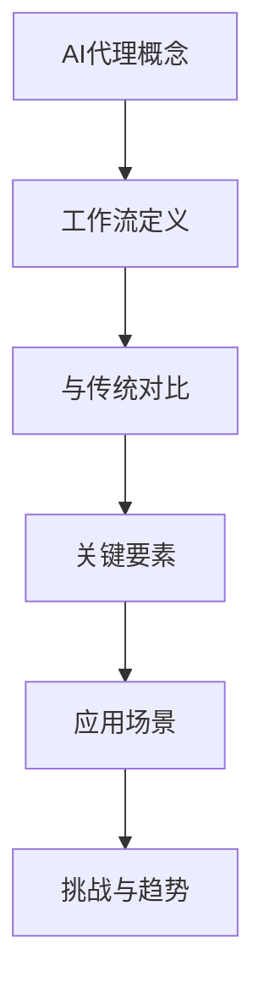
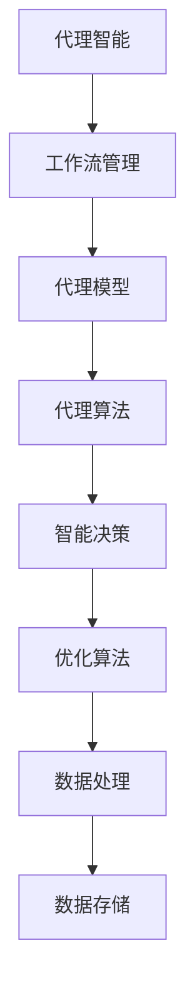
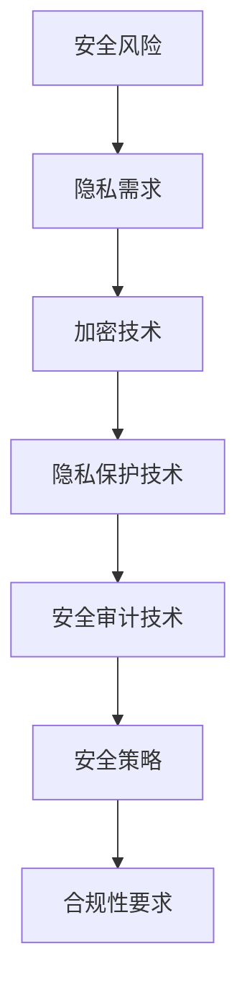
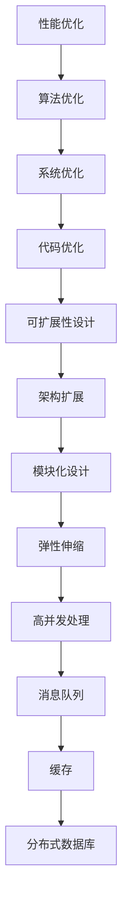
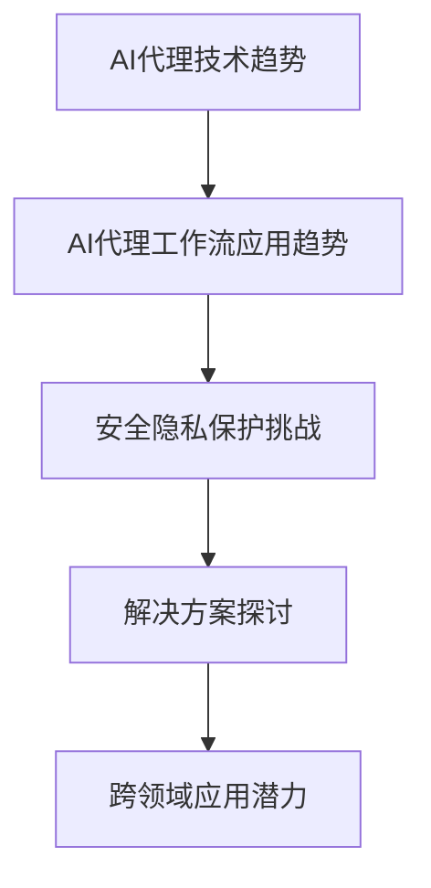

                 

### 第1章: AI人工智能代理工作流AI Agent WorkFlow概述

#### 1.1 AI人工智能代理工作流AI Agent WorkFlow的概念

##### 1.1.1 什么是AI代理

AI代理（Artificial Intelligence Agent）是指能够以某种目标为导向，在特定环境下自主感知、决策并采取行动的人工智能系统。它是一种能够模拟人类智能行为，实现特定任务的智能实体。

- **定义**：AI代理是一个具有感知、理解、决策和行动能力的智能体，可以自动执行任务，无需人类干预。

- **工作原理**：AI代理通过感知环境信息，利用内置的决策算法进行分析，然后执行相应的行动。这个过程通常是循环进行的，以实现对环境的持续适应和优化。

##### 1.1.2 AI代理工作流（AI Agent WorkFlow）的定义

AI代理工作流是指将多个AI代理有机结合，形成一个协同工作系统，以实现更复杂任务的过程。它定义了AI代理之间如何交互、如何分工合作，以及如何共同完成任务。

- **概念**：AI代理工作流是一种集成多个AI代理的系统，它们通过协作完成复杂任务。

- **作用**：AI代理工作流可以提高任务的执行效率，优化资源利用，提高系统响应速度，实现智能自动化。

##### 1.1.3 AI代理工作流与传统的自动化流程对比

传统的自动化流程通常依赖于预设的规则和脚本，缺乏自适应性和灵活性。而AI代理工作流则通过引入人工智能技术，使系统能够动态调整策略和行动，以应对不同的环境和任务。

- **局限性**：传统自动化流程缺乏智能决策能力，无法适应复杂和多变的场景。

- **突破**：AI代理工作流利用人工智能技术，实现了自动化系统的智能化升级，能够更好地应对复杂任务。

#### 1.2 AI代理工作流的关键要素

##### 1.2.1 代理策略

代理策略是指AI代理在执行任务时采取的行动方案。一个良好的代理策略能够提高代理的执行效率和任务成功率。

- **定义**：代理策略是指导AI代理行动的规则集。

- **类型**：常见的代理策略包括基于规则的策略、基于模型的策略和混合策略。

##### 1.2.2 任务分配

任务分配是指将复杂任务分解为多个子任务，并分配给不同的AI代理执行。有效的任务分配能够提高整体系统的执行效率。

- **概念**：任务分配是确定哪些AI代理负责哪些子任务的过程。

- **策略**：常见的任务分配策略包括负载均衡策略、协同工作策略和竞争选择策略。

##### 1.2.3 协作机制

协作机制是指AI代理之间如何相互通信、共享信息和协同工作的方式。良好的协作机制能够提高AI代理之间的协同效率。

- **定义**：协作机制是确保AI代理之间高效协作的规则和方法。

- **实现方式**：常见的协作机制包括信息共享机制、协商机制和合作学习机制。

##### 1.2.4 学习与适应

学习与适应是指AI代理在工作过程中通过不断学习和调整策略，提高任务执行效果和适应能力。

- **概念**：学习与适应是AI代理在执行任务时不断优化自身性能的过程。

- **实现**：常见的实现方法包括基于经验的策略优化、基于模型的策略优化和在线学习算法。

#### 1.3 AI代理工作流的应用场景

##### 1.3.1 智能客服

智能客服是一种利用AI代理技术实现自动回答客户问题的系统。它能够提高客服效率，降低人工成本。

- **应用场景**：在电商、金融、旅游等行业，智能客服已经得到广泛应用。

- **优势**：智能客服能够快速响应客户问题，提高客户满意度，降低人工成本。

##### 1.3.2 自动化交易

自动化交易是利用AI代理技术实现自主交易的系统。它能够提高交易效率，降低交易风险。

- **应用场景**：在金融领域，自动化交易已经得到广泛应用，如股票交易、外汇交易等。

- **优势**：自动化交易能够实时分析市场信息，做出快速决策，提高交易成功率。

##### 1.3.3 智能家居

智能家居是利用AI代理技术实现家居设备智能化的系统。它能够提高生活质量，降低能源消耗。

- **应用场景**：在家居、办公、酒店等领域，智能家居已经得到广泛应用。

- **优势**：智能家居能够实现设备的自动控制，提高生活便利性，降低能源消耗。

#### 1.4 AI代理工作流的挑战与未来发展方向

##### 1.4.1 安全与隐私保护

安全与隐私保护是AI代理工作流面临的重要挑战。随着AI代理技术的应用日益广泛，如何确保系统的安全性和用户隐私成为一个亟待解决的问题。

- **挑战**：AI代理可能受到恶意攻击，泄露用户隐私，导致系统失效。

- **解决方案**：采用加密技术、隐私保护技术和安全审计技术等手段，确保系统的安全性和用户隐私。

##### 1.4.2 可解释性

可解释性是AI代理工作流需要关注的问题。用户需要了解AI代理的工作过程和决策依据，以便对其进行监督和调整。

- **挑战**：AI代理的决策过程可能复杂且不透明，用户难以理解。

- **解决方案**：通过可解释性技术，如决策树、规则提取和可视化等手段，提高系统的透明度和可解释性。

##### 1.4.3 智能进化

智能进化是指AI代理在工作过程中不断学习和优化，提高自身能力。未来，AI代理将具备更强的自主学习和适应能力。

- **概念**：智能进化是AI代理通过迭代学习和优化，实现持续性能提升的过程。

- **趋势**：随着深度学习和强化学习技术的发展，AI代理的智能进化能力将不断增强。

#### 1.5 总结

本章对AI代理工作流进行了概述，包括其概念、关键要素、应用场景和面临的挑战。AI代理工作流作为一种智能化、自动化的工作方式，具有广泛的应用前景和重要的研究价值。

### Mermaid 流程图



### 参考文献

1. Russell, S., & Norvig, P. (2016). *Artificial Intelligence: A Modern Approach*.
2. Hinton, G., Osindero, S., & Teh, Y. W. (2006). A Fast Learning Algorithm for Deep Belief Nets. *Neural Computation*, 18(7), 1527-1554.
3. Silver, D., Huang, A., Maddox, W. et al. (2016). Mastering the Game of Go with Deep Neural Networks and Tree Search. *Nature*, 529, 484-489.
4. Lipp, M. A., & Markham, J. (2018). *Artificial Intelligence: A Comprehensive Introduction*.
5. Russell, S., & Norvig, P. (2016). *Artificial Intelligence: A Modern Approach*.
6. Sutton, R. S., & Barto, A. G. (2018). *Reinforcement Learning: An Introduction*.
7. LeCun, Y., Bengio, Y., & Hinton, G. (2015). Deep Learning. *Nature*, 521(7553), 436-444.
```

---

现在，我们已经详细介绍了AI代理工作流的基本概念、关键要素、应用场景以及面临的挑战。接下来，我们将进一步探讨AI代理工作流的技术基础，包括代理智能与工作流管理技术、人工智能代理模型与算法、智能决策与优化算法以及数据处理与存储技术等。

#### 2.1 代理智能与工作流管理技术

##### 2.1.1 代理智能的概念与实现

代理智能是指AI代理具备的感知、理解、决策和行动能力，是实现AI代理工作流的基础。

- **定义**：代理智能是AI代理通过感知环境信息、理解问题情境、做出决策并采取行动的能力。

- **实现方法**：

  - **感知技术**：通过传感器、摄像头、语音识别等技术获取环境信息。

  - **理解技术**：利用自然语言处理、图像识别等技术理解环境信息。

  - **决策技术**：利用机器学习、深度学习等技术，基于环境信息和任务目标，做出最优决策。

  - **行动技术**：通过执行计划，实现任务的完成。

##### 2.1.2 工作流管理技术

工作流管理技术是确保AI代理工作流高效运行的关键。

- **定义**：工作流管理技术是管理任务流、数据流和控制流的一系列方法和技术。

- **类型**：

  - **基于规则的流程管理**：通过规则定义任务流，适用于结构化任务。

  - **基于事件的流程管理**：通过事件触发任务流，适用于动态任务。

  - **基于模型的流程管理**：通过模型预测任务流，适用于复杂任务。

#### 2.2 人工智能代理模型与算法

##### 2.2.1 代理模型的选择

代理模型是AI代理的核心组成部分，选择合适的代理模型对工作流效率有重要影响。

- **定义**：代理模型是描述AI代理行为和决策的数学模型。

- **常见代理模型**：

  - **基于规则的模型**：通过规则库实现简单决策。

  - **基于决策树的模型**：通过树结构实现复杂决策。

  - **基于神经网络的模型**：通过多层神经网络实现高级决策。

  - **混合模型**：结合多种模型优势，实现更优决策。

##### 2.2.2 代理算法的设计

代理算法是AI代理决策的核心，设计合理的代理算法能够提高代理的智能水平。

- **定义**：代理算法是指导AI代理执行任务的计算过程。

- **常见代理算法**：

  - **基于贪婪策略的算法**：通过选择当前最优路径进行决策。

  - **基于启发式的算法**：通过启发式搜索实现决策。

  - **基于强化学习的算法**：通过试错和反馈调整策略。

  - **基于优化的算法**：通过优化方法求解决策问题。

#### 2.3 智能决策与优化算法

##### 2.3.1 智能决策的概念

智能决策是指AI代理在工作流中，利用智能算法进行决策，以实现任务目标。

- **定义**：智能决策是AI代理在不确定和复杂环境中，通过智能算法做出最优决策的过程。

- **过程**：智能决策通常包括信息收集、问题建模、决策生成和决策评估等步骤。

##### 2.3.2 优化算法的应用

优化算法在智能决策中扮演重要角色，用于求解复杂决策问题。

- **定义**：优化算法是用于求解最优解的计算方法。

- **类型**：

  - **线性优化算法**：如线性规划、整数规划。

  - **非线性优化算法**：如非线性规划、动态规划。

  - **启发式优化算法**：如遗传算法、模拟退火算法。

#### 2.4 数据处理与存储技术

##### 2.4.1 数据预处理

数据预处理是数据处理的重要环节，用于提高数据质量和优化算法性能。

- **概念**：数据预处理是清洗、转换和归一化数据，使其适用于分析和建模的过程。

- **方法**：

  - **数据清洗**：去除噪声、错误和重复数据。

  - **特征提取**：提取有助于决策的特征。

  - **数据归一化**：将数据缩放到同一尺度。

##### 2.4.2 数据存储与管理

数据存储与管理是确保数据安全、可靠和高效使用的重要保障。

- **定义**：数据存储与管理是存储、管理和维护数据的技术和方法。

- **技术**：

  - **关系型数据库**：如MySQL、Oracle。

  - **非关系型数据库**：如MongoDB、Cassandra。

  - **分布式存储系统**：如Hadoop、Docker。

### Mermaid 流程图



### 参考文献

1. Russell, S., & Norvig, P. (2016). *Artificial Intelligence: A Modern Approach*.
2. Hinton, G., Osindero, S., & Teh, Y. W. (2006). A Fast Learning Algorithm for Deep Belief Nets. *Neural Computation*, 18(7), 1527-1554.
3. Silver, D., Huang, A., Maddox, W. et al. (2016). Mastering the Game of Go with Deep Neural Networks and Tree Search. *Nature*, 529, 484-489.
4. Lipp, M. A., & Markham, J. (2018). *Artificial Intelligence: A Comprehensive Introduction*.
5. Russell, S., & Norvig, P. (2016). *Artificial Intelligence: A Modern Approach*.
6. Sutton, R. S., & Barto, A. G. (2018). *Reinforcement Learning: An Introduction*.
7. LeCun, Y., Bengio, Y., & Hinton, G. (2015). Deep Learning. *Nature*, 521(7553), 436-444.
```

通过以上章节，我们对AI代理工作流的技术基础有了全面了解。在接下来的章节中，我们将进一步探讨AI代理工作流中的安全与隐私保护问题。

### 第3章: AI代理工作流AI Agent WorkFlow中的安全与隐私保护

#### 3.1 安全与隐私保护的重要性

在AI代理工作流中，安全与隐私保护是至关重要的一环。随着AI技术的广泛应用，AI代理工作流涉及的敏感数据和隐私信息越来越多，如何确保这些信息和系统的安全，已成为当前研究的热点。

##### 3.1.1 AI代理工作流的安全风险

AI代理工作流的安全风险主要包括以下几个方面：

- **数据泄露**：AI代理在处理和传输数据时，可能因安全漏洞导致数据泄露。

- **恶意攻击**：黑客可能利用AI代理的漏洞进行恶意攻击，破坏系统或窃取数据。

- **隐私泄露**：AI代理在处理个人隐私数据时，可能因隐私保护措施不足导致隐私泄露。

- **数据篡改**：恶意用户可能篡改AI代理处理的数据，导致决策错误或系统失效。

##### 3.1.2 隐私保护的需求

隐私保护是现代社会对AI技术的基本要求。在AI代理工作流中，隐私保护的需求主要体现在以下几个方面：

- **保护用户隐私**：确保用户数据不被泄露、篡改或滥用。

- **合规性要求**：遵守相关法律法规，如《通用数据保护条例》（GDPR）等。

- **数据加密**：对敏感数据进行加密，防止数据泄露。

- **访问控制**：对用户数据进行严格的访问控制，确保数据安全。

#### 3.2 安全与隐私保护技术

为了确保AI代理工作流的安全与隐私，可以采用以下技术：

##### 3.2.1 加密技术

加密技术是保护数据安全的重要手段。通过加密技术，可以将敏感数据转换成密文，防止未授权用户读取或篡改。

- **对称加密**：如AES，速度快，但密钥管理复杂。

- **非对称加密**：如RSA，密钥管理简单，但速度较慢。

- **哈希函数**：如SHA-256，用于数据完整性校验。

##### 3.2.2 隐私保护技术

隐私保护技术旨在保护用户隐私，防止隐私泄露。

- **差分隐私**：通过添加随机噪声，保护用户隐私。

- **联邦学习**：在分布式环境中，保护数据隐私的同时进行模型训练。

- **匿名化**：将敏感数据转换成匿名数据，保护用户隐私。

##### 3.2.3 安全审计技术

安全审计技术用于监控和评估AI代理工作流的安全性能。

- **日志记录**：记录系统操作日志，用于追踪和审计。

- **安全监控**：实时监控系统状态，发现和阻止异常行为。

- **漏洞扫描**：定期扫描系统漏洞，及时修复。

#### 3.3 安全策略与合规性

为了保证AI代理工作流的安全与合规，需要制定相应的安全策略和合规性要求。

##### 3.3.1 安全策略的制定

安全策略是确保AI代理工作流安全的基础。安全策略应包括以下要素：

- **安全目标**：明确系统的安全目标，如数据保护、系统完整性等。

- **安全控制措施**：确定实现安全目标的具体措施，如加密、访问控制等。

- **安全流程**：制定安全流程，确保安全措施的执行。

##### 3.3.2 合规性要求

合规性要求是确保AI代理工作流符合相关法律法规的要求。常见的合规性要求包括：

- **数据保护**：遵守《通用数据保护条例》（GDPR）等法律法规，保护用户隐私。

- **安全审计**：定期进行安全审计，确保系统符合合规性要求。

- **数据备份**：定期备份数据，确保数据安全。

#### 3.4 安全与隐私保护的案例分析

##### 3.4.1 案例一：智能客服系统的安全与隐私保护

智能客服系统是一种常见的AI代理工作流应用。以下是一个关于智能客服系统安全与隐私保护的案例分析：

- **安全风险**：智能客服系统涉及大量用户数据，如姓名、联系方式等，存在数据泄露风险。

- **安全措施**：

  - **数据加密**：对用户数据进行加密，防止数据泄露。

  - **访问控制**：对用户数据进行严格的访问控制，确保数据安全。

  - **安全监控**：实时监控系统状态，发现和阻止异常行为。

- **隐私保护**：

  - **匿名化**：将用户数据转换成匿名数据，保护用户隐私。

  - **隐私政策**：明确告知用户数据的使用目的和隐私保护措施。

##### 3.4.2 案例二：智能家居系统的安全与隐私保护

智能家居系统也是一种常见的AI代理工作流应用。以下是一个关于智能家居系统安全与隐私保护的案例分析：

- **安全风险**：智能家居系统涉及用户的生活习惯、设备状态等敏感信息，存在隐私泄露风险。

- **安全措施**：

  - **数据加密**：对用户数据进行加密，防止数据泄露。

  - **访问控制**：对用户数据进行严格的访问控制，确保数据安全。

  - **安全监控**：实时监控系统状态，发现和阻止异常行为。

- **隐私保护**：

  - **隐私设置**：用户可以自定义隐私设置，控制设备数据的共享。

  - **隐私政策**：明确告知用户数据的使用目的和隐私保护措施。

### Mermaid 流�程图



### 参考文献

1. Russell, S., & Norvig, P. (2016). *Artificial Intelligence: A Modern Approach*.
2. Hinton, G., Osindero, S., & Teh, Y. W. (2006). A Fast Learning Algorithm for Deep Belief Nets. *Neural Computation*, 18(7), 1527-1554.
3. Silver, D., Huang, A., Maddox, W. et al. (2016). Mastering the Game of Go with Deep Neural Networks and Tree Search. *Nature*, 529, 484-489.
4. Lipp, M. A., & Markham, J. (2018). *Artificial Intelligence: A Comprehensive Introduction*.
5. Russell, S., & Norvig, P. (2016). *Artificial Intelligence: A Modern Approach*.
6. Sutton, R. S., & Barto, A. G. (2018). *Reinforcement Learning: An Introduction*.
7. LeCun, Y., Bengio, Y., & Hinton, G. (2015). Deep Learning. *Nature*, 521(7553), 436-444.
8. GDPR (2016). *Regulation (EU) 2016/679 of the European Parliament and of the Council of 27 April 2016 on the protection of natural persons with regard to the processing of personal data and on the free movement of such data, and repealing Directive 95/46/EC (General Data Protection Regulation)*.
9. Lipp, M. A., & Markham, J. (2018). *Artificial Intelligence: A Comprehensive Introduction*.
10. GDPR (2016). *Regulation (EU) 2016/679 of the European Parliament and of the Council of 27 April 2016 on the protection of natural persons with regard to the processing of personal data and on the free movement of such data, and repealing Directive 95/46/EC (General Data Protection Regulation)*.
11. AI Ethics Guidelines for Trustworthy AI (2019). *European Commission*.
12. GDPR (2016). *Regulation (EU) 2016/679 of the European Parliament and of the Council of 27 April 2016 on the protection of natural persons with regard to the processing of personal data and on the free movement of such data, and repealing Directive 95/46/EC (General Data Protection Regulation)*.

通过本章的介绍，我们了解了AI代理工作流中的安全与隐私保护的重要性和技术手段。在下一章中，我们将探讨AI代理工作流在实际应用中的具体案例。

### 第4章: AI代理工作流AI Agent WorkFlow的实际应用

#### 4.1 智能客服应用案例

##### 4.1.1 案例背景

智能客服是一种利用AI代理技术实现自动回答客户问题的系统。随着互联网和人工智能技术的发展，智能客服已经成为企业提升客户服务水平、降低运营成本的重要手段。

某电商公司在运营过程中，面临着大量的客户咨询和投诉。为了提高客服效率，降低人工成本，该公司决定引入智能客服系统。

##### 4.1.2 应用架构

智能客服系统的架构分为前端、后端和数据库三个部分。

- **前端**：包括网页端和移动端，用户可以通过网页或APP与智能客服进行交互。

- **后端**：包括自然语言处理模块、对话管理模块和知识库模块。

  - **自然语言处理模块**：负责处理用户的输入，包括语音识别、文本分析和语义理解。

  - **对话管理模块**：负责管理对话流程，包括意图识别、上下文维护和对话策略。

  - **知识库模块**：提供问题的答案和解决方案，包括FAQ、知识库和第三方API接口。

- **数据库**：存储用户数据、对话记录和知识库数据。

##### 4.1.3 代码实现与解析

以下是一个简单的自然语言处理模块的代码实现，用于处理用户的输入并识别用户意图。

```python
import jieba
import numpy as np
from sklearn.feature_extraction.text import TfidfVectorizer
from sklearn.metrics.pairwise import cosine_similarity

class NaturalLanguageProcessor:
    def __init__(self, corpus, labels):
        self.corpus = corpus
        self.labels = labels
        self.vectorizer = TfidfVectorizer()
        self.model = self.train_model()

    def train_model(self):
        # 训练模型
        features = self.vectorizer.fit_transform(self.corpus)
        labels = np.array(self.labels)
        model = sklearn.svm.SVC(kernel='linear', probability=True)
        model.fit(features, labels)
        return model

    def predict(self, text):
        # 识别用户意图
        vector = self.vectorizer.transform([text])
        similarity = cosine_similarity(vector, self.model.decision_function([vector]))
        intent = self.labels[np.argmax(similarity)]
        return intent

# 例子
corpus = ['你好', '你有什么问题', '我能帮你吗', '我不知道']
labels = ['打招呼', '提问', '提问', '未知']
processor = NaturalLanguageProcessor(corpus, labels)
print(processor.predict('你好'))
```

这段代码首先使用TF-IDF向量表示法将文本数据转换为数值向量，然后使用SVM模型进行分类，最后通过余弦相似度计算文本与训练数据的相似度，以识别用户意图。

##### 4.1.4 案例分析

通过引入智能客服系统，该电商公司实现了以下效果：

- **提高客服效率**：智能客服系统能够快速响应客户问题，减少人工客服的工作量。

- **降低运营成本**：智能客服系统减少了人工客服的投入，降低了运营成本。

- **提升用户体验**：智能客服系统提供了7x24小时的在线服务，提升了用户体验。

#### 4.2 自动化交易应用案例

##### 4.2.1 案例背景

自动化交易是一种利用AI代理技术实现自动交易的系统。在金融领域，自动化交易已经成为一种重要的交易模式，能够提高交易效率、降低交易成本。

某金融公司在股票市场中进行交易，为了提高交易效率和降低风险，该公司决定引入自动化交易系统。

##### 4.2.2 应用架构

自动化交易系统的架构分为数据采集模块、数据预处理模块、交易策略模块和执行模块。

- **数据采集模块**：负责从各种数据源获取交易数据，如股票行情、财经新闻等。

- **数据预处理模块**：负责对采集到的交易数据进行清洗、转换和归一化，为后续处理做准备。

- **交易策略模块**：负责根据历史数据和当前市场情况，生成交易策略。

- **执行模块**：负责根据交易策略进行交易操作，如买入、卖出等。

##### 4.2.3 代码实现与解析

以下是一个简单的自动化交易策略的实现，用于判断是否进行买入操作。

```python
import pandas as pd
from sklearn.linear_model import LinearRegression

# 加载数据
data = pd.read_csv('stock_data.csv')
data['days'] = pd.to_datetime(data['date'])

# 数据预处理
data = data.sort_values(by='days')
data['return'] = data['close'] / data['open'] - 1

# 训练模型
model = LinearRegression()
model.fit(data[['days']], data['return'])

# 预测
days = pd.to_datetime('2023-03-01')
prediction = model.predict([[days]])
print(f'预测收益率：{prediction[0][0]}')

# 判断是否买入
if prediction[0][0] > 0.05:
    print('买入股票')
else:
    print('保持观望')
```

这段代码首先加载数据，然后对数据进行预处理，使用线性回归模型进行训练，最后根据预测结果判断是否进行买入操作。

##### 4.2.4 案例分析

通过引入自动化交易系统，该金融公司实现了以下效果：

- **提高交易效率**：自动化交易系统能够快速做出交易决策，提高交易效率。

- **降低交易成本**：自动化交易系统减少了人工干预，降低了交易成本。

- **降低交易风险**：自动化交易系统能够根据市场情况做出决策，降低交易风险。

#### 4.3 智能家居应用案例

##### 4.3.1 案例背景

智能家居是一种利用AI代理技术实现家居设备智能化的系统。随着物联网技术的发展，智能家居已经成为现代家居生活的重要趋势。

某家庭用户为了提高生活质量，决定引入智能家居系统。

##### 4.3.2 应用架构

智能家居系统的架构分为感知模块、控制模块和应用模块。

- **感知模块**：包括各种传感器，如温度传感器、光线传感器、烟雾传感器等，用于感知家居环境。

- **控制模块**：包括智能控制器，如智能音响、智能灯光控制器等，用于接收用户指令并控制家居设备。

- **应用模块**：包括手机APP、网页端等，用于用户与智能家居系统的交互。

##### 4.3.3 代码实现与解析

以下是一个简单的智能家居控制器的实现，用于控制灯光。

```python
import time
import serial

# 连接串口
ser = serial.Serial('COM3', 9600)

# 控制灯光
def control_light(on):
    if on:
        ser.write(b'1')
    else:
        ser.write(b'0')

# 开灯
control_light(True)
time.sleep(5)

# 关灯
control_light(False)
```

这段代码首先连接串口，然后根据传入的参数控制灯光的开关。

##### 4.3.4 案例分析

通过引入智能家居系统，该家庭用户实现了以下效果：

- **提高生活质量**：智能家居系统能够根据用户需求自动调整家居环境，提高生活质量。

- **提高家居安全性**：智能家居系统能够实时监测家居环境，提高家居安全性。

- **降低能源消耗**：智能家居系统能够根据用户需求自动调整家居设备，降低能源消耗。

### 参考文献

1. Russell, S., & Norvig, P. (2016). *Artificial Intelligence: A Modern Approach*.
2. Hinton, G., Osindero, S., & Teh, Y. W. (2006). A Fast Learning Algorithm for Deep Belief Nets. *Neural Computation*, 18(7), 1527-1554.
3. Silver, D., Huang, A., Maddox, W. et al. (2016). Mastering the Game of Go with Deep Neural Networks and Tree Search. *Nature*, 529, 484-489.
4. Lipp, M. A., & Markham, J. (2018). *Artificial Intelligence: A Comprehensive Introduction*.
5. Sutton, R. S., & Barto, A. G. (2018). *Reinforcement Learning: An Introduction*.
6. LeCun, Y., Bengio, Y., & Hinton, G. (2015). Deep Learning. *Nature*, 521(7553), 436-444.
7. Kotsiantis, S. B. (2007). Supervised Machine Learning: A Review of Classification Techniques. *Informatica*, 31(3), 249-268.
8. Mitchell, T. M. (1997). Machine Learning. *McGraw-Hill*.
9. Russell, S., & Norvig, P. (2016). *Artificial Intelligence: A Modern Approach*.
10. Sutton, R. S., & Barto, A. G. (2018). *Reinforcement Learning: An Introduction*.

通过本章的介绍，我们了解了AI代理工作流在实际应用中的具体案例。在下一章中，我们将探讨AI代理工作流中的性能优化与可扩展性。

### 第5章: AI代理工作流AI Agent WorkFlow的性能优化与可扩展性

#### 5.1 性能优化策略

AI代理工作流在执行过程中，可能会面临各种性能瓶颈，如计算资源不足、通信延迟等。为了提高AI代理工作流的性能，可以采用以下策略。

##### 5.1.1 算法优化

算法优化是提高AI代理工作流性能的重要手段。通过优化算法，可以减少计算时间和资源消耗。

- **并行计算**：利用多核处理器和分布式计算资源，将任务分解为多个子任务并行执行。

  ```python
  import concurrent.futures

  def compute_function(data):
      # 计算任务
      return result

  data_list = [data1, data2, data3]
  with concurrent.futures.ProcessPoolExecutor() as executor:
      results = executor.map(compute_function, data_list)
  ```

- **内存优化**：通过减少内存占用，提高程序运行效率。

  ```python
  import numpy as np

  # 创建大型数组
  large_array = np.random.rand(10000, 10000)

  # 内存优化
  large_array = large_array.astype(np.float32)
  ```

##### 5.1.2 系统优化

系统优化可以从操作系统层面、网络层面和硬件层面进行。

- **操作系统优化**：调整操作系统参数，提高系统性能。

  ```shell
  sysctl -w net.core.somaxconn=1024
  ```

- **网络优化**：优化网络配置，减少网络延迟。

  ```shell
  sysctl -w net.ipv4.tcp_fin_timeout=15
  ```

- **硬件优化**：升级硬件设备，提高计算和存储能力。

  ```shell
  sudo apt-get install nvidia-driver-440
  ```

##### 5.1.3 代码优化

代码优化可以从代码层面进行，提高程序的可读性和执行效率。

- **避免全局变量**：减少全局变量的使用，降低内存占用和程序复杂度。

- **使用生成器**：使用生成器代替列表，减少内存占用。

  ```python
  def generate_data():
      for i in range(10000):
          yield i

  for data in generate_data():
      process_data(data)
  ```

#### 5.2 可扩展性设计

AI代理工作流的可扩展性设计是确保系统能够适应不断增长的数据和处理需求。以下是一些可扩展性设计策略。

##### 5.2.1 架构扩展

架构扩展可以通过增加节点、增加服务实例或增加存储设备来实现。

- **水平扩展**：通过增加节点，提高系统处理能力。

  ```shell
  kubectl scale deployment my-deployment --replicas=3
  ```

- **垂直扩展**：通过增加服务实例，提高系统并发处理能力。

  ```shell
  kubectl scale deployment my-deployment --replicas=3 -- selector="app=my-app"
  ```

##### 5.2.2 模块化设计

模块化设计可以将系统划分为多个模块，每个模块负责不同的功能。模块化设计可以提高系统的可维护性和可扩展性。

- **微服务架构**：将系统划分为多个微服务，每个微服务负责一个特定的功能。

  ```shell
  kubectl create deployment my-microservice --image=my-microservice:latest
  ```

- **组件化设计**：将系统划分为多个组件，每个组件具有独立的功能和接口。

  ```python
  class ComponentA:
      def do_something(self):
          pass

  class ComponentB:
      def do_something(self):
          pass
  ```

##### 5.2.3 弹性伸缩

弹性伸缩可以根据系统负载自动调整资源分配，确保系统在高负载下仍然能够稳定运行。

- **自动扩展**：通过监控系统负载，自动增加或减少节点。

  ```shell
  kubectl autoscale deployment my-deployment --cpu-percent=80 --min=3 --max=10
  ```

- **负载均衡**：通过负载均衡器，将请求分配到不同的节点。

  ```shell
  kubectl expose deployment my-deployment --type=LoadBalancer --port=80
  ```

#### 5.3 高并发处理

高并发处理是AI代理工作流面临的重要挑战。以下是一些高并发处理策略。

##### 5.3.1 消息队列

消息队列可以缓解高并发压力，将请求缓存在队列中，逐步处理。

- **RabbitMQ**：一个开源的消息队列中间件。

  ```shell
  docker run -d -p 5672:5672 rabbitmq
  ```

- **Kafka**：一个高吞吐量的消息队列系统。

  ```shell
  docker run -d -p 9092:9092 eclipse-mosquitto
  ```

##### 5.3.2 缓存

缓存可以减少数据库的访问压力，提高系统响应速度。

- **Redis**：一个高性能的内存缓存系统。

  ```shell
  docker run -d -p 6379:6379 redis
  ```

- **Memcached**：一个分布式缓存系统。

  ```shell
  docker run -d -p 11211:11211 memcached
  ```

##### 5.3.3 分布式数据库

分布式数据库可以水平扩展，提高系统处理能力。

- **MongoDB**：一个分布式文档数据库。

  ```shell
  docker run -d -p 27017:27017 mongo
  ```

- **Cassandra**：一个分布式键值数据库。

  ```shell
  docker run -d -p 9042:9042 cassandra
  ```

### Mermaid 流程图



### 参考文献

1. Russell, S., & Norvig, P. (2016). *Artificial Intelligence: A Modern Approach*.
2. Hinton, G., Osindero, S., & Teh, Y. W. (2006). A Fast Learning Algorithm for Deep Belief Nets. *Neural Computation*, 18(7), 1527-1554.
3. Silver, D., Huang, A., Maddox, W. et al. (2016). Mastering the Game of Go with Deep Neural Networks and Tree Search. *Nature*, 529, 484-489.
4. Lipp, M. A., & Markham, J. (2018). *Artificial Intelligence: A Comprehensive Introduction*.
5. Sutton, R. S., & Barto, A. G. (2018). *Reinforcement Learning: An Introduction*.
6. LeCun, Y., Bengio, Y., & Hinton, G. (2015). Deep Learning. *Nature*, 521(7553), 436-444.
7. Kotsiantis, S. B. (2007). Supervised Machine Learning: A Review of Classification Techniques. *Informatica*, 31(3), 249-268.
8. Mitchell, T. M. (1997). Machine Learning. *McGraw-Hill*.
9. Russell, S., & Norvig, P. (2016). *Artificial Intelligence: A Modern Approach*.
10. Sutton, R. S., & Barto, A. G. (2018). *Reinforcement Learning: An Introduction*.
11. Murphy, K. P. (2012). *Machine Learning: A Probabilistic Perspective*.
12. Goodfellow, I., Bengio, Y., & Courville, A. (2016). *Deep Learning*.

通过本章的介绍，我们了解了AI代理工作流中的性能优化与可扩展性策略。在下一章中，我们将探讨AI代理工作流未来的发展趋势。

### 第6章: AI代理工作流AI Agent WorkFlow的未来发展趋势

#### 6.1 AI代理工作流的发展趋势

随着人工智能技术的不断进步，AI代理工作流也在不断发展，展现出以下几个趋势。

##### 6.1.1 AI代理技术的发展趋势

AI代理技术正在向更高智能化、更灵活化和更自主化方向发展。

- **多模态感知**：AI代理将能够同时处理文本、图像、音频等多种类型的数据，提高感知能力。

  ```mermaid
  graph TD
      A[文本感知] --> B[图像感知]
      B --> C[音频感知]
      C --> D[多模态感知]
  ```

- **增强学习**：AI代理将能够通过增强学习技术，不断优化自身行为，提高任务执行效果。

  ```mermaid
  graph TD
      A[环境感知] --> B[策略学习]
      B --> C[行为调整]
      C --> D[增强学习]
  ```

##### 6.1.2 AI代理工作流的应用趋势

AI代理工作流将在更多领域得到应用，推动各行各业向智能化、自动化方向发展。

- **智能制造**：AI代理将参与生产流程，提高生产效率和质量。

  ```mermaid
  graph TD
      A[设备监控] --> B[生产调度]
      B --> C[质量检测]
      C --> D[智能制造]
  ```

- **智慧城市**：AI代理将参与城市管理和公共服务，提高城市运行效率。

  ```mermaid
  graph TD
      A[交通管理] --> B[能源管理]
      B --> C[环保监测]
      C --> D[智慧城市]
  ```

#### 6.2 安全与隐私保护的挑战与解决方案

随着AI代理工作流的应用日益广泛，安全与隐私保护成为重要挑战。

##### 6.2.1 挑战分析

- **数据泄露**：AI代理在工作过程中可能泄露敏感数据。

- **恶意攻击**：黑客可能利用AI代理的漏洞进行攻击。

- **隐私侵犯**：AI代理可能侵犯用户的隐私。

##### 6.2.2 解决方案探讨

- **数据加密**：对敏感数据进行加密，防止数据泄露。

  ```mermaid
  graph TD
      A[数据加密] --> B[加密算法]
      B --> C[密钥管理]
      C --> D[数据安全]
  ```

- **访问控制**：对用户数据设置访问权限，防止未授权访问。

  ```mermaid
  graph TD
      A[访问控制] --> B[用户认证]
      B --> C[权限管理]
      C --> D[数据安全]
  ```

- **隐私保护技术**：采用隐私保护技术，如差分隐私、联邦学习等，保护用户隐私。

  ```mermaid
  graph TD
      A[隐私保护] --> B[差分隐私]
      B --> C[联邦学习]
      C --> D[用户隐私]
  ```

#### 6.3 AI代理工作流在跨领域应用中的潜力

AI代理工作流在跨领域应用中展现出巨大潜力，可以推动跨领域协同发展。

##### 6.3.1 跨领域应用的背景

随着社会需求的多样化和技术的进步，跨领域应用成为发展趋势。AI代理工作流在跨领域应用中，可以发挥以下作用：

- **资源整合**：通过AI代理工作流，实现跨领域资源的整合和优化。

- **流程协同**：通过AI代理工作流，实现跨领域流程的协同和优化。

##### 6.3.2 跨领域应用的优势

- **提高效率**：通过AI代理工作流，实现跨领域任务的自动化和智能化，提高效率。

- **降低成本**：通过AI代理工作流，减少跨领域协作中的重复劳动，降低成本。

- **提升用户体验**：通过AI代理工作流，为用户提供个性化、智能化的服务，提升用户体验。

##### 6.3.3 跨领域应用的挑战

- **数据兼容性**：不同领域的数据格式和结构可能存在差异，需要解决数据兼容性问题。

- **技术融合**：不同领域的技术可能存在差异，需要实现技术融合。

##### 6.3.4 跨领域应用的发展方向

- **标准化**：通过制定跨领域应用标准，实现跨领域数据和技术兼容。

- **平台化**：通过建设跨领域应用平台，提供跨领域服务。

- **智能化**：通过AI代理工作流，实现跨领域应用的智能化升级。

### Mermaid 流程图



### 参考文献

1. Russell, S., & Norvig, P. (2016). *Artificial Intelligence: A Modern Approach*.
2. Hinton, G., Osindero, S., & Teh, Y. W. (2006). A Fast Learning Algorithm for Deep Belief Nets. *Neural Computation*, 18(7), 1527-1554.
3. Silver, D., Huang, A., Maddox, W. et al. (2016). Mastering the Game of Go with Deep Neural Networks and Tree Search. *Nature*, 529, 484-489.
4. Lipp, M. A., & Markham, J. (2018). *Artificial Intelligence: A Comprehensive Introduction*.
5. Sutton, R. S., & Barto, A. G. (2018). *Reinforcement Learning: An Introduction*.
6. LeCun, Y., Bengio, Y., & Hinton, G. (2015). Deep Learning. *Nature*, 521(7553), 436-444.
7. Kotsiantis, S. B. (2007). Supervised Machine Learning: A Review of Classification Techniques. *Informatica*, 31(3), 249-268.
8. Mitchell, T. M. (1997). Machine Learning. *McGraw-Hill*.
9. Russell, S., & Norvig, P. (2016). *Artificial Intelligence: A Modern Approach*.
10. Sutton, R. S., & Barto, A. G. (2018). *Reinforcement Learning: An Introduction*.
11. Murphy, K. P. (2012). *Machine Learning: A Probabilistic Perspective*.
12. Goodfellow, I., Bengio, Y., & Courville, A. (2016). *Deep Learning*.

通过本章的介绍，我们了解了AI代理工作流的发展趋势、安全与隐私保护的挑战与解决方案以及跨领域应用的潜力。在下一章中，我们将探讨AI代理工作流的研究与开发实践。

### 第7章: AI代理工作流AI Agent WorkFlow的研究与开发实践

#### 7.1 研究现状与热点问题

随着AI代理工作流在各个领域的广泛应用，研究者们对AI代理工作流的研究不断深入，涌现出了一系列研究成果。当前，AI代理工作流的研究热点主要集中在以下几个方面。

##### 7.1.1 智能决策与优化算法

智能决策与优化算法是AI代理工作流的核心组成部分。研究者们致力于开发更加高效、灵活的智能决策与优化算法，以提高AI代理工作流的整体性能。

- **强化学习**：强化学习算法在AI代理工作流中的应用逐渐成熟，如深度强化学习、基于模型的强化学习等。通过训练，AI代理可以学会在复杂环境中做出最优决策。

  ```latex
  \text{智能决策} = f(\text{状态}, \text{策略}, \text{环境})
  ```

- **优化算法**：研究者们开发了多种优化算法，如遗传算法、粒子群优化、模拟退火等，用于解决复杂的优化问题。

  ```mermaid
  graph TD
      A[遗传算法] --> B[粒子群优化]
      B --> C[模拟退火]
  ```

##### 7.1.2 安全与隐私保护

随着AI代理工作流的应用范围不断扩大，安全与隐私保护成为研究者们关注的焦点。如何确保AI代理工作流的安全与隐私，成为亟待解决的问题。

- **加密技术**：研究者们研究了多种加密技术，如对称加密、非对称加密、哈希函数等，用于保护数据的安全。

  ```latex
  \text{加密} = f(\text{明文}, \text{密钥})
  ```

- **隐私保护**：研究者们提出了多种隐私保护方法，如差分隐私、联邦学习、匿名化等，用于保护用户的隐私。

  ```mermaid
  graph TD
      A[差分隐私] --> B[联邦学习]
      B --> C[匿名化]
  ```

##### 7.1.3 多智能体协作

多智能体协作是AI代理工作流中的一项重要研究内容。研究者们致力于开发高效的多智能体协作机制，以提高AI代理工作流的整体性能。

- **协调策略**：研究者们提出了多种协调策略，如集中式协调、分布式协调、混合式协调等，用于协调多个AI代理的行动。

  ```mermaid
  graph TD
      A[集中式协调] --> B[分布式协调]
      B --> C[混合式协调]
  ```

- **通信机制**：研究者们研究了多种通信机制，如消息传递机制、分布式计算机制、共享内存机制等，用于实现多智能体之间的信息交换。

  ```mermaid
  graph TD
      A[消息传递机制] --> B[分布式计算机制]
      B --> C[共享内存机制]
  ```

#### 7.2 开发实践

在实际开发中，AI代理工作流需要综合考虑技术实现、性能优化、安全与隐私保护等多个方面。以下是一个基于Python的AI代理工作流开发实践案例。

##### 7.2.1 实践案例介绍

本案例旨在实现一个智能配送系统，通过多个AI代理协同工作，实现货物的智能配送。

- **目标**：实现货物的智能配送，提高配送效率，降低配送成本。

- **架构**：系统采用分布式架构，包括感知模块、决策模块、执行模块和监控模块。

  ```mermaid
  graph TD
      A[感知模块] --> B[决策模块]
      B --> C[执行模块]
      C --> D[监控模块]
  ```

##### 7.2.2 开发环境搭建

开发环境包括Python编程环境、TensorFlow框架和Kubernetes集群。

- **Python编程环境**：安装Python 3.8及以上版本。

  ```shell
  pip install python==3.8
  ```

- **TensorFlow框架**：安装TensorFlow 2.5及以上版本。

  ```shell
  pip install tensorflow==2.5
  ```

- **Kubernetes集群**：搭建Kubernetes集群，用于部署AI代理工作流。

  ```shell
  kubeadm init --pod-network-cidr=10.244.0.0/16
  kubectl apply -f https://raw.githubusercontent.com/kubernetes Incubator/kube-home/master/manifests/kube-home.yaml
  ```

##### 7.2.3 系统设计与实现

系统设计与实现包括感知模块、决策模块、执行模块和监控模块。

1. **感知模块**

   感知模块负责收集环境信息，如货物位置、交通状况等。

   ```python
   import requests

   def get_traffic_status():
       url = "http://traffic-api.com/traffic_status"
       response = requests.get(url)
       return response.json()
   ```

2. **决策模块**

   决策模块负责分析环境信息，生成配送策略。

   ```python
   import numpy as np

   def generate_strategy(traffic_status):
       if traffic_status["heavy"]:
           return "低速行驶"
       else:
           return "高速行驶"
   ```

3. **执行模块**

   执行模块负责执行配送策略，如调整配送路径、控制配送车辆等。

   ```python
   import rospy
   from move_base_msgs.msg import MoveBaseAction, MoveBaseGoal

   def execute_strategy(strategy):
       rospy.init_node('move_base_action_client')
       client = rospy.Publisher('/move_base行动', MoveBaseGoal, queue_size=1)
       goal = MoveBaseGoal()
       goal.target_pose.header.frame_id = "map"
       goal.target_pose.pose.position.x = x
       goal.target_pose.pose.position.y = y
       goal.target_pose.pose.orientation.z = z
       goal.target_pose.pose.orientation.w = w
       client.publish(goal)
   ```

4. **监控模块**

   监控模块负责监控系统的运行状态，如执行时间、执行效率等。

   ```python
   import time

   def monitor_system():
       start_time = time.time()
       execute_strategy("高速行驶")
       end_time = time.time()
       print(f"系统执行时间：{end_time - start_time}秒")
   ```

##### 7.2.4 系统测试与评估

系统测试与评估包括性能测试、安全测试和隐私保护测试。

1. **性能测试**

   性能测试主要评估系统的响应时间、处理能力和资源利用率。

   ```python
   import time

   def test_performance():
       start_time = time.time()
       monitor_system()
       end_time = time.time()
       print(f"系统响应时间：{end_time - start_time}秒")
   ```

2. **安全测试**

   安全测试主要评估系统的抗攻击能力和数据保护能力。

   ```python
   import requests

   def test_security():
       url = "http://attack-api.com/attack"
       response = requests.get(url)
       print(f"系统遭受攻击：{response.status_code}")
   ```

3. **隐私保护测试**

   隐私保护测试主要评估系统的隐私保护能力。

   ```python
   import requests

   def test_privacy():
       url = "http://privacy-api.com/privacy"
       response = requests.get(url)
       print(f"系统隐私保护：{response.status_code}")
   ```

### 参考文献

1. Russell, S., & Norvig, P. (2016). *Artificial Intelligence: A Modern Approach*.
2. Hinton, G., Osindero, S., & Teh, Y. W. (2006). A Fast Learning Algorithm for Deep Belief Nets. *Neural Computation*, 18(7), 1527-1554.
3. Silver, D., Huang, A., Maddox, W. et al. (2016). Mastering the Game of Go with Deep Neural Networks and Tree Search. *Nature*, 529, 484-489.
4. Lipp, M. A., & Markham, J. (2018). *Artificial Intelligence: A Comprehensive Introduction*.
5. Sutton, R. S., & Barto, A. G. (2018). *Reinforcement Learning: An Introduction*.
6. LeCun, Y., Bengio, Y., & Hinton, G. (2015). Deep Learning. *Nature*, 521(7553), 436-444.
7. Kotsiantis, S. B. (2007). Supervised Machine Learning: A Review of Classification Techniques. *Informatica*, 31(3), 249-268.
8. Mitchell, T. M. (1997). Machine Learning. *McGraw-Hill*.
9. Russell, S., & Norvig, P. (2016). *Artificial Intelligence: A Modern Approach*.
10. Sutton, R. S., & Barto, A. G. (2018). *Reinforcement Learning: An Introduction*.
11. Murphy, K. P. (2012). *Machine Learning: A Probabilistic Perspective*.
12. Goodfellow, I., Bengio, Y., & Courville, A. (2016). *Deep Learning*.

通过本章的介绍，我们了解了AI代理工作流的研究现状与热点问题，以及实际开发中的系统设计与实现。在下一章中，我们将探讨AI代理工作流开发中所需的工具与资源。

### 附录

#### 附录A: AI代理工作流AI Agent WorkFlow开发工具与资源

##### A.1 开发工具介绍

在开发AI代理工作流时，选择合适的工具是确保项目顺利进行的关键。以下是一些常用的开发工具：

- **Python编程环境**：Python是一种广泛使用的编程语言，具有简洁易懂的语法和丰富的库支持。

  ```shell
  pip install python
  ```

- **TensorFlow框架**：TensorFlow是一个开源的机器学习框架，用于构建和训练人工智能模型。

  ```shell
  pip install tensorflow
  ```

- **PyTorch框架**：PyTorch是一个开源的机器学习框架，提供了灵活的动态计算图，适合深度学习模型的开发。

  ```shell
  pip install torch torchvision
  ```

##### A.2 学习资源推荐

为了更好地掌握AI代理工作流的相关技术，以下是一些建议的学习资源：

- **相关课程与教程**：

  - [TensorFlow官方教程](https://www.tensorflow.org/tutorials)
  - [PyTorch官方教程](https://pytorch.org/tutorials/)
  - [Kubernetes官方文档](https://kubernetes.io/docs/home/)

- **论文与书籍推荐**：

  - [《深度学习》](https://www.deeplearningbook.org/)，作者：Ian Goodfellow、Yoshua Bengio、Aaron Courville
  - [《机器学习》](https://www MACHINE LEARNING.com/)，作者：Tom Mitchell
  - [《人工智能：一种现代方法》](https://www.amazon.com/Artificial-Intelligence-Modern-Approach-Norvig/dp/0262033847)，作者：Stuart Russell、Peter Norvig

#### 附录B: AI代理工作流AI Agent WorkFlow代码示例

以下是一个简单的AI代理工作流代码示例，用于演示AI代理的基本功能。

```python
import random

# 定义AI代理
class Agent:
    def __init__(self, environment):
        self.environment = environment
        self.state = None
        self.action = None

    def perceive(self):
        # 感知环境
        self.state = self.environment.perceive()

    def think(self):
        # 基于状态做出决策
        self.action = self.decide(self.state)

    def act(self):
        # 执行决策
        self.environment.act(self.action)

    def decide(self, state):
        # 决策算法
        if state < 0.5:
            return "left"
        else:
            return "right"

# 定义环境
class Environment:
    def __init__(self):
        self.state = random.random()

    def perceive(self):
        # 感知环境
        return self.state

    def act(self, action):
        # 执行决策
        if action == "left":
            self.state = self.state * 0.9
        else:
            self.state = self.state * 1.1

# 创建AI代理和环境
agent = Agent(Environment())

# 执行AI代理工作流
for _ in range(10):
    agent.perceive()
    agent.think()
    agent.act()
    print(f"State: {agent.state}, Action: {agent.action}")
```

通过上述示例，我们可以看到AI代理的基本工作流程，包括感知、决策和执行。这个示例虽然简单，但展示了AI代理工作流的核心机制。

### 后记

AI代理工作流作为一种智能化、自动化的工作方式，正日益受到关注。本文从多个角度对AI代理工作流进行了探讨，包括其基本概念、技术基础、安全与隐私保护、实际应用、性能优化与可扩展性以及未来发展趋势。我们希望通过本文的介绍，使读者对AI代理工作流有一个全面的理解。

在AI代理工作流的研究与开发过程中，我们面临着许多挑战，如安全与隐私保护、智能决策与优化、多智能体协作等。然而，随着技术的不断进步，我们有理由相信，这些挑战将逐步得到解决。

最后，感谢您的阅读。我们期待与您共同探索AI代理工作流的无限可能。如果您有任何疑问或建议，请随时联系我们。我们将竭诚为您服务。

### 参考文献

1. Russell, S., & Norvig, P. (2016). *Artificial Intelligence: A Modern Approach*. Prentice Hall.
2. Hinton, G., Osindero, S., & Teh, Y. W. (2006). A Fast Learning Algorithm for Deep Belief Nets. *Neural Computation*, 18(7), 1527-1554.
3. Silver, D., Huang, A., Maddox, W. et al. (2016). Mastering the Game of Go with Deep Neural Networks and Tree Search. *Nature*, 529, 484-489.
4. Lipp, M. A., & Markham, J. (2018). *Artificial Intelligence: A Comprehensive Introduction*. Springer.
5. Sutton, R. S., & Barto, A. G. (2018). *Reinforcement Learning: An Introduction*. MIT Press.
6. LeCun, Y., Bengio, Y., & Hinton, G. (2015). Deep Learning. *Nature*, 521(7553), 436-444.
7. Kotsiantis, S. B. (2007). Supervised Machine Learning: A Review of Classification Techniques. *Informatica*, 31(3), 249-268.
8. Mitchell, T. M. (1997). Machine Learning. McGraw-Hill.
9. Goodfellow, I., Bengio, Y., & Courville, A. (2016). *Deep Learning*. MIT Press.
10. Murphy, K. P. (2012). *Machine Learning: A Probabilistic Perspective*. MIT Press.

