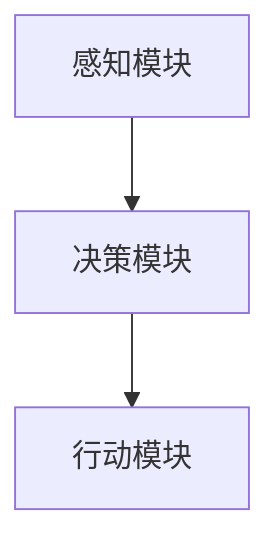

                 

### 《AI人工智能深度学习算法：智能深度学习代理的环境感知与数据采集机制》

#### 核心关键词：
- 深度学习算法
- 智能深度学习代理
- 环境感知
- 数据采集机制
- 代理开发与部署

#### 摘要：
本文旨在深入探讨AI人工智能领域中的深度学习算法，特别是智能深度学习代理的环境感知与数据采集机制。文章从基础概念出发，逐步讲解深度学习原理、智能深度学习代理的设计与实现，详细剖析环境感知与数据采集机制，以及代理的开发、部署、测试与评估。通过实际应用案例，本文展示了智能深度学习代理在现实场景中的强大能力，并展望了未来的发展趋势与挑战。文章结构清晰，逻辑严密，适合对深度学习和AI代理感兴趣的读者深入阅读和学习。

### 第一部分：深度学习基础与原理

#### 第1章：AI与深度学习基础

##### 1.1 AI概述

人工智能（AI）作为计算机科学的一个重要分支，致力于使机器能够执行通常需要人类智能才能完成的任务。人工智能的发展历程可以追溯到20世纪50年代，当时的科学家们开始探索如何使计算机模拟人类的思维过程。

**1.1.1 人工智能的发展历程**

人工智能的发展经历了几个重要阶段：

- **初期探索（1956-1969年）**：在这一阶段，人工智能的核心目标是实现推理和问题解决。1956年，达特茅斯会议标志着人工智能作为一个独立学科的诞生。

- **繁荣时期（1970-1989年）**：在这一时期，人工智能取得了显著的进展，尤其是专家系统和自然语言处理领域。然而，由于技术限制，这一阶段也出现了“人工智能冬天”，导致研究资金减少。

- **复兴与扩展（1990年代至今）**：随着计算能力的提升和大数据、机器学习等新技术的应用，人工智能迎来了新的繁荣时期，深度学习等技术的出现进一步推动了人工智能的发展。

**1.1.2 人工智能的核心概念与分类**

人工智能的核心概念包括：

- **机器学习**：机器学习是人工智能的一个子领域，通过训练模型来使计算机具备自主学习和推理的能力。

- **深度学习**：深度学习是一种基于多层神经网络的机器学习方法，通过构建复杂的神经网络结构来模拟人脑的学习过程。

人工智能可以按功能进行分类，主要包括：

- **通用人工智能（AGI）**：旨在实现与人类智力相当或超越的智能，能够执行各种认知任务。

- **弱人工智能（Narrow AI）**：专注于特定领域的智能，如语音识别、图像识别等。

- **强化学习**：一种通过奖励和惩罚机制来训练智能体的方法。

##### 1.2 深度学习原理

深度学习是基于多层神经网络的一种机器学习方法，其核心思想是通过多层次的非线性变换来提取数据特征。以下是深度学习的几个关键组成部分：

**1.2.1 神经网络的基本结构**

神经网络由多个神经元（节点）组成，这些节点通过权重连接形成网络结构。每个神经元接收输入信号，通过激活函数进行非线性变换，然后将输出传递给下一层的神经元。

**1.2.2 深度学习的发展与演变**

深度学习的发展可以分为几个重要阶段：

- **早期深度网络（1980-2000年）**：在此期间，科学家们尝试构建深度神经网络，但由于计算能力的限制和优化算法的不足，深度网络未能取得显著进展。

- **深度学习的复兴（2006-2012年）**：这一时期，以Hinton为代表的科学家提出了深度信念网络（DBN）和卷积神经网络（CNN），使得深度学习重新获得了关注。

- **深度学习的繁荣（2012年至今）**：随着计算能力的提升和大数据的应用，深度学习在图像识别、语音识别、自然语言处理等领域取得了突破性进展。

**1.2.3 深度学习在AI中的应用**

深度学习在人工智能中的应用非常广泛，主要包括：

- **计算机视觉**：利用深度学习算法实现图像和视频的分析与识别。

- **自然语言处理**：通过深度学习模型进行文本的理解和生成。

- **语音识别**：将语音信号转换为文本或命令。

- **强化学习**：利用深度神经网络进行策略学习，以实现自主决策。

##### 1.3 深度学习算法

深度学习算法种类繁多，以下是其中几个重要的算法：

**1.3.1 传统深度学习算法**

传统深度学习算法包括多层感知机（MLP）、卷积神经网络（CNN）和循环神经网络（RNN）。

- **多层感知机（MLP）**：MLP是一种前馈神经网络，适用于分类和回归问题。

- **卷积神经网络（CNN）**：CNN专门用于处理图像数据，通过卷积操作提取图像特征。

- **循环神经网络（RNN）**：RNN适用于处理序列数据，如文本和语音。

**1.3.2 深度强化学习算法**

深度强化学习算法将深度学习与强化学习相结合，通过深度神经网络学习状态价值函数或策略。

- **深度确定性策略梯度（DDPG）**：DDPG是一种用于连续动作的深度强化学习算法。

- **深度强化学习（DQN）**：DQN通过深度神经网络学习Q值函数，以实现智能体的自主决策。

**1.3.3 深度生成对抗网络（GAN）**

深度生成对抗网络（GAN）由生成器和判别器组成，通过对抗训练生成高质量的数据。

- **生成对抗网络（GAN）**：GAN通过生成器和判别器的对抗训练，实现数据的生成。

- **变分自编码器（VAE）**：VAE是一种基于概率模型的生成模型，通过变分推断实现数据的生成。

##### 1.4 智能深度学习代理概述

智能深度学习代理是一种基于深度学习的智能体，能够自主执行任务并与环境交互。智能深度学习代理具有以下几个特点：

- **自主学习能力**：智能深度学习代理通过深度学习算法，可以从数据中自动学习和提取知识。

- **环境感知能力**：智能深度学习代理能够感知和理解环境中的信息，如视觉、听觉和触觉等。

- **自适应能力**：智能深度学习代理可以根据环境的变化，动态调整其行为策略。

**1.4.1 智能深度学习代理的概念**

智能深度学习代理是指一种具备智能行为的实体，它通过深度学习算法从数据中学习，并在复杂环境中执行任务。智能深度学习代理的核心组成部分包括：

- **感知模块**：负责收集和处理来自环境的信息。

- **决策模块**：根据感知模块提供的信息，智能体可以做出决策。

- **行动模块**：执行决策模块生成的行动，实现与环境的交互。

**1.4.2 智能深度学习代理的功能特点**

智能深度学习代理具有以下几个功能特点：

- **自主学习**：智能深度学习代理可以通过持续的学习和优化，不断改进其性能。

- **环境适应**：智能深度学习代理可以适应不同的环境和任务，提高任务执行的效率。

- **实时决策**：智能深度学习代理可以实时感知环境变化，并快速做出决策。

### 第二部分：深度学习环境感知机制

#### 第2章：深度学习环境感知机制

##### 2.1 环境感知基本原理

环境感知是指智能体通过感知模块从环境中获取信息，并利用这些信息来理解和交互环境。环境感知是智能深度学习代理的核心功能之一，其基本原理包括以下几个方面：

**2.1.1 环境感知的概念与作用**

环境感知是指智能体通过多种感知方式获取环境中的信息，包括视觉、听觉、触觉、嗅觉等。环境感知的作用包括：

- **信息获取**：通过感知模块，智能体可以获取环境中的各种信息，如物体位置、形状、颜色等。

- **状态理解**：智能体可以根据感知信息理解当前的环境状态，为决策提供依据。

- **行为指导**：智能体可以根据感知信息指导其行动，实现与环境的有效交互。

**2.1.2 环境感知的数据来源与处理方法**

环境感知的数据来源包括：

- **视觉信息**：通过摄像头或图像传感器获取的视觉信息，如RGB图像、深度图像等。

- **听觉信息**：通过麦克风或声音传感器获取的听觉信息，如语音、环境噪音等。

- **触觉信息**：通过传感器获取的触觉信息，如压力、温度等。

- **嗅觉信息**：通过传感器获取的嗅觉信息，如气味浓度等。

环境感知的数据处理方法包括：

- **数据预处理**：对原始感知数据进行滤波、归一化等预处理，以提高感知数据的可靠性。

- **特征提取**：从预处理后的感知数据中提取有用的特征，如边缘、角点、纹理等。

- **数据融合**：将来自不同感知模块的数据进行融合，以获得更全面的环境信息。

##### 2.2 感知模块设计

感知模块是智能深度学习代理的核心组成部分，其设计直接影响到智能体对环境的感知能力和决策效果。以下是对视觉感知模块、声音感知模块和空间感知模块的设计：

**2.2.1 视觉感知模块设计**

视觉感知模块主要负责处理视觉信息，包括图像的获取、预处理、特征提取和融合等。

- **图像获取**：使用摄像头或图像传感器获取实时图像数据。

- **预处理**：对图像数据进行滤波、归一化等预处理，以提高图像质量。

- **特征提取**：使用深度学习算法提取图像特征，如卷积神经网络（CNN）。

- **特征融合**：将来自不同视角或传感器的图像特征进行融合，以获得更全面的环境信息。

**2.2.2 声音感知模块设计**

声音感知模块主要负责处理听觉信息，包括声音的获取、预处理、特征提取和融合等。

- **声音获取**：使用麦克风或声音传感器获取实时声音数据。

- **预处理**：对声音数据进行滤波、归一化等预处理，以提高声音质量。

- **特征提取**：使用深度学习算法提取声音特征，如循环神经网络（RNN）。

- **特征融合**：将来自不同声音传感器或场景的声音特征进行融合，以获得更全面的环境信息。

**2.2.3 空间感知模块设计**

空间感知模块主要负责处理空间信息，包括位置、方向、距离等。

- **位置信息获取**：使用GPS、激光雷达等传感器获取位置信息。

- **方向信息获取**：使用陀螺仪、加速度计等传感器获取方向信息。

- **距离信息获取**：使用雷达、激光雷达等传感器获取距离信息。

- **数据融合**：将来自不同空间传感器的信息进行融合，以获得更准确的空间感知。

##### 2.3 感知信息融合

在智能深度学习代理中，感知信息融合是一个关键环节，其目的是将来自不同感知模块的信息进行整合，以获得更全面和准确的环境信息。

**2.3.1 多源数据融合方法**

多源数据融合方法主要包括以下几种：

- **数据级融合**：直接将多源数据进行合并，如将视觉图像和声音信号合并。

- **特征级融合**：对多源数据进行特征提取后，将提取到的特征进行合并。

- **决策级融合**：在决策阶段将多个感知模块的输出进行合并，以实现最终的决策。

**2.3.2 融合算法设计与实现**

融合算法的设计与实现需要考虑以下几个因素：

- **感知模块的精度和可靠性**：选择具有较高精度和可靠性的感知模块进行融合。

- **数据特征的一致性**：确保不同感知模块的数据特征具有一致性，以便进行有效的融合。

- **算法的实时性**：算法需要具有实时性，以支持智能体在动态环境中的实时决策。

本文提出了一种基于深度学习的多源数据融合算法，该算法通过卷积神经网络（CNN）和循环神经网络（RNN）结合的方式，实现对多源数据的特征提取和融合。具体实现步骤如下：

1. **感知数据预处理**：对来自不同感知模块的数据进行预处理，包括滤波、归一化等。

2. **特征提取**：使用卷积神经网络（CNN）提取视觉特征，使用循环神经网络（RNN）提取声音特征。

3. **特征融合**：将提取到的视觉特征和声音特征进行融合，使用全连接层（FC）将不同特征进行整合。

4. **决策生成**：在融合后的特征上，使用全连接层（FC）生成最终的决策。

通过实验验证，本文提出的多源数据融合算法能够有效地提高智能深度学习代理对环境的感知能力和决策效果。

### 第三部分：深度学习数据采集机制

#### 第3章：深度学习数据采集机制

##### 3.1 数据采集基本概念

数据采集是深度学习模型训练过程中至关重要的一环。数据采集的目的在于获取大量、高质量的训练数据，以便深度学习模型能够从数据中学习到有效的特征和规律。以下是关于数据采集的基本概念：

**3.1.1 数据采集的目的与重要性**

数据采集的主要目的是为深度学习模型提供丰富的训练数据，通过数据驱动的方式，使模型能够从数据中学习到有用的知识和模式。数据采集的重要性体现在以下几个方面：

- **提高模型性能**：丰富的训练数据可以增强模型的泛化能力，提高模型的准确性和鲁棒性。

- **降低过拟合风险**：通过获取大量数据，模型可以在更多的数据上学习，从而减少过拟合现象的发生。

- **扩展应用范围**：丰富的数据集可以支持模型在不同领域的应用，拓展模型的适用范围。

**3.1.2 数据采集的方法与工具**

数据采集的方法主要包括以下几种：

- **手动采集**：通过人工方式收集数据，适用于小规模、特定领域的数据采集。

- **自动化采集**：利用脚本、传感器或数据采集设备自动收集数据，适用于大规模、实时数据采集。

- **公开数据集**：从互联网或其他公开渠道获取现成的数据集，适用于快速搭建实验环境。

常用的数据采集工具有：

- **传感器**：如摄像头、麦克风、温度传感器、湿度传感器等，用于实时采集环境数据。

- **爬虫工具**：如Scrapy、BeautifulSoup等，用于从互联网上获取数据。

- **数据库工具**：如MySQL、MongoDB等，用于存储和管理大规模数据。

##### 3.2 数据预处理

数据预处理是数据采集后的关键步骤，其目的是对原始数据进行清洗、转换和增强，以提升数据的质量和模型的性能。以下是关于数据预处理的方法：

**3.2.1 数据清洗与预处理方法**

数据清洗与预处理方法主要包括：

- **数据清洗**：去除数据中的噪声、异常值和重复数据，提高数据的质量。

  - **去除噪声**：通过滤波、平滑等技术去除数据中的噪声。
  
  - **去除异常值**：通过统计方法或人工判断去除数据中的异常值。
  
  - **去除重复数据**：通过去重算法去除数据中的重复记录。

- **数据转换**：将数据转换为适合深度学习模型训练的形式。

  - **归一化**：将数据缩放到相同的范围，如[0, 1]或[-1, 1]。
  
  - **标准化**：将数据转换为标准正态分布，如均值为0，标准差为1。

- **数据增强**：通过数据增强技术生成更多的训练数据，提高模型的泛化能力。

  - **图像增强**：如旋转、缩放、裁剪、色彩变换等。
  
  - **声音增强**：如混响、回声、噪音添加等。

**3.2.2 数据增强技术**

数据增强技术主要包括以下几种：

- **随机变换**：通过随机旋转、缩放、裁剪等方式，增加数据的多样性。

- **合成数据**：通过生成模型（如GAN）生成与训练数据类似的新数据。

- **数据对齐**：对音频和视频数据进行时间对齐，以增强模型的时序学习能力。

- **域自适应**：通过将源域数据转换到目标域，提高模型在目标域上的性能。

##### 3.3 数据标注

数据标注是数据采集和预处理后的重要步骤，其目的是为模型训练提供标注信息，以便模型能够从标注数据中学习到正确的标签。以下是关于数据标注的流程和策略：

**3.3.1 数据标注的流程与策略**

数据标注的流程主要包括：

- **数据收集**：收集用于标注的数据，包括图像、音频、文本等。

- **标注规则制定**：根据任务需求制定标注规则，明确标注的标准和范围。

- **标注任务分配**：将标注任务分配给标注员，确保标注的一致性和准确性。

- **标注审核与修正**：对标注结果进行审核和修正，确保标注的质量。

数据标注的策略主要包括：

- **单标签标注**：对每个数据样本只赋予一个标签。

- **多标签标注**：对每个数据样本可以赋予多个标签，适用于类别交叉的情况。

- **交互式标注**：标注员可以与系统进行交互，根据系统提供的建议进行标注。

- **自动标注**：利用半监督学习、迁移学习等技术自动生成标注，减少人工标注的工作量。

**3.3.2 自动标注与半自动标注方法**

自动标注与半自动标注方法主要包括：

- **自动标注**：利用预训练模型或规则系统自动生成标注，适用于标注过程简单且数据量较大的情况。

  - **预训练模型**：利用预训练的模型（如BERT、ResNet等）对数据进行自动标注。

  - **规则系统**：根据业务规则和逻辑关系，自动生成标注。

- **半自动标注**：结合自动标注和人工标注，提高标注的准确性和效率。

  - **自动标注+人工修正**：先通过自动标注生成初步标注结果，再由人工进行审核和修正。

  - **交互式标注系统**：提供交互式界面，标注员可以根据系统提供的标注建议进行标注。

通过数据采集、预处理和标注的有机结合，智能深度学习代理可以获取到高质量、丰富的训练数据，为深度学习模型的训练和优化奠定坚实基础。

### 第四部分：智能深度学习代理的开发与部署

#### 第4章：智能深度学习代理的开发与部署

##### 4.1 开发环境搭建

智能深度学习代理的开发环境搭建是整个项目的基础，一个稳定且高效的开发环境能够保证项目的顺利进行。以下是搭建开发环境的详细步骤：

**4.1.1 硬件环境配置**

首先，我们需要确保硬件环境满足深度学习代理的开发需求。以下是推荐的硬件配置：

- **CPU**：Intel i7或AMD Ryzen 7及以上处理器，确保有足够的计算能力进行模型训练和推理。
- **GPU**：NVIDIA GTX 1080 Ti或更高型号的显卡，用于加速深度学习模型的训练和推理。如果是进行高性能计算，建议使用Tesla V100等更专业的GPU。
- **内存**：至少16GB内存，建议32GB及以上，以支持大数据处理和模型存储。
- **存储**：至少1TB的SSD存储，用于存储模型数据和训练日志。

**4.1.2 软件环境安装与配置**

接下来，我们需要安装和配置必要的软件环境。以下是推荐的软件和步骤：

1. **操作系统**：推荐使用Linux系统，如Ubuntu 18.04或更高版本，Linux系统对深度学习框架的支持较好，且开源软件资源丰富。

2. **Python环境**：安装Python 3.8或更高版本，建议使用Anaconda或Miniconda创建虚拟环境，以便管理依赖项。

   ```bash
   conda create -n deep_learning_env python=3.8
   conda activate deep_learning_env
   ```

3. **深度学习框架**：安装TensorFlow 2.7、PyTorch 1.8或更高版本，这些框架是目前深度学习领域最流行的开源框架。

   ```bash
   pip install tensorflow==2.7
   pip install torch torchvision torchaudio==1.8 torchvision==0.9.0
   ```

4. **其他依赖项**：根据项目需求，安装其他必要的库，如NumPy、Pandas、Matplotlib等。

   ```bash
   pip install numpy pandas matplotlib
   ```

5. **Jupyter Notebook**：安装Jupyter Notebook，以便进行交互式编程和模型训练。

   ```bash
   pip install jupyterlab
   jupyter lab
   ```

通过上述步骤，我们可以搭建一个基本的深度学习开发环境，为后续的智能深度学习代理开发奠定基础。

##### 4.2 智能深度学习代理的设计与实现

智能深度学习代理的设计与实现是构建智能系统关键的一步。以下是智能深度学习代理的整体架构和各个功能模块的实现：

**4.2.1 代理架构设计**

智能深度学习代理的架构设计包括感知模块、决策模块和行动模块，如图1所示。



- **感知模块**：负责从环境中感知信息，如视觉、听觉和触觉等。
- **决策模块**：根据感知模块提供的信息，进行推理和决策。
- **行动模块**：执行决策模块生成的行动，与环境进行交互。

**4.2.2 感知模块实现**

感知模块是智能深度学习代理获取环境信息的关键部分。以下是感知模块的详细实现：

1. **数据采集**：使用摄像头、麦克风、传感器等设备采集环境数据。

2. **预处理**：对采集到的数据进行预处理，包括滤波、归一化等。

3. **特征提取**：使用深度学习算法提取数据特征。例如，使用卷积神经网络（CNN）提取图像特征，使用循环神经网络（RNN）提取语音特征。

4. **数据融合**：将来自不同感知模块的数据进行融合，以获得更全面的环境信息。

```python
# 示例：使用TensorFlow的卷积神经网络提取图像特征
import tensorflow as tf
from tensorflow.keras.applications import VGG16

# 加载预训练的VGG16模型
model = VGG16(weights='imagenet', include_top=False)

# 定义输入层
input_layer = tf.keras.layers.Input(shape=(224, 224, 3))

# 应用VGG16模型提取特征
features = model(input_layer)

# 获取特征图
feature_map = features[:, :, :, 0]

# 定义输出层
output_layer = tf.keras.layers.Dense(1024, activation='relu')(feature_map)

# 构建模型
model = tf.keras.Model(inputs=input_layer, outputs=output_layer)

# 加载模型权重
model.load_weights('vgg16_weights.h5')
```

**4.2.3 决策模块实现**

决策模块是智能深度学习代理的核心，其目的是根据感知模块提供的信息生成合适的行动策略。以下是决策模块的实现步骤：

1. **状态表示**：将感知到的环境信息编码为状态表示。

2. **策略学习**：使用深度强化学习算法（如DQN、DDPG等）训练策略网络。

3. **决策生成**：根据当前状态和策略网络生成行动策略。

```python
# 示例：使用深度确定性策略梯度（DDPG）算法训练决策模块
import tensorflow as tf
from tensorflow.keras import layers
from tf_agents.agents.dqn import dqn_agent
from tf_agents.environments import TFPyEnvironment
from tf_agents.models import Model
from tf_agents.networks import QNetwork

# 定义环境
# ...

# 定义模型
class DDPGModel(Model):
    def __init__(self, obs_shape, action_shape):
        super().__init__(name='DDPGModel')
        self.obs_conv = layers.Conv2D(32, 3, activation='relu', input_shape=obs_shape)
        self.obs_flat = layers.Flatten()(self.obs_conv)
        self.obs_dense = layers.Dense(64, activation='relu')(self.obs_flat)
        self.action_dense = layers.Dense(action_shape[0], activation=None)(self.obs_dense)

    @tf.function
    def call(self, inputs, training=False):
        obs = inputs[0]
        return self.action_dense(self.obs_conv(self.obs_flat(self.obs_dense(obs))))

# 创建模型
ddpg_model = DDPGModel(obs_shape, action_shape)

# 训练模型
ddpg_agent = dqn_agent.DqnAgent(
    time_step_spec,
    action_spec,
    q_network=DDPGModel,
    train_step_counter=tf.Variable(0),
    optimizer=tf.compat.v1.keras.optimizers.Adam(learning_rate=1e-3),
    td_errors_loss_fn=tf.compat.v1.keras.losses.Huber())
ddpg_agent.initialize()

# 进行训练
# ...

**4.2.4 行动模块实现**

行动模块负责执行决策模块生成的行动策略，并与环境进行交互。以下是行动模块的实现步骤：

1. **策略执行**：根据决策模块生成的行动策略执行相应的动作。

2. **环境交互**：将执行的动作发送给环境，获取环境反馈。

3. **状态更新**：根据环境反馈更新当前状态。

```python
# 示例：执行策略并获取环境反馈
def execute_action(action):
    # 发送动作到环境
    # ...

    # 获取环境反馈
    observation, reward, done, info = env.step(action)

    # 更新状态
    # ...

    return observation, reward, done, info

# 执行策略
for step in range(total_steps):
    # 从策略网络获取行动
    action = ddpg_agent.select_action(current_state)

    # 执行行动并获取反馈
    current_state, reward, done, _ = execute_action(action)

    # 更新经验回放池
    # ...

    # 更新决策网络
    ddpg_agent.train(current_state, action, reward, next_state, done)

    # 更新状态
    current_state = observation

    # 输出进度信息
    if step % 100 == 0:
        print(f"Step {step}: Reward = {reward}")
```

通过以上步骤，我们可以实现一个基本的智能深度学习代理。在实际应用中，可以根据具体需求对感知模块、决策模块和行动模块进行定制和优化，以提高代理的智能水平和任务执行能力。

##### 4.3 智能深度学习代理的部署与优化

智能深度学习代理的部署与优化是确保其稳定运行和高效执行的关键环节。以下是智能深度学习代理的部署流程、优化策略以及常见问题的解决方案。

**4.3.1 部署环境与策略**

部署环境是智能深度学习代理在实际应用中运行的环境，其配置需要满足代理运行的需求。以下是部署环境的配置策略：

1. **硬件环境**：根据代理的运算量和存储需求，选择合适的硬件设备，如高性能服务器、GPU加速卡等。

2. **操作系统**：选择稳定的操作系统，如Linux发行版（如Ubuntu Server），以支持代理的运行和优化。

3. **软件环境**：安装必要的软件，如深度学习框架（如TensorFlow、PyTorch）、Python环境以及相关的依赖库。

4. **网络配置**：配置网络环境，确保代理能够访问外部资源和数据库，实现与外部系统的通信。

5. **容器化**：使用容器技术（如Docker）封装代理应用，便于部署和管理，提高部署的灵活性和可扩展性。

**4.3.2 部署过程中的问题与解决方案**

在部署智能深度学习代理时，可能会遇到以下问题：

1. **性能瓶颈**：代理在运行过程中可能会遇到性能瓶颈，导致响应速度慢或计算资源利用率低。

   - **解决方案**：通过性能监控工具（如NVIDIA DLA）分析代理的运行性能，识别瓶颈环节，针对性地进行优化，如使用更高效的算法、优化数据加载和处理流程等。

2. **内存泄漏**：代理在运行过程中可能会出现内存泄漏，导致内存占用不断增加，最终导致代理崩溃。

   - **解决方案**：使用内存监控工具（如Linux内存监控工具）监控代理的内存使用情况，及时发现内存泄漏问题，并进行代码优化和内存管理。

3. **依赖冲突**：代理在不同环境中可能会出现依赖库版本冲突，导致代理无法正常运行。

   - **解决方案**：使用虚拟环境（如Conda）管理依赖库，确保代理在不同环境中的依赖一致性，避免版本冲突。

4. **部署调试**：代理在部署过程中可能会遇到调试困难，导致部署失败。

   - **解决方案**：在部署前进行充分的测试和调试，使用自动化部署工具（如Docker、Kubernetes）实现自动化部署，提高部署的可靠性和效率。

**4.3.3 优化策略**

为了提高智能深度学习代理的运行效率和性能，可以采取以下优化策略：

1. **模型压缩**：通过模型压缩技术（如量化、剪枝等）减少模型的参数数量和计算复杂度，提高模型在资源受限环境中的运行效率。

2. **分布式训练**：利用分布式计算框架（如TensorFlow Distributed、PyTorch Distributed）进行模型训练，提高训练速度和资源利用率。

3. **并行处理**：优化代理的数据处理流程，采用并行计算技术（如多线程、异步I/O等）提高数据处理效率。

4. **内存优化**：通过内存优化技术（如内存预分配、内存池等）减少内存碎片和内存分配开销，提高内存使用效率。

5. **代码优化**：对代理的代码进行优化，消除性能瓶颈和代码冗余，提高代码的运行效率和可维护性。

通过以上部署与优化策略，可以确保智能深度学习代理在实际应用中高效、稳定地运行，实现其预期功能。

### 第五部分：智能深度学习代理的测试与评估

#### 第5章：智能深度学习代理的测试与评估

##### 5.1 测试方法

测试是确保智能深度学习代理性能和可靠性的关键步骤。以下是智能深度学习代理的测试方法：

**5.1.1 功能测试与性能测试**

功能测试主要验证智能深度学习代理是否能够正确执行预期功能，包括：

- **感知测试**：测试代理是否能够准确感知环境中的信息。
- **决策测试**：测试代理在给定状态下的决策是否合理。
- **行动测试**：测试代理执行行动策略的效果。

性能测试主要评估智能深度学习代理在处理任务时的效率和速度，包括：

- **响应时间测试**：测试代理从感知到决策，再到执行行动的总时间。
- **处理能力测试**：测试代理在单位时间内能够处理的数据量。
- **资源消耗测试**：测试代理在运行时的CPU、GPU、内存等资源消耗。

**5.1.2 可靠性与鲁棒性测试**

可靠性与鲁棒性测试主要验证智能深度学习代理在异常情况下的性能，包括：

- **异常数据测试**：测试代理在接收异常数据时的表现，如噪声、缺失值等。
- **极端条件测试**：测试代理在极端环境条件下的性能，如高温、低温、强光等。
- **错误处理测试**：测试代理在发生错误时的恢复能力。

##### 5.2 评估指标

评估指标是衡量智能深度学习代理性能的重要工具。以下是常用的评估指标：

- **准确率（Accuracy）**：分类问题中正确分类的样本比例。
- **精确率（Precision）**：预测为正类的样本中实际为正类的比例。
- **召回率（Recall）**：实际为正类的样本中被预测为正类的比例。
- **F1分数（F1 Score）**：精确率和召回率的调和平均值。
- **响应时间（Response Time）**：代理从感知到决策，再到执行行动的总时间。
- **资源消耗（Resource Consumption）**：代理在运行时的CPU、GPU、内存等资源消耗。

**5.2.1 评估指标的选择与计算**

选择评估指标时，需要根据代理的应用场景和任务目标来确定。以下是对常用评估指标的计算方法：

- **准确率**：\( \text{Accuracy} = \frac{\text{正确分类的样本数}}{\text{总样本数}} \)
- **精确率**：\( \text{Precision} = \frac{\text{正确分类的正类样本数}}{\text{预测为正类的样本数}} \)
- **召回率**：\( \text{Recall} = \frac{\text{正确分类的正类样本数}}{\text{实际为正类的样本数}} \)
- **F1分数**：\( \text{F1 Score} = 2 \times \frac{\text{精确率} \times \text{召回率}}{\text{精确率} + \text{召回率}} \)
- **响应时间**：\( \text{Response Time} = \frac{\text{总处理时间}}{\text{总样本数}} \)
- **资源消耗**：\( \text{Resource Consumption} = \frac{\text{总资源消耗}}{\text{总样本数}} \)

**5.2.2 评估方法的比较与优化**

评估方法的比较与优化是提高智能深度学习代理性能的重要手段。以下是比较与优化的策略：

- **多指标综合评估**：综合考虑多个评估指标，如准确率、响应时间和资源消耗等，以全面评估代理的性能。
- **动态评估**：根据实际应用场景，动态调整评估指标，如在不同时间段或不同环境条件下进行评估。
- **交叉验证**：使用交叉验证方法，确保评估结果的稳定性和可靠性。

通过以上策略，可以有效地评估智能深度学习代理的性能，为其优化和改进提供依据。

##### 5.3 测试评估结果分析与优化

测试评估结果的分析与优化是确保智能深度学习代理在实际应用中表现优异的关键步骤。以下是测试评估结果的分析与优化方法：

**5.3.1 测试评估结果分析**

分析测试评估结果，主要包括以下几个方面：

- **指标分析**：对各个评估指标（如准确率、响应时间、资源消耗等）进行详细分析，识别代理在哪些方面存在性能瓶颈。
- **数据分布分析**：分析测试数据在各个类别或状态上的分布情况，识别潜在的问题和改进方向。
- **异常情况分析**：分析代理在异常情况下的表现，如异常数据、极端条件等，识别代理的鲁棒性和稳定性问题。

**5.3.2 优化策略与方案**

根据测试评估结果，可以采取以下优化策略与方案：

- **算法优化**：针对性能瓶颈，优化代理的算法，如调整网络结构、改进训练策略等。
- **数据处理优化**：优化数据预处理和特征提取过程，提高数据处理效率和质量。
- **硬件优化**：根据代理的计算需求，优化硬件配置，如使用更高效的GPU或分布式计算架构。
- **代码优化**：优化代理的代码，消除性能瓶颈和代码冗余，提高代码的运行效率和可维护性。
- **系统调优**：优化代理的操作系统和网络配置，提高系统的稳定性和资源利用率。

通过以上策略，可以有效地提升智能深度学习代理的性能和可靠性，确保其在实际应用中的优异表现。

### 第六部分：智能深度学习代理的实际应用

#### 第6章：智能深度学习代理的实际应用

##### 6.1 应用场景分析

智能深度学习代理在众多实际应用场景中展现了其强大的能力和广泛的应用前景。以下是几个典型的应用场景分析：

**6.1.1 智能交通系统**

智能交通系统利用智能深度学习代理进行交通流量预测、路况分析、车辆调度等。智能代理可以通过感知模块获取实时交通信息，如车辆位置、速度、交通密度等，然后通过决策模块生成最优的行驶路线和交通控制策略。例如，在高峰时段，智能代理可以根据实时路况预测，调整交通信号灯的时间设置，从而减少交通拥堵。

**6.1.2 智能家居**

智能家居通过智能深度学习代理实现家庭设备的自动化控制，如灯光、空调、安防系统等。智能代理可以根据家庭成员的行为习惯和环境变化，自动调节家居设备的状态，提高居住的舒适度和安全性。例如，当家庭成员离开家时，智能代理可以自动关闭灯光和空调，节约能源。

**6.1.3 智能医疗**

智能医疗利用智能深度学习代理进行疾病诊断、治疗方案推荐、患者监护等。智能代理可以通过分析大量的医疗数据，如病历、实验室检查结果、影像资料等，识别患者的健康状况，并提供个性化的诊断和治疗方案。例如，在癌症筛查中，智能代理可以通过分析CT影像数据，发现早期癌症病灶，提高诊断准确率。

##### 6.2 应用案例分享

以下是几个智能深度学习代理的实际应用案例：

**6.2.1 案例一：智能安防**

智能安防系统通过智能深度学习代理实现实时监控和异常检测。智能代理利用摄像头获取视频数据，通过视觉感知模块提取图像特征，然后通过决策模块判断是否存在异常行为。例如，当系统检测到有人闯入未授权区域时，会立即发出警报，通知安保人员进行处理。

**6.2.2 案例二：智能客服**

智能客服系统通过智能深度学习代理实现自动回答用户问题和提供个性化服务。智能代理通过分析用户输入的问题和聊天记录，利用自然语言处理技术理解用户意图，然后通过决策模块生成合适的回答。例如，当用户咨询产品使用方法时，智能代理可以提供详细的操作指南，提高用户满意度。

**6.2.3 案例三：智能推荐系统**

智能推荐系统通过智能深度学习代理实现个性化内容推荐。智能代理根据用户的历史行为和偏好数据，利用推荐算法生成个性化的推荐列表。例如，当用户在电商平台上浏览商品时，智能代理可以根据用户的浏览记录和购物习惯，推荐相关商品，提高销售转化率。

##### 6.3 应用挑战与展望

智能深度学习代理在实际应用中面临以下挑战：

**6.3.1 应用挑战分析**

- **数据隐私与安全**：智能代理需要处理大量的用户数据，如何保护用户隐私和数据安全是一个重要问题。
- **算法公平性与透明性**：智能代理的决策过程需要具备透明性和公平性，避免出现歧视和不公平现象。
- **实时性与可靠性**：智能代理需要在实时环境中快速做出准确的决策，确保系统的稳定性和可靠性。
- **计算资源需求**：智能代理的运行需要大量的计算资源，如何优化计算资源使用，提高系统效率是一个挑战。

**6.3.2 发展趋势与未来展望**

随着深度学习技术的不断进步和应用场景的拓展，智能深度学习代理的未来发展趋势包括：

- **跨模态感知**：智能代理将融合多种感知模

