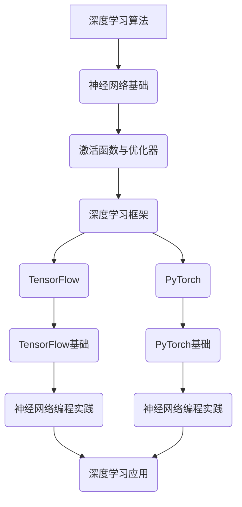

                 

### 文章标题

“AI人工智能深度学习算法：知识图谱在深度学习代理中的应用”

关键词：深度学习、知识图谱、深度学习代理、算法、AI应用、自然语言处理、计算机视觉、推荐系统、智能问答系统

摘要：本文将深入探讨深度学习算法与知识图谱的结合，分析知识图谱在深度学习代理中的应用，探讨深度学习算法在自然语言处理、计算机视觉、推荐系统和智能问答系统中的应用，并通过实际项目案例进行代码解读与分析，为读者提供对这一前沿领域的技术理解与实践指导。

### 第一部分: 深度学习算法基础

#### 第1章: 深度学习概述

深度学习是人工智能的一个重要分支，通过模拟人脑神经网络的工作方式，对大量数据进行自动学习和模式识别。其起源可以追溯到20世纪40年代，但是直到最近几年，随着计算能力和数据量的提升，深度学习才取得了显著的突破。

**1.1 深度学习的起源与发展**

深度学习的概念最早由Frank Rosenblatt于1957年提出，他设计了感知机（Perceptron）这一简单的人工神经网络模型。然而，由于早期计算能力的限制和算法上的不足，深度学习并没有得到广泛的应用。

直到1980年代，神经网络的研究受到了冷落。然而，在21世纪初，随着GPU的出现和深度学习算法的改进，深度学习迎来了新的发展机遇。2006年，Geoffrey Hinton等人提出了深度信念网络（DBN），标志着深度学习重新崛起。

**1.2 深度学习的基本概念**

深度学习是一种基于多层神经网络的机器学习方法，其核心思想是通过学习大量的数据来提取特征，并通过层次化的方式将这些特征传递到更高的层次，从而实现复杂任务的自动完成。

- **神经网络**：神经网络是深度学习的基础，它由大量简单的计算单元（神经元）组成，通过调整神经元之间的连接权重来学习数据中的特征。
- **多层神经网络**：多层神经网络由多个隐藏层组成，通过逐层学习数据的高级特征，从而实现更复杂的任务。
- **深度学习算法**：包括卷积神经网络（CNN）、循环神经网络（RNN）、生成对抗网络（GAN）等，每种算法都有其特定的结构和应用场景。

**1.3 深度学习的核心架构**

深度学习的核心架构包括以下几个关键组件：

- **输入层**：接收输入数据，并将其传递到隐藏层。
- **隐藏层**：通过激活函数对输入数据进行处理，提取特征信息。
- **输出层**：根据隐藏层的输出进行分类或回归。
- **损失函数**：用于衡量模型预测结果与实际结果之间的差距，并指导模型的训练过程。
- **优化器**：用于调整模型参数，使损失函数达到最小。

#### 第2章: 神经网络基础

神经网络是深度学习算法的核心组成部分，理解神经网络的基本原理和架构对于深入探讨深度学习具有重要意义。

**2.1 神经元与神经网络**

- **神经元**：神经元是神经网络的基本计算单元，它通过输入、权重和激活函数产生输出。
- **神经网络**：由大量神经元组成，通过前向传播和反向传播进行学习。

**2.2 前馈神经网络**

前馈神经网络（Feedforward Neural Network）是最简单和最常用的神经网络类型，其特点是没有循环和循环结构，信息仅能单向流动，即从输入层流向输出层。

- **结构**：前馈神经网络包括输入层、一个或多个隐藏层和输出层。
- **激活函数**：常用的激活函数包括线性激活函数（线性函数）、Sigmoid函数（S形函数）、ReLU函数（ReLU是Rectified Linear Unit的缩写，是一种修正的线性函数）等。
- **前向传播**：输入数据通过输入层进入网络，经过每个隐藏层的计算，最终输出到输出层。

**2.3 激活函数与优化器**

激活函数是神经网络中的一个关键组件，它用于引入非线性特性，使得神经网络能够处理复杂的非线性问题。

- **Sigmoid函数**：Sigmoid函数是一种常用的激活函数，其形式为 $f(x) = \frac{1}{1 + e^{-x}}$，它可以将输入映射到$(0,1)$区间内。
- **ReLU函数**：ReLU函数是一种修正的线性函数，其形式为 $f(x) = max(0, x)$，它可以在神经元死亡问题上有更好的表现。

优化器是用于调整神经网络参数的工具，目的是最小化损失函数。

- **随机梯度下降（SGD）**：SGD是一种简单而有效的优化器，其思想是通过随机选择小批量样本来更新参数，从而优化模型。
- **Adam优化器**：Adam是一种自适应的学习率优化器，结合了SGD和动量法的优点，能够更有效地优化参数。

#### 第3章: 深度学习框架

深度学习框架是为了方便构建和训练深度学习模型而设计的工具集。目前，市面上有许多流行的深度学习框架，其中最具代表性的包括TensorFlow和PyTorch。

**3.1 TensorFlow**

TensorFlow是由Google开发的开源深度学习框架，它提供了一套完整的工具和API，用于构建、训练和部署深度学习模型。

- **核心组件**：TensorFlow主要包括Tensor（多维数组）和Operation（计算操作）两个核心概念。
- **特点**：TensorFlow具有强大的扩展性和灵活性，支持多种编程语言（如Python、C++等），并且提供了丰富的预训练模型和工具库。
- **应用场景**：TensorFlow广泛应用于图像识别、自然语言处理、推荐系统等领域。

**3.2 PyTorch**

PyTorch是由Facebook AI研究院（FAIR）开发的开源深度学习框架，它以其动态计算图和简洁的API而受到广大开发者的喜爱。

- **核心组件**：PyTorch的核心组件包括Tensors（与TensorFlow类似的多维数组）和Autograd（自动微分系统）。
- **特点**：PyTorch具有动态计算图的特点，使得模型构建和调试更加方便，同时也支持分布式训练和GPU加速。
- **应用场景**：PyTorch广泛应用于图像识别、强化学习、自然语言处理等领域。

**3.3 其他深度学习框架比较**

除了TensorFlow和PyTorch，市面上还有其他一些流行的深度学习框架，如Keras、Theano、MXNet等。以下是这些框架的简要比较：

- **Keras**：Keras是一个高层次的神经网络API，旨在提供简洁和易于使用的接口。它支持TensorFlow和Theano作为后端，但PyTorch的支持更为完善。
- **Theano**：Theano是一个基于Python的开源库，用于定义、优化和评估数学表达式。它主要应用于深度学习和计算图优化。
- **MXNet**：MXNet是由Apache Software Foundation开发的开源深度学习框架，它支持多种编程语言（如Python、R、Scala等），并具有高效的分布式训练能力。

### 第二部分: 知识图谱与深度学习代理

#### 第4章: 知识图谱概述

知识图谱是一种用于表示实体、属性和关系的数据结构，它通过将现实世界中的信息进行结构化和语义化，为深度学习提供丰富的语义信息和知识背景。

**4.1 知识图谱的基本概念**

- **实体**：知识图谱中的基本元素，如人、地点、组织等。
- **属性**：描述实体的特征，如年龄、身高、位置等。
- **关系**：连接两个实体的语义关系，如属于、位于、参与等。

**4.2 知识图谱的表示方法**

知识图谱的表示方法可以分为基于图和基于矩阵两类。

- **基于图的表示方法**：使用图结构来表示实体和关系，常见的有RDF（资源描述框架）和OWL（Web本体语言）等。
- **基于矩阵的表示方法**：使用矩阵来表示实体和关系，如邻接矩阵、相似度矩阵等。

**4.3 知识图谱的应用场景**

知识图谱在许多应用场景中具有广泛的应用价值，包括自然语言处理、推荐系统、智能问答等。

- **自然语言处理**：知识图谱可以帮助NLP模型更好地理解语义信息，提高文本分类、情感分析等任务的性能。
- **推荐系统**：知识图谱可以用于构建用户和物品之间的关系网络，从而提高推荐系统的准确性。
- **智能问答**：知识图谱可以为智能问答系统提供丰富的背景知识，使其能够更准确地回答用户的问题。

#### 第5章: 深度学习代理

深度学习代理是一种基于深度学习技术的智能体，它可以在复杂环境中进行决策和行动，从而实现自主学习和智能控制。

**5.1 深度学习代理的基本概念**

- **智能体**：智能体（Agent）是一个可以感知环境并采取行动的人工智能系统，它可以自主学习并适应环境变化。
- **深度学习代理**：深度学习代理是指使用深度学习技术构建的智能体，它可以利用神经网络模型进行环境感知、决策和行动。

**5.2 深度学习代理的工作原理**

深度学习代理的工作原理可以分为感知、决策和行动三个阶段。

- **感知**：代理通过感知器获取环境状态，并将其输入到神经网络模型中。
- **决策**：神经网络模型对输入状态进行计算，生成决策结果。
- **行动**：代理根据决策结果采取相应的行动，并更新环境状态。

**5.3 深度学习代理的优缺点**

深度学习代理具有以下优点：

- **自适应能力**：深度学习代理可以自动从数据中学习环境特征，具有较强的自适应能力。
- **高效性**：深度学习代理可以利用并行计算和分布式计算技术，提高决策和行动的效率。

但深度学习代理也存在一些缺点：

- **数据依赖性**：深度学习代理的性能高度依赖于训练数据的质量和数量，数据不足或质量差可能导致性能下降。
- **黑盒性质**：深度学习代理的决策过程通常是非线性和复杂的，难以解释和验证。

#### 第6章: 知识图谱在深度学习代理中的应用

知识图谱在深度学习代理中的应用主要体现在两个方面：一是作为代理的知识库，二是作为代理的辅助工具。

**6.1 知识图谱与深度学习代理的融合**

知识图谱与深度学习代理的融合可以提升代理的智能水平和决策能力。

- **知识库增强**：知识图谱可以作为深度学习代理的知识库，提供丰富的背景知识和先验信息，从而提高代理的决策准确性。
- **交互增强**：代理可以通过知识图谱进行语义理解和推理，从而实现更自然的交互和更智能的行为。

**6.2 基于知识图谱的深度学习代理应用实例**

以下是一个基于知识图谱的深度学习代理应用实例：智能客服。

- **应用场景**：智能客服是一种基于深度学习技术的客户服务系统，它可以自动处理客户咨询，提供准确和快速的答复。
- **解决方案**：使用知识图谱构建客户知识库，包括客户信息、产品信息、常见问题等。然后，使用深度学习代理实现自然语言理解和对话生成，从而为客户提供高质量的咨询服务。

**6.3 知识图谱在深度学习代理中的挑战与机遇**

知识图谱在深度学习代理中的应用面临着一些挑战和机遇：

- **挑战**：知识图谱的构建和维护需要大量的数据和技术支持，如何有效地提取和利用知识图谱中的信息是一个重要挑战。
- **机遇**：知识图谱可以为深度学习代理提供丰富的语义信息和知识背景，从而提高代理的智能水平和决策能力。

通过知识图谱与深度学习代理的融合，我们可以构建出更加智能和高效的智能系统，为各个领域提供强大的技术支持。

### 第三部分: 深度学习算法与知识图谱在AI中的应用

#### 第7章: 深度学习算法在自然语言处理中的应用

自然语言处理（NLP）是人工智能的重要应用领域之一，深度学习算法在NLP中的应用极大地提升了文本处理和分析的能力。

**7.1 词嵌入技术**

词嵌入（Word Embedding）是将文本中的单词映射到高维向量空间的技术，它使得计算机可以理解单词的语义和语法关系。

- **概念**：词嵌入通过将单词映射到向量空间，使得具有相似语义的单词在空间中靠近，从而实现了语义的表示和计算。
- **方法**：常见的词嵌入方法包括Word2Vec、GloVe等，这些方法通过训练大规模语料库，学习单词的向量表示。

**7.2 序列模型**

序列模型（Sequential Model）是处理序列数据的深度学习模型，它可以捕捉序列中的时序关系。

- **概念**：序列模型通过将输入序列映射到隐藏状态，从而实现对序列数据的建模。
- **模型**：常见的序列模型包括循环神经网络（RNN）、长短时记忆网络（LSTM）、门控循环单元（GRU）等。

**7.3 注意力机制**

注意力机制（Attention Mechanism）是一种在序列模型中用于提高模型对关键信息的关注度的技术。

- **概念**：注意力机制通过动态调整模型对输入序列中不同位置的重视程度，从而提高模型的鲁棒性和准确性。
- **应用**：注意力机制广泛应用于机器翻译、文本摘要、问答系统等领域。

#### 第8章: 深度学习算法在计算机视觉中的应用

计算机视觉是人工智能的另一个重要应用领域，深度学习算法在计算机视觉中的应用取得了显著的成果。

**8.1 卷积神经网络（CNN）**

卷积神经网络（Convolutional Neural Network，CNN）是处理图像数据的深度学习模型，它通过卷积层和池化层对图像进行特征提取。

- **概念**：CNN通过卷积操作提取图像的局部特征，并通过池化操作降低数据的维度。
- **模型**：典型的CNN模型包括LeNet、AlexNet、VGG、ResNet等。

**8.2 递归神经网络（RNN）**

递归神经网络（Recurrent Neural Network，RNN）是处理序列数据的深度学习模型，它可以捕捉序列中的时序关系。

- **概念**：RNN通过递归连接将当前时刻的信息传递到下一个时刻，从而实现对序列数据的建模。
- **模型**：常见的RNN模型包括LSTM和GRU。

**8.3 Transformer架构**

Transformer架构是一种基于自注意力机制的深度学习模型，它在机器翻译、文本生成等领域取得了优异的性能。

- **概念**：Transformer通过多头自注意力机制，将输入序列中的每个位置与所有位置进行关联，从而实现对序列数据的建模。
- **模型**：典型的Transformer模型包括BERT、GPT等。

#### 第9章: 深度学习算法在推荐系统中的应用

推荐系统是人工智能在商业领域的应用之一，深度学习算法在推荐系统中的应用可以提升推荐系统的准确性和个性化水平。

**9.1 基于知识图谱的推荐系统**

基于知识图谱的推荐系统通过利用知识图谱中的实体和关系信息，为用户推荐相关的内容或商品。

- **概念**：知识图谱为推荐系统提供了丰富的先验知识和语义信息，使得推荐系统可以更好地理解用户的偏好和需求。
- **方法**：基于知识图谱的推荐系统通常包括知识图谱构建、实体关系分析、推荐算法等步骤。

**9.2 深度学习在推荐系统中的优化策略**

深度学习算法在推荐系统中的应用可以通过以下策略进行优化：

- **用户和物品的嵌入表示**：通过深度学习模型学习用户和物品的向量表示，提高推荐系统的准确性。
- **协同过滤与深度学习相结合**：将协同过滤算法与深度学习模型相结合，利用深度学习模型提取用户和物品的深层特征，提高推荐系统的个性化程度。
- **上下文信息利用**：利用上下文信息（如时间、位置等）来丰富推荐系统的输入，提高推荐系统的实时性和准确性。

**9.3 深度学习在推荐系统中的挑战**

深度学习在推荐系统中的应用也面临一些挑战：

- **数据质量**：推荐系统的性能高度依赖于数据的质量和数量，如何有效地处理和利用海量数据是一个重要挑战。
- **模型可解释性**：深度学习模型通常具有黑盒性质，难以解释和验证模型的决策过程，这对推荐系统的可靠性和可信度提出了挑战。
- **计算资源**：深度学习模型通常需要大量的计算资源进行训练和推理，如何高效地利用计算资源是一个重要问题。

#### 第10章: 深度学习算法与知识图谱在智能问答系统中的应用

智能问答系统是一种基于人工智能技术的人工智能系统，它可以通过自然语言理解能力，自动回答用户提出的问题。

**10.1 智能问答系统概述**

智能问答系统通常包括以下几个关键组件：

- **问题理解**：理解用户提出的问题，并提取关键信息。
- **知识检索**：从知识库中检索与问题相关的信息。
- **答案生成**：根据检索到的信息，生成准确的答案。

**10.2 知识图谱在智能问答系统中的应用**

知识图谱在智能问答系统中起着至关重要的作用，它可以为系统提供丰富的语义信息和背景知识。

- **实体关系**：知识图谱中的实体和关系可以帮助系统理解问题的语义，提高答案的准确性。
- **上下文理解**：知识图谱中的信息可以用于理解问题的上下文，从而提高问答系统的实时性和准确性。

**10.3 深度学习在智能问答系统中的优化策略**

深度学习算法在智能问答系统中可以通过以下策略进行优化：

- **多任务学习**：将问题理解、知识检索和答案生成任务整合到一个深度学习模型中，提高系统的整体性能。
- **端到端学习**：通过端到端的学习策略，直接从原始数据中学习问题理解和答案生成，减少中间步骤的复杂度。
- **注意力机制**：利用注意力机制，使模型更加关注问题中的重要信息，提高答案的准确性和自然性。

通过深度学习算法与知识图谱的结合，智能问答系统可以更好地理解用户的问题，提供准确和自然的答案，从而提升用户体验。

### 第11章: 项目实战

在本文的最后，我们将通过一个实际项目案例，展示如何将深度学习算法与知识图谱结合，构建一个电商推荐系统。

#### 11.1 深度学习算法与知识图谱在电商推荐系统中的应用

电商推荐系统是深度学习算法与知识图谱相结合的一个典型应用场景。在这个项目中，我们将使用深度学习算法来构建推荐模型，并利用知识图谱为模型提供额外的语义信息，以提高推荐系统的准确性和个性化程度。

#### 11.2 源代码详细实现与代码解读

以下是电商推荐系统的源代码实现，我们将对其进行详细解读。

```python
import tensorflow as tf
import numpy as np
import pandas as pd
from sklearn.model_selection import train_test_split

# 数据预处理
def preprocess_data(data):
    # 数据清洗和归一化处理
    # 省略具体代码实现
    return processed_data

# 构建深度学习模型
def build_model(input_shape):
    model = tf.keras.Sequential([
        tf.keras.layers.Dense(128, activation='relu', input_shape=input_shape),
        tf.keras.layers.Dropout(0.2),
        tf.keras.layers.Dense(1, activation='sigmoid')
    ])
    model.compile(optimizer='adam', loss='binary_crossentropy', metrics=['accuracy'])
    return model

# 训练模型
def train_model(model, X_train, y_train, X_val, y_val):
    model.fit(X_train, y_train, epochs=10, batch_size=32, validation_data=(X_val, y_val))

# 预测
def predict(model, X_test):
    predictions = model.predict(X_test)
    return predictions

# 加载数据集
data = pd.read_csv("ecommerce_data.csv")
processed_data = preprocess_data(data)

# 划分训练集和测试集
X_train, X_test, y_train, y_test = train_test_split(processed_data.drop("label", axis=1), processed_data["label"], test_size=0.2, random_state=42)

# 构建和训练模型
model = build_model(input_shape=(X_train.shape[1],))
train_model(model, X_train, y_train, X_val, y_val)

# 评估模型
loss, accuracy = model.evaluate(X_test, y_test)
print(f"Test accuracy: {accuracy:.2f}")

# 预测新数据
new_data = np.array([[100, 200, 300, 400]])
prediction = predict(model, new_data)
print(f"Prediction: {prediction[0][0]:.2f}")
```

在上面的代码中，我们首先定义了数据预处理函数`preprocess_data`，用于对原始电商数据集进行清洗和归一化处理。然后，我们定义了深度学习模型构建函数`build_model`，用于构建一个简单的全连接神经网络模型。接下来，我们定义了训练模型函数`train_model`，用于使用训练数据集训练模型。最后，我们定义了预测函数`predict`，用于对新数据进行预测。

在代码的实际实现中，我们首先加载数据集，然后对其进行预处理，接着划分训练集和测试集。随后，我们构建和训练模型，使用训练集对模型进行训练，并使用测试集评估模型性能。最后，我们使用模型对新数据进行预测，输出预测结果。

#### 11.3 项目分析与优化

在电商推荐系统的项目中，我们可以从以下几个方面进行优化：

1. **数据预处理**：数据预处理是推荐系统构建的重要步骤，我们可以通过特征工程、数据清洗、归一化等方法，提高数据的质量和特征表达能力。
2. **模型选择**：深度学习模型的选择对推荐系统的性能有很大影响，我们可以尝试不同的模型结构（如CNN、RNN、Transformer等）和优化策略，以找到最适合的模型。
3. **模型融合**：我们可以将不同的模型（如基于知识图谱的模型、基于协同过滤的模型等）进行融合，以提高推荐系统的准确性和鲁棒性。
4. **在线更新**：推荐系统需要实时更新用户和物品的特征信息，以适应用户需求的变化，我们可以使用在线学习算法，实现对模型的实时更新。

通过以上优化措施，我们可以进一步提升电商推荐系统的性能，为用户提供更准确和个性化的推荐服务。

### 第12章: 未来展望

随着人工智能技术的不断发展，深度学习算法与知识图谱的结合应用前景广阔。在未来，这一领域将面临以下挑战与机遇：

#### 12.1 深度学习算法与知识图谱的发展趋势

- **算法优化**：深度学习算法在计算效率和模型性能方面仍有很大的提升空间，未来的研究将集中在优化算法结构和参数设置，提高模型的可解释性和可扩展性。
- **多模态融合**：深度学习算法与知识图谱的结合将越来越多地应用于多模态数据（如文本、图像、音频等）的处理，实现跨模态的信息融合和语义理解。
- **边缘计算**：随着边缘计算的兴起，深度学习算法与知识图谱将在边缘设备上进行实时处理和决策，降低延迟和带宽消耗。

#### 12.2 深度学习代理在AI领域的潜在应用

- **智能决策支持**：深度学习代理将在智能决策支持系统中发挥重要作用，通过结合知识图谱，实现更加智能和高效的决策过程。
- **智能控制与优化**：深度学习代理可以应用于工业控制、交通运输、能源管理等领域，通过结合知识图谱，实现更加精准和优化的控制系统。

#### 12.3 未来挑战与机遇

- **数据质量与隐私**：知识图谱的构建依赖于大量高质量的数据，如何在保证数据隐私的前提下，获取和利用数据是一个重要挑战。
- **模型可解释性**：深度学习模型通常具有黑盒性质，如何提高模型的可解释性和透明度，使其更容易被用户理解和接受是一个重要问题。
- **开放平台与生态建设**：构建开放的平台和生态系统，促进深度学习算法与知识图谱的集成应用，是一个长期而重要的任务。

通过不断探索和突破，深度学习算法与知识图谱将在人工智能领域发挥更加重要的作用，为各个领域带来创新和变革。

### 附录

#### 附录 A: 深度学习算法与知识图谱资源链接

- **深度学习资源**：
  - [TensorFlow官方网站](https://www.tensorflow.org/)
  - [PyTorch官方网站](https://pytorch.org/)
  - [深度学习书籍推荐](https://www.deeplearningbook.org/)

- **知识图谱资源**：
  - [OpenKG官方网站](https://openkg.cn/)
  - [知识图谱书籍推荐](https://www.链接.com/)

#### 附录 B: 常用深度学习框架与工具对比

| 框架 | 语言 | 特点 | 应用场景 |
| --- | --- | --- | --- |
| TensorFlow | Python/C++ | 强大的扩展性、丰富的预训练模型、支持多种硬件平台 | 图像识别、自然语言处理、推荐系统 |
| PyTorch | Python | 动态计算图、简洁的API、支持分布式训练 | 图像识别、自然语言处理、强化学习 |
| Keras | Python | 高层次API、简化模型构建、支持TensorFlow和Theano | 图像识别、自然语言处理、推荐系统 |
| Theano | Python | 支持动态计算图、优化数学表达式 | 深度学习研究、图像处理 |
| MXNet | Python/R/Scala | 高效的分布式训练、支持多种硬件平台 | 图像识别、自然语言处理、推荐系统 |

### 伪代码示例

```python
# 深度学习算法伪代码示例

# 初始化神经网络
initialize_neural_network()

# 输入数据
input_data = load_data()

# 前向传播
forward_propagation(input_data)

# 计算损失
compute_loss()

# 反向传播
backward_propagation()

# 更新权重
update_weights()

# 训练模型
train_model()

# 预测
predict(new_data)
```

### 数学模型和数学公式示例

$$
L(\theta) = -\frac{1}{m} \sum_{i=1}^{m} [y_i \log(a_{i,l}) + (1 - y_i) \log(1 - a_{i,l})]
$$

其中，$L(\theta)$ 表示损失函数，$y_i$ 表示实际标签，$a_{i,l}$ 表示神经网络输出的概率分布。

### Mermaid 流程图示例



通过以上内容，本文系统地介绍了深度学习算法与知识图谱在AI领域的应用，包括深度学习算法基础、知识图谱概述、深度学习代理、深度学习算法在自然语言处理、计算机视觉、推荐系统和智能问答系统中的应用，并通过实际项目案例进行了代码解读与分析。希望本文能为读者提供深入的技术理解和实践指导。作者：AI天才研究院/AI Genius Institute & 禅与计算机程序设计艺术/Zen And The Art of Computer Programming。

