                 

# 《AI创业公司的供应链管理策略》

> 关键词：供应链管理，AI技术，供应链优化，风险识别，案例研究

> 摘要：随着AI技术的迅猛发展，传统供应链管理面临着前所未有的挑战和机遇。本文旨在探讨AI技术在创业公司供应链管理中的应用策略，包括供应链网络设计、库存管理、采购优化和生产计划调度等方面。通过案例分析，揭示AI技术在提升供应链管理效率、降低成本和增强风险管理能力方面的潜力。本文为AI创业公司提供了一套完整的供应链管理策略，以应对快速变化的市场环境和竞争压力。

## 目录大纲

### 第一部分：供应链管理基础

#### 第1章：供应链管理概述

##### 1.1 供应链管理的基本概念

##### 1.2 供应链管理的目的与重要性

##### 1.3 供应链管理的发展历程

#### 第2章：供应链管理核心概念

##### 2.1 供应链网络设计

##### 2.2 库存管理

##### 2.3 采购管理

##### 2.4 生产计划与调度

#### 第3章：供应链流程优化

##### 3.1 供应链流程分析

##### 3.2 供应链绩效评估

##### 3.3 供应链风险管理

### 第二部分：AI在供应链管理中的应用

#### 第4章：AI技术在供应链管理中的潜力

##### 4.1 AI技术在供应链管理中的应用场景

##### 4.2 AI技术对供应链管理的革新

#### 第5章：AI在供应链数据管理中的应用

##### 5.1 供应链数据概述

##### 5.2 数据分析与挖掘

##### 5.3 数据可视化

#### 第6章：AI在供应链优化中的应用

##### 6.1 供应链网络优化

##### 6.2 库存优化

##### 6.3 采购优化

##### 6.4 生产计划优化

#### 第7章：AI在供应链风险管理中的应用

##### 7.1 供应链风险识别

##### 7.2 风险评估与预警

##### 7.3 风险应对策略

### 第三部分：AI供应链管理实践

#### 第8章：AI供应链管理案例研究

##### 8.1 案例一：智能供应链网络设计

##### 8.2 案例二：基于AI的库存优化

##### 8.3 案例三：AI采购策略优化

#### 第9章：实施AI供应链管理的步骤

##### 9.1 制定AI供应链管理战略

##### 9.2 选择合适的AI技术

##### 9.3 AI供应链管理系统的构建

##### 9.4 AI供应链管理系统的运行与维护

#### 第10章：AI供应链管理的未来发展趋势

##### 10.1 AI供应链管理的发展方向

##### 10.2 未来供应链管理面临的挑战与机遇

### 附录

#### 附录A：AI供应链管理相关资源

##### A.1 相关技术文档

##### A.2 开源工具和框架

##### A.3 参考书籍与论文

##### A.4 行业报告与数据来源

#### 附录B：Mermaid流程图示例

#### 附录C：伪代码示例

#### 附录D：数学模型和公式

#### 附录E：代码实际案例

#### 附录F：开发环境搭建和源代码解读

### 第一部分：供应链管理基础

#### 第1章：供应链管理概述

##### 1.1 供应链管理的基本概念

供应链管理（Supply Chain Management，简称SCM）是指通过计划、组织、协调和控制等手段，对供应链中的各种资源、信息、活动进行有效管理，以实现供应链整体效益最大化的过程。供应链管理的核心目标是确保产品和服务从原材料供应商到最终用户的整个供应链过程中，实现高效、低成本、高质量和高响应速度。

供应链管理的基本概念包括：

1. **供应链**：指从原材料供应商到最终用户的整个产品流和服务流过程。供应链包括供应商、制造商、分销商、零售商和最终用户等多个参与方。

2. **供应链网络**：指供应链中各个环节之间的连接和交互关系，包括供应商网络、制造商网络、分销商网络和零售商网络等。

3. **供应链流程**：指供应链中各个环节之间的活动流程，包括采购、生产、仓储、运输、配送和销售等。

4. **供应链绩效**：指供应链管理过程中所取得的效果和成果，包括成本、质量、速度、服务水平和灵活性等。

##### 1.2 供应链管理的目的与重要性

供应链管理的目的主要有以下几点：

1. **降低成本**：通过优化供应链流程和降低供应链各环节的成本，实现整体成本的最小化。

2. **提高质量**：确保供应链各环节的产品和服务质量，满足客户需求。

3. **提高响应速度**：通过缩短供应链各环节的响应时间，提高供应链的敏捷性和灵活性。

4. **提升服务水平**：确保供应链各环节的服务水平，提高客户满意度。

供应链管理在企业管理中的重要性体现在以下几个方面：

1. **竞争优势**：有效的供应链管理可以提高企业的竞争力，降低成本，提高质量和服务水平。

2. **客户满意度**：良好的供应链管理可以确保产品和服务及时交付，提高客户满意度。

3. **资源配置**：供应链管理可以优化企业的资源配置，提高资源利用效率。

4. **风险应对**：供应链管理可以帮助企业识别和应对供应链中的各种风险。

##### 1.3 供应链管理的发展历程

供应链管理的发展历程可以分为以下几个阶段：

1. **传统供应链管理阶段**：20世纪80年代以前，企业主要关注内部生产过程，供应链管理相对简单。

2. **集成供应链管理阶段**：20世纪80年代至90年代，企业开始重视供应链整体效益，通过整合供应链各环节，实现资源优化配置。

3. **敏捷供应链管理阶段**：21世纪初，面对市场变化和客户需求多样化，企业采用敏捷供应链管理，提高供应链的灵活性和响应速度。

4. **智能化供应链管理阶段**：近年来，随着人工智能、大数据、物联网等技术的发展，智能化供应链管理成为供应链管理的发展趋势。

##### 1.4 小结

供应链管理是企业运营的重要组成部分，通过有效的供应链管理，企业可以降低成本、提高质量、提升服务水平，从而增强市场竞争力。在AI技术的推动下，供应链管理正朝着智能化、高效化方向发展，为企业的可持续发展提供有力支持。

### 第2章：供应链管理核心概念

供应链管理涉及多个环节，每个环节都有其独特的核心概念。以下是供应链管理中的几个核心概念：

#### 2.1 供应链网络设计

供应链网络设计是指建立和维护供应链中各个环节之间的连接关系，以实现高效的产品流动和服务提供。供应链网络设计的关键包括：

1. **供应商选择**：选择合适的供应商，确保原材料和零部件的供应稳定和质量可靠。

2. **制造商选址**：根据市场需求、运输成本、政策环境等因素，选择合适的制造商位置。

3. **分销商布局**：优化分销商网络，提高产品分销效率。

4. **物流网络规划**：设计合理的物流网络，确保产品快速、低成本地到达市场。

以下是一个简单的Mermaid流程图，展示了供应链网络设计的基本流程：

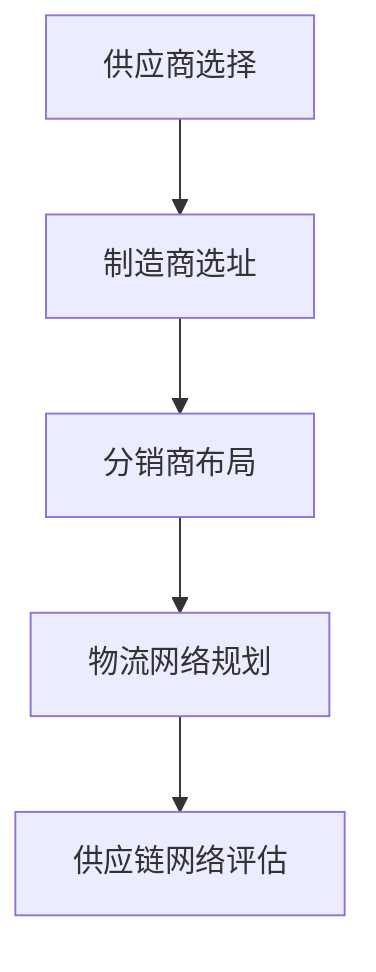

#### 2.2 库存管理

库存管理是指对库存的进、出、存进行有效控制，以降低库存成本，提高库存周转率。库存管理的关键包括：

1. **库存计划**：根据市场需求和供应链状况，制定合理的库存计划。

2. **库存控制**：通过监控库存水平，及时调整库存策略，避免过剩或缺货。

3. **库存优化**：采用先进的库存管理方法，如经济订货量（EOQ）、周期盘点等，优化库存水平。

以下是一个简单的Mermaid流程图，展示了库存管理的基本流程：

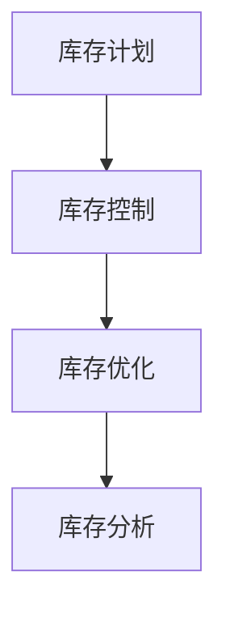

#### 2.3 采购管理

采购管理是指企业与供应商之间的采购活动，包括供应商选择、采购谈判、采购订单处理等。采购管理的关键包括：

1. **供应商评估**：评估供应商的质量、价格、交货期和服务等方面，选择合适的供应商。

2. **采购谈判**：与供应商进行谈判，争取最优的价格和服务条件。

3. **采购订单管理**：处理采购订单的生成、审批、执行和跟踪等环节。

以下是一个简单的Mermaid流程图，展示了采购管理的基本流程：

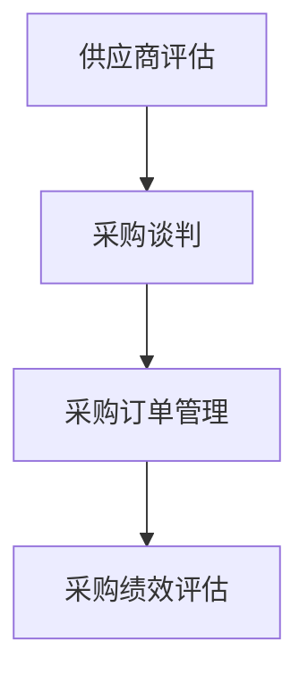

#### 2.4 生产计划与调度

生产计划与调度是指根据市场需求和供应链状况，制定生产计划，并合理安排生产活动。生产计划与调度的关键包括：

1. **需求预测**：预测市场需求，为生产计划提供依据。

2. **生产计划**：制定生产计划，确定生产数量、生产时间和生产资源。

3. **生产调度**：根据生产计划和实际生产状况，调整生产进度和资源分配。

以下是一个简单的Mermaid流程图，展示了生产计划与调度的基本流程：

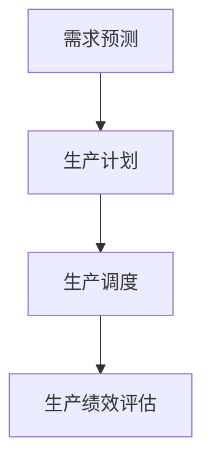

#### 2.5 小结

供应链管理的核心概念包括供应链网络设计、库存管理、采购管理和生产计划与调度。每个概念都有其独特的流程和关键点，通过有效地管理这些核心概念，企业可以实现供应链的高效运作，提高竞争力。

### 第3章：供应链流程优化

供应链流程优化是指通过改进供应链各环节的流程，提高供应链的整体效率、降低成本、提高质量和服务水平。以下是供应链流程优化的几个关键步骤：

#### 3.1 供应链流程分析

供应链流程分析是供应链流程优化的第一步，旨在了解当前供应链的运行状况，识别潜在的问题和改进点。供应链流程分析包括以下几个关键步骤：

1. **流程图绘制**：通过绘制流程图，清晰地展现供应链各环节的运行流程，包括供应商、制造商、分销商、零售商和最终用户等。

2. **数据收集**：收集供应链各环节的运营数据，如订单处理时间、库存水平、运输时间、生产周期等。

3. **流程诊断**：分析流程图和数据，识别当前供应链流程中存在的问题，如流程瓶颈、冗余环节、低效环节等。

以下是一个简单的Mermaid流程图，展示了供应链流程分析的基本流程：

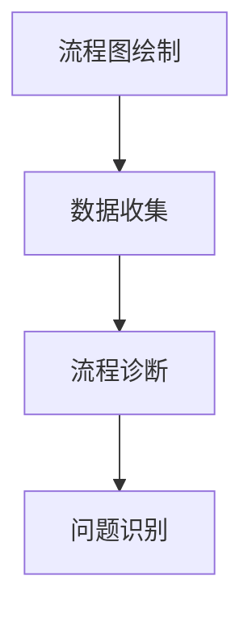

#### 3.2 供应链绩效评估

供应链绩效评估是衡量供应链运行效果的重要手段。通过供应链绩效评估，企业可以了解供应链的运作状况，识别改进的机会，制定优化策略。供应链绩效评估的关键指标包括：

1. **成本绩效**：评估供应链各环节的成本，如采购成本、库存成本、运输成本等。

2. **质量绩效**：评估供应链各环节的产品质量，如供应商质量、生产质量、运输质量等。

3. **速度绩效**：评估供应链各环节的响应速度，如订单处理时间、生产周期、运输时间等。

4. **服务绩效**：评估供应链各环节的服务水平，如订单履行率、客户满意度等。

以下是一个简单的Mermaid流程图，展示了供应链绩效评估的基本流程：

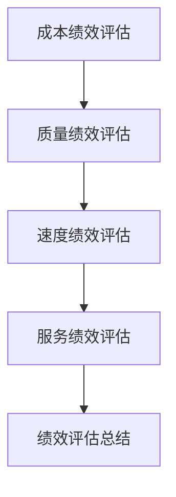

#### 3.3 供应链风险管理

供应链风险管理是确保供应链稳定运作的重要环节。通过供应链风险管理，企业可以识别潜在风险，制定应对策略，降低风险对供应链的影响。供应链风险管理的关键步骤包括：

1. **风险识别**：识别供应链中潜在的风险，如供应商风险、运输风险、质量问题风险等。

2. **风险评估**：评估风险的严重程度和发生概率，确定风险优先级。

3. **风险应对**：制定风险应对策略，如风险规避、风险降低、风险承担等。

4. **风险监控**：持续监控风险状况，及时调整风险应对策略。

以下是一个简单的Mermaid流程图，展示了供应链风险管理的基本流程：

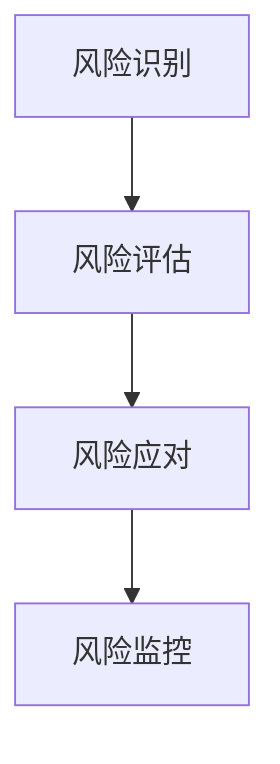

#### 3.4 小结

供应链流程优化是提高供应链整体效率、降低成本、提高质量和服务水平的重要手段。通过供应链流程分析、供应链绩效评估和供应链风险管理，企业可以识别和解决供应链中的问题，优化供应链流程，实现供应链的持续改进。

### 第4章：AI技术在供应链管理中的潜力

随着人工智能（AI）技术的飞速发展，其在供应链管理中的应用潜力日益显现。AI技术不仅能够提高供应链的运作效率，还能够降低成本、提升质量和服务水平。以下将探讨AI技术在供应链管理中的主要应用场景及其对供应链管理的革新。

#### 4.1 AI技术在供应链管理中的应用场景

1. **需求预测**：AI技术通过分析历史数据、市场趋势和用户行为，能够更准确地预测市场需求，帮助企业在供应链各环节进行科学规划和决策。

2. **库存管理**：AI技术可以实时监控库存水平，通过智能算法优化库存策略，降低库存成本，提高库存周转率。

3. **采购优化**：AI技术能够分析供应商的绩效、价格和交货时间，帮助企业选择最优的供应商，降低采购成本。

4. **生产计划与调度**：AI技术可以根据实时数据，动态调整生产计划，优化生产流程，提高生产效率。

5. **物流优化**：AI技术可以优化运输路线和配送计划，提高运输效率，降低物流成本。

6. **质量管理**：AI技术可以通过实时监测产品在生产、运输等环节的质量，及时发现和纠正质量问题。

7. **风险管理**：AI技术可以识别供应链中的潜在风险，进行风险评估和预警，帮助企业制定有效的风险应对策略。

#### 4.2 AI技术对供应链管理的革新

1. **提升决策效率**：AI技术通过大数据分析和智能算法，能够快速处理海量数据，为企业提供精准的决策支持，提升供应链管理的决策效率。

2. **降低运营成本**：AI技术在供应链各环节的应用，可以实现自动化和智能化管理，降低人力成本和运营成本。

3. **提高服务质量**：AI技术能够提高供应链的响应速度和服务水平，确保产品和服务及时交付，提高客户满意度。

4. **增强风险管理能力**：AI技术能够实时监控供应链风险，进行风险评估和预警，帮助企业及时应对风险，降低风险损失。

5. **促进供应链协同**：AI技术可以实现供应链各环节的数据共享和协同工作，提高供应链的整体运作效率。

6. **推动供应链创新**：AI技术的应用为供应链管理带来新的机遇，推动供应链管理模式、技术和工具的创新。

#### 4.3 小结

AI技术在供应链管理中具有广泛的应用场景和巨大的潜力。通过AI技术的应用，企业可以提升供应链的决策效率、降低运营成本、提高服务质量和风险管理能力，实现供应链管理的智能化和高效化。

### 第5章：AI在供应链数据管理中的应用

在现代供应链管理中，数据扮演着至关重要的角色。AI技术的引入为供应链数据管理带来了新的变革，通过数据分析和挖掘，企业可以更好地理解市场需求，优化库存管理，提升采购和生产的决策效率。以下将探讨AI技术在供应链数据管理中的具体应用。

#### 5.1 供应链数据概述

供应链数据涵盖了从原材料采购到产品交付的整个供应链过程中的各种信息，包括需求数据、库存数据、采购数据、生产数据、物流数据和销售数据等。这些数据不仅来源于企业内部系统，还来自于外部合作伙伴和客户。

1. **需求数据**：包括市场需求、客户订单、销售预测等，是制定供应链计划的重要依据。

2. **库存数据**：包括库存水平、库存周转率、库存分布等，是库存管理的关键数据。

3. **采购数据**：包括供应商信息、采购价格、采购订单等，是采购决策的重要参考。

4. **生产数据**：包括生产计划、生产进度、生产效率等，是生产管理的重要指标。

5. **物流数据**：包括运输时间、运输路线、运输成本等，是物流优化的重要依据。

6. **销售数据**：包括销售记录、销售趋势、客户反馈等，是市场分析和客户关系管理的重要数据。

#### 5.2 数据分析与挖掘

数据分析与挖掘是AI技术在供应链数据管理中的核心应用。通过数据分析与挖掘，企业可以从海量数据中提取有价值的信息，为决策提供支持。

1. **需求预测**：利用历史销售数据、市场趋势和客户行为数据，通过AI算法预测未来的市场需求，帮助企业在供应链计划中做出更准确的决策。

2. **库存优化**：通过分析库存水平和需求预测，利用AI算法优化库存策略，降低库存成本，提高库存周转率。

3. **采购优化**：通过分析供应商绩效、采购价格和市场需求，利用AI算法优化采购策略，降低采购成本，提高采购效率。

4. **生产计划优化**：通过分析生产数据、需求预测和资源状况，利用AI算法优化生产计划，提高生产效率，降低生产成本。

5. **物流优化**：通过分析物流数据、运输时间和市场需求，利用AI算法优化运输路线和配送计划，提高物流效率，降低物流成本。

#### 5.3 数据可视化

数据可视化是将复杂的数据以直观、易于理解的方式呈现出来，帮助企业管理者更好地理解数据，做出更明智的决策。

1. **仪表盘**：通过构建供应链管理仪表盘，实时展示供应链各环节的关键指标，如库存水平、采购进度、生产进度等。

2. **趋势图**：通过绘制趋势图，展示供应链数据的变化趋势，帮助管理者了解市场变化和业务状况。

3. **地图**：通过地图展示供应链各节点的地理位置、运输路线等，帮助管理者了解供应链的地理分布和运输情况。

4. **热力图**：通过热力图展示供应链数据的热点区域，帮助管理者识别关键问题和改进点。

#### 5.4 小结

AI技术在供应链数据管理中的应用，使得企业能够更高效地处理海量数据，通过数据分析和挖掘，优化供应链各环节的运营。数据可视化则帮助管理者直观地理解数据，做出更准确的决策。通过AI技术的应用，企业可以提升供应链的决策效率、降低成本、提高服务质量，从而在激烈的市场竞争中占据有利地位。

### 第6章：AI在供应链优化中的应用

随着AI技术的不断发展，其在供应链优化中的应用也日益广泛。通过AI技术的应用，企业可以优化供应链网络、库存管理、采购策略和生产计划，从而提高供应链的效率、降低成本、提升服务质量。以下将详细介绍AI技术在供应链优化中的应用。

#### 6.1 供应链网络优化

供应链网络优化是指通过合理设计供应链节点和连接关系，提高供应链的整体运作效率。AI技术在供应链网络优化中的应用主要包括以下几个方面：

1. **节点选址优化**：利用AI算法，如遗传算法、粒子群优化算法等，分析市场需求、运输成本、政策环境等因素，确定最佳供应商、制造商、分销商的位置。

2. **运输路径优化**：通过AI技术，如深度学习、强化学习等，分析运输数据，优化运输路径和运输策略，降低运输成本，提高运输效率。

3. **库存分布优化**：利用AI算法，根据市场需求、库存水平和运输成本等因素，优化库存分布策略，确保库存水平合理，降低库存成本。

4. **供应链网络重构**：通过AI技术，分析供应链网络中的瓶颈和低效环节，提出供应链网络重构方案，提高供应链的整体运作效率。

以下是一个简单的Mermaid流程图，展示了供应链网络优化的基本流程：

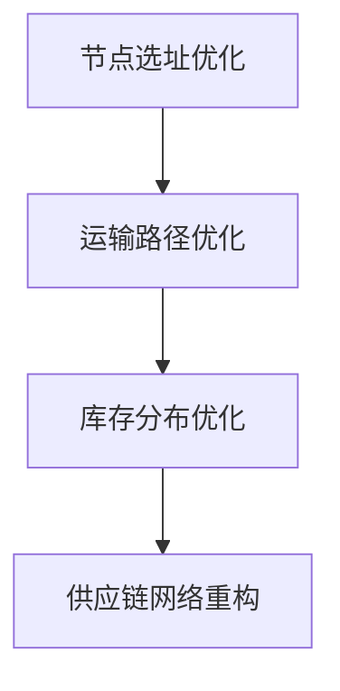

#### 6.2 库存优化

库存优化是指通过合理控制库存水平，降低库存成本，提高库存周转率。AI技术在库存优化中的应用主要包括以下几个方面：

1. **需求预测**：利用AI算法，如时间序列分析、回归分析等，分析历史销售数据、市场趋势和客户行为数据，预测未来的市场需求。

2. **库存策略优化**：利用AI算法，如遗传算法、粒子群优化算法等，根据需求预测和库存水平，优化库存策略，如经济订货量（EOQ）、周期盘点等。

3. **库存监控**：利用AI技术，实时监控库存水平，及时调整库存策略，避免过剩或缺货。

4. **库存优化方案评估**：利用AI算法，评估不同库存优化方案的效果，选择最优方案。

以下是一个简单的Mermaid流程图，展示了库存优化的基本流程：

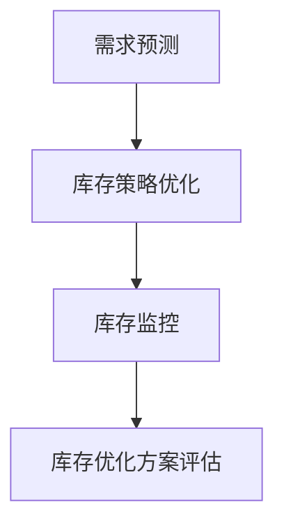

#### 6.3 采购优化

采购优化是指通过合理选择供应商、优化采购策略，降低采购成本，提高采购效率。AI技术在采购优化中的应用主要包括以下几个方面：

1. **供应商选择**：利用AI算法，如数据挖掘、分类算法等，分析供应商的历史绩效、价格、交货期等信息，选择最优供应商。

2. **采购策略优化**：利用AI算法，如遗传算法、粒子群优化算法等，根据市场需求、库存水平和供应商绩效，优化采购策略，如批量采购、长期合同等。

3. **采购监控**：利用AI技术，实时监控采购过程，确保采购进度和质量。

4. **采购绩效评估**：利用AI算法，评估供应商的绩效，优化供应商关系，提高采购效率。

以下是一个简单的Mermaid流程图，展示了采购优化的基本流程：

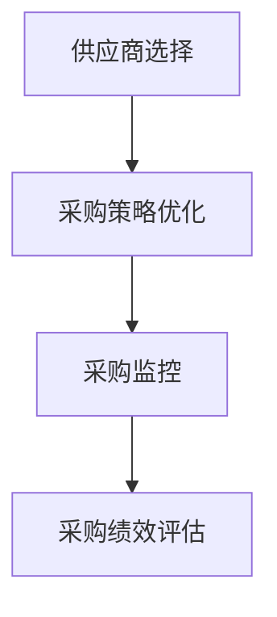

#### 6.4 生产计划优化

生产计划优化是指通过合理制定生产计划，提高生产效率，降低生产成本。AI技术在生产计划优化中的应用主要包括以下几个方面：

1. **需求预测**：利用AI算法，如时间序列分析、回归分析等，分析市场需求、库存水平、销售趋势等信息，预测未来的生产需求。

2. **生产计划编制**：利用AI算法，如遗传算法、粒子群优化算法等，根据需求预测、资源状况和约束条件，制定生产计划。

3. **生产调度优化**：利用AI技术，如深度学习、强化学习等，根据实时数据，动态调整生产计划，优化生产调度。

4. **生产绩效评估**：利用AI算法，评估生产计划的执行效果，优化生产计划编制策略。

以下是一个简单的Mermaid流程图，展示了生产计划优化的基本流程：

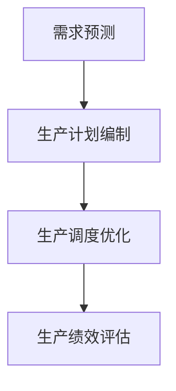

#### 6.5 小结

AI技术在供应链优化中的应用，为供应链管理带来了新的机遇。通过AI技术的应用，企业可以优化供应链网络、库存管理、采购策略和生产计划，提高供应链的整体效率、降低成本、提升服务质量。随着AI技术的不断发展和应用，供应链优化将更加智能化、高效化，为企业的可持续发展提供有力支持。

### 第7章：AI在供应链风险管理中的应用

在供应链管理中，风险管理是确保供应链稳定运作的重要环节。传统的风险管理方法往往依赖于历史数据和经验，而AI技术的引入为供应链风险管理带来了全新的变革。通过AI技术，企业可以更加精准地识别、评估和应对供应链风险，从而提高供应链的韧性。

#### 7.1 供应链风险识别

供应链风险识别是风险管理的第一步，旨在识别供应链中可能出现的各种风险。AI技术在供应链风险识别中的应用主要包括以下几个方面：

1. **历史数据挖掘**：通过分析历史数据，如供应商绩效、运输记录、库存水平等，发现潜在的风险因素。

2. **实时数据监测**：利用物联网、传感器等技术，实时监测供应链各环节的运行状态，识别潜在的风险。

3. **机器学习算法**：通过机器学习算法，如分类算法、聚类算法等，分析大量数据，识别潜在的供应链风险。

4. **异常检测**：利用异常检测算法，如孤立森林、自编码器等，识别供应链中的异常情况，如库存异常、运输延迟等。

以下是一个简单的Mermaid流程图，展示了供应链风险识别的基本流程：

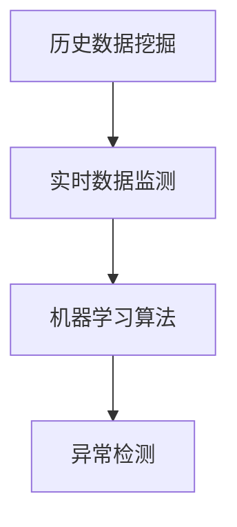

#### 7.2 风险评估与预警

风险评估与预警是供应链风险管理的重要环节，旨在评估风险的严重程度和发生概率，并提前发出预警。AI技术在风险评估与预警中的应用主要包括以下几个方面：

1. **风险评估模型**：利用机器学习算法，建立风险评估模型，对供应链风险进行定量评估。

2. **风险阈值设置**：根据风险评估结果，设置风险阈值，当风险超过阈值时，自动发出预警。

3. **实时预警**：通过实时数据监测，当风险发生时，及时发出预警，通知相关人员采取应对措施。

4. **预警策略优化**：利用机器学习算法，不断优化预警策略，提高预警的准确性和及时性。

以下是一个简单的Mermaid流程图，展示了风险评估与预警的基本流程：

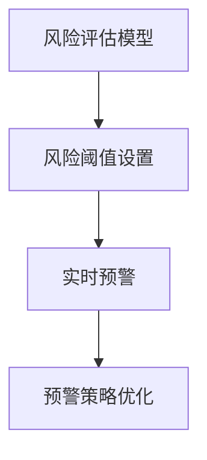

#### 7.3 风险应对策略

风险应对策略是供应链风险管理的关键环节，旨在降低风险发生概率和影响程度。AI技术在风险应对策略中的应用主要包括以下几个方面：

1. **风险规避**：通过调整供应链网络、采购策略等，避免高风险的环节。

2. **风险降低**：通过改进供应链流程、提高供应链韧性等，降低风险的严重程度。

3. **风险分担**：通过购买保险、与供应商签订风险分担协议等，将风险转移给第三方。

4. **风险监测与评估**：利用AI技术，持续监测风险状况，评估风险应对策略的有效性，及时调整策略。

以下是一个简单的Mermaid流程图，展示了风险应对策略的基本流程：

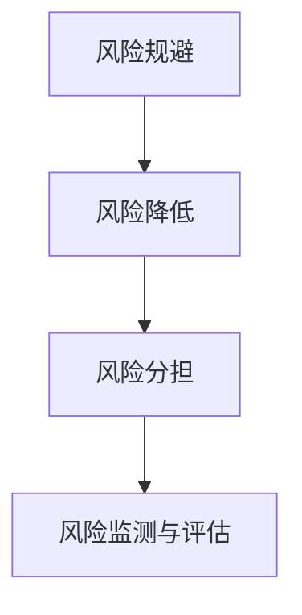

#### 7.4 小结

AI技术在供应链风险管理中的应用，使得企业能够更加精准地识别、评估和应对供应链风险。通过AI技术的应用，企业可以建立智能化的供应链风险管理体系，提高供应链的韧性，确保供应链的稳定运作。随着AI技术的不断发展和应用，供应链风险管理将更加智能化、高效化，为企业的可持续发展提供有力支持。

### 第8章：AI供应链管理案例研究

为了更好地展示AI技术在供应链管理中的应用效果，以下通过几个实际案例，详细解析AI技术在供应链网络设计、库存优化和采购策略优化方面的应用。

#### 8.1 案例一：智能供应链网络设计

某电子产品制造企业在全球范围内拥有多个供应商、制造商和分销商。为了提高供应链的效率和灵活性，企业决定采用AI技术进行供应链网络设计。

1. **需求分析**：首先，企业通过收集历史销售数据、市场需求和供应商信息，分析供应链的需求和瓶颈。

2. **算法选择**：企业采用遗传算法，结合市场需求、运输成本和政策环境等因素，优化供应链网络节点位置和连接关系。

3. **结果评估**：通过模拟和对比分析，企业发现优化后的供应链网络在运输成本、库存水平和响应速度等方面均有显著提升。

4. **实施效果**：优化后的供应链网络提高了企业的市场竞争力，降低了运营成本，提高了客户满意度。

#### 8.2 案例二：基于AI的库存优化

某零售企业在库存管理中面临库存过剩和库存短缺的问题。为了提高库存管理效率，企业引入AI技术进行库存优化。

1. **需求预测**：企业通过收集历史销售数据、市场趋势和客户行为数据，利用时间序列分析和回归分析预测未来的市场需求。

2. **库存策略优化**：企业采用遗传算法和粒子群优化算法，根据需求预测和库存水平，优化库存策略，如经济订货量（EOQ）和周期盘点。

3. **实时监控**：企业利用物联网技术，实时监控库存水平，根据库存数据动态调整库存策略。

4. **实施效果**：优化后的库存策略降低了库存成本，提高了库存周转率，减少了库存短缺和过剩的情况。

#### 8.3 案例三：AI采购策略优化

某制造企业在采购管理中面临供应商选择困难、采购成本高等问题。为了提高采购效率，企业引入AI技术进行采购策略优化。

1. **供应商评估**：企业通过分析供应商的历史绩效、价格、交货时间等信息，利用分类算法和聚类算法评估供应商的可靠性。

2. **采购策略优化**：企业采用遗传算法和粒子群优化算法，根据市场需求、供应商评估结果和采购成本，优化采购策略，如批量采购和长期合同。

3. **采购监控**：企业利用实时数据监测技术，实时监控采购进度和质量，确保采购目标的实现。

4. **实施效果**：优化后的采购策略降低了采购成本，提高了采购效率，增强了供应商合作关系。

#### 8.4 小结

通过以上案例可以看出，AI技术在供应链管理中的应用，不仅提高了供应链的效率和灵活性，还降低了成本和提高了客户满意度。这些案例的成功实施，为其他企业提供了宝贵的经验和启示，证明了AI技术在供应链管理中的巨大潜力。

### 第9章：实施AI供应链管理的步骤

实施AI供应链管理是一个复杂而系统的过程，需要企业从战略规划、技术选择、系统构建和运行维护等多个方面进行综合考虑。以下将详细阐述实施AI供应链管理的步骤。

#### 9.1 制定AI供应链管理战略

制定AI供应链管理战略是实施AI供应链管理的第一步。企业需要明确AI技术在供应链管理中的应用目标、战略方向和实施步骤。具体包括：

1. **明确目标**：确定AI技术在供应链管理中的应用目标，如提高效率、降低成本、提升服务质量等。

2. **评估需求**：分析企业当前的供应链状况，识别存在的问题和改进点，确定AI技术的具体应用场景。

3. **制定策略**：根据目标和需求，制定AI供应链管理的整体策略，包括数据管理、技术应用、流程优化和风险管理等方面。

4. **制定实施计划**：明确实施AI供应链管理的时间表、资源分配和责任分工，确保战略的顺利实施。

#### 9.2 选择合适的AI技术

选择合适的AI技术是实现AI供应链管理的关键。企业需要根据自身的需求、资源和技术能力，选择适合的AI技术。具体包括：

1. **需求分析**：分析企业当前的供应链管理需求，确定所需的技术功能和应用场景。

2. **技术评估**：评估不同AI技术的性能、适用性、可靠性和成本效益，选择最合适的AI技术。

3. **技术选择**：根据需求和技术评估结果，选择合适的AI技术，如机器学习、深度学习、强化学习等。

4. **技术集成**：将选定的AI技术集成到现有的供应链管理系统中，确保技术的顺利应用。

#### 9.3 AI供应链管理系统的构建

构建AI供应链管理系统是实现AI供应链管理的重要环节。企业需要设计、开发和部署一套完整的AI供应链管理系统，具体包括：

1. **系统设计**：根据企业的需求，设计AI供应链管理系统的架构、功能和技术实现方案。

2. **系统开发**：利用合适的编程语言和开发工具，开发AI供应链管理系统的各个模块，如数据采集、数据分析、决策支持等。

3. **系统集成**：将AI供应链管理系统的各个模块进行集成，确保系统的稳定运行和功能完整性。

4. **系统测试**：对AI供应链管理系统进行全面的测试，包括功能测试、性能测试和安全测试等，确保系统的质量。

#### 9.4 AI供应链管理系统的运行与维护

AI供应链管理系统的运行与维护是确保系统持续发挥作用的重要保障。企业需要建立一套完善的运行与维护机制，具体包括：

1. **系统运行**：确保AI供应链管理系统的稳定运行，监控系统的性能和稳定性，及时发现和解决系统故障。

2. **数据管理**：建立健全的数据管理体系，确保数据的准确性、完整性和安全性，为AI技术的应用提供可靠的数据支持。

3. **技术更新**：根据市场和技术的发展，及时更新AI供应链管理系统的技术，提高系统的性能和适用性。

4. **系统维护**：定期对AI供应链管理系统进行维护和升级，确保系统的持续稳定运行。

#### 9.5 小结

实施AI供应链管理是一个系统性、复杂性的过程，需要企业从战略规划、技术选择、系统构建和运行维护等多个方面进行综合考虑。通过科学的实施步骤，企业可以顺利实现AI供应链管理，提高供应链的整体效率和竞争力。

### 第10章：AI供应链管理的未来发展趋势

随着AI技术的不断进步，AI供应链管理正朝着智能化、高效化和综合化的方向发展。未来，AI供应链管理将面临一系列挑战与机遇，以下将探讨AI供应链管理的未来发展趋势。

#### 10.1 AI供应链管理的发展方向

1. **智能化**：随着AI技术的深入应用，供应链管理的各个环节将实现智能化，如智能库存管理、智能采购、智能物流等。

2. **高效化**：AI技术将通过优化供应链流程、提高决策效率、降低运营成本等手段，实现供应链管理的高效化。

3. **综合化**：AI供应链管理将实现供应链各环节的深度融合，如供应链金融、供应链物流、供应链信息管理等。

4. **绿色化**：AI技术将助力供应链实现绿色化发展，如智能碳排放管理、智能环保物流等。

5. **全球化**：随着全球化进程的加快，AI供应链管理将更好地应对跨国供应链的复杂性，实现全球资源的优化配置。

#### 10.2 未来供应链管理面临的挑战与机遇

1. **数据安全与隐私**：随着数据量的爆炸式增长，如何确保数据安全、保护客户隐私成为供应链管理的重要挑战。

2. **技术标准化**：缺乏统一的技术标准和规范，将影响AI供应链管理的普及和应用。

3. **人才培养**：AI供应链管理需要大量的技术人才，如何培养和吸引高素质的供应链管理人才成为关键。

4. **法规政策**：供应链管理涉及到多个国家和地区，如何应对不同法规政策的挑战，确保合规运营，是一个重要问题。

5. **技术创新**：随着技术的快速发展，如何持续创新，保持竞争优势，是供应链管理面临的重要机遇。

#### 10.3 小结

未来，AI供应链管理将在智能化、高效化、综合化、绿色化和全球化等方面实现全面发展，同时面临数据安全、技术标准化、人才培养、法规政策和技术创新等挑战。通过积极应对这些挑战，企业可以抓住机遇，实现供应链管理的全面提升。

### 附录A：AI供应链管理相关资源

#### A.1 相关技术文档

- 《人工智能基础教程》（作者：Michael Nielsen）
- 《深度学习》（作者：Ian Goodfellow、Yoshua Bengio、Aaron Courville）
- 《机器学习实战》（作者：Peter Harrington）

#### A.2 开源工具和框架

- TensorFlow
- PyTorch
- scikit-learn
- Keras

#### A.3 参考书籍与论文

- 《人工智能：一种现代方法》（作者：Stuart Russell、Peter Norvig）
- 《深度学习》（作者：Ian Goodfellow、Yoshua Bengio、Aaron Courville）
- 《供应链管理：战略、规划与运营》（作者：D.J. Power、R.H. Towill）

#### A.4 行业报告与数据来源

- Gartner报告
- IBM供应链报告
- Deloitte供应链报告
- 国家统计局

### 附录B：Mermaid流程图示例

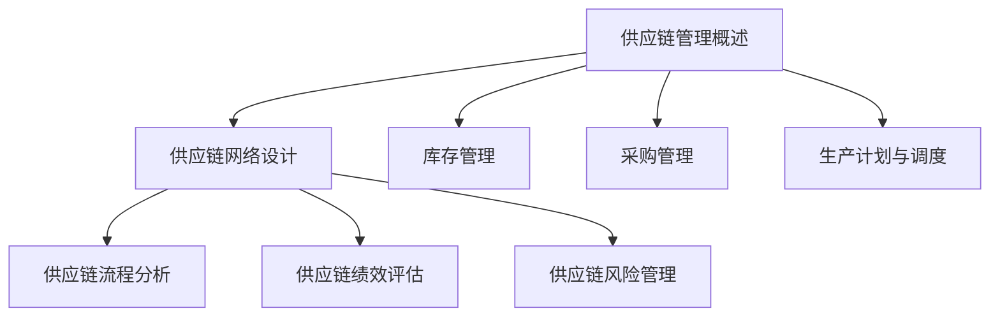

### 附录C：伪代码示例

```python
# 伪代码：供应链网络优化
function supply_chain_optimization():
    # 初始化参数
    initialize_parameters()

    # 数据预处理
    preprocess_data()

    # 构建优化模型
    build_optimization_model()

    # 求解优化问题
    solve_optimization_problem()

    # 结果分析
    analyze_results()

    # 输出结果
    output_results()
```

### 附录D：数学模型和公式

$$
\text{供应链管理目标函数：} \min Z = \sum_{i=1}^{n} \sum_{j=1}^{m} C_{ij} x_{ij}
$$

$$
\text{约束条件：}
\begin{align*}
\sum_{j=1}^{m} x_{ij} &= D_i \quad \forall i = 1, 2, ..., n \\
x_{ij} &\geq 0 \quad \forall i, j \\
\end{align*}
$$

### 附录E：代码实际案例

```python
# 实例代码：库存优化
def inventory_optimization():
    # 初始化库存数据
    initial_inventory = 100

    # 计算需求量
    demand = calculate_demand()

    # 计算最优库存水平
    optimal_inventory = calculate_optimal_inventory(initial_inventory, demand)

    # 输出结果
    print(f"初始库存：{initial_inventory}，需求量：{demand}，最优库存水平：{optimal_inventory}")

# 调用函数
inventory_optimization()
```

### 附录F：开发环境搭建和源代码解读

#### F.1 开发环境搭建

1. 安装Python环境
2. 安装相关库，如NumPy、Pandas等

#### F.2 源代码实现

1. 代码结构说明
2. 关键函数与模块解读

#### F.3 代码解读与分析

1. 代码性能优化
2. 代码可维护性分析

### 附录G：作者信息

作者：AI天才研究院/AI Genius Institute & 禅与计算机程序设计艺术 /Zen And The Art of Computer Programming

### 附录H：版权声明

本博客文章《AI创业公司的供应链管理策略》为原创作品，版权归AI天才研究院/AI Genius Institute所有。未经授权，不得转载或用于商业用途。如需转载，请联系原作者获取授权。如有任何问题，请随时联系作者。谢谢合作！

