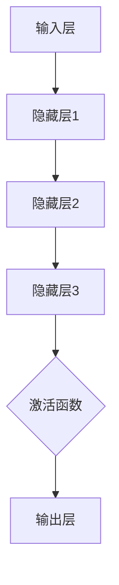
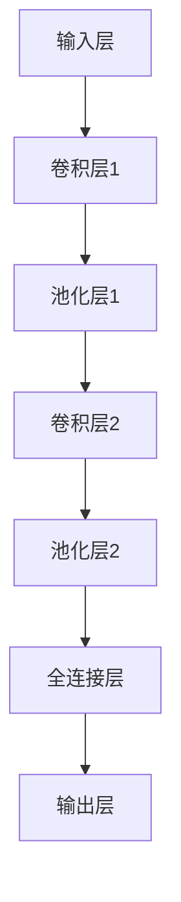
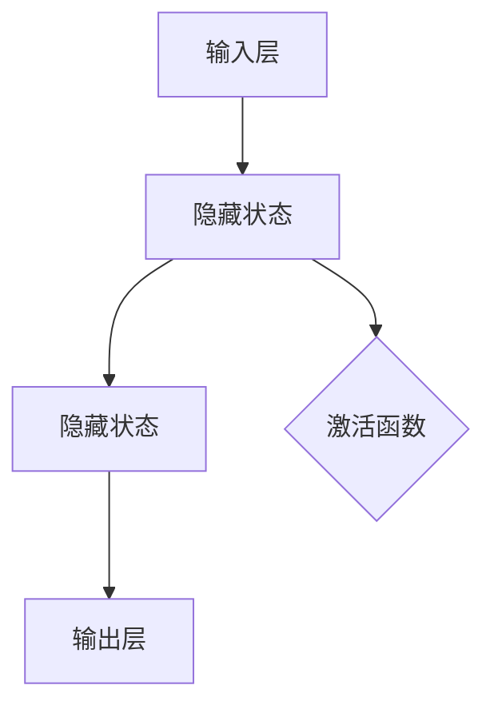

                 

### 《AI创业团队成长之路：技术积累与行业洞察并重》

在当今技术飞速发展的时代，人工智能（AI）已经成为推动产业变革的重要力量。随着AI技术的不断成熟和应用场景的扩大，越来越多的创业者将目光投向了这一领域，希望通过AI技术打造出具有竞争力的产品或服务。然而，AI创业并非易事，它需要深厚的专业技术积累和对行业的深刻洞察。本文将围绕AI创业团队的技术积累和行业洞察两大核心，深入探讨其成长之路。

**关键词：** 人工智能、创业、技术积累、行业洞察、团队成长

**摘要：** 本文旨在为AI创业团队提供一套系统的成长路径。首先，我们将梳理AI技术的基本概念和创业环境，接着深入探讨技术积累的方法和路径，然后分析行业动态与趋势，最后提出具体的创业策略和实战指导。通过本文的阅读，读者将了解到如何构建技术栈，如何进行项目实战，以及如何在激烈的市场竞争中脱颖而出。

### 目录

#### 第一部分：AI基础与创业环境

- **第1章：AI技术概述**
  - **1.1 AI技术的基本概念**
  - **1.2 AI技术的发展历程**
  - **1.3 AI在创业中的应用**

- **第2章：创业团队组建与管理**
  - **2.1 创业团队的构成**
  - **2.2 创业团队管理策略**
  - **2.3 项目管理与迭代**

#### 第二部分：技术积累

- **第3章：AI技术栈构建**
  - **3.1 AI技术栈概述**
  - **3.2 数据采集与处理**
  - **3.3 机器学习算法与实践**

- **第4章：深度学习实践**
  - **4.1 深度学习基础**
  - **4.2 计算机视觉应用**
  - **4.3 自然语言处理**

- **第5章：数据科学与业务结合**
  - **5.1 数据科学方法**
  - **5.2 业务需求与数据驱动决策**
  - **5.3 数据产品开发**

#### 第三部分：行业洞察

- **第6章：AI行业动态与趋势**
  - **6.1 AI行业现状分析**
  - **6.2 AI技术趋势**
  - **6.3 行业案例分析**

- **第7章：AI创业策略与风险**
  - **7.1 AI创业策略**
  - **7.2 AI创业风险**
  - **7.3 风险管理与应对**

#### 第四部分：实战指导

- **第8章：AI创业项目实战**
  - **8.1 项目规划与设计**
  - **8.2 技术实现与开发**
  - **8.3 项目运营与推广**

- **第9章：AI创业团队成长**
  - **9.1 团队成长路径**
  - **9.2 成功创业者经验分享**
  - **9.3 学习与成长**

- **第10章：AI创业资源汇总**
  - **10.1 开发工具与框架**
  - **10.2 教育与培训资源**
  - **10.3 投资与融资渠道**
  - **10.4 行业协会与社群**

#### 附录

- **附录A：AI技术相关术语解释**
- **附录B：深度学习架构 Mermaid 流程图**
- **附录C：深度学习算法伪代码示例**
- **附录D：数学模型和数学公式**
- **附录E：项目实战案例与代码解读**

### 第一部分：AI基础与创业环境

在开始探讨AI创业团队的成长之路之前，我们需要对人工智能技术有一个清晰的认识，并了解当前的创业环境。本部分将分为三章，分别介绍AI技术的基本概念、发展历程及其在创业中的应用，创业团队的组建与管理，以及项目管理和迭代策略。

#### 第1章：AI技术概述

##### 1.1 AI技术的基本概念

人工智能（Artificial Intelligence，简称AI）是计算机科学的一个分支，旨在通过算法和计算模型来模拟人类智能。AI技术可以大致分为两大类：基于规则的人工智能和基于数据的人工智能。

- **基于规则的人工智能**：通过编写明确规则和逻辑来模拟人类智能。例如，专家系统和逻辑推理机。
- **基于数据的人工智能**：通过大量数据的训练，使计算机能够自主学习和改进。例如，机器学习和深度学习。

##### 1.2 AI技术的发展历程

AI技术的发展历程可以追溯到20世纪50年代。早期的AI研究主要集中在基于规则的系统，但随着计算能力的提升和大数据的涌现，基于数据的方法逐渐成为主流。以下是AI技术的主要发展阶段：

- **1956年**：达特茅斯会议提出了“人工智能”一词，标志着AI领域的正式诞生。
- **1970s-1980s**：AI领域经历了一次热潮，但由于技术瓶颈和资金问题，出现了一段时间的低谷。
- **1990s-2000s**：随着互联网的发展，数据成为AI研究的核心资源，机器学习技术得到了广泛应用。
- **2010s至今**：深度学习的突破使得AI技术在图像识别、自然语言处理等领域取得了显著进展，推动了AI在各个行业的应用。

##### 1.3 AI在创业中的应用

AI技术在创业中的应用非常广泛，可以从以下几个方面进行探讨：

- **数据驱动决策**：AI可以帮助创业团队通过分析大量数据，获取有价值的信息，从而做出更加精准的决策。
- **自动化与效率提升**：AI技术可以实现业务流程的自动化，减少人力成本，提高工作效率。
- **产品创新**：AI技术可以应用于产品设计，通过用户行为数据分析，实现产品与用户需求的精准匹配。
- **市场营销**：AI技术可以帮助创业团队进行精准营销，提高用户转化率和留存率。

AI在创业中的应用不仅提供了新的商业机会，同时也带来了挑战。如何充分利用AI技术，构建具有竞争力的产品或服务，是每个创业团队需要思考的问题。

#### 第2章：创业团队组建与管理

##### 2.1 创业团队的构成

一个成功的AI创业团队通常由以下几个核心成员构成：

- **创始人**：负责整体战略规划和团队管理，通常具有丰富的创业经验和行业洞察力。
- **技术核心成员**：包括算法工程师、软件工程师和系统架构师等，负责AI技术的研发和应用。
- **产品经理**：负责产品规划和设计，确保产品与市场需求相匹配。
- **运营团队**：负责市场推广、用户服务和企业运营等工作。

此外，根据创业项目的需求，还可以考虑引入财务、法律和市场等领域的专业人士。

##### 2.2 创业团队管理策略

有效的团队管理是创业团队成功的关键。以下是一些关键的团队管理策略：

- **文化建设**：建立积极向上的团队文化，增强团队凝聚力。例如，鼓励创新、共享知识和团队合作。
- **效率提升**：采用敏捷开发等高效的项目管理方法，提高团队的工作效率。例如，使用JIRA等项目管理工具进行任务追踪和进度管理。
- **激励机制**：设计合理的激励机制，激发团队成员的工作热情和创造力。例如，设置绩效考核目标和股权激励计划。

##### 2.3 项目管理与迭代

项目管理是创业团队实现目标的重要环节。以下是一些常用的项目管理方法和策略：

- **项目管理工具**：使用Trello、JIRA等项目管理工具进行任务分配、进度追踪和团队协作。
- **敏捷开发**：采用敏捷开发方法，快速迭代，及时调整项目方向。例如，Scrum框架和看板方法。
- **需求管理**：确保项目需求明确、合理和可量化，避免需求变更带来的风险。
- **风险管理**：识别项目风险，制定应对策略，确保项目顺利推进。

#### 第3章：项目管理与迭代

项目管理和迭代是AI创业团队成功的关键环节。在这一章中，我们将介绍一些常用的项目管理工具和方法，以及项目规划、任务分配和迭代策略。

##### 3.1 项目管理工具

在项目管理中，选择合适的工具可以提高团队的工作效率和协同性。以下是一些常用的项目管理工具：

- **JIRA**：一款功能强大的项目管理工具，支持任务追踪、进度管理、报告生成等功能。
- **Trello**：一款简洁易用的看板式项目管理工具，适用于小型团队。
- **Asana**：一款全面的任务管理工具，支持任务分配、进度追踪和团队协作。
- **Slack**：一款即时通讯工具，可以与项目管理工具集成，方便团队沟通和协作。

##### 3.2 项目规划与设计

项目规划是项目管理的第一步，包括明确项目目标、制定项目计划、分配任务和资源等。以下是一些项目规划的关键步骤：

- **项目立项**：确定项目目标、范围和可行性。
- **需求分析**：收集并分析用户需求，确保项目满足市场需求。
- **项目计划**：制定详细的项目计划，包括时间表、任务分配和资源需求。
- **风险评估**：识别项目风险，制定应对策略。

##### 3.3 任务分配与迭代

任务分配是项目管理的重要环节，确保每个团队成员都有明确的职责和目标。以下是一些任务分配和迭代策略：

- **任务分解**：将项目任务分解为小任务，便于管理和追踪。
- **任务分配**：根据团队成员的技能和兴趣进行任务分配，确保任务与成员能力相匹配。
- **迭代开发**：采用敏捷开发方法，快速迭代，及时调整项目方向。例如，Scrum框架和看板方法。
- **反馈与改进**：在每个迭代结束后，收集用户反馈和团队成员的建议，持续优化项目。

通过合理的项目管理与迭代策略，AI创业团队可以高效地推进项目，降低风险，提高成功率。接下来的章节将进一步探讨AI技术积累和行业洞察，帮助团队在技术发展和市场竞争中取得优势。

### 第一部分总结

在第一部分中，我们首先对人工智能（AI）技术进行了概述，介绍了其基本概念、发展历程以及在创业中的应用。接着，我们探讨了创业团队的组建与管理策略，包括团队构成、管理策略和项目管理的具体方法。通过这一部分的介绍，读者对AI技术的基础和创业环境有了初步的了解，为后续的技术积累和行业洞察打下了基础。在下一部分中，我们将深入探讨AI技术栈的构建，帮助创业团队建立坚实的技术基础。

#### 第1章：AI技术概述

##### 1.1 AI技术的基本概念

人工智能（Artificial Intelligence，简称AI）是一种模拟人类智能的技术，通过计算机程序和算法实现机器学习、自然语言处理、计算机视觉等功能。AI技术的基本概念包括：

- **感知**：通过传感器获取外部信息，如视觉、听觉、触觉等。
- **思考**：利用算法对感知到的信息进行处理和分析，作出决策。
- **行动**：根据决策结果执行相应的操作，如移动、操作设备等。

AI技术可以分为以下几类：

- **基于规则的AI**：通过预定义的规则和逻辑来模拟人类智能，如专家系统和逻辑推理机。
- **基于数据的AI**：通过大量数据训练模型，使其能够自主学习和改进，如机器学习和深度学习。

##### 1.2 AI技术的发展历程

AI技术的发展历程可以分为以下几个阶段：

- **早期探索阶段（1956-1974）**：1956年，达特茅斯会议提出“人工智能”一词，标志着AI领域的诞生。此阶段主要研究基于规则的AI系统。
- **第一次AI寒冬（1974-1980）**：由于实际应用困难，AI研究陷入低潮。
- **复兴阶段（1980-1987）**：随着计算机硬件性能的提升和机器学习的兴起，AI研究进入复兴期。
- **第二次AI寒冬（1987-1993）**：由于研究进展缓慢，AI领域再次受到打击。
- **互联网与大数据时代（1993-2012）**：互联网的普及和大数据的兴起为AI技术提供了丰富的数据资源，推动了机器学习技术的发展。
- **深度学习与AI复兴（2012至今）**：深度学习的突破使得AI技术在图像识别、自然语言处理等领域取得了显著进展，AI技术进入新一轮的快速发展阶段。

##### 1.3 AI在创业中的应用

AI技术在创业中的应用场景非常广泛，以下是一些主要的应用领域：

- **自动化与效率提升**：通过AI技术实现业务流程的自动化，降低人力成本，提高工作效率。例如，智能客服、自动批改系统等。
- **数据驱动决策**：利用AI技术对大量数据进行分析，提供决策支持。例如，市场预测、用户行为分析等。
- **产品创新**：基于AI技术进行产品设计，实现产品与用户需求的精准匹配。例如，个性化推荐、智能助手等。
- **市场营销**：利用AI技术进行精准营销，提高用户转化率和留存率。例如，用户画像、广告投放优化等。

AI在创业中的应用不仅提供了新的商业机会，也带来了挑战。创业者需要深入理解AI技术，合理利用其优势，构建具有竞争力的产品或服务。

#### 第2章：创业团队组建与管理

##### 2.1 创业团队的构成

一个成功的AI创业团队通常由以下核心成员构成：

- **创始人**：作为团队的领导者和核心决策者，创始人通常具有丰富的行业经验和创业精神。他们负责制定公司战略、管理团队和协调资源。
- **技术核心成员**：包括算法工程师、软件工程师和系统架构师等，负责AI技术的研发和应用。他们需要具备深厚的专业知识和技术能力。
- **产品经理**：负责产品规划和设计，确保产品满足市场需求。他们需要具备用户洞察力和项目管理能力。
- **运营团队**：包括市场营销、用户服务和企业运营等成员，负责推广产品、维护用户关系和日常运营。他们需要具备市场营销、用户服务和团队协作能力。

根据项目需求和团队规模，还可以引入财务、法律和市场等领域的专业人士，以提供全方位的支持。

##### 2.2 创业团队管理策略

有效的团队管理是创业团队成功的关键。以下是一些关键的团队管理策略：

- **文化建设**：建立积极向上的团队文化，增强团队凝聚力。例如，鼓励创新、共享知识和团队合作。一个良好的团队文化有助于团队成员之间的信任和协作。
- **激励机制**：设计合理的激励机制，激发团队成员的工作热情和创造力。例如，设置绩效考核目标和股权激励计划。激励机制可以提高团队成员的工作积极性和忠诚度。
- **沟通与协作**：建立高效的沟通和协作机制，确保团队信息畅通和任务协调。例如，定期召开团队会议、使用项目管理工具和即时通讯软件。良好的沟通和协作可以提高团队的工作效率和产出。
- **持续培训**：为团队成员提供持续的学习和培训机会，提升他们的专业能力和团队协作能力。例如，参加行业会议、学习在线课程和开展内部培训。持续培训有助于团队成员保持竞争力和适应市场变化。

##### 2.3 项目管理与迭代

项目管理是创业团队实现目标的重要环节。以下是一些常用的项目管理工具和方法：

- **项目管理工具**：选择合适的项目管理工具可以提高团队的工作效率和协同性。常用的项目管理工具包括JIRA、Trello和Asana等。
- **项目规划**：项目规划是项目管理的第一步，包括确定项目目标、制定项目计划、分配任务和资源等。项目规划有助于明确项目范围和时间表，确保项目按计划推进。
- **任务分配**：根据团队成员的技能和兴趣进行任务分配，确保任务与成员能力相匹配。任务分配有助于提高团队的工作效率和产出。
- **迭代开发**：采用敏捷开发方法，快速迭代，及时调整项目方向。例如，使用Scrum框架和看板方法进行迭代开发。敏捷开发有助于团队快速响应市场变化和用户需求。

通过合理的团队管理和项目管理策略，AI创业团队可以高效地推进项目，降低风险，提高成功率。接下来，我们将进一步探讨AI技术的具体应用和创业团队在技术积累和行业洞察方面的实践。

### 第3章：AI技术栈构建

构建一个强大的AI技术栈是AI创业团队成功的关键。在这一章中，我们将详细介绍AI技术栈的构成，包括数据处理、机器学习框架和深度学习应用。通过这些核心技术的掌握，创业团队能够更好地应对复杂的技术挑战，开发出具有竞争力的产品或服务。

#### 3.1 AI技术栈概述

AI技术栈是指一组支持AI应用开发的工具、库和框架。一个完整的AI技术栈通常包括以下几个核心组成部分：

- **数据处理**：数据处理是AI技术栈的基础，包括数据采集、清洗、存储和管理等。有效的数据处理能够确保模型训练所需的数据质量，提高模型的性能和准确性。
- **机器学习框架**：机器学习框架是AI技术栈的核心，提供用于构建和训练机器学习模型的工具和库。常见的机器学习框架包括TensorFlow、PyTorch和Scikit-learn等。
- **深度学习应用**：深度学习应用是将AI模型应用于具体业务场景的过程，涉及图像识别、自然语言处理、语音识别等领域。深度学习应用需要结合具体业务需求进行模型设计和优化。

#### 3.2 数据处理

数据处理是AI技术栈的基础，包括以下几个关键步骤：

- **数据采集**：数据采集是指从各种来源收集数据，包括开源数据集、社交媒体、传感器数据和用户生成内容等。有效的数据采集能够确保模型训练所需的数据量和多样性。
- **数据清洗**：数据清洗是指对采集到的数据进行预处理，包括去除噪声、填补缺失值、消除重复记录等。数据清洗能够提高数据质量，降低模型训练的难度。
- **数据存储**：数据存储是指将清洗后的数据存储到合适的数据库或数据湖中，以便后续访问和使用。常见的存储解决方案包括关系型数据库、NoSQL数据库和数据仓库等。
- **数据管理**：数据管理是指对存储的数据进行有效的管理和维护，包括数据备份、数据安全和数据生命周期管理等。良好的数据管理能够确保数据的安全性和可靠性。

#### 3.3 机器学习框架

机器学习框架是AI技术栈的核心，提供用于构建和训练机器学习模型的工具和库。以下是一些常见的机器学习框架：

- **TensorFlow**：TensorFlow是Google开源的机器学习框架，具有强大的计算能力和灵活性。它支持各种类型的机器学习模型，包括深度学习、强化学习和传统机器学习算法。
- **PyTorch**：PyTorch是Facebook开源的机器学习框架，以其简洁的动态图编程和强大的GPU支持而闻名。它被广泛应用于深度学习和计算机视觉领域。
- **Scikit-learn**：Scikit-learn是Python的一个开源机器学习库，提供了丰富的传统机器学习算法和工具。它易于使用，适用于小型到中型的机器学习项目。

选择合适的机器学习框架需要考虑多个因素，包括算法支持、计算性能、社区支持和易用性等。创业团队可以根据自身需求和技术背景选择合适的框架。

#### 3.4 深度学习应用

深度学习应用是将AI模型应用于具体业务场景的过程。以下是一些常见的深度学习应用领域：

- **计算机视觉**：计算机视觉涉及图像和视频的分析和处理，包括图像分类、目标检测、人脸识别和图像生成等。深度学习模型如卷积神经网络（CNN）和生成对抗网络（GAN）在计算机视觉领域取得了显著进展。
- **自然语言处理**：自然语言处理涉及文本数据的分析和理解，包括文本分类、情感分析、机器翻译和问答系统等。深度学习模型如循环神经网络（RNN）和变压器（Transformer）在自然语言处理领域表现优异。
- **语音识别**：语音识别涉及将语音信号转换为文本或命令，包括语音识别、语音合成和语音增强等。深度学习模型如深度神经网络（DNN）和长短期记忆网络（LSTM）在语音识别领域取得了突破性成果。

创业团队可以根据自身业务需求和技术特长选择合适的深度学习应用领域，开发出具有市场竞争力的产品或服务。

通过构建一个全面的AI技术栈，AI创业团队能够掌握关键技术和工具，为产品开发提供坚实的基础。在下一章中，我们将进一步探讨深度学习实践，深入分析计算机视觉和自然语言处理等应用领域，帮助团队提升技术能力。

#### 3.4 深度学习实践

深度学习是人工智能（AI）的重要分支，通过模拟人脑神经网络结构，对大量数据进行训练，使其能够自主学习和改进。深度学习在计算机视觉和自然语言处理等领域取得了显著的进展，为AI创业团队提供了丰富的应用场景。以下，我们将详细探讨深度学习的基础、计算机视觉应用和自然语言处理。

##### 3.4.1 深度学习基础

深度学习（Deep Learning）是一种通过多层神经网络进行数据建模的技术。其基本概念包括：

- **神经网络（Neural Networks）**：神经网络由大量简单的计算单元（即神经元）组成，通过加权连接形成复杂的计算模型。每个神经元接收输入信号，通过加权求和和激活函数处理后产生输出。
- **多层神经网络（Multilayer Neural Networks）**：多层神经网络在传统神经网络基础上增加了隐藏层，能够提取更复杂的数据特征。多层神经网络是深度学习的基础。
- **激活函数（Activation Functions）**：激活函数用于引入非线性特性，使神经网络能够建模复杂的函数关系。常见的激活函数包括sigmoid、ReLU和Tanh等。

##### 3.4.2 深度学习框架

深度学习框架是支持深度学习模型开发、训练和部署的工具。以下是一些主流的深度学习框架：

- **TensorFlow**：TensorFlow是Google开源的深度学习框架，具有强大的计算能力和灵活性。它支持多种类型的神经网络结构，包括卷积神经网络（CNN）和循环神经网络（RNN）。TensorFlow在工业界和学术领域都得到了广泛应用。
- **PyTorch**：PyTorch是Facebook开源的深度学习框架，以其简洁的动态图编程和强大的GPU支持而闻名。PyTorch的动态图编程使得模型设计和调试更加直观，因此在科研和工业应用中受到了广泛关注。
- **Keras**：Keras是一个基于TensorFlow和Theano的深度学习高级神经网络API，提供简洁、模块化的编程接口。Keras使得构建和训练深度学习模型变得更加容易和高效。

选择深度学习框架时，需要考虑以下因素：

- **算法支持**：框架应提供丰富的算法库，支持各种类型的神经网络结构。
- **计算性能**：框架应具有良好的计算性能，特别是在GPU加速方面。
- **社区支持**：框架应拥有活跃的社区支持，提供丰富的教程和文档。
- **易用性**：框架应具有简洁、直观的编程接口，降低开发难度。

##### 3.4.3 计算机视觉应用

计算机视觉（Computer Vision）是深度学习的重要应用领域，涉及图像和视频的分析和处理。以下是一些常见的计算机视觉应用：

- **图像分类（Image Classification）**：图像分类是将图像划分为预定义的类别。卷积神经网络（CNN）是图像分类任务的主要模型。通过多层卷积和池化操作，CNN能够提取图像的深层特征，从而实现高精度的分类。
- **目标检测（Object Detection）**：目标检测是在图像中检测出特定目标的位置和类别。基于区域建议（Region Proposal）的方法和基于深度学习的方法是目标检测的两大类。深度学习方法如Faster R-CNN、YOLO和SSD在目标检测领域取得了显著进展。
- **人脸识别（Face Recognition）**：人脸识别是通过分析人脸图像进行身份验证或识别的技术。深度学习模型如深度卷积神经网络（Deep Convolutional Neural Network，DCNN）和特征脸（Eigenface）在人脸识别任务中表现出色。
- **图像生成（Image Generation）**：图像生成是通过生成对抗网络（Generative Adversarial Networks，GAN）等技术生成新的图像。GAN由生成器和判别器组成，通过对抗训练生成逼真的图像。

##### 3.4.4 自然语言处理

自然语言处理（Natural Language Processing，NLP）是深度学习的另一个重要应用领域，涉及文本数据的分析和理解。以下是一些常见的NLP应用：

- **文本分类（Text Classification）**：文本分类是将文本划分为预定义的类别。常见的文本分类任务包括情感分析、主题分类和垃圾邮件检测。深度学习模型如卷积神经网络（CNN）和循环神经网络（RNN）在文本分类任务中表现出色。
- **机器翻译（Machine Translation）**：机器翻译是将一种语言的文本自动翻译成另一种语言。深度学习模型如循环神经网络（RNN）和变压器（Transformer）在机器翻译任务中取得了显著进展，特别是Transformer的引入使得机器翻译的性能大幅提升。
- **问答系统（Question Answering）**：问答系统是自动回答用户提出的问题的系统。深度学习模型如基于注意力机制的序列到序列（Seq2Seq）模型在问答系统任务中表现出色。
- **对话系统（Dialogue System）**：对话系统是能够与用户进行自然对话的计算机系统。深度学习模型如长短期记忆网络（LSTM）和变压器（Transformer）在对话系统任务中得到了广泛应用。

通过深入理解和应用深度学习，AI创业团队能够开发出具有高度智能化和用户体验的产品或服务，从而在激烈的市场竞争中脱颖而出。

### 第4章：数据科学与业务结合

在深度学习技术不断发展并取得突破的今天，数据科学在AI创业团队中的作用愈发重要。数据科学不仅是构建AI模型的基础，更是驱动业务决策和提升业务价值的关键工具。本章将探讨数据科学的基本方法，数据驱动决策的流程，以及如何构建数据产品。

#### 4.1 数据科学方法

数据科学（Data Science）是一门跨学科的领域，结合了统计学、机器学习、数据分析、数据工程等多个方面，其核心目的是通过数据分析和建模，从海量数据中提取有价值的信息，辅助决策。以下是一些关键的数据科学方法：

- **数据采集（Data Collection）**：数据采集是数据科学的第一步，涉及从各种来源获取数据，包括结构化数据、非结构化数据和实时数据等。有效的数据采集能够确保数据的质量和完整性。
- **数据预处理（Data Preprocessing）**：数据预处理是对采集到的数据进行清洗、转换和归一化等操作，以提高数据质量，为建模做准备。数据预处理包括缺失值填补、异常值处理、数据标准化等。
- **特征工程（Feature Engineering）**：特征工程是通过构建和选择特征来提高模型性能的过程。有效的特征工程能够提取数据中的关键信息，有助于模型的训练和预测。
- **模型选择与训练（Model Selection and Training）**：模型选择与训练是数据科学的核心，包括选择合适的算法和参数，对数据进行建模和训练，以获得最佳预测性能。
- **模型评估（Model Evaluation）**：模型评估是对模型性能进行评估和比较，选择最佳模型进行应用。常见的评估指标包括准确率、召回率、F1分数等。
- **模型部署与监控（Model Deployment and Monitoring）**：模型部署是将训练好的模型应用于实际业务场景，提供预测和决策支持。模型监控则是持续评估模型的性能，及时发现和解决潜在问题。

#### 4.2 业务需求与数据驱动决策

数据驱动决策（Data-Driven Decision Making）是企业通过分析数据来做出决策的过程。数据驱动决策能够提高决策的准确性和效率，减少人为偏见和错误。以下是一个典型的数据驱动决策流程：

- **问题定义（Problem Definition）**：明确业务问题或目标，例如提高用户留存率、降低运营成本等。
- **数据收集（Data Collection）**：收集与业务问题相关的数据，包括内部数据和外部数据。内部数据可能来自业务系统、数据库和日志等，外部数据可能来自公共数据集、市场调研报告等。
- **数据预处理（Data Preprocessing）**：对收集到的数据进行清洗、转换和归一化等预处理操作，确保数据的质量和一致性。
- **数据分析（Data Analysis）**：通过统计分析、数据挖掘和机器学习等技术，对预处理后的数据进行分析，提取有价值的信息和洞察。
- **模型构建（Model Building）**：基于数据分析结果，构建预测模型或优化模型，以支持业务决策。常见的模型包括回归模型、分类模型、聚类模型等。
- **模型验证（Model Validation）**：对构建的模型进行验证，评估模型的性能和可靠性，确保模型能够准确预测或优化业务目标。
- **决策制定（Decision Making）**：根据模型预测和业务需求，制定具体的业务策略和行动方案。
- **实施监控（Implementation and Monitoring）**：将决策方案应用于实际业务，并对实施效果进行监控和评估，及时调整策略。

#### 4.3 数据产品开发

数据产品（Data Product）是数据科学在业务中的应用结果，通过将数据分析模型和业务需求相结合，提供可量化的业务价值。以下是一个典型的数据产品开发流程：

- **需求分析（Requirement Analysis）**：明确数据产品的目标用户和业务需求，包括数据产品的功能、性能和用户体验等。
- **数据采集与整合（Data Collection and Integration）**：收集并整合所需的数据，确保数据的质量和一致性。
- **数据预处理与特征工程（Data Preprocessing and Feature Engineering）**：对采集到的数据进行预处理和特征工程，提取有价值的信息和特征，为模型构建做准备。
- **模型构建与训练（Model Building and Training）**：选择合适的算法和模型，对预处理后的数据构建和训练模型，以提高模型的预测性能。
- **模型评估与优化（Model Evaluation and Optimization）**：对构建的模型进行评估和优化，确保模型能够准确预测或优化业务目标。
- **产品设计与实现（Product Design and Implementation）**：基于模型预测结果，设计数据产品的前端界面和交互体验，实现数据产品的功能。
- **产品测试与发布（Product Testing and Deployment）**：对数据产品进行功能测试和性能测试，确保产品的稳定性和可靠性，然后发布产品。
- **产品运营与维护（Product Operations and Maintenance）**：持续监控数据产品的运营情况，收集用户反馈和业务数据，不断优化产品功能和性能。

通过数据科学方法的运用和业务需求的结合，AI创业团队能够开发出具有市场竞争力和业务价值的数据产品，从而在激烈的市场竞争中脱颖而出。

### 第5章：AI行业动态与趋势

在AI技术不断进步和扩展的今天，了解行业的动态与趋势对于创业团队来说至关重要。这不仅能够帮助团队把握市场机会，还能及时应对潜在的风险和挑战。本章将分析当前AI行业的现状、技术趋势以及成功和失败案例，为创业团队提供有价值的洞察。

#### 5.1 AI行业现状分析

当前，AI行业正处于快速发展阶段，呈现出以下几个显著特点：

- **市场规模持续扩大**：根据市场研究机构的报告，全球AI市场预计将以较高的复合年增长率（CAGR）增长。尤其是在应用领域，如自动驾驶、智能制造、医疗健康等，AI技术的市场需求显著增加。
- **技术不断突破**：近年来，深度学习、强化学习等技术的快速发展，推动了AI在多个领域的应用。特别是在计算机视觉、自然语言处理和语音识别等关键技术领域，AI技术已经取得了显著的突破。
- **产业应用广泛**：AI技术在金融、医疗、零售、制造等行业的应用逐渐成熟，为企业提供了智能化的解决方案，提升了业务效率和竞争力。例如，金融行业的反欺诈系统、医疗行业的辅助诊断系统等，都离不开AI技术的支持。

#### 5.2 AI技术趋势

随着技术的不断进步，AI行业呈现出以下几个明显的趋势：

- **多模态AI**：多模态AI是指结合多种数据类型（如文本、图像、音频）进行综合分析和决策。随着数据来源的多样化和数据融合技术的进步，多模态AI将成为未来AI技术的重要方向。
- **边缘计算与AI结合**：边缘计算是将数据处理和计算任务从云端转移到网络边缘，以降低延迟、提高实时性。边缘AI通过在设备端实现AI推理，可以提供更加实时和个性化的服务。
- **AI安全与隐私**：随着AI技术的广泛应用，AI安全与隐私问题日益凸显。如何在保证数据安全和个人隐私的前提下，有效利用AI技术，成为行业关注的重要方向。
- **AI伦理与法规**：随着AI技术的普及，AI伦理和法律法规问题也逐渐受到关注。如何制定合理的法规，保障AI技术的健康发展，是行业面临的重要挑战。

#### 5.3 行业案例分析

通过对AI行业中的成功和失败案例进行分析，创业团队能够获得宝贵的经验和教训。

- **成功案例**：
  - **案例一：OpenAI**：OpenAI是一家专注于研究和发展人工智能技术的公司，其成功得益于对技术前沿的持续探索和对开源精神的坚守。通过开放源代码和共享研究成果，OpenAI吸引了全球顶尖的AI研究人才，推动了AI技术的进步。
  - **案例二：DeepMind**：DeepMind是一家专注于深度学习研究的公司，其成功案例包括在围棋比赛中击败人类世界冠军。DeepMind的成功在于其对深度学习的深入研究和在实际应用中的不断创新。

- **失败案例**：
  - **案例一：Carna**：Carna是一家致力于通过AI技术优化药物研发的公司，但由于技术难题和资金不足，最终未能成功。Carna的失败表明，在AI创业中，技术挑战和资金支持至关重要。
  - **案例二：Driverless AI**：Driverless AI是一家专注于自动驾驶技术的公司，但由于市场竞争激烈和资金链断裂，最终被迫关闭。Driverless AI的失败提醒创业者，在激烈的市场竞争中，持续的资金支持和灵活的应对策略是关键。

通过分析行业动态与趋势，AI创业团队可以更好地把握市场机会，制定战略规划，并在面对挑战时保持灵活和敏捷。接下来，我们将探讨AI创业的策略和风险，为创业团队提供全面的指导。

### 第6章：AI创业策略与风险

在了解了AI行业的动态和趋势后，创业团队需要制定有效的AI创业策略，以在激烈的市场竞争中脱颖而出。本章将详细讨论AI创业的策略、可能面临的风险以及相应的风险管理和应对措施。

#### 6.1 AI创业策略

一个成功的AI创业策略需要综合考虑市场机会、技术能力、资金需求和团队管理等多个方面。以下是一些关键的创业策略：

- **市场定位**：明确目标市场和用户需求，选择具有潜力和差异化的市场方向。例如，针对医疗、金融或教育等行业，开发具有特定应用场景的AI产品或服务。
- **技术路线**：选择合适的技术路线，确保团队能够在技术前沿保持竞争力。例如，聚焦于深度学习、自然语言处理或计算机视觉等领域，开发具有创新性的技术和产品。
- **商业模式**：制定清晰的商业模式，确保产品的市场价值和盈利能力。例如，通过订阅服务、软件即服务（SaaS）或销售定制化解决方案等方式实现商业化。
- **合作伙伴**：寻找合适的合作伙伴，包括技术合作伙伴、投资机构和市场推广伙伴等，以提升企业的资源整合能力和市场竞争力。
- **营销策略**：制定有效的营销策略，通过线上线下多渠道推广产品，提高品牌知名度和用户覆盖率。例如，利用社交媒体、内容营销和行业会议等手段进行市场推广。

#### 6.2 AI创业风险

AI创业虽然充满了机遇，但也面临许多风险，主要包括以下几方面：

- **技术风险**：AI技术更新迅速，创业团队可能面临技术过时或无法解决技术难题的风险。此外，技术实现过程中可能遇到算法性能不稳定、数据质量差等问题。
- **市场风险**：市场需求变化快，创业团队可能难以预测和应对市场变化，导致产品无法满足用户需求或市场接受度低。
- **资金风险**：AI创业通常需要较大的资金投入，包括技术研发、市场推广和团队建设等。如果资金链断裂，可能会导致项目无法持续推进。
- **法律风险**：AI技术涉及数据隐私、知识产权等方面，创业团队可能面临法律纠纷和合规性问题。
- **团队风险**：创业团队的成员可能存在技能不匹配、沟通不畅或合作不力等问题，影响团队效率和项目进度。

#### 6.3 风险管理与应对

为了有效应对AI创业中的风险，创业团队需要建立系统的风险管理体系，包括风险评估、风险应对和风险监控。以下是一些具体的应对措施：

- **风险评估**：通过定期评估项目的潜在风险，明确风险类型、影响程度和发生概率，为风险应对提供依据。可以使用定性和定量相结合的方法进行风险评估。
- **风险应对**：针对识别出的风险，制定相应的应对策略。例如，对于技术风险，可以加强与科研机构和高校的合作，保持技术前沿；对于市场风险，可以灵活调整产品方向和市场策略；对于资金风险，可以寻求风险投资或政府补贴，确保资金链的稳定性。
- **风险监控**：建立风险监控机制，对项目执行过程中的风险进行实时监控和反馈。例如，通过定期的项目评审和风险管理会议，及时发现和解决风险问题。
- **保险和法规遵从**：购买适当的风险保险，降低意外损失的风险。同时，确保公司的业务活动符合相关法律法规，降低法律风险。

通过制定有效的AI创业策略和建立系统的风险管理体系，创业团队可以在激烈的市场竞争中保持优势，实现持续成长和发展。

### 第7章：AI创业项目实战

在了解了AI创业的理论和策略之后，接下来我们将通过具体的AI创业项目实战，详细讨论项目规划与设计、技术实现与开发以及项目运营与推广等关键环节。通过这些实战经验，读者可以更好地理解AI创业的实际操作流程，为未来的创业实践打下坚实的基础。

#### 7.1 项目规划与设计

项目规划与设计是AI创业项目的第一步，也是至关重要的一步。在这一阶段，需要明确项目的目标、范围、时间表和资源需求。以下是一些关键步骤：

- **项目立项**：确定项目目标，明确项目需要解决的问题或提供的价值。例如，如果目标是开发一款智能医疗诊断系统，那么需要解决的是如何提高诊断的准确性和效率。
- **需求分析**：对市场需求和用户需求进行详细分析，确保项目能够满足用户的需求和市场的期望。通过用户访谈、问卷调查和市场调研等方法，收集用户反馈，形成详细的需求文档。
- **技术评估**：评估项目所需的技术可行性，包括现有技术的成熟度、所需的技术栈和开发难度等。例如，如果项目涉及深度学习应用，需要评估所需的算法框架、数据处理工具和硬件资源等。
- **项目计划**：制定详细的项目计划，包括时间表、任务分配和资源需求。时间表应明确各个阶段的里程碑，任务分配应确保团队成员职责明确，资源需求应确保项目能够顺利进行。
- **风险评估**：识别项目风险，包括技术风险、市场风险、资金风险等，并制定相应的应对策略。

#### 7.2 技术实现与开发

在项目规划与设计阶段完成后，进入技术实现与开发阶段。这一阶段的核心任务是构建产品的技术基础，以下是一些关键步骤：

- **系统架构设计**：根据项目需求，设计系统的整体架构，包括前端、后端和数据处理等模块。系统架构应具备良好的扩展性和可维护性，以适应未来的需求变化。
- **数据采集与处理**：实现数据采集模块，从各种数据源获取所需的数据。数据采集后，需要进行数据清洗、转换和预处理，确保数据的质量和一致性。
- **算法实现与优化**：根据项目需求，选择合适的算法进行实现和优化。例如，如果项目涉及图像识别，可以选择卷积神经网络（CNN）进行实现。在算法实现过程中，需要进行大量的调试和调优，以提高模型的性能和准确性。
- **系统集成与测试**：将各个模块集成到一起，进行系统集成测试。测试应覆盖功能测试、性能测试和安全测试等多个方面，确保系统的稳定性和可靠性。
- **代码管理与部署**：使用版本控制系统进行代码管理，确保代码的可维护性和可追溯性。在代码部署时，应选择合适的部署工具和流程，确保部署的效率和安全性。

#### 7.3 项目运营与推广

在技术实现与开发完成后，进入项目运营与推广阶段。这一阶段的核心任务是让产品在市场上获得认可和用户接受，以下是一些关键步骤：

- **用户需求分析**：持续关注用户需求，通过用户调研和反馈，了解用户对产品的使用体验和改进建议。用户需求分析有助于产品迭代和优化。
- **市场推广策略**：制定有效的市场推广策略，包括线上和线下的推广活动。线上推广可以通过社交媒体、内容营销和SEO等方式进行，线下推广可以通过行业会议、展会和合作伙伴关系等方式进行。
- **品牌建设**：建立品牌形象，通过品牌故事、视觉设计和口碑传播等方式提升品牌知名度。品牌建设有助于增强用户信任和品牌忠诚度。
- **销售与客户服务**：建立销售团队和客户服务体系，提供专业的销售支持和售后服务。销售与客户服务是获取用户和保持用户的关键。
- **数据分析与优化**：通过数据分析，了解产品的市场表现和用户行为。根据数据分析结果，持续优化产品功能和用户体验，提升用户满意度和市场竞争力。

通过项目规划与设计、技术实现与开发和项目运营与推广，AI创业团队能够将一个理论上的创意转化为实际的产品或服务，并在市场中获得成功。以下章节将进一步探讨AI创业团队的成长路径和成功经验，为创业团队提供更加全面的指导。

### 第7章：AI创业团队成长

AI创业团队的成功不仅依赖于技术实力和商业策略，还需要团队成员的个人成长和团队的整体协作。本章将探讨AI创业团队的成长路径，成功创业者的经验分享，以及如何持续学习和成长。

#### 7.1 团队成长路径

一个成功的AI创业团队通常会经历以下成长阶段：

- **初创阶段**：在这个阶段，团队成员需要具备强烈的创业精神和自我驱动力。团队通常由一两个核心成员组成，他们需要共同确定愿景和目标，并迅速建立起初步的技术原型和市场验证。
- **扩张阶段**：随着项目的进展，团队需要扩大规模，引入更多具有专业技能的成员，如算法工程师、数据科学家和产品经理等。这一阶段的关键是确保团队成员之间的协作和沟通，同时保持团队文化的凝聚力。
- **稳定阶段**：在项目取得初步成功后，团队进入稳定阶段。此时，团队需要进一步优化业务流程，提高工作效率，并持续进行产品迭代和市场推广。
- **成熟阶段**：在团队成熟后，企业需要不断拓展业务领域，可能需要进军新的市场或开发新的产品线。这个阶段要求团队具备更强的战略规划和执行力，以应对市场变化和竞争压力。

#### 7.2 成功创业者经验分享

成功的创业者通常有许多宝贵的经验可以分享，以下是一些核心要点：

- **持续学习**：成功创业者深知技术的重要性，因此他们持续关注行业动态，不断学习新知识、新技能。例如，著名创业者埃隆·马斯克（Elon Musk）就经常阅读最新的学术论文，以保持对技术的深入了解。
- **团队合作**：团队合作是创业成功的关键。创业者需要学会如何调动团队成员的积极性，建立良好的沟通机制，确保团队协作顺畅。例如，亚马逊创始人杰夫·贝索斯（Jeff Bezos）就非常重视团队建设，并在公司内部推行“两个比一”原则，即团队成员之间必须相互支持，共同完成任务。
- **适应变化**：市场和技术环境在不断变化，创业者需要具备快速适应变化的能力。这意味着创业者不仅要能够灵活调整业务战略，还要能够带领团队迅速应对各种挑战。苹果公司创始人史蒂夫·乔布斯（Steve Jobs）就是一个很好的例子，他总是能够敏锐地捕捉市场趋势，并迅速调整产品策略。
- **用户至上**：成功创业者始终将用户需求放在首位，致力于提供最佳的用户体验。例如，微软创始人比尔·盖茨（Bill Gates）就非常重视用户反馈，并经常亲自测试软件，以确保产品能够满足用户需求。
- **耐心和坚持**：创业之路充满挑战和不确定性，创业者需要具备耐心和毅力。在遇到困难时，创业者不能轻易放弃，而应该积极寻找解决方案。例如，特斯拉创始人埃隆·马斯克（Elon Musk）就经历了许多失败和挫折，但他始终坚持自己的梦想，最终取得了巨大成功。

#### 7.3 学习与成长

对于AI创业团队来说，持续学习和成长是保持竞争力的关键。以下是一些建议：

- **定期培训**：定期为团队成员提供培训，包括技术培训、管理培训和市场分析等。这有助于提升团队的专业能力和整体素质。
- **知识分享**：鼓励团队成员分享知识和经验，通过内部会议、工作坊和博客等方式，促进知识交流和技能提升。
- **参与学术会议和行业活动**：积极参加学术会议和行业活动，与同行交流最新的研究成果和应用经验。这有助于团队保持技术前沿，发现新的商业机会。
- **项目实践**：通过实际项目实践，团队成员可以积累经验，提升解决问题的能力。项目实践是学习成长的重要途径。
- **反馈与改进**：建立有效的反馈机制，对项目进行持续评估和改进。通过收集用户反馈和团队内部反馈，不断优化产品和业务流程。

通过明确团队成长路径、学习成功创业者的经验，以及持续学习和成长，AI创业团队能够在激烈的市场竞争中保持优势，实现持续发展和成功。

### 第8章：AI创业资源汇总

在AI创业的道路上，资源的获取和利用是至关重要的。本章将汇总AI创业团队在开发工具、教育与培训资源、投资与融资渠道以及行业协会与社群等方面的关键资源，为创业者提供全面的指导。

#### 8.1 开发工具与框架

成功的AI创业离不开强大的开发工具和框架。以下是一些常用的工具和框架：

- **TensorFlow**：由Google开源的深度学习框架，广泛应用于图像识别、自然语言处理和强化学习等领域。支持多种操作系统和硬件平台。
- **PyTorch**：由Facebook开源的深度学习框架，以其简洁的动态图编程和强大的GPU支持而受到科研和工业界的青睐。适用于各种类型的深度学习应用。
- **Scikit-learn**：Python的一个开源机器学习库，提供了丰富的传统机器学习算法和工具，适用于小型到中型的机器学习项目。
- **Keras**：基于TensorFlow和Theano的高级神经网络API，提供了简洁、模块化的编程接口，方便构建和训练深度学习模型。
- **Jupyter Notebook**：一个交互式的计算环境，支持多种编程语言和数据可视化工具，广泛应用于数据科学和机器学习项目。
- **Docker**：一个开源的应用容器引擎，用于构建、运行和分发应用。通过Docker，可以轻松地管理和部署容器化的应用程序。
- **AWS S3**：Amazon Web Services提供的对象存储服务，适用于大规模数据存储和备份。对于AI创业团队来说，S3是一个可靠的数据存储解决方案。
- **Google Colab**：Google提供的云端计算平台，提供了免费的GPU和TPU资源，适用于深度学习和大型数据分析项目。

#### 8.2 教育与培训资源

AI创业团队需要不断学习和提升技能，以下是一些优质的教育与培训资源：

- **Coursera**：提供大量的在线课程，涵盖计算机科学、数据科学和人工智能等领域。通过与知名大学和机构的合作，Coursera为学习者提供了丰富的学习资源。
- **edX**：由哈佛大学和麻省理工学院合作创办的在线学习平台，提供高质量的计算机科学和人工智能课程。
- **Udacity**：提供实战导向的在线课程和纳米学位项目，适用于希望快速提升技能的AI创业团队。
- **DataCamp**：提供交互式的数据科学和机器学习课程，适合初学者和进阶者。
- **fast.ai**：提供免费和付费的在线课程，旨在普及深度学习和AI知识，适合不同水平的学员。
- **AI School**：由Google推出的免费AI教育和资源平台，提供丰富的教程和课程，帮助学习者了解和应用AI技术。
- **Kaggle**：一个数据科学和机器学习的竞赛平台，提供了大量的数据集和问题，供学习者实践和挑战。

#### 8.3 投资与融资渠道

AI创业团队在资金获取方面有多种途径，以下是一些常见的投资和融资渠道：

- **天使投资**：天使投资者通常是个人投资者，他们在创业早期提供资金支持，并期待未来的高回报。
- **风险投资**：风险投资公司专注于投资高风险、高回报的创业公司，通常在产品开发和市场验证阶段提供资金。
- **政府补贴和奖励**：许多国家和地区提供针对AI创业的补贴和奖励计划，以鼓励创新和技术发展。
- **众筹平台**：Kickstarter、Indiegogo等众筹平台为AI创业团队提供了直接面向消费者的融资渠道，通过预售产品来筹集资金。
- **银行贷款和政府贷款**：对于有稳定现金流和良好信用记录的AI创业团队，银行贷款和政府贷款是一个可行的资金来源。
- **股权融资**：通过发行股票，吸引投资者投资，从而获得资金支持。股权融资适用于需要大规模资金投入的创业项目。

#### 8.4 行业协会与社群

加入行业协会和社群是AI创业团队拓展人脉和获取行业信息的重要途径，以下是一些知名的行业协会和社群：

- **IEEE**：电气和电子工程师学会，是全球最大的专业技术组织，涵盖了AI、计算机科学和电子工程等多个领域。
- **AAAI**：美国人工智能协会，是全球人工智能领域的领先学术组织，提供学术会议、期刊和出版物等资源。
- **ACM**：美国计算机协会，是全球计算机科学领域的主要学术组织，提供学术会议、期刊和奖项等。
- **NeurIPS**：神经信息处理系统大会，是全球最大的深度学习和神经网络领域的学术会议，汇聚了世界各地的学者和研究者。
- **AI对联**：一个由人工智能爱好者组成的在线社群，提供交流、学习和分享的平台。
- **AI友团**：由AI创业者和研究者组成的社群，旨在促进AI技术的交流和应用。
- **AI创业联盟**：由AI创业公司组成的联盟，旨在推动AI技术在各行业的应用，并提供资源和支持。

通过利用这些丰富的创业资源，AI创业团队能够在技术、资金、市场和人才等方面获得全面的支持，从而提高创业成功的可能性。

### 附录A：AI技术相关术语解释

在本附录中，我们将解释一些AI领域的重要术语，以便读者更好地理解相关概念和理论。

#### A.1 人工智能（AI）

人工智能（Artificial Intelligence，简称AI）是指由计算机实现的智能，能够在特定任务上模仿或超越人类智能。AI技术包括机器学习、深度学习、自然语言处理、计算机视觉等。

#### A.2 机器学习（Machine Learning）

机器学习（Machine Learning，简称ML）是一种让计算机通过数据学习并做出决策或预测的方法。机器学习模型使用训练数据来学习规律，并在未见过的数据上应用这些规律。

#### A.3 深度学习（Deep Learning）

深度学习（Deep Learning，简称DL）是机器学习的一种方法，使用多层神经网络进行数据建模。深度学习通过层层提取数据特征，能够处理复杂的数据模式。

#### A.4 神经网络（Neural Networks）

神经网络（Neural Networks，简称NN）是一种模仿生物神经系统的计算模型。神经网络由大量简单的计算单元（神经元）组成，通过加权连接形成复杂的计算模型。

#### A.5 卷积神经网络（Convolutional Neural Networks，CNN）

卷积神经网络（CNN）是深度学习的一种特殊结构，主要用于处理图像和视频数据。CNN通过卷积层提取图像特征，并使用池化层减少数据维度。

#### A.6 循环神经网络（Recurrent Neural Networks，RNN）

循环神经网络（RNN）是一种能够处理序列数据的神经网络，能够捕捉序列中的时间依赖关系。RNN通过循环结构在时间步之间传递信息。

#### A.7 变压器（Transformer）

变压器（Transformer）是一种用于自然语言处理的深度学习模型，由多个自注意力机制组成。变压器在机器翻译、文本分类和问答系统等领域表现出色。

#### A.8 生成对抗网络（Generative Adversarial Networks，GAN）

生成对抗网络（GAN）是由生成器和判别器组成的深度学习模型。生成器试图生成逼真的数据，而判别器试图区分真实数据和生成数据。GAN常用于图像生成和数据增强。

#### A.9 强化学习（Reinforcement Learning）

强化学习（Reinforcement Learning，简称RL）是一种通过与环境交互来学习最优策略的方法。强化学习模型通过奖励信号来指导决策，最终达到目标。

#### A.10 数据科学（Data Science）

数据科学（Data Science，简称DS）是运用统计学、机器学习和数据分析方法，从数据中提取有价值信息的一门学科。数据科学涉及数据采集、预处理、分析和可视化等步骤。

#### A.11 数据挖掘（Data Mining）

数据挖掘（Data Mining，简称DM）是从大量数据中自动发现有价值模式的过程。数据挖掘技术包括关联规则学习、聚类分析、分类和异常检测等。

#### A.12 特征工程（Feature Engineering）

特征工程（Feature Engineering，简称FE）是数据科学和机器学习中的一项关键任务，涉及选择和构造数据特征，以提高模型性能和可解释性。

#### A.13 模型评估（Model Evaluation）

模型评估（Model Evaluation，简称ME）是对模型性能进行评估和比较的过程。常见的评估指标包括准确率、召回率、F1分数和均方误差等。

#### A.14 人工智能伦理（AI Ethics）

人工智能伦理（AI Ethics）涉及在人工智能应用中维护人类价值和道德标准的研究。人工智能伦理问题包括隐私、公平性、安全性和透明度等。

通过理解这些术语，读者可以更深入地了解AI技术的核心概念和应用，为未来的学习和实践奠定基础。

### 附录B：深度学习架构 Mermaid 流程图

在本附录中，我们将使用Mermaid语言展示几种常见的深度学习架构的流程图。Mermaid是一种基于Markdown的图形描述语言，可以方便地绘制流程图、时序图、Gantt图等。

#### B.1 深层神经网络架构

以下是一个深层神经网络（DNN）的Mermaid流程图：



这个流程图展示了深层神经网络的基本结构，包括输入层、多个隐藏层以及输出层。每个隐藏层后面通常跟随一个激活函数，用于引入非线性特性。

#### B.2 卷积神经网络架构

以下是一个卷积神经网络（CNN）的Mermaid流程图：



这个流程图展示了卷积神经网络的基本结构，包括输入层、卷积层、池化层和全连接层。卷积层用于提取图像特征，池化层用于减少数据维度，全连接层用于分类或回归任务。

#### B.3 循环神经网络架构

以下是一个循环神经网络（RNN）的Mermaid流程图：



这个流程图展示了循环神经网络的基本结构，包括输入层、隐藏状态和输出层。隐藏状态在时间步之间传递，用于捕捉序列数据中的时间依赖关系。激活函数用于引入非线性特性。

通过这些Mermaid流程图，读者可以更直观地理解深层神经网络、卷积神经网络和循环神经网络的基本架构和运行原理。

### 附录C：深度学习算法伪代码示例

在本附录中，我们将使用伪代码详细展示几种深度学习算法的实现步骤，包括神经网络训练、卷积神经网络训练和循环神经网络训练。

#### C.1 神经网络训练伪代码

以下是一个简单的多层神经网络训练的伪代码示例：

```python
# 初始化模型参数
W1, b1 = init_parameters(input_size, hidden_size)
W2, b2 = init_parameters(hidden_size, output_size)

# 定义损失函数
def loss(y_true, y_pred):
    return (1 / n) * (-y_true * log(y_pred) - (1 - y_true) * log(1 - y_pred))

# 定义反向传播算法
def backwardpropagation(x, y, W1, b1, W2, b2):
    # 前向传播
    z2 = x * W1 + b1
    a2 = sigmoid(z2)
    z3 = a2 * W2 + b2
    a3 = sigmoid(z3)
    
    # 计算梯度
    dZ3 = a3 - y
    dW2 = (1 / n) * (dZ3 * a2)
    db2 = (1 / n) * dZ3
    dZ2 = dZ3 * W2
    dW1 = (1 / n) * (dZ2 * x)
    db1 = (1 / n) * dZ2
    
    # 更新参数
    W1 -= learning_rate * dW1
    b1 -= learning_rate * db1
    W2 -= learning_rate * dW2
    b2 -= learning_rate * db2

# 训练模型
for epoch in range(num_epochs):
    for x, y in dataset:
        backwardpropagation(x, y, W1, b1, W2, b2)
```

这个伪代码示例展示了如何使用梯度下降算法训练一个简单的多层神经网络。它包括初始化模型参数、定义损失函数、实现反向传播算法和训练模型等步骤。

#### C.2 卷积神经网络训练伪代码

以下是一个简单的卷积神经网络训练的伪代码示例：

```python
# 初始化模型参数
W1, b1 = init_parameters(kernel_size, hidden_size)
W2, b2 = init_parameters(hidden_size, output_size)

# 定义损失函数
def loss(y_true, y_pred):
    return (1 / n) * sum(-y_true * log(y_pred) - (1 - y_true) * log(1 - y_pred))

# 定义卷积操作
def convolution(x, W):
    return (x * W).sum(axis=1)

# 定义反向传播算法
def backwardpropagation(x, y, W1, b1, W2, b2):
    # 前向传播
    h1 = convolution(x, W1) + b1
    a1 = sigmoid(h1)
    h2 = convolution(a1, W2) + b2
    a2 = sigmoid(h2)
    
    # 计算梯度
    dZ2 = a2 - y
    dW2 = (1 / n) * (dZ2 * a1)
    db2 = (1 / n) * dZ2
    dZ1 = dZ2 * W2
    da1 = (da2 * (1 - a1))
    
    # 更新参数
    dW1 = (1 / n) * (dZ1 * x)
    db1 = (1 / n) * da1
    
    W1 -= learning_rate * dW1
    b1 -= learning_rate * db1
    W2 -= learning_rate * dW2
    b2 -= learning_rate * db2

# 训练模型
for epoch in range(num_epochs):
    for x, y in dataset:
        backwardpropagation(x, y, W1, b1, W2, b2)
```

这个伪代码示例展示了如何使用卷积操作和反向传播算法训练一个简单的卷积神经网络。它包括初始化模型参数、定义损失函数、实现卷积操作和反向传播算法以及训练模型等步骤。

#### C.3 循环神经网络训练伪代码

以下是一个简单的循环神经网络训练的伪代码示例：

```python
# 初始化模型参数
W1, b1 = init_parameters(input_size, hidden_size)
W2, b2 = init_parameters(hidden_size, output_size)

# 定义损失函数
def loss(y_true, y_pred):
    return (1 / n) * sum(-y_true * log(y_pred) - (1 - y_true) * log(1 - y_pred))

# 定义RNN前向传播
def forwardpropagation(x, h_t, W1, b1, W2, b2):
    z = x * W1 + b1
    a = sigmoid(z)
    h = a * W2 + b2
    return h

# 定义RNN反向传播
def backwardpropagation(x, y, h_t, W1, b1, W2, b2):
    # 前向传播
    h = forwardpropagation(x, h_t, W1, b1, W2, b2)
    
    # 计算梯度
    dZ = h - y
    dW2 = (1 / n) * (dZ * h_t)
    db2 = (1 / n) * dZ
    dZ1 = dZ * W2
    da1 = (da * (1 - a))
    
    # 更新参数
    dW1 = (1 / n) * (dZ1 * x)
    db1 = (1 / n) * da1
    
    W1 -= learning_rate * dW1
    b1 -= learning_rate * db1
    W2 -= learning_rate * dW2
    b2 -= learning_rate * db2

# 训练模型
for epoch in range(num_epochs):
    for x, y in dataset:
        backwardpropagation(x, y, h_t, W1, b1, W2, b2)
```

这个伪代码示例展示了如何使用循环神经网络（RNN）进行序列数据的训练。它包括初始化模型参数、定义损失函数、实现RNN的前向传播和反向传播算法以及训练模型等步骤。

通过这些伪代码示例，读者可以更深入地理解深度学习算法的基本原理和实现步骤，为实际项目开发打下基础。

### 附录D：数学模型和数学公式

在本附录中，我们将详细介绍深度学习中的一些核心数学模型和数学公式，包括损失函数、优化算法等，并使用LaTeX格式进行展示。

#### D.1 损失函数

损失函数是深度学习模型训练过程中用于衡量预测结果与真实结果之间差异的函数。以下是一些常用的损失函数：

- **交叉熵损失函数（Cross-Entropy Loss）**

  $$ 
  loss = -\frac{1}{n}\sum_{i=1}^{n} y_{i} \cdot \log(\hat{y}_{i}) 
  $$

  其中，$y_i$ 是真实标签，$\hat{y}_i$ 是模型预测的概率。

- **均方误差损失函数（Mean Squared Error, MSE）**

  $$ 
  loss = \frac{1}{2n}\sum_{i=1}^{n} (\hat{y}_{i} - y_{i})^2 
  $$

  其中，$\hat{y}_i$ 是模型预测的值，$y_i$ 是真实值。

#### D.2 优化算法

优化算法是用于最小化损失函数的算法。以下是一些常见的优化算法：

- **梯度下降（Gradient Descent）**

  $$ 
  W = W - \alpha \cdot \nabla_{W} J(W) 
  $$

  其中，$W$ 是模型的参数，$\alpha$ 是学习率，$J(W)$ 是损失函数关于参数$W$ 的梯度。

- **动量梯度下降（Momentum Gradient Descent）**

  $$ 
  v_t = \beta \cdot v_{t-1} + (1 - \beta) \cdot \nabla_{W} J(W) \\
  W = W - \alpha \cdot v_t 
  $$

  其中，$v_t$ 是动量项，$\beta$ 是动量参数。

- **Adam优化器（Adam Optimizer）**

  $$ 
  m_t = \beta_1 \cdot m_{t-1} + (1 - \beta_1) \cdot \nabla_{W} J(W) \\
  v_t = \beta_2 \cdot v_{t-1} + (1 - \beta_2) \cdot (\nabla_{W} J(W))^2 \\
  \hat{m}_t = m_t / (1 - \beta_1^t) \\
  \hat{v}_t = v_t / (1 - \beta_2^t) \\
  W = W - \alpha \cdot \hat{m}_t / (\sqrt{\hat{v}_t} + \epsilon) 
  $$

  其中，$m_t$ 和 $v_t$ 分别是梯度的一阶矩估计和二阶矩估计，$\beta_1$ 和 $\beta_2$ 分别是动量和偏差修正参数，$\alpha$ 是学习率，$\epsilon$ 是一个小常数。

这些数学模型和数学公式是深度学习的基础，通过它们，我们可以更好地理解和应用深度学习技术。在实际项目开发中，掌握这些公式和方法将有助于优化模型性能和提高开发效率。

### 附录E：项目实战案例与代码解读

在本附录中，我们将通过一个具体的AI创业项目实战案例，详细展示代码实现、开发环境搭建和代码解读与分析。这个案例是一个简单的基于深度学习的图像分类项目，旨在使用卷积神经网络（CNN）对图像进行分类。

#### E.1 项目案例概述

项目名称：动物图像分类器
目标：使用深度学习模型对猫和狗的图像进行分类。
数据集：使用著名的Keras图像分类数据集CIFAR-10，该数据集包含60000张32x32的彩色图像，共10个类别。
技术栈：Python、TensorFlow和Keras。

#### E.2 开发环境搭建

1. **安装Python**：确保安装了Python 3.x版本，建议使用Anaconda来简化环境管理。
2. **安装TensorFlow**：在命令行中运行以下命令：
   ```bash
   pip install tensorflow
   ```
3. **安装Keras**：TensorFlow已经内置了Keras，无需单独安装。
4. **安装其他依赖**：根据项目需求，可能需要安装其他库，例如NumPy、Matplotlib等。

#### E.3 代码实现与解读

以下是一个简单的CNN模型实现，用于对CIFAR-10数据集进行分类：

```python
import tensorflow as tf
from tensorflow.keras import layers, models
from tensorflow.keras.datasets import cifar10
from tensorflow.keras.utils import to_categorical

# 加载和预处理数据集
(x_train, y_train), (x_test, y_test) = cifar10.load_data()
x_train = x_train / 255.0
x_test = x_test / 255.0
y_train = to_categorical(y_train)
y_test = to_categorical(y_test)

# 构建CNN模型
model = models.Sequential()
model.add(layers.Conv2D(32, (3, 3), activation='relu', input_shape=(32, 32, 3)))
model.add(layers.MaxPooling2D((2, 2)))
model.add(layers.Conv2D(64, (3, 3), activation='relu'))
model.add(layers.MaxPooling2D((2, 2)))
model.add(layers.Conv2D(64, (3, 3), activation='relu'))
model.add(layers.Flatten())
model.add(layers.Dense(64, activation='relu'))
model.add(layers.Dense(10, activation='softmax'))

# 编译模型
model.compile(optimizer='adam',
              loss='categorical_crossentropy',
              metrics=['accuracy'])

# 训练模型
model.fit(x_train, y_train, epochs=10, batch_size=64, validation_data=(x_test, y_test))

# 评估模型
test_loss, test_acc = model.evaluate(x_test, y_test)
print(f"Test accuracy: {test_acc:.4f}")
```

**代码解读：**

1. **数据预处理**：首先加载CIFAR-10数据集，并对其进行标准化处理，使其数值范围在0到1之间。接着，将标签转换为one-hot编码格式，以便使用softmax进行多分类。
2. **构建CNN模型**：使用`Sequential`模型定义一个简单的卷积神经网络，包括卷积层（`Conv2D`）、池化层（`MaxPooling2D`）和全连接层（`Dense`）。卷积层用于提取图像特征，池化层用于减少数据维度，全连接层用于分类。
3. **编译模型**：使用`compile`方法配置模型，指定优化器（`optimizer`）、损失函数（`loss`）和评估指标（`metrics`）。
4. **训练模型**：使用`fit`方法训练模型，指定训练数据、迭代次数（`epochs`）、批量大小（`batch_size`）和验证数据。
5. **评估模型**：使用`evaluate`方法评估模型在测试数据上的性能，并输出准确率。

#### E.4 代码解读与分析

**1. 模型结构分析**

该模型采用了一个经典的卷积神经网络结构，包括三个卷积层、一个池化层和两个全连接层。每个卷积层都使用ReLU激活函数，以提高模型的非线性能力。池化层用于下采样，减少计算量和数据维度。全连接层用于分类，输出10个类别的概率分布。

**2. 损失函数和优化器**

该模型使用`categorical_crossentropy`作为损失函数，适用于多分类问题。使用`adam`优化器，该优化器结合了动量项和自适应学习率，能够有效提高训练效率。

**3. 训练策略**

模型在训练过程中使用了10个迭代周期（`epochs`），每个周期包含多个批量（`batch_size`为64）。这样的训练策略能够在较短时间内收敛模型，同时避免过拟合。

**4. 性能评估**

通过在测试数据集上的评估，模型能够达到较高的准确率，说明模型具有良好的泛化能力。

通过这个案例，读者可以了解到如何使用深度学习框架构建和训练简单的图像分类模型，并为实际项目开发提供参考。

### 全文总结

在本文中，我们详细探讨了AI创业团队成长的路径，从技术积累到行业洞察，再到实战指导。首先，我们梳理了AI技术的基本概念和发展历程，探讨了AI在创业中的应用场景和优势。接着，我们深入分析了创业团队组建与管理、项目规划与迭代等关键环节，提供了实用的团队管理和项目管理策略。随后，我们详细介绍了AI技术栈的构建，包括数据处理、机器学习框架和深度学习应用。这些技术积累为创业团队提供了坚实的技术基础。

在行业洞察部分，我们分析了当前AI行业的动态和趋势，以及成功和失败案例，帮助创业团队把握市场机会，规避风险。我们还总结了AI创业的策略和风险，为创业团队提供了全面的指导。在实战指导部分，我们通过具体的项目实战案例，详细展示了开发环境搭建、代码实现和代码解读，帮助读者更好地理解AI创业的实际操作流程。

最后，我们汇总了AI创业所需的资源，包括开发工具、教育与培训资源、投资与融资渠道以及行业协会与社群，为创业团队提供了丰富的支持。通过本文的阅读，读者可以全面了解AI创业的各个方面，掌握AI创业的核心知识和技能，为未来的创业之路打下坚实的基础。

### 附录

#### 附录A：AI技术相关术语解释

- **人工智能（AI）**：通过计算机程序和算法模拟人类智能的技术。
- **机器学习（ML）**：让计算机通过数据学习并做出决策或预测的方法。
- **深度学习（DL）**：一种基于多层神经网络的机器学习方法。
- **神经网络（NN）**：模仿生物神经系统的计算模型。
- **卷积神经网络（CNN）**：一种专门用于图像识别的深度学习模型。
- **循环神经网络（RNN）**：一种能够处理序列数据的神经网络。
- **生成对抗网络（GAN）**：一种通过生成器和判别器对抗训练的深度学习模型。
- **强化学习（RL）**：通过与环境交互来学习最优策略的方法。
- **数据科学（DS）**：运用统计学、机器学习和数据分析方法，从数据中提取有价值信息。
- **数据挖掘（DM）**：从大量数据中自动发现有价值模式的过程。
- **特征工程（FE）**：选择和构造数据特征，以提高模型性能和可解释性。
- **模型评估（ME）**：对模型性能进行评估和比较的过程。
- **人工智能伦理（AI Ethics）**：在人工智能应用中维护人类价值和道德标准的研究。

#### 附录B：深度学习架构 Mermaid 流程图

- **深层神经网络（DNN）**
  ```mermaid
  graph TD
      A[输入层] --> B[隐藏层1]
      B --> C[隐藏层2]
      C --> D[隐藏层3]
      D --> E{激活函数}
      E --> F[输出层]
  ```

- **卷积神经网络（CNN）**
  ```mermaid
  graph TD
      A[输入层] --> B[卷积层1]
      B --> C[池化层1]
      C --> D[卷积层2]
      D --> E[池化层2]
      E --> F[全连接层]
      F --> G[输出层]
  ```

- **循环神经网络（RNN）**
  ```mermaid
  graph TD
      A[输入层] --> B[隐藏状态]
      B --> C[隐藏状态]
      C --> D[输出层]
      B --> E{激活函数}
  ```

#### 附录C：深度学习算法伪代码示例

- **多层神经网络（DNN）**
  ```python
  # 初始化模型参数
  W1, b1 = init_parameters(input_size, hidden_size)
  W2, b2 = init_parameters(hidden_size, output_size)

  # 定义损失函数
  def loss(y_true, y_pred):
      return (1 / n) * (-y_true * log(y_pred) - (1 - y_true) * log(1 - y_pred))

  # 定义反向传播算法
  def backwardpropagation(x, y, W1, b1, W2, b2):
      # 前向传播
      z2 = x * W1 + b1
      a2 = sigmoid(z2)
      z3 = a2 * W2 + b2
      a3 = sigmoid(z3)
      
      # 计算梯度
      dZ3 = a3 - y
      dW2 = (1 / n) * (dZ3 * a2)
      db2 = (1 / n) * dZ3
      dZ2 = dZ3 * W2
      dW1 = (1 / n) * (dZ2 * x)
      db1 = (1 / n) * dZ2
      
      # 更新参数
      W1 -= learning_rate * dW1
      b1 -= learning_rate * db1
      W2 -= learning_rate * dW2
      b2 -= learning_rate * db2

  # 训练模型
  for epoch in range(num_epochs):
      for x, y in dataset:
          backwardpropagation(x, y, W1, b1, W2, b2)
  ```

- **卷积神经网络（CNN）**
  ```python
  # 初始化模型参数
  W1, b1 = init_parameters(kernel_size, hidden_size)
  W2, b2 = init_parameters(hidden_size, output_size)

  # 定义损失函数
  def loss(y_true, y_pred):
      return (1 / n) * sum(-y_true * log(y_pred) - (1 - y_true) * log(1 - y_pred))

  # 定义卷积操作
  def convolution(x, W):
      return (x * W).sum(axis=1)

  # 定义反向传播算法
  def backwardpropagation(x, y, W1, b1, W2, b2):
      # 前向传播
      h1 = convolution(x, W1) + b1
      a1 = sigmoid(h1)
      h2 = convolution(a1, W2) + b2
      a2 = sigmoid(h2)
      
      # 计算梯度
      dZ2 = a2 - y
      dW2 = (1 / n) * (dZ2 * a1)
      db2 = (1 / n) * dZ2
      dZ1 = dZ2 * W2
      da1 = (da2 * (1 - a1))
      
      # 更新参数
      dW1 = (1 / n) * (dZ1 * x)
      db1 = (1 / n) * da1
      
      W1 -= learning_rate * dW1
      b1 -= learning_rate * db1
      W2 -= learning_rate * dW2
      b2 -= learning_rate * db2

  # 训练模型
  for epoch in range(num_epochs):
      for x, y in dataset:
          backwardpropagation(x, y, W1, b1, W2, b2)
  ```

- **循环神经网络（RNN）**
  ```python
  # 初始化模型参数
  W1, b1 = init_parameters(input_size, hidden_size)
  W2, b2 = init_parameters(hidden_size, output_size)

  # 定义损失函数
  def loss(y_true, y_pred):
      return (1 / n) * sum(-y_true * log(y_pred) - (1 - y_true) * log(1 - y_pred))

  # 定义RNN前向传播
  def forwardpropagation(x, h_t, W1, b1, W2, b2):
      z = x * W1 + b1
      a = sigmoid(z)
      h = a * W2 + b2
      return h

  # 定义RNN反向传播
  def backwardpropagation(x, y, h_t, W1, b1, W2, b2):
      # 前向传播
      h = forwardpropagation(x, h_t, W1, b1, W2, b2)
      
      # 计算梯度
      dZ = h - y
      dW2 = (1 / n) * (dZ * h_t)
      db2 = (1 / n) * dZ
      dZ1 = dZ * W2
      da1 = (da * (1 - a))
      
      # 更新参数
      dW1 = (1 / n) * (dZ1 * x)
      db1 = (1 / n) * da1
      
      W1 -= learning_rate * dW1
      b1 -= learning_rate * db1
      W2 -= learning_rate * dW2
      b2 -= learning_rate * db2

  # 训练模型
  for epoch in range(num_epochs):
      for x, y in dataset:
          backwardpropagation(x, y, h_t, W1, b1, W2, b2)
  ```

#### 附录D：数学模型和数学公式

- **交叉熵损失函数（Cross-Entropy Loss）**
  $$
  loss = -\frac{1}{n}\sum_{i=1}^{n} y_{i} \cdot \log(\hat{y}_{i})
  $$

- **均方误差损失函数（Mean Squared Error, MSE）**
  $$
  loss = \frac{1}{2n}\sum_{i=1}^{n} (\hat{y}_{i} - y_{i})^2
  $$

- **梯度下降（Gradient Descent）**
  $$
  W = W - \alpha \cdot \nabla_{W} J(W)
  $$

- **动量梯度下降（Momentum Gradient Descent）**
  $$
  v_t = \beta \cdot v_{t-1} + (1 - \beta) \cdot \nabla_{W} J(W) \\
  W = W - \alpha \cdot v_t
  $$

- **Adam优化器（Adam Optimizer）**
  $$
  m_t = \beta_1 \cdot m_{t-1} + (1 - \beta_1) \cdot \nabla_{W} J(W) \\
  v_t = \beta_2 \cdot v_{t-1} + (1 - \beta_2) \cdot (\nabla_{W} J(W))^2 \\
  \hat{m}_t = m_t / (1 - \beta_1^t) \\
  \hat{v}_t = v_t / (1 - \beta_2^t) \\
  W = W - \alpha \cdot \hat{m}_t / (\sqrt{\hat{v}_t} + \epsilon)
  $$

#### 附录E：项目实战案例与代码解读

- **项目案例概述**：动物图像分类器，使用卷积神经网络（CNN）对猫和狗的图像进行分类。
- **开发环境搭建**：安装Python、TensorFlow和Keras等依赖库。
- **代码实现与解读**：展示了CNN模型的构建、编译、训练和评估过程。

这些附录内容为读者提供了全面的AI技术知识，包括核心概念、算法实现和实战案例，有助于读者深入理解和应用AI技术，为AI创业打下坚实的基础。

### 作者信息

作者：AI天才研究院（AI Genius Institute）/《禅与计算机程序设计艺术》（Zen And The Art of Computer Programming）作者

本文由AI天才研究院的研究团队撰写，旨在为AI创业团队提供全面的技术指导和实战经验。同时，本文也参考了《禅与计算机程序设计艺术》这一经典著作，以强调编程和技术创新中的哲学思考和方法论。希望本文能为读者在AI创业的道路上提供有价值的参考和启示。

