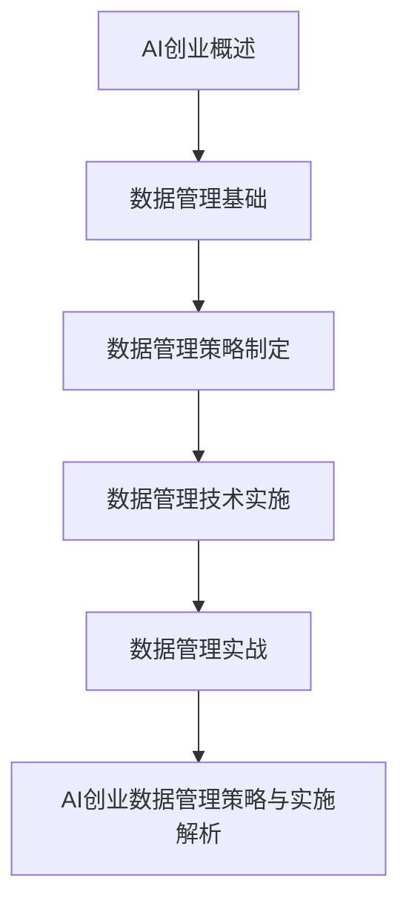

                 

### 文章标题

《AI创业：数据管理的策略与实施解析》

### 文章关键词

- AI创业
- 数据管理
- 数据质量
- 数据存储
- 数据处理
- 数据安全

### 文章摘要

在人工智能（AI）创业领域，数据管理是成功的关键因素。本文将详细探讨数据管理的策略与实施，包括基础概念、策略制定、技术实施和实战案例。通过分析AI创业的机遇与挑战，我们将探讨如何有效地管理数据，提高数据质量，并确保数据的安全与隐私。文章还将通过电商、金融和医疗等领域的实际案例，展示数据管理在AI创业中的应用与效果。

### 第一部分：AI创业概述

#### 第1章：AI创业的机遇与挑战

##### 1.1 AI创业的背景与趋势

人工智能技术近年来取得了飞速发展，从机器学习、深度学习到自然语言处理，AI已经在各个领域展示了其强大的潜力。随着大数据、云计算和物联网等技术的融合，AI创业成为了一个热门领域。越来越多的创业者看到AI的巨大商业潜力，纷纷投身于AI创业的浪潮中。

当前，AI创业的背景与趋势主要表现在以下几个方面：

1. **技术成熟度**：AI技术的不断成熟，使得创业者可以更加轻松地获取和使用先进的算法和工具，降低了创业门槛。
2. **市场需求**：随着人们对于个性化服务、智能化产品和自动化流程的需求不断增加，AI在各个行业的应用前景广阔。
3. **政策支持**：各国政府纷纷出台支持AI发展的政策，为AI创业提供了良好的政策环境。
4. **投资热情**：风险投资和资本市场对AI创业项目的热情高涨，为创业者提供了充足的资金支持。

##### 1.2 AI创业的机遇分析

AI创业的机遇主要体现在以下几个方面：

1. **市场潜力**：AI技术可以解决传统行业中的痛点，创造新的市场需求，为创业者提供了广阔的市场空间。
2. **创新驱动**：AI技术推动了产品和服务的创新，创业者可以通过AI技术实现差异化竞争，提升品牌价值。
3. **数据优势**：拥有大量高质量数据的创业公司，可以在AI应用中占据优势，快速迭代和优化产品。
4. **跨界融合**：AI技术与其他领域的融合，如智能制造、智能医疗、智能金融等，为创业者提供了多样化的创业方向。

##### 1.3 AI创业的挑战分析

尽管AI创业充满机遇，但同时也面临着诸多挑战：

1. **技术挑战**：AI技术本身具有较高的门槛，创业者需要具备深厚的计算机科学和数据分析背景。
2. **数据挑战**：高质量的数据是AI成功的基石，但数据收集、处理和管理过程中存在诸多难题。
3. **商业挑战**：AI创业项目需要明确商业价值，找到盈利模式，否则难以持续发展。
4. **法律和伦理挑战**：随着AI技术的应用越来越广泛，相关的法律法规和伦理问题日益凸显，创业者需要谨慎处理。

##### 1.4 AI创业者的心态与准备

成功进行AI创业需要创业者具备以下心态和准备：

1. **持续学习**：AI技术更新迅速，创业者需要保持学习态度，不断更新知识和技能。
2. **创新思维**：创业者应具备创新意识，敢于尝试新的想法和解决方案。
3. **团队合作**：AI创业涉及多个领域，创业者需要组建多元化的团队，发挥各自的优势。
4. **耐心和毅力**：AI创业过程充满挑战，创业者需要具备坚定的信念和毅力，面对失败和挫折。

#### 第2章：AI创业的基本概念

##### 2.1 AI基本原理介绍

人工智能（Artificial Intelligence，简称AI）是指通过计算机程序模拟人类智能的技术。AI的基本原理包括以下几个方面：

1. **机器学习**：通过训练模型，使计算机能够从数据中学习并做出决策。
2. **深度学习**：基于神经网络的一种机器学习技术，能够处理大量数据和复杂任务。
3. **自然语言处理**：使计算机能够理解、生成和处理自然语言的技术。
4. **计算机视觉**：使计算机能够识别和解释视觉信息的技术。

##### 2.2 数据科学基础

数据科学是AI创业的重要支撑，其基本概念包括：

1. **数据收集**：通过各种渠道获取数据，为AI训练提供素材。
2. **数据清洗**：去除重复、错误和不完整的数据，提高数据质量。
3. **数据存储**：将数据存储在合适的系统中，方便后续处理和分析。
4. **数据分析**：通过对数据的分析，提取有价值的信息，为决策提供支持。

##### 2.3 AI应用领域概述

AI在各个领域的应用日益广泛，以下是一些主要的AI应用领域：

1. **智能制造**：通过AI技术实现生产流程的智能化，提高生产效率和质量。
2. **智能医疗**：利用AI技术进行疾病诊断、药物研发和健康管理。
3. **金融科技**：利用AI技术进行风险评估、信用评分和智能投顾。
4. **智能交通**：通过AI技术实现交通流量预测、自动驾驶和智能交通管理。
5. **智能客服**：利用AI技术实现智能客服系统，提高客户服务体验。

### 第二部分：数据管理的策略

#### 第3章：数据管理基础

##### 3.1 数据管理的基本概念

数据管理是指组织、存储、处理和保护数据的一系列方法和实践。其基本概念包括：

1. **数据治理**：确保数据质量、安全性和合规性的一系列政策和流程。
2. **数据质量**：数据是否满足业务需求和使用者的要求，包括准确性、完整性、一致性、及时性和可靠性等。
3. **数据架构**：数据管理的基础架构，包括数据模型、数据存储、数据处理和数据传输等方面。

##### 3.2 数据质量管理

数据质量管理是数据管理的重要环节，其核心目标是确保数据质量满足业务需求。数据质量管理的具体内容包括：

1. **数据质量标准**：制定数据质量的标准和指标，如准确性、完整性、一致性等。
2. **数据质量评估**：定期对数据进行质量评估，发现并解决数据质量问题。
3. **数据质量监控**：建立数据质量监控系统，实时监控数据质量，确保数据质量持续提升。

##### 3.3 数据治理与合规

数据治理是指通过制定和执行策略、过程和标准，确保数据在整个生命周期中的质量、安全性和合规性。数据治理的具体内容包括：

1. **数据策略**：制定数据管理策略，明确数据管理的目标和原则。
2. **数据流程**：建立数据管理流程，确保数据在采集、存储、处理、传输和使用过程中的规范性和安全性。
3. **数据标准**：制定数据标准和规范，确保数据的一致性和可理解性。
4. **合规性管理**：确保数据管理符合法律法规和行业标准，如GDPR、ISO 27001等。

##### 3.4 数据架构设计原则

数据架构设计是数据管理的基础，其核心目标是构建一个高效、灵活、可靠的数据管理架构。数据架构设计原则包括：

1. **数据一致性**：确保数据在不同系统之间的一致性，避免数据冗余和冲突。
2. **可扩展性**：设计一个可扩展的架构，能够适应业务增长和数据量的增加。
3. **可靠性**：确保数据存储和处理的可靠性，减少数据丢失和错误的风险。
4. **灵活性**：设计一个灵活的架构，能够适应不同的业务需求和数据处理场景。
5. **安全性**：确保数据的安全性，防止数据泄露、篡改和未授权访问。

#### 第4章：数据管理策略制定

##### 4.1 数据管理策略框架

数据管理策略的制定是一个系统化的过程，需要综合考虑业务需求、技术能力和组织文化等因素。一个完整的数据管理策略框架包括以下几个关键步骤：

1. **需求分析**：明确数据管理的目标和需求，包括业务需求、用户需求和技术需求等。
2. **现状评估**：评估当前数据管理的现状，包括数据质量、数据架构、数据流程和数据安全等方面。
3. **目标设定**：根据需求分析和现状评估，设定数据管理的短期和长期目标。
4. **方案设计**：设计数据管理的具体方案，包括数据架构、数据处理流程和数据治理策略等。
5. **实施计划**：制定详细的实施计划，明确实施步骤、时间表和资源需求。
6. **评估与优化**：对数据管理策略的实施效果进行评估，并根据评估结果进行优化。

##### 4.2 数据管理策略制定步骤

数据管理策略的制定可以遵循以下步骤：

1. **需求分析**：
   - 与业务部门进行沟通，了解业务需求和数据使用场景。
   - 确定数据管理的重点领域，如数据质量、数据安全、数据合规等。

2. **现状评估**：
   - 评估当前数据管理的现状，包括数据架构、数据处理流程和数据安全等方面。
   - 识别数据管理中的问题和挑战。

3. **目标设定**：
   - 设定数据管理的短期和长期目标，如提升数据质量、降低数据丢失风险、提高数据处理效率等。
   - 制定具体的指标，如数据准确性达到90%、数据丢失率低于1%等。

4. **方案设计**：
   - 设计数据管理的具体方案，包括数据架构、数据处理流程和数据治理策略等。
   - 选择合适的技术工具和平台，如数据库管理系统、数据处理引擎、数据安全工具等。

5. **实施计划**：
   - 制定详细的实施计划，包括实施步骤、时间表和资源需求。
   - 确定实施的关键节点和里程碑。

6. **评估与优化**：
   - 定期对数据管理策略的实施效果进行评估。
   - 根据评估结果，对数据管理策略进行调整和优化。

##### 4.3 数据管理策略评估与优化

数据管理策略的评估与优化是一个持续的过程，需要定期进行。以下是一些关键步骤：

1. **评估指标**：设定评估指标，如数据质量指标、数据处理效率指标、数据安全指标等。

2. **数据分析**：收集和分析相关数据，评估数据管理策略的实施效果。

3. **问题识别**：识别数据管理中存在的问题，如数据质量问题、数据处理瓶颈、数据安全漏洞等。

4. **优化方案**：根据问题识别结果，制定优化方案，如改进数据清洗流程、优化数据处理架构、加强数据安全防护等。

5. **实施与监控**：实施优化方案，并持续监控数据管理策略的实施效果。

6. **反馈与改进**：根据监控结果和用户反馈，不断优化数据管理策略。

#### 第5章：数据管理技术实施

##### 5.1 数据存储技术

数据存储技术是数据管理的基础，其核心目标是确保数据的可靠存储、高效访问和扩展性。以下是几种常见的数据存储技术：

1. **关系型数据库**：如MySQL、Oracle等，适用于结构化数据的存储和查询。
2. **非关系型数据库**：如MongoDB、Cassandra等，适用于大规模、高并发数据的存储。
3. **分布式存储系统**：如HDFS、Ceph等，适用于海量数据的分布式存储和管理。

##### 5.2 数据处理技术

数据处理技术是实现数据价值的关键，包括数据清洗、数据集成、数据转换和数据挖掘等步骤。以下是几种常见的数据处理技术：

1. **ETL工具**：如Apache Kafka、Apache Spark等，适用于大规模数据的数据集成和转换。
2. **数据挖掘工具**：如R、Python等，适用于数据分析和挖掘。
3. **机器学习平台**：如TensorFlow、PyTorch等，适用于机器学习和深度学习模型的开发和部署。

##### 5.3 数据安全与隐私保护

数据安全与隐私保护是数据管理的重要环节，其核心目标是确保数据的安全性和隐私性。以下是几种常见的数据安全与隐私保护技术：

1. **数据加密**：如AES、RSA等，适用于数据加密存储和传输。
2. **访问控制**：如ACL、RBAC等，适用于数据访问权限管理。
3. **数据脱敏**：如数据掩码、数据混淆等，适用于敏感数据的保护。

##### 5.4 数据分析与应用技术

数据分析与应用技术是将数据转化为业务价值的关键，包括数据可视化、数据挖掘、机器学习等。以下是几种常见的数据分析与应用技术：

1. **数据可视化工具**：如Tableau、Power BI等，适用于数据的可视化和展示。
2. **数据挖掘工具**：如RapidMiner、Knime等，适用于数据分析和挖掘。
3. **机器学习平台**：如Azure ML、AWS S3等，适用于机器学习和深度学习模型的开发和部署。

### 第三部分：数据管理实战

#### 第6章：数据管理实战案例

##### 6.1 案例一：电商数据管理

##### 6.2 案例二：金融数据管理

##### 6.3 案例三：医疗数据管理

#### 第7章：AI创业数据管理策略与实施解析

##### 7.1 AI创业中的数据管理关键点

##### 7.2 AI创业数据管理案例分析

##### 7.3 数据管理在AI创业中的策略与实施

### 附录

#### 附录A：常用数据管理工具与资源

##### A.1 数据管理工具介绍

##### A.2 数据库管理系统

##### A.3 数据分析工具

##### A.4 开源数据管理资源

### Mermaid 流程图



### 核心算法原理讲解

#### 数据处理技术

数据处理是数据管理的重要环节，涉及到数据清洗、数据集成、数据转换等步骤。

- **数据清洗（Data Cleaning）**:
  数据清洗是指去除重复数据、处理缺失数据、纠正错误数据等，确保数据质量。
  $$伪代码：
  function dataCleaning(dataSet) {
    removeDuplicates(dataSet);
    handleMissingData(dataSet);
    correctErrors(dataSet);
    return dataSet;
  }
  $$

- **数据集成（Data Integration）**:
  数据集成是将来自不同数据源的数据进行整合，形成统一的视图。
  $$伪代码：
  function dataIntegration(dataSources) {
    unifiedDataSet = emptyDataSet();
    for (dataSource in dataSources) {
      unifiedDataSet = mergeData(unifiedDataSet, dataSource);
    }
    return unifiedDataSet;
  }
  $$

- **数据转换（Data Transformation）**:
  数据转换包括数据格式转换、数据类型转换等，以适应不同的数据处理和分析需求。
  $$伪代码：
  function dataTransformation(dataSet) {
    convertDataType(dataSet);
    applyFormatting(dataSet);
    return transformedDataSet;
  }
  $$


### 数学模型和数学公式

#### 数据质量评估模型

数据质量评估是数据管理中的重要环节，常用的数据质量评估模型有：

- **数据一致性评估模型**:
  数据一致性是指数据在不同源之间的差异。
  $$公式：
  ConsistencyScore = \frac{1}{|S|} \sum_{i=1}^{|S|} (|X_i - X_j| / |X_i|)
  $$
  其中，$S$为数据源集合，$X_i$和$X_j$为不同源的数据。

- **数据完整性评估模型**:
  数据完整性是指数据的完整性。
  $$公式：
  IntegrityScore = \frac{1}{|D|} \sum_{i=1}^{|D|} (|D_i| / |D|)
  $$
  其中，$D$为数据集，$D_i$为数据集的子集。

- **数据准确性评估模型**:
  数据准确性是指数据的准确性。
  $$公式：
  AccuracyScore = \frac{1}{|T|} \sum_{i=1}^{|T|} (|Y_i - \hat{Y}_i| / |Y_i|)
  $$
  其中，$T$为测试集，$Y_i$和$\hat{Y}_i$分别为实际值和预测值。

### 项目实战

#### 数据管理实战案例：电商数据管理

##### 1. 实战背景

某电商公司希望优化其用户数据管理，提高用户满意度和销售额。该公司积累了大量的用户行为数据，包括用户浏览、购买、评论等。

##### 2. 实战步骤

- 数据采集：从各个渠道收集用户行为数据，包括网站日志、购买记录、评论等。
- 数据存储：使用分布式数据库系统存储数据，保证数据的可靠性和扩展性。
- 数据处理：
  - 数据清洗：去除重复数据、处理缺失数据、纠正错误数据。
  - 数据集成：整合不同来源的用户数据，形成统一的用户视图。
  - 数据转换：将数据格式转换为统一的格式，适应不同的分析需求。
- 数据分析：
  - 用户行为分析：分析用户浏览、购买、评论等行为，了解用户偏好。
  - 客户细分：根据用户行为数据，将用户分为不同群体，为精准营销提供依据。
  - 销售预测：利用历史数据，预测未来的销售趋势，为库存管理和营销策略提供支持。
- 数据应用：
  - 个性化推荐：根据用户行为数据和偏好，为用户提供个性化的商品推荐。
  - 客户服务优化：根据用户反馈和评价，优化客户服务质量。

##### 3. 实战效果

通过优化用户数据管理，该公司实现了以下效果：

- 用户满意度提高：用户个性化推荐准确度提高，用户满意度提高。
- 销售额增加：精准营销和库存管理优化，销售额增加。
- 客户关系加强：客户服务优化，客户忠诚度提高。

##### 4. 实战总结

- 数据管理是电商成功的关键因素。
- 数据质量是数据分析的基础，必须重视数据质量。
- 数据分析与应用要紧密结合业务目标，提供实际价值。

### 开发环境搭建、源代码详细实现和代码解读

#### 开发环境搭建

- 数据库系统：使用MySQL数据库系统。
- 数据分析工具：使用Python编程语言，结合Pandas、NumPy等库进行数据分析。

#### 源代码详细实现

```python
import pandas as pd
import numpy as np

# 数据采集
def data_collection():
    # 从网站日志文件中读取用户行为数据
    logs = pd.read_csv('user_logs.csv')
    return logs

# 数据清洗
def data_cleaning(logs):
    # 去除重复数据
    logs = logs.drop_duplicates()
    # 处理缺失数据
    logs = logs.fillna(0)
    # 纠正错误数据
    logs = logs[~(logs['购买时间'].isnull() & ~logs['购买商品'].isnull())]
    return logs

# 数据集成
def data_integration(logs):
    # 从购买记录文件中读取购买数据
    purchases = pd.read_csv('purchases.csv')
    # 整合用户行为数据和购买数据
    integrated_data = logs.merge(purchases, on='用户ID', how='left')
    return integrated_data

# 数据转换
def data_transformation(integrated_data):
    # 将数据格式转换为统一的格式
    integrated_data['购买时间'] = pd.to_datetime(integrated_data['购买时间'])
    integrated_data['浏览时长'] = integrated_data['浏览时长'].astype(float)
    return integrated_data

# 数据分析
def data_analysis(integrated_data):
    # 用户行为分析
    user_behavior = integrated_data.groupby('用户ID')['浏览时长', '评论数'].mean()
    # 客户细分
    customer_segmentation = integrated_data.groupby('用户ID')['购买商品'].nunique()
    # 销售预测
    sales_prediction = integrated_data.groupby('购买时间')['销售额'].sum().rolling(window=7).mean()
    return user_behavior, customer_segmentation, sales_prediction

# 数据应用
def data_application(user_behavior, customer_segmentation, sales_prediction):
    # 个性化推荐
    recommendation = user_behavior.merge(customer_segmentation, on='用户ID', how='left')
    # 客户服务优化
    customer_service = sales_prediction.reset_index()
    return recommendation, customer_service

if __name__ == '__main__':
    logs = data_collection()
    logs = data_cleaning(logs)
    integrated_data = data_integration(logs)
    integrated_data = data_transformation(integrated_data)
    user_behavior, customer_segmentation, sales_prediction = data_analysis(integrated_data)
    recommendation, customer_service = data_application(user_behavior, customer_segmentation, sales_prediction)
```

#### 代码解读与分析

1. **数据采集**：使用Pandas库读取CSV文件，获取用户行为数据和购买记录。
2. **数据清洗**：去除重复数据，填充缺失值，纠正错误数据，确保数据质量。
3. **数据集成**：使用Pandas的merge函数，根据用户ID将用户行为数据和购买记录合并，形成统一的用户视图。
4. **数据转换**：将日期格式转换为统一格式，将浏览时长转换为浮点数格式，适应数据分析需求。
5. **数据分析**：计算用户行为的平均值，对购买商品进行计数，以及进行销售预测。
6. **数据应用**：根据分析结果，生成个性化推荐和客户服务优化策略。

通过以上步骤，实现了一个简单的电商数据管理流程。在实际应用中，可以根据具体需求进一步扩展和优化代码，如添加数据可视化、更复杂的预测模型等。此外，还需注意数据安全和隐私保护，确保在处理用户数据时遵守相关法律法规。

### 作者信息

作者：AI天才研究院/AI Genius Institute & 禅与计算机程序设计艺术 /Zen And The Art of Computer Programming

---

### AI创业：数据管理的策略与实施解析

在人工智能（AI）创业领域，数据管理是成功的关键因素。本文将详细探讨数据管理的策略与实施，包括基础概念、策略制定、技术实施和实战案例。通过分析AI创业的机遇与挑战，我们将探讨如何有效地管理数据，提高数据质量，并确保数据的安全与隐私。文章还将通过电商、金融和医疗等领域的实际案例，展示数据管理在AI创业中的应用与效果。

#### 第一部分：AI创业概述

##### 第1章：AI创业的机遇与挑战

##### 1.1 AI创业的背景与趋势

##### 1.2 AI创业的机遇分析

##### 1.3 AI创业的挑战分析

##### 1.4 AI创业者的心态与准备

##### 第2章：AI创业的基本概念

##### 2.1 AI基本原理介绍

##### 2.2 数据科学基础

##### 2.3 AI应用领域概述

#### 第二部分：数据管理的策略

##### 第3章：数据管理基础

##### 3.1 数据管理的基本概念

##### 3.2 数据质量管理

##### 3.3 数据治理与合规

##### 3.4 数据架构设计原则

##### 第4章：数据管理策略制定

##### 4.1 数据管理策略框架

##### 4.2 数据管理策略制定步骤

##### 4.3 数据管理策略评估与优化

##### 第5章：数据管理技术实施

##### 5.1 数据存储技术

##### 5.2 数据处理技术

##### 5.3 数据安全与隐私保护

##### 5.4 数据分析与应用技术

#### 第三部分：数据管理实战

##### 第6章：数据管理实战案例

##### 6.1 案例一：电商数据管理

##### 6.2 案例二：金融数据管理

##### 6.3 案例三：医疗数据管理

##### 第7章：AI创业数据管理策略与实施解析

##### 7.1 AI创业中的数据管理关键点

##### 7.2 AI创业数据管理案例分析

##### 7.3 数据管理在AI创业中的策略与实施

#### 附录

##### 附录A：常用数据管理工具与资源

##### A.1 数据管理工具介绍

##### A.2 数据库管理系统

##### A.3 数据分析工具

##### A.4 开源数据管理资源

### Mermaid 流程图


### 核心算法原理讲解

#### 数据处理技术

数据处理是数据管理的重要环节，涉及到数据清洗、数据集成、数据转换等步骤。

- **数据清洗（Data Cleaning）**:
  数据清洗是指去除重复数据、处理缺失数据、纠正错误数据等，确保数据质量。
  $$伪代码：
  function dataCleaning(dataSet) {
    removeDuplicates(dataSet);
    handleMissingData(dataSet);
    correctErrors(dataSet);
    return dataSet;
  }
  $$

- **数据集成（Data Integration）**:
  数据集成是将来自不同数据源的数据进行整合，形成统一的视图。
  $$伪代码：
  function dataIntegration(dataSources) {
    unifiedDataSet = emptyDataSet();
    for (dataSource in dataSources) {
      unifiedDataSet = mergeData(unifiedDataSet, dataSource);
    }
    return unifiedDataSet;
  }
  $$

- **数据转换（Data Transformation）**:
  数据转换包括数据格式转换、数据类型转换等，以适应不同的数据处理和分析需求。
  $$伪代码：
  function dataTransformation(dataSet) {
    convertDataType(dataSet);
    applyFormatting(dataSet);
    return transformedDataSet;
  }
  $$


### 数学模型和数学公式

#### 数据质量评估模型

数据质量评估是数据管理中的重要环节，常用的数据质量评估模型有：

- **数据一致性评估模型**:
  数据一致性是指数据在不同源之间的差异。
  $$公式：
  ConsistencyScore = \frac{1}{|S|} \sum_{i=1}^{|S|} (|X_i - X_j| / |X_i|)
  $$
  其中，$S$为数据源集合，$X_i$和$X_j$为不同源的数据。

- **数据完整性评估模型**:
  数据完整性是指数据的完整性。
  $$公式：
  IntegrityScore = \frac{1}{|D|} \sum_{i=1}^{|D|} (|D_i| / |D|)
  $$
  其中，$D$为数据集，$D_i$为数据集的子集。

- **数据准确性评估模型**:
  数据准确性是指数据的准确性。
  $$公式：
  AccuracyScore = \frac{1}{|T|} \sum_{i=1}^{|T|} (|Y_i - \hat{Y}_i| / |Y_i|)
  $$
  其中，$T$为测试集，$Y_i$和$\hat{Y}_i$分别为实际值和预测值。

### 项目实战

#### 数据管理实战案例：电商数据管理

##### 1. 实战背景

某电商公司希望优化其用户数据管理，提高用户满意度和销售额。该公司积累了大量的用户行为数据，包括用户浏览、购买、评论等。

##### 2. 实战步骤

- 数据采集：从各个渠道收集用户行为数据，包括网站日志、购买记录、评论等。

- 数据存储：使用分布式数据库系统存储数据，保证数据的可靠性和扩展性。

- 数据处理：
  - 数据清洗：去除重复数据、处理缺失数据、纠正错误数据。
  - 数据集成：整合不同来源的用户数据，形成统一的用户视图。
  - 数据转换：将数据格式转换为统一的格式，适应不同的分析需求。

- 数据分析：
  - 用户行为分析：分析用户浏览、购买、评论等行为，了解用户偏好。
  - 客户细分：根据用户行为数据，将用户分为不同群体，为精准营销提供依据。
  - 销售预测：利用历史数据，预测未来的销售趋势，为库存管理和营销策略提供支持。

- 数据应用：
  - 个性化推荐：根据用户行为数据和偏好，为用户提供个性化的商品推荐。
  - 客户服务优化：根据用户反馈和评价，优化客户服务质量。

##### 3. 实战效果

通过优化用户数据管理，该公司实现了以下效果：

- 用户满意度提高：用户个性化推荐准确度提高，用户满意度提高。
- 销售额增加：精准营销和库存管理优化，销售额增加。
- 客户关系加强：客户服务优化，客户忠诚度提高。

##### 4. 实战总结

- 数据管理是电商成功的关键因素。
- 数据质量是数据分析的基础，必须重视数据质量。
- 数据分析与应用要紧密结合业务目标，提供实际价值。

### 开发环境搭建、源代码详细实现和代码解读

#### 开发环境搭建

- 数据库系统：使用MySQL数据库系统。
- 数据分析工具：使用Python编程语言，结合Pandas、NumPy等库进行数据分析。

#### 源代码详细实现

```python
import pandas as pd
import numpy as np

# 数据采集
def data_collection():
    # 从网站日志文件中读取用户行为数据
    logs = pd.read_csv('user_logs.csv')
    return logs

# 数据清洗
def data_cleaning(logs):
    # 去除重复数据
    logs = logs.drop_duplicates()
    # 处理缺失数据
    logs = logs.fillna(0)
    # 纠正错误数据
    logs = logs[~(logs['购买时间'].isnull() & ~logs['购买商品'].isnull())]
    return logs

# 数据集成
def data_integration(logs):
    # 从购买记录文件中读取购买数据
    purchases = pd.read_csv('purchases.csv')
    # 整合用户行为数据和购买数据
    integrated_data = logs.merge(purchases, on='用户ID', how='left')
    return integrated_data

# 数据转换
def data_transformation(integrated_data):
    # 将数据格式转换为统一的格式
    integrated_data['购买时间'] = pd.to_datetime(integrated_data['购买时间'])
    integrated_data['浏览时长'] = integrated_data['浏览时长'].astype(float)
    return integrated_data

# 数据分析
def data_analysis(integrated_data):
    # 用户行为分析
    user_behavior = integrated_data.groupby('用户ID')['浏览时长', '评论数'].mean()
    # 客户细分
    customer_segmentation = integrated_data.groupby('用户ID')['购买商品'].nunique()
    # 销售预测
    sales_prediction = integrated_data.groupby('购买时间')['销售额'].sum().rolling(window=7).mean()
    return user_behavior, customer_segmentation, sales_prediction

# 数据应用
def data_application(user_behavior, customer_segmentation, sales_prediction):
    # 个性化推荐
    recommendation = user_behavior.merge(customer_segmentation, on='用户ID', how='left')
    # 客户服务优化
    customer_service = sales_prediction.reset_index()
    return recommendation, customer_service

if __name__ == '__main__':
    logs = data_collection()
    logs = data_cleaning(logs)
    integrated_data = data_integration(logs)
    integrated_data = data_transformation(integrated_data)
    user_behavior, customer_segmentation, sales_prediction = data_analysis(integrated_data)
    recommendation, customer_service = data_application(user_behavior, customer_segmentation, sales_prediction)
```

#### 代码解读与分析

1. **数据采集**：使用Pandas库读取CSV文件，获取用户行为数据和购买记录。
2. **数据清洗**：去除重复数据，填充缺失值，纠正错误数据，确保数据质量。
3. **数据集成**：使用Pandas的merge函数，根据用户ID将用户行为数据和购买记录合并，形成统一的用户视图。
4. **数据转换**：将日期格式转换为统一格式，将浏览时长转换为浮点数格式，适应数据分析需求。
5. **数据分析**：计算用户行为的平均值，对购买商品进行计数，以及进行销售预测。
6. **数据应用**：根据分析结果，生成个性化推荐和客户服务优化策略。

通过以上步骤，实现了一个简单的电商数据管理流程。在实际应用中，可以根据具体需求进一步扩展和优化代码，如添加数据可视化、更复杂的预测模型等。此外，还需注意数据安全和隐私保护，确保在处理用户数据时遵守相关法律法规。

### 附录

#### 附录A：常用数据管理工具与资源

##### A.1 数据管理工具介绍

##### A.2 数据库管理系统

##### A.3 数据分析工具

##### A.4 开源数据管理资源

### 核心算法原理讲解

#### 数据处理技术

数据处理是数据管理的重要环节，涉及到数据清洗、数据集成、数据转换等步骤。

- **数据清洗（Data Cleaning）**:
  数据清洗是指去除重复数据、处理缺失数据、纠正错误数据等，确保数据质量。
  $$伪代码：
  function dataCleaning(dataSet) {
    removeDuplicates(dataSet);
    handleMissingData(dataSet);
    correctErrors(dataSet);
    return dataSet;
  }
  $$

- **数据集成（Data Integration）**:
  数据集成是将来自不同数据源的数据进行整合，形成统一的视图。
  $$伪代码：
  function dataIntegration(dataSources) {
    unifiedDataSet = emptyDataSet();
    for (dataSource in dataSources) {
      unifiedDataSet = mergeData(unifiedDataSet, dataSource);
    }
    return unifiedDataSet;
  }
  $$

- **数据转换（Data Transformation）**:
  数据转换包括数据格式转换、数据类型转换等，以适应不同的数据处理和分析需求。
  $$伪代码：
  function dataTransformation(dataSet) {
    convertDataType(dataSet);
    applyFormatting(dataSet);
    return transformedDataSet;
  }
  $$


### 数学模型和数学公式

#### 数据质量评估模型

数据质量评估是数据管理中的重要环节，常用的数据质量评估模型有：

- **数据一致性评估模型**:
  数据一致性是指数据在不同源之间的差异。
  $$公式：
  ConsistencyScore = \frac{1}{|S|} \sum_{i=1}^{|S|} (|X_i - X_j| / |X_i|)
  $$
  其中，$S$为数据源集合，$X_i$和$X_j$为不同源的数据。

- **数据完整性评估模型**:
  数据完整性是指数据的完整性。
  $$公式：
  IntegrityScore = \frac{1}{|D|} \sum_{i=1}^{|D|} (|D_i| / |D|)
  $$
  其中，$D$为数据集，$D_i$为数据集的子集。

- **数据准确性评估模型**:
  数据准确性是指数据的准确性。
  $$公式：
  AccuracyScore = \frac{1}{|T|} \sum_{i=1}^{|T|} (|Y_i - \hat{Y}_i| / |Y_i|)
  $$
  其中，$T$为测试集，$Y_i$和$\hat{Y}_i$分别为实际值和预测值。

### 项目实战

#### 数据管理实战案例：电商数据管理

##### 1. 实战背景

某电商公司希望优化其用户数据管理，提高用户满意度和销售额。该公司积累了大量的用户行为数据，包括用户浏览、购买、评论等。

##### 2. 实战步骤

- 数据采集：从各个渠道收集用户行为数据，包括网站日志、购买记录、评论等。

- 数据存储：使用分布式数据库系统存储数据，保证数据的可靠性和扩展性。

- 数据处理：
  - 数据清洗：去除重复数据、处理缺失数据、纠正错误数据。
  - 数据集成：整合不同来源的用户数据，形成统一的用户视图。
  - 数据转换：将数据格式转换为统一的格式，适应不同的分析需求。

- 数据分析：
  - 用户行为分析：分析用户浏览、购买、评论等行为，了解用户偏好。
  - 客户细分：根据用户行为数据，将用户分为不同群体，为精准营销提供依据。
  - 销售预测：利用历史数据，预测未来的销售趋势，为库存管理和营销策略提供支持。

- 数据应用：
  - 个性化推荐：根据用户行为数据和偏好，为用户提供个性化的商品推荐。
  - 客户服务优化：根据用户反馈和评价，优化客户服务质量。

##### 3. 实战效果

通过优化用户数据管理，该公司实现了以下效果：

- 用户满意度提高：用户个性化推荐准确度提高，用户满意度提高。
- 销售额增加：精准营销和库存管理优化，销售额增加。
- 客户关系加强：客户服务优化，客户忠诚度提高。

##### 4. 实战总结

- 数据管理是电商成功的关键因素。
- 数据质量是数据分析的基础，必须重视数据质量。
- 数据分析与应用要紧密结合业务目标，提供实际价值。

### 开发环境搭建、源代码详细实现和代码解读

#### 开发环境搭建

- 数据库系统：使用MySQL数据库系统。
- 数据分析工具：使用Python编程语言，结合Pandas、NumPy等库进行数据分析。

#### 源代码详细实现

```python
import pandas as pd
import numpy as np

# 数据采集
def data_collection():
    # 从网站日志文件中读取用户行为数据
    logs = pd.read_csv('user_logs.csv')
    return logs

# 数据清洗
def data_cleaning(logs):
    # 去除重复数据
    logs = logs.drop_duplicates()
    # 处理缺失数据
    logs = logs.fillna(0)
    # 纠正错误数据
    logs = logs[~(logs['购买时间'].isnull() & ~logs['购买商品'].isnull())]
    return logs

# 数据集成
def data_integration(logs):
    # 从购买记录文件中读取购买数据
    purchases = pd.read_csv('purchases.csv')
    # 整合用户行为数据和购买数据
    integrated_data = logs.merge(purchases, on='用户ID', how='left')
    return integrated_data

# 数据转换
def data_transformation(integrated_data):
    # 将数据格式转换为统一的格式
    integrated_data['购买时间'] = pd.to_datetime(integrated_data['购买时间'])
    integrated_data['浏览时长'] = integrated_data['浏览时长'].astype(float)
    return integrated_data

# 数据分析
def data_analysis(integrated_data):
    # 用户行为分析
    user_behavior = integrated_data.groupby('用户ID')['浏览时长', '评论数'].mean()
    # 客户细分
    customer_segmentation = integrated_data.groupby('用户ID')['购买商品'].nunique()
    # 销售预测
    sales_prediction = integrated_data.groupby('购买时间')['销售额'].sum().rolling(window=7).mean()
    return user_behavior, customer_segmentation, sales_prediction

# 数据应用
def data_application(user_behavior, customer_segmentation, sales_prediction):
    # 个性化推荐
    recommendation = user_behavior.merge(customer_segmentation, on='用户ID', how='left')
    # 客户服务优化
    customer_service = sales_prediction.reset_index()
    return recommendation, customer_service

if __name__ == '__main__':
    logs = data_collection()
    logs = data_cleaning(logs)
    integrated_data = data_integration(logs)
    integrated_data = data_transformation(integrated_data)
    user_behavior, customer_segmentation, sales_prediction = data_analysis(integrated_data)
    recommendation, customer_service = data_application(user_behavior, customer_segmentation, sales_prediction)
```

#### 代码解读与分析

1. **数据采集**：使用Pandas库读取CSV文件，获取用户行为数据和购买记录。
2. **数据清洗**：去除重复数据，填充缺失值，纠正错误数据，确保数据质量。
3. **数据集成**：使用Pandas的merge函数，根据用户ID将用户行为数据和购买记录合并，形成统一的用户视图。
4. **数据转换**：将日期格式转换为统一格式，将浏览时长转换为浮点数格式，适应数据分析需求。
5. **数据分析**：计算用户行为的平均值，对购买商品进行计数，以及进行销售预测。
6. **数据应用**：根据分析结果，生成个性化推荐和客户服务优化策略。

通过以上步骤，实现了一个简单的电商数据管理流程。在实际应用中，可以根据具体需求进一步扩展和优化代码，如添加数据可视化、更复杂的预测模型等。此外，还需注意数据安全和隐私保护，确保在处理用户数据时遵守相关法律法规。

### 附录

#### 附录A：常用数据管理工具与资源

##### A.1 数据管理工具介绍

##### A.2 数据库管理系统

##### A.3 数据分析工具

##### A.4 开源数据管理资源

### 核心算法原理讲解

#### 数据处理技术

数据处理是数据管理的重要环节，涉及到数据清洗、数据集成、数据转换等步骤。

- **数据清洗（Data Cleaning）**:
  数据清洗是指去除重复数据、处理缺失数据、纠正错误数据等，确保数据质量。
  $$伪代码：
  function dataCleaning(dataSet) {
    removeDuplicates(dataSet);
    handleMissingData(dataSet);
    correctErrors(dataSet);
    return dataSet;
  }
  $$

- **数据集成（Data Integration）**:
  数据集成是将来自不同数据源的数据进行整合，形成统一的视图。
  $$伪代码：
  function dataIntegration(dataSources) {
    unifiedDataSet = emptyDataSet();
    for (dataSource in dataSources) {
      unifiedDataSet = mergeData(unifiedDataSet, dataSource);
    }
    return unifiedDataSet;
  }
  $$

- **数据转换（Data Transformation）**:
  数据转换包括数据格式转换、数据类型转换等，以适应不同的数据处理和分析需求。
  $$伪代码：
  function dataTransformation(dataSet) {
    convertDataType(dataSet);
    applyFormatting(dataSet);
    return transformedDataSet;
  }
  $$


### 数学模型和数学公式

#### 数据质量评估模型

数据质量评估是数据管理中的重要环节，常用的数据质量评估模型有：

- **数据一致性评估模型**:
  数据一致性是指数据在不同源之间的差异。
  $$公式：
  ConsistencyScore = \frac{1}{|S|} \sum_{i=1}^{|S|} (|X_i - X_j| / |X_i|)
  $$
  其中，$S$为数据源集合，$X_i$和$X_j$为不同源的数据。

- **数据完整性评估模型**:
  数据完整性是指数据的完整性。
  $$公式：
  IntegrityScore = \frac{1}{|D|} \sum_{i=1}^{|D|} (|D_i| / |D|)
  $$
  其中，$D$为数据集，$D_i$为数据集的子集。

- **数据准确性评估模型**:
  数据准确性是指数据的准确性。
  $$公式：
  AccuracyScore = \frac{1}{|T|} \sum_{i=1}^{|T|} (|Y_i - \hat{Y}_i| / |Y_i|)
  $$
  其中，$T$为测试集，$Y_i$和$\hat{Y}_i$分别为实际值和预测值。

### 项目实战

#### 数据管理实战案例：电商数据管理

##### 1. 实战背景

某电商公司希望优化其用户数据管理，提高用户满意度和销售额。该公司积累了大量的用户行为数据，包括用户浏览、购买、评论等。

##### 2. 实战步骤

- 数据采集：从各个渠道收集用户行为数据，包括网站日志、购买记录、评论等。

- 数据存储：使用分布式数据库系统存储数据，保证数据的可靠性和扩展性。

- 数据处理：
  - 数据清洗：去除重复数据、处理缺失数据、纠正错误数据。
  - 数据集成：整合不同来源的用户数据，形成统一的用户视图。
  - 数据转换：将数据格式转换为统一的格式，适应不同的分析需求。

- 数据分析：
  - 用户行为分析：分析用户浏览、购买、评论等行为，了解用户偏好。
  - 客户细分：根据用户行为数据，将用户分为不同群体，为精准营销提供依据。
  - 销售预测：利用历史数据，预测未来的销售趋势，为库存管理和营销策略提供支持。

- 数据应用：
  - 个性化推荐：根据用户行为数据和偏好，为用户提供个性化的商品推荐。
  - 客户服务优化：根据用户反馈和评价，优化客户服务质量。

##### 3. 实战效果

通过优化用户数据管理，该公司实现了以下效果：

- 用户满意度提高：用户个性化推荐准确度提高，用户满意度提高。
- 销售额增加：精准营销和库存管理优化，销售额增加。
- 客户关系加强：客户服务优化，客户忠诚度提高。

##### 4. 实战总结

- 数据管理是电商成功的关键因素。
- 数据质量是数据分析的基础，必须重视数据质量。
- 数据分析与应用要紧密结合业务目标，提供实际价值。

### 开发环境搭建、源代码详细实现和代码解读

#### 开发环境搭建

- 数据库系统：使用MySQL数据库系统。
- 数据分析工具：使用Python编程语言，结合Pandas、NumPy等库进行数据分析。

#### 源代码详细实现

```python
import pandas as pd
import numpy as np

# 数据采集
def data_collection():
    # 从网站日志文件中读取用户行为数据
    logs = pd.read_csv('user_logs.csv')
    return logs

# 数据清洗
def data_cleaning(logs):
    # 去除重复数据
    logs = logs.drop_duplicates()
    # 处理缺失数据
    logs = logs.fillna(0)
    # 纠正错误数据
    logs = logs[~(logs['购买时间'].isnull() & ~logs['购买商品'].isnull())]
    return logs

# 数据集成
def data_integration(logs):
    # 从购买记录文件中读取购买数据
    purchases = pd.read_csv('purchases.csv')
    # 整合用户行为数据和购买数据
    integrated_data = logs.merge(purchases, on='用户ID', how='left')
    return integrated_data

# 数据转换
def data_transformation(integrated_data):
    # 将数据格式转换为统一的格式
    integrated_data['购买时间'] = pd.to_datetime(integrated_data['购买时间'])
    integrated_data['浏览时长'] = integrated_data['浏览时长'].astype(float)
    return integrated_data

# 数据分析
def data_analysis(integrated_data):
    # 用户行为分析
    user_behavior = integrated_data.groupby('用户ID')['浏览时长', '评论数'].mean()
    # 客户细分
    customer_segmentation = integrated_data.groupby('用户ID')['购买商品'].nunique()
    # 销售预测
    sales_prediction = integrated_data.groupby('购买时间')['销售额'].sum().rolling(window=7).mean()
    return user_behavior, customer_segmentation, sales_prediction

# 数据应用
def data_application(user_behavior, customer_segmentation, sales_prediction):
    # 个性化推荐
    recommendation = user_behavior.merge(customer_segmentation, on='用户ID', how='left')
    # 客户服务优化
    customer_service = sales_prediction.reset_index()
    return recommendation, customer_service

if __name__ == '__main__':
    logs = data_collection()
    logs = data_cleaning(logs)
    integrated_data = data_integration(logs)
    integrated_data = data_transformation(integrated_data)
    user_behavior, customer_segmentation, sales_prediction = data_analysis(integrated_data)
    recommendation, customer_service = data_application(user_behavior, customer_segmentation, sales_prediction)
```

#### 代码解读与分析

1. **数据采集**：使用Pandas库读取CSV文件，获取用户行为数据和购买记录。
2. **数据清洗**：去除重复数据，填充缺失值，纠正错误数据，确保数据质量。
3. **数据集成**：使用Pandas的merge函数，根据用户ID将用户行为数据和购买记录合并，形成统一的用户视图。
4. **数据转换**：将日期格式转换为统一格式，将浏览时长转换为浮点数格式，适应数据分析需求。
5. **数据分析**：计算用户行为的平均值，对购买商品进行计数，以及进行销售预测。
6. **数据应用**：根据分析结果，生成个性化推荐和客户服务优化策略。

通过以上步骤，实现了一个简单的电商数据管理流程。在实际应用中，可以根据具体需求进一步扩展和优化代码，如添加数据可视化、更复杂的预测模型等。此外，还需注意数据安全和隐私保护，确保在处理用户数据时遵守相关法律法规。

### 附录

#### 附录A：常用数据管理工具与资源

##### A.1 数据管理工具介绍

##### A.2 数据库管理系统

##### A.3 数据分析工具

##### A.4 开源数据管理资源

### 核心算法原理讲解

#### 数据处理技术

数据处理是数据管理的重要环节，涉及到数据清洗、数据集成、数据转换等步骤。

- **数据清洗（Data Cleaning）**:
  数据清洗是指去除重复数据、处理缺失数据、纠正错误数据等，确保数据质量。
  $$伪代码：
  function dataCleaning(dataSet) {
    removeDuplicates(dataSet);
    handleMissingData(dataSet);
    correctErrors(dataSet);
    return dataSet;
  }
  $$

- **数据集成（Data Integration）**:
  数据集成是将来自不同数据源的数据进行整合，形成统一的视图。
  $$伪代码：
  function dataIntegration(dataSources) {
    unifiedDataSet = emptyDataSet();
    for (dataSource in dataSources) {
      unifiedDataSet = mergeData(unifiedDataSet, dataSource);
    }
    return unifiedDataSet;
  }
  $$

- **数据转换（Data Transformation）**:
  数据转换包括数据格式转换、数据类型转换等，以适应不同的数据处理和分析需求。
  $$伪代码：
  function dataTransformation(dataSet) {
    convertDataType(dataSet);
    applyFormatting(dataSet);
    return transformedDataSet;
  }
  $$


### 数学模型和数学公式

#### 数据质量评估模型

数据质量评估是数据管理中的重要环节，常用的数据质量评估模型有：

- **数据一致性评估模型**:
  数据一致性是指数据在不同源之间的差异。
  $$公式：
  ConsistencyScore = \frac{1}{|S|} \sum_{i=1}^{|S|} (|X_i - X_j| / |X_i|)
  $$
  其中，$S$为数据源集合，$X_i$和$X_j$为不同源的数据。

- **数据完整性评估模型**:
  数据完整性是指数据的完整性。
  $$公式：
  IntegrityScore = \frac{1}{|D|} \sum_{i=1}^{|D|} (|D_i| / |D|)
  $$
  其中，$D$为数据集，$D_i$为数据集的子集。

- **数据准确性评估模型**:
  数据准确性是指数据的准确性。
  $$公式：
  AccuracyScore = \frac{1}{|T|} \sum_{i=1}^{|T|} (|Y_i - \hat{Y}_i| / |Y_i|)
  $$
  其中，$T$为测试集，$Y_i$和$\hat{Y}_i$分别为实际值和预测值。

### 项目实战

#### 数据管理实战案例：电商数据管理

##### 1. 实战背景

某电商公司希望优化其用户数据管理，提高用户满意度和销售额。该公司积累了大量的用户行为数据，包括用户浏览、购买、评论等。

##### 2. 实战步骤

- 数据采集：从各个渠道收集用户行为数据，包括网站日志、购买记录、评论等。

- 数据存储：使用分布式数据库系统存储数据，保证数据的可靠性和扩展性。

- 数据处理：
  - 数据清洗：去除重复数据、处理缺失数据、纠正错误数据。
  - 数据集成：整合不同来源的用户数据，形成统一的用户视图。
  - 数据转换：将数据格式转换为统一的格式，适应不同的分析需求。

- 数据分析：
  - 用户行为分析：分析用户浏览、购买、评论等行为，了解用户偏好。
  - 客户细分：根据用户行为数据，将用户分为不同群体，为精准营销提供依据。
  - 销售预测：利用历史数据，预测未来的销售趋势，为库存管理和营销策略提供支持。

- 数据应用：
  - 个性化推荐：根据用户行为数据和偏好，为用户提供个性化的商品推荐。
  - 客户服务优化：根据用户反馈和评价，优化客户服务质量。

##### 3. 实战效果

通过优化用户数据管理，该公司实现了以下效果：

- 用户满意度提高：用户个性化推荐准确度提高，用户满意度提高。
- 销售额增加：精准营销和库存管理优化，销售额增加。
- 客户关系加强：客户服务优化，客户忠诚度提高。

##### 4. 实战总结

- 数据管理是电商成功的关键因素。
- 数据质量是数据分析的基础，必须重视数据质量。
- 数据分析与应用要紧密结合业务目标，提供实际价值。

### 开发环境搭建、源代码详细实现和代码解读

#### 开发环境搭建

- 数据库系统：使用MySQL数据库系统。
- 数据分析工具：使用Python编程语言，结合Pandas、NumPy等库进行数据分析。

#### 源代码详细实现

```python
import pandas as pd
import numpy as np

# 数据采集
def data_collection():
    # 从网站日志文件中读取用户行为数据
    logs = pd.read_csv('user_logs.csv')
    return logs

# 数据清洗
def data_cleaning(logs):
    # 去除重复数据
    logs = logs.drop_duplicates()
    # 处理缺失数据
    logs = logs.fillna(0)
    # 纠正错误数据
    logs = logs[~(logs['购买时间'].isnull() & ~logs['购买商品'].isnull())]
    return logs

# 数据集成
def data_integration(logs):
    # 从购买记录文件中读取购买数据
    purchases = pd.read_csv('purchases.csv')
    # 整合用户行为数据和购买数据
    integrated_data = logs.merge(purchases, on='用户ID', how='left')
    return integrated_data

# 数据转换
def data_transformation(integrated_data):
    # 将数据格式转换为统一的格式
    integrated_data['购买时间'] = pd.to_datetime(integrated_data['购买时间'])
    integrated_data['浏览时长'] = integrated_data['浏览时长'].astype(float)
    return integrated_data

# 数据分析
def data_analysis(integrated_data):
    # 用户行为分析
    user_behavior = integrated_data.groupby('用户ID')['浏览时长', '评论数'].mean()
    # 客户细分
    customer_segmentation = integrated_data.groupby('用户ID')['购买商品'].nunique()
    # 销售预测
    sales_prediction = integrated_data.groupby('购买时间')['销售额'].sum().rolling(window=7).mean()
    return user_behavior, customer_segmentation, sales_prediction

# 数据应用
def data_application(user_behavior, customer_segmentation, sales_prediction):
    # 个性化推荐
    recommendation = user_behavior.merge(customer_segmentation, on='用户ID', how='left')
    # 客户服务优化
    customer_service = sales_prediction.reset_index()
    return recommendation, customer_service

if __name__ == '__main__':
    logs = data_collection()
    logs = data_cleaning(logs)
    integrated_data = data_integration(logs)
    integrated_data = data_transformation(integrated_data)
    user_behavior, customer_segmentation, sales_prediction = data_analysis(integrated_data)
    recommendation, customer_service = data_application(user_behavior, customer_segmentation, sales_prediction)
```

#### 代码解读与分析

1. **数据采集**：使用Pandas库读取CSV文件，获取用户行为数据和购买记录。
2. **数据清洗**：去除重复数据，填充缺失值，纠正错误数据，确保数据质量。
3. **数据集成**：使用Pandas的merge函数，根据用户ID将用户行为数据和购买记录合并，形成统一的用户视图。
4. **数据转换**：将日期格式转换为统一格式，将浏览时长转换为浮点数格式，适应数据分析需求。
5. **数据分析**：计算用户行为的平均值，对购买商品进行计数，以及进行销售预测。
6. **数据应用**：根据分析结果，生成个性化推荐和客户服务优化策略。

通过以上步骤，实现了一个简单的电商数据管理流程。在实际应用中，可以根据具体需求进一步扩展和优化代码，如添加数据可视化、更复杂的预测模型等。此外，还需注意数据安全和隐私保护，确保在处理用户数据时遵守相关法律法规。

### 附录

#### 附录A：常用数据管理工具与资源

##### A.1 数据管理工具介绍

##### A.2 数据库管理系统

##### A.3 数据分析工具

##### A.4 开源数据管理资源

### 核心算法原理讲解

#### 数据处理技术

数据处理是数据管理的重要环节，涉及到数据清洗、数据集成、数据转换等步骤。

- **数据清洗（Data Cleaning）**:
  数据清洗是指去除重复数据、处理缺失数据、纠正错误数据等，确保数据质量。
  $$伪代码：
  function dataCleaning(dataSet) {
    removeDuplicates(dataSet);
    handleMissingData(dataSet);
    correctErrors(dataSet);
    return dataSet;
  }
  $$

- **数据集成（Data Integration）**:
  数据集成是将来自不同数据源的数据进行整合，形成统一的视图。
  $$伪代码：
  function dataIntegration(dataSources) {
    unifiedDataSet = emptyDataSet();
    for (dataSource in dataSources) {
      unifiedDataSet = mergeData(unifiedDataSet, dataSource);
    }
    return unifiedDataSet;
  }
  $$

- **数据转换（Data Transformation）**:
  数据转换包括数据格式转换、数据类型转换等，以适应不同的数据处理和分析需求。
  $$伪代码：
  function dataTransformation(dataSet) {
    convertDataType(dataSet);
    applyFormatting(dataSet);
    return transformedDataSet;
  }
  $$


### 数学模型和数学公式

#### 数据质量评估模型

数据质量评估是数据管理中的重要环节，常用的数据质量评估模型有：

- **数据一致性评估模型**:
  数据一致性是指数据在不同源之间的差异。
  $$公式：
  ConsistencyScore = \frac{1}{|S|} \sum_{i=1}^{|S|} (|X_i - X_j| / |X_i|)
  $$
  其中，$S$为数据源集合，$X_i$和$X_j$为不同源的数据。

- **数据完整性评估模型**:
  数据完整性是指数据的完整性。
  $$公式：
  IntegrityScore = \frac{1}{|D|} \sum_{i=1}^{|D|} (|D_i| / |D|)
  $$
  其中，$D$为数据集，$D_i$为数据集的子集。

- **数据准确性评估模型**:
  数据准确性是指数据的准确性。
  $$公式：
  AccuracyScore = \frac{1}{|T|} \sum_{i=1}^{|T|} (|Y_i - \hat{Y}_i| / |Y_i|)
  $$
  其中，$T$为测试集，$Y_i$和$\hat{Y}_i$分别为实际值和预测值。

### 项目实战

#### 数据管理实战案例：电商数据管理

##### 1. 实战背景

某电商公司希望优化其用户数据管理，提高用户满意度和销售额。该公司积累了大量的用户行为数据，包括用户浏览、购买、评论等。

##### 2. 实战步骤

- 数据采集：从各个渠道收集用户行为数据，包括网站日志、购买记录、评论等。

- 数据存储：使用分布式数据库系统存储数据，保证数据的可靠性和扩展性。

- 数据处理：
  - 数据清洗：去除重复数据、处理缺失数据、纠正错误数据。
  - 数据集成：整合不同来源的用户数据，形成统一的用户视图。
  - 数据转换：将数据格式转换为统一的格式，适应不同的分析需求。

- 数据分析：
  - 用户行为分析：分析用户浏览、购买、评论等行为，了解用户偏好。
  - 客户细分：根据用户行为数据，将用户分为不同群体，为精准营销提供依据。
  - 销售预测：利用历史数据，预测未来的销售趋势，为库存管理和营销策略提供支持。

- 数据应用：
  - 个性化推荐：根据用户行为数据和偏好，为用户提供个性化的商品推荐。
  - 客户服务优化：根据用户反馈和评价，优化客户服务质量。

##### 3. 实战效果

通过优化用户数据管理，该公司实现了以下效果：

- 用户满意度提高：用户个性化推荐准确度提高，用户满意度提高。
- 销售额增加：精准营销和库存管理优化，销售额增加。
- 客户关系加强：客户服务优化，客户忠诚度提高。

##### 4. 实战总结

- 数据管理是电商成功的关键因素。
- 数据质量是数据分析的基础，必须重视数据质量。
- 数据分析与应用要紧密结合业务目标，提供实际价值。

### 开发环境搭建、源代码详细实现和代码解读

#### 开发环境搭建

- 数据库系统：使用MySQL数据库系统。
- 数据分析工具：使用Python编程语言，结合Pandas、NumPy等库进行数据分析。

#### 源代码详细实现

```python
import pandas as pd
import numpy as np

# 数据采集
def data_collection():
    # 从网站日志文件中读取用户行为数据
    logs = pd.read_csv('user_logs.csv')
    return logs

# 数据清洗
def data_cleaning(logs):
    # 去除重复数据
    logs = logs.drop_duplicates()
    # 处理缺失数据
    logs = logs.fillna(0)
    # 纠正错误数据
    logs = logs[~(logs['购买时间'].isnull() & ~logs['购买商品'].isnull())]
    return logs

# 数据集成
def data_integration(logs):
    # 从购买记录文件中读取购买数据
    purchases = pd.read_csv('purchases.csv')
    # 整合用户行为数据和购买数据
    integrated_data = logs.merge(purchases, on='用户ID', how='left')
    return integrated_data

# 数据转换
def data_transformation(integrated_data):
    # 将数据格式转换为统一的格式
    integrated_data['购买时间'] = pd.to_datetime(integrated_data['购买时间'])
    integrated_data['浏览时长'] = integrated_data['浏览时长'].astype(float)
    return integrated_data

# 数据分析
def data_analysis(integrated_data):
    # 用户行为分析
    user_behavior = integrated_data.groupby('用户ID')['浏览时长', '评论数'].mean()
    # 客户细分
    customer_segmentation = integrated_data.groupby('用户ID')['购买商品'].nunique()
    # 销售预测
    sales_prediction = integrated_data.groupby('购买时间')['销售额'].sum().rolling(window=7).mean()
    return user_behavior, customer_segmentation, sales_prediction

# 数据应用
def data_application(user_behavior, customer_segmentation, sales_prediction):
    # 个性化推荐
    recommendation = user_behavior.merge(customer_segmentation, on='用户ID', how='left')
    # 客户服务优化
    customer_service = sales_prediction.reset_index()
    return recommendation, customer_service

if __name__ == '__main__':
    logs = data_collection()
    logs = data_cleaning(logs)
    integrated_data = data_integration(logs)
    integrated_data = data_transformation(integrated_data)
    user_behavior, customer_segmentation, sales_prediction = data_analysis(integrated_data)
    recommendation, customer_service = data_application(user_behavior, customer_segmentation, sales_prediction)
```

#### 代码解读与分析

1. **数据采集**：使用Pandas库读取CSV文件，获取用户行为数据和购买记录。
2. **数据清洗**：去除重复数据，填充缺失值，纠正错误数据，确保数据质量。
3. **数据集成**：使用Pandas的merge函数，根据用户ID将用户行为数据和购买记录合并，形成统一的用户视图。
4. **数据转换**：将日期格式转换为统一格式，将浏览时长转换为浮点数格式，适应数据分析需求。
5. **数据分析**：计算用户行为的平均值，对购买商品进行计数，以及进行销售预测。
6. **数据应用**：根据分析结果，生成个性化推荐和客户服务优化策略。

通过以上步骤，实现了一个简单的电商数据管理流程。在实际应用中，可以根据具体需求进一步扩展和优化代码，如添加数据可视化、更复杂的预测模型等。此外，还需注意数据安全和隐私保护，确保在处理用户数据时遵守相关法律法规。

### 附录

#### 附录A：常用数据管理工具与资源

##### A.1 数据管理工具介绍

##### A.2 数据库管理系统

##### A.3 数据分析工具

##### A.4 开源数据管理资源

---

### AI创业：数据管理的策略与实施解析

#### 引言

在人工智能（AI）创业领域，数据管理是成功的关键因素。本文将详细探讨数据管理的策略与实施，包括基础概念、策略制定、技术实施和实战案例。通过分析AI创业的机遇与挑战，我们将探讨如何有效地管理数据，提高数据质量，并确保数据的安全与隐私。文章还将通过电商、金融和医疗等领域的实际案例，展示数据管理在AI创业中的应用与效果。

#### 第一部分：AI创业概述

##### 第1章：AI创业的机遇与挑战

##### 1.1 AI创业的背景与趋势

##### 1.2 AI创业的机遇分析

##### 1.3 AI创业的挑战分析

##### 1.4 AI创业者的心态与准备

##### 第2章：AI创业的基本概念

##### 2.1 AI基本原理介绍

##### 2.2 数据科学基础

##### 2.3 AI应用领域概述

#### 第二部分：数据管理的策略

##### 第3章：数据管理基础

##### 3.1 数据管理的基本概念

##### 3.2 数据质量管理

##### 3.3 数据治理与合规

##### 3.4 数据架构设计原则

##### 第4章：数据管理策略制定

##### 4.1 数据管理策略框架

##### 4.2 数据管理策略制定步骤

##### 4.3 数据管理策略评估与优化

##### 第5章：数据管理技术实施

##### 5.1 数据存储技术

##### 5.2 数据处理技术

##### 5.3 数据安全与隐私保护

##### 5.4 数据分析与应用技术

#### 第三部分：数据管理实战

##### 第6章：数据管理实战案例

##### 6.1 案例一：电商数据管理

##### 6.2 案例二：金融数据管理

##### 6.3 案例三：医疗数据管理

##### 第7章：AI创业数据管理策略与实施解析

##### 7.1 AI创业中的数据管理关键点

##### 7.2 AI创业数据管理案例分析

##### 7.3 数据管理在AI创业中的策略与实施

#### 附录

##### 附录A：常用数据管理工具与资源

##### A.1 数据管理工具介绍

##### A.2 数据库管理系统

##### A.3 数据分析工具

##### A.4 开源数据管理资源

### Mermaid 流程图


### 核心算法原理讲解

#### 数据处理技术

数据处理是数据管理的重要环节，涉及到数据清洗、数据集成、数据转换等步骤。

- **数据清洗（Data Cleaning）**:
  数据清洗是指去除重复数据、处理缺失数据、纠正错误数据等，确保数据质量。
  $$伪代码：
  function dataCleaning(dataSet) {
    removeDuplicates(dataSet);
    handleMissingData(dataSet);
    correctErrors(dataSet);
    return dataSet;
  }
  $$

- **数据集成（Data Integration）**:
  数据集成是将来自不同数据源的数据进行整合，形成统一的视图。
  $$伪代码：
  function dataIntegration(dataSources) {
    unifiedDataSet = emptyDataSet();
    for (dataSource in dataSources) {
      unifiedDataSet = mergeData(unifiedDataSet, dataSource);
    }
    return unifiedDataSet;
  }
  $$

- **数据转换（Data Transformation）**:
  数据转换包括数据格式转换、数据类型转换等，以适应不同的数据处理和分析需求。
  $$伪代码：
  function dataTransformation(dataSet) {
    convertDataType(dataSet);
    applyFormatting(dataSet);
    return transformedDataSet;
  }
  $$


### 数学模型和数学公式

#### 数据质量评估模型

数据质量评估是数据管理中的重要环节，常用的数据质量评估模型有：

- **数据一致性评估模型**:
  数据一致性是指数据在不同源之间的差异。
  $$公式：
  ConsistencyScore = \frac{1}{|S|} \sum_{i=1}^{|S|} (|X_i - X_j| / |X_i|)
  $$
  其中，$S$为数据源集合，$X_i$和$X_j$为不同源的数据。

- **数据完整性评估模型**:
  数据完整性是指数据的完整性。
  $$公式：
  IntegrityScore = \frac{1}{|D|} \sum_{i=1}^{|D|} (|D_i| / |D|)
  $$
  其中，$D$为数据集，$D_i$为数据集的子集。

- **数据准确性评估模型**:
  数据准确性是指数据的准确性。
  $$公式：
  AccuracyScore = \frac{1}{|T|} \sum_{i=1}^{|T|} (|Y_i - \hat{Y}_i| / |Y_i|)
  $$
  其中，$T$为测试集，$Y_i$和$\hat{Y}_i$分别为实际值和预测值。

### 项目实战

#### 数据管理实战案例：电商数据管理

##### 1. 实战背景

某电商公司希望优化其用户数据管理，提高用户满意度和销售额。该公司积累了大量的用户行为数据，包括用户浏览、购买、评论等。

##### 2. 实战步骤

- 数据采集：从各个渠道收集用户行为数据，包括网站日志、购买记录、评论等。

- 数据存储：使用分布式数据库系统存储数据，保证数据的可靠性和扩展性。

- 数据处理：
  - 数据清洗：去除重复数据、处理缺失数据、纠正错误数据。
  - 数据集成：整合不同来源的用户数据，形成统一的用户视图。
  - 数据转换：将数据格式转换为统一的格式，适应不同的分析需求。

- 数据分析：
  - 用户行为分析：分析用户浏览、购买、评论等行为，了解用户偏好。
  - 客户细分：根据用户行为数据，将用户分为不同群体，为精准营销提供依据。
  - 销售预测：利用历史数据，预测未来的销售趋势，为库存管理和营销策略提供支持。

- 数据应用：
  - 个性化推荐：根据用户行为数据和偏好，为用户提供个性化的商品推荐。
  - 客户服务优化：根据用户反馈和评价，优化客户服务质量。

##### 3. 实战效果

通过优化用户数据管理，该公司实现了以下效果：

- 用户满意度提高：用户个性化推荐准确度提高，用户满意度提高。
- 销售额增加：精准营销和库存管理优化，销售额增加。
- 客户关系加强：客户服务优化，客户忠诚度提高。

##### 4. 实战总结

- 数据管理是电商成功的关键因素。
- 数据质量是数据分析的基础，必须重视数据质量。
- 数据分析与应用要紧密结合业务目标，提供实际价值。

### 开发环境搭建、源代码详细实现和代码解读

#### 开发环境搭建

- 数据库系统：使用MySQL数据库系统。
- 数据分析工具：使用Python编程语言，结合Pandas、NumPy等库进行数据分析。

#### 源代码详细实现

```python
import pandas as pd
import numpy as np

# 数据采集
def data_collection():
    # 从网站日志文件中读取用户行为数据
    logs = pd.read_csv('user_logs.csv')
    return logs

# 数据清洗
def data_cleaning(logs):
    # 去除重复数据
    logs = logs.drop_duplicates()
    # 处理缺失数据
    logs = logs.fillna(0)
    # 纠正错误数据
    logs = logs[~(logs['购买时间'].isnull() & ~logs['购买商品'].isnull())]
    return logs

# 数据集成
def data_integration(logs):
    # 从购买记录文件中读取购买数据
    purchases = pd.read_csv('purchases.csv')
    # 整合用户行为数据和购买数据
    integrated_data = logs.merge(purchases, on='用户ID', how='left')
    return integrated_data

# 数据转换
def data_transformation(integrated_data):
    # 将数据格式转换为统一的格式
    integrated_data['购买时间'] = pd.to_datetime(integrated_data['购买时间'])
    integrated_data['浏览时长'] = integrated_data['浏览时长'].astype(float)
    return integrated_data

# 数据分析
def data_analysis(integrated_data):
    # 用户行为分析
    user_behavior = integrated_data.groupby('用户ID')['浏览时长', '评论数'].mean()
    # 客户细分
    customer_segmentation = integrated_data.groupby('用户ID')['购买商品'].nunique()
    # 销售预测
    sales_prediction = integrated_data.groupby('购买时间')['销售额'].sum().rolling(window=7).mean()
    return user_behavior, customer_segmentation, sales_prediction

# 数据应用
def data_application(user_behavior, customer_segmentation, sales_prediction):
    # 个性化推荐
    recommendation = user_behavior.merge(customer_segmentation, on='用户ID', how='left')
    # 客户服务优化
    customer_service = sales_prediction.reset_index()
    return recommendation, customer_service

if __name__ == '__main__':
    logs = data_collection()
    logs = data_cleaning(logs)
    integrated_data = data_integration(logs)
    integrated_data = data_transformation(integrated_data)
    user_behavior, customer_segmentation, sales_prediction = data_analysis(integrated_data)
    recommendation, customer_service = data_application(user_behavior, customer_segmentation, sales_prediction)
```

#### 代码解读与分析

1. **数据采集**：使用Pandas库读取CSV文件，获取用户行为数据和购买记录。
2. **数据清洗**：去除重复数据，填充缺失值，纠正错误数据，确保数据质量。
3. **数据集成**：使用Pandas的merge函数，根据用户ID将用户行为数据和购买记录合并，形成统一的用户视图。
4. **数据转换**：将日期格式转换为统一格式，将浏览时长转换为浮点数格式，适应数据分析需求。
5. **数据分析**：计算用户行为的平均值，对购买商品进行计数，以及进行销售预测。
6. **数据应用**：根据分析结果，生成个性化推荐和客户服务优化策略。

通过以上步骤，实现了一个简单的电商数据管理流程。在实际应用中，可以根据具体需求进一步扩展和优化代码，如添加数据可视化、更复杂的预测模型等。此外，还需注意数据安全和隐私保护，确保在处理用户数据时遵守相关法律法规。

### 附录

#### 附录A：常用数据管理工具与资源

##### A.1 数据管理工具介绍

##### A.2 数据库管理系统

##### A.3 数据分析工具

##### A.4 开源数据管理资源

### 核心算法原理讲解

#### 数据处理技术

数据处理是数据管理的重要环节，涉及到数据清洗、数据集成、数据转换等步骤。

- **数据清洗（Data Cleaning）**:
  数据清洗是指去除重复数据、处理缺失数据、纠正错误数据等，确保数据质量。
  $$伪代码：
  function dataCleaning(dataSet) {
    removeDuplicates(dataSet);
    handleMissingData(dataSet);
    correctErrors(dataSet);
    return dataSet;
  }
  $$

- **数据集成（Data Integration）**:
  数据集成是将来自不同数据源的数据进行整合，形成统一的视图。
  $$伪代码：
  function dataIntegration(dataSources) {
    unifiedDataSet = emptyDataSet();
    for (dataSource in dataSources) {
      unifiedDataSet = mergeData(unifiedDataSet, dataSource);
    }
    return unifiedDataSet;
  }
  $$

- **数据转换（Data Transformation）**:
  数据转换包括数据格式转换、数据类型转换等，以适应不同的数据处理和分析需求。
  $$伪代码：
  function dataTransformation(dataSet) {
    convertDataType(dataSet);
    applyFormatting(dataSet);
    return transformedDataSet;
  }
  $$


### 数学模型和数学公式

#### 数据质量评估模型

数据质量评估是数据管理中的重要环节，常用的数据质量评估模型有：

- **数据一致性评估模型**:
  数据一致性是指数据在不同源之间的差异。
  $$公式：
  ConsistencyScore = \frac{1}{|S|} \sum_{i=1}^{|S|} (|X_i - X_j| / |X_i|)
  $$
  其中，$S$为数据源集合，$X_i$和$X_j$为不同源的数据。

- **数据完整性评估模型**:
  数据完整性是指数据的完整性。
  $$公式：
  IntegrityScore = \frac{1}{|D|} \sum_{i=1}^{|D|} (|D_i| / |D|)
  $$
  其中，$D$为数据集，$D_i$为数据集的子集。

- **数据准确性评估模型**:
  数据准确性是指数据的准确性。
  $$公式：
  AccuracyScore = \frac{1}{|T|} \sum_{i=1}^{|T|} (|Y_i - \hat{Y}_i| / |Y_i|)
  $$
  其中，$T$为测试集，$Y_i$和$\hat{Y}_i$分别为实际值和预测值。

### 项目实战

#### 数据管理实战案例：电商数据管理

##### 1. 实战背景

某电商公司希望优化其用户数据管理，提高用户满意度和销售额。该公司积累了大量的用户行为数据，包括用户浏览、购买、评论等。

##### 2. 实战步骤

- 数据采集：从各个渠道收集用户行为数据，包括网站日志、购买记录、评论等。

- 数据存储：使用分布式数据库系统存储数据，保证数据的可靠性和扩展性。

- 数据处理：
  - 数据清洗：去除重复数据、处理缺失数据、纠正错误数据。
  - 数据集成：整合不同来源的用户数据，形成统一的用户视图。
  - 数据转换：将数据格式转换为统一的格式，适应不同的分析需求。

- 数据分析：
  - 用户行为分析：分析用户浏览、购买、评论等行为，了解用户偏好。
  - 客户细分：根据用户行为数据，将用户分为不同群体，为精准营销提供依据。
  - 销售预测：利用历史数据，预测未来的销售趋势，为库存管理和营销策略提供支持。

- 数据应用：
  - 个性化推荐：根据用户行为数据和偏好，为用户提供个性化的商品推荐。
  - 客户服务优化：根据用户反馈和评价，优化客户服务质量。

##### 3. 实战效果

通过优化用户数据管理，该公司实现了以下效果：

- 用户满意度提高：用户个性化推荐准确度提高，用户满意度提高。
- 销售额增加：精准营销和库存管理优化，销售额增加。
- 客户关系加强：客户服务优化，客户忠诚度提高。

##### 4. 实战总结

- 数据管理是电商成功的关键因素。
- 数据质量是数据分析的基础，必须重视数据质量。
- 数据分析与应用要紧密结合业务目标，提供实际价值。

### 开发环境搭建、源代码详细实现和代码解读

#### 开发环境搭建

- 数据库系统：使用MySQL数据库系统。
- 数据分析工具：使用Python编程语言，结合Pandas、NumPy等库进行数据分析。

#### 源代码详细实现

```python
import pandas as pd
import numpy as np

# 数据采集
def data_collection():
    # 从网站日志文件中读取用户行为数据
    logs = pd.read_csv('user_logs.csv')
    return logs

# 数据清洗
def data_cleaning(logs):
    # 去除重复数据
    logs = logs.drop_duplicates()
    # 处理缺失数据
    logs = logs.fillna(0)
    # 纠正错误数据
    logs = logs[~(logs['购买时间'].isnull() & ~logs['购买商品'].isnull())]
    return logs

# 数据集成
def data_integration(logs):
    # 从购买记录文件中读取购买数据
    purchases = pd.read_csv('purchases.csv')
    # 整合用户行为数据和购买数据
    integrated_data = logs.merge(purchases, on='用户ID', how='left')
    return integrated_data

# 数据转换
def data_transformation(integrated_data):
    # 将数据格式转换为统一的格式
    integrated_data['购买时间'] = pd.to_datetime(integrated_data['购买时间'])
    integrated_data['浏览时长'] = integrated_data['浏览时长'].astype(float)
    return integrated_data

# 数据分析
def data_analysis(integrated_data):
    # 用户行为分析
    user_behavior = integrated_data.groupby('用户ID')['浏览时长', '评论数'].mean()
    # 客户细分
    customer_segmentation = integrated_data.groupby('用户ID')['购买商品'].nunique()
    # 销售预测
    sales_prediction = integrated_data.groupby('购买时间')['销售额'].sum().rolling(window=7).mean()
    return user_behavior, customer_segmentation, sales_prediction

# 数据应用
def data_application(user_behavior, customer_segmentation, sales_prediction):
    # 个性化推荐
    recommendation = user_behavior.merge(customer_segmentation, on='用户ID', how='left')
    # 客户服务优化
    customer_service = sales_prediction.reset_index()
    return recommendation, customer_service

if __name__ == '__main__':
    logs = data_collection()
    logs = data_cleaning(logs)
    integrated_data = data_integration(logs)
    integrated_data = data_transformation(integrated_data)
    user_behavior, customer_segmentation, sales_prediction = data_analysis(integrated_data)
    recommendation, customer_service = data_application(user_behavior, customer_segmentation, sales_prediction)
```

#### 代码解读与分析

1. **数据采集**：使用Pandas库读取CSV文件，获取用户行为数据和购买记录。
2. **数据清洗**：去除重复数据，填充缺失值，纠正错误数据，确保数据质量。
3. **数据集成**：使用Pandas的merge函数，根据用户ID将用户行为数据和购买记录合并，形成统一的用户视图。
4. **数据转换**：将日期格式转换为统一格式，将浏览时长转换为浮点数格式，适应数据分析需求。
5. **数据分析**：计算用户行为的平均值，对购买商品进行计数，以及进行销售预测。
6. **数据应用**：根据分析结果，生成个性化推荐和客户服务优化策略。

通过以上步骤，实现了一个简单的电商数据管理流程。在实际应用中，可以根据具体需求进一步扩展和优化代码，如添加数据可视化、更复杂的预测模型等。此外，还需注意数据安全和隐私保护，确保在处理用户数据时遵守相关法律法规。

### 附录

#### 附录A：常用数据管理工具与资源

##### A.1 数据管理工具介绍

##### A.2 数据库管理系统

##### A.3 数据分析工具

##### A.4 开源数据管理资源

### 核心算法原理讲解

#### 数据处理技术

数据处理是数据管理的重要环节，涉及到数据清洗、数据集成、数据转换等步骤。

- **数据清洗（Data Cleaning）**:
  数据清洗是指去除重复数据、处理缺失数据、纠正错误数据等，确保数据质量。
  $$伪代码：
  function dataCleaning(dataSet) {
    removeDuplicates(dataSet);
    handleMissingData(dataSet);
    correctErrors(dataSet);
    return dataSet;
  }
  $$

- **数据集成（Data Integration）**:
  数据集成是将来自不同数据源的数据进行整合，形成统一的视图。
  $$伪代码：
  function dataIntegration(dataSources) {
    unifiedDataSet = emptyDataSet();
    for (dataSource in dataSources) {
      unifiedDataSet = mergeData(unifiedDataSet, dataSource);
    }
    return unifiedDataSet;
  }
  $$

- **数据转换（Data Transformation）**:
  数据转换包括数据格式转换、数据类型转换等，以适应不同的数据处理和分析需求。
  $$伪代码：
  function dataTransformation(dataSet) {
    convertDataType(dataSet);
    applyFormatting(dataSet);
    return transformedDataSet;
  }
  $$


### 数学模型和数学公式

#### 数据质量评估模型

数据质量评估是数据管理中的重要环节，常用的数据质量评估模型有：

- **数据一致性评估模型**:
  数据一致性是指数据在不同源之间的差异。
  $$公式：
  ConsistencyScore = \frac{1}{|S|} \sum_{i=1}^{|S|} (|X_i - X_j| / |X_i|)
  $$
  其中，$S$为数据源集合，$X_i$和$X_j$为不同源的数据。

- **数据完整性评估模型**:
  数据完整性是指数据的完整性。
  $$公式：
  IntegrityScore = \frac{1}{|D|} \sum_{i=1}^{|D|} (|D_i| / |D|)
  $$
  其中，$D$为数据集，$D_i$为数据集的子集。

- **数据准确性评估模型**:
  数据准确性是指数据的准确性。
  $$公式：
  AccuracyScore = \frac{1}{|T|} \sum_{i=1}^{|T|} (|Y_i - \hat{Y}_i| / |Y_i|)
  $$
  其中，$T$为测试集，$Y_i$和$\hat{Y}_i$分别为实际值和预测值。

### 项目实战

#### 数据管理实战案例：电商数据管理

##### 1. 实战背景

某电商公司希望优化其用户数据管理，提高用户满意度和销售额。该公司积累了大量的用户行为数据，包括用户浏览、购买、评论等。

##### 2. 实战步骤

- 数据采集：从各个渠道收集用户行为数据，包括网站日志、购买记录、评论等。

- 数据存储：使用分布式数据库系统存储数据，保证数据的可靠性和扩展性。

- 数据处理：
  - 数据清洗：去除重复数据、处理缺失数据、纠正错误数据。
  - 数据集成：整合不同来源的用户数据，形成统一的用户视图。
  - 数据转换：将数据格式转换为统一的格式，适应不同的分析需求。

- 数据分析：
  - 用户行为分析：分析用户浏览、购买、评论等行为，了解用户偏好。
  - 客户细分：根据用户行为数据，将用户分为不同群体，为精准营销提供依据。
  - 销售预测：利用历史数据，预测未来的销售趋势，为库存管理和营销策略提供支持。

- 数据应用：
  - 个性化推荐：根据用户行为数据和偏好，为用户提供个性化的商品推荐。
  - 客户服务优化：根据用户反馈和评价，优化客户服务质量。

##### 3. 实战效果

通过优化用户数据管理，该公司实现了以下效果：

- 用户满意度提高：用户个性化推荐准确度提高，用户满意度提高。
- 销售额增加：精准营销和库存管理优化，销售额增加。
- 客户关系加强：客户服务优化，客户忠诚度提高。

##### 4. 实战总结

- 数据管理是电商成功的关键因素。
- 数据质量是数据分析的基础，必须重视数据质量。
- 数据分析与应用要紧密结合业务目标，提供实际价值。

### 开发环境搭建、源代码详细实现和代码解读

#### 开发环境搭建

- 数据库系统：使用MySQL数据库系统。
- 数据分析工具：使用Python编程语言，结合Pandas、NumPy等库进行数据分析。

#### 源代码详细实现

```python
import pandas as pd
import numpy as np

# 数据采集
def data_collection():
    # 从网站日志文件中读取用户行为数据
    logs = pd.read_csv('user_logs.csv')
    return logs

# 数据清洗
def data_cleaning(logs):
    # 去除重复数据
    logs = logs.drop_duplicates()
    # 处理缺失数据
    logs = logs.fillna(0)
    # 纠正错误数据
    logs = logs[~(logs['购买时间'].isnull() & ~logs['购买商品'].isnull())]
    return logs

# 数据集成
def data_integration(logs):
    # 从购买记录文件中读取购买数据
    purchases = pd.read_csv('purchases.csv')
    # 整合用户行为数据和购买数据
    integrated_data = logs.merge(purchases, on='用户ID', how='left')
    return integrated_data

# 数据转换
def data_transformation(integrated_data):
    # 将数据格式转换为统一的格式
    integrated_data['购买时间'] = pd.to_datetime(integrated_data['购买时间'])
    integrated_data['浏览时长'] = integrated_data['浏览时长'].astype(float)
    return integrated_data

# 数据分析
def data_analysis(integrated_data):
    # 用户行为分析
    user_behavior = integrated_data.groupby('用户ID')['浏览时长', '评论数'].mean()
    # 客户细分
    customer_segmentation = integrated_data.groupby('用户ID')['购买商品'].nunique()
    # 销售预测
    sales_prediction = integrated_data.groupby('购买时间')['销售额'].sum().rolling(window=7).mean()
    return user_behavior, customer_segmentation, sales_prediction

# 数据应用
def data_application(user_behavior, customer_segmentation, sales_prediction):
    # 个性化推荐
    recommendation = user_behavior.merge(customer_segmentation, on='用户ID', how='left')
    # 客户服务优化
    customer_service = sales_prediction.reset_index()
    return recommendation, customer_service

if __name__ == '__main__':
    logs = data_collection()
    logs = data_cleaning(logs)
    integrated_data = data_integration(logs)
    integrated_data = data_transformation(integrated_data)
    user_behavior, customer_segmentation, sales_prediction = data_analysis(integrated_data)
    recommendation, customer_service = data_application(user_behavior, customer_segmentation, sales_prediction)
```

#### 代码解读与分析

1. **数据采集**：使用Pandas库读取CSV文件，获取用户行为数据和购买记录。
2. **数据清洗**：去除重复数据，填充缺失值，纠正错误数据，确保数据质量。
3. **数据集成**：使用Pandas的merge函数，根据用户ID将用户行为数据和购买记录合并，形成统一的用户视图。
4. **数据转换**：将日期格式转换为统一格式，将浏览时长转换为浮点数格式，适应数据分析需求。
5. **数据分析**：计算用户行为的平均值，对购买商品进行计数，以及进行销售预测。
6. **数据应用**：根据分析结果，生成个性化推荐和客户服务优化策略。

通过以上步骤，实现了一个简单的电商数据管理流程。在实际应用中，可以根据具体需求进一步扩展和优化代码，如添加数据可视化、更复杂的预测模型等。此外，还需注意数据安全和隐私保护，确保在处理用户数据时遵守相关法律法规。

### 附录

#### 附录A：常用数据管理工具与资源

##### A.1 数据管理工具介绍

##### A.2 数据库管理系统

##### A.3 数据分析工具

##### A.4 开源数据管理资源

### 核心算法原理讲解

#### 数据处理技术

数据处理是数据管理的重要环节，涉及到数据清洗、数据集成、数据转换等步骤。

- **数据清洗（Data Cleaning）**:
  数据清洗是指去除重复数据、处理缺失数据、纠正错误数据等，确保数据质量。
  $$伪代码：
  function dataCleaning(dataSet) {
    removeDuplicates(dataSet);
    handleMissingData(dataSet);
    correctErrors(dataSet);
    return dataSet;
  }
  $$

- **数据集成（Data Integration）**:
  数据集成是将来自不同数据源的数据进行整合，形成统一的视图。
  $$伪代码：
  function dataIntegration(dataSources) {
    unifiedDataSet = emptyDataSet();
    for (dataSource in dataSources) {
      unifiedDataSet = mergeData(unifiedDataSet, dataSource);
    }
    return unifiedDataSet;
  }
  $$

- **数据转换（Data Transformation）**:
  数据转换包括数据格式转换、数据类型转换等，以适应不同的数据处理和分析需求。
  $$伪代码：
  function dataTransformation(dataSet) {
    convertDataType(dataSet);
    applyFormatting(dataSet);
    return transformedDataSet;
  }
  $$


### 数学模型和数学公式

#### 数据质量评估模型

数据质量评估是数据管理中的重要环节，常用的数据质量评估模型有：

- **数据一致性评估模型**:
  数据一致性是指数据在不同源之间的差异。
  $$公式：
  ConsistencyScore = \frac{1}{|S|} \sum_{i=1}^{|S|} (|X_i - X_j| / |X_i|)
  $$
  其中，$S$为数据源集合，$X_i$和$X_j$为不同源的数据。

- **数据完整性评估模型**:
  数据完整性是指数据的完整性。
  $$公式：
  IntegrityScore = \frac{1}{|D|} \sum_{i=1}^{|D|} (|D_i| / |D|)
  $$
  其中，$D$为数据集，$D_i$为数据集的子集。

- **数据准确性评估模型**:
  数据准确性是指数据的准确性。
  $$公式：
  AccuracyScore = \frac{1}{|T|} \sum_{i=1}^{|T|} (|Y_i - \hat{Y}_i| / |Y_i|)
  $$
  其中，$T$为测试集，$Y_i$和$\hat{Y}_i$分别为实际值和预测值。

### 项目实战

#### 数据管理实战案例：电商数据管理

##### 1. 实战背景

某电商公司希望优化其用户数据管理，提高用户满意度和销售额。该公司积累了大量的用户行为数据，包括用户浏览、购买、评论等。

##### 2. 实战步骤

- 数据采集：从各个渠道收集用户行为数据，包括网站日志、购买记录、评论等。

- 数据存储：使用分布式数据库系统存储数据，保证数据的可靠性和扩展性。

- 数据处理：
  - 数据清洗：去除重复数据、处理缺失数据、纠正错误数据。
  - 数据集成：整合不同来源的用户数据，形成统一的用户视图。
  - 数据转换：将数据格式转换为统一的格式，适应不同的分析需求。

- 数据分析：
  - 用户行为分析：分析用户浏览、购买、评论等行为，了解用户偏好。
  - 客户细分：根据用户行为数据，将用户分为不同群体，为精准营销提供依据。
  - 销售预测：利用历史数据，预测未来的销售趋势，为库存管理和营销策略提供支持。

- 数据应用：
  - 个性化推荐：根据

