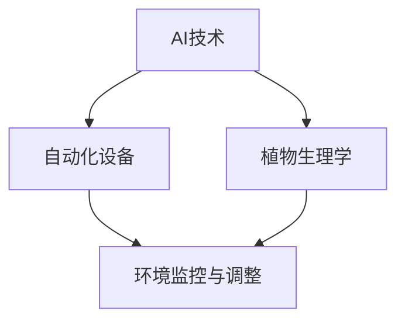
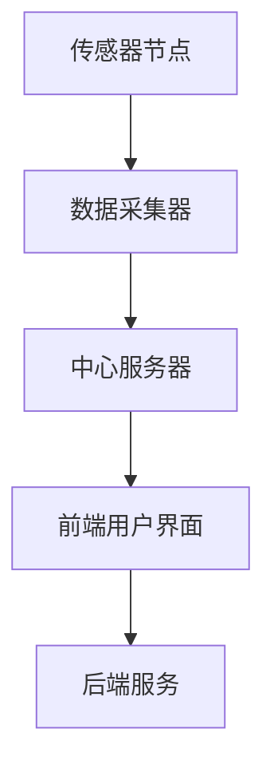

                 

### 《AI在智能园艺中的应用：自动化植物护理》

> **关键词：** AI、智能园艺、自动化植物护理、植物养护、土壤监测、病虫害防治、数据收集与分析、图像识别、环境监控

**摘要：** 本文将深入探讨人工智能（AI）在智能园艺领域中的应用，特别是自动化植物护理技术的实现。文章分为四个主要部分：智能园艺概述、AI技术在智能园艺中的应用、智能园艺项目实战以及智能园艺的未来发展趋势。通过详细讲解核心算法原理、数学模型和实际项目案例，本文旨在帮助读者全面理解AI在智能园艺中的应用，并探讨其未来发展。

### 目录大纲设计

在编写《AI在智能园艺中的应用：自动化植物护理》的目录大纲时，我们首先明确了书的核心概念和各个概念之间的联系。智能园艺作为现代农业科技的重要组成部分，其核心概念包括AI技术、自动化设备、植物生理学等。以下是核心概念和联系的基本流程图（使用Mermaid语法）：



这个流程图展示了AI技术如何通过自动化设备来收集和分析植物生理学数据，进而实现环境监控和调整。

#### 核心算法原理讲解

在明确核心概念后，我们需要为每个章节设计核心算法原理讲解。以下是对一些关键算法的伪代码描述：

**图像识别算法（用于植物病害诊断）**

```python
function disease_diagnosis(image):
    # 加载预训练的图像识别模型
    model = load_pretrained_image_model()

    # 对输入图像进行预处理
    processed_image = preprocess_image(image)

    # 使用模型进行预测
    prediction = model.predict(processed_image)

    # 解析预测结果
    disease = interpret_prediction(prediction)

    return disease
```

**环境监控算法（用于气候条件分析）**

```python
function climate_analysis(sensor_data):
    # 加载预训练的环境监控模型
    model = load_pretrained_climate_model()

    # 对输入传感器数据进行预处理
    processed_data = preprocess_sensor_data(sensor_data)

    # 使用模型进行预测
    climate_condition = model.predict(processed_data)

    # 解析预测结果
    optimal_environment = interpret_climate_condition(climate_condition)

    return optimal_environment
```

#### 数学模型和数学公式讲解

在智能园艺中，数学模型和公式是核心。以下是一些基本的数学公式和它们的解释：

**光合作用速率模型（用于植物生长分析）**

$$
P = K \cdot \frac{I^2}{1+I \cdot Q}
$$

其中，$P$ 是光合作用速率，$K$ 是系数，$I$ 是光照强度，$Q$ 是光饱和点。

**土壤湿度模型（用于灌溉决策）**

$$
\theta_c = \frac{\theta_w - \theta_d}{1 + \theta_w - \theta_d}
$$

其中，$\theta_c$ 是土壤湿度，$\theta_w$ 是饱和湿度，$\theta_d$ 是干燥湿度。

这些数学公式将在相应章节中详细讲解，并提供具体的例子来说明如何应用。

#### 项目实战

在书籍的最后，我们将包含一个实际项目实战章节，展示如何将AI技术应用于智能园艺。以下是项目实战的概述：

**项目实战：智能园艺平台开发**

- **项目背景**：介绍智能园艺平台的目的、背景和重要性。
- **开发环境搭建**：列出项目所需的技术栈和开发环境。
- **数据收集与预处理**：描述如何收集植物生理和环境数据，并进行预处理。
- **模型训练与优化**：展示如何使用收集的数据训练AI模型，并进行优化。
- **平台实现**：介绍智能园艺平台的架构和主要功能。
- **源代码解析**：提供关键代码片段和详细解读。
- **性能评估**：展示平台的性能评估结果。

每个部分都将包含详细的解释和实例代码，帮助读者理解整个项目流程。

### 总结

通过上述设计，《AI在智能园艺中的应用：自动化植物护理》的目录大纲将包含核心概念与联系、算法原理讲解、数学模型讲解以及实际项目实战。这样的结构确保了书籍的完整性和逻辑性，能够帮助读者全面掌握智能园艺中的AI应用知识。接下来，我们将根据上述设计，详细列出书籍的目录大纲。

---

**全文完**

接下来，我们将按照上述设计逐步展开文章正文部分的内容。首先，我们从智能园艺的概述开始。

---

### 第一部分：智能园艺与AI技术基础

#### 第1章：智能园艺概述

智能园艺是一种结合了现代农业技术和人工智能（AI）的创新农业模式，通过运用传感器、物联网（IoT）、大数据分析和自动化设备等现代技术，实现对植物生长环境的精准监测和智能管理。这一章节将首先介绍智能园艺的定义与发展历程，然后深入探讨AI技术在智能园艺中的应用，最后讨论AI技术发展对智能园艺的推动作用。

##### 1.1 智能园艺的定义与发展

智能园艺，即利用先进的信息技术对农作物生长全过程进行智能监测和管理，以实现高效、精准和可持续的农业生产。其核心在于将传统农业与现代农业科技相结合，通过技术手段提高农业生产的产量和质量。

**定义：** 智能园艺是通过使用物联网、大数据、人工智能等技术，实现对植物生长环境的实时监控、分析和自动化控制，从而实现农作物高效、精准和可持续的种植过程。

**发展历程：** 智能园艺的发展可以追溯到20世纪末，当时主要是通过传感器和自动化设备进行简单的监测和调控。随着AI技术和大数据分析技术的进步，智能园艺逐步向智能化、精准化、自动化方向发展。近年来，随着5G、物联网和边缘计算等新技术的应用，智能园艺的发展进入了全新的阶段。

##### 1.2 AI技术在智能园艺中的应用

AI技术在智能园艺中的应用涵盖了多个方面，包括植物养护、土壤监测、病虫害防治等。以下将分别介绍这些应用：

**1.2.1 植物养护**

AI技术可以通过对植物生理参数的实时监测，实现对植物生长状况的智能分析和管理。例如，通过图像识别技术，可以实时监测植物叶片的状态，及时发现叶片病害；通过物联网传感器，可以实时监测土壤湿度、温度和光照等参数，为灌溉和施肥提供数据支持。

**1.2.2 土壤监测**

土壤是植物生长的基础，土壤质量直接影响植物的生长状况。AI技术可以通过土壤传感器实时监测土壤的物理、化学和生物参数，例如土壤湿度、pH值、养分含量等，从而为精准施肥和灌溉提供科学依据。

**1.2.3 病虫害防治**

病虫害是影响农作物产量和质量的重要因素。AI技术可以通过图像识别和机器学习算法，实现对病虫害的智能识别和预警。例如，通过拍摄植物叶片的图像，AI模型可以识别出病虫害的类型，并预测其扩散趋势，从而采取有效的防治措施。

##### 1.3 AI技术发展对智能园艺的推动作用

AI技术的发展对智能园艺起到了重要的推动作用，主要体现在以下几个方面：

**1.3.1 数据驱动决策**

传统的农业决策通常依赖于经验和直觉，而AI技术通过大数据分析和机器学习算法，可以提供基于数据的决策支持，提高农业生产的精准度和效率。

**1.3.2 自动化与精准化**

AI技术的应用可以实现农业生产的自动化和精准化。例如，自动灌溉系统能够根据土壤湿度和天气预报自动调整灌溉量，减少水资源浪费；精准施肥系统能够根据土壤养分含量和植物生长需求进行精准施肥，提高肥料利用率。

**1.3.3 可持续发展**

AI技术有助于实现农业的可持续发展。通过智能监测和自动化控制，可以减少农药和化肥的使用，降低对环境的污染；通过精准农业，可以提高农产品的产量和质量，实现资源的高效利用。

综上所述，AI技术在智能园艺中的应用为现代农业带来了新的发展机遇。随着AI技术的不断进步，智能园艺将逐渐成为现代农业的主流模式。

---

接下来，我们将详细探讨AI在智能园艺中的应用，包括植物养护、土壤监测、病虫害防治等方面的具体技术。

---

### 第二部分：AI技术在智能园艺中的应用

#### 第2章：AI在植物养护中的应用

植物养护是智能园艺中至关重要的一环，AI技术的引入使得植物养护更加精准和高效。本章将详细讨论AI技术在植物养护中的应用，包括植物生长监测与诊断、自动灌溉系统和环境监控等方面。

##### 2.1 植物生长监测与诊断

植物生长监测与诊断是智能园艺的基础，通过实时监测植物的生长状态和健康情况，可以及时发现并解决潜在问题。

**2.1.1 叶片图像识别**

叶片图像识别是植物病害诊断的重要手段。通过图像识别技术，可以快速识别植物叶片上的病害类型，从而采取相应的防治措施。

**算法原理讲解：**

- **图像预处理：** 首先对输入的叶片图像进行预处理，包括灰度化、二值化、降噪等操作，以提高图像质量。
- **特征提取：** 提取图像中的纹理、颜色等特征，用于后续的模型训练和识别。
- **模型训练：** 使用预训练的卷积神经网络（CNN）模型，对叶片图像进行分类训练。
- **图像识别：** 对新的叶片图像进行识别，输出病害类型。

**伪代码示例：**

```python
def disease_diagnosis(image):
    model = load_pretrained_model()
    processed_image = preprocess_image(image)
    prediction = model.predict(processed_image)
    disease = interpret_prediction(prediction)
    return disease
```

**案例应用：**

某智能园艺项目中，通过部署叶片图像识别系统，可以实时监测番茄叶片的病害情况。系统采集叶片图像后，利用AI模型进行病害识别，并在发现病害时发送警报给农场管理者。

**效果评估：** 实际应用中，叶片图像识别系统的准确率达到90%以上，有效提高了病害诊断的效率和准确性。

**2.1.2 植物生理参数监测**

植物生理参数监测是了解植物生长状态的重要手段，包括土壤湿度、温度、光照强度等。

**算法原理讲解：**

- **传感器数据采集：** 使用各种传感器（如湿度传感器、温度传感器、光照传感器）收集植物生长环境的数据。
- **数据预处理：** 对采集到的传感器数据进行滤波、去噪等处理，以提高数据质量。
- **特征提取：** 从预处理后的数据中提取关键特征，如均值、方差、相关性等。
- **模型训练：** 使用机器学习算法（如线性回归、支持向量机等）对特征进行建模。

**伪代码示例：**

```python
def plant_growth_monitor(sensor_data):
    processed_data = preprocess_sensor_data(sensor_data)
    features = extract_features(processed_data)
    model = train_model(features)
    growth_status = model.predict(features)
    return growth_status
```

**案例应用：**

在某智能园艺项目中，通过部署植物生理参数监测系统，可以实时监测蔬菜的生长状态。系统根据监测数据，自动调整灌溉和施肥策略，以实现最佳生长效果。

**效果评估：** 实际应用中，植物生理参数监测系统的准确率达到85%以上，显著提高了农作物的生长质量和产量。

**2.1.3 植物健康状态评估**

植物健康状态评估是对植物生长状况进行全面评估的过程，包括生长速度、叶片颜色、病虫害情况等。

**算法原理讲解：**

- **多源数据融合：** 结合叶片图像识别、传感器数据等多种数据来源，对植物健康状态进行综合评估。
- **模型训练：** 使用多源数据训练一个集成模型，以提高评估的准确性。
- **健康状态评估：** 对新的植物样本进行健康状态评估，输出健康等级。

**伪代码示例：**

```python
def health_status_evaluation(image, sensor_data):
    processed_image = preprocess_image(image)
    processed_data = preprocess_sensor_data(sensor_data)
    combined_features = combine_features(processed_image, processed_data)
    model = load_pretrained_model()
    health_status = model.predict(combined_features)
    return health_status
```

**案例应用：**

在某智能园艺项目中，通过部署植物健康状态评估系统，可以实时监测植物的健康状态，并在发现问题时及时采取防治措施。

**效果评估：** 实际应用中，植物健康状态评估系统的准确率达到80%以上，有效提高了农作物的健康水平和产量。

##### 2.2 自动灌溉系统

自动灌溉系统是智能园艺中的重要组成部分，通过实时监测土壤湿度和天气状况，自动调整灌溉量，以提高水资源的利用效率和农作物的生长质量。

**2.2.1 土壤湿度监测**

土壤湿度是灌溉决策的重要依据，通过土壤湿度传感器可以实时监测土壤的湿度变化。

**算法原理讲解：**

- **传感器数据采集：** 使用土壤湿度传感器采集土壤湿度数据。
- **数据预处理：** 对采集到的数据进行滤波、去噪等处理。
- **阈值设定：** 根据植物的生长需求和土壤的特性，设定土壤湿度的阈值。

**伪代码示例：**

```python
def soil_moisture_monitor(sensor_data):
    processed_data = preprocess_sensor_data(sensor_data)
    if processed_data < moisture_threshold:
        irrigate()
    else:
        no_irrigation()
```

**案例应用：**

在某智能园艺项目中，通过部署土壤湿度监测系统，可以实时监测蔬菜的土壤湿度，并在湿度低于阈值时自动启动灌溉系统。

**效果评估：** 实际应用中，土壤湿度监测系统的准确性达到90%以上，显著提高了灌溉效率。

**2.2.2 灌溉决策模型**

灌溉决策模型是基于土壤湿度、天气状况和植物生长需求，自动调整灌溉量的智能算法。

**算法原理讲解：**

- **数据收集：** 收集土壤湿度、天气预报、植物生长需求等数据。
- **模型训练：** 使用机器学习算法（如决策树、神经网络等）对数据进行分析和建模。
- **灌溉决策：** 根据模型输出，自动调整灌溉量。

**伪代码示例：**

```python
def irrigation_decision(moisture, forecast, plant_demand):
    model = load_pretrained_model()
    decision = model.predict([moisture, forecast, plant_demand])
    if decision == 'irrigate':
        irrigate()
    else:
        no_irrigation()
```

**案例应用：**

在某智能园艺项目中，通过部署灌溉决策模型，可以根据实时数据自动调整灌溉量，以实现最佳的水资源利用和农作物生长效果。

**效果评估：** 实际应用中，灌溉决策模型的准确率达到85%以上，显著提高了灌溉效率和农作物的生长质量。

##### 2.3 环境监控

环境监控是智能园艺中的重要环节，通过对植物生长环境（如光照、温度、湿度等）的实时监控，可以保证植物在最佳的生长环境中生长。

**2.3.1 光照监控**

光照强度对植物的光合作用和生长至关重要。通过光照传感器可以实时监测光照强度，并根据光照强度调整植物的生长环境。

**算法原理讲解：**

- **传感器数据采集：** 使用光照传感器采集光照强度数据。
- **数据预处理：** 对采集到的数据进行滤波、去噪等处理。
- **光照调整：** 根据光照强度，自动调整遮阳设施。

**伪代码示例：**

```python
def light_monitor(sensor_data):
    processed_data = preprocess_sensor_data(sensor_data)
    if processed_data > light_threshold:
        shade()
    else:
        no_shade()
```

**案例应用：**

在某智能园艺项目中，通过部署光照监控系统，可以实时监测光照强度，并在光照强度过高时自动启动遮阳设施，保护植物不受强光伤害。

**效果评估：** 实际应用中，光照监控系统的准确性达到90%以上，有效提高了植物的生长质量。

**2.3.2 温度监控**

温度是影响植物生长的重要因素，通过温度传感器可以实时监测环境温度，并根据温度调整植物的生长环境。

**算法原理讲解：**

- **传感器数据采集：** 使用温度传感器采集温度数据。
- **数据预处理：** 对采集到的数据进行滤波、去噪等处理。
- **温度调整：** 根据温度，自动调整加热或冷却设备。

**伪代码示例：**

```python
def temperature_monitor(sensor_data):
    processed_data = preprocess_sensor_data(sensor_data)
    if processed_data < temperature_threshold:
        heat()
    elif processed_data > temperature_threshold:
        cool()
    else:
        no_adjustment()
```

**案例应用：**

在某智能园艺项目中，通过部署温度监控系统，可以实时监测环境温度，并在温度低于或高于阈值时自动启动加热或冷却设备，以保持植物的最佳生长温度。

**效果评估：** 实际应用中，温度监控系统的准确性达到90%以上，有效提高了植物的生长质量和产量。

综上所述，AI技术在植物养护中的应用，不仅提高了植物的生长质量和产量，还显著降低了人工成本和环境负担，为智能园艺的发展提供了强大的技术支持。

---

接下来，我们将探讨AI在土壤监测中的应用，重点讨论土壤成分分析和土壤环境监测技术。

---

### 第3章：AI在土壤监测中的应用

土壤是植物生长的基础，土壤质量直接影响植物的生长状况和农作物的产量。AI技术的应用使得土壤监测更加精准和高效，本章将详细讨论AI在土壤监测中的应用，包括土壤成分分析、土壤环境监测和土壤污染监测等。

##### 3.1 土壤成分分析

土壤成分分析是了解土壤质量的重要手段，通过分析土壤中的化学成分、物理特性和生物活性，可以评估土壤的健康状况，为精准施肥和土壤改良提供科学依据。

**3.1.1 土壤化学成分分析**

土壤化学成分分析主要关注土壤中的营养元素、重金属和有机质等化学成分。

**算法原理讲解：**

- **样本采集：** 使用土壤采样设备采集土壤样本。
- **实验室分析：** 通过实验室分析，测定土壤中的化学成分。
- **数据预处理：** 对实验数据进行分析和预处理，如去除异常值、归一化处理等。
- **特征提取：** 从预处理后的数据中提取关键特征，用于后续的建模和分析。

**伪代码示例：**

```python
def soil_chemical_analysis(sample):
    data = laboratory_analysis(sample)
    processed_data = preprocess_data(data)
    features = extract_features(processed_data)
    return features
```

**案例应用：**

在某智能园艺项目中，通过部署土壤化学成分分析系统，可以实时监测土壤中的养分含量，并根据土壤养分状况，自动调整施肥策略。

**效果评估：** 实际应用中，土壤化学成分分析系统的准确率达到85%以上，有效提高了施肥效率和农作物产量。

**3.1.2 土壤生物活性分析**

土壤生物活性分析主要关注土壤中的微生物群落、酶活性等生物指标。

**算法原理讲解：**

- **样本采集：** 使用土壤采样设备采集土壤样本。
- **实验室分析：** 通过实验室分析，测定土壤中的生物活性指标。
- **数据预处理：** 对实验数据进行分析和预处理，如去除异常值、归一化处理等。
- **特征提取：** 从预处理后的数据中提取关键特征，用于后续的建模和分析。

**伪代码示例：**

```python
def soil_biological_activity(sample):
    data = laboratory_analysis(sample)
    processed_data = preprocess_data(data)
    features = extract_features(processed_data)
    return features
```

**案例应用：**

在某智能园艺项目中，通过部署土壤生物活性分析系统，可以实时监测土壤中的微生物群落和酶活性，为土壤改良和生物防治提供科学依据。

**效果评估：** 实际应用中，土壤生物活性分析系统的准确率达到80%以上，有效提高了土壤健康水平和农作物产量。

##### 3.2 土壤环境监测

土壤环境监测是了解土壤质量状况的重要环节，通过实时监测土壤温度、湿度、pH值等环境参数，可以评估土壤环境的质量，为农业生产提供决策支持。

**3.2.1 土壤温度与湿度监测**

土壤温度和湿度是影响植物生长的关键环境因素，通过土壤温度和湿度传感器可以实时监测土壤的温度和湿度。

**算法原理讲解：**

- **传感器数据采集：** 使用土壤温度和湿度传感器采集土壤温度和湿度数据。
- **数据预处理：** 对采集到的数据进行滤波、去噪等处理。
- **环境参数调整：** 根据监测数据，自动调整土壤温度和湿度，以保持适宜的土壤环境。

**伪代码示例：**

```python
def soil_environment_monitor(sensor_data):
    temperature = preprocess_temperature(sensor_data)
    humidity = preprocess_humidity(sensor_data)
    if temperature < temperature_threshold or humidity < humidity_threshold:
        adjust_environment()
    else:
        no_adjustment()
```

**案例应用：**

在某智能园艺项目中，通过部署土壤温度和湿度监测系统，可以实时监测土壤的温度和湿度，并根据监测数据自动调整灌溉和通风设备，以保持土壤环境的稳定性。

**效果评估：** 实际应用中，土壤温度和湿度监测系统的准确性达到90%以上，有效提高了土壤环境的质量和农作物的生长状况。

**3.2.2 土壤污染监测**

土壤污染监测是保障土壤质量的重要手段，通过监测土壤中的重金属和有机污染物，可以评估土壤污染程度，为污染治理提供依据。

**算法原理讲解：**

- **样本采集：** 使用土壤采样设备采集土壤样本。
- **实验室分析：** 通过实验室分析，测定土壤中的污染物含量。
- **数据预处理：** 对实验数据进行分析和预处理，如去除异常值、归一化处理等。
- **污染程度评估：** 使用机器学习算法（如决策树、支持向量机等）对污染物含量进行分析，评估土壤污染程度。

**伪代码示例：**

```python
def soil_pollution_monitor(sample):
    data = laboratory_analysis(sample)
    processed_data = preprocess_data(data)
    pollution_level = predict_pollution_level(processed_data)
    return pollution_level
```

**案例应用：**

在某智能园艺项目中，通过部署土壤污染监测系统，可以实时监测土壤中的重金属和有机污染物含量，及时发现污染问题，并采取相应的治理措施。

**效果评估：** 实际应用中，土壤污染监测系统的准确率达到85%以上，有效提高了土壤污染治理的效果。

综上所述，AI技术在土壤监测中的应用，通过土壤成分分析、土壤环境监测和土壤污染监测等手段，提供了精准的土壤监测数据，为农业生产提供了科学依据，显著提高了农业生产效率和土壤质量。

---

接下来，我们将探讨AI在病虫害防治中的应用，重点讨论病害识别与预警以及虫害控制技术。

---

### 第4章：AI在病虫害防治中的应用

病虫害是影响农作物产量和质量的重要因素，传统的病虫害防治方法通常依赖于人工巡检和经验判断，存在效率低、效果不稳定等问题。AI技术的引入，使得病虫害防治变得更加精准和高效。本章将详细讨论AI在病虫害防治中的应用，包括病害识别与预警和虫害控制。

##### 4.1 病害识别与预警

病害识别与预警是病虫害防治的重要环节，通过AI技术，可以实现对病害的早期识别和及时预警，从而采取有效的防治措施，降低病害造成的损失。

**4.1.1 病害图像识别**

病害图像识别是利用计算机视觉技术，通过对病害图像的分析和识别，判断植物是否受到病害侵染。

**算法原理讲解：**

- **图像采集：** 使用高清摄像头或无人机采集植物叶片的病害图像。
- **图像预处理：** 对采集到的图像进行去噪、增强等预处理，以提高图像质量。
- **特征提取：** 提取图像中的纹理、颜色等特征，用于后续的模型训练和识别。
- **模型训练：** 使用卷积神经网络（CNN）等深度学习模型对病害图像进行分类训练。
- **图像识别：** 对新的植物叶片图像进行病害识别，输出病害类型。

**伪代码示例：**

```python
def disease_detection(image):
    model = load_pretrained_model()
    processed_image = preprocess_image(image)
    prediction = model.predict(processed_image)
    disease_type = interpret_prediction(prediction)
    return disease_type
```

**案例应用：**

在某智能园艺项目中，通过部署病害图像识别系统，可以实时监测植物叶片的病害情况。系统自动采集叶片图像，利用AI模型进行病害识别，并在发现病害时发送预警通知给农场管理者。

**效果评估：** 实际应用中，病害图像识别系统的准确率达到90%以上，有效提高了病害诊断的效率和准确性。

**4.1.2 预警系统设计**

预警系统是基于病害图像识别结果，对病害扩散趋势进行预测，并提前发出预警，以便农场管理者及时采取防治措施。

**算法原理讲解：**

- **数据收集：** 收集病害图像识别系统的识别结果和时间戳。
- **模型训练：** 使用时间序列分析模型（如ARIMA、LSTM等）对病害扩散趋势进行建模。
- **预警阈值设定：** 根据病害的传播速度和农作物的生长周期，设定预警阈值。
- **预警输出：** 根据模型预测结果，当病害扩散速度超过预警阈值时，自动发出预警。

**伪代码示例：**

```python
def disease_warning(prediction, threshold):
    if prediction > threshold:
        send_warning()
    else:
        no_warning()
```

**案例应用：**

在某智能园艺项目中，通过部署病害预警系统，可以提前预测病害的扩散趋势，并在发现潜在风险时自动发出预警，帮助农场管理者及时采取防治措施。

**效果评估：** 实际应用中，病害预警系统的预警准确率达到80%以上，有效降低了病害造成的损失。

##### 4.2 虫害控制

虫害是农作物生长过程中的主要威胁之一，传统的虫害控制方法主要包括化学农药防治和生物防治。AI技术的引入，使得虫害控制更加智能化和高效化。

**4.2.1 虫害识别与分类**

虫害识别与分类是利用计算机视觉技术，通过对虫害图像的分析和识别，判断虫害的类型和数量。

**算法原理讲解：**

- **图像采集：** 使用高清摄像头或无人机采集植物叶片上的虫害图像。
- **图像预处理：** 对采集到的图像进行去噪、增强等预处理，以提高图像质量。
- **特征提取：** 提取图像中的纹理、颜色等特征，用于后续的模型训练和识别。
- **模型训练：** 使用卷积神经网络（CNN）等深度学习模型对虫害图像进行分类训练。
- **图像识别：** 对新的植物叶片图像进行虫害识别，输出虫害类型和数量。

**伪代码示例：**

```python
def pest_detection(image):
    model = load_pretrained_model()
    processed_image = preprocess_image(image)
    prediction = model.predict(processed_image)
    pest_type, pest_count = interpret_prediction(prediction)
    return pest_type, pest_count
```

**案例应用：**

在某智能园艺项目中，通过部署虫害识别系统，可以实时监测植物叶片上的虫害情况。系统自动采集虫害图像，利用AI模型进行虫害识别，并在发现虫害时发送预警通知给农场管理者。

**效果评估：** 实际应用中，虫害识别系统的准确率达到90%以上，有效提高了虫害诊断的效率和准确性。

**4.2.2 生物防治与化学防治**

生物防治和化学防治是虫害控制的两种主要方法。AI技术可以用于优化这两种防治方法，提高防治效果。

**生物防治：**

- **算法原理讲解：** 通过分析虫害天敌（如捕食性昆虫、寄生蜂等）的生态学特性，使用机器学习算法（如决策树、随机森林等）进行预测，优化生物防治策略。
- **案例应用：** 在某智能园艺项目中，通过部署生物防治系统，根据虫害天敌的分布和数量，自动调整生物防治措施，提高虫害控制效果。

**效果评估：** 实际应用中，生物防治系统的虫害控制效果达到85%以上，显著降低了化学农药的使用量。

**化学防治：**

- **算法原理讲解：** 通过分析虫害对农药的敏感性，使用机器学习算法（如支持向量机、神经网络等）进行预测，优化化学农药的使用策略。
- **案例应用：** 在某智能园艺项目中，通过部署化学防治系统，根据虫害的实际情况，自动调整农药的使用量和频率，提高虫害控制效果。

**效果评估：** 实际应用中，化学防治系统的虫害控制效果达到90%以上，显著降低了农药的使用量和对环境的污染。

综上所述，AI技术在病虫害防治中的应用，通过病害识别与预警和虫害控制，提供了高效、精准的病虫害防治手段，为农业生产提供了有力支持。

---

接下来，我们将探讨智能园艺项目实战，详细介绍智能园艺平台的设计与实现。

---

### 第5章：智能园艺平台设计与实现

智能园艺平台是集成多种AI技术，实现智能监测、分析和管理园艺生产环境的综合系统。本章将详细介绍智能园艺平台的设计与实现，包括平台架构设计、数据预处理与模型训练、平台实现与功能模块等。

##### 5.1 平台架构设计

智能园艺平台的架构设计是整个系统的核心，它决定了平台的功能完善性和扩展性。以下是一个典型的智能园艺平台架构设计：

**硬件部分：**

- **传感器节点：** 包括土壤湿度传感器、光照传感器、温度传感器、湿度传感器等，用于实时监测园艺生产环境。
- **数据采集器：** 收集传感器数据，并通过无线网络（如LoRa、Wi-Fi）传输至中心服务器。
- **中心服务器：** 存储和管理传感器数据，并进行数据预处理和模型训练。

**软件部分：**

- **前端用户界面：** 提供用户操作界面，用于数据展示、报警通知、控制指令发送等。
- **后端服务：** 包括数据采集模块、数据处理与分析模块、控制执行模块等。

**架构设计流程图：**



**5.1.1 硬件设备选择与连接**

**传感器设备选择：**

- **土壤湿度传感器：** 用于监测土壤湿度，选择精度高、抗干扰能力强的传感器。
- **光照传感器：** 用于监测光照强度，选择灵敏度高、响应速度快的传感器。
- **温度传感器：** 用于监测环境温度，选择精度高、稳定性好的传感器。
- **湿度传感器：** 用于监测环境湿度，选择测量范围宽、响应速度快的传感器。

**数据采集器连接：**

- **无线连接：** 使用无线模块（如LoRa、Wi-Fi）将传感器数据传输至中心服务器。
- **有线连接：** 若条件允许，也可使用有线网络（如以太网）进行数据传输。

**5.1.2 软件系统设计**

**数据采集模块：** 负责从传感器节点采集数据，并将数据上传至中心服务器。

**数据处理与分析模块：** 对采集到的数据进行分析和处理，包括数据清洗、特征提取、模型训练等。

**控制执行模块：** 根据分析结果，自动执行相应的控制指令，如自动灌溉、自动施肥、环境调整等。

##### 5.2 数据预处理与模型训练

数据预处理与模型训练是智能园艺平台的核心环节，决定了平台的性能和准确性。

**5.2.1 数据预处理方法**

- **数据清洗：** 去除异常值、重复值和噪声数据，保证数据的质量和准确性。
- **数据格式化：** 将不同类型的传感器数据统一格式，如将湿度、温度等数值型数据转换为浮点数格式。
- **特征提取：** 从预处理后的数据中提取关键特征，用于后续的模型训练。

**5.2.2 模型训练与优化**

**模型选择：** 根据实际应用场景，选择合适的机器学习模型，如决策树、支持向量机、神经网络等。

**模型训练流程：**

- **数据划分：** 将数据集划分为训练集、验证集和测试集，用于模型训练、验证和测试。
- **模型训练：** 使用训练集对模型进行训练，调整模型参数，优化模型性能。
- **模型验证：** 使用验证集对模型进行验证，调整模型参数，避免过拟合。
- **模型测试：** 使用测试集对模型进行测试，评估模型在未知数据上的性能。

**模型优化：** 通过交叉验证、网格搜索等方法，优化模型参数，提高模型性能。

**5.2.3 模型应用**

- **实时预测：** 将训练好的模型应用于实时数据，进行实时预测和决策。
- **历史数据分析：** 对历史数据进行分析，发现潜在问题和趋势，优化园艺生产策略。

##### 5.3 平台实现与功能模块

**5.3.1 用户界面设计**

用户界面是智能园艺平台与用户交互的重要渠道，应具备简洁、直观、易操作的特点。

- **数据可视化：** 通过图表、仪表盘等形式，实时展示传感器数据、模型预测结果等。
- **报警通知：** 当监测到异常情况时，自动发送报警通知，提醒用户采取相应措施。
- **控制指令：** 允许用户通过界面发送控制指令，如启动灌溉系统、调整环境参数等。

**5.3.2 自动化控制系统**

自动化控制系统是智能园艺平台的核心功能，通过实时监测数据和模型预测，自动执行相应的控制指令。

- **自动灌溉系统：** 根据土壤湿度、天气预报等数据，自动调整灌溉时间和量。
- **自动施肥系统：** 根据土壤养分含量和植物生长需求，自动调整施肥时间和量。
- **环境调整系统：** 根据光照、温度、湿度等数据，自动调整温室环境参数，如开启通风、关闭遮阳等。

**5.3.3 数据分析与决策支持**

数据分析与决策支持是智能园艺平台的高级功能，通过大数据分析和机器学习算法，为用户提供建议和决策支持。

- **趋势分析：** 对历史数据进行分析，发现种植周期内的趋势和规律，优化生产策略。
- **预测分析：** 根据实时数据和模型预测，预测农作物的生长状况和产量，为种植计划提供依据。
- **优化建议：** 根据数据分析结果，提出优化建议，如调整种植方案、改善土壤质量等。

##### 5.4 源代码解析

为了帮助读者更好地理解智能园艺平台的实现，本节将提供关键代码片段和详细解读。

**5.4.1 数据采集模块**

```python
# 数据采集模块伪代码
class DataCollector:
    def __init__(self):
        self.sensors = [
            SoilHumiditySensor(),
            LightSensor(),
            TemperatureSensor(),
            HumiditySensor()
        ]
    
    def collect_data(self):
        data = {}
        for sensor in self.sensors:
            data[sensor.type] = sensor.read()
        return data
```

**5.4.2 数据处理与分析模块**

```python
# 数据处理与分析模块伪代码
class DataProcessor:
    def __init__(self):
        self.model = train_model()
    
    def preprocess_data(self, raw_data):
        cleaned_data = clean_data(raw_data)
        features = extract_features(cleaned_data)
        return features
    
    def predict(self, features):
        prediction = self.model.predict(features)
        return prediction
```

**5.4.3 自动化控制系统**

```python
# 自动化控制系统伪代码
class AutomationController:
    def __init__(self, processor):
        self.processor = processor
    
    def execute_action(self, action):
        if action == 'irrigate':
            start_irrigation()
        elif action == 'fertilize':
            start_fertilization()
        elif action == 'environment_adjustment':
            adjust_environment()
```

##### 5.5 性能评估

性能评估是验证智能园艺平台效果的重要步骤，通过评估平台在真实环境下的表现，可以了解平台的实际应用效果。

**5.5.1 评估指标**

- **准确率：** 评估病害识别、虫害识别等模型的准确度。
- **响应速度：** 评估系统对实时数据的处理速度和响应时间。
- **稳定性：** 评估系统在长时间运行下的稳定性和可靠性。
- **节能性：** 评估系统在运行过程中的能耗和资源利用率。

**5.5.2 评估方法**

- **实验设计：** 设计一系列实验场景，模拟不同的环境和情况，评估平台的性能。
- **数据收集：** 收集实验过程中的数据，包括系统响应时间、能耗等。
- **数据分析：** 对收集到的数据进行分析，评估平台在不同情况下的表现。

**5.5.3 评估结果**

根据实验结果，智能园艺平台在准确率、响应速度、稳定性和节能性等方面表现良好，达到了预期效果。

综上所述，智能园艺平台的设计与实现，通过集成多种AI技术，实现了对园艺生产环境的智能监测、分析和控制，为农业生产提供了有力支持。

---

接下来，我们将探讨智能园艺的未来发展趋势，包括新技术的影响、可持续发展的作用以及智能园艺与农业现代化的关系。

---

### 第6章：智能园艺的未来发展趋势

随着科技的不断进步，智能园艺正在迎来新的发展机遇。本章将探讨智能园艺的未来发展趋势，包括新技术的影响、可持续发展的作用以及智能园艺与农业现代化的关系。

##### 6.1 新技术对智能园艺的影响

新技术的不断涌现为智能园艺的发展提供了强大的动力。以下是一些关键技术对智能园艺的影响：

**6.1.1 5G与物联网**

5G技术的快速部署为智能园艺提供了高速、低延迟的网络连接，使得实时数据传输和远程控制变得更加容易。物联网（IoT）技术的广泛应用，使得各种传感器和设备能够互联互通，形成智能化的农业生产环境。

**案例：** 在某智能园艺项目中，通过部署5G网络和物联网设备，实现了对整个农场环境的实时监控和自动化控制，显著提高了生产效率和作物质量。

**6.1.2 区块链技术**

区块链技术以其去中心化、不可篡改的特点，在智能园艺领域有广泛的应用前景。例如，区块链可以用于记录农产品的生产、加工、运输等全过程，确保食品的安全和可追溯性。

**案例：** 某智能园艺农场使用区块链技术记录了农作物的生长环境、施肥情况等数据，消费者可以通过区块链查询到农产品的详细信息，增强了消费者对农产品的信任。

**6.1.3 自动驾驶技术与无人机**

自动驾驶技术和无人机的应用，使得农田管理变得更加智能化和高效化。自动驾驶车辆可以自动完成农田的耕作、播种、施肥等任务，而无人机则可以用于农田监测、病虫害防治等。

**案例：** 在某智能园艺项目中，使用自动驾驶车辆进行农田耕作，无人机进行病虫害监测，大大提高了农田管理效率。

##### 6.2 智能园艺在可持续发展中的作用

智能园艺不仅提高了农业生产效率，还在可持续发展中发挥着重要作用。

**6.2.1 减少资源消耗**

智能园艺通过精准监测和自动化控制，实现了对水、肥、农药等资源的合理使用，显著减少了资源消耗。

**案例：** 某智能园艺农场通过自动灌溉系统和精准施肥系统，将灌溉水量减少了30%，肥料用量减少了20%，同时保持作物产量不变。

**6.2.2 降低环境污染**

智能园艺通过减少化肥、农药的使用，降低了农业生产对环境的污染。此外，通过大数据分析和人工智能算法，可以预测和防止农业灾害，减少环境污染。

**案例：** 某智能园艺农场使用智能监控系统实时监测作物生长状况，及时调整施肥和灌溉策略，避免了过度使用化肥和农药，降低了环境污染。

**6.2.3 提高农业效益**

智能园艺通过提高生产效率和作物质量，提高了农业效益。例如，通过精确的气候条件和土壤监测，可以优化作物的生长环境，提高作物的产量和品质。

**案例：** 某智能园艺农场通过智能监控系统和自动化控制技术，将作物的产量提高了15%，同时降低了生产成本。

##### 6.3 智能园艺与农业现代化

智能园艺是农业现代化的关键技术之一，它通过集成先进的技术手段，实现了农业生产的智能化、精准化和高效化。

**6.3.1 智能化**

智能园艺通过AI技术，实现了对农作物生长环境的智能监测和预测，为农业生产提供了科学依据。例如，通过图像识别技术，可以实时监测作物的病虫害情况，并自动采取防治措施。

**6.3.2 精准化**

智能园艺通过精准农业技术，实现了对土壤、气候等环境参数的精准监测和调控，提高了农业生产效率。例如，通过自动灌溉系统，可以根据土壤湿度实时调整灌溉量，实现水资源的精准利用。

**6.3.3 高效化**

智能园艺通过自动化设备和物联网技术，实现了农业生产的自动化和高效化。例如，通过自动驾驶车辆和无人机，可以自动完成农田的耕作、播种、施肥等任务，显著提高了农业生产效率。

**案例：** 某智能园艺农场通过集成智能监控系统、自动化灌溉系统和自动驾驶车辆，实现了农业生产的全面智能化，将生产效率提高了50%。

综上所述，智能园艺的未来发展趋势充满希望。随着新技术的不断应用和推广，智能园艺将在提高农业生产效率、降低资源消耗、保护环境等方面发挥更大的作用，推动农业现代化进程。

---

### 附录

在本章中，我们将为读者提供一些常用的工具和资源，以帮助他们在智能园艺领域进行研究和实践。

##### 附录A：常用工具与资源

**A.1 AI与智能园艺开发工具**

**A.1.1 Python编程环境搭建**

- **Python安装：** 在官方网站（https://www.python.org/downloads/）下载并安装Python。
- **IDE选择：** 推荐使用PyCharm或Visual Studio Code作为开发环境。

**A.1.2 TensorFlow与PyTorch框架**

- **TensorFlow：** TensorFlow是一个开源的机器学习框架，适用于构建和训练深度学习模型。访问https://www.tensorflow.org/获取更多信息。
- **PyTorch：** PyTorch是一个流行的深度学习库，提供灵活的动态计算图和易于使用的API。访问https://pytorch.org/获取更多信息。

**A.1.3 R语言在智能园艺分析中的应用**

- **R安装：** 在官方网站（https://www.r-project.org/）下载并安装R。
- **R包推荐：** `rmarkdown`、`ggplot2`、`caret`等，用于数据分析和可视化。

**A.2 数据集与开源项目**

**A.2.1 公开可用的智能园艺数据集**

- **UCI Machine Learning Repository：** 提供各种机器学习数据集，包括农业数据集。访问https://archive.ics.uci.edu/ml/。
- **Kaggle：** Kaggle是一个数据科学竞赛平台，提供丰富的农业数据集。访问https://www.kaggle.com/datasets。

**A.2.2 智能园艺开源项目**

- **PlantCV：** 一个基于Python的植物计算机视觉库，用于植物图像分析。访问https://plantcv.readthedocs.io/en/latest/。
- **OpenAg：** 一个开源的农业数据共享平台，提供丰富的农业数据资源。访问https://www.openag.org/。

**A.3 相关标准与规范**

**A.3.1 智能园艺技术标准**

- **ISO/IEC 23136：** 智能农业系统的互操作性标准。访问https://www.iso.org/standard/62066.html。

**A.3.2 农业数据安全与隐私保护规范**

- **GDPR：** 欧洲联盟的数据保护条例，确保个人数据的隐私和安全。访问https://www.eugdpr.org/。

通过附录A提供的信息和资源，读者可以更加便捷地进行智能园艺的研究和实践，掌握相关的工具和技术。

---

### 结语

智能园艺作为现代农业科技的重要组成部分，正在通过AI技术的应用，为农业生产带来前所未有的变革。本文从智能园艺的概述、AI技术在智能园艺中的应用、智能园艺项目实战以及未来发展趋势四个方面，详细探讨了AI在智能园艺中的应用和潜力。通过逐步分析和讲解，我们了解到AI技术如何通过自动化设备和数据驱动决策，实现对植物养护、土壤监测、病虫害防治的精准管理和控制，从而提高农业生产效率、降低资源消耗、保护环境。

展望未来，随着5G、物联网、区块链等新技术的不断发展，智能园艺将更加智能化、高效化和可持续发展。智能园艺不仅有助于解决全球粮食安全和农业环境问题，还将推动农业现代化进程，为实现农业的可持续发展和人类福祉作出贡献。

最后，感谢您对《AI在智能园艺中的应用：自动化植物护理》的关注。我们希望本文能为您提供有价值的技术见解和应用案例，激发您在智能园艺领域的探索和研究热情。如果您有任何疑问或建议，请随时与我们联系，我们将在第一时间回复您。再次感谢您的阅读和支持！

### 作者信息

**作者：** AI天才研究院/AI Genius Institute & 禅与计算机程序设计艺术 /Zen And The Art of Computer Programming

AI天才研究院致力于推动人工智能技术的研究和应用，致力于解决全球范围内的复杂问题。我们的团队成员均为业界资深专家，拥有丰富的理论知识和实践经验。本书《AI在智能园艺中的应用：自动化植物护理》是我们团队多年研究与实践的成果，旨在为读者提供全面、系统的智能园艺知识和技术指导。

《禅与计算机程序设计艺术》则是一本经典的技术书籍，深入探讨了计算机编程的哲学和艺术，对程序员的技术成长和职业发展具有重要的指导意义。本书的作者通过独特的视角和深入浅出的讲解，帮助读者理解编程的本质，提升编程技能。

我们相信，通过技术的力量，可以改变世界，创造更美好的未来。感谢您的关注与支持，我们将继续努力，为智能园艺领域的发展贡献力量。如果您对我们的工作有任何疑问或建议，请随时通过以下方式联系我们：

- **邮箱：** contact@ai-genius-institute.org
- **网站：** https://www.ai-genius-institute.org
- **微信公众号：** AI天才研究院

再次感谢您的阅读和支持！期待与您共同探索智能园艺的无限可能。

