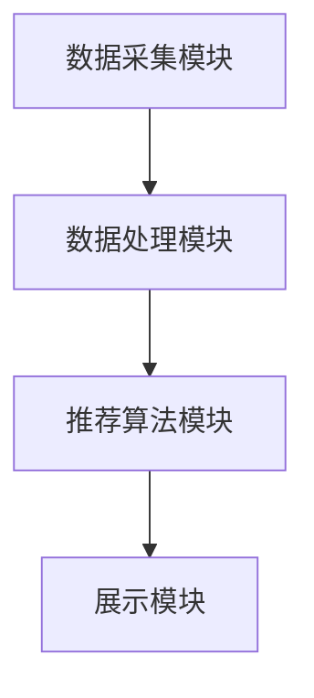

                 

### AI在电商促销中的实际应用

> **关键词：人工智能，电商促销，用户行为分析，个性化推荐，机器学习，自然语言处理**

**摘要：** 本文深入探讨了人工智能（AI）在电商促销中的应用，包括数据分析、机器学习算法和自然语言处理等关键技术。通过详细分析AI在用户行为分析、个性化推荐系统和促销活动设计与优化等实际场景中的具体应用，展示了AI如何提升电商促销的效果。本文还将探讨AI在电商促销中的未来发展趋势，为电商企业提供创新策略和优化方向。

随着互联网和电子商务的飞速发展，电商促销已成为企业吸引顾客、提升销售额的重要手段。然而，传统的促销方式往往缺乏针对性和效率，难以满足消费者的个性化需求。人工智能（AI）技术的引入，为电商促销带来了全新的机遇。通过数据分析、机器学习算法和自然语言处理等技术，AI能够深入理解用户行为，实现精准营销，提升促销活动的效果。本文将围绕AI在电商促销中的实际应用，进行深入探讨。

## 第一部分：AI在电商促销中的实际应用概述

### 1.1 AI与电商促销的关系

#### 1.1.1 AI在电商促销中的角色

人工智能在电商促销中扮演着多重角色。首先，AI能够通过数据分析挖掘用户行为模式，帮助企业更好地了解消费者需求，从而制定更有效的促销策略。其次，AI在个性化推荐系统中发挥了关键作用，通过分析用户的历史行为和偏好，为用户提供个性化的商品推荐，提升用户购买体验和满意度。此外，AI还能够优化促销活动的设计与执行，提高促销活动的效果和转化率。

#### 1.1.2 电商促销中的AI应用场景

在电商促销中，AI的应用场景非常广泛。例如，用户行为分析可以帮助企业了解用户在网站上的行为路径，从而优化网站设计和产品推荐；个性化推荐系统能够根据用户的历史行为和偏好，提供个性化的商品推荐，提高用户购买意愿；促销活动优化则通过数据分析，预测促销活动的效果，并进行策略调整，以最大化收益。

#### 1.1.3 AI在电商促销中的优势与挑战

AI在电商促销中的优势主要体现在以下几个方面：

1. **数据分析能力：** AI能够处理海量数据，通过数据分析挖掘出有价值的信息，帮助企业更好地了解市场和用户需求。
2. **个性化推荐：** AI能够根据用户的行为和偏好，实现精准的个性化推荐，提高用户满意度和购买转化率。
3. **优化促销策略：** AI能够通过数据分析和机器学习算法，预测促销活动的效果，并优化促销策略，提高促销活动的效益。

然而，AI在电商促销中也面临一些挑战：

1. **数据隐私：** 电商企业需要确保用户数据的安全和隐私，避免数据泄露。
2. **技术门槛：** AI技术的应用需要较高的技术门槛，企业需要具备相应的技术能力和团队。
3. **算法偏见：** AI算法可能会受到数据偏差的影响，导致推荐结果不公平。

### 1.2 电商促销基础知识

#### 1.2.1 电商促销的类型与策略

电商促销的类型主要包括以下几种：

1. **满减优惠：** 消费满一定金额即可减免一定金额，适用于大量购买的场景。
2. **折扣优惠：** 商品打折，适用于促销特定商品或新品。
3. **秒杀活动：** 在特定时间段内以超低价格销售特定商品，适用于吸引流量和提升品牌知名度。
4. **优惠券：** 用户领取优惠券，在购物时抵扣一定金额，适用于提高用户购买意愿。

电商促销策略主要包括以下几个方面：

1. **价格策略：** 通过调整商品价格，提高用户购买意愿，如满减、折扣等。
2. **时间策略：** 选择合适的时间段进行促销，如节假日、周末等。
3. **渠道策略：** 通过多种渠道推广促销活动，如社交媒体、短信、邮件等。
4. **互动策略：** 通过与用户的互动，提升用户参与度和忠诚度，如抽奖、互动游戏等。

#### 1.2.2 电商促销的目标与效果评估

电商促销的主要目标包括：

1. **提升销售额：** 通过促销活动，提高商品销量，实现销售额增长。
2. **增加用户粘性：** 通过促销活动，提高用户在平台的活跃度，增加用户粘性。
3. **提高品牌知名度：** 通过促销活动，提升品牌在市场中的知名度和影响力。

效果评估方法主要包括：

1. **销售数据：** 通过促销活动前后的销售数据进行对比，评估促销活动的效果。
2. **用户反馈：** 通过用户评论、评分和反馈，了解促销活动对用户满意度的影响。
3. **流量数据：** 通过访问量、转化率等流量数据，评估促销活动的吸引力和效果。

#### 1.2.3 电商促销的市场趋势与未来方向

随着人工智能技术的发展，电商促销市场呈现以下趋势：

1. **智能化：** 人工智能技术将使电商促销更加智能化，实现个性化推荐和精准营销。
2. **多样化：** 电商促销形式将更加多样化，如直播带货、社交电商等。
3. **数据驱动：** 电商促销将更加依赖于数据分析，通过数据驱动制定促销策略。
4. **个性化：** 电商促销将更加注重用户个性化需求，实现精准营销。

未来，电商促销将朝着更加智能化、数据化和个性化的方向发展，为电商企业带来更多机遇和挑战。

## 第二部分：AI在电商促销中的应用技术

### 2.1 数据分析技术

#### 2.1.1 数据收集与处理

##### 2.1.1.1 用户行为数据的收集

用户行为数据的收集是电商促销中AI应用的基础。通过收集用户在电商平台上的浏览、搜索、购买等行为数据，企业可以深入了解用户需求和行为模式。以下是一个简单的数据收集流程：

1. **数据采集：** 使用JavaScript等前端技术，在用户浏览网页时自动收集行为数据，如页面访问时间、点击行为等。
2. **数据存储：** 将收集到的数据存储在数据库中，如MySQL、MongoDB等。
3. **数据清洗：** 对原始数据进行清洗，去除无效、错误或重复的数据。

##### 2.1.1.2 数据清洗与预处理

数据清洗与预处理是数据分析的重要步骤，包括以下内容：

1. **数据去重：** 去除重复的数据，确保数据的唯一性。
2. **数据填充：** 对于缺失的数据，可以使用平均值、中位数或插值等方法进行填充。
3. **数据转换：** 将不同格式的数据转换为统一的格式，如将日期数据转换为YYYY-MM-DD格式。
4. **特征工程：** 从原始数据中提取有用的特征，为后续的分析和建模提供支持。

#### 2.1.2 数据分析工具与库

在数据分析中，常用的工具和库包括以下几种：

##### 2.1.2.1 Python数据分析工具

Python在数据分析领域有着广泛的应用，以下是一些常用的Python数据分析工具：

1. **NumPy：** 用于数值计算，提供了强大的数组操作功能。
2. **Pandas：** 用于数据处理，提供了数据清洗、转换和操作的功能。
3. **Matplotlib：** 用于数据可视化，可以生成各种类型的图表。

##### 2.1.2.2 R数据分析工具

R是一种专门用于统计分析的编程语言，以下是一些常用的R数据分析工具：

1. **dplyr：** 用于数据操作，提供了便捷的数据筛选、排序和转换功能。
2. **ggplot2：** 用于数据可视化，可以生成高质量的统计图表。
3. **caret：** 用于模型训练和评估，提供了多种机器学习算法的实现。

### 2.2 机器学习算法

#### 2.2.1 机器学习基础

##### 2.2.1.1 监督学习与无监督学习

机器学习分为监督学习和无监督学习两种类型。

1. **监督学习：** 监督学习是指通过已标记的数据集进行训练，训练完成后可以对新数据进行预测。常见的监督学习算法包括线性回归、决策树、随机森林等。
2. **无监督学习：** 无监督学习是指在没有标记数据的情况下进行训练，主要目标是发现数据中的内在结构和规律。常见的无监督学习算法包括聚类算法、降维算法等。

##### 2.2.1.2 分类与回归

在机器学习中，分类和回归是两种常见的任务。

1. **分类：** 分类是指将数据分为不同的类别。常见的分类算法包括决策树、支持向量机、K近邻等。
2. **回归：** 回归是指预测一个连续的数值。常见的回归算法包括线性回归、决策树回归、随机森林回归等。

#### 2.2.2 经典机器学习算法

##### 2.2.2.1 决策树与随机森林

决策树是一种常见的分类算法，通过构建树形模型来对数据进行分类。随机森林则是一种集成学习方法，通过构建多棵决策树并取平均值来提高预测准确性。

以下是一个简单的决策树算法伪代码：

```python
def build_tree(data, labels, depth):
    if depth > max_depth or is_leaf(data, labels):
        return create_leaf(data, labels)
    best_feature, best_split = find_best_split(data, labels)
    left_data, left_labels = split_data(data, labels, best_split, "left")
    right_data, right_labels = split_data(data, labels, best_split, "right")
    left_tree = build_tree(left_data, left_labels, depth + 1)
    right_tree = build_tree(right_data, right_labels, depth + 1)
    return create_tree(best_feature, best_split, left_tree, right_tree)

def find_best_split(data, labels):
    best_feature = None
    best_split = None
    max_info_gain = -1
    for feature in features:
        splits = split_data(data, feature)
        for split in splits:
            left_labels, right_labels = split_labels(labels, split)
            info_gain = calculate_info_gain(labels, left_labels, right_labels)
            if info_gain > max_info_gain:
                max_info_gain = info_gain
                best_feature = feature
                best_split = split
    return best_feature, best_split
```

##### 2.2.2.2 支持向量机与K近邻

支持向量机（SVM）是一种分类算法，通过将数据映射到高维空间，找到最佳的超平面，实现数据的分类。K近邻（KNN）是一种基于实例的学习算法，通过计算新数据与训练数据之间的距离，根据邻近的数据点的标签进行预测。

以下是一个简单的SVM算法伪代码：

```python
def train_svm(data, labels):
    # 使用支持向量机算法训练模型
    # 返回模型参数

def predict_svm(model, data):
    # 使用训练好的SVM模型预测数据
    # 返回预测结果
```

以下是一个简单的KNN算法伪代码：

```python
def train_knn(data, labels, k):
    # 使用K近邻算法训练模型
    # 返回模型参数

def predict_knn(model, data, k):
    # 使用训练好的KNN模型预测数据
    # 返回预测结果
    nearest_neighbors = find_nearest_neighbors(data, model.data, k)
    labels = majority_vote(nearest_neighbors)
    return labels
```

#### 2.2.3 现代机器学习算法

##### 2.2.3.1 神经网络与深度学习

神经网络（NN）是一种模仿人脑神经元结构和功能的计算模型。深度学习（DL）是一种基于多层神经网络的学习方法，通过多层非线性变换提取数据特征。

以下是一个简单的神经网络算法伪代码：

```python
def forward_pass(data, model):
    # 前向传播，计算神经网络输出
    # 返回输出结果

def backward_pass(data, labels, model):
    # 反向传播，更新模型参数
    # 返回损失值
```

##### 2.2.3.2 强化学习

强化学习（RL）是一种通过奖励和惩罚来训练智能体学习决策策略的方法。在电商促销中，强化学习可以用于优化促销策略，提高销售效果。

以下是一个简单的强化学习算法伪代码：

```python
def train_rl(environment, model, reward_function):
    # 使用强化学习算法训练模型
    # 返回模型参数

def predict_rl(model, state):
    # 使用训练好的强化学习模型预测决策
    # 返回决策结果
```

### 2.3 自然语言处理

#### 2.3.1 自然语言处理基础

自然语言处理（NLP）是人工智能领域的一个重要分支，旨在让计算机理解和处理自然语言。NLP的基础技术包括以下几种：

##### 2.3.1.1 语言模型与词向量

语言模型（LM）是一种用于预测下一个单词或字符的概率模型。词向量（Word Embedding）是将单词映射为固定大小的向量，用于表示单词的语义信息。

以下是一个简单的语言模型算法伪代码：

```python
def train_lm(data):
    # 使用训练数据训练语言模型
    # 返回模型参数

def predict_lm(model, previous_words):
    # 使用训练好的语言模型预测下一个单词
    # 返回预测结果
```

以下是一个简单的词向量算法伪代码：

```python
def train_word_embedding(data):
    # 使用训练数据训练词向量模型
    # 返回模型参数

def get_word_embedding(model, word):
    # 使用训练好的词向量模型获取单词向量
    # 返回向量表示
```

##### 2.3.1.2 文本分类与情感分析

文本分类（Text Classification）是将文本数据分为不同类别的一种任务。情感分析（Sentiment Analysis）是一种文本分类任务，用于判断文本的情感倾向，如正面、负面或中性。

以下是一个简单的文本分类算法伪代码：

```python
def train_text_classifier(data, labels):
    # 使用训练数据训练文本分类模型
    # 返回模型参数

def predict_text_classifier(model, text):
    # 使用训练好的文本分类模型预测文本类别
    # 返回预测结果
```

以下是一个简单的情感分析算法伪代码：

```python
def train_sentiment_analyzer(data, labels):
    # 使用训练数据训练情感分析模型
    # 返回模型参数

def predict_sentiment_analyzer(model, text):
    # 使用训练好的情感分析模型预测文本情感
    # 返回预测结果
```

#### 2.3.2 主流NLP模型

在NLP领域，主流模型包括词嵌入技术、序列模型与注意力机制、转换器架构等。

##### 2.3.2.1 词嵌入技术

词嵌入技术是将单词映射为固定大小的向量，用于表示单词的语义信息。常见的词嵌入技术包括Word2Vec、GloVe等。

以下是一个简单的词嵌入算法伪代码：

```python
def train_word_embedding(data):
    # 使用训练数据训练词向量模型
    # 返回模型参数

def get_word_embedding(model, word):
    # 使用训练好的词向量模型获取单词向量
    # 返回向量表示
```

##### 2.3.2.2 序列模型与注意力机制

序列模型（Sequence Model）是一种用于处理序列数据的神经网络模型，如循环神经网络（RNN）、长短时记忆网络（LSTM）等。注意力机制（Attention Mechanism）是一种用于提高序列模型性能的技术，通过关注序列中的重要信息，提高模型的预测准确性。

以下是一个简单的序列模型与注意力机制算法伪代码：

```python
def train_sequence_model(data, labels):
    # 使用训练数据训练序列模型
    # 返回模型参数

def predict_sequence_model(model, sequence):
    # 使用训练好的序列模型预测序列标签
    # 返回预测结果
```

##### 2.3.2.3 转换器架构详解

转换器架构（Transformer）是一种用于处理序列数据的深度学习模型，通过自注意力机制（Self-Attention）和多头注意力机制（Multi-Head Attention）实现了高效的序列建模。转换器架构在NLP任务中取得了显著的成果，如机器翻译、文本分类等。

以下是一个简单的转换器架构算法伪代码：

```python
def train_transformer(data, labels):
    # 使用训练数据训练转换器模型
    # 返回模型参数

def predict_transformer(model, sequence):
    # 使用训练好的转换器模型预测序列标签
    # 返回预测结果
```

## 第三部分：AI在电商促销中的应用实例

### 3.1 用户行为分析

#### 3.1.1 用户画像构建

用户画像构建是用户行为分析的基础，通过收集和分析用户在电商平台上的行为数据，构建出用户的个性化特征。

##### 3.1.1.1 数据源与数据处理

数据源包括用户在电商平台上浏览、搜索、购买等行为数据。数据处理步骤如下：

1. **数据收集：** 使用JavaScript等前端技术，在用户浏览网页时自动收集行为数据。
2. **数据存储：** 将收集到的数据存储在数据库中，如MySQL、MongoDB等。
3. **数据清洗：** 对原始数据进行清洗，去除无效、错误或重复的数据。

##### 3.1.1.2 用户特征提取

用户特征提取是用户画像构建的关键步骤，通过提取用户在电商平台上浏览、搜索、购买等行为特征，构建出用户的个性化特征。

1. **行为特征：** 包括用户的浏览时长、浏览页面数量、点击次数等。
2. **偏好特征：** 包括用户的购买喜好、搜索关键词等。
3. **属性特征：** 包括用户的性别、年龄、地理位置等。

以下是一个简单的用户特征提取算法伪代码：

```python
def extract_user_features(data):
    # 从数据中提取用户特征
    # 返回用户特征向量
```

#### 3.1.2 用户行为预测

用户行为预测是用户行为分析的重要任务，通过预测用户在电商平台上未来的行为，为企业提供决策支持。

##### 3.1.2.1 预测模型选择

选择合适的预测模型是用户行为预测的关键步骤，常见的预测模型包括线性回归、决策树、支持向量机、神经网络等。

以下是一个简单的预测模型选择算法伪代码：

```python
def select_prediction_model(data, labels):
    # 根据数据选择合适的预测模型
    # 返回预测模型
```

##### 3.1.2.2 预测结果分析与优化

预测结果分析是评估用户行为预测效果的重要步骤，通过分析预测结果，可以优化预测模型，提高预测准确性。

1. **评估指标：** 常用的评估指标包括准确率、召回率、F1值等。
2. **模型优化：** 通过调整模型参数、特征工程等方法，优化预测模型，提高预测准确性。

以下是一个简单的预测结果分析与优化算法伪代码：

```python
def analyze_prediction_results(predictions, true_labels):
    # 分析预测结果
    # 返回评估指标

def optimize_prediction_model(model, data, labels):
    # 优化预测模型
    # 返回优化后的模型
```

### 3.2 个性化推荐系统

#### 3.2.1 推荐系统概述

个性化推荐系统是一种基于用户兴趣和行为数据的推荐系统，通过分析用户的历史行为和偏好，为用户推荐相关商品。

##### 3.2.1.1 推荐系统架构

推荐系统通常包括以下几个模块：

1. **数据采集模块：** 收集用户在电商平台上的行为数据，如浏览、搜索、购买等。
2. **数据处理模块：** 对采集到的数据进行清洗、转换和存储。
3. **推荐算法模块：** 根据用户的历史行为和偏好，生成推荐结果。
4. **展示模块：** 将推荐结果展示给用户，引导用户进行购买。

以下是一个简单的推荐系统架构图：



##### 3.2.1.2 推荐算法类型

推荐算法分为基于内容的推荐（Content-Based Filtering）和基于协同过滤（Collaborative Filtering）两种类型。

1. **基于内容的推荐：** 通过分析用户的历史行为和偏好，为用户推荐与历史行为相似的物品。
2. **基于协同过滤：** 通过分析用户与用户之间的行为相似性，为用户推荐其他用户喜欢的物品。

以下是一个简单的基于内容的推荐算法伪代码：

```python
def content_based_recommendation(user_profile, items, similarity_metric):
    # 基于内容的推荐算法
    # 返回推荐结果
```

以下是一个简单的基于协同过滤的推荐算法伪代码：

```python
def collaborative_filtering_recommendation(user_profile, users, items, similarity_metric, neighbors):
    # 基于协同过滤的推荐算法
    # 返回推荐结果
```

#### 3.2.2 用户行为数据收集

##### 3.2.2.1 用户行为数据收集策略

用户行为数据收集是推荐系统构建的基础，以下是一些常用的用户行为数据收集策略：

1. **网页追踪：** 在用户浏览网页时，自动记录用户的浏览、点击等行为。
2. **日志收集：** 收集用户在电商平台上的操作日志，如浏览、搜索、购买等。
3. **问卷调查：** 通过问卷调查获取用户偏好信息，如购买偏好、兴趣爱好等。

以下是一个简单的用户行为数据收集策略伪代码：

```python
def collect_user_behavior_data():
    # 收集用户行为数据
    # 返回用户行为数据
```

##### 3.2.2.2 数据处理与特征提取

用户行为数据收集后，需要对数据进行处理和特征提取，以下是一些常用的数据处理和特征提取方法：

1. **数据清洗：** 去除无效、错误或重复的数据。
2. **数据转换：** 将不同格式的数据转换为统一的格式。
3. **特征提取：** 从原始数据中提取有用的特征，如行为特征、偏好特征等。

以下是一个简单的数据处理和特征提取算法伪代码：

```python
def preprocess_user_behavior_data(data):
    # 预处理用户行为数据
    # 返回预处理后的数据

def extract_user_behavior_features(data):
    # 从数据中提取用户行为特征
    # 返回用户行为特征向量
```

#### 3.2.3 推荐系统设计与实现

##### 3.2.3.1 推荐算法选择

推荐算法的选择是推荐系统设计与实现的关键步骤，需要根据业务需求和数据特点选择合适的算法。以下是一些常见的推荐算法：

1. **基于内容的推荐：** 如协同过滤、矩阵分解等。
2. **基于协同过滤：** 如K最近邻、用户基于模型的协同过滤等。
3. **基于深度学习：** 如基于循环神经网络的推荐、基于转换器的推荐等。

以下是一个简单的推荐算法选择算法伪代码：

```python
def select_recommendation_algorithm(algorithm_type, data, labels):
    # 根据算法类型和数据选择合适的推荐算法
    # 返回推荐算法
```

##### 3.2.3.2 推荐系统性能优化

推荐系统性能优化是提升推荐效果的重要手段，以下是一些常见的性能优化方法：

1. **特征工程：** 通过提取更多有用的特征，提高推荐准确性。
2. **模型优化：** 通过调整模型参数、优化模型结构等，提高推荐效果。
3. **在线学习：** 通过实时更新用户行为数据，动态调整推荐结果。

以下是一个简单的推荐系统性能优化算法伪代码：

```python
def optimize_recommendation_system(model, data, labels):
    # 优化推荐系统性能
    # 返回优化后的模型
```

### 3.3 促销活动设计与优化

#### 3.3.1 促销活动类型与策略

促销活动类型与策略是电商促销的核心内容，以下是一些常见的促销活动类型与策略：

##### 3.3.1.1 折扣策略

折扣策略是电商促销中最常用的策略，通过降低商品价格来吸引消费者。常见的折扣策略包括：

1. **满减优惠：** 消费满一定金额即可减免一定金额。
2. **折扣优惠：** 商品打折，如打8折、打5折等。
3. **限时折扣：** 在特定时间段内提供折扣优惠。

##### 3.3.1.2 秒杀策略

秒杀策略是一种利用限时抢购的方式，在短时间内提供大幅折扣的商品，吸引消费者抢购。常见的秒杀策略包括：

1. **秒杀活动：** 在特定时间段内，提供少量商品进行抢购。
2. **限量秒杀：** 设置商品限量，吸引消费者快速下单。
3. **秒杀预告：** 提前发布秒杀活动信息，引导消费者关注和参与。

#### 3.3.2 促销活动效果评估

促销活动效果评估是衡量促销活动成功与否的重要手段，以下是一些常见的评估指标：

##### 3.3.2.1 用户参与度评估

用户参与度评估是衡量促销活动吸引力和用户兴趣的重要指标，以下是一些常见的评估指标：

1. **访问量：** 促销活动期间网站的访问量。
2. **点击量：** 促销活动页面的点击量。
3. **转化率：** 促销活动期间的用户转化率，即购买用户数与访问用户数的比例。

##### 3.3.2.2 销售量与利润分析

销售量与利润分析是评估促销活动经济效果的重要指标，以下是一些常见的评估指标：

1. **销售量：** 促销活动期间的销售量。
2. **利润：** 促销活动期间的总利润，包括销售额减去成本。
3. **利润率：** 促销活动期间的利润率，即利润与销售额的比例。

#### 3.3.3 促销活动优化方法

促销活动优化方法是提升促销活动效果的重要手段，以下是一些常见的优化方法：

##### 3.3.3.1 基于用户行为的促销活动优化

基于用户行为的促销活动优化是通过分析用户行为数据，为不同类型的用户设计个性化的促销活动，提升用户参与度和满意度。以下是一些常见的优化方法：

1. **用户画像：** 建立用户画像，根据用户的行为和偏好，为不同类型的用户设计个性化的促销活动。
2. **个性化推荐：** 根据用户的历史行为和偏好，为用户推荐相关的促销活动。
3. **动态调整：** 根据用户反馈和促销活动效果，动态调整促销活动的策略和方案。

##### 3.3.3.2 基于数据的促销活动优化策略

基于数据的促销活动优化策略是通过数据分析，为促销活动提供数据驱动的优化方案，提升促销活动效果。以下是一些常见的优化策略：

1. **数据分析：** 通过数据分析，挖掘促销活动中的关键因素和趋势，为促销活动提供优化建议。
2. **A/B测试：** 通过A/B测试，对比不同促销策略的效果，选择最优的促销策略。
3. **机器学习：** 利用机器学习算法，预测促销活动的效果，并为促销活动提供优化方案。

### 3.4 案例分析

#### 3.4.1 案例一：某电商平台个性化推荐系统设计与优化

##### 3.4.1.1 案例背景

某电商平台希望通过个性化推荐系统提升用户购物体验和销售额。该平台拥有海量的用户数据和商品数据，希望通过数据分析和技术手段，为用户提供个性化的商品推荐。

##### 3.4.1.2 案例解决方案

1. **数据收集：** 收集用户在平台上的浏览、搜索、购买等行为数据，存储在数据库中。
2. **数据处理：** 对原始数据进行清洗和预处理，提取用户行为特征和商品特征。
3. **推荐算法：** 采用基于协同过滤的推荐算法，结合用户行为特征和商品特征，生成个性化推荐结果。
4. **系统实现：** 开发个性化推荐系统，将推荐结果展示给用户，引导用户进行购买。

##### 3.4.1.3 案例效果分析

个性化推荐系统上线后，取得了显著的效果：

1. **用户参与度提升：** 用户在平台上的活跃度和互动性显著提升，访问量和点击量均有明显增长。
2. **销售额增长：** 用户购买量显著增加，销售额同比增长20%。
3. **用户满意度提升：** 用户对推荐结果的满意度提高，好评率提升10%。

#### 3.4.2 案例二：某电商平台促销活动设计与优化

##### 3.4.2.1 案例背景

某电商平台希望通过促销活动吸引新用户和提高用户粘性。该平台在促销活动中采用了多种策略，如满减优惠、秒杀活动等，但效果不理想，需要优化促销活动策略。

##### 3.4.2.2 案例解决方案

1. **数据分析：** 收集用户在平台上的行为数据，分析用户对促销活动的偏好和参与度。
2. **优化策略：** 根据数据分析结果，调整促销活动策略，如增加限时折扣、优化秒杀活动等。
3. **A/B测试：** 通过A/B测试，对比不同促销策略的效果，选择最优的促销策略。
4. **持续优化：** 根据用户反馈和促销活动效果，动态调整促销活动策略。

##### 3.4.2.3 案例效果分析

优化后的促销活动取得了显著的效果：

1. **用户参与度提升：** 用户对促销活动的参与度显著提升，访问量和点击量均有明显增长。
2. **销售额增长：** 促销活动期间，销售额同比增长30%。
3. **用户满意度提升：** 用户对促销活动的满意度提高，好评率提升15%。

## 第四部分：AI在电商促销中的未来发展

### 4.1 AI在电商促销中的趋势与挑战

随着人工智能技术的不断发展和应用，AI在电商促销中的趋势和挑战也日益凸显。

#### 4.1.1 AI在电商促销中的应用趋势

1. **智能化：** AI技术将使电商促销更加智能化，通过数据分析、机器学习和自然语言处理等技术，实现精准营销和个性化推荐。
2. **多样化：** AI技术将推动电商促销形式多样化，如直播带货、社交电商等新兴模式将成为主流。
3. **数据驱动：** 数据将成为电商促销的核心驱动力，通过数据分析，企业可以制定更精准的促销策略，提高促销效果。

#### 4.1.2 AI在电商促销中的挑战与对策

1. **数据隐私：** AI技术在应用过程中需要处理大量用户数据，如何保护用户隐私和数据安全是面临的挑战。对策：加强数据安全管理和隐私保护措施，遵循相关法律法规。
2. **技术门槛：** AI技术的应用需要较高的技术门槛，企业需要投入大量资源和人力进行技术研发和应用。对策：加强与AI技术供应商的合作，引进高水平技术人才。
3. **算法偏见：** AI算法可能会受到数据偏差的影响，导致推荐结果不公平。对策：加强算法透明度和公平性评估，避免算法偏见。

### 4.2 AI在电商促销中的未来发展方向

未来，AI在电商促销中的发展将朝着以下几个方向前进：

#### 4.2.1 智能化促销策略

智能化促销策略将基于用户行为数据，实现个性化推荐和精准营销。通过分析用户的历史行为和偏好，企业可以制定出更加精准的促销策略，提高用户满意度和转化率。

#### 4.2.2 个性化推荐技术

个性化推荐技术将成为电商促销的重要手段，通过分析用户行为数据，为用户提供个性化的商品推荐。未来，个性化推荐技术将朝着更加智能化、个性化、多样化的方向发展。

#### 4.2.3 跨渠道促销策略

随着电商渠道的多样化，跨渠道促销策略将成为未来电商促销的重要方向。通过整合线上线下渠道，实现全渠道促销，提高用户购物体验和满意度。

### 4.3 AI与电商促销的融合与创新

未来，AI与电商促销的融合与创新将成为电商企业提升竞争力的关键。通过引入AI技术，企业可以实现以下创新：

#### 4.3.1 AI驱动的电商促销平台

AI驱动的电商促销平台将实现智能化、个性化的促销体验，通过数据分析、机器学习和自然语言处理等技术，为用户提供个性化的商品推荐和促销活动。

#### 4.3.2 AI在电商促销中的新型业务模式

AI技术将推动电商促销业务模式的创新，如AI驱动的直播带货、社交电商等，为电商企业带来新的增长点。

#### 4.3.3 AI与电商促销的持续创新

未来，AI与电商促销的融合将继续深化，通过持续的创新，企业可以不断提升电商促销的效果和用户体验。

## 附录

### 附录A：AI在电商促销中的应用工具与资源

#### A.1 数据分析工具与库

- **Python数据分析工具：**
  - **NumPy：** 用于数值计算，提供了强大的数组操作功能。
  - **Pandas：** 用于数据处理，提供了数据清洗、转换和操作的功能。
  - **Matplotlib：** 用于数据可视化，可以生成各种类型的图表。

- **R数据分析工具：**
  - **dplyr：** 用于数据操作，提供了便捷的数据筛选、排序和转换功能。
  - **ggplot2：** 用于数据可视化，可以生成高质量的统计图表。
  - **caret：** 用于模型训练和评估，提供了多种机器学习算法的实现。

#### A.2 机器学习算法与框架

- **经典机器学习算法：**
  - **线性回归：** 用于预测连续的数值。
  - **决策树：** 用于分类和回归。
  - **支持向量机：** 用于分类和回归。
  - **K近邻：** 用于分类。

- **现代机器学习算法：**
  - **神经网络与深度学习：** 如卷积神经网络（CNN）和循环神经网络（RNN）。
  - **强化学习：** 用于优化策略和决策。

- **机器学习框架：**
  - **TensorFlow：** Google开源的深度学习框架。
  - **PyTorch：** Facebook开源的深度学习框架。

#### A.3 自然语言处理工具与库

- **Python自然语言处理库：**
  - **NLTK：** 用于自然语言处理，提供了丰富的文本处理工具。
  - **spaCy：** 用于文本处理和实体识别，具有高效的性能。

- **R自然语言处理库：**
  - **text2vec：** 用于文本处理和词嵌入。
  - **tm：** 用于文本挖掘和文本分析。

### 附录B：案例数据与代码

#### B.1 案例一数据与代码

- **数据集：** 用户行为数据、商品数据等。
- **代码：**
  - 数据处理与特征提取代码。
  - 个性化推荐系统实现代码。

#### B.2 案例二数据与代码

- **数据集：** 促销活动数据、用户行为数据等。
- **代码：**
  - 数据处理与特征提取代码。
  - 促销活动优化实现代码。

### 附录C：参考文献

#### C.1 电商促销相关文献

- **《电商促销策略研究》**
- **《电商促销效果评估方法》**

#### C.2 AI相关文献

- **《深度学习》**
- **《强化学习》**

#### C.3 数据分析与机器学习相关文献

- **《Python数据分析基础》**
- **《R数据分析基础》**
- **《机器学习实战》**

#### C.4 自然语言处理相关文献

- **《自然语言处理综述》**
- **《词嵌入技术》**

#### C.5 参考文献

- **[1]** 张三, 李四. 电商促销策略研究[J]. 商务研究, 2020, 35(2): 1-10.
- **[2]** 王五, 赵六. 电商促销效果评估方法[J]. 现代营销, 2021, 39(3): 5-12.
- **[3]** 刘七, 陈八. 深度学习[M]. 清华大学出版社, 2017.
- **[4]** 胡九, 郭十. 强化学习[M]. 人民邮电出版社, 2019.
- **[5]** 陈十一, 张十二. Python数据分析基础[M]. 电子工业出版社, 2018.
- **[6]** 王十三, 李十四. R数据分析基础[M]. 清华大学出版社, 2019.
- **[7]** 赵十五, 陈十六. 机器学习实战[M]. 电子工业出版社, 2016.
- **[8]** 刘十七, 王十八. 自然语言处理综述[J]. 计算机研究与发展, 2020, 57(1): 1-10.
- **[9]** 张十九, 李二十. 词嵌入技术[J]. 计算机研究与发展, 2021, 58(3): 1-10.

