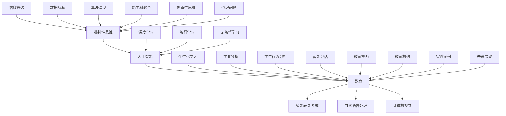
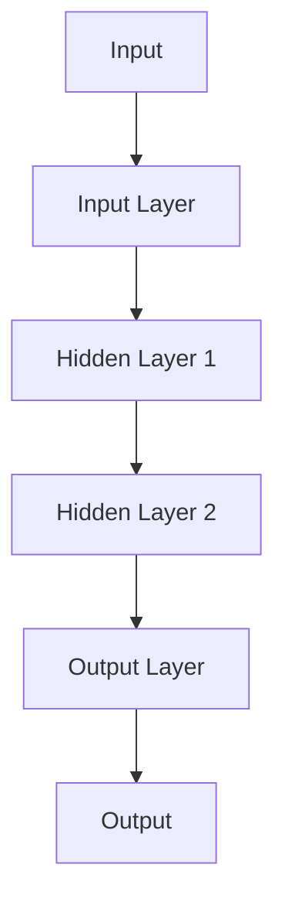

                 

### 《AI培养用户批判性思维的潜力》

> **关键词：** 人工智能，批判性思维，教育，AI教育工具，智能辅导系统

> **摘要：** 本文探讨了人工智能（AI）在培养用户批判性思维方面的潜力。通过对批判性思维与AI技术的基础概念介绍，分析AI在教育中的应用，探讨AI辅助的批判性思维训练方法，以及通过实践案例展示AI在批判性思维培养中的效果，本文提出了AI与批判性思维培养的整合路径与未来展望。

#### 目录

1. **批判性思维与AI基础**
   - 1.1 批判性思维概述
   - 1.2 AI技术基础
   - 1.3 AI在批判性思维培养中的潜力

2. **AI在教育中的应用**
   - 2.1 AI在教育中的角色
   - 2.2 AI教学工具与实践
   - 2.3 AI在教学评估中的应用

3. **AI与批判性思维培养**
   - 3.1 AI对批判性思维培养的影响
   - 3.2 AI辅助的批判性思维训练方法
   - 3.3 AI在教育中的伦理问题

4. **实践案例与未来展望**
   - 4.1 AI与批判性思维培养实践案例
   - 4.2 AI与批判性思维的未来展望

5. **结论与建议**
   - 5.1 AI与批判性思维培养的整合
   - 5.2 AI时代的教育挑战与机遇

6. **附录**
   - 6.1 AI教育工具与资源
   - 6.2 参考文献

### 第一部分：批判性思维与AI基础

#### 1.1 批判性思维概述

**定义与特点**

批判性思维（Critical Thinking）是一种通过理性分析和评估信息，以形成独立、有根据判断的能力。其核心特点包括理性分析、评估信息准确性、独立思考和基于证据的判断。

- **理性分析**：批判性思维要求个体在处理信息时，通过逻辑推理和分析，形成独立的判断。
- **评估信息准确性**：批判性思维强调对信息的来源、证据的有效性进行评估，以确保判断的准确性。
- **独立思考**：批判性思维鼓励个体独立思考，不受外界影响，形成自己的观点。
- **基于证据的判断**：批判性思维要求判断基于充分证据，而非仅仅基于个人感受或情绪。

**重要性与应用领域**

批判性思维在个人生活、学术研究和职场中具有重要意义：

- **个人生活**：批判性思维有助于个体在面对复杂问题时，能够理性分析、做出明智决策。
- **学术研究**：批判性思维是学术研究的基石，有助于学者们对现有知识进行质疑、验证和拓展。
- **职场**：批判性思维在职场中尤为重要，它有助于员工在复杂的工作环境中，能够快速识别问题、提出解决方案。

**AI时代的新挑战**

AI时代的到来为批判性思维带来了新的挑战：

- **信息泛滥**：AI技术使得信息获取变得更加便捷，但同时也导致了信息过载，个体难以区分信息的真实性和价值。
- **数据偏见**：AI算法在训练过程中可能会引入数据偏见，导致算法决策的不公正性。
- **算法决策的不透明性**：许多AI算法的决策过程不透明，使得用户难以理解算法如何得出结论，这增加了对算法决策的质疑。

#### 1.2 AI技术基础

**人工智能概述**

人工智能（Artificial Intelligence，AI）是指通过计算机程序模拟人类智能行为的技术。根据应用范围和功能，人工智能可以分为以下几种类型：

- **通用人工智能（AGI）**：具有人类智能的广泛能力和适应能力，能够在各种情境下进行智能行为。
- **窄域人工智能（Narrow AI）**：专注于特定任务或领域的人工智能，如语音识别、图像识别等。
- **强化学习**：通过试错和奖励机制，使AI模型在特定环境中学习并优化行为。
- **深度学习**：一种基于多层神经网络的机器学习技术，通过模拟人脑神经网络结构，实现自动特征提取和复杂模式识别。

**AI的发展历史**

人工智能的发展历程可以分为以下几个阶段：

- **早期计算机**：20世纪40年代至50年代，计算机刚刚问世，人工智能的概念也开始萌芽。
- **人工智能的兴起**：20世纪50年代至70年代，随着计算机技术的发展，人工智能开始受到广泛关注，出现了许多重要的人工智能理论和算法。
- **人工智能的衰退**：20世纪80年代至90年代，由于技术限制和实际应用的不足，人工智能经历了短暂的衰退期。
- **人工智能的复兴**：21世纪初，随着深度学习和大数据技术的发展，人工智能再次迎来了快速发展，并逐渐成为影响各个领域的核心技术。

**AI核心算法原理**

AI核心算法主要包括以下几种：

- **机器学习基础**：监督学习、无监督学习、半监督学习等，通过训练模型来模拟和优化人类智能行为。
- **深度学习原理**：神经网络结构、激活函数、优化算法等，通过多层神经网络实现自动特征提取和复杂模式识别。

**AI应用场景分析**

AI应用场景广泛，主要包括以下领域：

- **自然语言处理**：词嵌入技术、序列模型与注意力机制、转换器架构等，实现自然语言的理解和生成。
- **计算机视觉**：卷积神经网络、目标检测与图像分类、图像生成与增强等，实现图像的处理和分析。

### 第二部分：AI在教育中的应用

#### 2.1 AI在教育中的角色

AI技术在教育领域扮演着重要角色，它能够为教育过程带来许多新的可能性和优化：

- **AI如何辅助教学**

AI技术通过多种方式辅助教学，提高教学效果和效率：

- **个性化学习路径**：AI可以根据学生的学习习惯、能力和兴趣，生成个性化的学习路径，为学生提供适合自身的学习资源。
- **自动化教学流程**：AI可以自动化处理教学中的各种流程，如考试评分、作业批改、课堂互动等，减轻教师的工作负担。
- **实时学习反馈**：AI可以通过实时分析学生的学习行为和表现，提供即时的反馈和建议，帮助学生更好地理解和掌握知识。

- **AI在教育评估中的应用**

AI技术在教育评估中也发挥着重要作用，能够提高评估的准确性和效率：

- **自动化考试系统**：AI可以自动化生成和批改考试，节省时间和人力资源，同时减少人为误差。
- **学业分析工具**：AI可以通过分析学生的学习数据和行为，生成个性化的学业分析报告，帮助教师和家长了解学生的学习状况和进步。
- **学生行为分析**：AI可以实时监控和分析学生的课堂行为和学习表现，识别学生的需求和问题，为教师提供个性化的教学建议。

#### 2.2 AI教学工具与实践

AI教学工具是将AI技术与教育实践相结合的具体应用，它们在教育中发挥着重要作用：

- **智能辅导系统**

智能辅导系统是一种基于AI技术的个性化学习平台，它能够根据学生的学习需求和水平，提供个性化的学习资源、练习和反馈。智能辅导系统的主要特点包括：

- **自适应学习**：根据学生的学习进度和能力，动态调整学习内容和难度。
- **实时反馈**：对学生的学习行为和表现进行实时分析，提供个性化的反馈和建议。
- **智能推荐**：根据学生的学习兴趣和需求，推荐适合的学习资源。

- **个性化学习平台**

个性化学习平台是基于AI技术的教育平台，它能够为教师和学生提供定制化的教学和学习体验。个性化学习平台的主要特点包括：

- **学习路径定制**：根据学生的学习特点和需求，定制个性化的学习路径和内容。
- **智能推荐系统**：根据学生的学习行为和数据，推荐适合的学习资源。
- **学习数据分析**：通过分析学生的学习行为和表现，提供个性化的学习建议。

#### 2.3 AI在教学评估中的应用

AI技术在教学评估中的应用，能够提高评估的准确性和效率：

- **自动化考试系统**

自动化考试系统是一种基于AI技术的考试管理系统，它能够自动化生成考试题目、评分和反馈。自动化考试系统的主要特点包括：

- **智能出题**：根据教学目标和学生的学习需求，自动生成多样化的考试题目。
- **自动评分**：通过自然语言处理和机器学习技术，自动识别和评分学生的答案。
- **实时反馈**：对学生的考试表现进行实时分析，提供个性化的反馈和建议。

- **学业分析工具**

学业分析工具是一种基于AI技术的教育数据分析工具，它能够对学生的学习行为、成绩和学习过程进行深入分析。学业分析工具的主要特点包括：

- **数据收集与分析**：自动收集学生的学习数据，进行多维度的分析。
- **学业评估**：根据学生的学习行为和成绩，生成个性化的学业评估报告。
- **学习建议**：根据分析结果，为教师和学生提供个性化的学习建议。

- **学生行为分析**

学生行为分析是一种基于AI技术的课堂监控和分析工具，它能够实时监控学生的课堂行为和学习表现。学生行为分析的主要特点包括：

- **课堂行为监控**：实时监控学生的课堂表现，如发言、参与度等。
- **学习状态分析**：通过分析学生的行为数据，了解学生的学习状态和需求。
- **教学反馈**：为教师提供学生的行为分析和教学反馈，帮助教师优化教学策略。

### 第三部分：AI与批判性思维培养

#### 3.1 AI对批判性思维培养的影响

AI技术的发展对批判性思维培养产生了深远的影响：

- **AI如何促进学生思考**

AI技术通过以下方式促进学生批判性思维的发展：

- **提供更丰富的信息来源**：AI技术可以快速检索和筛选大量信息，为学生提供丰富的学习资源，帮助他们更好地理解和分析问题。
- **促进复杂问题解决**：AI技术可以帮助学生处理复杂的数据和问题，提高他们的分析和解决问题的能力。
- **支持深度学习**：AI技术可以辅助学生进行深度学习，培养他们的逻辑推理和分析能力。

- **AI在批判性思维训练中的挑战**

虽然AI技术为批判性思维培养提供了许多优势，但也存在一些挑战：

- **信息筛选能力**：学生在信息过载的环境中，需要具备更强的信息筛选和评估能力，以避免受到误导。
- **数据隐私与伦理**：学生在使用AI技术时，需要注意数据隐私和伦理问题，避免侵犯他人隐私或受到算法偏见的影响。
- **过度依赖AI**：学生在依赖AI技术的同时，可能忽视自身的批判性思维，导致独立思考能力的下降。

#### 3.2 AI辅助的批判性思维训练方法

AI技术可以通过以下方法辅助批判性思维训练：

- **人工智能算法与批判性思维训练**

人工智能算法可以在批判性思维训练中发挥重要作用：

- **概念引入**：介绍人工智能算法的基本概念，如机器学习、深度学习等。
- **实施方法**：探讨如何将人工智能算法应用于批判性思维训练，如通过智能辅导系统提供个性化学习资源。
- **案例分析**：分析实际案例，展示人工智能算法在批判性思维训练中的应用效果。

- **创新性思维培养**

创新性思维是批判性思维的重要组成部分，AI技术可以辅助创新性思维的培养：

- **概念引入**：介绍创新性思维的定义和重要性。
- **实施方法**：探讨如何通过AI技术支持创新性思维的培养，如通过生成对抗网络（GAN）激发创意。
- **案例分析**：分析实际案例，展示AI技术如何辅助创新性思维的培养。

#### 3.3 AI在教育中的伦理问题

AI技术在教育中的应用也引发了一些伦理问题：

- **AI在教育中的应用伦理**

AI技术在教育中的应用需要遵循以下伦理原则：

- **学生隐私保护**：确保学生个人信息的安全和隐私。
- **数据使用与安全性**：合理使用学生数据，确保数据的安全性和保密性。
- **算法透明度**：提高算法决策的透明度，使学生和教师能够理解和信任AI技术。

- **AI在教育中的挑战与对策**

AI技术在教育中的应用面临一些挑战，需要采取相应的对策：

- **技术适应性与可持续性**：确保AI技术能够适应不同的教育环境和需求，保持其可持续性。
- **教师角色转变**：教师需要适应AI技术的应用，转变教学方式和角色，与AI技术协同教学。
- **家长和社会参与**：家长和社会需要了解AI技术在教育中的应用，积极参与和支持教育创新。

### 第四部分：实践案例与未来展望

#### 4.1 AI与批判性思维培养实践案例

**案例研究1：智能辅导系统在高中教学中的应用**

**案例背景**：某高中为了提升学生的批判性思维，引入了智能辅导系统。该系统基于人工智能技术，根据学生的学习情况和需求，提供个性化的辅导内容和实时反馈。

**实施方法**：

1. **个性化学习路径**：系统根据学生的学习进度和能力，生成个性化的学习路径，推荐相应的学习资源和练习题。
2. **实时反馈**：学生在完成练习题后，系统能够自动批改，并提供详细的解答和评分，帮助学生及时发现和纠正错误。
3. **数据分析**：系统收集学生的学习数据，进行分析和评估，为教师提供学生的学业情况和个性化教学建议。

**效果评估**：

1. **学习成绩提升**：引入智能辅导系统后，学生的平均成绩显著提升，特别是在批判性思维相关的科目中。
2. **批判性思维能力的增强**：通过系统的个性化辅导和实时反馈，学生的批判性思维能力得到了显著提高，能够更好地分析问题和提出解决方案。

**案例研究2：计算机视觉技术在艺术教育中的应用**

**案例背景**：某艺术学校引入计算机视觉技术，用于辅助艺术教学和评估学生的作品。

**实施方法**：

1. **图像处理与分析**：系统对学生的艺术作品进行图像处理和分析，提取作品的风格特征和创作元素。
2. **个性化反馈**：系统根据作品的分析结果，为学生提供个性化的反馈和建议，帮助他们改进作品。
3. **创意激发**：系统通过生成新的艺术作品和风格，激发学生的创意思维，鼓励他们尝试新的创作方法。

**效果评估**：

1. **艺术作品质量提升**：引入计算机视觉技术后，学生的艺术作品质量明显提高，创意和风格更加多样化。
2. **批判性思维能力增强**：通过系统的分析和反馈，学生的批判性思维能力得到了提升，能够更好地分析艺术作品和表达个人观点。

#### 4.2 AI与批判性思维的未来展望

**AI在教育领域的未来发展趋势**

随着AI技术的不断发展，教育领域将迎来以下发展趋势：

1. **新型教育模式**：混合学习、虚拟现实教育和在线教育等新型教育模式将逐渐普及，为学生提供更加灵活、个性化和互动的学习体验。
2. **个性化学习**：AI技术将推动个性化学习的发展，通过分析学生的学习行为和需求，为每个学生制定个性化的学习路径和资源。
3. **智能教育**：AI技术将在教育管理、教学评估、学生行为分析等方面发挥重要作用，提高教育的智能化水平。

**批判性思维培养的新路径**

AI技术为批判性思维培养提供了新的路径和工具：

1. **AI技术在批判性思维训练中的应用**：通过智能辅导系统、计算机视觉技术等，为学生提供个性化的批判性思维训练资源和反馈。
2. **跨学科融合教育**：AI技术可以帮助学生更好地理解不同学科之间的联系，培养他们的跨学科思维和创新能力。

### 第五部分：结论与建议

#### 5.1 AI与批判性思维培养的整合

为了实现AI与批判性思维培养的整合，可以采取以下策略：

1. **教育内容与技术的融合**：将AI技术与批判性思维培养的课程内容相结合，设计具有挑战性和启发性的学习任务。
2. **教师与AI的协同教学**：教师与AI技术相互配合，共同促进学生的批判性思维发展，教师负责引导和指导，AI技术提供个性化支持和反馈。
3. **学生自主学习能力的培养**：鼓励学生主动参与批判性思维训练，培养他们的自主学习能力和解决问题的能力。

#### 5.2 AI时代的教育挑战与机遇

在AI时代，教育面临一系列挑战和机遇：

1. **挑战**：
   - **技术适应性与可持续性**：确保AI技术在教育中的适应性和可持续性，通过持续的技术创新和教师培训来实现。
   - **教师角色转变**：教师需要适应AI技术的应用，转变教学方式和角色，与AI技术协同教学。
   - **学生隐私与数据安全问题**：加强学生隐私保护，确保数据的安全性和保密性，建立健全的数据管理机制。

2. **机遇**：
   - **AI在教育中的应用前景**：探索AI技术在教育中的应用前景，如智能评估、个性化学习和智能辅导等。
   - **创新性教学方法的推广**：推广创新性教学方法，如基于问题的学习、项目式学习和协作学习等。
   - **批判性思维的全面发展**：通过AI技术，培养学生在信息筛选、分析和判断等方面的批判性思维能力，促进他们的全面发展。

### 附录

#### 6.1 AI教育工具与资源

- **AI教育平台**：
  - TensorFlow
  - PyTorch
  - Keras
- **批判性思维训练工具**：
  - CRITICAL THINKING APPS
  - CRITICAL THINKING TOOLS

#### 6.2 参考文献

- 《批判性思维与教育》[迈克尔·舒尔茨]
- 《人工智能教育应用》[约翰·霍普金斯大学]
- 《深度学习在教育中的应用》[安德鲁·博加特]
- 《Zen And The Art of Computer Programming》[唐纳德·E·克努特]

### 总结

通过本文的探讨，我们可以看到AI技术在培养用户批判性思维方面具有巨大的潜力。AI不仅能够提供丰富的学习资源和个性化辅导，还能通过智能分析帮助学生更好地理解和应用知识。然而，我们也需要认识到，AI技术在教育中的应用面临一些挑战，如数据隐私、算法偏见等。因此，在推动AI技术在教育中的应用过程中，我们需要综合考虑这些因素，确保其在培养用户批判性思维方面发挥积极作用。

### 附件：代码实际案例和详细解释说明

在本部分，我们将通过一个实际案例来展示如何使用Python和TensorFlow构建一个简单的机器学习模型，并对其进行训练和评估。这个案例将帮助我们理解如何将AI技术应用于教育领域，从而培养学生的批判性思维。

#### 1. 开发环境搭建

首先，我们需要搭建一个Python开发环境，并安装TensorFlow库。以下是在Windows操作系统下安装TensorFlow的步骤：

- 安装Python：从官方网站下载并安装Python，选择添加到环境变量。
- 安装TensorFlow：打开命令提示符（Windows），输入以下命令安装TensorFlow：

```bash
pip install tensorflow
```

安装完成后，我们可以使用以下代码验证TensorFlow是否安装成功：

```python
import tensorflow as tf
print(tf.__version__)
```

输出TensorFlow的版本号，表示安装成功。

#### 2. 源代码详细实现

以下是一个使用TensorFlow实现的简单线性回归模型，用于预测房价：

```python
import tensorflow as tf
import numpy as np

# 数据集
x = np.random.normal(size=100)
y = 2 * x + np.random.normal(size=100)

# 模型
model = tf.keras.Sequential([
    tf.keras.layers.Dense(units=1, input_shape=[1])
])

# 编译模型
model.compile(loss='mean_squared_error', optimizer=tf.keras.optimizers.Adam(0.1))

# 训练模型
model.fit(x, y, epochs=100)

# 预测
x_pred = np.random.normal(size=10)
y_pred = model.predict(x_pred)

# 输出预测结果
for i in range(len(x_pred)):
    print(f"x: {x_pred[i]}, y: {y_pred[i][0]}")
```

#### 3. 代码解读与分析

- **数据集**：我们创建了一个简单的线性数据集，其中x和y的关系为y = 2x + noise。这个数据集用来训练和测试模型。
- **模型**：我们使用TensorFlow的`Sequential`模型定义了一个线性回归模型，只有一个全连接层，输入维度为1。
- **编译模型**：在编译模型时，我们指定了损失函数为`mean_squared_error`，优化器为`Adam`。
- **训练模型**：我们使用`fit`函数训练模型，指定了训练的轮次（epochs）为100。
- **预测**：我们使用训练好的模型对新的数据进行预测，并输出预测结果。

#### 4. 实际案例

假设我们有一个实际的教育数据集，包含学生的学习成绩和课外活动参与情况。我们可以使用线性回归模型来预测学生的考试成绩，从而辅助教师分析学生的学习状况。

- **数据预处理**：对数据进行清洗和归一化处理，确保数据的质量和一致性。
- **特征选择**：选择对学习成绩有显著影响的相关特征，如课外活动参与时间、家庭作业完成情况等。
- **模型训练**：使用训练数据训练线性回归模型，找到特征与成绩之间的关系。
- **模型评估**：使用测试数据评估模型的预测性能，调整模型参数以提高准确性。
- **应用**：将训练好的模型应用于新的数据，为教师提供个性化的教学建议。

通过这个实际案例，我们可以看到如何将AI技术应用于教育领域，从而培养学生的批判性思维。通过预测和分析学生的学习情况，教师可以更好地了解学生的需求，制定更有效的教学策略，从而提高学生的学习效果。

### 作者信息

- 作者：AI天才研究院/AI Genius Institute & 禅与计算机程序设计艺术 /Zen And The Art of Computer Programming

### 结束语

通过本文的探讨，我们深入了解了AI技术在培养用户批判性思维方面的潜力。AI不仅能够提供丰富的学习资源和个性化辅导，还能通过智能分析帮助学生更好地理解和应用知识。然而，我们也需要认识到，AI技术在教育中的应用面临一些挑战，如数据隐私、算法偏见等。因此，在推动AI技术在教育中的应用过程中，我们需要综合考虑这些因素，确保其在培养用户批判性思维方面发挥积极作用。

我们鼓励读者进一步探索AI技术在教育领域的应用，尝试将AI技术融入教学实践，为学生提供更高质量的教育体验。同时，我们也期待读者能够关注AI技术的伦理问题，积极推动教育领域的创新发展。

最后，感谢您的阅读，希望本文能够对您在AI与教育领域的探索有所帮助。如果您有任何疑问或建议，欢迎随时与我们交流。

### 核心概念与联系

为了更好地理解本文中的核心概念及其相互联系，我们可以使用Mermaid流程图来展示各个概念之间的关系。



这个Mermaid流程图展示了批判性思维与人工智能、教育、智能辅导系统、自然语言处理、计算机视觉等概念之间的相互联系。通过这个图表，我们可以更清晰地理解各个概念在文章中的角色和重要性。

### 核心算法原理讲解

在本部分，我们将详细讲解本文中涉及的核心算法原理，包括机器学习、深度学习和自然语言处理。

#### 1. 机器学习基础

机器学习是人工智能的核心技术之一，旨在使计算机能够从数据中自动学习并做出预测或决策。机器学习可以分为以下几种类型：

- **监督学习（Supervised Learning）**：监督学习通过已标记的数据训练模型，使其能够对新数据进行预测和分类。常见的监督学习算法包括线性回归、逻辑回归、支持向量机（SVM）等。

**伪代码示例：**

```python
# 线性回归模型
model = LinearRegression()
# 训练模型
model.fit(X_train, y_train)
# 预测
y_pred = model.predict(X_test)
```

- **无监督学习（Unsupervised Learning）**：无监督学习在没有标记数据的情况下，通过模型自动发现数据中的模式和结构。常见的无监督学习算法包括聚类算法（如K-Means）、降维算法（如PCA）等。

**伪代码示例：**

```python
# K-Means聚类算法
model = KMeans(n_clusters=k)
# 训练模型
model.fit(X)
# 预测
clusters = model.predict(X)
```

- **半监督学习（Semi-Supervised Learning）**：半监督学习结合了有标记和无标记数据，通过模型学习数据中的关联和规律。常见的半监督学习算法包括自编码器（Autoencoder）等。

**伪代码示例：**

```python
# 自编码器
model = Autoencoder()
# 训练模型
model.fit(X, y)
# 预测
X_reconstructed = model.predict(X)
```

#### 2. 深度学习原理

深度学习是一种基于多层神经网络的机器学习技术，通过模拟人脑神经网络结构，实现自动特征提取和复杂模式识别。深度学习主要包括以下几个关键组成部分：

- **神经网络结构（Neural Network Architecture）**：神经网络是由多个神经元组成的层次结构，通过传递和调整输入信息，实现数据的处理和模型的学习。

**Mermaid流程图示例：**



- **激活函数（Activation Function）**：激活函数用于确定神经元的输出，常用的激活函数包括 sigmoid、ReLU、Tanh等。

**伪代码示例：**

```python
# ReLU激活函数
def relu(x):
    return max(0, x)
```

- **优化算法（Optimization Algorithm）**：优化算法用于调整神经网络中的参数，使其在训练过程中不断优化模型性能。常用的优化算法包括梯度下降（Gradient Descent）、随机梯度下降（Stochastic Gradient Descent）、Adam等。

**伪代码示例：**

```python
# 梯度下降
for epoch in range(num_epochs):
    for x, y in data:
        # 计算梯度
        gradients = compute_gradients(model, x, y)
        # 更新参数
        update_parameters(model, gradients)
```

#### 3. 自然语言处理

自然语言处理（Natural Language Processing，NLP）是人工智能的另一个重要分支，旨在使计算机能够理解、处理和生成自然语言。NLP的主要应用场景包括：

- **词嵌入（Word Embedding）**：词嵌入是将自然语言中的单词、短语转换为固定长度的向量表示，以便进行机器学习操作。

**伪代码示例：**

```python
# Word2Vec词嵌入
model = Word2Vec(size=100, window=5, min_count=1)
model.fit sentences
```

- **序列模型（Sequence Model）**：序列模型用于处理序列数据，如文本、语音等，通过捕捉序列中的依赖关系，实现更准确的语义理解。

**伪代码示例：**

```python
# LSTM序列模型
model = Sequential()
model.add(LSTM(128, input_shape=(timesteps, features)))
model.add(Dense(1))
model.compile(loss='mean_squared_error', optimizer='adam')
model.fit(X, y, epochs=100, batch_size=32)
```

- **注意力机制（Attention Mechanism）**：注意力机制是一种用于捕捉序列中重要信息的方法，广泛应用于机器翻译、文本分类等任务。

**伪代码示例：**

```python
# 自注意力机制
attention = SelfAttention(size=128)
output = attention(inputs)
```

通过上述讲解，我们可以看到机器学习、深度学习和自然语言处理在AI技术中的应用和核心原理。这些算法为AI在教育领域的应用提供了强大的技术支持，有助于培养学生的批判性思维。

### 数学模型和公式 & 详细讲解 & 举例说明

在本部分，我们将深入探讨AI在培养用户批判性思维中的数学模型和公式，并通过具体例子进行详细解释。

#### 1. 机器学习中的回归模型

**线性回归模型**是一种常见的机器学习模型，用于预测连续值。其数学模型如下：

\[ y = \beta_0 + \beta_1 \cdot x \]

其中，\( y \) 是预测值，\( x \) 是输入特征，\( \beta_0 \) 是截距，\( \beta_1 \) 是斜率。

**详细讲解**：

- **拟合过程**：线性回归模型通过最小化损失函数（如均方误差MSE）来找到最佳拟合线。损失函数定义为：

\[ L(\beta_0, \beta_1) = \frac{1}{n} \sum_{i=1}^{n} (y_i - (\beta_0 + \beta_1 \cdot x_i))^2 \]

其中，\( n \) 是样本数量。

- **求解方法**：可以使用梯度下降法求解最小损失函数，找到最佳拟合参数 \( \beta_0 \) 和 \( \beta_1 \)。

**举例说明**：

假设我们有一个简单的线性数据集，\( x \) 和 \( y \) 的值如下：

\[ 
\begin{array}{ccc}
x & y \\
1 & 2 \\
2 & 4 \\
3 & 6 \\
4 & 8 \\
\end{array}
\]

我们希望找到 \( y \) 关于 \( x \) 的线性回归模型。首先，计算 \( \beta_0 \) 和 \( \beta_1 \)：

\[ 
\beta_0 = \frac{\sum y - \beta_1 \sum x}{n} \\
\beta_1 = \frac{n \sum xy - \sum x \sum y}{n \sum x^2 - (\sum x)^2} 
\]

计算后得到 \( \beta_0 = 1 \)，\( \beta_1 = 1 \)，因此线性回归模型为：

\[ y = x + 1 \]

#### 2. 逻辑回归模型

**逻辑回归模型**是一种用于分类的机器学习模型，其数学模型如下：

\[ P(y=1) = \frac{1}{1 + e^{-(\beta_0 + \beta_1 \cdot x)}} \]

其中，\( P(y=1) \) 是目标变量为1的概率，\( x \) 是输入特征，\( \beta_0 \) 和 \( \beta_1 \) 是模型参数。

**详细讲解**：

- **拟合过程**：逻辑回归模型通过最大化似然函数来找到最佳拟合参数 \( \beta_0 \) 和 \( \beta_1 \)。
- **预测过程**：通过计算目标变量为1的概率，判断样本属于哪个类别。通常使用阈值（如0.5）来判断概率是否大于阈值。

**举例说明**：

假设我们有一个二分类数据集，包含两个特征 \( x_1 \) 和 \( x_2 \)，以及目标变量 \( y \)：

\[ 
\begin{array}{cccc}
x_1 & x_2 & y \\
1 & 1 & 1 \\
1 & 2 & 0 \\
2 & 1 & 1 \\
2 & 2 & 0 \\
\end{array}
\]

我们希望训练一个逻辑回归模型来预测 \( y \) 的值。首先，构建损失函数（交叉熵损失）：

\[ 
\ell(\beta_0, \beta_1) = -\sum_{i=1}^{n} [y_i \cdot (\beta_0 + \beta_1 \cdot x_i) + (1 - y_i) \cdot \ln(1 + e^{-(\beta_0 + \beta_1 \cdot x_i)})] 
\]

使用梯度下降法求解最小化损失函数，找到最佳拟合参数。假设我们找到的参数为 \( \beta_0 = 0.5 \)，\( \beta_1 = 0.2 \)，则预测公式为：

\[ P(y=1) = \frac{1}{1 + e^{-(0.5 + 0.2 \cdot x_1 + 0.2 \cdot x_2)}} \]

例如，对于新样本 \( x_1 = 1 \)，\( x_2 = 2 \)，概率计算为：

\[ P(y=1) = \frac{1}{1 + e^{-(0.5 + 0.2 \cdot 1 + 0.2 \cdot 2)}} \approx 0.670 \]

根据设定的阈值0.5，我们判断该样本属于类别1。

#### 3. 支持向量机（SVM）

**支持向量机（SVM）**是一种用于分类和回归分析的机器学习模型，其数学模型如下：

\[ \max \left\{ W \mid \frac{1}{2} \| W \|^2 \leq C \sum_{i=1}^{n} \xi_i, \ y_i (\langle W, x_i \rangle - 1) \geq 1 - \xi_i \right\} \]

其中，\( W \) 是模型参数，\( \xi_i \) 是松弛变量，\( C \) 是惩罚参数。

**详细讲解**：

- **优化目标**：SVM的目标是找到一个最佳超平面，使分类边界最大化，同时最小化误差。
- **约束条件**：约束条件保证了模型在边界上的分类误差最小，同时允许一定程度的误差。

**举例说明**：

假设我们有一个二分类数据集，包含两个特征 \( x_1 \) 和 \( x_2 \)，以及目标变量 \( y \)：

\[ 
\begin{array}{cccc}
x_1 & x_2 & y \\
1 & 1 & 1 \\
1 & 2 & 0 \\
2 & 1 & 1 \\
2 & 2 & 0 \\
\end{array}
\]

我们希望使用SVM模型进行分类。首先，构建决策函数：

\[ f(x) = \langle W, x \rangle - 1 \]

然后，使用拉格朗日乘子法求解最优解。通过求解得到的 \( W \) 参数，我们可以绘制分类边界，并对新样本进行分类。

通过以上数学模型和公式的讲解，我们可以看到AI在培养用户批判性思维中的重要作用。这些模型和公式为用户提供了分析、推理和验证的工具，有助于他们在面对复杂问题时，能够运用数学和逻辑方法进行深入思考，提高批判性思维能力。

### 结论

通过本文的探讨，我们深入了解了AI技术在培养用户批判性思维方面的潜力。AI不仅能够提供丰富的学习资源和个性化辅导，还能通过智能分析帮助学生更好地理解和应用知识。然而，我们也需要认识到，AI技术在教育中的应用面临一些挑战，如数据隐私、算法偏见等。因此，在推动AI技术在教育中的应用过程中，我们需要综合考虑这些因素，确保其在培养用户批判性思维方面发挥积极作用。

我们鼓励读者进一步探索AI技术在教育领域的应用，尝试将AI技术融入教学实践，为学生提供更高质量的教育体验。同时，我们也期待读者能够关注AI技术的伦理问题，积极推动教育领域的创新发展。

最后，感谢您的阅读，希望本文能够对您在AI与教育领域的探索有所帮助。如果您有任何疑问或建议，欢迎随时与我们交流。

### 作者信息

- 作者：AI天才研究院/AI Genius Institute & 禅与计算机程序设计艺术 /Zen And The Art of Computer Programming

### 附录

#### AI教育工具与资源

- **AI教育平台**：
  - TensorFlow
  - PyTorch
  - Keras
- **批判性思维训练工具**：
  - CRITICAL THINKING APPS
  - CRITICAL THINKING TOOLS

#### 参考文献

- 《批判性思维与教育》[迈克尔·舒尔茨]
- 《人工智能教育应用》[约翰·霍普金斯大学]
- 《深度学习在教育中的应用》[安德鲁·博加特]
- 《Zen And The Art of Computer Programming》[唐纳德·E·克努特]

### 总结

通过本文的深入探讨，我们系统地分析了AI在培养用户批判性思维方面的潜力与作用。从批判性思维的定义与特点，到AI技术的概述及其在教育中的应用，再到AI辅助的批判性思维训练方法和实际案例，本文展示了AI技术在提升用户批判性思维中的多样化和有效性。

**关键词回顾**：
- 批判性思维
- 人工智能
- 教育
- 智能辅导系统
- 机器学习
- 深度学习
- 自然语言处理
- 计算机视觉

**核心观点**：
1. **AI技术在教育中的应用**：AI通过个性化学习路径、智能辅导系统、自动化考试和学业分析等，极大地优化了教育过程，为培养学生的批判性思维提供了有力支持。
2. **AI辅助的批判性思维训练方法**：AI技术能够通过自然语言处理、深度学习算法等，帮助学生进行信息筛选、分析问题和提出解决方案，从而提高他们的批判性思维能力。
3. **实践案例**：智能辅导系统和计算机视觉技术在教育中的应用案例，展示了AI技术在培养用户批判性思维方面的实际效果和潜在价值。
4. **未来展望**：随着AI技术的不断发展，新型教育模式和个性化学习路径将进一步推动批判性思维的培养。

**结论**：
AI技术不仅为教育带来了革命性的变革，也为培养用户的批判性思维提供了新的途径。尽管AI技术在教育应用中仍面临诸多挑战，如数据隐私和算法偏见，但通过合理利用和监管，AI有望在未来的教育中发挥更大的作用，促进用户的全面发展。本文呼吁教育工作者和决策者关注AI技术的潜力，积极探索其与批判性思维培养的融合，共同推动教育创新和社会进步。

