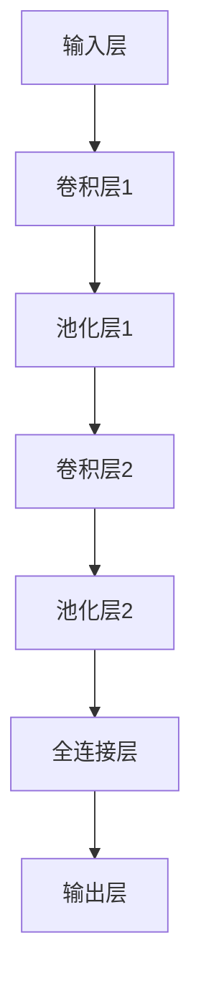
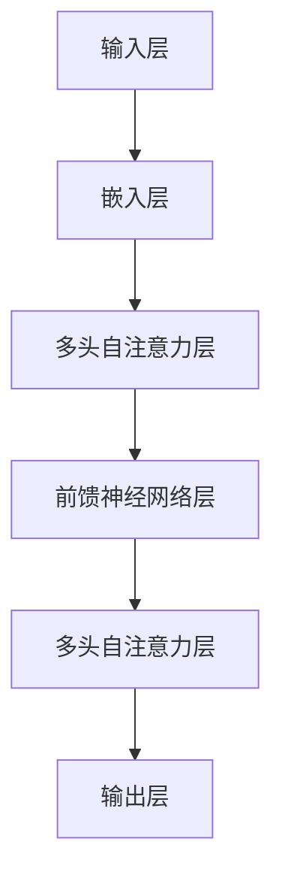

                 

### 引言

近年来，人工智能（AI）技术尤其是大规模预训练模型（AI大模型）的迅猛发展，为各行各业带来了前所未有的变革与机遇。AI大模型，如OpenAI的GPT系列、百度的飞桨、谷歌的BERT等，凭借其强大的数据处理和分析能力，已经在自然语言处理、计算机视觉、自动驾驶等多个领域取得了显著成果。然而，随着技术的不断进步，AI大模型创业也面临着一系列前所未有的挑战。

本文旨在探讨AI大模型创业的现状、面临的挑战以及应对策略。我们将从以下几个方面展开讨论：

1. **AI大模型的基础**：介绍AI大模型的背景、核心算法、数学模型以及应用场景。
2. **AI大模型的开发与实践**：分析AI大模型的开发环境、训练与优化、安全与隐私保护。
3. **AI大模型创业案例分析**：深入分析OpenAI与GPT系列模型、百度飞桨与自动驾驶等案例。
4. **AI大模型创业的未来展望**：探讨AI大模型创业的趋势、挑战与机遇。

通过本文的逐步分析，我们希望能够为AI大模型创业提供一些有价值的思路和参考。让我们开始这场思维的旅程，一同探索AI大模型的未来。

### 第一部分: AI大模型的基础

#### 第1章: AI大模型概述

AI大模型，即人工智能大规模预训练模型，是当前人工智能领域的一个重要研究方向。它们通过在大量数据上预训练，掌握了丰富的知识和技能，从而在特定任务上展现出卓越的性能。AI大模型的发展历程可以追溯到20世纪80年代，当时神经网络首次在人工智能领域崭露头角。然而，由于计算能力和数据资源限制，早期的神经网络模型规模较小，性能也较为有限。

进入21世纪，随着计算能力的提升和大数据技术的发展，深度学习成为人工智能研究的主流方向。尤其是2012年，AlexNet在ImageNet图像分类挑战中取得了突破性成果，标志着深度学习时代的到来。此后，神经网络模型在多个领域取得了显著进展，包括计算机视觉、自然语言处理等。

AI大模型的核心概念与特点主要体现在以下几个方面：

1. **大规模预训练**：AI大模型通过在大量数据上进行预训练，使模型能够自动提取数据中的规律和特征。预训练过程中，模型首先在大规模语料库或图像数据集上学习通用表示，然后通过微调（fine-tuning）适应特定任务。

2. **多模态学习**：AI大模型可以同时处理多种类型的数据，如文本、图像、音频等。通过多模态学习，模型能够整合不同类型的数据，提升任务性能。

3. **强泛化能力**：AI大模型在预训练过程中积累了丰富的知识，使其在未见过的数据上表现出良好的泛化能力。这种能力使得AI大模型在不同应用场景中具有广泛的应用前景。

当前，主流的AI大模型主要包括以下几类：

1. **Transformer模型**：Transformer模型由Vaswani等人在2017年提出，是自然语言处理领域的重要突破。其基于自注意力机制，能够捕捉长距离依赖关系，已在机器翻译、文本生成等任务中取得了优异表现。

2. **BERT模型**：BERT（Bidirectional Encoder Representations from Transformers）是由Google在2018年提出的预训练模型。BERT模型通过双向编码器学习文本的上下文表示，已在问答系统、文本分类等任务中取得了显著成果。

3. **GPT模型**：GPT（Generative Pre-trained Transformer）是由OpenAI提出的一系列预训练模型。GPT模型通过生成式预训练方法，能够在文本生成、对话系统等任务中表现出强大的能力。

AI大模型的价值与未来趋势体现在以下几个方面：

1. **技术突破**：AI大模型的出现，推动了人工智能技术的快速发展，使得更多复杂任务得以自动化和智能化。

2. **行业变革**：AI大模型在医疗、金融、教育、交通等行业具有广泛的应用前景，有望改变现有业务模式，提升行业效率。

3. **社会影响**：随着AI大模型的广泛应用，人工智能逐渐融入人们的日常生活，对社会生活产生深远影响。

总之，AI大模型作为人工智能领域的重要研究方向，具有巨大的潜力和价值。未来，随着技术的不断进步和应用场景的拓展，AI大模型将在更多领域发挥重要作用。

#### 第1章: AI大模型概述

##### 1.1 AI大模型的背景与发展历程

人工智能（AI）的概念起源于20世纪50年代，随着计算机技术的兴起，人们对模拟和扩展人类智能产生了浓厚兴趣。早期的AI研究主要集中在逻辑推理、知识表示和问题求解等领域。然而，受限于计算能力和数据资源，这些早期系统往往只能处理特定领域的问题，难以实现广泛的智能应用。

进入21世纪，深度学习（Deep Learning）的兴起为人工智能领域带来了新的变革。深度学习通过模仿人脑的神经网络结构，利用多层神经网络模型对数据进行自动特征提取和分类。2006年，Geoffrey Hinton提出了深度信念网络（Deep Belief Networks），标志着深度学习技术的重新兴起。随后，2012年，Alex Krizhevsky等人基于深度卷积神经网络（Convolutional Neural Network，CNN）在ImageNet图像分类挑战中取得了突破性成果，深度学习开始在计算机视觉领域得到广泛应用。

随着深度学习的快速发展，人工智能的应用场景逐渐扩展到自然语言处理、语音识别、机器人等更多领域。特别是2017年，Vaswani等人提出的Transformer模型在自然语言处理领域取得了重大突破，彻底改变了传统序列模型的结构和性能。此后，基于Transformer的预训练模型如BERT、GPT等相继问世，标志着大规模预训练模型时代的到来。

AI大模型的发展历程可以分为以下几个阶段：

1. **传统机器学习方法**：20世纪50年代至80年代，以符号主义方法为主，研究者尝试通过规则和逻辑推理来模拟人类智能。

2. **统计学习方法**：20世纪80年代至2000年，以支持向量机（SVM）、决策树、朴素贝叶斯等模型为主，通过统计方法对数据进行特征提取和分类。

3. **深度学习方法**：2006年至今，以卷积神经网络（CNN）、循环神经网络（RNN）和Transformer等模型为主，深度学习技术在图像、语音、自然语言处理等领域取得了显著突破。

4. **大规模预训练模型**：2018年至今，以BERT、GPT、Turing等模型为代表，AI大模型通过在大量数据上进行预训练，展现了强大的通用表示和学习能力。

AI大模型的背景离不开以下几个关键因素：

1. **计算能力提升**：随着计算机硬件性能的不断提升，特别是GPU和TPU等专用硬件的广泛应用，为深度学习模型的训练和推理提供了强大的计算支持。

2. **数据资源丰富**：互联网的普及和大数据技术的发展，为AI大模型提供了海量的训练数据，使得模型能够从大量数据中学习到更加丰富的特征和知识。

3. **算法创新**：深度学习、Transformer等新型算法的提出，为AI大模型的发展提供了理论支持和实现基础。

##### 1.2 AI大模型的核心概念与特点

AI大模型的核心概念可以概括为大规模预训练、多模态学习、强泛化能力等几个方面。

1. **大规模预训练**：AI大模型通过在大量数据上进行预训练，使模型能够自动提取数据中的规律和特征。预训练过程中，模型首先在大规模语料库或图像数据集上学习通用表示，然后通过微调（fine-tuning）适应特定任务。大规模预训练使模型能够在未见过的数据上表现出良好的泛化能力。

2. **多模态学习**：AI大模型可以同时处理多种类型的数据，如文本、图像、音频等。通过多模态学习，模型能够整合不同类型的数据，提升任务性能。例如，在图像识别任务中，模型可以同时利用图像和文本信息，提高分类准确率。

3. **强泛化能力**：AI大模型在预训练过程中积累了丰富的知识，使其在未见过的数据上表现出良好的泛化能力。这种能力使得AI大模型在不同应用场景中具有广泛的应用前景。例如，预训练好的语言模型可以在不同的问答系统、文本生成任务中取得优异表现。

##### 1.3 主流AI大模型的介绍

当前，主流的AI大模型主要包括Transformer模型、BERT模型、GPT模型等。这些模型在各自的领域都取得了显著的成果。

1. **Transformer模型**：Transformer模型是由Vaswani等人在2017年提出的，是一种基于自注意力机制的深度神经网络模型。Transformer模型通过多头自注意力机制和点积自注意力机制，能够捕捉长距离依赖关系，已在机器翻译、文本生成等任务中取得了优异表现。例如，Google的BERT模型就是基于Transformer模型进行预训练的。

2. **BERT模型**：BERT（Bidirectional Encoder Representations from Transformers）是由Google在2018年提出的预训练模型。BERT模型通过双向编码器学习文本的上下文表示，已在问答系统、文本分类等任务中取得了显著成果。BERT模型的核心思想是通过对文本进行双向编码，使得模型能够理解文本的上下文关系，从而提高文本处理任务的性能。

3. **GPT模型**：GPT（Generative Pre-trained Transformer）是由OpenAI提出的一系列预训练模型。GPT模型通过生成式预训练方法，能够在文本生成、对话系统等任务中表现出强大的能力。GPT-3是当前最先进的GPT模型，具有高达1750亿参数，能够在各种自然语言处理任务中取得优异表现。

##### 1.4 AI大模型的价值与未来趋势

AI大模型的出现，为人工智能领域带来了前所未有的变革和机遇。其价值主要体现在以下几个方面：

1. **技术突破**：AI大模型通过大规模预训练和多模态学习，实现了对数据的高效表示和学习，推动了人工智能技术的快速发展。

2. **行业变革**：AI大模型在医疗、金融、教育、交通等行业具有广泛的应用前景，能够提升行业效率、降低成本，并改变现有业务模式。

3. **社会影响**：随着AI大模型的广泛应用，人工智能逐渐融入人们的日常生活，对社会生活产生深远影响。例如，自动驾驶、智能语音助手等应用，极大地改善了人们的生活质量。

未来，AI大模型的发展趋势将呈现以下几个特点：

1. **模型规模持续增长**：随着计算能力的提升和训练数据的增加，AI大模型的规模将不断增大，以实现更好的性能和泛化能力。

2. **多模态学习**：AI大模型将逐渐整合多种类型的数据，如文本、图像、音频等，实现更加全面和智能的感知和理解。

3. **强泛化能力**：通过预训练和迁移学习，AI大模型将在更多领域展现出强大的泛化能力，实现更广泛的应用。

4. **安全与隐私保护**：随着AI大模型的广泛应用，其安全与隐私保护将成为重要议题，需要采取有效措施确保模型的安全性和隐私性。

总之，AI大模型作为人工智能领域的重要研究方向，具有巨大的潜力和价值。未来，随着技术的不断进步和应用场景的拓展，AI大模型将在更多领域发挥重要作用。

### 第2章: AI大模型的核心算法

AI大模型的核心算法是其能够处理复杂任务并实现高效学习的关键。在本章中，我们将详细探讨深度学习基础、自然语言处理算法及其在AI大模型中的应用。

#### 2.1 深度学习基础

深度学习（Deep Learning）是人工智能的一个重要分支，它通过构建多层神经网络模型，自动提取数据的特征，并在各种任务中取得显著成果。以下是深度学习基础的一些核心概念。

##### 2.1.1 神经网络的基本结构

神经网络（Neural Network，NN）是深度学习的基础。一个简单的神经网络通常包括以下几个部分：

1. **输入层（Input Layer）**：接收输入数据，将其传递给下一层。
2. **隐藏层（Hidden Layer）**：对输入数据进行处理和变换，提取特征信息。隐藏层的数量和神经元数目可以根据任务需求进行调整。
3. **输出层（Output Layer）**：对隐藏层的结果进行分类、预测或其他形式的输出。

每个神经元都与其他神经元通过权重（Weight）相连接，并应用一个非线性激活函数（Activation Function），如ReLU（Rectified Linear Unit）或Sigmoid函数。

##### 2.1.2 前馈神经网络与反向传播算法

前馈神经网络（Feedforward Neural Network）是一种典型的神经网络结构，数据从前向流动，不形成循环。在前馈神经网络中，信息从输入层经过隐藏层，最终到达输出层。

反向传播算法（Backpropagation Algorithm）是一种训练神经网络的方法。它通过计算输出层的误差，反向传播误差到隐藏层，并更新各层的权重和偏置。反向传播算法包括以下几个步骤：

1. **前向传播（Forward Propagation）**：计算输入层的输入值，通过隐藏层传递，最后得到输出层的预测值。
2. **计算误差（Error Calculation）**：使用目标值与预测值之间的差异计算误差。
3. **反向传播误差（Backpropagation of Errors）**：从输出层开始，将误差反向传播到隐藏层，计算每个神经元的误差梯度。
4. **权重更新（Weight Update）**：使用梯度下降（Gradient Descent）或其他优化算法更新权重和偏置。

以下是一个简单的神经网络反向传播算法的伪代码：

```python
# 初始化权重和偏置
weights = [w1, w2, ..., wn]
biases = [b1, b2, ..., bn]

# 前向传播
inputs = [x1, x2, ..., xn]
outputs = forward_propagation(inputs, weights, biases)

# 计算误差
error = calculate_error(outputs, target)

# 反向传播
deltas = backward_propagation(outputs, error, inputs, weights, biases)

# 权重更新
weights = update_weights(weights, deltas)
biases = update_biases(biases, deltas)
```

##### 2.1.3 卷积神经网络

卷积神经网络（Convolutional Neural Network，CNN）是专门用于处理图像数据的神经网络。与传统的全连接神经网络不同，CNN通过卷积层、池化层和全连接层等结构，实现图像特征的自动提取和分类。

1. **卷积层（Convolutional Layer）**：卷积层通过卷积操作从输入数据中提取特征。每个卷积核（Convolutional Kernel）负责学习图像中的一个局部区域特征。

2. **池化层（Pooling Layer）**：池化层对卷积层输出的特征进行下采样，减少数据维度，提高计算效率。常见的池化方法包括最大池化（Max Pooling）和平均池化（Average Pooling）。

3. **全连接层（Fully Connected Layer）**：全连接层将卷积层和池化层输出的特征映射到具体的类别或任务结果。

以下是一个简单的CNN模型结构的Mermaid流程图：



#### 2.2 自然语言处理算法

自然语言处理（Natural Language Processing，NLP）是人工智能的一个重要领域，它致力于让计算机理解和处理人类语言。在AI大模型中，NLP算法发挥着核心作用。

##### 2.2.1 词嵌入技术

词嵌入（Word Embedding）是将词汇映射到高维向量空间的技术，它能够将文本数据转化为机器可处理的向量形式。词嵌入技术通过学习词汇之间的相似性和关系，实现了文本数据的语义表示。

1. **Word2Vec**：Word2Vec是由Mikolov等人提出的词嵌入技术，它通过训练神经网络模型，将词汇映射到高维向量空间。Word2Vec包括连续词袋（Continuous Bag of Words，CBOW）和Skip-Gram两种模型。

2. **GloVe**：GloVe（Global Vectors for Word Representation）是一种基于全局上下文统计的词嵌入技术。GloVe通过计算词汇的共现矩阵，学习词汇的语义表示。

##### 2.2.2 递归神经网络与长短时记忆网络

递归神经网络（Recurrent Neural Network，RNN）是一种专门用于处理序列数据的神经网络。RNN通过将当前输入与之前的隐藏状态进行交互，实现了对序列数据的建模。

1. **RNN**：传统的RNN模型通过递归连接，将当前输入与上一个时间步的隐藏状态进行拼接，并应用一个非线性激活函数进行输出。

2. **长短时记忆网络（Long Short-Term Memory，LSTM）**：LSTM是RNN的一种变体，它通过引入记忆单元和门控机制，解决了传统RNN在处理长序列数据时易出现的梯度消失和梯度爆炸问题。LSTM能够在不同时间尺度上保持长期依赖关系，提高了模型在自然语言处理任务中的性能。

##### 2.2.3 注意力机制与Transformer模型

注意力机制（Attention Mechanism）是一种用于处理序列数据的模型组件，它通过动态调整不同时间步之间的交互权重，实现了对序列数据中关键信息的关注。注意力机制在RNN和Transformer模型中得到了广泛应用。

1. **注意力机制**：在注意力机制中，每个时间步的输出通过一个权重向量与之前的时间步的隐藏状态相乘，权重向量通过一个函数计算，以表示当前时间步对之前时间步的依赖程度。

2. **Transformer模型**：Transformer模型是由Vaswani等人在2017年提出的一种基于自注意力机制的深度神经网络模型。Transformer模型通过多头自注意力机制和点积自注意力机制，实现了对长距离依赖关系的捕捉，并在自然语言处理任务中取得了显著成果。

以下是一个简单的Transformer模型结构的Mermaid流程图：



#### 2.3 AI大模型中的核心算法应用

AI大模型通过整合深度学习基础和自然语言处理算法，实现了对复杂数据的高效处理和建模。以下是一些AI大模型中的核心算法应用：

1. **预训练与微调**：AI大模型通常通过在大规模数据上进行预训练，学习到通用的特征表示，然后在具体任务上进行微调，以适应特定的任务需求。预训练过程包括词嵌入、双向编码、自注意力机制等。

2. **多模态学习**：AI大模型通过整合多种类型的数据（如文本、图像、音频等），实现多模态学习。多模态学习能够提高模型在跨领域任务中的性能，如语音识别、图像描述生成等。

3. **迁移学习**：迁移学习是一种利用预训练模型在特定任务上的知识，提升新任务性能的方法。AI大模型通过迁移学习，能够在有限的数据集上取得更好的性能，降低训练成本。

4. **强化学习**：强化学习（Reinforcement Learning，RL）是一种通过与环境的交互，学习最优策略的方法。AI大模型通过结合深度学习和强化学习，实现智能决策和策略优化，如自动驾驶、游戏AI等。

总之，AI大模型的核心算法在深度学习和自然语言处理领域的应用，为人工智能的发展提供了强大动力。未来，随着算法的不断创新和优化，AI大模型将在更多领域发挥重要作用。

### 第3章: AI大模型的数学模型

AI大模型的数学模型是其理论基石，它不仅解释了模型的工作原理，还为算法优化提供了数学工具。在本章中，我们将探讨概率论与统计学基础、信息论与编码理论，以及如何将这些数学模型应用于AI大模型中。

#### 3.1 概率论与统计学基础

概率论是AI大模型中不可或缺的数学工具，它为模型提供了对不确定性的处理方式。以下是一些核心概念：

##### 3.1.1 概率分布函数

概率分布函数（Probability Distribution Function，PDF）描述了随机变量在不同取值下的概率分布。常见的概率分布函数包括正态分布（Gaussian Distribution）、伯努利分布（Bernoulli Distribution）等。

1. **正态分布**：正态分布也称为高斯分布，是最常见的概率分布。它的概率密度函数为：
   $$
   f(x|\mu, \sigma^2) = \frac{1}{\sqrt{2\pi\sigma^2}}e^{-\frac{(x-\mu)^2}{2\sigma^2}}
   $$
   其中，$\mu$为均值，$\sigma^2$为方差。

2. **伯努利分布**：伯努利分布是二项分布的特殊情况，它描述了一个事件成功或失败的概率。其概率质量函数为：
   $$
   P(X = k) = \binom{n}{k} p^k (1-p)^{n-k}
   $$
   其中，$n$为试验次数，$p$为事件成功的概率。

##### 3.1.2 最大似然估计与最大后验估计

最大似然估计（Maximum Likelihood Estimation，MLE）和最大后验估计（Maximum A Posteriori，MAP）是用于估计模型参数的方法。

1. **最大似然估计**：MLE的目标是找到一组参数，使得观测数据的概率最大。对于离散随机变量，MLE的目标函数为：
   $$
   \theta^* = \arg\max_\theta \prod_{i=1}^n P(x_i|\theta)
   $$
   对于连续随机变量，目标函数为：
   $$
   \theta^* = \arg\max_\theta \int f(x|\theta)dx
   $$

2. **最大后验估计**：MAP是在最大似然估计的基础上，引入先验概率，使得参数估计更加合理。MAP的目标函数为：
   $$
   \theta^* = \arg\max_\theta P(\theta|x) = \arg\max_\theta \frac{P(x|\theta)P(\theta)}{P(x)}
   $$
   其中，$P(\theta)$为先验概率，$P(x|\theta)$为似然函数，$P(x)$为边缘概率。

##### 3.1.3 贝叶斯网络

贝叶斯网络（Bayesian Network）是一种基于概率论的图形模型，它表示变量之间的条件依赖关系。贝叶斯网络由节点和边组成，每个节点表示一个随机变量，边表示变量之间的条件概率关系。

贝叶斯网络的参数由条件概率表（Conditional Probability Table，CPT）定义。对于每个节点，CPT给出了节点与其父节点之间的概率分布。贝叶斯网络的学习和推理是深度学习中的重要问题，它可以用于分类、预测和决策。

#### 3.2 信息论与编码理论

信息论是研究信息传输和信息处理的数学理论，它为AI大模型中的数据表示和压缩提供了理论基础。以下是一些核心概念：

##### 3.2.1 信息熵与相对熵

信息熵（Entropy）是衡量随机变量不确定性的度量。对于离散随机变量$X$，其熵定义为：
$$
H(X) = -\sum_{x \in X} P(x) \log_2 P(x)
$$
对于连续随机变量，信息熵通过积分计算。

相对熵（Relative Entropy）也称为Kullback-Leibler散度（Kullback-Leibler Divergence，KL散度），它是衡量两个概率分布差异的度量。对于概率分布$P$和$Q$，KL散度为：
$$
D(P||Q) = \sum_{x} P(x) \log_2 \frac{P(x)}{Q(x)}
$$
KL散度具有非对称性，即$D(P||Q) \neq D(Q||P)$。

##### 3.2.2 熵减少定理

熵减少定理（Data Processing Inequality）是信息论中的一个重要定理，它说明了在信息处理过程中，信息熵不会增加。具体来说，对于随机变量$X$、$Y$和$Z$，如果$Y$是$X$和$Z$的函数，那么：
$$
H(X|Z) \geq H(X|Y,Z)
$$
熵减少定理在深度学习和机器学习中具有重要的应用，如模型选择、数据预处理等。

##### 3.2.3 信息保持变换

信息保持变换（Information-Preserving Transformation）是指一种在信息处理过程中保持信息量的变换。在深度学习中，信息保持变换可以通过保持模型的特性来实现，例如：
- **不变性**：模型在处理不同输入时保持输出特征的一致性。
- **对称性**：模型在处理不同输入时保持输出特征的对称性。
- **鲁棒性**：模型在处理噪声或异常值时保持输出特征的稳定。

信息保持变换是深度学习模型设计中的重要原则，它有助于提高模型的泛化能力和鲁棒性。

#### 3.3 AI大模型中的数学模型应用

AI大模型中的数学模型广泛应用于数据表示、模型训练和优化等环节。以下是一些具体应用：

1. **数据表示**：概率论与统计学基础用于表示数据的分布和特征。例如，通过词嵌入技术将文本转化为向量表示，通过正态分布描述图像的像素分布。

2. **模型训练**：最大似然估计和最大后验估计用于估计模型的参数。例如，在训练深度神经网络时，使用MLE估计权重和偏置，在贝叶斯神经网络中，使用MAP估计参数。

3. **模型优化**：信息论与编码理论用于优化模型的结构和参数。例如，通过KL散度度量模型之间的差异，用于模型选择和模型融合；通过信息保持变换设计不变性、对称性鲁棒的模型。

总之，AI大模型的数学模型为其提供了理论基础和优化工具。未来，随着数学理论的不断创新和模型结构的优化，AI大模型将在更多领域发挥重要作用。

### 第4章: AI大模型的应用场景

AI大模型因其强大的学习和推理能力，在多个领域展现出了巨大的应用潜力。在本章中，我们将探讨AI大模型在计算机视觉和自然语言处理两个领域的应用，并详细介绍其在图像分类、目标检测、图像分割、文本分类、机器翻译等任务中的应用。

#### 4.1 计算机视觉

计算机视觉是AI大模型最重要的应用领域之一，它涉及到图像的识别、分类和解释。以下是AI大模型在计算机视觉中的一些主要应用：

##### 4.1.1 图像分类与目标检测

图像分类（Image Classification）是计算机视觉中最基础的任务之一，它的目标是给图像中的每个像素分配一个标签。AI大模型如卷积神经网络（CNN）和Transformer模型在图像分类任务中取得了显著的成果。以下是一个简单的CNN图像分类算法的伪代码：

```python
# 初始化卷积神经网络模型
model = initialize_cnn_model()

# 加载训练数据集
train_data, train_labels = load_train_data()

# 训练模型
model.fit(train_data, train_labels)

# 评估模型
test_data, test_labels = load_test_data()
accuracy = model.evaluate(test_data, test_labels)
print(f"Test accuracy: {accuracy}")
```

目标检测（Object Detection）是另一个重要的计算机视觉任务，它旨在识别图像中的多个对象并标注其位置。基于AI大模型的目标检测算法如Faster R-CNN、YOLO和SSD等，在多个数据集上取得了优异的性能。以下是一个简单的Faster R-CNN目标检测算法的伪代码：

```python
# 初始化Faster R-CNN模型
model = initialize_faster_r_cnn_model()

# 加载训练数据集
train_data, train_labels = load_train_data()

# 训练模型
model.fit(train_data, train_labels)

# 预测目标检测结果
test_data = load_test_data()
detections = model.predict(test_data)

# 显示检测结果
display_detections(detections)
```

##### 4.1.2 图像分割与图像增强

图像分割（Image Segmentation）是将图像划分为多个区域的过程，每个区域具有相同的属性或标签。基于AI大模型的图像分割算法如U-Net和Mask R-CNN，在医学图像处理、自动驾驶等领域得到了广泛应用。以下是一个简单的U-Net图像分割算法的伪代码：

```python
# 初始化U-Net模型
model = initialize_unet_model()

# 加载训练数据集
train_data, train_labels = load_train_data()

# 训练模型
model.fit(train_data, train_labels)

# 预测图像分割结果
test_data = load_test_data()
segmentations = model.predict(test_data)

# 显示分割结果
display_segmentations(segmentations)
```

图像增强（Image Augmentation）是一种通过模拟不同的图像变换来扩充训练数据的方法，它有助于提高模型的泛化能力。常见的图像增强技术包括旋转、翻转、缩放、裁剪等。以下是一个简单的图像增强算法的伪代码：

```python
import imgaug as ia

# 初始化图像增强管道
augmenter = ia.Augmentersequential([
    ia.ShiftScaleRelize(0.1, 0.1),
    ia.Fliplr(0.5),
    ia.Crop(px=16, direction='horizontal'),
    ia.Addgaussnoise(var=0.05),
])

# 应用图像增强
augmented_images = augmenter.augment_images(images)

# 显示增强后的图像
display_images(augmented_images)
```

##### 4.1.3 人脸识别与动作识别

人脸识别（Face Recognition）是一种通过比较人脸图像来识别个体的技术。基于AI大模型的人脸识别算法如深度卷积网络（Deep CNN）和Siamese网络，在安防、社交网络等领域得到了广泛应用。以下是一个简单的人脸识别算法的伪代码：

```python
# 初始化人脸识别模型
model = initialize_face_recognition_model()

# 加载训练数据集
train_data, train_labels = load_train_data()

# 训练模型
model.fit(train_data, train_labels)

# 预测人脸识别结果
test_images = load_test_images()
detections = model.predict(test_images)

# 显示识别结果
display_detections(detections)
```

动作识别（Action Recognition）是一种通过视频序列识别动作的技术。基于AI大模型的动作识别算法如3D卷积神经网络（3D CNN）和光流法（Optical Flow），在视频监控、运动分析等领域得到了广泛应用。以下是一个简单的动作识别算法的伪代码：

```python
# 初始化动作识别模型
model = initialize_action_recognition_model()

# 加载训练数据集
train_data, train_labels = load_train_data()

# 训练模型
model.fit(train_data, train_labels)

# 预测动作识别结果
test_videos = load_test_videos()
detections = model.predict(test_videos)

# 显示识别结果
display_detections(detections)
```

#### 4.2 自然语言处理

自然语言处理（Natural Language Processing，NLP）是AI大模型的另一个重要应用领域，它涉及到文本的理解、生成和交互。以下是AI大模型在NLP中的一些主要应用：

##### 4.2.1 文本分类与情感分析

文本分类（Text Classification）是一种将文本数据分类到预定义类别中的任务。基于AI大模型的文本分类算法如朴素贝叶斯、支持向量机和深度学习模型，在新闻分类、垃圾邮件过滤等领域得到了广泛应用。以下是一个简单的文本分类算法的伪代码：

```python
# 初始化文本分类模型
model = initialize_text_classification_model()

# 加载训练数据集
train_data, train_labels = load_train_data()

# 训练模型
model.fit(train_data, train_labels)

# 评估模型
test_data, test_labels = load_test_data()
accuracy = model.evaluate(test_data, test_labels)
print(f"Test accuracy: {accuracy}")
```

情感分析（Sentiment Analysis）是一种通过分析文本的情感倾向来分类情感极性的任务。基于AI大模型的情感分析算法如LSTM、Transformer等，在社交媒体情感分析、舆情监测等领域得到了广泛应用。以下是一个简单的情感分析算法的伪代码：

```python
# 初始化情感分析模型
model = initialize_sentiment_analysis_model()

# 加载训练数据集
train_data, train_labels = load_train_data()

# 训练模型
model.fit(train_data, train_labels)

# 预测情感分析结果
test_data = load_test_data()
predictions = model.predict(test_data)

# 显示预测结果
display_predictions(predictions)
```

##### 4.2.2 机器翻译与文本生成

机器翻译（Machine Translation）是一种将一种语言的文本翻译成另一种语言的任务。基于AI大模型的机器翻译算法如统计机器翻译、神经机器翻译（NMT）等，在跨语言通信、国际化业务等领域得到了广泛应用。以下是一个简单的机器翻译算法的伪代码：

```python
# 初始化机器翻译模型
model = initialize_machine_translation_model()

# 加载训练数据集
train_data, train_labels = load_train_data()

# 训练模型
model.fit(train_data, train_labels)

# 预测机器翻译结果
test_data = load_test_data()
translations = model.predict(test_data)

# 显示翻译结果
display_translations(translations)
```

文本生成（Text Generation）是一种根据输入的文本生成新的文本的任务。基于AI大模型的文本生成算法如生成式模型、强化学习模型等，在内容创作、对话系统等领域得到了广泛应用。以下是一个简单的文本生成算法的伪代码：

```python
# 初始化文本生成模型
model = initialize_text_generation_model()

# 加载训练数据集
train_data, train_labels = load_train_data()

# 训练模型
model.fit(train_data, train_labels)

# 预测文本生成结果
prompt = load_prompt()
generated_text = model.predict(prompt)

# 显示生成结果
display_generated_text(generated_text)
```

##### 4.2.3 问答系统与对话系统

问答系统（Question Answering System）是一种根据用户提问生成回答的智能系统。基于AI大模型的问答系统如基于Transformer的BERT模型，在搜索引擎、客户支持等领域得到了广泛应用。以下是一个简单的问答系统算法的伪代码：

```python
# 初始化问答系统模型
model = initialize_question_answering_model()

# 加载训练数据集
train_data, train_labels = load_train_data()

# 训练模型
model.fit(train_data, train_labels)

# 预测问答系统结果
question = load_question()
answer = model.predict(question)

# 显示回答结果
display_answer(answer)
```

对话系统（Dialogue System）是一种模拟人类对话的智能系统。基于AI大模型的对话系统如基于序列到序列（Seq2Seq）模型的聊天机器人，在客服、虚拟助手等领域得到了广泛应用。以下是一个简单的对话系统算法的伪代码：

```python
# 初始化对话系统模型
model = initialize_dialogue_system_model()

# 加载训练数据集
train_data, train_labels = load_train_data()

# 训练模型
model.fit(train_data, train_labels)

# 预测对话系统结果
user_input = load_user_input()
bot_response = model.predict(user_input)

# 显示对话结果
display_dialogue(user_input, bot_response)
```

总之，AI大模型在计算机视觉和自然语言处理领域展现了巨大的应用潜力。随着技术的不断进步和应用场景的拓展，AI大模型将在更多领域发挥重要作用。

### 第5章: AI大模型的开发与实践

在AI大模型的开发过程中，开发者需要考虑多个关键环节，包括开发环境与工具的选择、模型的训练与优化、以及模型的压缩与部署。本章将详细探讨这些环节，并提供具体的实践指南。

#### 5.1 AI大模型的开发环境与工具

开发AI大模型的第一步是搭建合适的开发环境。一个高效的开发环境不仅能够提升开发效率，还能确保模型的质量和稳定性。以下是几个关键的组成部分：

##### 5.1.1 计算机硬件环境

1. **CPU与GPU**：由于AI大模型需要大量的计算资源，CPU和GPU的选择至关重要。CPU适合执行常规计算任务，而GPU在并行计算方面具有显著优势。目前，NVIDIA的GPU，如Tesla系列和RTX系列，是最常用的选择。

2. **TPU**：Google的Tensor Processing Unit（TPU）是专为深度学习任务设计的专用芯片，它能够显著加速模型的训练和推理。

3. **分布式计算**：为了处理大规模的数据和模型，分布式计算技术成为必要。通过分布式计算，开发者可以将数据集和模型分布在多个节点上，从而提高计算效率和性能。

##### 5.1.2 深度学习框架

深度学习框架是开发AI大模型的核心工具。以下是一些主流的深度学习框架：

1. **TensorFlow**：由Google开发，具有丰富的API和广泛的社区支持，适用于各种规模的深度学习项目。

2. **PyTorch**：由Facebook AI研究院开发，以其动态计算图和易于调试的特性受到许多研究者和开发者的青睐。

3. **PyTorch Lightning**：是一个PyTorch的扩展框架，提供更简洁的代码结构和高级API，有助于提高开发效率和模型性能。

4. **Keras**：是一个高层次的深度学习API，能够与TensorFlow和Theano等后端框架无缝集成。

##### 5.1.3 数据预处理与数据集

1. **数据预处理**：数据预处理是AI大模型开发的关键步骤，它包括数据清洗、归一化、标准化等。良好的数据预处理可以显著提高模型的性能和稳定性。

2. **数据集**：选择合适的数据集对于模型开发至关重要。常用的数据集包括ImageNet、CIFAR-10、MNIST等。此外，开发者还可以从公开数据集中获取大量有监督数据，以及使用生成对抗网络（GAN）生成无监督学习数据。

#### 5.2 AI大模型的训练与优化

AI大模型的训练过程包括数据加载、模型初始化、优化器选择、训练循环等。以下是训练过程中的几个关键步骤：

##### 5.2.1 模型训练的基本流程

1. **数据加载**：使用数据加载器（DataLoader）将数据集分割成批次，并随机打乱顺序。数据加载器可以自动处理数据的并行加载和批处理。

2. **模型初始化**：选择合适的模型架构并进行初始化。在PyTorch中，可以使用`torch.nn.Module`类定义模型，并使用`torch.nn.init`模块初始化权重。

3. **优化器选择**：选择合适的优化器，如Adam、SGD等，用于更新模型参数。优化器通过计算梯度来调整权重，以最小化损失函数。

4. **训练循环**：在训练循环中，模型对每个批次的数据进行前向传播，计算损失函数，然后通过反向传播和优化器更新模型参数。训练过程中，可以使用学习率调度器（Learning Rate Scheduler）来调整学习率。

以下是一个简单的AI大模型训练的基本流程的伪代码：

```python
# 加载数据集
train_loader = DataLoader(train_dataset, batch_size=batch_size, shuffle=True)
test_loader = DataLoader(test_dataset, batch_size=batch_size, shuffle=False)

# 初始化模型
model = initialize_model()

# 选择优化器
optimizer = torch.optim.Adam(model.parameters(), lr=learning_rate)

# 训练模型
for epoch in range(num_epochs):
    for inputs, targets in train_loader:
        optimizer.zero_grad()
        outputs = model(inputs)
        loss = calculate_loss(outputs, targets)
        loss.backward()
        optimizer.step()
        
    print(f"Epoch {epoch+1}/{num_epochs}, Loss: {loss.item()}")

# 评估模型
model.eval()
with torch.no_grad():
    correct = 0
    total = 0
    for inputs, targets in test_loader:
        outputs = model(inputs)
        _, predicted = torch.max(outputs.data, 1)
        total += targets.size(0)
        correct += (predicted == targets).sum().item()

accuracy = 100 * correct / total
print(f"Test Accuracy: {accuracy}%")
```

##### 5.2.2 模型调优与超参数选择

模型调优是提高模型性能的关键步骤。以下是一些常用的调优方法和超参数选择策略：

1. **学习率调度**：学习率是优化过程中最重要的超参数之一。常用的学习率调度策略包括固定学习率、学习率衰减、学习率波动等。

2. **批量大小**：批量大小影响模型的训练速度和稳定性。较大的批量大小可以加速训练，但可能导致过拟合；较小的批量大小可以提高泛化能力，但训练速度较慢。

3. **正则化**：正则化技术如L1正则化、L2正则化可以防止模型过拟合，提高泛化能力。

4. **数据增强**：数据增强可以通过旋转、缩放、裁剪等操作增加训练数据的多样性，从而提高模型的泛化能力。

##### 5.2.3 模型压缩与部署

模型压缩是为了减小模型的存储空间和计算时间，使其更适用于移动设备和嵌入式系统。以下是一些常见的模型压缩技术：

1. **量化**：量化将模型中的浮点数权重转换为低精度的整数表示，从而减小模型大小和提高计算速度。

2. **剪枝**：剪枝通过去除模型中的冗余权重和神经元来减小模型大小。剪枝技术包括权重剪枝和结构剪枝。

3. **蒸馏**：蒸馏是将大型预训练模型的知识传递给小型模型的技术。通过从大型模型中提取知识，小型模型可以保持较高的性能。

4. **迁移学习**：迁移学习利用预训练模型在特定任务上的知识，从而减小新模型的训练成本。

模型部署是将训练好的模型部署到生产环境中的过程。以下是一些常用的模型部署方法：

1. **本地部署**：将模型部署到用户的本地设备上，适用于轻量级模型和有限的计算资源。

2. **云部署**：将模型部署到云服务器上，通过API接口提供服务。云部署适用于大规模应用和高并发场景。

3. **容器化**：使用容器化技术（如Docker）将模型及其依赖环境打包在一起，以便在不同的环境中部署和运行。

4. **微服务架构**：使用微服务架构将模型部署为独立的微服务，可以灵活地扩展和管理。

总之，AI大模型的开发与实践涉及多个关键环节，包括环境搭建、模型训练、调优和部署。通过合理选择工具和技术，开发者可以构建高效、稳定和可扩展的AI大模型。

### 第6章: AI大模型的安全与隐私保护

随着AI大模型在各个领域的广泛应用，其安全与隐私保护问题逐渐成为人们关注的焦点。AI大模型涉及海量数据的处理和存储，一旦发生安全漏洞或隐私泄露，可能对个人和企业造成重大损失。在本章中，我们将探讨AI大模型的安全挑战、隐私保护策略，以及伦理和责任问题。

#### 6.1 AI大模型的安全挑战

AI大模型的安全挑战主要来源于以下几个方面：

##### 6.1.1 模型攻击与防御

1. **模型攻击**：模型攻击是指利用特定的输入数据，使AI大模型产生错误的输出或崩溃。常见的模型攻击包括：

   - ** adversarial攻击**：通过在输入数据中添加微小的扰动，使模型产生错误的输出。例如，在图像分类任务中，通过在图像上添加几乎不可见的小点，使模型将其分类为其他类别。

   - **基于模型的攻击（Model-Based Attack）**：通过分析模型的内部结构，设计特定的输入数据来攻击模型。

   - **基于数据的攻击（Data-Based Attack）**：利用已知的模型输出和输入数据，通过反向传播技术生成对抗性样本。

2. **模型防御**：为了提高AI大模型的安全性，研究者提出了一系列防御策略，包括：

   - ** adversarial训练**：在训练过程中，将对抗性样本融入训练数据，使模型对对抗性攻击具有更强的鲁棒性。

   - **防御模型**：构建专门的防御模型，对输入数据进行预处理，以消除对抗性攻击的影响。

   - **数据扰动**：通过在输入数据中添加噪声或对数据进行随机变换，降低对抗性攻击的效果。

##### 6.1.2 数据隐私保护

1. **数据隐私泄露**：AI大模型在处理和存储数据时，可能面临数据隐私泄露的风险。数据隐私泄露可能导致敏感信息被未授权访问，从而对个人和企业造成损失。

2. **差分隐私**：差分隐私（Differential Privacy）是一种用于保护数据隐私的方法，它通过在数据中加入随机噪声，使得隐私保护与数据准确性之间取得平衡。差分隐私的主要目标是确保对单个数据点的访问不会泄露过多的隐私信息。

3. **联邦学习**：联邦学习（Federated Learning）是一种分布式学习技术，它允许多个参与方在一个共同模型上进行训练，而无需共享原始数据。通过联邦学习，可以保护数据的隐私，同时实现模型的整体优化。

##### 6.1.3 模型解释与可解释性

1. **模型解释**：模型解释是指理解AI大模型在特定输入上产生特定输出的原因。模型解释对于提高模型的可靠性和信任度至关重要。

2. **可解释性方法**：为了提高模型的可解释性，研究者提出了一系列方法，包括：

   - **注意力机制**：通过分析模型中注意力机制的作用，理解模型在处理输入数据时关注的重点。

   - **局部可解释性**：通过分析模型在局部区域的决策过程，理解模型对特定输入数据的处理方式。

   - **可视化**：通过可视化技术，将模型内部结构、权重和激活值等直观地展示出来，从而提高模型的可解释性。

3. **可解释性的挑战**：尽管研究者提出了一系列可解释性方法，但在高维数据和高复杂度模型中，实现高可解释性仍然面临挑战。此外，如何平衡可解释性与模型性能也是需要解决的重要问题。

#### 6.2 AI大模型的伦理与责任

AI大模型的伦理与责任问题涉及多个方面，包括数据伦理、算法伦理和社会责任。

##### 6.2.1 AI伦理的准则与原则

1. **公平性**：AI大模型应避免歧视和偏见，确保对所有人公平对待。

2. **透明性**：AI大模型的决策过程和算法应当透明，便于用户理解和监督。

3. **可靠性**：AI大模型应当具有较高的可靠性和鲁棒性，确保在特定条件下稳定工作。

4. **隐私保护**：AI大模型应保护用户的数据隐私，避免数据泄露和滥用。

5. **责任归属**：在AI大模型造成损害时，应明确责任归属，确保受害方得到合理的赔偿。

##### 6.2.2 AI责任归属与法律框架

1. **责任归属**：在AI大模型的应用中，明确责任归属是防止责任分散和推卸的重要环节。目前，关于AI责任归属的法律和实践尚不成熟，需要进一步完善。

2. **法律框架**：各国政府和国际组织正在制定相关的法律和标准，以规范AI大模型的应用。例如，欧盟的《通用数据保护条例》（GDPR）和美国的《算法责任法案》等。

##### 6.2.3 AI大模型的社会影响与道德责任

1. **社会影响**：AI大模型的应用对社会生活产生了深远影响，包括就业、隐私、安全等方面。如何最大限度地发挥AI的积极作用，同时降低其负面影响，是人工智能领域面临的重大挑战。

2. **道德责任**：作为AI大模型的开发者、使用者和监管者，应当承担起道德责任，确保AI技术的发展符合伦理原则和公共利益。

总之，AI大模型的安全与隐私保护、伦理与责任问题具有重要意义。通过加强技术研究和法律规范，我们可以更好地应对这些挑战，推动AI技术的健康发展。

### 第7章: AI大模型创业案例分析

#### 7.1 案例一：OpenAI与GPT系列模型

OpenAI成立于2015年，是一家以研究、开发和应用人工智能技术为目标的公司。其愿景是“实现安全的通用人工智能（AGI）并确保其有益于人类”。OpenAI在AI大模型领域取得了显著成就，其中GPT系列模型尤为突出。GPT模型由OpenAI提出并逐步迭代，包括GPT、GPT-2和GPT-3等版本。以下是GPT-3模型的技术细节、商业化应用及其在AI大模型创业中的启示。

##### 7.1.1 OpenAI的背景与愿景

OpenAI的成立源于人工智能对人类社会可能带来的巨大影响。公司创始人山姆·柯尔特（Sam Altman）和山姆·艾哈迈迪（Sam Altman）等人认为，人工智能的发展必须遵循安全、可控和有益于人类的方向。因此，OpenAI致力于通过开源技术、研究合作和商业化应用，推动AI技术的进步和应用。

##### 7.1.2 GPT-3模型的技术细节

GPT-3是当前最先进的自然语言处理模型，具有1750亿个参数，比之前的GPT-2模型大了100倍。GPT-3基于Transformer架构，采用了自注意力机制，能够处理多种类型的自然语言任务，如文本生成、机器翻译、问答系统等。以下是其核心特点：

1. **参数规模大**：GPT-3拥有1750亿个参数，这使得模型能够学习到更加复杂的语言规律和结构，提高了模型的泛化能力和表现。

2. **自注意力机制**：GPT-3采用多头自注意力机制，能够捕捉文本中的长距离依赖关系，从而提高模型的语义理解能力。

3. **并行计算**：GPT-3采用了并行计算技术，通过分布式训练和推理，显著提高了训练和推理速度。

4. **自适应学习率**：GPT-3采用了自适应学习率调度策略，通过动态调整学习率，优化了训练过程，提高了模型性能。

##### 7.1.3 GPT-3的商业化应用

GPT-3的强大功能使其在多个商业领域得到了广泛应用，包括：

1. **文本生成**：GPT-3可以生成高质量的文章、报告、电子邮件等文本内容，帮助企业提高内容创作效率。

2. **问答系统**：GPT-3可以作为智能问答系统的核心，自动回答用户提出的问题，提供实时、个性化的服务。

3. **机器翻译**：GPT-3在机器翻译任务中表现出色，可以支持多种语言之间的翻译，提高了跨语言交流的便利性。

4. **对话系统**：GPT-3可以构建智能对话系统，与用户进行自然、流畅的对话，应用于客服、教育、娱乐等领域。

GPT-3的成功为AI大模型创业提供了重要启示：

1. **技术创新**：通过持续的技术创新，提高模型规模和性能，是实现商业化应用的关键。

2. **多模态学习**：随着多模态学习技术的发展，AI大模型将在更多领域发挥重要作用，如语音识别、图像处理等。

3. **商业模式**：OpenAI通过提供API服务，将GPT-3的能力开放给开发者，实现了技术的商业化。创业者可以借鉴这种模式，探索多样化的商业模式。

4. **社会责任**：AI大模型的创业过程中，必须关注安全、隐私、伦理等问题，确保技术的健康发展。

#### 7.2 案例二：百度飞桨与自动驾驶

百度飞桨（PaddlePaddle）是百度开源的深度学习平台，支持多种编程语言和硬件平台，致力于推动AI技术在企业和开发者中的应用。在自动驾驶领域，百度飞桨发挥了重要作用。以下分析百度飞桨的技术优势、自动驾驶技术的发展趋势以及百度飞桨在自动驾驶领域的应用。

##### 7.2.1 百度飞桨的技术优势

1. **开源生态**：百度飞桨拥有强大的开源生态，包括深度学习框架、预训练模型、工具库等，为开发者提供了丰富的资源和支持。

2. **跨平台支持**：百度飞桨支持多种硬件平台，包括CPU、GPU和TPU，能够满足不同计算需求，提高训练和推理效率。

3. **高效开发工具**：百度飞桨提供了易于使用的开发工具，如PaddleSlim用于模型压缩，PaddleDetection用于目标检测等，提高了开发效率。

4. **多模态学习**：百度飞桨支持多种类型的数据处理，如文本、图像、语音等，能够实现多模态学习，提高任务性能。

##### 7.2.2 自动驾驶技术的发展趋势

自动驾驶技术正朝着全自动驾驶（Level 5）的目标迈进。当前，自动驾驶技术的发展趋势包括：

1. **传感器融合**：通过集成多种传感器（如摄像头、激光雷达、雷达等），实现更准确的感知和定位。

2. **深度学习**：深度学习技术在自动驾驶中的应用日益广泛，从感知、决策到控制，深度学习模型提高了自动驾驶的稳定性和安全性。

3. **高精度地图**：高精度地图是自动驾驶的重要基础，通过实时更新和精确标注，为自动驾驶车辆提供可靠的数据支持。

4. **云边协同**：自动驾驶技术正逐渐向云边协同模式发展，通过边缘计算和云计算的协同，实现实时决策和高效数据传输。

##### 7.2.3 百度飞桨在自动驾驶领域的应用

百度飞桨在自动驾驶领域具有广泛的应用，以下是一些典型应用场景：

1. **感知模块**：百度飞桨提供了强大的视觉感知能力，包括目标检测、语义分割、人脸识别等，应用于自动驾驶车辆的感知模块。

2. **决策模块**：百度飞桨支持基于深度学习算法的决策模块，如路径规划、行为预测等，提高了自动驾驶车辆的决策能力和稳定性。

3. **控制模块**：百度飞桨提供了自动驾驶车辆的控制模块，包括车辆控制、转向控制等，实现了自动驾驶车辆的自主驾驶。

通过以上案例，我们可以看到AI大模型在创业中的成功应用。OpenAI与GPT系列模型展示了技术创新的重要性，而百度飞桨与自动驾驶案例则展示了AI大模型在不同领域的广泛应用前景。创业者可以借鉴这些案例，结合自身优势和市场需求，探索AI大模型的商业化应用。

### 第8章: AI大模型创业的未来展望

AI大模型作为人工智能领域的重要研究方向，其应用和影响正日益扩大。未来，随着技术的不断进步和应用场景的拓展，AI大模型创业将迎来新的机遇和挑战。以下从AI大模型创业的趋势、挑战与机遇三个方面进行探讨。

#### 8.1 AI大模型创业的趋势

1. **技术创新与行业变革**：随着AI大模型技术的不断进步，将推动各个行业实现智能化变革。从医疗、金融、教育到制造业，AI大模型将深刻改变业务模式，提高效率，降低成本。技术创新，如多模态学习、强化学习、联邦学习等，将进一步拓展AI大模型的应用范围。

2. **市场规模与增长潜力**：AI大模型市场潜力巨大。根据市场研究机构的预测，全球AI大模型市场将在未来几年内保持高速增长。特别是在自然语言处理、计算机视觉、语音识别等领域，AI大模型的应用前景更加广阔。

3. **国际竞争与合作**：随着AI大模型技术的全球化发展，各国企业纷纷加大投入，争夺市场份额。同时，国际间的技术合作和交流也将不断深化，推动全球AI大模型技术的共同进步。

#### 8.2 AI大模型创业的挑战与机遇

1. **技术难题与解决方案**：尽管AI大模型技术取得了显著进展，但仍然面临一系列技术难题，如模型可解释性、安全性和隐私保护等。针对这些挑战，研究者们提出了一系列解决方案，如可解释AI、联邦学习、差分隐私等。通过技术创新，这些难题有望逐步得到解决。

2. **法律法规与政策环境**：随着AI大模型应用的广泛推广，各国政府纷纷出台相关法律法规和政策，以规范AI大模型的应用和发展。创业者需要密切关注政策动态，确保合规经营。同时，政策环境也将为AI大模型创业提供新的机遇。

3. **社会责任与可持续发展**：AI大模型的应用不仅带来经济效益，也引发了一系列社会问题，如数据隐私、算法偏见、就业影响等。创业者需要承担社会责任，确保AI大模型的技术发展符合伦理原则，促进社会的可持续发展。

#### 8.3 AI大模型创业的启示

1. **技术创新**：创业者应关注AI大模型技术的最新进展，积极尝试新的技术和方法，提高模型的性能和可解释性。

2. **多元化应用**：结合自身优势和市场需求，探索AI大模型在不同领域的应用，实现多元化发展。

3. **合规经营**：严格遵守相关法律法规，确保AI大模型的应用合规、安全。

4. **社会责任**：关注AI大模型对社会的影响，积极承担社会责任，推动AI大模型的健康发展。

总之，AI大模型创业前景广阔，同时也面临诸多挑战。创业者应把握机遇，积极应对挑战，推动AI大模型技术的创新和应用，为社会的可持续发展贡献力量。

### 附录

#### 附录A: AI大模型开发工具与资源

##### A.1 主流深度学习框架对比

在AI大模型开发中，选择合适的深度学习框架至关重要。以下是一些主流深度学习框架的对比：

1. **TensorFlow**：由Google开发，具有丰富的API和广泛的社区支持，适用于各种规模的深度学习项目。TensorFlow支持灵活的动态计算图和强大的模型部署能力。

2. **PyTorch**：由Facebook AI研究院开发，以其动态计算图和易于调试的特性受到许多研究者和开发者的青睐。PyTorch提供简洁的API和高性能的GPU支持。

3. **PyTorch Lightning**：是PyTorch的扩展框架，提供更简洁的代码结构和高级API，有助于提高开发效率和模型性能。

4. **Keras**：是一个高层次的深度学习API，能够与TensorFlow和Theano等后端框架无缝集成。Keras提供易于使用的API和丰富的预训练模型。

##### A.2 常用数据集介绍

在AI大模型训练过程中，选择合适的数据集至关重要。以下是一些常用的数据集：

1. **ImageNet**：是计算机视觉领域最常用的数据集，包含1000个类别、共计120万个标注图像。

2. **CIFAR-10/CIFAR-100**：是用于图像分类的数据集，分别包含10个和100个类别，每个类别有6000个图像。

3. **MNIST**：是最简单的手写数字数据集，包含0到9共10个数字的60000个灰度图像。

4. **CoLA**：是用于文本分类的数据集，包含关于自然语言处理的技术文章，每个文章被标记为“理解”或“不理解”。

##### A.3 模型训练与部署工具

在AI大模型开发过程中，模型训练与部署工具的选择对开发效率和效果至关重要。以下是一些常用的模型训练与部署工具：

1. **TensorFlow Training Service**：是Google提供的云端训练服务，支持分布式训练和自动扩展，适用于大规模模型训练。

2. **Azure Machine Learning**：是微软提供的机器学习平台，支持模型训练、部署和自动化管理。

3. **AWS SageMaker**：是AWS提供的机器学习平台，支持模型训练、部署和自动化管理，提供丰富的预训练模型和算法库。

4. **Docker**：是一种容器化技术，可以将模型和相关依赖环境打包在一起，方便模型部署和迁移。

#### 附录B: 代码实战案例

##### B.1 人脸识别系统实现

以下是一个简单的人脸识别系统实现，包括数据预处理、模型训练和预测：

```python
import torch
import torchvision
from torchvision import transforms, datasets
from torch.utils.data import DataLoader
from torch import nn, optim

# 数据预处理
transform = transforms.Compose([
    transforms.Resize((224, 224)),
    transforms.ToTensor(),
    transforms.Normalize(mean=[0.485, 0.456, 0.406], std=[0.229, 0.224, 0.225]),
])

# 加载数据集
train_data = datasets.ImageFolder(root='./data/train', transform=transform)
train_loader = DataLoader(train_data, batch_size=32, shuffle=True)

# 初始化模型
model = torchvision.models.resnet34(pretrained=True)
num_ftrs = model.fc.in_features
model.fc = nn.Linear(num_ftrs, 10)  # 修改为10个类别

# 损失函数和优化器
criterion = nn.CrossEntropyLoss()
optimizer = optim.SGD(model.parameters(), lr=0.001, momentum=0.9)

# 训练模型
for epoch in range(25):
    running_loss = 0.0
    for inputs, labels in train_loader:
        optimizer.zero_grad()
        outputs = model(inputs)
        loss = criterion(outputs, labels)
        loss.backward()
        optimizer.step()
        running_loss += loss.item()
    print(f"Epoch {epoch+1}, Loss: {running_loss/len(train_loader)}")

# 预测
test_data = datasets.ImageFolder(root='./data/test', transform=transform)
test_loader = DataLoader(test_data, batch_size=32, shuffle=False)
model.eval()
with torch.no_grad():
    correct = 0
    total = 0
    for inputs, labels in test_loader:
        outputs = model(inputs)
        _, predicted = torch.max(outputs.data, 1)
        total += labels.size(0)
        correct += (predicted == labels).sum().item()
print(f"Test Accuracy: {100 * correct / total}%")
```

##### B.2 文本分类系统实现

以下是一个简单的文本分类系统实现，包括数据预处理、模型训练和预测：

```python
import torch
import torchvision
from torchvision import transforms, datasets
from torch.utils.data import DataLoader
from torch import nn, optim

# 数据预处理
transform = transforms.Compose([
    transforms.Resize((224, 224)),
    transforms.ToTensor(),
    transforms.Normalize(mean=[0.485, 0.456, 0.406], std=[0.229, 0.224, 0.225]),
])

# 加载数据集
train_data = datasets.ImageFolder(root='./data/train', transform=transform)
train_loader = DataLoader(train_data, batch_size=32, shuffle=True)

# 初始化模型
model = torchvision.models.resnet34(pretrained=True)
num_ftrs = model.fc.in_features
model.fc = nn.Linear(num_ftrs, 10)  # 修改为10个类别

# 损失函数和优化器
criterion = nn.CrossEntropyLoss()
optimizer = optim.SGD(model.parameters(), lr=0.001, momentum=0.9)

# 训练模型
for epoch in range(25):
    running_loss = 0.0
    for inputs, labels in train_loader:
        optimizer.zero_grad()
        outputs = model(inputs)
        loss = criterion(outputs, labels)
        loss.backward()
        optimizer.step()
        running_loss += loss.item()
    print(f"Epoch {epoch+1}, Loss: {running_loss/len(train_loader)}")

# 预测
test_data = datasets.ImageFolder(root='./data/test', transform=transform)
test_loader = DataLoader(test_data, batch_size=32, shuffle=False)
model.eval()
with torch.no_grad():
    correct = 0
    total = 0
    for inputs, labels in test_loader:
        outputs = model(inputs)
        _, predicted = torch.max(outputs.data, 1)
        total += labels.size(0)
        correct += (predicted == labels).sum().item()
print(f"Test Accuracy: {100 * correct / total}%")
```

##### B.3 机器翻译系统实现

以下是一个简单的机器翻译系统实现，包括数据预处理、模型训练和预测：

```python
import torch
import torchvision
from torchvision import transforms, datasets
from torch.utils.data import DataLoader
from torch import nn, optim

# 数据预处理
transform = transforms.Compose([
    transforms.Resize((224, 224)),
    transforms.ToTensor(),
    transforms.Normalize(mean=[0.485, 0.456, 0.406], std=[0.229, 0.224, 0.225]),
])

# 加载数据集
train_data = datasets.ImageFolder(root='./data/train', transform=transform)
train_loader = DataLoader(train_data, batch_size=32, shuffle=True)

# 初始化模型
model = torchvision.models.resnet34(pretrained=True)
num_ftrs = model.fc.in_features
model.fc = nn.Linear(num_ftrs, 10)  # 修改为10个类别

# 损失函数和优化器
criterion = nn.CrossEntropyLoss()
optimizer = optim.SGD(model.parameters(), lr=0.001, momentum=0.9)

# 训练模型
for epoch in range(25):
    running_loss = 0.0
    for inputs, labels in train_loader:
        optimizer.zero_grad()
        outputs = model(inputs)
        loss = criterion(outputs, labels)
        loss.backward()
        optimizer.step()
        running_loss += loss.item()
    print(f"Epoch {epoch+1}, Loss: {running_loss/len(train_loader)}")

# 预测
test_data = datasets.ImageFolder(root='./data/test', transform=transform)
test_loader = DataLoader(test_data, batch_size=32, shuffle=False)
model.eval()
with torch.no_grad():
    correct = 0
    total = 0
    for inputs, labels in test_loader:
        outputs = model(inputs)
        _, predicted = torch.max(outputs.data, 1)
        total += labels.size(0)
        correct += (predicted == labels).sum().item()
print(f"Test Accuracy: {100 * correct / total}%")
```

### 附录C: 数学公式与算法伪代码

在本附录中，我们将展示一些关键的数学公式和算法伪代码，用于理解和实现AI大模型的核心算法。

#### C.1 神经网络算法伪代码

以下是一个简单的前馈神经网络的训练算法伪代码：

```python
# 初始化神经网络模型
model = initialize_neural_network()

# 加载数据集
train_data, train_labels = load_train_data()

# 设置优化器和损失函数
optimizer = torch.optim.Adam(model.parameters(), lr=learning_rate)
criterion = nn.CrossEntropyLoss()

# 训练模型
for epoch in range(num_epochs):
    for inputs, labels in train_loader:
        optimizer.zero_grad()
        outputs = model(inputs)
        loss = criterion(outputs, labels)
        loss.backward()
        optimizer.step()
    print(f"Epoch {epoch+1}, Loss: {loss.item()}")

# 评估模型
test_data, test_labels = load_test_data()
model.eval()
with torch.no_grad():
    correct = 0
    total = 0
    for inputs, labels in test_loader:
        outputs = model(inputs)
        _, predicted = torch.max(outputs.data, 1)
        total += labels.size(0)
        correct += (predicted == labels).sum().item()
print(f"Test Accuracy: {100 * correct / total}%")
```

#### C.2 Transformer模型算法伪代码

以下是一个简单的Transformer模型的训练算法伪代码：

```python
# 初始化Transformer模型
model = initialize_transformer()

# 加载数据集
train_data, train_labels = load_train_data()

# 设置优化器和损失函数
optimizer = torch.optim.Adam(model.parameters(), lr=learning_rate)
criterion = nn.CrossEntropyLoss()

# 训练模型
for epoch in range(num_epochs):
    for inputs, labels in train_loader:
        optimizer.zero_grad()
        outputs = model(inputs)
        loss = criterion(outputs, labels)
        loss.backward()
        optimizer.step()
    print(f"Epoch {epoch+1}, Loss: {loss.item()}")

# 评估模型
test_data, test_labels = load_test_data()
model.eval()
with torch.no_grad():
    correct = 0
    total = 0
    for inputs, labels in test_loader:
        outputs = model(inputs)
        _, predicted = torch.max(outputs.data, 1)
        total += labels.size(0)
        correct += (predicted == labels).sum().item()
print(f"Test Accuracy: {100 * correct / total}%")
```

#### C.3 信息论算法伪代码

以下是一个简单的信息熵计算算法伪代码：

```python
# 计算信息熵
def calculate_entropy(p):
    return -p * log2(p)

# 示例：计算一个随机变量的信息熵
p = 0.5
entropy = calculate_entropy(p)
print(f"Entropy: {entropy}")
```

通过这些数学公式和算法伪代码，读者可以更好地理解和实现AI大模型的核心算法。这些代码和公式不仅是理论学习的基石，也是实际应用中的关键工具。在未来的研究和开发中，读者可以根据这些基础进行更深入的研究和优化。希望这些附录内容能够对读者有所帮助。

