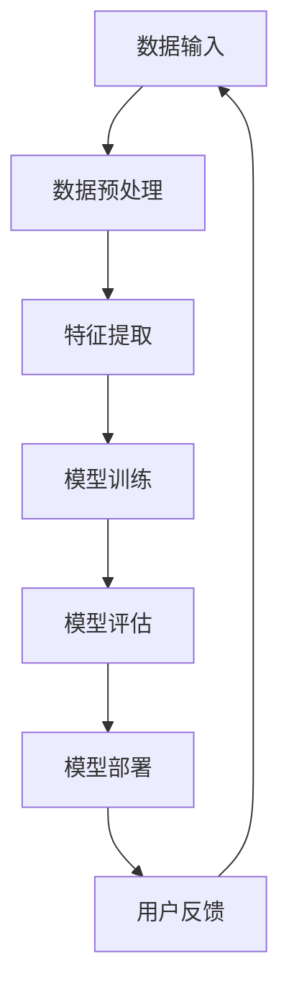

                 

# 《AI大模型在电商平台个性化营销中的应用》

## 关键词
AI大模型、电商平台、个性化营销、用户画像、推荐算法、数学模型、深度学习、协同过滤、内容推荐、个性化策略、案例研究、数据隐私、算法公平性

## 摘要
本文将探讨AI大模型在电商平台个性化营销中的应用，包括AI大模型的基础概念、技术原理、构建方法以及实际案例分析。我们将深入分析用户画像构建、个性化推荐算法和电商平台个性化营销策略，并探讨AI大模型带来的机遇与挑战。通过本文，读者将了解如何利用AI大模型提升电商平台营销效果，实现精准、高效的个性化服务。

---

### 第一部分：AI大模型基础

#### 第1章：AI大模型概述

##### 1.1 AI大模型的核心概念

AI大模型是指具有大规模参数、高度复杂的深度学习模型。这些模型通常基于神经网络架构，能够处理海量数据，并从中提取丰富的特征信息。AI大模型的核心特点包括：

- **大规模参数**：大模型通常拥有数百万甚至数十亿个参数，这使得模型可以捕捉到更加复杂的特征模式。
- **深度神经网络**：大模型采用多层神经网络结构，能够实现特征层次的深度转换和抽象。
- **自动特征学习**：大模型通过反向传播算法自动学习数据中的特征表示，无需人工干预。

在电商平台个性化营销中，AI大模型的应用价值体现在以下几个方面：

- **用户需求分析**：通过分析用户行为数据，AI大模型可以识别用户的兴趣偏好，实现精准的用户需求预测。
- **个性化推荐**：AI大模型可以基于用户画像和商品特征，生成个性化的推荐列表，提高用户购买转化率。
- **营销策略优化**：AI大模型可以帮助电商平台制定个性化营销策略，实现高效的客户转化和留存。

##### 1.2 电商平台个性化营销的挑战

电商平台个性化营销面临以下几大挑战：

- **用户需求的多样性**：电商平台用户需求丰富多样，难以通过单一方法满足所有用户的需求。
- **营销数据的多样性**：电商平台数据类型繁多，包括用户行为数据、商品信息、交易记录等，数据处理复杂。
- **数据隐私保护**：在个性化营销中，用户隐私保护是必须考虑的重要问题，防止数据滥用和隐私泄露。

##### 1.3 AI大模型的基本架构

以下是AI大模型的基本架构，使用Mermaid流程图展示：



**图1-1 AI大模型的基本架构**

1. 数据输入：收集电商平台的用户行为数据、商品信息等。
2. 数据预处理：清洗和处理原始数据，进行数据格式转换和标准化。
3. 特征提取：从原始数据中提取有用的特征信息，用于模型训练。
4. 模型训练：使用深度学习算法训练大模型，调整模型参数以优化性能。
5. 模型评估：评估模型的性能和准确性，进行模型调优。
6. 模型部署：将训练好的模型部署到电商平台，实现实时预测和推荐。
7. 用户反馈：收集用户对推荐和营销策略的反馈，用于进一步优化模型。

#### 第2章：AI大模型技术基础

##### 2.1 机器学习基础

机器学习是AI大模型的核心技术之一。它通过算法和统计方法，从数据中自动学习和发现规律。机器学习的基本概念包括：

- **监督学习**：通过已标记的数据集训练模型，使其能够对新的数据进行预测。
- **无监督学习**：无需标记数据，模型通过自身学习发现数据中的规律和结构。
- **强化学习**：通过与环境的交互，模型不断调整行为策略以最大化回报。

在电商平台个性化营销中，常见的机器学习算法包括：

- **线性回归**：用于预测用户的行为和需求。
- **决策树**：用于分类和预测，能够处理高维数据。
- **支持向量机**：用于分类和回归问题，具有较好的泛化能力。

##### 2.2 深度学习技术

深度学习是机器学习的一种重要分支，它通过构建多层神经网络，实现数据的深度特征提取和表示。深度学习的基本原理包括：

- **神经元和神经网络**：神经元是神经网络的基本单元，通过加权连接实现信息传递和处理。
- **前向传播和反向传播**：前向传播是将输入数据通过神经网络进行层层计算，反向传播是通过误差计算调整网络参数，以优化模型性能。

在电商平台个性化营销中，常用的深度学习算法包括：

- **卷积神经网络（CNN）**：用于图像和视频数据的处理，能够提取丰富的空间特征。
- **循环神经网络（RNN）**：用于序列数据的处理，能够捕捉时间序列的动态特征。
- **生成对抗网络（GAN）**：用于生成新的数据样本，可以用于数据增强和图像生成。

##### 2.3 深度学习算法实现

以下是深度学习算法实现的一个简单示例，使用伪代码展示：

```python
# 伪代码：神经网络实现
class NeuralNetwork:
    def __init__(self):
        # 初始化权重和偏置
        self.weights = np.random.randn(input_size, hidden_size)
        self.biases = np.random.randn(hidden_size)
        
    def forward(self, x):
        # 前向传播
        self.z = np.dot(x, self.weights) + self.biases
        self.a = np.tanh(self.z)
        return self.a
    
    def backward(self, d_loss):
        # 反向传播
        d_z = 1 - self.a**2
        d_w = np.dot(d_loss, d_z)
        d_b = np.sum(d_loss * d_z)
        
        # 更新权重和偏置
        self.weights -= learning_rate * d_w
        self.biases -= learning_rate * d_b
        
    def train(self, x, y):
        # 训练神经网络
        a = self.forward(x)
        d_loss = -np.log(a[y])
        self.backward(d_loss)
```

这个简单的神经网络示例展示了权重和偏置的初始化、前向传播和反向传播的步骤。在实际应用中，可以使用更复杂的神经网络架构和优化算法，以提升模型的性能和准确性。

---

### 第二部分：AI大模型在电商平台的应用

#### 第3章：数学模型与算法原理

##### 3.1 概率论基础

概率论是AI大模型的核心数学基础之一。它用于描述随机事件和概率分布，为模型训练和预测提供理论基础。以下是概率论中的一些基本概念：

- **概率分布函数**：概率分布函数描述了随机变量的概率分布，常用的概率分布包括伯努利分布、正态分布、泊松分布等。
- **贝叶斯理论**：贝叶斯理论是概率论的一个分支，它通过条件概率和全概率公式，提供了推断不确定事件的方法。

在电商平台个性化营销中，概率论的应用包括：

- **用户行为预测**：通过概率分布模型预测用户的行为概率，为推荐算法提供依据。
- **风险控制**：通过概率模型分析用户行为的风险，实现风险控制和欺诈检测。

##### 3.2 优化算法原理

优化算法是AI大模型训练过程中的关键步骤，它用于调整模型参数，以最小化损失函数。以下是几种常用的优化算法：

- **梯度下降算法**：梯度下降算法是最常用的优化算法之一，它通过迭代更新模型参数，沿着损失函数的梯度方向逐步优化模型。
- **随机优化算法**：随机优化算法通过随机搜索策略，全局寻找最优解，包括遗传算法、粒子群优化等。

在电商平台个性化营销中，优化算法的应用包括：

- **模型训练**：通过优化算法调整模型参数，提高模型的预测准确性和泛化能力。
- **营销策略优化**：通过优化算法分析不同营销策略的效果，选择最优的营销策略。

##### 3.3 优化算法实现

以下是梯度下降算法实现的一个简单示例，使用伪代码展示：

```python
# 伪代码：梯度下降算法
def gradient_descent(theta, learning_rate, iterations):
    for i in range(iterations):
        gradient = compute_gradient(theta)
        theta -= learning_rate * gradient
    return theta

def compute_gradient(theta):
    # 计算损失函数关于参数的梯度
    return gradient

theta = initial_theta
theta_optimized = gradient_descent(theta, learning_rate, iterations)
```

这个简单的梯度下降算法示例展示了参数的初始化、梯度的计算和参数的迭代更新。在实际应用中，可以使用更复杂的优化算法和正则化方法，以提升模型的性能和稳定性。

---

### 第三部分：AI大模型在电商平台的具体应用

#### 第4章：用户画像构建

##### 4.1 用户画像的概念

用户画像是指通过对用户行为数据的分析，构建用户的基本特征和行为模式。用户画像的核心目标是实现用户的精准识别和需求预测，为个性化推荐和营销提供基础。

用户画像的基本概念包括：

- **用户属性**：用户的基本信息，如年龄、性别、地域、职业等。
- **行为特征**：用户在电商平台上的行为数据，如浏览记录、购买记录、搜索历史等。
- **兴趣偏好**：用户对特定商品或类别的偏好和兴趣。

用户画像的应用场景包括：

- **个性化推荐**：基于用户画像，为用户提供个性化的商品推荐，提高用户满意度和购买转化率。
- **用户行为分析**：分析用户行为模式，识别用户需求和市场趋势，为电商平台提供决策支持。
- **用户细分**：将用户划分为不同的群体，为每个群体制定个性化的营销策略。

##### 4.2 用户画像构建方法

用户画像的构建方法主要包括以下几个步骤：

1. **数据收集**：收集电商平台上的用户行为数据，包括浏览记录、购买记录、搜索历史等。
2. **数据清洗**：清洗和处理原始数据，去除重复、错误和缺失的数据。
3. **特征工程**：从原始数据中提取有用的特征信息，如用户年龄、浏览时长、购买频率等。
4. **模型训练**：使用机器学习和深度学习算法，训练用户画像模型，提取用户特征。
5. **模型评估**：评估用户画像模型的性能和准确性，进行模型调优。

以下是用户画像构建的示例流程：

1. **数据收集**：收集用户行为数据，如用户浏览记录、购买记录等。
2. **数据清洗**：去除重复和错误的数据，对缺失的数据进行填充或删除。
3. **特征工程**：从原始数据中提取用户特征，如用户年龄、浏览时长、购买频率等。
4. **模型训练**：使用机器学习算法（如决策树、随机森林等）训练用户画像模型。
5. **模型评估**：评估用户画像模型的性能，包括准确率、召回率、F1值等。
6. **模型应用**：将训练好的用户画像模型应用到电商平台，实现用户细分和个性化推荐。

##### 4.3 用户画像案例研究

以下是一个用户画像的案例研究，以某电商平台为例：

1. **数据收集**：电商平台收集了用户的浏览记录、购买记录和搜索历史等数据。
2. **数据清洗**：对数据进行清洗和处理，去除重复和错误的数据，对缺失的数据进行填充或删除。
3. **特征工程**：从原始数据中提取用户特征，如用户年龄、浏览时长、购买频率、搜索关键词等。
4. **模型训练**：使用机器学习算法（如决策树、随机森林等）训练用户画像模型。
5. **模型评估**：评估用户画像模型的性能，包括准确率、召回率、F1值等。
6. **模型应用**：将训练好的用户画像模型应用到电商平台，实现用户细分和个性化推荐。

通过用户画像的构建，电商平台可以更好地了解用户的需求和兴趣，为用户提供个性化的商品推荐和营销策略，提高用户满意度和购买转化率。

---

#### 第5章：个性化推荐算法

##### 5.1 个性化推荐算法概述

个性化推荐算法是电商平台实现个性化服务的关键技术之一。它通过分析用户行为数据，为用户提供个性化的商品推荐，提高用户满意度和购买转化率。

个性化推荐算法的基本原理包括：

- **协同过滤**：通过分析用户之间的行为模式，发现用户的相似性，为用户提供推荐。
- **基于内容的推荐**：通过分析商品的属性和内容，为用户提供相关商品的推荐。

个性化推荐算法的应用场景包括：

- **商品推荐**：为用户提供个性化的商品推荐，提高用户购买转化率和销售业绩。
- **内容推荐**：为用户提供个性化的内容推荐，如新闻、文章、视频等，提高用户留存率和活跃度。

##### 5.2 协同过滤算法

协同过滤算法是一种常见的个性化推荐算法，它通过分析用户之间的行为模式，发现用户的相似性，为用户提供推荐。协同过滤算法的基本原理包括：

- **用户相似度计算**：计算用户之间的相似度，常用的相似度计算方法包括余弦相似度、皮尔逊相关系数等。
- **推荐列表生成**：根据用户相似度计算结果，生成个性化的推荐列表。

协同过滤算法的主要类型包括：

- **基于用户的协同过滤（User-based CF）**：通过分析用户之间的相似性，为用户提供相似的用户的推荐商品。
- **基于物品的协同过滤（Item-based CF）**：通过分析商品之间的相似性，为用户提供与用户历史行为相似的商品。

以下是基于用户的协同过滤算法的一个简单示例：

1. **用户相似度计算**：计算用户之间的相似度，如使用余弦相似度计算用户A和用户B的相似度。

2. **推荐列表生成**：根据用户相似度计算结果，生成个性化的推荐列表。

   假设用户A和用户B的相似度为0.8，则用户A的推荐列表中包含用户B喜欢的商品，如商品C和商品D。

##### 5.3 基于内容的推荐算法

基于内容的推荐算法是一种通过分析商品的属性和内容，为用户提供相关商品推荐的方法。基于内容的推荐算法的基本原理包括：

- **商品特征提取**：从商品的属性和内容中提取特征信息，如商品类别、标签、描述等。
- **相似度计算**：计算用户历史行为商品和待推荐商品的特征相似度。

基于内容的推荐算法的主要类型包括：

- **基于标签的推荐**：通过分析商品的标签信息，为用户提供相关标签商品推荐。
- **基于文本的推荐**：通过分析商品的文本描述，为用户提供相关文本描述商品推荐。

以下是基于内容的推荐算法的一个简单示例：

1. **商品特征提取**：从商品的属性和内容中提取特征信息，如商品类别、标签、描述等。

2. **相似度计算**：计算用户历史行为商品和待推荐商品的特征相似度，如使用余弦相似度计算用户喜欢的商品A和待推荐商品B的相似度。

3. **推荐列表生成**：根据商品相似度计算结果，生成个性化的推荐列表。

   假设用户喜欢的商品A和待推荐商品B的相似度为0.7，则将商品B推荐给用户A。

通过协同过滤算法和基于内容的推荐算法，电商平台可以更好地满足用户的需求，提高用户满意度和购买转化率。

---

#### 第6章：电商平台个性化营销策略

##### 6.1 个性化营销的概念

个性化营销是指通过分析用户行为数据，为用户提供定制化的营销内容和策略，以提高用户满意度和购买转化率。个性化营销的核心目标是实现营销信息的精准投放，最大化营销效果。

个性化营销的基本概念包括：

- **用户细分**：将用户划分为不同的群体，根据用户的特征和行为，制定个性化的营销策略。
- **内容个性化**：根据用户的兴趣和需求，为用户提供个性化的商品推荐和营销内容。
- **渠道个性化**：根据用户的偏好和习惯，选择合适的营销渠道和触达方式。

个性化营销的应用场景包括：

- **商品推荐**：根据用户的行为数据和偏好，为用户提供个性化的商品推荐，提高用户购买转化率。
- **促销活动**：根据用户的历史购买记录和偏好，为用户提供个性化的促销活动，提高用户参与度和购买意愿。
- **广告投放**：根据用户的行为数据和兴趣，为用户提供个性化的广告内容，提高广告的曝光率和转化率。

##### 6.2 个性化营销策略

个性化营销策略主要包括以下几个方面：

1. **用户细分**：将用户划分为不同的群体，如新用户、老用户、高价值用户等，根据用户群体的特征和行为，制定个性化的营销策略。

2. **内容个性化**：根据用户的兴趣和需求，为用户提供个性化的商品推荐、促销活动和营销内容。如为高价值用户提供专属优惠，为新用户推荐热门商品。

3. **渠道个性化**：根据用户的偏好和习惯，选择合适的营销渠道和触达方式。如通过短信、邮件、推送消息等渠道，为用户推送个性化的营销内容。

4. **动态调整**：根据用户的行为反馈和营销效果，动态调整营销策略。如根据用户点击率和购买率，调整商品推荐和促销活动的排序和投放策略。

以下是电商平台个性化营销策略的一个示例：

1. **用户细分**：将用户划分为新用户、老用户和高价值用户，根据不同用户群体的特征和行为，制定个性化的营销策略。

2. **内容个性化**：为新用户提供热门商品推荐和优惠信息，为老用户提供专属优惠和会员活动，为高价值用户提供专属服务和定制化推荐。

3. **渠道个性化**：为新用户发送短信和邮件通知，为老用户推送推送消息和APP通知，为高价值用户发送电话和邮件邀请。

4. **动态调整**：根据用户点击率和购买率，调整商品推荐和促销活动的排序和投放策略，优化营销效果。

通过个性化营销策略，电商平台可以更好地满足用户的需求，提高用户满意度和购买转化率，实现营销效果的最大化。

---

#### 第7章：案例研究

##### 7.1 案例介绍

本案例研究以某大型电商平台为例，探讨如何利用AI大模型实现个性化营销，提高用户满意度和购买转化率。该电商平台拥有庞大的用户基础和丰富的商品数据，通过引入AI大模型，实现了对用户行为的深入分析和个性化推荐。

##### 7.2 案例分析

1. **用户画像构建**

   电商平台首先收集用户的浏览记录、购买记录、搜索历史等数据，经过数据清洗和处理，提取出用户的年龄、性别、地域、职业等基本属性，以及浏览时长、购买频率、搜索关键词等行为特征。然后使用机器学习和深度学习算法，构建用户画像模型，提取用户特征，为个性化推荐和营销提供基础。

2. **个性化推荐算法应用**

   电商平台采用协同过滤算法和基于内容的推荐算法，为用户生成个性化的商品推荐列表。协同过滤算法通过分析用户之间的行为模式，发现用户的相似性，为用户提供相似的用户的推荐商品；基于内容的推荐算法通过分析商品的属性和内容，为用户提供相关商品的推荐。结合两种推荐算法，电商平台实现了对用户的精准推荐，提高了用户的满意度和购买转化率。

3. **个性化营销策略实施**

   电商平台根据用户画像和个性化推荐结果，制定个性化的营销策略。针对新用户，电商平台推送热门商品和优惠券，吸引新用户注册和购买；针对老用户，电商平台推送专属优惠和会员活动，提高用户忠诚度和复购率；针对高价值用户，电商平台提供定制化的服务和推荐，提升用户的购买额度和满意度。

通过AI大模型的应用，电商平台实现了用户行为的深度分析和个性化推荐，提高了用户满意度和购买转化率。同时，电商平台也通过个性化营销策略，提高了用户参与度和忠诚度，实现了营销效果的最大化。

---

#### 第8章：未来展望与挑战

##### 8.1 AI大模型在电商平台个性化营销中的应用前景

随着人工智能技术的不断发展，AI大模型在电商平台个性化营销中的应用前景广阔。未来，AI大模型将在以下几个方面得到进一步发展：

1. **更精确的用户画像构建**：通过引入更多维度的数据（如用户心理特征、情感状态等），AI大模型将实现更精确的用户画像构建，为个性化推荐和营销提供更丰富的数据支持。

2. **多样化推荐算法**：除了协同过滤和基于内容的推荐算法，未来还将出现更多多样化、个性化的推荐算法，以满足不同用户的需求。

3. **智能化营销策略**：AI大模型将实现智能化的营销策略，通过自动调整营销内容和渠道，实现精准投放和高效转化。

4. **跨界合作与生态构建**：电商平台将与其他行业和企业开展跨界合作，构建更广泛的生态体系，实现资源共享和优势互补。

##### 8.2 应用挑战与解决方案

尽管AI大模型在电商平台个性化营销中具有巨大的潜力，但在实际应用过程中，仍面临以下挑战：

1. **数据隐私保护**：个性化营销需要收集和处理大量用户数据，如何确保用户数据的安全和隐私，防止数据泄露，是一个重要的问题。

   **解决方案**：采用数据加密、去识别化等技术手段，确保用户数据的安全；制定严格的隐私政策，明确用户数据的收集、使用和保护规则。

2. **算法公平性和透明性**：个性化推荐和营销算法可能存在偏见和不公平性，如何确保算法的公平性和透明性，是一个重要问题。

   **解决方案**：建立算法审查机制，确保算法设计的公正性和透明性；引入用户反馈机制，及时发现和纠正算法偏见。

3. **技术复杂性和成本**：AI大模型的应用需要较高的技术复杂度和计算资源，如何降低技术门槛和成本，是一个重要的问题。

   **解决方案**：采用云计算和分布式计算等技术，降低计算资源的需求；推动开源生态的发展，降低开发和部署的难度。

4. **用户体验优化**：个性化推荐和营销算法需要不断优化，以提高用户体验和满意度。

   **解决方案**：建立用户体验反馈机制，及时收集用户反馈，优化推荐算法和营销策略；关注用户体验，确保算法和策略的友好性和易用性。

通过应对这些挑战，AI大模型在电商平台个性化营销中的应用将更加广泛和深入，为电商平台带来更高效的运营和更优质的用户体验。

---

### 附录

##### 附录A：常用工具与技术

- **AI大模型开发工具**：TensorFlow、PyTorch、Keras等。
- **数据预处理工具**：Pandas、NumPy、Scikit-learn等。
- **推荐系统框架**：Surprise、LightFM、RecSys等。
- **机器学习库**：Scikit-learn、XGBoost、CatBoost等。

##### 附录B：参考资料

- **推荐阅读**：
  - [Recommender Systems Handbook](https://www.recommenders.org/recommender-systems-handbook/)
  - [Deep Learning Specialization](https://www.deeplearning.ai/)
  - [Machine Learning Mastery](https://machinelearningmastery.com/)
  - [AI Generated Content](https://www.ai-generated-content.com/)

通过本文，读者将了解AI大模型在电商平台个性化营销中的应用原理、方法和实践。希望本文能为从事电商平台个性化营销的从业者提供有益的参考和启示。

---

### 作者

- **作者**：AI天才研究院/AI Genius Institute & 禅与计算机程序设计艺术 /Zen And The Art of Computer Programming

