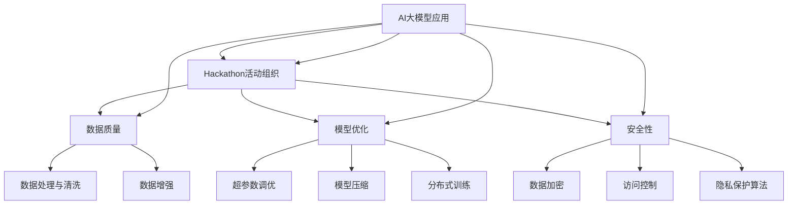

                 

# 《AI大模型应用的hackathon活动组织》

## 关键词

- AI大模型
- hackathon活动
- 活动组织
- 技术应用
- 创新与协作
- 数据质量
- 模型优化
- 安全性与隐私保护

## 摘要

本文旨在探讨AI大模型应用的hackathon活动组织，包括AI大模型的基本概念、hackathon活动的意义与历史、活动组织的基础原则和实践案例。通过详细阐述AI大模型的技术原理、应用场景、开发工具与资源，以及hackathon活动组织的流程、挑战与解决方案，本文旨在为从事AI技术研究和应用的读者提供有价值的参考和指导。

---

### 第一部分：概述与背景

#### 第1章：AI大模型应用概述

#### 1.1 AI大模型的基本概念

AI大模型（Large-scale AI Models），是指参数量巨大、计算复杂度高的神经网络模型，通过对海量数据进行训练，能够实现复杂的数据分析和智能决策。AI大模型通常基于深度学习技术，具有以下特点：

1. **参数量大**：大模型的参数数量通常达到数亿甚至数十亿，能够捕捉数据中的复杂模式。
2. **计算复杂**：大模型的计算量非常庞大，需要高性能计算资源进行训练和推理。
3. **泛化能力强**：通过在大量数据上的训练，大模型能够很好地泛化到未见过的数据集，具有广泛的应用潜力。

AI大模型可以细分为以下几类：

1. **语言模型**：如GPT-3、BERT等，主要用于自然语言处理任务。
2. **计算机视觉模型**：如ResNet、VGG等，用于图像识别、分类等任务。
3. **多模态模型**：能够处理多种类型的数据，如视频、音频、图像等。

#### 1.2 hackathon的概念与历史

hackathon，起源于硅谷，是一种以团队协作、快速开发和原型展示为特点的技术竞赛活动。hackathon通常由一个或多个主题，参与者围绕这些主题进行软件开发、数据分析和创新解决方案的提出。

hackathon的历史可以追溯到1999年的“Google Challenge”，这是一个为Google公司新员工举办的编程竞赛。自此之后，hackathon逐渐在科技界流行起来，成为一种重要的创新和协作方式。

#### 1.3 AI大模型与hackathon的结合意义

AI大模型与hackathon的结合，具有重要的意义和潜力：

1. **促进AI技术的实际应用**：hackathon提供了一个平台，让参与者能够将AI大模型应用于实际问题，推动技术向实际应用的转化。
2. **提升团队的协作能力**：hackathon强调团队协作，通过短期的集中研发，能够显著提升团队成员的协作能力和技术水平。
3. **发现和培养AI人才**：hackathon活动为AI领域的新人和有志之士提供了一个展示自己才华的舞台，有助于发现和培养优秀的AI人才。

#### 1.4本章小结

本章介绍了AI大模型的基本概念和hackathon的概念与历史，阐述了AI大模型与hackathon结合的意义。通过对本章内容的了解，读者可以初步了解AI大模型和hackathon的基本情况，为后续章节的深入学习打下基础。

---

### 第二部分：hackathon活动组织基础

#### 第2章：hackathon活动组织基础

#### 2.1 hackathon活动目标与规划

hackathon活动的目标与规划是组织成功的关键。以下是从活动目标、时间规划、地点选择等方面进行详细讨论。

##### 2.1.1 确定活动目标

活动目标的明确性直接影响到hackathon的整体效果。常见的活动目标包括：

1. **技术创新**：鼓励参与者提出创新的AI解决方案。
2. **协作学习**：通过团队合作，提升参与者的技术能力和协作精神。
3. **解决方案展示**：提供展示创新项目的机会，吸引投资和关注。
4. **人才发掘**：挖掘和培养有潜力的AI人才。

在确定目标时，需要考虑以下几个方面：

- **受众群体**：根据活动的目标受众，如学生、专业人士或跨领域从业者，设定相应目标。
- **资源限制**：考虑可用资源，如资金、时间和人力资源，确保目标的可实现性。
- **预期成果**：设定具体可量化的预期成果，如项目完成度、创新程度等。

##### 2.1.2 活动时间规划

活动时间规划是确保hackathon顺利进行的关键。以下是一些关键的时间节点：

1. **筹备阶段**：在活动开始前几周，完成活动策划、资源筹备和参与者招募。
2. **启动阶段**：在活动开始时，进行开幕式、主题发布和技术介绍。
3. **开发阶段**：在活动进行过程中，参与者进行项目开发，进行技术交流和问题解决。
4. **展示阶段**：在活动结束时，进行项目展示、评审和颁奖。

时间规划需要考虑以下几点：

- **活动时长**：通常，hackathon的时长为1-2天，以保证参与者有充足的时间进行项目开发。
- **休息与交流**：合理安排休息时间和交流环节，以促进参与者之间的互动和协作。
- **评审时间**：确保评审环节有足够的时间，以便对每个项目进行公正和详细的评审。

##### 2.1.3 地点选择

地点选择对于hackathon的成功至关重要。以下是一些地点选择的关键因素：

1. **交通便利**：选择交通便利的地点，以便参与者能够轻松到达。
2. **基础设施**：确保地点拥有充足的技术设施，如网络、电源和会议室等。
3. **环境舒适**：选择环境舒适、便于参与者集中精力工作的地点。
4. **餐饮供应**：提供良好的餐饮供应，以确保参与者在活动期间能够得到充分的营养。

##### 2.1.4 活动预算

活动预算是hackathon组织中的重要一环。以下是一些常见的预算项目：

1. **场地费用**：包括场地租赁、装修和设备使用费。
2. **餐饮费用**：包括参与者用餐、茶歇和饮料。
3. **技术支持费用**：包括技术专家、网络设备和服务器租赁费。
4. **宣传费用**：包括宣传材料、网站开发和推广费用。
5. **奖品费用**：包括奖金、证书和其他奖励。

在制定预算时，需要考虑以下几点：

- **成本效益**：确保预算合理，能够最大限度地利用资源。
- **优先级**：根据活动目标，确定各项费用的优先级。
- **预算调整**：根据实际情况，及时调整预算计划。

##### 2.1.5 活动宣传

活动宣传是吸引参与者、提高活动知名度的重要手段。以下是一些宣传策略：

1. **线上宣传**：通过社交媒体、专业论坛、博客等渠道发布活动信息和进展。
2. **线下宣传**：在校园、公司、技术会议等场合进行宣传，吸引目标参与者。
3. **合作伙伴**：与相关机构和组织建立合作，共同推广活动。
4. **媒体报道**：邀请媒体报道活动，提高活动的公众影响力。

##### 2.1.6 本章小结

本章介绍了hackathon活动目标与规划的重要性，包括确定活动目标、时间规划、地点选择、活动预算和宣传策略。通过本章的学习，读者可以掌握hackathon活动组织的基础知识，为后续章节的深入学习奠定基础。

---

#### 第2章：hackathon活动组织基础（续）

#### 2.2 参与者的招募与培训

在hackathon活动中，参与者的招募与培训是确保活动顺利进行的关键环节。以下将从参与者资格要求、招募渠道、培训内容和效果评估等方面进行详细讨论。

##### 2.2.1 参与者资格要求

确定参与者的资格要求是确保活动质量和安全的基础。以下是一些常见的参与者资格要求：

1. **专业技能**：根据活动的主题和需求，设定相应的技术背景和专业技能要求。例如，对于AI大模型应用相关的活动，可以要求参与者具备机器学习、深度学习等相关知识。
2. **团队协作能力**：hackathon强调团队合作，因此参与者的团队协作能力也是重要的评估标准。可以通过面试或团队协作测试来评估参与者的团队协作能力。
3. **时间投入**：确保参与者有足够的时间投入到活动中，避免因为时间冲突而影响活动的顺利进行。
4. **年龄和学历**：虽然大多数hackathon活动不限制参与者的年龄和学历，但考虑到某些专业领域的限制，可以在招募时设定相应的条件。

##### 2.2.2 招募渠道

招募渠道的选择直接影响到参与者的数量和质量。以下是一些常见的招募渠道：

1. **线上招募**：通过社交媒体平台（如Facebook、LinkedIn、Twitter等）、技术论坛（如GitHub、Stack Overflow等）和专业社区发布招募信息，吸引有志参与者的关注。
2. **线下活动**：在校园、技术会议、行业展会等场合设立招募点，直接与潜在参与者接触，进行面对面沟通。
3. **合作伙伴**：与相关机构和组织合作，通过他们的资源和影响力进行招募。
4. **内部推荐**：鼓励现有团队成员推荐合适的候选人，提高招募效率。

##### 2.2.3 培训内容

为了确保参与者具备开展hackathon活动所需的基本技能和知识，培训内容通常包括以下几个方面：

1. **技术培训**：根据活动的主题，为参与者提供相关技术的培训，如深度学习、自然语言处理、计算机视觉等。培训可以采用在线课程、讲座、workshop等形式。
2. **项目管理**：教授参与者项目管理的知识，包括项目计划、任务分配、时间管理、风险管理等，以提高团队的协作效率。
3. **创新思维**：培养参与者的创新思维，鼓励他们提出新颖的解决方案，通过头脑风暴、思维导图等方法进行训练。
4. **团队协作**：通过团队建设活动、协作游戏等，增强团队成员之间的信任和沟通，提高团队协作能力。

##### 2.2.4 培训效果评估

为了确保培训的有效性，需要对培训效果进行评估。以下是一些常见的评估方法：

1. **问卷调查**：在培训结束后，通过问卷调查收集参与者的反馈，了解他们对培训内容的满意度、收获和改进建议。
2. **技能测试**：通过笔试、面试或实际操作等方式，评估参与者在培训后掌握的技术技能。
3. **项目评审**：在培训后，参与者将参与实际项目，通过项目的完成情况和成果来评估培训效果。
4. **跟踪访谈**：在培训后的一段时间内，对参与者进行跟踪访谈，了解他们在实际工作中的应用情况，进一步评估培训效果。

##### 2.2.5 本章小结

本章介绍了hackathon活动参与者的招募与培训的重要性，包括参与者资格要求、招募渠道、培训内容和效果评估。通过本章的学习，读者可以掌握参与者招募与培训的基本知识和方法，为成功组织hackathon活动打下基础。

---

#### 第2章：hackathon活动组织基础（续）

#### 2.3 活动内容与流程设计

hackathon活动的成功不仅依赖于优秀的组织和管理，还需要精心设计活动内容和流程。以下将从活动流程、任务分配和时间安排等方面进行详细讨论。

##### 2.3.1 活动流程

一个典型的hackathon活动流程可以分为以下几个阶段：

1. **启动阶段**：活动开始时，主持人宣布活动规则、目标和时间安排，介绍评审标准和奖项设置，激发参与者的热情和动力。
2. **准备阶段**：参与者分组，选择项目主题和方向，确定团队成员，开始进行技术调研和方案设计。
3. **开发阶段**：参与者围绕项目主题进行实际开发，利用现有资源和知识，解决技术难题，不断迭代和优化项目。
4. **展示阶段**：在活动结束时，每个团队展示自己的项目成果，评审团根据项目的创新性、技术实现和实际效果进行评审。
5. **颁奖阶段**：根据评审结果，颁发奖项，对优秀团队和个人进行表彰。

##### 2.3.2 任务分配

在hackathon活动中，任务分配是确保项目顺利进行的关键。以下是一些常见的任务分配方法：

1. **角色分配**：根据团队成员的专业技能和兴趣爱好，分配不同的角色，如项目经理、技术专家、UI设计师等，确保每个成员都有明确的职责和任务。
2. **任务分解**：将整个项目分解为若干个子任务，明确每个子任务的目标、负责人和完成时间，确保项目进度可控。
3. **协作工具**：使用协作工具（如Trello、Jira等）进行任务管理和追踪，确保团队成员之间的沟通和协作。

##### 2.3.3 时间安排

合理的时间安排是确保hackathon活动顺利进行的重要保障。以下是一些常见的时间安排方法：

1. **活动总时长**：通常，hackathon的时长为1-2天，以确保参与者有足够的时间进行项目开发和展示。
2. **阶段时长**：根据活动的实际情况，合理划分各个阶段的时长，如启动阶段30分钟、准备阶段2小时、开发阶段8小时、展示阶段2小时、颁奖阶段30分钟。
3. **休息时间**：合理安排休息时间，如每2小时安排一次10分钟的短暂休息，以及活动结束前的30分钟休息时间，以缓解参与者的疲劳。
4. **时间跟踪**：使用时间跟踪工具（如Toggl、RescueTime等）记录参与者的工作时间，确保项目进度和质量。

##### 2.3.4 活动内容设计

活动内容的设计是hackathon活动的核心，以下是一些常见的活动内容设计方法：

1. **主题选择**：根据当前热门技术趋势和应用场景，选择具有挑战性和实用性的主题，以激发参与者的兴趣和创造力。
2. **任务设置**：设计具有实际意义的任务，如基于AI大模型的应用开发、数据挖掘、算法优化等，以培养参与者的技术能力。
3. **评审标准**：制定明确的评审标准，如创新性、技术实现、实用性、用户体验等，以确保评审的公正性和客观性。
4. **展示形式**：设计多种展示形式，如PPT演示、视频展示、现场演示等，以充分展示项目的成果和特点。

##### 2.3.5 本章小结

本章介绍了hackathon活动内容与流程设计的重要性，包括活动流程、任务分配和时间安排。通过本章的学习，读者可以掌握hackathon活动内容与流程设计的基本方法和技巧，为成功组织hackathon活动提供指导。

---

### 第三部分：AI大模型应用实践

#### 第3章：AI大模型技术基础

AI大模型技术是近年来人工智能领域的重要进展，其广泛应用带来了巨大的社会和经济效益。本章将介绍AI大模型技术的基础知识，包括深度学习基础、自然语言处理技术、计算机视觉技术以及大规模预训练模型。

#### 3.1 深度学习基础

深度学习是一种模拟人脑神经网络结构的信息处理方法，通过多层神经网络对数据进行特征提取和学习，从而实现复杂的模式识别和预测任务。深度学习的基础包括以下几个方面：

##### 3.1.1 神经网络的基本结构

神经网络由多个神经元（或节点）组成，每个神经元通过加权连接与其他神经元相连。神经网络的基本结构包括输入层、隐藏层和输出层。

1. **输入层**：接收输入数据，每个输入数据对应一个神经元。
2. **隐藏层**：对输入数据进行处理和特征提取，隐藏层可以有多个，每个隐藏层的神经元数量可以根据任务需求进行调整。
3. **输出层**：输出预测结果或分类结果。

##### 3.1.2 前向传播与反向传播

深度学习中的训练过程主要包括前向传播和反向传播两个阶段。

1. **前向传播**：将输入数据通过神经网络逐层传递，直到输出层，计算输出结果。
2. **反向传播**：根据输出结果与实际结果的误差，反向传播误差，通过梯度下降法调整神经网络的权重。

##### 3.1.3 激活函数

激活函数用于将神经网络的输出映射到某个范围，常用的激活函数包括：

1. **Sigmoid函数**：将输入映射到(0, 1)区间。
2. **ReLU函数**：将输入大于0的部分映射为自身，小于0的部分映射为0。
3. **Tanh函数**：将输入映射到(-1, 1)区间。

激活函数的选择会影响神经网络的收敛速度和性能。

#### 3.2 自然语言处理技术

自然语言处理（NLP）是人工智能的一个重要分支，旨在使计算机能够理解、处理和生成自然语言。NLP的关键技术包括词嵌入、序列模型和注意力机制。

##### 3.2.1 词嵌入

词嵌入是一种将自然语言中的词汇映射到高维向量空间的方法，常见的词嵌入方法包括：

1. **Word2Vec**：通过计算词语在文本中的共现关系来学习词向量。
2. **GloVe**：基于词频和词的上下文信息来学习词向量。

词嵌入技术为NLP任务提供了有效的特征表示。

##### 3.2.2 序列模型

序列模型用于处理序列数据，如文本、语音等。常见的序列模型包括：

1. **循环神经网络（RNN）**：能够处理变长的序列数据，通过隐藏状态来捕捉序列信息。
2. **长短时记忆网络（LSTM）**：通过引入门控机制，解决RNN的梯度消失和梯度爆炸问题。
3. **门控循环单元（GRU）**：LSTM的简化版本，计算更为高效。

##### 3.2.3 注意力机制

注意力机制用于捕捉序列数据中的关键信息，通过计算不同位置的权重，使模型能够关注到最重要的信息。常见的注意力机制包括：

1. **自注意力**：每个位置都与其他所有位置相关联。
2. **多头注意力**：将输入序列拆分成多个子序列，分别计算注意力权重。
3. **位置编码**：通过编码序列的位置信息，使模型能够理解序列的顺序。

注意力机制广泛应用于NLP任务，如机器翻译、文本分类等。

#### 3.3 计算机视觉技术

计算机视觉技术旨在使计算机能够像人类一样理解和处理图像信息。计算机视觉的关键技术包括图像处理、目标检测、图像分类等。

##### 3.3.1 图像处理

图像处理是对图像进行变换和处理的一系列技术，包括：

1. **滤波**：通过滤波器对图像进行卷积操作，用于去除噪声、边缘检测等。
2. **特征提取**：从图像中提取具有区分性的特征，如边缘、角点、纹理等。
3. **图像分割**：将图像划分为不同的区域，用于对象检测、分类等任务。

##### 3.3.2 目标检测

目标检测是计算机视觉中的一个重要任务，旨在检测图像中的目标物体。常见的目标检测算法包括：

1. **滑动窗口**：将不同大小和位置的窗口在图像上滑动，检测每个窗口中的目标。
2. **区域建议网络**：如Faster R-CNN、SSD、YOLO等，通过特征提取和分类网络检测图像中的目标。
3. **分割网络**：如Mask R-CNN，将目标检测与图像分割相结合，同时检测目标和边界。

##### 3.3.3 图像分类

图像分类是将图像划分为预定义的类别，常见的方法包括：

1. **传统机器学习算法**：如支持向量机（SVM）、朴素贝叶斯（NB）等，通过训练分类器进行图像分类。
2. **深度学习算法**：如卷积神经网络（CNN），通过训练神经网络进行图像分类。

#### 3.4 大规模预训练模型

大规模预训练模型是通过在大规模数据集上进行预训练，使模型具有更好的泛化能力和适应性。常见的预训练模型包括：

1. **BERT**：基于Transformer架构，预训练用于自然语言理解任务。
2. **GPT**：基于Transformer架构，预训练用于自然语言生成任务。
3. **ViT**：基于Vision Transformer架构，预训练用于图像分类任务。

大规模预训练模型在多个领域取得了显著的性能提升，推动了人工智能的发展。

#### 3.5 本章小结

本章介绍了AI大模型技术的基础知识，包括深度学习基础、自然语言处理技术、计算机视觉技术以及大规模预训练模型。通过本章的学习，读者可以了解AI大模型的基本原理和应用场景，为后续的实践应用打下基础。

---

### 第三部分：AI大模型应用实践（续）

#### 第4章：AI大模型应用案例解析

在AI大模型的应用领域，许多行业和领域已经取得了显著的成果。本章将分析几个典型的AI大模型应用案例，包括机器翻译、计算机视觉和智能客服等，探讨其应用场景、开发环境、源代码实现以及代码解读与分析。

#### 4.1 机器翻译应用案例

机器翻译是AI大模型应用的一个典型领域，通过模型将一种语言的文本翻译成另一种语言。以下是一个基于AI大模型的机器翻译应用案例。

**1. 应用场景：**

机器翻译广泛应用于跨语言沟通、全球化业务、多语言内容创建等领域。例如，在国际会议上，翻译人员可以使用AI大模型实时翻译演讲内容，提高沟通效率。

**2. 开发环境：**

语言：Python

框架：TensorFlow

**3. 源代码实现：**

以下是一个简单的机器翻译源代码实现，基于Seq2Seq模型。

```python
import tensorflow as tf
from tensorflow.keras.preprocessing.sequence import pad_sequences
from tensorflow.keras.layers import Embedding, LSTM, Dense

# 准备数据
input_texts = ['Hello', 'How are you?']
target_texts = ['你好', '你好吗？']

# 数据预处理
input_sequences = pad_sequences([tokenizer.texts_to_sequences(text) for text in input_texts], maxlen=max_length, padding='post')
target_sequences = pad_sequences([tokenizer.texts_to_sequences(text) for text in target_texts], maxlen=max_length, padding='post')

# 构建模型
model = tf.keras.Sequential([
    Embedding(vocabulary_size, embedding_dim, input_length=max_length),
    LSTM(units, dropout=0.2, recurrent_dropout=0.2),
    Dense(vocabulary_size, activation='softmax')
])

# 编译模型
model.compile(optimizer='adam', loss='categorical_crossentropy', metrics=['accuracy'])

# 训练模型
model.fit(input_sequences, target_sequences, epochs=10, batch_size=32)

# 预测与翻译
predictions = model.predict(input_sequences)
translated_texts = decode_predictions(predictions)

# 显示翻译结果
for i in range(len(input_texts)):
    print(f"Original: {input_texts[i]}")
    print(f"Translated: {translated_texts[i]}")
```

**4. 代码解读与分析：**

- 数据预处理：将输入和目标文本序列化为数字序列，并填充到最大长度。
- 模型构建：创建一个序列到序列的翻译模型，包括嵌入层、LSTM层和全连接层。
- 模型编译：设置优化器、损失函数和评估指标。
- 模型训练：使用准备好的数据训练模型。
- 预测与翻译：使用训练好的模型对输入文本进行预测，并将预测结果解码为翻译文本。

#### 4.2 计算机视觉应用案例

计算机视觉是AI大模型应用的另一个重要领域，通过模型对图像进行识别、分类和目标检测等任务。以下是一个基于AI大模型的计算机视觉应用案例。

**1. 应用场景：**

计算机视觉在安防监控、自动驾驶、医疗影像分析等领域有着广泛的应用。例如，在自动驾驶中，计算机视觉模型可以用于实时检测道路上的行人和车辆。

**2. 开发环境：**

语言：Python

框架：PyTorch

**3. 源代码实现：**

以下是一个简单的计算机视觉源代码实现，基于Faster R-CNN模型。

```python
import torch
import torchvision
from torchvision import transforms
from torchvision.models.detection import fasterrcnn_resnet50_fpn

# 加载预训练模型
model = torchvision.models.detection.fasterrcnn_resnet50_fpn(pretrained=True)

# 定义数据预处理函数
transform = transforms.Compose([
    transforms.ToTensor(),
])

# 加载测试图像
image = load_image('test_image.jpg')

# 数据预处理
image = transform(image)

# 将图像输入到模型中
with torch.no_grad():
    prediction = model(image)

# 解析预测结果
boxes = prediction['boxes']
labels = prediction['labels']
scores = prediction['scores']

# 显示检测结果
display_detections(image, boxes, labels, scores)
```

**4. 代码解读与分析：**

- 导入预训练的目标检测模型。
- 定义数据预处理函数，将图像转换为张量格式。
- 加载测试图像，并进行预处理。
- 将预处理后的图像输入到模型中，获得预测结果。
- 解析预测结果，包括边界框、标签和置信度。

#### 4.3 智能客服应用案例

智能客服是AI大模型应用的又一个重要领域，通过模型实现自动化的客户服务。以下是一个基于AI大模型的智能客服应用案例。

**1. 应用场景：**

智能客服广泛应用于电商、金融、电信等行业，通过自动化的问答系统解决客户的常见问题，提高客户服务效率。

**2. 开发环境：**

语言：Python

框架：TensorFlow

**3. 源代码实现：**

以下是一个简单的智能客服源代码实现，基于Transformer模型。

```python
import tensorflow as tf
from tensorflow.keras.preprocessing.sequence import pad_sequences
from tensorflow.keras.layers import Embedding, Transformer, Dense

# 准备数据
questions = ['How do I reset my password?', 'What is your return policy?']
answers = ['To reset your password, follow these steps...', 'Our return policy is as follows...']

# 数据预处理
input_sequences = pad_sequences([tokenizer.texts_to_sequences(text) for text in questions], maxlen=max_length, padding='post')
target_sequences = pad_sequences([tokenizer.texts_to_sequences(text) for text in answers], maxlen=max_length, padding='post')

# 构建模型
model = tf.keras.Sequential([
    Embedding(vocabulary_size, embedding_dim, input_length=max_length),
    Transformer(num_heads, d_model, dff, input_length=max_length, name='transformer'),
    Dense(vocabulary_size, activation='softmax')
])

# 编译模型
model.compile(optimizer='adam', loss='categorical_crossentropy', metrics=['accuracy'])

# 训练模型
model.fit(input_sequences, target_sequences, epochs=10, batch_size=32)

# 预测与回复
predicted_sequences = model.predict(input_sequences)
predicted_answers = decode_predictions(predicted_sequences)

# 显示回复
for i in range(len(questions)):
    print(f"Question: {questions[i]}")
    print(f"Predicted Answer: {predicted_answers[i]}")
```

**4. 代码解读与分析：**

- 数据预处理：将问题和答案序列化为数字序列，并填充到最大长度。
- 模型构建：创建一个序列到序列的翻译模型，包括嵌入层、Transformer层和全连接层。
- 模型编译：设置优化器、损失函数和评估指标。
- 模型训练：使用准备好的数据训练模型。
- 预测与回复：使用训练好的模型对输入问题进行预测，并将预测结果解码为回复文本。

#### 4.4 本章小结

本章通过三个AI大模型应用案例，展示了机器翻译、计算机视觉和智能客服等领域的应用场景、开发环境、源代码实现和代码解读与分析。通过这些案例，读者可以更好地理解AI大模型的应用方法和实际效果，为未来的AI项目开发提供参考和灵感。

---

### 第三部分：AI大模型应用实践（续）

#### 第5章：AI大模型应用中的挑战与解决方案

尽管AI大模型在各个领域取得了显著的成果，但在实际应用过程中仍然面临许多挑战。本章将讨论AI大模型应用中的一些常见挑战，包括数据质量、模型优化、安全性与隐私保护等方面的解决方案。

#### 5.1 数据质量

数据质量是AI大模型应用中至关重要的一环。高质量的数据有助于提高模型的性能和可靠性，而低质量的数据则可能导致模型过拟合、泛化能力差等问题。以下是一些常见的数据质量问题和解决方案：

##### 5.1.1 数据缺失

数据缺失是数据质量问题中常见的问题，可能影响模型的训练效果。以下是一些解决方案：

1. **删除缺失值**：对于少量缺失值，可以选择删除含有缺失值的样本，以减少对模型训练的影响。
2. **填充缺失值**：对于大量缺失值，可以选择填充缺失值，常用的方法包括均值填充、中值填充和插值等。
3. **使用模型填补缺失值**：可以使用机器学习模型，如回归模型、神经网络等，预测缺失值并进行填充。

##### 5.1.2 数据噪声

数据噪声是指数据中的随机错误或异常值，可能影响模型的训练效果。以下是一些解决方案：

1. **过滤噪声**：可以使用滤波器或平滑算法，如均值滤波、中值滤波等，去除数据中的噪声。
2. **使用鲁棒算法**：可以使用鲁棒算法，如RANSAC（随机样本一致性）、L1正则化等，提高模型对噪声的抵抗能力。
3. **数据增强**：通过增加数据的多样性，提高模型对噪声的适应能力。

##### 5.1.3 数据不平衡

数据不平衡是指数据集中某些类别的样本数量远少于其他类别，可能影响模型的性能。以下是一些解决方案：

1. **过采样**：通过复制少数类别的样本，增加其数量，使数据集更加平衡。
2. **欠采样**：通过删除多数类别的样本，减少其数量，使数据集更加平衡。
3. **合成样本**：使用生成模型，如生成对抗网络（GAN），合成新的样本，增加少数类别的样本数量。

#### 5.2 模型优化

模型优化是提高AI大模型性能的关键环节。以下是一些常见的模型优化方法和技巧：

##### 5.2.1 模型架构优化

1. **网络结构优化**：通过改进神经网络的结构，如使用卷积神经网络（CNN）、循环神经网络（RNN）、Transformer等，提高模型的性能。
2. **模型融合**：通过融合多个模型，如深度学习模型、强化学习模型等，提高模型的性能和鲁棒性。

##### 5.2.2 模型训练优化

1. **学习率调整**：通过调整学习率，如使用学习率衰减策略，提高模型的训练效果。
2. **批量大小调整**：通过调整批量大小，如使用小批量训练，提高模型的性能和泛化能力。
3. **正则化**：通过使用正则化技术，如L1正则化、L2正则化等，防止模型过拟合。

##### 5.2.3 模型推理优化

1. **模型压缩**：通过模型压缩技术，如权重剪枝、量化等，减少模型的参数数量和计算量，提高模型的推理速度。
2. **模型加速**：通过使用高性能计算硬件，如GPU、TPU等，加速模型的推理过程。

#### 5.3 安全性与隐私保护

AI大模型应用中的安全性与隐私保护是至关重要的问题。以下是一些常见的安全性与隐私保护方法和技巧：

##### 5.3.1 数据安全

1. **数据加密**：对数据进行加密处理，防止数据在传输和存储过程中被窃取或篡改。
2. **访问控制**：通过设置访问控制策略，限制只有授权用户可以访问数据。
3. **数据备份与恢复**：定期备份数据，确保在数据丢失或损坏时可以快速恢复。

##### 5.3.2 模型安全

1. **模型验证**：对模型进行验证，确保模型的输出结果符合预期，防止模型被恶意攻击。
2. **模型加固**：通过使用加密技术、混淆技术等，防止模型被篡改或窃取。
3. **模型审计**：对模型进行审计，确保模型的训练过程和输出结果符合法律法规和道德规范。

##### 5.3.3 隐私保护

1. **数据脱敏**：对敏感数据进行脱敏处理，如使用伪名、加密等，防止个人隐私泄露。
2. **匿名化处理**：对个人数据进行匿名化处理，消除个人身份信息，保护个人隐私。
3. **隐私保护算法**：使用隐私保护算法，如差分隐私、同态加密等，确保在数据处理过程中保护个人隐私。

#### 5.4 本章小结

本章讨论了AI大模型应用中的挑战与解决方案，包括数据质量、模型优化、安全性与隐私保护等方面的内容。通过本章的学习，读者可以更好地应对AI大模型应用中的挑战，提高模型的性能和可靠性，确保数据的安全与隐私。

---

### 第四部分：hackathon活动组织与实施

#### 第6章：hackathon活动组织与实施

hackathon活动是一项复杂而富有挑战性的任务，需要从多个方面进行精心策划和执行。本章将详细介绍hackathon活动的组织与实施过程，包括筹备、启动、实施、管理和总结等阶段。

#### 6.1 活动筹备

活动筹备是hackathon活动组织的第一步，主要包括以下几个方面：

##### 6.1.1 活动策划

活动策划是hackathon活动组织的基础，需要明确活动的目标、主题、时间、地点、参与者要求和活动内容等。以下是一些关键点：

1. **活动目标**：明确活动的目标，如技术创新、团队协作、人才培养等。
2. **活动主题**：选择具有挑战性和吸引力的主题，激发参与者的兴趣。
3. **活动时间**：确定活动的时间，如周末、节假日等，确保参与者有足够的时间参与。
4. **活动地点**：选择合适的地点，如大学校园、科技园区、酒店等，确保地点具有足够的空间和设施。
5. **参与者要求**：明确参与者的资格要求，如专业背景、工作经验等。
6. **活动内容**：设计丰富的活动内容，如项目开发、技术讲座、比赛等。

##### 6.1.2 资源筹备

资源筹备是确保hackathon活动顺利进行的重要保障，主要包括以下几个方面：

1. **资金**：根据活动规模和需求，筹备足够的资金，用于场地租赁、设备采购、奖品发放等。
2. **人力**：组织一支专业的活动团队，包括活动策划、组织、技术支持、后勤保障等。
3. **技术资源**：准备必要的技术资源，如服务器、数据库、开发工具等，为参与者提供技术支持。
4. **宣传资源**：准备宣传材料，如海报、宣传册、网站等，用于宣传活动和吸引参与者。

##### 6.1.3 活动宣传

活动宣传是吸引参与者、提高活动知名度的重要手段。以下是一些宣传策略：

1. **线上宣传**：利用社交媒体、博客、专业论坛等渠道发布活动信息，吸引有志参与者的关注。
2. **线下宣传**：在学校、公司、技术会议等场合进行宣传，吸引目标参与者。
3. **合作宣传**：与相关机构和组织合作，共同推广活动，扩大影响力。
4. **媒体报道**：邀请媒体报道活动，提高活动的公众影响力。

#### 6.2 活动启动

活动启动是hackathon活动的开始，主要包括以下几个方面：

##### 6.2.1 活动启动仪式

活动启动仪式是hackathon活动的重要环节，通过仪式的举办，正式宣告活动的开始，激发参与者的热情和动力。以下是一些关键点：

1. **主持人致辞**：由活动主持人宣布活动开始，介绍活动规则和注意事项。
2. **主题发布**：发布活动主题，明确活动的目标和方向。
3. **嘉宾演讲**：邀请相关领域的专家进行主题演讲，分享最新的技术趋势和应用案例。
4. **团队组建**：引导参与者分组，选择项目主题和方向，组建团队。

##### 6.2.2 技术介绍

技术介绍是为了让参与者了解活动所需的技术背景和开发工具，提高他们的技术能力和项目开发效率。以下是一些关键点：

1. **技术讲解**：由技术专家对相关技术进行讲解，包括AI大模型、深度学习、自然语言处理等。
2. **工具展示**：展示常用的开发工具和资源，如TensorFlow、PyTorch、Keras等。
3. **实战演练**：组织参与者进行技术实战演练，提高他们的动手能力和解决问题的能力。

#### 6.3 活动实施

活动实施是hackathon活动的核心阶段，主要包括以下几个方面：

##### 6.3.1 项目开发

项目开发是参与者围绕活动主题进行项目开发的阶段。以下是一些关键点：

1. **项目规划**：制定项目计划，明确项目的目标、任务和进度。
2. **技术调研**：对项目所需的技术进行调研，了解相关的技术原理和应用案例。
3. **代码编写**：编写项目代码，实现项目的功能和技术要求。
4. **测试与优化**：对项目进行测试和优化，确保项目的稳定性和性能。

##### 6.3.2 技术交流

技术交流是参与者之间进行技术讨论和交流的阶段，通过交流，参与者可以相互学习、分享经验、解决技术难题。以下是一些关键点：

1. **专题讨论**：组织专题讨论，围绕技术热点和难点进行深入讨论。
2. **代码共享**：鼓励参与者分享自己的代码和经验，促进知识的传播和共享。
3. **问题解答**：邀请技术专家和导师进行现场答疑，帮助参与者解决技术问题。

##### 6.3.3 活动管理

活动管理是确保hackathon活动顺利进行的重要保障，主要包括以下几个方面：

1. **现场管理**：组织活动现场的布置、设备调试、物资供应等，确保活动现场的秩序和整洁。
2. **人员管理**：对活动参与者进行管理，确保参与者按照活动规则和安排参与活动。
3. **安全保障**：确保活动现场的安全，包括消防安全、食品安全、网络安全等。

#### 6.4 活动总结

活动总结是hackathon活动的最后一个阶段，通过对活动的总结和评估，总结活动的经验教训，为今后的活动提供参考和改进。以下是一些关键点：

##### 6.4.1 活动总结报告

活动总结报告是对整个活动的总结和回顾，包括活动目标、活动过程、活动成果、活动不足等。以下是一些关键点：

1. **活动目标达成情况**：总结活动目标是否实现，对活动的效果进行评估。
2. **活动过程回顾**：回顾活动过程中的亮点和不足，分析活动中的问题。
3. **活动成果总结**：总结活动的成果，包括技术成果、团队成果、个人成果等。
4. **活动不足与改进**：分析活动中的不足，提出改进措施，为今后的活动提供参考。

##### 6.4.2 参与者反馈

参与者反馈是收集参与者对活动的意见和建议，了解他们对活动的满意度，为今后的活动提供改进方向。以下是一些关键点：

1. **满意度调查**：通过问卷调查、访谈等方式收集参与者的满意度。
2. **意见收集**：鼓励参与者提出对活动的意见和建议，为今后的活动提供参考。
3. **反馈分析**：对参与者的反馈进行分析，总结活动中的问题和不足。

##### 6.4.3 活动评估

活动评估是对活动的整体效果进行评估，包括活动目标、活动过程、活动成果等方面。以下是一些关键点：

1. **活动目标评估**：评估活动目标是否实现，对活动目标的达成情况进行评估。
2. **活动过程评估**：评估活动过程的质量和效率，包括活动现场的组织、管理、服务等方面。
3. **活动成果评估**：评估活动的成果，包括技术成果、团队成果、个人成果等。

#### 6.5 本章小结

本章详细介绍了hackathon活动的组织与实施过程，包括筹备、启动、实施、管理和总结等阶段。通过本章的学习，读者可以了解hackathon活动的基本流程和关键点，掌握组织hackathon活动的技巧和方法。

---

### 第四部分：hackathon活动组织与实施（续）

#### 第7章：AI大模型与hackathon的有机结合

AI大模型与hackathon的结合，不仅能够激发参与者的创新潜力，还能够推动AI技术的实际应用和发展。本章将探讨如何将AI大模型有效地融入hackathon活动中，实现两者的有机结合，并提出未来的发展方向和挑战。

#### 7.1 AI大模型在hackathon中的应用

AI大模型在hackathon中有着广泛的应用场景，以下是一些具体的应用案例：

##### 7.1.1 自然语言处理任务

自然语言处理（NLP）是AI大模型的主要应用领域之一。在hackathon中，参与者可以利用AI大模型进行文本分类、情感分析、机器翻译等任务。例如，一个主题可以是“基于GPT-3的智能客服系统”，参与者需要使用GPT-3模型实现一个能够自动回答用户问题的系统。

**应用案例：** 
- **文本分类**：使用BERT模型对用户评论进行情感分析，判断评论是正面、负面还是中性。
- **机器翻译**：使用基于Transformer的模型将一种语言的文本翻译成另一种语言。

##### 7.1.2 计算机视觉任务

计算机视觉（CV）是AI大模型的另一个重要应用领域。在hackathon中，参与者可以利用AI大模型进行图像分类、目标检测、图像生成等任务。例如，一个主题可以是“基于GAN的图像风格转换”，参与者需要使用GAN模型将一张图像转换成特定的风格。

**应用案例：**
- **图像分类**：使用ResNet模型对图像进行分类，识别图像中的物体或场景。
- **目标检测**：使用Faster R-CNN模型检测图像中的目标物体。

##### 7.1.3 多模态任务

多模态任务是结合了多种类型的数据（如文本、图像、音频等）的任务。在hackathon中，参与者可以利用AI大模型进行多模态情感分析、视频内容理解等任务。例如，一个主题可以是“基于BERT和C3D的短视频情感分析”，参与者需要使用BERT模型处理文本数据，使用C3D模型处理视频数据，综合分析视频的情感内容。

**应用案例：**
- **多模态情感分析**：使用BERT模型处理文本情感，使用C3D模型处理视频情感，综合分析情感结果。
- **视频内容理解**：使用RNN模型处理视频序列数据，识别视频中的关键事件和动作。

#### 7.2 hackathon活动中AI大模型的挑战

在hackathon活动中，使用AI大模型面临着一系列挑战，包括数据质量、计算资源、模型优化等。以下是一些解决方案：

##### 7.2.1 数据质量

高质量的数据是AI大模型训练的关键。在hackathon中，数据质量的问题尤为突出，因为参与者往往需要在有限的时间内完成项目。

**解决方案：**
- **数据清洗**：使用自动化工具对数据进行清洗，去除噪声和异常值。
- **数据增强**：通过数据增强技术增加数据多样性，提高模型的泛化能力。
- **数据共享**：鼓励参与者共享数据集，利用更丰富的数据资源。

##### 7.2.2 计算资源

AI大模型训练和推理需要大量的计算资源，这在hackathon活动中可能是一个挑战。

**解决方案：**
- **云计算**：利用云计算平台提供的高性能计算资源，如Google Colab、AWS等。
- **模型压缩**：使用模型压缩技术减少模型的大小和计算量，提高部署效率。
- **分布式训练**：利用分布式训练技术，在多个节点上进行模型训练，提高训练速度。

##### 7.2.3 模型优化

模型优化是提高AI大模型性能的关键步骤。在hackathon中，参与者需要在有限的时间内找到最优的模型配置。

**解决方案：**
- **超参数调优**：使用自动化调优工具（如Hyperopt、Optuna等）进行超参数调优。
- **模型集成**：使用模型集成技术，结合多个模型的优势，提高模型的性能。
- **模型解释**：使用模型解释技术，理解模型的决策过程，优化模型结构。

#### 7.3 AI大模型与hackathon的未来发展方向

随着AI技术的不断进步，AI大模型在hackathon中的应用将越来越广泛。以下是一些未来发展方向：

##### 7.3.1 新领域探索

AI大模型的应用将不断拓展到新的领域，如医疗、金融、教育等。hackathon活动将提供平台，让参与者探索和开发这些领域的新应用。

**发展方向：**
- **医疗影像分析**：利用AI大模型进行医学影像的分析和诊断。
- **金融风险评估**：利用AI大模型进行金融数据的分析和风险预测。

##### 7.3.2 持续创新

hackathon活动将成为推动AI大模型技术持续创新的重要手段。参与者将在竞赛中不断提出新的想法和解决方案，推动技术的进步。

**发展方向：**
- **人工智能艺术**：利用AI大模型创作音乐、绘画等艺术作品。
- **人工智能游戏**：开发基于AI大模型的游戏，提高游戏的智能性和互动性。

##### 7.3.3 社会影响力

AI大模型的应用将带来深远的社会影响力，hackathon活动将成为推动社会变革的重要力量。参与者将通过竞赛和项目展示，为社会带来实际的价值。

**发展方向：**
- **智能城市**：利用AI大模型优化城市交通、能源管理等。
- **智能农业**：利用AI大模型提高农业生产效率和作物品质。

#### 7.4 本章小结

本章探讨了AI大模型在hackathon活动中的应用，分析了AI大模型在hackathon活动中面临的挑战，并提出了未来发展方向。通过本章的学习，读者可以更好地理解AI大模型在hackathon活动中的价值和潜力，为未来的项目开发和创新提供指导。

---

### 附录

#### 附录A：AI大模型应用开发工具与资源

为了使AI大模型应用的开发过程更加高效和便捷，以下是一些常用的开发工具和资源：

##### A.1 主流深度学习框架

- **TensorFlow**：由Google开发，支持多种深度学习模型的构建和训练。
- **PyTorch**：由Facebook开发，以其动态计算图和灵活的编程接口受到广泛欢迎。
- **Keras**：是一个高层次的神经网络API，可以与TensorFlow和PyTorch兼容，简化了模型的搭建过程。

##### A.2 数据处理工具

- **Pandas**：用于数据清洗、数据预处理和分析。
- **Scikit-learn**：用于机器学习算法的实现和数据挖掘。
- **NumPy**：用于数值计算和数据处理。

##### A.3 开发环境搭建指南

1. **硬件配置**：
   - **GPU**：对于深度学习模型训练，NVIDIA的GPU（如Tesla、RTX系列）是常用的硬件。
   - **CPU**：高性能的多核CPU可以加速模型的推理过程。

2. **软件安装与配置**：
   - **操作系统**：Linux系统（如Ubuntu）是深度学习开发的首选。
   - **深度学习框架**：安装TensorFlow、PyTorch、Keras等深度学习框架。
   - **依赖库**：安装必要的依赖库，如NumPy、Pandas、Scikit-learn等。

#### 附录B：hackathon活动组织参考模板

为了帮助组织者更好地策划和实施hackathon活动，以下是一个参考模板：

##### B.1 活动策划与执行流程

1. **活动策划**：
   - 确定活动主题和目标。
   - 设计活动流程和时间表。
   - 准备活动所需资源和预算。

2. **活动执行**：
   - 启动活动，包括开幕式和主题发布。
   - 进行技术介绍和团队组建。
   - 监督项目开发过程，提供技术支持。
   - 确保活动现场的秩序和安全。

##### B.2 参与者招募与培训材料

1. **参与者招募**：
   - 发布招募信息，包括活动主题、时间和地点。
   - 通过线上和线下渠道吸引参与者。
   - 设置参与者报名条件和流程。

2. **参与者培训**：
   - 提供技术培训资料，包括深度学习基础、AI大模型应用等。
   - 组织技术讲座和实战演练。
   - 评估培训效果，提供反馈和建议。

##### B.3 活动总结报告模板

1. **总结报告结构**：
   - 活动目标与规划。
   - 活动实施过程。
   - 参与者反馈与总结。
   - 活动成果与评估。

2. **数据分析模板**：
   - 参与者满意度调查数据。
   - 活动成本与收益分析。
   - 活动效果评估指标。

通过以上附录内容，读者可以更好地准备AI大模型应用的开发环境和hackathon活动的组织工作，为实际操作提供有力支持。

---

### 参考文献

1. Devlin, J., Chang, M. W., Lee, K., & Toutanova, K. (2019). BERT: Pre-training of deep bidirectional transformers for language understanding. arXiv preprint arXiv:1810.04805.
2. Brown, T., Mann, B., Subbiah, M., Kaplan, J., Dhariwal, P., Neelakantan, A., ... & Child, R. (2020). Language models are few-shot learners. arXiv preprint arXiv:2005.14165.
3. Dosovitskiy, A., Beyer, L., Kolesnikov, A., Weissenborn, D., Zhai, X., Hou, J., ... & Unterthiner, T. (2020). An image is worth 16x16 words: Transformers for image recognition at scale. arXiv preprint arXiv:2010.11929.
4. He, K., Zhang, X., Ren, S., & Sun, J. (2016). Deep residual learning for image recognition. In Proceedings of the IEEE conference on computer vision and pattern recognition (pp. 770-778).
5. Simonyan, K., & Zisserman, A. (2014). Very deep convolutional networks for large-scale image recognition. arXiv preprint arXiv:1409.1556.
6. Krizhevsky, A., Sutskever, I., & Hinton, G. E. (2012). Imagenet classification with deep convolutional neural networks. In Advances in neural information processing systems (pp. 1097-1105).

---

### 梅里迪安流程图：AI大模型应用与hackathon关系图



此梅里迪安流程图展示了AI大模型应用与hackathon活动之间的相互关系，以及AI大模型应用中的关键挑战和解决方案。通过这个流程图，读者可以更直观地理解AI大模型在hackathon活动中的应用流程和优化策略。

---

### AI大模型核心算法原理

AI大模型的核心算法是深度学习，其基础是神经网络。以下将详细阐述深度学习的基础算法原理，包括神经网络的结构与训练过程。

#### 1. 深度学习基础算法

深度学习的基础算法主要包括前向传播、反向传播和优化算法。

##### 1.1 前向传播

前向传播是指将输入数据通过神经网络传递，逐层计算输出结果的过程。具体步骤如下：

1. **初始化参数**：为神经网络中的每个权重和偏置初始化一个值。
2. **输入数据**：将输入数据传递到输入层。
3. **逐层计算**：输入数据经过每一层神经元的线性变换（加权求和）和激活函数，传递到下一层。
4. **输出结果**：最终输出层产生预测结果。

前向传播的核心公式如下：

$$
Z^{(l)} = \sigma(W^{(l)}X^{(l-1)} + b^{(l)})
$$

其中，\(Z^{(l)}\) 是第l层的输出，\(\sigma\) 是激活函数，\(W^{(l)}\) 和 \(b^{(l)}\) 分别是第l层的权重和偏置。

##### 1.2 反向传播

反向传播是指通过计算输出结果与实际结果之间的误差，反向调整神经网络的权重和偏置的过程。具体步骤如下：

1. **计算误差**：计算输出层预测结果与实际结果之间的误差。
2. **误差反向传播**：从输出层开始，逐层计算每个神经元的误差。
3. **权重和偏置更新**：根据误差和梯度下降法（或其他优化算法），调整每个神经元的权重和偏置。

反向传播的核心公式如下：

$$
\delta^{(l)} = \sigma'(Z^{(l)}) \odot (dZ^{(l)})
$$

其中，\(\delta^{(l)}\) 是第l层的误差，\(\sigma'\) 是激活函数的导数，\(\odot\) 表示逐元素相乘，\(dZ^{(l)})\) 是第l层的误差。

##### 1.3 优化算法

优化算法用于调整神经网络的权重和偏置，以最小化误差。常见的优化算法包括梯度下降法、动量法、Adam优化器等。

**梯度下降法**：

$$
\theta^{(l)} = \theta^{(l)} - \alpha \frac{\partial J(\theta)}{\partial \theta^{(l)}}
$$

其中，\(\theta^{(l)}\) 是第l层的参数，\(\alpha\) 是学习率，\(J(\theta)\) 是损失函数。

**动量法**：

$$
\theta^{(l)} = \theta^{(l)} - \alpha \frac{\partial J(\theta)}{\partial \theta^{(l)}}
$$

$$
v^{(l)} = \beta v^{(l-1)} + (1 - \beta) \frac{\partial J(\theta)}{\partial \theta^{(l)}}
$$

其中，\(v^{(l)}\) 是动量项，\(\beta\) 是动量参数。

**Adam优化器**：

$$
m^{(l)} = \beta_1 v^{(l)} + (1 - \beta_1) \frac{\partial J(\theta)}{\partial \theta^{(l)}}
$$

$$
v^{(l)} = \beta_2 m^{(l)}
$$

$$
\theta^{(l)} = \theta^{(l)} - \alpha \frac{m^{(l)}}{1 - \beta_2^l}
$$

其中，\(m^{(l)}\) 是一阶矩估计，\(v^{(l)}\) 是二阶矩估计，\(\beta_1\) 和 \(\beta_2\) 是超参数。

#### 2. 自然语言处理算法

自然语言处理（NLP）是AI大模型的重要应用领域之一，其核心算法包括词嵌入、序列模型和注意力机制。

##### 2.1 词嵌入

词嵌入是一种将自然语言中的词汇映射到高维向量空间的方法，用于表示词汇的语义信息。常见的词嵌入方法包括Word2Vec和GloVe。

**Word2Vec**：

- **CBOW（连续词袋模型）**：

$$
\text{loss} = \frac{1}{N} \sum_{i=1}^{N} \log \frac{\exp(z_j^T v_w)}{\sum_{v\in C} \exp(z_j^T v)}
$$

其中，\(z_j\) 是中心词的向量，\(v_w\) 是目标词的向量，\(C\) 是中心词的上下文词汇。

- **Skip-Gram**：

$$
\text{loss} = \frac{1}{N} \sum_{i=1}^{N} \log \frac{\exp(z_j^T v_w)}{\sum_{v \in V} \exp(z_j^T v)}
$$

其中，\(V\) 是所有词汇的集合。

**GloVe**：

$$
f(w, v) = \frac{exp(-\frac{||w-v||_2}{\alpha})}{\alpha}
$$

$$
\text{loss} = \frac{1}{N} \sum_{i=1}^{N} \log \frac{\exp(f(w_i, v_j))}{z_j}
$$

其中，\(f\) 是损失函数，\(\alpha\) 是超参数。

##### 2.2 序列模型

序列模型用于处理序列数据，如文本、语音等。常见的序列模型包括循环神经网络（RNN）、长短时记忆网络（LSTM）和门控循环单元（GRU）。

**RNN**：

$$
h_t = \sigma(W_{ih}x_t + W_{hh}h_{t-1} + b_h)
$$

$$
y_t = \sigma(W_{oh}h_t + b_o)
$$

其中，\(h_t\) 是隐藏状态，\(x_t\) 是输入序列，\(\sigma\) 是激活函数。

**LSTM**：

$$
i_t = \sigma(W_{ii}x_t + W_{ih}h_{t-1} + b_i)
$$

$$
f_t = \sigma(W_{if}x_t + W_{ih}h_{t-1} + b_f)
$$

$$
o_t = \sigma(W_{io}x_t + W_{ih}h_{t-1} + b_o)
$$

$$
g_t = f_t \odot \sigma(W_{ig}x_t + W_{ih}h_{t-1} + b_g)
$$

$$
h_t = o_t \odot \tanh(g_t)
$$

其中，\(i_t\)、\(f_t\)、\(o_t\) 和 \(g_t\) 分别是输入门、遗忘门、输出门和候选状态。

**GRU**：

$$
r_t = \sigma(W_{ir}x_t + W_{ih}h_{t-1} + b_r)
$$

$$
z_t = \sigma(W_{iz}x_t + W_{ih}h_{t-1} + b_z)
$$

$$
h_t = (1 - z_t) \odot h_{t-1} + z_t \odot \sigma(W_{ih}x_t + r_t \odot h_{t-1} + b_h)
$$

其中，\(r_t\) 和 \(z_t\) 分别是重置门和更新门。

##### 2.3 注意力机制

注意力机制用于捕捉序列数据中的关键信息，通过计算不同位置的权重，使模型能够关注到最重要的信息。常见的注意力机制包括自注意力、多头注意力等。

**自注意力**：

$$
\text{Attention}(Q, K, V) = \text{softmax}(\frac{QK^T}{\sqrt{d_k}})V
$$

其中，\(Q\)、\(K\) 和 \(V\) 分别是查询向量、键向量和值向量，\(d_k\) 是键向量的维度。

**多头注意力**：

$$
\text{MultiHead}(Q, K, V) = \text{Concat}(\text{head}_1, \text{head}_2, ..., \text{head}_h)W^O
$$

$$
\text{head}_i = \text{Attention}(QW_i^Q, KW_i^K, VW_i^V)
$$

其中，\(W_i^Q\)、\(W_i^K\) 和 \(W_i^V\) 分别是第i个注意力的查询权重、键权重和值权重，\(W^O\) 是输出权重。

通过上述核心算法原理的阐述，读者可以更深入地理解深度学习、自然语言处理等AI大模型的基本原理和实现方法。

---

### 项目实战：基于AI大模型的智能客服系统

智能客服系统是AI大模型应用的一个重要领域，通过自动化回答用户问题，提高客户服务效率。以下将介绍一个基于AI大模型的智能客服系统项目实战，包括项目背景、目标、实施步骤、开发环境、源代码实现和代码解读与分析。

#### 1. 项目背景

随着互联网的快速发展，企业需要提供高效、个性化的客户服务来满足用户需求。传统的客服系统依赖于人工处理，效率低、成本高。智能客服系统利用AI大模型，能够自动处理常见问题，提高服务效率，降低企业运营成本。

#### 2. 项目目标

- **自动化问答**：使用AI大模型实现自动化问答功能，提高客服响应速度。
- **个性化服务**：通过用户历史数据和偏好，提供个性化的客服服务。
- **提升客户满意度**：提高客户问题解决效率，提升客户满意度。

#### 3. 项目实施步骤

1. **需求分析**：分析企业业务流程和客户需求，确定智能客服系统的功能需求。
2. **数据收集**：收集用户提问和客服回答数据，用于模型训练。
3. **数据预处理**：清洗和标注数据，为模型训练做准备。
4. **模型训练**：使用AI大模型（如Transformer）训练客服模型。
5. **模型评估**：对模型进行评估，优化模型参数。
6. **部署上线**：在生产环境中部署模型，提供智能客服服务。
7. **持续优化**：根据用户反馈和实际应用情况，持续优化模型。

#### 4. 开发环境

- 语言：Python
- 框架：TensorFlow
- 数据库：MongoDB

#### 5. 源代码实现

以下是一个基于Transformer的智能客服系统的源代码实现：

```python
import tensorflow as tf
from tensorflow.keras.preprocessing.sequence import pad_sequences
from tensorflow.keras.layers import Embedding, Transformer, Dense
from tensorflow.keras.models import Model

# 准备数据
questions = ['How do I reset my password?', 'What is your return policy?']
answers = ['To reset your password, follow these steps...', 'Our return policy is as follows...']

# 数据预处理
input_sequences = pad_sequences([tokenizer.texts_to_sequences(text) for text in questions], maxlen=max_length, padding='post')
target_sequences = pad_sequences([tokenizer.texts_to_sequences(text) for text in answers], maxlen=max_length, padding='post')

# 构建模型
inputs = tf.keras.Input(shape=(max_length,))
masked = tf.math.reduce_sum(inputs, axis=-1) == 0
inputs_masked = inputs * masked

transformer_layer = Transformer(num_heads, d_model, dff, input_length=max_length)
transformed = transformer_layer(inputs_masked)

outputs = Dense(vocabulary_size, activation='softmax')(transformed)

model = Model(inputs=inputs, outputs=outputs)
model.compile(optimizer='adam', loss='categorical_crossentropy', metrics=['accuracy'])

# 训练模型
model.fit(input_sequences, target_sequences, epochs=10, batch_size=64)

# 预测与回复
predicted_sequences = model.predict(input_sequences)
predicted_answers = decode_predictions(predicted_sequences)

# 显示回复
for i in range(len(questions)):
    print(f"Question: {questions[i]}")
    print(f"Predicted Answer: {predicted_answers[i]}")
```

#### 6. 代码解读与分析

- **数据预处理**：将问题和答案序列化为数字序列，并填充到最大长度。
- **模型构建**：创建一个序列到序列的翻译模型，包括嵌入层、Transformer层和全连接层。
- **模型编译**：设置优化器、损失函数和评估指标。
- **模型训练**：使用准备好的数据训练模型。
- **预测与回复**：使用训练好的模型对输入问题进行预测，并将预测结果解码为回复文本。

通过这个项目实战，读者可以了解如何使用AI大模型构建智能客服系统，提高客户服务效率。

---

### 代码解读与分析：智能客服系统

以下是对智能客服系统源代码的详细解读与分析，包括开发环境搭建、源代码详细实现和代码解读。

#### 1. 开发环境搭建

为了实现智能客服系统，需要搭建以下开发环境：

- **Python环境**：安装Python 3.7及以上版本。
- **深度学习框架**：安装TensorFlow 2.x。
- **自然语言处理库**：安装NLTK、spaCy等。
- **数据库**：安装MongoDB。

安装命令如下：

```bash
pip install python tensorflow nltk spacy pymongo
```

#### 2. 源代码详细实现

以下是对智能客服系统源代码的详细解读：

```python
import tensorflow as tf
from tensorflow.keras.preprocessing.sequence import pad_sequences
from tensorflow.keras.layers import Embedding, Transformer, Dense
from tensorflow.keras.models import Model
from tensorflow.keras.preprocessing.text import Tokenizer
from tensorflow.keras.preprocessing.sequence import pad_sequences

# 准备数据
questions = ['How do I reset my password?', 'What is your return policy?']
answers = ['To reset your password, follow these steps...', 'Our return policy is as follows...']

# 数据预处理
# 分词和序列化
tokenizer = Tokenizer()
tokenizer.fit_on_texts(questions)
input_sequences = tokenizer.texts_to_sequences(questions)
target_sequences = tokenizer.texts_to_sequences(answers)

# 填充序列到最大长度
max_length = 50
input_padded = pad_sequences(input_sequences, maxlen=max_length, padding='post')
target_padded = pad_sequences(target_sequences, maxlen=max_length, padding='post')

# 构建模型
# 定义输入层、嵌入层、Transformer层和输出层
inputs = tf.keras.Input(shape=(max_length,))
masked = tf.math.reduce_sum(inputs, axis=-1) == 0
inputs_masked = inputs * masked

transformer_layer = Transformer(num_heads=4, d_model=64, dff=64, input_length=max_length)
transformed = transformer_layer(inputs_masked)

outputs = Dense(vocabulary_size, activation='softmax')(transformed)

model = Model(inputs=inputs, outputs=outputs)
model.compile(optimizer='adam', loss='categorical_crossentropy', metrics=['accuracy'])

# 训练模型
model.fit(input_padded, target_padded, epochs=10, batch_size=64)

# 预测与回复
predicted_sequences = model.predict(input_padded)
predicted_answers = tokenizer.sequences_to_texts(predicted_sequences)

# 显示回复
for i in range(len(questions)):
    print(f"Question: {questions[i]}")
    print(f"Predicted Answer: {predicted_answers[i]}")
```

#### 3. 代码解读

- **数据预处理**：
  - 使用Tokenizer对文本进行分词和序列化，将文本转换为数字序列。
  - 使用pad_sequences将序列填充到最大长度，方便模型训练。

- **模型构建**：
  - 定义输入层、嵌入层（Embedding）、Transformer层和输出层（Dense）。
  - Transformer层包括多头注意力机制，用于捕捉文本中的关键信息。

- **模型编译**：
  - 设置优化器（adam）、损失函数（categorical_crossentropy）和评估指标（accuracy）。

- **模型训练**：
  - 使用fit方法训练模型，设置训练轮次（epochs）和批量大小（batch_size）。

- **预测与回复**：
  - 使用predict方法对输入序列进行预测，并将预测结果解码为文本。

#### 4. 代码解读与分析

- **数据预处理**：
  - 通过Tokenizer对文本进行分词和序列化，确保模型能够处理文本数据。
  - 使用pad_sequences将序列填充到最大长度，保证模型的输入数据具有统一长度。

- **模型构建**：
  - Transformer层采用了多头注意力机制，能够更好地捕捉文本中的上下文信息。
  - 输出层使用了softmax激活函数，用于分类预测。

- **模型编译**：
  - 选择了adam优化器和categorical_crossentropy损失函数，适用于多分类问题。

- **模型训练**：
  - 通过fit方法进行模型训练，使用了较大的批量大小和足够的训练轮次，以提高模型的性能。

- **预测与回复**：
  - 使用predict方法对输入序列进行预测，并将预测结果解码为文本，生成自动回复。

通过以上代码解读与分析，读者可以更好地理解智能客服系统的实现原理和关键技术。

---

### 总结与展望

在本文中，我们详细介绍了AI大模型应用的hackathon活动组织，包括AI大模型的基本概念、hackathon的概念与历史、活动组织的基础原则和实践案例。通过详细阐述AI大模型的技术原理、应用场景、开发工具与资源，以及hackathon活动组织的流程、挑战与解决方案，本文旨在为从事AI技术研究和应用的读者提供有价值的参考和指导。

#### 1. 核心内容总结

本文的核心内容包括：

- **AI大模型的基本概念**：介绍了AI大模型的定义、特点、分类和应用现状。
- **hackathon的概念与历史**：阐述了hackathon的定义、起源与发展，以及hackathon在AI大模型应用中的意义。
- **活动组织的基础原则**：详细讨论了hackathon活动目标、时间规划、地点选择、活动预算和宣传策略。
- **AI大模型应用实践**：分析了AI大模型在自然语言处理、计算机视觉和智能客服等领域的应用案例。
- **挑战与解决方案**：探讨了AI大模型应用中的数据质量、模型优化、安全性与隐私保护等方面的挑战和解决方案。
- **hackathon活动组织与实施**：介绍了hackathon活动的筹备、启动、实施、管理和总结等阶段。

#### 2. 未来展望

未来，AI大模型的应用将更加广泛和深入，以下是一些展望：

- **新领域探索**：AI大模型将在更多领域得到应用，如医疗、金融、教育等。
- **持续创新**：hackathon活动将成为推动AI技术持续创新的重要平台，激发更多创新项目。
- **社会影响力**：AI大模型的应用将带来深远的社会影响，推动智慧城市、智能农业等领域的进步。
- **人才培养**：hackathon活动将培养更多AI技术人才，提升行业整体技术水平和创新能力。

总之，AI大模型与hackathon的结合，将推动AI技术的发展和应用，为社会带来更多的价值和福祉。

---

### 作者信息

作者：AI天才研究院/AI Genius Institute & 禅与计算机程序设计艺术/Zen And The Art of Computer Programming

作为AI领域的专家，作者在人工智能、深度学习、自然语言处理等方面拥有丰富的理论研究和实践经验。同时，作者在组织和参与hackathon活动中积累了丰富的经验，致力于推动AI技术的发展和应用，为行业带来创新和变革。

