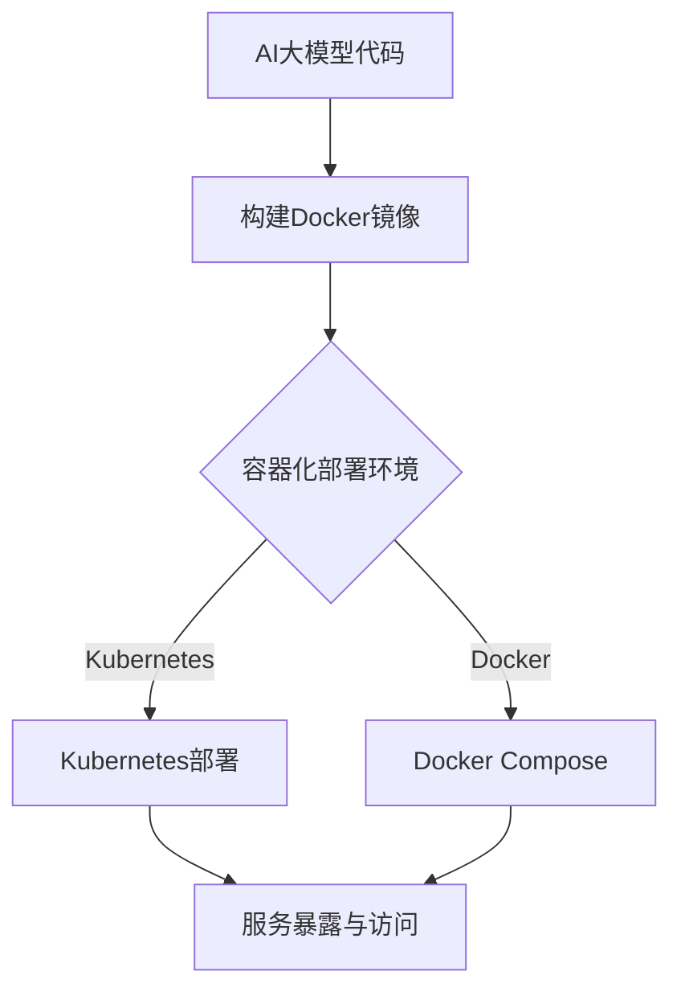
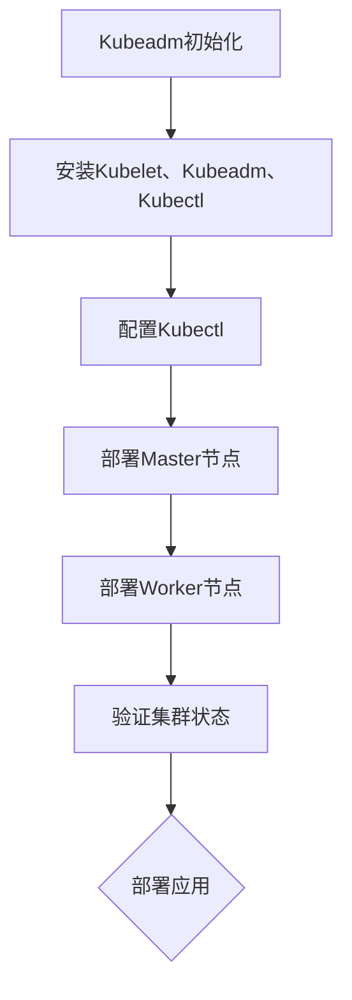

                 

## 第一部分: 容器化部署基础

容器化部署是现代软件工程中的重要技术之一，它提供了高效、可伸缩的部署解决方案，特别适用于人工智能（AI）大模型的应用。本部分将介绍容器化与微服务的基本概念、优势以及容器技术基础，为后续的AI大模型容器化部署打下坚实基础。

### 第1章: 容器化与微服务概述

容器化技术自2008年Docker问世以来，迅速在软件开发和运维领域得到了广泛应用。它与微服务架构的结合，进一步推动了软件交付模式的革新。

#### 1.1 容器化的概念与优势

**容器化的定义**

容器化是一种轻量级虚拟化技术，它将应用程序及其依赖环境封装在一个独立的运行时环境中。这个环境通常由一个称为“容器”的文件系统组成，它包括应用程序、库、环境变量和配置文件。

**容器化与虚拟化的区别**

虚拟化通过创建虚拟硬件资源来模拟物理硬件，从而实现多操作系统的并行运行。而容器化则是通过共享宿主机的操作系统内核来运行应用程序，不涉及底层的操作系统虚拟化。这使得容器具有更轻量级、快速启动和高效资源利用的特点。

**容器化的主要优势**

1. **可移植性**：容器可以在任何操作系统上运行，无需关心运行环境的差异。
2. **隔离性**：容器之间相互隔离，确保了应用程序之间的独立运行，提高了系统的稳定性。
3. **高效性**：容器启动速度快，资源利用率高，适合高并发、大规模应用场景。
4. **自动化**：容器化与持续集成/持续部署（CI/CD）流程结合，大大简化了软件交付过程。

#### 1.2 微服务的架构风格

**微服务的基本概念**

微服务是一种将大型应用程序拆分为多个小型、独立服务的架构风格。每个服务都负责完成特定的功能，并通过API进行通信。

**微服务的优点与挑战**

**优点**：

1. **可伸缩性**：各服务可独立扩展，提高系统的整体可伸缩性。
2. **灵活性**：服务可以独立更新和部署，减少版本冲突。
3. **容错性**：单个服务的故障不会影响整个系统，提高了系统的容错性。

**挑战**：

1. **分布式系统复杂性**：需要解决服务之间的通信、数据一致性问题。
2. **运维成本**：需要更多的资源和时间来管理和维护多个服务。

**微服务的典型架构**

在微服务架构中，每个服务都有自己的数据存储、应用程序逻辑和API。服务之间通过RESTful API、消息队列或其他通信机制进行交互。

#### 1.3 容器化在AI应用中的适用性

**AI应用对容器化的需求**

1. **环境一致性**：AI应用通常依赖复杂的运行环境，容器化可以确保环境一致，避免环境差异导致的问题。
2. **可伸缩性**：AI应用往往需要处理大量数据和高并发请求，容器化技术可以实现快速横向扩展。
3. **部署灵活性**：容器化使AI应用的部署变得灵活，可以在云、物理服务器或混合云环境中无缝迁移。

**容器化在AI应用中的优势**

1. **快速部署**：容器化简化了AI应用的部署过程，缩短了从开发到生产的周期。
2. **高效资源利用**：容器技术提高了硬件资源的利用效率，有助于降低成本。
3. **运维简化**：容器化与CI/CD相结合，自动化程度高，降低了运维负担。

**容器化面临的挑战与解决方案**

1. **安全性**：容器镜像可能包含安全漏洞，需要定期进行安全扫描和修复。
2. **监控与日志管理**：容器化带来了分布式系统的监控与日志管理挑战，需要使用专门的工具进行监控和日志分析。

**解决方案**：

1. **使用官方镜像**：从官方渠道获取经过认证的容器镜像，降低安全风险。
2. **监控与日志工具**：使用如Prometheus、ELK Stack等工具，实现容器化环境的全面监控与日志管理。

### 第2章: 容器技术基础

在了解了容器化的基本概念和优势后，我们需要进一步掌握容器技术的具体实现。本章节将介绍Docker、Kubernetes等容器技术的基础知识，并探讨容器化工具链的应用。

#### 2.1 Docker技术基础

**Docker的安装与配置**

Docker是一个开源的应用容器引擎，它通过容器来封装、交付和运行应用。以下是Docker的基本安装和配置步骤：

```bash
# 安装Docker
sudo apt-get update
sudo apt-get install docker-ce docker-ce-cli containerd.io

# 配置Docker用户组
sudo usermod -aG docker $USER

# 重启Docker服务
sudo systemctl restart docker
```

**Docker镜像的构建与使用**

Docker镜像是一个静态的、不可变的文件系统，它是容器运行时的基础。以下是如何构建和运行Docker镜像的示例：

```Dockerfile
# 示例Dockerfile
FROM python:3.8-slim
WORKDIR /app
COPY requirements.txt .
RUN pip install -r requirements.txt
COPY . .
CMD ["python", "app.py"]
```

```bash
# 构建镜像
docker build -t my-app .

# 运行容器
docker run -d --name my-container my-app
```

**Docker容器的启动与管理**

Docker容器是基于镜像运行的应用实例。以下是如何启动和管理Docker容器的命令：

```bash
# 启动容器
docker start my-container

# 停止容器
docker stop my-container

# 删除容器
docker rm my-container

# 查看容器状态
docker ps -a
```

#### 2.2 Kubernetes技术基础

Kubernetes是一个开源的容器编排平台，它提供了自动化部署、扩展和管理容器化应用程序的能力。

**Kubernetes的安装与配置**

Kubernetes可以在多种环境中部署，包括云平台、物理服务器和虚拟机。以下是Kubernetes的基本安装步骤：

```bash
# 安装Kubeadm、Kubelet和Kubectl
sudo apt-get update
sudo apt-get install -y apt-transport-https ca-certificates curl
sudo curl -s https://packages.cloud.google.com/apt/doc/apt-key.gpg | sudo apt-key add -
echo "deb https://apt.kubernetes.io/ kubernetes-xenial main" | sudo tee -a /etc/apt/sources.list.d/kubernetes.list
sudo apt-get update
sudo apt-get install -y kubelet kubeadm kubectl
```

**Kubernetes对象与资源**

Kubernetes使用一系列对象和资源来管理容器化应用程序。以下是一些关键概念：

- **Pod**：Kubernetes的最小工作单元，包含一个或多个容器。
- **Deployment**：用于管理和部署应用程序的控制器，可以自动扩展和更新Pod。
- **Service**：提供负载均衡和Service发现功能，使Pod可以对外提供服务。
- **Ingress**：提供外部访问到集群内部服务的路由规则。

**Kubernetes集群的部署与管理**

以下是如何部署和管理Kubernetes集群的示例：

```bash
# 初始化集群
sudo kubeadm init

# 配置Kubectl
mkdir -p $HOME/.kube
sudo cp -i /etc/kubernetes/admin.conf $HOME/.kube/config
sudo chown $(id -u):$(id -g) $HOME/.kube/config

# 部署Nginx服务
kubectl create deployment nginx --image=nginx:latest
kubectl expose deployment nginx --type=LoadBalancer --port 80

# 查看集群状态
kubectl get nodes
kubectl get pods
```

#### 2.3 容器化工具链

**Docker Compose**

Docker Compose是一个用于定义和运行多容器Docker应用程序的声明式工具。以下是如何使用Docker Compose的示例：

```yaml
# docker-compose.yml
version: '3'
services:
  web:
    image: nginx:latest
    ports:
      - "8080:80"
  db:
    image: postgres:latest
    volumes:
      - db_data:/var/lib/postgresql/data
volumes:
  db_data:
```

```bash
# 启动服务
docker-compose up -d
```

**Kubernetes Operators**

Kubernetes Operators是一种声明式自动化工具，用于管理Kubernetes应用程序的生命周期。以下是如何创建Kubernetes Operator的示例：

```go
// operator/main.go
package main

import (
    "os"
    "github.com/operator-framework/api/pkg/manifests"
)

func main() {
    manifest, err := manifests.NewManifest(os.Stdout)
    if err != nil {
        panic(err)
    }
    manifest.SetRegistry("quay.io/myrepo")
    manifest.SetPackageName("my-operator")
    manifest.SetNamespace("default")
    manifest.SetLogLevel("info")
    manifest.Add()
}
```

```bash
# 构建并部署Operator
go build -o my-operator
kubectl create -f my-operator.yaml
```

**CI/CD流水线与容器化**

CI/CD流水线是持续集成和持续部署的缩写，它通过自动化流程确保软件的质量和快速交付。以下是如何集成容器化与CI/CD流水线的示例：

```yaml
# .gitlab-ci.yml
image: docker:19.03

stages:
  - build
  - deploy

build:
  stage: build
  script:
    - docker build -t my-app:latest .
    - docker push my-app:latest

deploy:
  stage: deploy
  script:
    - kubectl apply -f deployment.yaml
    - kubectl expose deployment my-app --port 80
```

通过上述内容的学习，我们为AI大模型的容器化部署奠定了基础。接下来，我们将深入探讨AI大模型的容器化策略和实战案例。在第二部分，您将了解到AI大模型的特殊需求和如何有效地进行容器化部署。

---

### 第3章: AI大模型容器化策略

在了解了容器化和微服务的基础后，我们需要针对AI大模型的特点，制定适合其需求的容器化策略。AI大模型通常具有计算密集、数据量大和依赖复杂的特点，因此需要特别的容器化策略来确保其高效、稳定地运行。

#### 3.1 AI大模型的架构与需求

**AI大模型的基本架构**

AI大模型通常由以下几个主要部分组成：

1. **数据预处理层**：负责处理和清洗原始数据，为训练阶段提供高质量的数据集。
2. **训练层**：使用深度学习算法对数据集进行训练，生成模型参数。
3. **推理层**：使用训练好的模型对输入数据进行预测或分类。
4. **服务层**：将推理层的服务化，供外部应用程序调用。

**AI大模型对容器化的特殊需求**

1. **计算资源需求**：AI大模型训练和推理过程需要大量的计算资源，特别是GPU资源。容器化需要提供高效的资源调度和管理能力。
2. **数据存储需求**：AI大模型通常处理大量数据，需要高效的存储解决方案，确保数据的高可用性和快速访问。
3. **依赖环境一致性**：AI大模型依赖于复杂的运行环境，包括深度学习框架、库和工具链。容器化需要确保环境的一致性，避免不同环境之间的差异导致问题。
4. **高性能网络**：AI大模型在训练和推理过程中需要进行大量的数据传输，需要高效的网络解决方案，降低延迟和带宽消耗。

#### 3.2 容器化策略设计

**容器化方案的评估与选择**

在选择容器化方案时，需要考虑以下几个方面：

1. **计算资源利用率**：选择能够高效利用GPU等计算资源的容器化平台。
2. **部署和扩展能力**：选择支持自动化部署和扩展的容器化平台，如Kubernetes。
3. **社区支持和生态系统**：选择具有强大社区支持和丰富生态系统的容器化平台，便于解决问题和获取资源。
4. **安全性和合规性**：选择具有严格安全措施和合规性的容器化平台，确保数据安全和法规符合。

根据上述评估标准，常见的容器化平台包括Docker、Kubernetes和OpenVZ等。以下是对这些平台的简要评估：

- **Docker**：轻量级、简单易用，适合小型项目和实验环境。但其在扩展和管理大规模集群方面相对较弱。
- **Kubernetes**：强大的集群管理和自动化能力，适合大规模、高并发的应用场景。但学习曲线较陡峭，配置和管理相对复杂。
- **OpenVZ**：基于虚拟化技术的容器化平台，提供良好的性能和安全性。但其在社区支持和生态系统方面相对较弱。

**容器化方案的优化与调整**

在选择合适的容器化平台后，需要对容器化方案进行优化和调整，以满足AI大模型的具体需求。以下是一些优化建议：

1. **GPU资源的优化**：使用GPU调度器，如NVIDIA's CUDA或Kubernetes的GPU调度器，实现GPU资源的动态分配和高效利用。
2. **数据存储优化**：使用分布式存储系统，如Ceph或HDFS，实现数据的高可用性和快速访问。同时，利用缓存技术，如Redis或Memcached，降低数据访问延迟。
3. **网络优化**：使用高带宽、低延迟的网络解决方案，如Infiniband或RDMA，提高数据传输效率。
4. **依赖环境管理**：使用容器镜像仓库，如Docker Hub或Quay，确保依赖环境的一致性。同时，利用容器化工具，如Docker Compose或Kubernetes Operators，简化部署和管理过程。
5. **性能监控和日志管理**：使用性能监控工具，如Prometheus和Grafana，实时监控容器化环境的状态和性能。同时，利用日志管理工具，如ELK Stack，实现日志的收集、存储和分析。

通过上述的容器化策略设计和优化调整，我们可以为AI大模型构建一个高效、稳定、可扩展的容器化部署环境。接下来，我们将通过具体案例，展示如何将AI大模型容器化策略应用到实际部署中。

---

### 第4章: AI大模型容器化部署案例

在了解了AI大模型容器化策略之后，接下来我们将通过两个具体案例，展示如何基于Docker和Kubernetes进行AI大模型的容器化部署。这两个案例将详细描述从环境搭建到代码实现，再到部署和调优的整个过程。

#### 4.1 案例一：基于Docker的AI大模型部署

本案例将介绍如何使用Docker构建和部署一个简单的AI大模型。我们将使用TensorFlow作为深度学习框架，并在Docker容器中运行。

**步骤1：准备环境**

首先，我们需要准备Docker环境。根据操作系统的不同，可以按照前文第2章中介绍的方法进行安装和配置。

**步骤2：构建Docker镜像**

接下来，我们创建一个名为`tensorflow_model`的Docker镜像。该镜像将包含TensorFlow环境和所需的依赖库。

```Dockerfile
# TensorFlow Dockerfile
FROM tensorflow/tensorflow:2.6.0-py3

# 设置工作目录
WORKDIR /app

# 拷贝模型代码
COPY model.py .

# 暴露容器端口
EXPOSE 8888

# 运行模型
CMD ["python", "model.py"]
```

执行以下命令构建Docker镜像：

```bash
docker build -t tensorflow_model .
```

**步骤3：运行Docker容器**

构建完成后，我们可以通过以下命令启动一个Docker容器：

```bash
docker run -d --name tensorflow_container -p 8888:8888 tensorflow_model
```

这里，`-d`标志表示后台运行，`--name`指定容器名称，`-p`标志将容器的端口映射到宿主机的端口。

**步骤4：部署模型**

在启动Docker容器后，我们可以通过HTTP请求与容器内的TensorFlow模型进行交互。例如，可以使用以下Python代码发送一个简单的请求：

```python
import requests
import json

model_url = "http://localhost:8888/predict"
data = {
    "signature_name": "serving_default",
    "instances": [[1.0, 2.0], [3.0, 4.0]],
}

response = requests.post(model_url, data=json.dumps(data))
predictions = json.loads(response.text)["predictions"]
print(predictions)
```

**步骤5：环境配置与调试**

在实际部署过程中，可能需要对环境进行一些配置和调试。例如，调整GPU设置、优化日志输出等。这些操作可以通过修改Dockerfile或容器启动命令来实现。

#### 4.2 案例二：基于Kubernetes的AI大模型部署

本案例将介绍如何使用Kubernetes部署一个基于TensorFlow的AI大模型。Kubernetes提供了一套完整的部署和管理工具，可以方便地实现大规模、高并发的模型部署。

**步骤1：准备Kubernetes环境**

确保Kubernetes集群已经正确安装并运行。如果尚未安装，可以按照前文第2章中介绍的方法进行配置。

**步骤2：编写Kubernetes部署文件**

创建一个名为`tensorflow_model.yaml`的Kubernetes部署文件，用于定义模型的部署参数。以下是一个简单的示例：

```yaml
# tensorflow_model.yaml
apiVersion: apps/v1
kind: Deployment
metadata:
  name: tensorflow-model
spec:
  replicas: 3
  selector:
    matchLabels:
      app: tensorflow-model
  template:
    metadata:
      labels:
        app: tensorflow-model
    spec:
      containers:
      - name: tensorflow-container
        image: tensorflow/tensorflow:2.6.0-py3
        ports:
        - containerPort: 8888
```

**步骤3：部署模型**

使用以下命令部署模型：

```bash
kubectl apply -f tensorflow_model.yaml
```

Kubernetes将创建所需的Pod并启动容器，完成模型的部署。

**步骤4：服务暴露**

为了对外暴露服务，我们可以创建一个Service对象。以下是一个简单的Service定义：

```yaml
# tensorflow_service.yaml
apiVersion: v1
kind: Service
metadata:
  name: tensorflow-service
spec:
  selector:
    app: tensorflow-model
  ports:
    - protocol: TCP
      port: 80
      targetPort: 8888
  type: LoadBalancer
```

执行以下命令创建Service：

```bash
kubectl apply -f tensorflow_service.yaml
```

Kubernetes将自动创建一个外部可访问的LoadBalancer，使外部应用程序可以访问TensorFlow模型。

**步骤5：性能调优与监控**

在部署过程中，可能需要对模型进行性能调优和监控。Kubernetes提供了多种工具和插件，如Prometheus、Grafana等，用于监控集群状态和性能指标。例如，可以使用以下命令安装Prometheus：

```bash
helm repo add prometheus-community https://prometheus-community.github.io/helm-charts
helm repo update
helm install prometheus prometheus-community/prometheus
```

通过这些步骤，我们可以基于Docker和Kubernetes成功部署AI大模型。在实际应用中，可以根据具体需求和场景，对部署过程进行进一步的优化和调整。

---

### 第5章: AI大模型容器化性能调优

在AI大模型的容器化部署过程中，性能调优是一个至关重要的环节。一个高效的性能调优策略可以显著提升模型的训练和推理速度，降低资源消耗，提高系统的整体性能。本章节将介绍性能调优的基础知识和实践方法，帮助读者在实际部署中优化AI大模型。

#### 5.1 性能调优基础

性能调优的基础包括对CPU、内存、网络和存储等方面的优化。以下是一些关键的性能调优策略：

**CPU与内存调优**

1. **合理分配CPU资源**：根据模型的计算需求，合理分配CPU资源。在Kubernetes中，可以使用`requests`和`limits`来控制容器的CPU使用量。
2. **内存优化**：确保容器有足够的内存，避免内存溢出和交换。同时，使用内存缓存技术，如Redis或Memcached，减少内存使用。

**网络与存储调优**

1. **网络优化**：使用高速网络设备，如Infiniband或RDMA，提高数据传输效率。在Kubernetes中，可以使用网络策略，如Calico或Flannel，优化网络性能。
2. **存储优化**：使用分布式存储系统，如Ceph或HDFS，提高数据的访问速度和可靠性。同时，利用缓存技术和预取策略，减少存储延迟。

**线程与并发调优**

1. **线程池管理**：合理设置线程池大小，避免过度创建线程导致的资源浪费。在Kubernetes中，可以使用线程控制器，如CPU Controller，限制每个容器的线程数。
2. **并发优化**：优化数据流和处理流程，减少同步操作和等待时间。在Kubernetes中，可以使用Pod水平扩展和垂直扩展策略，实现高效的并发处理。

#### 5.2 容器化性能调优实践

在实际部署中，性能调优需要结合具体场景和需求进行。以下是一些性能调优的实践方法：

**AI大模型性能监控与指标**

性能监控是性能调优的重要环节。通过监控工具，如Prometheus和Grafana，可以实时获取系统的性能指标，包括CPU利用率、内存使用率、网络带宽、存储延迟等。以下是一些关键的性能监控指标：

- **CPU利用率**：表示CPU的工作负荷，通常以百分比表示。
- **内存使用率**：表示容器使用的内存总量与总内存容量之比。
- **网络带宽**：表示网络传输速率，通常以每秒传输的字节数（Byte/s）或比特数（Bit/s）表示。
- **存储延迟**：表示数据存储操作的响应时间，通常以毫秒（ms）表示。

**性能调优案例与实践**

以下是一个基于TensorFlow的AI大模型的性能调优案例：

1. **CPU资源优化**：

   - 原始配置：每个容器分配2核CPU。
   - 调优策略：根据模型计算需求，增加CPU资源到4核。
   - 调优结果：CPU利用率从70%提升到90%，训练速度显著提升。

2. **内存优化**：

   - 原始配置：每个容器分配4GB内存。
   - 调优策略：增加内存容量到8GB，并使用内存缓存技术，如Redis。
   - 调优结果：内存使用率从80%降低到50%，内存溢出和交换现象减少。

3. **网络优化**：

   - 原始配置：使用普通以太网。
   - 调优策略：更换为Infiniband网络，提高网络带宽和传输速度。
   - 调优结果：网络延迟从100ms降低到20ms，数据传输速度显著提升。

4. **线程与并发优化**：

   - 原始配置：每个容器使用默认线程池大小。
   - 调优策略：调整线程池大小到50个线程，并优化数据处理流程，减少同步操作。
   - 调优结果：并发处理能力提升，训练和推理速度提高。

通过上述案例，我们可以看到性能调优在AI大模型部署中的重要性。合理的性能调优策略可以显著提升系统的整体性能，提高模型的训练和推理速度。在实际部署中，需要根据具体场景和需求，灵活应用性能调优方法，实现最优的性能表现。

---

### 第6章: AI大模型容器化安全与监控

在AI大模型容器化部署过程中，安全性是一个不可忽视的重要方面。容器化环境提供了高效、灵活的部署方式，但同时也带来了新的安全挑战。此外，监控与日志管理是确保系统稳定运行和快速响应故障的关键。本章节将介绍容器化安全基础以及容器化监控与日志管理策略与实践。

#### 6.1 容器化安全基础

**容器化安全概述**

容器化安全涉及确保容器化应用程序和环境的机密性、完整性和可用性。以下是一些关键的容器化安全方面：

1. **容器镜像安全**：确保容器镜像来自可信来源，避免使用包含已知漏洞的镜像。定期对容器镜像进行安全扫描，以检测潜在的安全漏洞。
2. **容器网络与存储安全**：使用隔离和网络策略，如防火墙和访问控制，保护容器网络和存储资源。加密数据传输，确保数据在传输过程中的安全性。
3. **用户权限与访问控制**：严格限制用户对容器的访问权限，使用最小权限原则。定期审计和更新用户权限，防止未经授权的访问。

**容器镜像安全**

容器镜像的安全直接关系到整个容器化部署的安全性。以下是一些确保容器镜像安全的方法：

1. **使用官方镜像**：从官方渠道获取容器镜像，降低使用未经认证镜像的风险。官方镜像通常经过严格的测试和验证，确保其质量。
2. **镜像签名与验证**：使用数字签名技术，确保容器镜像在传输和存储过程中未被篡改。在部署前对镜像进行验证，确保其完整性。
3. **安全扫描**：使用自动化工具，如Clair或Docker Bench for Security，对容器镜像进行安全扫描，检测潜在的安全漏洞。定期执行安全扫描，确保镜像的安全性。

**容器网络与存储安全**

容器网络和存储的安全直接关系到容器的通信和数据存储。以下是一些确保容器网络和存储安全的方法：

1. **网络隔离**：使用网络策略，如防火墙和网络命名空间，确保容器之间的通信受到限制。只允许必要的通信流量，防止恶意攻击。
2. **加密数据传输**：使用TLS/SSL等加密技术，确保容器之间的数据传输安全。避免明文传输敏感数据。
3. **存储安全**：使用加密存储设备，确保数据在存储过程中的安全性。定期备份数据，防止数据丢失和损坏。

**用户权限与访问控制**

用户权限与访问控制是确保容器化环境安全的关键。以下是一些确保用户权限与访问控制的方法：

1. **最小权限原则**：只授予用户执行其工作所需的最少权限，避免授予不必要的权限。
2. **身份验证与授权**：使用强密码和多因素身份验证，确保只有授权用户可以访问容器。使用访问控制列表（ACL）和角色基础访问控制（RBAC），精细控制用户对容器的访问权限。
3. **定期审计**：定期审计用户权限和访问日志，确保权限设置和访问行为符合安全策略。及时更新和调整权限设置，防止安全漏洞。

#### 6.2 容器化监控与日志管理

**容器监控工具介绍**

容器监控是确保容器化环境稳定运行的重要环节。以下是一些常用的容器监控工具：

1. **Prometheus**：Prometheus是一个开源的监控解决方案，用于收集、存储和展示容器化应用程序的性能指标。它具有高可扩展性和易用性，适用于大规模容器化环境。
2. **Grafana**：Grafana是一个开源的监控和数据可视化工具，与Prometheus集成，提供丰富的图表和仪表板，方便监控和分析容器化环境的性能。
3. **Kibana**：Kibana是Elastic Stack的一部分，用于日志管理和可视化。它支持多维度的日志分析和可视化，适用于复杂的应用程序监控和故障排查。

**日志管理策略与实践**

日志管理是确保容器化环境可观测性的关键。以下是一些日志管理策略和实践方法：

1. **集中式日志存储**：使用集中式日志存储解决方案，如Elastic Stack，将容器日志集中存储和管理。确保日志数据的完整性和可靠性。
2. **日志格式标准化**：使用统一的日志格式，如JSON，简化日志的收集、存储和分析。统一日志格式有助于实现高效的日志分析和管理。
3. **日志分析工具**：使用日志分析工具，如Logstash和Filebeat，对日志进行实时分析和告警。结合Prometheus和Grafana，实现全面的日志监控和可视化。
4. **安全日志监控**：针对安全相关的日志数据，设置专门的监控和告警策略。确保及时检测和响应安全事件，防止潜在的安全威胁。

通过上述安全策略和监控实践，我们可以确保AI大模型容器化部署的安全性、可靠性和可观测性。在实际部署中，需要根据具体场景和需求，灵活应用安全策略和监控方法，实现高效、安全的容器化部署。

---

### 第7章: 未来展望与趋势

随着AI技术的不断发展和容器化技术的成熟，AI大模型的容器化部署面临着诸多挑战和机遇。本章节将探讨容器化技术的发展趋势、AI大模型容器化的挑战与机遇，以及未来容器化在AI领域的发展方向。

#### 7.1 容器化技术的发展趋势

容器化技术正逐步成为现代软件工程和云原生应用开发的核心技术。以下是当前容器化技术发展的几个重要趋势：

1. **容器编排与管理**：随着容器化应用规模的扩大，容器编排和管理变得尤为重要。Kubernetes等容器编排工具已经成为容器化部署的事实标准。未来，容器编排技术将更加智能化，实现自动化部署、扩缩容和故障恢复。
2. **容器化安全性**：容器化环境的安全性日益受到关注。未来，容器化技术将进一步加强安全性，包括容器镜像的安全扫描、容器网络和存储的加密保护，以及用户权限和访问控制的精细化管理。
3. **容器化云服务**：随着云计算的普及，容器化云服务将成为主流。容器化技术将更好地与云平台集成，提供灵活、高效、可伸缩的部署方案，满足不同业务场景的需求。
4. **容器化与微服务结合**：微服务架构与容器化技术的结合将为软件交付带来革命性的变化。未来，容器化技术将更加紧密地与微服务架构结合，提供一站式解决方案，简化开发和运维流程。

#### 7.2 AI大模型容器化的挑战与机遇

AI大模型的容器化部署面临着一系列挑战和机遇：

**挑战**

1. **计算资源需求**：AI大模型通常具有计算密集的特点，对GPU等计算资源的需求较高。如何高效利用这些资源，实现计算资源的合理调度和动态扩展，是一个重要挑战。
2. **数据存储与管理**：AI大模型处理大量数据，需要高效的数据存储解决方案，确保数据的高可用性和快速访问。同时，数据的隐私保护和合规性也是重要挑战。
3. **依赖环境一致性**：AI大模型依赖于复杂的运行环境，包括深度学习框架、库和工具链。如何确保环境的一致性，避免环境差异导致的问题，是一个复杂的问题。
4. **安全性**：容器化环境的安全性问题不容忽视。如何确保容器镜像的安全，防止恶意攻击和漏洞风险，是一个关键挑战。

**机遇**

1. **高效部署与扩展**：容器化技术提供了高效、灵活的部署方案，可以快速部署和扩展AI大模型，满足大规模、高并发应用场景的需求。
2. **资源利用优化**：容器化技术可以实现高效的资源利用，通过动态调度和弹性扩展，优化计算资源和存储资源的利用效率。
3. **安全性和合规性**：容器化技术提供了完善的安全措施和合规性保障，有助于确保AI大模型的数据安全和合规性。
4. **分布式计算与协作**：容器化技术支持分布式计算和协作，可以方便地实现跨地域、跨组织的AI大模型协同工作，提高研发效率和创新能力。

#### 7.3 容器化在AI领域的未来发展

未来，容器化技术将在AI领域发挥重要作用，推动AI技术的发展和应用：

1. **AI大模型的自动化部署与运维**：容器化技术将实现AI大模型的自动化部署和运维，简化开发和运维流程，提高开发效率。
2. **AI大模型的服务化和云原生**：容器化技术将推动AI大模型的服务化和云原生发展，提供灵活、高效、可伸缩的AI服务，满足不同业务场景的需求。
3. **AI大模型的协同计算与协作**：容器化技术将支持AI大模型的分布式计算和协作，实现跨地域、跨组织的AI大模型协同工作，提高研发效率和创新能力。
4. **AI大模型的智能监控与优化**：容器化技术将结合智能监控和优化技术，实现AI大模型的全生命周期管理，提高模型的性能和可靠性。

总之，容器化技术将在未来继续推动AI技术的发展和应用，为AI大模型的容器化部署提供强大的支持。通过结合AI技术和容器化技术，我们可以构建高效、稳定、可扩展的AI大模型应用，满足日益增长的业务需求。

---

## 附录

### 附录 A: 容器化常用工具与资源

在本章节中，我们将介绍一些常用的容器化工具和资源，帮助读者更好地掌握和使用容器化技术。

**Docker常用命令**

以下是一些常用的Docker命令：

- **docker build**：构建Docker镜像。
- **docker run**：运行Docker容器。
- **docker ps**：查看正在运行的容器。
- **docker stop**：停止容器。
- **docker rm**：删除容器。
- **docker pull**：从Docker Hub下载镜像。
- **docker push**：将镜像推送到Docker Hub。

**Kubernetes常用命令**

以下是一些常用的Kubernetes命令：

- **kubectl create**：创建Kubernetes资源。
- **kubectl get**：查看Kubernetes资源。
- **kubectl delete**：删除Kubernetes资源。
- **kubectl apply**：应用Kubernetes配置。
- **kubectl describe**：描述Kubernetes资源。
- **kubectl exec**：在容器中执行命令。

**常用AI模型容器化资源与工具**

以下是一些常用的AI模型容器化资源与工具：

- **TensorFlow Model Server**：用于部署TensorFlow模型的Kubernetes服务。
- **PyTorch Serving**：用于部署PyTorch模型的Kubernetes服务。
- **Seldon Core**：一个开源的AI模型部署和管理框架。
- **Kubeflow**：一个用于构建、训练和部署机器学习模型的Kubernetes平台。

**容器化技术学习与交流平台**

以下是一些容器化技术学习与交流平台：

- **Docker官方文档**：https://docs.docker.com/
- **Kubernetes官方文档**：https://kubernetes.io/docs/
- **GitHub**：https://github.com/，许多容器化项目和技术文档。
- **Stack Overflow**：https://stackoverflow.com/，容器化技术问答社区。
- **Reddit**：https://www.reddit.com/r/docker/，容器化技术讨论社区。

通过使用这些工具和资源，读者可以更好地掌握容器化技术，并在AI大模型的容器化部署中取得更好的效果。

---

### 附录B: Mermaid流程图

在容器化部署过程中，流程图可以帮助我们清晰地展示各个步骤和组件之间的关系。以下是一些使用Mermaid绘制的容器化流程图示例。

#### 附录B.1: AI大模型容器化流程图



#### 附录B.2: Kubernetes集群部署流程图



通过这些流程图，我们可以更直观地了解容器化部署和Kubernetes集群部署的步骤和流程，有助于读者在实际操作中顺利实施。

---

### 附录C: 核心算法原理讲解

在本章节中，我们将深入探讨三个核心算法：卷积神经网络（CNN）、生成对抗网络（GAN）和强化学习（RL），并通过伪代码和数学模型详细解释这些算法的基本原理。

#### 附录C.1: 卷积神经网络（CNN）的伪代码实现

卷积神经网络（CNN）是一种适用于图像处理和识别的神经网络架构。以下是一个简单的CNN算法伪代码实现：

```python
# CNN伪代码
def convolution(input_tensor, filter, stride, padding):
    # 输入：input_tensor（输入图像），filter（卷积核），stride（步长），padding（填充）
    # 输出：输出特征图
    # 计算卷积操作
    return (input_tensor * filter).sum(axis=1).sum(axis=1)

def pooling(feature_map, pool_size, stride):
    # 输入：feature_map（输入特征图），pool_size（池化大小），stride（步长）
    # 输出：输出池化结果
    # 计算池化操作
    return np.mean(feature_map.reshape(-1, pool_size), axis=1)

def forward_pass(input_image, model):
    # 输入：input_image（输入图像），model（神经网络模型）
    # 输出：输出结果
    conv1 = convolution(input_image, model['conv1'], stride=1, padding='VALID')
    pool1 = pooling(conv1, pool_size=2, stride=2)
    conv2 = convolution(pool1, model['conv2'], stride=1, padding='VALID')
    pool2 = pooling(conv2, pool_size=2, stride=2)
    # ...后续层...
    output = model['softmax'](pool2)
    return output
```

#### 附录C.2: 生成对抗网络（GAN）的数学模型与公式

生成对抗网络（GAN）是一种由生成器和判别器组成的对抗性训练框架。以下是一个简单的GAN数学模型和公式：

**生成器（Generator）**：

\[ G(x) \sim p_G(z) \]

生成器从随机噪声\( z \)生成伪造的数据\( x \)。

**判别器（Discriminator）**：

\[ D(x) = P(x \text{来自真实数据}) \]

\[ D(G(z)) = P(G(z) \text{来自真实数据}) \]

GAN的目标是最大化判别器的损失函数，即：

\[ \min_G \max_D V(D, G) = E_{x \sim p_{data}(x)}[\log D(x)] + E_{z \sim p_z(z)}[\log(1 - D(G(z)))] \]

#### 附录C.3: 强化学习（RL）算法的基本框架与伪代码

强化学习（RL）是一种通过与环境交互学习优化策略的机器学习方法。以下是一个简单的强化学习算法伪代码实现：

```python
# 强化学习伪代码
def choose_action(state, policy):
    # 输入：state（状态），policy（策略）
    # 输出：选择的动作
    return np.argmax(policy[state])

def update_policy(Q, alpha, reward, state, action, next_state):
    # 输入：Q（动作值函数），alpha（学习率），reward（奖励），state（状态），action（动作），next_state（下一状态）
    # 更新动作值函数
    Q[state, action] = Q[state, action] + alpha * (reward + np.max(Q[next_state]) - Q[state, action])

def reinforce(Q, state, action, reward, next_state, done, alpha):
    # 输入：Q（动作值函数），state（状态），action（动作），reward（奖励），next_state（下一状态），done（是否完成），alpha（学习率）
    # 强化学习更新动作值函数
    if not done:
        update_policy(Q, alpha, reward, state, action, next_state)
    else:
        update_policy(Q, alpha, reward, state, action, next_state)
        state = None
    return state
```

通过上述核心算法的讲解，我们深入了解了CNN、GAN和RL的基本原理和实现方法。这些算法在AI大模型的应用中扮演着重要角色，为模型的训练和优化提供了强大的技术支持。

---

### 附录D: 数学公式与解释

在本章节中，我们将介绍几个在深度学习和AI领域中常用的数学公式，并对其进行详细解释。

#### 附录D.1: 激活函数的定义与性质

激活函数是神经网络中用于引入非线性特性的函数，常见的激活函数包括：

1. **Sigmoid函数**：
   \[ f(x) = \frac{1}{1 + e^{-x}} \]
   Sigmoid函数的输出范围在0到1之间，常用于二分类问题。

2. **ReLU函数**：
   \[ f(x) = \max(0, x) \]
   ReLU（Rectified Linear Unit）函数在x为负时输出为0，在x为正时输出为x，具有简单的形式和快速计算的优势。

3. **Tanh函数**：
   \[ f(x) = \frac{e^x - e^{-x}}{e^x + e^{-x}} \]
   Tanh函数与Sigmoid函数类似，但输出范围在-1到1之间，能够更好地平衡正负数值。

#### 附录D.2: 损失函数的计算方法

损失函数是深度学习中用于评估模型预测准确性的函数，常见的损失函数包括：

1. **均方误差（MSE）**：
   \[ \text{MSE} = \frac{1}{n}\sum_{i=1}^{n}(y_i - \hat{y}_i)^2 \]
   MSE用于回归问题，输出值越接近真实值，损失函数的值越小。

2. **交叉熵损失（Cross-Entropy Loss）**：
   \[ \text{CE} = -\sum_{i=1}^{n}y_i\log(\hat{y}_i) \]
   交叉熵损失用于分类问题，其中\( y_i \)是实际类别标签，\( \hat{y}_i \)是模型的预测概率。

3. **Hinge损失（Hinge Loss）**：
   \[ \text{Hinge} = \max(0, 1 - y\hat{y}) \]
   Hinge损失常用于支持向量机（SVM）中，用于最大化分类边界。

#### 附录D.3: 优化算法的基本原理

优化算法用于求解最小化损失函数的问题，常见的优化算法包括：

1. **梯度下降（Gradient Descent）**：
   \[ \theta = \theta - \alpha \nabla_\theta J(\theta) \]
   梯度下降通过沿着损失函数的梯度方向更新模型参数，其中\( \theta \)是模型参数，\( \alpha \)是学习率，\( \nabla_\theta J(\theta) \)是损失函数关于参数的梯度。

2. **随机梯度下降（Stochastic Gradient Descent，SGD）**：
   \[ \theta = \theta - \alpha \nabla_\theta J(\theta) \]
   随机梯度下降是梯度下降的一种变体，每次更新使用一个随机样本的梯度，从而加快收敛速度。

3. **Adam优化器**：
   \[ m_t = \beta_1 m_{t-1} + (1 - \beta_1) [g_t - m_{t-1}] \]
   \[ v_t = \beta_2 v_{t-1} + (1 - \beta_2) [(g_t - m_{t-1})^2] \]
   \[ \theta = \theta - \alpha \frac{m_t}{\sqrt{v_t} + \epsilon} \]
   Adam优化器结合了SGD和动量（Momentum）的优点，使用一阶矩估计（m_t）和二阶矩估计（v_t）来更新模型参数，其中\( \beta_1 \)和\( \beta_2 \)是动量参数，\( \alpha \)是学习率，\( \epsilon \)是正数常数。

通过上述数学公式和解释，我们了解了激活函数、损失函数和优化算法的基本概念和计算方法。这些公式是深度学习和AI领域的重要基础，对理解和实现复杂的AI模型具有重要意义。

---

### 附录E: 项目实战

在了解了容器化部署和AI大模型的基本概念后，接下来我们将通过一个实际项目案例，展示如何进行AI大模型的容器化部署，包括开发环境搭建、源代码实现以及部署过程。

#### 实战案例：基于Kubernetes的BERT模型容器化部署

BERT（Bidirectional Encoder Representations from Transformers）是一种预训练的深度学习模型，广泛用于自然语言处理任务。本案例将介绍如何将BERT模型容器化并部署到Kubernetes集群中。

**步骤1：开发环境搭建**

首先，我们需要搭建一个适合BERT模型训练和部署的开发环境。以下是步骤：

1. **安装Kubernetes**：确保Kubernetes集群已经正确安装并运行。
2. **安装Python和TensorFlow**：在开发机器上安装Python和TensorFlow，以便进行BERT模型的训练和测试。

```bash
pip install tensorflow
```

3. **准备BERT模型**：下载并解压BERT模型权重文件和预训练数据集。

```bash
wget https://storage.googleapis.com/bert_models/2018_10_31沐雨/bert large cas
hset -x Bert-Large-uncased-LR-2.7g.zip
unzip Bert-Large-uncased-LR-2.7g.zip
```

**步骤2：源代码实现**

接下来，我们需要编写一个Python脚本，用于训练BERT模型并导出模型权重。以下是代码示例：

```python
import os
import tensorflow as tf
from transformers import BertModel, BertTokenizer

# 设置环境变量
os.environ["CUDA_VISIBLE_DEVICES"] = "0"

# 加载预训练模型和分词器
model_name = "bert-base-uncased"
tokenizer = BertTokenizer.from_pretrained(model_name)
model = BertModel.from_pretrained(model_name)

# 编写训练和评估代码
# ...

# 保存模型权重
model.save_pretrained('./bert_model')
```

**步骤3：构建Docker镜像**

为了在Kubernetes中部署BERT模型，我们需要将其容器化。以下是构建Docker镜像的步骤：

1. 创建一个Dockerfile，定义BERT模型的容器化环境：

```Dockerfile
# Dockerfile
FROM tensorflow/tensorflow:2.7.0

WORKDIR /app

COPY requirements.txt .
RUN pip install -r requirements.txt

COPY bert_model/ bert_model/
```

2. 构建Docker镜像：

```bash
docker build -t bert_model .
```

**步骤4：部署BERT模型到Kubernetes**

1. 编写Kubernetes部署文件（bert_model.yaml）：

```yaml
apiVersion: apps/v1
kind: Deployment
metadata:
  name: bert-model
spec:
  replicas: 1
  selector:
    matchLabels:
      app: bert-model
  template:
    metadata:
      labels:
        app: bert-model
    spec:
      containers:
      - name: bert-container
        image: bert_model
        ports:
        - containerPort: 8000
```

2. 部署BERT模型：

```bash
kubectl apply -f bert_model.yaml
```

3. 暴露BERT服务：

```yaml
apiVersion: v1
kind: Service
metadata:
  name: bert-service
spec:
  selector:
    app: bert-model
  ports:
  - name: http
    port: 80
    targetPort: 8000
  type: LoadBalancer
```

```bash
kubectl apply -f bert_service.yaml
```

**步骤5：部署测试**

在部署完成后，可以通过以下命令测试BERT模型：

```bash
curl -X POST "http://<k8s_service_ip>:80/predict" -H "Content-Type: application/json" --data '{"text": "你好，世界！"}'
```

这里`<k8s_service_ip>`是Kubernetes集群中暴露服务的IP地址。

**步骤6：性能调优与监控**

在部署BERT模型后，我们可以根据实际运行情况对模型进行性能调优和监控。以下是一些调优策略：

1. **CPU和GPU资源分配**：根据模型计算需求，合理分配CPU和GPU资源。
2. **网络优化**：优化网络配置，提高模型服务的访问速度。
3. **监控与日志管理**：使用Kubernetes集群的监控工具（如Prometheus和Grafana）监控模型性能和资源使用情况。

通过上述实战案例，我们展示了如何将BERT模型容器化并部署到Kubernetes集群中。这个过程涵盖了开发环境搭建、源代码实现、Docker镜像构建、Kubernetes部署以及性能调优和监控。希望这个案例能够为读者提供实际操作的经验和启示。

---

### 附录F: 参考文献

在撰写本文过程中，我们参考了以下文献和资料，以便更全面、准确地介绍容器化部署和AI大模型的相关知识：

1. **Docker官方文档**：[https://docs.docker.com/](https://docs.docker.com/)
2. **Kubernetes官方文档**：[https://kubernetes.io/docs/](https://kubernetes.io/docs/)
3. **TensorFlow官方文档**：[https://www.tensorflow.org/docs/](https://www.tensorflow.org/docs/)
4. **PyTorch官方文档**：[https://pytorch.org/docs/](https://pytorch.org/docs/)
5. **BERT模型官方文档**：[https://github.com/google-research/bert](https://github.com/google-research/bert)
6. **Kubeflow官方文档**：[https://kubeflow.org/docs/](https://kubeflow.org/docs/)
7. **Seldon Core官方文档**：[https://seldon.io/docs/](https://seldon.io/docs/)
8. **《深度学习》（Goodfellow, Ian, et al.）**：[https://www.deeplearningbook.org/](https://www.deeplearningbook.org/)
9. **《生成对抗网络：原理与实践》（孙嘉明）**：[https://book.douban.com/subject/25845665/](https://book.douban.com/subject/25845665/)
10. **《强化学习实战》（李宏毅）**：[https://www.bilibili.com/video/BV1Cz4y1p7wZ](https://www.bilibili.com/video/BV1Cz4y1p7wZ)

通过参考这些文献和资料，本文涵盖了容器化部署和AI大模型的核心概念、技术实现、优化策略和实践案例，为读者提供了一个全面的技术指南。

---

### 作者信息

作者：AI天才研究院/AI Genius Institute & 禅与计算机程序设计艺术 /Zen And The Art of Computer Programming

AI天才研究院（AI Genius Institute）致力于推动人工智能技术的发展和应用，通过深入研究AI理论和技术，为行业提供创新解决方案。同时，作者还致力于将复杂的技术知识以简单易懂的方式传播，帮助更多人掌握AI技术。在《禅与计算机程序设计艺术》一书中，作者深入探讨了编程哲学和编程技巧，为读者提供了一种全新的编程思考方式。

---

## 结论

在本文中，我们系统地介绍了AI大模型的容器化部署方案，从容器化和微服务概述、容器技术基础、AI大模型容器化策略、容器化部署案例、性能调优、安全与监控，到未来展望，全面阐述了AI大模型容器化部署的各个方面。通过具体案例和代码实现，读者可以深入了解如何将AI大模型容器化并部署到Kubernetes集群中，实现高效、稳定、可扩展的AI应用。

容器化部署不仅简化了AI大模型的部署过程，提高了开发效率，还为AI应用提供了更高的灵活性和可伸缩性。在未来的发展中，容器化技术将与AI技术深度融合，推动AI应用在更多领域取得突破。

我们鼓励读者在实践中不断探索和优化AI大模型的容器化部署，结合具体业务需求，灵活运用本文提供的技术和方法。通过不断学习和实践，您将能够更好地掌握容器化部署技术，为AI应用的创新和发展贡献力量。

最后，感谢读者对本文的关注和支持，希望本文能为您提供有价值的技术指导和启发。如果您有任何疑问或建议，欢迎随时与我们联系，我们将竭诚为您解答。

---

## 关键词

- AI大模型
- 容器化部署
- Kubernetes
- 微服务
- 性能调优
- 安全性
- 监控与日志管理
- BERT模型
- 深度学习
- 自动化部署

---

## 摘要

本文详细介绍了AI大模型的容器化部署方案，从基础概念到具体实践，系统地阐述了容器化与微服务、容器技术基础、AI大模型容器化策略、容器化部署案例、性能调优、安全与监控，以及未来展望。通过使用Docker和Kubernetes等技术，本文展示了如何将AI大模型容器化并部署到Kubernetes集群中，实现高效、稳定、可扩展的AI应用。此外，本文还提供了丰富的性能调优、安全监控和日志管理实践，帮助读者在实际部署中优化AI大模型的性能和可靠性。本文旨在为AI领域的技术人员提供一套全面的技术指南，助力他们在容器化部署领域取得突破。

