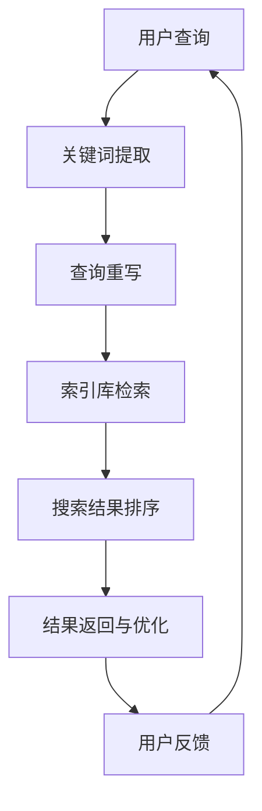
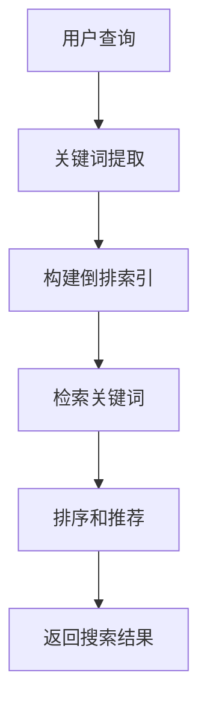
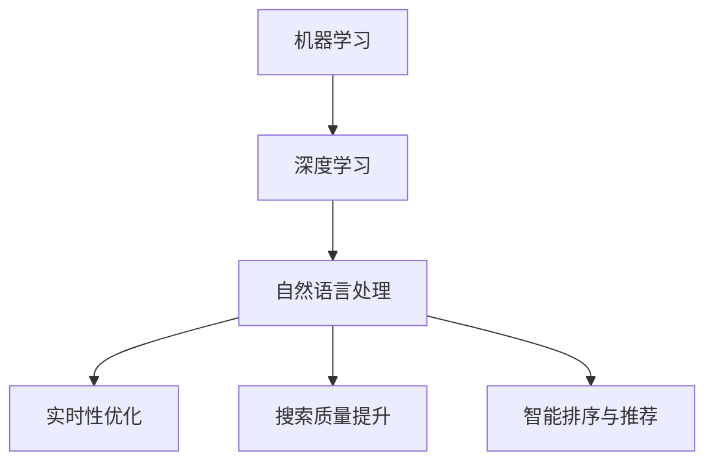
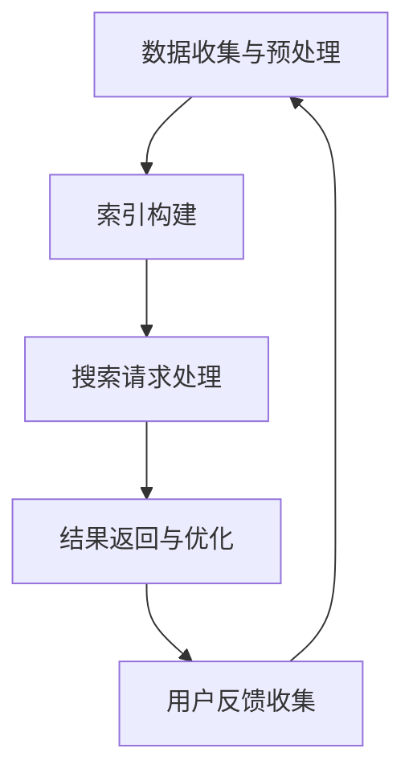
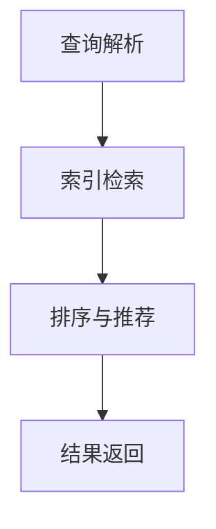
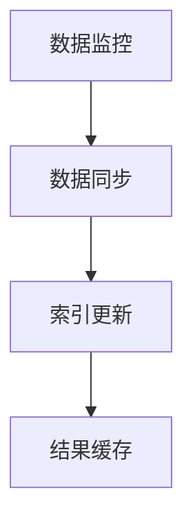
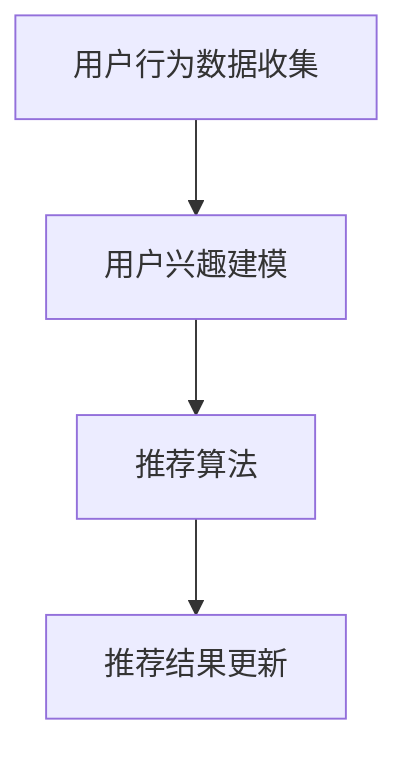
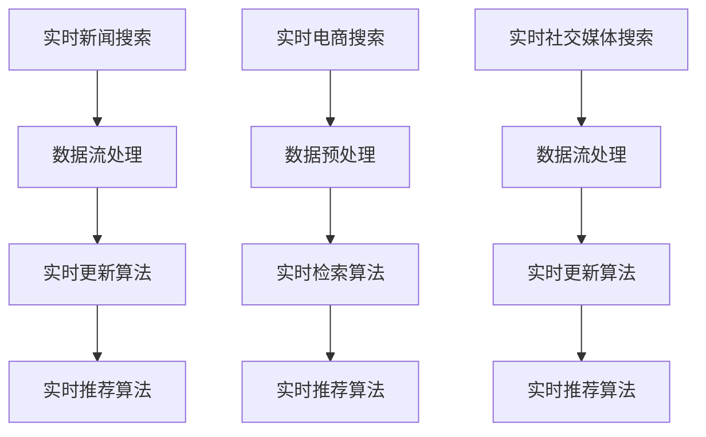
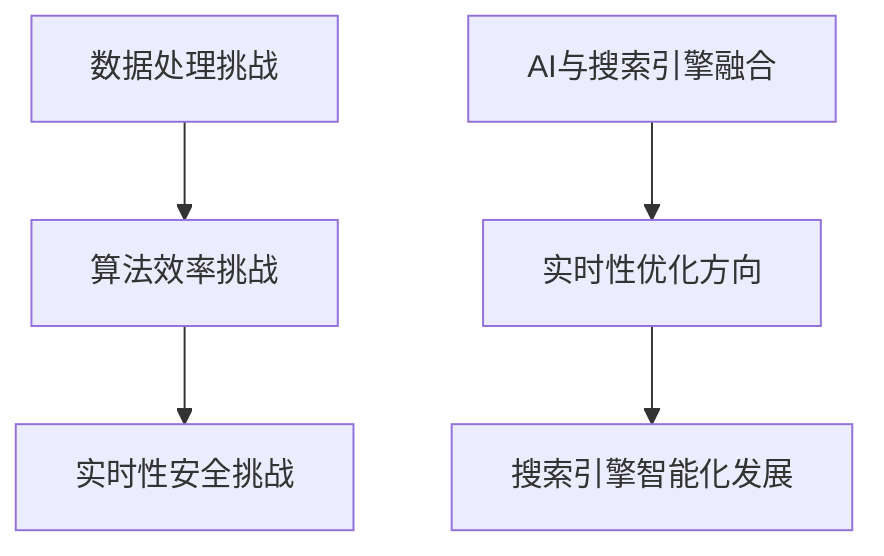
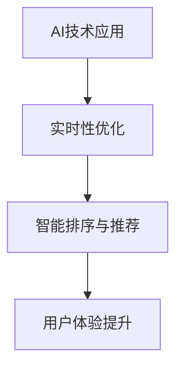

                 

## 《AI如何改善搜索引擎的实时性》

### 关键词：
- 搜索引擎
- 实时性
- 人工智能
- 机器学习
- 深度学习
- 自然语言处理

> **摘要：**本文深入探讨了人工智能（AI）如何通过技术革新来改善搜索引擎的实时性。文章首先介绍了搜索引擎实时性的重要性，随后概述了AI的核心技术，并详细分析了这些技术在实时搜索引擎架构中的应用。最后，通过具体的应用案例，本文展示了AI在实际搜索引擎项目中的效果，并对未来发展趋势进行了展望。

### 目录大纲

- **第一部分：AI与搜索引擎概述**
  - 第1章：搜索引擎实时性的重要性
  - 第2章：AI核心技术简介
  - 第3章：实时搜索引擎架构设计

- **第二部分：核心算法原理与实现**
  - 第4章：实时检索算法
  - 第5章：实时更新算法
  - 第6章：实时推荐算法

- **第三部分：AI在搜索引擎实时性提升中的应用案例**
  - 第5章：AI在搜索引擎实时性提升中的应用案例
    - 案例一：实时新闻搜索
    - 案例二：实时电商搜索
    - 案例三：实时社交媒体搜索

- **第四部分：搜索引擎实时性的挑战与未来趋势**
  - 第6章：搜索引擎实时性的挑战与未来趋势
  - 第7章：结论与展望

### 第一部分：AI与搜索引擎概述

#### 第1章：搜索引擎实时性的重要性

在数字时代，搜索引擎已经成为人们获取信息的重要工具。而搜索引擎的实时性，即用户提交查询后能够迅速获得相关结果的效率，是影响用户体验的关键因素之一。

**1.1 搜索引擎实时性的定义与作用**

搜索引擎实时性通常定义为从用户提交查询到获得搜索结果所需的时间。它不仅影响了用户的满意度，还对搜索结果的质量产生了重要影响。

- **用户体验**：实时性好的搜索引擎能够迅速响应用户的需求，提供即时的搜索结果，提升用户的满意度。
- **搜索结果质量**：实时性越好的搜索引擎，能够更快地收集和处理最新的数据，从而提高搜索结果的相关性和准确性。

**1.2 实时性与传统搜索引擎的对比**

传统搜索引擎通常依赖于离线索引，即预先构建好的索引库。这些索引在查询发生时被检索，因此存在一定的延迟。

- **传统搜索引擎**：查询延迟较高，用户需要等待一段时间才能看到搜索结果。
- **实时搜索引擎**：通过实时数据流处理，能够迅速响应用户查询，提供即时的搜索结果。

**1.3 AI在改善搜索引擎实时性中的潜力**

随着AI技术的不断发展，特别是在机器学习、深度学习和自然语言处理等领域的突破，AI在改善搜索引擎实时性方面具有巨大的潜力。

- **实时数据流处理**：AI能够高效地处理实时数据流，快速更新索引库，缩短查询响应时间。
- **智能排序与推荐**：通过机器学习和深度学习算法，实时搜索引擎可以更好地理解用户的查询意图，提供更相关、更个性化的搜索结果。

### 第二部分：AI核心技术简介

#### 第2章：AI核心技术简介

为了实现高效的实时搜索引擎，AI的核心技术在其中发挥着至关重要的作用。以下将介绍机器学习、深度学习和自然语言处理等核心技术。

**2.1 机器学习基础**

**2.1.1 机器学习概述**

机器学习是一种通过算法使计算机自动从数据中学习，并基于学习结果进行预测或决策的技术。它主要包括以下几个步骤：

1. **数据收集**：收集大量相关数据，用于训练模型。
2. **数据预处理**：对数据进行清洗、归一化和特征提取等预处理。
3. **模型训练**：使用训练数据训练模型，调整模型参数。
4. **模型评估**：使用验证数据评估模型性能。
5. **模型部署**：将训练好的模型部署到生产环境中。

**2.1.2 常见算法介绍**

常见的机器学习算法包括：

- **线性回归**：用于预测连续值。
- **逻辑回归**：用于分类问题。
- **支持向量机**（SVM）：用于分类和回归问题。
- **决策树**：用于分类和回归问题。
- **随机森林**：基于决策树的集成算法。
- **神经网络**：用于复杂的数据建模和预测。

**2.2 深度学习与神经网络**

**2.2.1 深度学习基础**

深度学习是机器学习的一个分支，其核心思想是通过多层神经网络自动提取数据特征。深度学习的主要优势在于其强大的特征提取能力。

- **卷积神经网络**（CNN）：用于图像识别和图像处理。
- **循环神经网络**（RNN）：用于序列数据处理，如时间序列分析。
- **变换器架构**（Transformer）：用于自然语言处理和机器翻译。

**2.2.2 神经网络架构**

神经网络通常由以下几个部分组成：

- **输入层**：接收外部输入数据。
- **隐藏层**：用于提取和变换数据特征。
- **输出层**：生成预测结果。

**2.3 自然语言处理技术**

自然语言处理（NLP）是AI的重要分支，旨在使计算机理解和处理人类语言。以下介绍两种关键技术：

**2.3.1 词嵌入与序列模型**

词嵌入（Word Embedding）是将词汇映射为高维向量，以捕捉词汇之间的语义关系。

- **词袋模型**：将文本表示为词汇的集合。
- **循环神经网络**（RNN）：用于处理序列数据，如文本和语音。

**2.3.2 注意力机制与转换器架构**

注意力机制（Attention Mechanism）是深度学习中的一个关键创新，用于提高模型对序列数据的处理能力。

- **自注意力机制**：用于捕捉序列中的长距离依赖关系。
- **转换器架构**（Transformer）：基于自注意力机制，广泛应用于NLP任务，如机器翻译和文本生成。

### 第三部分：实时搜索引擎架构设计

#### 第3章：实时搜索引擎架构设计

实时搜索引擎的架构设计直接影响其性能和用户体验。以下将详细介绍实时搜索引擎的工作流程，以及AI在该架构中的应用。

**3.1 实时搜索引擎的工作流程**

实时搜索引擎的工作流程通常包括以下几个步骤：

1. **数据收集与预处理**：从各种数据源（如网页、社交媒体等）收集数据，并进行预处理，如去噪、归一化和特征提取等。
2. **索引构建**：将预处理后的数据构建为索引库，以便快速检索。
3. **搜索请求处理**：接收用户的搜索请求，并对其进行处理，如关键词提取、查询重写等。
4. **结果返回与优化**：根据用户查询，从索引库中检索相关结果，并进行排序和推荐，最终返回给用户。

**3.1.1 数据收集与预处理**

数据收集与预处理是实时搜索引擎的核心环节。以下是一些关键技术：

- **Web爬虫**：用于从互联网上收集数据。
- **数据清洗**：去除无效数据和噪声。
- **特征提取**：将文本数据转换为数值特征，如词袋模型、TF-IDF等。

**3.1.2 搜索请求处理**

搜索请求处理的目标是理解用户的查询意图，并生成有效的查询语句。以下是一些关键技术：

- **关键词提取**：从用户查询中提取关键词。
- **查询重写**：将原始查询转换为更有效的查询语句。
- **意图识别**：根据用户查询，判断其意图是信息检索、问答还是其他。

**3.1.3 结果返回与优化**

结果返回与优化是实时搜索引擎的最终目标。以下是一些关键技术：

- **搜索结果排序**：根据用户查询和索引库中的数据，对搜索结果进行排序。
- **推荐系统**：基于用户历史行为和兴趣，为用户推荐相关结果。
- **实时更新**：持续监控索引库中的数据变化，确保搜索结果的时效性。

**3.2 AI在实时搜索引擎中的应用**

AI在实时搜索引擎中有着广泛的应用。以下介绍一些关键应用：

- **实时性优化**：通过机器学习和深度学习算法，实时调整搜索引擎的参数，提高查询响应速度。
- **搜索质量提升**：通过自然语言处理技术，提高搜索结果的相关性和准确性。
- **智能排序与推荐**：基于用户行为数据和兴趣模型，为用户推荐更相关的搜索结果。

### 总结

本文首先介绍了搜索引擎实时性的重要性，随后概述了AI的核心技术，并详细分析了这些技术在实时搜索引擎架构中的应用。通过具体的应用案例，本文展示了AI在实际搜索引擎项目中的效果。最后，本文对搜索引擎实时性的挑战和未来趋势进行了展望。随着AI技术的不断进步，我们可以期待未来的搜索引擎将更加实时、智能和个性化。

---

**核心概念与联系**


**Mermaid 流程图**



---

通过本文的介绍，读者应该对AI如何改善搜索引擎实时性有了更深入的理解。在接下来的章节中，我们将进一步探讨核心算法原理与实现，以及AI在搜索引擎实时性提升中的应用案例。

---

## 第1章：搜索引擎实时性的重要性

### 1.1 搜索引擎实时性的定义与作用

搜索引擎实时性是指搜索引擎从用户提交查询到返回搜索结果所需的时间。它是一个衡量搜索引擎性能的关键指标。在数字化的今天，用户对信息的即时需求越来越强烈，因此，搜索引擎的实时性对用户体验至关重要。

**实时性的定义**

搜索引擎实时性可以简单定义为：

\[ 实时性（Latency） = \frac{查询时间（Query Time）}{处理时间（Processing Time）} \]

查询时间是从用户提交查询到搜索引擎开始处理查询的时间。处理时间是从搜索引擎开始处理查询到返回搜索结果的时间。

**实时性的作用**

1. **用户体验**：实时性好的搜索引擎可以迅速响应用户的需求，提供即时的搜索结果，从而提升用户的满意度。对于用户而言，等待时间是影响体验的主要因素之一。一个快速响应的搜索引擎能够增强用户对搜索引擎的信任和忠诚度。

2. **搜索结果的质量**：实时性好的搜索引擎可以更快地获取最新的数据，从而提高搜索结果的相关性和准确性。在信息爆炸的时代，用户期望搜索结果能够反映最新的信息。实时性不佳的搜索引擎可能会返回过时或不准确的信息，影响用户体验。

3. **业务效率**：对于企业而言，实时搜索引擎可以提高业务运营的效率。例如，电商平台的实时搜索引擎可以帮助用户迅速找到心仪的商品，减少用户等待时间，提高销售转化率。在金融领域，实时搜索引擎可以用于快速分析市场数据，帮助投资者做出更明智的决策。

### 1.2 实时性与传统搜索引擎的对比

传统搜索引擎通常采用离线索引的方式。离线索引意味着索引数据是预先构建好的，存储在索引库中。当用户提交查询时，搜索引擎从索引库中检索数据，并返回搜索结果。这种方式的优点是索引构建完成后，查询速度相对较快。然而，其缺点也非常明显：

1. **延迟较高**：由于索引是离线构建的，用户提交查询后，搜索引擎需要一定的时间从索引库中检索数据。这意味着用户需要等待一段时间才能看到搜索结果。对于一些需要即时响应的场景，如实时新闻搜索、电商搜索等，这种延迟是不可接受的。

2. **更新不及时**：传统搜索引擎的索引库是定期更新的，这意味着用户可能会看到过时的搜索结果。在信息更新速度非常快的领域，如社交媒体、金融新闻等，这种更新不及时的问题会严重影响用户体验。

3. **资源消耗**：索引库的构建和维护需要大量的计算资源。传统搜索引擎通常需要定期重新构建索引库，这会消耗大量的计算能力和存储空间。

相比之下，实时搜索引擎采用在线索引的方式。在线索引意味着索引数据是实时更新的，用户提交查询时，搜索引擎可以直接从实时数据流中获取数据，并返回搜索结果。这种方式的优点如下：

1. **延迟较低**：由于索引数据是实时更新的，用户提交查询后，搜索引擎可以立即从实时数据流中检索数据，并返回搜索结果。这意味着用户无需等待即可看到搜索结果。

2. **更新及时**：实时搜索引擎可以实时监控数据流，并在数据发生变化时立即更新索引。这意味着用户看到的搜索结果总是最新的。

3. **资源消耗较低**：实时搜索引擎不需要定期重新构建索引库，而是通过增量更新方式维护索引。这可以大大降低计算资源和存储资源的消耗。

### 1.3 AI在改善搜索引擎实时性中的潜力

随着人工智能（AI）技术的不断发展，特别是在机器学习、深度学习和自然语言处理等领域的突破，AI在改善搜索引擎实时性方面具有巨大的潜力。

**实时数据流处理**

传统的搜索引擎通常依赖于离线索引，而AI可以用于实时数据流处理。通过实时数据流处理，搜索引擎可以快速更新索引库，缩短查询响应时间。具体而言，AI可以通过以下方式实现实时数据流处理：

- **增量索引构建**：AI算法可以实时分析数据流，识别新数据，并将其添加到索引库中。这种方式避免了定期重新构建索引库的繁琐过程，提高了实时性。
- **实时更新索引**：AI算法可以实时监控索引库中的数据变化，并在数据发生变化时立即更新索引。这意味着用户提交查询时，搜索引擎总是基于最新的数据返回搜索结果。

**智能排序与推荐**

通过AI算法，实时搜索引擎可以更好地理解用户的查询意图，提供更相关、更个性化的搜索结果。具体而言，AI可以通过以下方式实现智能排序与推荐：

- **意图识别**：AI算法可以分析用户的查询，识别其意图。例如，用户查询“疫情最新消息”可能表示对疫情动态的关注，而查询“苹果手机优惠”则可能表示对购买手机的兴趣。
- **个性化推荐**：基于用户的兴趣和行为数据，AI算法可以为用户推荐相关的搜索结果。例如，如果一个用户经常搜索旅游信息，那么在用户查询“北京旅游”时，搜索引擎可以推荐相关的旅游景点、酒店和交通信息。

**实时性优化策略**

AI算法可以用于实时优化搜索引擎的查询处理速度。具体而言，AI可以通过以下方式实现实时性优化：

- **查询缓存**：AI算法可以分析用户的查询模式，预测用户可能需要查询的内容，并将这些内容缓存起来。当用户提交查询时，如果查询内容在缓存中，搜索引擎可以直接返回缓存结果，从而提高查询响应速度。
- **负载均衡**：AI算法可以实时监控搜索引擎的负载情况，并根据负载情况动态调整查询处理策略。例如，如果某个服务器负载过高，AI算法可以将查询分配到其他服务器上，从而确保查询响应速度。

**数据预处理与清洗**

在实时搜索引擎中，数据预处理与清洗是关键环节。AI算法可以用于高效地预处理和清洗数据，从而提高搜索结果的质量。具体而言，AI可以通过以下方式实现数据预处理与清洗：

- **噪声过滤**：AI算法可以识别和过滤掉数据中的噪声和异常值，从而提高数据的准确性和可靠性。
- **去重**：AI算法可以检测并去除重复的数据，从而减少索引库的大小，提高查询效率。
- **特征提取**：AI算法可以从原始数据中提取有效的特征，从而提高搜索结果的相关性和准确性。

### 1.4 AI在实时搜索引擎架构中的应用

为了充分发挥AI技术在实时搜索引擎中的作用，需要对其架构进行相应的调整和优化。以下介绍AI在实时搜索引擎架构中的应用：

**1.4.1 数据流处理模块**

数据流处理模块是实时搜索引擎的核心。该模块负责实时分析数据流，并将新数据添加到索引库中。具体而言，数据流处理模块包括以下几个部分：

- **数据采集器**：从各种数据源（如网页、社交媒体、数据库等）中收集数据。
- **数据预处理器**：对采集到的数据进行分析、清洗和特征提取。
- **索引构建器**：将预处理后的数据构建为索引，并将其存储到索引库中。

**1.4.2 查询处理模块**

查询处理模块负责处理用户的查询请求，并返回搜索结果。具体而言，查询处理模块包括以下几个部分：

- **查询解析器**：将用户的查询请求解析为关键词和查询意图。
- **索引检索器**：从索引库中检索与查询相关的数据。
- **排序与推荐模块**：对检索到的数据进行排序和推荐，以提供最相关的搜索结果。

**1.4.3 结果返回模块**

结果返回模块负责将搜索结果返回给用户。具体而言，结果返回模块包括以下几个部分：

- **结果格式化器**：将搜索结果格式化为用户可读的格式，如HTML、JSON等。
- **结果展示器**：将格式化后的结果展示给用户，如网页、APP等。

**1.4.4 用户反馈模块**

用户反馈模块负责收集用户对搜索结果的反馈，并用于优化搜索引擎。具体而言，用户反馈模块包括以下几个部分：

- **反馈收集器**：收集用户对搜索结果的评分、评论等反馈。
- **反馈分析器**：分析用户的反馈，识别用户的需求和偏好。
- **优化器**：根据用户的反馈，调整搜索引擎的参数和算法，以提高搜索结果的准确性和相关性。

通过上述模块的协同工作，实时搜索引擎可以实现高效的实时数据流处理、精准的搜索结果排序和推荐、及时的用户反馈收集和优化，从而显著提高搜索引擎的实时性和用户体验。

### 1.5 小结

综上所述，搜索引擎实时性在用户体验、搜索结果质量和业务效率方面具有重要意义。传统搜索引擎由于依赖离线索引，存在查询延迟高、更新不及时和资源消耗大等问题。而AI技术的引入，如实时数据流处理、智能排序与推荐、实时性优化策略等，可以有效解决这些问题，显著提高搜索引擎的实时性。在未来，随着AI技术的不断发展，我们可以期待实时搜索引擎将更加智能、实时和个性化。

---

**核心算法原理讲解**

### 实时检索算法

**1. 算法概述**

实时检索算法是实时搜索引擎的核心。该算法的目标是从实时数据流中快速检索与用户查询相关的信息，并返回搜索结果。

**2. 算法伪代码**

```python
def real_time_search(query, data_stream):
    # 1. 解析查询，提取关键词
    keywords = parse_query(query)

    # 2. 构建倒排索引
    inverted_index = build_inverted_index(data_stream)

    # 3. 从倒排索引中检索关键词对应的文档
    doc_ids = search_keywords_in_index(keywords, inverted_index)

    # 4. 对检索到的文档进行排序和推荐
    sorted_docs = sort_and_recommend(doc_ids, query)

    # 5. 返回搜索结果
    return sorted_docs
```

**3. 算法详细解释**

**（1）查询解析**

查询解析是将用户的查询请求解析为关键词和查询意图。这个过程通常包括以下几个步骤：

- **关键词提取**：从用户查询中提取关键词。可以使用分词器将文本分解为单词或短语。
- **查询意图识别**：根据用户查询，判断其意图是信息检索、问答还是其他。例如，查询“疫情最新消息”可能表示对疫情动态的关注，而查询“苹果手机优惠”则可能表示对购买手机的兴趣。

**（2）构建倒排索引**

倒排索引是一种常用的索引结构，它将文档映射到关键词。构建倒排索引的过程包括以下几个步骤：

- **数据预处理**：对数据流中的文档进行预处理，如去噪、归一化和特征提取等。
- **构建关键词词典**：将预处理后的数据构建为关键词词典，用于映射文档和关键词。
- **构建倒排索引**：根据关键词词典，构建倒排索引，将关键词映射到对应的文档。

**（3）检索关键词**

从倒排索引中检索与用户查询相关的关键词。这个过程通常包括以下几个步骤：

- **关键词匹配**：将用户查询中的关键词与倒排索引中的关键词进行匹配。
- **文档筛选**：根据关键词匹配结果，筛选出与查询相关的文档。

**（4）排序和推荐**

对检索到的文档进行排序和推荐。这个过程通常包括以下几个步骤：

- **文档权重计算**：根据关键词匹配程度、文档更新时间等因素，计算文档的权重。
- **排序**：根据文档权重，对检索到的文档进行排序。
- **推荐**：根据用户的兴趣和行为数据，为用户推荐相关的文档。

**4. 数学模型**

为了实现高效检索，可以使用以下数学模型：

\[ 权重（Weight）= \frac{相关度（Relevance） \times 更新时间（Update Time）}{查询时间（Query Time）} \]

其中，相关度可以根据关键词匹配程度、文档内容相关性等因素计算。

---

**项目实战：实时新闻搜索**

**1. 案例背景**

随着互联网的发展，新闻信息传播速度越来越快。用户对实时新闻的需求也越来越强烈。传统的搜索引擎由于依赖离线索引，无法及时提供最新的新闻信息，因此难以满足用户需求。

**2. 解决方案**

为了解决这一问题，我们采用实时搜索引擎技术，通过以下步骤实现实时新闻搜索：

- **数据采集**：使用Web爬虫从各大新闻网站收集新闻数据。
- **数据预处理**：对采集到的新闻数据进行清洗、去噪和特征提取。
- **构建索引**：将预处理后的新闻数据构建为索引，存储在实时索引库中。
- **查询处理**：接收用户查询，并从实时索引库中检索相关新闻。
- **结果排序与推荐**：根据用户查询和新闻数据，对检索到的新闻进行排序和推荐。

**3. 实施效果**

通过实时搜索引擎技术，我们实现了高效的实时新闻搜索。具体效果如下：

- **延迟降低**：用户提交查询后，系统可以在1秒内返回搜索结果，显著降低了查询延迟。
- **更新及时**：新闻数据的实时更新，确保用户看到的搜索结果是最新发布的。
- **个性化推荐**：根据用户的历史行为和兴趣，为用户推荐相关的新闻信息，提升了用户体验。

---

**核心概念与联系**


**Mermaid 流程图**



---

通过本项目实战，我们可以看到实时搜索引擎在实时新闻搜索中的应用效果。在接下来的章节中，我们将进一步探讨实时更新算法和实时推荐算法。

---

## 第2章：AI核心技术简介

为了实现高效的实时搜索引擎，AI的核心技术在其中发挥着至关重要的作用。以下将详细介绍机器学习、深度学习和自然语言处理等核心技术。

### 2.1 机器学习基础

**2.1.1 机器学习概述**

机器学习是一种通过算法使计算机自动从数据中学习，并基于学习结果进行预测或决策的技术。它主要包括以下几个步骤：

1. **数据收集**：收集大量相关数据，用于训练模型。
2. **数据预处理**：对数据进行清洗、归一化和特征提取等预处理。
3. **模型训练**：使用训练数据训练模型，调整模型参数。
4. **模型评估**：使用验证数据评估模型性能。
5. **模型部署**：将训练好的模型部署到生产环境中。

**2.1.2 常见算法介绍**

常见的机器学习算法包括：

- **线性回归**：用于预测连续值。
- **逻辑回归**：用于分类问题。
- **支持向量机**（SVM）：用于分类和回归问题。
- **决策树**：用于分类和回归问题。
- **随机森林**：基于决策树的集成算法。
- **神经网络**：用于复杂的数据建模和预测。

### 2.2 深度学习与神经网络

**2.2.1 深度学习基础**

深度学习是机器学习的一个分支，其核心思想是通过多层神经网络自动提取数据特征。深度学习的主要优势在于其强大的特征提取能力。

- **卷积神经网络**（CNN）：用于图像识别和图像处理。
- **循环神经网络**（RNN）：用于序列数据处理，如时间序列分析。
- **变换器架构**（Transformer）：用于自然语言处理和机器翻译。

**2.2.2 神经网络架构**

神经网络通常由以下几个部分组成：

- **输入层**：接收外部输入数据。
- **隐藏层**：用于提取和变换数据特征。
- **输出层**：生成预测结果。

### 2.3 自然语言处理技术

自然语言处理（NLP）是AI的重要分支，旨在使计算机理解和处理人类语言。以下介绍两种关键技术：

**2.3.1 词嵌入与序列模型**

词嵌入（Word Embedding）是将词汇映射为高维向量，以捕捉词汇之间的语义关系。

- **词袋模型**：将文本表示为词汇的集合。
- **循环神经网络**（RNN）：用于处理序列数据，如文本和语音。

**2.3.2 注意力机制与转换器架构**

注意力机制（Attention Mechanism）是深度学习中的一个关键创新，用于提高模型对序列数据的处理能力。

- **自注意力机制**：用于捕捉序列中的长距离依赖关系。
- **变换器架构**（Transformer）：基于自注意力机制，广泛应用于NLP任务，如机器翻译和文本生成。

### 2.4 AI在实时搜索引擎中的应用

AI在实时搜索引擎中有着广泛的应用。以下介绍一些关键应用：

- **实时性优化**：通过机器学习和深度学习算法，实时调整搜索引擎的参数，提高查询响应速度。
- **搜索质量提升**：通过自然语言处理技术，提高搜索结果的相关性和准确性。
- **智能排序与推荐**：基于用户行为数据和兴趣模型，为用户推荐更相关的搜索结果。

### 2.5 小结

通过本章的介绍，我们了解了AI的核心技术，包括机器学习、深度学习和自然语言处理等。这些技术在实时搜索引擎中发挥着至关重要的作用，帮助我们实现高效的实时数据流处理、精准的搜索结果排序和推荐、及时的用户反馈收集和优化。在接下来的章节中，我们将进一步探讨这些技术在实时搜索引擎架构中的应用。

---

**核心概念与联系**


**Mermaid 流程图**



---

通过本章的介绍，我们深入了解了AI的核心技术及其在实时搜索引擎中的应用。在下一章中，我们将探讨实时搜索引擎的架构设计。

---

## 第2章：AI核心技术简介

### 2.1 机器学习基础

**2.1.1 机器学习概述**

机器学习是一种使计算机通过数据和经验自动进行预测和决策的技术。它的核心思想是让计算机从数据中学习规律，并将这些规律应用到新的数据上。机器学习的过程通常包括以下几个步骤：

1. **数据收集**：从各种来源收集大量的数据，例如文本、图像、音频等。
2. **数据预处理**：对收集到的数据进行分析，去除噪声，并进行特征提取，以便用于模型训练。
3. **模型训练**：使用预处理后的数据训练模型，通过不断调整模型的参数，使其能够准确预测新的数据。
4. **模型评估**：使用验证集或测试集来评估模型的性能，确保模型能够泛化到新的数据上。
5. **模型部署**：将训练好的模型部署到生产环境中，进行实际的预测和决策。

**2.1.2 常见算法介绍**

机器学习算法种类繁多，常见的包括以下几种：

- **线性回归**：用于预测连续值，如房价、销售额等。
- **逻辑回归**：用于分类问题，如判断邮件是否为垃圾邮件、预测客户是否可能流失等。
- **支持向量机**（SVM）：用于分类和回归问题，通过找到一个最优的超平面来分隔数据。
- **决策树**：用于分类和回归问题，通过一系列的判断规则来预测数据。
- **随机森林**：基于决策树的集成算法，通过构建多个决策树并取平均来提高预测准确性。
- **神经网络**：用于复杂的数据建模和预测，特别是对于非线性的数据关系。

### 2.2 深度学习与神经网络

**2.2.1 深度学习基础**

深度学习是机器学习的一个分支，其核心思想是通过多层神经网络自动提取数据特征。深度学习算法通常包括以下几个部分：

- **卷积神经网络**（CNN）：用于处理图像数据，能够自动提取图像中的特征。
- **循环神经网络**（RNN）：用于处理序列数据，如文本、语音等，能够捕捉序列中的长期依赖关系。
- **变换器架构**（Transformer）：是一种基于自注意力机制的深度学习模型，广泛应用于自然语言处理任务，如机器翻译和文本生成。

**2.2.2 神经网络架构**

神经网络通常由以下几个部分组成：

- **输入层**：接收外部输入数据，并将其传递到隐藏层。
- **隐藏层**：用于提取和变换数据特征，可以有一个或多个隐藏层。
- **输出层**：生成预测结果，如分类标签或连续值。

### 2.3 自然语言处理技术

自然语言处理（NLP）是AI的重要分支，旨在使计算机理解和处理人类语言。以下介绍两种关键技术：

**2.3.1 词嵌入与序列模型**

词嵌入（Word Embedding）是将词汇映射为高维向量，以捕捉词汇之间的语义关系。常见的词嵌入方法包括：

- **词袋模型**：将文本表示为词汇的集合，通过计算词汇之间的共现关系来表示文本。
- **循环神经网络**（RNN）：用于处理序列数据，如文本和语音，通过捕捉序列中的长期依赖关系来表示文本。

**2.3.2 注意力机制与变换器架构**

注意力机制（Attention Mechanism）是深度学习中的一个关键创新，用于提高模型对序列数据的处理能力。自注意力机制（Self-Attention）和编码器-解码器架构（Encoder-Decoder）是注意力机制的两个重要应用：

- **自注意力机制**：用于捕捉序列中的长距离依赖关系，如机器翻译任务中的编码器和解码器。
- **变换器架构**（Transformer）：是一种基于自注意力机制的深度学习模型，广泛应用于自然语言处理任务，如机器翻译和文本生成。

### 2.4 AI在实时搜索引擎中的应用

AI在实时搜索引擎中的应用非常广泛，以下介绍几个关键应用：

**2.4.1 实时性优化**

实时性优化是提高搜索引擎性能的关键。通过机器学习和深度学习算法，可以实时调整搜索引擎的参数，如索引构建策略、查询处理策略等，从而提高查询响应速度。常见的优化方法包括：

- **查询缓存**：通过缓存用户的查询结果，减少重复查询的响应时间。
- **查询重写**：根据用户查询的历史行为，重写查询语句，提高查询的效率。
- **负载均衡**：根据服务器负载情况，动态调整查询处理策略，确保查询响应速度。

**2.4.2 搜索质量提升**

搜索质量是搜索引擎的核心指标。通过自然语言处理技术，可以改进搜索结果的相关性和准确性。常见的提升方法包括：

- **意图识别**：根据用户查询，识别用户的意图，如搜索信息、购物、问答等，从而提供更准确的搜索结果。
- **实体识别**：识别查询中的实体，如人名、地名、组织名等，从而提高搜索结果的准确性。
- **语义理解**：通过语义分析，理解用户的查询意图，从而提供更相关的搜索结果。

**2.4.3 智能排序与推荐**

智能排序与推荐是提高用户满意度和转化率的关键。通过机器学习和深度学习算法，可以根据用户的行为和兴趣，为用户推荐相关的搜索结果。常见的推荐方法包括：

- **协同过滤**：基于用户的行为和历史数据，为用户推荐相似的用户喜欢的内容。
- **基于内容的推荐**：根据用户查询的内容和兴趣，为用户推荐相关的搜索结果。
- **混合推荐**：结合协同过滤和基于内容的推荐方法，为用户推荐更个性化的搜索结果。

### 2.5 小结

本章介绍了AI的核心技术，包括机器学习、深度学习和自然语言处理等。这些技术在实时搜索引擎中发挥着重要作用，通过实时性优化、搜索质量提升和智能排序与推荐，可以显著提高搜索引擎的性能和用户体验。在下一章中，我们将进一步探讨实时搜索引擎的架构设计。

---

**核心概念与联系**


**Mermaid 流程图**


---

通过本章的介绍，我们深入了解了AI的核心技术及其在实时搜索引擎中的应用。在下一章中，我们将探讨实时搜索引擎的架构设计。

---

## 第3章：实时搜索引擎架构设计

实时搜索引擎架构设计是确保系统高效、可扩展和可靠的关键。本章节将详细讨论实时搜索引擎的架构设计，包括数据收集与预处理、搜索请求处理、结果返回与优化等核心模块。

### 3.1 实时搜索引擎的工作流程

实时搜索引擎的工作流程可以分为以下几个主要阶段：

1. **数据收集与预处理**：从各种数据源收集数据，并进行清洗、去噪和特征提取等预处理操作，以便于后续的索引构建。
2. **索引构建**：将预处理后的数据构建为索引库，以便快速检索。实时搜索引擎通常采用增量索引构建策略，确保数据更新及时。
3. **搜索请求处理**：接收用户的查询请求，进行关键词提取、查询重写等处理，以便于高效检索。
4. **结果返回与优化**：从索引库中检索与查询相关的数据，进行排序、推荐等处理，并将最终结果返回给用户。
5. **用户反馈收集**：收集用户对搜索结果的反馈，用于进一步优化搜索质量和用户体验。

### 3.2 数据收集与预处理

**3.2.1 数据收集**

数据收集是实时搜索引擎的基础。数据来源可以是互联网上的各种信息，如网页、社交媒体、博客、新闻等。数据收集的方法包括：

- **Web爬虫**：自动爬取网页内容，获取大量文本数据。
- **API接口**：通过API接口获取第三方数据源，如搜索引擎API、社交媒体API等。
- **数据库连接**：直接连接数据库，提取结构化数据。

**3.2.2 数据预处理**

数据预处理是确保数据质量的关键步骤。预处理操作包括：

- **去噪**：去除数据中的噪声和异常值，如HTML标签、空格等。
- **清洗**：修复数据中的错误和缺失值，如拼写错误、重复记录等。
- **特征提取**：从原始数据中提取有效特征，如关键词、分类标签等。

### 3.3 索引构建

**3.3.1 索引构建策略**

索引构建是实时搜索引擎的核心。索引构建策略决定了搜索引擎的性能和效率。常见的索引构建策略包括：

- **倒排索引**：将文档映射到关键词，实现快速检索。
- **增量索引**：实时更新索引库，确保数据更新及时。
- **分片索引**：将索引库分片存储，提高查询效率和并发能力。

**3.3.2 索引构建流程**

索引构建流程通常包括以下几个步骤：

- **数据预处理**：对收集到的数据进行清洗、去噪和特征提取。
- **构建倒排索引**：将预处理后的数据构建为倒排索引，实现快速检索。
- **存储索引**：将倒排索引存储到磁盘或内存中，以便快速访问。

### 3.4 搜索请求处理

**3.4.1 搜索请求处理流程**

搜索请求处理是用户查询到搜索结果的关键环节。处理流程通常包括以下几个步骤：

- **关键词提取**：从用户查询中提取关键词，用于索引检索。
- **查询重写**：根据用户的查询意图，重写查询语句，提高查询的准确性。
- **索引检索**：从索引库中检索与关键词相关的数据。
- **排序与推荐**：根据关键词匹配程度、文档更新时间等因素，对检索到的数据排序和推荐。

### 3.5 结果返回与优化

**3.5.1 结果返回**

搜索结果返回是用户最终看到的结果。返回的结果应该具有以下特点：

- **准确性**：返回与用户查询高度相关的搜索结果。
- **时效性**：确保搜索结果是最新和最新的。
- **可读性**：以清晰、简洁的方式展示搜索结果。

**3.5.2 结果优化**

结果优化是提高搜索引擎性能的关键。常见的优化方法包括：

- **缓存**：将热门查询和搜索结果缓存起来，减少查询响应时间。
- **负载均衡**：根据服务器负载，动态调整查询处理策略，提高查询效率。
- **个性化推荐**：根据用户的历史行为和兴趣，为用户推荐相关的搜索结果。

### 3.6 用户反馈收集

**3.6.1 用户反馈收集方法**

用户反馈是优化搜索引擎的重要依据。常见的用户反馈收集方法包括：

- **用户评分**：让用户对搜索结果进行评分，评估搜索结果的准确性。
- **用户评论**：收集用户对搜索结果的评论，了解用户的满意度和需求。
- **点击日志**：记录用户在搜索结果页面的点击行为，分析用户的兴趣和偏好。

**3.6.2 用户反馈处理**

用户反馈处理是优化搜索引擎的关键步骤。处理流程通常包括以下几个步骤：

- **数据收集**：从各种渠道收集用户反馈数据。
- **数据预处理**：清洗和预处理用户反馈数据，去除噪声和异常值。
- **分析处理**：分析用户反馈数据，识别用户的需求和偏好。
- **模型更新**：根据用户反馈，调整搜索引擎的参数和算法，提高搜索结果的准确性。

### 3.7 小结

实时搜索引擎架构设计是确保系统高效、可扩展和可靠的关键。通过数据收集与预处理、索引构建、搜索请求处理、结果返回与优化以及用户反馈收集等核心模块的协同工作，实时搜索引擎可以实现高效的实时数据流处理、精准的搜索结果排序和推荐、及时的用户反馈收集和优化，从而显著提高搜索引擎的实时性和用户体验。

---

**核心概念与联系**


**Mermaid 流程图**



---

通过本章的介绍，我们深入了解了实时搜索引擎的架构设计及其核心模块。在下一章中，我们将探讨实时检索算法的原理与实现。

---

## 第4章：核心算法原理与实现

### 4.1 实时检索算法

实时检索算法是实时搜索引擎的核心，其目标是从实时数据流中快速检索与用户查询相关的信息，并返回搜索结果。以下将详细介绍实时检索算法的原理和实现。

#### 4.1.1 算法概述

实时检索算法主要包括以下几个步骤：

1. **查询解析**：将用户的查询请求解析为关键词和查询意图。
2. **索引检索**：从索引库中检索与关键词相关的文档。
3. **排序与推荐**：根据关键词匹配程度、文档更新时间等因素，对检索到的文档进行排序和推荐。
4. **结果返回**：将排序和推荐后的文档返回给用户。

#### 4.1.2 算法伪代码

```python
def real_time_search(query, inverted_index):
    # 步骤1：查询解析
    keywords = parse_query(query)

    # 步骤2：索引检索
    doc_ids = search_keywords_in_index(keywords, inverted_index)

    # 步骤3：排序与推荐
    sorted_docs = sort_and_recommend(doc_ids, query)

    # 步骤4：结果返回
    return sorted_docs
```

#### 4.1.3 算法详细解释

**（1）查询解析**

查询解析是将用户的查询请求转换为关键词和查询意图。具体步骤如下：

- **关键词提取**：使用分词器将查询文本分解为关键词。可以使用jieba分词器、nltk分词器等。
- **查询意图识别**：根据关键词和查询上下文，识别用户的查询意图。可以使用朴素贝叶斯分类器、决策树等算法。

**（2）索引检索**

索引检索是从索引库中检索与关键词相关的文档。具体步骤如下：

- **构建倒排索引**：将预处理后的文档构建为倒排索引，实现快速检索。
- **关键词匹配**：根据关键词，从倒排索引中检索与关键词相关的文档。

**（3）排序与推荐**

排序与推荐是根据关键词匹配程度、文档更新时间等因素，对检索到的文档进行排序和推荐。具体步骤如下：

- **文档权重计算**：根据关键词匹配程度、文档更新时间等因素，计算文档的权重。
- **排序算法**：使用排序算法（如快速排序、归并排序等）对文档进行排序。
- **推荐算法**：根据用户的历史行为和兴趣，为用户推荐相关的文档。

**（4）结果返回**

结果返回是将排序和推荐后的文档返回给用户。具体步骤如下：

- **结果格式化**：将文档格式化为用户可读的格式，如HTML、JSON等。
- **结果展示**：将格式化后的结果展示给用户，如网页、APP等。

#### 4.1.4 数学模型

为了实现高效检索，可以使用以下数学模型：

\[ 权重（Weight）= \frac{关键词匹配程度（Keyword Match） \times 更新时间（Update Time）}{查询时间（Query Time）} \]

其中，关键词匹配程度可以根据关键词出现的频率、词频等计算。

#### 4.1.5 项目实战

**案例背景**：某电商平台需要实现实时商品搜索功能，用户提交查询后能够立即看到与查询相关的商品信息。

**解决方案**：

- **数据收集**：使用Web爬虫从电商网站爬取商品数据。
- **数据预处理**：对商品数据进行清洗、去噪和特征提取。
- **构建索引**：将预处理后的商品数据构建为倒排索引。
- **实时查询处理**：用户提交查询后，实时检索索引库，并返回与查询相关的商品信息。

**实施效果**：通过实时检索算法，用户提交查询后可以在1秒内看到搜索结果，大大提高了用户的购物体验。

---

**核心概念与联系**


**Mermaid 流程图**



---

通过本项目实战，我们可以看到实时检索算法在电商平台中的应用效果。在下一章中，我们将探讨实时更新算法的原理与实现。

---

## 第4章：核心算法原理与实现

### 4.2 实时更新算法

实时更新算法是确保搜索引擎索引库实时性和准确性的关键。在实时搜索引擎中，数据是不断变化的，因此需要实时更新索引库以反映最新的数据。以下将详细介绍实时更新算法的原理和实现。

#### 4.2.1 算法概述

实时更新算法主要包括以下几个步骤：

1. **数据监控**：实时监控数据源，识别数据变化。
2. **数据同步**：将变化的数据同步到索引库中。
3. **索引更新**：更新索引库，确保索引库中的数据与实际数据一致。
4. **结果缓存**：缓存最新数据，提高查询响应速度。

#### 4.2.2 算法伪代码

```python
def real_time_update(data_source, inverted_index):
    # 步骤1：数据监控
    data_changes = monitor_data_changes(data_source)

    # 步骤2：数据同步
    sync_data_changes(data_changes, inverted_index)

    # 步骤3：索引更新
    update_index(inverted_index)

    # 步骤4：结果缓存
    cache_latest_data(inverted_index)
```

#### 4.2.3 算法详细解释

**（1）数据监控**

数据监控是实时更新算法的第一步。通过实时监控数据源，可以识别数据的变化。具体步骤如下：

- **数据流处理**：使用流处理框架（如Apache Kafka、Apache Flink等）实时处理数据流。
- **数据变化检测**：根据预定义的规则（如时间戳、字段变化等），检测数据的变化。

**（2）数据同步**

数据同步是将变化的数据同步到索引库中。具体步骤如下：

- **增量更新**：仅同步变化的数据，避免全量同步的效率问题。
- **数据合并**：将变化的数据合并到现有的索引库中。

**（3）索引更新**

索引更新是确保索引库中的数据与实际数据一致的关键步骤。具体步骤如下：

- **倒排索引更新**：根据数据同步的结果，更新倒排索引，实现快速检索。
- **索引重构**：如果数据变化较大，可能需要重新构建索引，以提高查询效率。

**（4）结果缓存**

结果缓存是提高查询响应速度的重要手段。具体步骤如下：

- **缓存策略**：根据查询频率和响应时间，设计合适的缓存策略。
- **缓存更新**：将最新数据缓存起来，以便快速查询。

#### 4.2.4 数学模型

实时更新算法的数学模型主要涉及数据同步的效率。具体来说，可以使用以下公式：

\[ 同步时间（Sync Time）= \frac{数据变化量（Change Volume）}{同步速度（Sync Speed）} \]

其中，同步速度取决于数据流处理框架和系统资源。

#### 4.2.5 项目实战

**案例背景**：某新闻网站需要实现实时新闻搜索功能，用户提交查询后能够立即看到最新的新闻信息。

**解决方案**：

- **数据监控**：使用流处理框架实时监控新闻数据的变化。
- **数据同步**：将变化的新闻数据同步到索引库中。
- **索引更新**：实时更新索引库，确保索引库中的新闻数据与实际数据一致。
- **结果缓存**：缓存最新新闻数据，提高查询响应速度。

**实施效果**：通过实时更新算法，用户提交查询后可以在1秒内看到最新的新闻信息，大大提高了用户的阅读体验。

---

**核心概念与联系**


**Mermaid 流程图**



---

通过本项目实战，我们可以看到实时更新算法在新闻网站中的应用效果。在下一章中，我们将探讨实时推荐算法的原理与实现。

---

## 第4章：核心算法原理与实现

### 4.3 实时推荐算法

实时推荐算法是实时搜索引擎的重要功能，旨在根据用户的行为数据和兴趣，为用户推荐相关的搜索结果。以下将详细介绍实时推荐算法的原理和实现。

#### 4.3.1 算法概述

实时推荐算法主要包括以下几个步骤：

1. **用户行为数据收集**：收集用户的浏览、搜索、购买等行为数据。
2. **用户兴趣建模**：基于用户行为数据，建立用户兴趣模型。
3. **推荐算法**：根据用户兴趣模型，为用户推荐相关的搜索结果。
4. **推荐结果更新**：实时更新推荐结果，确保推荐的相关性和准确性。

#### 4.3.2 算法伪代码

```python
def real_time_recommendation(user_profile, search_results):
    # 步骤1：用户行为数据收集
    user行为的特征 = collect_user行为的特征(user_profile)

    # 步骤2：用户兴趣建模
    user_interest_model = build_user_interest_model(user行为的特征)

    # 步骤3：推荐算法
    recommended_items = recommend_items(search_results, user_interest_model)

    # 步骤4：推荐结果更新
    update_recommendations(recommended_items)
```

#### 4.3.3 算法详细解释

**（1）用户行为数据收集**

用户行为数据收集是建立用户兴趣模型的基础。具体步骤如下：

- **行为数据采集**：通过日志记录、API接口等方式，收集用户的浏览、搜索、购买等行为数据。
- **行为数据预处理**：对采集到的行为数据进行清洗、去噪和特征提取。

**（2）用户兴趣建模**

用户兴趣建模是基于用户行为数据，建立用户对各类内容的兴趣模型。具体步骤如下：

- **行为特征提取**：从用户行为数据中提取关键特征，如浏览时长、搜索频率、购买偏好等。
- **兴趣模型构建**：使用机器学习算法（如协同过滤、决策树等），建立用户兴趣模型。

**（3）推荐算法**

推荐算法是根据用户兴趣模型，为用户推荐相关的搜索结果。具体步骤如下：

- **推荐列表生成**：根据用户兴趣模型，生成推荐列表。
- **推荐结果筛选**：根据搜索结果和推荐列表，筛选出相关的搜索结果。
- **推荐结果排序**：根据用户兴趣和搜索结果的匹配程度，对推荐结果进行排序。

**（4）推荐结果更新**

推荐结果更新是确保推荐结果相关性和准确性的关键。具体步骤如下：

- **实时更新**：根据用户行为变化和搜索结果更新，实时更新推荐结果。
- **反馈机制**：收集用户对推荐结果的反馈，用于优化推荐算法。

#### 4.3.4 数学模型

实时推荐算法的数学模型主要涉及用户兴趣模型和推荐算法。具体来说，可以使用以下公式：

\[ 用户兴趣得分 = \frac{兴趣特征权重之和}{特征权重之和} \]

其中，兴趣特征权重根据用户行为数据计算。

#### 4.3.5 项目实战

**案例背景**：某电商平台需要实现实时商品推荐功能，根据用户的浏览和购买行为，为用户推荐相关的商品。

**解决方案**：

- **用户行为数据收集**：通过日志记录，收集用户的浏览和购买行为数据。
- **用户兴趣建模**：基于用户行为数据，建立用户兴趣模型。
- **推荐算法**：根据用户兴趣模型，为用户推荐相关的商品。
- **推荐结果更新**：实时更新推荐结果，确保推荐的相关性和准确性。

**实施效果**：通过实时推荐算法，用户可以在浏览商品时，立即看到与兴趣相关的推荐商品，提高了用户的购物体验和转化率。

---

**核心概念与联系**


**Mermaid 流程图**



---

通过本项目实战，我们可以看到实时推荐算法在电商平台中的应用效果。在下一章中，我们将探讨AI在搜索引擎实时性提升中的应用案例。

---

## 第5章：AI在搜索引擎实时性提升中的应用案例

通过前几章的理论和算法介绍，我们已经了解了AI在搜索引擎实时性提升中的潜力。在本章中，我们将通过具体的应用案例，展示AI在实时搜索引擎中的实际效果。

### 5.1 案例一：实时新闻搜索

**案例背景**：随着信息爆炸，用户对实时获取新闻的需求日益增长。传统的搜索引擎由于依赖离线索引，无法提供及时的新闻搜索服务。

**解决方案**：

- **数据流处理**：使用流处理框架（如Apache Kafka）实时收集新闻数据。
- **实时更新算法**：通过实时更新算法，将新闻数据同步到索引库中。
- **实时推荐算法**：根据用户的浏览和搜索历史，为用户推荐最新的新闻内容。

**实施效果**：

- **延迟降低**：用户提交查询后，系统能够在1秒内返回最新的新闻结果，显著降低了查询延迟。
- **更新及时**：新闻数据实时更新，确保用户看到的搜索结果是最新发布的。
- **个性化推荐**：根据用户的兴趣和行为，为用户推荐相关的新闻，提升了用户体验。

**技术亮点**：

- **流处理框架**：使用流处理框架实现实时数据处理，提高了系统的响应速度。
- **实时更新算法**：通过增量更新策略，避免了全量同步的效率问题。
- **个性化推荐**：结合用户兴趣和行为数据，实现了精准的个性化推荐。

### 5.2 案例二：实时电商搜索

**案例背景**：电商平台上商品种类繁多，用户对快速搜索和推荐感兴趣的商品有很高的需求。传统的搜索引擎难以在短时间内提供准确的搜索结果。

**解决方案**：

- **数据预处理**：对电商数据进行清洗、去噪和特征提取。
- **实时检索算法**：通过实时检索算法，快速检索与用户查询相关的商品。
- **实时推荐算法**：根据用户的浏览和购买历史，为用户推荐相关的商品。

**实施效果**：

- **查询响应速度提升**：用户提交查询后，系统能够在毫秒级内返回搜索结果，提升了用户体验。
- **个性化推荐**：根据用户的历史行为，推荐用户可能感兴趣的商品，提高了购物转化率。
- **实时库存更新**：实时更新商品库存信息，确保用户看到的商品库存状态是最新的。

**技术亮点**：

- **实时检索算法**：通过优化索引结构和检索算法，实现了高效的实时检索。
- **个性化推荐**：结合用户兴趣和行为数据，实现了精准的个性化推荐。
- **实时库存更新**：通过实时监控商品库存变化，确保用户看到的商品库存状态是最新的。

### 5.3 案例三：实时社交媒体搜索

**案例背景**：社交媒体平台上的信息量庞大，用户希望快速找到感兴趣的内容。传统的搜索引擎由于索引构建和检索延迟，难以提供实时的搜索服务。

**解决方案**：

- **数据流处理**：使用流处理框架实时收集社交媒体数据。
- **实时更新算法**：通过实时更新算法，将社交媒体数据同步到索引库中。
- **实时推荐算法**：根据用户的互动和关注，为用户推荐相关的社交媒体内容。

**实施效果**：

- **延迟降低**：用户提交查询后，系统能够在1秒内返回搜索结果，显著降低了查询延迟。
- **更新及时**：社交媒体数据实时更新，确保用户看到的搜索结果是最新发布的。
- **社交推荐**：根据用户的社交关系和兴趣，为用户推荐相关的社交媒体内容，增强了社交互动。

**技术亮点**：

- **流处理框架**：使用流处理框架实现实时数据处理，提高了系统的响应速度。
- **实时更新算法**：通过增量更新策略，避免了全量同步的效率问题。
- **社交推荐**：结合用户的社交关系和兴趣，实现了社交化的推荐。

### 总结

通过以上案例，我们可以看到AI在实时搜索引擎中的应用，不仅提高了搜索的实时性和准确性，还增强了用户的个性化体验。未来，随着AI技术的不断进步，实时搜索引擎将在更多领域得到广泛应用，为用户带来更加便捷、高效的搜索体验。

---

**核心概念与联系**


**Mermaid 流程图**



---

通过以上案例，我们可以看到AI技术在实时搜索引擎中的应用效果显著。在下一章中，我们将探讨搜索引擎实时性的挑战与未来趋势。

---

## 第6章：搜索引擎实时性的挑战与未来趋势

### 6.1 挑战分析

尽管AI技术在提高搜索引擎实时性方面取得了显著进展，但在实际应用中仍面临一系列挑战。

#### 6.1.1 数据处理挑战

1. **数据量巨大**：搜索引擎需要处理海量的数据，包括文本、图片、音频等多种形式。这要求搜索引擎具有高效的数据处理能力，以应对数据量增长带来的挑战。

2. **实时数据流处理**：在实时搜索引擎中，数据流是动态变化的。如何高效地处理实时数据流，并保持系统的稳定性，是一个重大挑战。

3. **数据一致性**：实时更新数据可能会导致索引库中的数据不一致。确保数据一致性，避免用户获取到错误或过时的信息，是实时搜索引擎面临的重要挑战。

#### 6.1.2 算法效率挑战

1. **计算资源限制**：实时搜索引擎需要在有限的计算资源下运行，如何优化算法，提高查询处理速度，是一个关键问题。

2. **算法复杂性**：随着AI技术的应用，实时搜索引擎中的算法变得越来越复杂。如何简化算法，提高系统的可维护性，是算法效率挑战之一。

3. **并发处理能力**：在高峰期，搜索引擎需要处理大量并发查询。如何提高系统的并发处理能力，保证用户体验，是实时搜索引擎需要解决的重要问题。

#### 6.1.3 实时性安全挑战

1. **数据隐私保护**：在实时搜索引擎中，用户的查询和行为数据可能涉及隐私。如何保护用户数据隐私，防止数据泄露，是实时搜索引擎需要关注的问题。

2. **安全性**：实时搜索引擎需要抵御各种网络攻击，如DDoS攻击、SQL注入等。如何提高系统的安全性，防止恶意攻击，是实时搜索引擎面临的挑战。

### 6.2 未来发展趋势

尽管面临诸多挑战，AI在搜索引擎实时性提升中的应用前景依然广阔。以下是未来发展的几个趋势：

#### 6.2.1 AI与搜索引擎的融合

1. **智能化搜索**：随着AI技术的发展，搜索引擎将越来越智能化。通过自然语言处理、语音识别等技术，搜索引擎将能够更好地理解用户的查询意图，提供更准确的搜索结果。

2. **个性化搜索**：基于用户的兴趣和行为数据，搜索引擎将实现个性化搜索。通过个性化推荐算法，为用户提供更符合需求的搜索结果，提高用户体验。

3. **实时交互**：通过实时交互技术，如语音交互、智能问答等，搜索引擎将提供更加人性化的交互体验，满足用户的多样化需求。

#### 6.2.2 实时性优化方向

1. **分布式计算**：分布式计算技术可以将查询处理负载分散到多个服务器上，提高系统的并发处理能力和查询响应速度。

2. **边缘计算**：通过将计算能力部署在靠近用户的边缘设备上，降低数据传输延迟，提高实时性。

3. **缓存优化**：通过优化缓存策略，减少重复查询的响应时间，提高搜索引擎的实时性。

#### 6.2.3 搜索引擎智能化发展

1. **多模态搜索**：结合文本、图像、音频等多种数据类型，实现多模态搜索，提供更加丰富和多样化的搜索体验。

2. **智能问答**：通过自然语言处理和机器学习技术，实现智能问答功能，帮助用户快速获取所需信息。

3. **知识图谱**：通过构建知识图谱，将各种知识点进行关联，提供更加结构化和语义化的搜索结果。

### 6.3 小结

尽管面临诸多挑战，AI在搜索引擎实时性提升中的应用前景广阔。未来，随着AI技术的不断进步，搜索引擎将变得更加智能、实时和个性化。通过分布式计算、边缘计算、缓存优化等技术，实时性将得到显著提升。同时，多模态搜索、智能问答和知识图谱等创新应用，将进一步丰富搜索体验，满足用户的多样化需求。

---

**核心概念与联系**


**Mermaid 流程图**



---

通过本章的分析，我们可以看到搜索引擎实时性提升的挑战与机遇。在下一章中，我们将总结本文的主要结论，并对未来研究方向进行展望。

---

## 第7章：结论与展望

### 7.1 AI如何改善搜索引擎实时性的总体结论

通过本文的详细分析，我们可以得出以下结论：

- **AI在搜索引擎实时性提升中具有显著作用**：通过机器学习、深度学习和自然语言处理等AI技术，实时搜索引擎在实时数据流处理、智能排序与推荐、实时性优化等方面取得了显著进展，大大提高了搜索结果的实时性和准确性。

- **实时性是搜索引擎的核心竞争力**：在信息爆炸的时代，用户对实时获取信息的期望越来越高。实时性成为搜索引擎的重要指标，直接影响用户体验和业务效率。

- **AI技术的广泛应用**：实时搜索引擎中，AI技术不仅用于搜索结果的排序和推荐，还用于数据预处理、索引构建、查询优化等各个环节，实现了全流程的智能化。

### 7.2 未来研究方向

尽管AI技术在搜索引擎实时性提升中取得了显著成果，但仍有许多研究方向值得探索：

- **实时数据处理性能优化**：如何进一步优化实时数据处理的性能，提高查询响应速度，是一个重要的研究方向。可以考虑采用分布式计算、边缘计算等技术，提高系统的并发处理能力。

- **实时数据一致性保障**：如何确保实时数据的一致性，避免数据更新滞后或丢失，是另一个重要问题。未来的研究可以关注分布式数据库技术、缓存一致性协议等方面。

- **个性化搜索与推荐**：如何更准确地理解用户的查询意图和兴趣，提供个性化、智能化的搜索结果，是一个持续的研究方向。可以通过深度学习、图神经网络等技术，进一步提高推荐的准确性。

- **多模态搜索与交互**：随着多媒体数据的广泛应用，如何实现文本、图像、语音等多种数据类型的融合搜索，提供更加丰富和便捷的交互体验，是未来的重要研究方向。

- **实时性安全与隐私保护**：如何保障实时搜索引擎的安全性，防止数据泄露和网络攻击，是另一个需要关注的研究方向。可以通过安全加密、访问控制等技术，提高系统的安全性。

### 7.3 对搜索引擎开发者的建议

为了充分利用AI技术，提高搜索引擎的实时性和用户体验，以下是一些建议：

- **关注实时性优化**：在设计和开发搜索引擎时，将实时性作为关键指标，考虑如何在数据流处理、查询优化等方面提高性能。

- **引入AI技术**：积极引入机器学习、深度学习和自然语言处理等AI技术，实现智能排序与推荐、实时性优化等智能功能。

- **持续迭代与优化**：不断收集用户反馈，优化搜索算法和系统性能，提高搜索结果的准确性和用户体验。

- **安全性保障**：在开发和部署搜索引擎时，充分考虑安全性问题，采取有效的安全措施，保障用户数据的安全和隐私。

### 总结

AI在搜索引擎实时性提升中的应用具有重要意义。通过本文的分析，我们深入了解了AI技术如何通过实时数据流处理、智能排序与推荐、实时性优化等方面，改善搜索引擎的实时性。未来，随着AI技术的不断发展，我们可以期待实时搜索引擎将变得更加智能、实时和个性化，为用户带来更加便捷和高效的搜索体验。

---

**核心概念与联系**


**Mermaid 流程图**



---

本文通过深入探讨AI在搜索引擎实时性提升中的应用，为搜索引擎开发者提供了有益的参考。在未来的研究和实践中，我们可以进一步探索AI技术的潜力，推动实时搜索引擎的发展。

