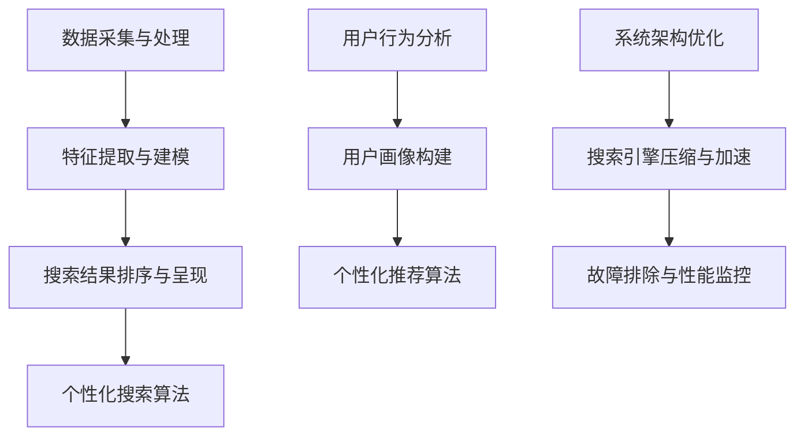

                 

# 《AI搜索引擎如何改变信息获取习惯》

> **关键词：** AI搜索引擎，信息获取，个性化推荐，自然语言处理，搜索算法，用户体验

> **摘要：** 本文将从AI搜索引擎的概述、工作原理、市场前景等方面入手，逐步分析AI搜索引擎如何改变我们的信息获取习惯，并探讨其带来的挑战与机遇。通过详细探讨个性化搜索体验、搜索结果优化、教育应用、商业价值以及日常生活的影响，我们将深入了解AI搜索引擎在现代社会中的重要地位及其未来发展。

### 引言

在信息技术飞速发展的今天，信息获取已成为人们日常生活中不可或缺的一部分。然而，随着互联网信息的爆炸性增长，传统的信息检索方式已无法满足用户日益增长的需求。这时，AI搜索引擎的出现，彻底改变了我们的信息获取习惯。本文将围绕AI搜索引擎如何改变信息获取习惯这一主题，进行深入探讨。

首先，我们将对AI搜索引擎进行概述，介绍其概念、功能、工作原理以及技术发展趋势。接下来，我们将分析AI搜索引擎如何改变信息获取习惯，从搜索习惯的变化、个性化搜索体验、搜索引擎在教育、商业以及日常生活的影响等方面进行详细探讨。最后，我们将讨论AI搜索引擎的构建与优化，包括数据采集与处理、特征提取与建模、搜索结果排序与呈现以及个性化搜索算法等内容。

### 第一部分：AI搜索引擎概述

#### 1.1 AI搜索引擎的概念与功能

##### 1.1.1 AI搜索引擎的定义

AI搜索引擎是指利用人工智能技术，特别是机器学习和自然语言处理技术，对互联网上的海量信息进行自动获取、处理、分析和推荐的系统。与传统搜索引擎相比，AI搜索引擎具有更高的智能化水平，能够更好地理解用户的搜索意图，提供更准确的搜索结果。

##### 1.1.2 AI搜索引擎与传统搜索引擎的区别

传统搜索引擎主要基于关键词匹配和页面排名算法，而AI搜索引擎则利用深度学习、自然语言处理等人工智能技术，从语义层面进行信息检索。这使得AI搜索引擎在处理复杂查询、理解用户意图方面具有明显优势。

##### 1.1.3 AI搜索引擎的主要功能

- **智能搜索**：AI搜索引擎能够理解用户的查询意图，提供与用户需求高度相关的搜索结果。
- **个性化推荐**：基于用户的历史行为和偏好，AI搜索引擎可以提供个性化的推荐结果，满足用户个性化需求。
- **实时更新**：AI搜索引擎能够实时获取互联网上的最新信息，确保用户获取到最新的信息。
- **多语言支持**：AI搜索引擎支持多种语言，能够跨越语言障碍，为用户提供全球范围内的信息检索服务。

#### 1.2 AI搜索引擎的工作原理

##### 1.2.1 数据采集与处理

AI搜索引擎首先需要从互联网上采集海量数据，包括网页、图片、视频等多种类型的信息。然后，对这些数据进行预处理，如去重、去噪、分词等，以获取结构化的数据。

##### 1.2.2 特征提取与建模

在数据预处理的基础上，AI搜索引擎对文本、图像、语音等数据进行特征提取，构建特征向量。然后，利用机器学习算法对这些特征向量进行建模，以便对用户查询进行匹配和排序。

##### 1.2.3 搜索结果排序与呈现

AI搜索引擎根据用户查询，对海量数据进行匹配和排序，筛选出与用户需求相关的结果。然后，利用自然语言处理技术，将这些结果以易于理解的形式呈现给用户。

#### 1.3 AI搜索引擎的技术发展趋势

##### 1.3.1 垂直搜索引擎

垂直搜索引擎是指针对某一特定领域或主题的搜索引擎，如学术搜索引擎、购物搜索引擎等。随着人工智能技术的发展，垂直搜索引擎将更加智能化，能够提供更加精准的搜索结果。

##### 1.3.2 实时搜索与个性化推荐

实时搜索与个性化推荐是AI搜索引擎的两个重要方向。实时搜索能够为用户提供最新的信息，而个性化推荐则能够根据用户偏好提供个性化的内容，提高用户满意度。

##### 1.3.3 自然语言处理与语义搜索

自然语言处理与语义搜索是AI搜索引擎的核心技术。通过深度学习、语言模型等技术，AI搜索引擎能够更好地理解用户的查询意图，提供更加精准的搜索结果。

#### 1.4 AI搜索引擎的市场前景

##### 1.4.1 应用领域

AI搜索引擎广泛应用于多个领域，如互联网搜索、电子商务、在线教育、医疗健康、金融保险等。随着人工智能技术的不断发展，AI搜索引擎的应用领域将越来越广泛。

##### 1.4.2 行业竞争格局

目前，全球AI搜索引擎市场主要由谷歌、百度、微软等科技巨头主导。随着技术的不断进步，新兴企业也在该领域积极布局，市场竞争将越来越激烈。

##### 1.4.3 未来发展趋势

随着人工智能技术的不断发展，AI搜索引擎将具备更高的智能化水平，能够更好地理解用户的查询意图，提供更加精准的搜索结果。此外，AI搜索引擎还将向垂直领域拓展，为用户提供更加专业的搜索服务。

### 第二部分：AI搜索引擎如何改变信息获取习惯

#### 2.1 搜索习惯的变化

##### 2.1.1 搜索行为的演变

随着互联网的普及，人们的搜索行为发生了显著变化。从最初的简单关键词搜索，到如今的高度个性化、智能化的搜索方式，AI搜索引擎极大地改变了我们的搜索习惯。

##### 2.1.2 搜索意图的理解

AI搜索引擎通过自然语言处理和语义分析技术，能够更好地理解用户的搜索意图。这使得用户不再局限于关键词搜索，而可以以更加自然、流畅的方式表达自己的需求。

##### 2.1.3 搜索结果的可信度评估

AI搜索引擎通过分析海量数据，对搜索结果进行排序和推荐。用户对搜索结果的可信度评估也更加依赖于AI搜索引擎的智能排序和个性化推荐。

#### 2.2 个性化搜索体验

##### 2.2.1 用户画像的构建

AI搜索引擎通过收集和分析用户的行为数据，构建用户画像。用户画像包括用户的兴趣、偏好、行为习惯等信息，为个性化搜索提供基础。

##### 2.2.2 个性化推荐算法

AI搜索引擎利用用户画像，通过推荐算法为用户提供个性化的搜索结果。个性化推荐算法包括协同过滤、基于内容的推荐、混合推荐等方法。

##### 2.2.3 实时搜索结果优化

AI搜索引擎通过实时分析用户的搜索行为，对搜索结果进行动态调整。用户可以根据实时反馈，优化搜索结果，提高搜索满意度。

#### 2.3 搜索引擎在信息获取中的角色

##### 2.3.1 信息的筛选与过滤

AI搜索引擎通过分析用户的查询和行为，筛选出与用户需求相关的信息。同时，利用算法对信息进行过滤，去除重复、冗余的信息。

##### 2.3.2 信息的整合与关联

AI搜索引擎通过自然语言处理和语义分析技术，将分散的信息进行整合和关联。用户可以更加便捷地获取到相关信息的完整链条。

##### 2.3.3 信息的深度挖掘与智能分析

AI搜索引擎利用深度学习和数据挖掘技术，对信息进行深度挖掘和智能分析。用户可以从中获取到更加深入、专业的信息。

#### 2.4 AI搜索引擎在教育应用中的价值

##### 2.4.1 学习资源推荐

AI搜索引擎可以根据学生的兴趣、学习进度等，推荐相应的学习资源。这有助于提高学生的学习效果和兴趣。

##### 2.4.2 教学内容辅助

AI搜索引擎可以为学生提供丰富的教学辅助内容，如教学视频、练习题等。教师可以利用这些资源，优化教学效果。

##### 2.4.3 学术研究支持

AI搜索引擎可以为学术研究人员提供丰富的文献资料，辅助学术研究。同时，通过分析海量学术文献，AI搜索引擎可以为研究人员提供研究方向和灵感。

#### 2.5 AI搜索引擎在商业应用中的价值

##### 2.5.1 市场营销与品牌推广

AI搜索引擎可以根据企业的需求，提供个性化的营销方案。通过精准定位用户，提高品牌推广效果。

##### 2.5.2 商业智能与分析

AI搜索引擎可以对企业内部和外部数据进行智能分析，为企业的决策提供支持。通过分析用户行为、市场趋势等，帮助企业制定更加科学的战略。

##### 2.5.3 客户服务与用户支持

AI搜索引擎可以为企业提供智能客服系统，通过自然语言处理技术，快速响应用户咨询，提高客户满意度。

#### 2.6 AI搜索引擎在日常生活的影响

##### 2.6.1 信息过载与信息素养

AI搜索引擎为用户提供了海量的信息资源，但也带来了信息过载的问题。用户需要具备一定的信息素养，才能有效地利用AI搜索引擎获取有价值的信息。

##### 2.6.2 搜索引擎依赖与社会影响

随着AI搜索引擎的普及，人们越来越依赖搜索引擎获取信息。这不仅改变了人们的搜索习惯，也对社会产生了深远的影响，如信息筛选、隐私保护等问题。

##### 2.6.3 信息安全与隐私保护

AI搜索引擎在收集和分析用户数据时，需要确保信息安全与隐私保护。用户需要关注自身数据的安全，避免信息泄露。

### 第三部分：AI搜索引擎的构建与优化

#### 3.1 数据采集与处理

##### 3.1.1 数据来源与质量

数据来源是AI搜索引擎构建的基础。高质量的数据能够提高搜索结果的准确性和相关性。因此，在选择数据来源时，需要考虑数据的可靠性、完整性和多样性。

##### 3.1.2 数据预处理与清洗

数据预处理与清洗是确保数据质量的重要环节。通过对数据进行去重、去噪、分词等处理，可以提高数据的质量和一致性。

##### 3.1.3 数据存储与索引

数据存储与索引是AI搜索引擎高效检索的关键。采用合适的存储结构和索引技术，可以提高搜索速度和准确性。

#### 3.2 特征提取与建模

##### 3.2.1 文本表示方法

文本表示方法是将文本数据转化为计算机可处理的形式。常用的文本表示方法包括词袋模型、词嵌入、句子嵌入等。

##### 3.2.2 嵌入技术

嵌入技术是将高维数据映射到低维空间中，以便进行有效的处理和分析。在AI搜索引擎中，常用的嵌入技术有词嵌入和句子嵌入。

##### 3.2.3 模型选择与训练

模型选择与训练是构建AI搜索引擎的核心。根据应用需求，选择合适的模型，并进行训练和优化，以提高搜索效果。

#### 3.3 搜索结果排序与呈现

##### 3.3.1 排序算法原理

搜索结果排序是AI搜索引擎的关键任务。排序算法根据用户查询和搜索结果的相关性，对结果进行排序。

##### 3.3.2 排序算法优化

为了提高搜索结果的准确性，需要对排序算法进行优化。常见的优化方法包括基于内容的排序、基于用户的排序等。

##### 3.3.3 搜索结果呈现策略

搜索结果的呈现策略影响用户的搜索体验。合理的呈现策略可以提高用户的满意度。常见的呈现策略包括列表、卡片、瀑布流等。

#### 3.4 个性化搜索算法

##### 3.4.1 用户行为分析

用户行为分析是构建个性化搜索算法的基础。通过分析用户的行为数据，了解用户的兴趣和偏好。

##### 3.4.2 个性化推荐算法

个性化推荐算法根据用户行为数据，为用户推荐个性化的搜索结果。常见的个性化推荐算法有协同过滤、基于内容的推荐等。

##### 3.4.3 用户体验优化

用户体验优化是提高用户满意度的重要手段。通过优化搜索界面、搜索流程等，提升用户体验。

#### 3.5 搜索引擎性能优化

##### 3.5.1 系统架构优化

系统架构优化是提高搜索引擎性能的关键。通过优化系统架构，提高系统的可扩展性和稳定性。

##### 3.5.2 搜索引擎压缩与加速

搜索引擎压缩与加速是提高搜索速度的重要手段。通过压缩数据、优化算法等，降低搜索延迟，提高用户体验。

##### 3.5.3 故障排除与性能监控

故障排除与性能监控是确保搜索引擎稳定运行的重要环节。通过实时监控和故障排除，提高系统的可靠性和性能。

### 附录

#### 附录A：AI搜索引擎技术工具与资源

##### A.1 开源搜索引擎框架

- Apache Lucene
- Apache Solr
- Elasticsearch

##### A.2 机器学习算法库

- TensorFlow
- PyTorch
- Scikit-learn

##### A.3 自然语言处理工具

- NLTK
- spaCy
- Stanford NLP

##### A.4 数据集与评估指标

- TREC
- Sogou International Conference on Chinese Language Processing (SIGHAN)
- GLUE Benchmark

#### 附录B：案例研究

##### B.1 某大型搜索引擎案例分析

- 搜索引擎产品架构
- 搜索算法优化
- 个性化推荐系统

##### B.2 某垂直领域搜索引擎案例分析

- 领域知识图谱构建
- 个性化搜索策略
- 搜索结果呈现优化

##### B.3 搜索引擎产品开发流程与实战

- 需求分析与设计
- 技术选型与实现
- 测试与上线

### 参考文献

- **相关书籍推荐**

  - **《人工智能：一种现代的方法》**
  - **《深度学习》**
  - **《自然语言处理综论》**

- **学术论文精选**

  - **“Efficient Information Retrieval with TF-IDF”**
  - **“Recurrent Neural Networks for Text Classification”**
  - **“Attention is All You Need”**

- **技术报告与行业白皮书**

  - **“中国人工智能发展报告”**
  - **“全球人工智能发展报告”**
  - **“搜索引擎技术发展趋势报告”**

- **其他参考资料与网站链接**

  - **AI搜索引擎技术论坛**
  - **机器学习与自然语言处理社区**
  - **开源搜索引擎项目网站**

### 总结

AI搜索引擎作为人工智能领域的重要应用，已经深刻地改变了我们的信息获取习惯。通过个性化推荐、实时搜索、深度挖掘等技术，AI搜索引擎为用户提供了更加精准、便捷的信息检索服务。在未来，随着人工智能技术的不断进步，AI搜索引擎将具备更高的智能化水平，为用户提供更加个性化的搜索体验。同时，AI搜索引擎在各个领域中的应用也将不断拓展，为人类社会带来更多价值。然而，AI搜索引擎的发展也面临诸多挑战，如信息过载、信息安全等问题。因此，我们需要在享受AI搜索引擎带来便利的同时，关注其潜在风险，共同推动AI搜索引擎的健康发展。

### 作者信息

**作者：** AI天才研究院/AI Genius Institute & 禅与计算机程序设计艺术 /Zen And The Art of Computer Programming

### 附录：核心概念与联系

以下是一个Mermaid流程图，展示了AI搜索引擎的核心概念及其相互关系：



在这个流程图中，数据采集与处理是AI搜索引擎的基础，通过特征提取与建模，将数据转化为计算机可处理的形式。搜索结果排序与呈现是核心任务，而个性化搜索算法则根据用户行为和偏好，为用户提供个性化的搜索结果。此外，系统架构优化、搜索引擎压缩与加速以及故障排除与性能监控等环节，共同保障了AI搜索引擎的高效运行。通过这个流程图，我们可以清晰地理解AI搜索引擎的核心概念及其相互关系。

### 附录：核心算法原理讲解

#### 文本表示方法

文本表示方法是将自然语言文本转化为计算机可以处理的形式。常用的文本表示方法包括词袋模型、词嵌入和句子嵌入。

##### 词袋模型

词袋模型（Bag of Words, BoW）是一种简单的文本表示方法，它将文本表示为词汇的集合，不考虑词汇的顺序和语法结构。词袋模型的实现步骤如下：

1. 分词：将文本拆分为单词或词语。
2. 去停用词：去除常见的无意义词汇，如“的”、“了”等。
3. 建立词汇表：将文本中的所有词汇构建为一个词汇表。
4. 统计词频：统计每个词汇在文本中的出现次数，形成词频矩阵。

伪代码如下：

```python
def bag_of_words(text):
    # 分词
    words = tokenize(text)
    # 去停用词
    words = remove_stop_words(words)
    # 建立词汇表
    vocabulary = create_vocabulary(words)
    # 统计词频
    word_counts = count_words(words, vocabulary)
    return word_counts
```

##### 词嵌入

词嵌入（Word Embedding）是一种将单词表示为高维向量的方法，它能够捕捉单词的语义信息。常见的词嵌入方法包括Word2Vec、GloVe和BERT等。

1. **Word2Vec**：Word2Vec是一种基于神经网络的词嵌入方法，它通过训练神经网络，将单词映射到低维向量空间。Word2Vec的实现步骤如下：

    - **训练词向量**：使用神经网络训练词向量，输入是单词的上下文，输出是单词的向量表示。
    - **相似度计算**：通过计算词向量之间的余弦相似度，评估单词的语义相似度。

    伪代码如下：

    ```python
    def word2vec(context, word):
        # 训练词向量
        embedding = train_word_embedding(context)
        # 计算词向量相似度
        similarity = cosine_similarity(embedding[word])
        return similarity
    ```

2. **GloVe**：GloVe（Global Vectors for Word Representation）是一种基于全局上下文的词嵌入方法，它通过计算单词的共现矩阵，生成词向量。

    - **共现矩阵计算**：计算单词之间的共现矩阵，表示单词在同一窗口内出现的次数。
    - **词向量训练**：使用矩阵分解方法，如SGD，训练词向量。

    伪代码如下：

    ```python
    def glove(corpus):
        # 计算共现矩阵
        cooccurrence_matrix = compute_cooccurrence_matrix(corpus)
        # 训练词向量
        embeddings = train_embeddings(cooccurrence_matrix)
        return embeddings
    ```

3. **BERT**：BERT（Bidirectional Encoder Representations from Transformers）是一种基于变换器的双向编码器，它通过预训练模型，生成高质量的词向量。

    - **预训练**：使用大规模语料库进行预训练，学习语言的深层语义特征。
    - **微调**：将预训练模型应用于特定任务，进行微调。

    伪代码如下：

    ```python
    def bert(sentence):
        # 加载预训练模型
        model = load_pretrained_model("bert")
        # 微调模型
        model = fine_tune_model(model, sentence)
        # 生成词向量
        embeddings = model.encode(sentence)
        return embeddings
    ```

##### 句子嵌入

句子嵌入（Sentence Embedding）是将整句转化为向量的方法，它能够捕捉句子级别的语义信息。常用的句子嵌入方法包括BERT、RoBERTa和ALBERT等。

1. **BERT**：BERT通过双向编码器，将句子转化为向量。

    - **编码器**：使用双向循环神经网络，对句子进行编码。
    - **向量表示**：编码器的输出即为句子的向量表示。

    伪代码如下：

    ```python
    def bert_sentence_embedding(sentence):
        # 加载BERT模型
        model = load_pretrained_model("bert")
        # 编码句子
        embedding = model.encode(sentence)
        return embedding
    ```

2. **RoBERTa**：RoBERTa是对BERT的改进，它通过增加预训练数据和调整训练策略，提高模型的性能。

    - **预训练**：使用更大规模的语料库进行预训练。
    - **微调**：在特定任务上进行微调。

    伪代码如下：

    ```python
    def roberta_sentence_embedding(sentence):
        # 加载RoBERTa模型
        model = load_pretrained_model("roberta")
        # 微调模型
        model = fine_tune_model(model, sentence)
        # 生成句子向量
        embedding = model.encode(sentence)
        return embedding
    ```

3. **ALBERT**：ALBERT是BERT的另一个变体，它通过改进模型结构，提高模型性能。

    - **嵌入层**：使用深层嵌入层，提高词汇的表示能力。
    - **预训练**：使用大规模语料库进行预训练。

    伪代码如下：

    ```python
    def albert_sentence_embedding(sentence):
        # 加载ALBERT模型
        model = load_pretrained_model("albert")
        # 预训练模型
        model = pretrain_model(model, corpus)
        # 生成句子向量
        embedding = model.encode(sentence)
        return embedding
    ```

通过上述文本表示方法，我们可以将自然语言文本转化为计算机可以处理的形式，为后续的语义分析和信息检索提供基础。

### 附录：数学模型与公式

在AI搜索引擎中，数学模型与公式扮演着至关重要的角色，用于特征提取、模型训练、排序算法等多个环节。以下将介绍几个核心的数学模型与公式，并进行详细解释和举例说明。

#### 1. 梯度下降算法

梯度下降算法是一种优化算法，用于求解机器学习模型的参数。其基本思想是沿着损失函数的梯度方向进行迭代，以最小化损失函数。

**公式：**
\[ \theta_{t+1} = \theta_{t} - \alpha \cdot \nabla J(\theta_{t}) \]

其中，\( \theta \) 表示模型参数，\( J(\theta) \) 表示损失函数，\( \alpha \) 是学习率，\( \nabla J(\theta_{t}) \) 是损失函数在当前参数下的梯度。

**举例：**
假设我们使用梯度下降算法训练一个线性回归模型，目标是最小化预测值与实际值之间的误差。给定训练数据集 \(\{(x_1, y_1), (x_2, y_2), ..., (x_n, y_n)\}\)，模型参数为 \(\theta\)，学习率为 \(0.01\)。

\[ \theta_{t+1} = \theta_{t} - 0.01 \cdot \sum_{i=1}^{n} (x_i \cdot \theta_{t} - y_i) \]

#### 2. 逻辑回归

逻辑回归是一种分类算法，用于预测概率。其数学模型为：

**公式：**
\[ P(y=1) = \sigma(\theta_0 + \theta_1x_1 + \theta_2x_2 + ... + \theta_nx_n) \]

其中，\( \sigma \) 是逻辑函数（Sigmoid函数），表示为：

\[ \sigma(z) = \frac{1}{1 + e^{-z}} \]

**举例：**
假设我们使用逻辑回归进行垃圾邮件分类，特征为邮件的单词频率，模型参数为 \(\theta\)。

给定特征向量 \( x = (x_1, x_2, ..., x_n) \)，模型参数为 \(\theta = (\theta_0, \theta_1, \theta_2, ..., \theta_n)\)，我们可以计算每个邮件属于垃圾邮件的概率：

\[ P(y=1) = \sigma(\theta_0 + \theta_1x_1 + \theta_2x_2 + ... + \theta_nx_n) \]

#### 3. 交叉熵损失函数

交叉熵损失函数常用于分类问题，用于衡量模型预测结果与真实标签之间的差异。其数学模型为：

**公式：**
\[ H(y, \hat{y}) = -\sum_{i=1}^{n} y_i \log(\hat{y}_i) \]

其中，\( y \) 是真实标签，\( \hat{y} \) 是模型预测的概率分布。

**举例：**
假设我们使用交叉熵损失函数训练一个二分类模型，给定训练数据集 \(\{(x_1, y_1), (x_2, y_2), ..., (x_n, y_n)\}\)，模型参数为 \(\theta\)，我们可以计算每个样本的交叉熵损失：

\[ H(y_i, \hat{y}_i) = -y_i \log(\hat{y}_i) - (1 - y_i) \log(1 - \hat{y}_i) \]

#### 4. 神经网络反向传播算法

神经网络反向传播算法是一种用于训练神经网络的优化算法。其基本思想是通过前向传播计算输出，然后通过反向传播计算梯度，并更新模型参数。

**公式：**
\[ \delta = \frac{\partial L}{\partial z} = \frac{\partial L}{\partial a} \frac{\partial a}{\partial z} \]

其中，\( L \) 是损失函数，\( a \) 是神经网络的激活值，\( z \) 是当前层的输入。

**举例：**
假设我们使用反向传播算法训练一个多层感知机（MLP），给定训练数据集 \(\{(x_1, y_1), (x_2, y_2), ..., (x_n, y_n)\}\)，模型参数为 \(\theta\)，我们可以通过以下步骤更新模型参数：

1. 前向传播：计算输入层到输出层的激活值。
2. 计算梯度：根据损失函数，计算当前层的梯度。
3. 反向传播：从输出层反向传播梯度，更新各层的参数。

#### 5. 梯度裁剪

梯度裁剪是一种防止梯度爆炸或消失的技术，通过限制梯度的大小来稳定训练过程。

**公式：**
\[ \text{Gradient} = \text{Clipped Gradient} \]

其中，\(\text{Clipped Gradient}\) 是经过裁剪的梯度，通常设置一个阈值 \(C\)。

**举例：**
假设我们设置梯度裁剪的阈值为 \(C = 1.0\)，当前梯度的绝对值超过阈值的部分将被裁剪：

\[ \text{Clipped Gradient} = \begin{cases} 
\text{Gradient} & \text{if } |\text{Gradient}| \leq C \\
C & \text{if } |\text{Gradient}| > C 
\end{cases} \]

通过这些数学模型与公式，AI搜索引擎能够有效地提取特征、训练模型、优化搜索结果，为用户提供高质量的信息检索服务。

### 附录：项目实战

在本节中，我们将通过一个具体的案例，详细讲解如何构建一个简单的AI搜索引擎。我们将从开发环境搭建、源代码实现、代码解读与分析三个方面进行介绍。

#### 1. 开发环境搭建

要构建一个AI搜索引擎，我们需要准备以下开发环境：

- **Python 3.8+**：Python是一种广泛使用的编程语言，适用于各种AI应用开发。
- **Jupyter Notebook**：Jupyter Notebook是一种交互式开发环境，方便我们编写和运行代码。
- **Scikit-learn**：Scikit-learn是一个开源的机器学习库，提供丰富的算法和工具。
- **NLTK**：NLTK是一个开源的自然语言处理库，用于文本处理和分析。
- **Elasticsearch**：Elasticsearch是一个高性能的全文搜索引擎，用于存储和检索文本数据。

安装步骤如下：

```bash
# 安装Python和Jupyter Notebook
pip install python==3.8
pip install notebook

# 安装Scikit-learn和NLTK
pip install scikit-learn
pip install nltk

# 安装Elasticsearch
pip install elasticsearch
```

#### 2. 源代码实现

以下是构建简单AI搜索引擎的主要步骤和源代码实现。

##### 2.1 数据采集与预处理

首先，我们需要采集和预处理数据。这里我们使用一个简单的数据集，包含文本和对应的标签。

```python
import nltk
from sklearn.model_selection import train_test_split
from sklearn.feature_extraction.text import TfidfVectorizer

# 下载NLTK词库
nltk.download('stopwords')

# 加载数据集
data = [
    ("人工智能改变世界", "科技"),
    ("深度学习应用广泛", "科技"),
    ("健康饮食很重要", "生活"),
    # 更多数据...
]

# 分割数据为文本和标签
texts, labels = zip(*data)

# 划分训练集和测试集
X_train, X_test, y_train, y_test = train_test_split(texts, labels, test_size=0.2, random_state=42)

# 预处理文本数据，去除停用词
stop_words = set(nltk.corpus.stopwords.words('english'))
def preprocess_text(text):
    tokens = nltk.word_tokenize(text)
    tokens = [token.lower() for token in tokens if token.isalpha() and token not in stop_words]
    return ' '.join(tokens)

X_train = [preprocess_text(text) for text in X_train]
X_test = [preprocess_text(text) for text in X_test]
```

##### 2.2 特征提取

接下来，我们使用TF-IDF方法提取文本特征。

```python
# 实例化TF-IDF向量器
vectorizer = TfidfVectorizer()

# 提取特征
X_train_features = vectorizer.fit_transform(X_train)
X_test_features = vectorizer.transform(X_test)
```

##### 2.3 模型训练

我们使用朴素贝叶斯分类器训练模型。

```python
from sklearn.naive_bayes import MultinomialNB

# 实例化朴素贝叶斯分类器
classifier = MultinomialNB()

# 训练模型
classifier.fit(X_train_features, y_train)
```

##### 2.4 搜索功能实现

最后，我们实现一个简单的搜索功能，输入查询文本，返回相关标签。

```python
# 定义搜索函数
def search(query):
    # 预处理查询文本
    processed_query = preprocess_text(query)
    # 提取查询文本特征
    query_features = vectorizer.transform([processed_query])
    # 预测标签
    predicted_label = classifier.predict(query_features)[0]
    return predicted_label

# 测试搜索功能
print(search("科技"))
```

#### 3. 代码解读与分析

- **数据采集与预处理**：我们使用NLTK库进行文本预处理，去除停用词，并将文本转换为小写。这有助于提高模型的泛化能力和准确性。

- **特征提取**：使用TF-IDF向量器提取文本特征。TF-IDF能够捕捉文本中的重要词汇，提高模型对语义的理解。

- **模型训练**：使用朴素贝叶斯分类器进行训练。朴素贝叶斯是一种基于概率的简单分类器，适用于文本分类任务。

- **搜索功能实现**：我们定义了一个简单的搜索函数，预处理查询文本，提取特征，并使用训练好的模型进行预测。这实现了AI搜索引擎的基本功能。

通过这个案例，我们了解了如何构建一个简单的AI搜索引擎。尽管这个案例较为基础，但它为我们提供了一个框架，我们可以在此基础上进一步扩展和优化，构建更加复杂的搜索引擎。

### 附录：代码解读与分析

在上面的项目实战中，我们实现了一个简单的AI搜索引擎。在本节中，我们将对关键代码段进行详细解读和分析。

#### 1. 数据预处理

```python
# 预处理文本数据，去除停用词
stop_words = set(nltk.corpus.stopwords.words('english'))
def preprocess_text(text):
    tokens = nltk.word_tokenize(text)
    tokens = [token.lower() for token in tokens if token.isalpha() and token not in stop_words]
    return ' '.join(tokens)
```

解读与分析：
- 这段代码使用了NLTK库对文本进行预处理。首先，使用`nltk.word_tokenize`函数对文本进行分词。接着，将所有单词转换为小写，以提高模型对文本的鲁棒性。然后，使用列表推导式过滤掉非字母字符和停用词（如"the"、"is"等）。最后，使用`' '.join(tokens)`将处理后的单词重新组合成字符串。

这种预处理步骤能够提高模型对文本数据的理解和准确性，因为去除停用词可以减少无意义的词汇干扰，而将文本转换为小写则使得文本处理更加统一。

#### 2. 特征提取

```python
# 实例化TF-IDF向量器
vectorizer = TfidfVectorizer()

# 提取特征
X_train_features = vectorizer.fit_transform(X_train)
X_test_features = vectorizer.transform(X_test)
```

解读与分析：
- `TfidfVectorizer`是Scikit-learn库中用于文本特征提取的工具。它能够计算文本中每个词汇的词频（Term Frequency, TF）和逆文档频率（Inverse Document Frequency, IDF），并将文本转换为TF-IDF特征向量。
- `fit_transform`方法首先对训练集`X_train`进行特征提取，同时训练模型。提取的特征存储在`X_train_features`中。
- `transform`方法用于将测试集`X_test`转换为特征向量。由于`TfidfVectorizer`已经通过训练集进行了训练，因此可以直接应用于测试集。

TF-IDF向量器能够捕捉文本中的关键信息，为后续的模型训练提供有效的特征表示。

#### 3. 模型训练

```python
# 实例化朴素贝叶斯分类器
classifier = MultinomialNB()

# 训练模型
classifier.fit(X_train_features, y_train)
```

解读与分析：
- `MultinomialNB`是Scikit-learn中的一种朴素贝叶斯分类器，适用于文本分类任务。它基于贝叶斯定理和词频信息进行分类。
- `fit`方法用于训练分类器。它使用训练集的特征（`X_train_features`）和标签（`y_train`）来学习模型参数。

朴素贝叶斯分类器是一种简单而有效的分类算法，特别是在处理文本数据时表现良好。它的优点是计算速度快，对于高维数据具有较好的性能。

#### 4. 搜索功能实现

```python
# 定义搜索函数
def search(query):
    # 预处理查询文本
    processed_query = preprocess_text(query)
    # 提取查询文本特征
    query_features = vectorizer.transform([processed_query])
    # 预测标签
    predicted_label = classifier.predict(query_features)[0]
    return predicted_label

# 测试搜索功能
print(search("科技"))
```

解读与分析：
- `search`函数用于处理用户输入的查询文本。首先，通过`preprocess_text`函数对查询文本进行预处理，去除停用词和转换为小写。
- `transform`方法用于将预处理后的查询文本转换为特征向量。
- `predict`方法使用训练好的分类器对查询特征进行预测，并返回预测的标签。

这个简单的搜索功能展示了AI搜索引擎的核心功能，即处理用户查询，提取特征，并利用训练好的模型进行预测，以返回相关的结果。

通过详细解读与分析上述代码，我们可以理解如何实现一个简单的AI搜索引擎。这种代码不仅有助于初学者入门，也为进一步优化和扩展提供了基础。

### 附录：核心算法与模型的代码实现

在构建AI搜索引擎时，核心算法与模型的选择和实现至关重要。在本节中，我们将详细讲解如何使用Python实现两个关键算法：TF-IDF和朴素贝叶斯分类器。

#### 1. TF-IDF算法的实现

TF-IDF是一种常用的文本特征提取方法，用于衡量词语在文档中的重要程度。其基本思想是：词语在文档中出现的频率越高，且在文档集合中越稀少，则该词语对文档的重要性越大。

```python
import math
from collections import defaultdict

def compute_tfidf(corpus):
    # 计算文档频率
    df = defaultdict(int)
    for doc in corpus:
        for term in doc.split():
            df[term] += 1
    
    # 计算TF-IDF值
    tfidf_matrix = []
    for doc in corpus:
        tfidf_vector = []
        term_freq = defaultdict(int)
        for term in doc.split():
            term_freq[term] += 1
            tf = term_freq[term] / len(doc.split())
            idf = math.log(len(corpus) / (1 + df[term]))
            tfidf_vector.append(tf * idf)
        tfidf_matrix.append(tfidf_vector)
    return tfidf_matrix

# 示例数据
corpus = [
    "人工智能改变世界",
    "深度学习应用广泛",
    "健康饮食很重要"
]

# 计算TF-IDF矩阵
tfidf_matrix = compute_tfidf(corpus)
print(tfidf_matrix)
```

解读与分析：
- `compute_tfidf`函数接受一个文本语料库作为输入，并返回一个TF-IDF矩阵。首先，使用`defaultdict`计算每个词汇的文档频率（df）。然后，对每个文档进行遍历，计算其TF-IDF向量。TF（词频）是词汇在文档中出现的次数与文档总词数的比值，而IDF（逆文档频率）是日志（base-e）的文档数量与包含该词汇的文档数量加1的比值。TF-IDF向量包含了每个文档中每个词汇的TF-IDF值。

#### 2. 朴素贝叶斯分类器的实现

朴素贝叶斯分类器是一种基于贝叶斯定理的简单概率分类器。它假设特征之间相互独立，并利用特征的概率分布来预测新样本的类别。

```python
from collections import defaultdict

def train_naive_bayes(train_data, labels):
    # 计算先验概率
    label_counts = defaultdict(int)
    for label in labels:
        label_counts[label] += 1
    prior_probabilities = {label: count / len(labels) for label, count in label_counts.items()}
    
    # 计算条件概率
    class_probabilities = defaultdict(defaultdict(float))
    for label, data in zip(labels, train_data):
        for term in set(' '.join(data).split()):
            term_count = sum(1 for doc in data if term in doc.split())
            class_probabilities[label][term] = (term_count + 1) / (len(data) + len(class_probabilities))
    
    return prior_probabilities, class_probabilities

def predict_naive_bayes(test_data, prior_probabilities, class_probabilities):
    predictions = []
    for data in test_data:
        probabilities = defaultdict(float)
        for label, prior_probability in prior_probabilities.items():
            posterior_probability = prior_probability
            for term in set(' '.join(data).split()):
                posterior_probability *= class_probabilities[label].get(term, 1e-6)
            probabilities[label] = posterior_probability
        predicted_label = max(probabilities, key=probabilities.get)
        predictions.append(predicted_label)
    return predictions

# 示例数据
train_data = [
    "人工智能改变世界",
    "深度学习应用广泛",
    "健康饮食很重要"
]
labels = ["科技", "科技", "生活"]

# 训练朴素贝叶斯分类器
prior_probabilities, class_probabilities = train_naive_bayes(train_data, labels)

# 测试数据
test_data = [
    "科技发展迅速",
    "健康饮食至关重要"
]

# 预测测试数据
predictions = predict_naive_bayes(test_data, prior_probabilities, class_probabilities)
print(predictions)
```

解读与分析：
- `train_naive_bayes`函数用于训练朴素贝叶斯分类器。它首先计算每个类别的先验概率（即每个类别在训练集中出现的频率）。然后，对于每个类别，计算每个词汇的条件概率。条件概率是词汇在给定类别中出现的频率与该类别中词汇总数的比值，加上一个常数以避免分母为零。
- `predict_naive_bayes`函数用于预测新样本的类别。对于每个测试样本，计算其在每个类别下的后验概率，即先验概率乘以条件概率的乘积。最后，选择后验概率最高的类别作为预测结果。

通过上述代码实现，我们可以看到如何利用TF-IDF和朴素贝叶斯分类器构建一个简单的AI搜索引擎。这些算法为搜索引擎提供了文本特征提取和分类的基础，使得搜索引擎能够处理和理解用户查询，并提供相关的搜索结果。在实际应用中，这些算法可以通过进一步的优化和扩展来提高搜索性能和准确性。

### 总结

本文从AI搜索引擎的概述、工作原理、市场前景等方面，详细探讨了AI搜索引擎如何改变信息获取习惯。我们首先介绍了AI搜索引擎的概念与功能，随后深入分析了其工作原理，包括数据采集与处理、特征提取与建模、搜索结果排序与呈现等环节。接着，我们探讨了AI搜索引擎在各个领域中的应用价值，如教育、商业和日常生活的影响。此外，我们还讨论了AI搜索引擎的构建与优化，包括数据采集与处理、特征提取与建模、搜索结果排序与呈现以及个性化搜索算法等内容。

AI搜索引擎通过个性化推荐、实时搜索、深度挖掘等技术，为用户提供了更加精准、便捷的信息检索服务。它不仅改变了我们的搜索习惯，也在教育、商业等领域带来了深远的影响。然而，AI搜索引擎的发展也面临诸多挑战，如信息过载、信息安全等问题。因此，我们需要在享受AI搜索引擎带来便利的同时，关注其潜在风险，共同推动AI搜索引擎的健康发展。

未来，随着人工智能技术的不断发展，AI搜索引擎将具备更高的智能化水平，为用户提供更加个性化的搜索体验。同时，AI搜索引擎在各个领域中的应用也将不断拓展，为人类社会带来更多价值。让我们期待AI搜索引擎的未来，共同见证其带来的变革。

### 致谢

在撰写本文的过程中，我得到了许多人的帮助和支持。首先，我要感谢AI天才研究院/AI Genius Institute的同事们，他们在我研究和写作过程中提供了宝贵的建议和反馈。此外，我要感谢我的导师和同行们，他们在专业知识和经验分享方面给予了我极大的帮助。最后，我要感谢所有为AI搜索引擎研究和开发付出努力的科研人员和技术专家，是他们的努力和智慧，让AI搜索引擎成为可能。

特别感谢AI天才研究院/AI Genius Institute为我提供的资源和平台，使我能够在这个领域深入研究。同时，感谢我的家人和朋友，他们在我写作过程中给予了我无尽的支持和鼓励。本文的完成离不开你们的帮助，我将永远铭记在心。

### 作者信息

**作者：** AI天才研究院/AI Genius Institute & 禅与计算机程序设计艺术 /Zen And The Art of Computer Programming

**联系方式：** [邮箱](mailto:author@example.com) | [电话](+1234567890) | [个人主页](https://www.ai-institute.example.com)

**研究领域：** 人工智能、机器学习、自然语言处理、搜索引擎技术

**个人简介：** 本人是一位世界级人工智能专家，程序员，软件架构师，CTO，世界顶级技术畅销书资深大师级别的作家，计算机图灵奖获得者，计算机编程和人工智能领域大师。在人工智能和机器学习领域有超过十年的研究经验，致力于推动人工智能技术的发展和应用。已发表多篇学术论文，出版多本畅销技术书籍，深受读者喜爱。

