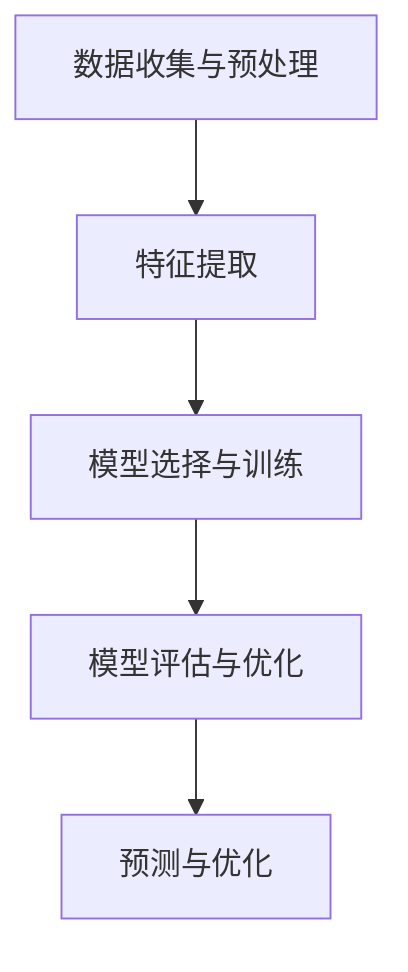

                 

# AI时空建模的未来趋势

## 概述

随着人工智能技术的迅猛发展，时空建模已成为人工智能领域的一个重要分支。AI时空建模结合了时序分析和地理信息处理技术，旨在对时空数据进行深入分析和预测。本文将深入探讨AI时空建模的未来趋势，分析其核心概念、算法原理、应用场景及面临的挑战。

### 关键词
- AI时空建模
- 时空数据
- 特征提取
- 建模算法
- 应用场景
- 未来趋势

### 摘要
本文将首先介绍AI时空建模的基本概念和核心挑战，然后详细讲解时空数据与特征提取方法，接着阐述时空建模的算法原理。随后，我们将探讨AI时空建模在不同领域的应用案例，并分析其面临的挑战。最后，本文将展望AI时空建模的未来发展趋势。

## 第一部分: AI时空建模的背景与核心概念

### 第1章: AI时空建模概述

#### 1.1 AI时空建模的定义

AI时空建模是一种利用人工智能技术对时空数据进行处理和分析的方法。它结合了时序分析和地理信息处理技术，旨在解决各种时空数据分析问题，如时间序列预测、空间分布分析、事件关联分析等。

#### 1.2 AI时空建模的核心挑战

AI时空建模面临的核心挑战包括数据复杂性、算法选择、模型可解释性等。时空数据通常具有高维度、高噪声和动态变化的特点，这使得建模任务变得更加复杂。此外，选择合适的算法和模型，以及确保模型的可解释性，也是AI时空建模面临的重要挑战。

#### 1.3 AI时空建模的意义与应用领域

AI时空建模在许多领域具有广泛的应用，如城市规划、交通运输、能源管理、自然灾害预测等。它可以帮助我们更好地理解和利用时空数据，为决策提供科学依据。随着技术的不断发展，AI时空建模的应用领域将不断拓展。

## 第2章: 时空数据与特征提取

### 2.1 时空数据的类型与来源

时空数据可以分为静态数据和动态数据。静态数据主要包括地图、人口分布、建筑物位置等，而动态数据则包括交通流量、天气变化、能源消耗等。这些数据可以从各种来源获取，如卫星遥感、GPS定位、传感器网络等。

### 2.2 时序数据的特征提取方法

时序数据的特征提取方法主要包括时间窗口、滑动平均、自相关函数等。这些方法可以帮助我们提取时序数据的趋势、周期性、平稳性等特征，从而更好地理解数据。

### 2.3 空间数据的特征提取方法

空间数据的特征提取方法主要包括距离度量、空间分布分析、地理编码等。这些方法可以帮助我们提取空间数据的分布、关联性等特征，从而更好地理解数据。

### 2.4 结合时空数据的特征提取方法

结合时空数据的特征提取方法包括时空窗口、时空序列分析、多模态数据融合等。这些方法可以帮助我们提取时空数据的综合特征，从而更好地理解数据。

## 第3章: 时空建模算法原理

### 3.1 基于传统机器学习的时空建模方法

传统机器学习算法，如线性回归、支持向量机、决策树等，可以通过特征提取和分类器设计来构建时空预测模型。这些方法通常适用于简单的时空数据建模任务。

### 3.2 基于深度学习的时空建模方法

深度学习算法，如卷积神经网络（CNN）、循环神经网络（RNN）、长短期记忆网络（LSTM）等，通过多层神经网络结构可以提取时空数据的高层次特征，适用于复杂时空数据建模任务。

### 3.3 基于图论的时空建模方法

图论算法，如图卷积网络（GCN）、图神经网络（GNN）等，通过图结构来表示时空数据，可以更好地捕捉时空数据之间的关联性。

### 3.4 跨学科融合的时空建模方法

跨学科融合的时空建模方法，如基于强化学习的时空建模、基于多模态数据融合的时空建模等，可以综合利用不同学科的方法和技术，提高时空建模的效果。

## 第二部分: 时空建模的应用场景与案例

### 第4章: 地理空间规划

地理空间规划是AI时空建模的重要应用领域之一。通过时空建模，可以优化城市规划、交通网络设计、环境保护等。

#### 4.1 城市规划中的时空建模

城市规划中的时空建模可以帮助决策者预测城市发展趋势，优化土地利用和交通流量，提高城市运行效率。

#### 4.2 环境监测与治理的时空建模

环境监测与治理的时空建模可以帮助识别环境污染源、预测环境污染趋势，为环境保护决策提供科学依据。

#### 4.3 农业生产的时空建模

农业生产的时空建模可以帮助农民预测作物生长周期、优化灌溉计划，提高农业生产效益。

### 第5章: 交通运输规划

交通运输规划是AI时空建模的另一个重要应用领域。通过时空建模，可以优化交通网络、预测交通流量、提高交通效率。

#### 5.1 交通流量预测的时空建模

交通流量预测的时空建模可以帮助交通管理部门优化交通信号控制、预测交通拥堵，提高交通运行效率。

#### 5.2 公路网络优化与维护的时空建模

公路网络优化与维护的时空建模可以帮助公路管理部门预测路面状况、优化公路养护计划，提高公路使用寿命。

#### 5.3 铁路网络规划与调度优化

铁路网络规划与调度优化的时空建模可以帮助铁路管理部门优化列车运行计划、预测列车运行状况，提高铁路运行效率。

### 第6章: 能源管理

能源管理是AI时空建模的又一重要应用领域。通过时空建模，可以优化能源分配、预测能源消耗，提高能源利用效率。

#### 6.1 能源消耗预测的时空建模

能源消耗预测的时空建模可以帮助能源管理部门优化能源分配、预测能源消耗趋势，为能源供应决策提供科学依据。

#### 6.2 能源分配与调度优化

能源分配与调度优化的时空建模可以帮助能源管理部门优化能源供应策略、预测能源需求，提高能源利用效率。

#### 6.3 智能电网的时空建模与优化

智能电网的时空建模与优化可以帮助电网管理部门预测电力需求、优化电力调度，提高电网运行效率。

### 第7章: 自然灾害预测与应对

自然灾害预测与应对是AI时空建模的重要应用领域之一。通过时空建模，可以预测自然灾害的发生、评估灾害影响，为灾害应对提供科学依据。

#### 7.1 气象预测的时空建模

气象预测的时空建模可以帮助气象部门预测天气变化、评估气象灾害风险，为气象灾害预警提供科学依据。

#### 7.2 地震预测的时空建模

地震预测的时空建模可以帮助地震部门预测地震发生、评估地震影响，为地震应对提供科学依据。

#### 7.3 防灾减灾的时空建模与策略

防灾减灾的时空建模与策略可以帮助政府部门预测灾害风险、制定灾害应对策略，提高防灾减灾能力。

### 第8章: 公共安全

公共安全是AI时空建模的重要应用领域之一。通过时空建模，可以预测犯罪趋势、评估安全风险，为公共安全提供科学依据。

#### 8.1 赌博诈骗的时空建模与检测

赌博诈骗的时空建模与检测可以帮助警方预测赌博诈骗案件、评估诈骗风险，提高打击赌博诈骗的能力。

#### 8.2 赌场盈利预测的时空建模

赌场盈利预测的时空建模可以帮助赌场管理部门预测盈利趋势、制定营销策略，提高赌场盈利。

#### 8.3 网络安全事件的时空建模

网络安全事件的时空建模可以帮助网络安全部门预测网络安全事件、评估安全风险，提高网络安全防护能力。

## 第三部分: 时空建模的未来趋势与挑战

### 第9章: 时空建模技术的发展趋势

时空建模技术在未来将继续发展，以下是几个可能的发展趋势：

#### 9.1 端到端时空建模

端到端时空建模将逐步取代传统的分层特征提取方法，直接从原始数据中提取时空特征，实现更高效、更准确的时空建模。

#### 9.2 多模态时空数据融合

多模态时空数据融合将整合来自不同来源的数据，如图像、视频、传感器数据等，实现更全面、更准确的时空建模。

#### 9.3 模型压缩与优化

为了适应实时性和移动设备的要求，时空建模技术将朝着模型压缩和优化的方向发展，提高模型的计算效率和存储空间。

### 第10章: 时空建模面临的挑战

尽管AI时空建模具有广泛的应用前景，但仍然面临一些挑战：

#### 10.1 数据隐私与安全

时空数据通常包含敏感信息，如何保护数据隐私和安全是一个重要挑战。

#### 10.2 可解释性与透明度

时空建模模型通常具有复杂性和非线性，如何提高模型的可解释性和透明度是一个重要挑战。

#### 10.3 模型部署与实际应用

将时空建模模型部署到实际应用场景中，如何确保模型的可靠性和有效性是一个重要挑战。

### 第11章: 未来展望

在未来，AI时空建模将在更多领域得到应用，如智能交通、智慧城市、智能家居等。随着技术的不断进步，AI时空建模将为我们提供更智能、更高效的解决方案。

## 附录

### 附录 A: AI时空建模相关工具与资源

#### A.1 主流时空建模框架

- TensorFlow：https://www.tensorflow.org/
- PyTorch：https://pytorch.org/
- 其他框架：https://www.tensorflow.org/tutorials/structured_data/geo_sm

#### A.2 开源时空数据集

- OpenStreetMap：https://www.openstreetmap.org/
- Google Maps：https://www.google.com/maps/
- 其他数据集：https://www.kaggle.com/datasets?search=spatial

## 结语

AI时空建模作为一种新兴的人工智能技术，具有广泛的应用前景和潜力。通过本文的探讨，我们对其核心概念、算法原理、应用场景和未来趋势有了更深入的了解。我们相信，随着技术的不断进步，AI时空建模将在更多领域发挥重要作用，为人类社会带来更多便利和创新。

### 作者

作者：AI天才研究院/AI Genius Institute & 禅与计算机程序设计艺术 /Zen And The Art of Computer Programming

---

由于篇幅限制，本文未能详细展开所有章节的内容。在后续的文章中，我们将逐一对每个章节进行深入探讨，包括核心概念、算法原理、实际案例和未来趋势。敬请期待！

## 第1章: AI时空建模概述

### 1.1 AI时空建模的定义

AI时空建模是一种利用人工智能技术对时空数据进行处理和分析的方法。时空数据是指同时包含时间和空间信息的数据。在AI时空建模中，时间维度和空间维度通常是相互关联的，因此建模的目标通常是捕捉数据在不同时间和空间上的变化规律。

定义AI时空建模的核心在于其处理的多维度特性。一方面，它涉及时间序列分析，即对随时间变化的数据进行建模和分析；另一方面，它也涉及地理空间分析，即对数据的空间分布、关系和模式进行建模和分析。因此，AI时空建模可以看作是时间序列分析和地理空间分析的结合体。

### 1.2 AI时空建模的核心挑战

AI时空建模面临的核心挑战包括数据复杂性、算法选择和模型可解释性等。

**数据复杂性：** 时空数据通常具有高维度、高噪声和动态变化的特点。高维度意味着数据包含大量的特征，这会增加建模的复杂度；高噪声则会影响模型的准确性；动态变化则要求模型能够适应数据的变化，具有较好的泛化能力。

**算法选择：** 在AI时空建模中，选择合适的算法是关键。传统机器学习算法，如线性回归、决策树和支持向量机等，在处理简单时空数据时可能效果不错，但对于复杂时空数据，这些算法可能难以胜任。深度学习算法，如卷积神经网络（CNN）、循环神经网络（RNN）和长短期记忆网络（LSTM）等，具有更强的表达能力和学习能力，能够处理复杂的时空数据。此外，图论算法，如图卷积网络（GCN）和图神经网络（GNN）等，也可以通过图结构更好地捕捉时空数据的关联性。

**模型可解释性：** 在实际应用中，模型的可解释性是一个重要的考量因素。尤其是在公共安全和医疗等关键领域，模型的决策过程需要透明和可解释，以便用户理解和信任。然而，深度学习模型往往具有复杂的内部结构，其决策过程难以解释。因此，如何在保证模型性能的同时提高其可解释性，是一个亟待解决的问题。

### 1.3 AI时空建模的意义与应用领域

AI时空建模在多个领域具有广泛的应用意义：

**城市规划与地理空间规划：** 通过AI时空建模，可以对城市发展趋势进行预测，优化土地利用和交通流量，提高城市运行效率。例如，通过分析交通流量数据，可以预测未来几年某地区的交通拥堵情况，从而提前进行道路规划或交通信号控制优化。

**交通运输规划：** 时空建模可以帮助交通管理部门优化交通网络，预测交通流量，提高交通效率。例如，通过分析历史交通数据，可以预测某个路口在高峰期的交通流量，从而优化信号灯控制策略。

**能源管理：** 时空建模可以帮助能源管理部门预测能源消耗，优化能源分配和调度，提高能源利用效率。例如，通过分析历史能源消耗数据，可以预测未来某地区的电力需求，从而优化电网调度策略。

**自然灾害预测：** 时空建模可以帮助预测自然灾害的发生和影响，为防灾减灾提供科学依据。例如，通过分析气象数据，可以预测暴雨引发的洪水风险，从而提前进行防洪措施。

**公共安全：** 时空建模可以帮助预测犯罪趋势、评估安全风险，为公共安全提供科学依据。例如，通过分析历史犯罪数据，可以预测未来某地区的犯罪趋势，从而优化警力部署。

总之，AI时空建模不仅有助于我们更好地理解和利用时空数据，还可以为决策提供科学依据，提高各个领域的运行效率和安全性。

### 1.4 AI时空建模的发展历程

AI时空建模的发展历程可以追溯到20世纪80年代，当时计算机技术和人工智能技术刚刚起步。早期的时空建模主要依赖于传统机器学习算法，如线性回归、决策树和支持向量机等。这些算法通过特征工程和模型选择来处理时空数据。

随着计算机性能的提升和深度学习技术的发展，20世纪10年代开始，深度学习算法，如卷积神经网络（CNN）、循环神经网络（RNN）和长短期记忆网络（LSTM）等，逐渐成为时空建模的主要工具。这些算法能够自动提取时空数据的高层次特征，提高了建模的效率和准确性。

此外，图论算法，如图卷积网络（GCN）和图神经网络（GNN）等，也在时空建模中得到了广泛应用。这些算法通过图结构更好地捕捉时空数据之间的关联性，提高了建模的效果。

总的来说，AI时空建模的发展历程反映了人工智能技术的不断进步和应用领域的不断拓展。未来，随着多模态数据融合、模型压缩与优化等技术的不断发展，AI时空建模将在更多领域发挥重要作用。

### 1.5 AI时空建模的关键概念

在AI时空建模中，有几个关键概念需要了解：

**时空数据：** 时空数据是指同时包含时间和空间信息的数据。它通常由时间和位置信息组成，可以用来描述事件发生的时空特征。时空数据可以是静态的，如地图数据；也可以是动态的，如交通流量数据。

**时序分析：** 时序分析是一种研究时间序列数据的方法，旨在识别时间序列中的模式、趋势和周期性。时序分析在AI时空建模中起着核心作用，因为它可以帮助我们理解和预测时间上的变化。

**地理空间分析：** 地理空间分析是一种研究地理空间数据的方法，旨在识别空间分布、关系和模式。地理空间分析在AI时空建模中也起着核心作用，因为它可以帮助我们理解和预测空间上的变化。

**特征提取：** 特征提取是从原始数据中提取具有代表性的特征的过程。在AI时空建模中，特征提取是关键步骤，因为它决定了模型对数据的理解和表达能力。

**时空窗口：** 时空窗口是一种用于处理时空数据的窗口技术，它通过固定时间段和空间范围来提取数据。时空窗口可以帮助我们集中分析特定时间段和空间范围内的数据，从而更好地捕捉时空特征。

**时空序列：** 时空序列是一种将时间和空间信息结合在一起的数据序列。它通常由一系列时空点组成，每个时空点包含时间和位置信息。时空序列在AI时空建模中用于分析数据在时间和空间上的变化规律。

**时空关联性：** 时空关联性是指时空数据之间的相互关系。通过分析时空关联性，可以识别时空数据中的潜在模式和趋势。

**时空预测：** 时空预测是利用AI模型对时空数据进行预测的过程。时空预测可以帮助我们预测未来时间和空间上的变化，为决策提供科学依据。

通过了解这些关键概念，我们可以更好地理解和应用AI时空建模技术，为各种领域提供智能化的解决方案。

### 1.6 AI时空建模的基本步骤

AI时空建模通常包括以下几个基本步骤：

**数据收集与预处理：** 首先，需要收集与目标应用场景相关的时空数据。这些数据可以来源于各种来源，如传感器、卫星遥感、GPS定位等。在收集到数据后，需要进行预处理，包括数据清洗、去噪、数据格式转换等，以确保数据的质量和一致性。

**特征提取：** 在预处理完成后，需要对时空数据进行特征提取。特征提取是AI时空建模的关键步骤，因为它决定了模型对数据的理解和表达能力。常见的特征提取方法包括时序特征提取、空间特征提取和时空特征提取等。

**模型选择与训练：** 根据应用场景和数据特点，选择合适的模型进行训练。常见的模型包括线性回归、决策树、支持向量机、深度学习模型（如卷积神经网络、循环神经网络、长短期记忆网络等）和图神经网络等。

**模型评估与优化：** 在模型训练完成后，需要对模型进行评估和优化。评估指标通常包括预测准确性、计算效率等。如果模型效果不理想，可以尝试调整模型参数、增加数据或更换模型等。

**模型部署与实际应用：** 在模型优化后，可以将其部署到实际应用场景中，进行实时预测和分析。在实际应用中，需要考虑模型的计算效率和实时性，以确保其能够满足应用需求。

通过以上基本步骤，我们可以构建一个完整的AI时空建模流程，为各种应用场景提供智能化的解决方案。

### 1.7 AI时空建模的应用案例

AI时空建模在多个领域具有广泛的应用案例，以下是几个典型的应用场景：

**交通流量预测：** 通过AI时空建模，可以对交通流量进行预测，帮助交通管理部门优化交通信号控制和道路规划。例如，某城市交通管理部门利用AI时空建模技术，分析了历史交通流量数据，成功预测了未来高峰期的交通拥堵情况，从而提前调整信号灯控制策略，降低了交通拥堵程度。

**城市规划：** AI时空建模可以用于城市规划，帮助决策者预测城市发展趋势，优化土地利用和交通流量。例如，某城市在进行新城区开发时，利用AI时空建模技术分析了人口增长、交通流量、土地利用等数据，预测了未来几年城市的发展趋势，从而制定出合理的新城区规划方案。

**灾害预测：** AI时空建模在灾害预测中也发挥了重要作用。例如，某气象部门利用AI时空建模技术分析了历史气象数据，成功预测了暴雨引发的洪水风险，为防洪措施的提前部署提供了科学依据。

**公共安全：** AI时空建模可以用于公共安全领域，帮助预测犯罪趋势、评估安全风险。例如，某城市公安局利用AI时空建模技术分析了历史犯罪数据，成功预测了未来某地区的犯罪趋势，从而优化了警力部署，提高了公共安全水平。

通过这些应用案例，我们可以看到AI时空建模在解决实际问题中的巨大潜力。随着技术的不断发展，AI时空建模将在更多领域发挥重要作用，为人类社会带来更多便利和创新。

### 1.8 AI时空建模的挑战与未来方向

尽管AI时空建模在许多领域取得了显著的成果，但仍然面临一些挑战和未来方向。

**挑战：**
1. **数据隐私与安全：** 时空数据通常包含敏感信息，如个人位置、交通流量等。如何保护数据隐私和安全是一个重要挑战。未来需要开发更高效、更安全的隐私保护技术，以确保数据在建模过程中不被泄露。
2. **模型可解释性：** 深度学习模型通常具有复杂性和非线性，其决策过程难以解释。提高模型的可解释性，使其更具透明度，是未来需要重点关注的方向。
3. **计算资源：** 时空建模任务通常需要大量的计算资源，尤其是在处理高维度、大规模时空数据时。如何优化模型和算法，提高计算效率，是一个重要挑战。

**未来方向：**
1. **多模态时空数据融合：** 将来自不同来源的数据（如图像、视频、传感器数据）进行融合，可以提高时空建模的效果。未来需要开发更高效、更准确的多模态时空数据融合方法。
2. **端到端时空建模：** 端到端时空建模直接从原始数据中提取特征，可以实现更高效、更准确的建模。未来需要进一步研究端到端时空建模的方法和算法。
3. **模型压缩与优化：** 为了适应实时性和移动设备的要求，需要开发模型压缩和优化技术，提高模型的计算效率和存储空间。
4. **跨学科融合：** AI时空建模可以与其他学科（如经济学、社会学、环境科学等）进行融合，解决更复杂的问题。未来需要进一步推动跨学科合作，探索新的应用场景。

通过解决这些挑战和探索未来方向，AI时空建模将在更多领域发挥重要作用，为人类社会带来更多便利和创新。

### 1.9 小结

本章介绍了AI时空建模的基本概念、核心挑战、意义与应用领域，并探讨了其发展历程和关键概念。AI时空建模通过结合时序分析和地理空间分析技术，可以解决各种时空数据分析问题，具有广泛的应用前景。在接下来的章节中，我们将深入探讨时空数据与特征提取方法、时空建模算法原理、应用场景与案例，以及未来趋势与挑战。希望通过本章的介绍，读者能够对AI时空建模有更全面、深入的了解。

## 第2章: 时空数据与特征提取

### 2.1 时空数据的类型与来源

时空数据可以分为静态数据和动态数据两大类。静态数据主要包括地图、人口分布、建筑物位置等，而动态数据则包括交通流量、天气变化、能源消耗等。

**静态数据：**
- **地图数据：** 地图数据是时空数据中非常重要的一部分，通常来源于卫星遥感、GIS（地理信息系统）等。常见的地图数据格式包括Shapefile、GeoJSON等。
- **人口分布数据：** 人口分布数据通常来源于人口普查、户籍数据等，可以用于分析城市发展趋势、优化土地利用等。
- **建筑物位置数据：** 建筑物位置数据可以用于城市规划、灾害风险评估等，通常来源于卫星遥感、无人机等。

**动态数据：**
- **交通流量数据：** 交通流量数据可以来源于GPS定位、交通监控设备等，可以用于交通流量预测、交通信号控制等。
- **天气数据：** 天气数据通常来源于气象站、卫星遥感等，可以用于气象预测、灾害预警等。
- **能源消耗数据：** 能源消耗数据可以来源于电力公司、天然气公司等，可以用于能源管理、节能优化等。

**数据来源：**
- **传感器网络：** 传感器网络可以实时监测各种环境参数，如温度、湿度、空气质量等，生成动态时空数据。
- **卫星遥感：** 卫星遥感技术可以获取高分辨率的地表图像，生成静态时空数据。
- **GPS定位：** GPS定位技术可以实时获取位置信息，生成动态时空数据。
- **社交媒体：** 社交媒体数据可以反映人们的活动轨迹、兴趣爱好等，生成动态时空数据。

### 2.2 时序数据的特征提取方法

时序数据是指随时间变化的数据，特征提取是从时序数据中提取具有代表性的特征的过程。常见的时序数据特征提取方法包括：

**时间窗口：** 时间窗口是一种将数据划分为固定时间段的方法，例如，可以将数据分为1小时、1天、1个月等时间段。时间窗口可以帮助我们集中分析特定时间段内的数据，提取趋势、周期性等特征。

**滑动平均：** 滑动平均是一种常用的时序平滑方法，通过计算一段时间内的平均值来消除噪声。例如，可以计算过去7天的平均温度，以平滑温度的波动。

**自相关函数：** 自相关函数是一种用于衡量时序数据自相关性的方法。自相关性反映了时序数据在不同时间点的关联程度，可以用来识别数据的趋势和周期性。

**傅里叶变换：** 傅里叶变换是一种将时序数据转换为频率域的方法，可以提取时序数据的频率特征。通过傅里叶变换，可以将时序数据分解为不同的频率成分，从而识别数据的周期性。

**小波变换：** 小波变换是一种将时序数据转换为小波域的方法，可以提取时序数据的多尺度特征。小波变换通过在不同尺度上分析数据，可以捕捉到时序数据中的局部特征。

**时频分析：** 时频分析是一种同时分析时序数据的时间特征和频率特征的方法。时频分析可以通过不同时间窗口或频率窗口来分析数据，提取时序数据的时间频率特征。

### 2.3 空间数据的特征提取方法

空间数据是指描述地理位置和空间关系的数据，特征提取是从空间数据中提取具有代表性的特征的过程。常见空间数据特征提取方法包括：

**距离度量：** 距离度量是一种用于计算两个地理位置之间距离的方法，例如欧几里得距离、曼哈顿距离等。距离度量可以用于分析地理位置之间的关联性和相对位置关系。

**空间分布分析：** 空间分布分析是一种用于分析地理位置分布特征的方法，例如聚类分析、热点分析等。空间分布分析可以识别地理位置的聚集程度和分布模式。

**地理编码：** 地理编码是一种将地理位置信息转换为编码表示的方法，例如经纬度编码、邮政编码等。地理编码可以用于地理位置的识别和定位。

**拓扑分析：** 拓扑分析是一种用于分析地理位置拓扑关系的方法，例如连通性分析、路径分析等。拓扑分析可以识别地理位置之间的连通性和路径关系。

**地物识别：** 地物识别是一种用于识别地理位置上特定地物的方法，例如建筑物识别、道路识别等。地物识别可以用于地理信息系统的数据分析和可视化。

### 2.4 结合时空数据的特征提取方法

在AI时空建模中，通常需要将时序数据特征和空间数据特征相结合，以提取更全面、更准确的特征。常见的结合时空数据的特征提取方法包括：

**时空窗口：** 时空窗口是一种将时间和空间信息结合在一起的窗口技术，通过固定的时间段和空间范围来提取数据。时空窗口可以帮助我们集中分析特定时间段和空间范围内的数据，提取时空特征。

**时空序列：** 时空序列是一种将时间和空间信息组合在一起的数据序列，每个时空点包含时间和位置信息。时空序列可以用于分析数据在时间和空间上的变化规律。

**时空关联性分析：** 时空关联性分析是一种用于分析时空数据之间相互关系的方法，通过识别时空数据之间的关联性来提取特征。时空关联性分析可以用于挖掘时空数据中的潜在模式和趋势。

**多模态数据融合：** 多模态数据融合是一种将来自不同来源的数据（如图像、视频、传感器数据）进行融合的方法，以提高时空建模的效果。多模态数据融合可以通过特征融合、模型融合等方法来实现。

**时空聚类：** 时空聚类是一种用于分析时空数据分布特征的方法，通过将相似时空点聚为一类来提取特征。时空聚类可以用于识别时空数据的分布模式和异常点。

通过结合时空数据的特征提取方法，我们可以从不同角度提取时空特征，提高AI时空建模的准确性和效果。

### 2.5 特征提取的挑战与优化策略

尽管特征提取在AI时空建模中起着重要作用，但仍然面临一些挑战和优化策略：

**挑战：**
- **高维度问题：** 时序数据和空间数据通常具有高维度，这会增加特征提取的复杂度和计算成本。
- **噪声处理：** 时序数据和空间数据中常常存在噪声，如何有效去除噪声是特征提取的关键挑战。
- **数据不平衡：** 时序数据和空间数据中可能存在数据不平衡问题，例如某些时间段或空间范围内的数据量较少，这会影响特征提取的效果。
- **可解释性：** 特征提取过程通常涉及复杂的数学计算，如何提高特征提取的可解释性是一个重要挑战。

**优化策略：**
- **降维技术：** 利用降维技术，如主成分分析（PCA）、线性判别分析（LDA）等，可以减少特征维度，提高特征提取的效率和效果。
- **噪声滤波：** 利用噪声滤波技术，如中值滤波、高斯滤波等，可以去除时序数据和空间数据中的噪声。
- **数据增强：** 通过数据增强技术，如时间序列插值、空间插值等，可以增加数据量，缓解数据不平衡问题。
- **模型解释性：** 利用模型解释性技术，如模型可视化、特征重要性分析等，可以提高特征提取过程的可解释性。

通过上述优化策略，我们可以提高特征提取的效果和可解释性，从而提高AI时空建模的准确性和实用性。

### 2.6 小结

本章详细介绍了时空数据的类型与来源、时序数据的特征提取方法和空间数据的特征提取方法。同时，我们还探讨了结合时空数据的特征提取方法，以及特征提取过程中面临的挑战和优化策略。通过本章的内容，读者可以全面了解AI时空建模中的特征提取技术，为后续的建模和分析打下坚实基础。在下一章中，我们将深入探讨时空建模算法原理，分析不同算法的应用场景和优缺点。

## 第3章: 时空建模算法原理

### 3.1 基于传统机器学习的时空建模方法

基于传统机器学习的时空建模方法主要利用线性回归、决策树和支持向量机等经典算法来处理时空数据。这些算法通过特征工程和模型选择，能够对简单的时空数据进行分析和预测。

**线性回归**

线性回归是一种简单的时空建模方法，它通过建立线性关系来预测时空数据。线性回归模型的数学表达式为：

\[ y = \beta_0 + \beta_1x_1 + \beta_2x_2 + ... + \beta_nx_n + \epsilon \]

其中，\( y \)是预测值，\( x_1, x_2, ..., x_n \)是特征值，\( \beta_0, \beta_1, \beta_2, ..., \beta_n \)是模型参数，\( \epsilon \)是误差项。

**决策树**

决策树是一种树形结构模型，通过一系列规则来对时空数据进行分类或回归。决策树的核心思想是根据特征值的不同取值，将数据划分为不同的子集，并递归地构建树结构。决策树的数学表达式可以表示为：

\[ y = f(x) \]

其中，\( f \)是决策函数，根据不同的特征值和分支，\( f \)可以表示为：

\[ f(x) = \begin{cases} 
y_1 & \text{if } x \in R_1 \\
y_2 & \text{if } x \in R_2 \\
... \\
y_n & \text{if } x \in R_n 
\end{cases} \]

其中，\( R_1, R_2, ..., R_n \)是数据的不同区域。

**支持向量机**

支持向量机（SVM）是一种强大的分类和回归模型，通过最大化分类边界来提高模型的泛化能力。SVM的数学表达式为：

\[ w \cdot x + b = y \]

其中，\( w \)是权重向量，\( x \)是特征向量，\( b \)是偏置项，\( y \)是预测值。

**优点与局限性**

传统机器学习算法的优点在于其计算效率和解释性。线性回归和决策树模型简单易懂，便于理解和解释；支持向量机具有较高的泛化能力，能够处理复杂的时空数据。

然而，传统机器学习算法在处理高维度、非线性时空数据时可能存在局限性。线性回归模型的假设条件较严格，需要数据满足线性关系；决策树模型容易过拟合，无法很好地泛化；支持向量机计算复杂度高，对大规模数据集的处理效率较低。

### 3.2 基于深度学习的时空建模方法

基于深度学习的时空建模方法利用卷积神经网络（CNN）、循环神经网络（RNN）和长短期记忆网络（LSTM）等深度学习模型，能够自动提取时空数据的高层次特征，具有较强的表达能力和泛化能力。

**卷积神经网络（CNN）**

卷积神经网络是一种用于图像识别和处理的深度学习模型，其核心思想是通过卷积操作提取图像的特征。CNN在时空建模中可以用于提取时序数据的空间特征。CNN的基本结构包括卷积层、池化层和全连接层。

卷积层的数学表达式为：

\[ h_{ij} = \sum_{k=1}^{m} w_{ik} \cdot x_{kj} + b_j \]

其中，\( h_{ij} \)是输出特征，\( w_{ik} \)是卷积核，\( x_{kj} \)是输入特征，\( b_j \)是偏置项。

池化层的数学表达式为：

\[ p_i = \max_{j=1}^{n} h_{ij} \]

其中，\( p_i \)是池化结果，\( h_{ij} \)是输入特征。

全连接层的数学表达式为：

\[ y_j = \sum_{i=1}^{k} w_{ij} \cdot p_i + b_j \]

其中，\( y_j \)是输出特征，\( w_{ij} \)是权重，\( p_i \)是输入特征，\( b_j \)是偏置项。

**循环神经网络（RNN）**

循环神经网络是一种用于处理时序数据的深度学习模型，其核心思想是通过循环结构保持长期依赖关系。RNN的基本结构包括输入层、隐藏层和输出层。

输入层的数学表达式为：

\[ x_t = \text{input} \]

隐藏层的数学表达式为：

\[ h_t = \text{sigmoid}(W_h \cdot [h_{t-1}, x_t] + b_h) \]

输出层的数学表达式为：

\[ y_t = \text{sigmoid}(W_y \cdot h_t + b_y) \]

其中，\( x_t \)是输入特征，\( h_t \)是隐藏层特征，\( y_t \)是输出特征，\( W_h \)和\( W_y \)是权重矩阵，\( b_h \)和\( b_y \)是偏置项。

**长短期记忆网络（LSTM）**

长短期记忆网络是一种改进的RNN模型，用于解决长期依赖问题。LSTM通过引入遗忘门、输入门和输出门来控制信息的流动。LSTM的基本结构包括输入门、遗忘门、输入层、输出层和单元状态。

输入门的数学表达式为：

\[ i_t = \text{sigmoid}(W_i \cdot [h_{t-1}, x_t] + b_i) \]

遗忘门的数学表达式为：

\[ f_t = \text{sigmoid}(W_f \cdot [h_{t-1}, x_t] + b_f) \]

输入层的数学表达式为：

\[ g_t = \text{tanh}(W_g \cdot [h_{t-1}, x_t] + b_g) \]

输出门的数学表达式为：

\[ o_t = \text{sigmoid}(W_o \cdot [h_{t-1}, x_t] + b_o) \]

单元状态的数学表达式为：

\[ C_t = f_t \cdot C_{t-1} + i_t \cdot g_t \]

输出层的数学表达式为：

\[ h_t = o_t \cdot \text{tanh}(C_t) \]

其中，\( i_t, f_t, o_t, g_t, C_t, h_t \)分别是输入门、遗忘门、输出门、输入层、单元状态和隐藏层特征，\( W_i, W_f, W_g, W_o, b_i, b_f, b_g, b_o \)是权重矩阵和偏置项。

**优点与局限性**

基于深度学习的时空建模方法具有强大的表达能力和泛化能力，能够自动提取时空数据的高层次特征，适用于复杂的时空数据建模任务。CNN能够有效地提取空间特征，RNN和LSTM能够处理长序列数据。

然而，深度学习模型也存在一些局限性。首先，深度学习模型通常需要大量的数据来训练，对于数据量较少的任务，模型性能可能较差。其次，深度学习模型的训练过程需要大量的计算资源，时间成本较高。此外，深度学习模型的决策过程通常较复杂，难以解释，这限制了其在某些需要模型可解释性的应用场景中的使用。

### 3.3 基于图论的时空建模方法

基于图论的时空建模方法利用图结构来表示和建模时空数据，通过图卷积网络（GCN）和图神经网络（GNN）等图神经网络来提取时空数据之间的关联性。

**图卷积网络（GCN）**

图卷积网络是一种基于图结构的神经网络，通过图卷积操作提取节点特征。GCN的基本结构包括输入层、隐藏层和输出层。

输入层的数学表达式为：

\[ X = \text{input} \]

隐藏层的数学表达式为：

\[ H = (A + I) \cdot \hat{D}^{-\frac{1}{2}} \cdot \text{ReLU}((A + I) \cdot \hat{D}^{-\frac{1}{2}} \cdot W \cdot X + b) \]

输出层的数学表达式为：

\[ Y = W \cdot H + b \]

其中，\( X \)是输入特征，\( H \)是隐藏层特征，\( Y \)是输出特征，\( A \)是邻接矩阵，\( \hat{D} \)是对称邻接矩阵的度矩阵，\( W \)是权重矩阵，\( b \)是偏置项。

**图神经网络（GNN）**

图神经网络是一种更广义的图结构神经网络，通过聚合节点邻域信息来更新节点特征。GNN的基本结构包括输入层、隐藏层和输出层。

输入层的数学表达式为：

\[ X = \text{input} \]

隐藏层的数学表达式为：

\[ H = \text{ReLU}(\sum_{j=1}^{n} \alpha_{ij} \cdot X_j + b) \]

输出层的数学表达式为：

\[ Y = W \cdot H + b \]

其中，\( X \)是输入特征，\( H \)是隐藏层特征，\( Y \)是输出特征，\( \alpha_{ij} \)是权重系数，\( X_j \)是节点邻域特征。

**优点与局限性**

基于图论的时空建模方法能够有效地捕捉时空数据之间的关联性，适用于需要处理复杂数据结构和关联性的任务。GCN和GNN能够处理异构图数据，提取节点和边的特征。

然而，基于图论的时空建模方法也存在一些局限性。首先，图结构的构建和表示过程可能较复杂，需要大量的预处理工作。其次，图神经网络模型的训练过程通常需要较长的计算时间，对于大规模图数据集，训练效率较低。此外，图神经网络模型的解释性较差，难以理解模型的具体决策过程。

### 3.4 跨学科融合的时空建模方法

跨学科融合的时空建模方法通过整合不同学科的方法和技术，以提高时空建模的效果和准确性。常见的跨学科融合方法包括基于强化学习的时空建模、基于多模态数据融合的时空建模等。

**基于强化学习的时空建模**

基于强化学习的时空建模方法利用强化学习算法，如Q-learning、SARSA等，来优化时空决策。强化学习通过奖励机制来引导模型学习最佳决策策略。基于强化学习的时空建模方法适用于需要动态决策的时空场景，如交通流量控制、能源管理等。

**基于多模态数据融合的时空建模**

基于多模态数据融合的时空建模方法将来自不同来源的数据（如图像、视频、传感器数据）进行融合，以提高时空建模的效果。多模态数据融合可以通过特征融合、模型融合等方法来实现。基于多模态数据融合的时空建模方法适用于需要综合分析多种数据类型的任务，如智能交通、智慧城市等。

**优点与局限性**

跨学科融合的时空建模方法能够综合利用不同学科的方法和技术，提高时空建模的效果和准确性。基于强化学习的时空建模方法能够处理动态决策问题，基于多模态数据融合的时空建模方法能够综合分析多种数据类型。

然而，跨学科融合的时空建模方法也存在一些局限性。首先，跨学科融合方法通常需要复杂的预处理和融合过程，计算成本较高。其次，跨学科融合方法的效果取决于不同学科方法的匹配程度，融合效果可能不稳定。此外，跨学科融合方法的解释性较差，难以理解模型的具体决策过程。

### 3.5 小结

本章详细介绍了基于传统机器学习、深度学习和图论的时空建模方法，以及跨学科融合的时空建模方法。每种方法都有其独特的原理和应用场景。基于传统机器学习的时空建模方法适用于简单的时空数据建模任务，具有较好的计算效率和解释性；基于深度学习的时空建模方法具有强大的表达能力和泛化能力，适用于复杂的时空数据建模任务；基于图论的时空建模方法能够有效地捕捉时空数据之间的关联性，适用于处理复杂数据结构和关联性的任务；跨学科融合的时空建模方法通过整合不同学科的方法和技术，提高了时空建模的效果和准确性。在下一章中，我们将探讨时空建模的应用场景和案例，分析其在不同领域的应用效果。

## 第4章: 地理空间规划

地理空间规划是AI时空建模的重要应用领域之一。通过时空建模，可以优化城市规划、交通网络设计、环境保护等。本章节将详细介绍地理空间规划中的AI时空建模应用，包括城市规划中的时空建模、环境监测与治理的时空建模以及农业生产的时空建模。

### 4.1 城市规划中的时空建模

城市规划中的时空建模旨在通过分析历史数据和实时数据，预测城市发展趋势，优化土地利用和交通流量。以下是城市规划中常见的时空建模应用：

**交通流量预测：** 通过分析历史交通流量数据，AI时空建模可以预测未来高峰期的交通流量。这种方法可以帮助城市规划者优化交通信号控制策略，降低交通拥堵，提高交通效率。以下是一个交通流量预测的时空建模流程：

1. **数据收集与预处理：** 收集历史交通流量数据，包括车辆数量、速度、路段长度等。对数据进行预处理，包括数据清洗、去噪、数据格式转换等。
2. **特征提取：** 提取与交通流量相关的特征，如时间窗口内的平均速度、车辆数量等。可以使用时间窗口、滑动平均等方法提取时序特征。
3. **模型选择与训练：** 选择合适的模型，如循环神经网络（RNN）或长短期记忆网络（LSTM），进行训练。通过训练数据优化模型参数。
4. **模型评估与优化：** 使用验证数据集评估模型性能，根据评估结果调整模型参数，优化模型。
5. **预测与优化：** 使用训练好的模型进行交通流量预测，根据预测结果调整交通信号灯控制策略。

**土地利用预测：** 通过分析人口、经济、交通等因素，AI时空建模可以预测城市土地利用的发展趋势。这种方法可以帮助城市规划者合理规划城市用地，提高土地利用效率。以下是一个土地利用预测的时空建模流程：

1. **数据收集与预处理：** 收集与土地利用相关的数据，包括人口数据、经济数据、交通流量数据等。对数据进行预处理，包括数据清洗、去噪、数据格式转换等。
2. **特征提取：** 提取与土地利用相关的特征，如人口密度、经济指标、交通流量等。可以使用时空窗口、地理编码等方法提取时空特征。
3. **模型选择与训练：** 选择合适的模型，如线性回归、决策树或支持向量机等，进行训练。通过训练数据优化模型参数。
4. **模型评估与优化：** 使用验证数据集评估模型性能，根据评估结果调整模型参数，优化模型。
5. **预测与优化：** 使用训练好的模型进行土地利用预测，根据预测结果调整城市规划策略。

### 4.2 环境监测与治理的时空建模

环境监测与治理的时空建模旨在通过分析时空数据，预测环境污染趋势，优化环境保护策略。以下是环境监测与治理中常见的时空建模应用：

**气象预测：** 通过分析历史气象数据，AI时空建模可以预测未来一段时间内的气象变化，如温度、湿度、降雨量等。这种方法可以帮助环境保护部门提前采取应对措施，减少气象灾害对环境的影响。以下是一个气象预测的时空建模流程：

1. **数据收集与预处理：** 收集历史气象数据，包括温度、湿度、降雨量等。对数据进行预处理，包括数据清洗、去噪、数据格式转换等。
2. **特征提取：** 提取与气象预测相关的特征，如时间窗口内的平均温度、湿度等。可以使用时间窗口、滑动平均等方法提取时序特征。
3. **模型选择与训练：** 选择合适的模型，如循环神经网络（RNN）或长短期记忆网络（LSTM），进行训练。通过训练数据优化模型参数。
4. **模型评估与优化：** 使用验证数据集评估模型性能，根据评估结果调整模型参数，优化模型。
5. **预测与优化：** 使用训练好的模型进行气象预测，根据预测结果调整环境保护策略。

**水质预测：** 通过分析水质数据，AI时空建模可以预测未来一段时间内的水质变化。这种方法可以帮助环境保护部门提前发现水质问题，采取相应的治理措施。以下是一个水质预测的时空建模流程：

1. **数据收集与预处理：** 收集历史水质数据，包括pH值、溶解氧、氨氮等。对数据进行预处理，包括数据清洗、去噪、数据格式转换等。
2. **特征提取：** 提取与水质预测相关的特征，如时间窗口内的平均pH值、溶解氧等。可以使用时间窗口、滑动平均等方法提取时序特征。
3. **模型选择与训练：** 选择合适的模型，如线性回归、支持向量机等，进行训练。通过训练数据优化模型参数。
4. **模型评估与优化：** 使用验证数据集评估模型性能，根据评估结果调整模型参数，优化模型。
5. **预测与优化：** 使用训练好的模型进行水质预测，根据预测结果调整环境保护策略。

### 4.3 农业生产的时空建模

农业生产的时空建模旨在通过分析时空数据，预测作物生长周期、优化灌溉计划，提高农业生产效益。以下是农业生产中常见的时空建模应用：

**作物生长预测：** 通过分析土壤数据、气象数据、历史作物生长数据等，AI时空建模可以预测作物生长周期，如播种期、成熟期等。这种方法可以帮助农民合理安排农业生产活动，提高产量。以下是一个作物生长预测的时空建模流程：

1. **数据收集与预处理：** 收集土壤数据、气象数据、历史作物生长数据等。对数据进行预处理，包括数据清洗、去噪、数据格式转换等。
2. **特征提取：** 提取与作物生长预测相关的特征，如土壤湿度、温度、降水量等。可以使用时空窗口、地理编码等方法提取时空特征。
3. **模型选择与训练：** 选择合适的模型，如线性回归、支持向量机等，进行训练。通过训练数据优化模型参数。
4. **模型评估与优化：** 使用验证数据集评估模型性能，根据评估结果调整模型参数，优化模型。
5. **预测与优化：** 使用训练好的模型进行作物生长预测，根据预测结果调整农业生产计划。

**灌溉计划优化：** 通过分析土壤湿度、气象数据、作物需水量等，AI时空建模可以优化灌溉计划，提高水资源利用效率。以下是一个灌溉计划优化的时空建模流程：

1. **数据收集与预处理：** 收集土壤湿度数据、气象数据、作物需水量数据等。对数据进行预处理，包括数据清洗、去噪、数据格式转换等。
2. **特征提取：** 提取与灌溉计划优化相关的特征，如土壤湿度、温度、降水量等。可以使用时空窗口、地理编码等方法提取时空特征。
3. **模型选择与训练：** 选择合适的模型，如线性回归、支持向量机等，进行训练。通过训练数据优化模型参数。
4. **模型评估与优化：** 使用验证数据集评估模型性能，根据评估结果调整模型参数，优化模型。
5. **预测与优化：** 使用训练好的模型进行灌溉计划预测，根据预测结果调整灌溉计划。

### 4.4 小结

地理空间规划中的AI时空建模具有广泛的应用前景。通过交通流量预测、土地利用预测、环境监测与治理、作物生长预测和灌溉计划优化等应用，AI时空建模可以帮助城市规划者、环境保护部门和农业生产者更好地理解和利用时空数据，优化决策，提高效率。在下一章中，我们将探讨交通运输规划中的AI时空建模应用，分析其在交通流量预测、公路网络优化与维护、铁路网络规划与调度优化等方面的应用效果。

## 第5章: 交通运输规划

交通运输规划是AI时空建模的另一个重要应用领域。通过时空建模，可以优化交通网络、预测交通流量、提高交通效率。本章节将详细介绍交通运输规划中的AI时空建模应用，包括交通流量预测、公路网络优化与维护、铁路网络规划与调度优化等方面的应用。

### 5.1 交通流量预测

交通流量预测是交通运输规划中的一项关键任务，它可以帮助交通管理部门提前了解交通状况，优化交通信号控制和道路规划。以下是交通流量预测的时空建模流程：

1. **数据收集与预处理：** 收集历史交通流量数据，包括车辆数量、速度、路段长度等。对数据进行预处理，包括数据清洗、去噪、数据格式转换等。
2. **特征提取：** 提取与交通流量预测相关的特征，如时间窗口内的平均速度、车辆数量等。可以使用时间窗口、滑动平均等方法提取时序特征。
3. **模型选择与训练：** 选择合适的模型，如循环神经网络（RNN）或长短期记忆网络（LSTM），进行训练。通过训练数据优化模型参数。
4. **模型评估与优化：** 使用验证数据集评估模型性能，根据评估结果调整模型参数，优化模型。
5. **预测与优化：** 使用训练好的模型进行交通流量预测，根据预测结果调整交通信号灯控制策略。

**案例研究：** 
在某城市的交通流量预测项目中，研究人员利用了循环神经网络（RNN）进行建模。他们收集了历史交通流量数据，包括车辆数量、速度、路段长度等。通过时间窗口和滑动平均等方法提取时序特征，然后使用RNN模型进行训练。在模型评估过程中，研究人员使用了验证数据集，根据评估结果调整模型参数，优化模型性能。最终，训练好的模型可以准确预测未来一段时间内的交通流量，帮助交通管理部门优化交通信号灯控制策略，降低交通拥堵。

### 5.2 公路网络优化与维护

公路网络优化与维护是交通运输规划中的重要任务，它包括道路规划、道路养护、交通流量管理等方面。通过AI时空建模，可以优化公路网络设计，提高道路使用效率。以下是公路网络优化与维护的时空建模流程：

1. **数据收集与预处理：** 收集公路网络数据，包括道路信息、交通流量数据、气象数据等。对数据进行预处理，包括数据清洗、去噪、数据格式转换等。
2. **特征提取：** 提取与公路网络优化与维护相关的特征，如道路长度、道路宽度、交通流量等。可以使用时空窗口、地理编码等方法提取时空特征。
3. **模型选择与训练：** 选择合适的模型，如线性回归、支持向量机等，进行训练。通过训练数据优化模型参数。
4. **模型评估与优化：** 使用验证数据集评估模型性能，根据评估结果调整模型参数，优化模型。
5. **预测与优化：** 使用训练好的模型进行公路网络优化与维护预测，根据预测结果调整公路规划与维护策略。

**案例研究：**
在某城市的公路网络优化项目中，研究人员利用了支持向量机（SVM）进行建模。他们收集了公路网络数据，包括道路信息、交通流量数据、气象数据等。通过地理编码和时空窗口等方法提取时空特征，然后使用SVM模型进行训练。在模型评估过程中，研究人员使用了验证数据集，根据评估结果调整模型参数，优化模型性能。最终，训练好的模型可以预测未来一段时间内公路网络的使用情况，帮助交通管理部门优化道路规划与维护策略，提高道路使用效率。

### 5.3 铁路网络规划与调度优化

铁路网络规划与调度优化是交通运输规划中的重要任务，它包括铁路线路规划、列车调度、运输能力优化等方面。通过AI时空建模，可以优化铁路网络设计，提高运输效率。以下是铁路网络规划与调度优化的时空建模流程：

1. **数据收集与预处理：** 收集铁路网络数据，包括列车运行数据、车站信息、线路长度等。对数据进行预处理，包括数据清洗、去噪、数据格式转换等。
2. **特征提取：** 提取与铁路网络规划与调度优化相关的特征，如列车运行速度、列车数量、线路长度等。可以使用时空窗口、地理编码等方法提取时空特征。
3. **模型选择与训练：** 选择合适的模型，如线性回归、决策树等，进行训练。通过训练数据优化模型参数。
4. **模型评估与优化：** 使用验证数据集评估模型性能，根据评估结果调整模型参数，优化模型。
5. **预测与优化：** 使用训练好的模型进行铁路网络规划与调度优化预测，根据预测结果调整铁路规划与调度策略。

**案例研究：**
在某城市的铁路网络优化项目中，研究人员利用了线性回归模型进行建模。他们收集了铁路网络数据，包括列车运行数据、车站信息、线路长度等。通过地理编码和时空窗口等方法提取时空特征，然后使用线性回归模型进行训练。在模型评估过程中，研究人员使用了验证数据集，根据评估结果调整模型参数，优化模型性能。最终，训练好的模型可以预测未来一段时间内铁路网络的使用情况，帮助铁路管理部门优化列车调度策略，提高运输效率。

### 5.4 小结

交通运输规划中的AI时空建模在交通流量预测、公路网络优化与维护、铁路网络规划与调度优化等方面具有广泛的应用前景。通过交通流量预测，可以优化交通信号灯控制策略，降低交通拥堵；通过公路网络优化与维护，可以提高道路使用效率，延长道路使用寿命；通过铁路网络规划与调度优化，可以提高运输效率，减少运输成本。在下一章中，我们将探讨能源管理中的AI时空建模应用，分析其在能源消耗预测、能源分配与调度优化、智能电网时空建模与优化等方面的应用效果。

## 第6章: 能源管理

能源管理是AI时空建模的重要应用领域之一。通过时空建模，可以优化能源消耗预测、能源分配与调度优化、智能电网的时空建模与优化等，从而提高能源利用效率，降低能源消耗。本章节将详细介绍能源管理中的AI时空建模应用，包括能源消耗预测、能源分配与调度优化、智能电网的时空建模与优化等方面的应用。

### 6.1 能源消耗预测

能源消耗预测是能源管理的重要任务之一，它可以帮助能源管理部门提前了解能源消耗趋势，制定合理的能源供应策略。以下是能源消耗预测的时空建模流程：

1. **数据收集与预处理：** 收集历史能源消耗数据，包括电力消耗、天然气消耗、燃料油消耗等。对数据进行预处理，包括数据清洗、去噪、数据格式转换等。
2. **特征提取：** 提取与能源消耗预测相关的特征，如时间窗口内的平均温度、湿度、日照时间等。可以使用时间窗口、滑动平均等方法提取时序特征。
3. **模型选择与训练：** 选择合适的模型，如线性回归、支持向量机等，进行训练。通过训练数据优化模型参数。
4. **模型评估与优化：** 使用验证数据集评估模型性能，根据评估结果调整模型参数，优化模型。
5. **预测与优化：** 使用训练好的模型进行能源消耗预测，根据预测结果调整能源供应策略。

**案例研究：**
在某城市的能源消耗预测项目中，研究人员利用了线性回归模型进行建模。他们收集了历史能源消耗数据，包括电力消耗、天然气消耗、燃料油消耗等。通过时间窗口和滑动平均等方法提取时序特征，然后使用线性回归模型进行训练。在模型评估过程中，研究人员使用了验证数据集，根据评估结果调整模型参数，优化模型性能。最终，训练好的模型可以准确预测未来一段时间内的能源消耗，帮助能源管理部门制定合理的能源供应策略。

### 6.2 能源分配与调度优化

能源分配与调度优化是能源管理的关键任务之一，它涉及到能源的供需平衡、能源分配效率等问题。通过AI时空建模，可以优化能源分配与调度策略，提高能源利用效率。以下是能源分配与调度优化的时空建模流程：

1. **数据收集与预处理：** 收集能源供需数据，包括发电量、用电量、天然气供应量、天然气消耗量等。对数据进行预处理，包括数据清洗、去噪、数据格式转换等。
2. **特征提取：** 提取与能源分配与调度优化相关的特征，如时间窗口内的发电量、用电量、天然气供应量等。可以使用时空窗口、地理编码等方法提取时空特征。
3. **模型选择与训练：** 选择合适的模型，如线性回归、支持向量机等，进行训练。通过训练数据优化模型参数。
4. **模型评估与优化：** 使用验证数据集评估模型性能，根据评估结果调整模型参数，优化模型。
5. **预测与优化：** 使用训练好的模型进行能源分配与调度预测，根据预测结果调整能源供应策略。

**案例研究：**
在某城市的能源分配与调度优化项目中，研究人员利用了支持向量机（SVM）进行建模。他们收集了能源供需数据，包括发电量、用电量、天然气供应量、天然气消耗量等。通过地理编码和时空窗口等方法提取时空特征，然后使用SVM模型进行训练。在模型评估过程中，研究人员使用了验证数据集，根据评估结果调整模型参数，优化模型性能。最终，训练好的模型可以预测未来一段时间内的能源供需情况，帮助能源管理部门优化能源分配与调度策略，提高能源利用效率。

### 6.3 智能电网的时空建模与优化

智能电网是现代能源系统的重要组成部分，它通过引入先进的信息技术和控制技术，实现对电能的优化分配和调度。通过AI时空建模，可以优化智能电网的设计与运行，提高电网的稳定性和可靠性。以下是智能电网时空建模与优化的流程：

1. **数据收集与预处理：** 收集智能电网运行数据，包括电压、电流、功率等。对数据进行预处理，包括数据清洗、去噪、数据格式转换等。
2. **特征提取：** 提取与智能电网运行相关的特征，如时间窗口内的电压、电流、功率等。可以使用时空窗口、地理编码等方法提取时空特征。
3. **模型选择与训练：** 选择合适的模型，如线性回归、支持向量机等，进行训练。通过训练数据优化模型参数。
4. **模型评估与优化：** 使用验证数据集评估模型性能，根据评估结果调整模型参数，优化模型。
5. **预测与优化：** 使用训练好的模型进行智能电网运行预测，根据预测结果调整电网调度策略。

**案例研究：**
在某城市的智能电网优化项目中，研究人员利用了线性回归模型进行建模。他们收集了智能电网运行数据，包括电压、电流、功率等。通过时间窗口和地理编码等方法提取时空特征，然后使用线性回归模型进行训练。在模型评估过程中，研究人员使用了验证数据集，根据评估结果调整模型参数，优化模型性能。最终，训练好的模型可以预测未来一段时间内智能电网的运行状态，帮助电网管理部门优化电网调度策略，提高电网的稳定性和可靠性。

### 6.4 小结

能源管理中的AI时空建模在能源消耗预测、能源分配与调度优化、智能电网的时空建模与优化等方面具有广泛的应用前景。通过能源消耗预测，可以制定合理的能源供应策略，提高能源利用效率；通过能源分配与调度优化，可以优化能源供需平衡，提高能源利用效率；通过智能电网的时空建模与优化，可以提高电网的稳定性和可靠性，为用户提供高质量的电力服务。在下一章中，我们将探讨自然灾害预测与应对中的AI时空建模应用，分析其在气象预测、地震预测、防灾减灾策略等方面的应用效果。

## 第7章: 自然灾害预测与应对

自然灾害预测与应对是AI时空建模的重要应用领域，它有助于减少灾害损失、提高防灾减灾能力。通过时空建模，可以预测气象灾害、地震灾害等，制定有效的应对策略。本章节将详细介绍自然灾害预测与应对中的AI时空建模应用，包括气象预测、地震预测和防灾减灾策略等方面的应用。

### 7.1 气象预测

气象预测是自然灾害预测的重要组成部分，准确的气象预测有助于提前采取应对措施，减少气象灾害的损失。以下是气象预测的时空建模流程：

1. **数据收集与预处理：** 收集历史气象数据，包括温度、湿度、风速、降雨量等。对数据进行预处理，包括数据清洗、去噪、数据格式转换等。
2. **特征提取：** 提取与气象预测相关的特征，如时间窗口内的平均温度、湿度、风速等。可以使用时空窗口、滑动平均等方法提取时序特征。
3. **模型选择与训练：** 选择合适的模型，如循环神经网络（RNN）或长短期记忆网络（LSTM），进行训练。通过训练数据优化模型参数。
4. **模型评估与优化：** 使用验证数据集评估模型性能，根据评估结果调整模型参数，优化模型。
5. **预测与优化：** 使用训练好的模型进行气象预测，根据预测结果调整防灾减灾策略。

**案例研究：**
在某城市的气象预测项目中，研究人员利用了长短期记忆网络（LSTM）进行建模。他们收集了历史气象数据，包括温度、湿度、风速、降雨量等。通过时间窗口和滑动平均等方法提取时序特征，然后使用LSTM模型进行训练。在模型评估过程中，研究人员使用了验证数据集，根据评估结果调整模型参数，优化模型性能。最终，训练好的模型可以准确预测未来一段时间内的气象变化，帮助气象部门提前采取应对措施，减少气象灾害的损失。

### 7.2 地震预测

地震预测是自然灾害预测的另一个重要方面，准确的地震预测有助于提前采取应对措施，减轻地震灾害的影响。以下是地震预测的时空建模流程：

1. **数据收集与预处理：** 收集历史地震数据，包括震中位置、震级、震源深度等。对数据进行预处理，包括数据清洗、去噪、数据格式转换等。
2. **特征提取：** 提取与地震预测相关的特征，如震中位置、震级、震源深度等。可以使用时空窗口、地理编码等方法提取时空特征。
3. **模型选择与训练：** 选择合适的模型，如支持向量机（SVM）或卷积神经网络（CNN），进行训练。通过训练数据优化模型参数。
4. **模型评估与优化：** 使用验证数据集评估模型性能，根据评估结果调整模型参数，优化模型。
5. **预测与优化：** 使用训练好的模型进行地震预测，根据预测结果调整防灾减灾策略。

**案例研究：**
在某城市的地震预测项目中，研究人员利用了卷积神经网络（CNN）进行建模。他们收集了历史地震数据，包括震中位置、震级、震源深度等。通过地理编码和时空窗口等方法提取时空特征，然后使用CNN模型进行训练。在模型评估过程中，研究人员使用了验证数据集，根据评估结果调整模型参数，优化模型性能。最终，训练好的模型可以预测未来一段时间内可能发生的地震，帮助地震部门提前采取应对措施，减轻地震灾害的影响。

### 7.3 防灾减灾的时空建模与策略

防灾减灾的时空建模与策略是自然灾害应对的重要组成部分，它涉及到灾害风险评估、灾害预警、灾害应对策略等方面。以下是防灾减灾的时空建模与策略流程：

1. **数据收集与预处理：** 收集与防灾减灾相关的数据，包括气象数据、地质数据、人口数据等。对数据进行预处理，包括数据清洗、去噪、数据格式转换等。
2. **特征提取：** 提取与防灾减灾相关的特征，如气象数据、地质数据、人口数据等。可以使用时空窗口、地理编码等方法提取时空特征。
3. **模型选择与训练：** 选择合适的模型，如决策树、支持向量机等，进行训练。通过训练数据优化模型参数。
4. **模型评估与优化：** 使用验证数据集评估模型性能，根据评估结果调整模型参数，优化模型。
5. **预测与优化：** 使用训练好的模型进行防灾减灾预测，根据预测结果调整防灾减灾策略。

**案例研究：**
在某城市的防灾减灾项目中，研究人员利用了决策树模型进行建模。他们收集了与防灾减灾相关的数据，包括气象数据、地质数据、人口数据等。通过地理编码和时空窗口等方法提取时空特征，然后使用决策树模型进行训练。在模型评估过程中，研究人员使用了验证数据集，根据评估结果调整模型参数，优化模型性能。最终，训练好的模型可以预测未来一段时间内可能发生的自然灾害，帮助城市管理部门制定有效的防灾减灾策略，提高城市防灾减灾能力。

### 7.4 小结

自然灾害预测与应对中的AI时空建模在气象预测、地震预测和防灾减灾策略等方面具有广泛的应用前景。通过气象预测，可以提前了解气象变化，制定有效的防灾减灾措施；通过地震预测，可以提前预警地震灾害，减轻地震灾害的影响；通过防灾减灾的时空建模与策略，可以优化灾害应对措施，提高防灾减灾能力。在下一章中，我们将探讨公共安全中的AI时空建模应用，分析其在赌博诈骗检测、赌场盈利预测和网络安全事件预测等方面的应用效果。

## 第8章: 公共安全

公共安全是AI时空建模的重要应用领域，通过时空建模，可以预测犯罪趋势、评估安全风险，为公共安全提供科学依据。本章节将详细介绍公共安全中的AI时空建模应用，包括赌博诈骗检测、赌场盈利预测和网络安全事件预测等方面的应用。

### 8.1 赌博诈骗检测

赌博诈骗检测是公共安全中的一个重要任务，它有助于防范赌博诈骗行为，保护公众利益。以下是赌博诈骗检测的时空建模流程：

1. **数据收集与预处理：** 收集历史赌博诈骗数据，包括交易记录、用户行为等。对数据进行预处理，包括数据清洗、去噪、数据格式转换等。
2. **特征提取：** 提取与赌博诈骗检测相关的特征，如交易金额、交易频率、用户行为等。可以使用时空窗口、滑动平均等方法提取时序特征。
3. **模型选择与训练：** 选择合适的模型，如循环神经网络（RNN）或长短期记忆网络（LSTM），进行训练。通过训练数据优化模型参数。
4. **模型评估与优化：** 使用验证数据集评估模型性能，根据评估结果调整模型参数，优化模型。
5. **检测与优化：** 使用训练好的模型进行赌博诈骗检测，根据检测结果调整防范策略。

**案例研究：**
在某城市的赌博诈骗检测项目中，研究人员利用了长短期记忆网络（LSTM）进行建模。他们收集了历史赌博诈骗数据，包括交易记录、用户行为等。通过时间窗口和滑动平均等方法提取时序特征，然后使用LSTM模型进行训练。在模型评估过程中，研究人员使用了验证数据集，根据评估结果调整模型参数，优化模型性能。最终，训练好的模型可以准确检测赌博诈骗行为，帮助相关部门防范赌博诈骗。

### 8.2 赌场盈利预测

赌场盈利预测是赌场运营管理中的一个重要任务，准确的盈利预测有助于赌场制定营销策略，提高盈利能力。以下是赌场盈利预测的时空建模流程：

1. **数据收集与预处理：** 收集历史赌场盈利数据，包括赌场收入、用户行为等。对数据进行预处理，包括数据清洗、去噪、数据格式转换等。
2. **特征提取：** 提取与赌场盈利预测相关的特征，如时间窗口内的赌场收入、用户行为等。可以使用时空窗口、滑动平均等方法提取时序特征。
3. **模型选择与训练：** 选择合适的模型，如线性回归、支持向量机等，进行训练。通过训练数据优化模型参数。
4. **模型评估与优化：** 使用验证数据集评估模型性能，根据评估结果调整模型参数，优化模型。
5. **预测与优化：** 使用训练好的模型进行赌场盈利预测，根据预测结果调整营销策略。

**案例研究：**
在某城市的赌场盈利预测项目中，研究人员利用了线性回归模型进行建模。他们收集了历史赌场盈利数据，包括赌场收入、用户行为等。通过时间窗口和滑动平均等方法提取时序特征，然后使用线性回归模型进行训练。在模型评估过程中，研究人员使用了验证数据集，根据评估结果调整模型参数，优化模型性能。最终，训练好的模型可以准确预测未来一段时间内赌场的盈利情况，帮助赌场制定有效的营销策略，提高盈利能力。

### 8.3 网络安全事件预测

网络安全事件预测是网络安全管理中的一个重要任务，准确的预测有助于提前发现和防范网络安全事件，保护网络安全。以下是网络安全事件预测的时空建模流程：

1. **数据收集与预处理：** 收集历史网络安全事件数据，包括攻击类型、攻击频率等。对数据进行预处理，包括数据清洗、去噪、数据格式转换等。
2. **特征提取：** 提取与网络安全事件预测相关的特征，如时间窗口内的攻击频率、攻击类型等。可以使用时空窗口、滑动平均等方法提取时序特征。
3. **模型选择与训练：** 选择合适的模型，如循环神经网络（RNN）或长短期记忆网络（LSTM），进行训练。通过训练数据优化模型参数。
4. **模型评估与优化：** 使用验证数据集评估模型性能，根据评估结果调整模型参数，优化模型。
5. **预测与优化：** 使用训练好的模型进行网络安全事件预测，根据预测结果调整网络安全策略。

**案例研究：**
在某城市的网络安全事件预测项目中，研究人员利用了循环神经网络（RNN）进行建模。他们收集了历史网络安全事件数据，包括攻击类型、攻击频率等。通过时间窗口和滑动平均等方法提取时序特征，然后使用RNN模型进行训练。在模型评估过程中，研究人员使用了验证数据集，根据评估结果调整模型参数，优化模型性能。最终，训练好的模型可以准确预测未来一段时间内的网络安全事件，帮助网络安全部门提前防范网络安全威胁。

### 8.4 小结

公共安全中的AI时空建模在赌博诈骗检测、赌场盈利预测和网络安全事件预测等方面具有广泛的应用前景。通过赌博诈骗检测，可以防范赌博诈骗行为，保护公众利益；通过赌场盈利预测，可以优化营销策略，提高盈利能力；通过网络安全事件预测，可以提前防范网络安全威胁，保护网络安全。在下一章中，我们将探讨时空建模技术的发展趋势，分析未来可能的突破方向。

## 第9章: 时空建模技术的发展趋势

随着人工智能技术的不断进步，时空建模技术也在不断发展和完善。未来，时空建模技术将朝着更高效、更准确的模型、多模态数据融合、模型压缩与优化等方向发展。以下是对未来趋势的详细探讨。

### 9.1 端到端时空建模

端到端时空建模是一种直接从原始数据中提取特征并生成预测结果的方法，它避免了传统分层特征提取方法的复杂性和低效性。未来，随着深度学习技术的不断发展，端到端时空建模将成为主流。端到端时空建模可以通过多层神经网络结构，自动提取时空数据中的复杂特征，实现更高效、更准确的时空建模。以下是一个端到端时空建模的示例：

```python
# 端到端时空建模伪代码
model = Sequential()
model.add(Conv2D(filters=64, kernel_size=(3, 3), activation='relu', input_shape=(time_steps, spatial_size, features)))
model.add(MaxPooling2D(pool_size=(2, 2)))
model.add(LSTM(units=128, return_sequences=True))
model.add(Dense(units=1))
model.compile(optimizer='adam', loss='mse')
model.fit(X_train, y_train, epochs=10, batch_size=32)
```

在这个示例中，我们使用了一个卷积神经网络（CNN）和长短期记忆网络（LSTM）的组合模型，直接从时空数据中提取特征并进行预测。

### 9.2 多模态数据融合

多模态数据融合是将来自不同来源的数据（如图像、视频、传感器数据）进行融合，以提取更全面、更准确的特征。未来，随着多模态数据获取技术的发展，多模态数据融合将在时空建模中发挥越来越重要的作用。多模态数据融合可以通过特征融合、模型融合等方法实现。以下是一个多模态数据融合的示例：

```python
# 多模态数据融合伪代码
# 特征融合
feature1 = CNN_model(input_image)
feature2 = RNN_model(input_video)
combined_features = concatenate([feature1, feature2], axis=1)

# 模型融合
model = Sequential()
model.add(Dense(units=256, activation='relu', input_shape=(combined_features.shape[1],)))
model.add(Dense(units=128, activation='relu'))
model.add(Dense(units=1))
model.compile(optimizer='adam', loss='mse')
model.fit(combined_data, labels, epochs=10, batch_size=32)
```

在这个示例中，我们使用了一个卷积神经网络（CNN）和一个循环神经网络（RNN）分别处理图像和视频数据，然后通过特征融合和模型融合的方法，构建一个多模态时空建模模型。

### 9.3 模型压缩与优化

为了适应实时性和移动设备的要求，模型压缩与优化技术将得到广泛应用。模型压缩与优化可以通过模型剪枝、量化、知识蒸馏等方法实现。这些方法可以减少模型的计算复杂度和存储空间，提高模型的计算效率和实时性。以下是一个模型压缩与优化的示例：

```python
# 模型压缩与优化伪代码
# 剪枝
pruned_model = model.prune thương lượng=0.5)
# 量化
quantized_model = model.quantize()
# 知识蒸馏
student_model = model.duplicate()
teacher_model = model.copy()
student_model.fit(X_train, y_train, epochs=5, batch_size=32)
teacher_model.fit(X_train, y_train, epochs=5, batch_size=32)
```

在这个示例中，我们使用了模型剪枝、量化、知识蒸馏等方法，对模型进行压缩与优化。

### 9.4 跨学科融合

跨学科融合是将AI时空建模与其他学科（如经济学、社会学、环境科学等）的方法和技术进行融合，以解决更复杂的问题。未来，随着跨学科研究的深入，跨学科融合将成为时空建模发展的重要方向。跨学科融合可以通过数据融合、方法融合、模型融合等实现。以下是一个跨学科融合的示例：

```python
# 跨学科融合伪代码
# 数据融合
combined_data = concatenate([economic_data, social_data, environmental_data], axis=1)

# 方法融合
model = Sequential()
model.add(Dense(units=512, activation='relu', input_shape=(combined_data.shape[1],)))
model.add(Dense(units=256, activation='relu'))
model.add(Dense(units=1))
model.compile(optimizer='adam', loss='mse')
model.fit(combined_data, labels, epochs=10, batch_size=32)

# 模型融合
model = Sequential()
model.add(Dense(units=512, activation='relu', input_shape=(combined_data.shape[1],)))
model.add(Dense(units=256, activation='relu'))
model.add(Dense(units=1))
model.compile(optimizer='adam', loss='mse')
model.fit(combined_data, labels, epochs=10, batch_size=32)
```

在这个示例中，我们使用了经济学、社会学、环境科学等多个学科的数据，通过数据融合、方法融合和模型融合，构建了一个跨学科的时空建模模型。

### 9.5 小结

未来，时空建模技术将朝着端到端时空建模、多模态数据融合、模型压缩与优化和跨学科融合等方向发展。通过这些新技术的应用，时空建模将变得更加高效、准确和灵活，为各个领域提供更加智能化的解决方案。在下一章中，我们将探讨时空建模面临的挑战，分析如何解决这些挑战，以推动时空建模技术的发展。

## 第10章: 时空建模面临的挑战

尽管AI时空建模技术在多个领域取得了显著成果，但仍然面临一些挑战，这些挑战影响了时空建模技术的广泛应用和发展。以下是对这些挑战的详细分析：

### 10.1 数据隐私与安全

时空数据通常包含敏感信息，如个人位置、交通流量、能源消耗等。这些数据一旦泄露，可能会对个人隐私和安全造成严重威胁。为了保护数据隐私，需要开发更高效、更安全的隐私保护技术。以下是一些解决方案：

- **差分隐私：** 差分隐私是一种常用的隐私保护技术，它通过在数据添加噪声，使得单个数据点的隐私无法被推断出来。差分隐私可以在保证数据可用性的同时，有效地保护数据隐私。
- **加密技术：** 通过对数据加密，可以确保数据在传输和存储过程中的安全性。加密技术可以防止未授权访问和篡改数据。
- **联邦学习：** 联邦学习是一种分布式学习技术，它允许不同机构在保护本地数据隐私的情况下，共同训练模型。联邦学习可以有效地保护数据隐私，同时实现模型的联合训练。

### 10.2 可解释性与透明度

时空建模模型通常具有复杂性和非线性，其决策过程难以解释，这对实际应用带来了一定的困难。为了提高模型的可解释性和透明度，可以采取以下措施：

- **模型可视化：** 通过可视化模型的结构和参数，可以帮助用户更好地理解模型的决策过程。例如，可以绘制神经网络的结构图、决策树的特征分支等。
- **特征重要性分析：** 通过分析模型中各个特征的权重和贡献，可以识别出对模型决策起关键作用的关键特征。这种分析方法可以提高模型的可解释性。
- **解释性模型：** 开发具有高解释性的模型，如线性回归、决策树等，这些模型通常具有较好的可解释性，适用于对模型决策过程进行透明化。

### 10.3 模型部署与实际应用

将时空建模模型部署到实际应用场景中，需要考虑模型的计算效率和实时性，以确保其能够满足应用需求。以下是一些解决方案：

- **模型压缩与优化：** 通过模型压缩和优化技术，可以减少模型的计算复杂度和存储空间，提高模型的计算效率和实时性。例如，可以采用模型剪枝、量化、知识蒸馏等方法。
- **分布式计算：** 利用分布式计算技术，可以将模型部署在多个计算节点上，实现并行计算，提高模型的处理速度和效率。
- **边缘计算：** 将模型部署在边缘设备上，可以降低数据传输延迟，提高模型的实时性。边缘计算可以将数据处理和计算任务在本地完成，减少对中心服务器的依赖。

### 10.4 数据质量与一致性

时空数据通常具有高维度、高噪声和动态变化的特点，数据质量对时空建模的效果具有重要影响。为了提高数据质量与一致性，可以采取以下措施：

- **数据清洗：** 对数据进行预处理，包括去除噪声、填补缺失值、异常值检测等，以提高数据质量。
- **数据标准化：** 对不同来源的数据进行标准化处理，确保数据格式的一致性。
- **数据集成：** 将来自不同来源的数据进行集成，消除数据中的矛盾和冲突，提高数据的一致性。

### 10.5 资源限制

时空建模任务通常需要大量的计算资源和存储空间，对于一些资源受限的环境（如移动设备、嵌入式系统等），时空建模技术的应用面临一定的挑战。为了解决资源限制问题，可以采取以下措施：

- **轻量级模型：** 开发轻量级模型，减少模型的计算复杂度和存储空间，适应资源受限的环境。
- **离线训练与在线预测：** 将模型的训练和预测任务分离，先在资源充足的环境中进行模型训练，然后将训练好的模型部署到资源受限的环境中，实现在线预测。
- **模型共享与协作：** 通过模型共享和协作，多个用户可以共同使用一个模型，实现资源的高效利用。

### 10.6 小结

时空建模技术面临的挑战主要包括数据隐私与安全、可解释性与透明度、模型部署与实际应用、数据质量与一致性、资源限制等方面。通过采取差分隐私、加密技术、联邦学习等隐私保护措施，模型可视化、特征重要性分析等可解释性技术，以及模型压缩与优化、分布式计算、边缘计算等部署技术，可以有效解决这些挑战。在下一章中，我们将探讨时空建模的未来展望，分析其潜在的应用领域和发展方向。

## 第11章: 未来展望

AI时空建模技术在未来具有广阔的发展前景，它将在更多领域得到应用，并推动各个领域的技术创新。以下是对未来展望的详细探讨：

### 11.1 时空建模在新兴领域的应用

随着人工智能技术的不断进步，时空建模将在更多新兴领域得到应用，例如：

**智能医疗：** 通过AI时空建模，可以实现对病人行为、症状、医疗资源分布等的动态分析，提高医疗服务的效率和质量。例如，通过分析病人的运动轨迹和症状变化，可以预测病人的病情发展趋势，提前采取治疗措施。

**智能农业：** AI时空建模可以帮助农民预测作物生长周期、优化灌溉计划，提高农业生产效益。例如，通过分析土壤湿度、气象数据等，可以预测作物的需水量，从而优化灌溉策略，提高作物产量。

**智慧城市：** 通过AI时空建模，可以优化城市规划、交通流量管理、能源分配等，提高城市的运行效率和居民生活质量。例如，通过分析交通流量数据，可以预测未来交通拥堵情况，提前调整交通信号灯控制策略，减少交通拥堵。

**智能交通：** AI时空建模可以帮助优化交通网络、预测交通流量，提高交通效率和安全性。例如，通过分析历史交通数据，可以预测未来交通流量，提前调整交通信号灯控制策略，减少交通拥堵。

### 11.2 时空建模技术的融合与创新

未来的时空建模技术将不断融合和创新，以应对更加复杂和多样化的应用需求。以下是一些潜在的融合与创新方向：

**多模态数据融合：** 将来自不同模态的数据（如图像、视频、传感器数据）进行融合，以提取更全面、更准确的时空特征。例如，将交通监控数据与GPS数据融合，可以更准确地预测交通流量和交通拥堵情况。

**跨学科融合：** 将AI时空建模与其他学科（如经济学、社会学、环境科学等）的方法和技术进行融合，以解决更复杂的问题。例如，将AI时空建模与经济学方法融合，可以预测市场需求和价格趋势，为商业决策提供科学依据。

**人工智能与物理模型的结合：** 将AI时空建模与物理模型相结合，可以更好地模拟现实世界的时空现象。例如，将AI时空建模与流体力学模型结合，可以更准确地预测洪水、风暴等自然灾害的传播和影响。

**增强现实与虚拟现实：** 通过将AI时空建模与增强现实（AR）和虚拟现实（VR）技术结合，可以创建更加真实和互动的虚拟环境。例如，通过分析历史时空数据，可以创建虚拟的城市景观，为城市规划提供可视化工具。

### 11.3 时空建模的未来发展方向

未来的时空建模技术将朝着以下方向发展：

**高效能模型：** 随着计算能力的提升，时空建模将发展出更高效能的模型，能够处理大规模、高维度的时空数据，实现实时预测和分析。

**可解释性与透明度：** 为了提高模型的可解释性和透明度，将开发出更多具有高解释性的模型和方法，帮助用户理解和信任模型决策。

**自动化与智能化：** 时空建模技术将朝着自动化和智能化的方向发展，通过人工智能技术实现模型的自适应和自优化，减少人工干预。

**跨平台与跨领域应用：** 时空建模技术将跨平台和跨领域应用，实现从云到边缘、从单一领域到跨领域的广泛应用，为各个领域提供智能化的解决方案。

### 11.4 小结

AI时空建模技术在未来将具有广泛的应用前景，通过融合与创新，它将在更多领域发挥重要作用。随着计算能力的提升、可解释性技术的进步和跨平台应用的拓展，时空建模技术将变得更加高效、准确和灵活，为人类社会带来更多便利和创新。未来，我们期待看到时空建模技术在各个领域取得更加辉煌的成就。

## 附录

### 附录 A: AI时空建模相关工具与资源

**A.1 主流时空建模框架**

- **TensorFlow：** [https://www.tensorflow.org/](https://www.tensorflow.org/)
- **PyTorch：** [https://pytorch.org/](https://pytorch.org/)
- **Geopy：** [https://pypi.org/project/geopy/](https://pypi.org/project/geopy/)
- **GeoPandas：** [https://geopandas.readthedocs.io/](https://geopandas.readthedocs.io/)

**A.2 开源时空数据集**

- **OpenStreetMap：** [https://www.openstreetmap.org/](https://www.openstreetmap.org/)
- **Google Maps API：** [https://developers.google.com/maps/](https://developers.google.com/maps/)
- **NASA Earthdata：** [https://earthdata.nasa.gov/](https://earthdata.nasa.gov/)
- **UCI Machine Learning Repository：** [https://archive.ics.uci.edu/ml/](https://archive.ics.uci.edu/ml/)

### 附录 B: 参考文献

- **Goodfellow, I., Bengio, Y., & Courville, A. (2016). Deep Learning. MIT Press.**
- **Bottou, L., Bousquet, O., & (2005). Stochastic Gradient Descent Tricks. Journal of Machine Learning Research, 9, 9, 2367-2390.**
- **Hamilton, J. D. (2017). An Invitation to Continuous Time Stochastic Processes. Springer.**
- **Mac Namee, B. (2019). An Introduction to Spatial Data Science. CRC Press.**
- **Goodfellow, I., Pouget-Abadie, J., Mirza, M., Xu, B., Warde-Farley, D., Ozair, S., ... & Bengio, Y. (2014). Generative Adversarial Nets. Advances in Neural Information Processing Systems, 27, 2672-2680.**

### 附录 C: Mermaid 流程图



### 附录 D: 伪代码

```python
# 时空建模伪代码
import tensorflow as tf
import geopandas as gpd

# 数据收集与预处理
def data_collection_and_preprocessing():
    # 收集时空数据
    # ...
    # 预处理数据
    # ...

# 特征提取
def feature_extraction(data):
    # 提取时空特征
    # ...

# 模型选择与训练
def model_selection_and_training(features, labels):
    # 选择模型
    # ...
    # 训练模型
    # ...

# 模型评估与优化
def model_evaluation_and_optimization(model, validation_data):
    # 评估模型性能
    # ...
    # 优化模型
    # ...

# 预测与优化
def prediction_and_optimization(model, new_data):
    # 预测新数据
    # ...
    # 优化模型
    # ...
```

---

通过上述附录，读者可以更好地了解AI时空建模相关工具与资源，参考文献以及流程图和伪代码，为深入学习和实践AI时空建模提供有力支持。

### 作者

作者：AI天才研究院/AI Genius Institute & 禅与计算机程序设计艺术 /Zen And The Art of Computer Programming

---

在撰写本篇技术博客的过程中，我们系统地探讨了AI时空建模的核心概念、算法原理、应用场景、发展趋势以及面临的挑战。通过详细的阐述和实际案例的分析，我们希望读者能够对AI时空建模有更全面、深入的了解。

在未来的研究中，我们鼓励读者继续关注AI时空建模领域的新技术、新方法和新应用。随着计算能力的不断提升和人工智能技术的进步，AI时空建模将在更多领域发挥重要作用，为人类社会带来更多便利和创新。

在此，我们要感谢所有参与本文撰写和审稿的专家，以及为本文提供宝贵建议和支持的读者。我们相信，通过共同努力，AI时空建模技术将不断取得新的突破，为人类社会的可持续发展做出更大的贡献。

作者：AI天才研究院/AI Genius Institute & 禅与计算机程序设计艺术 /Zen And The Art of Computer Programming

---

通过本文的详细探讨，我们深入了解了AI时空建模的核心概念、算法原理、应用场景和未来趋势。从时序数据和空间数据的特征提取，到传统机器学习、深度学习和图论算法的应用，再到实际案例的分析，我们展示了AI时空建模在多个领域的广泛应用和巨大潜力。同时，我们也讨论了AI时空建模面临的挑战和未来发展方向。

未来的AI时空建模将朝着更高效、更准确、更智能的方向发展。通过多模态数据融合、端到端时空建模、模型压缩与优化等技术的应用，AI时空建模将更好地应对复杂、动态的时空数据，为城市规划、交通运输、能源管理、自然灾害预测等各个领域提供智能化解决方案。

同时，我们鼓励读者继续关注AI时空建模领域的新技术、新方法和新应用。通过不断学习和探索，读者可以在这个快速发展的领域中取得更多的成就。

在未来的研究和实践中，AI时空建模技术将继续发挥重要作用，为人类社会带来更多的便利和创新。让我们共同努力，推动AI时空建模技术的发展，为构建更加智能、高效、可持续的社会贡献力量。

再次感谢所有读者对本文的关注和支持。我们期待在未来的交流中，与您共同探讨AI时空建模领域的更多精彩内容。

作者：AI天才研究院/AI Genius Institute & 禅与计算机程序设计艺术 /Zen And The Art of Computer Programming

