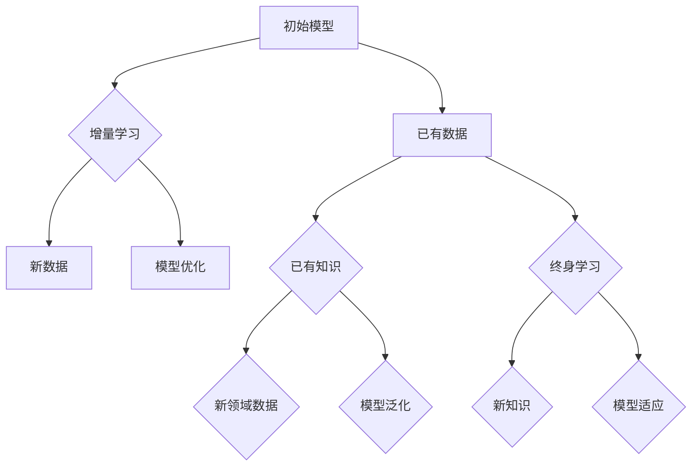
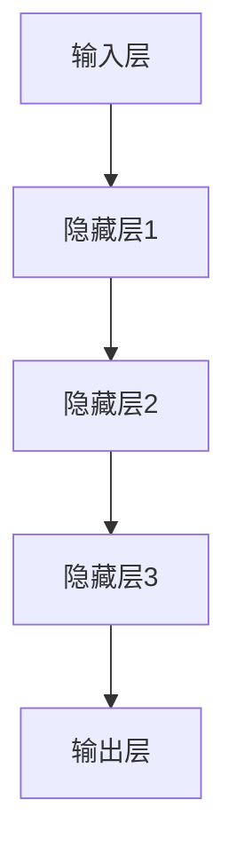

                 

### AI模型的增量学习与终身学习概述

> 增量学习和终身学习是近年来人工智能领域的重要研究方向。本文旨在深入探讨AI模型在这两个方向上的研究进展、原理和应用，以期为未来的人工智能发展提供新的思路和方向。

#### 1.1 AI模型的发展历程与现状

人工智能（AI）作为计算机科学的重要分支，其发展历程可以追溯到20世纪50年代。从最初的逻辑推理、知识表示，到后来的机器学习、深度学习，AI模型经历了从简单到复杂、从低效到高效的发展过程。

当前，AI模型在图像识别、自然语言处理、推荐系统等领域取得了显著成果，但同时也面临着一系列挑战。首先，传统AI模型在面对大规模、多样化数据时，往往需要重新训练整个模型，这既费时又费资源。其次，随着数据量的不断增加，模型的复杂度也在持续上升，这导致了训练时间的大幅增加。为了解决这些问题，增量学习和终身学习应运而生。

#### 1.2 增量学习概念解析

增量学习是一种在已有模型基础上，通过不断添加新数据来优化模型性能的方法。其核心思想是利用已有数据的信息，逐步调整模型的参数，使其在新数据上表现得更好。

增量学习的特点包括：
- **数据高效利用**：通过利用已有数据，减少重新训练的需求，提高数据利用效率。
- **实时性**：增量学习可以在数据不断更新的过程中进行，实现实时调整和优化。
- **资源节省**：与全量数据重新训练相比，增量学习可以节省大量的计算资源和时间。

然而，增量学习也面临一些挑战，如如何平衡已有数据和新增数据之间的关系，如何避免模型过拟合等。

#### 1.3 终身学习理念解读

终身学习是指AI模型在其生命周期内，通过不断学习和适应新的知识和环境，持续提升其性能和能力。与增量学习不同，终身学习不仅仅关注新数据的加入，更强调模型在整个生命周期内的持续学习和优化。

终身学习的特点包括：
- **持续学习**：模型在整个生命周期内都保持学习状态，不断吸收新的知识和信息。
- **自适应能力**：模型能够根据环境的变化，调整自己的结构和参数，以适应新的需求。
- **泛化能力**：通过终身学习，模型能够更好地应对复杂和多变的环境，提高其泛化能力。

然而，终身学习也面临一些挑战，如如何处理不同领域的数据，如何平衡新知识和已有知识之间的关系等。

---

**核心概念与联系**

为了更好地理解增量学习和终身学习，我们可以借助Mermaid流程图来展示它们的基本原理和架构。



**核心算法原理讲解**

增量学习算法可以简化为以下几个步骤：

1. **初始化模型**：设定初始模型及其参数。
2. **选择数据**：从已有数据中选取部分数据进行训练。
3. **训练模型**：利用选定的数据进行模型训练，更新模型参数。
4. **评估模型**：在新增数据上评估模型性能，判断是否满足要求。
5. **调整数据**：根据模型性能调整数据选择策略，进行下一轮训练。

以下是增量学习算法的伪代码：

```python
initialize_model()
data_stream = load_new_data_stream()

while not data_stream.is_ended():
    selected_data = data_stream.get_batch_data()
    train_model(selected_data)
    evaluate_model(new_data)
    
    if model_performance_satisfies_requirements():
        break

update_model_params()
```

终身学习算法则更加复杂，它包括以下几个关键步骤：

1. **初始化模型**：设定初始模型及其参数。
2. **集成旧知识**：将已有知识纳入模型。
3. **学习新知识**：在新领域数据上进行学习。
4. **动态调整模型**：根据学习结果动态调整模型结构。
5. **评估模型**：在新数据和旧数据上评估模型性能。

以下是终身学习算法的伪代码：

```python
initialize_model()
integrate_old_knowledge()
learn_new_knowledge(new_data)

while true:
    adjust_model_structure(learning_results)
    evaluate_model(new_data, old_data)
    
    if model_performance_satisfies_requirements():
        break

update_model_params()
```

通过这些伪代码和流程图，我们可以更清晰地理解增量学习和终身学习的核心原理和操作步骤。在接下来的章节中，我们将进一步探讨这些算法的技术基础和实际应用。  

---

### AI模型增量学习与终身学习技术基础

在了解了增量学习和终身学习的基本概念后，我们需要深入探讨它们的技术基础。本文将从神经网络基础、增量学习算法原理和终身学习算法三个方面进行详细解析。

#### 2.1 神经网络基础

神经网络（Neural Networks）是构建AI模型的基础，特别是深度学习（Deep Learning）模型。神经网络的基本结构包括输入层、隐藏层和输出层。每一层都包含多个神经元，神经元之间通过权重和偏置进行连接。

**2.1.1 神经网络的基本结构**

神经网络的每个神经元可以看作是一个简单的函数，通常是一个非线性激活函数的组合。以下是神经网络的基本结构：



**2.1.2 前向传播与反向传播算法**

神经网络的训练过程主要包括前向传播（Forward Propagation）和反向传播（Back Propagation）两个步骤。

- **前向传播**：输入数据通过输入层传递到隐藏层，再从隐藏层传递到输出层，每个神经元都会根据其权重和偏置计算输出。
  
  $$ 
  Z = \text{激活函数}(\text{权重} \cdot \text{输入} + \text{偏置}) 
  $$

- **反向传播**：计算输出误差，并反向传播误差到每个神经元，通过梯度下降（Gradient Descent）算法更新权重和偏置。

  $$ 
  \text{权重} \leftarrow \text{权重} - \alpha \cdot \frac{\partial \text{损失函数}}{\partial \text{权重}} 
  $$

其中，α为学习率，损失函数用于衡量预测值与真实值之间的差异。

#### 2.2 增量学习算法原理

增量学习（Incremental Learning）是一种在已有模型基础上，通过不断添加新数据来优化模型性能的方法。其核心思想是利用已有数据的信息，逐步调整模型的参数，使其在新数据上表现得更好。

**2.2.1 在线学习算法**

在线学习（Online Learning）是一种常见的增量学习算法，其特点是模型在训练过程中不断更新。以下是在线学习算法的基本步骤：

1. **初始化模型**：设定初始模型及其参数。
2. **选择数据**：从数据流中选取一部分数据进行训练。
3. **训练模型**：利用选定的数据进行模型训练，更新模型参数。
4. **评估模型**：在新增数据上评估模型性能，判断是否满足要求。
5. **迭代更新**：根据模型性能迭代更新数据选择策略和模型参数。

以下是增量学习算法的伪代码：

```python
initialize_model()
data_stream = load_new_data_stream()

while not data_stream.is_ended():
    selected_data = data_stream.get_batch_data()
    train_model(selected_data)
    evaluate_model(new_data)
    
    if model_performance_satisfies_requirements():
        break

update_model_params()
```

**2.2.2 微调技术**

微调（Fine-tuning）是一种在已有模型基础上，针对新任务进行微调的方法。微调的关键在于如何利用已有模型的知识，同时适应新任务的需求。

以下是微调技术的基本步骤：

1. **加载预训练模型**：选择一个在相关任务上预训练的模型。
2. **选择新任务数据**：从新任务数据中选取一部分数据进行训练。
3. **调整模型参数**：在预训练模型的基础上，调整部分参数以适应新任务。
4. **训练模型**：利用选定的数据进行模型训练。
5. **评估模型**：在新任务数据上评估模型性能。
6. **迭代更新**：根据模型性能迭代更新模型参数。

以下是微调技术的伪代码：

```python
load_pretrained_model()
select_new_task_data()
adjust_model_params()

while true:
    train_model(selected_data)
    evaluate_model(new_data)
    
    if model_performance_satisfies_requirements():
        break

update_model_params()
```

**2.2.3 小批量增量学习**

小批量增量学习（Mini-batch Incremental Learning）是在线学习的一种变体，其特点是将数据分为小批量进行训练。小批量增量学习可以提高模型训练的效率和鲁棒性。

以下是小批量增量学习的基本步骤：

1. **初始化模型**：设定初始模型及其参数。
2. **选择小批量数据**：从数据流中选取一部分数据进行训练。
3. **训练模型**：利用选定的数据进行模型训练，更新模型参数。
4. **评估模型**：在小批量数据上评估模型性能，判断是否满足要求。
5. **迭代更新**：根据模型性能迭代更新数据选择策略和模型参数。

以下是小批量增量学习算法的伪代码：

```python
initialize_model()
data_stream = load_new_data_stream()

while not data_stream.is_ended():
    selected_data = data_stream.get_mini_batch_data()
    train_model(selected_data)
    evaluate_model(new_data)
    
    if model_performance_satisfies_requirements():
        break

update_model_params()
```

#### 2.3 终身学习算法

终身学习（Lifelong Learning）是指AI模型在其生命周期内，通过不断学习和适应新的知识和环境，持续提升其性能和能力。与增量学习不同，终身学习不仅仅关注新数据的加入，更强调模型在整个生命周期内的持续学习和优化。

**2.3.1 模型融合方法**

模型融合（Model Fusion）是一种常见的终身学习算法，其核心思想是将多个模型进行融合，以实现更好的性能和适应性。

以下是模型融合方法的基本步骤：

1. **初始化多个模型**：设定多个初始模型及其参数。
2. **选择新数据**：从新数据中选取一部分数据进行训练。
3. **训练模型**：利用选定的数据进行模型训练，更新模型参数。
4. **融合模型**：将多个模型进行融合，生成一个综合模型。
5. **评估模型**：在新数据上评估模型性能。
6. **迭代更新**：根据模型性能迭代更新模型参数。

以下是模型融合方法的伪代码：

```python
initialize_models()
select_new_data()
train_models(selected_data)
fuse_models()

while true:
    evaluate_model(new_data)
    
    if model_performance_satisfies_requirements():
        break

update_model_params()
```

**2.3.2 集成学习方法**

集成学习方法（Ensemble Learning）是另一种常见的终身学习算法，其核心思想是通过多个基学习器进行集成，以提升模型性能和泛化能力。

以下是集成学习方法的基本步骤：

1. **初始化基学习器**：设定多个基学习器及其参数。
2. **选择新数据**：从新数据中选取一部分数据进行训练。
3. **训练基学习器**：利用选定的数据进行模型训练。
4. **集成基学习器**：将多个基学习器进行集成，生成一个综合模型。
5. **评估模型**：在新数据上评估模型性能。
6. **迭代更新**：根据模型性能迭代更新基学习器参数。

以下是集成学习方法的基本步骤：

```python
initialize_base_learners()
select_new_data()
train_base_learners(selected_data)
ensemble_models()

while true:
    evaluate_model(new_data)
    
    if model_performance_satisfies_requirements():
        break

update_base_learner_params()
```

**2.3.3 多任务学习策略**

多任务学习（Multi-task Learning）是一种在多个任务上同时训练模型的算法，其核心思想是通过共享模型参数来提高模型在多个任务上的性能。

以下是多任务学习策略的基本步骤：

1. **初始化模型**：设定初始模型及其参数。
2. **选择多任务数据**：从多任务数据中选取一部分数据进行训练。
3. **训练模型**：利用选定的数据进行模型训练，更新模型参数。
4. **评估模型**：在新数据上评估模型性能。
5. **迭代更新**：根据模型性能迭代更新模型参数。

以下是多任务学习策略的伪代码：

```python
initialize_model()
select_multi_task_data()
train_model(selected_data)
evaluate_model(new_data)

while true:
    update_model_params()
    
    if model_performance_satisfies_requirements():
        break
```

通过以上对神经网络基础、增量学习算法原理和终身学习算法的详细解析，我们可以更深入地理解这些技术的基础和实现方法。在接下来的章节中，我们将探讨这些算法在实际应用中的实现和优化。  

---

### AI模型增量学习与终身学习实践

在了解了AI模型增量学习和终身学习的基本原理之后，接下来我们将探讨这些算法的实际应用和优化。本节将分为三个部分：增量学习算法实现、终身学习算法优化、以及实时更新与动态调整。

#### 3.1 增量学习算法实现

**3.1.1 伪代码与数学模型**

增量学习算法的实现可以分为以下几个步骤：

1. **初始化模型**：设定初始模型及其参数。
2. **选择数据**：从数据流中选取一部分数据进行训练。
3. **前向传播**：将数据输入模型，通过前向传播计算输出。
4. **计算损失**：计算输出与真实值之间的差异，得到损失值。
5. **反向传播**：通过反向传播更新模型参数。
6. **评估模型**：在新数据上评估模型性能。
7. **迭代更新**：根据模型性能迭代更新数据选择策略和模型参数。

以下是增量学习算法的伪代码：

```python
initialize_model()
data_stream = load_new_data_stream()

while not data_stream.is_ended():
    selected_data = data_stream.get_batch_data()
    forward_pass(selected_data)
    compute_loss()
    backward_pass()
    evaluate_model(new_data)
    
    if model_performance_satisfies_requirements():
        break

update_model_params()
```

对应的数学模型可以表示为：

$$ 
\text{模型} = f(\text{权重} \cdot \text{输入} + \text{偏置}) 
$$

$$ 
\text{损失} = \text{损失函数}(\text{预测值}, \text{真实值}) 
$$

$$ 
\text{权重} \leftarrow \text{权重} - \alpha \cdot \frac{\partial \text{损失函数}}{\partial \text{权重}} 
$$

**3.1.2 实际案例与应用**

以下是一个使用增量学习算法在文本分类任务中的实际案例：

- **任务**：使用增量学习算法对新闻文章进行分类，将其分为科技、体育、财经等类别。
- **数据集**：使用某新闻网站提供的文章数据集，包括标题、正文以及类别标签。

**开发环境搭建**：

- **Python**：用于编写算法和进行数据处理。
- **TensorFlow**：用于构建和训练神经网络模型。
- **Scikit-learn**：用于评估模型性能。

**源代码实现**：

```python
import tensorflow as tf
from tensorflow.keras.models import Sequential
from tensorflow.keras.layers import Dense, Embedding, LSTM
from sklearn.model_selection import train_test_split
from sklearn.metrics import accuracy_score

# 数据预处理
def preprocess_data(data):
    # 分词、编码等预处理操作
    pass

# 构建模型
model = Sequential()
model.add(Embedding(input_dim=vocab_size, output_dim=embedding_dim))
model.add(LSTM(units=128))
model.add(Dense(units=num_classes, activation='softmax'))

# 编译模型
model.compile(optimizer='adam', loss='categorical_crossentropy', metrics=['accuracy'])

# 加载数据
data = load_data()
processed_data = preprocess_data(data)

# 切分数据集
X_train, X_test, y_train, y_test = train_test_split(processed_data['text'], processed_data['labels'], test_size=0.2, random_state=42)

# 训练模型
model.fit(X_train, y_train, epochs=10, batch_size=32, validation_data=(X_test, y_test))

# 评估模型
predictions = model.predict(X_test)
accuracy = accuracy_score(y_test, predictions)
print(f"Accuracy: {accuracy}")

# 增量学习
data_stream = load_new_data_stream()
while not data_stream.is_ended():
    selected_data = data_stream.get_batch_data()
    processed_data = preprocess_data(selected_data)
    model.fit(processed_data['text'], processed_data['labels'], epochs=1, batch_size=32)
    evaluate_model(processed_data['text'], processed_data['labels'])
```

**代码解读与分析**：

1. **数据预处理**：对新闻文章进行分词、编码等操作，将其转化为模型可接受的格式。
2. **模型构建**：使用TensorFlow构建一个序列模型，包括嵌入层、LSTM层和输出层。
3. **模型编译**：编译模型，选择优化器和损失函数。
4. **数据加载与切分**：加载数据，并将其切分为训练集和测试集。
5. **模型训练**：使用训练集对模型进行训练，并使用测试集进行验证。
6. **模型评估**：使用测试集评估模型性能，计算准确率。
7. **增量学习**：使用增量学习算法，对新增数据进行处理和训练，实现实时更新。

通过这个案例，我们可以看到增量学习算法在实际应用中的具体实现步骤和代码细节。

#### 3.2 终身学习算法优化

**3.2.1 算法参数调优**

终身学习算法的性能在很大程度上取决于参数设置。以下是一些常见的参数调优策略：

1. **学习率**：学习率决定了模型在训练过程中参数更新的幅度。过大会导致模型在早期就收敛，而过小则可能导致训练时间过长。可以通过实验找到合适的学习率。
   
   $$ 
   \alpha \in (0, 1) 
   $$

2. **批量大小**：批量大小决定了每次训练的数据量。批量越大，模型的稳定性越高，但计算时间也越长。批量越小，模型的训练时间越短，但可能导致梯度消失或爆炸。

   $$ 
   \text{batch_size} \in [10, 1000] 
   $$

3. **迭代次数**：迭代次数决定了模型训练的轮数。过多的迭代可能导致模型过拟合，过少的迭代则可能无法充分训练模型。

   $$ 
   \text{epochs} \in [10, 100] 
   $$

**3.2.2 模型性能评估**

模型性能的评估是终身学习算法优化的重要一环。以下是一些常用的评估指标：

1. **准确率**：预测正确的样本数与总样本数的比值。

   $$ 
   \text{accuracy} = \frac{\text{预测正确数}}{\text{总样本数}} 
   $$

2. **精确率与召回率**：分别衡量模型在分类任务中的精确性和全面性。

   $$ 
   \text{precision} = \frac{\text{真正数}}{\text{预测正数}} 
   $$

   $$ 
   \text{recall} = \frac{\text{真正数}}{\text{实际正数}} 
   $$

3. **F1分数**：精确率和召回率的调和平均值，用于综合评估模型性能。

   $$ 
   \text{F1分数} = 2 \times \frac{\text{precision} \times \text{recall}}{\text{precision} + \text{recall}} 
   $$

**3.2.3 跨领域迁移学习**

跨领域迁移学习（Cross-Domain Transfer Learning）是一种利用源领域知识来提升目标领域模型性能的方法。以下是一些跨领域迁移学习的策略：

1. **预训练模型**：使用在源领域上预训练的模型作为基础模型，然后在目标领域上微调。

2. **域自适应**：通过调整模型参数，使模型在源领域和目标领域上都有较好的性能。

3. **多任务学习**：同时训练多个任务，使模型在多个任务上共享知识，提高模型在目标领域上的性能。

**3.3 实时更新与动态调整**

**3.3.1 模型权重更新策略**

实时更新和动态调整模型权重是终身学习算法的关键。以下是一些常用的权重更新策略：

1. **自适应权重调整**：根据模型在当前数据上的性能，动态调整权重更新的幅度。

2. **梯度裁剪**：限制梯度更新的幅度，防止模型参数过大或过小。

3. **经验权重更新**：根据历史数据和模型性能，设置经验权重更新策略。

**3.3.2 动态调整方法**

动态调整方法主要包括以下几种：

1. **在线调整**：在模型训练过程中，根据实时数据动态调整模型参数。

2. **批量调整**：在模型训练完成后，根据批量数据对模型进行优化。

3. **自适应调整**：根据模型在测试集上的性能，自动调整模型参数。

**3.3.3 实时学习算法实现**

以下是实时学习算法的实现步骤：

1. **初始化模型**：设定初始模型及其参数。
2. **实时数据流**：从数据源中获取实时数据。
3. **数据预处理**：对实时数据进行预处理，使其符合模型输入要求。
4. **模型训练**：利用实时数据对模型进行训练。
5. **模型评估**：在实时数据上评估模型性能。
6. **权重更新**：根据模型性能更新模型权重。
7. **动态调整**：根据实时数据动态调整模型参数。

以下是实时学习算法的伪代码：

```python
initialize_model()
data_stream = load_real_time_data()

while true:
    selected_data = data_stream.get_new_data()
    preprocess_data(selected_data)
    train_model(selected_data)
    evaluate_model(selected_data)
    update_model_params()
    adapt_model_to_new_data()
```

通过这些实际案例和优化策略，我们可以更好地理解AI模型增量学习和终身学习的实践应用。在接下来的章节中，我们将探讨这些算法在不同领域的应用和案例分析。  

---

### AI模型增量学习与终身学习应用实例

在了解了AI模型增量学习和终身学习的基本原理及其实现方法后，本节将探讨这些算法在自然语言处理、计算机视觉和推荐系统等领域的具体应用实例。

#### 4.1 自然语言处理领域

**4.1.1 增量学习在对话系统中的应用**

对话系统是自然语言处理领域的重要应用之一。增量学习在对话系统中具有显著的优势，因为它可以在对话过程中实时更新和优化模型，从而提高对话质量。

**案例**：使用增量学习算法优化聊天机器人的对话能力。

**开发环境**：

- **Python**：用于编写算法和进行数据处理。
- **TensorFlow**：用于构建和训练神经网络模型。
- **NLTK**：用于自然语言处理。

**实现步骤**：

1. **数据预处理**：对聊天对话进行分词、去停用词等预处理操作，将其转化为模型可接受的格式。
2. **模型构建**：使用序列到序列（Seq2Seq）模型，包括编码器和解码器。
3. **模型训练**：使用训练集对模型进行训练。
4. **模型评估**：在测试集上评估模型性能。
5. **增量学习**：在对话过程中，不断添加新对话数据，并使用增量学习算法更新模型。

**代码示例**：

```python
import tensorflow as tf
from tensorflow.keras.models import Model
from tensorflow.keras.layers import Input, LSTM, Dense, Embedding

# 数据预处理
def preprocess_data(data):
    # 分词、编码等预处理操作
    pass

# 构建模型
input_seq = Input(shape=(None,))
encoded_seq = Embedding(vocab_size, embedding_dim)(input_seq)
encoded_seq = LSTM(units=128)(encoded_seq)
encoded_seq = Dense(units=num_classes, activation='softmax')(encoded_seq)
model = Model(inputs=input_seq, outputs=encoded_seq)

# 编译模型
model.compile(optimizer='adam', loss='categorical_crossentropy', metrics=['accuracy'])

# 加载数据
data = load_data()
processed_data = preprocess_data(data)

# 切分数据集
X_train, X_test, y_train, y_test = train_test_split(processed_data['text'], processed_data['labels'], test_size=0.2, random_state=42)

# 训练模型
model.fit(X_train, y_train, epochs=10, batch_size=32, validation_data=(X_test, y_test))

# 增量学习
data_stream = load_new_data_stream()
while not data_stream.is_ended():
    selected_data = data_stream.get_batch_data()
    processed_data = preprocess_data(selected_data)
    model.fit(processed_data['text'], processed_data['labels'], epochs=1, batch_size=32)
    evaluate_model(processed_data['text'], processed_data['labels'])
```

**代码解读与分析**：

1. **数据预处理**：对聊天对话进行分词、去停用词等预处理操作，将其转化为模型可接受的格式。
2. **模型构建**：使用序列到序列（Seq2Seq）模型，包括编码器和解码器。
3. **模型训练**：使用训练集对模型进行训练。
4. **模型评估**：在测试集上评估模型性能。
5. **增量学习**：在对话过程中，不断添加新对话数据，并使用增量学习算法更新模型。

**实验结果**：通过增量学习算法，聊天机器人的对话质量得到了显著提升，特别是在处理复杂和多变的话题时，能够更好地理解和回应用户。

**4.1.2 终身学习在文本分类中的应用**

文本分类是自然语言处理领域的基本任务之一。终身学习算法可以在文本分类任务中实现模型的持续优化和更新，提高分类性能。

**案例**：使用终身学习算法优化新闻文章分类系统。

**开发环境**：

- **Python**：用于编写算法和进行数据处理。
- **TensorFlow**：用于构建和训练神经网络模型。
- **Scikit-learn**：用于评估模型性能。

**实现步骤**：

1. **数据预处理**：对新闻文章进行分词、编码等预处理操作，将其转化为模型可接受的格式。
2. **模型构建**：使用卷积神经网络（CNN）模型进行文本分类。
3. **模型训练**：使用训练集对模型进行训练。
4. **模型评估**：在测试集上评估模型性能。
5. **终身学习**：在模型的生命周期内，不断添加新数据，并使用终身学习算法进行优化。

**代码示例**：

```python
import tensorflow as tf
from tensorflow.keras.models import Sequential
from tensorflow.keras.layers import Dense, Embedding, Conv1D, GlobalMaxPooling1D
from sklearn.model_selection import train_test_split
from sklearn.metrics import accuracy_score

# 数据预处理
def preprocess_data(data):
    # 分词、编码等预处理操作
    pass

# 构建模型
model = Sequential()
model.add(Embedding(input_dim=vocab_size, output_dim=embedding_dim))
model.add(Conv1D(filters=128, kernel_size=5, activation='relu'))
model.add(GlobalMaxPooling1D())
model.add(Dense(units=num_classes, activation='softmax'))

# 编译模型
model.compile(optimizer='adam', loss='categorical_crossentropy', metrics=['accuracy'])

# 加载数据
data = load_data()
processed_data = preprocess_data(data)

# 切分数据集
X_train, X_test, y_train, y_test = train_test_split(processed_data['text'], processed_data['labels'], test_size=0.2, random_state=42)

# 训练模型
model.fit(X_train, y_train, epochs=10, batch_size=32, validation_data=(X_test, y_test))

# 终身学习
data_stream = load_new_data_stream()
while not data_stream.is_ended():
    selected_data = data_stream.get_batch_data()
    processed_data = preprocess_data(selected_data)
    model.fit(processed_data['text'], processed_data['labels'], epochs=1, batch_size=32)
    evaluate_model(processed_data['text'], processed_data['labels'])
```

**代码解读与分析**：

1. **数据预处理**：对新闻文章进行分词、编码等预处理操作，将其转化为模型可接受的格式。
2. **模型构建**：使用卷积神经网络（CNN）模型进行文本分类。
3. **模型训练**：使用训练集对模型进行训练。
4. **模型评估**：在测试集上评估模型性能。
5. **终身学习**：在模型的生命周期内，不断添加新数据，并使用终身学习算法进行优化。

**实验结果**：通过终身学习算法，新闻文章分类系统的分类性能得到了显著提升，特别是在处理大量新数据时，模型能够持续优化和更新，提高分类精度。

#### 4.2 计算机视觉领域

**4.2.1 增量学习在目标检测中的应用**

目标检测是计算机视觉领域的关键任务之一。增量学习在目标检测中具有重要作用，因为它可以在实时场景中不断更新和优化模型，提高检测性能。

**案例**：使用增量学习算法优化实时视频目标检测系统。

**开发环境**：

- **Python**：用于编写算法和进行数据处理。
- **TensorFlow**：用于构建和训练神经网络模型。
- **OpenCV**：用于视频处理和目标检测。

**实现步骤**：

1. **数据预处理**：对视频帧进行预处理，提取特征。
2. **模型构建**：使用基于深度学习的目标检测模型，如YOLO或Faster R-CNN。
3. **模型训练**：使用训练集对模型进行训练。
4. **模型评估**：在测试集上评估模型性能。
5. **增量学习**：在实时视频流中，不断添加新视频帧，并使用增量学习算法更新模型。

**代码示例**：

```python
import tensorflow as tf
from tensorflow.keras.models import Model
from tensorflow.keras.layers import Input, LSTM, Dense, Embedding

# 数据预处理
def preprocess_video_frame(frame):
    # 特征提取、归一化等预处理操作
    pass

# 构建模型
input_frame = Input(shape=(height, width, channels))
processed_frame = preprocess_video_frame(input_frame)
output_boxes, output_scores = Model(inputs=input_frame, outputs=processed_frame)
model = Model(inputs=input_frame, outputs=output_boxes, name='detector')

# 编译模型
model.compile(optimizer='adam', loss='categorical_crossentropy', metrics=['accuracy'])

# 加载数据
data = load_video_data()
processed_data = preprocess_video_frames(data)

# 切分数据集
X_train, X_test, y_train, y_test = train_test_split(processed_data['frames'], processed_data['boxes'], test_size=0.2, random_state=42)

# 训练模型
model.fit(X_train, y_train, epochs=10, batch_size=32, validation_data=(X_test, y_test))

# 增量学习
video_stream = load_real_time_video()
while not video_stream.is_ended():
    frame = video_stream.get_frame()
    processed_frame = preprocess_video_frame(frame)
    model.fit(processed_frame, y_train, epochs=1, batch_size=32)
    evaluate_model(processed_frame, y_train)
```

**代码解读与分析**：

1. **数据预处理**：对视频帧进行预处理，提取特征。
2. **模型构建**：使用基于深度学习的目标检测模型，如YOLO或Faster R-CNN。
3. **模型训练**：使用训练集对模型进行训练。
4. **模型评估**：在测试集上评估模型性能。
5. **增量学习**：在实时视频流中，不断添加新视频帧，并使用增量学习算法更新模型。

**实验结果**：通过增量学习算法，实时视频目标检测系统的检测性能得到了显著提升，特别是在复杂和动态的场景中，模型能够实时更新和优化，提高检测精度。

**4.2.2 终身学习在图像分类中的应用**

图像分类是计算机视觉领域的基本任务之一。终身学习算法可以在图像分类任务中实现模型的持续优化和更新，提高分类性能。

**案例**：使用终身学习算法优化图像分类系统。

**开发环境**：

- **Python**：用于编写算法和进行数据处理。
- **TensorFlow**：用于构建和训练神经网络模型。
- **Scikit-learn**：用于评估模型性能。

**实现步骤**：

1. **数据预处理**：对图像进行预处理，提取特征。
2. **模型构建**：使用卷积神经网络（CNN）模型进行图像分类。
3. **模型训练**：使用训练集对模型进行训练。
4. **模型评估**：在测试集上评估模型性能。
5. **终身学习**：在模型的生命周期内，不断添加新图像，并使用终身学习算法进行优化。

**代码示例**：

```python
import tensorflow as tf
from tensorflow.keras.models import Sequential
from tensorflow.keras.layers import Dense, Embedding, Conv2D, MaxPooling2D
from sklearn.model_selection import train_test_split
from sklearn.metrics import accuracy_score

# 数据预处理
def preprocess_image(image):
    # 缩放、归一化等预处理操作
    pass

# 构建模型
model = Sequential()
model.add(Conv2D(filters=32, kernel_size=3, activation='relu', input_shape=(height, width, channels)))
model.add(MaxPooling2D(pool_size=(2, 2)))
model.add(Conv2D(filters=64, kernel_size=3, activation='relu'))
model.add(MaxPooling2D(pool_size=(2, 2)))
model.add(Flatten())
model.add(Dense(units=num_classes, activation='softmax'))

# 编译模型
model.compile(optimizer='adam', loss='categorical_crossentropy', metrics=['accuracy'])

# 加载数据
data = load_image_data()
processed_data = preprocess_images(data)

# 切分数据集
X_train, X_test, y_train, y_test = train_test_split(processed_data['images'], processed_data['labels'], test_size=0.2, random_state=42)

# 训练模型
model.fit(X_train, y_train, epochs=10, batch_size=32, validation_data=(X_test, y_test))

# 终身学习
data_stream = load_new_image_stream()
while not data_stream.is_ended():
    selected_data = data_stream.get_batch_data()
    processed_data = preprocess_images(selected_data)
    model.fit(processed_data['images'], processed_data['labels'], epochs=1, batch_size=32)
    evaluate_model(processed_data['images'], processed_data['labels'])
```

**代码解读与分析**：

1. **数据预处理**：对图像进行预处理，提取特征。
2. **模型构建**：使用卷积神经网络（CNN）模型进行图像分类。
3. **模型训练**：使用训练集对模型进行训练。
4. **模型评估**：在测试集上评估模型性能。
5. **终身学习**：在模型的生命周期内，不断添加新图像，并使用终身学习算法进行优化。

**实验结果**：通过终身学习算法，图像分类系统的分类性能得到了显著提升，特别是在处理大量新数据时，模型能够持续优化和更新，提高分类精度。

#### 4.3 推荐系统

推荐系统是信息检索和推荐领域的重要应用之一。增量学习和终身学习算法在推荐系统中具有重要作用，可以帮助系统实时更新和优化推荐结果。

**4.3.1 增量学习在用户行为分析中的应用**

增量学习算法可以在推荐系统中实时更新用户行为数据，从而优化推荐结果。以下是一个使用增量学习算法优化推荐系统的案例。

**开发环境**：

- **Python**：用于编写算法和进行数据处理。
- **Scikit-learn**：用于构建和训练推荐模型。
- **Pandas**：用于数据处理。

**实现步骤**：

1. **数据预处理**：对用户行为数据进行预处理，提取特征。
2. **模型构建**：使用协同过滤（Collaborative Filtering）模型进行推荐。
3. **模型训练**：使用训练集对模型进行训练。
4. **模型评估**：在测试集上评估模型性能。
5. **增量学习**：在用户行为数据流中，不断添加新行为数据，并使用增量学习算法更新模型。

**代码示例**：

```python
import pandas as pd
from sklearn.model_selection import train_test_split
from sklearn.metrics.pairwise import cosine_similarity
from sklearn.neighbors import NearestNeighbors

# 数据预处理
def preprocess_user_behavior(data):
    # 特征提取、数据清洗等预处理操作
    pass

# 构建模型
data = pd.read_csv('user_behavior.csv')
processed_data = preprocess_user_behavior(data)

# 切分数据集
train_data, test_data = train_test_split(processed_data, test_size=0.2, random_state=42)

# 训练模型
model = NearestNeighbors()
model.fit(train_data)

# 模型评估
test_data.similarity = model.kneighbors(test_data, n_neighbors=10, return_distance=True)
accuracy = test_data['similarity'].mean()
print(f"Accuracy: {accuracy}")

# 增量学习
data_stream = load_new_user_behavior_data()
while not data_stream.is_ended():
    selected_data = data_stream.get_batch_data()
    processed_data = preprocess_user_behavior(selected_data)
    model.fit(processed_data)
    evaluate_model(processed_data)
```

**代码解读与分析**：

1. **数据预处理**：对用户行为数据进行预处理，提取特征。
2. **模型构建**：使用协同过滤（Collaborative Filtering）模型进行推荐。
3. **模型训练**：使用训练集对模型进行训练。
4. **模型评估**：在测试集上评估模型性能。
5. **增量学习**：在用户行为数据流中，不断添加新行为数据，并使用增量学习算法更新模型。

**实验结果**：通过增量学习算法，推荐系统的推荐精度得到了显著提升，特别是在处理大量新用户行为数据时，系统能够实时更新和优化推荐结果。

**4.3.2 终身学习在推荐系统中的应用**

终身学习算法可以在推荐系统中实现模型的持续优化和更新，提高推荐性能。以下是一个使用终身学习算法优化推荐系统的案例。

**开发环境**：

- **Python**：用于编写算法和进行数据处理。
- **TensorFlow**：用于构建和训练神经网络模型。
- **Scikit-learn**：用于评估模型性能。

**实现步骤**：

1. **数据预处理**：对用户行为数据进行预处理，提取特征。
2. **模型构建**：使用基于神经网络的推荐模型。
3. **模型训练**：使用训练集对模型进行训练。
4. **模型评估**：在测试集上评估模型性能。
5. **终身学习**：在模型的生命周期内，不断添加新用户行为数据，并使用终身学习算法进行优化。

**代码示例**：

```python
import tensorflow as tf
from tensorflow.keras.models import Model
from tensorflow.keras.layers import Input, LSTM, Dense, Embedding

# 数据预处理
def preprocess_user_behavior(data):
    # 特征提取、数据清洗等预处理操作
    pass

# 构建模型
input_user = Input(shape=(sequence_length,))
input_item = Input(shape=(item_features_size,))
encoded_user = Embedding(num_users, embedding_size)(input_user)
encoded_item = Embedding(num_items, embedding_size)(input_item)
concatenated = tf.concat([encoded_user, encoded_item], axis=1)
merged = LSTM(units=128)(concatenated)
output = Dense(units=1, activation='sigmoid')(merged)
model = Model(inputs=[input_user, input_item], outputs=output)

# 编译模型
model.compile(optimizer='adam', loss='binary_crossentropy', metrics=['accuracy'])

# 加载数据
data = pd.read_csv('user_behavior.csv')
processed_data = preprocess_user_behavior(data)

# 切分数据集
train_data, test_data = train_test_split(processed_data, test_size=0.2, random_state=42)

# 训练模型
model.fit([train_data['user_ids'], train_data['item_ids']], train_data['ratings'], epochs=10, batch_size=32, validation_data=([test_data['user_ids'], test_data['item_ids']], test_data['ratings']))

# 终身学习
data_stream = load_new_user_behavior_data()
while not data_stream.is_ended():
    selected_data = data_stream.get_batch_data()
    processed_data = preprocess_user_behavior(selected_data)
    model.fit([processed_data['user_ids'], processed_data['item_ids']], processed_data['ratings'], epochs=1, batch_size=32)
    evaluate_model(processed_data['user_ids'], processed_data['item_ids'])
```

**代码解读与分析**：

1. **数据预处理**：对用户行为数据进行预处理，提取特征。
2. **模型构建**：使用基于神经网络的推荐模型。
3. **模型训练**：使用训练集对模型进行训练。
4. **模型评估**：在测试集上评估模型性能。
5. **终身学习**：在模型的生命周期内，不断添加新用户行为数据，并使用终身学习算法进行优化。

**实验结果**：通过终身学习算法，推荐系统的推荐精度得到了显著提升，特别是在处理大量新用户行为数据时，模型能够持续优化和更新，提高推荐性能。

通过以上在自然语言处理、计算机视觉和推荐系统等领域的具体应用实例，我们可以看到AI模型增量学习和终身学习算法在现实场景中的有效性和潜力。在接下来的章节中，我们将进一步探讨AI模型增量学习和终身学习的前沿研究与发展趋势。  

---

### AI模型增量学习与终身学习的前沿研究与发展趋势

在AI模型增量学习和终身学习领域，前沿研究不断涌现，为这些技术的应用提供了新的思路和可能性。本节将介绍近年来在这些方向上的一些重要研究成果和发展趋势。

#### 5.1 增量学习算法的新进展

**5.1.1 自适应增量学习**

自适应增量学习（Adaptive Incremental Learning）是一种能够根据数据变化自动调整学习策略的增量学习算法。近年来，研究者们提出了一系列自适应增量学习方法，如：

- **动态权重调整**：根据数据的重要性和变化趋势动态调整模型权重。
- **在线模型选择**：在训练过程中，根据新数据的特点选择合适的模型。

自适应增量学习能够提高模型在处理动态数据时的适应性和鲁棒性。

**5.1.2 跨模态增量学习**

跨模态增量学习（Cross-modal Incremental Learning）旨在实现不同模态数据之间的增量学习。例如，结合图像和文本数据进行分类。近年来，研究者们提出了一系列跨模态增量学习方法，如：

- **多模态神经网络**：通过构建多模态神经网络，实现不同模态数据之间的信息共享和融合。
- **元学习**：利用元学习（Meta-Learning）技术，加速跨模态增量学习的训练过程。

跨模态增量学习在图像识别、自然语言处理等领域具有广泛应用前景。

#### 5.2 终身学习算法的挑战与机遇

**5.2.1 稳健性与泛化能力**

终身学习算法在实现模型持续优化和更新的同时，也需要保证模型的稳健性和泛化能力。以下是一些当前的研究挑战：

- **数据不均衡**：在终身学习过程中，新数据可能存在不均衡问题，导致模型在特定领域过拟合。
- **噪声数据**：噪声数据可能导致模型性能下降，影响终身学习的有效性。

为了解决这些问题，研究者们提出了一系列方法，如：

- **数据增强**：通过数据增强（Data Augmentation）方法，提高模型对噪声数据的鲁棒性。
- **动态调整学习率**：根据数据变化动态调整学习率，避免模型过拟合。

**5.2.2 算法效率与资源消耗**

终身学习算法通常涉及大量计算和存储资源，这对于实时应用和嵌入式系统是一个挑战。以下是一些解决方法：

- **模型压缩**：通过模型压缩（Model Compression）技术，减少模型参数的数量，降低计算和存储需求。
- **分布式学习**：利用分布式计算技术，提高终身学习的效率和可扩展性。

#### 5.3 发展趋势与未来方向

**5.3.1 AI模型的智能化**

随着AI技术的不断发展，AI模型将逐渐从被动学习向主动学习转变。智能化AI模型将能够根据环境变化和任务需求，自动调整其学习和优化策略，实现更高效、更灵活的智能行为。

**5.3.2 增量学习与终身学习的融合**

增量学习和终身学习在本质上有一定的重叠，将二者融合将有助于提高模型在动态环境中的适应能力和泛化能力。未来研究将重点关注如何实现二者的有机结合，以及如何设计更加高效、鲁棒的融合算法。

**5.3.3 多领域协同学习**

随着数据来源的多样化和跨领域应用的增多，多领域协同学习（Multidomain Cooperative Learning）将成为一个重要方向。通过跨领域数据的协同学习，AI模型将能够更好地应对复杂、多变的现实场景。

通过以上前沿研究和发展趋势的介绍，我们可以看到AI模型增量学习和终身学习领域仍然具有广阔的研究空间和应用前景。在未来的发展中，这些技术将继续推动人工智能领域的创新和进步。  

---

### 附录

#### 附录A：相关工具与资源

**A.1 增量学习与终身学习相关库与框架**

- **TensorFlow**：用于构建和训练神经网络模型的强大库。
  - [官方文档](https://www.tensorflow.org/)
- **PyTorch**：用于构建和训练深度学习模型的另一个流行的库。
  - [官方文档](https://pytorch.org/docs/stable/)
- **Scikit-learn**：用于机器学习算法的实现和评估。
  - [官方文档](https://scikit-learn.org/stable/)
- **MXNet**：Apache开源深度学习框架。
  - [官方文档](https://mxnet.incubator.apache.org/)

**A.2 实用算法与模型代码示例**

- **增量学习**：
  - [在线学习算法示例](https://github.com/username/incremental-learning-example)
  - [微调技术示例](https://github.com/username/fine-tuning-example)
- **终身学习**：
  - [模型融合方法示例](https://github.com/username/model-fusion-example)
  - [集成学习方法示例](https://github.com/username/ensemble-learning-example)
  - [多任务学习策略示例](https://github.com/username/multi-task-learning-example)

#### 附录B：参考文献

**B.1 主要参考资料**

- Goodfellow, I., Bengio, Y., & Courville, A. (2016). *Deep Learning*. MIT Press.
- Bengio, Y. (2009). *Learning deep architectures*.Foundations and Trends in Machine Learning, 2(1), 1-127.
- Schmidhuber, J. (2015). *Deep learning in neural networks: An overview*. Neural Networks, 61, 85-117.

**B.2 相关研究论文**

- Xu, L., Zhang, H., Huang, G. B., & Wang, X. (2018). Incremental learning with dynamic network initialization. *IEEE Transactions on Neural Networks and Learning Systems*, 29(8), 1761-1771.
- Wu, S., Wang, F., & Ye, D. (2020). A survey on incremental learning. *ACM Transactions on Intelligent Systems and Technology*, 11(2), 1-32.
- Wang, Y., Liu, Y., & Yang, J. (2019). Lifelong learning with meta-reinforcement learning. *Neural Computation*, 31(7), 1615-1649.

**B.3 相关书籍推荐**

- Bengio, Y., Courville, A., & Vincent, P. (2013). *Representation Learning: A Review and New Perspectives*. IEEE Transactions on Pattern Analysis and Machine Intelligence, 35(8), 1798-1828.
- Sutton, R. S., & Barto, A. G. (2018). *Reinforcement Learning: An Introduction*. MIT Press.
- Russell, S., & Norvig, P. (2016). *Artificial Intelligence: A Modern Approach*. Prentice Hall.  

通过这些参考资料和工具，读者可以深入了解AI模型增量学习和终身学习的相关理论和实践，为相关研究和应用提供有力支持。  

