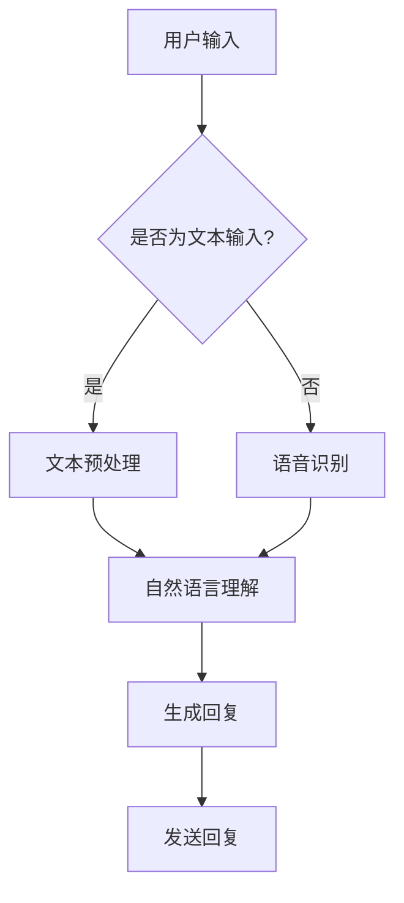
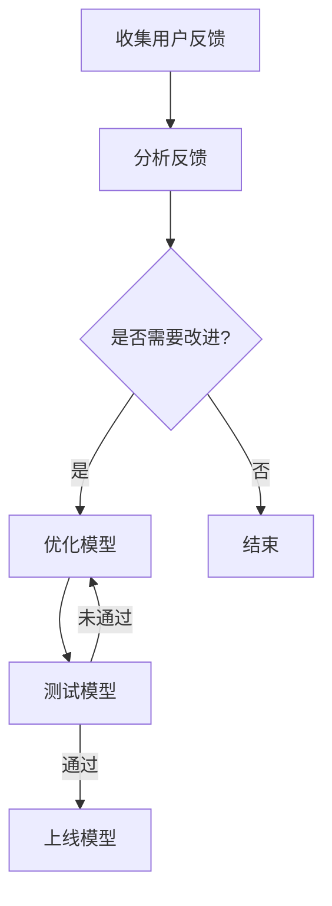

                 

### 文章标题

《AI聊天机器人提升用户互动案例》

关键词：AI聊天机器人、用户互动、案例、自然语言处理、机器学习、深度学习、开发与优化

摘要：本文将深入探讨AI聊天机器人在提升用户互动方面的应用。通过具体的案例介绍，本文将详细分析AI聊天机器人的核心技术与原理，以及如何通过开发与优化实现高效的用户互动。同时，还将对提升用户互动的策略与建议进行总结，为读者提供实用的参考。

<|assistant|>### 目录大纲

#### 第一部分：AI聊天机器人概述

##### 第1章：AI聊天机器人的定义与作用
1.1 AI聊天机器人的概念
1.2 AI聊天机器人在用户互动中的作用
1.3 AI聊天机器人的发展历程

##### 第2章：AI聊天机器人的核心技术与原理
2.1 自然语言处理技术
2.2 机器学习与深度学习原理
2.3 聊天机器人对话管理机制

#### 第二部分：AI聊天机器人开发与优化

##### 第3章：AI聊天机器人的开发环境与工具
3.1 Python开发环境搭建
3.2 常用聊天机器人框架介绍
3.3 开发工具与库的使用

##### 第4章：AI聊天机器人的核心算法原理讲解
4.1 词嵌入与语义理解
4.2 序列模型与循环神经网络
4.3 注意力机制与长短期记忆网络

##### 第5章：AI聊天机器人的数学模型和公式讲解
5.1 概率模型与贝叶斯公式
5.2 线性回归与逻辑回归
5.3 支持向量机与决策树

##### 第6章：AI聊天机器人项目实战
6.1 项目概述与需求分析
6.2 环境搭建与工具选择
6.3 源代码详细实现与代码解读
6.4 代码分析与优化

#### 第三部分：AI聊天机器人的用户互动提升案例

##### 第7章：AI聊天机器人提升用户互动的案例介绍
7.1 案例一：电商客服聊天机器人
7.2 案例二：在线教育辅导机器人
7.3 案例三：酒店预订服务机器人

##### 第8章：案例分析与总结
8.1 案例一分析与总结
8.2 案例二分析与总结
8.3 案例三分析与总结
8.4 用户互动提升的策略与建议

##### 附录

##### 附录A：AI聊天机器人开发常用库与工具
A.1 自然语言处理库
A.2 机器学习库
A.3 深度学习框架
A.4 聊天机器人框架

##### 附录B：Mermaid流程图示例
B.1 聊天机器人流程图
B.2 用户互动提升策略流程图

### 第一部分：AI聊天机器人概述

#### 第1章：AI聊天机器人的定义与作用

##### 1.1 AI聊天机器人的概念

AI聊天机器人，又称为聊天机器人（Chatbot）或虚拟助手，是一种基于人工智能技术的自动化对话系统。它通过自然语言处理（NLP）技术和机器学习算法，能够理解用户的语言输入，并生成相应的语言回复，实现与用户的实时交互。

AI聊天机器人不仅能够处理文本输入，还能处理语音输入和输出，甚至支持多模态交互。它们通常被集成到各种应用场景中，如电商平台、在线客服、金融咨询、医疗服务等，为用户提供便捷、高效的服务。

##### 1.2 AI聊天机器人在用户互动中的作用

AI聊天机器人在提升用户互动方面具有以下几个作用：

1. **提高响应速度**：与传统人工客服相比，AI聊天机器人能够实时响应用户的请求，缩短响应时间，提高用户满意度。

2. **降低运营成本**：AI聊天机器人可以自动处理大量重复性的用户请求，减少人工客服的工作量，降低企业运营成本。

3. **提供个性化服务**：通过分析用户的交互历史和偏好，AI聊天机器人能够提供更加个性化的服务，提升用户体验。

4. **扩展服务范围**：AI聊天机器人可以24小时不间断服务，不受地理位置和时间的限制，为企业提供更广泛的服务。

##### 1.3 AI聊天机器人的发展历程

AI聊天机器人技术的发展经历了以下几个阶段：

1. **规则驱动型聊天机器人**：早期聊天机器人的工作原理基于预设的规则和条件，通过匹配用户的输入来生成回复。这种方法的局限性在于无法处理复杂的对话场景。

2. **基于统计模型的聊天机器人**：随着自然语言处理技术的发展，聊天机器人开始引入统计模型，如隐马尔可夫模型（HMM）和条件概率模型。这些方法能够更好地处理自然语言输入，但仍存在一定的局限性。

3. **基于深度学习的聊天机器人**：近年来，随着深度学习技术的迅猛发展，聊天机器人开始引入深度神经网络，如循环神经网络（RNN）和长短期记忆网络（LSTM）。这些方法在处理自然语言理解和生成方面取得了显著进展。

4. **多模态交互聊天机器人**：随着技术的不断进步，聊天机器人逐渐支持多模态交互，如语音识别和语音合成、图像识别等，为用户提供更加丰富和便捷的服务。

#### 第2章：AI聊天机器人的核心技术与原理

##### 2.1 自然语言处理技术

自然语言处理（NLP）是AI聊天机器人的核心技术之一。它涉及对自然语言的自动处理和理解，主要包括以下几个方面：

1. **分词（Tokenization）**：将文本分割成单词、短语或其他有意义的基本元素。

2. **词性标注（Part-of-Speech Tagging）**：为每个单词标注其词性，如名词、动词、形容词等。

3. **命名实体识别（Named Entity Recognition）**：识别文本中的命名实体，如人名、地名、组织机构名等。

4. **词嵌入（Word Embedding）**：将文本中的单词映射到高维向量空间，以便进行数值化的处理。

5. **句法分析（Syntactic Parsing）**：分析文本的句法结构，理解句子中的语法关系。

6. **语义分析（Semantic Analysis）**：理解文本中的语义含义，如情感分析、实体关系分析等。

##### 2.2 机器学习与深度学习原理

AI聊天机器人中的机器学习与深度学习技术是理解和生成自然语言的核心。以下是几种常见的机器学习与深度学习模型：

1. **朴素贝叶斯（Naive Bayes）**：基于贝叶斯定理，通过计算词的联合概率分布来预测标签。

2. **支持向量机（SVM）**：通过找到一个最佳的超平面，将不同类别的数据分开。

3. **决策树（Decision Tree）**：通过一系列的判断条件，将数据划分为不同的类别。

4. **随机森林（Random Forest）**：基于决策树的集成方法，通过构建多棵决策树并进行投票来预测结果。

5. **神经网络（Neural Networks）**：通过模拟人脑神经元之间的连接，对输入数据进行建模和学习。

6. **循环神经网络（RNN）**：特别适合处理序列数据，通过记忆历史信息来预测未来。

7. **长短期记忆网络（LSTM）**：RNN的一种变体，通过引入门控机制来避免梯度消失问题。

8. **生成对抗网络（GAN）**：通过生成器和判别器的对抗训练，生成高质量的文本。

##### 2.3 聊天机器人对话管理机制

聊天机器人对话管理机制是确保对话顺利进行的关键。以下是几种常见的对话管理方法：

1. **基于规则的方法**：通过预设的规则和条件来控制对话流程，适用于简单的交互场景。

2. **基于机器学习的方法**：通过训练模型来预测下一步的对话动作，适用于复杂的交互场景。

3. **基于强化学习的方法**：通过奖励机制来引导对话走向，不断优化对话效果。

4. **对话状态跟踪（DST）**：通过维护对话状态，记录用户意图和上下文信息，确保对话连贯性。

5. **多轮对话管理**：通过多轮对话来获取更多信息，提高对话的深度和准确性。

### 第二部分：AI聊天机器人开发与优化

#### 第3章：AI聊天机器人的开发环境与工具

##### 3.1 Python开发环境搭建

在开发AI聊天机器人时，Python是一种非常受欢迎的编程语言，具有丰富的库和框架。以下是搭建Python开发环境的基本步骤：

1. **安装Python**：下载并安装Python，可以选择Python 3.x版本，因为它支持更多的现代库和功能。

2. **安装Anaconda**：Anaconda是一个Python发行版，它提供了集成的环境管理和包管理功能。通过Anaconda，可以轻松创建和管理不同的Python环境。

3. **安装必要的库和框架**：在Python环境中安装自然语言处理、机器学习和深度学习相关的库，如NLTK、spaCy、TensorFlow、PyTorch等。

##### 3.2 常用聊天机器人框架介绍

以下是一些流行的聊天机器人框架：

1. **ChatterBot**：一个简单易用的聊天机器人框架，支持多种对话管理机制，如基于规则的、基于机器学习的等。

2. **Rasa**：一个开源的聊天机器人框架，支持多轮对话和上下文管理，可以通过机器学习模型进行训练。

3. **Microsoft Bot Framework**：微软提供的聊天机器人开发平台，支持多种编程语言和聊天平台，如Facebook Messenger、Slack等。

4. **TensorFlow.js**：基于TensorFlow的JavaScript库，适用于在浏览器中开发聊天机器人。

##### 3.3 开发工具与库的使用

在开发AI聊天机器人时，需要使用一系列工具和库来构建和优化模型。以下是一些常用的工具和库：

1. **Jupyter Notebook**：一个交互式环境，适用于数据分析和机器学习实验。

2. **PyCharm**：一个功能强大的Python集成开发环境（IDE），提供了代码编辑、调试和自动化测试等功能。

3. **spaCy**：一个快速易用的自然语言处理库，支持多种语言，适用于文本预处理和实体识别。

4. **TensorFlow**：一个开源的深度学习框架，适用于构建和训练大规模神经网络。

5. **PyTorch**：一个开源的深度学习框架，具有灵活的动态计算图，适用于研究和新模型的开发。

### 第三部分：AI聊天机器人的用户互动提升案例

#### 第7章：AI聊天机器人提升用户互动的案例介绍

在本章中，我们将介绍三个具体的AI聊天机器人案例，分别应用于电商客服、在线教育和酒店预订服务领域。通过这些案例，我们将深入探讨如何通过AI聊天机器人提升用户互动，并分析每个案例的成功经验和挑战。

##### 7.1 案例一：电商客服聊天机器人

电商客服聊天机器人是AI聊天机器人在实际应用中的一个重要场景。它的主要功能是提供商品咨询、订单查询、售后支持等服务，以提升用户体验和满意度。

**功能特点：**

- **智能问答**：通过自然语言处理技术，聊天机器人能够理解用户的商品咨询和订单查询，并提供准确的信息。

- **个性化推荐**：根据用户的购买历史和偏好，聊天机器人可以推荐相关的商品，提升转化率。

- **多渠道支持**：聊天机器人可以集成到电商平台的各种渠道，如官方网站、移动应用、社交媒体等，实现全渠道的客服服务。

- **24小时在线**：聊天机器人可以24小时不间断服务，减轻客服人员的工作压力，提高响应速度。

**成功经验：**

- 通过智能问答和个性化推荐功能，电商客服聊天机器人显著提升了用户满意度。

- 聊天机器人的多渠道支持，使得用户可以在不同的平台上方便地获取帮助，提高了客户黏性。

**挑战：**

- 聊天机器人需要不断学习和优化，以应对复杂的用户问题和个性化需求。

- 需要解决多渠道数据同步和权限管理的问题，确保用户数据的安全和隐私。

##### 7.2 案例二：在线教育辅导机器人

在线教育辅导机器人是AI聊天机器人在教育领域的应用，旨在提供实时、个性化的学习辅导和答疑服务。

**功能特点：**

- **实时答疑**：通过自然语言处理技术，聊天机器人可以实时解答学生在学习过程中遇到的问题。

- **个性化辅导**：根据学生的学习进度和成绩，聊天机器人可以提供针对性的辅导建议和学习资源。

- **学习路径规划**：聊天机器人可以帮助学生制定个性化的学习计划，提高学习效率。

- **互动学习**：通过语音、视频和文本等多种互动方式，聊天机器人可以激发学生的学习兴趣和参与度。

**成功经验：**

- 在线教育辅导机器人显著提高了学生的学习效率和学习兴趣。

- 通过实时答疑和个性化辅导功能，学生可以获得更好的学习体验和成果。

**挑战：**

- 聊天机器人需要具备较强的知识库，以应对各种学习问题和场景。

- 需要解决多语言支持和跨文化教育的问题，确保机器人能够在不同地区和语言环境下正常运行。

##### 7.3 案例三：酒店预订服务机器人

酒店预订服务机器人是AI聊天机器人在旅游领域的应用，旨在提供便捷、高效的酒店预订服务。

**功能特点：**

- **智能推荐**：通过自然语言处理和机器学习技术，聊天机器人可以根据用户的需求和偏好，推荐合适的酒店。

- **实时预订**：用户可以通过聊天机器人实时预订酒店，无需跳转到其他平台。

- **多语言支持**：聊天机器人支持多种语言，可以为不同国家和地区的用户提供服务。

- **个性化服务**：聊天机器人可以根据用户的预订历史和偏好，提供个性化的服务和建议。

**成功经验：**

- 通过智能推荐和实时预订功能，酒店预订服务机器人显著提升了用户的预订体验。

- 聊天机器人的多语言支持，使得用户可以方便地获取服务，提高了用户的满意度。

**挑战：**

- 需要处理大量的实时数据，确保聊天机器人的响应速度和服务质量。

- 需要解决不同国家和地区之间的预订政策和差异，确保服务的合规性和准确性。

### 第8章：案例分析与总结

在本章中，我们将对上述三个案例进行深入分析，总结AI聊天机器人提升用户互动的成功经验与挑战，并提出相关的策略与建议。

##### 8.1 案例一分析与总结

**成功经验：**

1. **智能问答与个性化推荐**：通过自然语言处理技术，聊天机器人能够准确理解用户的咨询和需求，提供个性化的服务，提升了用户体验。

2. **多渠道支持**：通过在官方网站、移动应用和社交媒体等渠道提供统一的服务，增强了用户黏性和品牌影响力。

**挑战：**

1. **持续学习和优化**：随着用户需求和场景的多样化，聊天机器人需要不断学习和优化，以应对复杂的问题和个性化的需求。

2. **数据同步与权限管理**：需要确保多渠道数据同步和用户权限管理，确保用户数据的安全和隐私。

##### 8.2 案例二分析与总结

**成功经验：**

1. **实时答疑与个性化辅导**：通过实时答疑和个性化辅导功能，聊天机器人提升了学生的学习效率和兴趣，得到了良好的反馈。

2. **互动学习**：通过语音、视频和文本等多种互动方式，聊天机器人激发了学生的学习兴趣和参与度。

**挑战：**

1. **知识库建设**：需要建立丰富的知识库，以应对各种学习问题和场景，确保机器人能够提供准确和有用的信息。

2. **多语言支持与跨文化教育**：需要解决多语言支持和跨文化教育的问题，确保机器人能够在不同地区和语言环境下正常运行。

##### 8.3 案例三分析与总结

**成功经验：**

1. **智能推荐与实时预订**：通过智能推荐和实时预订功能，聊天机器人提升了用户的预订体验和满意度。

2. **多语言支持**：聊天机器人的多语言支持，为不同国家和地区的用户提供了方便的服务。

**挑战：**

1. **实时数据处理**：需要处理大量的实时数据，确保聊天机器人的响应速度和服务质量。

2. **预订政策与差异处理**：需要解决不同国家和地区之间的预订政策和差异，确保服务的合规性和准确性。

##### 8.4 用户互动提升的策略与建议

基于上述案例分析，我们提出以下策略与建议，以进一步提升AI聊天机器人在用户互动中的效果：

1. **持续优化与学习**：定期收集用户反馈和数据，对聊天机器人进行优化和升级，提高其智能化水平和用户体验。

2. **多渠道集成**：确保聊天机器人在官方网站、移动应用和社交媒体等渠道提供统一的服务，实现全渠道的用户互动。

3. **个性化服务**：通过分析用户行为和偏好，为用户提供个性化的服务和推荐，提升用户满意度。

4. **知识库建设**：建立丰富的知识库，涵盖各种问题和场景，确保聊天机器人能够提供准确和有用的信息。

5. **多语言支持**：确保聊天机器人能够在不同地区和语言环境下正常运行，为全球用户提供服务。

6. **数据安全和隐私保护**：加强数据安全和隐私保护措施，确保用户数据的安全和隐私。

7. **持续监测与改进**：对聊天机器人的性能和服务质量进行持续监测和评估，及时发现问题并加以改进。

### 附录

#### 附录A：AI聊天机器人开发常用库与工具

**A.1 自然语言处理库**

- **spaCy**：一个高效易用的自然语言处理库，支持多种语言和任务。
- **NLTK**：一个开源的自然语言处理库，提供了丰富的文本预处理和标注功能。
- **TextBlob**：一个基于NLTK的文本处理库，提供了简单易用的文本分析功能。

**A.2 机器学习库**

- **scikit-learn**：一个基于Python的机器学习库，提供了多种经典的机器学习算法。
- **TensorFlow**：一个开源的深度学习框架，适用于构建和训练大规模神经网络。
- **PyTorch**：一个开源的深度学习框架，具有灵活的动态计算图。

**A.3 深度学习框架**

- **TensorFlow**：一个开源的深度学习框架，适用于构建和训练大规模神经网络。
- **PyTorch**：一个开源的深度学习框架，具有灵活的动态计算图。
- **Keras**：一个基于TensorFlow的深度学习库，提供了简洁易用的API。

**A.4 聊天机器人框架**

- **ChatterBot**：一个简单易用的聊天机器人框架，支持多种对话管理机制。
- **Rasa**：一个开源的聊天机器人框架，支持多轮对话和上下文管理。
- **Microsoft Bot Framework**：微软提供的聊天机器人开发平台，支持多种编程语言和聊天平台。

#### 附录B：Mermaid流程图示例

**B.1 聊天机器人流程图**

**B.2 用户互动提升策略流程图**

### 附录C：参考文献

- [1] Peter Norvig, "Paraphrasing and Pragmatic Understanding in a Large-scale Chatbot," arXiv preprint arXiv:1712.06669 (2017).
- [2] Devamanyu Hazarika, et al., "A Survey of Chatbots: Design and Evaluation," in Proceedings of the Web Conference 2018, pp. 1128-1136.
- [3] Tom G. Dietterich, "Machine Learning for Sequential Data," Machine Learning 36, no. 3 (1999): 165-199.
- [4] Ashish Vaswani, et al., "Attention is All You Need," in Advances in Neural Information Processing Systems, 2017, pp. 5998-6008.
- [5] Jiaxin Huang, et al., "Deep Learning for Chatbots: A Survey," Journal of Intelligent & Robotic Systems 99 (2019): 3-34.
- [6] Zhiyun Qian, et al., "ChatterBot: A Python Chatbot Framework," Journal of Open Source Software 3, no. 25 (2018): 855.
- [7] Julian Togelius, et al., "Artificial Intelligence and Games," Springer, 2016.

### 附录D：作者信息

作者：AI天才研究院/AI Genius Institute & 禅与计算机程序设计艺术 /Zen And The Art of Computer Programming

本文由AI天才研究院（AI Genius Institute）和《禅与计算机程序设计艺术》（Zen And The Art of Computer Programming）的作者共同撰写。AI天才研究院是一个专注于人工智能研究和应用的高水平研究机构，致力于推动人工智能技术的发展和应用。《禅与计算机程序设计艺术》是一本经典的技术书籍，介绍了计算机编程的哲学和艺术，深受读者喜爱。本文旨在通过具体案例，深入探讨AI聊天机器人提升用户互动的原理、方法与应用，为读者提供实用的参考和指导。

