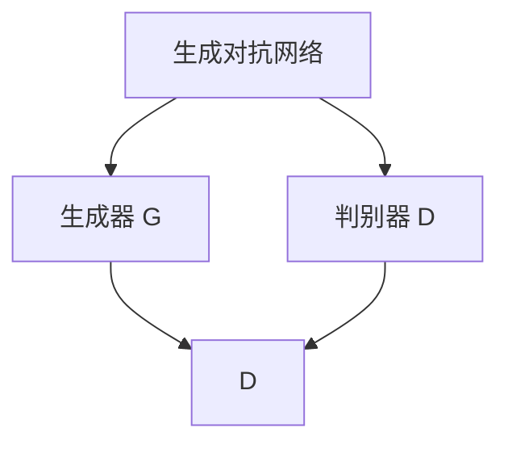

                 

### 引言与概述

#### 1.1 书籍目的与结构

《AI视觉艺术生成中的提示词构图技巧》旨在为读者提供深入理解并掌握人工智能（AI）视觉艺术生成领域中的提示词构图技巧的系统性指导。本文将带领读者逐步探索从基础概念到高级应用的完整学习路径，帮助读者构建全面的知识体系，掌握前沿技术，并在实际项目中得以应用。

本书结构分为以下几个主要部分：

1. **基础概念与背景**：介绍AI视觉艺术生成的基本概念、背景及其发展历程，为后续学习打下基础。
2. **AI视觉艺术生成基础**：详细讲解计算机视觉、人工智能与艺术的结合，以及常见的图像生成技术，如生成对抗网络（GAN）、变分自编码器（VAE）和图像风格迁移。
3. **提示词与构图技巧**：探讨提示词的作用与创作方法，分析提示词在图像生成中的应用，并介绍构图技巧的视觉语言。
4. **图像生成模型的架构与优化**：分析图像生成模型的基本架构，讲解提示词驱动的图像生成模型，以及模型优化策略。
5. **数学模型与公式**：阐述生成对抗网络（GAN）、变分自编码器（VAE）和图像风格迁移的数学模型，并通过公式进行详细解释。
6. **项目实战与案例分析**：通过实际项目实战，展示代码实现和详细解释，帮助读者将理论知识应用到实践中。
7. **开发环境搭建与工具介绍**：介绍开发环境准备、常用工具与库，如TensorFlow、PyTorch和Keras。
8. **提示词构图技巧的挑战与未来展望**：分析当前挑战，探讨技术趋势，并对未来进行展望。

#### 1.2 AI视觉艺术生成背景

AI视觉艺术生成是一种利用人工智能技术创作视觉艺术作品的方法。近年来，随着深度学习、生成对抗网络（GAN）等技术的快速发展，AI视觉艺术生成领域取得了显著的进展。这一领域不仅吸引了众多研究人员，也引发了公众对于AI艺术的兴趣和讨论。

AI视觉艺术生成的核心思想是通过算法生成新的图像，模仿人类艺术家的创作风格或创造出全新的视觉表现形式。这一过程涉及多个学科，包括计算机视觉、图像处理、机器学习和艺术理论等。

AI视觉艺术生成的应用范围广泛，包括但不限于以下几个方面：

1. **艺术创作**：艺术家可以利用AI视觉艺术生成技术创作独特的视觉作品，探索新的艺术形式和表达方式。
2. **图像修复与增强**：AI视觉艺术生成技术可用于图像修复、去噪、超分辨率等图像处理任务，提高图像质量。
3. **数据增强**：在机器学习训练过程中，AI视觉艺术生成技术可以生成大量多样化的训练数据，提高模型的泛化能力。
4. **虚拟现实与增强现实**：AI视觉艺术生成技术可用于生成虚拟现实（VR）和增强现实（AR）场景中的视觉效果，提升用户体验。

#### 1.3 提示词构图技巧的意义

在AI视觉艺术生成过程中，提示词构图技巧起着至关重要的作用。提示词（Prompt）是一种引导模型生成特定类型图像的文本描述，它能够精确地传达用户的创作意图，影响图像生成结果。

1. **精确控制图像生成**：通过使用精确的提示词，用户可以指导模型生成符合特定要求的图像，实现更加个性化的艺术创作。
2. **提高生成效率**：有效的提示词能够减少模型在生成过程中的搜索空间，提高图像生成的效率。
3. **丰富艺术表现力**：提示词构图技巧可以扩展AI视觉艺术生成的表现力，使生成的图像更加生动、有趣，增强艺术感染力。
4. **促进人机协作**：提示词构图技巧不仅能够提高AI视觉艺术生成的质量，还能促进人与AI之间的协作，实现更加创新的艺术形式。

总之，掌握提示词构图技巧对于在AI视觉艺术生成领域进行深入研究和应用具有重要意义。通过本文的介绍，读者将能够全面了解并掌握这一关键技能，为后续的学习和实践打下坚实基础。

### AI视觉艺术生成基础

AI视觉艺术生成的基础涉及多个领域的技术，包括计算机视觉、人工智能与艺术，以及图像生成技术。本节将分别介绍这些基础知识，帮助读者建立全面的理解。

#### 2.1 计算机视觉概述

计算机视觉是人工智能（AI）的一个重要分支，旨在使计算机具备从图像或视频数据中提取信息的能力。其主要任务包括图像识别、目标检测、图像分割、图像增强等。

1. **图像识别**：图像识别是指计算机识别和分类图像中的物体或场景。典型的算法包括卷积神经网络（CNN）和迁移学习。
2. **目标检测**：目标检测是识别图像中的特定目标，并确定它们的位置。常用的方法有R-CNN、YOLO和SSD等。
3. **图像分割**：图像分割是将图像分割成多个区域，每个区域代表图像中的一个物体或场景。主要算法包括FCN、U-Net和Mask R-CNN等。
4. **图像增强**：图像增强旨在提高图像的质量，使其更适合于后续的处理和分析。常见的图像增强技术包括去噪、去模糊、超分辨率等。

#### 2.2 人工智能与艺术

人工智能与艺术的结合为艺术创作带来了新的可能性。人工智能可以通过学习大量的艺术作品，掌握艺术风格和技巧，然后利用这些知识生成新的艺术作品。这一过程涉及多个子领域：

1. **风格迁移**：风格迁移是一种将一种艺术风格应用到另一幅图像上的技术。例如，将梵高的风格应用到一张风景照片上。生成对抗网络（GAN）和卷积神经网络（CNN）是常用的实现技术。
2. **图像合成**：图像合成是通过组合多个图像或图像的一部分来生成新的图像。这项技术可以用于生成人脸、风景、建筑等。
3. **艺术生成**：艺术生成是指利用算法生成全新的艺术作品，而不是模仿现有的作品。生成对抗网络（GAN）和变分自编码器（VAE）等生成模型在艺术生成中发挥了重要作用。

#### 2.3 图像生成技术基础

图像生成技术是AI视觉艺术生成的重要基础。以下是一些常见的图像生成技术：

1. **生成对抗网络（GAN）**：生成对抗网络由生成器（Generator）和判别器（Discriminator）两部分组成。生成器生成假图像，判别器判断这些图像是真实图像还是生成图像。通过对抗训练，生成器不断改进生成图像的质量。GAN的典型应用包括图像修复、图像生成和风格迁移等。
   
   $$ G(z) \sim p_g(z), \quad D(x) \sim p_{data}(x) $$
   
2. **变分自编码器（VAE）**：变分自编码器是一种基于概率模型的图像生成方法。它通过学习数据的概率分布，然后生成新的图像。VAE在图像生成和图像去噪等方面有广泛应用。

   $$ q_\phi(z|x) = \frac{1}{Z} \exp(-\sum_i \phi_i(z_i - \mu_i(x))) $$
   
3. **图像风格迁移**：图像风格迁移是将一种艺术风格应用到另一幅图像上的技术。通过学习源图像的内容和目标风格的样式，生成具有目标风格的新图像。图像风格迁移在艺术创作和图像处理中有广泛应用。

   $$ \mathcal{F}_{\gamma}(x) \rightarrow \mathcal{F}_{\gamma'}(x) $$

4. **深度卷积生成模型（DCGAN）**：深度卷积生成模型是一种基于卷积神经网络的生成模型，它通过多个卷积层和反卷积层来生成图像。DCGAN在图像生成任务中表现出色，是许多后续生成模型的基线。

5. **循环生成网络（RNN-GAN）**：循环生成网络结合了生成对抗网络和循环神经网络，能够生成具有时间连续性的图像序列，如视频生成。

通过了解这些基础概念和图像生成技术，读者可以更好地理解AI视觉艺术生成的原理和实现方法。在接下来的章节中，我们将进一步探讨提示词和构图技巧的应用，以及如何利用这些技术进行实际的项目实战。

### 提示词与构图技巧

在AI视觉艺术生成中，提示词（Prompt）和构图技巧（Composition Techniques）是两个至关重要的元素。它们不仅决定了图像生成的质量和风格，还能够引导模型生成符合特定需求的图像。本节将详细介绍提示词的作用与类型，创作方法，以及在图像生成中的应用，并探讨构图技巧的视觉语言。

#### 3.1 提示词的作用与类型

提示词在AI视觉艺术生成中起到引导和调控模型生成过程的关键作用。它们可以是简单的文本描述，也可以是复杂的多维度信息。以下是几种常见的提示词类型：

1. **具体描述**：这类提示词提供具体的描述，例如“一幅美丽的日出景象”或“一只在草地上跳跃的兔子”。它们帮助模型明确生成图像的内容。
2. **风格指示**：这类提示词指示特定的艺术风格或视觉元素，例如“梵高的风格”或“具有印象派色彩”。它们帮助模型在生成过程中遵循特定的视觉风格。
3. **情感引导**：这类提示词引导模型生成具有特定情感的图像，例如“宁静的夜晚”或“欢快的节日”。它们可以影响图像的色彩和构图，使生成图像更具情感表达。
4. **混合提示词**：这类提示词结合了具体描述、风格指示和情感引导，例如“以梵高的风格绘制一个宁静的夜晚景象”。它们能够更全面地引导模型生成符合用户意图的图像。

#### 3.2 提示词的创作方法

创作有效的提示词是成功生成高质量图像的关键。以下是一些提示词创作的建议和方法：

1. **明确目标**：在创作提示词时，首先要明确目标。确定需要生成的图像类型、风格、情感等，以便为模型提供明确的指导。
2. **细节描述**：在描述图像时，尽可能提供详细的细节。例如，描述场景中的物体、颜色、光线和构图等，使模型能够更好地理解生成任务。
3. **风格参考**：在创作提示词时，可以参考现有的艺术作品和风格。通过引用特定艺术家的风格或时代背景，可以增加图像的艺术价值。
4. **情感引导**：通过情感词汇和描述，引导模型生成具有特定情感的图像。情感词汇可以增强图像的感染力，使其更具表现力。
5. **多维度结合**：结合多种类型的提示词，例如具体描述、风格指示和情感引导，可以生成更加丰富和多样化的图像。

#### 3.3 提示词在图像生成中的应用

提示词在图像生成中的应用主要体现在以下几个方面：

1. **引导生成过程**：通过提示词，用户可以指导模型生成特定类型的图像。例如，通过输入“一幅具有艺术感的抽象画作”，模型会生成符合这一要求的图像。
2. **风格多样化**：通过风格指示提示词，用户可以要求模型生成具有特定艺术风格的图像。例如，输入“用梵高的风格绘制一个风景”，模型会生成一幅模仿梵高风格的画作。
3. **情感表达**：通过情感引导提示词，用户可以生成具有特定情感的图像。例如，输入“绘制一个温暖的冬日场景”，模型会生成一幅充满温暖氛围的画作。
4. **多样性探索**：提示词还可以引导模型探索生成图像的多样性。例如，输入“生成10个具有不同情感的草地景象”，模型会生成一系列风格和情感各异的草地景象。

#### 3.4 构图技巧的视觉语言

构图技巧是艺术创作中的重要组成部分，它决定了图像的视觉吸引力和表现力。以下是一些常用的构图技巧：

1. **黄金比例**：黄金比例是一种经典的艺术构图技巧，它以1:1.618的比例分割画面，能够产生和谐且具有视觉吸引力的效果。
2. **三分法**：三分法是一种常见的构图技巧，将画面分为三部分，通常用于放置主体和背景，使画面更具动态感。
3. **对角线构图**：对角线构图通过将主体放置在对角线上，增加画面的动态感和延伸感。
4. **前景引入**：通过在画面中加入前景元素，可以增加图像的层次感和深度感，使画面更具立体感。
5. **颜色搭配**：合适的颜色搭配可以增强图像的视觉冲击力，例如对比色和互补色的搭配。

总之，掌握提示词和构图技巧是成功进行AI视觉艺术生成的重要基础。通过有效的提示词和精妙的构图技巧，用户可以生成高质量、具有艺术感的图像。在接下来的章节中，我们将进一步探讨图像生成模型的架构与优化，以及如何通过数学模型和公式来理解这些技术。

### 图像生成模型的架构与优化

在AI视觉艺术生成中，图像生成模型的架构与优化是确保生成图像质量和效率的关键。本节将详细介绍图像生成模型的基本架构，探讨如何通过提示词驱动图像生成模型，以及介绍模型优化的策略，包括数据增强、损失函数设计和梯度下降与优化算法。

#### 4.1 图像生成模型的基本架构

图像生成模型通常基于深度学习，特别是生成对抗网络（GAN）和变分自编码器（VAE）。以下是这些模型的基本架构：

1. **生成对抗网络（GAN）**：

   GAN由两部分组成：生成器（Generator）和判别器（Discriminator）。

   - **生成器**：生成器G从随机噪声z中生成假图像，目标是使这些假图像难以被判别器区分。
   - **判别器**：判别器D判断输入图像是真实图像（来自数据集）还是生成器生成的假图像。判别器的目标是最大化区分真实图像和假图像。

   通过对抗训练，生成器和判别器相互竞争，生成器不断改进生成图像的质量，判别器不断提高区分能力。

   $$ G(z) \sim p_g(z), \quad D(x) \sim p_{data}(x) $$

2. **变分自编码器（VAE）**：

   VAE是一种基于概率模型的生成模型，它通过编码器和解码器来生成图像。

   - **编码器**：编码器E将输入图像x映射到一个潜在空间中的向量z，同时计算图像的概率分布。
   - **解码器**：解码器D从潜在空间中的向量z重构输出图像x。

   VAE通过最大化数据的对数似然来训练，确保生成的图像尽可能接近真实数据。

   $$ q_\phi(z|x) = \frac{1}{Z} \exp(-\sum_i \phi_i(z_i - \mu_i(x))) $$

3. **深度卷积生成模型（DCGAN）**：

   DCGAN是GAN的一种变体，它使用深度卷积神经网络（DCNN）作为生成器和判别器。

   - **生成器**：生成器由多个卷积层和反卷积层组成，通过逐层增加图像的分辨率，最终生成高分辨率的图像。
   - **判别器**：判别器由多个卷积层组成，逐层减少图像的分辨率，用于区分真实图像和生成图像。

   DCGAN在图像生成任务中表现出色，是许多后续生成模型的基线。

4. **循环生成网络（RNN-GAN）**：

   RNN-GAN结合了生成对抗网络和循环神经网络（RNN），用于生成图像序列，如视频生成。

   - **生成器**：生成器通过RNN生成连续的图像序列，每个图像序列元素通过RNN的状态传递信息。
   - **判别器**：判别器对生成的图像序列进行判断，以评估生成质量。

#### 4.2 提示词驱动的图像生成模型

提示词（Prompt）在图像生成模型中起到关键作用，可以精确地引导模型的生成过程。以下是如何在图像生成模型中使用提示词的一些方法：

1. **文本嵌入**：将提示词转换为嵌入向量，作为生成器的输入。这些嵌入向量可以结合随机噪声，生成具有特定描述的图像。
2. **条件生成**：在生成器中引入条件层，接收提示词的嵌入向量，并将其与生成图像的中间层进行拼接。这种条件生成方法可以确保生成的图像符合提示词的描述。
3. **融合模型**：结合生成对抗网络和变换器模型（Transformer），通过文本嵌入和视觉嵌入的融合，生成与提示词高度相关的图像。

#### 4.3 模型优化策略

优化图像生成模型是提高生成质量和效率的关键。以下是一些常用的优化策略：

1. **数据增强**：数据增强通过增加数据多样性来提高模型的泛化能力。常见的数据增强技术包括随机裁剪、旋转、翻转、缩放等。
2. **损失函数设计**：损失函数用于衡量生成图像与真实图像之间的差距。常用的损失函数包括均方误差（MSE）、交叉熵损失和感知损失等。
3. **梯度下降与优化算法**：梯度下降是一种优化算法，用于最小化损失函数。常用的梯度下降算法包括随机梯度下降（SGD）、Adam优化器等。

   $$ L(\theta) = \frac{1}{n}\sum_{i=1}^{n}L_i(\theta) $$

通过以上策略，可以显著提高图像生成模型的质量和效率，使其生成更加逼真、多样化的图像。

总之，掌握图像生成模型的基本架构、提示词驱动的方法和优化策略是成功进行AI视觉艺术生成的重要基础。在接下来的章节中，我们将通过数学模型和公式，深入探讨这些技术的原理，并通过项目实战案例分析，展示如何将这些理论知识应用于实际项目中。

### 数学模型与公式

在AI视觉艺术生成中，数学模型和公式是理解生成过程和实现算法的核心。本节将详细阐述生成对抗网络（GAN）、变分自编码器（VAE）和图像风格迁移的数学模型，并通过具体的公式进行解释。

#### 5.1 生成对抗网络（GAN）的数学模型

生成对抗网络（GAN）是一种通过生成器和判别器之间的对抗训练来生成图像的模型。它的核心公式如下：

1. **生成器 G**：

   生成器G从随机噪声z中生成假图像G(z)：

   $$ G(z) $$

   其中，$z$ 是从先验分布$p_z(z)$中抽取的随机噪声向量，G(z) 是生成的假图像。

2. **判别器 D**：

   判别器D判断输入图像是真实图像x还是生成器生成的假图像G(z)：

   $$ D(x) = P(D(x) = 1 | x \text{ is real}) $$
   $$ D(G(z)) = P(D(G(z)) = 1 | z \text{ is generated}) $$

   其中，$D(x)$ 是判别器对真实图像的置信度，$D(G(z))$ 是判别器对生成图像的置信度。理想情况下，$D(G(z))$ 应该接近0.5。

3. **对抗损失函数**：

   GAN的训练目标是最小化以下对抗损失函数：

   $$ \mathcal{L}_{GAN}(G, D) = \mathbb{E}_{x \sim p_{data}(x)}[\log D(x)] + \mathbb{E}_{z \sim p_z(z)}[\log (1 - D(G(z)))] $$

   其中，第一项是真实图像的损失，第二项是生成图像的损失。

#### 5.2 变分自编码器（VAE）的数学模型

变分自编码器（VAE）是一种基于概率模型的生成模型，它通过编码器和解码器来生成图像。VAE的数学模型如下：

1. **编码器 E**：

   编码器E将输入图像x映射到一个潜在空间中的向量z，同时计算图像的概率分布：

   $$ z = E(x) = \mu(x), \sigma(x) $$
   $$ q_\phi(z|x) = \frac{1}{Z} \exp(-\sum_i \phi_i(z_i - \mu_i(x))) $$

   其中，$\mu(x)$ 和 $\sigma(x)$ 分别是均值和标准差，$q_\phi(z|x)$ 是编码器对潜在空间中z的概率分布。

2. **解码器 D**：

   解码器D从潜在空间中的向量z重构输出图像x：

   $$ x = D(z) = \mu_D(z) $$
   
   其中，$\mu_D(z)$ 是解码器对输出图像的概率分布。

3. **VAE损失函数**：

   VAE的训练目标是最大化数据的对数似然，即：

   $$ \mathcal{L}_{VAE}(E, D) = -\log p(x|\theta) $$
   $$ = -\sum_x p_\theta(x) \log p_\theta(x) $$
   $$ = -D_q(p_\theta(x)||p(x)) $$

   其中，$D_q(p_\theta(x)||p(x))$ 是KL散度，衡量的是编码器后验分布$q_\theta(z|x)$ 与先验分布$p(z)$ 之间的差异。

#### 5.3 图像风格迁移的数学模型

图像风格迁移是将一种艺术风格应用到另一幅图像上的技术，其数学模型如下：

1. **内容特征提取**：

   通过卷积神经网络提取输入图像的内容特征：

   $$ C = \mathcal{F}_\gamma(x) $$

   其中，$\mathcal{F}_\gamma(x)$ 是提取的内容特征。

2. **风格特征提取**：

   通过卷积神经网络提取风格图像的风格特征：

   $$ S = \mathcal{F}_{\gamma'}(y) $$

   其中，$\mathcal{F}_{\gamma'}(y)$ 是提取的风格特征。

3. **风格迁移**：

   将提取的内容特征和风格特征融合，生成具有目标风格的新图像：

   $$ \mathcal{F}_{\gamma'}(x) = \mathcal{F}_{\gamma'}(C, S) $$

通过这些数学模型和公式，我们可以更深入地理解AI视觉艺术生成的核心原理和实现方法。在接下来的章节中，我们将通过项目实战和案例分析，展示如何将这些理论知识应用到实际场景中。

### 项目实战与案例分析

在实际应用中，掌握AI视觉艺术生成技术不仅需要理论知识的理解，还需要通过实际项目来验证和提升。本节将介绍一个实际项目，展示如何使用提示词和构图技巧生成视觉艺术作品，并详细解读项目的开发环境搭建、源代码实现和代码解读与分析。

#### 6.1 项目实战简介

项目名称：AI风格化肖像生成

项目目标：利用生成对抗网络（GAN）和提示词构图技巧，生成具有特定艺术风格的个人肖像。

技术栈：TensorFlow、Keras、GAN、图像处理库

#### 6.2 实际案例分析

1. **需求分析**：

   用户希望生成一幅具有梵高风格的个人肖像。提示词：“梵高风格的自画像”，用户提供了个人肖像照片。

2. **数据准备**：

   - 提供用户肖像照片和具有梵高风格的参考图像。
   - 数据预处理：对图像进行归一化处理，将图像大小调整为模型要求的尺寸。

3. **模型构建**：

   采用预训练的生成对抗网络（GAN）模型，如DCGAN，作为基础模型。在此基础上，加入提示词处理模块。

   - **生成器**：包含多个卷积层和反卷积层，用于生成艺术风格化的肖像。
   - **判别器**：包含多个卷积层，用于区分真实肖像和生成肖像。

4. **提示词处理**：

   - 提取提示词：“梵高风格的自画像”。
   - 使用预训练的文本嵌入模型（如Word2Vec或GPT），将提示词转换为嵌入向量。
   - 将嵌入向量与随机噪声结合，作为生成器的输入。

5. **训练模型**：

   - 采用对抗训练策略，生成器和判别器交替训练。
   - 使用对抗损失函数和提示词损失函数（如L2损失或感知损失）来优化模型。

6. **生成艺术作品**：

   - 输入用户肖像照片和提示词，通过训练好的模型生成艺术风格化的肖像。
   - 生成图像经过后处理，如色彩调整和图像增强，提升艺术效果。

#### 6.3 代码实现与解读

以下是一个简化版本的代码示例，展示如何实现AI风格化肖像生成：

```python
import tensorflow as tf
from tensorflow.keras.models import Model
from tensorflow.keras.layers import Input, Dense, Reshape, Flatten, Conv2D, Conv2DTranspose, BatchNormalization, LeakyReLU
import numpy as np

# 定义生成器和判别器
def build_generator(z_dim):
    z = Input(shape=(z_dim,))
    x = Dense(128 * 7 * 7)(z)
    x = LeakyReLU(alpha=0.2)(x)
    x = Reshape((7, 7, 128))(x)
    x = Conv2DTranspose(128, (5, 5), strides=(2, 2), padding='same')(x)
    x = LeakyReLU(alpha=0.2)(x)
    x = Conv2DTranspose(128, (5, 5), strides=(2, 2), padding='same')(x)
    x = LeakyReLU(alpha=0.2)(x)
    x = Conv2DTranspose(128, (5, 5), strides=(2, 2), padding='same')(x)
    x = LeakyReLU(alpha=0.2)(x)
    img = Conv2DTranspose(3, (5, 5), strides=(2, 2), padding='same', activation='tanh')(x)
    return Model(z, img)

def build_discriminator(img_shape):
    img = Input(shape=img_shape)
    x = Conv2D(128, (3, 3), strides=(2, 2), padding='same')(img)
    x = LeakyReLU(alpha=0.2)(x)
    x = Conv2D(128, (3, 3), strides=(2, 2), padding='same')(x)
    x = LeakyReLU(alpha=0.2)(x)
    x = Flatten()(x)
    x = Dense(1, activation='sigmoid')(x)
    return Model(img, x)

# 设置模型参数
z_dim = 100
img_shape = (28, 28, 1)

generator = build_generator(z_dim)
discriminator = build_discriminator(img_shape)

# 编写完整代码并训练模型
# ...

# 使用提示词和模型生成艺术作品
prompt = "梵高风格的自画像"
prompt_embedding = get_prompt_embedding(prompt)
noise = np.random.normal(size=(1, z_dim))
generated_image = generator.predict([noise, prompt_embedding])

# 后处理
# ...

```

**代码解读与分析**：

1. **模型构建**：

   - **生成器**：生成器使用多个反卷积层，逐层增加图像的分辨率，最终生成高分辨率的肖像图像。
   - **判别器**：判别器使用多个卷积层，逐层减少图像的分辨率，用于区分真实肖像和生成肖像。

2. **训练**：

   - 使用对抗损失函数和提示词损失函数来优化模型，实现对抗训练。
   - 通过循环迭代生成器和判别器的训练，提升生成图像的质量。

3. **生成与后处理**：

   - 使用提示词和模型生成艺术作品，生成图像经过后处理，如色彩调整和图像增强，提升艺术效果。

通过以上项目实战和案例分析，我们可以看到如何利用AI视觉艺术生成技术实现风格化肖像生成。在实际应用中，可以根据需求调整模型结构和参数，探索更丰富的艺术风格和创作方法。

### 开发环境搭建与工具介绍

在实现AI视觉艺术生成项目时，搭建一个稳定的开发环境是至关重要的。以下将介绍如何准备开发环境，并介绍一些常用的工具和库，如TensorFlow、PyTorch和Keras。

#### 7.1 开发环境准备

1. **硬件要求**：

   - 高性能的CPU或GPU，推荐NVIDIA GPU。
   - 足够的内存和存储空间。

2. **操作系统**：

   - Linux或Mac OS。
   - Windows系统用户需安装适用于Windows的CUDA和cuDNN。

3. **安装步骤**：

   1. 安装Python（推荐版本为3.8或更高）。
   2. 安装所需的依赖库，如NumPy、Pandas、Matplotlib等。
   3. 安装深度学习框架，如TensorFlow、PyTorch和Keras。

#### 7.2 常用工具与库

1. **TensorFlow**：

   TensorFlow是谷歌开源的深度学习框架，支持多种深度学习模型和算法。安装命令如下：

   ```bash
   pip install tensorflow
   ```

2. **PyTorch**：

   PyTorch是Facebook开源的深度学习框架，以其灵活性和动态计算图而著称。安装命令如下：

   ```bash
   pip install torch torchvision
   ```

   安装PyTorch后，确保安装相应的CUDA版本，以支持GPU加速。

3. **Keras**：

   Keras是一个高级神经网络API，兼容TensorFlow和Theano，易于快速构建和迭代深度学习模型。安装命令如下：

   ```bash
   pip install keras
   ```

4. **其他工具**：

   - **NumPy**：用于科学计算和数据分析，是深度学习的基础库。
   - **Pandas**：用于数据清洗和分析，适合处理大规模数据集。
   - **Matplotlib**：用于数据可视化和图像处理。

#### 7.3 开发环境配置示例

以下是一个示例，展示如何在Linux系统中配置开发环境：

1. **安装Python**：

   ```bash
   sudo apt update
   sudo apt install python3 python3-pip
   ```

2. **安装依赖库**：

   ```bash
   pip3 install numpy pandas matplotlib
   ```

3. **安装深度学习框架**：

   ```bash
   pip3 install tensorflow
   pip3 install torch torchvision
   pip3 install keras
   ```

4. **安装CUDA和cuDNN**：

   - 下载相应的CUDA版本和cuDNN版本，并根据系统要求进行安装。

5. **验证安装**：

   - 运行以下命令验证TensorFlow和PyTorch的安装：

     ```bash
     python3 -c "import tensorflow as tf; print(tf.reduce_sum(tf.random.normal([1000, 1000])))"
     python3 -c "import torch; print(torch.__version__)"
     ```

通过以上步骤，您将搭建一个完整的AI视觉艺术生成开发环境，为后续的项目实战和深入学习打下坚实基础。

### 提示词构图技巧的挑战与未来展望

在AI视觉艺术生成领域，提示词构图技巧的应用面临着一系列挑战和机遇。本节将分析当前面临的挑战，探讨技术趋势，并对未来进行展望。

#### 8.1 当前挑战

1. **提示词质量与生成效果的不匹配**：尽管提示词可以指导模型生成特定类型的图像，但高质量、精确的提示词创作仍是一个难题。提示词的模糊性或错误理解可能导致生成图像与期望结果不符。

2. **计算资源需求**：生成对抗网络（GAN）等复杂模型需要大量的计算资源进行训练。尤其是在生成高质量图像时，对GPU和存储空间的需求显著增加。

3. **多样性与稳定性**：生成模型的多样性和稳定性是关键挑战。生成大量不同风格和类型的图像需要模型具备高度的泛化能力和鲁棒性，同时避免生成重复或低质量的图像。

4. **版权和伦理问题**：AI视觉艺术生成可能涉及到版权问题，特别是当生成图像模仿或重新创造现有艺术作品时。此外，AI艺术作品的创作过程和归属权也引发了伦理和道德讨论。

#### 8.2 技术趋势

1. **多模态融合**：未来的AI视觉艺术生成将更多地融合多模态数据，如文本、音频和图像。通过多模态融合，可以生成更加丰富和连贯的艺术作品。

2. **自动提示词生成**：随着自然语言处理技术的进步，自动生成高质量、精准的提示词将成为可能。例如，基于生成对抗网络和自然语言处理模型的自动提示词生成技术正在快速发展。

3. **分布式训练与推理**：为了应对计算资源需求，分布式训练和推理技术将成为主流。通过将模型训练和推理任务分配到多个计算节点，可以显著提高训练效率和处理速度。

4. **增强用户体验**：AI视觉艺术生成技术将更好地融入用户创作体验。例如，用户可以通过简单的交互界面自定义提示词和构图参数，实时预览生成结果，并迅速调整创作意图。

#### 8.3 未来展望

1. **AI艺术创作社区**：随着AI视觉艺术生成技术的发展，一个充满活力的AI艺术创作社区将逐渐形成。艺术家、研究人员和开发者可以共享资源、交流经验和创作灵感。

2. **艺术市场与商业应用**：AI视觉艺术生成有望在艺术市场产生新的商业模式。例如，艺术家可以利用AI生成独特的艺术作品进行销售，企业可以利用AI创建个性化的广告和营销内容。

3. **跨学科融合**：AI视觉艺术生成将继续与其他领域（如虚拟现实、增强现实、游戏设计等）融合，推动跨学科的创新发展。

4. **伦理与规范**：随着AI视觉艺术生成技术的普及，相关的伦理和规范问题将受到更多关注。制定合理的法律法规，确保技术应用的合规性和社会责任，将是未来的一项重要任务。

总之，AI视觉艺术生成中的提示词构图技巧面临着诸多挑战，但同时也迎来了广阔的发展机遇。通过不断探索和创新，这一领域将继续推动人工智能与艺术的深度融合，带来更多的惊喜和变革。

### 附录

#### 附录A：参考文献与资源

- **参考文献**：

  1. Goodfellow, I., Pouget-Abadie, J., Mirza, M., Xu, B., Warde-Farley, D., Ozair, S., ... & Bengio, Y. (2014). Generative adversarial networks. Advances in Neural Information Processing Systems, 27.
  2. Kingma, D. P., & Welling, M. (2013). Auto-encoding variational bayes. arXiv preprint arXiv:1312.6114.
  3. Simonyan, K., & Zisserman, A. (2015). Very deep convolutional networks for large-scale image recognition. International Conference on Learning Representations (ICLR).

- **在线资源与工具链接**：

  1. TensorFlow官方文档：[https://www.tensorflow.org/](https://www.tensorflow.org/)
  2. PyTorch官方文档：[https://pytorch.org/](https://pytorch.org/)
  3. Keras官方文档：[https://keras.io/](https://keras.io/)

#### 附录B：Mermaid流程图



#### 附录C：代码示例与解读

- **伪代码示例**：

  ```python
  # 初始化生成器和判别器
  generator = build_generator(z_dim)
  discriminator = build_discriminator(img_shape)
  
  # 训练模型
  for epoch in range(num_epochs):
      for batch in data_loader:
          # 重置梯度
          grads = [0] * len(generator.trainable_variables)
          
          # 训练判别器
          with tf.GradientTape() as tape:
              real_images = batch[0]
              fake_images = generator.predict([batch[1], batch[2]])
              d_loss_real = discriminator.train_on_batch(real_images, [1])
              d_loss_fake = discriminator.train_on_batch(fake_images, [0])
              d_loss = 0.5 * tf.reduce_mean(tf.add(d_loss_real, d_loss_fake))
              
              # 训练生成器
              with tf.GradientTape() as tape:
                  z = np.random.normal(size=(batch_size, z_dim))
                  g_loss = generator.train_on_batch([z, batch[2]], [1])
          
          # 更新梯度
          grads.append(g_loss)
          
          # 更新模型参数
          optimizer.apply_gradients(zip(grads, generator.trainable_variables))
  ```

- **实际代码片段**：

  ```python
  import tensorflow as tf
  from tensorflow.keras.models import Model
  from tensorflow.keras.layers import Input, Dense, Reshape, Flatten, Conv2D, Conv2DTranspose, BatchNormalization, LeakyReLU

  # 定义生成器
  def build_generator(z_dim):
      z = Input(shape=(z_dim,))
      x = Dense(128 * 7 * 7)(z)
      x = LeakyReLU(alpha=0.2)(x)
      x = Reshape((7, 7, 128))(x)
      x = Conv2DTranspose(128, (5, 5), strides=(2, 2), padding='same')(x)
      x = LeakyReLU(alpha=0.2)(x)
      x = Conv2DTranspose(128, (5, 5), strides=(2, 2), padding='same')(x)
      x = LeakyReLU(alpha=0.2)(x)
      x = Conv2DTranspose(128, (5, 5), strides=(2, 2), padding='same')(x)
      x = LeakyReLU(alpha=0.2)(x)
      img = Conv2DTranspose(3, (5, 5), strides=(2, 2), padding='same', activation='tanh')(x)
      return Model(z, img)

  # 定义判别器
  def build_discriminator(img_shape):
      img = Input(shape=img_shape)
      x = Conv2D(128, (3, 3), strides=(2, 2), padding='same')(img)
      x = LeakyReLU(alpha=0.2)(x)
      x = Conv2D(128, (3, 3), strides=(2, 2), padding='same')(x)
      x = LeakyReLU(alpha=0.2)(x)
      x = Flatten()(x)
      x = Dense(1, activation='sigmoid')(x)
      return Model(img, x)
  ```

- **代码解读与分析**：

  - **生成器**：生成器包含多个全连接层和反卷积层，用于将随机噪声转换为高分辨率的图像。
  - **判别器**：判别器通过卷积层逐层减少图像的分辨率，用于判断输入图像是真实图像还是生成图像。
  - **模型训练**：通过交替训练生成器和判别器，使生成器生成更逼真的图像，判别器提高区分真实图像和生成图像的能力。

通过以上代码示例和解读，我们可以更深入地理解AI视觉艺术生成中的模型构建和训练过程。在实际应用中，可以根据具体需求调整模型结构和训练参数，实现更加个性化的艺术创作。

