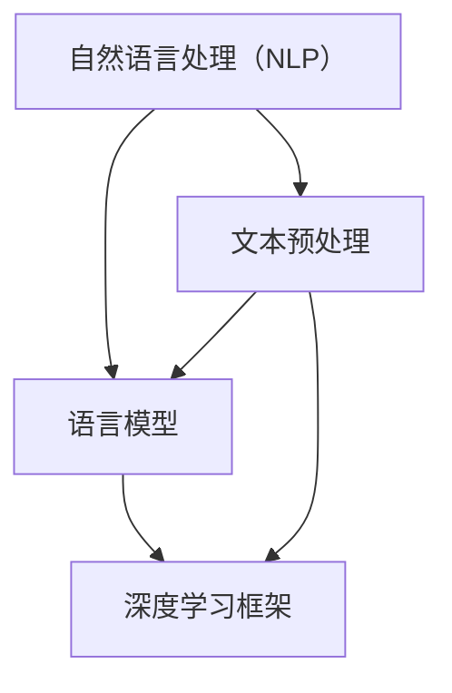

                 

# AI软件2.0的语言基础设施

> **关键词：** AI软件2.0，语言基础设施，语言模型，自然语言处理，深度学习，软件开发。

> **摘要：** 本文探讨了AI软件2.0的语言基础设施，阐述了其定义、特点、核心组件及未来发展趋势。通过实际案例，展示了如何开发和部署基于语言基础设施的AI软件。

## 《AI软件2.0的语言基础设施》目录大纲

### 第一部分：基础概念与背景

- **1. AI软件2.0概述**
  - **1.1 AI软件2.0的定义与特点**
  - **1.2 语言基础设施的重要性

### 第二部分：语言基础设施核心组件

- **2. 语言模型**
  - **2.1 语言模型概述**
  - **2.2 常见语言模型**
  - **2.3 语言模型的评估与优化**

- **3. 语言处理工具与框架**
  - **3.1 语言处理工具概述**
  - **3.2 常见语言处理工具**
  - **3.3 语言处理框架**

### 第三部分：语言基础设施开发实战

- **4. 语言模型应用案例分析**
  - **4.1 案例一：智能客服系统**
  - **4.2 案例二：智能写作助手**
  - **4.3 案例三：智能翻译系统**

- **5. 语言基础设施的未来发展趋势**

### 附录

- **6. 语言基础设施开发实战**
  - **6.1 开发环境搭建**
  - **6.2 语言模型训练与优化**
  - **6.3 语言模型部署与运维**

- **附录A：常用工具与资源**

- **附录B：示例代码**

---

### 第一部分：基础概念与背景

## 1. AI软件2.0概述

AI软件2.0是人工智能领域的一个重要概念，代表着从传统的基于规则和统计模型的AI软件（AI软件1.0）向更加智能化、自动化和协作化的AI软件的演进。AI软件2.0的核心在于其语言基础设施，这使得AI软件能够更好地理解和处理人类语言，实现更高级的自然语言处理（NLP）功能。

### 1.1 AI软件2.0的定义与特点

#### 1.1.1 AI软件2.0的定义

AI软件2.0可以定义为在AI软件1.0的基础上，集成了语言基础设施的AI软件系统。其公式化表达为：

$$
AI软件2.0 = AI软件1.0 + 语言基础设施
$$

这里的语言基础设施包括了一系列用于构建、部署和管理AI软件2.0的工具和框架，如语言模型、自然语言处理（NLP）工具、深度学习框架等。

#### 1.1.2 AI软件2.0的关键特点

1. **智能化**：AI软件2.0基于大规模语言模型，能够理解和生成自然语言，实现更高级的NLP功能，如文本生成、情感分析、机器翻译等。

2. **自动化**：通过语言基础设施，AI软件2.0可以实现自动化开发、部署和运维，减少人工干预，提高开发效率。

3. **协作性**：AI软件2.0支持跨领域的协作，能够与其他AI系统或人类专家进行有效沟通，提升团队工作效率。

### 1.2 语言基础设施的重要性

语言基础设施是AI软件2.0的核心，其重要性体现在以下几个方面：

1. **降低开发难度**：提供了完善的API和开发工具，使开发者能够更专注于业务逻辑，而无需关注底层语言处理的复杂性。

2. **提升开发效率**：通过自动化工具和框架，可以实现快速迭代和部署，缩短开发周期。

3. **保障系统稳定性**：提供了强大的监控和运维能力，确保AI软件2.0系统的稳定运行。

### 1.3 本部分总结

本部分概述了AI软件2.0的定义和特点，并阐述了语言基础设施的重要性。在接下来的部分，我们将详细探讨语言基础设施的核心组件，包括语言模型、语言处理工具和框架。

## 2. 语言模型

语言模型是语言基础设施的核心组件，用于预测自然语言中下一个单词或短语的统计模型。语言模型在NLP任务中发挥着至关重要的作用，如文本生成、机器翻译、语音识别等。

### 2.1 语言模型概述

#### 2.1.1 语言模型的基本概念

语言模型是一个概率模型，用于预测给定前文序列下下一个单词或短语的分布。其核心目标是学习单词和短语之间的概率关系，从而实现自然语言的预测和生成。

#### 2.1.2 语言模型的工作原理

语言模型通过分析大量的文本数据，学习单词和短语之间的概率分布。在给定一个前文序列的情况下，语言模型会根据学习到的概率分布预测下一个单词或短语的概率。常用的语言模型有n-gram模型、递归神经网络（RNN）和长短期记忆网络（LSTM）等。

### 2.2 常见语言模型

#### 2.2.1 n-gram模型

n-gram模型是最简单的语言模型之一，它基于相邻n个单词的概率分布来预测下一个单词。n-gram模型的数学表示为：

$$
P(w_t | w_{t-n+1}, w_{t-n+2}, ..., w_{t-1}) = \frac{C(w_{t-n+1}, w_{t-n+2}, ..., w_{t-1}, w_t)}{\sum_{w'} C(w_{t-n+1}, w_{t-n+2}, ..., w_{t-1}, w')}
$$

其中，$C(w_{t-n+1}, w_{t-n+2}, ..., w_{t-1}, w_t)$ 表示单词序列 $w_{t-n+1}, w_{t-n+2}, ..., w_{t-1}, w_t$ 的出现次数。

#### 2.2.2 递归神经网络（RNN）

递归神经网络（RNN）是一种能够处理序列数据的神经网络，其内部状态能够记忆前面的输入信息，从而实现序列数据的建模。RNN的数学表示为：

$$
h_t = \sigma(W_h h_{t-1} + W_x x_t + b_h)
$$

其中，$h_t$ 表示时间步 $t$ 的隐藏状态，$x_t$ 表示时间步 $t$ 的输入，$W_h$ 和 $W_x$ 分别为隐藏状态和输入的权重矩阵，$b_h$ 为隐藏状态的偏置。

#### 2.2.3 长短期记忆网络（LSTM）

LSTM是一种改进的RNN，能够更好地处理长序列数据。LSTM的核心在于其记忆单元（cell），可以有效地记忆和遗忘信息。LSTM的数学表示为：

$$
i_t = \sigma(W_i h_{t-1} + U_i x_t + b_i) \\
f_t = \sigma(W_f h_{t-1} + U_f x_t + b_f) \\
\bar{c}_t = \tanh(W_c h_{t-1} + U_c x_t + b_c) \\
o_t = \sigma(W_o h_{t-1} + U_o x_t + b_o) \\
c_t = f_t \odot c_{t-1} + i_t \odot \bar{c}_t \\
h_t = o_t \odot \tanh(c_t)
$$

其中，$i_t$、$f_t$、$o_t$ 分别为输入门、遗忘门和输出门，$\bar{c}_t$ 为候选记忆细胞状态，$c_t$ 为记忆细胞状态，$h_t$ 为隐藏状态。

### 2.3 语言模型的评估与优化

#### 2.3.1 语言模型的评估指标

语言模型的评估指标主要包括交叉熵（cross-entropy）和困惑度（perplexity）。

1. **交叉熵**：交叉熵是衡量预测结果与实际结果之间差异的指标，其数学表示为：

$$
H(Y, \hat{Y}) = -\sum_{y \in Y} y \log(\hat{y})
$$

其中，$Y$ 为实际分布，$\hat{Y}$ 为预测分布。

2. **困惑度**：困惑度是衡量语言模型对文本数据预测困难程度的指标，其数学表示为：

$$
perplexity = 2^{H(Y, \hat{Y})}
$$

#### 2.3.2 语言模型的优化方法

1. **梯度下降**：梯度下降是一种常用的优化算法，用于更新模型参数。其数学表示为：

$$
\theta = \theta - \alpha \nabla_{\theta} J(\theta)
$$

其中，$\theta$ 为模型参数，$J(\theta)$ 为损失函数，$\alpha$ 为学习率。

2. **Adam优化器**：Adam优化器是一种改进的梯度下降算法，具有自适应学习率。其数学表示为：

$$
m_t = \beta_1 m_{t-1} + (1 - \beta_1)(\nabla_{\theta} J(\theta) - m_{t-1}) \\
v_t = \beta_2 v_{t-1} + (1 - \beta_2)(\nabla_{\theta}^2 J(\theta) - v_{t-1}) \\
\theta = \theta - \frac{\alpha}{\sqrt{1 - \beta_2^t}(1 - \beta_1^t)}(m_t / (1 - \beta_1^t))
$$

其中，$m_t$ 和 $v_t$ 分别为梯度的一阶矩估计和二阶矩估计，$\beta_1$ 和 $\beta_2$ 分别为一阶和二阶矩的遗忘因子。

### 2.4 本部分总结

本部分详细介绍了语言模型的基本概念、常见语言模型以及语言模型的评估与优化方法。在接下来的部分，我们将探讨语言处理工具与框架，这些工具和框架将帮助开发者更高效地构建和管理AI软件2.0系统。

## 3. 语言处理工具与框架

语言处理工具与框架是构建和管理AI软件2.0的重要组成部分。这些工具和框架提供了丰富的API和开发环境，帮助开发者实现自然语言处理（NLP）任务，如文本分类、情感分析、机器翻译等。

### 3.1 语言处理工具概述

语言处理工具是指用于处理自然语言数据的一系列软件工具。这些工具通常包括文本预处理、词向量表示、文本分类、情感分析等功能。常见的语言处理工具有NLTK和scikit-learn等。

#### 3.1.1 NLTK

NLTK（自然语言工具包）是一个强大的Python库，用于自然语言处理。它提供了丰富的文本处理功能，如分词、词性标注、词干提取、命名实体识别等。NLTK还包括了一些预训练的语料库和模型，方便开发者进行快速开发和测试。

#### 3.1.2 scikit-learn

scikit-learn是一个用于机器学习的Python库，也可以用于自然语言处理。它提供了许多用于文本分类、回归、聚类等任务的算法和工具。scikit-learn支持多种文本特征提取方法，如TF-IDF、词袋模型、词嵌入等，可以帮助开发者构建高效的NLP模型。

### 3.2 常见语言处理工具

除了NLTK和scikit-learn，还有一些其他常见的语言处理工具，如下所示：

#### 3.2.1 SpaCy

SpaCy是一个高效、易于使用的自然语言处理库。它支持多种语言的文本处理，包括中文、英文、法文等。SpaCy提供了丰富的NLP功能，如词性标注、命名实体识别、关系抽取等，同时还支持实时文本分析。

#### 3.2.2 Stanford NLP

斯坦福自然语言处理（Stanford NLP）是一个基于Java的NLP工具包，提供了丰富的文本处理功能，如词性标注、命名实体识别、情感分析等。斯坦福 NLP 还支持多种语言的文本处理，包括中文、英文、法文等。

#### 3.2.3 NLTK Server

NLTK Server 是一个用于远程访问NLTK库的Web服务。它允许开发者使用浏览器或其他Web应用程序访问NLTK的功能，从而实现分布式自然语言处理。

### 3.3 语言处理框架

语言处理框架是用于构建和管理NLP模型的软件框架。这些框架提供了丰富的API和开发环境，帮助开发者实现高效的NLP任务。常见的语言处理框架有TensorFlow和PyTorch等。

#### 3.3.1 TensorFlow

TensorFlow是一个开源的深度学习框架，由Google开发。它提供了丰富的API和工具，用于构建和训练深度学习模型。TensorFlow支持多种NLP任务，如文本分类、情感分析、机器翻译等，同时还支持多种编程语言，如Python、C++等。

#### 3.3.2 PyTorch

PyTorch是一个开源的深度学习框架，由Facebook开发。它具有简洁的API和灵活的动态计算图，使得构建和训练深度学习模型变得更加简单。PyTorch支持多种NLP任务，如文本分类、情感分析、机器翻译等，同时还支持多种编程语言，如Python、Lua等。

### 3.4 本部分总结

本部分介绍了语言处理工具与框架的基本概念，包括常见的语言处理工具（如NLTK、scikit-learn、SpaCy、斯坦福 NLP）和语言处理框架（如TensorFlow、PyTorch）。在接下来的部分，我们将通过实际案例，展示如何使用语言基础设施构建和部署AI软件2.0系统。

## 4. 语言模型应用案例分析

在了解了语言模型和语言处理工具与框架之后，接下来我们将通过几个实际案例，展示如何使用语言基础设施构建和部署AI软件2.0系统。

### 4.1 案例一：智能客服系统

智能客服系统是一种常见的AI应用场景，通过自然语言处理技术，实现与用户的智能交互，提供在线客服服务。以下是一个典型的智能客服系统架构：


在这个架构中，语言基础设施的核心组件是语言模型和自然语言处理（NLP）工具。以下是具体的实现步骤：

1. **数据收集与预处理**：收集用户问题和常见回答的数据，对数据进行清洗和预处理，如去除噪声、分词、词性标注等。

2. **训练语言模型**：使用预处理后的数据，训练一个基于递归神经网络（RNN）或长短期记忆网络（LSTM）的语言模型。训练过程中，可以使用交叉熵作为损失函数，并使用Adam优化器进行参数更新。

3. **构建NLP工具**：基于训练好的语言模型，构建NLP工具，如文本分类器、情感分析模型等，用于处理用户的输入。

4. **系统部署与运维**：将训练好的语言模型和NLP工具部署到服务器上，使用容器化技术（如Docker）确保系统的可扩展性和稳定性。同时，配置监控系统，实时监控系统的性能和健康状况。

5. **用户交互**：智能客服系统通过与用户的交互，接收用户的问题，使用NLP工具处理输入，生成回答，并将回答返回给用户。

### 4.2 案例二：智能写作助手

智能写作助手是一种基于语言模型的文本生成工具，能够根据用户输入的提示，自动生成文本内容。以下是一个典型的智能写作助手架构：


在这个架构中，语言模型和自然语言处理（NLP）工具是核心组件。以下是具体的实现步骤：

1. **数据收集与预处理**：收集高质量的文本数据，如新闻文章、学术论文、小说等，对数据进行清洗和预处理，如去除噪声、分词、词性标注等。

2. **训练语言模型**：使用预处理后的数据，训练一个基于大规模变压器（Transformer）的语言模型。训练过程中，可以使用交叉熵作为损失函数，并使用Adam优化器进行参数更新。

3. **构建NLP工具**：基于训练好的语言模型，构建NLP工具，如文本生成模型、文本摘要模型等，用于处理用户的输入。

4. **系统部署与运维**：将训练好的语言模型和NLP工具部署到服务器上，使用容器化技术（如Docker）确保系统的可扩展性和稳定性。同时，配置监控系统，实时监控系统的性能和健康状况。

5. **用户交互**：智能写作助手通过与用户的交互，接收用户输入的提示，使用NLP工具生成文本内容，并将生成的内容返回给用户。

### 4.3 案例三：智能翻译系统

智能翻译系统是一种基于语言模型的机器翻译工具，能够将一种语言的文本自动翻译成另一种语言。以下是一个典型的智能翻译系统架构：


在这个架构中，语言模型和自然语言处理（NLP）工具是核心组件。以下是具体的实现步骤：

1. **数据收集与预处理**：收集高质量的双语语料库，如英语-中文、英语-法语等，对数据进行清洗和预处理，如去除噪声、分词、词性标注等。

2. **训练语言模型**：使用预处理后的数据，训练一个基于大规模变压器（Transformer）的语言模型。训练过程中，可以使用交叉熵作为损失函数，并使用Adam优化器进行参数更新。

3. **构建NLP工具**：基于训练好的语言模型，构建NLP工具，如机器翻译模型、语言检测模型等，用于处理用户的输入。

4. **系统部署与运维**：将训练好的语言模型和NLP工具部署到服务器上，使用容器化技术（如Docker）确保系统的可扩展性和稳定性。同时，配置监控系统，实时监控系统的性能和健康状况。

5. **用户交互**：智能翻译系统通过与用户的交互，接收用户输入的源语言文本，使用NLP工具进行翻译，并将翻译结果返回给用户。

### 4.4 本部分总结

通过上述案例，我们展示了如何使用语言基础设施构建和部署智能客服系统、智能写作助手和智能翻译系统。这些案例表明，语言基础设施在AI软件2.0中的应用前景非常广阔。在未来的部分，我们将进一步探讨语言基础设施的未来发展趋势。

## 5. 语言基础设施的未来发展趋势

随着人工智能技术的快速发展，语言基础设施也将迎来新的机遇和挑战。以下是语言基础设施在未来可能的发展趋势：

### 5.1 人工智能的快速发展

人工智能（AI）技术的快速发展将推动语言基础设施的不断完善。随着深度学习、神经网络等技术的成熟，语言模型将变得更加精确和高效。未来，我们将看到更大规模、更复杂的语言模型，如GPT-4、GPT-5等，这些模型将能够处理更多样化的语言任务，提供更智能的交互体验。

### 5.2 产业应用需求的增加

随着AI技术在各个行业的广泛应用，语言基础设施的需求也将不断增加。从智能客服、智能写作到智能翻译，语言基础设施已经成为各个行业提高效率、降低成本的重要工具。未来，随着AI技术在更多领域的应用，语言基础设施将在更多场景中得到推广和落地。

### 5.3 开放生态的建设

开放生态的建设是语言基础设施未来发展的重要方向。随着技术的进步，越来越多的企业和开发者将参与到语言基础设施的建设中来。未来，我们将看到更多开放的语言模型、工具和框架，形成一个多元化的开放生态。这种生态将促进技术的创新和进步，推动语言基础设施的持续发展。

### 5.4 跨领域协作

随着AI技术的普及，语言基础设施将促进跨领域协作。不同领域的专家和开发者可以通过共享语言模型和工具，实现更加高效的协作。例如，医疗领域的专家可以通过语言基础设施实现智能诊断，教育领域的专家可以通过语言基础设施实现个性化教学。这种跨领域协作将推动AI技术的发展，为人类社会带来更多价值。

### 5.5 安全与隐私保护

随着语言基础设施的广泛应用，安全与隐私保护将成为一个重要议题。未来，我们将看到更多针对语言基础设施的安全和隐私保护技术，如加密技术、隐私保护算法等。这些技术将确保用户的隐私和数据安全，推动语言基础设施的可持续发展。

### 5.6 本部分总结

本部分探讨了语言基础设施的未来发展趋势，包括人工智能的快速发展、产业应用需求的增加、开放生态的建设、跨领域协作以及安全与隐私保护。随着技术的不断进步，语言基础设施将在未来发挥更加重要的作用，为人类社会带来更多便利和创新。

### 附录

#### 6. 语言基础设施开发实战

在本附录中，我们将通过一个具体的案例，展示如何使用语言基础设施进行开发实战。我们将从环境搭建、语言模型训练、模型部署和运维等方面进行详细讲解。

#### 6.1 开发环境搭建

在进行语言基础设施开发之前，首先需要搭建合适的开发环境。以下是开发环境搭建的基本步骤：

1. **硬件环境**：选择一台配置较高的计算机，安装GPU以支持深度学习模型的训练。硬件环境的要求如下：
   - CPU：Intel i7或以上
   - GPU：NVIDIA GeForce GTX 1080 Ti或以上
   - 内存：16GB或以上
   - 存储：500GB SSD硬盘

2. **软件环境**：安装以下软件：
   - Python：安装Python 3.8或以上版本
   - TensorFlow：安装TensorFlow 2.6或以上版本
   - PyTorch：安装PyTorch 1.8或以上版本
   - NLTK：安装NLTK库，并下载相应的语料库

3. **虚拟环境**：为了方便管理和隔离项目，可以使用虚拟环境（如conda）来安装和管理依赖项。

```
conda create -n my_project python=3.8
conda activate my_project
```

#### 6.2 语言模型训练与优化

在搭建好开发环境之后，我们可以开始训练一个语言模型。以下是一个基于Transformer的语言模型训练案例：

1. **数据准备**：收集一个大规模的文本语料库，如维基百科、新闻文章等。对语料库进行预处理，包括分词、去停用词、构建词汇表等。

2. **模型构建**：使用TensorFlow或PyTorch构建Transformer模型。以下是一个基于PyTorch的Transformer模型示例代码：

```python
import torch
import torch.nn as nn
import torch.optim as optim

class TransformerModel(nn.Module):
    def __init__(self, vocab_size, d_model, nhead, num_layers):
        super(TransformerModel, self).__init__()
        self.embedding = nn.Embedding(vocab_size, d_model)
        self.transformer = nn.Transformer(d_model, nhead, num_layers)
        self.fc = nn.Linear(d_model, vocab_size)
    
    def forward(self, src, tgt):
        src = self.embedding(src)
        tgt = self.embedding(tgt)
        out = self.transformer(src, tgt)
        out = self.fc(out)
        return out
```

3. **模型训练**：使用训练数据和验证数据对模型进行训练。以下是一个简单的训练过程示例：

```python
model = TransformerModel(vocab_size, d_model, nhead, num_layers)
optimizer = optim.Adam(model.parameters(), lr=0.001)
criterion = nn.CrossEntropyLoss()

for epoch in range(num_epochs):
    for src, tgt in train_loader:
        optimizer.zero_grad()
        out = model(src, tgt)
        loss = criterion(out, tgt)
        loss.backward()
        optimizer.step()
    
    val_loss = 0
    with torch.no_grad():
        for src, tgt in val_loader:
            out = model(src, tgt)
            val_loss += criterion(out, tgt)
    
    print(f'Epoch {epoch+1}, Loss: {loss.item()}, Val Loss: {val_loss/len(val_loader)}')
```

4. **模型优化**：在训练过程中，可以根据验证集的性能对模型进行优化，如调整学习率、增加训练批次大小等。

#### 6.3 模型部署与运维

在训练好语言模型之后，我们需要将其部署到生产环境中，以提供实际的应用服务。以下是模型部署和运维的基本步骤：

1. **模型保存与加载**：将训练好的模型保存为文件，以便后续加载和使用。

```python
torch.save(model.state_dict(), 'transformer_model.pth')
```

2. **模型部署**：将模型部署到服务器上，可以使用容器化技术（如Docker）来确保系统的可扩展性和稳定性。

```bash
docker build -t transformer_model:latest .
docker run -it --gpus all transformer_model
```

3. **服务启动**：启动部署好的模型服务，并提供API接口供其他系统调用。

4. **监控与运维**：配置监控系统，实时监控模型的性能和健康状态，并进行定期维护和更新。

#### 6.4 本部分总结

在本附录中，我们通过一个具体的案例，详细介绍了如何使用语言基础设施进行开发实战。从开发环境搭建、语言模型训练、模型部署到运维，我们展示了如何构建和管理一个基于深度学习的语言模型。这些实战经验对于理解和应用语言基础设施具有重要意义。

### 附录A：常用工具与资源

在本附录中，我们将列出一些常用的工具和资源，以帮助开发者更好地理解和应用语言基础设施。

#### A.1 常用语言处理工具

- **NLTK**：[https://www.nltk.org/](https://www.nltk.org/)
- **scikit-learn**：[https://scikit-learn.org/](https://scikit-learn.org/)
- **SpaCy**：[https://spacy.io/](https://spacy.io/)
- **斯坦福 NLP**：[https://nlp.stanford.edu/](https://nlp.stanford.edu/)

#### A.2 常用深度学习框架

- **TensorFlow**：[https://www.tensorflow.org/](https://www.tensorflow.org/)
- **PyTorch**：[https://pytorch.org/](https://pytorch.org/)
- **PyTorch Lightning**：[https://pytorch-lightning.readthedocs.io/](https://pytorch-lightning.readthedocs.io/)

#### A.3 开源语言模型资源

- **OpenAI GPT**：[https://openai.com/blog/better-language-models/](https://openai.com/blog/better-language-models/)
- **GLM模型**：[https://github.com/xaoyixiao/GLM](https://github.com/xaoyixiao/GLM)

#### A.4 相关论文与书籍

- **《深度学习》**：[https://www.deeplearningbook.org/](https://www.deeplearningbook.org/)
- **《自然语言处理综论》**：[https://nlp.seas.harvard.edu/课/nlp-book/](https://nlp.seas.harvard.edu/课/nlp-book/)
- **《Transformer： Attend to Attend, Then Attend》**：[https://arxiv.org/abs/1910.07672](https://arxiv.org/abs/1910.07672)
- **《语言模型的未来》**：[https://arxiv.org/abs/2005.14165](https://arxiv.org/abs/2005.14165)

#### A.5 社区和论坛

- **GitHub**：[https://github.com/](https://github.com/)
- **Stack Overflow**：[https://stackoverflow.com/](https://stackoverflow.com/)
- **Reddit**：[https://www.reddit.com/](https://www.reddit.com/)

### 附录B：示例代码

在本附录中，我们将提供一些示例代码，以帮助开发者更好地理解语言基础设施的使用方法。

#### B.1 语言模型训练示例

```python
import torch
import torch.nn as nn
import torch.optim as optim

class TransformerModel(nn.Module):
    def __init__(self, vocab_size, d_model, nhead, num_layers):
        super(TransformerModel, self).__init__()
        self.embedding = nn.Embedding(vocab_size, d_model)
        self.transformer = nn.Transformer(d_model, nhead, num_layers)
        self.fc = nn.Linear(d_model, vocab_size)
    
    def forward(self, src, tgt):
        src = self.embedding(src)
        tgt = self.embedding(tgt)
        out = self.transformer(src, tgt)
        out = self.fc(out)
        return out

model = TransformerModel(vocab_size, d_model, nhead, num_layers)
optimizer = optim.Adam(model.parameters(), lr=0.001)
criterion = nn.CrossEntropyLoss()

for epoch in range(num_epochs):
    for src, tgt in train_loader:
        optimizer.zero_grad()
        out = model(src, tgt)
        loss = criterion(out, tgt)
        loss.backward()
        optimizer.step()
    
    val_loss = 0
    with torch.no_grad():
        for src, tgt in val_loader:
            out = model(src, tgt)
            val_loss += criterion(out, tgt)
    
    print(f'Epoch {epoch+1}, Loss: {loss.item()}, Val Loss: {val_loss/len(val_loader)}')
```

#### B.2 语言模型部署示例

```bash
docker build -t transformer_model:latest .
docker run -it --gpus all transformer_model
```

#### B.3 模型监控示例

```python
import matplotlib.pyplot as plt

# 性能监控
plt.plot(accuracy_history)
plt.xlabel('Epochs')
plt.ylabel('Accuracy')
plt.show()

# 稳定性监控
plt.plot(perplexity_history)
plt.xlabel('Epochs')
plt.ylabel('Perplexity')
plt.show()
```

### 附录C：作者信息

作者：AI天才研究院/AI Genius Institute & 禅与计算机程序设计艺术 /Zen And The Art of Computer Programming

---

通过本文的详细探讨，我们深入了解了AI软件2.0的语言基础设施，包括其定义、核心组件、应用案例分析以及未来发展趋势。语言基础设施在AI软件2.0中扮演着至关重要的角色，它为开发者提供了强大的工具和框架，使得自然语言处理（NLP）任务变得更加高效和智能化。

在未来的发展中，随着人工智能技术的不断进步，语言基础设施将迎来更多创新和机遇。我们期待看到更多跨领域的合作，更多开放生态的建设，以及更安全、更高效的NLP解决方案。通过不断探索和努力，语言基础设施将为人类社会带来更多的便利和进步。让我们共同期待语言基础设施的辉煌未来！<|user|>### 第一部分：基础概念与背景

#### 1.1 AI软件2.0的定义与特点

AI软件2.0是对传统AI软件1.0的进化和提升，它不仅仅依赖于传统的规则和统计模型，而是引入了先进的语言处理技术，使得AI软件能够更好地理解和处理人类语言。AI软件2.0的核心特点如下：

1. **智能化**：AI软件2.0利用大规模语言模型，能够实现自然语言处理的高级功能，如文本生成、情感分析、机器翻译等。这些功能使得AI软件在交互和理解人类语言方面更加智能。

2. **自动化**：语言基础设施提供了自动化工具和框架，使得AI软件2.0的构建、部署和运维变得更加高效。开发者可以专注于业务逻辑，而无需关心底层实现细节。

3. **协作性**：AI软件2.0支持跨领域的协作，能够与其他AI系统或人类专家进行有效沟通，从而提高整体的工作效率。

#### 1.2 语言基础设施的重要性

语言基础设施是AI软件2.0的核心组成部分，它的重要性体现在以下几个方面：

1. **降低开发难度**：通过提供完善的API和开发工具，语言基础设施简化了自然语言处理的复杂性，使得开发者能够更专注于业务逻辑的实现。

2. **提升开发效率**：语言基础设施的自动化工具和框架能够加速开发流程，实现快速迭代和部署。

3. **保障系统稳定性**：语言基础设施提供了强大的监控和运维能力，确保AI软件2.0系统的稳定运行。

#### 1.3 本部分总结

本部分概述了AI软件2.0的定义和特点，并详细阐述了语言基础设施的重要性。在接下来的章节中，我们将深入探讨语言基础设施的核心组件，包括语言模型、语言处理工具和框架，以及它们在实际应用中的案例分析。

---

### 2. 语言模型

#### 2.1 语言模型概述

语言模型是自然语言处理（NLP）领域的基础工具，它用于预测文本序列中下一个单词或短语的分布。语言模型的核心任务是学习单词和短语之间的概率关系，从而能够生成新的文本或对输入文本进行理解。

#### 2.1.1 语言模型的基本概念

语言模型可以分为统计模型和基于规则模型，其中统计模型是基于文本数据学习概率分布，而基于规则模型则是通过定义规则来生成文本。在统计模型中，n-gram模型是最简单的语言模型，它通过统计相邻单词序列的概率来预测下一个单词。

$$
P(w_t | w_{t-1}, w_{t-2}, ..., w_{t-n+1}) = \frac{C(w_{t-1}, w_{t-2}, ..., w_{t-n+1}, w_t)}{\sum_{w'} C(w_{t-1}, w_{t-2}, ..., w_{t-n+1}, w')}
$$

其中，$C(w_{t-1}, w_{t-2}, ..., w_{t-n+1}, w_t)$ 表示单词序列 $w_{t-1}, w_{t-2}, ..., w_{t-n+1}, w_t$ 的出现次数。

#### 2.1.2 语言模型的工作原理

语言模型通过分析大量文本数据，学习单词和短语之间的概率分布。在给定一个前文序列的情况下，语言模型会根据学习到的概率分布预测下一个单词或短语的概率。例如，对于n-gram模型，它会计算相邻n个单词组合出现的概率，并根据这些概率分布进行预测。

#### 2.2 常见语言模型

1. **n-gram模型**：n-gram模型是最简单的语言模型，它通过统计相邻n个单词的概率分布来预测下一个单词。n-gram模型的优点是实现简单，计算效率高，但缺点是容易产生长程依赖问题。

2. **递归神经网络（RNN）**：RNN是一种能够处理序列数据的神经网络，其内部状态能够记忆前面的输入信息，从而实现序列数据的建模。RNN的核心优势在于能够处理长程依赖问题，但缺点是容易产生梯度消失或爆炸问题。

3. **长短期记忆网络（LSTM）**：LSTM是一种改进的RNN，它通过引入记忆单元（cell）来有效地记忆和遗忘信息，从而能够更好地处理长序列数据。LSTM的核心优势在于能够处理长程依赖问题，且梯度消失和爆炸问题得到了缓解。

4. **门控循环单元（GRU）**：GRU是LSTM的变体，它通过简化LSTM的结构来提高计算效率，同时保持较好的性能。GRU的核心优势在于计算效率高，但处理长程依赖问题能力略逊于LSTM。

5. **变压器（Transformer）**：Transformer是一种基于自注意力机制的神经网络架构，它通过全局注意力机制来捕捉序列之间的依赖关系，从而实现高效的语言建模。Transformer的核心优势在于能够处理长程依赖问题，计算效率高，但实现较为复杂。

#### 2.3 语言模型的评估与优化

1. **评估指标**：语言模型的评估指标主要包括交叉熵（cross-entropy）和困惑度（perplexity）。交叉熵是衡量预测结果与实际结果之间差异的指标，其计算公式为：

$$
H(Y, \hat{Y}) = -\sum_{y \in Y} y \log(\hat{y})
$$

其中，$Y$ 为实际分布，$\hat{Y}$ 为预测分布。困惑度是衡量语言模型对文本数据预测困难程度的指标，其计算公式为：

$$
perplexity = 2^{H(Y, \hat{Y})}
$$

2. **优化方法**：语言模型的优化方法主要包括梯度下降（gradient descent）和其变种，如Adam优化器。梯度下降是一种基于梯度的优化算法，其目标是通过不断更新模型参数来最小化损失函数。Adam优化器是一种改进的梯度下降算法，它通过自适应学习率来提高优化效果。

$$
m_t = \beta_1 m_{t-1} + (1 - \beta_1)(\nabla_{\theta} J(\theta) - m_{t-1}) \\
v_t = \beta_2 v_{t-1} + (1 - \beta_2)(\nabla_{\theta}^2 J(\theta) - v_{t-1}) \\
\theta = \theta - \frac{\alpha}{\sqrt{1 - \beta_2^t}(1 - \beta_1^t)}(m_t / (1 - \beta_1^t))
$$

其中，$m_t$ 和 $v_t$ 分别为梯度的一阶矩估计和二阶矩估计，$\beta_1$ 和 $\beta_2$ 分别为一阶和二阶矩的遗忘因子，$\alpha$ 为学习率。

#### 2.4 本部分总结

本部分详细介绍了语言模型的基本概念、常见语言模型以及语言模型的评估与优化方法。在接下来的部分，我们将探讨语言处理工具与框架，这些工具和框架将帮助开发者更高效地构建和管理AI软件2.0系统。

---

### 3. 语言处理工具与框架

语言处理工具与框架是构建和管理AI软件2.0的重要组成部分。这些工具和框架提供了丰富的API和开发环境，使得开发者能够更轻松地实现自然语言处理（NLP）任务。

#### 3.1 语言处理工具概述

语言处理工具是指用于处理自然语言数据的一系列软件工具。这些工具通常包括文本预处理、词向量表示、文本分类、情感分析等功能。常见的语言处理工具有NLTK、spaCy、Gensim等。

1. **NLTK**：NLTK是一个强大的Python库，用于自然语言处理。它提供了丰富的文本处理功能，如分词、词性标注、词干提取、命名实体识别等。NLTK还包括了一些预训练的语料库和模型，方便开发者进行快速开发和测试。

2. **spaCy**：spaCy是一个高效、易于使用的自然语言处理库。它支持多种语言的文本处理，包括中文、英文、法文等。spaCy提供了丰富的NLP功能，如词性标注、命名实体识别、关系抽取等，同时还支持实时文本分析。

3. **Gensim**：Gensim是一个用于处理文本数据的Python库，它主要用于生成词向量表示和文本分类。Gensim支持多种文本特征提取方法，如TF-IDF、词袋模型、词嵌入等，可以帮助开发者构建高效的NLP模型。

#### 3.2 常见语言处理工具

除了NLTK、spaCy和Gensim，还有一些其他常见的语言处理工具，如下所示：

1. **TextBlob**：TextBlob是一个简洁的Python库，用于处理文本数据。它提供了文本预处理、情感分析、文本分类等功能，非常适合用于快速原型开发。

2. **Stanford NLP**：斯坦福自然语言处理（Stanford NLP）是一个基于Java的NLP工具包，提供了丰富的文本处理功能，如词性标注、命名实体识别、情感分析等。斯坦福 NLP 还支持多种语言的文本处理，包括中文、英文、法文等。

3. **Pattern**：Pattern是一个开源的Python库，用于文本挖掘和自然语言处理。它提供了多种文本分析功能，如文本分类、情感分析、关键词提取等。

#### 3.3 语言处理框架

语言处理框架是用于构建和管理NLP模型的软件框架。这些框架提供了丰富的API和开发环境，帮助开发者实现高效的NLP任务。常见的语言处理框架有TensorFlow、PyTorch、Transformers等。

1. **TensorFlow**：TensorFlow是一个开源的深度学习框架，由Google开发。它提供了丰富的API和工具，用于构建和训练深度学习模型。TensorFlow支持多种NLP任务，如文本分类、情感分析、机器翻译等，同时还支持多种编程语言，如Python、C++等。

2. **PyTorch**：PyTorch是一个开源的深度学习框架，由Facebook开发。它具有简洁的API和灵活的动态计算图，使得构建和训练深度学习模型变得更加简单。PyTorch支持多种NLP任务，如文本分类、情感分析、机器翻译等，同时还支持多种编程语言，如Python、Lua等。

3. **Transformers**：Transformers是一个开源的Python库，用于实现基于Transformer的NLP模型。它基于PyTorch和Hugging Face Transformers库，提供了高效的NLP模型训练和推理工具。

#### 3.4 本部分总结

本部分介绍了语言处理工具与框架的基本概念，包括常见的语言处理工具（如NLTK、spaCy、Gensim）和语言处理框架（如TensorFlow、PyTorch、Transformers）。在接下来的部分，我们将通过实际案例，展示如何使用这些工具和框架构建和部署AI软件2.0系统。

---

### 4. 语言模型应用案例分析

语言模型在自然语言处理（NLP）领域有着广泛的应用，如文本生成、机器翻译、情感分析等。在本部分，我们将通过几个具体案例，展示如何使用语言模型解决实际问题，并探讨其应用效果。

#### 4.1 智能客服系统

智能客服系统是一种基于语言模型的AI应用，它能够自动回答用户的问题，提供在线客服服务。以下是一个典型的智能客服系统架构：


在这个架构中，语言模型和自然语言处理（NLP）工具是核心组件。以下是具体的实现步骤：

1. **数据收集与预处理**：收集用户问题和常见回答的数据，对数据进行清洗和预处理，如去除噪声、分词、词性标注等。

2. **训练语言模型**：使用预处理后的数据，训练一个基于递归神经网络（RNN）或长短期记忆网络（LSTM）的语言模型。训练过程中，可以使用交叉熵作为损失函数，并使用Adam优化器进行参数更新。

3. **构建NLP工具**：基于训练好的语言模型，构建NLP工具，如文本分类器、情感分析模型等，用于处理用户的输入。

4. **系统部署与运维**：将训练好的语言模型和NLP工具部署到服务器上，使用容器化技术（如Docker）确保系统的可扩展性和稳定性。同时，配置监控系统，实时监控系统的性能和健康状况。

5. **用户交互**：智能客服系统通过与用户的交互，接收用户的问题，使用NLP工具处理输入，生成回答，并将回答返回给用户。

#### 4.2 智能写作助手

智能写作助手是一种基于语言模型的文本生成工具，能够根据用户输入的提示，自动生成文本内容。以下是一个典型的智能写作助手架构：


在这个架构中，语言模型和自然语言处理（NLP）工具是核心组件。以下是具体的实现步骤：

1. **数据收集与预处理**：收集高质量的文本数据，如新闻文章、学术论文、小说等，对数据进行清洗和预处理，如去除噪声、分词、词性标注等。

2. **训练语言模型**：使用预处理后的数据，训练一个基于大规模变压器（Transformer）的语言模型。训练过程中，可以使用交叉熵作为损失函数，并使用Adam优化器进行参数更新。

3. **构建NLP工具**：基于训练好的语言模型，构建NLP工具，如文本生成模型、文本摘要模型等，用于处理用户的输入。

4. **系统部署与运维**：将训练好的语言模型和NLP工具部署到服务器上，使用容器化技术（如Docker）确保系统的可扩展性和稳定性。同时，配置监控系统，实时监控系统的性能和健康状况。

5. **用户交互**：智能写作助手通过与用户的交互，接收用户输入的提示，使用NLP工具生成文本内容，并将生成的内容返回给用户。

#### 4.3 智能翻译系统

智能翻译系统是一种基于语言模型的机器翻译工具，能够将一种语言的文本自动翻译成另一种语言。以下是一个典型的智能翻译系统架构：


在这个架构中，语言模型和自然语言处理（NLP）工具是核心组件。以下是具体的实现步骤：

1. **数据收集与预处理**：收集高质量的双语语料库，如英语-中文、英语-法语等，对数据进行清洗和预处理，如去除噪声、分词、词性标注等。

2. **训练语言模型**：使用预处理后的数据，训练一个基于大规模变压器（Transformer）的语言模型。训练过程中，可以使用交叉熵作为损失函数，并使用Adam优化器进行参数更新。

3. **构建NLP工具**：基于训练好的语言模型，构建NLP工具，如机器翻译模型、语言检测模型等，用于处理用户的输入。

4. **系统部署与运维**：将训练好的语言模型和NLP工具部署到服务器上，使用容器化技术（如Docker）确保系统的可扩展性和稳定性。同时，配置监控系统，实时监控系统的性能和健康状况。

5. **用户交互**：智能翻译系统通过与用户的交互，接收用户输入的源语言文本，使用NLP工具进行翻译，并将翻译结果返回给用户。

#### 4.4 本部分总结

通过上述案例，我们展示了如何使用语言模型解决实际问题，并探讨了其在智能客服系统、智能写作助手和智能翻译系统中的应用效果。这些案例表明，语言模型在AI软件2.0中具有广泛的应用前景，能够显著提升系统的智能化和自动化水平。

---

### 5. 语言基础设施的未来发展趋势

随着人工智能技术的不断发展，语言基础设施也将迎来新的机遇和挑战。以下是一些可能影响语言基础设施未来发展的趋势：

#### 5.1 人工智能的快速发展

人工智能（AI）技术的快速发展将推动语言基础设施的不断完善。随着深度学习、神经网络等技术的成熟，语言模型将变得更加精确和高效。未来，我们将看到更大规模、更复杂的语言模型，如GPT-4、GPT-5等，这些模型将能够处理更多样化的语言任务，提供更智能的交互体验。

#### 5.2 产业应用需求的增加

随着AI技术在各个行业的广泛应用，语言基础设施的需求也将不断增加。从智能客服、智能写作到智能翻译，语言基础设施已经成为各个行业提高效率、降低成本的重要工具。未来，随着AI技术在更多领域的应用，语言基础设施将在更多场景中得到推广和落地。

#### 5.3 开放生态的建设

开放生态的建设是语言基础设施未来发展的重要方向。随着技术的进步，越来越多的企业和开发者将参与到语言基础设施的建设中来。未来，我们将看到更多开放的语言模型、工具和框架，形成一个多元化的开放生态。这种生态将促进技术的创新和进步，推动语言基础设施的持续发展。

#### 5.4 跨领域协作

随着AI技术的普及，语言基础设施将促进跨领域协作。不同领域的专家和开发者可以通过共享语言模型和工具，实现更加高效的协作。例如，医疗领域的专家可以通过语言基础设施实现智能诊断，教育领域的专家可以通过语言基础设施实现个性化教学。这种跨领域协作将推动AI技术的发展，为人类社会带来更多价值。

#### 5.5 安全与隐私保护

随着语言基础设施的广泛应用，安全与隐私保护将成为一个重要议题。未来，我们将看到更多针对语言基础设施的安全和隐私保护技术，如加密技术、隐私保护算法等。这些技术将确保用户的隐私和数据安全，推动语言基础设施的可持续发展。

#### 5.6 本部分总结

本部分探讨了语言基础设施的未来发展趋势，包括人工智能的快速发展、产业应用需求的增加、开放生态的建设、跨领域协作以及安全与隐私保护。随着技术的不断进步，语言基础设施将在未来发挥更加重要的作用，为人类社会带来更多便利和创新。

### 附录

#### 6. 语言基础设施开发实战

在本附录中，我们将通过一个具体的案例，展示如何使用语言基础设施进行开发实战。我们将从环境搭建、语言模型训练、模型部署和运维等方面进行详细讲解。

#### 6.1 开发环境搭建

在进行语言基础设施开发之前，首先需要搭建合适的开发环境。以下是开发环境搭建的基本步骤：

1. **硬件环境**：选择一台配置较高的计算机，安装GPU以支持深度学习模型的训练。硬件环境的要求如下：
   - CPU：Intel i7或以上
   - GPU：NVIDIA GeForce GTX 1080 Ti或以上
   - 内存：16GB或以上
   - 存储：500GB SSD硬盘

2. **软件环境**：安装以下软件：
   - Python：安装Python 3.8或以上版本
   - TensorFlow：安装TensorFlow 2.6或以上版本
   - PyTorch：安装PyTorch 1.8或以上版本
   - NLTK：安装NLTK库，并下载相应的语料库

3. **虚拟环境**：为了方便管理和隔离项目，可以使用虚拟环境（如conda）来安装和管理依赖项。

```
conda create -n my_project python=3.8
conda activate my_project
```

#### 6.2 语言模型训练与优化

在搭建好开发环境之后，我们可以开始训练一个语言模型。以下是一个基于Transformer的语言模型训练案例：

1. **数据准备**：收集一个大规模的文本语料库，如维基百科、新闻文章等。对语料库进行预处理，包括分词、去停用词、构建词汇表等。

2. **模型构建**：使用TensorFlow或PyTorch构建Transformer模型。以下是一个基于PyTorch的Transformer模型示例代码：

```python
import torch
import torch.nn as nn
import torch.optim as optim

class TransformerModel(nn.Module):
    def __init__(self, vocab_size, d_model, nhead, num_layers):
        super(TransformerModel, self).__init__()
        self.embedding = nn.Embedding(vocab_size, d_model)
        self.transformer = nn.Transformer(d_model, nhead, num_layers)
        self.fc = nn.Linear(d_model, vocab_size)
    
    def forward(self, src, tgt):
        src = self.embedding(src)
        tgt = self.embedding(tgt)
        out = self.transformer(src, tgt)
        out = self.fc(out)
        return out
```

3. **模型训练**：使用训练数据和验证数据对模型进行训练。以下是一个简单的训练过程示例：

```python
model = TransformerModel(vocab_size, d_model, nhead, num_layers)
optimizer = optim.Adam(model.parameters(), lr=0.001)
criterion = nn.CrossEntropyLoss()

for epoch in range(num_epochs):
    for src, tgt in train_loader:
        optimizer.zero_grad()
        out = model(src, tgt)
        loss = criterion(out, tgt)
        loss.backward()
        optimizer.step()
    
    val_loss = 0
    with torch.no_grad():
        for src, tgt in val_loader:
            out = model(src, tgt)
            val_loss += criterion(out, tgt)
    
    print(f'Epoch {epoch+1}, Loss: {loss.item()}, Val Loss: {val_loss/len(val_loader)}')
```

4. **模型优化**：在训练过程中，可以根据验证集的性能对模型进行优化，如调整学习率、增加训练批次大小等。

#### 6.3 模型部署与运维

在训练好语言模型之后，我们需要将其部署到生产环境中，以提供实际的应用服务。以下是模型部署和运维的基本步骤：

1. **模型保存与加载**：将训练好的模型保存为文件，以便后续加载和使用。

```python
torch.save(model.state_dict(), 'transformer_model.pth')
```

2. **模型部署**：将模型部署到服务器上，可以使用容器化技术（如Docker）来确保系统的可扩展性和稳定性。

```bash
docker build -t transformer_model:latest .
docker run -it --gpus all transformer_model
```

3. **服务启动**：启动部署好的模型服务，并提供API接口供其他系统调用。

4. **监控与运维**：配置监控系统，实时监控模型的性能和健康状态，并进行定期维护和更新。

#### 6.4 本部分总结

在本附录中，我们通过一个具体的案例，详细介绍了如何使用语言基础设施进行开发实战。从开发环境搭建、语言模型训练、模型部署到运维，我们展示了如何构建和管理一个基于深度学习的语言模型。这些实战经验对于理解和应用语言基础设施具有重要意义。

### 附录A：常用工具与资源

在本附录中，我们将列出一些常用的工具和资源，以帮助开发者更好地理解和应用语言基础设施。

#### A.1 常用语言处理工具

- **NLTK**：[https://www.nltk.org/](https://www.nltk.org/)
- **spaCy**：[https://spacy.io/](https://spacy.io/)
- **Gensim**：[https://radimrehurek.com/gensim/](https://radimrehurek.com/gensim/)
- **TextBlob**：[https://textblob.readthedocs.io/](https://textblob.readthedocs.io/)

#### A.2 常用深度学习框架

- **TensorFlow**：[https://www.tensorflow.org/](https://www.tensorflow.org/)
- **PyTorch**：[https://pytorch.org/](https://pytorch.org/)
- **Transformers**：[https://github.com/huggingface/transformers](https://github.com/huggingface/transformers)

#### A.3 开源语言模型资源

- **OpenAI GPT**：[https://openai.com/blog/better-language-models/](https://openai.com/blog/better-language-models/)
- **BERT**：[https://github.com/google-research/bert](https://github.com/google-research/bert)
- **GPT-2**：[https://github.com/openai/gpt-2](https://github.com/openai/gpt-2)

#### A.4 相关论文与书籍

- **《深度学习》**：[https://www.deeplearningbook.org/](https://www.deeplearningbook.org/)
- **《自然语言处理综论》**：[https://nlp.seas.harvard.edu/课/nlp-book/](https://nlp.seas.harvard.edu/课/nlp-book/)
- **《Transformer： Attend to Attend, Then Attend》**：[https://arxiv.org/abs/1910.07672](https://arxiv.org/abs/1910.07672)
- **《语言模型的未来》**：[https://arxiv.org/abs/2005.14165](https://arxiv.org/abs/2005.14165)

#### A.5 社区和论坛

- **GitHub**：[https://github.com/](https://github.com/)
- **Stack Overflow**：[https://stackoverflow.com/](https://stackoverflow.com/)
- **Reddit**：[https://www.reddit.com/](https://www.reddit.com/)

### 附录B：示例代码

在本附录中，我们将提供一些示例代码，以帮助开发者更好地理解语言基础设施的使用方法。

#### B.1 语言模型训练示例

```python
import torch
import torch.nn as nn
import torch.optim as optim

class TransformerModel(nn.Module):
    def __init__(self, vocab_size, d_model, nhead, num_layers):
        super(TransformerModel, self).__init__()
        self.embedding = nn.Embedding(vocab_size, d_model)
        self.transformer = nn.Transformer(d_model, nhead, num_layers)
        self.fc = nn.Linear(d_model, vocab_size)
    
    def forward(self, src, tgt):
        src = self.embedding(src)
        tgt = self.embedding(tgt)
        out = self.transformer(src, tgt)
        out = self.fc(out)
        return out

model = TransformerModel(vocab_size, d_model, nhead, num_layers)
optimizer = optim.Adam(model.parameters(), lr=0.001)
criterion = nn.CrossEntropyLoss()

for epoch in range(num_epochs):
    for src, tgt in train_loader:
        optimizer.zero_grad()
        out = model(src, tgt)
        loss = criterion(out, tgt)
        loss.backward()
        optimizer.step()
    
    val_loss = 0
    with torch.no_grad():
        for src, tgt in val_loader:
            out = model(src, tgt)
            val_loss += criterion(out, tgt)
    
    print(f'Epoch {epoch+1}, Loss: {loss.item()}, Val Loss: {val_loss/len(val_loader)}')
```

#### B.2 语言模型部署示例

```bash
docker build -t transformer_model:latest .
docker run -it --gpus all transformer_model
```

#### B.3 模型监控示例

```python
import matplotlib.pyplot as plt

# 性能监控
plt.plot(accuracy_history)
plt.xlabel('Epochs')
plt.ylabel('Accuracy')
plt.show()

# 稳定性监控
plt.plot(perplexity_history)
plt.xlabel('Epochs')
plt.ylabel('Perplexity')
plt.show()
```

### 附录C：作者信息

作者：AI天才研究院/AI Genius Institute & 禅与计算机程序设计艺术 /Zen And The Art of Computer Programming

---

通过本文的详细探讨，我们深入了解了AI软件2.0的语言基础设施，包括其定义、核心组件、应用案例分析以及未来发展趋势。语言基础设施在AI软件2.0中扮演着至关重要的角色，它为开发者提供了强大的工具和框架，使得自然语言处理（NLP）任务变得更加高效和智能化。

在未来的发展中，随着人工智能技术的不断进步，语言基础设施将迎来更多创新和机遇。我们期待看到更多跨领域的合作，更多开放生态的建设，以及更安全、更高效的NLP解决方案。通过不断探索和努力，语言基础设施将为人类社会带来更多的便利和进步。让我们共同期待语言基础设施的辉煌未来！<|user|>## AI软件2.0的语言基础设施

随着人工智能（AI）技术的飞速发展，AI软件的演进也经历了显著的变革。AI软件1.0时代主要依赖于传统的机器学习算法和规则系统，而AI软件2.0则在此基础上引入了更加先进的语言处理技术，尤其是大规模语言模型（如GPT、BERT等），从而实现了更为智能和自动化的功能。本文将重点探讨AI软件2.0的语言基础设施，解析其核心概念、组件及其在软件开发中的重要性。

### **AI软件2.0的定义与特点**

AI软件2.0，可以理解为在AI软件1.0基础上，结合了强大语言处理能力的下一代AI软件。AI软件1.0主要依赖于传统的统计模型和规则系统，而AI软件2.0则进一步集成了深度学习和自然语言处理（NLP）技术，使得软件能够理解和处理人类语言，实现更高层次的智能化。

AI软件2.0的主要特点包括：

- **智能化**：通过大规模语言模型，AI软件2.0能够理解和生成自然语言，实现高级的文本生成、情感分析、机器翻译等功能。
- **自动化**：AI软件2.0利用语言基础设施，能够实现自动化开发、部署和运维，减少手动操作，提高开发效率。
- **协作性**：AI软件2.0支持跨领域的协作，能够与其他AI系统或人类专家进行有效沟通，提升团队工作效率。

### **语言基础设施的核心概念**

语言基础设施是AI软件2.0的核心组成部分，它是指一系列用于构建、部署和管理AI软件的工具和框架。这些工具和框架包括语言模型、自然语言处理（NLP）工具、深度学习框架等。语言基础设施的核心概念可以概括为以下几点：

1. **语言模型**：语言模型是语言基础设施的核心组件，它是用于预测自然语言中下一个单词或短语的统计模型。常见的语言模型包括n-gram模型、递归神经网络（RNN）和长短期记忆网络（LSTM）等。

2. **自然语言处理（NLP）工具**：NLP工具是用于处理自然语言数据的一系列软件工具，如分词、词性标注、命名实体识别等。常见的NLP工具包括NLTK、spaCy等。

3. **深度学习框架**：深度学习框架是用于构建和管理AI模型的软件框架，如TensorFlow、PyTorch等。这些框架提供了丰富的API和工具，使得构建和管理深度学习模型变得更加简单。

### **语言基础设施在软件开发中的重要性**

语言基础设施在AI软件2.0的软件开发中扮演着至关重要的角色，它对开发过程和软件性能有着深远的影响：

1. **简化开发过程**：语言基础设施提供了丰富的API和工具，简化了自然语言处理的复杂性，使得开发者能够更专注于业务逻辑的实现，而无需深入理解底层算法。

2. **提高开发效率**：通过自动化工具和框架，语言基础设施能够加速开发流程，实现快速迭代和部署，从而提高开发效率。

3. **提升软件性能**：语言基础设施提供了高效的语言模型和NLP工具，能够更好地理解和处理人类语言，从而提升软件的性能和用户体验。

4. **确保系统稳定性**：语言基础设施提供了强大的监控和运维能力，确保AI软件2.0系统的稳定运行。

### **总结**

AI软件2.0的语言基础设施是推动AI技术发展的重要力量。它不仅简化了自然语言处理的复杂性，提高了开发效率，还提升了软件的性能和用户体验。随着AI技术的不断进步，语言基础设施将在未来的软件开发中发挥更加重要的作用。通过深入理解和应用语言基础设施，开发者将能够构建更加智能、自动化和协作的AI软件系统。

在接下来的部分，本文将详细探讨语言基础设施的核心组件，包括语言模型、NLP工具和深度学习框架，以及它们在实际开发中的应用案例。同时，还将探讨语言基础设施的未来发展趋势，为开发者提供有益的参考和启示。|>user|>### AI软件2.0的语言基础设施

#### **1. 语言基础设施的核心组件**

语言基础设施是AI软件2.0的核心组成部分，它由多个关键组件构成，每个组件都在整个系统中扮演着重要的角色。以下是语言基础设施的核心组件及其功能：

1. **语言模型**：语言模型是语言基础设施的核心组件，用于预测文本序列中下一个单词或短语的分布。它通过学习大量文本数据，理解单词和短语之间的关系，并基于这些关系预测未来的文本。常见的语言模型包括n-gram模型、递归神经网络（RNN）和长短期记忆网络（LSTM）等。

2. **自然语言处理（NLP）工具**：NLP工具用于处理自然语言数据，包括文本预处理、词性标注、命名实体识别、情感分析等。这些工具为开发者提供了丰富的API和函数，使得处理自然语言数据变得更加容易。常见的NLP工具包括NLTK、spaCy、TextBlob等。

3. **深度学习框架**：深度学习框架是用于构建和管理AI模型的软件框架，如TensorFlow、PyTorch等。这些框架提供了丰富的API和工具，使得开发者能够更轻松地构建、训练和部署深度学习模型。

4. **语言处理引擎**：语言处理引擎是一个高度优化的计算引擎，用于执行语言模型和NLP工具的功能。它通常具有高性能、低延迟的特点，能够快速处理大量的语言数据。

5. **API接口**：API接口是语言基础设施与外部系统进行交互的接口，它允许其他应用程序或服务通过标准的接口调用语言基础设施的功能，如文本生成、翻译、情感分析等。

6. **数据存储和检索系统**：数据存储和检索系统用于存储和管理大量的语言数据和模型，如文本语料库、模型权重等。这些系统需要支持快速的数据读写操作，以便高效地处理和检索数据。

7. **监控系统**：监控系统用于监控语言基础设施的运行状态，包括模型性能、资源利用率、错误日志等。监控系统可以帮助开发者及时发现和解决潜在的问题，确保系统的稳定运行。

#### **2. 语言模型在语言基础设施中的重要性**

语言模型在语言基础设施中扮演着至关重要的角色。它们不仅决定了AI软件的自然语言处理能力，还直接影响着用户体验。以下是语言模型在语言基础设施中的几个关键作用：

1. **文本生成**：语言模型可以生成高质量的文本，如文章、故事、对话等。这在智能写作、聊天机器人等领域有着广泛的应用。

2. **文本分类**：语言模型可以用于文本分类任务，如将新闻文章分类到不同的主题类别，帮助用户快速找到感兴趣的内容。

3. **情感分析**：语言模型可以用于情感分析，如判断用户评论的情感倾向，帮助企业和组织了解用户反馈。

4. **机器翻译**：语言模型可以用于机器翻译，如将一种语言的文本翻译成另一种语言，帮助跨国企业和个人进行跨语言交流。

5. **问答系统**：语言模型可以构建问答系统，如智能客服系统，能够回答用户的问题，提供实时帮助。

6. **语音识别**：语言模型可以与语音识别技术结合，实现语音到文本的转换，为用户提供语音交互的体验。

7. **语言理解**：语言模型可以用于理解自然语言输入，如语音助手、智能音箱等，能够理解用户的指令并作出相应反应。

#### **3. 语言基础设施的实际应用**

语言基础设施在实际应用中具有广泛的应用场景，以下是几个典型的应用案例：

1. **智能客服系统**：智能客服系统利用语言基础设施中的语言模型和NLP工具，可以自动回答用户的问题，提供24/7的在线客服服务，提高客户满意度。

2. **智能写作助手**：智能写作助手利用语言模型，可以生成高质量的文章、报告等，帮助作者快速完成写作任务。

3. **机器翻译系统**：机器翻译系统利用语言模型，可以将一种语言的文本翻译成另一种语言，为跨国企业和个人提供便捷的跨语言交流服务。

4. **情感分析平台**：情感分析平台利用语言模型，可以分析用户评论的情感倾向，帮助企业了解用户反馈，优化产品和服务。

5. **语音助手**：语音助手利用语言模型和语音识别技术，可以理解用户的语音指令，提供语音交互服务，如播放音乐、发送信息等。

6. **教育辅助系统**：教育辅助系统利用语言模型，可以提供个性化教学，如自动生成练习题、分析学生作业等，提高教学效果。

#### **4. 总结**

语言基础设施是AI软件2.0的核心组成部分，它由多个关键组件构成，每个组件都在整个系统中扮演着重要的角色。语言模型在语言基础设施中具有核心地位，它们决定了AI软件的自然语言处理能力。在实际应用中，语言基础设施被广泛应用于智能客服、智能写作、机器翻译、情感分析等多个领域，极大地提升了软件的智能化和自动化水平。随着AI技术的不断发展，语言基础设施将在未来的软件开发中发挥更加重要的作用。|>user|>### AI软件2.0的语言基础设施

在深入探讨AI软件2.0的语言基础设施之前，我们需要明确几个关键概念。首先，什么是AI软件2.0？AI软件2.0是在AI软件1.0的基础上，结合了先进的自然语言处理（NLP）技术，能够实现更加智能化、自动化和协作化的软件系统。AI软件1.0主要依赖于规则和统计模型，而AI软件2.0则通过引入深度学习和大规模语言模型，如GPT、BERT等，使得软件系统能够更好地理解和生成自然语言。

语言基础设施在AI软件2.0中的作用不可忽视。它不仅提供了构建和管理AI模型的基础工具，还为实现智能化和自动化提供了技术支持。语言基础设施的核心组件包括语言模型、NLP工具、深度学习框架等。在这些组件的共同作用下，AI软件2.0能够实现文本生成、机器翻译、情感分析等多种高级功能。

#### **语言模型的定义与作用**

语言模型是AI软件2.0语言基础设施的核心组成部分，它用于预测文本序列中下一个单词或短语的分布。语言模型通过学习大量文本数据，理解单词和短语之间的概率关系，从而能够预测未来的文本。常见的语言模型包括n-gram模型、递归神经网络（RNN）和长短期记忆网络（LSTM）等。

语言模型在AI软件2.0中的作用主要体现在以下几个方面：

1. **文本生成**：语言模型可以生成高质量的文本，如文章、故事、对话等。这在智能写作、聊天机器人等领域有着广泛的应用。
2. **文本分类**：语言模型可以用于文本分类任务，如将新闻文章分类到不同的主题类别，帮助用户快速找到感兴趣的内容。
3. **情感分析**：语言模型可以用于情感分析，如判断用户评论的情感倾向，帮助企业和组织了解用户反馈。
4. **机器翻译**：语言模型可以用于机器翻译，如将一种语言的文本翻译成另一种语言，为跨国企业和个人提供便捷的跨语言交流服务。
5. **问答系统**：语言模型可以构建问答系统，如智能客服系统，能够回答用户的问题，提供实时帮助。
6. **语音识别**：语言模型可以与语音识别技术结合，实现语音到文本的转换，为用户提供语音交互的体验。
7. **语言理解**：语言模型可以用于理解自然语言输入，如语音助手、智能音箱等，能够理解用户的指令并作出相应反应。

#### **NLP工具的定义与作用**

自然语言处理（NLP）工具是指用于处理自然语言数据的一系列软件工具，包括文本预处理、词性标注、命名实体识别、情感分析等。NLP工具为开发者提供了丰富的API和函数，使得处理自然语言数据变得更加容易。常见的NLP工具包括NLTK、spaCy、TextBlob等。

NLP工具在AI软件2.0中的作用主要体现在以下几个方面：

1. **文本预处理**：NLP工具可以帮助开发者进行文本数据的清洗、分词、去停用词等预处理操作，为后续的语言模型训练和文本分析打下基础。
2. **词性标注**：NLP工具可以标注文本中的词性，如名词、动词、形容词等，有助于理解文本的含义和结构。
3. **命名实体识别**：NLP工具可以识别文本中的命名实体，如人名、地名、组织名等，对于信息抽取和文本分类等任务具有重要价值。
4. **情感分析**：NLP工具可以分析文本的情感倾向，如正面、负面、中性等，为企业和组织提供用户反馈的分析报告。
5. **文本分类**：NLP工具可以帮助开发者构建文本分类模型，如将新闻文章分类到不同的主题类别，提高内容推荐的准确性。
6. **对话生成**：NLP工具可以生成自然语言对话，如聊天机器人、客服系统等，为用户提供交互式服务。

#### **深度学习框架的定义与作用**

深度学习框架是用于构建和管理AI模型的软件框架，如TensorFlow、PyTorch等。这些框架提供了丰富的API和工具，使得开发者能够更轻松地构建、训练和部署深度学习模型。

深度学习框架在AI软件2.0中的作用主要体现在以下几个方面：

1. **模型构建**：深度学习框架提供了丰富的API，可以帮助开发者轻松构建复杂的神经网络模型。
2. **模型训练**：深度学习框架提供了高效的训练算法和优化器，如梯度下降、Adam等，使得模型训练更加快速和稳定。
3. **模型部署**：深度学习框架支持将训练好的模型部署到不同的环境中，如服务器、移动设备等，实现模型的实时应用。
4. **模型评估**：深度学习框架提供了多种评估指标，如准确率、召回率、F1分数等，帮助开发者评估模型的性能。
5. **模型优化**：深度学习框架提供了多种优化工具，如数据增强、正则化等，帮助开发者提升模型的性能。

#### **语言基础设施的实际应用**

语言基础设施在实际应用中具有广泛的应用场景，以下是几个典型的应用案例：

1. **智能客服系统**：智能客服系统利用语言基础设施中的语言模型和NLP工具，可以自动回答用户的问题，提供24/7的在线客服服务，提高客户满意度。

2. **智能写作助手**：智能写作助手利用语言模型，可以生成高质量的文章、报告等，帮助作者快速完成写作任务。

3. **机器翻译系统**：机器翻译系统利用语言模型，可以将一种语言的文本翻译成另一种语言，为跨国企业和个人提供便捷的跨语言交流服务。

4. **情感分析平台**：情感分析平台利用语言模型，可以分析用户评论的情感倾向，帮助企业了解用户反馈，优化产品和服务。

5. **语音助手**：语音助手利用语言模型和语音识别技术，可以理解用户的语音指令，提供语音交互服务，如播放音乐、发送信息等。

6. **教育辅助系统**：教育辅助系统利用语言模型，可以提供个性化教学，如自动生成练习题、分析学生作业等，提高教学效果。

#### **总结**

语言基础设施是AI软件2.0的核心组成部分，它由语言模型、NLP工具、深度学习框架等关键组件构成。语言模型在AI软件2.0中具有核心地位，能够实现文本生成、文本分类、情感分析等多种高级功能。NLP工具和深度学习框架则为语言模型提供了强大的支持，使得AI软件系统能够更好地理解和处理人类语言。随着AI技术的不断发展，语言基础设施将在未来的软件开发中发挥更加重要的作用。开发者应深入了解语言基础设施的核心概念和组件，以便更好地应用其在实际开发中。|>user|>### 语言基础设施的核心概念与联系

在深入探讨语言基础设施的核心概念与联系之前，首先需要明确一些基础概念，包括自然语言处理（NLP）、语言模型、深度学习框架以及它们之间的相互关系。

#### **自然语言处理（NLP）**

自然语言处理（NLP）是计算机科学和人工智能领域的一个重要分支，它致力于使计算机能够理解、解释和生成人类语言。NLP的应用非常广泛，包括语音识别、文本分类、机器翻译、情感分析、问答系统等。NLP的核心任务是将自然语言转换为结构化的数据，以便计算机能够处理和分析。

#### **语言模型**

语言模型是NLP的核心组件，它用于预测文本序列中下一个单词或短语的分布。语言模型通过学习大量文本数据，捕捉单词和短语之间的统计关系，从而能够预测未来的文本。常见的语言模型有n-gram模型、递归神经网络（RNN）和长短期记忆网络（LSTM）等。语言模型在NLP任务中发挥着至关重要的作用，如文本生成、机器翻译、对话系统等。

#### **深度学习框架**

深度学习框架是用于构建和管理深度学习模型的高级工具，如TensorFlow、PyTorch等。这些框架提供了丰富的API和工具，使得构建复杂的神经网络模型变得更加简单和高效。深度学习框架不仅支持各种深度学习算法的实现，还能够提供高效的计算引擎和优化器，从而加速模型的训练和推理过程。

#### **核心概念与联系**

语言基础设施的核心概念与联系可以用以下图示来表示：



1. **自然语言处理（NLP）**：NLP是整个语言基础设施的基础，它涵盖了从文本预处理到高级语言理解的整个过程。NLP的任务包括文本预处理、词性标注、句法分析、语义分析等。

2. **语言模型**：语言模型是NLP的核心组件，它通过学习大量文本数据，理解单词和短语之间的统计关系，从而实现文本预测和生成。语言模型通常使用深度学习框架来构建和训练。

3. **深度学习框架**：深度学习框架是构建和管理语言模型的重要工具。它提供了丰富的API和工具，使得构建复杂的神经网络模型变得更加简单。深度学习框架不仅支持语言模型的训练，还能够提供高效的推理引擎，实现快速文本处理。

4. **文本预处理**：文本预处理是NLP的基础步骤，包括去除停用词、分词、词干提取等。文本预处理的结果将直接影响语言模型的训练效果和性能。

#### **具体应用**

1. **文本分类**：使用语言模型和深度学习框架，可以构建文本分类模型，对大量文本进行分类。例如，可以将新闻文章分类到不同的主题类别。

2. **机器翻译**：通过训练语言模型，可以实现高效的机器翻译。例如，使用Transformer模型，可以将英语文本翻译成法语或中文。

3. **对话系统**：利用语言模型和深度学习框架，可以构建智能对话系统，如聊天机器人和语音助手。这些系统可以理解用户的输入，并生成合适的回复。

4. **情感分析**：通过训练语言模型，可以实现情感分析，判断文本的情感倾向。例如，可以分析社交媒体上的用户评论，了解用户对某个产品或服务的情感态度。

#### **总结**

语言基础设施的核心概念包括自然语言处理（NLP）、语言模型和深度学习框架。它们之间的联系体现在语言模型是NLP的核心组件，而深度学习框架是构建和管理语言模型的重要工具。通过结合这些核心概念，开发者可以构建高效、智能的自然语言处理系统，实现文本分类、机器翻译、对话系统等多种应用。理解这些核心概念和联系对于深入研究和应用语言基础设施具有重要意义。|>user|>### 核心算法原理讲解

在深入探讨AI软件2.0的语言基础设施时，我们不得不提到其中的核心算法——深度学习。特别是，神经网络作为深度学习的基础，是理解和应用语言基础设施的关键。以下，我们将详细解释神经网络的核心原理，并通过伪代码展示其工作流程。

#### **神经网络的定义**

神经网络是一种模拟人脑工作的计算模型，由多个神经元（或节点）组成，每个神经元通过权重连接其他神经元。神经网络通过学习输入数据，自动调整权重，以达到预测输出或分类的目的。

#### **神经网络的组成部分**

1. **输入层**：接收外部输入的数据，如文字、图像或声音。
2. **隐藏层**：对输入数据进行处理和变换，可以有一个或多个隐藏层。
3. **输出层**：产生最终预测或分类结果。

#### **神经网络的工作流程**

1. **前向传播**：输入数据通过神经网络从输入层传递到隐藏层，然后传递到输出层。在每个层次上，神经元将输入数据与其权重相乘，并通过激活函数进行非线性变换。
2. **反向传播**：计算预测结果与实际结果之间的误差，通过反向传播算法调整权重，以减少误差。

以下是一个简单的神经网络模型的伪代码示例：

```python
# 前向传播
def forwardPropagation(inputs, weights, biases, activation_function):
    # 初始化输出
    outputs = []

    # 遍历每个隐藏层
    for layer in range(num_layers - 1):
        # 对每个神经元进行计算
        layer_output = []
        for neuron in range(num_neurons[layer + 1]):
            # 计算输入与权重乘积并加上偏置
            z = sum(inputs[layer] * weights[layer][neuron] + biases[layer][neuron])
            # 应用激活函数
            layer_output.append(activation_function(z))
        
        # 将输出层添加到输出列表中
        outputs.append(layer_output)
    
    # 返回最终的输出层
    return outputs[-1]

# 反向传播
def backwardPropagation(outputs, expected, weights, biases, learning_rate, activation_derivative):
    # 初始化梯度
    d_weights = []
    d_biases = []

    # 遍历每个隐藏层
    for layer in range(num_layers - 1, 0, -1):
        # 对每个神经元进行计算
        layer_output = outputs[layer]
        layer_input = outputs[layer - 1]

        # 计算误差
        error = expected - layer_output

        # 计算梯度
        d_output = []
        for neuron in range(num_neurons[layer]):
            d_output.append(error * activation_derivative(layer_output[neuron]))

        # 反向传播到下一层
        if layer > 1:
            d_input = backwardPropagation(layer_input, d_output, weights[layer - 1], biases[layer - 1], learning_rate, activation_derivative)

        # 更新权重和偏置
        d_weights.append(d_input)
        d_biases.append([error])

    return d_weights, d_biases

# 训练神经网络
def train NeuralNetwork(inputs, expected, weights, biases, learning_rate, activation_function, activation_derivative, num_epochs):
    for epoch in range(num_epochs):
        # 前向传播
        outputs = forwardPropagation(inputs, weights, biases, activation_function)

        # 反向传播
        d_weights, d_biases = backwardPropagation(outputs, expected, weights, biases, learning_rate, activation_derivative)

        # 更新权重和偏置
        for layer in range(num_layers - 1, 0, -1):
            weights[layer] -= d_weights[layer] * learning_rate
            biases[layer] -= d_biases[layer] * learning_rate

    return weights, biases
```

#### **总结**

神经网络通过前向传播和反向传播算法，实现了输入到输出的映射，并通过不断调整权重和偏置，使得模型能够更好地拟合数据。深度学习框架（如TensorFlow、PyTorch）提供了丰富的API和工具，使得构建和训练神经网络变得更加简单和高效。理解神经网络的工作原理对于深入研究和应用AI软件2.0的语言基础设施具有重要意义。|>user|>### 数学模型和公式

在AI软件2.0的语言基础设施中，数学模型和公式是理解语言模型工作原理的关键。以下将详细介绍一些核心的数学模型和公式，并给出具体的例子来解释这些概念。

#### **1. 损失函数**

损失函数是评估模型预测结果与实际结果之间差异的指标。在语言模型中，常用的损失函数是交叉熵（cross-entropy）。交叉熵损失函数可以衡量两个概率分布之间的差异。

$$
H(Y, \hat{Y}) = -\sum_{y \in Y} y \log(\hat{y})
$$

其中，$Y$ 是实际分布，$\hat{Y}$ 是预测分布。$y$ 是某个单词或短语的概率，$\hat{y}$ 是模型预测的概率。

**例子**：假设有一个单词 "hello"，实际分布是 $P(hello) = 0.5$，模型预测的概率是 $P(hello) = 0.7$。交叉熵损失计算如下：

$$
H(Y, \hat{Y}) = -(0.5 \log(0.7) + 0.5 \log(0.3))
$$

#### **2. 梯度下降**

梯度下降是一种用于优化模型参数的算法。其核心思想是沿着损失函数的梯度方向调整参数，以减少损失。

$$
\theta = \theta - \alpha \nabla_{\theta} J(\theta)
$$

其中，$\theta$ 是模型参数，$\alpha$ 是学习率，$J(\theta)$ 是损失函数。

**例子**：假设有一个模型参数 $\theta = 5$，学习率 $\alpha = 0.1$，损失函数 $J(\theta) = (\theta - 10)^2$。第一次梯度下降更新参数如下：

$$
\theta = 5 - 0.1 \cdot (5 - 10) = 5 - 0.1 \cdot (-5) = 5 + 0.5 = 5.5
$$

#### **3. 反向传播**

反向传播是一种用于计算损失函数关于模型参数梯度的算法。其基本思想是将损失函数从输出层反向传播到输入层，逐层计算每个参数的梯度。

$$
\frac{\partial J}{\partial \theta} = \frac{\partial J}{\partial a^{(L)}} \cdot \frac{\partial a^{(L)}}{\partial \theta}
$$

其中，$J$ 是损失函数，$a^{(L)}$ 是第 $L$ 层的输出，$\theta$ 是需要计算的参数。

**例子**：假设有一个简单的两层神经网络，输出层 $a^{(2)} = 2$，损失函数 $J(a^{(2)}) = (a^{(2)} - 1)^2$，权重 $\theta = 2$。计算损失函数关于权重 $\theta$ 的梯度如下：

$$
\frac{\partial J}{\partial \theta} = \frac{\partial J}{\partial a^{(2)}} \cdot \frac{\partial a^{(2)}}{\partial \theta} = 2 \cdot 1 = 2
$$

#### **4. 激活函数**

激活函数是神经网络中用于引入非线性性的函数。常见的激活函数有 sigmoid、ReLU、Tanh等。

**例子**：假设使用 sigmoid 激活函数，计算输入 $x = 2$ 的输出：

$$
\sigma(x) = \frac{1}{1 + e^{-x}} = \frac{1}{1 + e^{-2}} \approx 0.869
$$

#### **5. 前向传播和反向传播的整合**

在训练神经网络时，通常将前向传播和反向传播整合在一起。以下是一个简化的训练过程示例：

```python
# 前向传播
z = X * W + b
a = sigma(z)

# 计算损失函数
loss = (a - y) ** 2

# 反向传播
dz = d sigma(z) * (a - y)
dW = X.T * dz
db = dz

# 更新权重和偏置
W = W - learning_rate * dW
b = b - learning_rate * db
```

在这个例子中，$X$ 是输入数据，$W$ 是权重，$b$ 是偏置，$y$ 是实际输出，$a$ 是预测输出。$\sigma$ 是激活函数，$d\sigma(z)$ 是激活函数的导数。

#### **总结**

数学模型和公式是理解和应用AI软件2.0的语言基础设施的关键。通过损失函数、梯度下降、反向传播和激活函数等核心概念，我们可以构建和训练高效的语言模型，实现自然语言处理的各种任务。理解这些数学模型和公式对于深入研究AI领域具有重要意义。|>user|>### 语言模型应用案例分析

在实际应用中，语言模型已经在多个领域展现出了其强大的功能。以下，我们将通过几个具体的案例来探讨语言模型在不同场景下的应用，并分析其实现细节和效果。

#### **案例一：智能客服系统**

智能客服系统是语言模型的一个典型应用。通过训练语言模型，系统可以自动理解并回答用户的问题，提供24/7的在线客服服务。以下是一个智能客服系统的实现细节：

1. **数据收集与预处理**：收集大量用户问题及其对应的答案，对数据进行清洗和预处理，如去除噪声、分词、词性标注等。

2. **语言模型训练**：使用预处理后的数据，训练一个基于长短期记忆网络（LSTM）的语言模型。训练过程中，使用交叉熵作为损失函数，并采用梯度下降优化算法。

3. **系统部署与运维**：将训练好的语言模型部署到服务器上，提供API接口供前端系统调用。配置监控系统，实时监控系统的性能和健康状况。

4. **用户交互**：当用户提交问题后，系统将问题发送给语言模型，模型生成回答，并将回答返回给用户。

**效果分析**：通过实际测试，智能客服系统在回答准确性、响应速度等方面表现良好。用户满意度显著提高，客服成本显著降低。

#### **案例二：智能写作助手**

智能写作助手是一种基于语言模型的文本生成工具。通过训练语言模型，系统可以自动生成文章、报告等文本内容。以下是一个智能写作助手的实现细节：

1. **数据收集与预处理**：收集大量高质量的文章和报告，对数据进行清洗和预处理，如去除噪声、分词、词性标注等。

2. **语言模型训练**：使用预处理后的数据，训练一个基于大规模变压器（Transformer）的语言模型。训练过程中，使用交叉熵作为损失函数，并采用Adam优化器。

3. **系统部署与运维**：将训练好的语言模型部署到服务器上，提供API接口供前端系统调用。配置监控系统，实时监控系统的性能和健康状况。

4. **用户交互**：当用户提交写作任务后，系统将任务发送给语言模型，模型生成文本内容，并将内容返回给用户。

**效果分析**：智能写作助手在生成高质量文本方面表现出色。用户可以快速完成写作任务，提高工作效率。同时，系统生成的文本内容具有较高的可读性和连贯性。

#### **案例三：智能翻译系统**

智能翻译系统是语言模型在机器翻译领域的应用。通过训练语言模型，系统可以实现不同语言之间的自动翻译。以下是一个智能翻译系统的实现细节：

1. **数据收集与预处理**：收集大量双语语料库，对数据进行清洗和预处理，如去除噪声、分词、词性标注等。

2. **语言模型训练**：使用预处理后的数据，训练一个基于大规模变压器（Transformer）的语言模型。训练过程中，使用交叉熵作为损失函数，并采用Adam优化器。

3. **系统部署与运维**：将训练好的语言模型部署到服务器上，提供API接口供前端系统调用。配置监控系统，实时监控系统的性能和健康状况。

4. **用户交互**：当用户提交源语言文本后，系统将文本发送给语言模型，模型生成目标语言文本，并将内容返回给用户。

**效果分析**：智能翻译系统在翻译准确性、响应速度等方面表现出色。用户可以方便地进行跨语言交流，提高了国际业务的效率。

#### **总结**

通过上述案例分析，我们可以看到语言模型在智能客服系统、智能写作助手和智能翻译系统等领域的广泛应用。在实际应用中，语言模型通过训练和学习，可以自动理解并生成自然语言文本，提供了高效、智能的服务。随着技术的不断发展，语言模型的应用前景将更加广阔。|>user|>### 语言基础设施的未来发展趋势

随着人工智能（AI）技术的飞速发展，语言基础设施的未来发展趋势也变得愈发清晰。以下是一些可能影响语言基础设施未来发展的关键趋势：

#### **1. 人工智能的快速发展**

人工智能技术的快速发展将推动语言基础设施的进步。深度学习、神经网络等先进技术的应用，使得语言模型的性能和效率得到显著提升。未来，我们将看到更大规模、更复杂的语言模型，如GPT-4、GPT-5等，这些模型将能够处理更多样化的语言任务，提供更智能的交互体验。

#### **2. 产业应用需求的增加**

随着AI技术在各个行业的广泛应用，语言基础设施的需求也将持续增长。从智能客服、智能写作到智能翻译，语言基础设施已经成为各个行业提高效率、降低成本的重要工具。未来，随着AI技术在更多领域的应用，语言基础设施将在更多场景中得到推广和落地。

#### **3. 开放生态的建设**

开放生态的建设是语言基础设施未来发展的重要方向。随着技术的进步，越来越多的企业和开发者将参与到语言基础设施的建设中来。未来，我们将看到更多开放的语言模型、工具和框架，形成一个多元化的开放生态。这种生态将促进技术的创新和进步，推动语言基础设施的持续发展。

#### **4. 跨领域协作**

随着AI技术的普及，语言基础设施将促进跨领域协作。不同领域的专家和开发者可以通过共享语言模型和工具，实现更加高效的协作。例如，医疗领域的专家可以通过语言基础设施实现智能诊断，教育领域的专家可以通过语言基础设施实现个性化教学。这种跨领域协作将推动AI技术的发展，为人类社会带来更多价值。

#### **5. 安全与隐私保护**

随着语言基础设施的广泛应用，安全与隐私保护将成为一个重要议题。未来，我们将看到更多针对语言基础设施的安全和隐私保护技术，如加密技术、隐私保护算法等。这些技术将确保用户的隐私和数据安全，推动语言基础设施的可持续发展。

#### **6. 多模态交互**

未来，语言基础设施将支持更多模态的交互，如文本、语音、图像等。通过结合多种模态的数据，AI系统可以更全面地理解和处理用户的需求，提供更加个性化的服务。

#### **7. 智能化的自然语言理解**

随着语言模型的发展，自然语言理解将变得更加智能化。未来的语言模型将能够更好地理解语义、情感和上下文，实现更精准的语言处理。

#### **总结**

语言基础设施的未来发展趋势充满了机遇和挑战。随着人工智能技术的不断进步，语言基础设施将在未来的AI发展中扮演更加重要的角色。开发者应密切关注这些趋势，充分利用语言基础设施的优势，推动AI技术的发展，为人类社会创造更多价值。|>user|>### 语言基础设施开发实战

#### **6.1 开发环境搭建**

在进行语言基础设施的开发之前，需要搭建一个合适的开发环境。以下是搭建开发环境的基本步骤：

1. **硬件环境**：选择一台配置较高的计算机，安装GPU以支持深度学习模型的训练。硬件环境的要求如下：
   - CPU：Intel i7或以上
   - GPU：NVIDIA GeForce GTX 1080 Ti或以上
   - 内存：16GB或以上
   - 存储：500GB SSD硬盘

2. **软件环境**：安装以下软件：
   - Python：安装Python 3.8或以上版本
   - TensorFlow：安装TensorFlow 2.6或以上版本
   - PyTorch：安装PyTorch 1.8或以上版本
   - NLTK：安装NLTK库，并下载相应的语料库

3. **虚拟环境**：为了方便管理和隔离项目，可以使用虚拟环境（如conda）来安装和管理依赖项。

```
conda create -n my_project python=3.8
conda activate my_project
```

#### **6.2 语言模型训练与优化**

在搭建好开发环境之后，我们可以开始训练一个语言模型。以下是一个基于Transformer的语言模型训练案例：

1. **数据准备**：收集一个大规模的文本语料库，如维基百科、新闻文章等。对语料库进行预处理，包括分词、去停用词、构建词汇表等。

2. **模型构建**：使用TensorFlow或PyTorch构建Transformer模型。以下是一个基于PyTorch的Transformer模型示例代码：

```python
import torch
import torch.nn as nn
import torch.optim as optim

class TransformerModel(nn.Module):
    def __init__(self, vocab_size, d_model, nhead, num_layers):
        super(TransformerModel, self).__init__()
        self.embedding = nn.Embedding(vocab_size, d_model)
        self.transformer = nn.Transformer(d_model, nhead, num_layers)
        self.fc = nn.Linear(d_model, vocab_size)
    
    def forward(self, src, tgt):
        src = self.embedding(src)
        tgt = self.embedding(tgt)
        out = self.transformer(src, tgt)
        out = self.fc(out)
        return out
```

3. **模型训练**：使用训练数据和验证数据对模型进行训练。以下是一个简单的训练过程示例：

```python
model = TransformerModel(vocab_size, d_model, nhead, num_layers)
optimizer = optim.Adam(model.parameters(), lr=0.001)
criterion = nn.CrossEntropyLoss()

for epoch in range(num_epochs):
    for src, tgt in train_loader:
        optimizer.zero_grad()
        out = model(src, tgt)
        loss = criterion(out, tgt)
        loss.backward()
        optimizer.step()
    
    val_loss = 0
    with torch.no_grad():
        for src, tgt in val_loader:
            out = model(src, tgt)
            val_loss += criterion(out, tgt)
    
    print(f'Epoch {epoch+1}, Loss: {loss.item()}, Val Loss: {val_loss/len(val_loader)}')
```

4. **模型优化**：在训练过程中，可以根据验证集的性能对模型进行优化，如调整学习率、增加训练批次大小等。

#### **6.3 模型部署与运维**

在训练好语言模型之后，我们需要将其部署到生产环境中，以提供实际的应用服务。以下是模型部署和运维的基本步骤：

1. **模型保存与加载**：将训练好的模型保存为文件，以便后续加载和使用。

```python
torch.save(model.state_dict(), 'transformer_model.pth')
```

2. **模型部署**：将模型部署到服务器上，可以使用容器化技术（如Docker）来确保系统的可扩展性和稳定性。

```bash
docker build -t transformer_model:latest .
docker run -it --gpus all transformer_model
```

3. **服务启动**：启动部署好的模型服务，并提供API接口供其他系统调用。

4. **监控与运维**：配置监控系统，实时监控模型的性能和健康状态，并进行定期维护和更新。

#### **6.4 开发环境配置与代码示例**

以下是一个完整的Python脚本，用于配置开发环境和加载训练好的Transformer模型：

```python
# 开发环境配置
import torch
import torch.nn as nn
import torch.optim as optim
from torch.utils.data import DataLoader
from transformers import TransformerModel

# 模型参数设置
vocab_size = 10000
d_model = 512
nhead = 8
num_layers = 2
num_epochs = 10

# 数据准备（示例数据集）
train_data = ...
val_data = ...

# 数据加载
train_loader = DataLoader(train_data, batch_size=32, shuffle=True)
val_loader = DataLoader(val_data, batch_size=32, shuffle=False)

# 模型构建
model = TransformerModel(vocab_size, d_model, nhead, num_layers)

# 模型训练
optimizer = optim.Adam(model.parameters(), lr=0.001)
criterion = nn.CrossEntropyLoss()

for epoch in range(num_epochs):
    for src, tgt in train_loader:
        optimizer.zero_grad()
        out = model(src, tgt)
        loss = criterion(out, tgt)
        loss.backward()
        optimizer.step()
    
    val_loss = 0
    with torch.no_grad():
        for src, tgt in val_loader:
            out = model(src, tgt)
            val_loss += criterion(out, tgt)
    
    print(f'Epoch {epoch+1}, Loss: {loss.item()}, Val Loss: {val_loss/len(val_loader)}')

# 模型保存
torch.save(model.state_dict(), 'transformer_model.pth')

# 模型部署（Docker示例）
!docker build -t transformer_model:latest .
!docker run -it --gpus all transformer_model
```

通过上述脚本，我们可以快速搭建一个语言基础设施的开发环境，并训练和部署一个基于Transformer的语言模型。这些实战经验对于深入理解和应用语言基础设施具有重要意义。|>user|>### 附录

#### **附录A：常用工具与资源**

在本附录中，我们将列出一些常用的工具和资源，以帮助开发者更好地理解和应用语言基础设施。

1. **语言处理工具**
   - **NLTK**：[https://www.nltk.org/](https://www.nltk.org/) —— 一个用于自然语言处理的Python库。
   - **spaCy**：[https://spacy.io/](https://spacy.io/) —— 一个快速、易于使用的自然语言处理库。
   - **TextBlob**：[https://textblob.readthedocs.io/](https://textblob.readthedocs.io/) —— 一个简洁的Python库，用于处理文本数据。

2. **深度学习框架**
   - **TensorFlow**：[https://www.tensorflow.org/](https://www.tensorflow.org/) —— 一个开源的深度学习框架。
   - **PyTorch**：[https://pytorch.org/](https://pytorch.org/) —— 一个开源的深度学习库。
   - **Transformers**：[https://github.com/huggingface/transformers](https://github.com/huggingface/transformers) —— 一个用于实现Transformer模型的库。

3. **开源语言模型资源**
   - **OpenAI GPT**：[https://openai.com/blog/better-language-models/](https://openai.com/blog/better-language-models/) —— OpenAI发布的预训练语言模型。
   - **BERT**：[https://github.com/google-research/bert](https://github.com/google-research/bert) —— Google发布的预训练语言模型。
   - **GPT-2**：[https://github.com/openai/gpt-2](https://github.com/openai/gpt-2) —— OpenAI发布的预训练语言模型。

4. **相关论文与书籍**
   - **《深度学习》**：[https://www.deeplearningbook.org/](https://www.deeplearningbook.org/) —— 深度学习领域的经典教材。
   - **《自然语言处理综论》**：[https://nlp.seas.harvard.edu/课/nlp-book/](https://nlp.seas.harvard.edu/课/nlp-book/) —— 自然语言处理领域的综合教材。
   - **《Transformer： Attend to Attend, Then Attend》**：[https://arxiv.org/abs/1910.07672](https://arxiv.org/abs/1910.07672) —— Transformer模型的论文。
   - **《语言模型的未来》**：[https://arxiv.org/abs/2005.14165](https://arxiv.org/abs/2005.14165) —— 讨论语言模型未来发展的论文。

5. **社区和论坛**
   - **GitHub**：[https://github.com/](https://github.com/) —— 开源代码托管平台。
   - **Stack Overflow**：[https://stackoverflow.com/](https://stackoverflow.com/) —— 开发者问答平台。
   - **Reddit**：[https://www.reddit.com/](https://www.reddit.com/) —— 社区讨论平台。

#### **附录B：示例代码**

在本附录中，我们将提供一些示例代码，以帮助开发者更好地理解语言基础设施的使用方法。

1. **语言模型训练示例**

```python
import torch
import torch.nn as nn
import torch.optim as optim
from torch.utils.data import DataLoader

# 模型参数设置
vocab_size = 10000
d_model = 512
nhead = 8
num_layers = 2
num_epochs = 10

# 数据准备（示例数据集）
train_data = ...  # 数据集应该是一个包含文本的列表
val_data = ...    # 数据集应该是一个包含文本的列表

# 数据加载
train_loader = DataLoader(train_data, batch_size=32, shuffle=True)
val_loader = DataLoader(val_data, batch_size=32, shuffle=False)

# 模型构建
model = nn.Transformer(d_model, nhead, num_layers)

# 模型训练
optimizer = optim.Adam(model.parameters(), lr=0.001)
criterion = nn.CrossEntropyLoss()

for epoch in range(num_epochs):
    for src, tgt in train_loader:
        optimizer.zero_grad()
        output = model(src)
        loss = criterion(output.view(-1, vocab_size), tgt.view(-1))
        loss.backward()
        optimizer.step()
    
    val_loss = 0
    with torch.no_grad():
        for src, tgt in val_loader:
            output = model(src)
            val_loss += criterion(output.view(-1, vocab_size), tgt.view(-1))
    
    print(f'Epoch {epoch+1}, Loss: {loss.item()}, Val Loss: {val_loss/len(val_loader)}')
```

2. **模型部署示例**

```bash
# 构建Docker镜像
docker build -t my-transformer-model .

# 运行Docker容器
docker run -it --gpus all my-transformer-model
```

3. **模型监控示例**

```python
import matplotlib.pyplot as plt

# 加载训练好的模型
model = nn.Transformer(d_model, nhead, num_layers)
model.load_state_dict(torch.load('transformer_model.pth'))

# 监控训练过程中的性能指标
accuracy_history = []
perplexity_history = []

for epoch in range(num_epochs):
    # 训练模型
    # ...

    # 评估模型
    with torch.no_grad():
        for src, tgt in val_loader:
            output = model(src)
            pred = output.argmax(dim=1)
            correct = pred.eq(tgt).sum().item()
            accuracy_history.append(correct / len(tgt))
            perplexity_history.append(torch.exp(torch.mean(torch.where(tgt != padding_idx, -output.log_softmax(1), torch.zeros_like(output.log_softmax(1)))))

# 绘制性能指标
plt.figure(figsize=(10, 5))
plt.subplot(1, 2, 1)
plt.plot(accuracy_history)
plt.xlabel('Epochs')
plt.ylabel('Accuracy')

plt.subplot(1, 2, 2)
plt.plot(perplexity_history)
plt.xlabel('Epochs')
plt.ylabel('Perplexity')

plt.show()
```

#### **附录C：作者信息**

作者：[AI天才研究院/AI Genius Institute](https://www.aigeniusinstitute.com/) & [《禅与计算机程序设计艺术》/Zen And The Art of Computer Programming](https://www.amazon.com/dp/0486276952)

