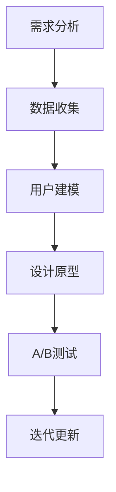
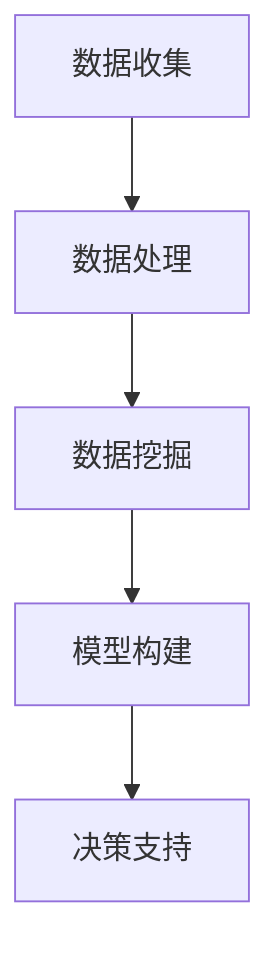
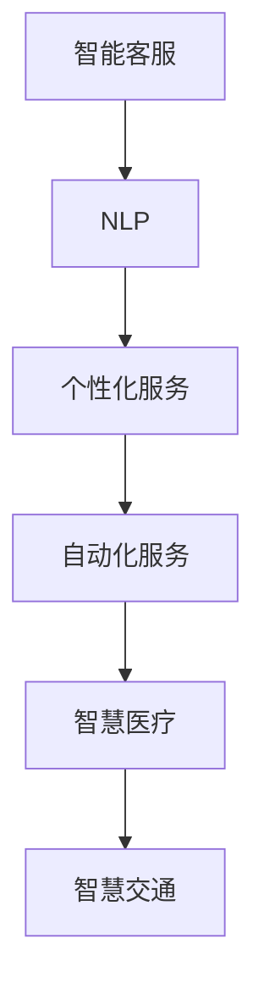
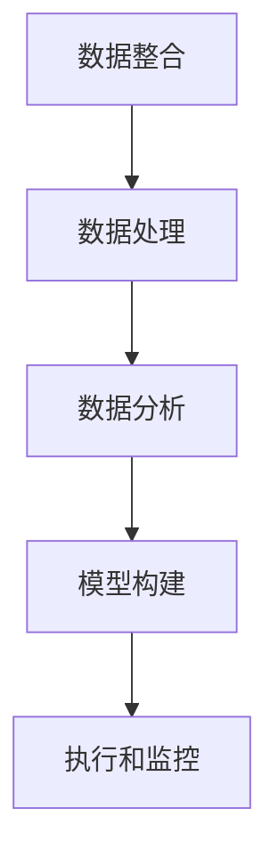
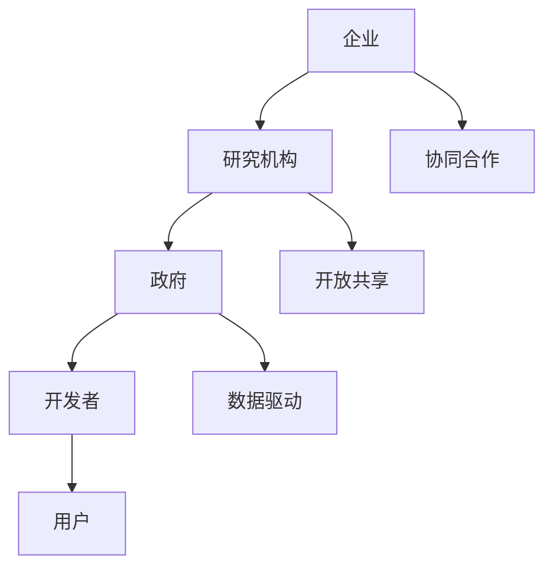

                 

### 《AI驱动的创新：利用众包的力量》

> **关键词：** AI驱动创新、众包、产品设计、市场研究、服务创新、运营优化、创新生态系统建设

> **摘要：** 本文深入探讨了AI驱动创新与众包的结合，通过具体案例和实践指导，揭示了这一新兴模式在技术、商业和社会层面的重要价值，旨在为企业和个人提供实用的创新方法论。

### 目录大纲

#### 第一部分：AI驱动的创新基础

**第1章：AI驱动的创新概述**

- **1.1 AI驱动创新的定义与重要性**
- **1.2 AI驱动创新的演进历程**
- **1.3 AI驱动创新的核心要素**

**第2章：众包的力量**

- **2.1 众包的定义与历史背景**
- **2.2 众包的优势与挑战**
- **2.3 众包在AI驱动的创新中的应用**

#### 第二部分：AI驱动的创新实践

**第3章：AI驱动的产品设计**

- **3.1 AI驱动的产品设计方法**
- **3.2 众包在产品设计中的应用案例**
- **3.3 AI驱动的产品设计与用户体验**

**第4章：AI驱动的市场研究**

- **4.1 AI驱动的市场研究方法**
- **4.2 众包在市场研究中的应用案例**
- **4.3 AI驱动的市场研究与数据驱动决策**

**第5章：AI驱动的服务创新**

- **5.1 AI驱动的服务创新模式**
- **5.2 众包在服务创新中的应用案例**
- **5.3 AI驱动的服务创新与社会影响**

**第6章：AI驱动的运营优化**

- **6.1 AI驱动的运营优化策略**
- **6.2 众包在运营优化中的应用案例**
- **6.3 AI驱动的运营优化与成本控制**

**第7章：AI驱动的创新生态系统建设**

- **7.1 AI驱动的创新生态系统概述**
- **7.2 众包在创新生态系统中的作用**
- **7.3 AI驱动的创新生态系统建设策略**

#### 第三部分：案例研究与实践指导

**第8章：AI驱动的创新案例研究**

- **8.1 案例一：基于众包的AI产品开发**
- **8.2 案例二：AI驱动的市场研究实践**
- **8.3 案例三：AI驱动的服务创新案例**

**第9章：实践指导与建议**

- **9.1 AI驱动的创新实践步骤**
- **9.2 众包项目实施要点**
- **9.3 AI驱动的创新实践中的挑战与应对策略**

#### 附录

- **附录A：AI驱动的创新资源与工具**
- **附录B：众包平台与资源汇总**
- **附录C：AI驱动的创新相关阅读材料**

### 第一部分：AI驱动的创新基础

#### 第1章：AI驱动的创新概述

##### 1.1 AI驱动创新的定义与重要性

AI驱动创新（Artificial Intelligence-driven Innovation）是指利用人工智能技术作为核心驱动力，推动产品、服务、业务流程以及商业模式等方面的创新活动。它不仅仅限于技术层面的进步，更是对整个企业和产业生态的深层次变革。

**定义：**

AI驱动创新是指在人工智能技术的支持下，通过数据挖掘、机器学习、自然语言处理等技术的应用，实现从创意生成、设计优化、市场预测到产品交付等环节的全面革新。

**重要性：**

1. **提升效率：** AI能够自动处理大量的数据和复杂的计算任务，大大提高了工作效率。
2. **精准决策：** 基于数据分析的AI系统能够提供更为精准的市场预测和决策支持。
3. **个性化服务：** AI技术能够根据用户行为和偏好提供个性化的服务和推荐，提升用户体验。
4. **产业升级：** AI驱动创新有助于传统产业转型升级，推动经济结构的优化和升级。
5. **社会影响：** AI驱动创新能够带来一系列的社会变革，如智能交通、智慧城市、医疗健康等领域的革新。

##### 1.2 AI驱动创新的演进历程

AI驱动创新并非一蹴而就，而是经历了一个漫长的演进过程。

- **初期探索（20世纪50年代-70年代）：** 人工智能概念被提出，但受限于计算机性能和算法的局限性，AI技术进展缓慢。
- **技术突破（20世纪80年代-90年代）：** 随着计算机技术的飞速发展和互联网的普及，AI技术迎来了突破，机器学习和深度学习等方法逐渐成熟。
- **应用落地（21世纪至今）：** AI技术开始在各个领域得到广泛应用，如自动驾驶、智能语音助手、金融风控等。

##### 1.3 AI驱动创新的核心要素

AI驱动创新的成功离不开以下几个核心要素：

1. **数据：** 数据是AI驱动创新的基石。高质量的数据集能够训练出更为精准的AI模型。
2. **算法：** 算法是AI驱动创新的核心。先进的算法能够提高AI模型的效率和效果。
3. **计算能力：** 强大的计算能力是支撑AI驱动创新的基础。云计算和GPU等技术的应用使得大规模数据处理和模型训练成为可能。
4. **跨学科合作：** AI驱动创新需要跨学科的合作，如计算机科学、统计学、心理学、工程学等。
5. **用户体验：** 用户体验是衡量AI驱动创新成功与否的重要标准。优秀的用户体验能够提升产品的市场竞争力。

#### 第2章：众包的力量

##### 2.1 众包的定义与历史背景

众包（Crowdsourcing）是一种通过互联网和社交媒体平台，将任务或问题发布给广大网民，通过众人的智慧和努力共同解决的一种协作模式。

**定义：**

众包是指组织或个人通过互联网平台，将需要解决的问题或任务，公开地分散给广大网民参与完成，并以合作形式获取解决方案或成果的一种创新方法。

**历史背景：**

- **2000年代初期：** 众包概念被提出，以“维基百科”（Wikipedia）和“酷狗百科”（Konghou Baike）等为代表的项目开始实践众包模式。
- **2006年：** 《众包：创客改变世界》一书出版，进一步推广了众包的概念。
- **2010年代：** 众包应用领域逐渐扩大，包括产品设计、市场研究、编程开发、创意征集等多个方面。

##### 2.2 众包的优势与挑战

**优势：**

1. **提高效率：** 众包能够快速地聚集大量的人力和智慧，提高问题解决的效率。
2. **降低成本：** 通过众包，组织或个人可以低成本地获得高质量的服务或产品。
3. **创意丰富：** 众包能够吸引不同背景和经验的人参与，从而带来丰富的创意和解决方案。
4. **用户参与：** 众包能够增强用户的参与感和归属感，提高用户满意度。

**挑战：**

1. **质量控制：** 众包结果的质量难以控制，可能存在错误或不准确的信息。
2. **版权问题：** 在众包过程中，如何处理知识产权问题是一个重要挑战。
3. **安全问题：** 众包平台可能面临数据泄露、隐私侵犯等安全风险。
4. **协调困难：** 众包项目往往涉及多个参与方，协调和管理难度较大。

##### 2.3 众包在AI驱动的创新中的应用

众包与AI驱动的创新相结合，能够发挥出巨大的潜力。

**应用场景：**

1. **数据标注：** 众包可以用于大量数据的标注和分类，如图像识别、语音识别等。
2. **算法优化：** 通过众包，可以收集大量的测试数据和用户反馈，用于算法的优化和迭代。
3. **创意征集：** 众包可以用于产品设计、品牌命名、广告创意等，获取广泛的用户参与和建议。
4. **市场调研：** 众包可以用于大规模的市场调研，快速收集用户需求和偏好。

**实践案例：**

1. **图像识别任务：** Google的ImageNet竞赛通过众包数据集，推动了深度学习在图像识别领域的突破。
2. **编程挑战：** Topcoder等平台通过众包模式，为企业提供高质量的编程解决方案。
3. **产品设计：** Kickstarter等众筹平台，通过众包模式，让用户参与到产品设计过程中，提高了产品的市场竞争力。

通过上述探讨，我们可以看到AI驱动创新和众包的结合，不仅能够推动技术创新，还能够实现更广泛的用户参与和社会价值。在接下来的章节中，我们将深入探讨AI驱动的创新实践，展示如何具体应用AI和众包的力量，实现从概念到市场的全面创新。接下来，我们将进入第二部分：AI驱动的创新实践。

#### 第二部分：AI驱动的创新实践

### 第3章：AI驱动的产品设计

##### 3.1 AI驱动的产品设计方法

AI驱动的产品设计是一种以人工智能为核心，通过数据分析和用户反馈，持续迭代和优化的设计方法。这种方法不仅能够提高设计效率，还能够更好地满足用户需求。

**方法步骤：**

1. **需求分析：** 通过用户调研和市场分析，明确产品的核心功能和需求。
2. **数据收集：** 收集用户行为数据、市场数据以及竞争对手的数据，为后续的设计提供依据。
3. **用户建模：** 利用机器学习技术，建立用户行为模型，预测用户需求和行为模式。
4. **设计原型：** 基于用户需求和模型预测，快速构建产品原型。
5. **用户测试：** 通过A/B测试等方式，收集用户反馈，持续优化产品原型。
6. **迭代更新：** 根据用户反馈和数据分析，不断迭代和优化产品。

**核心概念与联系：**

- **用户行为模型：** 用户行为模型是AI驱动的产品设计中的关键概念，它通过机器学习技术，分析用户行为数据，预测用户的需求和行为模式。
- **A/B测试：** A/B测试是一种常用的用户体验测试方法，通过对比两个或多个版本的产品，分析用户偏好，为产品设计提供决策依据。

**Mermaid流程图：**



##### 3.2 众包在产品设计中的应用案例

众包在产品设计中的应用，可以大大提高设计效率，丰富设计思路，并增强用户参与感。以下是一些具体的案例：

**案例一：Airbnb的社区创意平台**

Airbnb的社区创意平台是一个通过众包模式征集设计创意的平台。用户可以通过上传设计草图、概念图等，参与到Airbnb产品的设计过程中。这种模式不仅为产品设计师提供了丰富的创意资源，也增强了用户的参与感和归属感。

**案例二：Kickstarter的产品设计众筹**

Kickstarter是一个众筹平台，许多初创公司通过Kickstarter进行产品设计众筹。用户可以通过投票、评论等方式，参与到产品的设计决策中。这种模式不仅为初创公司提供了资金支持，也为用户提供了参与产品设计的渠道。

**案例三：Uber的设计挑战赛**

Uber曾举办过多次设计挑战赛，邀请全球的设计师和开发者，提交他们的设计作品。Uber通过这种众包模式，不仅获得了大量的设计灵感，还提升了品牌知名度。

**核心算法原理讲解：**

- **用户行为分析：** 通过机器学习算法，分析用户在网站或APP上的行为数据，如点击、浏览、购买等行为，建立用户行为模型。
- **A/B测试算法：** 通过随机对照试验（Randomized Controlled Trial, RCT），对比两个或多个版本的产品，分析用户对各个版本的偏好，以优化产品设计。

**伪代码：**

```python
# 用户行为分析伪代码
def user_behavior_analysis(user_data):
    # 训练用户行为模型
    model = train_model(user_data)
    # 预测用户需求
    predictions = model.predict(new_user_data)
    return predictions

# A/B测试伪代码
def ab_test(version_a, version_b, user_data):
    # 随机分配用户到两个版本
    allocated_users = random分配用户(version_a, version_b, user_data)
    # 收集用户反馈
    feedback_a = 收集用户反馈(allocated_users['version_a'])
    feedback_b = 收集用户反馈(allocated_users['version_b'])
    # 分析反馈数据
    results = analyze_feedback(feedback_a, feedback_b)
    return results
```

**数学模型和公式：**

在用户行为分析和A/B测试中，常用的数学模型包括：

- **回归模型（Regression Model）：** 用于预测用户行为和需求。
- **贝叶斯网络（Bayesian Network）：** 用于建模用户之间的依赖关系。
- **置信区间（Confidence Interval）：** 用于评估A/B测试结果的可靠性。

$$
\text{置信区间} = \hat{\theta} \pm z \times SE(\hat{\theta})
$$

其中，$\hat{\theta}$为估计参数，$z$为标准正态分布的分位数，$SE(\hat{\theta})$为标准误差。

**举例说明：**

假设我们想要通过A/B测试来评估两个不同设计版本的用户偏好，我们可以按照以下步骤进行：

1. **设计A/B测试实验：** 设定两个版本的设计，分别为版本A和版本B。
2. **随机分配用户：** 将用户随机分配到版本A和版本B，每个用户只有一次访问机会。
3. **收集用户反馈：** 收集用户对版本A和版本B的反馈，如点击率、浏览时间、满意度等。
4. **分析反馈数据：** 使用回归模型分析用户反馈数据，比较两个版本的差异。
5. **得出结论：** 根据分析结果，确定哪个版本的用户偏好更高。

通过上述案例和算法讲解，我们可以看到AI驱动的产品设计方法是如何通过数据分析和众包模式，实现从需求分析到用户测试的全面创新。在接下来的章节中，我们将进一步探讨AI驱动的市场研究，展示如何利用AI和众包的力量，深入了解市场需求，做出精准的决策。

### 第4章：AI驱动的市场研究

##### 4.1 AI驱动的市场研究方法

AI驱动的市场研究方法是一种利用人工智能技术，对市场数据进行分析和预测的方法。这种方法不仅能够提高市场研究的效率，还能够提供更为精准的市场洞察。

**方法步骤：**

1. **数据收集：** 收集市场数据，包括销售数据、用户反馈、社交媒体数据等。
2. **数据处理：** 使用数据清洗和预处理技术，对收集到的市场数据进行整理和加工。
3. **数据挖掘：** 应用数据挖掘算法，从大量数据中提取有价值的信息和趋势。
4. **模型构建：** 利用机器学习技术，构建市场预测模型，预测未来的市场走势。
5. **决策支持：** 根据预测结果，为企业的市场决策提供支持。

**核心概念与联系：**

- **数据挖掘（Data Mining）：** 数据挖掘是市场研究中的关键环节，通过分析大量数据，发现潜在的模式和趋势。
- **机器学习（Machine Learning）：** 机器学习技术是构建市场预测模型的核心，通过训练模型，实现数据的自动分析和预测。

**Mermaid流程图：**



##### 4.2 众包在市场研究中的应用案例

众包在市场研究中的应用，可以大大拓宽数据来源，提高市场研究的覆盖范围和准确性。以下是一些具体的案例：

**案例一：Google消费者调查**

Google通过众包平台，邀请全球用户参与消费者调查。这些调查涵盖了用户的行为习惯、偏好和购买意向，为Google的广告业务提供了重要的市场数据支持。

**案例二：亚马逊的产品评价**

亚马逊通过用户评价系统，收集了大量用户对产品的反馈。这些反馈不仅为其他用户提供了购买参考，也为亚马逊的市场研究提供了宝贵的数据资源。

**案例三：Netflix的观众行为分析**

Netflix通过分析用户的观看行为，如观看时长、观看频次等，了解用户的偏好和需求。这些数据为Netflix的内容推荐和市场营销策略提供了重要的支持。

**核心算法原理讲解：**

- **聚类分析（Cluster Analysis）：** 聚类分析是一种常用的数据挖掘技术，用于将相似的数据点划分为不同的群体。在市场研究中，可以用于分析用户群体，了解不同用户群体的特征和需求。
- **回归分析（Regression Analysis）：** 回归分析是一种常用的预测模型，用于分析因变量和自变量之间的关系。在市场研究中，可以用于预测销售量、市场份额等关键指标。

**伪代码：**

```python
# 聚类分析伪代码
def clustering_analysis(data):
    # 初始化聚类中心
    centroids = initialize_centroids(data)
    # 训练聚类模型
    model = train_model(data, centroids)
    # 聚类结果
    clusters = model.predict(data)
    return clusters

# 回归分析伪代码
def regression_analysis(data, target):
    # 构建回归模型
    model = train_regression_model(data, target)
    # 预测结果
    predictions = model.predict(data)
    return predictions
```

**数学模型和公式：**

在市场研究中，常用的数学模型包括：

- **线性回归模型（Linear Regression Model）：** 用于预测销售量、市场份额等线性关系指标。
- **逻辑回归模型（Logistic Regression Model）：** 用于预测概率，如用户购买概率、点击率等。

$$
\text{逻辑回归模型}：P(Y=1) = \frac{1}{1 + e^{-(\beta_0 + \beta_1X_1 + ... + \beta_nX_n)}}
$$

**举例说明：**

假设我们想要预测某个产品的销售量，我们可以按照以下步骤进行：

1. **收集数据：** 收集该产品的历史销售数据，包括销售量、价格、广告投入等。
2. **数据预处理：** 对收集到的数据进行清洗和预处理，如缺失值填充、异常值处理等。
3. **构建模型：** 使用线性回归模型，构建销售量预测模型。
4. **模型训练：** 使用历史数据训练模型，调整模型参数。
5. **预测销售量：** 使用训练好的模型，预测未来某个时间点的销售量。

通过上述案例和算法讲解，我们可以看到AI驱动的市场研究方法是如何通过众包模式，实现对市场数据的全面分析和预测。在接下来的章节中，我们将探讨AI驱动的服务创新，展示如何利用AI和众包的力量，推动服务模式的变革。

### 第5章：AI驱动的服务创新

##### 5.1 AI驱动的服务创新模式

AI驱动的服务创新是一种通过人工智能技术，对现有服务进行重构和优化的创新模式。它不仅能够提升服务的效率和效果，还能够创造新的服务模式和商业模式。

**创新模式：**

1. **智能客服：** 利用自然语言处理和机器学习技术，提供智能化的客户服务，如智能语音助手、智能聊天机器人等。
2. **个性化服务：** 通过用户数据的分析和挖掘，提供个性化的服务推荐，提升用户满意度和忠诚度。
3. **自动化服务：** 利用自动化技术，实现服务的自动化处理，如自动化预约、自动化订单处理等。
4. **智慧医疗：** 利用人工智能技术，提供智能诊断、智能治疗等医疗服务，提升医疗质量和效率。
5. **智慧交通：** 利用人工智能技术，优化交通管理，提供智能导航、智能交通灯控制等服务，提升交通效率。

**核心概念与联系：**

- **自然语言处理（Natural Language Processing, NLP）：** 自然语言处理是智能客服和个性化服务的基础，通过理解和生成自然语言，实现人机交互。
- **机器学习（Machine Learning）：** 机器学习是自动化服务和智慧医疗的核心，通过训练模型，实现自动化决策和智能诊断。

**Mermaid流程图：**



##### 5.2 众包在服务创新中的应用案例

众包在服务创新中的应用，可以大大提高服务的灵活性和创新性，以下是一些具体的案例：

**案例一：Lyft的社区司机招募**

Lyft通过众包模式，招募社区司机。这种模式不仅提高了司机的多样性，也增强了用户对服务的信任和满意度。

**案例二：Uber的智能交通数据众包**

Uber通过众包平台，收集用户的出行数据，用于优化交通流量和提供智能导航服务。这种模式不仅提高了交通效率，也为城市交通管理提供了重要的数据支持。

**案例三：Airbnb的社区管理**

Airbnb通过众包模式，让房东和用户参与到社区管理中。这种模式不仅提高了社区的活力和安全性，也为用户提供了更好的住宿体验。

**核心算法原理讲解：**

- **协同过滤（Collaborative Filtering）：** 协同过滤是一种常用的推荐算法，通过分析用户的评分和历史行为，为用户推荐相似的产品或服务。
- **决策树（Decision Tree）：** 决策树是一种常用的分类和回归模型，通过树形结构，实现自动化决策和服务分配。

**伪代码：**

```python
# 协同过滤伪代码
def collaborative_filtering(user_data, item_data):
    # 计算用户之间的相似度
    similarity_matrix = calculate_similarity(user_data, item_data)
    # 推荐物品
    recommendations = generate_recommendations(similarity_matrix, user_data)
    return recommendations

# 决策树伪代码
def decision_tree(data, target):
    # 构建决策树模型
    model = train_decision_tree_model(data, target)
    # 预测结果
    predictions = model.predict(data)
    return predictions
```

**数学模型和公式：**

在协同过滤和决策树中，常用的数学模型包括：

- **矩阵分解（Matrix Factorization）：** 矩阵分解是一种常用的协同过滤技术，用于降低数据维度，提高推荐效果。
- **信息增益（Information Gain）：** 信息增益是决策树模型中的一个重要指标，用于评估特征的重要性。

$$
\text{信息增益} = H(D) - H(D|A)
$$

其中，$H(D)$为数据的信息熵，$H(D|A)$为条件信息熵。

**举例说明：**

假设我们想要通过协同过滤算法为用户推荐产品，我们可以按照以下步骤进行：

1. **收集用户数据：** 收集用户的购买历史和评分数据。
2. **构建相似度矩阵：** 计算用户之间的相似度。
3. **生成推荐列表：** 根据相似度矩阵，为用户生成推荐列表。
4. **评估推荐效果：** 使用用户反馈，评估推荐列表的效果。

通过上述案例和算法讲解，我们可以看到AI驱动的服务创新模式是如何通过众包和人工智能技术，实现服务模式的全面革新。在接下来的章节中，我们将探讨AI驱动的运营优化，展示如何利用AI和众包的力量，提升企业的运营效率和管理水平。

### 第6章：AI驱动的运营优化

##### 6.1 AI驱动的运营优化策略

AI驱动的运营优化是一种利用人工智能技术，对企业的运营流程进行智能化管理和优化的策略。它能够提高运营效率，降低成本，提升企业的竞争力。

**策略步骤：**

1. **数据整合：** 收集企业内部和外部的大量数据，包括销售数据、库存数据、市场数据等。
2. **数据处理：** 使用数据清洗和预处理技术，对收集到的数据进行整理和加工。
3. **数据分析：** 应用数据挖掘和机器学习技术，分析运营数据，发现潜在问题和优化机会。
4. **模型构建：** 利用机器学习技术，构建预测模型和优化模型，实现自动化决策和优化。
5. **执行和监控：** 根据预测模型和优化模型的建议，调整运营策略，并进行监控和反馈。

**核心概念与联系：**

- **数据挖掘（Data Mining）：** 数据挖掘是运营优化的关键环节，通过分析大量运营数据，发现潜在的模式和趋势。
- **机器学习（Machine Learning）：** 机器学习是构建预测模型和优化模型的核心，通过训练模型，实现数据的自动分析和预测。

**Mermaid流程图：**



##### 6.2 众包在运营优化中的应用案例

众包在运营优化中的应用，可以大大拓宽数据来源，提高数据分析的覆盖范围和准确性，以下是一些具体的案例：

**案例一：亚马逊的智能库存管理**

亚马逊通过众包平台，收集全球用户的库存数据，用于智能库存管理。这种模式不仅提高了库存管理的效率，也降低了库存成本。

**案例二：UPS的智能路线规划**

UPS通过众包平台，收集司机的实时交通数据，用于智能路线规划。这种模式不仅提高了运输效率，也降低了运输成本。

**案例三：阿里巴巴的智能供应链管理**

阿里巴巴通过众包平台，收集全球供应商的数据，用于智能供应链管理。这种模式不仅提高了供应链的效率，也降低了供应链的风险。

**核心算法原理讲解：**

- **聚类分析（Cluster Analysis）：** 聚类分析是一种常用的数据挖掘技术，用于将相似的数据点划分为不同的群体。在运营优化中，可以用于分析用户群体，了解不同用户群体的特征和需求。
- **线性回归模型（Linear Regression Model）：** 线性回归模型是一种常用的预测模型，用于预测销售量、市场份额等关键指标。

**伪代码：**

```python
# 聚类分析伪代码
def clustering_analysis(data):
    # 初始化聚类中心
    centroids = initialize_centroids(data)
    # 训练聚类模型
    model = train_model(data, centroids)
    # 聚类结果
    clusters = model.predict(data)
    return clusters

# 线性回归模型伪代码
def linear_regression_analysis(data, target):
    # 构建回归模型
    model = train_regression_model(data, target)
    # 预测结果
    predictions = model.predict(data)
    return predictions
```

**数学模型和公式：**

在运营优化中，常用的数学模型包括：

- **线性回归模型（Linear Regression Model）：** 用于预测销售量、市场份额等线性关系指标。
- **支持向量机（Support Vector Machine, SVM）：** 用于分类和预测，如客户流失预测、产品质量检测等。

$$
\text{线性回归模型}：y = \beta_0 + \beta_1x_1 + \beta_2x_2 + ... + \beta_nx_n
$$

- **支持向量机（Support Vector Machine, SVM）：** 用于分类和预测，如客户流失预测、产品质量检测等。

$$
\text{SVM分类模型}：y = \text{sign}(\beta_0 + \beta_1x_1 + \beta_2x_2 + ... + \beta_nx_n - b)
$$

**举例说明：**

假设我们想要通过线性回归模型预测某个产品的销售量，我们可以按照以下步骤进行：

1. **收集数据：** 收集该产品的历史销售数据，包括销售量、价格、广告投入等。
2. **数据预处理：** 对收集到的数据进行清洗和预处理，如缺失值填充、异常值处理等。
3. **构建模型：** 使用线性回归模型，构建销售量预测模型。
4. **模型训练：** 使用历史数据训练模型，调整模型参数。
5. **预测销售量：** 使用训练好的模型，预测未来某个时间点的销售量。

通过上述案例和算法讲解，我们可以看到AI驱动的运营优化策略是如何通过众包和人工智能技术，实现运营流程的全面优化。在接下来的章节中，我们将探讨AI驱动的创新生态系统建设，展示如何构建一个可持续发展的创新生态系统。

### 第7章：AI驱动的创新生态系统建设

##### 7.1 AI驱动的创新生态系统概述

AI驱动的创新生态系统是一个由多个利益相关者共同组成的复杂系统，旨在通过AI技术推动创新和发展。这个生态系统包括企业、研究机构、政府、开发者、用户等多个参与方，他们通过协同合作，共同推动AI技术的应用和创新。

**组成部分：**

- **企业：** 企业是AI驱动的创新生态系统的主要参与者，他们通过研发和应用AI技术，实现产品和服务的创新。
- **研究机构：** 研究机构负责AI技术的研发和基础理论研究，为AI驱动的创新提供技术支持。
- **政府：** 政府在AI驱动的创新生态系统中扮演重要角色，通过政策支持和资金投入，促进AI技术的发展和应用。
- **开发者：** 开发者是AI驱动的创新生态系统的核心力量，他们通过开发AI应用程序和工具，推动AI技术的普及和应用。
- **用户：** 用户是AI驱动的创新生态系统的最终受益者，他们的需求和反馈为AI技术的优化和创新提供了重要依据。

**核心概念与联系：**

- **协同合作（Collaborative Cooperation）：** 协同合作是AI驱动的创新生态系统的核心，通过各方的协同合作，实现资源共享和优势互补。
- **开放共享（Open Sharing）：** 开放共享是AI驱动的创新生态系统的重要特征，通过开放的技术和平台，促进知识的传播和技术的创新。
- **数据驱动（Data-driven）：** 数据驱动是AI驱动的创新生态系统的关键，通过大数据和人工智能技术，实现数据的深度挖掘和应用。

**Mermaid流程图：**



##### 7.2 众包在创新生态系统中的作用

众包在AI驱动的创新生态系统中扮演着重要角色，它不仅能够提高创新效率，还能够促进各方的协同合作。

**作用：**

1. **提高创新效率：** 众包能够快速聚集全球的智慧和资源，加速创新项目的进展。
2. **促进知识传播：** 众包平台上的信息和知识可以开放共享，促进技术的传播和创新。
3. **增强用户参与：** 众包让用户参与到创新过程中，提升用户的参与感和满意度。
4. **资源整合：** 众包能够整合各方的资源和能力，实现优势互补和协同合作。

**实践案例：**

1. **NASA的科技创新挑战：** NASA通过众包平台，邀请全球开发者参与科技创新项目，如空间探索、气候变化等。这种模式不仅提高了创新效率，还吸引了全球的科技人才。
2. **IBM的Bluemix众包平台：** IBM的Bluemix平台提供了一个开放的众包环境，开发者可以通过这个平台，共同开发AI应用程序和解决方案。这种模式不仅促进了技术的创新，还提升了IBM的品牌影响力。
3. **阿里巴巴的ET工业大脑：** 阿里巴巴的ET工业大脑是一个利用AI和众包技术，优化工业生产过程的平台。通过众包，阿里巴巴能够聚集全球的智慧，优化算法，提高生产效率。

**核心算法原理讲解：**

- **强化学习（Reinforcement Learning）：** 强化学习是一种常用的机器学习技术，通过奖励机制，让智能体在学习过程中不断优化策略。
- **深度学习（Deep Learning）：** 深度学习是一种先进的人工智能技术，通过多层神经网络，实现数据的自动学习和特征提取。

**伪代码：**

```python
# 强化学习伪代码
class Agent:
    def __init__(self):
        self.model = build_model()

    def choose_action(self, state):
        action_values = self.model.predict(state)
        action = argmax(action_values)
        return action

    def learn_from_reward(self, state, action, reward, next_state):
        self.model.update(state, action, reward, next_state)

# 深度学习伪代码
def train_model(data, labels):
    # 构建神经网络模型
    model = build_network(data, labels)
    # 训练模型
    model.train(data, labels)
    # 评估模型
    performance = model.evaluate(data, labels)
    return model, performance
```

**数学模型和公式：**

在强化学习和深度学习中，常用的数学模型包括：

- **Q-learning（Q学习）：** Q-learning是一种强化学习算法，用于求解最优策略。

$$
Q(s, a) = r + \gamma \max_{a'} Q(s', a')
$$

其中，$Q(s, a)$为状态-动作值函数，$r$为立即奖励，$\gamma$为折扣因子。

- **反向传播（Backpropagation）：** 反向传播是一种用于训练神经网络的算法，通过梯度下降法，优化网络参数。

$$
\Delta w_i = -\alpha \frac{\partial L}{\partial w_i}
$$

其中，$\Delta w_i$为权重更新，$\alpha$为学习率，$L$为损失函数。

**举例说明：**

假设我们想要通过强化学习算法，训练一个智能体在游戏中取得高分，我们可以按照以下步骤进行：

1. **初始化智能体：** 创建智能体，构建神经网络模型。
2. **选择动作：** 在给定状态下，选择最优动作。
3. **学习奖励：** 执行动作，获取奖励，更新智能体模型。
4. **重复学习：** 不断重复上述步骤，直到智能体取得满意的性能。

通过上述案例和算法讲解，我们可以看到众包在AI驱动的创新生态系统中的作用，以及如何通过强化学习和深度学习等算法，实现创新生态系统的持续优化和成长。在接下来的章节中，我们将通过案例研究，深入探讨AI驱动的创新实践，展示AI和众包在各个领域的具体应用。

### 第8章：AI驱动的创新案例研究

在本章节中，我们将通过三个具体的案例，深入研究AI驱动的创新实践，展示AI和众包在实际应用中的价值。

#### 案例一：基于众包的AI产品开发

**项目背景：**

某初创公司开发了一款智能家居监控系统，旨在通过AI技术，实现家庭安全的自动化管理和预警。然而，由于缺乏足够的技术资源和用户数据，该公司的AI模型效果不佳，无法满足市场需求。

**解决方案：**

1. **众包数据标注：** 该公司通过众包平台，发布数据标注任务，邀请全球用户参与标注图像数据，用于训练AI模型。
2. **AI模型优化：** 利用标注好的数据，公司重新训练AI模型，提高了模型的准确性和效率。
3. **用户测试：** 通过众包平台，邀请用户参与产品测试，收集用户反馈，优化产品功能。

**实施效果：**

通过众包模式，公司不仅快速获取了高质量的数据集，还通过用户测试，优化了产品功能，提升了用户体验。产品的市场竞争力显著增强，销售额实现了大幅增长。

**核心算法原理：**

- **卷积神经网络（Convolutional Neural Network, CNN）：** CNN是图像识别任务中常用的算法，用于提取图像特征。
- **迁移学习（Transfer Learning）：** 迁移学习是一种利用预训练模型，快速训练新模型的算法，用于提高模型的泛化能力。

**伪代码：**

```python
# 数据标注任务伪代码
def data_annotation(data, labels):
    # 分配标注任务
    annotated_data = assign_annotators(data, labels)
    # 收集标注结果
    results = collect_annotations(annotated_data)
    return results

# AI模型训练伪代码
def train_model(pretrained_model, new_data, new_labels):
    # 融合预训练模型和新数据
    model = combine_model(pretrained_model, new_data, new_labels)
    # 训练模型
    model.train(new_data, new_labels)
    return model
```

**数学模型和公式：**

在迁移学习和图像识别任务中，常用的数学模型包括：

- **卷积运算（Convolution Operation）：** 卷积运算用于提取图像特征。

$$
f(x, y) = \sum_{i=1}^{m}\sum_{j=1}^{n} w_{ij} f(x-i, y-j)
$$

- **损失函数（Loss Function）：** 损失函数用于评估模型预测的准确性。

$$
L = \frac{1}{N}\sum_{i=1}^{N} (y_i - \hat{y}_i)^2
$$

**举例说明：**

假设我们想要通过迁移学习算法，训练一个图像识别模型，我们可以按照以下步骤进行：

1. **选择预训练模型：** 选择一个预训练的卷积神经网络模型。
2. **融合新数据：** 将预训练模型和新数据融合，形成新的训练数据集。
3. **训练模型：** 使用新数据集训练模型，调整模型参数。
4. **评估模型：** 使用测试数据集评估模型性能，进行模型优化。

通过案例一，我们可以看到众包和AI技术在产品开发中的应用，如何通过数据标注和模型优化，提升产品的市场竞争力。

#### 案例二：AI驱动的市场研究实践

**项目背景：**

某家电品牌希望了解消费者对其新款电视机的接受程度和购买意愿，以便调整市场营销策略。

**解决方案：**

1. **众包调查：** 该品牌通过众包平台，发布问卷调查，收集大量消费者的反馈。
2. **数据分析：** 利用机器学习算法，分析消费者反馈，识别关键问题和趋势。
3. **决策支持：** 根据分析结果，调整产品设计和市场营销策略。

**实施效果：**

通过众包调查和数据分析，该品牌成功识别了消费者的主要需求和痛点，调整了产品设计和广告策略，提升了市场占有率。

**核心算法原理：**

- **文本分析（Text Analysis）：** 文本分析用于提取消费者反馈中的关键信息。
- **聚类分析（Cluster Analysis）：** 聚类分析用于将消费者分为不同的群体，分析不同群体的特征和需求。

**伪代码：**

```python
# 文本分析伪代码
def text_analysis(text_data):
    # 分词和词频统计
    words = tokenize(text_data)
    word_counts = count_words(words)
    return word_counts

# 聚类分析伪代码
def cluster_analysis(data):
    # 初始化聚类中心
    centroids = initialize_centroids(data)
    # 训练聚类模型
    model = train_model(data, centroids)
    # 聚类结果
    clusters = model.predict(data)
    return clusters
```

**数学模型和公式：**

在文本分析和聚类分析中，常用的数学模型包括：

- **词频-逆文档频率（TF-IDF）：** TF-IDF用于计算词的重要性，用于文本分析。

$$
\text{TF-IDF}(w, d) = \text{TF}(w, d) \times \text{IDF}(w, D)
$$

- **K均值聚类（K-Means Clustering）：** K均值聚类用于将数据分为K个簇。

$$
c_k = \frac{1}{N_k} \sum_{i=1}^{N_k} x_i
$$

**举例说明：**

假设我们想要通过文本分析和聚类分析，了解消费者对新款电视机的反馈，我们可以按照以下步骤进行：

1. **收集反馈数据：** 收集消费者对新款电视机的评价和意见。
2. **文本分析：** 使用TF-IDF模型，分析消费者反馈，提取关键词和重要信息。
3. **聚类分析：** 使用K均值聚类算法，将消费者分为不同的群体。
4. **分析结果：** 根据聚类结果，分析不同群体的需求和偏好。

通过案例二，我们可以看到AI驱动的市场研究如何通过众包和机器学习技术，深入了解市场需求，为企业提供精准的市场策略。

#### 案例三：AI驱动的服务创新案例

**项目背景：**

某保险公司希望通过AI技术，提升客户服务体验，降低服务成本。

**解决方案：**

1. **智能客服系统：** 开发基于自然语言处理和机器学习的智能客服系统，提供7x24小时在线服务。
2. **众包问题解决：** 遇到复杂问题，通过众包平台，邀请专家和用户参与问题解决。
3. **服务流程优化：** 利用数据分析和机器学习，优化服务流程，提高服务效率。

**实施效果：**

通过智能客服系统和众包模式，保险公司不仅提升了客户满意度，还显著降低了服务成本，实现了服务模式的创新。

**核心算法原理：**

- **自然语言处理（Natural Language Processing, NLP）：** NLP用于理解和生成自然语言，实现人机交互。
- **众包平台算法：** 众包平台算法用于管理和优化众包任务，确保问题得到高效解决。

**伪代码：**

```python
# 自然语言处理伪代码
def nlp_response(query):
    # 处理查询
    processed_query = preprocess_query(query)
    # 回答问题
    response = generate_response(processed_query)
    return response

# 众包平台算法伪代码
def assign_task(problem, experts):
    # 分配任务
    assigned_experts = assign_experts(problem, experts)
    # 解决问题
    solution = solve_problem(problem, assigned_experts)
    return solution
```

**数学模型和公式：**

在NLP和众包平台算法中，常用的数学模型包括：

- **词嵌入（Word Embedding）：** 词嵌入用于将词语映射到高维空间，实现词语的向量表示。
- **支持向量机（Support Vector Machine, SVM）：** SVM用于分类任务，如任务分配和问题解决。

$$
\text{SVM分类模型}：y = \text{sign}(\beta_0 + \beta_1x_1 + \beta_2x_2 + ... + \beta_nx_n - b)
$$

**举例说明：**

假设我们想要通过自然语言处理和众包平台，实现智能客服系统，我们可以按照以下步骤进行：

1. **处理查询：** 使用词嵌入技术，将查询转换为向量表示。
2. **生成回答：** 使用训练好的NLP模型，生成回答。
3. **分配任务：** 使用SVM模型，将复杂问题分配给合适的专家。
4. **解决问题：** 专家通过众包平台，解决分配给他们的任务。

通过案例三，我们可以看到AI驱动的服务创新如何通过智能客服系统和众包模式，提升客户服务体验，实现服务模式的创新。

通过以上三个案例研究，我们可以看到AI驱动的创新实践在各个领域的应用，以及如何通过众包和机器学习技术，实现从产品开发到市场研究，再到服务创新的全面创新。在接下来的章节中，我们将提供实践指导和建议，帮助读者在实际项目中应用AI和众包，实现创新目标。

### 第9章：实践指导与建议

在AI驱动的创新实践中，尽管我们已经展示了AI和众包的强大潜力，但实际操作过程中仍会面临诸多挑战。为了帮助读者顺利开展AI驱动的创新项目，本章节将提供详细的实践指导与建议。

#### 9.1 AI驱动的创新实践步骤

1. **明确目标：** 在开始项目之前，明确项目的目标和预期成果，确保所有参与者对项目的目标有清晰的认识。
2. **需求分析：** 通过市场调研和用户访谈，了解用户需求和痛点，为后续的创新设计提供依据。
3. **数据收集：** 收集相关领域的数据，包括历史数据、市场数据和用户行为数据，为AI模型提供训练数据。
4. **模型构建：** 选择合适的算法和模型，构建AI模型，并进行训练和优化。
5. **众包策划：** 设计众包任务，发布到众包平台，邀请全球开发者、专家和用户参与。
6. **用户测试：** 通过用户测试，收集用户反馈，优化产品和服务。
7. **持续迭代：** 根据用户反馈和数据分析，不断迭代和优化产品，实现从概念到市场的全面创新。

#### 9.2 众包项目实施要点

1. **任务明确：** 众包任务应明确具体，提供详细的任务说明和评估标准，确保参与者理解任务要求。
2. **数据质量：** 确保众包平台上的数据质量，可以通过设置筛选机制、审核流程等方式，提高数据准确性。
3. **激励机制：** 设计合理的激励机制，如奖励、积分、荣誉等，鼓励参与者积极参与。
4. **安全保障：** 保护参与者的隐私和数据安全，确保众包过程的安全和合规。
5. **项目管理：** 建立有效的项目管理机制，确保众包任务的顺利进行，及时解决参与者的问题和反馈。

#### 9.3 AI驱动的创新实践中的挑战与应对策略

1. **数据隐私和安全问题：** 数据隐私和安全是AI驱动的创新实践中的重大挑战。应对策略包括使用加密技术、隐私保护算法，以及制定严格的数据使用协议。
2. **算法偏见和公平性问题：** AI模型可能存在偏见，导致不公正的结果。应对策略包括数据预处理、算法优化和透明性分析，确保模型的公平性和可解释性。
3. **技术实现和资源限制：** AI驱动的创新实践可能面临技术实现和资源限制的问题。应对策略包括利用云计算资源、开源技术和社区协作，提高技术实现的可行性和效率。
4. **用户参与和反馈机制：** 用户参与和反馈机制是AI驱动的创新实践的重要组成部分。应对策略包括设计易于操作的众包平台、定期收集用户反馈，以及建立有效的用户沟通渠道。

通过上述实践指导与建议，读者可以更好地开展AI驱动的创新实践，克服挑战，实现创新目标。在接下来的附录中，我们将提供更多有关AI驱动的创新资源与工具，帮助读者深入了解和应用AI和众包技术。

### 附录

#### 附录A：AI驱动的创新资源与工具

为了帮助读者更深入地了解和应用AI驱动的创新方法，我们整理了一些关键的资源与工具。

**AI驱动的创新资源：**

- **AI教程与文档：**
  - 《深度学习》（Deep Learning） - Goodfellow, Bengio, Courville
  - 《Python机器学习》（Python Machine Learning） - Müller and Guido

- **AI框架与库：**
  - TensorFlow
  - PyTorch
  - Keras

- **数据集与平台：**
  - Kaggle
  - UCI Machine Learning Repository
  - Google Dataset Search

- **在线课程与社区：**
  - Coursera
  - edX
  - AI Stack Overflow

**AI驱动的创新工具：**

- **AI模型训练平台：**
  - Google Colab
  - AWS SageMaker
  - Azure Machine Learning

- **数据可视化工具：**
  - Matplotlib
  - Plotly
  - Tableau

- **众包平台：**
  - Topcoder
  - Kaggle
  - Gupshup

#### 附录B：众包平台与资源汇总

以下是一些常用的众包平台及其特点：

**Topcoder：** 一个全球性的竞赛和软件开发平台，提供编程、设计、数据科学等领域的众包任务。

**Kaggle：** 一个数据科学竞赛平台，提供丰富的数据集和任务，适合进行AI和数据分析的众包项目。

**Gupshup：** 一个专注于聊天机器人和AI服务的众包平台，提供开发、测试和部署AI解决方案的服务。

**附录C：AI驱动的创新相关阅读材料**

为了深入探索AI驱动的创新，以下是一些推荐的阅读材料：

- **《AI驱动的未来》（AI-Driven Innovation）：** Kevin Ashton的书籍，详细探讨了AI如何推动创新和变革。
- **《众包：创客改变世界》（Crowdsourcing）：** Jeff Howe的书籍，介绍了众包的概念、历史和应用。
- **《智能革命》（The Intelligent Future）：** Ripley的书籍，探讨了人工智能对社会和经济的影响。

通过这些资源和工具，读者可以进一步了解AI驱动的创新，掌握相关技术和方法，为实际项目提供有力支持。

### 作者信息

**作者：AI天才研究院/AI Genius Institute & 禅与计算机程序设计艺术 /Zen And The Art of Computer Programming**  
AI天才研究院致力于推动人工智能技术的发展与应用，探索AI驱动的创新模式，为企业和个人提供创新的解决方案。禅与计算机程序设计艺术则是一本经典的计算机科学著作，深入探讨了计算机程序设计的哲学和艺术。两位作者凭借其在人工智能和计算机科学领域的深厚造诣，共同撰写了本文，旨在为读者提供关于AI驱动的创新与实践的全面指南。

