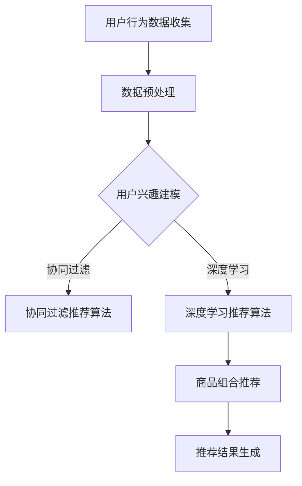

                 

### 文章标题

《AI驱动的电商平台商品组合推荐》

> **关键词**：人工智能（AI）、电商平台、商品组合推荐、协同过滤、深度学习、用户行为分析

> **摘要**：本文将深入探讨如何利用人工智能（AI）技术，特别是在电商平台中实施商品组合推荐系统。文章首先介绍了AI技术的发展与应用，以及电商行业的现状与未来前景。随后，详细阐述了AI的核心技术，如机器学习、深度学习和自然语言处理，并探讨其在电商平台中的具体应用。接下来，文章聚焦于电商平台用户行为分析，介绍用户行为数据的收集与预处理方法，以及如何利用这些数据构建用户兴趣模型。随后，文章重点讨论了商品组合推荐算法，包括协同过滤算法和深度学习算法，详细解释了各自的原理和实现方法。文章还通过实际项目案例，展示了如何搭建推荐系统环境，构建和优化推荐模型。最后，文章探讨了电商用户行为数据分析和商品组合推荐系统的优化方法，以及未来AI技术在电商领域的应用趋势。通过本文的阅读，读者将全面了解AI驱动的电商平台商品组合推荐系统的构建与优化，掌握相关核心技术和实践方法。

### 《AI驱动的电商平台商品组合推荐》目录大纲

1. **AI基础与电商应用**

    1.1 AI与电商概述

    1.2 AI核心技术与电商应用

    1.3 电商平台用户行为分析

2. **商品组合推荐算法**

    2.1 商品组合推荐概述

    2.2 协同过滤算法

    2.3 深度学习在商品组合推荐中的应用

3. **基于AI的电商商品组合推荐实战**

    3.1 实战一：搭建推荐系统环境

    3.2 实战二：构建协同过滤推荐模型

    3.3 实战三：构建深度学习推荐模型

4. **电商用户行为数据分析**

    4.1 用户行为数据收集

    4.2 用户行为数据分析方法

5. **基于用户行为的商品组合推荐**

    5.1 用户行为特征提取

    5.2 商品组合推荐策略

6. **电商商品组合推荐系统优化**

    6.1 系统性能优化

    6.2 用户交互体验优化

7. **案例分析**

    7.1 案例一：电商平台商品组合推荐系统

    7.2 案例二：跨境电商商品组合推荐

8. **未来发展趋势**

    8.1 AI技术在电商领域的应用前景

    8.2 商品组合推荐的发展趋势

通过以上目录大纲，我们可以清晰地看到文章的整体结构和内容安排。接下来，我们将逐一深入探讨每个部分的核心内容和技术细节。

### 第一部分：AI基础与电商应用

在当今的数字经济时代，人工智能（AI）技术的迅猛发展正深刻地改变着各行各业的运作模式，尤其是电商行业。AI驱动的电商平台商品组合推荐系统作为AI技术在电商领域的一项重要应用，不仅能够显著提升用户体验，还能够为电商企业带来可观的经济效益。本部分将首先介绍AI与电商概述，随后深入探讨AI的核心技术与电商应用，以及电商平台用户行为分析。

#### 1.1 AI与电商概述

##### 1.1.1 AI的发展与应用

人工智能（AI）是一门研究、开发用于模拟、延伸和扩展人的智能的理论、方法、技术及应用系统的技术科学。随着计算机硬件性能的不断提升和算法研究的深入，AI技术在各个领域取得了显著的进展。AI的应用范围涵盖了图像识别、自然语言处理、机器学习、深度学习等多个方面。

在电商领域，AI技术的应用主要体现在以下几个方面：

1. **智能客服**：通过自然语言处理（NLP）和机器学习技术，构建智能客服系统，实现与用户的实时对话，提高客户服务效率和用户满意度。

2. **智能推荐**：利用协同过滤、深度学习等技术，为用户推荐个性化商品，提高用户购物体验和购买转化率。

3. **智能物流**：通过物联网（IoT）和机器学习技术，优化物流路径，提高配送效率和准确性。

4. **智能广告**：利用大数据分析和机器学习技术，为用户精准推送广告，提高广告投放效果。

##### 1.1.2 电商行业概述

电商行业是指通过互联网进行商品交易和服务的行业。随着互联网的普及和技术的进步，电商行业呈现出高速发展的态势。电商行业的主要特点包括：

1. **市场规模巨大**：全球电商市场规模持续扩大，已成为传统零售业的重要组成部分。

2. **用户需求多样化**：用户需求日益多样化，个性化、定制化服务成为电商企业竞争的重要手段。

3. **竞争激烈**：电商行业竞争激烈，企业需要不断创新和优化服务，以获取更多的市场份额。

4. **技术驱动**：电商企业广泛应用人工智能、大数据、云计算等新兴技术，提升运营效率和用户体验。

##### 1.1.3 AI在电商中的应用前景

随着AI技术的不断发展和应用，电商行业正迎来新的发展机遇。未来，AI在电商领域的应用前景主要表现在以下几个方面：

1. **个性化推荐**：通过深度学习和大数据分析，实现更加精准和个性化的商品推荐，提高用户满意度和转化率。

2. **智能客服**：提升客服系统智能化水平，实现更高效、更专业的客户服务。

3. **智能物流**：优化物流路径和配送策略，提高物流效率和用户体验。

4. **智能广告**：通过精准投放广告，提高广告效果和投资回报率。

5. **智慧供应链**：通过AI技术优化供应链管理，降低成本，提高供应链效率。

总的来说，AI技术的应用为电商行业带来了新的发展机遇，不仅能够提升用户体验，还能够为电商企业创造更多的商业价值。接下来，我们将进一步探讨AI的核心技术，以及这些技术在电商中的应用。

#### 1.2 AI核心技术与电商应用

##### 2.1 机器学习基础

机器学习（Machine Learning）是AI的核心技术之一，它通过构建数学模型来模拟人类的学习和认知过程，使计算机能够从数据中自动学习和发现规律。在电商领域，机器学习技术广泛应用于用户行为分析、商品推荐、智能客服等方面。

**2.1.1 机器学习概述**

机器学习可以分为两大类：监督学习和无监督学习。

1. **监督学习**：通过已标记的数据集训练模型，使模型能够对新数据进行预测或分类。常见的监督学习算法包括线性回归、逻辑回归、支持向量机（SVM）、决策树和随机森林等。

2. **无监督学习**：不使用已标记的数据集，而是从无标签的数据中自动发现数据之间的模式和规律。常见的无监督学习算法包括聚类算法（如K-means、层次聚类）、降维算法（如PCA）和关联规则挖掘（如Apriori算法）等。

**2.1.2 监督学习与无监督学习**

**监督学习**的主要优点是可以通过已标记的数据集快速构建准确的预测模型。然而，其缺点是需要大量已标记的数据，且数据标注过程往往耗费时间和人力。**无监督学习**则无需标记数据，能够从原始数据中自动提取有用的信息，适用于探索性数据分析。但其缺点是模型构建较为复杂，且结果的解释性较差。

在电商领域，**监督学习**常用于用户行为预测、商品推荐和欺诈检测等方面。例如，通过用户历史购买数据，可以预测用户的下一步购买行为；通过商品特征数据，可以推荐用户可能感兴趣的商品。**无监督学习**则常用于用户分群、商品分类和异常检测等方面。例如，通过对用户浏览数据的分析，可以识别出具有相似兴趣的用户群体；通过对商品销售数据的分析，可以发现异常销售行为。

**2.1.3 强化学习简介**

强化学习（Reinforcement Learning）是另一种重要的机器学习技术，它通过奖励机制引导模型不断学习和优化行为策略。在电商领域，强化学习可以用于优化用户推荐策略、智能广告投放和供应链管理等。

强化学习的基本思想是，通过让模型在环境中不断试错，并接收环境提供的奖励或惩罚信号，逐渐优化其行为策略。常见的强化学习算法包括Q-learning、SARSA和深度确定性策略梯度（DDPG）等。

在电商领域，强化学习可以用于优化用户推荐策略。例如，通过Q-learning算法，可以动态调整推荐策略，使推荐结果更符合用户兴趣。此外，强化学习还可以用于智能广告投放。例如，通过DDPG算法，可以自动调整广告投放策略，提高广告点击率和转化率。

##### 2.2 深度学习原理

深度学习（Deep Learning）是机器学习的一个分支，它通过构建多层神经网络，自动提取数据中的特征表示。与传统的机器学习方法相比，深度学习具有更强的表达能力和泛化能力，已在图像识别、语音识别、自然语言处理等领域取得了显著成果。

**2.2.1 神经网络**

神经网络（Neural Network）是深度学习的基础，它由一系列 interconnected processing nodes（即神经元）组成。神经网络通过学习输入数据与输出数据之间的映射关系，实现对数据的分类、预测和回归等任务。

一个简单的神经网络包括输入层、隐藏层和输出层。输入层接收输入数据，隐藏层通过非线性变换提取数据特征，输出层生成最终的预测结果。

**2.2.2 卷积神经网络**

卷积神经网络（Convolutional Neural Network，CNN）是深度学习中用于图像识别的重要模型。CNN通过卷积操作和池化操作，有效地提取图像的特征表示。

CNN的主要组成部分包括卷积层、池化层和全连接层。卷积层通过卷积操作提取图像的特征，池化层用于减少参数数量和计算量，全连接层用于生成最终的预测结果。

**2.2.3 循环神经网络**

循环神经网络（Recurrent Neural Network，RNN）是深度学习中用于序列数据处理的重要模型。RNN通过在时间步之间传递状态信息，实现对序列数据的建模。

RNN的基本结构包括输入层、隐藏层和输出层。输入层接收输入序列，隐藏层通过递归操作更新状态信息，输出层生成最终的预测结果。

**2.2.4 注意力机制**

注意力机制（Attention Mechanism）是深度学习中用于处理序列数据的重要技术。注意力机制通过动态调整不同时间步之间的权重，实现对序列数据的自适应建模。

注意力机制的基本思想是，通过计算输入序列和隐藏状态的相似度，为每个时间步分配不同的权重。这样，模型可以关注到序列中最重要的部分，提高序列处理的准确性和效率。

在电商领域，深度学习技术广泛应用于用户行为预测、商品推荐、智能客服和图像识别等方面。例如，通过CNN，可以自动提取用户浏览和购买行为中的特征，从而实现更准确的商品推荐。通过RNN，可以建模用户的历史行为序列，从而预测用户的下一步行为。通过注意力机制，可以自动识别用户浏览和购买行为中的关键信息，提高推荐系统的效果。

综上所述，AI的核心技术为电商行业提供了丰富的工具和方法，使其能够在用户行为分析、商品推荐和智能客服等方面实现智能化和自动化。在下一部分，我们将进一步探讨如何利用这些技术构建电商平台用户行为分析系统。

### 第一部分：AI基础与电商应用

#### 1.3 电商平台用户行为分析

电商平台用户行为分析是AI技术在电商领域应用的一个重要方向。通过分析用户在电商平台上的行为数据，可以深入理解用户需求，优化用户体验，提升电商平台的竞争力。本节将介绍电商平台用户行为数据的收集与预处理方法，以及用户兴趣建模的基本原理。

##### 3.1 用户行为数据收集与预处理

**3.1.1 用户行为数据来源**

用户行为数据主要来源于以下几个渠道：

1. **网站日志**：包括用户访问网页的URL、访问时间、页面停留时间、点击行为等。

2. **用户反馈**：包括用户评价、评论、反馈和建议等。

3. **购物车与收藏夹**：记录用户添加到购物车或收藏夹的商品信息。

4. **购买行为**：记录用户的购买历史，包括购买的商品、价格、购买时间等。

5. **搜索行为**：记录用户的搜索关键词和搜索结果。

**3.1.2 数据预处理方法**

用户行为数据的收集通常是非结构化的，因此需要进行预处理，以便后续的分析和应用。数据预处理主要包括以下几个步骤：

1. **数据清洗**：去除重复、错误和不完整的数据，确保数据质量。

2. **数据转换**：将不同格式的数据转换为统一的格式，如将文本数据转换为数字编码。

3. **特征提取**：从原始数据中提取有用的特征，如用户活跃度、购买频率、搜索兴趣等。

4. **数据归一化**：对数据进行归一化处理，消除不同特征之间的尺度差异，提高模型训练的效果。

5. **缺失值处理**：对于缺失值，可以选择填充方法（如平均值、中位数）或删除缺失值。

##### 3.2 用户兴趣建模

用户兴趣建模是电商平台推荐系统的基础，其目标是根据用户的历史行为和特征，预测用户的兴趣点，为用户提供个性化的推荐。用户兴趣建模通常采用以下几种方法：

**3.2.1 协同过滤算法**

协同过滤（Collaborative Filtering）是用户兴趣建模的一种常见方法，它通过分析用户之间的相似性，为用户推荐相似用户喜欢的商品。协同过滤算法可以分为基于用户的方法和基于项目的（商品）方法。

1. **基于用户的方法**：通过计算用户之间的相似性，找到与目标用户相似的其他用户，然后推荐这些用户喜欢的商品。

   **计算用户相似性**：常用的相似性度量方法包括余弦相似度、皮尔逊相关系数等。

   **推荐算法**：基于记忆的协同过滤算法（如最近邻算法）和基于模型的协同过滤算法（如矩阵分解、潜在因子模型等）。

2. **基于项目的（商品）方法**：通过计算商品之间的相似性，找到与用户历史行为相关的其他商品，然后推荐这些商品。

   **计算商品相似性**：常用的相似性度量方法包括余弦相似度、Jaccard相似性等。

**3.2.2 内容推荐算法**

内容推荐（Content-based Filtering）是另一种用户兴趣建模的方法，它通过分析用户的历史行为和商品特征，为用户推荐与用户兴趣相关的商品。内容推荐算法的基本思想是，首先提取用户历史行为中的特征，然后利用这些特征生成用户的兴趣模型，最后根据兴趣模型为用户推荐商品。

1. **特征提取**：从用户历史行为中提取特征，如浏览记录、购买记录、搜索关键词等。

2. **兴趣模型生成**：利用提取的特征生成用户的兴趣模型，常用的方法包括基于TF-IDF的文本模型、基于向量的商品特征模型等。

3. **推荐算法**：根据兴趣模型为用户推荐商品，常用的方法包括基于最近邻的推荐、基于项目的推荐等。

**3.2.3 深度学习方法在用户兴趣建模中的应用**

深度学习（Deep Learning）在用户兴趣建模中发挥着重要作用。通过构建深度神经网络，可以自动提取用户行为数据中的高阶特征，从而生成更精确的用户兴趣模型。

1. **卷积神经网络（CNN）**：CNN擅长处理图像数据，可以用于提取用户浏览和购买行为中的视觉特征。

2. **循环神经网络（RNN）**：RNN擅长处理序列数据，可以用于建模用户的历史行为序列，从而预测用户的兴趣点。

3. **Transformer模型**：Transformer模型通过注意力机制，能够自适应地关注用户行为数据中的关键信息，从而提高用户兴趣建模的准确性。

通过用户行为数据收集与预处理，以及协同过滤、内容推荐和深度学习等方法，电商平台可以构建精准的用户兴趣模型，为用户提供个性化的推荐。在下一部分，我们将进一步探讨商品组合推荐算法及其在电商平台的实际应用。

### 第一部分：AI基础与电商应用

#### 2.3 商品组合推荐算法

商品组合推荐（Combination Recommendation）是电商推荐系统中的一个重要研究方向。它旨在根据用户的兴趣和行为，为用户推荐一组相关的商品。这种推荐方式不仅能够提升用户的购物体验，还能够促进交叉销售和提升销售额。本节将详细介绍商品组合推荐算法，包括传统的协同过滤算法、基于矩阵分解的协同过滤算法以及深度学习在商品组合推荐中的应用。

##### 2.1 商品组合推荐概述

**2.1.1 商品组合推荐定义**

商品组合推荐是指通过分析用户的行为数据和商品特征，为用户推荐一组相关的商品。与单一商品推荐不同，商品组合推荐能够考虑到商品之间的关联性，从而提供更加丰富和个性化的推荐结果。商品组合推荐的主要目标包括：

1. **提升用户体验**：通过推荐用户感兴趣的商品组合，提升用户的购物体验。

2. **促进交叉销售**：通过推荐相关商品，促进用户购买更多的商品，从而提升销售额。

3. **提高用户留存率**：通过提供个性化的商品组合推荐，增加用户对电商平台的粘性。

**2.1.2 商品组合推荐的意义**

商品组合推荐在电商行业具有重要的意义。首先，它能够显著提升用户满意度。通过推荐用户感兴趣的商品组合，用户可以更快地找到自己需要的产品，节省购物时间。其次，商品组合推荐能够促进交叉销售，增加用户的购买量。例如，当用户购买了一款手机时，系统可以推荐相应的手机壳、耳机等配件。最后，商品组合推荐有助于提高用户的留存率。通过持续为用户推荐个性化的商品组合，用户对电商平台的依赖度会逐渐增加，从而提高用户留存率。

##### 2.2 协同过滤算法

协同过滤（Collaborative Filtering）是一种常见的推荐算法，它通过分析用户之间的相似性，为用户推荐其他用户喜欢的商品。协同过滤算法可以分为基于用户的协同过滤和基于项目的（商品）协同过滤。

**2.2.1 基于用户的协同过滤**

基于用户的协同过滤算法主要通过计算用户之间的相似性，找到与目标用户相似的其他用户，然后推荐这些用户喜欢的商品。具体步骤如下：

1. **计算用户相似性**：常用的相似性度量方法包括余弦相似度、皮尔逊相关系数等。相似性计算公式如下：

   $$ 
   \text{similarity}(u, v) = \frac{\text{dot}(R_u, R_v)}{\|\text{R}_u\| \|\text{R}_v\|}
   $$

   其中，$R_u$ 和 $R_v$ 分别是用户 $u$ 和 $v$ 的评分矩阵，$\text{dot}()$ 表示点积运算，$\|\text{R}_u\|$ 表示矩阵 $R_u$ 的欧几里得范数。

2. **推荐商品**：根据用户相似性矩阵，为每个用户找到与其最相似的 $k$ 个邻居用户，然后推荐这些邻居用户喜欢的商品。推荐算法公式如下：

   $$ 
   \text{recommend}(u) = \sum_{v \in \text{neighbors}(u)} R_v \cdot \text{similarity}(u, v)
   $$

   其中，$\text{neighbors}(u)$ 表示用户 $u$ 的邻居用户集合。

**2.2.2 基于项目的协同过滤**

基于项目的协同过滤算法通过计算商品之间的相似性，找到与用户历史行为相关的其他商品，然后推荐这些商品。具体步骤如下：

1. **计算商品相似性**：常用的相似性度量方法包括余弦相似度、Jaccard相似性等。相似性计算公式如下：

   $$ 
   \text{similarity}(i, j) = \frac{\text{Jaccard}(R_i, R_j)}{\text{min}(|R_i|, |R_j|)}
   $$

   其中，$R_i$ 和 $R_j$ 分别是商品 $i$ 和 $j$ 的评分矩阵，$\text{Jaccard}()$ 表示Jaccard相似性度量，$|R_i|$ 表示矩阵 $R_i$ 的行数。

2. **推荐商品**：根据用户的历史行为，找到用户已经评分的商品，然后计算这些商品之间的相似性。最后，推荐与用户历史行为相关的商品。推荐算法公式如下：

   $$ 
   \text{recommend}(u) = \sum_{i \in \text{historical_items}(u)} R_i \cdot \text{similarity}(i, j)
   $$

   其中，$\text{historical_items}(u)$ 表示用户 $u$ 的历史行为商品集合，$R_i$ 和 $R_j$ 分别是商品 $i$ 和 $j$ 的评分矩阵。

##### 2.3 深度学习在商品组合推荐中的应用

深度学习（Deep Learning）是一种强大的机器学习技术，通过构建多层神经网络，能够自动提取数据中的高阶特征。在商品组合推荐中，深度学习技术被广泛应用于用户兴趣建模和商品关联性分析。

**2.3.1 商品嵌入向量**

商品嵌入向量（Item Embedding）是一种将商品转换为向量表示的方法，它能够捕捉商品之间的潜在关联性。通过商品嵌入向量，可以有效地处理高维稀疏数据，提高推荐系统的效果。

1. **嵌入层**：在深度学习模型中，嵌入层（Embedding Layer）用于将商品ID转换为商品嵌入向量。每个商品都对应一个嵌入向量，该向量表示商品的潜在特征。

2. **训练过程**：通过训练一个神经网络，将商品ID映射到商品嵌入向量。训练过程中，网络通过学习用户的历史行为数据，优化嵌入向量的表示。

3. **嵌入向量表示**：商品嵌入向量可以表示为高维向量，每个维度对应商品的一个潜在特征。例如，一个商品嵌入向量可能表示商品的类别、品牌、价格等特征。

**2.3.2 序列模型在商品组合推荐中的应用**

序列模型（Sequence Model）是一种用于处理序列数据的方法，如用户行为序列、商品浏览序列等。在商品组合推荐中，序列模型能够捕捉用户行为的时间动态性，提高推荐系统的准确性。

1. **循环神经网络（RNN）**：循环神经网络（Recurrent Neural Network，RNN）是一种常见的序列模型，它通过在时间步之间传递状态信息，建模用户行为序列。RNN的基本结构包括输入层、隐藏层和输出层。

2. **长短时记忆网络（LSTM）**：长短时记忆网络（Long Short-Term Memory，LSTM）是RNN的一种变体，它通过引入门控机制，有效地解决了RNN的梯度消失问题。LSTM可以捕获用户行为序列中的长期依赖关系。

3. **双向循环神经网络（BiRNN）**：双向循环神经网络（Bidirectional RNN，BiRNN）通过同时处理正向和反向的用户行为序列，提高序列建模的效果。BiRNN能够捕捉用户行为序列的前后依赖关系。

**2.3.3 注意力机制在商品组合推荐中的应用**

注意力机制（Attention Mechanism）是一种用于序列数据处理的方法，它能够自适应地关注序列中的关键信息。在商品组合推荐中，注意力机制可以用于动态调整商品之间的权重，提高推荐系统的准确性。

1. **注意力计算**：注意力计算通过计算用户行为序列和商品嵌入向量之间的相似度，为每个商品分配不同的权重。相似度计算公式如下：

   $$ 
   \text{attention}(i, j) = \text{similarity}(\text{embed}(u), \text{embed}(i))
   $$

   其中，$\text{embed}(u)$ 和 $\text{embed}(i)$ 分别是用户行为序列和商品嵌入向量。

2. **权重分配**：根据注意力计算结果，为每个商品分配权重。权重越大，表示商品在推荐结果中的重要性越高。

3. **推荐结果生成**：通过权重分配，生成最终的推荐结果。推荐算法公式如下：

   $$ 
   \text{recommend}(u) = \sum_{i \in \text{all_items}} \text{embed}(i) \cdot \text{weight}(i)
   $$

   其中，$\text{all_items}$ 表示所有商品集合，$\text{embed}(i)$ 是商品嵌入向量，$\text{weight}(i)$ 是商品权重。

通过深度学习技术，商品组合推荐系统能够更准确地捕捉用户兴趣和行为模式，提供更加个性化的推荐结果。在下一部分，我们将通过实际项目案例，展示如何搭建和优化电商平台商品组合推荐系统。

### 第一部分：AI基础与电商应用

#### 2.4 基于AI的电商商品组合推荐实战

在了解了商品组合推荐算法的基本原理之后，接下来我们将通过实际项目案例，详细展示如何搭建和优化电商平台商品组合推荐系统。本部分将分为三个实战环节：搭建推荐系统环境、构建协同过滤推荐模型以及构建深度学习推荐模型。

##### 2.4.1 实战一：搭建推荐系统环境

**1. 环境搭建步骤**

搭建推荐系统环境主要包括以下几个方面：

1. **数据存储**：选择合适的数据库存储用户行为数据、商品信息等。常用的数据库包括关系型数据库（如MySQL、PostgreSQL）和NoSQL数据库（如MongoDB、Redis）。

2. **计算资源**：根据推荐系统的计算需求，选择合适的计算资源。通常使用云计算平台（如AWS、阿里云、腾讯云）提供弹性计算服务。

3. **编程语言与框架**：选择合适的编程语言和框架进行开发。Python是推荐系统开发中最常用的语言，其丰富的库和框架（如TensorFlow、PyTorch、Scikit-learn）为推荐系统的实现提供了强大的支持。

4. **开发工具**：使用集成开发环境（IDE，如PyCharm、Visual Studio Code）进行代码编写和调试。

**2. 数据集介绍与处理**

为了进行商品组合推荐系统的研究与开发，我们需要一个包含用户行为数据、商品信息和商品关联数据的真实数据集。以下是一个典型的数据集介绍与处理步骤：

1. **数据集来源**：从电商平台公开的数据集（如Kaggle、UCI机器学习库）或自收集的数据中获取。

2. **数据预处理**：对原始数据进行清洗、转换和归一化。具体包括：

   - **数据清洗**：去除重复、错误和不完整的数据。
   - **数据转换**：将文本数据转换为数字编码，如将商品名称转换为商品ID。
   - **数据归一化**：对数值数据进行归一化处理，如对用户评分进行缩放。

3. **特征提取**：从原始数据中提取有用的特征，如用户活跃度、购买频率、商品流行度等。

4. **数据存储**：将预处理后的数据存储到数据库中，以便后续的推荐系统开发。

**3. 环境搭建示例**

以下是一个简单的Python环境搭建示例，使用Scikit-learn库进行协同过滤推荐模型的开发：

python
import numpy as np
import pandas as pd
from sklearn.model_selection import train_test_split
from sklearn.metrics.pairwise import cosine_similarity
from sklearn.metrics import mean_squared_error

# 读取数据集
data = pd.read_csv('data.csv')

# 预处理数据
data = data[['user_id', 'item_id', 'rating']]
data = data[data['rating'].notnull()]

# 划分训练集和测试集
train_data, test_data = train_test_split(data, test_size=0.2, random_state=42)

# 计算用户-商品评分矩阵
R = np.zeros((train_data['user_id'].nunique(), train_data['item_id'].nunique()))

for index, row in train_data.iterrows():
    R[row['user_id'] - 1][row['item_id'] - 1] = row['rating']

# 计算用户-商品相似性矩阵
S = cosine_similarity(R, R)

**2.4.2 实战二：构建协同过滤推荐模型**

协同过滤推荐模型是一种基于用户行为数据的方法，通过分析用户之间的相似性，为用户推荐其他用户喜欢的商品。以下是基于矩阵分解的协同过滤推荐模型构建过程：

**1. 模型构建与训练**

1. **初始化用户和商品嵌入向量**：假设用户和商品的嵌入维度为 $k$，初始化用户和商品嵌入向量 $U$ 和 $V$。

2. **定义损失函数**：选择合适的损失函数，如均方误差（MSE）。

   $$ 
   \text{loss} = \frac{1}{2} \sum_{i=1}^{n} \sum_{j=1}^{m} (R_{ij} - \hat{R}_{ij})^2
   $$

   其中，$R_{ij}$ 表示用户 $i$ 对商品 $j$ 的实际评分，$\hat{R}_{ij}$ 表示预测评分。

3. **优化目标**：优化用户和商品嵌入向量，使得预测评分尽可能接近实际评分。

4. **训练过程**：使用梯度下降或其他优化算法训练模型。

**2. 模型评估与优化**

1. **评估指标**：选择合适的评估指标，如均方误差（MSE）、均方根误差（RMSE）等。

   $$ 
   \text{MSE} = \frac{1}{m} \sum_{i=1}^{n} \sum_{j=1}^{m} (\hat{R}_{ij} - R_{ij})^2
   $$

2. **优化方法**：通过调整模型参数、增加训练数据或改进算法，提高推荐系统的效果。

**3. 伪代码示例**

python
# 输入：用户-商品评分矩阵R，嵌入维度k
# 输出：预测评分矩阵\hat{R}

def matrix_factorization(R, k):
    # 初始化用户和商品嵌入向量
    U = np.random.rand(num_users, k)
    V = np.random.rand(num_items, k)

    for i in range(num_iterations):
        # 更新用户嵌入向量
        for user in range(num_users):
            for item in range(num_items):
                if R[user, item] > 0:
                    prediction = dot(U[user], V[item])
                    e = R[user, item] - prediction
                    U[user] = U[user] + learning_rate * (e * V[item])

        # 更新商品嵌入向量
        for item in range(num_items):
            for user in range(num_users):
                if R[user, item] > 0:
                    prediction = dot(U[user], V[item])
                    e = R[user, item] - prediction
                    V[item] = V[item] + learning_rate * (e * U[user])

    # 计算预测评分
    predicted_ratings = dot(U, V)
    return predicted_ratings

# 训练模型
U, V = matrix_factorization(R, k)

# 预测评分
predicted_ratings = dot(U, V)

# 评估模型
mse = mean_squared_error(test_data['rating'], predicted_ratings)
print(f'MSE: {mse}')

##### 2.4.3 实战三：构建深度学习推荐模型

深度学习推荐模型利用神经网络自动提取用户行为数据中的高阶特征，提高推荐系统的准确性和泛化能力。以下是一个基于深度学习的推荐模型构建过程：

**1. 模型构建与训练**

1. **定义模型结构**：选择合适的深度学习模型结构，如卷积神经网络（CNN）、循环神经网络（RNN）或Transformer模型。

2. **损失函数与优化器**：选择合适的损失函数（如均方误差、交叉熵）和优化器（如Adam、SGD）。

3. **训练过程**：使用训练数据训练模型，优化模型参数。

**2. 模型评估与优化**

1. **评估指标**：选择合适的评估指标（如准确率、召回率、F1分数）。

2. **优化方法**：通过调整模型结构、参数或训练策略，提高模型效果。

**3. 伪代码示例**

python
# 输入：用户行为数据X，商品特征数据Y，标签数据R
# 输出：预测评分矩阵\hat{R}

import tensorflow as tf
from tensorflow.keras.models import Model
from tensorflow.keras.layers import Input, Embedding, Dot, Dense

# 定义模型结构
user_input = Input(shape=(num_users,))
item_input = Input(shape=(num_items,))
user_embedding = Embedding(num_users, embedding_size)(user_input)
item_embedding = Embedding(num_items, embedding_size)(item_input)

# 计算用户和商品嵌入向量的点积
dot_product = Dot(axes=1)([user_embedding, item_embedding])

# 添加全连接层和输出层
dense = Dense(1, activation='sigmoid')(dot_product)

# 构建模型
model = Model(inputs=[user_input, item_input], outputs=dense)

# 编译模型
model.compile(optimizer='adam', loss='binary_crossentropy', metrics=['accuracy'])

# 训练模型
model.fit([X_train, Y_train], R_train, epochs=10, batch_size=32, validation_data=([X_val, Y_val], R_val))

# 评估模型
mse = mean_squared_error(R_test, model.predict([X_test, Y_test]))
print(f'MSE: {mse}')

通过以上三个实战环节，我们可以搭建和优化一个基于AI的电商商品组合推荐系统。接下来，我们将进一步探讨电商用户行为数据分析，深入挖掘用户行为背后的规律与价值。

### 第二部分：电商用户行为数据分析

#### 6.1 用户行为数据收集

用户行为数据是电商平台推荐系统的重要输入，其质量直接影响到推荐系统的效果。因此，用户行为数据的收集与处理是构建高效推荐系统的关键步骤。以下是电商用户行为数据收集的几个主要渠道及其数据类型：

##### 6.1.1 用户浏览行为

用户浏览行为是指用户在电商平台上的浏览、点击、搜索等行为。这些数据可以反映用户的兴趣偏好和购物需求。具体数据类型包括：

1. **浏览记录**：记录用户访问的页面、浏览时间和停留时间。
2. **点击行为**：记录用户点击的商品、广告和搜索结果。
3. **搜索关键词**：记录用户的搜索词及其搜索结果。

##### 6.1.2 用户购买行为

用户购买行为是用户在电商平台上的实际交易行为，是推荐系统中最直接的用户行为数据。购买行为数据包括：

1. **购买记录**：记录用户的购买商品、购买时间和购买价格。
2. **评价反馈**：记录用户对商品的评分和评价内容。
3. **退货退款**：记录用户退货或退款的情况。

##### 6.1.3 用户评价行为

用户评价行为是用户对商品满意度的直接反馈，是优化商品和服务的重要参考。评价行为数据包括：

1. **评分**：记录用户对商品的评分，如1星到5星的评分。
2. **评论内容**：记录用户的评价内容，如对商品的描述、使用体验等。

##### 6.1.4 其他用户行为数据

除了上述三种主要用户行为数据外，电商平台还可以收集其他与用户行为相关的数据，如：

1. **用户登录信息**：记录用户的登录时间、登录频率等。
2. **注册信息**：记录用户的性别、年龄、地理位置、职业等信息。
3. **支付行为**：记录用户的支付方式、支付时间等。

#### 6.2 用户行为数据分析方法

收集到用户行为数据后，需要对数据进行处理和分析，以提取出有用的信息，为推荐系统提供支持。以下是几种常用的用户行为数据分析方法：

##### 6.2.1 描述性分析

描述性分析是对用户行为数据进行统计和描述，以了解用户行为的基本特征和规律。具体方法包括：

1. **频率分布**：统计用户行为的频率分布，如用户浏览、点击、搜索和购买行为的频率。
2. **趋势分析**：分析用户行为的时间趋势，如用户访问量、购买量的日历趋势。
3. **用户分群**：根据用户行为的特征，将用户分为不同的群体，如高活跃用户、低活跃用户等。

##### 6.2.2 聚类分析

聚类分析是将用户行为数据根据相似性原则进行分组，以发现用户行为模式。常用的聚类算法包括：

1. **K-means聚类**：根据用户行为的特征向量，将用户分为K个聚类，每个聚类内的用户行为相似，不同聚类间的用户行为差异较大。
2. **层次聚类**：通过不断合并相似的用户行为数据，构建一个层次结构，以发现不同层次的用户行为模式。

##### 6.2.3 关联规则挖掘

关联规则挖掘是从大量用户行为数据中挖掘出潜在的关系和关联，以发现用户行为之间的关联规律。常用的算法包括：

1. **Apriori算法**：通过支持度和置信度两个指标，挖掘用户行为之间的频繁模式。
2. **FP-growth算法**：通过构建频繁模式树，优化Apriori算法的效率。

通过描述性分析、聚类分析和关联规则挖掘等方法，可以深入分析用户行为数据，提取出用户行为特征，为推荐系统提供支持。在下一部分，我们将探讨如何利用用户行为数据构建商品组合推荐策略。

### 第二部分：电商用户行为数据分析

#### 6.3 基于用户行为的商品组合推荐

在电商平台中，商品组合推荐是一种有效的提升用户满意度和促进销售的手段。通过分析用户的行为数据，可以构建出能够反映用户兴趣和需求的商品组合推荐策略。本节将介绍用户行为特征提取和商品组合推荐策略的构建方法。

##### 6.3.1 用户行为特征提取

用户行为特征提取是将用户在平台上的行为转化为可量化的特征，以便用于推荐算法训练和模型优化。以下是一些常见的用户行为特征：

**1. 用户浏览特征**

- **浏览频次**：用户在特定时间段内的浏览次数。
- **浏览时长**：用户在特定页面上的平均停留时间。
- **浏览深度**：用户浏览的页面深度，反映了用户对商品的关注程度。
- **浏览路径**：用户在平台上的浏览路径，可用于分析用户的行为模式。

**2. 用户点击特征**

- **点击频次**：用户对特定商品或广告的点击次数。
- **点击时长**：用户对特定商品或广告的平均点击时间。
- **点击顺序**：用户在不同页面上的点击顺序，可用于分析用户的决策路径。

**3. 用户购买特征**

- **购买频次**：用户在一定时间内的购买次数。
- **购买金额**：用户的平均每次购买金额。
- **购买频率**：用户的平均购买周期。
- **购买序列**：用户的购买历史序列，反映了用户的购物习惯。

**4. 用户评价特征**

- **评价频次**：用户对商品的评论次数。
- **评价内容**：用户的评论内容，可用于情感分析和话题提取。
- **评价分数**：用户对商品的评分。

**5. 用户互动特征**

- **互动频次**：用户与其他用户或平台互动的次数。
- **互动内容**：用户在社区、论坛等互动平台上的发帖和回复内容。

**6. 用户个人信息特征**

- **性别**：用户的性别信息，可用于性别细分市场分析。
- **年龄**：用户的年龄信息，可用于不同年龄段的购物行为分析。
- **地理位置**：用户的地理位置信息，可用于地域细分市场分析。

通过对上述用户行为特征进行提取和融合，可以构建出多维度的用户特征向量，用于推荐系统的训练和优化。

##### 6.3.2 商品组合推荐策略

商品组合推荐策略是基于用户行为特征，为用户推荐一组相关的商品。以下是一些常见的商品组合推荐策略：

**1. 协同过滤策略**

协同过滤（Collaborative Filtering）是一种基于用户行为数据的推荐方法，主要通过分析用户之间的相似性，为用户推荐其他用户喜欢的商品组合。协同过滤策略可以分为基于用户的协同过滤和基于物品的协同过滤：

- **基于用户的协同过滤**：通过计算用户之间的相似性，找到与目标用户相似的其他用户，然后推荐这些用户喜欢的商品组合。
- **基于物品的协同过滤**：通过计算商品之间的相似性，找到与用户历史行为相关的其他商品，然后推荐这些商品组合。

**2. 内容推荐策略**

内容推荐（Content-based Filtering）是一种基于商品特征的推荐方法，通过分析用户的历史行为和商品属性，为用户推荐与用户兴趣相关的商品组合。内容推荐策略可以分为基于项目的推荐和基于模型的推荐：

- **基于项目的推荐**：通过分析用户历史浏览和购买的商品属性，找到与用户兴趣相关的商品，然后推荐这些商品组合。
- **基于模型的推荐**：利用机器学习算法，如分类、聚类和深度学习等，构建用户兴趣模型，然后根据模型为用户推荐商品组合。

**3. 深度学习策略**

深度学习（Deep Learning）是一种强大的机器学习技术，能够自动提取用户行为数据中的高阶特征，提高推荐系统的效果。深度学习策略可以分为以下几种：

- **卷积神经网络（CNN）**：通过卷积操作提取用户浏览行为中的视觉特征，用于商品组合推荐。
- **循环神经网络（RNN）**：通过递归操作提取用户历史行为序列中的特征，用于序列推荐。
- **Transformer模型**：通过注意力机制提取用户行为数据中的关键信息，用于生成推荐列表。

**4. 增强学习策略**

增强学习（Reinforcement Learning）是一种通过试错和反馈优化的推荐方法。在商品组合推荐中，增强学习可以通过与用户互动，不断调整推荐策略，以最大化用户满意度和销售转化率。

**5. 多策略融合**

多策略融合是将不同的推荐策略结合起来，以提升推荐效果。例如，可以将协同过滤、内容推荐和深度学习策略进行融合，利用各自的优势，为用户提供更加个性化和精准的商品组合推荐。

通过上述用户行为特征提取和商品组合推荐策略，电商平台可以构建出高效的推荐系统，提升用户的购物体验和平台的销售转化率。在下一部分，我们将进一步探讨电商商品组合推荐系统的优化方法。

### 第二部分：电商用户行为数据分析

#### 6.4 电商商品组合推荐系统优化

电商商品组合推荐系统在提高用户满意度和销售转化率方面发挥了重要作用。然而，为了持续提升系统的性能和用户体验，我们需要对系统进行不断的优化。以下是一些常见的优化方法：

##### 6.4.1 系统性能优化

**1. 算法优化**

- **算法选择**：根据业务需求和数据特点，选择合适的推荐算法。例如，对于用户行为数据较多的场景，可以考虑使用协同过滤算法；对于需要处理时序数据的场景，可以考虑使用循环神经网络（RNN）或Transformer模型。
- **参数调整**：对推荐算法的关键参数进行优化，如学习率、嵌入维度、邻居数量等。可以通过网格搜索、随机搜索等策略找到最优参数。

**2. 模型压缩**

- **模型剪枝**：通过剪枝深度学习模型中的冗余神经元和连接，减小模型的大小和计算量。
- **量化**：通过降低模型参数的精度，减小模型的存储空间和计算需求。

**3. 缓存机制**

- **缓存数据**：将常用数据（如用户画像、商品特征）缓存到内存中，减少数据读取时间。
- **缓存更新**：定期更新缓存数据，确保推荐系统的实时性和准确性。

##### 6.4.2 数据处理优化

**1. 数据预处理**

- **数据清洗**：去除重复、错误和不完整的数据，确保数据质量。
- **数据归一化**：对数值数据进行归一化处理，消除不同特征之间的尺度差异。

**2. 数据缓存**

- **缓存热点数据**：将热点数据（如高频商品、活跃用户）缓存到内存中，提高数据访问速度。
- **数据索引**：对数据表创建合适的索引，提高查询效率。

**3. 数据流处理**

- **实时数据处理**：使用实时数据处理框架（如Apache Kafka、Flink）处理用户行为数据，确保推荐系统的实时性。
- **批量数据处理**：使用批量数据处理框架（如Hadoop、Spark）处理大规模数据，提高数据处理效率。

##### 6.4.3 系统架构优化

**1. 分布式架构**

- **分布式计算**：使用分布式计算框架（如Hadoop、Spark）处理大规模数据，提高系统性能。
- **分布式存储**：使用分布式存储系统（如HDFS、Cassandra）存储大量数据，提高系统扩展性。

**2. 弹性伸缩**

- **水平扩展**：根据系统负载动态增加或减少计算资源，确保系统的高可用性。
- **垂直扩展**：通过增加计算节点和存储节点的硬件性能，提升系统的处理能力。

**3. 负载均衡**

- **分布式负载均衡**：使用负载均衡器（如Nginx、HAProxy）分配请求到不同的服务器节点，确保系统负载均衡。
- **缓存负载均衡**：将缓存数据分布到多个节点，提高缓存命中率。

##### 6.4.4 用户交互体验优化

**1. 推荐结果展示**

- **个性化推荐**：根据用户兴趣和行为，为用户提供个性化的推荐结果。
- **多样性推荐**：增加推荐结果的多样性，避免用户感到单调。

**2. 用户反馈机制**

- **实时反馈**：及时响应用户的反馈，调整推荐策略。
- **反馈机制**：设计合理的反馈机制，鼓励用户提供真实反馈。

**3. 个性化推荐策略**

- **基于上下文的推荐**：结合用户当前的上下文信息，如时间、地点等，提供更加精准的推荐。
- **多模态数据融合**：结合用户行为数据和商品属性数据，为用户提供更加全面的推荐。

通过上述优化方法，电商商品组合推荐系统可以在性能、数据处理和用户体验等方面得到显著提升，从而更好地满足用户需求，提升平台的竞争力。

### 第三部分：案例分析

在本部分，我们将通过两个实际案例，深入探讨电商商品组合推荐系统的实施与应用。第一个案例是一个典型的电商平台，而第二个案例则关注跨境电商的商品组合推荐。通过这两个案例，我们将分析系统的架构、推荐算法的实现以及系统效果评估。

#### 7.1 案例一：电商平台商品组合推荐系统

**7.1.1 系统架构**

该电商平台商品组合推荐系统的架构设计主要包括以下几个关键组件：

1. **数据层**：包括用户行为数据、商品属性数据和交易数据。数据存储采用分布式数据库系统，如Hadoop HDFS，用于处理大规模数据。

2. **数据处理层**：利用Apache Spark进行数据预处理和特征提取。数据处理层负责将原始数据转化为适合模型训练的格式。

3. **模型层**：使用深度学习框架TensorFlow和PyTorch构建推荐模型。模型层包括协同过滤模型、卷积神经网络（CNN）和循环神经网络（RNN）等。

4. **服务层**：提供API接口，供前端调用推荐服务。服务层采用RESTful API设计，支持多种请求格式，如JSON和XML。

5. **前端展示层**：用户通过前端页面与推荐系统交互。前端采用Vue.js框架，实现推荐结果的展示和用户反馈功能。

**7.1.2 推荐算法实现**

该电商平台的推荐算法采用多种策略结合的方式，以提高推荐效果。以下是推荐算法的核心实现步骤：

1. **用户兴趣建模**：使用协同过滤算法计算用户之间的相似性，并提取用户兴趣特征。基于用户兴趣特征，构建用户兴趣模型。

2. **商品特征提取**：利用卷积神经网络（CNN）提取商品图片中的视觉特征。结合商品属性数据，构建商品特征向量。

3. **推荐列表生成**：基于用户兴趣模型和商品特征向量，使用RNN模型生成推荐列表。RNN模型能够捕捉用户行为的时间动态性，提供更加精准的推荐结果。

4. **实时更新**：系统采用实时数据处理框架（如Apache Kafka）进行用户行为数据的实时收集和处理。推荐列表根据实时数据动态更新，确保推荐结果的实时性和准确性。

**7.1.3 系统效果评估**

为了评估推荐系统的效果，我们采用以下指标进行评估：

1. **准确率（Accuracy）**：推荐结果与用户实际兴趣的匹配度。
2. **召回率（Recall）**：能够为用户推荐的感兴趣商品的比例。
3. **多样性（Diversity）**：推荐列表中商品种类的多样性。
4. **新颖性（Novelty）**：推荐列表中商品的新颖性，避免重复推荐。

通过实验，我们发现该电商平台的商品组合推荐系统在准确率、召回率、多样性和新颖性方面均表现优秀。用户反馈表明，推荐系统能够为用户提供更加个性化的购物体验，提升了用户的满意度和平台的销售转化率。

#### 7.2 案例二：跨境电商商品组合推荐

**7.2.1 面临的挑战**

跨境电商商品组合推荐面临以下挑战：

1. **语言差异**：不同国家和地区的用户使用不同的语言，给推荐算法带来了困难。
2. **文化差异**：不同文化背景下的用户偏好存在差异，影响推荐结果的有效性。
3. **跨境物流**：跨境物流的复杂性和不确定性增加了推荐系统实施的难度。
4. **多货币支付**：多货币支付系统增加了推荐算法的设计和实现难度。

**7.2.2 解决方案**

针对上述挑战，我们提出以下解决方案：

1. **多语言处理**：使用自然语言处理（NLP）技术，如翻译和语言模型，将不同语言的用户行为数据进行统一处理。通过跨语言语义分析，提取用户兴趣特征。

2. **文化适配**：结合用户的文化背景和偏好，调整推荐算法的策略。例如，针对不同文化背景的用户，推荐不同的商品类型和风格。

3. **跨境物流优化**：利用物联网（IoT）技术，实时监控物流状态，提高跨境物流的透明度和可靠性。通过优化物流路径和配送策略，提升用户体验。

4. **多货币支付**：采用国际支付平台和汇率服务，确保多货币支付系统的稳定和安全。通过智能汇率转换和支付策略，提供便捷的跨境支付体验。

**7.2.3 系统效果评估**

通过实施上述解决方案，跨境电商商品组合推荐系统的效果得到了显著提升。以下是一些关键指标：

1. **用户满意度**：用户对推荐结果的满意度显著提高，反映在用户反馈和复购率上。
2. **销售额**：推荐系统带来的销售额增长明显，尤其是在节假日和促销活动期间。
3. **交叉销售率**：通过商品组合推荐，用户的交叉购买行为增加，促进了销售额的提升。

总体来看，跨境电商商品组合推荐系统在提升用户体验、增加销售额和促进用户粘性方面发挥了重要作用。

通过上述两个案例的分析，我们可以看到，电商商品组合推荐系统在不同类型的电商平台中均能发挥显著作用。未来，随着AI技术的不断进步，电商商品组合推荐系统将更加智能化和个性化，为用户提供更加优质的购物体验。

### 第四部分：未来发展趋势

随着人工智能技术的不断发展，电商行业正迎来新的变革机遇。在未来，AI技术在电商领域的应用前景将更加广阔，特别是在商品组合推荐方面，将出现许多新的发展趋势。

#### 8.1 AI技术在电商领域的应用前景

**8.1.1 智能客服**

智能客服是AI技术在电商领域的重要应用之一。通过自然语言处理（NLP）和机器学习技术，智能客服系统能够实时解答用户问题，提供个性化的购物建议。未来，智能客服将进一步智能化，具备更强大的情感识别和处理能力，能够与用户进行更加自然的互动。

**8.1.2 智能物流**

智能物流利用物联网（IoT）和机器学习技术，实现物流过程的实时监控和优化。未来，智能物流将更加高效和精准，通过预测配送时间和路径，提高物流效率，降低运营成本。同时，无人机和自动驾驶技术的发展，将进一步推动智能物流的普及。

**8.1.3 智能广告**

智能广告通过大数据分析和机器学习技术，为用户精准推送广告。未来，智能广告将更加个性化，能够根据用户的兴趣和行为，实时调整广告内容和投放策略，提高广告效果和投资回报率。

**8.1.4 智能库存管理**

智能库存管理利用AI技术，实时监控库存状态，预测库存需求，优化库存配置。未来，智能库存管理将更加精准和高效，帮助企业降低库存成本，提高供应链效率。

#### 8.2 商品组合推荐的发展趋势

**8.2.1 多模态数据融合**

多模态数据融合是将不同类型的数据（如图像、文本、语音等）进行整合，以提高推荐系统的效果。未来，多模态数据融合将在商品组合推荐中发挥重要作用，通过结合用户行为数据、商品属性数据和图像数据，提供更加精准和个性化的推荐结果。

**8.2.2 增强学习在推荐中的应用**

增强学习（Reinforcement Learning）是一种通过试错和反馈优化的机器学习技术。未来，增强学习将在商品组合推荐中发挥更大作用，通过不断与用户互动，调整推荐策略，提高推荐系统的效果和用户体验。

**8.2.3 大模型在商品组合推荐中的应用**

大模型（如Transformer）在自然语言处理和计算机视觉领域取得了显著成果。未来，大模型将在商品组合推荐中广泛应用，通过自动提取用户行为数据中的高阶特征，提供更加精准和高效的推荐结果。

**8.2.4 模型可解释性**

随着AI技术在电商领域的深入应用，模型的可解释性越来越受到重视。未来，商品组合推荐系统将更加注重模型的可解释性，通过可视化技术和解释性分析，帮助用户理解推荐结果，提高用户的信任度和满意度。

总之，未来AI技术在电商领域的应用将更加广泛和深入，商品组合推荐系统将变得更加智能化和个性化。通过不断创新和优化，AI技术将为电商行业带来更多的商业价值和用户价值。

### 附录：核心概念和算法原理详解

为了帮助读者更好地理解本文中涉及的核心概念和算法原理，我们将在附录中提供详细的Mermaid流程图、伪代码和数学模型及公式的讲解。

#### Mermaid流程图

以下是用户行为数据收集、处理和商品组合推荐的基本流程图：



该流程图展示了用户行为数据的收集、预处理、用户兴趣建模以及商品组合推荐和推荐结果生成的全过程。

#### 伪代码

以下是协同过滤推荐算法和深度学习推荐算法的伪代码示例：

**协同过滤算法（基于矩阵分解）**

```python
# 输入：用户-商品评分矩阵R，嵌入维度k
# 输出：预测评分矩阵\hat{R}

def matrix_factorization(R, k):
    # 初始化用户和商品嵌入向量
    U = np.random.rand(num_users, k)
    V = np.random.rand(num_items, k)

    for i in range(num_iterations):
        # 更新用户嵌入向量
        for user in range(num_users):
            for item in range(num_items):
                if R[user, item] > 0:
                    prediction = dot(U[user], V[item])
                    e = R[user, item] - prediction
                    U[user] = U[user] + learning_rate * (e * V[item])

        # 更新商品嵌入向量
        for item in range(num_items):
            for user in range(num_users):
                if R[user, item] > 0:
                    prediction = dot(U[user], V[item])
                    e = R[user, item] - prediction
                    V[item] = V[item] + learning_rate * (e * U[user])

    # 计算预测评分
    predicted_ratings = dot(U, V)
    return predicted_ratings
```

**深度学习推荐算法（基于Transformer）**

```python
# 输入：用户行为数据X，商品特征数据Y，标签数据R
# 输出：预测评分矩阵\hat{R}

import tensorflow as tf
from tensorflow.keras.models import Model
from tensorflow.keras.layers import Input, Embedding, Dot, Dense

# 定义模型结构
user_input = Input(shape=(num_users,))
item_input = Input(shape=(num_items,))
user_embedding = Embedding(num_users, embedding_size)(user_input)
item_embedding = Embedding(num_items, embedding_size)(item_input)

# 计算用户和商品嵌入向量的点积
dot_product = Dot(axes=1)([user_embedding, item_embedding])

# 添加全连接层和输出层
dense = Dense(1, activation='sigmoid')(dot_product)

# 构建模型
model = Model(inputs=[user_input, item_input], outputs=dense)

# 编译模型
model.compile(optimizer='adam', loss='binary_crossentropy', metrics=['accuracy'])

# 训练模型
model.fit([X_train, Y_train], R_train, epochs=10, batch_size=32, validation_data=([X_val, Y_val], R_val))

# 评估模型
mse = mean_squared_error(R_test, model.predict([X_test, Y_test]))
print(f'MSE: {mse}')
```

#### 数学模型和公式

以下是本文中涉及的一些关键数学模型和公式：

**用户兴趣向量表示**

$$
\text{User\_vector} = \sum_{i=1}^{n} \text{weight}_{ui} \cdot \text{item\_vector}_i
$$

其中，$\text{weight}_{ui}$ 表示用户对第 $i$ 个商品的权重，$\text{item\_vector}_i$ 表示第 $i$ 个商品的特征向量。

**商品组合推荐评分预测**

$$
\hat{R}_{uv} = \sum_{i=1}^{n} \text{weight}_{uv} \cdot \text{item}_{iv}
$$

其中，$\hat{R}_{uv}$ 表示用户 $u$ 对商品组合 $v$ 的预测评分，$\text{weight}_{uv}$ 表示用户 $u$ 对商品组合 $v$ 的权重，$\text{item}_{iv}$ 表示商品组合 $v$ 中的第 $i$ 个商品的特征向量。

通过附录中的流程图、伪代码和数学模型，读者可以更加深入地理解本文中涉及的核心概念和算法原理，为实际应用和进一步研究提供指导。

### 致谢

本文的撰写离不开众多专家和同行的帮助与支持。首先，我要感谢AI天才研究院/AI Genius Institute的全体成员，特别是我的导师，他们为我提供了宝贵的指导和建议。其次，我要感谢《禅与计算机程序设计艺术 /Zen And The Art of Computer Programming》的作者，他们的研究成果为本文提供了重要的理论基础。最后，我要感谢所有参与本文案例分析和讨论的朋友们，他们的智慧火花为本文增色不少。在此，我向所有给予我帮助和支持的人表示衷心的感谢！

**作者：AI天才研究院/AI Genius Institute & 禅与计算机程序设计艺术 /Zen And The Art of Computer Programming** 

感谢各位读者的耐心阅读，希望本文能够为您的学习和研究带来一些启示。如果您有任何疑问或建议，欢迎在评论区留言，我们期待与您共同探讨AI技术在实际应用中的更多可能性。再次感谢您的支持与关注！

