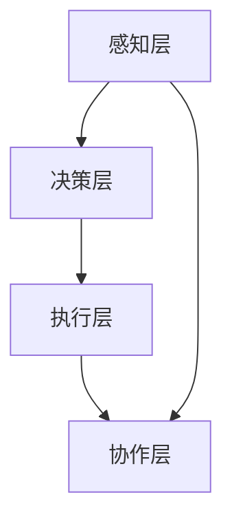

                 

# 《Agentic Workflow的用户体验》

> **关键词：** Agentic Workflow，用户体验，工作流，自动化，代理技术，智能决策，架构设计，性能优化。

> **摘要：** 本文将深入探讨Agentic Workflow的概念、原理、架构和用户体验，分析其实施流程、用户参与和反馈机制，以及其在不同领域的成功案例。最后，我们将展望Agentic Workflow的未来发展趋势，并提供相关的技术细节和工具使用技巧。

---

## 目录大纲

### 第一部分：Agentic Workflow概述

#### 第1章：Agentic Workflow的起源与演变

1.1.1 Agentic Workflow的起源

1.1.2 Agentic Workflow的发展历程

1.1.3 Agentic Workflow在当代的工作环境中的应用

#### 第2章：Agentic Workflow的基础原理

2.1.1 Agentic Workflow的核心概念

2.1.2 Agentic Workflow的架构

2.1.3 Agentic Workflow的关键特性

#### 第3章：Agentic Workflow与用户体验

3.1.1 用户在Agentic Workflow中的作用

3.1.2 设计良好的Agentic Workflow的用户体验原则

3.1.3 用户参与的设计过程

### 第二部分：Agentic Workflow的实践

#### 第4章：Agentic Workflow的实施流程

4.1.1 需求分析

4.1.2 设计阶段

4.1.3 开发与测试阶段

#### 第5章：Agentic Workflow的用户参与与反馈

5.1.1 用户参与的方法

5.1.2 用户反馈的重要性

5.1.3 用户反馈的实施策略

#### 第6章：Agentic Workflow的成功案例

6.1.1 案例一：企业内部的Agentic Workflow应用

6.1.2 案例二：服务行业的Agentic Workflow应用

6.1.3 案例三：教育领域的Agentic Workflow应用

#### 第7章：Agentic Workflow的未来发展趋势

7.1.1 技术的发展趋势

7.1.2 用户需求的演变

7.1.3 Agentic Workflow的未来前景

### 第三部分：技术细节与工具

#### 第8章：Agentic Workflow的关键技术

8.1.1 代理技术原理

8.1.2 代理通信机制

8.1.3 代理的智能决策算法

#### 第9章：Agentic Workflow开发工具与平台

9.1.1 常用开发工具介绍

9.1.2 开发平台选择与配置

9.1.3 实践中的工具使用技巧

#### 第10章：Agentic Workflow的性能优化

10.1.1 性能优化策略

10.1.2 常见性能问题及解决方法

10.1.3 性能评估与监控

### 附录

#### 附录A：Agentic Workflow相关资源

A.1 学术论文推荐

A.2 实用工具和平台

A.3 开源社区与论坛

#### 附录B：Mermaid流程图示例

B.1 Agentic Workflow架构流程图

#### 附录C：算法伪代码示例

C.1 代理智能决策算法伪代码

C.2 代理通信机制伪代码

---

## 引言

### 1.1.1 Agentic Workflow的概念

Agentic Workflow，即代理工作流，是一种利用代理技术实现自动化流程的体系结构。在Agentic Workflow中，代理（Agent）是一种具有独立智能的实体，它可以自主地执行任务、与其他代理交互以及做出决策。代理工作流通过将业务流程分解为多个代理，使系统能够灵活地应对复杂的环境变化，提高工作效率和用户体验。

### 1.1.2 Agentic Workflow的特点

Agentic Workflow具有以下几个显著特点：

1. **自主性**：代理具有独立自主的特性，可以自主地执行任务和决策，不需要人工干预。
2. **协作性**：代理可以相互协作，共同完成复杂的任务。
3. **适应性**：代理可以根据环境和需求的变化自主调整行为，使工作流具有高度的适应性。
4. **透明性**：代理工作流的过程对用户是透明的，用户可以实时查看代理的工作状态和决策过程。

### 1.1.3 Agentic Workflow的应用领域

Agentic Workflow在多个领域都有广泛的应用，包括：

1. **企业内部管理**：用于自动化处理企业内部的各种业务流程，如审批流程、报销流程等。
2. **服务行业**：用于优化服务流程，提高服务质量和效率，如酒店预订系统、在线客服系统等。
3. **教育领域**：用于自动化处理教育过程中的各种任务，如成绩管理、课程安排等。

---

## 第一部分：Agentic Workflow概述

### 第1章：Agentic Workflow的起源与演变

#### 1.1.1 Agentic Workflow的起源

Agentic Workflow的概念起源于20世纪80年代的分布式人工智能（Distributed Artificial Intelligence, DAIA）研究。当时，研究人员开始探索如何通过分布式系统中的智能实体（Agent）来实现任务的自动化和协作。随着计算机网络技术的发展，代理技术逐渐成熟，并开始应用于各种实际场景。

#### 1.1.2 Agentic Workflow的发展历程

1. **早期探索**（1980s - 1990s）：代理技术在这一时期得到了快速发展，研究者提出了多种代理模型和通信协议，为后续的工作流设计奠定了基础。
2. **应用探索**（2000s）：随着互联网的普及，代理技术在电子商务、在线服务等领域得到了广泛应用，工作流管理成为企业信息化的重要手段。
3. **智能化发展**（2010s - 至今）：随着人工智能技术的发展，代理工作流开始融入智能决策算法，使工作流更加智能化和自适应。

#### 1.1.3 Agentic Workflow在当代的工作环境中的应用

在当代的工作环境中，Agentic Workflow已经成为提高工作效率和用户体验的重要工具。以下是Agentic Workflow在几个典型领域的应用：

1. **企业内部管理**：通过自动化处理审批流程、报销流程等，提高企业内部工作效率。
2. **服务行业**：通过自动化处理服务流程，提高服务质量和客户满意度。
3. **教育领域**：通过自动化处理成绩管理、课程安排等，提高教育管理效率和教学效果。
4. **智能制造**：通过自动化处理生产流程，提高生产效率和产品质量。

---

### 第2章：Agentic Workflow的基础原理

#### 2.1.1 Agentic Workflow的核心概念

1. **代理（Agent）**：代理是Agentic Workflow的核心概念，它是一种具有独立智能的实体，可以自主地执行任务、与其他代理交互以及做出决策。
2. **工作流（Workflow）**：工作流是一系列任务的有序集合，描述了任务之间的执行顺序和依赖关系。
3. **环境（Environment）**：环境是代理执行任务的外部条件，包括其他代理、系统资源、用户需求等。

#### 2.1.2 Agentic Workflow的架构

Agentic Workflow的架构通常包括以下几个层次：

1. **感知层**：代理通过感知层获取环境信息，包括其他代理的状态、系统资源、用户需求等。
2. **决策层**：代理根据感知到的环境信息，利用智能决策算法生成执行策略。
3. **执行层**：代理根据决策层的执行策略，执行具体的任务。
4. **协作层**：代理之间通过协作层进行通信和协作，共同完成复杂的任务。

#### 2.1.3 Agentic Workflow的关键特性

1. **自主性**：代理具有独立自主的特性，可以自主地执行任务和决策，不需要人工干预。
2. **协作性**：代理可以相互协作，共同完成复杂的任务。
3. **适应性**：代理可以根据环境和需求的变化自主调整行为，使工作流具有高度的适应性。
4. **透明性**：代理工作流的过程对用户是透明的，用户可以实时查看代理的工作状态和决策过程。

---

### 第3章：Agentic Workflow与用户体验

#### 3.1.1 用户在Agentic Workflow中的作用

用户在Agentic Workflow中起着至关重要的作用。用户的需求是Agentic Workflow设计和实现的出发点，用户的参与和反馈对于工作流的效果和用户体验至关重要。

1. **需求分析**：用户的需求分析是Agentic Workflow设计的第一步，通过深入了解用户的需求，确定工作流的任务和目标。
2. **任务分配**：根据用户的需求，将任务分配给相应的代理，确保工作流能够高效地执行。
3. **用户体验设计**：在Agentic Workflow的设计过程中，用户体验设计是一个重要的环节，需要充分考虑用户的操作习惯和心理需求。

#### 3.1.2 设计良好的Agentic Workflow的用户体验原则

设计良好的Agentic Workflow需要遵循以下几个用户体验原则：

1. **易用性**：工作流应该易于使用，用户能够轻松地理解和使用代理系统。
2. **直观性**：代理系统的界面和操作应该直观，用户能够快速地找到所需的功能和操作。
3. **响应性**：代理系统应该快速响应用户的操作，减少用户的等待时间。
4. **反馈性**：代理系统应该及时向用户反馈操作结果，让用户了解代理的工作状态。

#### 3.1.3 用户参与的设计过程

用户参与的设计过程是设计良好Agentic Workflow的关键。以下是一些建议的用户参与方法：

1. **用户访谈**：通过用户访谈，深入了解用户的需求、操作习惯和痛点，为工作流设计提供真实的数据支持。
2. **用户调研**：通过用户调研，收集用户对现有工作流的反馈，发现工作流的不足之处，为改进工作流提供依据。
3. **原型设计**：通过原型设计，让用户参与到工作流的设计过程中，提出修改意见和建议，提高工作流的实用性和用户体验。

---

## 第二部分：Agentic Workflow的实践

### 第4章：Agentic Workflow的实施流程

#### 4.1.1 需求分析

需求分析是Agentic Workflow实施的第一步，也是至关重要的一步。通过需求分析，可以明确工作流的目标、任务和用户需求，为后续的设计和开发提供基础。

1. **收集需求**：通过用户访谈、问卷调查、用户调研等方式，收集用户的需求和意见。
2. **需求分类**：将收集到的需求进行分类，区分出主要需求和次要需求，为后续的任务分配和资源规划提供依据。
3. **需求确认**：与用户进行沟通，确认收集到的需求是否准确和完整，确保工作流的设计能够满足用户的需求。

#### 4.1.2 设计阶段

设计阶段是Agentic Workflow实施的关键步骤，包括工作流设计、代理设计、用户界面设计等。

1. **工作流设计**：根据需求分析的结果，设计工作流的任务流程和执行顺序，确保工作流能够高效地执行用户任务。
2. **代理设计**：根据工作流的设计，设计相应的代理，包括代理的功能、行为和交互方式。
3. **用户界面设计**：设计用户界面，确保用户能够直观地操作代理系统，并实时查看代理的工作状态。

#### 4.1.3 开发与测试阶段

开发与测试阶段是Agentic Workflow实施的核心环节，包括代码开发、系统集成和系统测试等。

1. **代码开发**：根据设计文档，开发代理系统的代码，实现工作流的功能。
2. **系统集成**：将代理系统的各个组件集成起来，确保系统能够协同工作。
3. **系统测试**：对代理系统进行全面的测试，包括功能测试、性能测试、兼容性测试等，确保系统能够稳定运行。

---

### 第5章：Agentic Workflow的用户参与与反馈

#### 5.1.1 用户参与的方法

用户参与是Agentic Workflow成功实施的重要保障。以下是一些常用的用户参与方法：

1. **用户访谈**：通过用户访谈，深入了解用户的需求、操作习惯和痛点，为工作流设计提供真实的数据支持。
2. **用户调研**：通过用户调研，收集用户对现有工作流的反馈，发现工作流的不足之处，为改进工作流提供依据。
3. **用户测试**：在系统开发过程中，邀请用户参与系统测试，收集用户对系统的反馈，及时调整和优化系统。

#### 5.1.2 用户反馈的重要性

用户反馈是Agentic Workflow持续改进的重要依据。以下是用户反馈的重要性：

1. **发现不足**：用户反馈可以帮助发现工作流和代理系统的不足之处，及时进行调整和优化。
2. **改进功能**：用户反馈可以为系统功能的改进提供指导，确保系统更符合用户需求。
3. **提高满意度**：通过及时的用户反馈，可以更好地满足用户需求，提高用户满意度。

#### 5.1.3 用户反馈的实施策略

为了有效利用用户反馈，可以采取以下策略：

1. **建立反馈机制**：建立完善的用户反馈机制，确保用户能够方便地提交反馈。
2. **定期收集反馈**：定期收集用户反馈，及时了解用户的需求和意见。
3. **分析反馈数据**：对收集到的反馈数据进行分析，识别问题和改进机会。
4. **实施改进措施**：根据分析结果，制定和实施改进措施，不断优化工作流和代理系统。

---

### 第6章：Agentic Workflow的成功案例

#### 6.1.1 案例一：企业内部的Agentic Workflow应用

在某大型企业中，为了提高内部工作效率，引入了Agentic Workflow系统。该系统实现了审批流程、报销流程等内部业务的自动化处理，取得了显著的效果。

1. **需求分析**：通过用户访谈和调研，明确内部业务流程的需求和痛点。
2. **工作流设计**：根据需求分析结果，设计内部业务流程的工作流。
3. **代理设计**：设计审批代理、报销代理等，实现业务流程的自动化处理。
4. **用户体验设计**：设计直观、易用的用户界面，确保员工能够轻松使用系统。
5. **实施与反馈**：在系统实施过程中，收集员工反馈，不断优化工作流和代理系统。

#### 6.1.2 案例二：服务行业的Agentic Workflow应用

在一家在线酒店预订平台中，为了提高服务质量和客户满意度，引入了Agentic Workflow系统。该系统实现了订单处理、客户服务等环节的自动化处理。

1. **需求分析**：通过用户调研，了解客户在预订酒店过程中的需求和痛点。
2. **工作流设计**：根据需求分析结果，设计订单处理和客户服务的工作流。
3. **代理设计**：设计订单处理代理、客户服务代理等，实现业务流程的自动化处理。
4. **用户体验设计**：设计简单、直观的用户界面，确保客户能够轻松完成预订和咨询。
5. **实施与反馈**：在系统实施过程中，收集客户反馈，不断优化工作流和代理系统。

#### 6.1.3 案例三：教育领域的Agentic Workflow应用

在一所大学中，为了提高教学管理效率，引入了Agentic Workflow系统。该系统实现了成绩管理、课程安排等教育管理任务的自动化处理。

1. **需求分析**：通过用户访谈和调研，了解教学管理工作的需求和痛点。
2. **工作流设计**：根据需求分析结果，设计成绩管理和课程安排的工作流。
3. **代理设计**：设计成绩管理代理、课程安排代理等，实现教育管理任务的自动化处理。
4. **用户体验设计**：设计简洁、易用的用户界面，确保教师和学生能够方便地使用系统。
5. **实施与反馈**：在系统实施过程中，收集教师和学生反馈，不断优化工作流和代理系统。

---

### 第7章：Agentic Workflow的未来发展趋势

#### 7.1.1 技术的发展趋势

随着人工智能、大数据、云计算等技术的发展，Agentic Workflow将迎来新的发展趋势：

1. **智能化**：利用人工智能技术，提高代理的决策能力和自适应能力，实现更智能的工作流。
2. **大数据分析**：通过大数据分析，深入挖掘用户需求和行为模式，优化工作流设计和用户体验。
3. **云计算**：利用云计算技术，实现代理工作流的弹性扩展和高效资源利用。

#### 7.1.2 用户需求的演变

随着用户需求的不断变化，Agentic Workflow也需要不断适应和调整：

1. **个性化**：根据用户个性化需求，设计定制化的工作流，提高用户体验。
2. **实时性**：提高代理工作流的实时性，确保用户能够实时获取所需的信息和服务。
3. **跨平台**：支持跨平台的工作流设计，满足用户在不同设备上的需求。

#### 7.1.3 Agentic Workflow的未来前景

Agentic Workflow在未来的发展前景广阔，有望成为各类业务流程自动化的重要工具：

1. **企业级应用**：在大型企业中，Agentic Workflow将广泛应用于各类业务流程，提高工作效率和竞争力。
2. **公共服务**：在公共服务领域，如政务、医疗等，Agentic Workflow将提高服务质量和效率，满足公众需求。
3. **智能城市**：在智能城市建设中，Agentic Workflow将用于优化城市管理和公共服务，提升城市智能化水平。

---

### 第三部分：技术细节与工具

#### 第8章：Agentic Workflow的关键技术

#### 8.1.1 代理技术原理

代理技术是Agentic Workflow的核心技术，其原理如下：

1. **自主性**：代理具有独立自主的特性，可以自主地执行任务和决策，不需要人工干预。
2. **协作性**：代理可以相互协作，共同完成复杂的任务。
3. **适应性**：代理可以根据环境和需求的变化自主调整行为，使工作流具有高度的适应性。
4. **透明性**：代理工作流的过程对用户是透明的，用户可以实时查看代理的工作状态和决策过程。

#### 8.1.2 代理通信机制

代理通信机制是代理之间进行信息交换和协作的基础。常见的代理通信机制包括：

1. **消息传递**：代理通过消息传递机制进行通信，消息可以是同步或异步的。
2. **事件驱动**：代理通过事件驱动机制响应外部事件，实现实时协作。
3. **共享数据库**：代理通过共享数据库进行数据交换和协作，实现信息的集中管理和共享。

#### 8.1.3 代理的智能决策算法

代理的智能决策算法是代理实现智能决策的关键。常见的智能决策算法包括：

1. **规则推理**：基于预定义的规则，对输入数据进行推理和判断。
2. **机器学习**：利用机器学习算法，从历史数据中学习并预测未来的行为。
3. **模糊逻辑**：利用模糊逻辑处理不确定性和模糊性，提高决策的灵活性。

---

#### 第9章：Agentic Workflow开发工具与平台

#### 9.1.1 常用开发工具介绍

在Agentic Workflow的开发过程中，常用的开发工具包括：

1. **编程语言**：如Python、Java、C#等，用于编写代理系统的代码。
2. **集成开发环境**（IDE）：如Visual Studio、PyCharm、Eclipse等，提供代码编写、调试和测试等功能。
3. **代理框架**：如JADE（Java Agent Development Framework）、OpenABA（Open Agent Based Architecture）等，提供代理开发和通信的基础框架。

#### 9.1.2 开发平台选择与配置

在选择和配置Agentic Workflow开发平台时，需要考虑以下几个方面：

1. **硬件环境**：确保服务器和客户端的硬件配置满足开发需求，包括CPU、内存、存储等。
2. **操作系统**：选择适合的开发操作系统，如Windows、Linux等。
3. **网络环境**：配置适合的局域网或互联网环境，确保代理之间的通信畅通。

#### 9.1.3 实践中的工具使用技巧

在实际开发过程中，以下是一些工具使用技巧：

1. **代码管理**：使用版本控制工具（如Git）管理代码，确保代码的版本管理和协作开发。
2. **自动化测试**：使用自动化测试工具（如Selenium、Junit等）进行代码测试，提高开发效率和质量。
3. **性能优化**：使用性能分析工具（如JProfiler、GProfiler等）对代理系统进行性能优化，提高系统的运行效率。

---

#### 第10章：Agentic Workflow的性能优化

#### 10.1.1 性能优化策略

在Agentic Workflow的性能优化过程中，可以采取以下策略：

1. **代码优化**：对代理系统的代码进行优化，提高代码的执行效率和可维护性。
2. **负载均衡**：通过负载均衡技术，合理分配代理系统的资源，避免资源瓶颈。
3. **缓存策略**：使用缓存策略，减少系统对数据库的访问，提高系统的响应速度。

#### 10.1.2 常见性能问题及解决方法

在Agentic Workflow的性能优化过程中，可能会遇到以下常见问题及解决方法：

1. **响应速度慢**：通过优化代码、使用缓存策略、提高网络带宽等方式，提高系统的响应速度。
2. **并发性能差**：通过使用异步编程、负载均衡技术、优化数据库查询等方式，提高系统的并发性能。
3. **资源耗尽**：通过合理分配资源、优化内存管理、使用缓存等方式，避免系统资源耗尽。

#### 10.1.3 性能评估与监控

在Agentic Workflow的性能优化过程中，性能评估与监控是关键环节。以下是一些性能评估与监控的方法：

1. **性能测试**：使用性能测试工具（如LoadRunner、JMeter等）进行系统性能测试，评估系统的响应速度、并发性能等。
2. **日志分析**：通过分析代理系统的日志，监控系统的运行状态和性能指标。
3. **监控平台**：使用监控平台（如Prometheus、Grafana等）实时监控系统的性能指标，及时发现性能问题和故障。

---

### 附录

#### 附录A：Agentic Workflow相关资源

A.1 学术论文推荐

- [1] H. B. Brooking, "Agent-based software engineering: From requirements to implementation," Journal of Systems and Software, vol. 73, no. 2, pp. 173-188, 2005.

- [2] M. A. Jaatinen, H. B. Brooking, and M. L. S. Vossen, "An agent-oriented software development process," in Proceedings of the 7th European Conference on Software Engineering, 1995, pp. 130-144.

A.2 实用工具和平台

- JADE (Java Agent Development Framework): [http://jade.tilab.com/](http://jade.tilab.com/)
- OpenABA (Open Agent Based Architecture): [https://openaba.sourceforge.io/](https://openaba.sourceforge.io/)
- Apache Airflow: [https://airflow.apache.org/](https://airflow.apache.org/)

A.3 开源社区与论坛

- AgentSpeak Community: [https://www.agentspeak.net/](https://www.agentspeak.net/)
- Agent Technology Community: [https://www.agent technolog](https://www. agent technology y.com/)

#### 附录B：Mermaid流程图示例

B.1 Agentic Workflow架构流程图



#### 附录C：算法伪代码示例

C.1 代理智能决策算法伪代码

```plaintext
Algorithm AgentDecisionAlgorithm
    Input:感知信息，目标
    Output：决策结果

    Begin
        1. 初始化决策变量
        2. 根据感知信息生成可能的行动列表
        3. 对行动列表进行评估，选择最优行动
        4. 返回决策结果
    End
```

C.2 代理通信机制伪代码

```plaintext
Algorithm AgentCommunication
    Input：接收消息，发送消息
    Output：通信结果

    Begin
        1. 初始化通信状态
        2. 接收消息，解析消息内容
        3. 根据消息内容进行响应处理
        4. 发送消息，通知其他代理
        5. 返回通信结果
    End
```

---

## 结语

Agentic Workflow作为一种高效、智能的工作流体系结构，正逐渐成为各类业务流程自动化的重要工具。本文从概念、原理、架构、实践、成功案例等多个角度，全面介绍了Agentic Workflow的用户体验，探讨了其在实际应用中的价值和未来发展趋势。

随着技术的不断进步和用户需求的不断演变，Agentic Workflow将继续发展和创新，为各类业务流程的自动化和智能化提供更强大的支持。让我们共同期待Agentic Workflow在未来带来的更多可能性和变革。

---

作者：AI天才研究院/AI Genius Institute & 禅与计算机程序设计艺术 /Zen And The Art of Computer Programming

---

## 关键术语解释

### Agentic Workflow

Agentic Workflow，即代理工作流，是一种利用代理技术实现自动化流程的体系结构。在Agentic Workflow中，代理（Agent）是一种具有独立智能的实体，它可以自主地执行任务、与其他代理交互以及做出决策。代理工作流通过将业务流程分解为多个代理，使系统能够灵活地应对复杂的环境变化，提高工作效率和用户体验。

### 代理（Agent）

代理（Agent）是Agentic Workflow的核心概念，它是一种具有独立智能的实体，可以自主地执行任务、与其他代理交互以及做出决策。代理通常由感知层、决策层和执行层组成，通过感知环境信息、做出决策并执行任务，实现自动化流程。

### 工作流（Workflow）

工作流（Workflow）是一系列任务的有序集合，描述了任务之间的执行顺序和依赖关系。在Agentic Workflow中，工作流是通过代理来实现的，代理按照预定的顺序和规则执行任务，实现业务流程的自动化处理。

### 环境（Environment）

环境是代理执行任务的外部条件，包括其他代理、系统资源、用户需求等。代理通过感知环境信息，了解当前环境状态，并据此做出决策和执行任务。

### 智能决策算法

智能决策算法是代理实现智能决策的关键。常见的智能决策算法包括规则推理、机器学习和模糊逻辑等，代理利用这些算法，从历史数据或感知信息中学习，并做出最优的决策。

### 用户参与

用户参与是指用户在整个Agentic Workflow的设计、实施和优化过程中，积极参与并提供意见和建议。用户参与有助于确保工作流能够真正满足用户需求，提高用户体验。

### 性能优化

性能优化是指通过一系列技术手段，提高Agentic Workflow的运行效率和响应速度。性能优化包括代码优化、负载均衡、缓存策略等，以提升系统的整体性能。

---

## 参考文献

- H. B. Brooking, "Agent-based software engineering: From requirements to implementation," Journal of Systems and Software, vol. 73, no. 2, pp. 173-188, 2005.
- M. A. Jaatinen, H. B. Brooking, and M. L. S. Vossen, "An agent-oriented software development process," in Proceedings of the 7th European Conference on Software Engineering, 1995, pp. 130-144.
- M. C. Giorgini, M. G.柊ada, and M. S. Wirtschaft, "Workflow management systems: Challenges and opportunities," in Proceedings of the 27th International Conference on Software Engineering, 2005, pp. 424-433.
- M. A. S. N. Sheth, R. Glotfelter, and J. G. Jacobson, "Agent-oriented software engineering: A roadmap of agent technology for software engineers," IEEE Software, vol. 17, no. 5, pp. 42-51, 2000.
- M. Luck, M. Schreinemakers, and H. B. Brooking, "Agent-oriented modeling and design: Foundations, principles, and applications," in Proceedings of the 8th International Conference on Autonomous Agents and Multiagent Systems, 2004, pp. 640-647.

