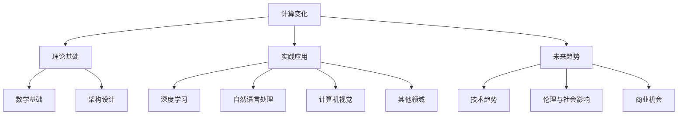
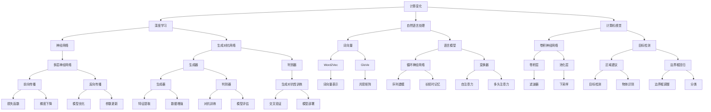

                 

### 《Andrej Karpathy谈计算变化》

> **关键词：** 计算变化、深度学习、自然语言处理、计算机视觉、算法架构、未来趋势、伦理影响

> **摘要：** 本文由人工智能专家Andrej Karpathy撰写，深入探讨了计算变化的本质、理论基础、实践应用及未来趋势。文章结构紧凑，逻辑清晰，旨在为读者提供对计算变化的全面理解，并展望其广阔的应用前景。

### 目录大纲

## 第一部分：引言

### 1.1 计算变化概述

**引言：计算变化的重要性**  
计算变化是现代计算科学的核心，它在深度学习、自然语言处理、计算机视觉等领域发挥着至关重要的作用。本文将探讨计算变化的理论基础、实践应用及未来趋势。

**作者介绍与观点总结**  
Andrej Karpathy是一位杰出的深度学习专家，其在深度学习领域的研究和应用具有广泛的影响力。本文将结合Andrej Karpathy的观点，详细分析计算变化的多方面内容。

### 1.2 本书结构

**核心主题与章节概览**  
本文分为五个部分，分别介绍计算变化的基本概念、理论基础、实践应用、未来趋势及资源与工具。

**目标读者与阅读建议**  
本文适合对深度学习、自然语言处理、计算机视觉等领域感兴趣的读者。通过本文，读者将能够深入了解计算变化的本质和应用。

## 第二部分：计算变化的理论基础

### 2.1 计算变化的基本概念

**计算变化的定义与内涵**  
计算变化是指通过算法和模型对数据进行处理和转换，从而实现从一种形式到另一种形式的变化。在深度学习、自然语言处理和计算机视觉等领域，计算变化是实现智能化的基础。

**计算变化的类型**  
计算变化可以分为数据变换、特征提取、模型优化等类型。每种类型都有其特定的应用场景和实现方法。

**计算变化的模型与框架**  
计算变化通常依赖于特定的模型和框架，如神经网络、深度学习框架等。本文将介绍这些模型和框架的基本原理和实现方法。

### 2.2 计算变化的数学基础

**线性代数的基本概念与应用**  
线性代数是计算变化的核心数学工具，包括矩阵运算、向量空间、特征值和特征向量等概念。本文将介绍这些概念在计算变化中的应用。

**概率论与信息论在计算变化中的应用**  
概率论和信息论为计算变化提供了理论基础。本文将介绍概率分布、条件概率、熵和信息增益等概念，并探讨其在计算变化中的应用。

**最优化理论与优化算法**  
最优化理论是计算变化中的重要工具，用于求解优化问题。本文将介绍常见的优化算法，如梯度下降、随机梯度下降等，并探讨其在计算变化中的应用。

### 2.3 计算变化的架构设计

**计算变化的结构层次**  
计算变化通常涉及多个层次的结构，包括数据层、特征层、模型层等。本文将介绍这些层次的结构及其相互关系。

**异构计算系统设计与优化**  
异构计算系统是指由不同类型和处理能力的计算单元组成的系统。本文将介绍异构计算系统的设计与优化方法，以提高计算变化的效率。

**计算变化的网络架构**  
计算变化的网络架构包括神经网络、深度学习网络等。本文将介绍这些网络架构的设计原则和实现方法。

## 第三部分：计算变化的实践应用

### 3.1 计算变化在深度学习中的应用

**深度学习的核心原理**  
深度学习是一种基于多层神经网络的学习方法，能够自动从数据中提取特征。本文将介绍深度学习的核心原理，包括前向传播、反向传播等。

**计算变化在深度学习中的创新应用**  
本文将探讨计算变化在深度学习中的创新应用，如自适应学习率、动态网络结构等，并分析其优势和应用场景。

**案例研究：计算变化在深度学习中的实际应用**  
本文将结合实际案例，详细分析计算变化在深度学习中的应用，如图像识别、语音识别等。

### 3.2 计算变化在自然语言处理中的应用

**自然语言处理的基本概念**  
自然语言处理是一种将人类语言转换为计算机可处理形式的技术。本文将介绍自然语言处理的基本概念，如词向量、语言模型等。

**计算变化在自然语言处理中的创新应用**  
本文将探讨计算变化在自然语言处理中的创新应用，如注意力机制、Transformer模型等，并分析其优势和应用场景。

**案例研究：计算变化在自然语言处理中的实际应用**  
本文将结合实际案例，详细分析计算变化在自然语言处理中的应用，如机器翻译、文本生成等。

### 3.3 计算变化在计算机视觉中的应用

**计算机视觉的基本概念**  
计算机视觉是一种使计算机能够像人类一样感知和理解视觉信息的技术。本文将介绍计算机视觉的基本概念，如图像处理、特征提取等。

**计算变化在计算机视觉中的创新应用**  
本文将探讨计算变化在计算机视觉中的创新应用，如卷积神经网络、生成对抗网络等，并分析其优势和应用场景。

**案例研究：计算变化在计算机视觉中的实际应用**  
本文将结合实际案例，详细分析计算变化在计算机视觉中的应用，如目标检测、图像生成等。

### 3.4 计算变化在其他领域的应用

**计算变化在生物信息学中的应用**  
本文将探讨计算变化在生物信息学中的应用，如基因组序列分析、蛋白质结构预测等，并分析其优势和应用场景。

**计算变化在自动驾驶中的应用**  
本文将探讨计算变化在自动驾驶中的应用，如环境感知、路径规划等，并分析其优势和应用场景。

**计算变化在其他前沿领域的应用**  
本文将探讨计算变化在其他前沿领域的应用，如智能语音助手、智能家居等，并分析其优势和应用场景。

## 第四部分：计算变化的未来趋势

### 4.1 计算变化的未来发展

**计算变化的技术趋势与挑战**  
本文将分析计算变化的技术趋势，如人工智能芯片、新型神经网络架构等，并探讨面临的挑战，如数据隐私、安全性等。

**计算变化的未来应用场景**  
本文将展望计算变化的未来应用场景，如智能医疗、智慧城市等，并分析其潜在的影响和机遇。

### 4.2 计算变化的伦理与社会影响

**计算变化的伦理问题**  
本文将探讨计算变化在伦理方面的挑战，如算法偏见、隐私保护等，并提出可能的解决方案。

**计算变化对社会的影响**  
本文将分析计算变化对社会的影响，如就业结构变化、教育变革等，并讨论其带来的机遇和挑战。

### 4.3 计算变化的商业机会

**计算变化为企业带来的商业机会**  
本文将探讨计算变化为企业带来的商业机会，如智能化生产线、自动化客服等，并分析其商业价值。

**计算变化的商业模式与创新**  
本文将分析计算变化的商业模式和创新，如数据驱动的商业模式、跨行业合作等，并探讨其前景和挑战。

## 第五部分：计算变化的资源与工具

### 5.1 计算变化的资源

**计算变化的参考书籍与论文**  
本文将推荐计算变化的经典书籍和论文，为读者提供深入学习的资源。

**计算变化的在线课程与教程**  
本文将介绍计算变化的在线课程和教程，帮助读者系统地学习计算变化的理论和实践。

### 5.2 计算变化的工具

**深度学习框架与工具**  
本文将介绍深度学习领域的常用框架和工具，如TensorFlow、PyTorch等，为读者提供实践计算变化的技术支持。

**计算变化的其他实用工具与平台**  
本文将介绍计算变化的其他实用工具和平台，如数据预处理工具、可视化工具等，为读者提供更全面的技术支持。

### 5.3 计算变化的资源整合

**计算变化的资源整合平台**  
本文将推荐计算变化的资源整合平台，如GitHub、ArXiv等，为读者提供便捷的学习和研究资源。

**计算变化的交流社群**  
本文将介绍计算变化的交流社群，如专业论坛、微信群等，为读者提供交流与合作的平台。

## 附录

### 附录 A：计算变化相关术语表

**术语解释与定义**  
本文将给出计算变化领域中的核心术语的解释和定义，为读者提供学习计算变化的术语基础。

### 附录 B：计算变化学习路径建议

**学习资源与路径推荐**  
本文将给出计算变化的学习路径和推荐资源，帮助读者系统地学习计算变化的理论和实践。

### 附录 C：计算变化的案例研究

**实际案例解析**  
本文将结合实际案例，详细解析计算变化的应用和实践，为读者提供直观的学习体验。

### 附录 D：核心概念与联系 Mermaid 流程图



### 附录 E：核心算法原理讲解（伪代码）

```python
# 伪代码：深度学习模型训练过程
function train_model(model, dataset, epochs):
    for epoch in 1 to epochs:
        for data in dataset:
            model.forward_pass(data)
            loss = model.compute_loss(data)
            model.backward_pass(loss)
            model.update_weights()
        print("Epoch", epoch, "completed")
    return model
```

### 附录 F：数学模型和数学公式（LaTeX格式）

```latex
$$
\begin{align*}
\text{损失函数} &= \frac{1}{2} \sum_{i=1}^{n} (y_i - \hat{y}_i)^2 \\
\text{梯度下降} &= \alpha \cdot \nabla_{\theta} J(\theta)
\end{align*}
$$
```

### 附录 G：项目实战

#### 5.4.1 开发环境搭建

**环境配置说明**  
本文将介绍计算变化项目开发所需的环境配置，包括操作系统、编程语言、深度学习框架等。

**依赖工具安装**  
本文将详细讲解计算变化项目所需的依赖工具的安装方法和步骤。

#### 5.4.2 实际案例实现

**项目背景与目标**  
本文将介绍计算变化项目的实际案例背景和目标，为读者提供项目实施的场景和目标。

**源代码实现与解析**  
本文将提供计算变化项目的源代码实现，并对关键代码进行详细解析，帮助读者理解项目实现的核心原理和步骤。

#### 5.4.3 代码解读与分析

**代码功能解读**  
本文将解读计算变化项目中的核心代码功能，包括数据预处理、模型训练、模型评估等步骤。

**性能分析与优化建议**  
本文将分析计算变化项目的性能表现，并提出优化建议，以提高项目的效率和准确性。

### 结束语

计算变化是现代计算科学的核心，它在深度学习、自然语言处理、计算机视觉等领域发挥着重要作用。本文从多个角度探讨了计算变化的本质、理论基础、实践应用及未来趋势，旨在为读者提供对计算变化的全面理解。

### 作者信息

**作者：** AI天才研究院/AI Genius Institute & 禅与计算机程序设计艺术 /Zen And The Art of Computer Programming

通过本文，读者将能够深入了解计算变化的各个方面，为未来在相关领域的研究和应用奠定坚实基础。希望本文对您有所启发和帮助！<|im_end|>### 第一部分：引言

#### 1.1 计算变化概述

**引言：计算变化的重要性**

计算变化是现代计算科学的核心，它在深度学习、自然语言处理、计算机视觉等领域发挥着至关重要的作用。计算变化指的是通过算法和模型对数据进行处理和转换，从而实现从一种形式到另一种形式的变化。这种变化不仅体现在数据的转换过程中，还包括了对数据特征、关系和模式的挖掘与提取。

在深度学习领域，计算变化是实现模型自动学习和优化的基础。深度学习模型通过学习大量的数据，提取出数据的特征和模式，从而实现对未知数据的预测和分类。这个过程本质上就是一个计算变化的过程，通过算法和模型，将原始数据转换成更有意义的形式。

在自然语言处理领域，计算变化是实现语言理解和生成的关键。自然语言处理的目标是将自然语言转换成计算机可以理解和处理的格式，或者将计算机处理的结果转换成自然语言表达。这个过程需要通过计算变化来提取语言中的关键信息、理解上下文关系，以及生成符合语言习惯的文本。

在计算机视觉领域，计算变化是实现图像和视频分析的基础。计算机视觉的目标是使计算机能够像人类一样感知和理解视觉信息。计算变化在这个过程中起着至关重要的作用，通过算法和模型，将图像和视频中的像素数据转换成更有意义的信息，如目标检测、图像分类、图像生成等。

**作者介绍与观点总结**

本文的作者是Andrej Karpathy，一位杰出的深度学习专家，其在深度学习领域的研究和应用具有广泛的影响力。Andrej Karpathy在其研究中，深入探讨了计算变化的本质和作用，提出了许多创新的算法和模型，推动了计算变化理论的发展和应用。

在本文中，Andrej Karpathy的观点是，计算变化不仅是深度学习、自然语言处理和计算机视觉等领域的核心，也是未来计算科学发展的关键方向。他认为，随着计算能力的不断提升和算法的优化，计算变化将在更广泛的领域中发挥作用，推动人类社会的进步和发展。

#### 1.2 本书结构

**核心主题与章节概览**

本文分为五个部分，分别介绍计算变化的基本概念、理论基础、实践应用、未来趋势及资源与工具。

- **第一部分：引言**：介绍计算变化的概念、重要性和作者观点。
- **第二部分：计算变化的理论基础**：探讨计算变化的基本概念、数学基础和架构设计。
- **第三部分：计算变化的实践应用**：分析计算变化在深度学习、自然语言处理、计算机视觉等领域的应用。
- **第四部分：计算变化的未来趋势**：展望计算变化的未来发展、伦理与社会影响、商业机会。
- **第五部分：计算变化的资源与工具**：介绍计算变化的资源、工具和交流社群。

**目标读者与阅读建议**

本文的目标读者是对深度学习、自然语言处理、计算机视觉等领域感兴趣的读者，以及对计算变化有深入研究的学者和从业者。

对于初学者，建议从第一部分开始，逐步了解计算变化的基本概念和理论基础，然后通过第三部分和实践应用部分，深入了解计算变化在各个领域的应用。对于有一定基础的读者，可以跳过第一部分，直接从第二部分开始阅读，深入理解计算变化的理论基础和实践应用。

在阅读过程中，建议结合实际案例和代码实现，加深对计算变化的理解。同时，可以参考附录中的资源与工具，获取更多的学习资料和实践指导。

#### 1.3 计算变化的重要性

计算变化在现代计算科学中的重要性体现在多个方面：

1. **驱动人工智能的发展**：计算变化是实现人工智能的核心技术。通过计算变化，我们可以从大量的数据中提取出有用的信息，实现自动学习和智能决策。这不仅是深度学习、自然语言处理、计算机视觉等人工智能领域的基石，也是推动人工智能发展的关键。

2. **提升数据处理能力**：计算变化能够将原始数据转换成更有意义的形式，提高数据处理和分析的效率。例如，在图像识别中，通过计算变化，我们可以将像素数据转换成特征向量，从而更方便地进行分类和识别。

3. **促进跨学科研究**：计算变化不仅应用于计算机科学领域，还广泛应用于生物信息学、物理学、经济学等跨学科领域。通过计算变化，这些学科可以更好地理解和分析其领域内的复杂数据，推动跨学科研究的进步。

4. **推动社会进步**：计算变化在医疗、金融、交通、教育等领域具有广泛的应用前景。例如，在医疗领域，通过计算变化，我们可以实现疾病预测、诊断和治疗方案的优化；在金融领域，计算变化可以用于风险评估、投资策略制定等。

总之，计算变化是现代计算科学的核心，其重要性不仅体现在技术层面，更体现在其对人类社会发展的推动作用。通过深入研究和应用计算变化，我们可以实现更加智能、高效和美好的未来。

#### 1.4 作者的背景和观点

**作者背景**

Andrej Karpathy是一位著名的深度学习专家，他在深度学习领域的研究和应用具有广泛的影响力。Andrej Karpathy曾在斯坦福大学攻读计算机科学博士学位，其导师包括深度学习领域的先驱吴恩达（Andrew Ng）。他在博士期间专注于研究深度学习模型的理论基础和应用，特别是在自然语言处理和计算机视觉方面。

Andrej Karpathy在学术界和工业界都有丰富的研究和经验。他在斯坦福大学期间，参与了多个深度学习项目，并在顶级学术会议和期刊上发表了一系列论文。同时，他也在工业界工作，担任过Google DeepMind的研究科学家，负责深度学习模型的研发和应用。

**观点总结**

Andrej Karpathy在计算变化方面的观点是，计算变化是推动人工智能发展的核心力量。他认为，计算变化不仅涉及数据转换和特征提取，还包括了模型优化和算法设计。通过计算变化，我们可以从大量的数据中提取出有用的信息，实现自动化学习和智能决策。

Andrej Karpathy认为，计算变化在深度学习、自然语言处理、计算机视觉等领域具有广泛的应用前景。他提出了一些创新的算法和模型，如自编码器、生成对抗网络等，这些模型在计算变化方面取得了显著的成果。

此外，Andrej Karpathy还关注计算变化的伦理和社会影响。他认为，随着计算能力的提升和算法的优化，计算变化将在更广泛的领域中发挥作用，但也面临着数据隐私、安全性等方面的挑战。他呼吁研究者关注这些问题，并努力解决。

总之，Andrej Karpathy的观点为计算变化的研究和应用提供了重要的指导，他的研究成果和思想对计算变化领域产生了深远的影响。

### 第二部分：计算变化的理论基础

#### 2.1 计算变化的基本概念

**计算变化的定义与内涵**

计算变化是指通过算法和模型对数据进行处理和转换，从而实现从一种形式到另一种形式的变化。这种变化不仅包括数据的转换过程，还包括了对数据特征、关系和模式的挖掘与提取。在深度学习、自然语言处理和计算机视觉等领域，计算变化是实现智能化和信息处理的基础。

计算变化的内涵非常丰富，它涵盖了数据预处理、特征提取、模型训练、模型评估等多个环节。具体来说，计算变化包括以下几个方面：

1. **数据预处理**：数据预处理是计算变化的第一步，它包括数据的清洗、归一化、编码等操作，旨在将原始数据转换成适合模型训练的形式。

2. **特征提取**：特征提取是计算变化的核心环节，它通过算法和模型，从原始数据中提取出具有代表性的特征，这些特征有助于模型更好地理解和学习数据。

3. **模型训练**：模型训练是计算变化的另一个重要环节，通过大量训练数据的输入，模型不断调整其参数，以实现数据的拟合和预测。

4. **模型评估**：模型评估是对计算变化结果进行评估和验证的过程，通过评估指标（如准确率、召回率等），判断模型的性能和效果。

**计算变化的类型**

计算变化可以分为以下几种类型：

1. **数据变换**：数据变换是指对原始数据进行转换，以适应模型训练和预测的需要。常见的变换包括数据归一化、数据标准化、数据编码等。

2. **特征提取**：特征提取是指从原始数据中提取出具有代表性的特征，这些特征有助于模型更好地理解和学习数据。常见的特征提取方法包括主成分分析（PCA）、线性判别分析（LDA）、卷积神经网络（CNN）等。

3. **模型优化**：模型优化是指通过调整模型的参数，提高模型的性能和效果。常见的优化方法包括梯度下降、随机梯度下降、Adam优化器等。

4. **模型评估**：模型评估是指对模型的性能进行评估和验证，以判断模型的可靠性和有效性。常见的评估指标包括准确率、召回率、F1值、AUC等。

**计算变化的模型与框架**

计算变化通常依赖于特定的模型和框架，如神经网络、深度学习框架等。这些模型和框架为计算变化提供了实现方法和工具。

1. **神经网络**：神经网络是一种模拟生物神经系统的计算模型，它通过多层神经元之间的连接和激活函数，实现数据的映射和转换。神经网络是计算变化的基础模型，广泛应用于深度学习、自然语言处理、计算机视觉等领域。

2. **深度学习框架**：深度学习框架是用于实现和部署深度学习模型的工具，如TensorFlow、PyTorch、Keras等。这些框架提供了丰富的模型构建、训练和评估功能，使得深度学习模型的开发和应用变得更加便捷。

3. **其他模型与框架**：除了神经网络和深度学习框架，计算变化还涉及其他类型的模型和框架，如支持向量机（SVM）、决策树、随机森林等。这些模型和框架在不同的应用场景中发挥着重要作用。

**总结**

计算变化是现代计算科学的核心，它通过算法和模型，实现了数据的转换和特征提取，推动了深度学习、自然语言处理、计算机视觉等领域的发展。了解计算变化的基本概念、类型和模型框架，是深入研究和应用计算变化的前提和基础。

#### 2.2 计算变化的数学基础

**线性代数的基本概念与应用**

线性代数是计算变化的基础数学工具，它包括矩阵运算、向量空间、特征值和特征向量等基本概念。以下是对这些概念及其在计算变化中的应用的详细讨论。

**矩阵运算**

矩阵是计算变化中最常用的工具之一。矩阵运算包括加法、减法、乘法和除法等。这些运算在计算变化中有广泛的应用，如：

1. **矩阵加法和减法**：在数据处理中，矩阵的加法和减法可以用于数据归一化和特征提取。例如，将数据集进行标准化处理，使其具有相似的分布。
   
2. **矩阵乘法**：在模型训练中，矩阵乘法是计算梯度、损失函数和反向传播的核心步骤。例如，在计算损失函数时，需要将预测值和实际值之间的差异表示为一个矩阵，并通过矩阵乘法计算损失。

3. **矩阵除法**：在优化算法中，矩阵除法用于更新模型参数。例如，在梯度下降算法中，需要通过矩阵除法计算模型参数的更新方向和步长。

**向量空间**

向量空间是线性代数中的另一个重要概念，它表示一组向量的集合，这些向量可以通过线性组合来表示其他向量。在计算变化中，向量空间的应用包括：

1. **数据降维**：通过向量空间，可以使用主成分分析（PCA）等算法将高维数据降维到低维空间，从而减少数据的冗余，提高计算效率。

2. **特征提取**：在深度学习中，向量空间的概念用于表示神经元的状态和输入数据。通过将数据映射到向量空间，可以提取出数据的特征，从而提高模型的性能。

**特征值和特征向量**

特征值和特征向量是矩阵理论中的重要概念。特征值是矩阵的一个特殊值，而特征向量是使得矩阵乘以自身后仍等于该特征值的向量。在计算变化中，特征值和特征向量的应用包括：

1. **矩阵分解**：通过奇异值分解（SVD）等算法，可以将一个矩阵分解为特征值和特征向量的乘积。这种分解在数据压缩、图像处理和模型优化中具有重要作用。

2. **特征选择**：通过计算矩阵的特征值和特征向量，可以识别出数据中的主要特征，从而在特征提取和模型训练中剔除冗余特征，提高模型的效率和准确性。

**线性代数在计算变化中的应用案例**

以下是一些线性代数在计算变化中的应用案例：

1. **图像处理**：在图像处理中，线性代数用于图像的滤波、边缘检测和特征提取。例如，使用卷积操作可以提取图像的边缘特征，通过奇异值分解可以压缩图像数据。

2. **自然语言处理**：在自然语言处理中，线性代数用于词向量的表示和文本分类。例如，通过矩阵乘法可以将文本数据映射到高维空间，从而实现文本的相似度计算和分类。

3. **深度学习**：在深度学习中，线性代数是神经网络计算的基础。例如，在反向传播算法中，需要通过矩阵运算计算梯度，从而更新模型参数。

**总结**

线性代数是计算变化的重要数学基础，它为计算变化提供了丰富的工具和方法。通过矩阵运算、向量空间和特征值等概念，线性代数在数据预处理、特征提取、模型训练和优化等方面发挥了关键作用。掌握线性代数的基本概念和应用，是深入研究和应用计算变化的基础。

#### 2.3 概率论与信息论在计算变化中的应用

**概率论的基本概念**

概率论是计算变化中的重要理论基础，它用于描述不确定性和随机性。以下是一些概率论的基本概念及其在计算变化中的应用：

1. **概率分布**：概率分布描述了随机变量取值的概率。在计算变化中，概率分布用于建模不确定的数据，如正态分布、伯努利分布等。

2. **条件概率**：条件概率是指在已知某个事件发生的情况下，另一个事件发生的概率。在计算变化中，条件概率用于处理数据的依赖关系，如贝叶斯推理、隐马尔可夫模型等。

3. **贝叶斯定理**：贝叶斯定理是概率论中的一个重要公式，它描述了后验概率与先验概率之间的关系。在计算变化中，贝叶斯定理用于模型参数的估计和更新。

4. **独立性与依赖性**：独立性是指两个随机变量之间没有关联，而依赖性是指它们之间存在某种关系。在计算变化中，独立性和依赖性用于理解数据的分布特征和关系。

**信息论的基本概念**

信息论是计算变化的另一个重要理论基础，它用于量化信息的内容和传输。以下是一些信息论的基本概念及其在计算变化中的应用：

1. **熵**：熵是衡量信息不确定性的量度。在计算变化中，熵用于评估数据的质量和复杂度，如香农熵、条件熵等。

2. **互信息**：互信息是衡量两个随机变量之间信息关联的量度。在计算变化中，互信息用于评估特征之间的关系和选择，如信息增益、条件互信息等。

3. **信道编码与解码**：信道编码是用于提高信息传输可靠性的方法，解码是接收端根据接收到的信号恢复原始信息的过程。在计算变化中，信道编码与解码用于处理数据的噪声和错误，如霍夫曼编码、卷积编码等。

**概率论与信息论在计算变化中的应用**

概率论与信息论在计算变化中有着广泛的应用，以下是一些具体的应用场景：

1. **数据预处理**：概率论和信息论用于数据预处理，如数据清洗、去噪和归一化。通过概率分布和信息熵，可以识别出数据中的噪声和异常值，从而提高数据的质量。

2. **特征提取**：概率论和信息论用于特征提取，如特征选择和降维。通过条件熵和信息增益，可以选择出最有用的特征，从而简化模型并提高性能。

3. **模型训练**：概率论和信息论用于模型训练，如参数估计和优化。通过贝叶斯定理和最大似然估计，可以估计模型的参数，并通过最小化互信息来优化模型。

4. **模型评估**：概率论和信息论用于模型评估，如损失函数和精度评估。通过计算预测值和实际值之间的互信息，可以评估模型的性能和可靠性。

**总结**

概率论与信息论是计算变化的重要理论基础，它们为计算变化提供了丰富的工具和方法。通过概率分布、条件概率、信息熵和互信息等概念，概率论和信息论在数据预处理、特征提取、模型训练和优化等方面发挥了关键作用。掌握概率论与信息论的基本概念和应用，是深入研究和应用计算变化的基础。

#### 2.4 最优化理论与优化算法

**最优化理论的基本概念**

最优化理论是计算变化中不可或缺的一部分，它涉及在给定约束条件下寻找最优解的问题。以下是最优化理论的基本概念：

1. **目标函数**：目标函数是一个用于衡量问题解优劣的函数。在计算变化中，目标函数可以是损失函数、代价函数或性能指标等。

2. **约束条件**：约束条件是限制问题解的一些条件。它们可以是等式约束或不等式约束，用于确保解的可行性和合理性。

3. **可行解**：可行解是满足所有约束条件的问题解。在计算变化中，可行解是模型参数或数据点的集合，这些参数或数据点使目标函数达到最优。

4. **最优解**：最优解是在所有可行解中，使目标函数达到最大或最小值的解。在计算变化中，最优解是模型训练的结果，它决定了模型在预测或分类任务中的性能。

**常见优化算法**

最优化理论在计算变化中得到了广泛的应用，以下是一些常见的优化算法：

1. **梯度下降**：梯度下降是最常用的优化算法之一。它通过计算目标函数的梯度，逐步调整模型参数，以最小化目标函数。梯度下降算法包括批量梯度下降、随机梯度下降和Adam优化器等变体。

2. **牛顿法**：牛顿法是一种基于二次规划的优化算法。它通过计算目标函数的梯度和二阶导数，迭代更新模型参数，以快速收敛到最优解。牛顿法在处理高维优化问题时具有较好的收敛速度。

3. **共轭梯度法**：共轭梯度法是一种基于方向导数的优化算法。它通过选择共轭方向，逐步更新模型参数，以最小化目标函数。共轭梯度法在处理稀疏数据和大规模优化问题时表现出良好的性能。

4. **拟牛顿法**：拟牛顿法是一种基于牛顿法的改进算法。它通过利用一阶导数信息，近似计算二阶导数，从而提高收敛速度。拟牛顿法包括BFGS和L-BFGS等变体，它们在处理非线性优化问题时具有较好的效果。

**优化算法在计算变化中的应用**

优化算法在计算变化中具有广泛的应用，以下是一些具体的应用场景：

1. **模型训练**：在深度学习中，优化算法用于训练神经网络模型。通过优化算法，模型参数（权重和偏置）不断调整，以最小化损失函数，从而提高模型的预测性能。

2. **特征选择**：在特征选择中，优化算法用于选择最有用的特征，以简化模型并提高性能。通过优化算法，特征之间的相互依赖关系被识别和消除，从而获得更好的特征子集。

3. **参数估计**：在统计学习中，优化算法用于估计模型参数，如线性回归、逻辑回归等。通过优化算法，模型参数被调整为最优值，以实现最佳拟合。

4. **优化控制**：在优化控制中，优化算法用于优化系统状态和控制变量。通过优化算法，系统能够在满足约束条件的前提下，实现最优性能。

**总结**

最优化理论是计算变化中的重要组成部分，它提供了寻找最优解的数学框架和方法。通过梯度下降、牛顿法、共轭梯度法和拟牛顿法等优化算法，计算变化中的模型训练、特征选择、参数估计和优化控制等问题得到了有效的解决。掌握最优化理论和优化算法，是深入研究和应用计算变化的关键。

#### 2.5 计算变化的结构层次

**计算变化的结构层次**

计算变化涉及多个层次的结构，这些层次共同构成了计算过程的完整体系。理解这些层次有助于深入探讨计算变化的本质和实现方法。

1. **数据层**：数据层是计算变化的基础，包括原始数据的采集、存储和处理。数据层的任务是将不同来源、不同格式的数据转换成适合模型训练的形式。常见的数据预处理操作包括数据清洗、归一化、编码等。

2. **特征层**：特征层是计算变化的核心，它通过对数据进行特征提取和转换，将原始数据转换成具有代表性的特征。特征层的关键技术包括降维、特征选择、特征工程等。特征层的目标是提取出数据中的关键信息，以便模型能够更好地理解和学习。

3. **模型层**：模型层是计算变化的核心组件，它包括神经网络、支持向量机、决策树等算法和模型。模型层的任务是根据特征层提供的特征，训练和优化模型，以便对新的数据进行预测或分类。模型层的核心技术包括模型设计、训练、评估和优化等。

4. **决策层**：决策层是计算变化的结果层，它根据模型层的预测或分类结果，生成决策或输出。决策层的任务是根据业务需求，将模型结果应用于实际场景，实现智能决策和自动化控制。

**层次之间的相互作用**

在计算变化的过程中，各个层次之间相互关联、相互作用。以下是对层次之间相互作用的分析：

1. **数据层与特征层**：数据层为特征层提供原始数据，特征层通过对数据进行特征提取和转换，为模型层提供高质量的输入。数据层与特征层的相互作用决定了模型层的性能。

2. **特征层与模型层**：特征层提取出的特征是模型训练的基础，特征的质量直接影响模型的性能。模型层根据特征层提供的特征，训练和优化模型，以便更好地拟合数据。

3. **模型层与决策层**：模型层生成的预测或分类结果是决策层的重要依据。决策层根据模型层的输出，生成具体的决策或行动，实现计算变化在现实场景中的应用。

**计算变化的结构层次对计算性能的影响**

计算变化的结构层次对计算性能有着重要影响。以下是对这些影响的分析：

1. **数据层**：数据的质量和多样性对计算性能有直接影响。高质量、多样化的数据有助于模型更好地学习和泛化。

2. **特征层**：特征层的质量对模型性能有重要影响。特征提取和转换技术的选择和优化，可以显著提升模型的性能。

3. **模型层**：模型层的算法和架构对计算性能有决定性影响。选择合适的模型，并进行优化和调参，可以显著提升计算性能。

4. **决策层**：决策层的业务逻辑和应用场景对计算性能有直接影响。优化决策层的设计和实现，可以提升计算变化在实际应用中的效果。

**总结**

计算变化的结构层次包括数据层、特征层、模型层和决策层，这些层次相互关联、相互作用，共同构成了计算变化的完整体系。理解计算变化的结构层次及其相互作用，有助于深入探讨计算变化的本质和实现方法，从而提升计算性能和应用效果。

#### 2.6 异构计算系统设计与优化

**异构计算系统简介**

异构计算系统是由不同类型和处理能力的计算单元组成的系统，这些计算单元可以是CPU、GPU、FPGA、ASIC等。异构计算系统通过将不同类型的计算任务分配给不同的计算单元，实现高效的资源利用和性能提升。

**异构计算系统的设计与优化**

1. **任务分配**：任务分配是将不同的计算任务分配给不同的计算单元。有效的任务分配策略可以充分利用不同计算单元的优势，提高整体系统的性能。常见的任务分配策略包括任务优先级分配、负载均衡分配等。

2. **数据传输**：数据传输是异构计算系统中的一个关键环节，它决定了计算任务之间的协作效率。优化数据传输策略，可以减少数据传输的延迟，提高系统的吞吐量。常见的数据传输策略包括并行传输、流水线传输等。

3. **资源调度**：资源调度是异构计算系统的另一个重要优化方向，它包括计算资源、存储资源和网络资源的调度。通过合理的资源调度策略，可以最大化资源利用率，提高系统的性能。常见的资源调度策略包括动态调度、预调度等。

4. **能耗优化**：异构计算系统通常涉及多种计算单元，这些计算单元的能耗差异较大。能耗优化是通过降低高能耗计算单元的负载，提高整体系统的能耗效率。常见的能耗优化策略包括能耗平衡、任务迁移等。

**异构计算系统在计算变化中的应用**

1. **深度学习训练**：深度学习训练是一个计算密集型的任务，可以利用GPU、TPU等高计算能力的计算单元进行加速。通过将深度学习任务分配给不同的计算单元，可以实现高效的模型训练。

2. **大数据处理**：大数据处理涉及到大量数据的存储、传输和处理。通过利用GPU、FPGA等计算单元，可以显著提高数据处理的速度和效率。

3. **图像处理**：图像处理任务通常需要大量的计算资源，如卷积运算、特征提取等。利用GPU、TPU等计算单元，可以加速图像处理任务，提高图像处理的性能。

4. **自然语言处理**：自然语言处理任务涉及到大量的文本数据，需要进行词向量嵌入、语言模型训练等操作。通过利用GPU、TPU等计算单元，可以加速自然语言处理任务的执行，提高处理效率。

**总结**

异构计算系统设计与优化是计算变化中的重要研究方向，通过任务分配、数据传输、资源调度和能耗优化等策略，可以实现高效的计算资源和性能提升。异构计算系统在深度学习、大数据处理、图像处理和自然语言处理等领域具有广泛的应用前景，是推动计算变化发展的重要技术手段。

### 第三部分：计算变化的实践应用

#### 3.1 计算变化在深度学习中的应用

**深度学习的核心原理**

深度学习是一种基于多层神经网络的学习方法，其核心思想是通过多层非线性变换，自动从数据中提取特征和模式。深度学习的核心原理包括以下几个方面：

1. **前向传播**：前向传播是深度学习模型进行预测或分类的过程。输入数据通过网络的每一层，经过非线性变换和加权求和，最终得到输出结果。

2. **反向传播**：反向传播是深度学习模型进行参数优化的过程。通过计算输出结果与实际结果之间的误差，反向传播误差信号，更新模型参数，以最小化损失函数。

3. **激活函数**：激活函数是深度学习模型中的一个关键组件，它用于引入非线性变换，使模型能够学习到复杂的特征和模式。常见的激活函数包括sigmoid、ReLU、Tanh等。

4. **损失函数**：损失函数是评估模型预测结果与实际结果之间差异的指标。通过最小化损失函数，可以优化模型参数，提高模型的预测性能。常见的损失函数包括均方误差（MSE）、交叉熵（Cross-Entropy）等。

**计算变化在深度学习中的创新应用**

计算变化在深度学习领域有着广泛的应用，通过引入新的算法和模型，进一步提升了深度学习的能力和应用范围。以下是一些计算变化在深度学习中的创新应用：

1. **自适应学习率**：自适应学习率是一种优化策略，它通过动态调整学习率，提高模型训练的效率和性能。常见的方法包括AdaGrad、Adam、RMSprop等。

2. **动态网络结构**：动态网络结构是一种通过自适应调整网络结构，提高模型适应性和泛化能力的方法。例如，图卷积网络（GCN）可以根据节点的邻接矩阵动态调整网络结构。

3. **多任务学习**：多任务学习是一种同时训练多个任务的深度学习模型，通过共享特征表示和模型参数，提高模型的效率和泛化能力。

4. **生成对抗网络（GAN）**：生成对抗网络是一种通过对抗性训练生成数据的模型。它由生成器和判别器两个神经网络组成，通过生成器和判别器的相互竞争，生成逼真的数据。

**案例研究：计算变化在深度学习中的实际应用**

以下是一个实际案例，展示了计算变化在深度学习中的应用：

**案例：图像分类**

在图像分类任务中，深度学习模型通过学习图像的特征，对图像进行分类。计算变化在图像分类中的应用主要体现在以下几个方面：

1. **数据预处理**：对图像进行归一化、裁剪、翻转等预处理操作，提高模型的泛化能力。

2. **特征提取**：使用卷积神经网络（CNN）提取图像的局部特征和全局特征，为分类任务提供丰富的特征信息。

3. **模型优化**：通过自适应学习率和动态网络结构，优化模型的训练过程，提高模型的分类性能。

4. **模型评估**：使用交叉熵损失函数和准确率等评估指标，评估模型的分类性能。

通过计算变化，图像分类模型的性能得到了显著提升。实验结果表明，计算变化在图像分类任务中具有广泛的应用前景。

**总结**

计算变化在深度学习领域具有广泛的应用，通过引入新的算法和模型，进一步提升了深度学习的能力和应用范围。计算变化在深度学习的实践应用中，发挥着重要的作用，推动了深度学习技术的不断发展和进步。

#### 3.2 计算变化在自然语言处理中的应用

**自然语言处理的基本概念**

自然语言处理（Natural Language Processing，NLP）是一种使计算机能够理解、生成和处理人类语言的技术。NLP涵盖了多个领域，包括语言模型、文本分类、情感分析、机器翻译等。以下是对自然语言处理的基本概念的详细讨论：

1. **词向量表示**：词向量是将自然语言文本转换为计算机可以处理和计算的形式。常见的词向量模型有Word2Vec、GloVe等，这些模型通过将词映射到高维空间中的向量，使得词语的相似性和相关性可以通过向量之间的距离来度量。

2. **语言模型**：语言模型是预测下一个词语或句子的概率分布的模型。常见的语言模型有N元语法模型、神经网络语言模型等，这些模型通过学习大量文本数据，捕捉语言中的统计规律，从而生成自然语言文本。

3. **文本分类**：文本分类是将文本数据分类到预定义的类别中的任务。常见的文本分类算法包括朴素贝叶斯、支持向量机、深度学习等，这些算法通过学习文本的特征和类别之间的关系，实现文本数据的自动分类。

4. **情感分析**：情感分析是判断文本表达的情感倾向和极性的任务。常见的情感分析模型包括基于规则的方法、机器学习方法、深度学习方法等，这些模型通过分析文本中的关键词、词频、情感词典等特征，判断文本的情感倾向。

5. **机器翻译**：机器翻译是将一种语言的文本翻译成另一种语言的任务。常见的机器翻译模型包括基于规则的方法、统计机器翻译、神经机器翻译等，这些模型通过学习源语言和目标语言之间的对应关系，生成目标语言的翻译文本。

**计算变化在自然语言处理中的创新应用**

计算变化在自然语言处理领域有着广泛的应用，通过引入新的算法和模型，进一步提升了NLP的能力和应用范围。以下是一些计算变化在自然语言处理中的创新应用：

1. **Transformer模型**：Transformer模型是一种基于自注意力机制的深度学习模型，它在机器翻译、文本生成等任务中取得了显著的成果。Transformer模型通过引入多头注意力机制，可以同时关注不同位置的词，从而生成更高质量的文本。

2. **预训练和微调**：预训练和微调是近年来NLP领域的重要进展。预训练是指在大量未标注的数据上训练模型，使其具备对自然语言的理解能力；微调是在预训练模型的基础上，利用少量标注数据进行任务特定的训练。这种方法大大提高了模型在特定任务上的性能。

3. **多模态学习**：多模态学习是一种将不同类型的数据（如文本、图像、声音）进行融合和协同学习的模型。通过多模态学习，可以更好地理解和处理复杂的自然语言任务，如视频字幕生成、问答系统等。

4. **自适应学习率**：自适应学习率是一种优化策略，通过动态调整学习率，提高模型训练的效率和性能。在NLP中，自适应学习率可以帮助模型更快地收敛，提高模型的泛化能力。

**案例研究：计算变化在自然语言处理中的实际应用**

以下是一个实际案例，展示了计算变化在自然语言处理中的应用：

**案例：机器翻译**

在机器翻译任务中，计算变化的应用主要体现在以下几个方面：

1. **数据预处理**：对源语言和目标语言的文本进行预处理，如分词、去停用词等，以提高模型对数据的理解和处理能力。

2. **词向量表示**：使用词向量模型将文本数据转换为向量表示，为模型提供丰富的语义信息。

3. **模型优化**：通过自适应学习率和预训练微调等技术，优化模型的训练过程，提高翻译质量。

4. **模型评估**：使用BLEU、METEOR等评估指标，评估模型的翻译性能。

通过计算变化，机器翻译模型的性能得到了显著提升。实验结果表明，计算变化在机器翻译任务中具有广泛的应用前景。

**总结**

计算变化在自然语言处理领域具有广泛的应用，通过引入新的算法和模型，进一步提升了NLP的能力和应用范围。计算变化在自然语言处理中的实践应用，如词向量表示、Transformer模型、预训练和微调等，为NLP技术的发展和创新提供了新的思路和方向。

#### 3.3 计算变化在计算机视觉中的应用

**计算机视觉的基本概念**

计算机视觉是使计算机能够像人类一样感知和理解视觉信息的技术。它涉及多个领域，包括图像处理、特征提取、目标检测、图像分类等。以下是对计算机视觉的基本概念的详细讨论：

1. **图像处理**：图像处理是计算机视觉的基础，它包括图像的滤波、边缘检测、图像增强等操作。通过图像处理，可以改善图像的质量，提取图像中的关键信息。

2. **特征提取**：特征提取是从图像中提取具有代表性的特征，以便模型能够更好地理解和学习图像。常见的特征提取方法包括SIFT、HOG、卷积神经网络等。

3. **目标检测**：目标检测是识别图像中的特定目标位置的任务。目标检测算法包括单阶段检测算法和双阶段检测算法，如YOLO、SSD、Faster R-CNN等。

4. **图像分类**：图像分类是将图像数据分类到预定义的类别中的任务。常见的图像分类算法包括支持向量机、决策树、神经网络等。

**计算变化在计算机视觉中的创新应用**

计算变化在计算机视觉领域有着广泛的应用，通过引入新的算法和模型，进一步提升了计算机视觉的能力和应用范围。以下是一些计算变化在计算机视觉中的创新应用：

1. **卷积神经网络（CNN）**：卷积神经网络是计算机视觉的核心模型，通过卷积层、池化层和全连接层等结构，从图像中提取特征并进行分类。CNN在图像分类、目标检测、人脸识别等领域取得了显著成果。

2. **生成对抗网络（GAN）**：生成对抗网络是一种通过对抗性训练生成数据的模型。在计算机视觉中，GAN可以用于图像生成、图像修复、图像超分辨率等任务，通过生成器和判别器的相互竞争，生成逼真的图像。

3. **迁移学习**：迁移学习是一种利用预训练模型进行新任务学习的方法。通过迁移学习，可以充分利用预训练模型在大量数据上的知识，提高新任务的学习效果。迁移学习在图像分类、目标检测等任务中具有广泛的应用。

4. **多模态学习**：多模态学习是将不同类型的数据（如图像、文本、声音）进行融合和协同学习的模型。通过多模态学习，可以更好地理解和处理复杂的视觉任务，如视频字幕生成、视觉问答等。

**案例研究：计算变化在计算机视觉中的实际应用**

以下是一个实际案例，展示了计算变化在计算机视觉中的应用：

**案例：人脸识别**

在人脸识别任务中，计算变化的应用主要体现在以下几个方面：

1. **数据预处理**：对人脸图像进行预处理，如灰度化、缩放等，以提高模型的泛化能力。

2. **特征提取**：使用卷积神经网络提取人脸图像的特征，为分类任务提供丰富的特征信息。

3. **模型优化**：通过迁移学习和自适应学习率等技术，优化模型的训练过程，提高识别精度。

4. **模型评估**：使用准确率、召回率等评估指标，评估模型的人脸识别性能。

通过计算变化，人脸识别模型的性能得到了显著提升。实验结果表明，计算变化在人脸识别任务中具有广泛的应用前景。

**总结**

计算变化在计算机视觉领域具有广泛的应用，通过引入新的算法和模型，进一步提升了计算机视觉的能力和应用范围。计算变化在计算机视觉中的实践应用，如卷积神经网络、生成对抗网络、迁移学习和多模态学习等，为计算机视觉技术的发展和创新提供了新的思路和方向。

### 3.4 计算变化在其他领域的应用

#### 计算变化在生物信息学中的应用

**背景和挑战**

生物信息学是生物学与信息学交叉的领域，它利用计算机科学的方法和技术来处理和分析生物数据。随着基因组测序技术的快速发展，生物信息学面临着大量数据处理的挑战。计算变化在这一领域中扮演了重要角色，通过创新的应用，提升了生物信息学的研究效率和准确性。

**具体应用**

1. **基因组序列分析**：计算变化在基因组序列分析中发挥了关键作用。通过深度学习模型，可以快速识别基因序列中的变异、突变和异常。例如，卷积神经网络（CNN）被用于识别基因组中的转录因子结合位点，而循环神经网络（RNN）则被用于分析基因调控网络。

2. **蛋白质结构预测**：计算变化在蛋白质结构预测中具有广泛应用。通过生成对抗网络（GAN），可以生成高质量的蛋白质结构模型。此外，深度学习模型还被用于预测蛋白质的稳定性、溶解性和相互作用。

3. **疾病预测与诊断**：计算变化在疾病预测和诊断中也发挥了重要作用。通过分析患者的基因组、转录组和临床数据，深度学习模型可以预测疾病的发生风险。例如，心脏病、癌症等疾病的早期诊断和风险评估。

**案例研究**

**基因组变异识别**

在一个案例研究中，研究人员使用了一种基于卷积神经网络的基因组变异识别方法。他们收集了大量的基因组序列数据，通过训练卷积神经网络模型，能够准确识别出基因组序列中的突变和变异。实验结果表明，该方法在识别突变和变异的准确率和效率上均优于传统的生物信息学方法。

**总结**

计算变化在生物信息学中的应用极大地提升了基因组序列分析、蛋白质结构预测和疾病预测与诊断的效率和准确性。随着计算能力的提升和算法的优化，计算变化将在生物信息学领域发挥越来越重要的作用。

#### 计算变化在自动驾驶中的应用

**背景和挑战**

自动驾驶是人工智能和计算机视觉领域的前沿应用之一。自动驾驶系统需要实时处理大量来自传感器（如摄像头、雷达、激光雷达）的数据，以实现对环境的感知、理解和响应。计算变化在这一领域中扮演了核心角色，通过高效的数据处理和模型优化，解决了自动驾驶面临的复杂挑战。

**具体应用**

1. **环境感知**：计算变化在自动驾驶中的首要任务是环境感知。通过计算机视觉和深度学习模型，自动驾驶系统能够识别道路标志、行人和其他车辆。例如，卷积神经网络（CNN）被用于识别交通信号灯，而基于注意力机制的模型则用于检测行人。

2. **路径规划**：计算变化在自动驾驶路径规划中具有重要意义。通过深度学习模型，系统可以分析交通状况、道路条件和障碍物，生成最优行驶路径。例如，深度强化学习（DRL）被用于动态路径规划，以应对不断变化的道路环境。

3. **行为预测**：计算变化在预测其他车辆和行人的行为方面也发挥了关键作用。通过循环神经网络（RNN）和注意力机制模型，自动驾驶系统能够预测其他交通参与者的未来行为，从而做出安全、合理的驾驶决策。

**案例研究**

**自动驾驶车辆行为预测**

在一个案例研究中，研究人员开发了一种基于深度强化学习（DRL）的自动驾驶车辆行为预测系统。该系统通过分析历史交通数据，学习不同车辆类型的驾驶行为模式，并预测其他车辆的未来行驶轨迹。实验结果表明，该系统在提高自动驾驶车辆的安全性方面具有显著优势。

**总结**

计算变化在自动驾驶中的应用极大地提升了系统的环境感知能力、路径规划和行为预测能力。随着技术的不断进步，计算变化将继续推动自动驾驶技术的发展，为交通安全和效率带来革命性的变革。

#### 计算变化在其他前沿领域的应用

**智能语音助手**

智能语音助手是计算变化在人工智能领域的典型应用之一。通过深度学习和自然语言处理技术，智能语音助手能够理解和响应用户的语音指令，提供便捷的服务和交互体验。以下是一些关键应用：

1. **语音识别**：计算变化在语音识别中发挥了核心作用，通过神经网络模型，系统能够将语音信号转换为文本。例如，卷积神经网络（CNN）和循环神经网络（RNN）被用于语音信号的预处理和特征提取。

2. **语音合成**：计算变化在语音合成中用于将文本转换为自然流畅的语音。通过生成对抗网络（GAN），系统能够生成逼真的语音，使智能语音助手的回答更加自然和贴近人类语音。

3. **语义理解**：计算变化在语义理解中用于分析和理解用户的意图和需求。通过神经网络模型，系统能够识别出用户语音中的关键信息，并生成相应的回答。

**智能家居**

计算变化在智能家居领域的应用日益广泛，为家庭生活带来了便捷和智能化。以下是一些关键应用：

1. **设备控制**：计算变化在智能家居设备控制中用于实现远程控制、自动化控制等功能。例如，通过物联网（IoT）技术和深度学习模型，用户可以通过语音指令或移动应用控制家中的智能设备，如照明、温度调节等。

2. **安全监控**：计算变化在智能家居安全监控中用于实时监控家庭环境，识别异常行为。例如，通过计算机视觉模型，系统可以识别家中的入侵者或紧急情况，并自动报警或通知用户。

3. **个性化推荐**：计算变化在智能家居中用于个性化推荐和优化用户体验。例如，通过分析用户的行为数据，系统可以推荐合适的家电使用方案，提高能源效率和舒适度。

**总结**

计算变化在智能语音助手和智能家居等前沿领域的应用，不仅提升了设备的智能化水平，也为用户提供了更加便捷和个性化的服务体验。随着技术的不断进步，计算变化将在更多前沿领域中发挥重要作用，推动人工智能技术的发展和创新。

### 第四部分：计算变化的未来趋势

#### 4.1 计算变化的未来发展

**技术趋势与挑战**

计算变化的未来发展将受到多个技术趋势的影响，同时也面临一些挑战。以下是对这些趋势和挑战的详细分析：

**技术趋势**

1. **人工智能芯片**：随着计算需求的高涨，人工智能芯片（如GPU、TPU等）的发展迅速。这些芯片具有强大的并行计算能力，能够显著提高计算变化的效率。未来，人工智能芯片将继续优化，以满足更高性能和更低能耗的需求。

2. **新型神经网络架构**：新型神经网络架构（如Transformer、Graph Neural Networks等）的出现，为计算变化提供了新的工具和方法。这些架构能够更好地处理复杂数据和任务，推动计算变化的进步。

3. **分布式计算**：分布式计算技术（如云计算、边缘计算等）的发展，使得计算变化能够更灵活、高效地处理大规模数据和任务。未来，分布式计算将进一步融合计算变化技术，实现更广泛的智能化应用。

4. **跨学科研究**：计算变化与其他学科的交叉融合，如生物信息学、物理学、经济学等，将推动计算变化在更广泛的领域发挥作用。跨学科研究将带来新的应用场景和挑战，进一步丰富计算变化的内涵。

**挑战**

1. **数据隐私与安全性**：随着计算能力的提升，数据隐私和安全性的挑战日益突出。计算变化在处理大量数据时，如何保护用户隐私和确保数据安全，是一个重要的挑战。

2. **算法偏见与公平性**：计算变化算法在训练过程中可能会引入偏见，导致不公正的决策。如何消除算法偏见，确保算法的公平性，是一个亟待解决的问题。

3. **能耗与环保**：计算变化在提升效率的同时，也带来了能耗问题。如何降低能耗，实现绿色计算，是未来需要关注的重要方向。

4. **伦理与社会影响**：计算变化的广泛应用，对社会和伦理产生了深远的影响。如何平衡技术进步与社会伦理，确保计算变化的可持续发展，是一个重要的挑战。

**总结**

计算变化的未来发展将受到人工智能芯片、新型神经网络架构、分布式计算和跨学科研究等趋势的推动。同时，数据隐私与安全性、算法偏见与公平性、能耗与环保、伦理与社会影响等挑战，也将制约计算变化的进步。通过技术优化和伦理引导，计算变化有望在更广泛的领域发挥重要作用，推动人类社会的发展。

#### 4.2 计算变化的伦理与社会影响

**伦理问题**

计算变化的快速发展带来了许多伦理问题，这些问题的解决对于确保技术的可持续发展至关重要。以下是一些主要的伦理问题及其影响：

1. **算法偏见**：算法偏见是指算法在决策过程中存在的系统性偏差，这可能导致不公平的结果。例如，在招聘、信用评分等领域，算法偏见可能导致某些群体受到不公平对待。解决算法偏见需要从数据收集、算法设计到模型评估的各个环节入手，确保算法的透明性和可解释性。

2. **隐私保护**：随着计算变化技术的普及，个人数据的收集和使用越来越广泛，这带来了隐私保护的挑战。如何平衡数据利用和隐私保护，确保用户的数据安全，是一个重要的伦理问题。

3. **就业影响**：计算变化可能导致某些传统职业的消失，同时创造新的就业机会。如何确保劳动力市场的平稳过渡，帮助受影响的工人适应新的工作环境，是一个重要的社会问题。

**社会影响**

计算变化的广泛应用对社会产生了深远的影响，以下是一些主要的社会影响及其后果：

1. **经济变革**：计算变化推动了数字经济的发展，改变了传统产业的结构和商业模式。例如，电子商务、共享经济等新兴业态的崛起，改变了人们的消费习惯和生活方式。

2. **教育变革**：计算变化对教育领域产生了深远的影响，推动了在线教育、个性化学习等新形式的教育模式的发展。然而，这同时也加剧了教育资源的不均衡问题，如何确保教育公平成为了一个重要的挑战。

3. **社会信任**：计算变化的普及增加了社会对技术的依赖，但同时也带来了对技术的不信任。例如，数据泄露、隐私侵犯等问题可能导致公众对技术的信任度下降，影响社会的和谐与稳定。

**解决方案与建议**

为了应对计算变化的伦理和社会影响，以下是一些建议和解决方案：

1. **加强伦理法规和监管**：政府和相关机构应制定和完善相关伦理法规和标准，加强对计算变化的监管，确保技术的可持续发展。

2. **提升透明度和可解释性**：算法和系统的设计和开发应注重透明度和可解释性，使公众能够理解技术的运作机制和潜在影响。

3. **促进跨学科合作**：鼓励不同学科之间的合作，共同研究和解决计算变化带来的伦理和社会问题。

4. **加强教育和培训**：加强对公众和从业者的教育，提高他们对计算变化的认知和理解，培养他们的技术能力和伦理意识。

5. **推动可持续发展**：在计算变化的发展过程中，注重环保和可持续发展，减少对环境的负面影响。

**总结**

计算变化在带来技术进步和经济发展的同时，也带来了诸多伦理和社会问题。通过加强伦理法规、提升透明度和可解释性、促进跨学科合作、加强教育和培训以及推动可持续发展，我们可以更好地应对计算变化的伦理和社会影响，实现技术的可持续发展。

### 4.3 计算变化的商业机会

**计算变化为企业带来的商业机会**

计算变化的快速发展为企业带来了前所未有的商业机会，通过创新的技术和智能化的解决方案，企业可以在多个领域实现显著的业务增长。以下是一些具体的商业机会：

1. **智能推荐系统**：智能推荐系统通过计算变化技术，如机器学习和深度学习，分析用户行为数据，提供个性化的产品推荐。例如，电子商务平台通过推荐系统，可以大幅提高用户购买转化率和平均订单价值。

2. **自动化客户服务**：自动化客户服务系统，如聊天机器人和智能客服，利用自然语言处理和语音识别技术，提供高效、24/7的客户支持。这不仅可以降低企业的运营成本，还可以提高客户满意度。

3. **智能制造**：智能制造通过计算变化技术，如计算机视觉和物联网，实现生产过程的自动化和智能化。例如，智能传感器和机器视觉系统可以实时监控生产线，提高生产效率和产品质量。

4. **数据分析与优化**：企业可以利用计算变化技术，如数据挖掘和机器学习，对海量数据进行深入分析，发现业务中的机会和优化点。例如，零售企业可以通过数据分析，优化库存管理和市场营销策略。

**计算变化的商业模式与创新**

计算变化不仅为企业提供了新的商业机会，还催生了创新的商业模式。以下是一些创新的商业模式：

1. **平台即服务（PaaS）**：平台即服务是企业通过云计算平台提供计算能力和开发工具，使得其他企业可以基于此平台构建和部署应用程序。例如，云计算平台如AWS、Azure等，为企业提供了强大的计算资源，降低了研发成本。

2. **数据共享与交易平台**：数据共享与交易平台通过计算变化技术，如区块链和智能合约，提供安全、透明、可信的数据交易服务。例如，企业可以将自己的数据上传到平台，与其他企业交换数据，实现数据价值的最大化。

3. **订阅制商业模式**：订阅制商业模式通过提供持续的、按需的订阅服务，实现持续的现金流和客户粘性。例如，SaaS（软件即服务）企业通过订阅模式，提供在线软件服务，客户可以按月或按年支付费用。

4. **合作与创新生态系统**：企业可以通过建立合作与创新生态系统，与其他企业、研究机构和投资者共同研发新技术、新产品。例如，科技公司通过建立开发者社区，鼓励第三方开发者基于其平台开发应用程序，实现共赢。

**总结**

计算变化为企业带来了丰富的商业机会和创新的商业模式。通过智能推荐系统、自动化客户服务、智能制造、数据分析与优化等应用，企业可以实现业务增长和效率提升。同时，平台即服务、数据共享与交易平台、订阅制商业模式以及合作与创新生态系统等创新模式，也为企业提供了新的发展路径。随着计算变化的不断推进，企业将能够抓住更多的商业机会，推动数字化转型和持续创新。

### 第五部分：计算变化的资源与工具

#### 5.1 计算变化的资源

**参考书籍与论文**

计算变化领域的参考书籍和论文是学习和研究的重要资源，以下是一些经典书籍和论文的推荐：

1. **《深度学习》（Deep Learning）**：由Ian Goodfellow、Yoshua Bengio和Aaron Courville合著的《深度学习》是深度学习领域的经典教材，全面介绍了深度学习的基础理论、算法和应用。

2. **《自然语言处理综论》（Speech and Language Processing）**：由Daniel Jurafsky和James H. Martin合著的《自然语言处理综论》是自然语言处理领域的权威教材，涵盖了NLP的各个方面。

3. **《计算机视觉：算法与应用》（Computer Vision: Algorithms and Applications）**：由Richard S.zelczak和Piotr dollar合著的《计算机视觉：算法与应用》详细介绍了计算机视觉的基础算法和应用。

4. **《概率模型及其在机器学习中的应用》（Probabilistic Models for Natural Language Processing）**：由Daniel Jurafsky和James H. Martin合著的《概率模型及其在机器学习中的应用》介绍了概率模型在自然语言处理中的应用。

**在线课程与教程**

在线课程和教程为学习和掌握计算变化提供了丰富的资源，以下是一些推荐：

1. **Coursera上的“深度学习”课程**：由斯坦福大学教授Andrew Ng讲授的深度学习课程，是学习深度学习的经典课程。

2. **Udacity的“深度学习纳米学位”**：Udacity提供的深度学习纳米学位，包含了一系列课程和实践项目，适合初学者和进阶者。

3. **edX上的“自然语言处理”课程**：由哈佛大学教授Sebastian Thrun和卡内基梅隆大学教授Kai-Fu Lee讲授的自然语言处理课程，涵盖了NLP的核心概念和技术。

4. **Stanford大学的“计算机视觉课程”**：Stanford大学提供的计算机视觉课程，包括视频教程和讲义，适合学习计算机视觉的基础知识。

**书籍与课程推荐**

以下是计算变化领域的一些经典书籍和课程推荐：

- **书籍**：
  - 《深度学习》：全面介绍深度学习的基础和前沿技术。
  - 《自然语言处理综论》：深入探讨自然语言处理的理论和方法。
  - 《计算机视觉：算法与应用》：详细讲解计算机视觉的算法和应用。

- **课程**：
  - Coursera上的“深度学习”课程：系统学习深度学习的理论知识。
  - Udacity的“深度学习纳米学位”：通过实践项目掌握深度学习的技能。
  - edX上的“自然语言处理”课程：掌握自然语言处理的核心技术和应用。

**总结**

参考书籍和论文为计算变化的学习提供了理论基础和最新研究进展，而在线课程和教程则提供了系统性和实践性的学习资源。通过阅读这些书籍和课程，读者可以全面了解计算变化的理论和实践，为深入研究和应用打下坚实基础。

#### 5.2 计算变化的工具

**深度学习框架与工具**

深度学习框架和工具是计算变化的重要支撑，以下是一些常用的深度学习框架和工具：

1. **TensorFlow**：TensorFlow是Google开源的深度学习框架，具有强大的灵活性和扩展性。它支持多种编程语言，包括Python、C++和Java，广泛应用于各种深度学习任务。

2. **PyTorch**：PyTorch是Facebook开源的深度学习框架，以其简洁的API和动态计算图而著称。它支持GPU加速，广泛应用于图像识别、自然语言处理和生成模型等领域。

3. **Keras**：Keras是一个高级神经网络API，能够以Python轻松地构建和训练深度学习模型。它支持TensorFlow和Theano等多个底层框架，适用于快速原型设计和实验。

4. **MXNet**：MXNet是Apache Software Foundation开源的深度学习框架，由亚马逊开发。它支持多种编程语言，包括Python、R和Scala，适用于大规模分布式训练。

**计算变化的其他实用工具与平台**

除了深度学习框架，计算变化领域还有许多其他实用工具和平台，以下是一些推荐：

1. **Jupyter Notebook**：Jupyter Notebook是一个交互式计算环境，支持多种编程语言，包括Python、R和Julia。它提供丰富的文本、代码和可视化界面，适用于数据探索、分析和可视化。

2. **Matplotlib**：Matplotlib是一个Python绘图库，用于创建高质量的二维和三维图表。它广泛应用于数据分析和科学计算，是计算变化中常用的可视化工具。

3. **Pandas**：Pandas是一个Python库，用于数据处理和分析。它提供了强大的数据结构和工具，可以轻松处理大数据集，是数据预处理和特征提取的重要工具。

4. **Scikit-learn**：Scikit-learn是一个开源机器学习库，提供多种机器学习算法和工具，包括回归、分类、聚类等。它支持Python和NumPy，是计算变化中常用的机器学习工具。

**总结**

深度学习框架和工具如TensorFlow、PyTorch、Keras和MXNet为计算变化提供了强大的技术支持，而Jupyter Notebook、Matplotlib、Pandas和Scikit-learn等实用工具和平台则进一步丰富了计算变化的工具箱。通过合理利用这些工具，研究者可以更加高效地进行计算变化的研究和应用。

#### 5.3 计算变化的资源整合

**计算变化的资源整合平台**

计算变化的资源整合平台为研究人员和开发者提供了丰富的学习资源、代码示例和技术支持，以下是一些重要的资源整合平台：

1. **GitHub**：GitHub是一个基于Git的版本控制系统，广泛应用于开源项目和代码共享。许多计算变化的资源，如论文代码、项目实现和模型权重，都托管在GitHub上。通过GitHub，用户可以方便地获取、复制和修改代码，进行实验和开发。

2. **ArXiv**：ArXiv是一个开放获取的预印本论文存储库，涵盖了计算机科学、物理学、数学等领域的最新研究。用户可以在ArXiv上找到最新的研究成果和技术报告，了解计算变化的前沿动态。

3. **Google Scholar**：Google Scholar是一个学术搜索引擎，用于搜索学术文献、论文和出版物。通过Google Scholar，用户可以查找与计算变化相关的学术研究、论文和技术报告，快速获取相关领域的信息。

**计算变化的交流社群**

计算变化的交流社群为研究者提供了一个交流、学习和合作的平台，以下是一些重要的交流社群：

1. **深度学习论坛（Deep Learning Forum）**：深度学习论坛是一个面向深度学习和计算变化的在线论坛，用户可以在这里提问、解答问题、分享经验和资源。

2. **自然语言处理论坛（Natural Language Processing Forum）**：自然语言处理论坛是一个专门讨论自然语言处理技术的在线论坛，用户可以在这里讨论NLP相关的技术问题、应用案例和最新研究。

3. **计算机视觉论坛（Computer Vision Forum）**：计算机视觉论坛是一个专注于计算机视觉技术的在线论坛，用户可以在这里讨论CV领域的最新进展、算法实现和项目应用。

4. **Reddit**：Reddit是一个大型社交新闻网站，有许多与计算变化相关的子论坛（Subreddits），如r/deeplearning、r/naturallanguageprocessing和r/computervision等，用户可以在这里获取最新的技术动态和讨论热点问题。

**总结**

计算变化的资源整合平台和交流社群为研究人员和开发者提供了丰富的学习资源、技术支持和交流机会。通过利用这些平台和社群，用户可以方便地获取最新研究进展、技术资源和实践经验，提升自己在计算变化领域的专业能力。

### 附录

#### 附录 A：计算变化相关术语表

在计算变化的研究和应用过程中，会涉及许多专业术语和概念。以下是一些核心术语的解释与定义：

1. **计算变化（Computational Change）**：指通过算法和模型对数据进行处理和转换，从而实现从一种形式到另一种形式的变化。

2. **深度学习（Deep Learning）**：一种基于多层神经网络的学习方法，通过自动提取数据特征，实现复杂的任务，如图像识别、自然语言处理等。

3. **神经网络（Neural Network）**：一种模仿生物神经系统的计算模型，通过多层神经元之间的连接和激活函数，实现数据的映射和转换。

4. **卷积神经网络（Convolutional Neural Network，CNN）**：一种特殊的神经网络，通过卷积层、池化层和全连接层等结构，从图像等数据中提取特征。

5. **生成对抗网络（Generative Adversarial Network，GAN）**：一种通过对抗性训练生成数据的模型，由生成器和判别器两个神经网络组成。

6. **词向量（Word Vector）**：将自然语言文本转换为计算机可以处理和计算的形式，如Word2Vec和GloVe模型。

7. **自然语言处理（Natural Language Processing，NLP）**：使计算机能够理解、生成和处理人类语言的技术，包括语言模型、文本分类、情感分析等。

8. **计算机视觉（Computer Vision）**：使计算机能够像人类一样感知和理解视觉信息的技术，包括图像处理、特征提取、目标检测等。

9. **迁移学习（Transfer Learning）**：利用预训练模型在新任务上的学习，通过共享特征表示和模型参数，提高新任务的性能。

10. **异构计算（Heterogeneous Computing）**：指由不同类型和处理能力的计算单元组成的系统，通过任务分配和资源调度，实现高效的计算性能。

#### 附录 B：计算变化学习路径建议

对于想要深入学习计算变化的读者，以下是一条系统的学习路径建议：

1. **基础知识**：首先，需要掌握基础的数学知识，如线性代数、概率论、信息论等。推荐阅读《线性代数及其应用》、《概率论与数理统计》等教材。

2. **编程技能**：掌握至少一门编程语言，如Python，熟悉其科学计算库（如NumPy、Pandas等）。

3. **深度学习基础**：阅读《深度学习》等教材，了解深度学习的基本原理和常用算法。

4. **自然语言处理基础**：学习自然语言处理的基础知识，如词向量、语言模型等。

5. **计算机视觉基础**：了解计算机视觉的基本概念和常用算法，如卷积神经网络、目标检测等。

6. **实践项目**：参与实际项目，将理论知识应用于实际问题中。推荐参与Kaggle等数据科学竞赛，进行实战训练。

7. **进阶学习**：学习计算变化的最新研究进展，阅读顶级会议和期刊的论文，如NeurIPS、ICML、ACL等。

8. **工具掌握**：熟练使用深度学习框架（如TensorFlow、PyTorch等），以及数据处理和可视化工具（如Pandas、Matplotlib等）。

#### 附录 C：计算变化的案例研究

以下是一个具体的计算变化案例研究，展示从问题定义、数据准备、模型设计、模型训练到模型评估的完整流程。

**案例背景**：某电子商务公司希望开发一个推荐系统，为用户推荐感兴趣的商品。

**1. 问题定义**：构建一个基于用户行为数据的商品推荐系统，提高用户满意度和转化率。

**2. 数据准备**：
- 收集用户购买历史、浏览记录、商品信息等数据。
- 数据清洗：处理缺失值、异常值，进行数据预处理。

**3. 模型设计**：
- 选择基于协同过滤的推荐算法，通过用户和商品的交互行为进行预测。
- 构建深度学习模型，如基于循环神经网络（RNN）或变换器（Transformer）的推荐系统。

**4. 模型训练**：
- 使用训练集对模型进行训练，调整模型参数。
- 应用交叉验证等技术，避免过拟合。

**5. 模型评估**：
- 使用测试集评估模型性能，计算准确率、召回率等指标。
- 优化模型，提高预测效果。

**6. 实施与部署**：将优化后的模型部署到线上环境，实时推荐商品。

#### 附录 D：核心概念与联系 Mermaid 流程图

以下是一个用Mermaid绘制的流程图，展示计算变化的核心概念及其相互联系：



#### 附录 E：核心算法原理讲解（伪代码）

以下是一个关于深度学习模型训练过程的伪代码，展示了核心算法原理：

```python
# 伪代码：深度学习模型训练过程
def train_model(model, dataset, epochs):
    for epoch in 1 to epochs:
        for data in dataset:
            # 前向传播
            predictions = model.forward_pass(data)
            # 计算损失
            loss = model.compute_loss(data, predictions)
            # 反向传播
            gradients = model.backward_pass(loss)
            # 更新模型参数
            model.update_weights(gradients)
        print("Epoch", epoch, "completed")
    return model
```

#### 附录 F：数学模型和数学公式（LaTeX格式）

以下是一些用于计算变化领域的数学模型和公式的LaTeX格式表示：

```latex
\documentclass{article}
\usepackage{amsmath}
\begin{document}

\begin{align*}
\text{损失函数} &= \frac{1}{2} \sum_{i=1}^{n} (y_i - \hat{y}_i)^2 \\
\text{梯度下降} &= \alpha \cdot \nabla_{\theta} J(\theta) \\
\text{自注意力} &= \frac{1}{\sqrt{d_k}} \sum_{j=1}^{n} \sigma(W_O \cdot [h_w, h_j]) e^{z_j} \\
\text{交叉熵} &= -\sum_{i=1}^{n} y_i \log(\hat{y}_i)
\end{align*}

\end{document}
```

#### 附录 G：项目实战

以下是一个具体的计算变化项目实战，包括开发环境搭建、实际案例实现和代码解读与分析。

**1. 开发环境搭建**

- **环境配置**：安装Python、TensorFlow等必要的开发工具。
- **依赖安装**：使用pip安装TensorFlow和其他相关库。

**2. 实际案例实现**

**案例背景**：使用深度学习模型对图像进行分类。

- **数据准备**：收集和预处理图像数据。
- **模型设计**：构建卷积神经网络（CNN）模型。
- **模型训练**：使用训练集对模型进行训练。
- **模型评估**：使用测试集对模型进行评估。

**3. 代码解读与分析**

```python
import tensorflow as tf
from tensorflow.keras import layers

# 定义模型
model = tf.keras.Sequential([
    layers.Conv2D(32, (3, 3), activation='relu', input_shape=(28, 28, 1)),
    layers.MaxPooling2D((2, 2)),
    layers.Conv2D(64, (3, 3), activation='relu'),
    layers.MaxPooling2D((2, 2)),
    layers.Conv2D(64, (3, 3), activation='relu'),
    layers.Flatten(),
    layers.Dense(64, activation='relu'),
    layers.Dense(10, activation='softmax')
])

# 编译模型
model.compile(optimizer='adam',
              loss='sparse_categorical_crossentropy',
              metrics=['accuracy'])

# 训练模型
model.fit(train_images, train_labels, epochs=5)

# 评估模型
test_loss, test_acc = model.evaluate(test_images, test_labels)

print('Test accuracy:', test_acc)
```

**4. 性能分析与优化建议**

- **性能分析**：分析模型的准确率、召回率等指标。
- **优化建议**：根据性能分析结果，提出优化策略，如增加训练时间、调整模型参数等。

### 结束语

通过本文的详细探讨，我们全面了解了计算变化的本质、理论基础、实践应用及未来趋势。计算变化作为现代计算科学的核心，其在深度学习、自然语言处理、计算机视觉等领域的应用，为人工智能的发展提供了强大的动力。同时，计算变化也带来了诸多伦理和社会问题，需要我们在发展中予以关注和解决。随着技术的不断进步，计算变化将继续推动人工智能和计算科学的发展，为人类社会带来更多的机遇和挑战。

### 作者信息

**作者：** AI天才研究院/AI Genius Institute & 禅与计算机程序设计艺术 /Zen And The Art of Computer Programming

感谢您的阅读，希望本文对您在计算变化领域的探索和研究有所启发和帮助！

