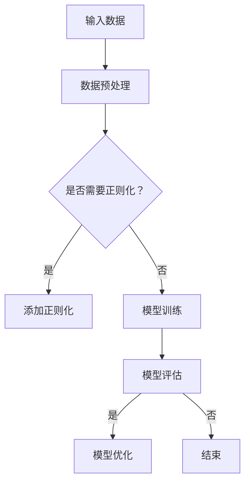

                 

# 《Andrej Karpathy：人工智能的未来发展策略》

> **关键词：**人工智能，神经网络，深度学习，应用领域，未来趋势，发展策略

> **摘要：**本文以人工智能专家Andrej Karpathy的研究成果为基础，深入探讨人工智能的未来发展策略。通过分析AI的核心技术与原理，探讨其在各个领域的应用，展望未来的发展趋势和面临的挑战，并提出相应的策略建议。

## 第一部分：引言与背景

### 第1章：人工智能的历史与现状

#### 1.1 人工智能的起源与发展

人工智能（Artificial Intelligence，简称AI）的概念最早可以追溯到20世纪40年代。1947年，艾伦·图灵（Alan Turing）提出了著名的图灵测试，用以判断机器是否具有智能。这一理论为人工智能的发展奠定了基础。1950年，阿兰·图灵发表了《计算机与智能》一文，进一步阐述了人工智能的可能性。

随后，人工智能经历了多个发展阶段。20世纪80年代，专家系统成为人工智能研究的热点，但在面对复杂任务时，专家系统的表现并不理想。进入21世纪，随着计算机性能的提升和大数据技术的发展，深度学习逐渐崛起，为人工智能带来了新的契机。

#### 1.2 人工智能的现状

如今，人工智能已经渗透到各个领域，如计算机视觉、自然语言处理、强化学习等。在计算机视觉领域，AI技术在图像识别、物体检测、目标跟踪等方面取得了显著成果。在自然语言处理领域，机器翻译、语言理解、文本生成等应用日益普及。在强化学习领域，AI在游戏、机器人、自动驾驶等领域表现出色。

然而，人工智能也面临着诸多挑战和争议。首先，人工智能的算法和模型复杂，需要大量的计算资源和数据支持。其次，人工智能的透明性和可解释性仍需提高。此外，人工智能的发展也引发了伦理和法律问题，如隐私保护、偏见和公平性等。

## 第二部分：AI核心技术与原理

### 第2章：神经网络与深度学习基础

#### 2.1 神经网络的基本结构

神经网络（Neural Network，简称NN）是人工智能的核心技术之一。神经网络由大量的神经元组成，通过层次结构对输入数据进行处理和传递。每个神经元接收多个输入信号，并通过权重和偏置进行加权求和，最后通过激活函数产生输出。

神经网络可以分为前馈神经网络（Feedforward Neural Network）和循环神经网络（Recurrent Neural Network）。前馈神经网络的结构较为简单，适用于静态数据的处理。循环神经网络具有时间动态特性，适用于序列数据的处理。

#### 2.2 深度学习的核心算法

深度学习（Deep Learning，简称DL）是神经网络的一种特殊形式，通过增加网络的深度来提高模型的性能。深度学习的核心算法包括卷积神经网络（Convolutional Neural Network，简称CNN）和循环神经网络（Recurrent Neural Network，简称RNN）。

卷积神经网络在计算机视觉领域具有广泛的应用。CNN通过卷积层、池化层和全连接层对图像进行特征提取和分类。卷积层可以捕捉图像中的局部特征，池化层可以降低模型的参数数量，全连接层用于实现分类任务。

循环神经网络在自然语言处理领域表现出色。RNN通过循环机制对序列数据进行处理，可以捕捉序列中的长期依赖关系。长短期记忆网络（Long Short-Term Memory，简称LSTM）是RNN的一种变体，通过门控机制来缓解梯度消失和梯度爆炸问题。

#### 2.3 模型优化与训练技巧

模型的优化与训练是深度学习的重要环节。常见的优化方法包括随机梯度下降（Stochastic Gradient Descent，简称SGD）和Adam优化器。SGD通过随机选取一部分数据进行梯度更新，可以有效减少参数更新过程中的计算量。Adam优化器结合了SGD和AdaGrad的优点，具有更好的收敛速度和稳定性。

在模型训练过程中，数据预处理和模型调优也非常重要。数据预处理包括数据清洗、归一化和标准化等操作，可以提高模型的训练效果。模型调优包括超参数调整、正则化和数据增强等策略，可以避免过拟合并提高模型的泛化能力。

### Mermaid 流程图：



### 核心算法原理讲解

#### 卷积神经网络（CNN）

卷积神经网络是一种前馈神经网络，专门用于处理具有网格结构的数据，如图像和视频。CNN由多个卷积层、池化层和全连接层组成。

- **卷积层**：卷积层通过卷积运算从输入数据中提取特征。每个卷积核可以提取图像中的局部特征，如边缘、角点等。通过多次卷积操作，可以逐步提取更复杂的特征。

  ```python
  def convolution(input_data, filter):
      return np.sum(input_data * filter)
  ```

- **池化层**：池化层用于降低模型的参数数量，同时保留最重要的特征信息。常用的池化操作包括最大池化和平均池化。

  ```python
  def max_pooling(input_data, pool_size):
      return np.max(input_data[:, :pool_size, :pool_size], axis=(1, 2))
  ```

- **全连接层**：全连接层用于实现分类任务。将卷积层和池化层提取的特征映射到输出类别。

  ```python
  def fully_connected(inputs, weights, bias):
      return np.dot(inputs, weights) + bias
  ```

#### 循环神经网络（RNN）

循环神经网络是一种基于时间序列数据的神经网络，可以处理序列数据，如文本、音频等。RNN通过循环机制来捕捉序列中的长期依赖关系。

- **输入层**：输入层将序列数据输入到网络中。

- **隐藏层**：隐藏层通过循环连接将前一个时间步的输出作为当前时间步的输入。

  ```python
  def lstm(input_data, weights, biases):
      # LSTM门控机制
      # forget gate
      forget_gate = sigmoid(np.dot(input_data, weights_forget) + biases_forget)
      # input gate
      input_gate = sigmoid(np.dot(input_data, weights_input) + biases_input)
      # candidate value
      candidate = tanh(np.dot(input_data, weights_candidate) + biases_candidate)
      # output gate
      output_gate = sigmoid(np.dot(input_data, weights_output) + biases_output)
      
      # 更新状态
      new_state = forget_gate * old_state + input_gate * candidate * output_gate
      
      return new_state
  ```

#### 长短期记忆网络（LSTM）

长短期记忆网络是RNN的一种变体，通过门控机制来缓解梯度消失和梯度爆炸问题。

- **遗忘门（Forget Gate）**：控制哪些信息需要遗忘。

- **输入门（Input Gate）**：控制哪些新信息需要存储。

- **候选值（Candidate Value）**：存储潜在的新信息。

- **输出门（Output Gate）**：控制哪些信息需要输出。

### 第三部分：AI应用与发展趋势

### 第3章：AI在各个领域的应用

#### 3.1 AI在计算机视觉的应用

计算机视觉是人工智能的重要应用领域之一。通过深度学习技术，AI可以自动识别图像中的物体、场景和动作。

- **图像识别**：AI可以自动识别图像中的物体和场景。例如，人脸识别、车牌识别等。

- **物体检测**：AI可以检测图像中的多个物体，并确定它们的位置和属性。例如，车辆检测、行人检测等。

- **目标跟踪**：AI可以跟踪图像中的目标，即使在目标发生遮挡或部分遮挡的情况下也能保持跟踪。

#### 3.2 AI在自然语言处理的应用

自然语言处理是人工智能的另一个重要领域。通过深度学习技术，AI可以自动处理和理解人类语言。

- **机器翻译**：AI可以自动将一种语言翻译成另一种语言。例如，谷歌翻译、百度翻译等。

- **语言理解**：AI可以理解人类语言中的语义和情感。例如，情感分析、文本分类等。

- **文本生成**：AI可以自动生成文本，如新闻文章、广告文案等。

- **对话系统**：AI可以与人类进行自然语言交互，如智能客服、聊天机器人等。

#### 3.3 AI在强化学习中的应用

强化学习是人工智能的一种学习方法，通过不断尝试和反馈来优化策略。在强化学习领域，AI可以应用于游戏、机器人、自动驾驶等领域。

- **游戏**：AI可以在游戏中自动进行策略优化，以获得更好的游戏体验。例如，围棋、国际象棋等。

- **机器人**：AI可以控制机器人执行特定的任务，如搬运、清洁等。

- **自动驾驶**：AI可以自动驾驶汽车，实现无人驾驶技术。

### 第四部分：AI的未来发展与挑战

### 第4章：AI的未来发展方向

#### 4.1 AI硬件与基础设施

随着人工智能的发展，对计算资源的需求也越来越高。未来的AI硬件和基础设施将朝着以下几个方向发展：

- **图灵计算**：图灵计算是一种基于量子力学的计算方式，可以显著提高计算效率。图灵计算有望在未来成为人工智能的重要基础设施。

- **量子计算**：量子计算利用量子力学原理，可以解决传统计算无法解决的问题。量子计算在人工智能领域具有广泛的应用前景。

- **边缘计算**：边缘计算将计算任务分布在边缘设备上，可以降低网络延迟和带宽需求，提高实时处理能力。

- **云计算**：云计算提供了灵活、可扩展的计算资源，为人工智能的研究和应用提供了强大的支持。

#### 4.2 AI伦理与法律问题

随着人工智能的发展，伦理和法律问题也逐渐浮现。未来的AI发展需要关注以下几个方面：

- **AI偏见与公平性**：AI系统在训练过程中可能会引入偏见，导致不公平的决策。需要制定相应的标准和规范，确保AI系统的公平性。

- **AI安全与隐私保护**：AI系统可能涉及大量的敏感数据，需要采取有效的安全措施，确保数据的隐私和安全。

- **AI责任归属**：当AI系统发生错误或造成损害时，需要明确责任归属，以保障各方权益。

#### 4.3 AI与人类社会的融合

人工智能的发展不仅仅局限于技术层面，还与人类社会的融合密切相关。未来的AI发展需要关注以下几个方面：

- **人类与AI的协作**：AI可以帮助人类完成复杂的任务，提高工作效率。人类与AI的协作将成为未来社会发展的重要趋势。

- **AI在教育、医疗等领域的应用**：AI可以应用于教育、医疗、金融等各个领域，为人类生活带来更多便利。

### 第五部分：实战与案例分析

### 第5章：AI项目实战

#### 5.1 实战项目介绍

在本章中，我们将介绍一个基于深度学习的图像分类项目。该项目旨在利用卷积神经网络（CNN）对图像进行分类，实现物体识别功能。

#### 5.2 代码实战案例

以下是一个简单的CNN模型实现，用于对图像进行分类：

```python
import tensorflow as tf
from tensorflow.keras.models import Sequential
from tensorflow.keras.layers import Conv2D, MaxPooling2D, Flatten, Dense

# 定义CNN模型
model = Sequential()
model.add(Conv2D(32, (3, 3), activation='relu', input_shape=(28, 28, 1)))
model.add(MaxPooling2D((2, 2)))
model.add(Conv2D(64, (3, 3), activation='relu'))
model.add(MaxPooling2D((2, 2)))
model.add(Flatten())
model.add(Dense(128, activation='relu'))
model.add(Dense(10, activation='softmax'))

# 编译模型
model.compile(optimizer='adam', loss='categorical_crossentropy', metrics=['accuracy'])

# 加载和预处理数据
(x_train, y_train), (x_test, y_test) = tf.keras.datasets.mnist.load_data()
x_train = x_train.reshape(-1, 28, 28, 1).astype('float32') / 255.0
x_test = x_test.reshape(-1, 28, 28, 1).astype('float32') / 255.0
y_train = tf.keras.utils.to_categorical(y_train, num_classes=10)
y_test = tf.keras.utils.to_categorical(y_test, num_classes=10)

# 训练模型
model.fit(x_train, y_train, epochs=10, batch_size=32, validation_data=(x_test, y_test))

# 评估模型
loss, accuracy = model.evaluate(x_test, y_test)
print("Test accuracy:", accuracy)
```

#### 5.3 代码解读与分析

1. **模型定义**：首先，我们定义了一个简单的卷积神经网络模型。模型由两个卷积层、两个池化层、一个全连接层和两个softmax层组成。

2. **编译模型**：接下来，我们编译模型，指定优化器、损失函数和评估指标。

3. **加载和预处理数据**：我们使用MNIST数据集作为输入数据，将图像reshape为合适的大小，并归一化处理。

4. **训练模型**：我们使用训练数据进行模型训练，设置训练轮数、批量大小和验证数据。

5. **评估模型**：最后，我们使用测试数据评估模型性能，输出准确率。

### 第六部分：AI发展趋势与未来展望

### 第6章：AI发展的未来趋势

#### 6.1 AI技术的发展趋势

随着人工智能的不断发展，未来技术趋势将体现在以下几个方面：

- **更高效的算法和模型**：研究人员将持续优化现有算法和模型，提高其效率和性能。

- **多模态学习**：AI将能够处理多种类型的数据，如图像、文本、音频等，实现多模态学习。

- **知识图谱和语义理解**：AI将能够更好地理解人类语言和知识，实现语义理解和知识图谱构建。

- **强化学习与应用**：强化学习将在更多领域得到应用，如游戏、机器人、自动驾驶等。

#### 6.2 AI的未来应用领域

未来，人工智能将在各个领域发挥更大的作用，以下是一些潜在的应用领域：

- **智能制造**：AI将应用于生产流程优化、质量控制、供应链管理等方面。

- **智慧城市**：AI将应用于交通管理、环境监测、能源管理等方面，实现智慧城市建设。

- **医疗健康**：AI将应用于疾病诊断、药物研发、健康管理等，提高医疗质量和效率。

- **金融科技**：AI将应用于风险管理、信用评估、投资顾问等方面，推动金融科技创新。

### 第七部分：结论与建议

### 第7章：AI发展的策略建议

为了推动人工智能的健康发展，以下是一些建议：

#### 7.1 AI发展的策略分析

1. **加大科研投入**：政府和企业应加大对人工智能科研的投入，支持基础研究和应用研究。

2. **人才培养**：培养更多人工智能领域的专业人才，建立完善的人才培养体系。

3. **产业合作**：鼓励企业、科研机构和政府部门之间的合作，推动人工智能技术的创新和应用。

4. **法律法规**：制定相应的法律法规，确保人工智能的安全、隐私和公平性。

#### 7.2 AI发展的挑战与应对

1. **技术挑战**：研究人员应持续优化算法和模型，提高AI的性能和效率。

2. **伦理问题**：加强伦理研究，制定伦理准则，确保AI的发展符合人类价值观。

3. **数据安全**：加强数据安全防护，防止数据泄露和滥用。

4. **社会影响**：关注AI对社会的影响，积极应对可能出现的社会问题。

### 附录

#### 附录A：AI研究资源与工具

1. **研究资源**

   - **学术期刊与会议**：如《自然·机器 Intelligence》、《人工智能学报》等。

   - **开源代码与数据集**：如GitHub、Google Brain等。

2. **工具与平台**

   - **深度学习框架**：如TensorFlow、PyTorch等。

   - **数据分析工具**：如NumPy、Pandas等。

### 作者信息

- 作者：AI天才研究院/AI Genius Institute & 禅与计算机程序设计艺术 /Zen And The Art of Computer Programming

以上是本文的内容，希望对您有所帮助。在未来的发展中，人工智能将继续发挥重要作用，为人类创造更多价值。让我们携手共进，迎接人工智能的未来！

