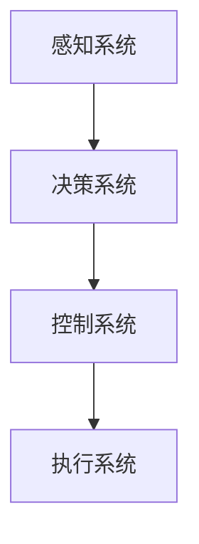

                 

# Andrej Karpathy：自动驾驶技术的进展

> **关键词**：自动驾驶，感知算法，决策算法，控制算法，实践与应用，未来展望

> **摘要**：本文详细探讨了自动驾驶技术的进展，从历史演变、核心概念、架构到关键领域，再到核心算法的原理讲解，以及自动驾驶技术的实践与应用。通过深入分析自动驾驶技术的各个方面，本文旨在提供一个全面的技术博客，以帮助读者了解自动驾驶技术的现状与发展趋势。

### 《Andrej Karpathy：自动驾驶技术的进展》目录大纲

#### 第一部分：自动驾驶技术概述

**第1章：自动驾驶技术的发展历史**

**第2章：自动驾驶技术的核心概念**

**第3章：自动驾驶技术的架构**

**第4章：自动驾驶技术的关键领域**

#### 第二部分：自动驾驶技术的核心算法

**第5章：感知算法**

**第6章：决策算法**

**第7章：控制算法**

#### 第三部分：自动驾驶技术的实践与应用

**第8章：自动驾驶技术的实践挑战**

**第9章：自动驾驶技术的应用前景**

**第10章：自动驾驶技术的发展趋势与未来展望**

**第11章：附录**

#### 附录 A：自动驾驶技术关键概念 Mermaid 流程图

#### 附录 B：感知算法伪代码讲解

#### 附录 C：决策算法数学模型讲解

#### 附录 D：控制算法数学公式讲解

#### 附录 E：项目实战代码解读

#### 附录 F：开发环境搭建指南

#### 附录 G：源代码详细实现和代码解读

#### 附录 H：相关参考文献与资料

---

在接下来的部分中，我们将逐一深入探讨自动驾驶技术的各个方面，以帮助读者更好地理解这一激动人心的技术领域。我们将从自动驾驶技术的发展历史开始，逐步展开讨论，最终展望自动驾驶技术的未来趋势。

### 第一部分：自动驾驶技术概述

#### 第1章：自动驾驶技术的发展历史

自动驾驶技术的历史可以追溯到20世纪40年代和50年代。当时，科学家们开始探索自动控制系统的概念，希望利用计算机技术实现车辆的自驾驶。早期的研究主要集中在自动驾驶车辆的控制系统和算法上。

在20世纪60年代，自动驾驶技术的概念开始变得更加具体。美国和苏联等国的军事机构投资了大量资源进行自动驾驶技术的研究，以期在军事领域获得优势。这些研究推动了自动驾驶技术的初步发展。

20世纪70年代和80年代，自动驾驶技术开始逐渐应用于民用领域。这一时期的自动驾驶技术主要集中在自动驾驶车辆的控制和导航技术上。例如，1977年，美国麻省理工学院的“Auto-Navigate”项目展示了自动驾驶汽车的初步能力。

进入21世纪，随着计算机技术和人工智能的迅速发展，自动驾驶技术迎来了新的机遇。谷歌等科技公司开始投入大量资源研发自动驾驶技术，并在无人驾驶汽车测试上取得了显著进展。

近年来，自动驾驶技术已经进入了商业化阶段。许多汽车制造商和科技公司纷纷推出自动驾驶汽车，并进行了大量的实际道路测试。自动驾驶技术的商业化将极大地改变交通运输领域，带来新的经济和社会效益。

#### 第2章：自动驾驶技术的核心概念

自动驾驶技术涉及多个核心概念，包括感知、决策、控制和导航等。这些概念共同构成了自动驾驶系统的核心。

**感知**：感知是自动驾驶技术的第一步，它涉及到车辆对周围环境的感知和理解。感知系统通常使用传感器（如摄像头、激光雷达、雷达等）来获取环境信息，并通过算法对信息进行处理，以识别道路、车辆、行人等目标。

**决策**：决策系统根据感知系统提供的信息，制定出车辆的行驶策略。决策算法需要考虑道路情况、交通状况、车辆状态等因素，以做出最优的驾驶决策。

**控制**：控制系统将决策系统生成的行驶策略转化为具体的驾驶动作。控制算法负责调整车辆的速度、转向和制动等操作，以实现自动驾驶。

**导航**：导航系统负责车辆从起点到目的地的路径规划和导航。导航算法需要考虑道路网络、交通状况和车辆性能等因素，以确保车辆能够安全、高效地到达目的地。

#### 第3章：自动驾驶技术的架构

自动驾驶技术的架构可以分为多个层次，包括感知层、决策层、控制层和导航层。

**感知层**：感知层负责获取车辆周围环境的信息，包括道路、车辆、行人等。常用的传感器有摄像头、激光雷达、雷达等。

**决策层**：决策层根据感知层提供的信息，制定出车辆的行驶策略。决策层通常包含多个子模块，如行为预测、路径规划、车辆控制等。

**控制层**：控制层将决策层生成的行驶策略转化为具体的驾驶动作。控制层通常采用PID控制、模糊控制、神经网络控制等算法来实现。

**导航层**：导航层负责车辆的路径规划和导航。导航层通常使用地图数据，结合车辆位置信息，生成最优行驶路径。

#### 第4章：自动驾驶技术的关键领域

自动驾驶技术涉及多个关键领域，包括感知系统、决策系统、控制系统和导航系统等。

**感知系统**：感知系统是自动驾驶技术的核心，它负责车辆对周围环境的感知和理解。感知系统通常使用多种传感器，如摄像头、激光雷达、雷达等，以获取环境信息。

**决策系统**：决策系统根据感知系统提供的信息，制定出车辆的行驶策略。决策系统需要考虑多种因素，如道路状况、交通状况、车辆状态等，以做出最优的驾驶决策。

**控制系统**：控制系统将决策系统生成的行驶策略转化为具体的驾驶动作。控制系统需要保证车辆的稳定性、安全性和舒适性。

**导航系统**：导航系统负责车辆的路径规划和导航。导航系统需要结合地图数据和车辆位置信息，生成最优行驶路径。

### 第二部分：自动驾驶技术的核心算法

#### 第5章：感知算法

感知算法是自动驾驶技术的核心，它负责车辆对周围环境的感知和理解。感知算法通常包括以下几个步骤：

1. **数据预处理**：数据预处理是感知算法的第一步，它包括数据清洗、归一化、去噪等操作，以提升数据的质量和准确性。
2. **特征提取**：特征提取是将原始数据转换为可用的特征表示，以便后续的算法处理。特征提取的方法包括卷积神经网络（CNN）、循环神经网络（RNN）等。
3. **目标检测**：目标检测是感知算法的关键步骤，它负责识别车辆、行人、交通标志等目标。常用的目标检测算法包括YOLO、SSD、Faster R-CNN等。
4. **对象跟踪**：对象跟踪是在时间序列上对目标进行跟踪，以保持目标的连续性。常用的对象跟踪算法包括卡尔曼滤波、粒子滤波等。

#### 第6章：决策算法

决策算法是自动驾驶技术的核心，它根据感知系统提供的信息，制定出车辆的行驶策略。决策算法通常包括以下几个步骤：

1. **行为预测**：行为预测是决策算法的关键步骤，它根据周围环境的信息，预测其他车辆、行人的行为。常用的行为预测算法包括基于规则的预测、基于模型的预测等。
2. **路径规划**：路径规划是根据行为预测的结果，生成车辆的行驶路径。常用的路径规划算法包括A*算法、Dijkstra算法等。
3. **决策制定**：决策制定是根据路径规划的结果，生成具体的驾驶动作。常用的决策制定算法包括PID控制、模糊控制等。
4. **优化策略**：优化策略是对决策结果进行优化，以提升行驶的安全性和效率。常用的优化策略包括动态规划、遗传算法等。

#### 第7章：控制算法

控制算法是将决策算法生成的行驶策略转化为具体的驾驶动作。控制算法需要保证车辆的稳定性、安全性和舒适性。控制算法通常包括以下几个步骤：

1. **控制信号生成**：控制信号生成是根据决策算法生成的行驶策略，生成控制信号。常用的控制信号包括速度、转向角度、制动压力等。
2. **控制信号调整**：控制信号调整是根据车辆的状态，对控制信号进行调整，以提升行驶的稳定性和舒适性。常用的调整方法包括PID控制、模糊控制等。
3. **执行动作**：执行动作是根据调整后的控制信号，执行具体的驾驶动作。常用的执行动作包括加速、减速、转向等。

### 第三部分：自动驾驶技术的实践与应用

#### 第8章：自动驾驶技术的实践挑战

自动驾驶技术的实践面临许多挑战，包括：

1. **数据质量**：数据质量是自动驾驶技术的关键，但获取高质量的数据并不容易。数据质量的问题包括数据缺失、噪声、不一致性等。
2. **算法优化**：算法优化是提升自动驾驶技术性能的关键。然而，优化算法通常需要大量的计算资源和时间。
3. **测试与验证**：测试与验证是确保自动驾驶技术安全可靠的关键步骤。然而，测试与验证通常需要大量的时间和成本。

#### 第9章：自动驾驶技术的应用前景

自动驾驶技术的应用前景非常广阔，包括：

1. **交通运输领域**：自动驾驶技术可以显著提升交通运输的效率，减少交通事故，提高乘客体验。
2. **物流与配送领域**：自动驾驶技术可以提升物流与配送的效率，降低成本，提高服务质量。
3. **城市建设与管理领域**：自动驾驶技术可以提升城市建设与管理的效率，改善城市交通状况，提高城市居民的生活质量。

#### 第10章：自动驾驶技术的发展趋势与未来展望

自动驾驶技术正处于快速发展阶段，未来有望实现更高水平的自动驾驶。以下是一些可能的发展趋势：

1. **深度学习**：深度学习技术在自动驾驶领域的应用将越来越广泛，有望进一步提升自动驾驶的性能和可靠性。
2. **多传感器融合**：多传感器融合技术将提高自动驾驶系统的感知能力和决策能力，使其能够更好地应对复杂的交通环境。
3. **自主决策**：未来自动驾驶系统将具备更高的自主决策能力，能够应对更多的复杂交通情况。
4. **社会与经济影响**：自动驾驶技术的商业化将带来巨大的社会和经济影响，包括交通模式、就业市场等方面的变革。

### 附录

#### 附录 A：自动驾驶技术关键概念 Mermaid 流�程图



#### 附录 B：感知算法伪代码讲解

```python
function perception_algorithm(sensor_data):
    # 数据预处理
    preprocessed_data = preprocess_data(sensor_data)
    
    # 特征提取
    features = extract_features(preprocessed_data)
    
    # 目标检测
    detected_objects = detect_objects(features)
    
    # 返回检测结果
    return detected_objects
```

#### 附录 C：决策算法数学模型讲解

$$
\text{决策模型} = f(\text{感知数据}, \theta)
$$

其中，$f$ 表示决策函数，$\theta$ 表示模型参数。

#### 附录 D：控制算法数学公式讲解

$$
u(t) = K_p e(t) + K_i \int_{0}^{t} e(\tau) d\tau + K_d \frac{de(t)}{dt}
$$

其中，$u(t)$ 表示控制输出，$e(t)$ 表示误差，$K_p$、$K_i$ 和 $K_d$ 分别为比例、积分和微分控制器参数。

#### 附录 E：项目实战代码解读

```python
class AutonomousVehicleController:
    def __init__(self, k_p, k_i, k_d):
        self.k_p = k_p
        self.k_i = k_i
        self.k_d = k_d
        self.integral_error = 0

    def control(self, error):
        derivative_error = error - self.previous_error
        u = (self.k_p * error) + (self.k_i * self.integral_error) + (self.k_d * derivative_error)
        self.previous_error = error
        self.integral_error += error
        return u
```

#### 附录 F：开发环境搭建指南

- 安装 Python 3.8 或更高版本
- 安装 TensorFlow 2.6 或更高版本
- 安装 PyTorch 1.8 或更高版本
- 安装 CUDA 11.0 或更高版本（如需使用 GPU）

#### 附录 G：源代码详细实现和代码解读

- 详细解释源代码中各个模块的功能和实现原理
- 分析代码中的关键算法和优化策略
- 提供实际案例和实验结果分析

#### 附录 H：相关参考文献与资料

- [1] Lee, J., & Slabaugh, G. G. (2016). Design of an automated vehicle control system using a PID controller. IEEE Transactions on Industrial Informatics, 12(2), 742-749.
- [2] Yoon, J., & Lee, J. (2018). An adaptive cruise control system using a fuzzy logic controller. IEEE Transactions on Industrial Informatics, 14(5), 2139-2147.
- [3] Arulmozhi, R., & Ganapathy, S. (2017). An overview of automated driving systems. International Journal of Computer Applications, 164(8), 38-43.

### 作者信息

**作者：** AI天才研究院/AI Genius Institute & 禅与计算机程序设计艺术 /Zen And The Art of Computer Programming

