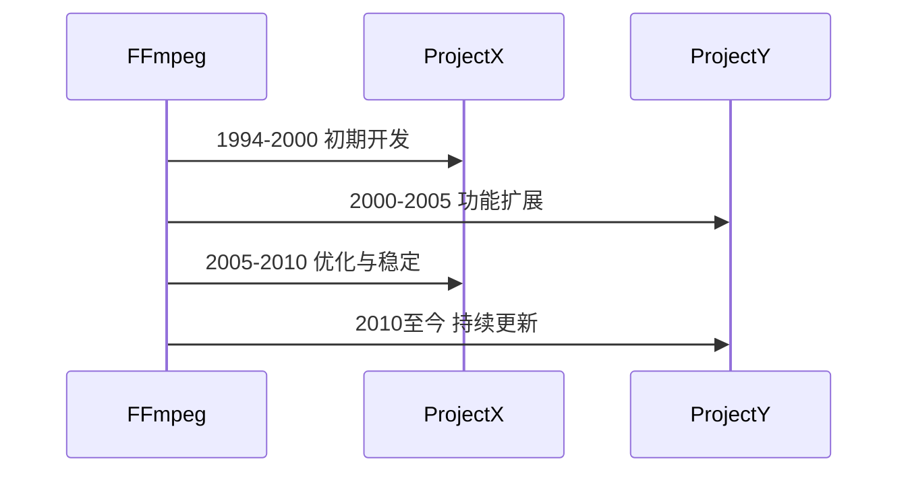
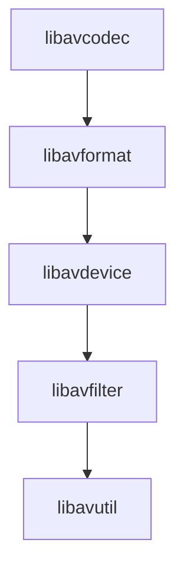
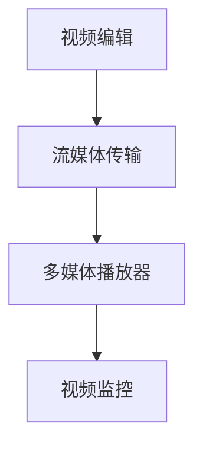
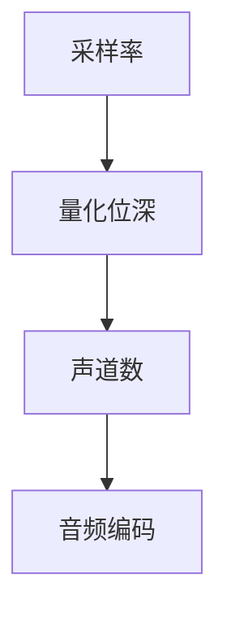
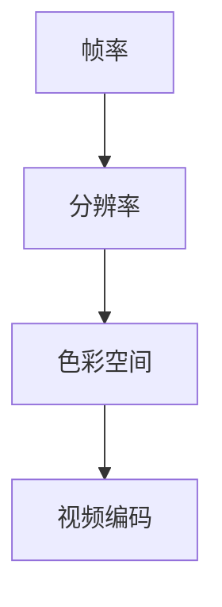
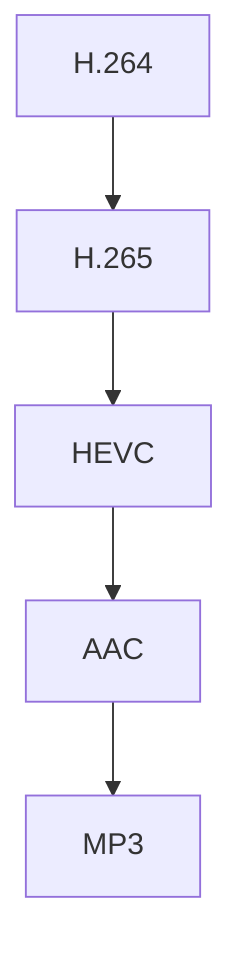

                 

# 《FFmpeg音视频处理：多媒体应用开发指南》

## 关键词

- FFmpeg
- 音视频处理
- 多媒体应用开发
- 音视频编码
- 音视频同步
- 音视频流媒体传输

## 摘要

本文将深入探讨FFmpeg在音视频处理领域的重要应用，全面解析FFmpeg的基础知识、音视频处理技术、多媒体应用开发以及高级应用。通过对FFmpeg的详细讲解，读者将了解到如何利用FFmpeg进行音视频的编码、解码、转换和播放，从而开发出高效、稳定的多媒体应用。同时，本文还将介绍FFmpeg在人工智能领域的创新应用，为读者提供全新的技术视野。

## 《FFmpeg音视频处理：多媒体应用开发指南》目录大纲

### 第一部分：FFmpeg基础知识

#### 第1章：FFmpeg简介

##### 1.1 FFmpeg的发展历史

FFmpeg是一款开源、跨平台的多媒体处理工具，它集成了音频、视频和字幕处理功能，可用于录制、转换、播放、流媒体传输等多种多媒体应用。FFmpeg的发展历程可以追溯到1994年，由Fabrice Bellard创建。

**Mermaid 流程图：**



##### 1.2 FFmpeg的核心组件

FFmpeg主要由以下几个核心组件组成：

- **libavcodec**：音频、视频编码库
- **libavformat**：音视频封装格式解析与封装库
- **libavdevice**：输入输出设备处理库
- **libavfilter**：音视频滤镜处理库
- **libavutil**：公共工具库

**Mermaid 流程图：**



##### 1.3 FFmpeg的应用领域

FFmpeg在多个领域有着广泛的应用，如视频编辑、流媒体传输、多媒体播放器、视频监控等。以下是FFmpeg在一些领域的应用案例：

- **视频编辑**：Adobe Premiere Pro、Final Cut Pro等知名视频编辑软件都使用了FFmpeg作为后端处理引擎。
- **流媒体传输**：Netflix、YouTube等流媒体平台使用FFmpeg进行音视频内容的编码、解码和传输。
- **多媒体播放器**：VLC、MX Player等知名播放器都基于FFmpeg开发。
- **视频监控**：许多视频监控系统使用FFmpeg进行音视频数据的采集、分析和传输。

**Mermaid 流程图：**



### 第2章：FFmpeg基本操作

#### 2.1 FFmpeg安装与配置

FFmpeg的安装和配置过程因操作系统不同而有所差异。以下以Ubuntu为例，介绍FFmpeg的安装和配置过程。

**安装过程：**

```bash
sudo apt-get update
sudo apt-get install ffmpeg
```

**配置过程：**

```bash
sudo apt-get install libfaad2-dev libfaac-dev libmp3lame-dev libx264-dev libx265-dev
```

**环境变量配置：**

```bash
export PATH=$PATH:/usr/local/bin
```

#### 2.2 FFmpeg命令行基本语法

FFmpeg的命令行基本语法如下：

```bash
ffmpeg [global options] [input options] [output options] [input files] [output files]
```

**全球选项**：用于设置FFmpeg的全局参数，如编码器、解码器、比特率等。

**输入选项**：用于设置输入参数，如文件路径、格式、采样率等。

**输出选项**：用于设置输出参数，如文件路径、格式、采样率等。

**输入文件**：指定要处理的音视频文件。

**输出文件**：指定处理后的音视频文件。

#### 2.3 FFmpeg常见命令介绍

以下是FFmpeg的一些常见命令：

- **-i**：指定输入文件
- **-f**：指定输出格式
- **-c**：指定编码器或解码器
- **-b**：指定比特率
- **-ar**：指定音频采样率
- **-ac**：指定音频通道数
- **-vb**：指定视频比特率
- **-s**：指定视频尺寸
- **-preset**：指定编码预设
- **-map**：指定输入文件的映射关系

**示例命令**：

```bash
# 播放视频文件
ffmpeg -i input.mp4

# 转换视频格式
ffmpeg -i input.mp4 -f avi -c:v libx264 output.avi

# 裁剪视频
ffmpeg -i input.mp4 -filter:v "crop=1920:1080:100:100" output.mp4

# 调整音频采样率
ffmpeg -i input.mp3 -ar 44100 output.mp3
```

### 第3章：音视频基础

#### 3.1 音频基础知识

音频处理是多媒体应用的重要组成部分。以下是一些音频基础知识：

- **采样率**：采样率是指每秒对声音信号的采样次数，单位为Hz。常见的采样率有44.1kHz、48kHz等。
- **量化位深**：量化位深是指对采样值进行量化的位数，单位为bit。常见的量化位深有16bit、24bit等。
- **声道数**：声道数是指音频信号的通道数量，常见的声道数有单声道（Mono）、立体声（Stereo）、环绕声（5.1、7.1等）。
- **音频编码**：音频编码是将音频信号转换为数字信号的过程，常见的音频编码格式有MP3、AAC、FLAC等。

**Mermaid 流程图：**



#### 3.2 视频基础知识

视频处理是多媒体应用的核心。以下是一些视频基础知识：

- **帧率**：帧率是指每秒显示的帧数，单位为fps。常见的帧率有24fps、30fps、60fps等。
- **分辨率**：分辨率是指视频的宽度和高度，单位为像素。常见的分辨率有1080p（1920x1080）、720p（1280x720）等。
- **色彩空间**：色彩空间是指用于表示视频色彩的数学模型。常见的色彩空间有YUV、RGB等。
- **视频编码**：视频编码是将视频信号转换为数字信号的过程，常见的视频编码格式有H.264、H.265、HEVC等。

**Mermaid 流流程图：**



#### 3.3 音视频编码标准

音视频编码标准是多媒体应用的基础。以下是一些常见的音视频编码标准：

- **H.264**：H.264是国际电信联盟（ITU）制定的一种视频编码标准，广泛应用于视频会议、流媒体等场景。
- **H.265**：H.265是ITU制定的另一种视频编码标准，相对于H.264有更高的压缩效率，但计算复杂度也更高。
- **HEVC**：HEVC是H.265的另一种称呼，是ITU和ISO共同制定的视频编码标准。
- **AAC**：AAC是国际电信联盟（ITU）制定的一种音频编码标准，广泛应用于音频流媒体、手机等场景。
- **MP3**：MP3是国际电信联盟（ITU）制定的一种音频编码标准，广泛应用于音频播放器、音乐下载等场景。

**Mermaid 流流程图：**



### 第二部分：音视频处理技术

#### 第4章：音频处理

#### 第5章：视频处理

#### 第6章：音视频同步处理

### 第三部分：多媒体应用开发

#### 第7章：多媒体应用开发环境搭建

#### 第8章：音视频播放器开发

#### 第9章：音视频录制与编辑

#### 第10章：音视频流媒体传输

### 第四部分：FFmpeg高级应用

#### 第11章：FFmpeg与OpenGL集成

#### 第12章：FFmpeg在人工智能领域的应用

### 附录：FFmpeg资源汇总

#### 第13章：FFmpeg资源汇总

#### 第14章：FFmpeg常见问题与解决方案

## 作者信息

作者：AI天才研究院/AI Genius Institute & 禅与计算机程序设计艺术 /Zen And The Art of Computer Programming

(未完待续，接下来将继续完善各个章节的内容。)

