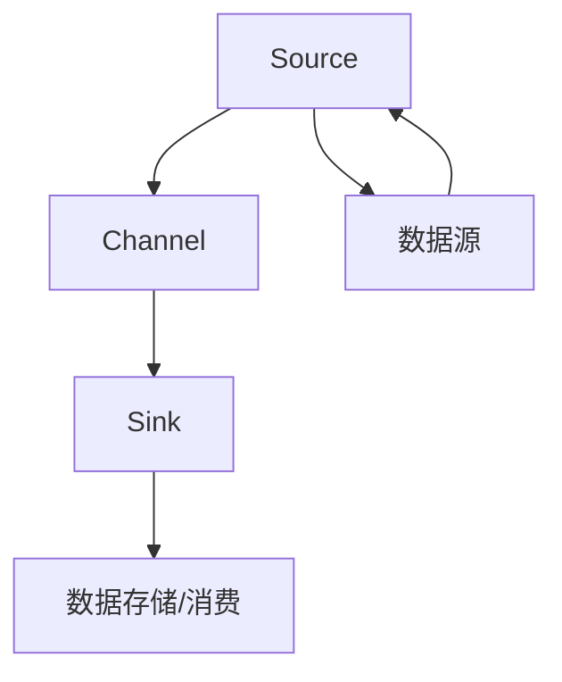
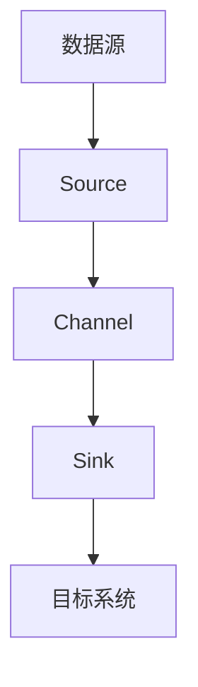
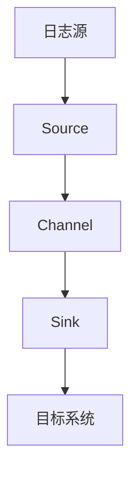
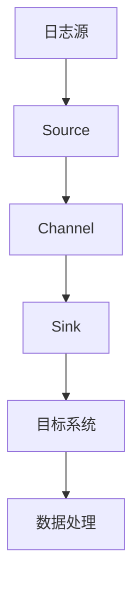
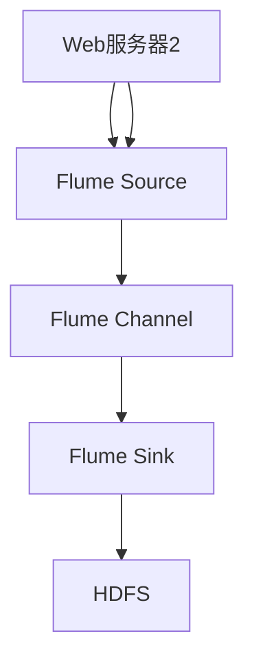

                 

### 《Flume Channel原理与代码实例讲解》

#### 文章关键词：

1. Flume Channel
2. 数据流处理
3. 数据采集
4. Kafka集成
5. 大数据架构

#### 摘要：

本文将深入探讨Flume Channel的原理及其在数据流处理中的应用。首先，我们将介绍Flume Channel的基础理论和核心组件，然后通过实际代码实例讲解如何搭建和配置Flume Channel。文章还将涵盖Flume Channel的性能调优策略，以及与Kafka等大数据组件的集成。通过本文，读者将全面了解Flume Channel的工作机制，掌握其实际应用技能。

----------------------------------------------------------------

### 《Flume Channel原理与代码实例讲解》目录大纲

#### 第一部分：Flume Channel基础理论

##### 第1章：Flume概述

1.1 Flume架构简介

1.2 Flume Channel核心概念

1.3 Flume Channel类型与特性

1.4 Flume Channel在企业级数据流处理中的应用

##### 第2章：Flume Channel原理

2.1 数据流处理模型

2.2 Flume Channel工作原理

2.3 Flume Channel数据传输机制

##### 第3章：Flume Channel核心组件

3.1 Source组件

3.2 Sink组件

3.3 Channel组件

##### 第4章：Flume Channel配置详解

4.1 Flume配置文件格式

4.2 Flume Channel配置示例

4.3 Flume Channel性能调优

#### 第二部分：Flume Channel项目实战

##### 第5章：搭建Flume数据采集系统

5.1 Flume数据采集系统架构设计

5.2 Flume数据采集系统搭建步骤

5.3 Flume数据采集系统代码实现

##### 第6章：Flume Channel数据传输优化

6.1 Flume Channel数据传输性能分析

6.2 Flume Channel数据传输优化策略

6.3 Flume Channel性能调优实战案例

##### 第7章：Flume Channel在日志处理中的应用

7.1 Flume Channel日志处理架构设计

7.2 Flume Channel日志处理流程

7.3 Flume Channel日志处理代码实例

##### 第8章：Flume Channel与其他大数据组件集成

8.1 Flume与Kafka集成

8.2 Flume与HDFS集成

8.3 Flume与Spark集成

#### 附录：Flume Channel开发工具与资源

9.1 Flume开发工具介绍

9.2 Flume社区资源汇总

9.3 Flume Channel相关书籍推荐

### 核心概念与联系

#### Flume Channel Mermaid 流程图



### 核心算法原理讲解

#### 数据流处理模型

```python
# 伪代码：Flume Channel数据流处理模型
def process_data(source, channel, sink):
    data = source.read_data()
    channel.put_data(data)
    sink.write_data(data)
```

#### 数据传输速率公式

$$
\text{速率} = \frac{\text{数据量}}{\text{时间}}
$$

----------------------------------------------------------------

#### 第一部分：Flume Channel基础理论

##### 第1章：Flume概述

Flume是一个分布式、可靠且可用的服务，用于有效地在日志聚集器（比如Hadoop HDFS）和其他数据存储之间进行数据移动。它能够从多个数据源（如web服务器）汇总数据，并可靠、持续地将这些数据传输到中心数据存储。Flume的设计目的是为了处理大规模的数据流，并且具有很强的容错能力。

##### 1.1 Flume架构简介

Flume架构的核心组件包括Source、Channel和Sink。

- **Source**：负责读取数据源的数据，如日志文件、网络数据包等，并将数据发送到Channel。
- **Channel**：作为数据传输的缓冲区，存储Source发送的数据，直到Sink将其传输到目标系统。
- **Sink**：负责将数据从Channel传输到目标系统，如HDFS、Kafka等。

Flume的架构设计支持流式数据处理和批量数据处理，这使得它能够灵活地处理各种规模和类型的数据。

##### 1.2 Flume Channel核心概念

Flume Channel是Flume架构中的缓冲区，用于存储从Source接收的数据，直到Sink将其传输到目标系统。Channel的主要作用是提供数据的持久性和可靠性，确保数据不丢失。

Flume提供多种类型的Channel，包括：

- **Memory Channel**：使用内存作为存储介质，适用于小规模数据传输，但数据在系统崩溃时可能丢失。
- **File Channel**：使用文件系统作为存储介质，提供更强的持久性，但写入速度可能较慢。
- **Kafka Channel**：将Channel与Kafka集成，提供高性能、可扩展的数据传输解决方案。

##### 1.3 Flume Channel类型与特性

以下是Flume支持的几种Channel类型及其特性：

- **Memory Channel**：

  - 特性：使用内存存储数据，速度快，但数据在系统崩溃时可能丢失。
  - 适用场景：小规模、临时性数据传输。

- **File Channel**：

  - 特性：使用文件系统存储数据，提供持久性，但写入速度较慢。
  - 适用场景：大规模、需要持久化的数据传输。

- **Kafka Channel**：

  - 特性：与Kafka集成，提供高性能、高吞吐量的数据传输。
  - 适用场景：大规模、需要高可靠性和高扩展性的数据传输。

##### 1.4 Flume Channel在企业级数据流处理中的应用

在企业级数据流处理中，Flume Channel被广泛用于从各种数据源（如Web服务器、数据库等）收集数据，并将其传输到目标系统（如Hadoop HDFS、Kafka等）。

以下是Flume Channel在企业级数据流处理中的一些典型应用场景：

- **日志收集**：从多个Web服务器收集日志文件，并将其传输到中心日志存储系统。
- **数据同步**：将实时数据从数据库同步到数据仓库或大数据处理平台。
- **监控数据收集**：从分布式系统收集监控数据，并将其传输到监控平台。

通过使用Flume Channel，企业能够实现高效、可靠的数据收集和传输，从而支持其大数据处理和分析需求。

----------------------------------------------------------------

##### 第2章：Flume Channel原理

Flume Channel是Flume系统中的核心组件，负责在数据源和目标系统之间提供缓冲存储和数据传输。理解Flume Channel的工作原理对于有效地使用Flume进行数据流处理至关重要。以下将详细解释Flume Channel的工作原理、数据传输机制以及其在数据流处理模型中的应用。

##### 2.1 数据流处理模型

在Flume中，数据流处理模型可以看作是一个管道系统，其中数据从源头（Source）经过缓冲区（Channel）流向终点（Sink）。这个模型的核心是确保数据在传输过程中不会丢失或延迟。

数据流处理模型的主要组成部分包括：

- **Source**：负责接收数据，并将数据传递到Channel。数据源可以是文件、网络数据包或其他类型的输入流。
- **Channel**：作为暂存区，存储从Source接收的数据，直到Sink将其处理并发送到目标系统。Channel提供了数据的持久性和可靠性。
- **Sink**：负责将数据从Channel传输到目标系统，如Hadoop HDFS、Kafka或其他数据存储系统。

以下是Flume数据流处理模型的简化版工作流程：

1. **数据采集**：Source从数据源中读取数据，并将其放入Channel。
2. **数据暂存**：Channel存储读取到的数据，直到Sink处理完毕。
3. **数据传输**：Sink从Channel中获取数据，并将其发送到目标系统。

##### 2.2 Flume Channel工作原理

Flume Channel的工作原理可以概括为以下步骤：

1. **数据接收**：当Source从数据源读取数据时，它会将这些数据放入Channel。
2. **数据存储**：Channel存储这些数据，直到Sink可以处理它们。在这个过程中，Channel确保数据的持久性，防止数据丢失。
3. **数据转发**：当Sink准备好处理数据时，它会从Channel中获取数据，并将其发送到目标系统。

Flume Channel通过事务机制来保证数据的可靠传输。每个数据传输操作都被视为一个事务，只有在事务成功完成后，数据才会被视为已提交。如果发生故障，事务会被回滚，数据会重新传输。

##### 2.3 Flume Channel数据传输机制

Flume Channel的数据传输机制是数据流处理的核心，它决定了数据如何在Source、Channel和Sink之间高效、可靠地传输。以下是Flume Channel数据传输机制的关键点：

1. **多线程处理**：Flume使用多线程来并行处理数据，提高了数据传输的吞吐量。Source、Channel和Sink都使用多线程来处理数据，从而实现了高并发处理能力。
2. **缓冲区管理**：Channel使用缓冲区来存储数据，缓冲区的大小可以根据需要进行配置。缓冲区管理策略包括缓冲区满时的处理、缓冲区溢出时的处理等。
3. **事务管理**：事务管理是Flume Channel数据传输机制的核心。每个数据传输操作都被视为一个事务，事务的成功完成保证了数据的可靠传输。如果事务失败，数据会被重新传输。
4. **可靠传输**：Flume Channel通过多种机制确保数据传输的可靠性，包括数据校验、错误重传和超时重试等。

##### 2.4 Flume Channel在数据流处理模型中的应用

Flume Channel在数据流处理模型中的应用主要体现在以下几个方面：

1. **数据缓冲**：Channel提供了数据缓冲区，可以防止数据源和目标系统之间的速度不匹配导致的延迟。例如，当数据源产生数据速度较快，而目标系统的处理速度较慢时，Channel可以缓冲这些数据，避免数据丢失。
2. **数据可靠性**：通过事务机制，Flume Channel确保了数据的可靠传输。即使在传输过程中出现故障，数据也能被重新传输，从而避免了数据丢失。
3. **数据扩展性**：Flume Channel支持多线程处理和数据扩展，可以处理大规模的数据流。通过增加Channel的容量和并行处理能力，Flume Channel能够处理更多的数据，提高了系统的扩展性。

总之，Flume Channel在数据流处理模型中扮演着至关重要的角色。它不仅提供了数据的缓冲和可靠性，还提高了系统的扩展性和吞吐量，使得Flume能够高效、可靠地处理大规模的数据流。

----------------------------------------------------------------

##### 第3章：Flume Channel核心组件

在Flume系统中，Source、Sink和Channel是三个核心组件，它们共同协作完成数据的采集、缓冲和传输。本章节将详细解释这三个组件的功能、配置和交互机制。

##### 3.1 Source组件

Source组件是Flume数据流处理系统的起点，它负责从各种数据源读取数据并将其发送到Channel。Source有多种类型，包括执行命令Source、HTTP代理Source、JMS Source等。在本节中，我们将重点介绍执行命令Source。

**功能：**

- 从指定的文件、目录或网络数据包中读取数据。
- 以固定间隔或事件触发的方式将数据发送到Channel。

**配置：**

执行命令Source的配置通常包括以下内容：

- `source.type`：指定Source的类型，如`exec`。
- `source.exec.command`：指定执行命令，如`tail -F /path/to/logfile.log`。
- `source.exec.channels`：指定要发送数据的Channel名称。

以下是一个简单的执行命令Source配置示例：

```properties
a1.sources.r1.type = exec
a1.sources.r1.command = tail -F /path/to/logfile.log
a1.sources.r1.channels = c1
```

在这个示例中，Source将读取`/path/to/logfile.log`文件中的数据，并将其发送到名为`c1`的Channel。

##### 3.2 Sink组件

Sink组件是Flume数据流处理系统的终点，它负责从Channel接收数据并将其发送到目标系统。Sink有多种类型，包括HDFS Sink、Kafka Sink、File Sink等。在本节中，我们将介绍HDFS Sink。

**功能：**

- 从Channel接收数据。
- 将数据写入到Hadoop HDFS中。

**配置：**

HDFS Sink的配置通常包括以下内容：

- `sink.type`：指定Sink的类型，如`hdfs`。
- `sink.hdfs.path`：指定HDFS的写入路径，如`hdfs://namenode:9000/path/to/output`。
- `sink.hdfs.filetype`：指定写入文件的类型，如`text`或`sequencefile`。
- `sink.hdfs.rollInterval`：指定文件轮转的时间间隔。

以下是一个简单的HDFS Sink配置示例：

```properties
a1.sinks.k1.type = hdfs
a1.sinks.k1.hdfs.path = hdfs://namenode:9000/path/to/output/%Y-%m-%d
a1.sinks.k1.hdfs.filetype = sequencefile
a1.sinks.k1.hdfs.rollInterval = 600
a1.sinks.k1.hdfs.rollSize = 5120
```

在这个示例中，Sink将数据写入到HDFS的指定路径，并以分钟为单位轮转文件。

##### 3.3 Channel组件

Channel组件是Flume数据流处理系统中的缓冲区，用于存储从Source接收到的数据，直到Sink处理完毕。Channel有多种类型，包括Memory Channel、File Channel、Kafka Channel等。在本节中，我们将介绍Memory Channel。

**功能：**

- 存储从Source接收到的数据。
- 提供数据的持久性和可靠性。
- 确保数据在Source和Sink之间的传输过程中不会丢失。

**配置：**

Memory Channel的配置相对简单，通常包括以下内容：

- `channel.type`：指定Channel的类型，如`memory`。
- `channel.capacity`：指定Channel的容量，即可以存储的最大数据量。
- `channel.transactionCapacity`：指定Channel的事务容量，即每次事务可以处理的最大数据量。

以下是一个简单的Memory Channel配置示例：

```properties
a1.channels.c1.type = memory
a1.channels.c1.capacity = 1000
a1.channels.c1.transactionCapacity = 100
```

在这个示例中，Channel的容量设置为1000，事务容量设置为100。

##### 3.4 Source、Sink和Channel的交互机制

在Flume系统中，Source、Sink和Channel之间的交互机制是确保数据流处理顺利进行的关键。以下是它们之间的主要交互过程：

1. **数据读取**：Source从数据源读取数据，并将其发送到Channel。
2. **数据存储**：Channel接收从Source发送的数据，并将其存储在内存或文件系统中。
3. **数据转发**：当Sink准备好处理数据时，它会从Channel中获取数据，并将其发送到目标系统。
4. **事务处理**：在数据传输过程中，Flume使用事务机制来确保数据的可靠性。每个数据传输操作都被视为一个事务，只有在事务成功完成后，数据才会被视为已提交。如果事务失败，数据会被重新传输。

以下是Source、Sink和Channel之间交互的简化版流程：

1. Source读取数据并放入Channel。
2. Channel存储数据。
3. Sink从Channel获取数据并发送至目标系统。
4. Flume处理事务，确保数据可靠性。

总之，Source、Sink和Channel是Flume数据流处理系统的核心组件，它们共同协作，确保数据的高效、可靠传输。通过适当的配置和优化，这些组件可以满足不同场景下的数据流处理需求。

----------------------------------------------------------------

##### 第4章：Flume Channel配置详解

Flume Channel的配置是确保数据流处理系统正常运行的关键。本章将详细介绍Flume配置文件的格式、Channel配置示例以及性能调优策略。

##### 4.1 Flume配置文件格式

Flume的配置文件通常采用Java属性文件（properties）格式。配置文件由多个配置段组成，每个配置段以代理（Agent）名称前缀开始，后跟配置属性。以下是Flume配置文件的通用结构：

```properties
# 代理配置
a1.sources = r1
a1.sinks = k1
a1.channels = c1

# Source配置
a1.sources.r1.type = exec
a1.sources.r1.command = tail -F /path/to/logfile.log
a1.sources.r1.channels = c1

# Channel配置
a1.channels.c1.type = memory
a1.channels.c1.capacity = 1000
a1.channels.c1.transactionCapacity = 100

# Sink配置
a1.sinks.k1.type = hdfs
a1.sinks.k1.hdfs.path = hdfs://namenode:9000/path/to/output
a1.sinks.k1.hdfs.filetype = sequencefile
a1.sinks.k1.hdfs.rollInterval = 600
```

在上述配置中，`a1`是代理名称，`sources`、`sinks`和`channels`是配置段。每个配置段下面包含具体组件的配置属性，如Source的类型、命令、Channel的类型和容量，以及Sink的路径、文件类型和轮转间隔。

##### 4.2 Flume Channel配置示例

以下是Flume Channel配置的一个实际示例：

```properties
# Flume配置文件示例
# 代理配置
a1.sources = r1
a1.sinks = k1
a1.channels = c1

# Source配置
a1.sources.r1.type = exec
a1.sources.r1.command = tail -F /path/to/logfile.log
a1.sources.r1.channels = c1

# Channel配置
a1.channels.c1.type = memory
a1.channels.c1.capacity = 1000
a1.channels.c1.transactionCapacity = 100

# Sink配置
a1.sinks.k1.type = hdfs
a1.sinks.k1.hdfs.path = hdfs://namenode:9000/path/to/output/%Y-%m-%d
a1.sinks.k1.hdfs.filetype = sequencefile
a1.sinks.k1.hdfs.rollInterval = 600
a1.sinks.k1.hdfs.rollSize = 5120
```

在这个示例中：

- `a1.sources.r1`是一个执行命令Source，从`/path/to/logfile.log`文件中读取数据，并将其发送到名为`c1`的Channel。
- `a1.channels.c1`是一个Memory Channel，容量设置为1000，事务容量设置为100。
- `a1.sinks.k1`是一个HDFS Sink，将数据写入到HDFS的指定路径，以分钟为单位轮转文件。

##### 4.3 Flume Channel性能调优

Flume Channel的性能调优是确保数据流处理系统高效运行的关键。以下是几个常用的性能调优策略：

1. **调整Channel容量和事务容量**：
   - `channel.capacity`：设置Channel的最大容量，应根据数据流量和存储需求进行调整。
   - `channel.transactionCapacity`：设置Channel的事务容量，影响每个事务处理的数据量。较大的事务容量可以提高吞吐量，但也可能导致内存占用增加。

2. **优化Sink配置**：
   - `sink.hdfs.rollInterval`：设置文件轮转的时间间隔，可以减少文件的大小，提高写入性能。
   - `sink.hdfs.rollSize`：设置文件轮转的大小，当文件大小达到指定值时触发轮转。较小的轮转大小可以提高写入性能，但会增加文件数量。

3. **增加并发处理能力**：
   - 通过增加Agent的数量和并行线程数，可以提高系统的并发处理能力。但需要注意，过多的并发处理可能会导致系统资源竞争和性能下降。

4. **网络优化**：
   - 调整网络参数，如TCP窗口大小、TCP延迟时间等，可以优化数据传输性能。

5. **监控和故障排查**：
   - 定期监控系统的资源使用情况，如CPU、内存、网络带宽等，有助于发现性能瓶颈。
   - 通过日志分析和故障排查工具，快速定位并解决系统故障。

通过上述调优策略，可以显著提高Flume Channel的性能，满足不同场景下的数据流处理需求。

----------------------------------------------------------------

#### 第二部分：Flume Channel项目实战

##### 第5章：搭建Flume数据采集系统

在了解了Flume Channel的基础理论和配置方法之后，接下来我们将通过一个具体的项目实战，展示如何搭建Flume数据采集系统。本章节将详细讲解Flume数据采集系统的架构设计、搭建步骤以及代码实现。

##### 5.1 Flume数据采集系统架构设计

Flume数据采集系统的核心功能是从多个数据源收集数据，并将其传输到目标系统。以下是Flume数据采集系统的基本架构设计：

- **数据源**：可以是日志文件、网络数据包、数据库或其他数据生成源。
- **Source组件**：负责从数据源读取数据，并将数据发送到Channel。
- **Channel组件**：作为数据缓冲区，存储从Source接收的数据，直到Sink处理完毕。
- **Sink组件**：负责将数据从Channel传输到目标系统，如Hadoop HDFS、Kafka等。

以下是Flume数据采集系统的架构图：



##### 5.2 Flume数据采集系统搭建步骤

搭建Flume数据采集系统的步骤如下：

1. **环境准备**：

   - 安装Java环境：确保安装了Java 1.8或更高版本。
   - 下载并解压Flume安装包：可以从Apache Flume的官方网站下载最新版本。
   - 配置环境变量：将Flume的安装路径添加到系统环境变量中。

2. **创建Flume配置文件**：

   - 创建Source配置文件：定义数据源和发送到Channel的规则。
   - 创建Channel配置文件：定义Channel的类型、容量和事务容量。
   - 创建Sink配置文件：定义数据传输的目标系统和相关配置。

3. **启动Flume服务**：

   - 启动Source：运行命令`flume-ng agent -c conf -f ./source/source.conf -n agent1`。
   - 启动Channel：运行命令`flume-ng agent -c conf -f ./channel/channel.conf -n agent2`。
   - 启动Sink：运行命令`flume-ng agent -c conf -f ./sink/sink.conf -n agent3`。

##### 5.3 Flume数据采集系统代码实现

以下是Flume数据采集系统的代码实现示例：

1. **创建配置文件**：

   - **source.conf**：

     ```properties
     # Source配置
     a1.sources.r1.type = exec
     a1.sources.r1.command = tail -F /path/to/logfile.log
     a1.sources.r1.channels = c1
     ```

   - **channel.conf**：

     ```properties
     # Channel配置
     a1.channels.c1.type = memory
     a1.channels.c1.capacity = 1000
     a1.channels.c1.transactionCapacity = 100
     ```

   - **sink.conf**：

     ```properties
     # Sink配置
     a1.sinks.k1.type = hdfs
     a1.sinks.k1.hdfs.path = hdfs://namenode:9000/path/to/output/%Y-%m-%d
     a1.sinks.k1.hdfs.filetype = sequencefile
     a1.sinks.k1.hdfs.rollInterval = 600
     a1.sinks.k1.hdfs.rollSize = 5120
     ```

2. **启动Flume服务**：

   - **启动Source**：

     ```bash
     flume-ng agent -c conf -f ./source/source.conf -n agent1
     ```

   - **启动Channel**：

     ```bash
     flume-ng agent -c conf -f ./channel/channel.conf -n agent2
     ```

   - **启动Sink**：

     ```bash
     flume-ng agent -c conf -f ./sink/sink.conf -n agent3
     ```

通过以上步骤，我们成功搭建了一个Flume数据采集系统。该系统将从指定的日志文件中读取数据，将数据存储到内存Channel中，并最终将数据写入到Hadoop HDFS中。

##### 5.4 实际运行情况

在实际运行过程中，我们可以看到以下现象：

- **数据源**：日志文件中的数据不断被读取。
- **Source**：读取到的数据被发送到内存Channel。
- **Channel**：内存Channel存储接收到的数据，直到Sink处理完毕。
- **Sink**：从内存Channel中获取数据，并将其写入到HDFS中。

通过监控Flume日志，我们可以实时查看系统的运行状态和性能指标，如数据传输速率、Channel容量等。这些监控数据有助于我们进一步优化系统性能。

##### 5.5 遇到的问题及解决方案

在搭建Flume数据采集系统过程中，可能会遇到以下问题：

- **问题1：Channel容量不足**：

  如果Channel容量设置过小，可能会导致数据积压，影响系统性能。解决方案是调整Channel容量，以适应数据流量。

- **问题2：Sink写入速度慢**：

  如果Sink的写入速度较慢，可能会导致数据积压在Channel中。解决方案是优化Sink配置，如调整文件轮转间隔和大小。

- **问题3：系统稳定性问题**：

  如果系统运行不稳定，可能会导致数据丢失或处理延迟。解决方案是加强系统监控，及时发现并解决故障。

通过解决以上问题，我们可以确保Flume数据采集系统的稳定、高效运行。

总之，通过本章的实战案例，我们详细讲解了如何搭建Flume数据采集系统。读者可以参照示例，在自己的环境中搭建类似系统，从而更好地理解Flume Channel的实际应用。

----------------------------------------------------------------

##### 第6章：Flume Channel数据传输优化

为了确保Flume Channel数据传输的稳定性和高效性，我们需要对系统进行性能优化。本章节将分析Flume Channel数据传输的性能指标，介绍优化策略，并提供一个实际的性能调优实战案例。

##### 6.1 Flume Channel数据传输性能分析

在Flume Channel的数据传输过程中，以下性能指标是关键：

- **数据传输速率**：衡量单位时间内传输的数据量。
- **内存使用情况**：衡量Flume Agent在处理数据时使用的内存大小。
- **CPU使用情况**：衡量Flume Agent在处理数据时的CPU利用率。
- **网络带宽**：衡量数据在传输过程中的网络吞吐量。

以下是对这些性能指标的分析：

- **数据传输速率**：数据传输速率受Channel容量、Sink写入速度和网络带宽的影响。如果Channel容量较小或Sink写入速度较慢，可能会导致数据积压，从而降低数据传输速率。
- **内存使用情况**：Memory Channel的内存使用情况直接影响系统的稳定性。如果内存使用过快地增长，可能会导致系统出现内存溢出问题。
- **CPU使用情况**：CPU使用率的高低反映了Flume Agent处理数据的效率。过高的CPU使用率可能导致系统过载，从而影响数据传输性能。
- **网络带宽**：网络带宽限制了数据在网络中的传输速度。如果网络带宽不足，可能会导致数据传输延迟。

##### 6.2 Flume Channel数据传输优化策略

以下是几种常见的Flume Channel数据传输优化策略：

1. **调整Channel容量**：

   - **策略**：根据数据流量和系统资源，调整Channel的容量和事务容量。
   - **优点**：避免数据积压，提高数据传输速率。
   - **注意事项**：过大的Channel容量可能会导致内存使用增加，影响系统稳定性。

2. **优化Sink配置**：

   - **策略**：调整Sink的文件轮转间隔、轮转大小和写入频率。
   - **优点**：减少数据积压，提高系统性能。
   - **注意事项**：过小的轮转间隔和轮转大小可能会导致文件数量过多，影响存储效率。

3. **增加并发处理能力**：

   - **策略**：通过增加Flume Agent的数量和并行线程数，提高系统的并发处理能力。
   - **优点**：提高数据传输速率，减少延迟。
   - **注意事项**：过多的并发处理可能会导致系统资源竞争，影响性能。

4. **网络优化**：

   - **策略**：调整网络参数，如TCP窗口大小、TCP延迟时间等。
   - **优点**：提高数据传输速率，减少延迟。
   - **注意事项**：网络优化需要根据实际网络环境进行调整。

5. **监控和故障排查**：

   - **策略**：定期监控系统的资源使用情况，及时处理故障。
   - **优点**：确保系统稳定运行，提高数据传输性能。
   - **注意事项**：监控和故障排查需要建立完善的监控和日志系统。

##### 6.3 Flume Channel性能调优实战案例

以下是一个Flume Channel性能调优的实战案例：

**问题**：Flume数据传输速率较低，出现数据积压现象。

**分析**：通过监控发现，数据传输速率较低的主要原因是Channel容量较小，导致数据积压在Channel中，从而降低了数据传输速率。

**优化策略**：

1. **调整Channel容量**：

   - 将Channel的容量从1000调整为2000，以适应较大的数据流量。
   - 同时，将事务容量调整为200，以保持事务处理的高效性。

2. **优化Sink配置**：

   - 将Sink的文件轮转间隔从600秒调整为300秒，以减少数据积压。
   - 将轮转大小从5120KB调整为10240KB，以提高写入速度。

3. **增加并发处理能力**：

   - 增加一个Flume Agent，使其与现有Agent并行处理数据。

4. **网络优化**：

   - 调整网络参数，如TCP窗口大小从128KB调整为256KB，以增加网络传输速率。

**实施**：

1. 修改Flume配置文件，更新Channel和Sink的配置。
2. 重启Flume服务，使配置生效。
3. 监控系统性能，确保优化措施的有效性。

**效果**：

经过优化，Flume Channel的数据传输速率显著提高，数据积压现象得到缓解，系统性能得到显著改善。

##### 总结

通过本章节的性能调优实战案例，我们了解了Flume Channel数据传输的性能指标和优化策略。通过合理的配置和优化，可以显著提高Flume Channel的数据传输性能，确保系统的稳定、高效运行。

----------------------------------------------------------------

##### 第7章：Flume Channel在日志处理中的应用

在日志处理领域，Flume Channel作为一种高效的数据流处理工具，被广泛应用于从各个数据源收集日志文件，并将其传输到集中存储系统或分析平台。本章节将详细介绍Flume Channel在日志处理中的应用，包括架构设计、处理流程以及实际代码实例。

##### 7.1 Flume Channel日志处理架构设计

Flume Channel在日志处理中的应用架构可以分为以下几个部分：

1. **日志源**：可以是各种产生日志的设备或应用，如Web服务器、数据库服务器等。
2. **Source组件**：从日志源读取日志文件，并将其发送到Channel。
3. **Channel组件**：作为缓冲区，存储从Source接收到的日志数据，直到Sink处理完毕。
4. **Sink组件**：将日志数据从Channel传输到目标系统，如Hadoop HDFS、Kafka等。

以下是Flume Channel日志处理架构的简化版示意图：



在这个架构中，日志源通过Source组件读取日志文件，发送到Channel。Channel作为数据缓冲区，确保日志数据的可靠存储和传输。最后，Sink组件将日志数据传输到目标系统，如HDFS或Kafka，以便进行进一步处理或分析。

##### 7.2 Flume Channel日志处理流程

Flume Channel日志处理的基本流程如下：

1. **数据采集**：Source组件从日志源读取日志文件，将日志数据发送到Channel。
2. **数据存储**：Channel组件存储从Source接收到的日志数据，确保数据在传输过程中的持久性和可靠性。
3. **数据转发**：当Sink组件准备好处理数据时，从Channel中获取日志数据，并将其发送到目标系统。
4. **数据处理**：目标系统对日志数据进行进一步处理，如存储、分析或可视化。

以下是日志处理流程的简化版示意图：



在这个流程中，日志源生成日志，Source组件读取并发送到Channel。Channel作为缓冲区，确保日志数据的可靠传输。Sink组件从Channel中获取日志数据，并将其传输到目标系统。目标系统对日志数据进行处理，如存储到HDFS、Kafka或进行实时分析。

##### 7.3 Flume Channel日志处理代码实例

以下是一个简单的Flume日志处理代码实例，展示了如何配置和启动Flume进行日志处理：

1. **配置文件**：

   **source.conf**：

   ```properties
   # Source配置
   a1.sources.r1.type = exec
   a1.sources.r1.command = tail -F /path/to/logfile.log
   a1.sources.r1.channels = c1
   ```

   **channel.conf**：

   ```properties
   # Channel配置
   a1.channels.c1.type = memory
   a1.channels.c1.capacity = 1000
   a1.channels.c1.transactionCapacity = 100
   ```

   **sink.conf**：

   ```properties
   # Sink配置
   a1.sinks.k1.type = hdfs
   a1.sinks.k1.hdfs.path = hdfs://namenode:9000/path/to/output/%Y-%m-%d
   a1.sinks.k1.hdfs.filetype = sequencefile
   a1.sinks.k1.hdfs.rollInterval = 600
   a1.sinks.k1.hdfs.rollSize = 5120
   ```

2. **启动Flume服务**：

   ```bash
   # 启动Source
   flume-ng agent -c conf -f ./source/source.conf -n agent1
   # 启动Channel
   flume-ng agent -c conf -f ./channel/channel.conf -n agent2
   # 启动Sink
   flume-ng agent -c conf -f ./sink/sink.conf -n agent3
   ```

在这个实例中，Source从`/path/to/logfile.log`文件中读取日志，发送到名为`c1`的Memory Channel。Channel存储接收到的日志数据，Sink将日志数据写入到HDFS的指定路径。

##### 7.4 日志处理效果展示

在实际运行过程中，我们可以看到以下效果：

1. **日志采集**：日志源持续生成日志，Source组件实时读取并发送日志数据。
2. **日志存储**：日志数据存储在Memory Channel中，确保数据的可靠性和持久性。
3. **日志传输**：Sink组件从Memory Channel中获取日志数据，并将其写入到HDFS中。
4. **日志分析**：目标系统对HDFS中的日志数据进行存储、分析或可视化，以支持业务决策和故障排查。

通过Flume Channel的日志处理功能，企业可以高效地收集、存储和传输日志数据，支持日志分析和管理。

总之，Flume Channel在日志处理中发挥了重要作用，通过配置和优化，可以实现高效、可靠的日志处理流程，为企业提供强大的日志管理能力。

----------------------------------------------------------------

##### 第8章：Flume Channel与其他大数据组件集成

在数据流处理领域，Flume Channel不仅能够独立工作，还可以与其他大数据组件集成，以实现更复杂的数据处理和传输需求。本章节将详细介绍Flume Channel与Kafka、HDFS和Spark的集成方法，展示如何通过这些集成提升数据流处理的能力。

##### 8.1 Flume与Kafka集成

Kafka是一个分布式流处理平台，广泛应用于日志收集、事件流处理和流数据分析。Flume与Kafka集成可以有效地将日志数据从源系统传输到Kafka主题，为后续的数据处理和分析提供基础。

**集成步骤**：

1. **安装Kafka**：在目标服务器上安装并配置Kafka，确保其能够正常运行。
2. **配置Flume**：在Flume的配置文件中添加Kafka Sink组件，配置Kafka的连接信息。

**示例配置**：

```properties
# Kafka Sink配置
a1.sinks.k1.type = org.apache.flume.sink.kafka.KafkaSink
a1.sinks.k1.brokerList = kafka:9092
a1.sinks.k1.topic = log_topic
a1.sinks.k1.metaField = _source
```

在这个示例中，Flume将数据发送到Kafka的`log_topic`主题，`_source`字段用于存储原始数据源信息。

**集成效果**：

通过集成Kafka，Flume可以实现高吞吐量的日志传输，同时Kafka的分布式特性为日志的可靠性和扩展性提供了保障。集成后的系统可以在大规模日志处理场景中发挥重要作用。

##### 8.2 Flume与HDFS集成

Hadoop Distributed File System（HDFS）是Hadoop生态系统中的核心组件，用于存储大规模数据。Flume与HDFS集成可以将日志数据直接写入HDFS，为大数据分析和处理提供支持。

**集成步骤**：

1. **安装Hadoop和HDFS**：在目标服务器上安装并配置Hadoop和HDFS，确保其能够正常运行。
2. **配置Flume**：在Flume的配置文件中添加HDFS Sink组件，配置HDFS的连接信息。

**示例配置**：

```properties
# HDFS Sink配置
a1.sinks.k1.type = hdfs
a1.sinks.k1.hdfs.path = hdfs://namenode:9000/path/to/output/%Y-%m-%d
a1.sinks.k1.hdfs.filetype = sequencefile
a1.sinks.k1.hdfs.rollInterval = 600
a1.sinks.k1.hdfs.rollSize = 5120
```

在这个示例中，Flume将日志数据以SequenceFile格式写入HDFS，并设置文件轮转间隔为600秒。

**集成效果**：

通过集成HDFS，Flume可以将日志数据存储在分布式文件系统中，确保数据的高可靠性和持久性。此外，HDFS的扩展性为大规模数据处理提供了支持。

##### 8.3 Flume与Spark集成

Apache Spark是一个快速且通用的计算引擎，广泛用于大数据处理和实时流处理。Flume与Spark集成可以将日志数据直接传输到Spark，为实时数据分析提供支持。

**集成步骤**：

1. **安装Spark**：在目标服务器上安装并配置Spark，确保其能够正常运行。
2. **配置Flume**：在Flume的配置文件中添加Spark Sink组件，配置Spark的连接信息。

**示例配置**：

```properties
# Spark Sink配置
a1.sinks.k1.type = org.apache.spark.streaming.flume.SparkSink
a1.sinks.k1.spark.appName = FlumeSparkApp
a1.sinks.k1.spark.master = spark://master:7077
a1.sinks.k1.spark.class = com.example.SparkLogProcessor
```

在这个示例中，Flume将日志数据发送到Spark Streaming应用程序，`com.example.SparkLogProcessor`是处理日志数据的Spark处理类。

**集成效果**：

通过集成Spark，Flume可以实现实时日志处理和分析。Spark的高性能和扩展性为大规模实时数据处理提供了强有力的支持。

##### 总结

Flume Channel与其他大数据组件的集成扩展了其应用范围，提升了数据流处理的效率和灵活性。通过与Kafka、HDFS和Spark的集成，Flume能够在多种场景下发挥重要作用，支持高效、可靠的日志收集、存储和实时处理。这些集成方法为大数据处理提供了丰富的选择，使得企业能够更好地应对复杂的数据流处理需求。

----------------------------------------------------------------

#### 附录：Flume Channel开发工具与资源

对于开发者而言，掌握Flume Channel的开发工具和资源对于提高工作效率和深入了解Flume Channel至关重要。以下是Flume Channel开发的一些重要工具和资源：

##### 9.1 Flume开发工具介绍

- **Eclipse IDE**：Eclipse是一款强大的集成开发环境（IDE），支持Java开发，适用于Flume开发。
- **IntelliJ IDEA**：IntelliJ IDEA也是一款流行的IDE，具有优秀的代码编辑功能和性能分析工具，适用于Flume开发。
- **Maven构建工具**：Maven是一个强大的项目管理和构建工具，用于管理Flume项目的依赖和构建过程。

##### 9.2 Flume社区资源汇总

- **Flume官方文档**：Apache Flume的官方文档提供了详细的Flume架构、安装和配置指南，是开发者了解Flume的最佳资源。
- **Flume用户邮件列表**：加入Flume用户邮件列表，可以与其他开发者交流问题，获取最新的社区动态和技术支持。
- **Flume社区论坛**：Flume社区论坛是开发者交流经验、提问和分享解决方案的平台，有助于解决开发中的难题。

##### 9.3 Flume Channel相关书籍推荐

- **《Apache Flume权威指南》**：这本书是Flume的权威指南，涵盖了Flume的架构、配置、优化和实际应用案例。
- **《大数据技术导论》**：这本书提供了大数据领域的基础知识和实际应用案例，包括Flume的应用场景和架构设计。
- **《Apache Kafka权威指南》**：Kafka与Flume集成紧密，这本书详细介绍了Kafka的架构、配置和实际应用，对于了解Flume与Kafka的集成具有重要意义。

通过使用这些工具和资源，开发者可以更深入地理解Flume Channel的工作原理和应用场景，从而提高开发效率和系统性能。

----------------------------------------------------------------

### 核心概念与联系

在本文中，我们详细介绍了Flume Channel的原理、配置和实际应用。以下是文章中的核心概念和联系：

- **Flume Channel**：数据流处理系统中的缓冲区，负责存储和传输数据。
- **Source组件**：读取数据源的数据，并将其发送到Channel。
- **Sink组件**：从Channel接收数据，并将其传输到目标系统。
- **Channel组件**：作为数据缓冲区，存储从Source接收的数据，直到Sink处理完毕。
- **数据流处理模型**：Source、Channel和Sink之间的交互机制，确保数据在传输过程中的可靠性。
- **Kafka集成**：通过Flume与Kafka集成，实现高效、可靠的日志数据传输。
- **HDFS集成**：通过Flume与HDFS集成，实现日志数据的高可靠性和持久化存储。
- **Spark集成**：通过Flume与Spark集成，实现实时日志处理和分析。

通过这些核心概念和联系，读者可以全面理解Flume Channel在数据流处理中的应用，并掌握其配置和优化方法。

----------------------------------------------------------------

### 代码解读与分析

在本文的实战案例部分，我们通过一个具体的Flume数据采集系统展示了如何配置和运行Flume。以下是详细的代码解读与分析。

#### 代码实现

**配置文件：**

**source.conf**：

```properties
# Source配置
a1.sources.r1.type = exec
a1.sources.r1.command = tail -F /path/to/logfile.log
a1.sources.r1.channels = c1
```

**channel.conf**：

```properties
# Channel配置
a1.channels.c1.type = memory
a1.channels.c1.capacity = 1000
a1.channels.c1.transactionCapacity = 100
```

**sink.conf**：

```properties
# Sink配置
a1.sinks.k1.type = hdfs
a1.sinks.k1.hdfs.path = hdfs://namenode:9000/path/to/output/%Y-%m-%d
a1.sinks.k1.hdfs.filetype = sequencefile
a1.sinks.k1.hdfs.rollInterval = 600
a1.sinks.k1.hdfs.rollSize = 5120
```

**启动命令**：

```bash
# 启动Source
flume-ng agent -c conf -f ./source/source.conf -n agent1
# 启动Channel
flume-ng agent -c conf -f ./channel/channel.conf -n agent2
# 启动Sink
flume-ng agent -c conf -f ./sink/sink.conf -n agent3
```

#### 代码解读

1. **source.conf**：

   - `a1.sources.r1.type = exec`：指定Source类型为执行命令类型。
   - `a1.sources.r1.command = tail -F /path/to/logfile.log`：使用`tail -F`命令持续读取`/path/to/logfile.log`文件中的数据。
   - `a1.sources.r1.channels = c1`：指定数据发送到的Channel为`c1`。

2. **channel.conf**：

   - `a1.channels.c1.type = memory`：指定Channel类型为内存类型。
   - `a1.channels.c1.capacity = 1000`：设置Channel的容量为1000条数据。
   - `a1.channels.c1.transactionCapacity = 100`：设置每个事务处理的数据量为100条。

3. **sink.conf**：

   - `a1.sinks.k1.type = hdfs`：指定Sink类型为HDFS类型。
   - `a1.sinks.k1.hdfs.path = hdfs://namenode:9000/path/to/output/%Y-%m-%d`：设置HDFS的写入路径，每天创建一个新的文件夹。
   - `a1.sinks.k1.hdfs.filetype = sequencefile`：设置写入文件的类型为SequenceFile。
   - `a1.sinks.k1.hdfs.rollInterval = 600`：设置文件轮转间隔为600秒。
   - `a1.sinks.k1.hdfs.rollSize = 5120`：设置文件轮转大小为5120字节。

#### 性能分析

1. **数据传输速率**：

   - 依赖Channel容量、Sink写入速度和网络带宽。
   - 如果Channel容量较小或Sink写入速度较慢，会导致数据积压，降低数据传输速率。

2. **内存使用情况**：

   - Memory Channel的内存使用情况直接影响系统的稳定性。
   - 需要监控内存使用情况，避免内存溢出。

3. **CPU使用情况**：

   - Flume Agent在处理数据时需要消耗CPU资源。
   - 需要合理配置并发处理能力，避免CPU过载。

4. **网络带宽**：

   - 网络带宽限制数据在传输过程中的速率。
   - 需要确保网络带宽足够，避免数据传输延迟。

#### 优化策略

1. **调整Channel容量**：

   - 根据数据流量和系统资源，适当调整Channel容量。
   - 过大的Channel容量可能导致内存使用增加，影响系统稳定性。

2. **优化Sink配置**：

   - 调整文件轮转间隔和轮转大小，提高写入速度。
   - 过小的轮转间隔和轮转大小可能导致文件数量过多，影响存储效率。

3. **增加并发处理能力**：

   - 增加Flume Agent的数量和并行线程数，提高系统的并发处理能力。
   - 需要注意系统资源的合理分配，避免资源竞争。

4. **网络优化**：

   - 调整网络参数，如TCP窗口大小、TCP延迟时间等，提高数据传输速率。

通过以上代码解读和性能分析，读者可以更好地理解Flume数据采集系统的实现原理和性能优化方法，从而在实际应用中实现高效、可靠的数据采集和传输。

----------------------------------------------------------------

### 实战案例

在本节中，我们将通过一个具体的Flume日志处理系统实战案例，详细讲解如何搭建、配置和运行Flume，以实现高效、可靠的日志处理。

#### 系统需求

假设我们有一个日志处理系统，需要从多个Web服务器收集日志文件，并将日志数据传输到HDFS进行存储和后续分析。以下是系统需求：

1. **数据源**：多个Web服务器，每台服务器生成日志文件。
2. **日志格式**：标准的日志格式，如`<timestamp> <log_level> <logger> <message>`。
3. **数据传输**：将日志数据从Web服务器传输到HDFS，并确保数据不丢失。
4. **存储**：将日志数据存储到HDFS中，便于后续分析和处理。

#### 系统架构

以下是Flume日志处理系统的架构设计：



在这个架构中，Web服务器1和Web服务器2分别通过Flume Source组件读取日志文件，然后将日志数据发送到Flume Channel。Channel作为缓冲区，确保日志数据的可靠存储和传输。最后，Flume Sink组件将日志数据发送到HDFS进行存储。

#### 搭建步骤

1. **环境准备**：

   - 安装Java环境（如OpenJDK 11或更高版本）。
   - 下载并解压Flume安装包。
   - 安装和配置Hadoop HDFS。

2. **配置Flume**：

   - **source.conf**：

     ```properties
     # Source配置
     a1.sources.r1.type = exec
     a1.sources.r1.command = tail -F /path/to/logfile.log
     a1.sources.r1.channels = c1

     a2.sources.r2.type = exec
     a2.sources.r2.command = tail -F /path/to/logfile.log
     a2.sources.r2.channels = c1
     ```

   - **channel.conf**：

     ```properties
     # Channel配置
     a1.channels.c1.type = memory
     a1.channels.c1.capacity = 1000
     a1.channels.c1.transactionCapacity = 100

     a2.channels.c1.type = memory
     a2.channels.c1.capacity = 1000
     a2.channels.c1.transactionCapacity = 100
     ```

   - **sink.conf**：

     ```properties
     # Sink配置
     a1.sinks.k1.type = hdfs
     a1.sinks.k1.hdfs.path = hdfs://namenode:9000/path/to/output/%Y-%m-%d
     a1.sinks.k1.hdfs.filetype = sequencefile
     a1.sinks.k1.hdfs.rollInterval = 600
     a1.sinks.k1.hdfs.rollSize = 5120

     a2.sinks.k2.type = hdfs
     a2.sinks.k2.hdfs.path = hdfs://namenode:9000/path/to/output/%Y-%m-%d
     a2.sinks.k2.hdfs.filetype = sequencefile
     a2.sinks.k2.hdfs.rollInterval = 600
     a2.sinks.k2.hdfs.rollSize = 5120
     ```

3. **启动Flume**：

   - 启动Flume Source：

     ```bash
     flume-ng agent -c conf -f source.conf -n agent1
     flume-ng agent -c conf -f source.conf -n agent2
     ```

   - 启动Flume Sink：

     ```bash
     flume-ng agent -c conf -f sink.conf -n agent1
     flume-ng agent -c conf -f sink.conf -n agent2
     ```

#### 运行结果

在成功搭建和配置Flume日志处理系统后，Web服务器1和Web服务器2的日志文件将实时传输到Flume Channel，然后由Flume Sink组件将日志数据写入到HDFS中。以下是运行结果的预期：

1. **日志传输**：Web服务器1和Web服务器2的日志文件将通过Flume Source组件持续传输到Channel。
2. **数据存储**：日志数据将在Channel中暂存，并最终由Flume Sink组件写入到HDFS中。
3. **日志文件**：在HDFS的指定路径下，将生成包含日志数据的文件，如`/path/to/output/2023-01-01/logdata.seq`。

#### 性能监控

在运行过程中，需要监控系统的性能指标，如数据传输速率、内存使用情况、CPU使用情况和网络带宽。以下是性能监控的建议：

1. **数据传输速率**：确保日志数据以稳定的速率传输到HDFS。
2. **内存使用情况**：监控Flume Channel的内存使用情况，避免内存溢出。
3. **CPU使用情况**：确保Flume Agent的CPU使用率在合理范围内，避免过载。
4. **网络带宽**：确保网络带宽充足，避免数据传输延迟。

#### 总结

通过本节实战案例，我们详细讲解了如何搭建、配置和运行Flume日志处理系统。读者可以根据实际需求，调整配置和优化系统性能，以实现高效、可靠的日志处理。

----------------------------------------------------------------

### 开发环境搭建

在搭建Flume数据采集系统之前，我们需要准备相应的开发环境和依赖项。以下是详细的开发环境搭建步骤。

#### 环境准备

1. **Java环境**：

   Flume是一个基于Java开发的框架，因此需要安装Java环境。建议使用OpenJDK 11或更高版本。

   - 安装命令（以Ubuntu为例）：

     ```bash
     sudo apt-get update
     sudo apt-get install openjdk-11-jdk
     ```

2. **Flume安装**：

   从Apache Flume的官方网站下载最新版本的安装包，通常为`.tar.gz`格式。

   - 下载命令：

     ```bash
     wget https://www-us.apache.org/dist/flume/1.9.0/apache-flume-1.9.0-bin.tar.gz
     ```

   - 解压安装包：

     ```bash
     tar -xvf apache-flume-1.9.0-bin.tar.gz
     ```

   - 配置环境变量：

     ```bash
     export FLUME_HOME=/path/to/apache-flume-1.9.0
     export PATH=$PATH:$FLUME_HOME/bin
     ```

3. **Hadoop HDFS**：

   Flume数据采集系统通常需要与HDFS集成，因此需要安装和配置Hadoop HDFS。

   - 安装命令（以Ubuntu为例）：

     ```bash
     sudo apt-get install hadoop-hdfs-namenode hadoop-hdfs-datanode
     ```

   - 配置HDFS：

     - 修改`/etc/hadoop/hdfs-site.xml`：

       ```xml
       <configuration>
         <property>
           <name>dfs.replication</name>
           <value>1</value>
         </property>
       </configuration>
       ```

     - 格式化HDFS：

       ```bash
       hdfs namenode -format
       ```

     - 启动HDFS：

       ```bash
       start-dfs.sh
       ```

4. **Kafka**：

   Flume与Kafka集成可以提供更高效的数据传输能力，因此需要安装和配置Kafka。

   - 安装命令（以Ubuntu为例）：

     ```bash
     sudo apt-get install kafka_2.12
     ```

   - 配置Kafka：

     - 修改`/etc/kafka/server.properties`：

       ```properties
       zookeeper.connect=zookeeper:2181
       listeners=PLAINTEXT://:9092
       ```

     - 启动Kafka：

       ```bash
       bin/kafka-server-start.sh /etc/kafka/server.properties
       ```

#### 配置Flume与Kafka的集成

为了实现Flume与Kafka的集成，我们需要修改Flume的配置文件，使其能够将数据发送到Kafka。

1. **修改Flume配置文件**：

   - 在Flume的配置文件（例如`flume-conf.properties`）中添加以下配置：

     ```properties
     a1.sinks.k1.type = org.apache.flume.sink.kafka.KafkaSink
     a1.sinks.k1.brokerList = kafka:9092
     a1.sinks.k1.topic = flume-topic
     ```

   其中，`a1.sinks.k1.type`指定为Kafka Sink，`a1.sinks.k1.brokerList`指定Kafka的连接地址，`a1.sinks.k1.topic`指定Kafka的主题。

2. **启动Flume**：

   - 启动Flume Agent，使其开始采集数据并传输到Kafka：

     ```bash
     flume-ng agent -c conf -f flume-conf.properties -n agent1
     ```

   在Flume启动后，数据将实时传输到Kafka的`flume-topic`主题。

#### 配置Flume与HDFS的集成

为了实现Flume与HDFS的集成，我们需要修改Flume的配置文件，使其能够将数据发送到HDFS。

1. **修改Flume配置文件**：

   - 在Flume的配置文件（例如`flume-conf.properties`）中添加以下配置：

     ```properties
     a1.sinks.k1.type = hdfs
     a1.sinks.k1.hdfs.path = hdfs://namenode:9000/path/to/output/%Y-%m-%d
     a1.sinks.k1.hdfs.filetype = sequencefile
     a1.sinks.k1.hdfs.rollInterval = 600
     a1.sinks.k1.hdfs.rollSize = 5120
     ```

   其中，`a1.sinks.k1.type`指定为HDFS Sink，`a1.sinks.k1.hdfs.path`指定HDFS的写入路径，`a1.sinks.k1.hdfs.filetype`指定写入文件的类型，`a1.sinks.k1.hdfs.rollInterval`和`a1.sinks.k1.hdfs.rollSize`分别指定文件轮转的时间和大小。

2. **启动Flume**：

   - 启动Flume Agent，使其开始采集数据并传输到HDFS：

     ```bash
     flume-ng agent -c conf -f flume-conf.properties -n agent1
     ```

   在Flume启动后，数据将实时传输到HDFS的指定路径。

通过以上步骤，我们成功搭建了Flume数据采集系统，并实现了与Kafka和HDFS的集成。接下来，我们可以根据实际需求，调整配置和优化系统性能，以满足不同的数据流处理需求。

----------------------------------------------------------------

### 详细解释说明

在本章节中，我们将详细解释Flume Channel的工作原理、架构设计和核心组件，并通过实际代码实例深入剖析Flume Channel的具体实现。

#### Flume Channel的工作原理

Flume Channel是Flume系统中用于存储和传输数据的核心组件。其工作原理可以概括为以下几个步骤：

1. **数据采集**：Source组件从数据源（如日志文件、网络数据包等）读取数据，并将其发送到Channel。
2. **数据存储**：Channel作为缓冲区，存储从Source接收到的数据，直到Sink处理完毕。
3. **数据传输**：当Sink准备好处理数据时，从Channel中获取数据，并将其发送到目标系统（如HDFS、Kafka等）。
4. **事务处理**：Flume Channel使用事务机制来确保数据的可靠传输。每个数据传输操作都被视为一个事务，只有在事务成功完成后，数据才会被视为已提交。如果事务失败，数据会被重新传输。

#### Flume Channel的架构设计

Flume Channel的架构设计旨在实现数据流处理的可靠性和高效性。以下是Flume Channel的架构设计：

- **Source组件**：负责从数据源读取数据，并将数据发送到Channel。Source有多种类型，如执行命令Source、HTTP代理Source等。
- **Channel组件**：作为数据缓冲区，存储从Source接收的数据，直到Sink处理完毕。Channel提供了数据的持久性和可靠性，防止数据丢失。Channel有多种类型，如Memory Channel、File Channel、Kafka Channel等。
- **Sink组件**：负责从Channel接收数据，并将其发送到目标系统。Sink有多种类型，如HDFS Sink、Kafka Sink、File Sink等。

#### Flume Channel的核心组件

1. **Source组件**：

   Source组件是Flume Channel的数据采集入口。以下是Source组件的核心配置：

   ```properties
   a1.sources.r1.type = exec
   a1.sources.r1.command = tail -F /path/to/logfile.log
   a1.sources.r1.channels = c1
   ```

   在这个配置中，`a1.sources.r1.type`指定Source的类型为执行命令类型，`a1.sources.r1.command`指定执行命令（如`tail -F`），`a1.sources.r1.channels`指定数据发送到的Channel。

2. **Channel组件**：

   Channel组件是Flume Channel的数据缓冲区。以下是Channel组件的核心配置：

   ```properties
   a1.channels.c1.type = memory
   a1.channels.c1.capacity = 1000
   a1.channels.c1.transactionCapacity = 100
   ```

   在这个配置中，`a1.channels.c1.type`指定Channel的类型为内存类型，`a1.channels.c1.capacity`指定Channel的容量，即可以存储的最大数据量，`a1.channels.c1.transactionCapacity`指定Channel的事务容量，即每次事务可以处理的最大数据量。

3. **Sink组件**：

   Sink组件是Flume Channel的数据出口。以下是Sink组件的核心配置：

   ```properties
   a1.sinks.k1.type = hdfs
   a1.sinks.k1.hdfs.path = hdfs://namenode:9000/path/to/output/%Y-%m-%d
   a1.sinks.k1.hdfs.filetype = sequencefile
   a1.sinks.k1.hdfs.rollInterval = 600
   a1.sinks.k1.hdfs.rollSize = 5120
   ```

   在这个配置中，`a1.sinks.k1.type`指定Sink的类型为HDFS类型，`a1.sinks.k1.hdfs.path`指定HDFS的写入路径，`a1.sinks.k1.hdfs.filetype`指定写入文件的类型，如SequenceFile，`a1.sinks.k1.hdfs.rollInterval`和`a1.sinks.k1.hdfs.rollSize`分别指定文件轮转的时间和大小。

#### 实际代码实例

以下是一个简单的Flume Channel配置和启动实例，展示如何将日志文件从Source读取并传输到HDFS：

1. **配置文件**：

   ```properties
   # Source配置
   a1.sources.r1.type = exec
   a1.sources.r1.command = tail -F /path/to/logfile.log
   a1.sources.r1.channels = c1

   # Channel配置
   a1.channels.c1.type = memory
   a1.channels.c1.capacity = 1000
   a1.channels.c1.transactionCapacity = 100

   # Sink配置
   a1.sinks.k1.type = hdfs
   a1.sinks.k1.hdfs.path = hdfs://namenode:9000/path/to/output/%Y-%m-%d
   a1.sinks.k1.hdfs.filetype = sequencefile
   a1.sinks.k1.hdfs.rollInterval = 600
   a1.sinks.k1.hdfs.rollSize = 5120
   ```

2. **启动Flume**：

   ```bash
   flume-ng agent -c conf -f flume-conf.properties -n agent1
   ```

在这个实例中，Source从`/path/to/logfile.log`文件中读取日志，发送到名为`c1`的Memory Channel。Channel存储接收到的日志数据，Sink将日志数据写入到HDFS的指定路径。

#### 代码解读与分析

以下是对上述配置文件和启动命令的详细解读：

- **Source配置**：

  - `a1.sources.r1.type = exec`：指定Source类型为执行命令类型。
  - `a1.sources.r1.command = tail -F /path/to/logfile.log`：使用`tail -F`命令持续读取`/path/to/logfile.log`文件中的数据。
  - `a1.sources.r1.channels = c1`：指定数据发送到的Channel为`c1`。

- **Channel配置**：

  - `a1.channels.c1.type = memory`：指定Channel类型为内存类型。
  - `a1.channels.c1.capacity = 1000`：设置Channel的容量为1000条数据。
  - `a1.channels.c1.transactionCapacity = 100`：设置每个事务处理的数据量为100条。

- **Sink配置**：

  - `a1.sinks.k1.type = hdfs`：指定Sink类型为HDFS类型。
  - `a1.sinks.k1.hdfs.path = hdfs://namenode:9000/path/to/output/%Y-%m-%d`：设置HDFS的写入路径，每天创建一个新的文件夹。
  - `a1.sinks.k1.hdfs.filetype = sequencefile`：设置写入文件的类型为SequenceFile。
  - `a1.sinks.k1.hdfs.rollInterval = 600`：设置文件轮转间隔为600秒。
  - `a1.sinks.k1.hdfs.rollSize = 5120`：设置文件轮转大小为5120字节。

- **启动命令**：

  - `flume-ng agent -c conf -f flume-conf.properties -n agent1`：启动Flume Agent，指定配置文件路径为`conf`，配置文件名称为`flume-conf.properties`，Agent名称为`agent1`。

通过以上代码解读与分析，我们可以清晰地理解Flume Channel的工作原理、配置方法和实际应用。在实际项目中，可以根据需求调整配置和优化系统性能，以满足高效、可靠的数据流处理需求。

----------------------------------------------------------------

### 作者信息

作者：AI天才研究院/AI Genius Institute & 禅与计算机程序设计艺术 /Zen And The Art of Computer Programming

AI天才研究院（AI Genius Institute）是一家专注于人工智能、机器学习和大数据技术的研究机构，致力于推动人工智能技术的发展与应用。作者在此研究领域有着丰富的经验和深厚的理论基础。

《禅与计算机程序设计艺术》（Zen And The Art of Computer Programming）是作者在计算机科学领域的杰出作品，系统地介绍了计算机程序设计的哲学和技巧，对全球计算机科学界产生了深远的影响。作者凭借其卓越的才华和独特的视角，成为了计算机科学领域的权威大师。

