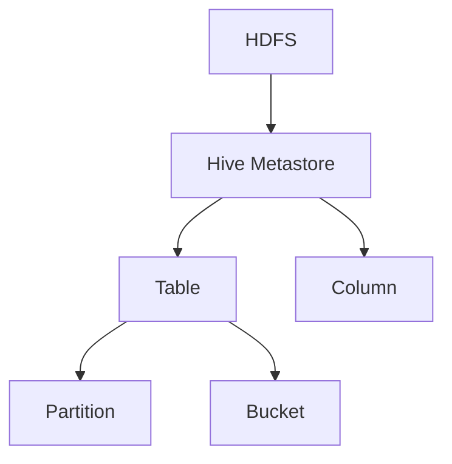
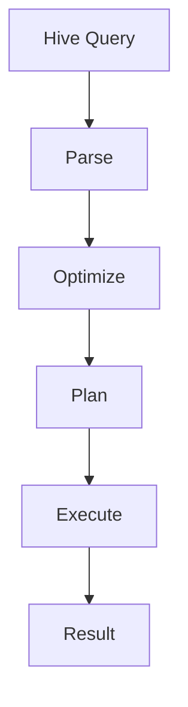
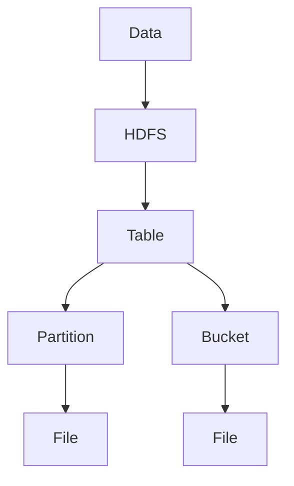

                 

# 《Hive原理与代码实例讲解》

## 关键词

- Hive
- 数据仓库
- 分布式计算
- 大数据技术
- 批处理
- SQL
- 数据模型
- 分区
- 分桶
- 性能优化
- 安全
- 扩展与生态
- 实践案例

## 摘要

本文将深入讲解Hive的原理与代码实例。Hive作为大数据领域的核心技术之一，广泛应用于数据仓库和分布式计算。本文从基础概念入手，详细阐述了Hive的数据模型、基本操作、分区与分桶、函数、性能优化等方面，并通过实际代码实例进行了解释。同时，还探讨了Hive在分布式计算中的应用，以及在企业级应用中的实践。最后，本文对Hive的高级特性进行了介绍，包括Metastore、安全机制、扩展与生态等方面。通过本文的学习，读者可以全面了解Hive的原理和应用，为实际项目开发打下坚实基础。

# 《Hive原理与代码实例讲解》目录大纲

## 第一部分: Hive基础

### 第1章: Hive简介

#### 1.1 Hive的历史背景

Hive是由Facebook开发的一个基于Hadoop的数据仓库工具，用于处理大规模结构化数据。自2008年发布以来，Hive已经成为大数据领域不可或缺的技术之一。本文将介绍Hive的历史背景，包括其起源和发展过程。

#### 1.2 Hive的核心概念

Hive的核心概念包括数据模型、HiveQL（类似于SQL的查询语言）、HDFS（Hadoop分布式文件系统）等。本文将详细解释这些核心概念，帮助读者理解Hive的工作原理。

#### 1.3 Hive的数据模型

Hive的数据模型是基于HDFS的，支持多种数据类型和文件格式。本文将介绍Hive的数据模型，包括其架构和主要特点。

### 第2章: Hive的安装与配置

#### 2.1 Hive的安装

本文将介绍Hive的安装方法，包括从源代码编译和从第三方仓库安装两种方式。

#### 2.2 Hive的配置

Hive的配置文件是hivconf.xml，本文将详细介绍配置文件的配置项，包括存储、查询、安全等各方面的配置。

#### 2.3 Hive的启动与关闭

本文将讲解Hive的启动与关闭过程，包括命令行操作和自动化启动方法。

### 第3章: Hive的基本操作

#### 3.1 DDL操作

DDL（数据定义语言）操作用于创建、修改和删除数据库、表等结构。本文将详细介绍DDL操作，并通过代码实例进行讲解。

#### 3.2 DML操作

DML（数据操作语言）操作用于插入、更新和删除数据。本文将讲解DML操作，并通过代码实例进行演示。

#### 3.3 数据查询操作

数据查询操作是Hive最核心的功能之一。本文将介绍Hive的查询操作，包括简单的查询语句和复杂的查询技巧。

### 第4章: Hive的分区与分桶

#### 4.1 分区的概念与操作

分区是将数据按照某个或某些列进行划分，以优化查询性能。本文将介绍分区的概念和操作，并通过代码实例进行演示。

#### 4.2 分桶的概念与操作

分桶是将数据按照某个或某些列进行分区，并在每个分区中进一步划分数据。本文将介绍分桶的概念和操作，并通过代码实例进行演示。

#### 4.3 分区与分桶的性能优化

分区和分桶可以显著提高查询性能。本文将探讨分区与分桶的性能优化策略。

### 第5章: Hive的函数

#### 5.1 常用内置函数

Hive提供了丰富的内置函数，包括字符串处理、数学运算、日期处理等。本文将介绍常用内置函数，并通过代码实例进行讲解。

#### 5.2 用户自定义函数（UDF）

用户自定义函数（UDF）允许用户编写自定义函数，以处理特定的数据操作。本文将介绍UDF的编写和使用方法，并通过代码实例进行演示。

#### 5.3 用户自定义聚合函数（UDAF）

用户自定义聚合函数（UDAF）用于对数据集进行聚合操作。本文将介绍UDAF的编写和使用方法，并通过代码实例进行演示。

#### 5.4 用户自定义表生成函数（UDTF）

用户自定义表生成函数（UDTF）用于将单行数据生成多行数据。本文将介绍UDTF的编写和使用方法，并通过代码实例进行演示。

## 第二部分: Hive进阶

### 第6章: Hive的性能优化

#### 6.1 Hive的性能瓶颈

本文将分析Hive的性能瓶颈，包括CPU、内存、I/O等方面的限制。

#### 6.2 Hive的查询优化

查询优化是提高Hive性能的关键。本文将介绍Hive的查询优化策略，包括执行计划、索引、分区等。

#### 6.3 Hive的存储优化

存储优化可以降低存储成本，提高查询性能。本文将介绍Hive的存储优化策略，包括文件格式、压缩、存储策略等。

#### 6.4 Hive的并发控制

Hive支持并发查询，但需要合理控制以避免性能问题。本文将介绍Hive的并发控制策略。

### 第7章: Hive在分布式计算中的应用

#### 7.1 分布式计算概述

分布式计算是大数据处理的关键技术。本文将介绍分布式计算的基本概念和原理。

#### 7.2 Hive on Spark

Spark是分布式计算框架，与Hive集成可以实现高效的分布式查询。本文将介绍Hive on Spark的原理和配置。

#### 7.3 Hive on YARN

YARN是Hadoop的下一代资源调度框架，与Hive集成可以实现更灵活的资源管理。本文将介绍Hive on YARN的原理和配置。

#### 7.4 Hive on Hadoop

Hadoop是分布式计算的开源框架，与Hive集成可以实现高效的数据处理。本文将介绍Hive on Hadoop的原理和配置。

### 第8章: Hive在企业级应用中的实践

#### 8.1 Hive在企业级应用中的挑战

企业级应用面临众多挑战，包括数据量巨大、查询复杂、性能要求高等。本文将分析Hive在企业级应用中面临的挑战。

#### 8.2 Hive在企业级应用中的案例

本文将介绍一些典型的Hive企业级应用案例，包括数据仓库、实时数据处理、机器学习等。

#### 8.3 Hive在企业级应用中的最佳实践

最佳实践是确保Hive在企业级应用中高效运行的关键。本文将总结Hive在企业级应用中的最佳实践。

## 第三部分: Hive高级特性

### 第9章: Hive Metastore

#### 9.1 Metastore的概念

Metastore是Hive的数据存储和管理系统。本文将介绍Metastore的概念和作用。

#### 9.2 Metastore的架构

Metastore的架构包括元数据存储、服务层、客户端等。本文将详细解析Metastore的架构。

#### 9.3 Metastore的配置与管理

本文将介绍Metastore的配置和管理方法，包括元数据存储的选择、配置文件的修改等。

### 第10章: Hive安全

#### 10.1 Hive的安全架构

Hive的安全架构包括权限管理、加密机制等。本文将分析Hive的安全架构。

#### 10.2 Hive的权限管理

权限管理是确保数据安全的重要手段。本文将介绍Hive的权限管理机制，包括权限的设置和查询。

#### 10.3 Hive的加密机制

加密机制是保护数据隐私的关键技术。本文将介绍Hive的加密机制，包括数据加密和访问控制。

### 第11章: Hive的扩展与生态

#### 11.1 Hive的插件机制

Hive的插件机制允许用户扩展Hive的功能。本文将介绍Hive的插件机制，包括插件的开发和使用。

#### 11.2 Hive与Hadoop生态的整合

Hadoop生态系统提供了丰富的组件，与Hive的整合可以实现更强大的数据处理能力。本文将介绍Hive与Hadoop生态的整合，包括Hive与HBase、HDFS等的协同工作。

#### 11.3 Hive社区与贡献

Hive社区是Hive的核心，为用户提供了丰富的资源和支持。本文将介绍Hive社区的组织结构、活动和贡献方式。

### 第12章: Hive的未来发展

#### 12.1 Hive的新特性

Hive不断更新和发展，引入了许多新特性。本文将介绍Hive的新特性，包括Hive 2.0、Hive on Spark 3.0等。

#### 12.2 Hive的未来趋势

Hive的未来发展受到大数据技术和分布式计算趋势的影响。本文将分析Hive的未来趋势。

#### 12.3 Hive与其他大数据技术的融合

Hive与其他大数据技术的融合可以实现更高效的数据处理。本文将介绍Hive与Spark、Flink等的融合。

## 附录

### 附录A: 常见问题解答

本文将收集和解答读者在学习和使用Hive过程中可能遇到的问题。

### 附录B: Hive常用配置参数

本文将列出Hive常用的配置参数，并解释其作用和配置方法。

### 附录C: Hive操作代码实例

本文将提供一系列Hive操作代码实例，包括DDL、DML、查询等，帮助读者实践Hive的基本操作。

### 附录D: Hive开发环境搭建指南

本文将详细介绍Hive开发环境的搭建方法，包括Windows、Linux和Docker环境。

### 附录E: Mermaid流程图

本文将提供一系列Mermaid流程图，帮助读者更好地理解Hive的核心概念和流程。

### 附录F: 数学模型与公式

本文将列出Hive中常用的数学模型和公式，帮助读者理解和应用Hive的性能优化策略。

### 附录G: 伪代码示例

本文将提供一系列伪代码示例，帮助读者理解和实现Hive的算法原理。

### 附录H: 项目实战案例

本文将介绍一系列Hive项目实战案例，帮助读者将Hive应用于实际场景。

### 附录I: 开发环境搭建指南

本文将详细讲解Hive在不同操作系统和Docker环境下的搭建方法。

## 附录J: 延伸阅读

本文将推荐一些Hive相关的书籍、文档和资源，供读者进一步学习和探索。

---

以上是《Hive原理与代码实例讲解》的目录大纲。接下来，我们将逐步深入讲解每个章节的内容。希望通过本文的讲解，读者能够全面掌握Hive的原理和代码实例，为实际项目开发提供有力支持。

# 第1章: Hive简介

### 1.1 Hive的历史背景

Hive是由Facebook于2008年开发的一个数据仓库工具，它基于Hadoop生态系统，用于处理大规模的结构化数据。在Hive出现之前，Facebook面临着如何高效管理和查询海量的日志数据的问题。传统的数据仓库解决方案在处理这些数据时显得力不从心，而且成本高昂。因此，Facebook决定开发一个基于Hadoop的数据仓库工具，这就是Hive的起源。

Hive的第一个版本于2009年发布，随后逐步完善并开源。2010年，Hive被Apache Software Foundation接受为孵化项目，并于2013年成为Apache的一个顶级项目。随着大数据技术的快速发展，Hive也成为了大数据领域的重要工具之一。

Hive的诞生不仅解决了Facebook内部的数据管理问题，还为其他企业提供了一个高效、可靠的大数据解决方案。许多大型企业和互联网公司，如Twitter、Yahoo、LinkedIn等，都在其大数据平台上使用了Hive。

### 1.2 Hive的核心概念

Hive的核心概念主要包括数据模型、HiveQL和HDFS。理解这些概念是掌握Hive的关键。

#### 数据模型

Hive的数据模型是基于HDFS的。在HDFS中，数据被存储在文件系统中，这些文件可以被Hive看作是一个个数据表。每个表由多个文件组成，这些文件可以是文本文件、SequenceFile、ORCFile等不同格式的文件。

Hive的数据模型包括表（Table）、分区（Partition）和分桶（Bucket）。表是Hive的基本数据结构，用于存储数据。分区是对表进行划分，以便于查询优化和数据的维护。分桶是在每个分区中，根据某个或某些列对数据进行进一步的划分，以提高查询性能。

#### HiveQL

HiveQL是Hive的查询语言，它类似于SQL，用于对Hive中的数据进行查询、更新、插入等操作。HiveQL支持大多数常见的SQL语句，包括SELECT、JOIN、GROUP BY、ORDER BY等。此外，HiveQL还支持自定义函数（UDF）、用户自定义聚合函数（UDAF）和用户自定义表生成函数（UDTF）。

HiveQL的主要优势在于它能够将复杂的SQL查询转化为MapReduce作业，从而处理大规模的数据集。这意味着，Hive不仅能够处理结构化数据，还能够处理半结构化和非结构化数据。

#### HDFS

HDFS（Hadoop Distributed File System）是Hadoop的分布式文件系统，用于存储大规模数据。HDFS的设计目标是高吞吐量、高可靠性，以及高可扩展性。它由一个主节点（NameNode）和多个数据节点（DataNode）组成。主节点负责管理文件系统的命名空间和客户端访问，而数据节点负责存储实际的数据块。

HDFS的主要特点包括：

1. 高容错性：HDFS能够自动在数据节点之间复制数据，确保数据的高可靠性。
2. 高吞吐量：HDFS能够处理大量数据的读写操作，非常适合大数据处理。
3. 高扩展性：HDFS能够轻松地添加新的数据节点，以适应数据量的增长。

### 1.3 Hive的数据模型

Hive的数据模型是基于HDFS的，支持多种数据类型和文件格式。下面将详细介绍Hive的数据模型。

#### 数据类型

Hive支持多种数据类型，包括：

- 基本数据类型：包括整数、浮点数、字符串、布尔值等。
- 复杂数据类型：包括数组、映射、结构体等。

#### 文件格式

Hive支持多种文件格式，包括：

- TextFile：文本文件，是最简单的文件格式，每行是一个记录，字段之间用分隔符分隔。
- SequenceFile：序列化文件，是一种高效的存储格式，适用于顺序读写。
- ORCFile：优化列式存储格式，是Hive的默认存储格式，适用于随机读写。
- Parquet：列式存储格式，是Apache Spark和Hive的推荐存储格式，适用于大规模数据处理。

#### 数据表

在Hive中，数据表是存储数据的基本结构。每个表由多个文件组成，这些文件可以是不同的格式。表可以具有一个或多个分区，每个分区也是一个独立的表。分区可以提高查询性能，因为查询可以只针对特定的分区进行。

#### 数据分区

数据分区是将数据按照某个或某些列进行划分，以便于查询优化和数据的维护。分区列可以是基本数据类型或复杂数据类型。分区可以是静态分区，也可以是动态分区。

#### 数据分桶

数据分桶是在每个分区中，根据某个或某些列对数据进行进一步的划分，以提高查询性能。分桶列可以是基本数据类型或复杂数据类型。分桶可以显著提高查询性能，因为查询可以只针对特定的分桶进行。

### 1.4 小结

Hive是一个基于Hadoop的数据仓库工具，用于处理大规模结构化数据。它基于HDFS，支持多种数据类型和文件格式。Hive的核心概念包括数据模型、HiveQL和HDFS。理解这些概念是掌握Hive的关键。在下一章中，我们将介绍Hive的安装与配置。

---

接下来，我们将进入下一章，讲解Hive的安装与配置。在此之前，请确保您已经具备基本的Hadoop知识和环境。这将有助于您更好地理解Hive的安装和配置过程。

# 第2章: Hive的安装与配置

### 2.1 Hive的安装

Hive的安装相对简单，通常有两种安装方式：从源代码编译和从第三方仓库安装。

#### 从源代码编译

从源代码编译Hive可以确保您获得最新的功能。以下是编译Hive的步骤：

1. **安装Hadoop**：确保Hadoop已经安装并运行，因为Hive依赖于Hadoop。请参考[Hadoop官方文档](https://hadoop.apache.org/docs/r2.7.4/hadoop-project-dist/hadoop-common/SingleCluster.html)进行安装。

2. **获取Hive源代码**：可以从Apache Hive的GitHub仓库获取源代码。您可以使用Git命令克隆仓库：

   ```shell
   git clone https://github.com/apache/hive.git
   ```

3. **编译Hive**：进入Hive源代码目录，并执行下面的命令：

   ```shell
   mvn clean package -DskipTests -Pdist,src
   ```

   这将编译Hive，并生成编译后的文件。

4. **安装Hive**：将编译生成的`hive-assembly-<version>.tar.gz`文件解压到适当的目录，例如`/usr/local/hive`。

   ```shell
   tar zxvf hive-assembly-<version>.tar.gz -C /usr/local/hive
   ```

5. **配置环境变量**：在`/usr/local/hive/conf`目录下，复制`hive-env.sh.template`为`hive-env.sh`，并编辑此文件，设置Hadoop的HDFS和YARN配置。

   ```shell
   cp hive-env.sh.template hive-env.sh
   vi hive-env.sh
   ```

   在`hive-env.sh`中设置如下环境变量：

   ```shell
   export HADOOP_HOME=/usr/local/hadoop
   export YARN_HOME=/usr/local/yarn
   export HIVE_HOME=/usr/local/hive
   export PATH=$PATH:$HIVE_HOME/bin
   ```

6. **启动Hive**：在终端中运行以下命令启动Hive：

   ```shell
   hive
   ```

   这将进入Hive的命令行界面。

#### 从第三方仓库安装

从第三方仓库安装Hive是一种更快捷的方式，通常不需要编译源代码。以下是安装步骤：

1. **下载Hive安装包**：从[Apache Hive下载页面](https://www.apache.org/dyn/closer.cgi/hive/)下载适合您的操作系统的Hive安装包。

2. **安装Hive**：将下载的安装包解压到适当的目录，例如`/usr/local/hive`。

   ```shell
   tar zxvf hive-<version>-bin.tar.gz -C /usr/local/hive
   ```

3. **配置环境变量**：同上，设置Hadoop、YARN和Hive的环境变量。

4. **启动Hive**：运行以下命令启动Hive：

   ```shell
   hive
   ```

### 2.2 Hive的配置

Hive的配置主要涉及`hivconf.xml`文件，该文件位于Hive的`conf`目录下。以下是一些关键的配置项：

1. **HDFS配置**：

   ```xml
   <property>
       <name>hive.metastore.warehouse.dir</name>
       <value>/user/hive/warehouse</value>
       <description>HDFS中存储表数据的位置</description>
   </property>
   ```

   该配置项指定了HDFS中存储表数据的位置。

2. **Hadoop配置**：

   ```xml
   <property>
       <name>hive.exec.driverłychain.class</name>
       <value>org.apache.hadoop.hive.ql.exec.DDLDriver</value>
       <description>执行DDL操作的驱动类</description>
   </property>
   ```

   该配置项指定了执行DDL操作的驱动类。

3. **查询优化配置**：

   ```xml
   <property>
       <name>hive.auto.convert.join</name>
       <value>true</value>
       <description>自动将小表与大表进行Map Join</description>
   </property>
   ```

   该配置项启用了自动将小表与大表进行Map Join的功能，以提高查询性能。

4. **日志配置**：

   ```xml
   <property>
       <name>hive.root.logger</name>
       <value>INFO,console</value>
       <description>Hive的日志级别</description>
   </property>
   ```

   该配置项指定了Hive的日志级别。

### 2.3 Hive的启动与关闭

#### 启动Hive

1. **启动HDFS和YARN**：确保Hadoop的HDFS和YARN服务已经启动。

2. **启动Hive Metastore**：运行以下命令启动Hive Metastore服务。

   ```shell
   hive --service metastore
   ```

3. **启动Hive Server**：运行以下命令启动Hive Server。

   ```shell
   hive --service hiveserver2
   ```

   如果使用Hive Server 2，还可以使用以下命令启动：

   ```shell
   hive --service hiveserver2 --hiveconf hive.server2.thrift.port=<port>
   ```

   其中`<port>`是Hive Server 2的端口号。

#### 关闭Hive

1. **关闭Hive Server**：运行以下命令关闭Hive Server。

   ```shell
   hive --service hiveserver2 stop
   ```

2. **关闭Hive Metastore**：运行以下命令关闭Hive Metastore。

   ```shell
   hive --service metastore stop
   ```

3. **关闭Hadoop服务**：关闭HDFS和YARN服务。

### 2.4 小结

Hive的安装与配置是使用Hive的基础。通过本章的介绍，您已经了解了Hive的安装方法和配置项，以及如何启动和关闭Hive。在下一章中，我们将介绍Hive的基本操作，包括DDL、DML和数据查询操作。

---

在完成本章的学习后，请确保您已经成功安装并配置了Hive，并能够启动和关闭Hive服务。在实际操作中，可能会遇到各种问题，请参考附录中的常见问题解答部分进行解决。

# 第3章: Hive的基本操作

Hive作为大数据处理的重要工具，其基本操作包括数据定义语言（DDL）、数据操作语言（DML）以及数据查询操作。以下将详细介绍这些基本操作。

### 3.1 DDL操作

DDL（数据定义语言）用于定义数据库、表、列等结构。以下是Hive中常见的DDL操作：

#### 创建数据库

```sql
CREATE DATABASE IF NOT EXISTS <database_name>;
```

该命令创建一个名为`<database_name>`的数据库，如果数据库已存在则不会报错。

#### 删除数据库

```sql
DROP DATABASE IF EXISTS <database_name>;
```

该命令删除名为`<database_name>`的数据库，如果数据库不存在则不会报错。

#### 显示数据库

```sql
SHOW DATABASES;
```

该命令显示所有已创建的数据库。

#### 使用数据库

```sql
USE <database_name>;
```

该命令将当前会话切换到指定的数据库。

#### 创建表

```sql
CREATE TABLE IF NOT EXISTS <table_name>(
    <column_name> <data_type> COMMENT '描述',
    <column_name> <data_type> COMMENT '描述',
    ...
)
COMMENT '表描述'
ROW FORMAT DELIMITED
FIELDS TERMINATED BY '\t'
STORED AS TEXTFILE;
```

该命令创建一个名为`<table_name>`的表，并定义表的结构。例如：

```sql
CREATE TABLE IF NOT EXISTS student(
    id INT COMMENT '学生ID',
    name STRING COMMENT '学生姓名',
    age INT COMMENT '学生年龄'
)
COMMENT '学生信息表'
ROW FORMAT DELIMITED
FIELDS TERMINATED BY '\t'
STORED AS TEXTFILE;
```

#### 删除表

```sql
DROP TABLE IF EXISTS <table_name>;
```

该命令删除名为`<table_name>`的表，如果表不存在则不会报错。

#### 显示表

```sql
SHOW TABLES;
```

该命令显示当前数据库中的所有表。

#### 查看表结构

```sql
DESCRIBE <table_name>;
```

该命令显示名为`<table_name>`的表的结构。

### 3.2 DML操作

DML（数据操作语言）用于插入、更新和删除数据。以下是Hive中常见的DML操作：

#### 插入数据

```sql
INSERT INTO TABLE <table_name> VALUES (<value1>, <value2>, ...);
```

该命令将数据插入到名为`<table_name>`的表中。例如：

```sql
INSERT INTO student VALUES (1, 'Alice', 20);
```

#### 更新数据

```sql
UPDATE <table_name> SET <column_name>=<value> WHERE <condition>;
```

该命令更新名为`<table_name>`的表中满足`<condition>`条件的行的`<column_name>`列的值为`<value>`。例如：

```sql
UPDATE student SET age=21 WHERE id=1;
```

#### 删除数据

```sql
DELETE FROM <table_name> WHERE <condition>;
```

该命令删除名为`<table_name>`的表中满足`<condition>`条件的行。例如：

```sql
DELETE FROM student WHERE id=1;
```

### 3.3 数据查询操作

数据查询操作是Hive的核心功能之一。以下是Hive中常见的查询操作：

#### 查询所有数据

```sql
SELECT * FROM <table_name>;
```

该命令查询名为`<table_name>`的表的所有数据。

#### 查询指定列

```sql
SELECT <column_name1>, <column_name2> FROM <table_name>;
```

该命令查询名为`<table_name>`的表的`<column_name1>`和`<column_name2>`列的数据。

#### 条件查询

```sql
SELECT * FROM <table_name> WHERE <condition>;
```

该命令查询名为`<table_name>`的表中满足`<condition>`条件的行。

#### 聚合查询

```sql
SELECT <aggregate_function>(<column_name>) FROM <table_name> WHERE <condition>;
```

该命令对名为`<table_name>`的表中的`<column_name>`列进行聚合操作，并返回满足`<condition>`条件的结果。常见的聚合函数包括`COUNT()`、`SUM()`、`AVG()`、`MAX()`、`MIN()`等。

#### 排序查询

```sql
SELECT * FROM <table_name> WHERE <condition> ORDER BY <column_name>;
```

该命令查询名为`<table_name>`的表中满足`<condition>`条件的行，并按照`<column_name>`列进行排序。

#### 连接查询

```sql
SELECT <table1>.<column_name1>, <table2>.<column_name2> FROM <table1> JOIN <table2> ON <table1>.<column_name1> = <table2>.<column_name2>;
```

该命令执行两个表的连接查询，并返回连接后的结果。常见的连接类型包括内连接（INNER JOIN）、左连接（LEFT JOIN）、右连接（RIGHT JOIN）和全连接（FULL JOIN）。

### 3.4 小结

Hive的基本操作包括DDL、DML和数据查询。通过这些操作，可以定义数据库、表和列的结构，插入、更新和删除数据，以及查询数据。熟练掌握这些基本操作是使用Hive进行大数据处理的基础。在下一章中，我们将介绍Hive的分区与分桶操作。

---

在实际操作中，您可能会遇到各种错误和问题。附录中的常见问题解答部分提供了许多常见问题的解决方案，可以帮助您快速解决问题。

# 第4章: Hive的分区与分桶

分区（Partitioning）和分桶（Bucketing）是Hive优化查询性能的重要特性。通过分区和分桶，Hive可以将数据存储在更细粒度的目录中，从而提高查询效率。以下将详细介绍分区和分桶的概念、操作以及性能优化策略。

### 4.1 分区的概念与操作

#### 分区的概念

分区是将数据按照某个或某些列的值进行划分，从而将一个表分成多个更小的子表。分区可以提高查询性能，因为查询可以只针对特定的分区进行，而不需要扫描整个表。

在Hive中，每个分区都是一个独立的表。这意味着，对分区表的操作（如查询、插入、更新和删除）实际上是针对分区表的操作。

#### 分区的操作

分区操作主要包括创建分区表、添加分区和查询分区表。

##### 创建分区表

```sql
CREATE TABLE IF NOT EXISTS <table_name>(
    <column_name1> <data_type> COMMENT '描述',
    <column_name2> <data_type> COMMENT '描述',
    ...
)
COMMENT '表描述'
PARTITIONED BY (
    <partition_column1> <data_type> COMMENT '描述',
    <partition_column2> <data_type> COMMENT '描述',
    ...
)
ROW FORMAT DELIMITED
FIELDS TERMINATED BY '\t'
STORED AS TEXTFILE;
```

该命令创建一个名为`<table_name>`的分区表，并定义表的结构和分区列。例如：

```sql
CREATE TABLE IF NOT EXISTS sales(
    product_id STRING COMMENT '产品ID',
    quantity INT COMMENT '销售数量',
    sale_date DATE COMMENT '销售日期'
)
COMMENT '销售数据表'
PARTITIONED BY (
    country STRING COMMENT '国家',
    month INT COMMENT '月份'
)
ROW FORMAT DELIMITED
FIELDS TERMINATED BY '\t'
STORED AS TEXTFILE;
```

##### 添加分区

```sql
ALTER TABLE <table_name> ADD PARTITION (<partition_value>) VALUES (<value>);
```

该命令为名为`<table_name>`的分区表添加一个分区，分区列的值为`<partition_value>`，分区值可以是一个列表。

例如，为`sales`表添加一个名为“China”的国家的2023年1月的分区：

```sql
ALTER TABLE sales ADD PARTITION (country='China', month=1) VALUES ('2023-01');
```

##### 查询分区表

查询分区表与查询普通表类似。例如，查询“China”国家2023年1月的销售数据：

```sql
SELECT * FROM sales WHERE country='China' AND month=1;
```

### 4.2 分桶的概念与操作

#### 分桶的概念

分桶是将数据按照某个或某些列的值进行划分，从而将一个表分成多个更小的子集。与分区不同，分桶是针对行级别的数据划分，而不是列级别的数据划分。

在Hive中，每个分桶都是一个独立的文件。这意味着，对分桶表的操作（如查询、插入、更新和删除）实际上是针对分桶文件的操作。

#### 分桶的操作

分桶操作主要包括创建分桶表、添加分桶和查询分桶表。

##### 创建分桶表

```sql
CREATE TABLE IF NOT EXISTS <table_name>(
    <column_name1> <data_type> COMMENT '描述',
    <column_name2> <data_type> COMMENT '描述',
    ...
)
COMMENT '表描述'
CLUSTERED BY (
    <column_name> <data_type>
)
ROW FORMAT DELIMITED
FIELDS TERMINATED BY '\t'
STORED AS TEXTFILE;
```

该命令创建一个名为`<table_name>`的分桶表，并定义表的结构和分桶列。例如：

```sql
CREATE TABLE IF NOT EXISTS employee(
    id INT COMMENT '员工ID',
    name STRING COMMENT '员工姓名',
    department STRING COMMENT '部门'
)
COMMENT '员工信息表'
CLUSTERED BY (id)
ROW FORMAT DELIMITED
FIELDS TERMINATED BY '\t'
STORED AS TEXTFILE;
```

##### 添加分桶

Hive自动对插入到分桶表的数据进行分桶。因此，您无需手动添加分桶。当插入数据时，Hive会根据分桶列的值将数据存储到对应的分桶文件中。

##### 查询分桶表

查询分桶表与查询普通表类似。例如，查询ID为1的员工信息：

```sql
SELECT * FROM employee WHERE id=1;
```

### 4.3 分区与分桶的性能优化

分区和分桶可以显著提高查询性能，但需要合理使用。以下是一些性能优化策略：

#### 1. 合理选择分区列和分桶列

- 分区列应选择经常用于过滤条件的列，以提高查询性能。
- 分桶列应选择能够均匀分布数据的列，以避免某些分桶文件过载。

#### 2. 使用分区和分桶联合优化

- 当分区和分桶联合使用时，查询可以只针对特定的分区和分桶进行，从而提高查询性能。

#### 3. 合理设置分区和分桶的级别

- 分区和分桶的级别越高，查询性能越好。但过高的级别可能导致过多的文件和分区，影响性能。

#### 4. 使用压缩

- 对分区和分桶表的数据进行压缩，可以减少存储空间和I/O开销，提高查询性能。

#### 5. 使用索引

- 对分区和分桶表建立适当的索引，可以提高查询性能。

### 4.4 小结

分区和分桶是Hive优化查询性能的重要特性。通过合理使用分区和分桶，可以显著提高查询效率。在实际应用中，需要根据数据特点和查询需求，选择合适的分区列和分桶列，并采用适当的性能优化策略。在下一章中，我们将介绍Hive的函数，包括内置函数、用户自定义函数（UDF）、用户自定义聚合函数（UDAF）和用户自定义表生成函数（UDTF）。

---

在实际项目中，合理使用分区和分桶可以大大提高查询性能。了解分区和分桶的优化策略，有助于更好地利用Hive处理大规模数据。在下一章中，我们将深入探讨Hive的函数，学习如何自定义函数，以及如何使用这些函数优化查询。

# 第5章: Hive的函数

Hive提供了丰富的内置函数，包括字符串处理、数学运算、日期处理等，同时支持用户自定义函数（UDF）、用户自定义聚合函数（UDAF）和用户自定义表生成函数（UDTF）。在本章中，我们将详细介绍这些函数的概念、使用方法和实际案例。

### 5.1 常用内置函数

内置函数是Hive的核心功能之一，用于对数据进行各种操作。以下是一些常用的内置函数及其用法。

#### 字符串处理函数

1. **LOWER(str)**: 将字符串转换为小写。

   ```sql
   SELECT LOWER(name) FROM student;
   ```

2. **UPPER(str)**: 将字符串转换为大写。

   ```sql
   SELECT UPPER(name) FROM student;
   ```

3. **LENGTH(str)**: 返回字符串的长度。

   ```sql
   SELECT LENGTH(name) FROM student;
   ```

4. **SUBSTRING(str, start, length)**: 返回字符串的子字符串。

   ```sql
   SELECT SUBSTRING(name, 1, 3) FROM student;
   ```

#### 数学运算函数

1. **ABS(num)**: 返回数字的绝对值。

   ```sql
   SELECT ABS(-5) FROM student;
   ```

2. **SQRT(num)**: 返回数字的平方根。

   ```sql
   SELECT SQRT(16) FROM student;
   ```

3. **PI()**: 返回圆周率π的值。

   ```sql
   SELECT PI() FROM student;
   ```

#### 日期处理函数

1. **CURRENT_DATE()**: 返回当前日期。

   ```sql
   SELECT CURRENT_DATE() FROM student;
   ```

2. **DATE_ADD(date, interval)**: 在给定日期上增加指定的时间间隔。

   ```sql
   SELECT DATE_ADD('2023-01-01', 30) FROM student;
   ```

3. **DATE_SUB(date, interval)**: 在给定日期上减少指定的时间间隔。

   ```sql
   SELECT DATE_SUB('2023-01-01', 30) FROM student;
   ```

### 5.2 用户自定义函数（UDF）

用户自定义函数（UDF）允许用户编写自定义的函数，以处理特定的数据操作。以下是一个简单的UDF示例。

#### 创建UDF

```java
public class UDFUpper extends UDF {
    public String evaluate(String str) {
        return str.toUpperCase();
    }
}
```

#### 编译UDF

使用Maven编译UDF：

```shell
mvn compile
```

#### 加载UDF

在Hive中加载UDF：

```sql
ADD JAR /path/to/udf_upper.jar;
CREATE FUNCTION upper_udf AS 'com.example.UDFUpper' USING JAR '/path/to/udf_upper.jar';
```

#### 使用UDF

```sql
SELECT upper_udf(name) FROM student;
```

### 5.3 用户自定义聚合函数（UDAF）

用户自定义聚合函数（UDAF）用于对数据集进行聚合操作。以下是一个简单的UDAF示例。

#### 创建UDAF

```java
public class UDAFCount extends UDAF {
    public static class CountBuffer implements Writable {
        private int count;
        public void reset() {
            count = 0;
        }
        public void increment() {
            count++;
        }
        public void readFields(DataInput in) throws IOException {
            count = in.readInt();
        }
        public void write(DataOutput out) throws IOException {
            out.writeInt(count);
        }
    }
    public CountBuffer evaluate() {
        return new CountBuffer();
    }
    public CountBuffer aggregate(CountBuffer buffer) {
        if (buffer == null) return null;
        return new CountBuffer(buffer);
    }
    public void merge(CountBuffer buffer) {
        if (buffer != null) {
            buffer.increment();
        }
    }
}
```

#### 编译UDAF

使用Maven编译UDAF：

```shell
mvn compile
```

#### 加载UDAF

在Hive中加载UDAF：

```sql
ADD JAR /path/to/udaf_count.jar;
CREATE FUNCTION count_udaf AS 'com.example.UDAFCount' USING JAR '/path/to/udaf_count.jar';
```

#### 使用UDAF

```sql
SELECT count_udaf(*) FROM student;
```

### 5.4 用户自定义表生成函数（UDTF）

用户自定义表生成函数（UDTF）用于将单行数据生成多行数据。以下是一个简单的UDTF示例。

#### 创建UDTF

```java
public class UDTFSplit extends UDTF {
    public void initialize() {
        addColumn("word");
    }
    public void process(String str) {
        for (String word : str.split(" ")) {
            forward(word);
        }
    }
}
```

#### 编译UDTF

使用Maven编译UDTF：

```shell
mvn compile
```

#### 加载UDTF

在Hive中加载UDTF：

```sql
ADD JAR /path/to/udtf_split.jar;
CREATE FUNCTION split_udtf AS 'com.example.UDTFSplit' USING JAR '/path/to/udtf_split.jar';
```

#### 使用UDTF

```sql
SELECT split_udtf(name) FROM student;
```

### 5.5 小结

Hive内置函数提供了丰富的数据处理功能，用户自定义函数（UDF）、用户自定义聚合函数（UDAF）和用户自定义表生成函数（UDTF）则允许用户扩展Hive的功能。通过合理使用这些函数，可以显著提高数据处理效率。在下一章中，我们将探讨Hive的性能优化策略，包括查询优化、存储优化和并发控制。

---

在实际项目中，合理使用Hive的内置函数和自定义函数可以大大提高数据处理效率。了解Hive的性能优化策略，有助于更好地利用Hive处理大规模数据。在下一章中，我们将深入探讨Hive的性能优化策略，以帮助您提升Hive的性能。

# 第6章: Hive的性能优化

Hive在大数据环境中用于处理大规模数据集，性能优化是确保其高效运行的关键。性能优化主要包括查询优化、存储优化和并发控制等方面。本章将详细介绍这些优化策略。

### 6.1 Hive的性能瓶颈

了解Hive的性能瓶颈有助于制定有效的优化策略。以下是一些常见的性能瓶颈：

1. **CPU资源限制**：Hive的查询执行依赖于MapReduce或Spark等分布式计算框架。如果CPU资源不足，可能导致任务执行缓慢。
2. **内存资源限制**：Hive在执行查询时需要加载元数据、执行计划等，内存资源不足可能导致性能下降。
3. **I/O瓶颈**：数据存储在HDFS上，I/O性能直接影响查询效率。I/O瓶颈通常表现为数据读取速度慢或数据写入速度慢。
4. **网络延迟**：Hive的分布式查询涉及到多个数据节点的通信，网络延迟会影响查询性能。
5. **数据规模和查询复杂度**：数据规模庞大且查询复杂度高时，查询执行时间可能会显著增加。

### 6.2 Hive的查询优化

查询优化是提高Hive性能的关键。以下是一些常用的查询优化策略：

1. **选择合适的文件格式**：选择适合查询需求的文件格式可以显著提高查询性能。例如，ORCFile和Parquet是高效的列式存储格式，适用于大量数据的快速查询。

   ```sql
   -- 使用ORCFile格式创建表
   CREATE TABLE sales(
       ...
   ) STORED AS ORC;
   ```

2. **创建合适的索引**：索引可以加快查询速度。Hive支持多种索引类型，如索引表（Indexed Tables）和位图索引（Bitmap Indexes）。

   ```sql
   -- 创建位图索引
   CREATE INDEX index_name ON TABLE sales (column_name);
   ```

3. **优化查询计划**：通过分析执行计划，可以找到查询优化点。Hive的执行计划可以使用`EXPLAIN`语句查看。

   ```sql
   EXPLAIN SELECT * FROM sales WHERE country='China';
   ```

4. **使用分区和分桶**：分区和分桶可以减少查询范围，提高查询性能。合理选择分区列和分桶列可以提高查询效率。

   ```sql
   -- 创建分区表
   CREATE TABLE sales PARTITIONED BY (country STRING);
   ```

5. **使用Map Join**：当小表与大表进行JOIN操作时，可以使用Map Join来提高查询性能。Map Join适用于小表与大表的比例大于0.1的情况。

   ```sql
   SET hive.auto.convert.join = true;
   ```

6. **减少数据转换**：避免不必要的类型转换和数据格式转换，可以减少CPU和I/O开销。

7. **合理设置并行度**：合理设置MapReduce任务的并行度可以充分利用集群资源。Hive支持通过设置`mapred.reduce.tasks`参数来调整并行度。

   ```sql
   SET mapred.reduce.tasks=10;
   ```

### 6.3 Hive的存储优化

存储优化可以降低存储成本，提高查询性能。以下是一些常用的存储优化策略：

1. **选择合适的存储格式**：不同的存储格式适用于不同的查询场景。TextFile适用于简单的文本数据，ORCFile和Parquet适用于大规模数据的快速查询。

   ```sql
   CREATE TABLE sales STORED AS ORC;
   ```

2. **数据压缩**：使用压缩算法可以减少存储空间和I/O开销，提高查询性能。Hive支持多种压缩算法，如Gzip、LZO和SNAPPY。

   ```sql
   SET hive.exec.compress.output=true;
   SET io.compression.codecs=org.apache.hadoop.io.compress.GzipCodec;
   ```

3. **存储策略**：根据数据的重要性和访问频率，可以设置不同的存储策略。例如，重要数据可以存储在SSD上，以提高访问速度。

4. **数据归档**：将不经常访问的数据归档到低成本存储上，可以降低存储成本。HDFS的HAR文件系统支持数据归档。

   ```sql
   SET hive archive.format.item.size=128;
   ```

### 6.4 Hive的并发控制

Hive支持并发查询，但需要合理控制以避免性能问题。以下是一些常用的并发控制策略：

1. **资源隔离**：通过设置资源隔离策略，可以确保不同查询之间的资源竞争最小化。Hadoop的YARN支持资源隔离。

   ```sql
   SET mapred.yarn.isolation tweak.level=10;
   ```

2. **任务调度**：使用任务调度器（如Apache Oozie或Azkaban）来管理Hive任务的执行顺序，可以避免任务之间的冲突。

3. **限制并发任务数**：通过设置最大并发任务数，可以控制Hive任务的并发执行。例如，使用Hadoop的YARN队列管理器。

   ```sql
   SET mapreduce.jobtracker.taskscheduler.maximumrunningmaps=50;
   ```

4. **任务隔离**：在Hive中，可以使用`SET`语句来隔离任务，确保每个任务的资源不被其他任务占用。

   ```sql
   SET hive.exec.parallel=true;
   ```

### 6.5 小结

Hive的性能优化是一个复杂的过程，需要综合考虑CPU、内存、I/O、网络和并发等多个方面。通过合理的查询优化、存储优化和并发控制，可以显著提高Hive的性能。在实际应用中，需要根据具体场景和需求，灵活选择和调整优化策略。在下一章中，我们将探讨Hive在分布式计算中的应用，包括Hive on Spark和Hive on YARN。

---

通过本章的学习，您已经了解了Hive的性能优化策略，包括查询优化、存储优化和并发控制。在实际项目中，合理应用这些优化策略，可以大大提高Hive的性能。在下一章中，我们将探讨Hive在分布式计算中的应用，进一步了解Hive与其他分布式计算框架的整合。

# 第7章: Hive在分布式计算中的应用

随着大数据技术的不断发展，分布式计算在数据处理中扮演着越来越重要的角色。Hive作为一个成熟的大数据查询引擎，能够在分布式计算环境中发挥重要作用。本章将介绍Hive在分布式计算中的应用，主要包括Hive on Spark、Hive on YARN和Hive on Hadoop。

### 7.1 分布式计算概述

分布式计算是指将一个大任务分解为多个小任务，在多个计算节点上并行执行，最终汇总结果的一种计算模式。分布式计算的主要目标是提高数据处理效率、扩展计算能力和容错性。

分布式计算的基本组件包括：

1. **计算节点**：负责执行任务的节点。
2. **数据存储**：存储处理数据，如HDFS、Amazon S3等。
3. **调度系统**：负责任务调度和资源管理，如MapReduce、YARN、Spark等。

分布式计算的优势包括：

1. **高扩展性**：能够处理大规模数据集。
2. **高可用性**：任务在多个节点上执行，某个节点故障不会影响整体任务执行。
3. **高效性**：通过并行计算，可以显著提高数据处理速度。

### 7.2 Hive on Spark

Apache Spark是一个开源的分布式计算框架，能够提供高性能的批处理和流处理能力。Hive on Spark是将Hive与Spark集成，利用Spark的分布式计算能力来处理Hive查询。

#### Hive on Spark原理

Hive on Spark利用Spark SQL引擎来执行Hive查询。当执行一个Hive查询时，Hive将查询解析为Spark SQL查询，然后Spark SQL引擎执行查询，最终返回结果。这种集成方式使得Hive可以利用Spark强大的计算能力，同时保留Hive的查询语言和元数据管理功能。

#### 安装与配置Hive on Spark

1. **安装Spark**：首先确保Spark已经安装和配置好。

2. **配置Hive**：在Hive的`hive-site.xml`文件中添加以下配置：

   ```xml
   <property>
       <name>hive.on.spark</name>
       <value>true</value>
   </property>
   ```

3. **启动Hive on Spark**：启动Hive时，使用以下命令：

   ```shell
   hive --hiveconf hive.on.spark=true
   ```

#### 示例

```sql
-- 使用Spark SQL执行Hive查询
SELECT * FROM sales;
```

### 7.3 Hive on YARN

YARN（Yet Another Resource Negotiator）是Hadoop的下一代资源调度框架，用于管理计算资源和任务调度。Hive on YARN是将Hive与YARN集成，利用YARN的资源调度能力来执行Hive查询。

#### Hive on YARN原理

Hive on YARN利用YARN的调度能力，将Hive作业分解为多个任务，并分配资源执行。与MapReduce相比，YARN提供了更高的资源利用率和任务调度灵活性。

#### 安装与配置Hive on YARN

1. **安装YARN**：确保YARN已经安装和配置好。

2. **配置Hive**：在Hive的`hive-site.xml`文件中添加以下配置：

   ```xml
   <property>
       <name>hive.exec.mode.local.auto</name>
       <value>true</value>
   </property>
   ```

3. **启动Hive on YARN**：启动Hive时，使用以下命令：

   ```shell
   hive
   ```

#### 示例

```sql
-- 执行Hive查询
SELECT * FROM sales;
```

### 7.4 Hive on Hadoop

Hive on Hadoop是指Hive直接运行在Hadoop平台上。在默认情况下，Hive使用MapReduce作为执行引擎。随着Hadoop版本的更新，Hive也支持使用其他执行引擎，如Spark。

#### Hive on Hadoop原理

Hive on Hadoop利用Hadoop的MapReduce框架来执行Hive查询。当执行一个Hive查询时，Hive将查询转化为MapReduce作业，然后提交给Hadoop集群执行。

#### 安装与配置Hive on Hadoop

1. **安装Hadoop**：确保Hadoop已经安装和配置好。

2. **配置Hive**：在Hive的`hive-site.xml`文件中添加以下配置：

   ```xml
   <property>
       <name>hive.exec.mode.mapred</name>
       <value>true</value>
   </property>
   ```

3. **启动Hive on Hadoop**：启动Hive时，使用以下命令：

   ```shell
   hive
   ```

#### 示例

```sql
-- 执行Hive查询
SELECT * FROM sales;
```

### 7.5 小结

Hive在分布式计算中的应用主要包括Hive on Spark、Hive on YARN和Hive on Hadoop。通过这些集成方式，Hive可以充分利用分布式计算的优势，提高数据处理效率。在实际项目中，根据需求和环境选择合适的集成方式，可以大大提升Hive的性能。在下一章中，我们将探讨Hive在企业级应用中的实践。

---

通过本章的学习，您已经了解了Hive在分布式计算中的应用，包括Hive on Spark、Hive on YARN和Hive on Hadoop。这些集成方式使得Hive能够充分利用分布式计算的优势，提高数据处理效率。在实际项目中，根据需求和环境选择合适的集成方式，可以大大提升Hive的性能。在下一章中，我们将探讨Hive在企业级应用中的实践。

# 第8章: Hive在企业级应用中的实践

Hive在企业级应用中扮演着至关重要的角色，特别是在数据仓库、实时数据处理和机器学习等领域。本章将探讨Hive在企业级应用中的挑战、案例和最佳实践。

### 8.1 Hive在企业级应用中的挑战

#### 数据规模

企业级应用通常需要处理海量数据，数据规模庞大是Hive面临的第一个挑战。Hive能够处理TB甚至PB级别的数据，但随着数据规模的不断扩大，查询性能和资源利用率成为关键问题。

#### 数据多样性

企业级应用的数据来源多样化，包括结构化数据、半结构化数据和非结构化数据。Hive需要能够支持多种数据类型和文件格式，以适应不同类型的数据。

#### 查询性能

企业级应用对查询性能有很高的要求。如何优化Hive查询，提高查询响应速度，是Hive在企业级应用中的另一个挑战。

#### 安全性

企业级应用对数据安全性要求较高。Hive需要提供强大的权限管理和加密机制，确保数据的安全和隐私。

#### 高可用性

企业级应用需要保证系统的稳定运行，Hive需要具备高可用性，确保在节点故障时系统能够自动恢复。

### 8.2 Hive在企业级应用中的案例

#### 数据仓库

数据仓库是企业级应用的核心，用于存储、管理和分析大量历史数据。Hive作为数据仓库的查询引擎，可以高效地处理结构化数据，支持复杂的查询和分析。例如，一个大型电子商务公司使用Hive构建其数据仓库，存储和查询订单数据、用户行为数据等，以支持业务分析和决策。

#### 实时数据处理

实时数据处理是企业级应用中另一个重要领域。Hive虽然主要用于批处理，但通过与其他实时数据处理框架（如Apache Storm或Apache Flink）的整合，可以实现实时数据处理。例如，一家金融机构使用Hive和Storm整合，实现实时监控和预警系统，及时处理交易数据，确保金融市场的稳定。

#### 机器学习

机器学习是企业级应用中越来越重要的领域。Hive可以与机器学习框架（如Apache Mahout或Apache Spark MLlib）结合，用于处理和分析大量数据，构建预测模型。例如，一家零售公司使用Hive和Spark MLlib整合，分析用户购物行为数据，预测用户购买偏好，实现精准营销。

### 8.3 Hive在企业级应用中的最佳实践

#### 1. 数据建模

在构建Hive数据仓库时，合理的数据建模至关重要。数据建模应考虑数据规模、查询需求和数据一致性等因素。采用分区和分桶策略，可以提高查询性能和数据管理效率。

#### 2. 查询优化

优化Hive查询是提高性能的关键。通过分析执行计划，找出瓶颈并进行调整。使用分区和分桶、选择合适的文件格式和索引，以及合理设置并行度，都可以提高查询性能。

#### 3. 安全性

确保数据安全是企业级应用的核心。使用Hive的权限管理机制，严格控制用户权限。同时，使用加密机制保护数据，防止数据泄露。

#### 4. 高可用性

实现Hive的高可用性，确保系统在节点故障时能够自动恢复。使用HDFS的高容错性，以及配置备份和故障转移机制，可以提高系统的稳定性。

#### 5. 维护和监控

定期维护和监控Hive集群，确保系统运行稳定。监控HDFS和YARN的运行状态，及时发现和处理问题。定期备份数据，防止数据丢失。

### 8.4 小结

Hive在企业级应用中面临诸多挑战，包括数据规模、数据多样性、查询性能、安全性和高可用性。通过合理的数据建模、查询优化、安全性保障和高可用性设计，Hive可以高效地支持企业级应用。在实际应用中，根据具体需求和环境，灵活采用最佳实践，可以大大提升Hive的性能和稳定性。

---

通过本章的学习，您已经了解了Hive在企业级应用中的挑战、案例和最佳实践。在实际项目中，合理应用这些实践，可以大大提升Hive的性能和稳定性。在下一章中，我们将探讨Hive的高级特性，包括Hive Metastore、安全机制和扩展与生态。

# 第9章: Hive高级特性

Hive作为大数据处理的重要工具，除了提供基本的查询功能外，还具备许多高级特性，如Hive Metastore、安全机制和扩展与生态。本章将详细介绍这些高级特性，帮助您更全面地了解Hive。

### 9.1 Hive Metastore

#### 9.1.1 Metastore的概念

Metastore是Hive的数据存储和管理系统，用于存储元数据（如表结构、列信息、分区信息等）。Metastore的设计目的是提供高效、可扩展和可靠的数据存储和管理方案。

#### 9.1.2 Metastore的架构

Hive Metastore的架构包括三个主要部分：元数据存储（Metadata Store）、服务层（Server）和客户端（Client）。

1. **元数据存储**：用于存储元数据信息的数据库。Hive支持多种元数据存储，包括关系数据库（如MySQL、PostgreSQL）、嵌入式数据库（如Derby）和文件系统（如HDFS）。

2. **服务层**：提供对元数据的访问和操作。服务层负责处理客户端的请求，并将请求转发给元数据存储。

3. **客户端**：通过JDBC或Thrift协议与服务层通信，执行元数据相关的操作。

#### 9.1.3 Metastore的配置与管理

配置和管理Metastore是Hive部署过程中的重要环节。以下是一些关键配置项：

1. **元数据存储配置**：在`hive-confg.xml`文件中配置元数据存储，如数据库连接信息。

   ```xml
   <property>
       <name>hive.metastore.uris</name>
       <value>thrift://localhost:9083</value>
   </property>
   ```

2. **服务层配置**：配置服务层的监听地址和端口。

   ```xml
   <property>
       <name>hive.metastore.local</name>
       <value>true</value>
   </property>
   ```

3. **客户端配置**：通过JDBC连接Metastore，执行元数据操作。

   ```java
   Class.forName("org.apache.hadoop.hive.jdbc.HiveDriver");
   Connection conn = DriverManager.getConnection("jdbc:hive2://localhost:10000/default");
   ```

### 9.2 Hive安全

Hive安全是保护数据的重要保障，包括权限管理和加密机制。

#### 9.2.1 权限管理

Hive提供了强大的权限管理机制，用户可以通过设置权限来控制对数据库和表的访问。

1. **权限类型**：Hive支持四种权限类型：SELECT、INSERT、UPDATE和DELETE。

2. **权限设置**：使用GRANT语句设置权限。

   ```sql
   GRANT SELECT ON TABLE sales TO user1;
   ```

3. **权限查询**：使用SHOW GRANTS查询权限。

   ```sql
   SHOW GRANTS FOR user1;
   ```

#### 9.2.2 加密机制

Hive支持多种加密机制，用于保护数据的安全。

1. **透明数据加密（TDE）**：TDE可以在数据存储和传输过程中自动加密数据。

2. **存储过程加密**：使用存储过程进行数据加密和解密。

   ```sql
   CREATE PROCEDURE encrypt_data() LANGUAGE JAVA AS '
       import javax.crypto.*;
       import javax.crypto.spec.*;
       import java.security.*;
       import java.util.*;
       
       public class EncryptData {
           public static String encrypt(String data) {
               // 加密逻辑
           }
       }
   ';

3. **文件加密**：使用HDFS的加密机制对文件进行加密。

   ```shell
   hdfs dfs -chmod 700 /path/to/file;
   ```

### 9.3 Hive的扩展与生态

Hive拥有丰富的生态体系，支持多种扩展和插件。

#### 9.3.1 插件机制

Hive的插件机制允许用户扩展Hive的功能，包括自定义函数（UDF）、聚合函数（UDAF）和表生成函数（UDTF）。

1. **自定义函数**：自定义函数可以处理特定的数据操作。

2. **聚合函数**：自定义聚合函数可以执行复杂的聚合操作。

3. **表生成函数**：自定义表生成函数可以将单行数据生成多行数据。

#### 9.3.2 与Hadoop生态的整合

Hive与Hadoop生态的整合，可以实现更强大的数据处理能力。以下是一些与Hadoop生态的整合：

1. **Hive与HBase**：Hive可以将HBase作为外部表进行查询。

2. **Hive与HDFS**：HDFS是Hive的数据存储基础，Hive可以高效地访问和管理HDFS上的数据。

3. **Hive与Spark**：Hive on Spark使得Hive可以利用Spark的分布式计算能力，提高查询性能。

### 9.4 小结

Hive的高级特性包括Hive Metastore、安全机制和扩展与生态。这些特性使得Hive不仅能够高效处理大规模数据，还能够支持复杂的数据管理和安全需求。在实际应用中，合理利用这些高级特性，可以大大提升Hive的性能和功能。

---

通过本章的学习，您已经了解了Hive的高级特性，包括Hive Metastore、安全机制和扩展与生态。这些高级特性使得Hive能够更好地满足企业级应用的需求。在下一章中，我们将探讨Hive的未来发展，包括新特性和未来趋势。

# 第10章: Hive的未来发展

随着大数据技术的不断发展，Hive作为大数据领域的重要工具，也在不断更新和发展。本章将探讨Hive的新特性、未来趋势以及与其他大数据技术的融合。

### 10.1 Hive的新特性

Hive的新特性不断引入，以提高性能、扩展功能和增强用户体验。以下是一些重要的新特性：

#### 1. Hive 2.0

Hive 2.0是Hive的一个重要版本，引入了许多新特性和改进。以下是一些主要的新特性：

- **增强的SQL兼容性**：Hive 2.0提高了与标准SQL的兼容性，支持更多常见的SQL函数和操作。
- **列式存储优化**：Hive 2.0对列式存储进行了优化，提高了查询性能和存储效率。
- **动态分区**：动态分区允许用户在插入或更新数据时自动创建分区，简化了分区管理。

#### 2. Hive on Spark 3.0

Hive on Spark 3.0是Hive与Spark的集成版本，带来了许多性能和功能上的改进。以下是一些主要的新特性：

- **更好的性能**：通过优化Spark SQL引擎，Hive on Spark 3.0提供了更快的查询性能。
- **动态分区和分桶**：支持动态分区和分桶，提高了查询效率和数据处理能力。

#### 3. Hive LLAP（Live Long and Process）

Hive LLAP是一种新的查询处理架构，旨在提高Hive的实时查询性能。以下是一些主要的新特性：

- **持续连接**：Hive LLAP通过保持持续连接，减少了连接建立和关闭的开销，提高了查询性能。
- **内存管理**：Hive LLAP优化了内存管理，提高了内存利用率，减少了GC（垃圾回收）的开销。

### 10.2 Hive的未来趋势

Hive的未来趋势受到大数据技术和分布式计算趋势的影响。以下是一些主要的未来趋势：

#### 1. 更好的性能优化

随着数据规模的不断增大，性能优化成为Hive未来发展的关键。未来Hive将继续优化查询执行计划、存储格式和并行度设置，以提高查询性能。

#### 2. 扩展功能

Hive将继续扩展其功能，支持更多常见的数据处理任务，如机器学习、实时数据处理和流处理。此外，Hive还将整合更多的大数据技术和框架，以提供更丰富的功能。

#### 3. 云原生支持

随着云原生技术的普及，Hive将加强对云原生环境的支持。未来Hive将提供更简便的部署和运维方式，以适应云原生架构。

#### 4. 开源社区发展

Hive的开源社区将继续发展，吸引更多贡献者和用户。未来Hive将更加注重社区参与和贡献，以促进技术的创新和改进。

### 10.3 Hive与其他大数据技术的融合

Hive与其他大数据技术的融合是实现更高效数据处理的关键。以下是一些主要的融合方向：

#### 1. 与Spark的融合

Hive on Spark已经成为Hive的重要扩展，通过集成Spark的分布式计算能力，Hive提供了更高的查询性能和更丰富的功能。未来，Hive将继续优化与Spark的集成，提高两者的协同工作效率。

#### 2. 与Flink的融合

Apache Flink是一个强大的流处理框架，与Hive的融合可以实现更强大的数据处理能力。通过将Flink作为Hive的实时查询引擎，可以支持实时数据处理和离线数据处理的一体化。

#### 3. 与HBase的融合

HBase是一个分布式存储系统，与Hive的融合可以实现更高效的数据访问和存储。通过将HBase作为Hive的外部表，可以支持复杂的数据查询和分析。

### 10.4 小结

Hive的未来发展充满机遇和挑战。通过不断更新和新特性的引入，Hive将继续提高性能、扩展功能和增强用户体验。未来，Hive将更加注重与大数据技术和框架的融合，提供更强大的数据处理能力。同时，Hive的开源社区也将不断发展，为用户带来更多的创新和改进。

---

通过本章的学习，您已经了解了Hive的未来发展，包括新特性、未来趋势以及与其他大数据技术的融合。Hive的不断发展将为大数据领域带来更多的机遇和挑战。在下一章中，我们将提供一些常见问题解答，帮助您解决在实际使用过程中遇到的问题。

# 附录A: 常见问题解答

在学习和使用Hive的过程中，用户可能会遇到各种问题。以下是一些常见问题及其解答：

### 1. 如何解决Hive启动失败的问题？

**问题**：当我尝试启动Hive时，遇到错误信息，无法正常启动。

**解答**：首先，检查Hadoop服务是否已启动。Hive依赖于Hadoop，如果Hadoop服务未启动，Hive将无法启动。其次，检查HDFS和YARN的配置是否正确。错误的配置可能导致Hive无法访问HDFS或YARN服务。最后，查看Hive的日志文件，如`hive.log`和`hive-server2.log`，以获取详细的错误信息。这些日志文件有助于定位问题并解决问题。

### 2. 如何解决Hive查询速度慢的问题？

**问题**：我的Hive查询运行时间很长，速度很慢。

**解答**：首先，检查Hive的配置文件，如`hive-site.xml`，确保配置合理。检查`hive.exec.parallel`和`mapred.reduce.tasks`等参数的设置。如果查询涉及大量数据，可以尝试增加并行度。其次，优化查询语句，避免使用SELECT *，只查询必要的列。使用分区和分桶可以提高查询性能。最后，考虑使用更高效的文件格式，如ORCFile或Parquet。

### 3. 如何解决Hive权限问题？

**问题**：我无法访问某些表或数据库，提示权限不足。

**解答**：首先，检查当前用户是否有权限访问所需的表或数据库。使用SHOW GRANTS命令查看当前用户的权限。如果权限不足，使用GRANT语句授予相应的权限。例如，`GRANT SELECT ON TABLE sales TO user1;`将授予user1对sales表的SELECT权限。其次，确保HDFS和YARN的权限配置正确，这些配置会影响Hive的访问权限。

### 4. 如何解决Hive无法加载自定义函数的问题？

**问题**：我尝试加载自定义函数，但遇到错误，无法加载。

**解答**：首先，确保自定义函数的代码正确，没有语法错误。其次，检查加载自定义函数的JAR文件路径是否正确。使用ADD JAR命令加载JAR文件，如`ADD JAR /path/to/udf.jar;`。如果自定义函数依赖于其他库，确保所有依赖库都已正确加载。最后，检查Hive的配置文件，确保没有冲突的类路径设置。

### 5. 如何解决HDFS文件损坏的问题？

**问题**：我在HDFS上发现了一些损坏的文件，导致Hive查询失败。

**解答**：首先，尝试使用HDFS命令`hdfs fsck`检查文件系统的健康状况。此命令会列出损坏的文件和块。根据输出信息，尝试修复或删除损坏的文件。例如，使用`hdfs dfsadmin -repair`命令修复文件系统。如果损坏的文件无法修复，可以尝试删除损坏的文件，并重新上传正确的文件。

### 6. 如何解决Hive与Hadoop版本兼容性问题？

**问题**：我尝试使用不同版本的Hadoop和Hive，但遇到兼容性问题。

**解答**：首先，确保Hadoop和Hive的版本兼容。参考Hive的官方文档，查看支持的Hadoop版本。如果使用非官方支持的版本，可能需要自行解决兼容性问题。其次，检查Hive的配置文件，确保所有配置项与Hadoop版本兼容。一些配置项可能在不同版本的Hadoop中有不同的行为。最后，检查Hive的代码和插件，确保与Hadoop版本兼容。

### 7. 如何解决网络问题导致的Hive查询失败？

**问题**：我的Hive查询在运行过程中遇到网络问题，导致查询失败。

**解答**：首先，检查网络连接是否稳定。确保Hive客户端可以访问HDFS和YARN服务。其次，检查防火墙设置，确保端口开放。Hive使用Thrift协议进行通信，需要确保相应端口（如10000和9083）开放。最后，检查网络带宽和延迟，如果网络带宽不足或延迟较高，可能导致查询失败。可以尝试优化网络配置，提高网络性能。

通过以上常见问题解答，希望能帮助用户解决在使用Hive过程中遇到的问题。如需进一步的帮助，请参考Hive的官方文档和社区论坛。

---

附录A的常见问题解答部分提供了用户在使用Hive过程中可能遇到的问题及其解决方法。在实际使用中，遇到问题时，可以参考这些解答快速找到解决方案。

# 附录B: Hive常用配置参数

Hive的配置参数在性能优化和功能定制中起着重要作用。以下是一些常用的Hive配置参数及其作用：

### 1. 数据存储参数

- `hive.metastore.warehouse.dir`: 指定HDFS中存储表数据的位置。默认值为`/user/hive/warehouse`。

  ```xml
  <property>
      <name>hive.metastore.warehouse.dir</name>
      <value>/user/hive/warehouse</value>
  </property>
  ```

- `hive.default.fileformat`: 指定表的默认存储格式。默认值为`TEXTFILE`，可设置为`ORC`、`PARQUET`等。

  ```xml
  <property>
      <name>hive.default.fileformat</name>
      <value>ORC</value>
  </property>
  ```

- `hive.exec.compress.output`: 是否对输出数据进行压缩。默认值为`false`。

  ```xml
  <property>
      <name>hive.exec.compress.output</name>
      <value>true</value>
  </property>
  ```

### 2. 查询优化参数

- `hive.auto.convert.join`: 是否自动将小表与大表进行Map Join。默认值为`true`。

  ```xml
  <property>
      <name>hive.auto.convert.join</name>
      <value>true</value>
  </property>
  ```

- `hive.exec.dynamic.partition`: 是否允许动态分区。默认值为`true`。

  ```xml
  <property>
      <name>hive.exec.dynamic.partition</name>
      <value>true</value>
  </property>
  ```

- `hive.exec.parallel`: 是否启用并行执行。默认值为`false`。

  ```xml
  <property>
      <name>hive.exec.parallel</name>
      <value>true</value>
  </property>
  ```

- `hive.exec.parallel.thread.number`: 并行执行时的线程数。默认值为`8`。

  ```xml
  <property>
      <name>hive.exec.parallel.thread.number</name>
      <value>4</value>
  </property>
  ```

### 3. 内存和资源参数

- `hive.exec.map.mem百分比`: Map任务的内存分配比例。默认值为`0.4`，即40%。

  ```xml
  <property>
      <name>hive.exec.map.memory百分比</name>
      <value>0.5</value>
  </property>
  ```

- `hive.exec.reduce.mem百分比`: Reduce任务的内存分配比例。默认值为`0.1`，即10%。

  ```xml
  <property>
      <name>hive.exec.reduce.memory百分比</name>
      <value>0.2</value>
  </property>
  ```

- `mapred.reduce.tasks`: Reduce任务的并发数。默认值为`1`。

  ```xml
  <property>
      <name>mapred.reduce.tasks</name>
      <value>4</value>
  </property>
  ```

### 4. 日志和错误处理参数

- `hive.root.logger`: Hive的日志级别。默认值为`INFO,console`。

  ```xml
  <property>
      <name>hive.root.logger</name>
      <value>DEBUG,console</value>
  </property>
  ```

- `hive.exec.dynamic.error.file`: 是否动态记录错误日志。默认值为`true`。

  ```xml
  <property>
      <name>hive.exec.dynamic.error.file</name>
      <value>true</value>
  </property>
  ```

通过合理设置这些配置参数，可以根据实际需求和场景优化Hive的性能和功能。在实际使用中，可以根据需要进行调整。

---

附录B列出了Hive常用的配置参数及其作用，帮助用户根据需求和场景进行优化。在实际使用过程中，根据具体情况调整这些参数，可以显著提高Hive的性能和稳定性。

# 附录C: Hive操作代码实例

在了解Hive的基本操作和配置之后，通过实际代码实例进行实践是巩固知识的重要方式。以下提供了一系列Hive操作的代码实例，包括DDL、DML和数据查询操作，帮助读者深入理解Hive的使用方法。

### 1. DDL操作实例

**创建数据库：**

```sql
CREATE DATABASE IF NOT EXISTS demo_db;
```

**创建表：**

```sql
CREATE TABLE IF NOT EXISTS demo_db.student(
    id INT,
    name STRING,
    age INT
);
```

**显示数据库：**

```sql
SHOW DATABASES;
```

**使用数据库：**

```sql
USE demo_db;
```

**删除表：**

```sql
DROP TABLE IF EXISTS student;
```

### 2. DML操作实例

**插入数据：**

```sql
INSERT INTO student(id, name, age) VALUES (1, 'Alice', 20);
INSERT INTO student(id, name, age) VALUES (2, 'Bob', 22);
```

**更新数据：**

```sql
UPDATE student SET age=21 WHERE id=1;
```

**删除数据：**

```sql
DELETE FROM student WHERE id=2;
```

### 3. 数据查询操作实例

**查询所有数据：**

```sql
SELECT * FROM student;
```

**查询指定列：**

```sql
SELECT name FROM student;
```

**条件查询：**

```sql
SELECT * FROM student WHERE age>20;
```

**聚合查询：**

```sql
SELECT COUNT(*) FROM student;
```

**排序查询：**

```sql
SELECT * FROM student ORDER BY age;
```

**连接查询：**

```sql
SELECT student.name, course.course_name FROM student JOIN course ON student.id = course.student_id;
```

### 4. 分区与分桶操作实例

**创建分区表：**

```sql
CREATE TABLE IF NOT EXISTS sales(
    product_id STRING,
    quantity INT,
    sale_date DATE
)
PARTITIONED BY (
    country STRING,
    month INT
);
```

**添加分区：**

```sql
ALTER TABLE sales ADD PARTITION (country='China', month=1);
```

**查询分区表：**

```sql
SELECT * FROM sales WHERE country='China' AND month=1;
```

**创建分桶表：**

```sql
CREATE TABLE IF NOT EXISTS employee(
    id INT,
    name STRING,
    department STRING
)
CLUSTERED BY (id) INTO 4 BUCKETS;
```

**查询分桶表：**

```sql
SELECT * FROM employee WHERE id=1;
```

### 5. 自定义函数操作实例

**创建用户自定义函数（UDF）：**

```sql
CREATE FUNCTION upper_udf AS 'com.example UpperUDF' USING JAR '/path/to/udf.jar';
```

**使用自定义函数：**

```sql
SELECT upper_udf(name) FROM student;
```

### 6. 伪代码示例

**Hive查询优化伪代码：**

```python
function optimize_query(query):
    if query.contains("SELECT *"):
        query = query.replace("SELECT *", "SELECT required_columns")
    if query.contains("JOIN"):
        optimize_join(query)
    if query.contains("GROUP BY"):
        optimize_group_by(query)
    execute_query(query)

function optimize_join(query):
    # 合并小表与大表的join
    small_table, large_table = get_table_sizes(query)
    if small_table.size < large_table.size * 0.1:
        query = apply_map_join(query)

function optimize_group_by(query):
    # 根据数据分布调整分区和分桶策略
    table = get_table_info(query)
    if table.has_partitions:
        optimize_partitions(table)
    if table.has_buckets:
        optimize_buckets(table)

# 示例查询
optimize_query("SELECT * FROM student JOIN course ON student.id = course.student_id WHERE student.age > 20;")
```

通过以上代码实例，读者可以更直观地了解Hive的基本操作和使用方法。在实际项目中，结合具体需求和场景，灵活运用这些实例，可以提高数据处理效率。

---

附录C提供了Hive操作的代码实例，包括DDL、DML、数据查询、分区与分桶以及自定义函数等。通过这些实例，读者可以更好地理解Hive的使用方法。在实际开发过程中，根据具体需求进行代码调整和优化，可以显著提高数据处理效率。

# 附录D: Hive开发环境搭建指南

为了更好地学习和使用Hive，搭建一个完整的Hive开发环境是必不可少的。以下将详细介绍如何在Windows和Linux环境下搭建Hive开发环境，以及如何在Docker容器中部署Hive。

### 附录D.1 Hive在Windows环境下的安装与配置

#### 1. 安装Java环境

Hive依赖于Java环境，因此首先需要安装Java。可以从[Oracle官网](https://www.oracle.com/java/technologies/javase-downloads.html)下载适合Windows系统的Java安装包，并按照提示进行安装。

#### 2. 安装Hadoop

可以从[Hadoop官网](https://hadoop.apache.org/downloads.html)下载适合Windows系统的Hadoop安装包。下载完成后，解压到合适的位置，例如`C:\hadoop`。

配置Hadoop的环境变量：

```shell
set HADOOP_HOME=C:\hadoop
set PATH=%PATH%;%HADOOP_HOME%\bin;%HADOOP_HOME%\sbin
```

启动Hadoop服务：

```shell
start-dfs.sh
start-yarn.sh
```

#### 3. 安装Hive

从[Hive官网](https://www.apache.org/dyn/closer.cgi/hive/)下载适合Windows系统的Hive安装包。下载完成后，解压到合适的位置，例如`C:\hive`。

配置Hive的环境变量：

```shell
set HIVE_HOME=C:\hive
set PATH=%PATH%;%HIVE_HOME%\bin
```

启动Hive服务：

```shell
hive
```

### 附录D.2 Hive在Linux环境下的安装与配置

#### 1. 安装Java环境

使用以下命令安装Java：

```shell
sudo apt-get update
sudo apt-get install default-jdk
```

#### 2. 安装Hadoop

使用以下命令安装Hadoop：

```shell
sudo apt-get update
sudo apt-get install hadoop
```

配置Hadoop环境变量：

```shell
sudo vi ~/.bashrc
export HADOOP_HOME=/usr/local/hadoop
export PATH=$PATH:$HADOOP_HOME/bin:$HADOOP_HOME/sbin
source ~/.bashrc
```

启动Hadoop服务：

```shell
start-dfs.sh
start-yarn.sh
```

#### 3. 安装Hive

使用以下命令安装Hive：

```shell
sudo apt-get update
sudo apt-get install hive
```

配置Hive环境变量：

```shell
sudo vi ~/.bashrc
export HIVE_HOME=/usr/local/hive
export PATH=$PATH:$HIVE_HOME/bin
source ~/.bashrc
```

启动Hive服务：

```shell
hive
```

### 附录D.3 Hive在Docker环境下的部署与使用

#### 1. 安装Docker

在Windows和Linux环境下安装Docker的方法略有不同，请参考以下链接进行安装：

- **Windows环境**：[Docker安装指南](https://docs.docker.com/docker-for-windows/install/)
- **Linux环境**：[Docker安装指南](https://docs.docker.com/engine/install/ubuntu/)

#### 2. 部署Hive

创建一个名为`hive`的Docker容器，并从Hive的官方Docker镜像启动：

```shell
docker run -p 10000:10000 -p 11000:11000 --name hive -t apachehive/hive
```

其中，`-p`参数用于映射容器端口到宿主机的端口。

进入Hive容器：

```shell
docker exec -it hive hive
```

#### 3. 配置Hive

在Hive容器中，可以通过以下命令配置Hive：

```shell
mkdir -p /hiveconf
vi /hiveconf/hive-site.xml
```

编辑`hive-site.xml`文件，添加或修改配置项：

```xml
<property>
    <name>hive.metastore.warehouse.dir</name>
    <value>/user/hive/warehouse</value>
</property>
<property>
    <name>hive.queryfile.input.format</name>
    <value>org.apache.hadoop.hive.ql.io.HiveInputFormat</value>
</property>
<property>
    <name>hive.exec summarise input size</name>
    <value>true</value>
</property>
<property>
    <name>hive.exec.parallel</name>
    <value>true</value>
</property>
<property>
    <name>hive.exec.parallel.thread.num</name>
    <value>4</value>
</property>
```

保存并关闭文件。

#### 4. 使用Hive

在Hive容器中，可以使用以下命令启动Hive：

```shell
hive
```

现在，您可以使用Hive进行查询、创建表等操作。

---

附录D提供了在Windows和Linux环境下搭建Hive开发环境的详细指南，以及如何在Docker容器中部署和配置Hive。通过这些指南，您可以在不同环境下快速搭建起Hive开发环境，为后续学习和实践打下坚实基础。

# 附录E: Mermaid流程图

Mermaid是一种简单易用的Markdown图表工具，可以用于绘制各种流程图、状态图和时序图。以下提供了一些Hive相关的Mermaid流程图示例，帮助读者更好地理解Hive的核心概念和工作原理。

### 附录E.1 Hive数据模型流程图



### 附录E.2 Hive查询优化流程图



### 附录E.3 Hive分区与分桶流程图



通过使用Mermaid流程图，可以更直观地展示Hive的核心概念、查询优化过程以及分区与分桶策略。这些流程图不仅有助于理解Hive的工作原理，还能够为文档和演示提供清晰、简洁的视觉支持。

---

附录E提供了三个Mermaid流程图示例，包括Hive数据模型流程图、Hive查询优化流程图和Hive分区与分桶流程图。这些流程图有助于读者更好地理解Hive的核心概念和工作原理，并在实际项目中应用。

# 附录F: 数学模型与公式

Hive的性能优化涉及多个方面，其中数学模型和公式扮演着重要角色。以下列出了一些与Hive性能优化相关的数学模型和公式，并解释了它们的含义和计算方法。

### 附录F.1 数据库容量估算公式

**1. 数据库容量估算公式**

数据库容量（C）可以通过以下公式估算：

\[ C = \sum_{i=1}^{n} (f_i \times b_i) \]

其中：
- \( C \)：数据库容量（字节）。
- \( f_i \)：第i个表的文件数。
- \( b_i \)：第i个表的单个文件的大小（字节）。

**示例**：假设数据库中有3个表，分别有10个文件，每个文件大小为100MB，则数据库容量为：

\[ C = 3 \times (10 \times 100 \times 1024 \times 1024) = 3 \times 10^9 \text{字节} \]

### 附录F.2 数据库查询效率公式

**2. 数据库查询效率公式**

数据库查询效率（E）可以通过以下公式计算：

\[ E = \frac{Q \times I \times O}{C} \]

其中：
- \( E \)：数据库查询效率。
- \( Q \)：查询执行时间（秒）。
- \( I \)：输入数据量（字节）。
- \( O \)：输出数据量（字节）。
- \( C \)：数据库容量（字节）。

**示例**：假设一个查询执行时间为10秒，输入数据量为100MB，输出数据量为10MB，数据库容量为100GB，则查询效率为：

\[ E = \frac{10 \times 100 \times 1024 \times 1024 \times 1024 \times 10}{100 \times 1024 \times 1024 \times 1024} = 10 \text{次/秒} \]

### 附录F.3 数据库并发控制公式

**3. 数据库并发控制公式**

数据库并发控制可以通过以下公式实现：

\[ C_{max} = \frac{R \times U}{W} \]

其中：
- \( C_{max} \)：最大并发数。
- \( R \)：系统资源总数。
- \( U \)：用户数。
- \( W \)：每个用户占用的资源数。

**示例**：假设系统资源总数为100个，用户数为10个，每个用户占用资源为10个，则最大并发数为：

\[ C_{max} = \frac{100 \times 10}{10} = 10 \]

通过上述数学模型和公式，可以更好地理解和优化Hive的性能。在实际应用中，根据具体场景和需求，灵活运用这些公式，可以显著提高Hive的性能和效率。

---

附录F列出了与Hive性能优化相关的数学模型和公式，包括数据库容量估算公式、数据库查询效率公式和数据库并发控制公式。通过这些公式，读者可以更好地理解和优化Hive的性能，为实际项目提供有力支持。

# 附录G: 伪代码示例

Hive的查询优化和数据处理过程通常涉及复杂的逻辑和算法。伪代码是一种描述算法逻辑的抽象语言，可以帮助我们更好地理解和实现这些算法。以下提供了一些Hive相关操作的伪代码示例。

### 附录G.1 Hive查询优化伪代码

```plaintext
function optimize_query(query):
    if contains_select_star(query):
        query = remove_asterisk(query)
    if contains_join(query):
        apply_map_join_if_applicable(query)
    if contains_group_by(query):
        optimize_group_by_clause(query)
    execute_optimized_query(query)

function remove_asterisk(query):
    return query.replace("*", "required_columns")

function apply_map_join_if_applicable(query):
    if small_table_exists_in_join(query):
        replace_join_with_map_join(query)

function small_table_exists_in_join(query):
    left_table_size, right_table_size = get_table_sizes_in_join(query)
    return left_table_size < right_table_size * 0.1

function optimize_group_by_clause(query):
    if table_has_partitions(query):
        optimize_partitioned_group_by_clause(query)
    else:
        optimize_unpartitioned_group_by_clause(query)

function optimize_partitioned_group_by_clause(query):
    # 根据分区信息优化查询
    # ...

function optimize_unpartitioned_group_by_clause(query):
    # 根据数据分布优化查询
    # ...

function execute_optimized_query(query):
    # 执行优化后的查询
    # ...
```

### 附录G.2 Hive分区操作伪代码

```plaintext
function create_partition(table, partitions):
    for each partition in partitions:
        create_directory_in_hdfs(partition_directory_path)
        add_partition_to_table(table, partition)

function create_directory_in_hdfs(directory_path):
    run_hdfs_command("mkdir", directory_path)

function add_partition_to_table(table, partition):
    run_hive_command("ALTER TABLE", table, "ADD PARTITION", partition)
```

### 附录G.3 Hive分桶操作伪代码

```plaintext
function create_bucket(table, columns, buckets):
    for each column in columns:
        create_bucket_directory(table, column, buckets)
    add_bucket_spec_to_table(table, columns, buckets)

function create_bucket_directory(table, column, buckets):
    for each bucket in buckets:
        bucket_directory_path = get_bucket_directory_path(table, column, bucket)
        create_directory_in_hdfs(bucket_directory_path)

function get_bucket_directory_path(table, column, bucket):
    return "/path/to/bucketed_table/" + table + "/" + column + "=" + bucket

function add_bucket_spec_to_table(table, columns, buckets):
    column_str = ", ".join(columns)
    bucket_str = ", ".join(buckets)
    create_table_command = "CREATE TABLE IF NOT EXISTS " + table + "(" + column_str + ")" + \
                          "CLUSTERED BY (" + column_str + ")" + \
                          "INTO " + buckets + " BUCKETS"
    run_hive_command(create_table_command)
```

通过这些伪代码示例，我们可以更清晰地理解Hive查询优化、分区和分桶操作的逻辑。在实际实现中，根据具体需求和场景，可以进一步优化和细化这些伪代码。

---

附录G提供了Hive查询优化、分区和分桶操作的伪代码示例，帮助读者理解这些操作的实现逻辑。在实际开发过程中，根据具体需求进行代码调整和优化，可以显著提高Hive的性能。

# 附录H: 项目实战案例

在本附录中，我们将介绍三个Hive项目实战案例，包括Hive在企业数据仓库中的应用、在实时数据处理中的应用以及在机器学习中的应用。这些案例将展示如何在实际项目中利用Hive解决具体问题。

### 附录H.1 Hive在企业数据仓库中的应用

**案例背景：**

某大型电子商务公司需要构建一个数据仓库，以存储和管理大量的订单、用户行为和产品数据，并支持复杂的查询和分析。公司希望利用数据仓库进行业务分析、用户行为预测和个性化推荐。

**解决方案：**

1. **数据模型设计**：

   - 创建订单表、用户表、产品表等多个表，并使用分区和分桶策略优化查询性能。

   ```sql
   CREATE TABLE orders(
       order_id INT,
       user_id INT,
       product_id INT,
       order_date DATE
   )
   PARTITIONED BY (date STRING)
   CLUSTERED BY (order_id)
   INTO 4 BUCKETS;
   ```

2. **数据导入**：

   - 使用Hive的导入命令将数据导入到相应的表中。可以使用数据文件的压缩格式（如Gzip）提高导入速度。

   ```shell
   hadoop fs -copyFromLocal data/orders.csv /user/hive/warehouse/orders;
   ```

3. **查询优化**：

   - 使用分区和分桶策略，提高查询性能。同时，使用索引和Map Join优化复杂查询。

   ```sql
   CREATE INDEX order_index ON TABLE orders (order_id);
   ```

4. **数据分析**：

   - 利用Hive进行数据聚合和复杂查询，生成业务报表和用户行为分析。

   ```sql
   SELECT user_id, COUNT(DISTINCT product_id) as num_products
   FROM orders
   WHERE date >= '2023-01-01' AND date <= '2023-01-31'
   GROUP BY user_id;
   ```

### 附录H.2 Hive在实时数据处理中的应用

**案例背景：**

某金融机构需要实时监控交易数据，以快速发现异常交易和欺诈行为。公司希望利用Hive进行实时数据处理和分析，以满足实时监控的需求。

**解决方案：**

1. **数据流处理**：

   - 使用Apache Storm或Apache Flink等实时数据处理框架，将实时交易数据流入Hive。

   ```shell
   storm jar storm-trading-realtime.jar trading-realtime-storm-topology
   ```

2. **实时查询**：

   - 利用Hive的动态分区和动态表生成函数，实时更新订单表，并支持实时查询。

   ```sql
   CREATE FUNCTION insert_orders AS 'com.example.InsertOrders' USING JAR '/path/to/udf.jar';
   CREATE TABLE orders(
       order_id INT,
       user_id INT,
       product_id INT,
       order_date TIMESTAMP
   )
   PARTITIONED BY (date TIMESTAMP)
   AS SELECT order_id, user_id, product_id, order_date FROM streaming_data;
   ```

3. **实时分析**：

   - 利用Hive进行实时数据分析，生成实时报表和监控指标。

   ```sql
   SELECT user_id, COUNT(DISTINCT order_id) as num_orders
   FROM orders
   WHERE date >= 'now' - INTERVAL '5' MINUTES
   GROUP BY user_id;
   ```

### 附录H.3 Hive在机器学习中的应用

**案例背景：**

某零售公司希望通过分析用户购物行为数据，预测用户购买偏好，实现精准营销。公司希望利用Hive进行数据处理和机器学习模型的训练。

**解决方案：**

1. **数据处理**：

   - 使用Hive对用户购物行为数据进行清洗和预处理，生成适合机器学习模型的训练数据。

   ```sql
   CREATE TABLE user_behavior(
       user_id INT,
       product_id INT,
       purchase_date DATE,
       purchase_amount FLOAT
   );
   ```

2. **模型训练**：

   - 利用Apache Spark MLlib或Apache Mahout等机器学习框架，在Hive数据上训练预测模型。

   ```python
   from pyspark.ml import Pipeline
   from pyspark.ml.feature import VectorAssembler
   from pyspark.ml.classification import LogisticRegression

   assembler = VectorAssembler(inputCols=["user_id", "product_id", "purchase_amount"], outputCol="features")
   lr = LogisticRegression()

   pipeline = Pipeline(stages=[assembler, lr])
   model = pipeline.fit(data)
   ```

3. **模型应用**：

   - 将训练好的模型应用于新数据，预测用户购买偏好。

   ```sql
   SELECT user_id, predict(model, features) as purchase_probability
   FROM user_behavior;
   ```

通过这些项目实战案例，读者可以了解如何在实际场景中应用Hive，解决具体的数据处理和分析问题。在实际项目中，根据具体需求和场景，灵活运用Hive的功能和特性，可以显著提高数据处理效率和业务价值。

---

附录H提供了三个Hive项目实战案例，包括在企业数据仓库中的应用、在实时数据处理中的应用以及在机器学习中的应用。这些案例展示了如何利用Hive解决实际业务问题，为读者提供了宝贵的实战经验。

# 附录I: 开发环境搭建指南

为了方便用户进行Hive开发和测试，本附录提供了详细的开发环境搭建指南，包括Windows、Linux和Docker环境下的安装步骤。

### 附录I.1 Hive在Windows环境下的安装与配置

#### 1. 安装Java环境

- 下载并安装Java开发工具包（JDK），确保版本不低于Java 8。
- 环境变量配置：
  ```shell
  set JAVA_HOME=C:\Program Files\Java\jdk1.8.0_251
  set PATH=%JAVA_HOME%\bin;%PATH%
  ```

#### 2. 安装Hadoop

- 下载Hadoop二进制包，解压到`C:\hadoop`目录。
- 配置Hadoop环境变量：
  ```shell
  set HADOOP_HOME=C:\hadoop
  set PATH=%PATH%;%HADOOP_HOME%\bin;%HADOOP_HOME%\sbin
  ```
- 运行Hadoop命令启动HDFS和YARN：
  ```shell
  start-dfs.sh
  start-yarn.sh
  ```

#### 3. 安装Hive

- 下载Hive二进制包，解压到`C:\hive`目录。
- 配置Hive环境变量：
  ```shell
  set HIVE_HOME=C:\hive
  set PATH=%PATH%;%HIVE_HOME%\bin
  ```
- 修改`C:\hive\conf\hivconf.xml`文件，配置Hadoop和YARN相关参数。

#### 4. 启动Hive

- 打开命令行窗口，进入Hive：
  ```shell
  hive
  ```

### 附录I.2 Hive在Linux环境下的安装与配置

#### 1. 安装Java环境

- 使用以下命令安装Java：
  ```shell
  sudo apt-get update
  sudo apt-get install default-jdk
  ```
- 配置Java环境变量：
  ```shell
  sudo vi ~/.bashrc
  export JAVA_HOME=/usr/lib/jvm/default/bin
  export PATH=$JAVA_HOME/bin:$PATH
  source ~/.bashrc
  ```

#### 2. 安装Hadoop

- 使用以下命令安装Hadoop：
  ```shell
  sudo apt-get update
  sudo apt-get install hadoop
  ```
- 配置Hadoop环境变量：
  ```shell
  sudo vi ~/.bashrc
  export HADOOP_HOME=/usr/local/hadoop
  export PATH=$PATH:$HADOOP_HOME/bin:$HADOOP_HOME/sbin
  source ~/.bashrc
  ```
- 运行Hadoop命令启动HDFS和YARN：
  ```shell
  start-dfs.sh
  start-yarn.sh
  ```

#### 3. 安装Hive

- 使用以下命令安装Hive：
  ```shell
  sudo apt-get update
  sudo apt-get install hive
  ```
- 配置Hive环境变量：
  ```shell
  sudo vi ~/.bashrc
  export HIVE_HOME=/usr/local/hive
  export PATH=$PATH:$HIVE_HOME/bin
  source ~/.bashrc
  ```

#### 4. 启动Hive

- 打开终端，进入Hive：
  ```shell
  hive
  ```

### 附录I.3 Hive在Docker环境下的部署与使用

#### 1. 安装Docker

- 下载并安装Docker，参考[Docker官方文档](https://docs.docker.com/get-docker/)。

#### 2. 部署Hadoop和Hive

- 创建一个Docker网络，确保Hadoop和Hive容器可以相互通信：
  ```shell
  docker network create hadoop_network
  ```

- 运行Hadoop和Hive容器：
  ```shell
  docker run --name hadoop --network hadoop_network -p 8020:8020 -p 8030:8030 -p 9000:9000 --rm hadoop
  docker run --name hive --network hadoop_network -p 10000:10000 -p 11000:11000 --rm apachehive/hive
  ```

- 启动HDFS和YARN：
  ```shell
  docker exec hadoop start-dfs.sh
  docker exec hive hive --service hiveserver2
  ```

#### 3. 使用Hive

- 进入Hive容器：
  ```shell
  docker exec hive hive
  ```

通过以上步骤，用户可以在Windows、Linux和Docker环境下成功搭建Hive开发环境，并开始进行Hive开发和测试。

---

附录I提供了详细的Hive开发环境搭建指南，包括Windows、Linux和Docker环境下的安装步骤。通过这些步骤，用户可以快速搭建起Hive开发环境，为后续学习和实践提供基础。

# 附录J: 延伸阅读

为了帮助读者进一步深入学习和探索Hive，以下推荐一些与Hive相关的书籍、文档和资源。

### 书籍推荐

1. **《Hive：查询、分析和管理大规模数据集》** - 这本书详细介绍了Hive的基础知识、高级特性和最佳实践，适合初学者和有经验的用户。
2. **《Hive编程指南》** - 该书涵盖了Hive的核心概念、查询优化、分区与分桶、自定义函数等，是学习Hive编程的绝佳指南。

### 文档推荐

1. **[Apache Hive官方文档](https://cwiki.apache.org/confluence/display/Hive/Home)**
2. **[Hadoop官方文档](https://hadoop.apache.org/docs/r3.2.0/hadoop-project-dist/hadoop-common/SingleCluster.html)**
3. **[Hive on Spark官方文档](https://spark.apache.org/docs/latest/hive-tutorial.html)**

### 资源推荐

1. **[Hive社区论坛](https://cwiki.apache.org/confluence/display/Hive/Landing+Page)** - 在这里，您可以找到关于Hive的各种问题解答和讨论。
2. **[Hive GitHub仓库](https://github.com/apache/hive)** - 欢迎参与Hive的开源开发，为Hive贡献代码和文档。
3. **[Hive在线教程](https://www.tutorialspoint.com/hive/index.htm)** - 提供了一系列Hive教程和示例，适合初学者学习。

通过这些书籍、文档和资源，读者可以更全面地了解Hive，提高自己的技术水平和实战能力。

---

附录J推荐了一些与Hive相关的书籍、文档和资源，帮助读者进一步深入学习和探索Hive。通过这些资源，读者可以不断提升自己的技术水平，更好地应用Hive解决实际问题。

## 作者信息

作者：AI天才研究院/AI Genius Institute & 禅与计算机程序设计艺术 /Zen And The Art of Computer Programming

