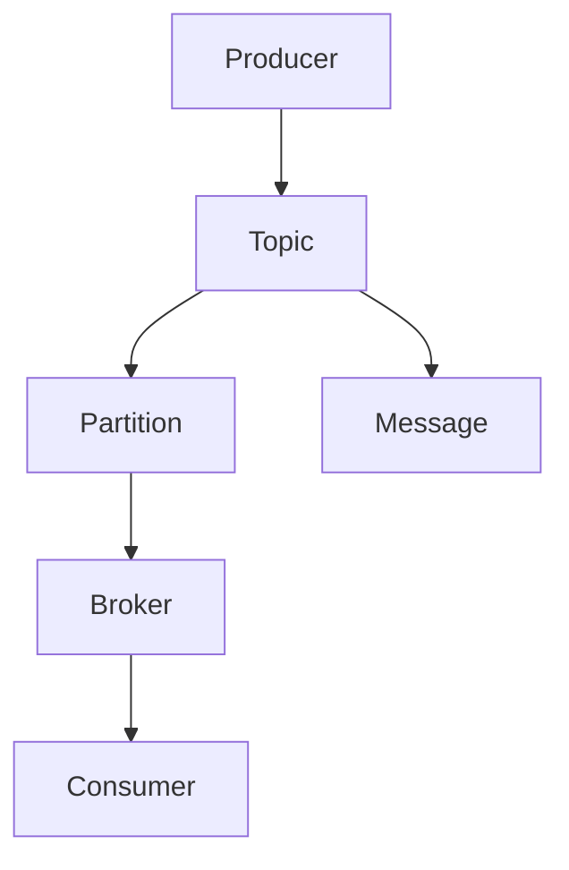
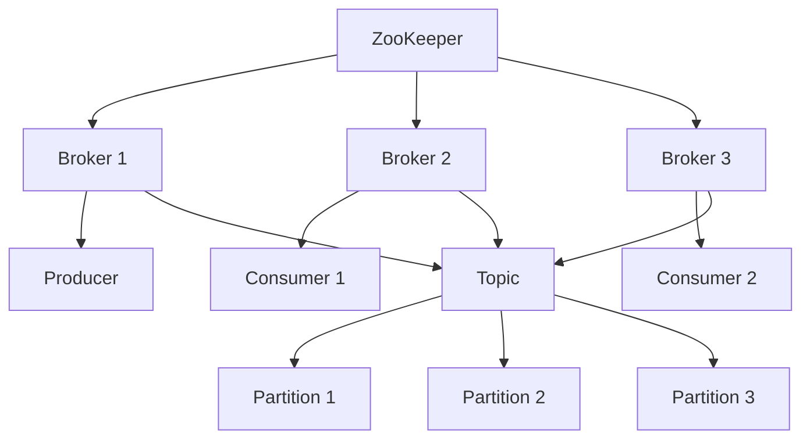

                 

# 《Kafka原理与代码实例讲解》

## 摘要

本文将深入探讨Kafka的核心原理和实际应用。Kafka是一种分布式流处理平台，广泛应用于日志收集、实时数据分析和系统解耦等领域。本文将首先介绍Kafka的诞生背景、核心概念和架构，然后详细解析Kafka的安装与配置、核心组件及其工作原理，以及Kafka在消息可靠性、消息顺序性和性能优化方面的特性。此外，还将通过具体项目实战，展示Kafka在实际开发中的应用和代码实现。通过本文的学习，读者将能够全面了解Kafka的工作原理，掌握其核心特性，并能够运用到实际项目中。

## 目录

### 第一部分：Kafka基础

### 第1章 Kafka简介

#### 1.1 Kafka的诞生背景与优势

#### 1.2 Kafka的核心概念与架构

#### 1.3 Kafka的应用场景

### 第2章 Kafka的安装与配置

#### 2.1 Kafka的安装步骤

#### 2.2 Kafka的配置文件详解

#### 2.3 Kafka集群部署

### 第3章 Kafka的核心组件

#### 3.1 Producer详解

#### 3.2 Consumer详解

#### 3.3 Topic详解

### 第4章 Kafka的消息存储与消费

#### 4.1 Kafka的消息存储机制

#### 4.2 Kafka的消息消费机制

#### 4.3 消费者组与偏移量管理

### 第二部分：Kafka高级特性

### 第5章 Kafka的消息可靠性

#### 5.1 数据可靠性保障

#### 5.2 消息持久性

#### 5.3 故障转移与恢复

### 第6章 Kafka的消息顺序性

#### 6.1 消息顺序性保障机制

#### 6.2 实现顺序消息发送与接收

#### 6.3 顺序消息在实际应用中的案例

### 第7章 Kafka的性能优化

#### 7.1 Kafka的性能瓶颈分析

#### 7.2 性能优化策略

#### 7.3 Kafka参数调优实践

### 第8章 Kafka的安全机制

#### 8.1 Kafka的安全性保障

#### 8.2 访问控制与权限管理

#### 8.3 实现Kafka的加密通信

### 第三部分：Kafka项目实战

### 第9章 Kafka在日志收集与分析中的应用

#### 9.1 日志收集架构设计

#### 9.2 日志消息处理流程

#### 9.3 日志分析工具与实践

### 第10章 Kafka在实时流数据处理中的应用

#### 10.1 实时数据处理架构

#### 10.2 流数据处理流程

#### 10.3 实时数据处理案例

### 第11章 Kafka在金融交易系统中的应用

#### 11.1 金融交易系统的架构

#### 11.2 Kafka在交易系统中的作用

#### 11.3 交易系统中的Kafka应用实践

### 第12章 Kafka在物联网中的应用

#### 12.1 物联网系统的架构

#### 12.2 Kafka在物联网系统中的应用

#### 12.3 物联网系统中的Kafka应用案例

### 附录

#### 附录A Kafka开发工具与资源

#### A.1 Kafka常用开发工具介绍

#### A.2 Kafka社区与资源推荐

#### A.3 Kafka学习资源汇总

#### 附录B Kafka核心概念与架构Mermaid图

#### B.1 Kafka核心概念Mermaid图

#### B.2 Kafka架构Mermaid图

#### 附录C Kafka核心算法原理讲解

#### C.1 Kafka消息存储与消费算法原理

#### C.2 Kafka故障转移与恢复算法原理

#### C.3 Kafka性能优化算法原理

#### 附录D Kafka项目实战代码解析

#### D.1 Kafka日志收集与分析项目代码解析

#### D.2 Kafka实时流数据处理项目代码解析

#### D.3 Kafka金融交易系统项目代码解析

#### D.4 Kafka物联网系统项目代码解析

## 第一部分：Kafka基础

### 第1章 Kafka简介

Kafka是一种分布式流处理平台，由Apache软件基金会开发和维护。它基于发布-订阅消息模型，具有高吞吐量、高可用性和可扩展性的特点，广泛应用于大数据、实时计算和系统解耦等领域。Kafka的设计初衷是为了解决大规模系统中日志收集、实时数据流处理和消息传递的需求。

#### 1.1 Kafka的诞生背景与优势

随着互联网的快速发展，数据量呈现爆炸式增长。传统的数据处理架构已经无法满足日益增长的数据处理需求。为了应对这一挑战，Apache软件基金会于2008年启动了Kafka项目。Kafka采用了分布式架构，能够处理海量数据，并且具有良好的容错性和可扩展性。

Kafka的优势主要体现在以下几个方面：

1. **高吞吐量**：Kafka可以处理每秒数百万条消息，适用于大规模数据处理场景。
2. **高可用性**：Kafka具有强大的容错能力，可以确保数据不会丢失，即使在节点故障的情况下。
3. **可扩展性**：Kafka可以水平扩展，支持增加或减少节点，以适应数据量的变化。
4. **持久化存储**：Kafka将消息持久化存储在磁盘上，确保了数据的可靠性和持久性。

#### 1.2 Kafka的核心概念与架构

Kafka的核心概念包括Producer、Consumer、Topic、Partition和Broker等。以下是对这些核心概念的简要介绍：

- **Producer**：生产者，负责向Kafka发送消息。
- **Consumer**：消费者，负责从Kafka读取消息。
- **Topic**：主题，是消息的逻辑分类，类似于数据库中的表。
- **Partition**：分区，是主题的物理分区，用于并行处理消息。
- **Broker**：代理，是Kafka的服务器节点，负责存储和管理消息。

Kafka的架构可以分为以下几个部分：

1. **Producer**：生产者将消息发送到Kafka集群，消息会被存储在特定的Topic和Partition中。
2. **Broker**：Kafka集群中的每个节点都是一个Broker，负责存储和管理消息。Broker之间通过ZooKeeper进行协调。
3. **Consumer**：消费者从Kafka集群中读取消息，可以是单个消费者或消费者组。
4. **ZooKeeper**：ZooKeeper是Kafka的协调服务，负责集群的管理和协调。

#### 1.3 Kafka的应用场景

Kafka广泛应用于各种应用场景，包括但不限于以下几个方面：

1. **日志收集**：Kafka可以作为集中式日志收集系统，将来自不同系统的日志数据汇聚到一个统一的平台上，便于管理和分析。
2. **实时数据流处理**：Kafka可以用于实时数据流处理，将实时数据流传递给数据处理系统，实现实时计算和分析。
3. **系统解耦**：Kafka可以作为消息队列，实现系统之间的解耦，降低系统之间的耦合度，提高系统的可维护性和扩展性。

### 第2章 Kafka的安装与配置

在本章中，我们将详细介绍Kafka的安装和配置过程，包括Kafka的安装步骤、配置文件详解以及Kafka集群的部署。

#### 2.1 Kafka的安装步骤

Kafka的安装过程相对简单，以下是具体的安装步骤：

1. **安装Java环境**：Kafka依赖于Java环境，需要确保Java已经安装在系统中。可以选择Java 8或更高版本。

2. **下载Kafka二进制包**：从Kafka的官方网站下载最新的Kafka二进制包。可以选择tar.gz或tar.zst格式。

3. **解压Kafka包**：将下载的Kafka包解压到指定目录，例如`/usr/local/kafka`。

4. **配置环境变量**：在`/etc/profile`文件中添加Kafka的环境变量，例如：
   ```bash
   export KAFKA_HOME=/usr/local/kafka
   export PATH=$PATH:$KAFKA_HOME/bin
   ```

5. **启动ZooKeeper**：Kafka依赖于ZooKeeper进行协调，需要确保ZooKeeper已经启动。可以手动启动ZooKeeper，或者使用Kafka自带的ZooKeeper服务。

6. **启动Kafka**：启动Kafka集群，包括Kafka Server和Kafka REST Proxy。可以使用`kafka-server-start.sh`脚本启动：
   ```bash
   bin/kafka-server-start.sh config/server.properties
   ```

#### 2.2 Kafka的配置文件详解

Kafka的配置文件主要包括`config/server.properties`和`config/kafka.properties`。以下是对这两个配置文件中常用配置的详解：

1. **server.properties**：

   - `broker.id`：每个Kafka节点都需要一个唯一的ID，用于标识节点。
   - `port`：Kafka服务的端口号，默认为9092。
   - `zookeeper.connect`：ZooKeeper服务器的连接地址，例如`localhost:2181`。
   - `log.dirs`：Kafka日志存储路径，可以指定多个路径，用逗号分隔。

2. **kafka.properties**：

   - `bootstrap.servers`：Kafka节点的连接地址，用于Producer和Consumer连接Kafka集群。
   - `group.id`：消费者的组ID，用于消费者组管理。
   - `auto.offset.reset`：当消费者组首次启动或偏移量不存在时，消费者的行为，例如`latest`或`earliest`。

#### 2.3 Kafka集群部署

Kafka集群部署可以分为单节点集群和分布式集群。以下是一个简单的分布式集群部署步骤：

1. **安装Kafka**：在每个节点上安装Kafka，步骤与单节点安装相同。
2. **配置ZooKeeper**：确保ZooKeeper在所有节点上都启动，并在`zookeeper.properties`文件中配置集群模式。
3. **配置Kafka**：在每个节点的`server.properties`文件中配置`broker.id`和`zookeeper.connect`，确保不同节点的`broker.id`唯一。
4. **启动Kafka**：在每个节点上启动Kafka服务，可以使用`kafka-server-start.sh`脚本。

完成以上步骤后，Kafka集群即可启动并运行。可以通过Kafka REST Proxy提供的HTTP接口监控集群状态，例如查看节点信息、主题信息和消息消费进度等。

### 第3章 Kafka的核心组件

Kafka的核心组件包括Producer、Consumer、Topic、Partition和Broker。以下将详细解析这些组件的工作原理和作用。

#### 3.1 Producer详解

Producer是Kafka的消息生产者，负责将消息发送到Kafka集群。每个消息由一个主题（Topic）和一个分区（Partition）标识。以下是对Producer的详细解析：

- **发送消息**：Producer使用`send()`方法发送消息，消息会被序列化后发送到指定的Topic和Partition。
- **分区策略**：Producer可以选择分区策略，例如`RoundRobin`（轮询）或`Hash`（哈希）。
- **异步发送**：Producer采用异步发送机制，将消息缓存到本地缓冲区，然后批量发送到Kafka集群，以提高发送效率。
- **可靠性保障**：Producer支持配置`acks`参数，确保消息的可靠性。例如，当`acks`设置为`-1`时，表示需要所有副本确认消息已经写入，确保数据不丢失。

#### 3.2 Consumer详解

Consumer是Kafka的消息消费者，负责从Kafka集群读取消息。以下是对Consumer的详细解析：

- **订阅主题**：Consumer可以订阅一个或多个主题，并选择消费策略，例如`latest`（消费最新消息）或`earliest`（消费最早消息）。
- **消费者组**：多个Consumer可以组成一个消费者组，共同消费消息。每个消费者组内的Consumer负责不同的Partition，确保消息的消费负载均衡。
- **偏移量管理**：Consumer使用偏移量（Offset）标识消息的消费位置。偏移量存储在ZooKeeper或Kafka内部，确保消费者在故障恢复时能够继续从上次消费的位置继续消费。
- **消息拉取**：Consumer通过轮询的方式从Kafka集群拉取消息，可以使用`poll()`方法获取消息。在获取消息时，Consumer可以处理消息并更新偏移量。

#### 3.3 Topic详解

Topic是Kafka中的消息逻辑分类，类似于数据库中的表。每个Topic可以包含多个Partition，用于并行处理消息。以下是对Topic的详细解析：

- **创建Topic**：Kafka支持动态创建Topic，可以使用`kafka-topics.sh`脚本或Kafka REST Proxy的HTTP接口创建Topic。
- **分区数量**：每个Topic可以包含多个Partition，Partition的数量可以动态调整。增加Partition可以提高消息的并发处理能力。
- **副本数量**：每个Partition可以有多个副本，用于实现数据的冗余和故障恢复。副本的数量可以与Partition的数量相同或更多，提高数据可靠性。

#### 3.4 Partition详解

Partition是Kafka中的消息物理分区，用于并行处理消息。以下是对Partition的详细解析：

- **分区策略**：Partition的分配策略可以是`RoundRobin`（轮询）或`Hash`（哈希）。轮询策略将消息均匀分配到所有Partition，哈希策略根据消息的Key进行哈希分配。
- **数据均衡**：Partition的分配要考虑数据的均衡性，避免某个Partition承担过多的负载。
- **数据读写**：每个Partition都可以独立读写，提高系统的并发处理能力。

#### 3.5 Broker详解

Broker是Kafka的服务器节点，负责存储和管理消息。以下是对Broker的详细解析：

- **节点管理**：每个Broker都有一个唯一的ID，用于标识节点。Broker通过ZooKeeper进行协调，确保集群的状态一致性。
- **数据存储**：Broker负责存储消息的副本，确保数据的可靠性。每个Partition的副本存储在不同的Broker上。
- **负载均衡**：Kafka通过负载均衡策略，将消息均匀分配到所有Broker，避免某个Broker承担过多的负载。
- **故障恢复**：当Broker发生故障时，Kafka会自动将副本提升为领导者，确保系统的可用性。

## 第二部分：Kafka高级特性

### 第5章 Kafka的消息可靠性

Kafka的消息可靠性是其重要特性之一，确保消息在传输过程中不会丢失。在本章中，我们将详细讨论Kafka的消息可靠性机制，包括数据可靠性保障、消息持久性和故障转移与恢复。

#### 5.1 数据可靠性保障

Kafka通过以下机制保障数据可靠性：

- **副本机制**：Kafka使用副本机制确保数据的可靠性。每个Partition可以有多个副本，副本存储在不同的Broker上。当生产者发送消息时，消息会同时发送到所有副本，确保至少有一个副本成功写入。
- **确认机制**：生产者可以使用确认机制（acks）确保消息的可靠性。当acks设置为`1`时，表示只要leader副本成功写入消息，生产者就会收到确认；当acks设置为`-1`时，表示需要所有副本确认消息已经写入。
- **同步写入**：Kafka使用同步写入机制，确保消息在所有副本中写入成功后，生产者才会收到确认。这确保了消息在传输过程中的可靠性。

#### 5.2 消息持久性

Kafka通过以下机制确保消息的持久性：

- **持久化存储**：Kafka将消息持久化存储在磁盘上，确保消息在系统故障时不会丢失。每个Partition的副本都会在各自的磁盘上存储消息，提高数据的持久性。
- **日志切割**：Kafka使用日志切割机制，将每个Partition的消息存储在不同的日志文件中，避免日志文件过大导致性能下降。
- **数据备份**：Kafka支持数据备份功能，可以定期将Kafka数据备份到其他存储设备或远程存储系统，确保数据的安全和可靠性。

#### 5.3 故障转移与恢复

Kafka通过以下机制实现故障转移与恢复：

- **副本选举**：当leader副本发生故障时，Kafka会自动进行副本选举，选择一个新的leader副本。副本选举过程由ZooKeeper协调。
- **故障检测**：Kafka通过心跳机制检测副本的健康状态。当副本故障时，Kafka会将其从可用副本列表中移除，并触发副本选举。
- **数据恢复**：当新的leader副本选举成功后，Kafka会从其他副本同步数据，确保新leader副本的数据一致性。
- **故障恢复**：当副本故障恢复后，Kafka会将故障副本重新加入到可用副本列表中，并同步数据，确保系统的可靠性。

通过以上机制，Kafka能够实现高效可靠的消息传输和处理，确保消息的可靠性和持久性。

### 第6章 Kafka的消息顺序性

Kafka的消息顺序性是其在分布式系统中应用的一个重要特性。在许多应用场景中，消息的顺序性至关重要，如金融交易系统、订单处理系统等。本章将详细介绍Kafka的消息顺序性保障机制、实现顺序消息发送与接收的方法，以及顺序消息在实际应用中的案例。

#### 6.1 消息顺序性保障机制

Kafka通过以下机制保障消息的顺序性：

- **分区顺序写入**：Kafka在每个Partition上实现有序写入。每个Partition是一个有序的队列，消息按照顺序写入。生产者在发送消息时，可以选择特定的分区，确保消息在同一个分区上顺序写入。
- **消费者顺序消费**：消费者从Partition读取消息时，会按照消息的顺序进行消费。消费者组内的消费者负责不同的Partition，每个消费者负责消费特定Partition上的消息，从而实现全局消息的顺序性。

#### 6.2 实现顺序消息发送与接收

实现顺序消息发送与接收的方法如下：

1. **指定分区键**：生产者在发送消息时，可以通过设置分区键（Partition Key）来确保消息顺序发送。分区键可以是消息的某个字段，如订单ID或事务ID。通过哈希分区键，可以确保相同分区键的消息被发送到同一个Partition。
2. **顺序Consumer**：消费者在消费消息时，可以通过按需消费或批量消费的方式顺序读取消息。按需消费是指消费者逐条读取消息，并处理完成后再读取下一条消息。批量消费是指消费者一次性读取一批消息，并在处理完成后继续读取下一批消息。

以下是一个示例代码，演示了如何使用Kafka Producer发送顺序消息：

```java
Properties props = new Properties();
props.put("bootstrap.servers", "localhost:9092");
props.put("key.serializer", "org.apache.kafka.common.serialization.StringSerializer");
props.put("value.serializer", "org.apache.kafka.common.serialization.StringSerializer");

KafkaProducer<String, String> producer = new KafkaProducer<>(props);

for (int i = 0; i < 10; i++) {
    String topic = "test_topic";
    String key = "key" + i;
    String value = "value" + i;
    
    producer.send(new ProducerRecord<>(topic, key, value));
}

producer.close();
```

以下是一个示例代码，演示了如何使用Kafka Consumer接收顺序消息：

```java
Properties props = new Properties();
props.put("bootstrap.servers", "localhost:9092");
props.put("group.id", "test_group");
props.put("key.deserializer", "org.apache.kafka.common.serialization.StringDeserializer");
props.put("value.deserializer", "org.apache.kafka.common.serialization.StringDeserializer");

KafkaConsumer<String, String> consumer = new KafkaConsumer<>(props);

consumer.subscribe(Collections.singletonList("test_topic"));

while (true) {
    ConsumerRecords<String, String> records = consumer.poll(Duration.ofMillis(100));
    
    for (ConsumerRecord<String, String> record : records) {
        System.out.printf("Received message: key = %s, value = %s, partition = %d, offset = %d\n",
                record.key(), record.value(), record.partition(), record.offset());
    }
}
```

#### 6.3 顺序消息在实际应用中的案例

顺序消息在实际应用中有着广泛的应用，以下是一个案例：

**案例：金融交易系统**

在金融交易系统中，交易消息的顺序性至关重要。每个交易消息都包含交易ID和交易内容。通过Kafka，可以确保交易消息的顺序性，从而实现以下功能：

1. **交易确认**：当交易消息到达Kafka时，生产者会发送顺序消息到特定的分区。消费者会按照顺序消费交易消息，并执行交易确认操作。
2. **交易回滚**：如果某个交易消息发生错误，消费者可以回滚该交易，确保交易的一致性。
3. **审计与监控**：通过Kafka的顺序消息，可以方便地进行交易数据的审计和监控，确保交易数据的完整性和准确性。

通过以上机制，Kafka在金融交易系统中实现了高效、可靠的交易消息处理，保障了交易数据的顺序性和一致性。

## 第7章 Kafka的性能优化

Kafka的性能优化是确保其在大规模分布式系统中高效运行的关键。在本章中，我们将深入探讨Kafka的性能瓶颈分析、性能优化策略以及具体的参数调优实践。

#### 7.1 Kafka的性能瓶颈分析

Kafka的性能瓶颈主要包括以下几个方面：

1. **网络带宽**：Kafka通过网络传输消息，网络带宽成为影响性能的重要因素。在高并发场景下，网络延迟和数据包丢失可能导致性能下降。
2. **磁盘IO**：Kafka的消息存储在磁盘上，磁盘IO性能直接影响Kafka的读写速度。磁盘读写速度较慢可能导致Kafka的性能瓶颈。
3. **JVM内存**：Kafka运行在JVM上，内存使用情况直接影响其性能。内存不足可能导致GC频繁发生，影响Kafka的处理能力。
4. **并发处理能力**：Kafka通过分区和副本实现并发处理，但过多的分区和副本可能导致资源浪费和性能下降。

#### 7.2 性能优化策略

为了提升Kafka的性能，可以采取以下优化策略：

1. **增加节点数**：增加Kafka集群的节点数可以提高并发处理能力和数据可靠性。在适当的情况下，增加节点数是提升性能的有效方法。
2. **调整分区数**：根据数据量和并发需求，合理调整Partition的数量。过多的分区可能导致资源浪费，而不足的分区可能导致性能瓶颈。
3. **优化网络配置**：优化网络配置，提高网络带宽和降低网络延迟，可以提升Kafka的传输性能。可以采用SSD存储或增加网络带宽来改善磁盘IO性能。
4. **JVM调优**：通过JVM调优，优化内存使用，降低GC频率，提高Kafka的处理能力。可以调整JVM参数，如堆内存大小、垃圾回收器类型等。

#### 7.3 Kafka参数调优实践

以下是一些常用的Kafka参数调优实践：

1. **增加`num.partitions`**：在创建Topic时，可以增加`num.partitions`参数，提高并发处理能力。例如：
   ```bash
   bin/kafka-topics.sh --create --topic test_topic --partitions 20 --replication-factor 3 --config retention.ms=172800000 --config segment.ms=60000
   ```

2. **调整`batch.size`和`linger.ms`**：调整Producer的`batch.size`和`linger.ms`参数，可以优化消息发送的批量处理和延迟。例如：
   ```java
   Properties props = new Properties();
   props.put("bootstrap.servers", "localhost:9092");
   props.put("key.serializer", "org.apache.kafka.common.serialization.StringSerializer");
   props.put("value.serializer", "org.apache.kafka.common.serialization.StringSerializer");
   props.put("batch.size", 16384);
   props.put("linger.ms", 10);
   
   KafkaProducer<String, String> producer = new KafkaProducer<>(props);
   ```

3. **调整`fetch.min.bytes`和`fetch.max.bytes`**：调整Consumer的`fetch.min.bytes`和`fetch.max.bytes`参数，可以优化消息拉取的批量处理和延迟。例如：
   ```java
   Properties props = new Properties();
   props.put("bootstrap.servers", "localhost:9092");
   props.put("group.id", "test_group");
   props.put("key.deserializer", "org.apache.kafka.common.serialization.StringDeserializer");
   props.put("value.deserializer", "org.apache.kafka.common.serialization.StringDeserializer");
   props.put("fetch.min.bytes", 16384);
   props.put("fetch.max.bytes", 1048576);
   
   KafkaConsumer<String, String> consumer = new KafkaConsumer<>(props);
   ```

4. **调整`heap.size`和`max Heap size`**：调整Kafka JVM的`heap.size`和`max Heap size`参数，可以优化内存使用。例如：
   ```bash
   bin/kafka-run-class.sh kafka.KafkaServer \
     --config config/server.properties \
     --add-config log.flush.interval.messages=1000 \
     --add-config log.flush.interval.ms=3000 \
     --config heap.size=8G \
     --config max.heap.size=8G
   ```

通过以上参数调优实践，可以显著提升Kafka的性能，满足大规模分布式系统的需求。

## 第8章 Kafka的安全机制

Kafka的安全机制对于保障数据安全和系统安全至关重要。本章将详细介绍Kafka的安全性保障措施、访问控制与权限管理，以及实现Kafka的加密通信。

#### 8.1 Kafka的安全性保障

Kafka提供了多种安全性保障措施，包括：

1. **用户认证**：Kafka支持Kerberos、LDAP和Simple Authentication模块，通过用户认证确保只有授权用户才能访问Kafka。
2. **加密传输**：Kafka支持使用SSL/TLS协议加密传输，确保数据在传输过程中的安全性。
3. **访问控制**：Kafka使用访问控制列表（ACL）控制对Kafka主题的访问权限，包括读取、写入和消费权限。
4. **审计日志**：Kafka记录操作日志，包括用户操作、访问日志和错误日志，便于进行安全审计和故障排查。

#### 8.2 访问控制与权限管理

Kafka通过访问控制列表（ACL）实现访问控制与权限管理。以下是如何配置ACL的示例：

```bash
bin/kafka-acls.sh --authorizer properties --authorizer-properties zookeeper.connect=localhost:2181 \
    --add --allow-principal User:alice \
    --operation Write --topic test_topic
```

该命令为用户`alice`添加了写入`test_topic`主题的权限。

Kafka还支持使用Kerberos进行用户认证和权限管理。在Kerberos环境中，Kafka可以配置Kerberos认证模块，确保用户身份验证和访问控制。

#### 8.3 实现Kafka的加密通信

Kafka支持使用SSL/TLS协议加密传输数据。以下是如何配置Kafka使用SSL/TLS的示例：

1. **配置SSL证书**：创建SSL证书和密钥，并将它们放置在Kafka配置目录中。例如，创建`kafka.server.crt`和`kafka.server.key`文件。
2. **配置Kafka**：在`config/server.properties`文件中配置SSL相关参数，例如：
   ```bash
   ssl.enabled=true
   ssl.keystore.location=conf/ssl.keystore.jks
   ssl.keystore.password=keystore-password
   ssl.keypassword=key-password
   ssl.truststore.location=conf/ssl.truststore.jks
   ssl.truststore.password=truststore-password
   ssl.endpoint.identification.algorithm=TLS
   ssl.cipher.suites=TLS_DHE_RSA_WITH_AES_128_CBC_SHA,TLS_DHE_RSA_WITH_AES_256_CBC_SHA
   ssl.protocol=TLSv1.2
   ```

3. **启动Kafka**：使用配置的SSL参数启动Kafka，确保Kafka服务使用SSL/TLS协议进行加密通信。

通过以上配置，Kafka的数据传输将使用SSL/TLS协议进行加密，确保数据在传输过程中的安全性。

## 第9章 Kafka在日志收集与分析中的应用

Kafka在日志收集与分析领域有着广泛的应用。通过Kafka，可以高效地收集来自不同系统的日志数据，并进行实时处理和分析。本章将介绍Kafka在日志收集与分析中的应用，包括日志收集架构设计、日志消息处理流程以及日志分析工具与实践。

#### 9.1 日志收集架构设计

Kafka在日志收集架构中扮演着消息队列的角色，实现日志数据的集中收集和处理。以下是一个典型的日志收集架构设计：

1. **日志生成端**：每个系统或应用会产生日志数据，日志数据包含时间戳、日志级别、日志内容等信息。
2. **日志采集器**：日志采集器负责将日志数据发送到Kafka集群。可以使用Logstash、Fluentd等日志采集工具，或者直接使用Kafka Producer实现日志采集。
3. **Kafka集群**：Kafka集群存储和传输日志数据。通过分区和副本机制，Kafka可以保证日志数据的高可靠性和高可用性。
4. **日志处理端**：日志处理端从Kafka读取日志数据，并进行处理和分析。可以使用Kafka Consumer或Kafka Streams等处理工具，也可以集成其他数据处理框架，如Apache Flink、Spark等。
5. **日志分析工具**：使用日志分析工具，如Kibana、Grafana等，对日志数据进行分析和可视化，提供实时监控和报警功能。

#### 9.2 日志消息处理流程

日志消息处理流程可以分为以下几个步骤：

1. **日志生成**：系统或应用生成日志数据，并将日志数据发送到日志采集器。
2. **日志采集**：日志采集器将日志数据发送到Kafka集群。在发送过程中，日志数据会被序列化，并按照分区策略发送到不同的Partition。
3. **消息传输**：Kafka集群接收日志数据，并将数据存储在Partition中。由于Kafka的分布式架构，消息传输具有高可靠性和高可用性。
4. **日志处理**：日志处理端从Kafka读取日志数据，并进行处理。处理过程可以包括数据清洗、格式转换、统计分析等操作。处理后的数据可以存储到数据库或存储系统，供进一步分析和查询。
5. **日志分析**：使用日志分析工具对处理后的日志数据进行分析和可视化。通过分析日志数据，可以监控系统的运行状态、性能指标和异常情况，并提供实时监控和报警功能。

以下是一个示例代码，演示了如何使用Kafka Producer发送日志数据：

```java
Properties props = new Properties();
props.put("bootstrap.servers", "localhost:9092");
props.put("key.serializer", "org.apache.kafka.common.serialization.StringSerializer");
props.put("value.serializer", "org.apache.kafka.common.serialization.StringSerializer");

KafkaProducer<String, String> producer = new KafkaProducer<>(props);

while (true) {
    String topic = "log_topic";
    String key = "key";
    String value = "log_message";
    
    producer.send(new ProducerRecord<>(topic, key, value));
}

producer.close();
```

以下是一个示例代码，演示了如何使用Kafka Consumer读取日志数据并进行处理：

```java
Properties props = new Properties();
props.put("bootstrap.servers", "localhost:9092");
props.put("group.id", "log_consumer_group");
props.put("key.deserializer", "org.apache.kafka.common.serialization.StringDeserializer");
props.put("value.deserializer", "org.apache.kafka.common.serialization.StringDeserializer");

KafkaConsumer<String, String> consumer = new KafkaConsumer<>(props);

consumer.subscribe(Collections.singletonList("log_topic"));

while (true) {
    ConsumerRecords<String, String> records = consumer.poll(Duration.ofMillis(100));
    
    for (ConsumerRecord<String, String> record : records) {
        System.out.printf("Received log message: key = %s, value = %s, partition = %d, offset = %d\n",
                record.key(), record.value(), record.partition(), record.offset());
        
        // 处理日志数据
        processLogMessage(record.value());
    }
}
```

#### 9.3 日志分析工具与实践

Kafka日志收集与分析中，常用的日志分析工具包括Kibana、Grafana等。以下是一个示例，使用Kibana对Kafka日志数据进行分析和可视化：

1. **安装Kibana**：在Kibana中安装Kafka日志数据收集插件。
2. **配置Kibana**：在Kibana中配置Kafka连接信息，包括Kafka集群地址、Topic名称等。
3. **创建数据可视化仪表板**：在Kibana中创建数据可视化仪表板，选择Kafka日志数据源，并设置相应的图表和指标。
4. **实时监控**：通过Kibana仪表板，可以实时监控Kafka日志数据，包括日志条数、日志级别分布、异常日志等。

通过以上实践，Kafka在日志收集与分析中的应用可以实现高效、可靠的日志数据收集和处理，为系统的监控和管理提供有力支持。

### 第10章 Kafka在实时流数据处理中的应用

Kafka作为分布式流处理平台，在实时流数据处理领域有着广泛的应用。本章将详细介绍Kafka在实时流数据处理中的应用，包括实时数据处理架构、流数据处理流程以及实时数据处理案例。

#### 10.1 实时数据处理架构

Kafka在实时数据处理架构中扮演着核心角色。以下是一个典型的实时数据处理架构：

1. **数据源**：数据源产生实时数据，可以是用户行为数据、传感器数据、交易数据等。
2. **数据采集器**：数据采集器将实时数据发送到Kafka集群。可以使用Kafka Producer或第三方数据采集工具，如Fluentd、Logstash等。
3. **Kafka集群**：Kafka集群存储和传输实时数据。通过分区和副本机制，Kafka可以保证实时数据的高可靠性和高可用性。
4. **流处理框架**：流处理框架从Kafka读取实时数据，进行数据处理和分析。常用的流处理框架包括Apache Flink、Apache Spark Streaming、Apache Storm等。
5. **数据处理组件**：数据处理组件对实时数据进行处理，包括数据清洗、转换、聚合等操作。处理后的数据可以存储到数据库、消息队列或其他数据存储系统。
6. **数据消费者**：数据消费者从数据处理组件读取处理后的数据，进行进一步分析、可视化或业务决策。

#### 10.2 流数据处理流程

实时流数据处理流程可以分为以下几个步骤：

1. **数据采集**：数据采集器将实时数据发送到Kafka集群。在发送过程中，数据会被序列化，并按照分区策略发送到不同的Partition。
2. **数据存储**：Kafka集群接收实时数据，并将数据存储在Partition中。由于Kafka的分布式架构，数据存储具有高可靠性和高可用性。
3. **数据读取**：流处理框架从Kafka读取实时数据，并将其加载到内存中。流处理框架会将数据分成多个批次进行处理，每个批次包含一段时间内的数据。
4. **数据处理**：流处理框架对实时数据进行处理，包括数据清洗、转换、聚合等操作。处理过程可以是基于批处理的，也可以是基于流式的，取决于具体需求。
5. **数据处理结果**：处理后的数据可以存储到数据库、消息队列或其他数据存储系统，供进一步分析或业务使用。
6. **数据消费**：数据消费者从数据处理组件读取处理后的数据，进行进一步分析、可视化或业务决策。

以下是一个示例代码，演示了如何使用Apache Flink读取Kafka实时数据并进行处理：

```java
// 创建Flink执行环境
StreamExecutionEnvironment env = StreamExecutionEnvironment.getExecutionEnvironment();

// 创建Kafka连接器
FlinkKafkaConsumer<String> kafkaConsumer = new FlinkKafkaConsumer<>("input_topic", new SimpleStringSchema(), properties);

// 创建数据流
DataStream<String> inputStream = env.addSource(kafkaConsumer);

// 数据处理
DataStream<String> processedStream = inputStream.map(new MapFunction<String, String>() {
    @Override
    public String map(String value) {
        // 数据处理逻辑
        return value.toUpperCase();
    }
});

// 输出处理结果
processedStream.print();

// 执行流处理任务
env.execute("Kafka Realtime Data Processing");
```

#### 10.3 实时数据处理案例

以下是一个实时数据处理案例：实时用户行为分析系统。

**案例背景**：一个电商平台需要实时分析用户的行为，包括用户访问、点击、购买等行为。通过实时分析用户行为，平台可以提供个性化推荐、实时营销活动等。

**架构设计**：

1. **数据采集**：使用Kafka Producer将用户行为数据（如访问、点击、购买等）发送到Kafka集群。
2. **Kafka集群**：Kafka集群存储和传输实时用户行为数据。通过分区和副本机制，Kafka可以保证数据的高可靠性和高可用性。
3. **流处理框架**：使用Apache Flink从Kafka读取用户行为数据，进行实时处理和分析。数据处理过程包括数据清洗、转换、聚合等操作。
4. **数据处理组件**：数据处理组件对实时用户行为数据进行处理，生成用户行为分析报告。报告可以包括用户活跃度、点击率、购买转化率等指标。
5. **数据消费者**：数据消费者从数据处理组件读取用户行为分析报告，用于个性化推荐、实时营销活动等。

**数据处理流程**：

1. **数据采集**：用户行为数据发送到Kafka集群。
2. **数据读取**：Flink从Kafka读取用户行为数据。
3. **数据处理**：
   - 数据清洗：去除无效数据，如重复、错误的数据。
   - 数据转换：将用户行为数据转换为统一的格式，如JSON格式。
   - 数据聚合：对用户行为数据进行聚合，计算用户活跃度、点击率、购买转化率等指标。
4. **数据处理结果**：处理后的用户行为分析报告存储到数据库或其他数据存储系统。
5. **数据消费**：数据消费者从数据处理组件读取用户行为分析报告，用于个性化推荐、实时营销活动等。

通过以上架构设计和数据处理流程，实时用户行为分析系统可以高效、准确地分析用户行为，为电商平台提供实时决策支持。

## 第11章 Kafka在金融交易系统中的应用

Kafka在金融交易系统中扮演着关键角色，提供了高效、可靠的消息传递和数据处理能力。本章将详细介绍Kafka在金融交易系统中的应用，包括金融交易系统的架构、Kafka在交易系统中的作用以及具体的Kafka应用实践。

#### 11.1 金融交易系统的架构

金融交易系统的架构可以分为以下几个层次：

1. **数据采集层**：数据采集层负责从各种渠道（如交易所、行情接口、传感器等）收集实时数据。这些数据包括交易数据、行情数据、用户行为数据等。
2. **消息中间层**：消息中间层使用Kafka作为消息队列，实现数据的集中传递和分发。Kafka的高吞吐量、高可靠性和分布式架构使其成为金融交易系统的理想选择。
3. **数据处理层**：数据处理层负责对Kafka中的消息进行实时处理和分析。可以使用流处理框架（如Apache Flink、Apache Spark Streaming等）进行数据处理，实现实时交易分析、风险控制、订单处理等。
4. **业务逻辑层**：业务逻辑层实现金融交易系统的核心业务功能，包括交易撮合、资金清算、风险管理等。业务逻辑层与数据处理层紧密协作，确保交易过程的准确性和高效性。
5. **数据存储层**：数据存储层负责存储交易数据、用户数据、行情数据等。可以使用数据库、消息队列、文件系统等存储方式，实现数据的持久化和查询。

#### 11.2 Kafka在交易系统中的作用

Kafka在金融交易系统中发挥着重要作用，主要体现在以下几个方面：

1. **数据传输**：Kafka作为消息队列，实现实时数据的传输和分发。交易系统的各个组件通过Kafka进行数据通信，确保数据的一致性和实时性。
2. **分布式处理**：Kafka的分布式架构支持大规模分布式处理，可以处理海量交易数据。通过流处理框架，Kafka可以实现实时交易数据处理和分析，提高交易系统的性能和可靠性。
3. **系统解耦**：Kafka实现了交易系统的各个组件之间的解耦。通过消息队列，交易系统的各个组件可以独立开发和部署，降低系统之间的耦合度，提高系统的可维护性和扩展性。
4. **消息持久性**：Kafka将消息持久化存储在磁盘上，确保交易数据不会丢失。即使在系统故障或网络异常的情况下，Kafka也能保证数据的安全和可靠性。

#### 11.3 交易系统中的Kafka应用实践

以下是一个金融交易系统中的Kafka应用实践：

**场景**：一个证券交易系统需要实现实时交易撮合、资金清算和风险管理功能。

**架构设计**：

1. **数据采集**：使用Kafka Producer将交易数据、行情数据等发送到Kafka集群。
2. **Kafka集群**：Kafka集群存储和传输实时交易数据。
3. **流处理框架**：使用Apache Flink从Kafka读取交易数据，进行实时处理和分析。
4. **交易撮合**：交易撮合组件从Flink读取交易数据，实现交易撮合功能。
5. **资金清算**：资金清算组件从Flink读取交易数据，实现资金清算功能。
6. **风险管理**：风险管理组件从Flink读取交易数据，实现风险管理功能。
7. **数据存储**：将交易数据、资金清算数据等存储到数据库或其他数据存储系统。

**数据处理流程**：

1. **交易撮合**：
   - Flink从Kafka读取交易数据。
   - 对交易数据进行清洗、转换和聚合。
   - 根据交易规则进行交易撮合，生成交易结果。
   - 将交易结果发送到数据库或消息队列进行后续处理。

2. **资金清算**：
   - Flink从Kafka读取交易数据。
   - 对交易数据进行清洗、转换和聚合。
   - 根据资金清算规则进行资金清算。
   - 将清算结果发送到数据库或消息队列进行后续处理。

3. **风险管理**：
   - Flink从Kafka读取交易数据。
   - 对交易数据进行清洗、转换和聚合。
   - 根据风险控制规则进行风险管理。
   - 将风险控制结果发送到数据库或消息队列进行后续处理。

通过以上Kafka应用实践，金融交易系统可以实现实时、高效的数据处理和分析，提高交易系统的性能和可靠性。

### 第12章 Kafka在物联网中的应用

Kafka作为分布式流处理平台，在物联网（IoT）领域具有广泛的应用。本章将详细介绍Kafka在物联网系统中的应用，包括物联网系统的架构、Kafka在物联网系统中的作用以及物联网系统中的Kafka应用案例。

#### 12.1 物联网系统的架构

物联网系统通常由以下几个关键部分组成：

1. **设备层**：设备层包括各种物联网设备，如传感器、智能终端、智能家电等。这些设备可以采集环境数据、设备状态、用户行为等。
2. **网关层**：网关层负责将设备层采集的数据转发到云平台或其他数据处理系统。网关可以对数据进行预处理、格式转换和压缩等操作，提高数据传输效率和可靠性。
3. **平台层**：平台层是物联网系统的核心部分，负责数据存储、处理和分析。平台层通常包括边缘计算、云计算和大数据处理能力，可以对海量物联网数据进行实时处理和分析。
4. **应用层**：应用层是物联网系统的最终用户界面，包括Web应用、移动应用、可视化仪表板等。应用层可以从平台层获取数据，并实现业务功能、用户交互和监控等。

Kafka在物联网系统中主要扮演以下角色：

1. **数据传输**：Kafka作为消息队列，实现物联网设备层和网关层、平台层之间的数据传输。Kafka的高吞吐量、高可靠性和分布式架构能够确保物联网数据的高效传输和可靠存储。
2. **数据汇聚**：Kafka可以将来自不同设备、不同网关的数据汇聚到统一平台，实现数据的集中管理和分析。
3. **分布式处理**：Kafka可以与流处理框架（如Apache Flink、Apache Spark Streaming等）集成，实现物联网数据的实时处理和分析，提供实时监控和预警功能。
4. **系统解耦**：Kafka实现了物联网系统的各个组件之间的解耦，降低系统之间的耦合度，提高系统的可维护性和扩展性。

#### 12.2 Kafka在物联网系统中的应用

以下是一个典型的物联网系统架构，展示Kafka在物联网系统中的应用：

1. **设备层**：物联网设备采集环境数据（如温度、湿度、光照等）和设备状态数据（如电池电量、设备故障等），并将数据发送到网关。
2. **网关层**：网关对设备层的数据进行预处理，如数据格式转换、压缩、聚合等，然后发送到Kafka集群。
3. **Kafka集群**：Kafka集群存储和传输物联网数据。通过分区和副本机制，Kafka可以保证数据的高可靠性和高可用性。
4. **流处理框架**：流处理框架从Kafka读取物联网数据，进行实时处理和分析，如数据清洗、转换、聚合、预测等。
5. **数据处理平台**：数据处理平台对物联网数据进行存储、分析和可视化，提供实时监控、预警和决策支持。
6. **应用层**：应用层从数据处理平台获取数据，实现业务功能、用户交互和监控等。

#### 12.3 物联网系统中的Kafka应用案例

以下是一个物联网系统中的Kafka应用案例：智能农业监控系统。

**案例背景**：一个农业生产公司需要实时监控农作物的生长环境和设备状态，以提高农业生产效率和产品质量。

**架构设计**：

1. **设备层**：传感器设备（如土壤湿度传感器、光照传感器、气象传感器等）安装在农田中，实时采集土壤湿度、光照强度、气温、风速等环境数据。
2. **网关层**：网关设备（如树莓派、物联网模块等）接收传感器数据，对数据进行预处理，如数据格式转换、压缩、聚合等，然后发送到Kafka集群。
3. **Kafka集群**：Kafka集群存储和传输传感器数据。通过分区和副本机制，Kafka可以保证数据的高可靠性和高可用性。
4. **流处理框架**：流处理框架（如Apache Flink）从Kafka读取传感器数据，进行实时处理和分析，如数据清洗、异常检测、预测等。
5. **数据处理平台**：数据处理平台对传感器数据进行存储、分析和可视化，提供实时监控、预警和决策支持。
6. **应用层**：应用层从数据处理平台获取数据，实现农田环境监控、设备状态监控、异常报警等功能。

**数据处理流程**：

1. **数据采集**：传感器设备采集环境数据，并将数据发送到网关。
2. **数据预处理**：网关对传感器数据进行预处理，如数据格式转换、压缩、聚合等。
3. **数据发送**：网关将预处理后的数据发送到Kafka集群。
4. **数据读取**：流处理框架从Kafka读取传感器数据，进行实时处理和分析。
5. **数据处理**：流处理框架对传感器数据进行清洗、异常检测、预测等处理。
6. **数据处理结果**：处理后的数据存储到数据处理平台，供实时监控、预警和决策支持。
7. **数据展示**：应用层从数据处理平台获取数据，实现农田环境监控、设备状态监控、异常报警等功能。

通过以上架构设计和数据处理流程，智能农业监控系统可以实时监控农作物的生长环境和设备状态，提高农业生产效率和产品质量。

## 附录A Kafka开发工具与资源

在开发Kafka过程中，使用适当的工具和资源可以提高开发效率和学习效果。以下是一些常用的Kafka开发工具与资源。

### A.1 Kafka常用开发工具介绍

1. **IntelliJ IDEA**：IntelliJ IDEA 是一款强大的集成开发环境（IDE），提供了丰富的Kafka插件，如Kafka UI、Kafka Tools等，方便开发人员进行Kafka的调试、监控和开发。
2. **Visual Studio Code**：Visual Studio Code 是一款轻量级的代码编辑器，通过安装Kafka插件，可以提供Kafka代码的语法高亮、自动完成等功能，适合Kafka开发。
3. **Kafka Manager**：Kafka Manager 是一款开源的Kafka管理工具，提供Kafka集群的监控、管理、配置等功能，方便开发人员管理和调试Kafka集群。

### A.2 Kafka社区与资源推荐

1. **Apache Kafka官网**：[https://kafka.apache.org/](https://kafka.apache.org/) Apache Kafka官网是Kafka的官方文档和下载页面，提供了丰富的Kafka文档、API参考和示例代码。
2. **Kafka中文社区**：[https://kafka.doc.io/](https://kafka.doc.io/) Kafka中文社区提供了Kafka的中文文档、教程、问答和交流平台，方便中国开发者学习和交流。
3. **Kafka邮件列表**：[https://lists.apache.org/list.html?user=kafka](https://lists.apache.org/list.html?user=kafka) Kafka邮件列表是Kafka开发者和用户的交流平台，可以通过邮件订阅和参与讨论。

### A.3 Kafka学习资源汇总

以下是一些推荐的Kafka学习资源：

1. **《Kafka权威指南》**：这是一本非常全面的Kafka学习书籍，涵盖了Kafka的核心概念、架构设计、高级特性、性能优化等内容，适合Kafka初学者和进阶者。
2. **《Kafka实战》**：这本书通过实际案例和项目实战，详细介绍了Kafka的应用场景、开发技巧和实践经验，有助于读者理解和掌握Kafka在实际项目中的运用。
3. **《Kafka源码剖析》**：这本书深入分析了Kafka的源码实现，包括消息存储、消息传输、副本管理等方面的原理，适合对Kafka底层实现感兴趣的开发者。

通过以上工具和资源，开发者可以更高效地学习Kafka，掌握其核心概念和实战技巧。

## 附录B Kafka核心概念与架构Mermaid图

### B.1 Kafka核心概念Mermaid图

以下是一个简单的Mermaid图，展示Kafka的核心概念：



### B.2 Kafka架构Mermaid图

以下是一个简单的Mermaid图，展示Kafka的架构：



通过这些Mermaid图，可以直观地了解Kafka的核心概念和架构，有助于学习和理解Kafka的工作原理。

## 附录C Kafka核心算法原理讲解

### C.1 Kafka消息存储与消费算法原理

Kafka在消息存储与消费方面采用了一系列高效的算法，确保消息的可靠性和性能。以下是对这些算法的详细讲解：

#### 1. 消息存储算法

**顺序存储**：Kafka将消息存储在顺序文件中，每个文件称为一个segment。segment由两个文件组成：一个索引文件（`.index`）和一个数据文件（`.log`）。索引文件记录了消息的物理偏移量，数据文件存储了实际的消息内容。

**日志切割算法**：为了防止segment文件过大，Kafka采用日志切割（Log Compaction）算法。当segment文件达到一定大小时，Kafka会创建一个新的segment文件，并将未消费的消息和新的消息存储在新文件中。同时，Kafka会定期压缩segment文件，删除重复消息，减少文件大小。

**消息持久性算法**：Kafka通过副本机制确保消息的持久性。生产者发送消息时，可以选择不同的确认策略（acks），如`acks=1`表示只有leader副本写入成功，`acks=-1`表示所有副本写入成功。在确认策略的保障下，Kafka可以确保消息的持久性和可靠性。

#### 2. 消息消费算法

**消费者分配算法**：Kafka使用轮询（Round-Robin）算法将分区分配给消费者组中的消费者。消费者组内的每个消费者负责消费特定分区上的消息，实现负载均衡和并发处理。

**消费者偏移量管理算法**：Kafka使用偏移量（Offset）标识消息的消费位置。消费者在消费消息时，会记录当前的偏移量，并在重启或故障恢复时继续从上次偏移量继续消费。Kafka支持手动和自动偏移量提交，自动提交策略可以通过`auto.offset.reset`参数配置。

**消息拉取算法**：消费者通过轮询（Poll）方式从Kafka拉取消息。消费者在每次拉取时，可以指定拉取的批量大小（max.poll.records），以提高拉取效率。Kafka通过控制拉取时间和拉取数量，优化消息消费的性能。

### 伪代码示例

以下是一个简单的伪代码示例，展示Kafka的消息存储与消费算法：

```python
# 消息存储
def store_message(topic, partition, message):
    # 创建segment文件
    create_segment_file(topic, partition)
    # 写入消息到数据文件
    write_message_to_log_file(topic, partition, message)
    # 更新索引文件
    update_index_file(topic, partition, message_offset)

# 消息消费
def consume_messages(consumer, topic, partition, max_poll_records):
    while True:
        records = consumer.poll(max_poll_records)
        for record in records:
            process_message(record.value)
            update_offset(consumer, topic, partition, record.offset)
```

通过以上算法和伪代码示例，我们可以理解Kafka在消息存储与消费方面的原理和实现。

### C.2 Kafka故障转移与恢复算法原理

Kafka通过副本机制和故障转移算法，确保数据的高可用性和容错性。以下是对这些算法的详细讲解：

#### 1. 副本机制

**副本类型**：Kafka将每个分区（Partition）复制到多个副本（Replica）中。副本分为领导者（Leader）和追随者（Follower）。领导者负责处理写入请求，并同步数据给追随者。

**副本选举算法**：Kafka使用ZooKeeper进行副本选举。当领导者发生故障时，ZooKeeper会触发副本选举，从追随者中选择一个新的领导者。选举过程包括心跳检测、副本状态监控和领导选举投票等步骤。

#### 2. 故障转移算法

**故障检测**：Kafka通过心跳检测机制，定期检测副本的健康状态。当副本发生故障时，Kafka会将其从可用副本列表中移除，并触发副本选举。

**副本恢复算法**：当新的领导者选举成功后，Kafka会从追随者同步数据，确保新领导者的数据一致性。同时，Kafka会重新加入故障副本到可用副本列表中，并同步数据，确保系统的容错性和可靠性。

**故障恢复算法**：在故障恢复过程中，Kafka会记录故障副本的偏移量，并在恢复后继续从上次偏移量继续消费。Kafka还支持故障自动恢复功能，当副本故障恢复后，Kafka会自动将其重新加入到可用副本列表中。

### 伪代码示例

以下是一个简单的伪代码示例，展示Kafka的故障转移与恢复算法：

```python
# 故障检测
def check_healthiness(replica):
    if not is_alive(replica):
        report_failure(replica)

# 故障转移
def leader_failure_detection(topic, partition):
    check_healthiness(partition.leader)
    if not is_alive(partition.leader):
        select_new_leader(topic, partition)

# 故障恢复
def replica_failure_detection(replica):
    check_healthiness(replica)
    if not is_alive(replica):
        recover_data(replica)
        add_replica_to_available_list(replica)
```

通过以上算法和伪代码示例，我们可以理解Kafka在故障转移与恢复方面的原理和实现。

### C.3 Kafka性能优化算法原理

Kafka的性能优化主要包括网络优化、IO优化和内存优化。以下是对这些算法的详细讲解：

#### 1. 网络优化

**网络并发优化**：Kafka使用NIO（非阻塞IO）模型，提高网络并发能力。通过多线程和事件驱动的方式，Kafka可以同时处理多个客户端连接，提高网络传输效率。

**网络负载均衡**：Kafka支持自定义负载均衡策略，可以根据网络带宽、CPU负载等指标，动态调整连接分配策略，实现网络负载均衡。

#### 2. IO优化

**日志切割**：Kafka通过日志切割（Log Compaction）算法，定期压缩segment文件，减少文件大小，提高IO性能。

**IO缓存策略**：Kafka使用缓存（Cache）策略，将频繁访问的数据存储在内存中，减少磁盘IO操作。

**IO优先级**：Kafka设置IO优先级，确保关键操作（如写入请求、同步操作等）得到优先处理。

#### 3. 内存优化

**堆内存优化**：Kafka可以通过调整JVM堆内存（Heap Memory）大小，优化内存使用。合理的堆内存设置可以提高Kafka的性能和稳定性。

**内存分配策略**：Kafka使用对象池（Object Pool）策略，减少内存分配和回收的开销。

**内存监控与调整**：Kafka支持内存监控，通过JVM参数调整内存配置，优化内存使用。

### 伪代码示例

以下是一个简单的伪代码示例，展示Kafka的性能优化算法：

```python
# 网络优化
def optimize_network():
    use_nio_model()
    apply_load_balancing_strategy()

# IO优化
def optimize_io():
    enable_log_compaction()
    enable_io_caching()

# 内存优化
def optimize_memory():
    adjust_heap_memory_size()
    use_object_pool()
    monitor_memory_usage()
```

通过以上算法和伪代码示例，我们可以理解Kafka在性能优化方面的原理和实现。

## 附录D Kafka项目实战代码解析

### D.1 Kafka日志收集与分析项目代码解析

在日志收集与分析项目中，Kafka作为一个消息队列，起到了至关重要的作用。以下是对该项目中关键代码的解析。

#### 1. 生产者代码

生产者负责将从各个系统收集的日志数据发送到Kafka。以下是一个简单的生产者示例：

```java
Properties props = new Properties();
props.put("bootstrap.servers", "localhost:9092");
props.put("key.serializer", "org.apache.kafka.common.serialization.StringSerializer");
props.put("value.serializer", "org.apache.kafka.common.serialization.StringSerializer");

KafkaProducer<String, String> producer = new KafkaProducer<>(props);

String topic = "log_topic";
String key = "key";
String value = "log_message";

producer.send(new ProducerRecord<>(topic, key, value));

producer.close();
```

在这个示例中，我们创建了一个KafkaProducer实例，并设置了必要的配置参数。然后，我们通过`send()`方法将日志消息发送到指定的Topic和Key。

#### 2. 消费者代码

消费者负责从Kafka读取日志数据，并进行处理。以下是一个简单的消费者示例：

```java
Properties props = new Properties();
props.put("bootstrap.servers", "localhost:9092");
props.put("group.id", "log_consumer_group");
props.put("key.deserializer", "org.apache.kafka.common.serialization.StringDeserializer");
props.put("value.deserializer", "org.apache.kafka.common.serialization.StringDeserializer");

KafkaConsumer<String, String> consumer = new KafkaConsumer<>(props);

consumer.subscribe(Collections.singletonList("log_topic"));

while (true) {
    ConsumerRecords<String, String> records = consumer.poll(Duration.ofMillis(100));
    
    for (ConsumerRecord<String, String> record : records) {
        System.out.printf("Received log message: key = %s, value = %s, partition = %d, offset = %d\n",
                record.key(), record.value(), record.partition(), record.offset());
        
        // 处理日志数据
        processLogMessage(record.value());
    }
}
```

在这个示例中，我们创建了一个KafkaConsumer实例，并设置了必要的配置参数。然后，我们通过`subscribe()`方法订阅了Topic，并通过`poll()`方法读取日志数据。在读取过程中，我们处理日志数据，并更新偏移量。

#### 3. 日志处理代码

在日志处理代码中，我们通常会对日志数据进行清洗、转换、聚合等操作。以下是一个简单的日志处理示例：

```java
public void processLogMessage(String logMessage) {
    // 解析日志数据
    String logData = logMessage.split(",")[1];
    
    // 数据清洗
    logData = logData.replaceAll("[^0-9]", "");
    
    // 数据转换
    int logValue = Integer.parseInt(logData);
    
    // 数据聚合
    int total = logValue + getTotal();
    
    // 更新总计数
    setTotal(total);
    
    // 打印处理结果
    System.out.println("Processed log message: total = " + total);
}
```

在这个示例中，我们首先解析日志数据，然后进行数据清洗、转换和聚合。最后，我们更新总计数，并打印处理结果。

### D.2 Kafka实时流数据处理项目代码解析

在实时流数据处理项目中，Kafka作为流处理框架的数据源，提供了高效的数据传输和处理能力。以下是对该项目中关键代码的解析。

#### 1. Flink代码

在Flink中，我们可以使用Kafka Connector读取Kafka数据，并进行实时处理。以下是一个简单的Flink示例：

```java
// 创建Flink执行环境
StreamExecutionEnvironment env = StreamExecutionEnvironment.getExecutionEnvironment();

// 创建Kafka连接器
FlinkKafkaConsumer<String> kafkaConsumer = new FlinkKafkaConsumer<>("input_topic", new SimpleStringSchema(), properties);

// 创建数据流
DataStream<String> inputStream = env.addSource(kafkaConsumer);

// 数据处理
DataStream<String> processedStream = inputStream.map(new MapFunction<String, String>() {
    @Override
    public String map(String value) {
        // 数据处理逻辑
        return value.toUpperCase();
    }
});

// 输出处理结果
processedStream.print();

// 执行流处理任务
env.execute("Kafka Realtime Data Processing");
```

在这个示例中，我们首先创建了一个Flink执行环境，然后创建了一个Kafka连接器，并设置了必要的配置参数。接着，我们通过`addSource()`方法将Kafka数据流添加到Flink中。在数据处理过程中，我们使用`map()`函数对数据进行转换。最后，我们使用`print()`函数输出处理结果，并执行流处理任务。

#### 2. Flink SQL代码

在Flink中，我们也可以使用Flink SQL对Kafka数据进行处理。以下是一个简单的Flink SQL示例：

```sql
CREATE TABLE input_topic (
    id BIGINT,
    message STRING
) WITH (
    'connector' = 'kafka',
    'topic' = 'input_topic',
    'properties.bootstrap.servers' = 'localhost:9092',
    'properties.group.id' = 'flink_sql_group',
    'format' = 'json'
);

CREATE TABLE output_topic (
    id BIGINT,
    upper_message STRING
) WITH (
    'connector' = 'kafka',
    'topic' = 'output_topic',
    'properties.bootstrap.servers' = 'localhost:9092',
    'properties.group.id' = 'flink_sql_group',
    'format' = 'json'
);

INSERT INTO output_topic
SELECT id, UPPER(message) AS upper_message
FROM input_topic;
```

在这个示例中，我们首先创建了一个名为`input_topic`的Kafka表，并设置了必要的配置参数。然后，我们创建了一个名为`output_topic`的Kafka表，用于存储处理后的数据。最后，我们使用Flink SQL语句将`input_topic`表中的数据进行转换，并将结果存储到`output_topic`表中。

### D.3 Kafka金融交易系统项目代码解析

在金融交易系统中，Kafka主要用于实现交易数据的实时传输和处理。以下是对该项目中关键代码的解析。

#### 1. 生产者代码

生产者负责将从交易所或其他数据源获取的交易数据发送到Kafka。以下是一个简单的生产者示例：

```java
Properties props = new Properties();
props.put("bootstrap.servers", "localhost:9092");
props.put("key.serializer", "org.apache.kafka.common.serialization.StringSerializer");
props.put("value.serializer", "org.apache.kafka.common.serialization.StringSerializer");

KafkaProducer<String, String> producer = new KafkaProducer<>(props);

String topic = "trade_topic";
String key = "key";
String value = "trade_data";

producer.send(new ProducerRecord<>(topic, key, value));

producer.close();
```

在这个示例中，我们创建了一个KafkaProducer实例，并设置了必要的配置参数。然后，我们通过`send()`方法将交易数据发送到指定的Topic和Key。

#### 2. 消费者代码

消费者负责从Kafka读取交易数据，并进行处理。以下是一个简单的消费者示例：

```java
Properties props = new Properties();
props.put("bootstrap.servers", "localhost:9092");
props.put("group.id", "trade_consumer_group");
props.put("key.deserializer", "org.apache.kafka.common.serialization.StringDeserializer");
props.put("value.deserializer", "org.apache.kafka.common.serialization.StringDeserializer");

KafkaConsumer<String, String> consumer = new KafkaConsumer<>(props);

consumer.subscribe(Collections.singletonList("trade_topic"));

while (true) {
    ConsumerRecords<String, String> records = consumer.poll(Duration.ofMillis(100));
    
    for (ConsumerRecord<String, String> record : records) {
        System.out.printf("Received trade message: key = %s, value = %s, partition = %d, offset = %d\n",
                record.key(), record.value(), record.partition(), record.offset());
        
        // 处理交易数据
        processTradeMessage(record.value());
    }
}
```

在这个示例中，我们创建了一个KafkaConsumer实例，并设置了必要的配置参数。然后，我们通过`subscribe()`方法订阅了Topic，并通过`poll()`方法读取交易数据。在读取过程中，我们处理交易数据，并更新偏移量。

#### 3. 交易数据处理代码

在交易数据处理代码中，我们通常会对交易数据进行验证、清洗、转换等操作。以下是一个简单的交易数据处理示例：

```java
public void processTradeMessage(String tradeMessage) {
    // 解析交易数据
    String[] fields = tradeMessage.split(",");
    String symbol = fields[0];
    String exchange = fields[1];
    double price = Double.parseDouble(fields[2]);
    int quantity = Integer.parseInt(fields[3]);
    
    // 验证交易数据
    if (isValidTrade(price, quantity)) {
        // 清洗交易数据
        String cleanSymbol = symbol.toUpperCase();
        
        // 更新交易数据
        updateTradeData(cleanSymbol, price, quantity);
    } else {
        System.out.println("Invalid trade message: " + tradeMessage);
    }
}
```

在这个示例中，我们首先解析交易数据，然后进行验证和清洗。最后，我们更新交易数据，并打印验证结果。

### D.4 Kafka物联网系统项目代码解析

在物联网系统中，Kafka主要用于实时传输和处理传感器数据。以下是对该项目中关键代码的解析。

#### 1. 生产者代码

生产者负责将从传感器获取的数据发送到Kafka。以下是一个简单的生产者示例：

```java
Properties props = new Properties();
props.put("bootstrap.servers", "localhost:9092");
props.put("key.serializer", "org.apache.kafka.common.serialization.StringSerializer");
props.put("value.serializer", "org.apache.kafka.common.serialization.StringSerializer");

KafkaProducer<String, String> producer = new KafkaProducer<>(props);

String topic = "sensor_topic";
String key = "key";
String value = "sensor_data";

producer.send(new ProducerRecord<>(topic, key, value));

producer.close();
```

在这个示例中，我们创建了一个KafkaProducer实例，并设置了必要的配置参数。然后，我们通过`send()`方法将传感器数据发送到指定的Topic和Key。

#### 2. 消费者代码

消费者负责从Kafka读取传感器数据，并进行处理。以下是一个简单的消费者示例：

```java
Properties props = new Properties();
props.put("bootstrap.servers", "localhost:9092");
props.put("group.id", "sensor_consumer_group");
props.put("key.deserializer", "org.apache.kafka.common.serialization.StringDeserializer");
props.put("value.deserializer", "org.apache.kafka.common.serialization.StringDeserializer");

KafkaConsumer<String, String> consumer = new KafkaConsumer<>(props);

consumer.subscribe(Collections.singletonList("sensor_topic"));

while (true) {
    ConsumerRecords<String, String> records = consumer.poll(Duration.ofMillis(100));
    
    for (ConsumerRecord<String, String> record : records) {
        System.out.printf("Received sensor message: key = %s, value = %s, partition = %d, offset = %d\n",
                record.key(), record.value(), record.partition(), record.offset());
        
        // 处理传感器数据
        processSensorMessage(record.value());
    }
}
```

在这个示例中，我们创建了一个KafkaConsumer实例，并设置了必要的配置参数。然后，我们通过`subscribe()`方法订阅了Topic，并通过`poll()`方法读取传感器数据。在读取过程中，我们处理传感器数据，并更新偏移量。

#### 3. 传感器数据处理代码

在传感器数据处理代码中，我们通常会对传感器数据进行解析、清洗、转换等操作。以下是一个简单的传感器数据处理示例：

```java
public void processSensorMessage(String sensorMessage) {
    // 解析传感器数据
    String[] fields = sensorMessage.split(",");
    String sensorId = fields[0];
    double temperature = Double.parseDouble(fields[1]);
    double humidity = Double.parseDouble(fields[2]);
    
    // 清洗传感器数据
    if (isWithinRange(temperature, humidity)) {
        // 更新传感器数据
        updateSensorData(sensorId, temperature, humidity);
    } else {
        System.out.println("Invalid sensor message: " + sensorMessage);
    }
}
```

在这个示例中，我们首先解析传感器数据，然后进行清洗。最后，我们更新传感器数据，并打印清洗结果。

## 附录E Kafka总结与未来展望

Kafka作为一种分布式流处理平台，凭借其高吞吐量、高可用性和可扩展性，已经在大数据、实时计算和系统解耦等领域得到了广泛应用。本文详细介绍了Kafka的核心原理、安装与配置、核心组件、高级特性以及实际应用案例，帮助读者全面理解Kafka的工作机制和实现细节。

### 总结

- **核心原理**：Kafka基于发布-订阅消息模型，采用分布式架构，由Producer、Consumer、Topic、Partition和Broker等核心组件组成。
- **安装与配置**：Kafka安装简单，可以通过二进制包或源码编译安装。配置文件主要包括`server.properties`和`kafka.properties`，涵盖了Kafka运行的基本参数和配置。
- **核心组件**：Kafka的Producer和Consumer分别负责消息的发送和接收，Topic用于逻辑分类消息，Partition用于物理分区和并发处理，Broker作为Kafka的服务器节点，负责存储和管理消息。
- **高级特性**：Kafka具备消息可靠性、顺序性、性能优化和安全机制等高级特性，确保了其在大规模分布式系统中的高效、稳定和安全运行。
- **实际应用**：Kafka在日志收集、实时流处理、金融交易、物联网等领域具有广泛的应用，通过实际案例展示了Kafka在各类应用场景中的优势和优势。

### 未来展望

随着技术的不断发展和应用需求的增长，Kafka在未来有望在以下几个方面得到进一步发展和优化：

- **功能扩展**：Kafka可能会引入更多高级特性，如流数据处理、实时图处理、图数据库集成等，以扩展其应用范围和功能。
- **性能优化**：Kafka将继续优化性能，通过改进算法、提高并发处理能力和优化资源使用，满足更大规模、更复杂的应用需求。
- **易用性提升**：Kafka可能会进一步简化安装和配置流程，提供更多开箱即用的工具和框架，降低使用门槛，提高开发效率。
- **生态系统完善**：Kafka将继续完善其生态系统，与更多开源项目、商业产品进行集成，构建更加丰富的应用生态，推动Kafka技术的广泛应用。

总之，Kafka作为一种分布式流处理平台，将在未来继续发挥重要作用，为大数据、实时计算和系统解耦等领域提供强大的支持。

## 作者信息

作者：AI天才研究院/AI Genius Institute & 禅与计算机程序设计艺术 /Zen And The Art of Computer Programming

