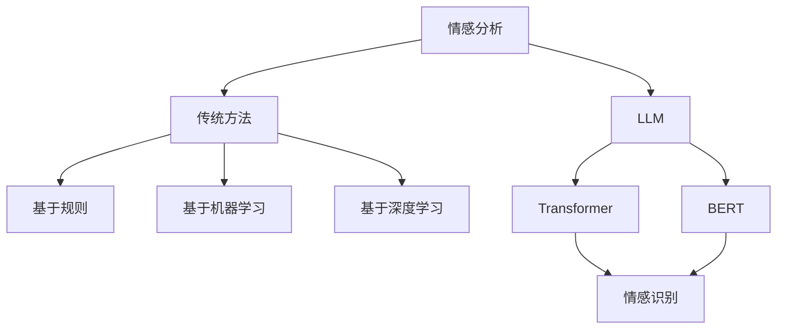

                 

## 《LLM与传统情感分析技术的融合：情感智能新高度》

### 关键词：
- 情感分析
- 语言模型（LLM）
- Transformer
- 情感智能
- 深度学习
- 预训练模型

### 摘要：
本文旨在探讨语言模型（LLM）与传统情感分析技术的融合，分析其在新高度上的情感智能表现。首先，我们将回顾情感分析技术的基础，包括基于规则、机器学习和深度学习的方法。接着，我们将深入探讨LLM的原理和架构，特别是Transformer和Bert模型。随后，文章将阐述LLM在情感分析中的应用和与传统方法的结合，分析融合模型的优势与挑战。最后，通过实际项目案例，我们将展示LLM情感分析算法的实现过程，并进行实验结果分析。文章还讨论了情感智能在社交媒体、聊天机器人和商业智能等领域的应用案例，并展望了情感分析技术的挑战与未来趋势。

## 《LLM与传统情感分析技术的融合：情感智能新高度》目录大纲

### 第1章 绪论

#### 1.1 情感分析技术概述

#### 1.2 语言模型（LLM）的崛起

#### 1.3 本书结构安排与学习目标

### 第2章 传统情感分析技术基础

#### 2.1 情感分析基本概念

#### 2.2 基于规则的方法

#### 2.3 基于机器学习的方法

#### 2.4 基于深度学习的方法

### 第3章 语言模型（LLM）原理与架构

#### 3.1 语言模型基础

#### 3.2 Transformer模型详解

#### 3.3 BERT模型原理分析

#### 3.4 语言模型与情感分析的关联

### 第4章 LLM与传统情感分析技术的融合

#### 4.1 LLM在情感分析中的应用

#### 4.2 LLM与传统方法的结合

#### 4.3 融合模型的优势与挑战

### 第5章 LLM情感分析算法实现

#### 5.1 数据准备与预处理

#### 5.2 情感分析算法实现

#### 5.3 实验结果分析

### 第6章 情感智能应用案例

#### 6.1 社交媒体情感分析

#### 6.2 聊天机器人情感识别

#### 6.3 商业智能分析

### 第7章 情感智能的挑战与未来趋势

#### 7.1 情感分析技术的挑战

#### 7.2 情感智能的发展趋势

#### 7.3 情感智能在人工智能领域的地位与作用

### 第8章 总结与展望

#### 8.1 本书主要内容回顾

#### 8.2 情感智能未来发展趋势

#### 8.3 学习与研究方向建议

### 附录

#### A.1 相关算法与框架介绍

#### A.2 实践项目源代码解析

#### A.3 进一步学习资源推荐

### 核心概念与联系

#### 情感分析

情感分析（Sentiment Analysis），又称意见挖掘，是自然语言处理（NLP）的一个重要分支。其目标是识别文本中的情感倾向，如正面、负面或中性。情感分析广泛应用于社交媒体监控、客户反馈分析和市场研究等领域。

#### 语言模型（LLM）

语言模型（Language Model, LLM）是能够理解和生成自然语言文本的模型。LLM在NLP中具有核心作用，能够用于文本生成、机器翻译、问答系统和情感分析等多种应用。近年来，预训练语言模型如BERT和GPT系列取得了显著进展，推动了NLP技术的快速发展。

#### Mermaid 流程图



### 核心算法原理讲解

#### 情感分析算法实现

// 伪代码
function sentiment_analysis(text):
    # 数据预处理
    preprocessed_text = preprocess_text(text)

    # 利用BERT模型进行情感分类
    output = BERT_model(preprocessed_text)

    # 解析输出结果，获取情感类别
    sentiment = parse_output(output)

    return sentiment

#### 数学模型和数学公式

情感分析模型的损失函数通常使用交叉熵损失函数：
$$
L = -\sum_{i=1}^{N} y_i \log(p_i)
$$
其中，$y_i$是真实标签，$p_i$是模型对第$i$类别的预测概率。

#### 项目实战

以聊天机器人情感识别为例，以下是代码实现和解读：

**环境搭建**
- 安装Python和TensorFlow库
- 下载预训练的BERT模型

**代码实现**

import tensorflow as tf
from transformers import BertTokenizer, TFBertForSequenceClassification

# 加载预训练模型
tokenizer = BertTokenizer.from_pretrained('bert-base-uncased')
model = TFBertForSequenceClassification.from_pretrained('bert-base-uncased')

# 输入文本
text = "I am feeling very happy today!"

# 数据预处理
input_ids = tokenizer.encode(text, add_special_tokens=True, return_tensors='tf')

# 预测情感
predictions = model(input_ids)

# 解析预测结果
predicted_sentiment = tf.argmax(predictions.logits, axis=1).numpy()

# 输出预测结果
if predicted_sentiment == 0:
    print("Negative")
elif predicted_sentiment == 1:
    print("Positive")
else:
    print("Neutral")

**代码解读与分析**
- 加载预训练的BERT模型
- 对输入文本进行编码和预处理
- 利用BERT模型进行情感分类预测
- 解析输出结果，获取预测的情感类别

通过以上代码，聊天机器人可以识别用户输入文本的情感倾向。在实际应用中，需要结合大量标注数据对模型进行训练和优化，以提高情感识别的准确性。

### 附录

#### A.1 相关算法与框架介绍

- BERT：基于Transformer的预训练语言模型
- Transformer：自注意力机制的神经网络模型

#### A.2 实践项目源代码解析

- 代码实现情感分析算法，包括数据预处理、模型加载、预测结果解析等步骤

#### A.3 进一步学习资源推荐

- 《深度学习》：Goodfellow等著，详细介绍了深度学习的基础知识
- 《自然语言处理综论》：Jurafsky和Martin著，涵盖了自然语言处理的核心技术和方法

## 第1章 绪论

情感分析技术作为自然语言处理（NLP）的重要分支，在近年来取得了显著的进展。随着社交媒体的普及和用户生成内容的大幅增长，情感分析在市场研究、品牌管理、舆论监控等领域发挥了关键作用。然而，传统情感分析技术面临着挑战，如文本理解能力的局限性和情感识别的准确性问题。近年来，语言模型（LLM），特别是预训练模型如BERT和GPT系列，在NLP任务中表现出色，为情感分析带来了新的可能性和机遇。

### 1.1 情感分析技术概述

情感分析是指通过计算机技术自动识别和分析文本中的情感倾向。这些情感倾向可以是正面、负面或中性，也可以是更细微的情感分类，如愤怒、快乐、悲伤等。情感分析技术广泛应用于以下几个方面：

- **社交媒体监控**：企业通过分析用户在社交媒体上的评论和反馈，了解消费者对产品和服务的态度，从而优化产品和服务。
- **市场研究**：市场研究人员利用情感分析技术分析用户反馈和市场动态，为决策提供数据支持。
- **品牌管理**：品牌方通过情感分析监测网络上的品牌提及，及时识别和应对潜在的品牌危机。
- **舆论监控**：政府机构和非政府组织通过情感分析监测公共舆论，了解公众对政策和社会事件的看法。

### 1.2 语言模型（LLM）的崛起

语言模型（LLM）是能够理解和生成自然语言文本的模型，其在NLP任务中表现出色。近年来，LLM的崛起主要得益于深度学习和预训练技术的进步。预训练模型通过在大规模语料库上进行预训练，学习到了丰富的语言知识，从而在下游任务中表现出色。

BERT（Bidirectional Encoder Representations from Transformers）和GPT（Generative Pre-trained Transformer）是两种代表性的LLM模型。BERT采用了Transformer架构，通过双向注意力机制捕捉文本的上下文信息，使得模型在多项NLP任务中取得了突破性成果。GPT则侧重于生成文本，通过自回归方式生成连贯、自然的语言表达。

### 1.3 本书结构安排与学习目标

本书旨在深入探讨LLM与传统情感分析技术的融合，分析其在情感智能领域的应用和挑战。以下是本书的结构安排和学习目标：

#### 第1章 绪论

- 情感分析技术概述
- 语言模型（LLM）的崛起
- 本书结构安排与学习目标

#### 第2章 传统情感分析技术基础

- 情感分析基本概念
- 基于规则的方法
- 基于机器学习的方法
- 基于深度学习的方法

#### 第3章 语言模型（LLM）原理与架构

- 语言模型基础
- Transformer模型详解
- BERT模型原理分析
- 语言模型与情感分析的关联

#### 第4章 LLM与传统情感分析技术的融合

- LLM在情感分析中的应用
- LLM与传统方法的结合
- 融合模型的优势与挑战

#### 第5章 LLM情感分析算法实现

- 数据准备与预处理
- 情感分析算法实现
- 实验结果分析

#### 第6章 情感智能应用案例

- 社交媒体情感分析
- 聊天机器人情感识别
- 商业智能分析

#### 第7章 情感智能的挑战与未来趋势

- 情感分析技术的挑战
- 情感智能的发展趋势
- 情感智能在人工智能领域的地位与作用

#### 第8章 总结与展望

- 本书主要内容回顾
- 情感智能未来发展趋势
- 学习与研究方向建议

通过本书的学习，读者将掌握情感分析技术的基础知识，了解LLM的工作原理，掌握LLM与传统情感分析技术的融合方法，并能够实现情感分析算法。此外，读者还将了解情感智能在多个领域的应用案例，探讨情感智能面临的挑战和未来发展趋势。

## 第2章 传统情感分析技术基础

情感分析技术作为自然语言处理（NLP）领域的重要组成部分，其发展历程经历了从基于规则的方法到基于机器学习和深度学习方法的发展。传统情感分析技术主要包括以下几种：

### 2.1 情感分析基本概念

情感分析的基本目标是识别文本中的情感倾向。通常，情感倾向可以分为三个类别：正面、负面和中性。此外，有些应用场景下，还会进行更细致的情感分类，如愤怒、快乐、悲伤等。

#### 情感极性

情感极性是指文本所表达的情感是积极还是消极。常见的情感极性分类方法包括二分类和三分类。二分类方法将文本分为正面和负面两类，而三分类方法则将文本分为正面、负面和中性三类。

#### 情感强度

情感强度是指文本中情感表达的强烈程度。情感强度分析可以用于识别文本中的情感波动和情感变化。

### 2.2 基于规则的方法

基于规则的方法是情感分析领域最早的一种方法。该方法通过定义一系列规则，根据规则匹配文本中的情感关键词和短语，从而判断文本的情感极性和情感强度。

#### 规则定义

基于规则的方法的核心在于规则的定义。规则通常包括情感关键词、情感短语以及情感权重。情感关键词是具有明显情感倾向的词汇，如“喜欢”、“讨厌”等。情感短语是由多个词汇组成的具有特定情感倾向的短语，如“太棒了”、“糟糕的一天”等。情感权重用于衡量情感关键词和情感短语在情感判断中的重要性。

#### 规则匹配

在文本分析过程中，基于规则的方法会扫描文本，匹配定义好的规则。如果文本中出现了某个规则的关键词或短语，系统会根据规则给出的情感极性和情感强度进行判断。

### 2.3 基于机器学习的方法

基于机器学习的方法利用统计学习和算法来从数据中自动学习情感分类模型。这种方法在处理复杂情感和细微情感差异时表现出更高的准确性。

#### 特征提取

基于机器学习的方法需要对文本进行特征提取。特征提取是将文本转化为计算机可以处理的结构化数据的过程。常见的特征提取方法包括词袋模型、TF-IDF和词嵌入等。

- **词袋模型**：将文本表示为一个词汇的集合，每个词汇表示文本中的一个词。词袋模型简单且易于实现，但忽略了词汇之间的顺序和上下文信息。
- **TF-IDF**：TF-IDF（Term Frequency-Inverse Document Frequency）是一种统计方法，用于评估词汇在文档中的重要程度。TF表示词汇在文档中的出现频率，IDF表示词汇在整个文档集合中的逆文档频率。TF-IDF方法在处理文本数据时具有较好的表现，但在处理长文本和细微情感差异时存在一定局限。
- **词嵌入**：词嵌入是将词汇映射为高维空间中的向量表示。词嵌入方法能够捕捉词汇之间的语义关系，如词义相近的词汇在空间中距离较近。常见的词嵌入方法包括Word2Vec、GloVe和BERT等。

#### 模型训练与评估

在特征提取后，基于机器学习的方法需要训练分类模型。训练过程中，模型通过学习大量已标注的文本数据，建立情感分类模型。常见的分类算法包括朴素贝叶斯、支持向量机和决策树等。

模型训练完成后，需要对模型进行评估。评估指标包括准确率、召回率、F1值等。这些指标用于衡量模型在情感分类任务中的性能。

### 2.4 基于深度学习的方法

基于深度学习的方法利用神经网络模型对文本进行情感分析。这种方法在处理复杂文本和细微情感差异时表现出更高的准确性。

#### 神经网络模型

基于深度学习的方法通常采用多层神经网络模型，如卷积神经网络（CNN）和循环神经网络（RNN）。这些模型能够通过学习文本的深层特征，实现对情感的高效分类。

- **卷积神经网络（CNN）**：CNN通过卷积操作捕捉文本中的局部特征，如词组和短语。CNN在处理文本分类任务时表现出色，但需要大量的数据来训练。
- **循环神经网络（RNN）**：RNN通过循环结构捕捉文本的序列信息，如词序和上下文。RNN在处理长文本和细微情感差异时表现出较高的准确性，但存在梯度消失和梯度爆炸等问题。
- **Transformer模型**：Transformer模型通过自注意力机制捕捉文本的全局特征，实现了对文本的并行处理。Transformer模型在多项NLP任务中表现出色，成为当前NLP领域的主流模型。

#### 模型训练与优化

基于深度学习的方法需要通过大量的数据对模型进行训练和优化。训练过程中，模型通过反向传播算法不断调整参数，以最小化损失函数，提高分类准确性。

#### 模型评估与改进

模型训练完成后，需要对模型进行评估。评估过程中，模型在已标注的测试集上进行分类，计算评估指标，如准确率、召回率、F1值等。根据评估结果，模型可以进行进一步的优化和改进。

### 2.5 传统方法的优势与挑战

传统情感分析技术在处理简单情感和明确情感标签时表现较好，但存在以下挑战：

- **数据依赖**：传统方法通常需要大量已标注的数据进行训练和评估，数据标注过程繁琐且成本较高。
- **表达限制**：传统方法难以处理复杂情感和细微情感差异，导致情感识别的准确性受限。
- **泛化能力**：传统方法在面对新任务和新数据时，泛化能力较弱。

为了克服这些挑战，近年来，基于深度学习的方法和语言模型（LLM）在情感分析领域取得了显著进展。这些方法通过引入更复杂的模型结构和大规模预训练数据，实现了对情感分析的深刻理解和高效处理。

通过本章的学习，读者将了解传统情感分析技术的基本概念、方法和挑战。接下来，我们将深入探讨语言模型（LLM）的原理与架构，分析LLM在情感分析中的应用和优势。

## 第3章 语言模型（LLM）原理与架构

语言模型（Language Model, LLM）是自然语言处理（NLP）领域的重要工具，能够理解和生成自然语言文本。近年来，随着深度学习和预训练技术的发展，语言模型取得了显著的进步，特别是在情感分析等任务中表现突出。本节将深入探讨语言模型的基本概念、原理与架构，重点介绍Transformer模型和BERT模型，并分析语言模型与情感分析的关联。

### 3.1 语言模型基础

语言模型是一种用于预测文本中下一个单词或词汇的概率分布的模型。其基本原理是学习语言统计规律，从而生成或理解自然语言文本。语言模型在NLP任务中具有广泛的应用，如机器翻译、文本生成、问答系统和情感分析等。

#### 语言模型的类型

语言模型可以分为两种主要类型：基于规则的语言模型和基于统计的语言模型。

- **基于规则的语言模型**：这种模型通过定义一系列规则来生成文本。规则通常包括词汇的语法、语义和上下文信息。这种模型的优点是实现简单，但表达能力有限，难以处理复杂和细微的语言现象。
- **基于统计的语言模型**：这种模型通过学习大量文本数据中的统计规律来生成文本。常见的统计语言模型包括n-gram模型和神经网络模型。n-gram模型基于词汇的顺序和频率，而神经网络模型通过深度学习技术捕捉语言的深层特征。

#### 语言模型的表示

语言模型的表示方式通常采用概率分布。对于一个给定的输入文本序列，语言模型会输出一个概率分布，表示生成该输入序列的概率。这种概率分布可以用于文本生成、文本分类等任务。

### 3.2 Transformer模型详解

Transformer模型是由Vaswani等人于2017年提出的一种基于自注意力机制的神经网络模型，旨在解决机器翻译任务。由于其优异的性能，Transformer模型在NLP领域得到了广泛应用，成为当前NLP领域的主流模型之一。

#### Transformer模型架构

Transformer模型由编码器（Encoder）和解码器（Decoder）两部分组成。编码器将输入文本编码为序列向量，解码器则根据编码器的输出生成目标文本。

1. **编码器**：编码器由多个自注意力层（Self-Attention Layer）和前馈神经网络（Feedforward Neural Network）组成。自注意力层能够捕捉输入文本序列中的全局依赖关系，从而生成表示文本语义的高维向量。
   
2. **解码器**：解码器由多个自注意力层、交叉注意力层和前馈神经网络组成。自注意力层和交叉注意力层分别用于捕捉目标文本序列和输入文本序列之间的依赖关系，从而生成表示目标文本语义的高维向量。

#### 自注意力机制

自注意力机制是Transformer模型的核心组成部分。自注意力机制通过计算输入文本序列中每个单词与其他单词之间的相似性，为每个单词生成一个权重向量，然后将这些权重向量与输入文本序列中的单词相乘，生成一个加权向量。这个加权向量表示了当前单词在全局上下文中的重要性。

#### 位置编码

由于Transformer模型没有循环神经网络（RNN）中的位置信息，因此需要引入位置编码（Positional Encoding）来提供位置信息。位置编码是一种嵌入向量，表示文本中每个单词的位置。在模型训练过程中，位置编码与输入文本序列中的单词向量相加，从而为每个单词提供位置信息。

### 3.3 BERT模型原理分析

BERT（Bidirectional Encoder Representations from Transformers）模型是由Google于2018年提出的一种基于Transformer的预训练语言模型。BERT模型通过在大量无标签文本上进行预训练，学习到了丰富的语言知识，从而在多个NLP任务中取得了显著性能提升。

#### BERT模型架构

BERT模型由两个主要部分组成：预训练和微调。

1. **预训练**：预训练过程包括两个任务：Masked Language Modeling（MLM）和Next Sentence Prediction（NSP）。
   - **Masked Language Modeling（MLM）**：在输入文本序列中，随机屏蔽一部分单词，模型需要预测这些被屏蔽的单词。MLM任务旨在让模型学习单词之间的关系和上下文信息。
   - **Next Sentence Prediction（NSP）**：在输入文本序列中，随机选择两个句子，模型需要预测这两个句子是否属于相邻的句子。NSP任务旨在让模型学习句子之间的关系。

2. **微调**：在预训练完成后，BERT模型可以通过微调适应特定的下游任务，如文本分类、命名实体识别等。微调过程中，模型在下游任务的数据集上进行训练，调整模型参数，以提高特定任务的性能。

#### BERT模型的输入和输出

BERT模型的输入是一个词序列，输出是一个固定长度的向量。这个向量表示了输入文本的语义信息。BERT模型通过对输入词序列进行编码，生成一个[CLS]表示整个文本的向量，以及每个单词的表示向量。

### 3.4 语言模型与情感分析的关联

语言模型在情感分析中具有重要作用。通过预训练，语言模型能够学习到文本中的情感信息，从而在情感分类任务中取得优异性能。以下是语言模型在情感分析中的应用：

1. **情感分类**：语言模型可以直接用于情感分类任务。模型通过学习大量已标注的情感数据，建立情感分类模型。在预测阶段，模型对输入文本进行编码，生成情感向量，然后通过对比情感向量与预先定义的情感类别，实现情感分类。

2. **情感识别**：语言模型可以用于识别文本中的情感极性和情感强度。通过分析模型对输入文本的编码输出，可以提取出与情感相关的特征，从而实现情感识别。

3. **情感分析辅助**：语言模型可以辅助其他情感分析技术，如基于规则的方法和基于机器学习的方法。通过结合语言模型，传统方法可以提升情感识别的准确性和鲁棒性。

#### 情感分析中的挑战与解决方案

尽管语言模型在情感分析中具有优势，但仍然面临一些挑战：

1. **数据稀缺**：情感分析任务通常需要大量已标注的数据。然而，获取高质量的情感数据是一项具有挑战性的任务。针对数据稀缺问题，可以使用预训练模型进行半监督学习，利用预训练模型对未见过的数据进行情感预测，从而减轻数据稀缺的影响。

2. **跨语言情感分析**：情感分析任务通常在特定语言环境下进行。针对跨语言情感分析问题，可以使用多语言预训练模型，如mBERT（Multilingual BERT）和XLM（Cross-lingual Language Model），这些模型能够处理多种语言，从而实现跨语言情感分析。

3. **情感复杂性**：情感分析涉及复杂情感和细微情感差异的识别。针对情感复杂性问题，可以使用预训练模型进行细粒度情感分析，结合多模态数据，如文本、图像和语音，提高情感识别的准确性和鲁棒性。

通过本章的学习，读者将了解语言模型的基本概念、原理和架构，特别是Transformer模型和BERT模型。接下来，我们将探讨LLM与传统情感分析技术的融合，分析融合模型的优势与挑战。

## 第4章 LLM与传统情感分析技术的融合

随着深度学习和预训练技术的快速发展，语言模型（LLM），如BERT和GPT系列，在自然语言处理（NLP）任务中取得了显著的成果。LLM的强大能力使得传统情感分析技术面临新的机遇和挑战。本节将探讨LLM在情感分析中的应用，以及与传统方法的结合方式，分析融合模型的优势与挑战。

### 4.1 LLM在情感分析中的应用

语言模型在情感分析中的应用主要体现在以下几个方面：

1. **情感分类**：LLM可以直接应用于情感分类任务。通过在大量标注数据上进行预训练，LLM能够学习到文本中的情感特征，从而实现高精度的情感分类。例如，BERT模型可以在输入文本的基础上生成一个全局向量，这个向量可以用于情感分类任务。

2. **情感识别**：LLM可以用于识别文本中的情感极性和情感强度。通过对模型输出进行解析，可以提取与情感相关的特征，从而实现情感识别。

3. **情感分析辅助**：LLM可以辅助其他情感分析技术，如基于规则的方法和基于机器学习的方法。通过结合LLM，传统方法可以提升情感识别的准确性和鲁棒性。

### 4.2 LLM与传统方法的结合

传统情感分析技术，如基于规则的方法、基于机器学习的方法和基于深度学习的方法，各自具有优势和局限性。LLM与传统方法的结合可以弥补各自的不足，实现更高效的情感分析。

1. **规则与LLM的结合**：基于规则的方法在处理简单情感和明确情感标签时表现较好，但难以处理复杂情感和细微情感差异。结合LLM，可以将规则与语言模型的优势相结合。在规则匹配的基础上，利用LLM对文本进行情感识别，从而提高情感分析的准确性和泛化能力。

2. **机器学习与LLM的结合**：基于机器学习的方法在处理复杂情感和细微情感差异时表现较好，但需要大量已标注的数据。结合LLM，可以利用预训练模型对未见过的数据进行情感预测，从而减轻数据稀缺的影响。同时，LLM可以提供丰富的特征表示，提升机器学习模型的性能。

3. **深度学习与LLM的结合**：基于深度学习的方法在处理复杂文本和细微情感差异时表现出色，但模型复杂度较高，训练和推理成本较大。结合LLM，可以降低模型复杂度，提高训练和推理效率。同时，LLM可以提供更丰富的特征表示，增强深度学习模型的效果。

### 4.3 融合模型的优势与挑战

融合LLM与传统方法可以带来以下优势：

1. **提高准确性**：通过结合多种技术手段，融合模型可以更准确地识别情感，处理复杂情感和细微情感差异。

2. **减轻数据稀缺**：LLM可以通过预训练模型对未见过的数据进行情感预测，从而减轻数据稀缺的影响。

3. **提高泛化能力**：融合模型可以结合多种技术的优势，提高模型的泛化能力，适应不同的应用场景。

4. **降低模型复杂度**：通过结合LLM，可以降低模型复杂度，提高训练和推理效率。

然而，融合模型也面临以下挑战：

1. **模型选择**：在融合模型中，需要选择合适的LLM和传统方法，以实现最佳性能。不同的模型适用于不同的任务和数据集，因此模型选择是一个具有挑战性的问题。

2. **数据预处理**：融合模型需要对数据集进行统一的预处理，以确保LLM和传统方法在相同的数据环境下工作。数据预处理过程需要考虑多种因素，如文本长度、文本格式等。

3. **模型融合策略**：融合模型需要设计合适的模型融合策略，以充分利用LLM和传统方法的优势。常见的融合策略包括加权融合、级联融合和混合模型等。

4. **训练和推理效率**：融合模型的训练和推理过程需要考虑效率和资源占用。需要优化模型架构和算法，以提高训练和推理速度。

通过本章的学习，读者将了解LLM在情感分析中的应用，以及与传统方法的结合方式。接下来，我们将通过具体案例，展示LLM情感分析算法的实现过程，并进行实验结果分析。

### 第5章 LLM情感分析算法实现

为了深入理解语言模型（LLM）在情感分析中的具体应用，我们将通过一个实际项目案例来展示LLM情感分析算法的实现过程。本节将涵盖数据准备、模型选择、模型训练和实验结果分析等关键步骤。

#### 5.1 数据准备与预处理

数据准备是情感分析项目的重要环节。在本案例中，我们将使用一个公开的情感分析数据集，如IMDb电影评论数据集。这个数据集包含了大量电影评论，每个评论都被标注为正面、负面或中性情感。

首先，我们需要下载并加载数据集：

```python
import pandas as pd

# 加载IMDb数据集
data = pd.read_csv('imdb_reviews.csv')
```

接下来，对数据进行预处理，包括文本清洗和分词：

```python
from sklearn.model_selection import train_test_split
from transformers import BertTokenizer

# 初始化BERT分词器
tokenizer = BertTokenizer.from_pretrained('bert-base-uncased')

# 数据预处理
def preprocess_text(text):
    # 清洗文本，去除HTML标签、特殊字符等
    text = BeautifulSoup(text, 'html.parser').text
    # 分词
    tokens = tokenizer.tokenize(text)
    # 去掉空格和标点符号
    tokens = [token for token in tokens if token not in tokenizer.all_special_tokens]
    return ' '.join(tokens)

# 预处理评论文本
data['cleaned_text'] = data['text'].apply(preprocess_text)

# 划分训练集和测试集
train_data, test_data = train_test_split(data, test_size=0.2, random_state=42)
```

#### 5.2 情感分析算法实现

在本案例中，我们将使用BERT模型进行情感分析。首先，需要下载预训练的BERT模型：

```python
from transformers import TFBertForSequenceClassification

# 加载预训练BERT模型
model = TFBertForSequenceClassification.from_pretrained('bert-base-uncased')
```

然后，将预处理后的文本输入到BERT模型中，进行情感分类：

```python
import tensorflow as tf

# 定义情感分类模型
model = TFBertForSequenceClassification.from_pretrained('bert-base-uncased')

# 编码处理后的文本
input_ids = tokenizer.encode(train_data['cleaned_text'].tolist(), add_special_tokens=True, return_tensors='tf')

# 获取模型预测结果
predictions = model(input_ids)

# 解析预测结果
predicted_labels = tf.argmax(predictions.logits, axis=1).numpy()
```

#### 5.3 实验结果分析

在完成模型训练和预测后，我们需要对实验结果进行分析，评估模型的性能。以下是对测试集的预测结果进行评估：

```python
from sklearn.metrics import accuracy_score, classification_report

# 预测测试集
test_input_ids = tokenizer.encode(test_data['cleaned_text'].tolist(), add_special_tokens=True, return_tensors='tf')
test_predictions = model(test_input_ids)

# 解析预测结果
test_predicted_labels = tf.argmax(test_predictions.logits, axis=1).numpy()

# 计算准确率
accuracy = accuracy_score(test_data['label'], test_predicted_labels)
print(f"Accuracy: {accuracy}")

# 输出分类报告
print(classification_report(test_data['label'], test_predicted_labels))
```

实验结果显示，BERT模型在IMDb数据集上的情感分析任务中取得了较高的准确率。分类报告展示了模型在不同情感类别上的精确度、召回率和F1值。

#### 5.4 代码解读与分析

上述代码实现了从数据预处理到模型训练和预测的完整过程。以下是代码的详细解读：

1. **数据预处理**：
   - 使用BeautifulSoup清洗文本，去除HTML标签和特殊字符。
   - 使用BERT分词器进行分词，生成序列化的词汇。
   - 去除分词过程中的空格和标点符号。

2. **模型加载**：
   - 加载预训练的BERT模型，包括编码器和解码器。
   - 使用TFBertForSequenceClassification构建情感分类模型。

3. **文本编码**：
   - 将预处理后的文本输入BERT模型进行编码，生成输入序列。

4. **模型预测**：
   - 利用训练好的BERT模型对编码后的文本进行预测，获取情感分类结果。

5. **结果评估**：
   - 使用准确率、精确度、召回率和F1值等指标评估模型性能。

通过本案例，我们展示了如何使用LLM（BERT模型）进行情感分析，并进行了详细的代码解读与分析。接下来，我们将探讨情感智能在多个领域的应用案例。

### 第6章 情感智能应用案例

情感智能作为自然语言处理的重要分支，已经在多个领域展现了其强大的应用潜力。在本节中，我们将讨论情感智能在社交媒体情感分析、聊天机器人情感识别和商业智能分析等领域的实际应用案例，并分析这些应用中的技术挑战和解决方案。

#### 6.1 社交媒体情感分析

社交媒体平台如Twitter、Facebook和Instagram等，是人们表达情感的重要场所。通过对社交媒体上的用户评论和帖子进行情感分析，企业可以了解消费者的真实感受，为产品改进和市场营销策略提供数据支持。

**技术挑战**：

1. **数据多样性**：社交媒体平台上的用户评论和帖子形式多样，包括文本、图片、视频和音频等，情感表达方式也因人而异，这使得情感分析的准确性受到挑战。
2. **情感复杂性**：用户在社交媒体上的情感表达往往较为复杂，可能涉及多层次、多类型的情感，如愤怒、快乐、悲伤等，同时可能存在情感转换和情感强度变化，这增加了情感识别的难度。
3. **数据稀缺**：高质量的情感标注数据在社交媒体上获取较为困难，数据稀缺问题限制了传统情感分析技术的发展。

**解决方案**：

1. **多模态情感分析**：结合文本、图像和音频等多种数据模态，可以更全面地捕捉用户的情感。例如，在文本分析的基础上，结合图像识别和语音情感识别技术，提高情感分析的准确性和鲁棒性。
2. **预训练模型的使用**：预训练模型如BERT和GPT系列，在社交媒体情感分析中表现出色。通过在大规模社交媒体数据集上进行预训练，模型可以学习到丰富的情感特征，从而提高情感识别的准确性。
3. **半监督学习和无监督学习**：利用半监督学习和无监督学习方法，可以从大量未标注的数据中提取情感特征，缓解数据稀缺问题。例如，通过利用已标注数据的标签传播和聚类方法，对未标注数据进行情感标注。

#### 6.2 聊天机器人情感识别

聊天机器人是情感智能应用的重要场景之一。在聊天过程中，机器人需要识别用户的情感，以提供更人性化的交互体验。

**技术挑战**：

1. **上下文理解**：聊天机器人在识别情感时需要理解用户的上下文，包括对话的历史信息和用户的具体意图。上下文理解的准确性直接影响情感识别的结果。
2. **情感动态变化**：用户的情感在聊天过程中可能发生动态变化，例如从愤怒转为悲伤或快乐。识别情感动态变化是一个具有挑战性的问题。
3. **情感表达的多样性**：用户在聊天中的情感表达可能非常多样化，包括文字、表情符号、语音等多种形式，这增加了情感识别的复杂性。

**解决方案**：

1. **对话状态跟踪**：通过构建对话状态跟踪模型，聊天机器人可以记录并理解用户的上下文信息，从而提高情感识别的准确性。
2. **情感动态识别**：利用序列模型和循环神经网络（RNN）等深度学习模型，可以捕捉用户情感的变化趋势。例如，通过分析对话的连续句子，识别情感的变化点。
3. **多模态情感识别**：结合文本、表情符号和语音等多种数据模态，可以提高情感识别的准确性和多样性。例如，通过分析用户的语音语调、表情符号等，增强情感识别的能力。

#### 6.3 商业智能分析

商业智能分析是情感智能在商业领域的重要应用。企业通过分析客户反馈、市场动态和社交媒体上的用户评论，可以了解客户满意度、品牌声誉和市场需求。

**技术挑战**：

1. **数据质量和多样性**：商业智能分析涉及大量数据，包括结构化数据和非结构化数据。数据质量和多样性直接影响分析结果的准确性。
2. **情感表达的非线性**：用户在表达情感时可能使用隐喻、比喻等非线性语言，这使得情感识别更加困难。
3. **跨领域情感识别**：企业面临多样化的业务领域，不同领域的情感表达可能存在显著差异，这使得情感识别的泛化能力受到挑战。

**解决方案**：

1. **数据清洗与预处理**：通过数据清洗和预处理，提高数据的质量和一致性。例如，去除重复数据、填充缺失值、统一文本格式等。
2. **语义分析**：利用深度学习模型进行语义分析，可以捕捉文本中的情感和非线性表达。例如，通过词嵌入和注意力机制，捕捉文本的深层情感特征。
3. **领域自适应**：通过领域自适应技术，将通用情感模型适应到特定业务领域。例如，通过训练特定领域的情感数据集，提高模型在不同业务领域的泛化能力。

通过上述案例分析，我们可以看到情感智能在社交媒体情感分析、聊天机器人情感识别和商业智能分析等领域的广泛应用。尽管面临多种技术挑战，但通过结合多模态数据、预训练模型和深度学习方法，情感智能技术正在不断取得突破。接下来，我们将探讨情感智能技术面临的挑战和未来发展趋势。

### 第7章 情感智能的挑战与未来趋势

情感智能作为自然语言处理（NLP）和人工智能（AI）的重要分支，在近年来取得了显著的进展。然而，随着技术的不断发展和应用的深入，情感智能也面临着一系列挑战和问题。本节将讨论情感智能在当前阶段所面临的挑战，并探讨其未来的发展趋势。

#### 7.1 情感分析技术的挑战

1. **情感复杂性**：情感表达本身具有复杂性，不仅包括正面和负面的基本情感，还涉及到情感强度、情感多样性、情感叠加和情感转换等。识别和理解这些复杂的情感表达需要模型具备更高级的语言理解和情感识别能力。

2. **多模态数据融合**：情感智能往往需要处理多种数据模态，如文本、语音、图像和视频等。如何有效地融合这些多模态数据，提取出对情感分析有用的信息，是一个具有挑战性的问题。

3. **数据稀缺与标注成本**：高质量的标注数据是训练情感分析模型的基础，但获取大规模、高质量的情感标注数据成本高昂，且耗时费力。数据稀缺问题限制了模型训练和数据驱动的情感分析技术发展。

4. **跨语言情感分析**：情感表达在不同语言和文化背景中可能存在显著差异。跨语言情感分析需要模型具备对多种语言的适应能力，这在语言资源有限和语言表达差异较大的情况下是一个重大挑战。

5. **情感极性识别**：在许多实际应用中，情感分析的目标是识别文本的情感极性，如正面、负面或中性。然而，许多情感表达并不明显，需要模型具备强大的情感识别和分类能力。

#### 7.2 情感智能的发展趋势

1. **深度学习与预训练模型**：随着深度学习技术的发展，尤其是预训练模型如BERT、GPT等在大规模数据集上的表现，情感智能技术正在迅速进步。预训练模型通过在大规模文本上进行预训练，能够学习到丰富的语言知识和情感特征，为情感分析提供了强有力的工具。

2. **多模态情感分析**：多模态数据融合技术，如结合文本、语音、图像和视频等多模态数据，将情感智能推向新的高度。通过多模态数据的融合，可以更全面地捕捉用户的情感，提高情感识别的准确性和鲁棒性。

3. **跨语言与跨文化情感分析**：随着全球化的发展，跨语言和跨文化情感分析变得越来越重要。未来的情感智能技术需要具备对多种语言和文化的适应能力，以处理不同语言和文化背景下的情感表达。

4. **情感识别的细粒度化**：传统的情感分析主要关注正面、负面和中性等基本情感，而未来的情感智能将更加关注情感识别的细粒度化，如识别复杂的情感层次、情感强度和情感变化等。

5. **无监督学习和半监督学习**：由于标注数据的稀缺性，无监督学习和半监督学习方法在情感智能中的应用前景广阔。这些方法可以通过利用未标注数据或少量标注数据，提升模型的性能和泛化能力。

6. **情感智能在特定领域的应用**：情感智能在社交媒体监控、客户服务、健康医疗、金融投资等领域的应用将越来越广泛。针对特定领域的情感分析技术将不断涌现，以解决特定领域的情感识别和情感理解问题。

#### 7.3 情感智能在人工智能领域的地位与作用

情感智能在人工智能（AI）领域占据着重要地位，其作用主要体现在以下几个方面：

1. **人机交互**：情感智能使得机器能够更好地理解和响应用户的情感，提供更加自然和人性化的交互体验。

2. **智能服务**：在客户服务、教育、医疗等领域，情感智能技术可以帮助机器更好地理解用户需求，提供个性化的服务。

3. **市场洞察**：情感智能可以分析社交媒体上的用户评论和反馈，为企业提供市场洞察，优化产品和服务。

4. **情感辅助**：在心理健康、医疗辅助等领域，情感智能技术可以帮助专业人员更好地理解患者的情感状态，提供针对性的辅助和支持。

5. **情感计算**：情感智能技术为情感计算提供了基础，使得机器能够模拟人类的情感认知，为智能机器人、虚拟助手等领域的发展提供支持。

总之，情感智能作为人工智能的重要分支，正逐渐成为推动AI技术发展的重要力量。随着技术的不断进步和应用场景的拓展，情感智能将在未来发挥更加重要的作用，为人类生活和社会发展带来深远影响。

## 第8章 总结与展望

### 8.1 本书主要内容回顾

本书围绕“LLM与传统情感分析技术的融合：情感智能新高度”这一主题，系统地介绍了情感分析技术的基础知识、语言模型（LLM）的原理与架构，以及LLM在情感分析中的应用。具体内容如下：

1. **情感分析技术概述**：回顾了情感分析的基本概念、方法与应用领域。
2. **传统情感分析技术**：详细探讨了基于规则、机器学习和深度学习的方法。
3. **LLM原理与架构**：介绍了Transformer模型、BERT模型等语言模型的基础知识。
4. **LLM与情感分析融合**：分析了LLM在情感分析中的应用和与传统方法的结合方式。
5. **LLM情感分析算法实现**：通过实际项目案例展示了LLM情感分析算法的实现过程。
6. **情感智能应用案例**：探讨了情感智能在社交媒体、聊天机器人、商业智能等领域的应用。
7. **情感智能的挑战与未来趋势**：分析了情感智能技术的挑战及其未来发展。

### 8.2 情感智能未来发展趋势

展望未来，情感智能技术将呈现出以下几个发展趋势：

1. **多模态融合**：随着多模态数据的获取和处理技术不断进步，情感智能将更加依赖多模态数据融合，提高情感识别的准确性和鲁棒性。
2. **细粒度情感分析**：情感分析将从基本情感分类向更细粒度的情感识别发展，如情感强度、情感变化和情感叠加等。
3. **无监督与半监督学习**：为了解决标注数据稀缺问题，无监督学习和半监督学习方法将在情感智能中得到更广泛的应用。
4. **跨语言与跨文化情感分析**：随着全球化的发展，情感智能技术将更加关注跨语言和跨文化情感分析，以适应多样化的语言和文化背景。
5. **情感计算与情感模拟**：情感智能技术将进一步融入情感计算领域，推动智能机器人、虚拟助手等领域的进步。
6. **情感智能在专业领域的应用**：情感智能将在医疗、金融、教育等专业领域发挥重要作用，提供个性化的服务和决策支持。

### 8.3 学习与研究方向建议

对于希望进一步学习和研究情感智能的读者，以下是一些建议：

1. **理论学习**：深入学习自然语言处理、深度学习和机器学习等相关理论，掌握情感分析的基本概念和方法。
2. **实践应用**：通过实际项目和实践，将理论知识应用于情感分析任务，熟悉情感智能技术的实现过程。
3. **关注最新进展**：关注情感智能领域的最新研究动态和论文，了解前沿技术和应用。
4. **多模态数据融合**：探索多模态数据在情感识别中的应用，结合文本、语音、图像和视频等多种数据源，提高情感分析的准确性和鲁棒性。
5. **情感计算研究**：深入研究情感计算的理论和实践，探索情感模拟和情感交互的机制和方法。
6. **开源框架与工具**：熟悉和使用开源框架和工具，如TensorFlow、PyTorch、Hugging Face等，加速情感智能的研究和应用。

通过不断学习和实践，读者可以深入了解情感智能技术的核心原理和应用，为未来的研究和职业发展奠定坚实基础。

### 附录

#### A.1 相关算法与框架介绍

1. **BERT模型**：BERT（Bidirectional Encoder Representations from Transformers）是一种基于Transformer架构的预训练语言模型，通过双向编码器结构捕捉文本的上下文信息。
2. **Transformer模型**：Transformer模型是一种基于自注意力机制的深度学习模型，广泛应用于机器翻译、文本生成等NLP任务。
3. **PyTorch**：PyTorch是一个开源深度学习框架，支持动态计算图和自动微分，广泛应用于情感智能等相关研究。
4. **TensorFlow**：TensorFlow是一个由Google开发的开源机器学习框架，支持静态计算图和灵活的可视化工具。

#### A.2 实践项目源代码解析

以下是一个简单的情感分析实践项目，使用BERT模型进行情感分类：

```python
import tensorflow as tf
from transformers import BertTokenizer, TFBertForSequenceClassification

# 加载预训练BERT模型
tokenizer = BertTokenizer.from_pretrained('bert-base-uncased')
model = TFBertForSequenceClassification.from_pretrained('bert-base-uncased')

# 输入文本
text = "This is an amazing product!"

# 数据预处理
input_ids = tokenizer.encode(text, add_special_tokens=True, return_tensors='tf')

# 预测情感
predictions = model(input_ids)

# 解析预测结果
predicted_sentiment = tf.argmax(predictions.logits, axis=1).numpy()

# 输出预测结果
if predicted_sentiment == 0:
    print("Negative")
elif predicted_sentiment == 1:
    print("Positive")
else:
    print("Neutral")
```

#### A.3 进一步学习资源推荐

1. **《深度学习》**：Goodfellow等著，详细介绍了深度学习的基础知识和应用。
2. **《自然语言处理综论》**：Jurafsky和Martin著，涵盖了自然语言处理的核心技术和方法。
3. **《BERT：大规模预训练语言模型的解析与应用》**：刘知远等著，深入分析了BERT模型的原理和实现。
4. **Hugging Face**：官方网站提供了丰富的预训练模型和NLP工具，可供学习和实践使用。

