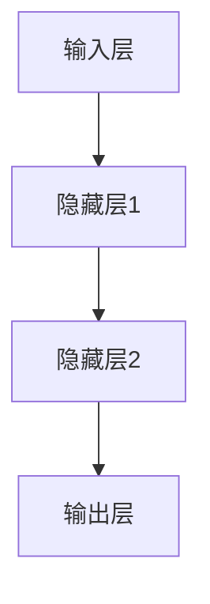
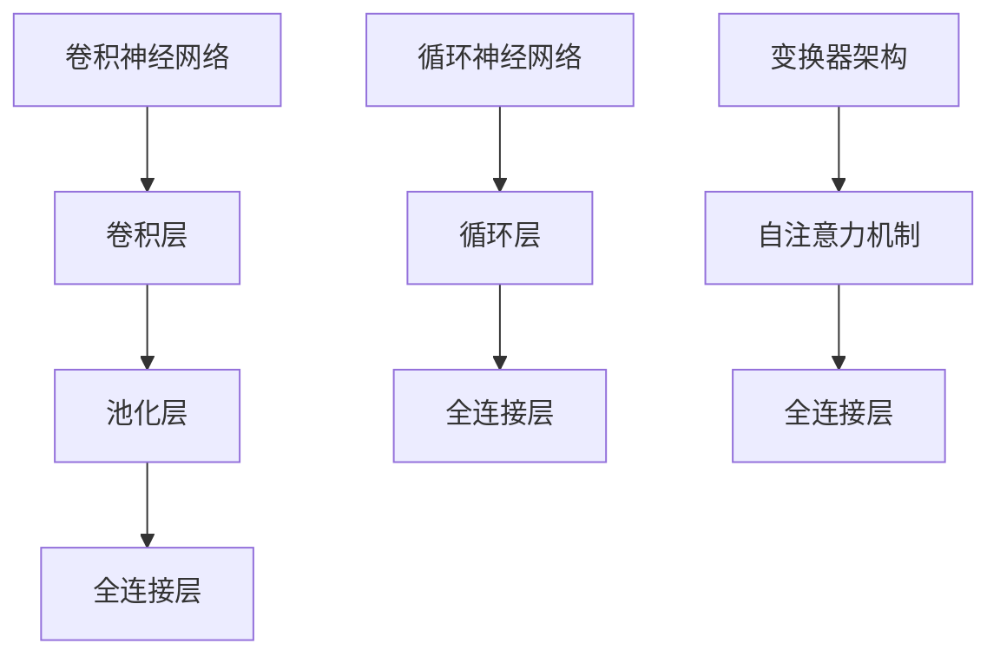
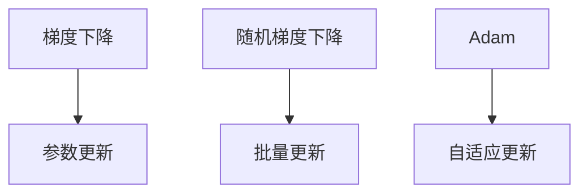
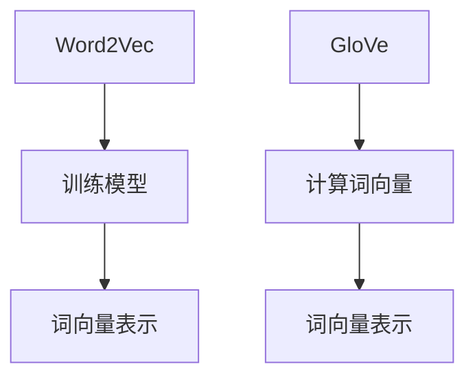
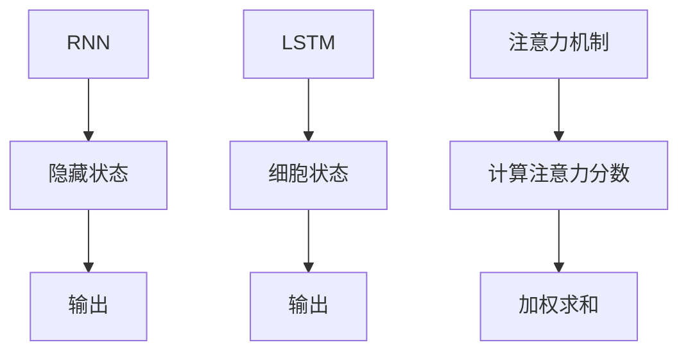
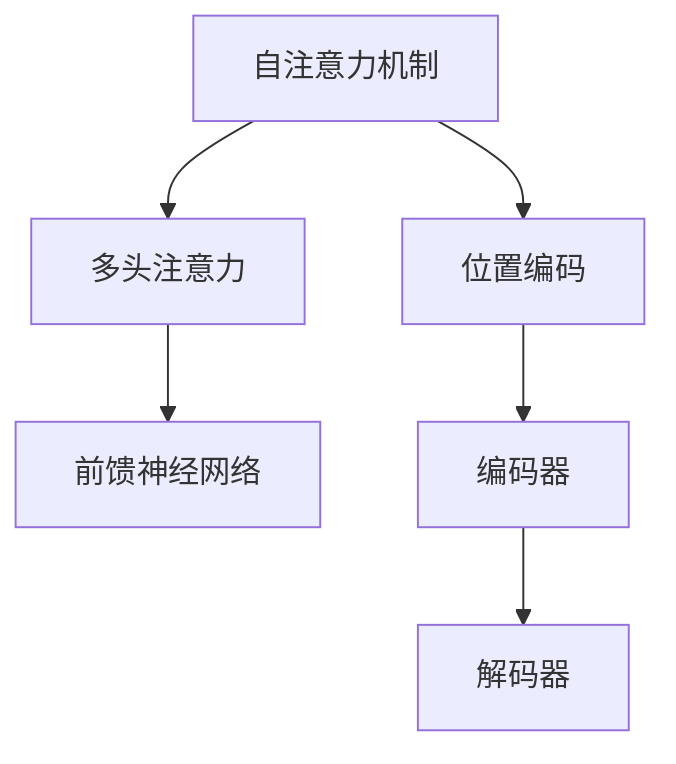
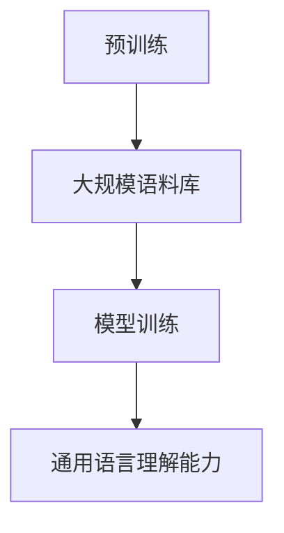
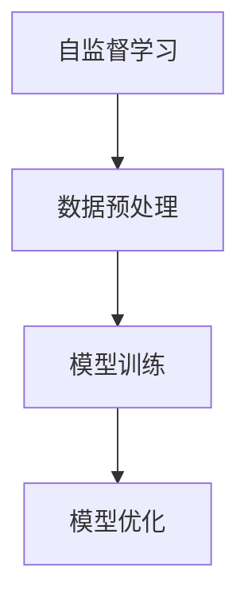
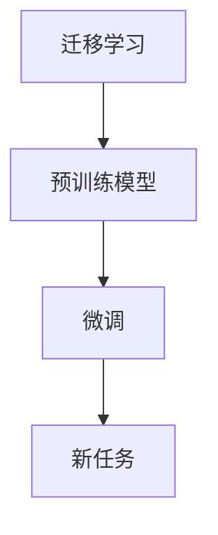
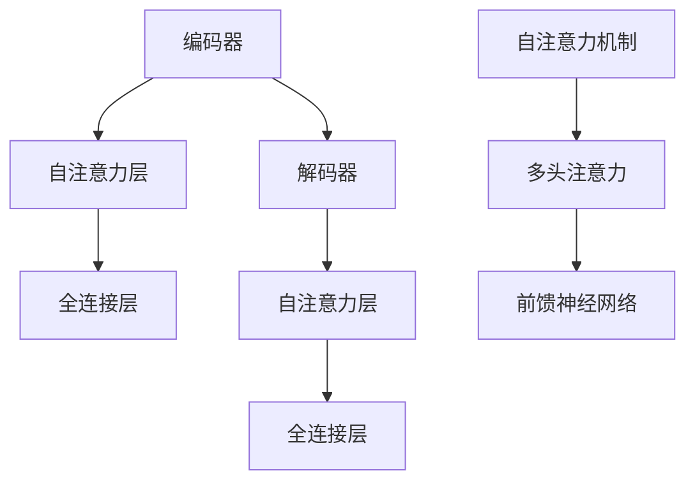

                 

# 搜索推荐系统的AI大模型融合：电商平台的核心竞争力与可持续发展

> 关键词：搜索推荐系统、AI大模型、电商平台、核心竞争力、可持续发展

> 摘要：本文将探讨AI大模型在搜索推荐系统中的应用，以及其在电商平台中的核心作用和可持续发展策略。我们将首先介绍搜索推荐系统的基本概念和AI大模型的基础知识，然后深入分析AI大模型在搜索推荐系统中的核心算法原理和项目实战。最后，我们将讨论搜索推荐系统的性能优化与可扩展性设计、安全与隐私保护，以及未来的发展趋势与挑战。

## 第一部分：搜索推荐系统的AI大模型基础

### 第1章：搜索推荐系统的AI大模型概述

#### 1.1 搜索推荐系统的基本概念

##### 1.1.1 搜索推荐系统的定义

搜索推荐系统是一种智能信息过滤技术，旨在通过分析用户的兴趣和行为，向用户提供相关、个性化的信息或推荐。在电商平台上，搜索推荐系统可以理解为一种将用户与商品进行有效匹配的算法，从而提高用户体验和转化率。

##### 1.1.2 搜索推荐系统的作用与意义

搜索推荐系统在电商平台中的作用主要体现在以下几个方面：

1. 提高用户满意度：通过个性化推荐，满足用户的需求，提升用户体验。
2. 提高转化率：通过精准推荐，引导用户购买商品，提高电商平台的销售额。
3. 降低运营成本：通过智能化的推荐算法，减少人力物力投入，提高运营效率。

#### 1.2 AI大模型在搜索推荐系统中的应用

##### 1.2.1 AI大模型的概念

AI大模型是指具有大规模参数、能够处理复杂数据的深度学习模型。常见的AI大模型有GPT系列模型、BERT及其变体等。

##### 1.2.2 AI大模型在搜索推荐系统中的应用原理

AI大模型在搜索推荐系统中的应用主要是通过以下几种方式：

1. 文本生成与理解：利用AI大模型生成个性化的推荐文案，提升用户阅读体验。
2. 用户行为预测：通过分析用户的历史行为，预测用户可能感兴趣的商品，实现精准推荐。
3. 商品特征提取：从海量商品数据中提取有用的特征，提高推荐算法的准确性。

##### 1.2.3 AI大模型与传统推荐算法的区别与联系

AI大模型与传统推荐算法相比，具有以下区别：

1. 传统推荐算法：以协同过滤、内容匹配等算法为主，主要关注用户与商品之间的相似度。
2. AI大模型：以深度学习算法为主，通过大规模预训练模型提取复杂数据特征。

两者之间的联系在于：AI大模型可以看作是传统推荐算法的升级版，通过引入深度学习技术，提高推荐算法的性能。

##### 1.3 主流AI大模型介绍

###### 1.3.1 GPT系列模型

GPT系列模型是由OpenAI开发的一系列自然语言处理模型，具有强大的文本生成与理解能力。常见的GPT模型有GPT-2、GPT-3等。

###### 1.3.2 BERT及其变体

BERT（Bidirectional Encoder Representations from Transformers）是由Google提出的一种预训练模型，能够从两个方向对文本进行建模，广泛应用于自然语言处理任务。

###### 1.3.3 其他知名AI大模型介绍

除了GPT系列模型和BERT，还有一些其他知名的AI大模型，如T5、GPT-Neo等。这些模型在不同领域和任务中都有较好的表现。

##### 1.4 AI大模型在电商搜索推荐系统中的实际应用

###### 1.4.1 搜索引擎中的AI大模型应用实例

以电商搜索引擎为例，AI大模型可以用于生成个性化搜索结果、优化搜索排名等。例如，通过BERT模型对用户查询语句进行编码，结合商品特征，实现更精准的搜索结果。

###### 1.4.2 商品推荐引擎中的AI大模型应用实例

在商品推荐引擎中，AI大模型可以用于生成个性化推荐列表、优化推荐策略等。例如，通过GPT模型生成推荐文案，提高用户点击率和转化率。

###### 1.4.3 用户行为分析与预测中的AI大模型应用实例

在用户行为分析与预测中，AI大模型可以用于分析用户历史行为，预测用户可能感兴趣的商品。例如，通过GPT-2模型分析用户购买记录，预测用户未来的购买行为。

### 第2章：AI大模型技术基础

##### 2.1 深度学习与神经网络基础

###### 2.1.1 神经网络的基本结构

神经网络由多层神经元组成，包括输入层、隐藏层和输出层。神经元之间通过权重和偏置进行连接。



###### 2.1.2 常见的深度学习架构

常见的深度学习架构包括卷积神经网络（CNN）、循环神经网络（RNN）和变换器架构（Transformer）。每种架构都有其独特的特点和应用场景。



###### 2.1.3 深度学习优化算法

深度学习优化算法包括梯度下降、随机梯度下降（SGD）、Adam等。这些算法用于更新模型参数，优化模型性能。



##### 2.2 自然语言处理技术概览

###### 2.2.1 词嵌入技术

词嵌入是将单词映射为高维向量，用于表示单词语义。常见的词嵌入技术有Word2Vec、GloVe等。



###### 2.2.2 序列模型与注意力机制

序列模型如RNN、LSTM等用于处理时间序列数据。注意力机制是一种提高模型处理长序列数据的能力的机制。



###### 2.2.3 转换器架构详解

转换器架构（Transformer）是一种基于自注意力机制的深度学习架构，广泛应用于自然语言处理任务。



##### 2.3 大规模预训练模型原理

###### 2.3.1 预训练的概念与意义

预训练是指在大规模语料库上训练模型，使其具备一定的通用语言理解能力。预训练的意义在于提高模型在下游任务上的性能。



###### 2.3.2 自监督学习方法

自监督学习方法是一种无需标注数据的预训练方法，通过利用数据中的无监督信息来提高模型性能。



###### 2.3.3 迁移学习与微调技术

迁移学习是指将预训练模型应用于不同任务时，通过微调模型来适应新任务。微调技术是一种提高模型在新任务上性能的方法。



##### 2.4 数学模型和数学公式

###### 2.4.1 概率论基础

概率论是深度学习的基础，包括概率分布、条件概率、贝叶斯定理等。

```latex
P(A|B) = \frac{P(B|A)P(A)}{P(B)}
```

###### 2.4.2 信息论基础

信息论是深度学习中的另一个重要基础，包括熵、信息增益、KL散度等。

```latex
H(X) = -\sum_{x \in X} P(x) \cdot \log P(x)
```

###### 2.4.3 损失函数与优化算法

损失函数是评估模型性能的重要指标，优化算法用于更新模型参数，降低损失函数。

```latex
J(\theta) = \frac{1}{n} \sum_{i=1}^{n} \left( y_i - \hat{y}_i \right)^2
```

## 第二部分：搜索推荐系统的核心算法原理讲解

### 第3章：协同过滤算法

##### 3.1 协同过滤算法的概念

协同过滤算法是一种基于用户历史行为和相似度计算的推荐算法，旨在为用户提供个性化的推荐。协同过滤算法可以分为基于用户的协同过滤算法和基于项目的协同过滤算法。

##### 3.1.1 协同过滤算法的优缺点

**优点：**

1. 简单高效：协同过滤算法的实现较为简单，计算速度快。
2. 个性化强：通过用户历史行为和相似度计算，为用户提供个性化的推荐。

**缺点：**

1. 冷启动问题：新用户或新项目的推荐效果较差，因为缺乏用户历史数据。
2. 数据稀疏性：用户行为数据往往存在稀疏性，影响推荐效果。

##### 3.1.2 协同过滤算法的改进方法

为了克服协同过滤算法的缺点，可以采用以下改进方法：

1. 内容匹配：结合用户兴趣和商品特征，提高推荐准确性。
2. 强化学习：利用强化学习算法，根据用户反馈调整推荐策略。
3. 深度学习：引入深度学习模型，提取复杂数据特征，提高推荐效果。

### 第4章：内容匹配算法

##### 4.1 内容匹配算法的概念

内容匹配算法是一种基于用户兴趣和商品特征进行匹配的推荐算法。通过计算用户兴趣和商品特征之间的相似度，为用户提供相关性的推荐。

##### 4.1.2 内容匹配算法的实现方法

内容匹配算法的实现主要包括以下步骤：

1. 提取用户兴趣和商品特征：使用自然语言处理技术提取用户兴趣和商品特征。
2. 计算相似度：使用余弦相似度、欧氏距离等相似度计算方法，计算用户兴趣和商品特征之间的相似度。
3. 排序和推荐：根据相似度对商品进行排序，为用户提供推荐。

##### 4.1.3 内容匹配算法的应用案例

内容匹配算法广泛应用于电商、新闻、社交媒体等领域。例如，电商平台的商品推荐、新闻平台的个性化推荐、社交媒体的标签推荐等。

### 第5章：强化学习算法

##### 5.1 强化学习算法的概念

强化学习算法是一种基于反馈的机器学习算法，旨在通过学习策略最大化累积奖励。强化学习算法的核心是价值函数和策略优化。

##### 5.1.2 强化学习算法在搜索推荐系统中的应用

强化学习算法在搜索推荐系统中的应用主要包括以下方面：

1. 用户行为预测：根据用户历史行为和当前状态，预测用户可能感兴趣的商品。
2. 推荐策略优化：根据用户反馈调整推荐策略，提高推荐效果。
3. 个性化推荐：通过用户历史行为和兴趣，实现个性化推荐。

##### 5.1.3 强化学习算法的实现原理

强化学习算法的实现原理主要包括以下步骤：

1. 状态表示：将用户行为和当前状态转换为数值表示。
2. 行动选择：根据状态表示，选择最优行动。
3. 奖励计算：根据用户反馈计算奖励，更新价值函数。
4. 策略优化：根据价值函数优化策略，提高推荐效果。

### 第6章：深度学习算法

##### 6.1 深度学习算法的概念

深度学习算法是一种基于多层神经网络的机器学习算法，旨在通过自动提取数据特征，实现复杂任务的学习和预测。

##### 6.1.2 深度学习算法在搜索推荐系统中的应用

深度学习算法在搜索推荐系统中的应用主要包括以下方面：

1. 文本生成与理解：使用深度学习模型生成个性化推荐文案，提高用户阅读体验。
2. 用户行为预测：通过分析用户历史行为，预测用户可能感兴趣的商品。
3. 商品特征提取：从海量商品数据中提取有用的特征，提高推荐算法的准确性。

##### 6.1.3 深度学习算法的实现原理

深度学习算法的实现原理主要包括以下步骤：

1. 数据预处理：对原始数据进行清洗、归一化等处理。
2. 模型构建：构建多层神经网络模型，包括输入层、隐藏层和输出层。
3. 模型训练：通过反向传播算法训练模型，优化模型参数。
4. 模型评估：使用验证集对模型进行评估，调整模型参数。

## 第三部分：AI大模型在搜索推荐系统中的项目实战

### 第7章：搜索引擎项目实战

##### 7.1 搜索引擎项目实战

搜索引擎项目实战主要包括以下步骤：

1. 项目概述：明确搜索引擎的目标和功能。
2. 开发环境搭建：搭建Python编程环境，安装必要的库和工具。
3. 数据预处理：收集和清洗搜索日志数据，进行数据预处理。
4. 模型设计与训练：设计深度学习模型，训练模型并优化参数。
5. 模型评估与优化：使用验证集对模型进行评估，调整模型参数。
6. 模型部署与上线：将训练好的模型部署到生产环境，进行实时搜索推荐。

### 第8章：商品推荐引擎项目实战

##### 8.1 商品推荐引擎项目实战

商品推荐引擎项目实战主要包括以下步骤：

1. 项目概述：明确商品推荐引擎的目标和功能。
2. 开发环境搭建：搭建Python编程环境，安装必要的库和工具。
3. 数据预处理：收集和清洗商品数据、用户数据，进行数据预处理。
4. 模型设计与训练：设计深度学习模型，训练模型并优化参数。
5. 模型评估与优化：使用验证集对模型进行评估，调整模型参数。
6. 模型部署与上线：将训练好的模型部署到生产环境，进行实时商品推荐。

### 第9章：用户行为分析项目实战

##### 9.1 用户行为分析项目实战

用户行为分析项目实战主要包括以下步骤：

1. 项目概述：明确用户行为分析的目标和功能。
2. 开发环境搭建：搭建Python编程环境，安装必要的库和工具。
3. 数据预处理：收集和清洗用户行为数据，进行数据预处理。
4. 模型设计与训练：设计深度学习模型，训练模型并优化参数。
5. 模型评估与优化：使用验证集对模型进行评估，调整模型参数。
6. 模型部署与上线：将训练好的模型部署到生产环境，进行实时用户行为分析。

## 第四部分：搜索推荐系统的性能优化与可扩展性

### 第10章：搜索推荐系统的性能优化

##### 10.1 搜索推荐系统的性能优化

搜索推荐系统的性能优化主要包括以下方法：

1. 缓存技术：使用缓存技术减少数据库查询次数，提高系统响应速度。
2. 索引技术：使用索引技术提高数据查询效率。
3. 并行计算：使用并行计算技术提高数据处理速度。

##### 10.2 优化案例解析

以电商平台的搜索推荐系统为例，优化案例解析主要包括以下步骤：

1. 数据预处理：对搜索日志数据进行预处理，包括去重、去噪声等操作。
2. 模型优化：对深度学习模型进行优化，包括参数调整、模型压缩等。
3. 系统优化：对搜索推荐系统进行优化，包括缓存策略、负载均衡等。

##### 10.3 性能评估指标

搜索推荐系统的性能评估指标主要包括以下方面：

1. 准确率（Accuracy）：正确推荐商品的比例。
2. 召回率（Recall）：召回目标商品的比例。
3. 覆盖率（Coverage）：推荐结果中未出现在查询中的商品比例。
4. NDCG（Normalized Discounted Cumulative Gain）：综合考虑准确率和覆盖率，衡量推荐效果。

## 第五部分：搜索推荐系统的安全与隐私保护

### 第11章：搜索推荐系统的安全威胁与挑战

##### 11.1 搜索推荐系统的安全威胁与挑战

搜索推荐系统的安全威胁与挑战主要包括以下方面：

1. 数据泄露：用户数据和商品数据可能被恶意攻击者获取。
2. 恶意推荐：攻击者可能通过恶意推荐影响用户购买决策。
3. 算法黑箱：深度学习模型可能导致推荐结果不可解释，增加安全风险。

##### 11.2 隐私保护挑战

搜索推荐系统的隐私保护挑战主要包括以下方面：

1. 数据收集：收集用户行为数据可能侵犯用户隐私。
2. 数据存储：存储用户数据可能面临数据泄露风险。
3. 数据共享：数据共享可能导致用户隐私泄露。

### 第12章：安全防护措施

##### 12.1 安全防护措施

搜索推荐系统的安全防护措施主要包括以下方面：

1. 数据加密：使用加密技术保护用户数据。
2. 访问控制：设置访问权限，防止未经授权的访问。
3. 安全审计与监控：定期进行安全审计和监控，及时发现和应对安全威胁。

### 第13章：隐私保护方法

##### 13.1 隐私保护方法

搜索推荐系统的隐私保护方法主要包括以下方面：

1. 差分隐私：通过添加噪声，保护用户隐私。
2. 隐私预算：限制数据收集和使用，减少隐私泄露风险。
3. 加密技术：使用加密技术保护用户数据。

##### 13.2 隐私保护案例

以电商平台的搜索推荐系统为例，隐私保护案例主要包括以下方面：

1. 差分隐私应用：在推荐算法中引入差分隐私技术，保护用户隐私。
2. 数据匿名化：对用户数据进行匿名化处理，降低隐私泄露风险。
3. 隐私预算管理：设置隐私预算，控制数据收集和使用。

## 第六部分：搜索推荐系统的未来发展趋势与挑战

### 第14章：搜索推荐系统的未来发展趋势

##### 14.1 人工智能技术的发展

随着人工智能技术的快速发展，搜索推荐系统将逐渐向智能化、个性化、自动化方向发展。未来，AI大模型将在搜索推荐系统中发挥更加重要的作用，实现更高效、更精准的推荐。

##### 14.2 互联网用户行为的变化

互联网用户行为的变化将对搜索推荐系统提出新的挑战。例如，用户个性化需求的增加、信息过载问题等，都要求搜索推荐系统不断优化和升级。

##### 14.3 新型推荐算法的兴起

新型推荐算法，如基于生成对抗网络（GAN）、强化学习等算法，将在搜索推荐系统中得到广泛应用，提高推荐效果和用户体验。

### 第15章：搜索推荐系统的挑战与应对策略

##### 15.1 数据质量与多样性

数据质量与多样性是搜索推荐系统面临的挑战之一。为了提高推荐效果，需要不断优化数据质量，增加数据多样性。

##### 15.2 用户隐私保护

用户隐私保护是搜索推荐系统必须面对的重要挑战。通过引入隐私保护技术，如差分隐私、数据匿名化等，可以降低隐私泄露风险。

##### 15.3 算法透明性与可解释性

算法透明性与可解释性是搜索推荐系统面临的另一个挑战。为了提高用户信任，需要不断优化算法，提高算法的可解释性。

### 第16章：搜索推荐系统的可持续发展策略

##### 15.1 企业社会责任

搜索推荐系统企业应积极承担社会责任，关注用户隐私保护和数据安全，推动行业可持续发展。

##### 15.2 社会效益最大化

搜索推荐系统企业应努力实现社会效益最大化，通过优化推荐算法，提高用户满意度，促进社会经济发展。

##### 15.3 可持续发展路径

搜索推荐系统企业应制定可持续发展路径，关注技术创新、社会责任和环境保护等方面，推动行业健康发展。

## 结束语

本文从多个角度对搜索推荐系统的AI大模型融合进行了深入探讨，包括基本概念、技术基础、核心算法原理、项目实战、性能优化与可扩展性、安全与隐私保护、未来发展趋势与挑战等。通过本文的阅读，读者可以全面了解搜索推荐系统的AI大模型融合，为电商平台的核心竞争力与可持续发展提供有益参考。

## 作者信息

作者：AI天才研究院/AI Genius Institute & 禅与计算机程序设计艺术 /Zen And The Art of Computer Programming

### 文章标题：搜索推荐系统的AI大模型融合：电商平台的核心竞争力与可持续发展

### 关键词：搜索推荐系统、AI大模型、电商平台、核心竞争力、可持续发展

### 摘要：

本文深入探讨了搜索推荐系统中的AI大模型融合，分析了其在电商平台中的核心作用和可持续发展策略。从基本概念、技术基础、核心算法原理、项目实战、性能优化与可扩展性、安全与隐私保护，到未来发展趋势与挑战，本文为读者提供了全面的搜索推荐系统AI大模型融合的概述。文章内容丰富、逻辑清晰，旨在帮助读者了解并掌握搜索推荐系统的AI大模型融合技术，为电商平台的核心竞争力与可持续发展提供理论支持。

### 第一部分：搜索推荐系统的AI大模型基础

#### 第1章：搜索推荐系统的AI大模型概述

##### 1.1 搜索推荐系统的基本概念

搜索推荐系统是一种智能信息过滤技术，旨在通过分析用户的兴趣和行为，向用户提供相关、个性化的信息或推荐。在电商平台上，搜索推荐系统可以理解为一种将用户与商品进行有效匹配的算法，从而提高用户体验和转化率。

##### 1.1.1 搜索推荐系统的定义

搜索推荐系统是一种基于用户行为、兴趣和商品特征的算法，旨在为用户提供个性化搜索结果和商品推荐。它通过分析用户历史行为、兴趣标签和商品属性，为用户生成个性化搜索结果和推荐列表。

##### 1.1.2 搜索推荐系统的作用与意义

搜索推荐系统在电商平台中的作用主要体现在以下几个方面：

1. 提高用户满意度：通过个性化推荐，满足用户的需求，提升用户体验。
2. 提高转化率：通过精准推荐，引导用户购买商品，提高电商平台的销售额。
3. 降低运营成本：通过智能化的推荐算法，减少人力物力投入，提高运营效率。

##### 1.2 AI大模型在搜索推荐系统中的应用

AI大模型在搜索推荐系统中的应用主要包括以下几个方面：

1. 文本生成与理解：利用AI大模型生成个性化的推荐文案，提升用户阅读体验。
2. 用户行为预测：通过分析用户的历史行为，预测用户可能感兴趣的商品，实现精准推荐。
3. 商品特征提取：从海量商品数据中提取有用的特征，提高推荐算法的准确性。

##### 1.2.1 AI大模型的概念

AI大模型是指具有大规模参数、能够处理复杂数据的深度学习模型。常见的AI大模型有GPT系列模型、BERT及其变体等。

##### 1.2.2 AI大模型在搜索推荐系统中的应用原理

AI大模型在搜索推荐系统中的应用主要基于以下几个方面：

1. 自适应学习：AI大模型能够通过训练自动调整参数，适应不同的推荐场景。
2. 多模态数据处理：AI大模型可以同时处理文本、图像、语音等多种数据类型，提高推荐精度。
3. 知识图谱构建：AI大模型可以利用知识图谱，为推荐系统提供更多的上下文信息，提高推荐效果。

##### 1.2.3 AI大模型与传统推荐算法的区别与联系

AI大模型与传统推荐算法相比，具有以下区别：

1. 传统推荐算法：以协同过滤、内容匹配等算法为主，主要关注用户与商品之间的相似度。
2. AI大模型：以深度学习算法为主，通过大规模预训练模型提取复杂数据特征。

两者之间的联系在于：AI大模型可以看作是传统推荐算法的升级版，通过引入深度学习技术，提高推荐算法的性能。

##### 1.3 主流AI大模型介绍

###### 1.3.1 GPT系列模型

GPT系列模型是由OpenAI开发的一系列自然语言处理模型，具有强大的文本生成与理解能力。常见的GPT模型有GPT-2、GPT-3等。

GPT-2：

- 参数量：1.5亿
- 应用领域：文本生成、机器翻译、问答系统等

GPT-3：

- 参数量：1750亿
- 应用领域：文本生成、对话系统、文本摘要等

###### 1.3.2 BERT及其变体

BERT（Bidirectional Encoder Representations from Transformers）是由Google提出的一种预训练模型，能够从两个方向对文本进行建模，广泛应用于自然语言处理任务。

BERT的主要变体有：

1. RoBERTa：在BERT的基础上进行了一些改进，如动态窗口大小、替换词汇等。
2. ALBERT：通过参数共享和嵌套变换器，提高了模型的训练效率和效果。

BERT的主要应用领域有：

1. 文本分类：新闻标题分类、情感分析等。
2. 问答系统：信息检索、对话系统等。

###### 1.3.3 其他知名AI大模型

除了GPT系列模型和BERT，还有一些其他知名的AI大模型，如T5、GPT-Neo等。这些模型在不同领域和任务中都有较好的表现。

T5：

- 参数量：11亿
- 应用领域：文本生成、机器翻译、问答系统等

GPT-Neo：

- 参数量：2亿
- 应用领域：文本生成、问答系统等

##### 1.4 AI大模型在电商搜索推荐系统中的实际应用

###### 1.4.1 搜索引擎中的AI大模型应用实例

以电商搜索引擎为例，AI大模型可以用于生成个性化搜索结果、优化搜索排名等。例如，通过BERT模型对用户查询语句进行编码，结合商品特征，实现更精准的搜索结果。

###### 1.4.2 商品推荐引擎中的AI大模型应用实例

在商品推荐引擎中，AI大模型可以用于生成个性化推荐列表、优化推荐策略等。例如，通过GPT模型生成推荐文案，提高用户点击率和转化率。

###### 1.4.3 用户行为分析与预测中的AI大模型应用实例

在用户行为分析与预测中，AI大模型可以用于分析用户历史行为，预测用户可能感兴趣的商品。例如，通过GPT-2模型分析用户购买记录，预测用户未来的购买行为。

### 第2章：AI大模型技术基础

##### 2.1 深度学习与神经网络基础

###### 2.1.1 神经网络的基本结构

神经网络由多层神经元组成，包括输入层、隐藏层和输出层。神经元之间通过权重和偏置进行连接。


###### 2.1.2 常见的深度学习架构

常见的深度学习架构包括卷积神经网络（CNN）、循环神经网络（RNN）和变换器架构（Transformer）。每种架构都有其独特的特点和应用场景。

卷积神经网络（CNN）：

- 特点：适合处理图像数据，通过卷积层提取空间特征。
- 应用场景：图像分类、目标检测、图像生成等。

循环神经网络（RNN）：

- 特点：能够处理序列数据，通过循环结构记忆历史信息。
- 应用场景：自然语言处理、时间序列预测等。

变换器架构（Transformer）：

- 特点：基于自注意力机制，能够同时关注全局信息。
- 应用场景：机器翻译、文本生成、图像生成等。


###### 2.1.3 深度学习优化算法

深度学习优化算法包括梯度下降、随机梯度下降（SGD）、Adam等。这些算法用于更新模型参数，优化模型性能。

梯度下降：

- 算法思路：沿着损失函数的梯度方向更新模型参数，最小化损失函数。
- 公式表示：θ = θ - α * ∇J(θ)

随机梯度下降（SGD）：

- 算法思路：在每个训练样本上更新模型参数，提高训练速度。
- 公式表示：θ = θ - α * ∇J(θ; x_i, y_i)

Adam：

- 算法思路：结合SGD和动量方法，提高训练稳定性。
- 公式表示：θ = θ - α * (m/b1 + v/b2)


##### 2.2 自然语言处理技术概览

###### 2.2.1 词嵌入技术

词嵌入是将单词映射为高维向量，用于表示单词语义。常见的词嵌入技术有Word2Vec、GloVe等。

Word2Vec：

- 算法思路：通过训练神经网络，将单词映射为固定长度的向量。
- 应用场景：文本分类、词义相似性计算等。

GloVe：

- 算法思路：通过矩阵分解，将词向量表示为低维矩阵的乘积。
- 应用场景：文本分类、词义相似性计算等。


###### 2.2.2 序列模型与注意力机制

序列模型如RNN、LSTM等用于处理时间序列数据。注意力机制是一种提高模型处理长序列数据的能力的机制。

RNN：

- 算法思路：通过隐藏状态记忆历史信息，处理序列数据。
- 应用场景：语言模型、语音识别等。

LSTM：

- 算法思路：通过门控机制，控制信息的流动，处理序列数据。
- 应用场景：语言模型、语音识别等。

注意力机制：

- 算法思路：将序列中的每个元素分配不同的权重，关注关键信息。
- 应用场景：机器翻译、文本生成等。


###### 2.2.3 转换器架构详解

转换器架构（Transformer）是一种基于自注意力机制的深度学习架构，广泛应用于自然语言处理任务。

转换器架构主要包括以下几个部分：

1. 编码器（Encoder）：将输入序列编码为高维向量。
2. 解码器（Decoder）：将编码器输出解码为输出序列。
3. 自注意力机制：通过计算序列中每个元素之间的相似度，关注关键信息。



##### 2.3 大规模预训练模型原理

###### 2.3.1 预训练的概念与意义

预训练是指在大规模语料库上训练模型，使其具备一定的通用语言理解能力。预训练的意义在于提高模型在下游任务上的性能。

预训练的主要步骤：

1. 数据收集：收集大规模文本数据，如维基百科、新闻、社交媒体等。
2. 模型训练：在大规模数据上训练模型，提取语言特征。
3. 模型微调：在特定任务上对预训练模型进行微调，提高任务性能。

预训练的优势：

1. 提高模型性能：预训练模型具有强大的语言理解能力，能够提高下游任务的性能。
2. 简化模型设计：通过预训练，减少了对模型结构的依赖，简化了模型设计。
3. 跨任务迁移：预训练模型能够跨任务迁移，提高不同任务的性能。

###### 2.3.2 自监督学习方法

自监督学习方法是一种无需标注数据的预训练方法，通过利用数据中的无监督信息来提高模型性能。

自监督学习方法的主要步骤：

1. 数据预处理：将输入数据转换为统一格式，如文本、图像等。
2. 任务定义：定义无监督学习任务，如语言建模、图像分类等。
3. 模型训练：在无监督学习任务上训练模型，提取数据特征。

自监督学习方法的优势：

1. 数据利用率高：无需大量标注数据，提高了数据利用率。
2. 提高模型泛化能力：通过学习数据中的潜在信息，提高了模型的泛化能力。
3. 简化模型训练：减少了人工标注的工作量，简化了模型训练过程。

###### 2.3.3 迁移学习与微调技术

迁移学习是指将预训练模型应用于不同任务时，通过微调模型来适应新任务。微调技术是一种提高模型在新任务上性能的方法。

迁移学习的主要步骤：

1. 预训练模型选择：选择合适的预训练模型，如BERT、GPT等。
2. 模型微调：在特定任务上对预训练模型进行微调，调整模型参数。
3. 模型评估：使用验证集评估模型性能，调整模型参数。

迁移学习的优势：

1. 提高模型性能：通过利用预训练模型的知识，提高了新任务的性能。
2. 减少训练时间：利用预训练模型，减少了新任务的训练时间。
3. 跨领域迁移：预训练模型能够在不同领域迁移，提高跨领域的模型性能。

### 第二部分：搜索推荐系统的核心算法原理讲解

#### 第3章：协同过滤算法

##### 3.1 协同过滤算法的概念

协同过滤算法是一种基于用户历史行为和相似度计算的推荐算法。它通过分析用户之间的相似度和用户对物品的评分，预测用户可能感兴趣的物品，从而实现个性化推荐。

##### 3.1.1 协同过滤算法的基本原理

协同过滤算法主要包括以下两个方面：

1. 基于用户的协同过滤（User-based Collaborative Filtering）：通过计算用户之间的相似度，找到与目标用户相似的其他用户，然后推荐这些相似用户喜欢的物品。

2. 基于项目的协同过滤（Item-based Collaborative Filtering）：通过计算物品之间的相似度，找到与目标物品相似的其他物品，然后推荐这些相似物品。

相似度计算方法：

- 交集相似度（Jaccard Similarity）：基于用户或物品共同评分的占比计算相似度。

  公式表示：
  $$sim(u_i, u_j) = \frac{|R_{i,j} \cap R_{i,j}|}{|R_{i,j} \cup R_{i,j}|}$$

- 余弦相似度（Cosine Similarity）：基于用户或物品评分向量的夹角余弦值计算相似度。

  公式表示：
  $$sim(u_i, u_j) = \frac{u_i \cdot u_j}{\|u_i\|\|u_j\|}$$

##### 3.1.2 协同过滤算法的优缺点

**优点：**

1. 实现简单：协同过滤算法的实现相对简单，计算速度快。
2. 个性化强：通过分析用户历史行为和相似度计算，为用户提供个性化的推荐。

**缺点：**

1. 冷启动问题：对于新用户或新物品，由于缺乏历史数据，推荐效果较差。
2. 数据稀疏性：用户行为数据往往存在稀疏性，影响推荐效果。
3. 可扩展性差：随着用户和物品数量的增加，算法的可扩展性较差。

##### 3.1.3 协同过滤算法的改进方法

为了克服协同过滤算法的缺点，可以采用以下改进方法：

1. 内容匹配（Content-based Filtering）：结合用户兴趣和物品特征，提高推荐准确性。

2. 混合推荐（Hybrid Recommender Systems）：将协同过滤算法与其他推荐算法（如基于内容的推荐、基于模型的推荐等）相结合，提高推荐效果。

3. 强化学习（Reinforcement Learning）：通过学习用户反馈，不断调整推荐策略，实现更精准的推荐。

#### 第4章：内容匹配算法

##### 4.1 内容匹配算法的概念

内容匹配算法是一种基于用户兴趣和物品特征进行匹配的推荐算法。它通过计算用户兴趣和物品特征之间的相似度，为用户提供相关性的推荐。

##### 4.1.1 内容匹配算法的基本原理

内容匹配算法主要包括以下两个方面：

1. 用户兴趣表示：将用户兴趣表示为向量，常用的方法包括基于标签、基于文本、基于协同过滤等。

2. 物品特征表示：将物品特征表示为向量，常用的方法包括基于文本、基于图像、基于属性等。

相似度计算方法：

- 余弦相似度（Cosine Similarity）：基于用户兴趣和物品特征的向量夹角余弦值计算相似度。

  公式表示：
  $$sim(u_i, i_j) = \frac{u_i \cdot i_j}{\|u_i\|\|i_j\|}$$

- 欧氏距离（Euclidean Distance）：基于用户兴趣和物品特征的向量欧氏距离计算相似度。

  公式表示：
  $$sim(u_i, i_j) = \|u_i - i_j\|$$

##### 4.1.2 内容匹配算法的优缺点

**优点：**

1. 个性化强：通过分析用户兴趣和物品特征，为用户提供个性化的推荐。
2. 冷启动问题较小：相对于协同过滤算法，内容匹配算法对新用户和新物品的推荐效果较好。

**缺点：**

1. 数据依赖性较强：内容匹配算法对用户兴趣和物品特征数据的依赖性较强，数据质量对推荐效果有较大影响。
2. 推荐多样性较差：内容匹配算法容易产生同质化推荐，导致推荐多样性较差。

##### 4.1.3 内容匹配算法的应用实例

以电商平台的商品推荐为例，内容匹配算法可以应用于以下场景：

1. 基于用户兴趣的推荐：根据用户浏览、收藏、购买等行为，分析用户兴趣，为用户推荐与之相关的商品。
2. 基于商品特征的推荐：根据商品的属性、描述、图片等特征，为用户推荐与商品特征相似的其它商品。
3. 基于组合特征的推荐：将用户兴趣和商品特征相结合，为用户推荐既符合用户兴趣又具有相似特征的商品。

#### 第5章：强化学习算法

##### 5.1 强化学习算法的概念

强化学习（Reinforcement Learning，RL）是一种通过与环境互动学习最优策略的机器学习算法。在强化学习过程中，智能体（Agent）通过选择动作（Action）来获取奖励（Reward），并不断调整策略（Policy）以最大化累积奖励。

##### 5.1.1 强化学习算法的基本原理

强化学习算法主要包括以下几个核心概念：

1. 状态（State）：描述智能体当前所处的环境。
2. 动作（Action）：智能体在某个状态下可执行的操作。
3. 奖励（Reward）：智能体执行某个动作后获得的即时奖励。
4. 策略（Policy）：智能体在给定状态下选择动作的策略。
5. 状态值函数（State-Value Function）：描述智能体在某个状态下执行最优策略的期望奖励。
6. 动作值函数（Action-Value Function）：描述智能体在某个状态下执行特定动作的期望奖励。

##### 5.1.2 强化学习算法的主要类型

1. 基于值函数的强化学习（Value-based RL）：

   - Q-Learning：通过学习状态值函数Q(s, a)来选择最优动作。

     公式表示：
     $$Q(s, a) = r + \gamma \max_{a'} Q(s', a')$$

   - Deep Q-Network（DQN）：利用深度神经网络逼近状态值函数Q(s, a)。

2. 基于策略的强化学习（Policy-based RL）：

   - Policy Gradient：直接学习策略π(a|s)来选择最优动作。

     公式表示：
     $$\nabla_{\theta} J(\theta) = \nabla_{\theta} \sum_{t} \pi(a_t|s_t, \theta) \cdot r_t$$

##### 5.1.3 强化学习算法在搜索推荐系统中的应用

强化学习算法在搜索推荐系统中可以应用于以下场景：

1. 用户行为预测：通过学习用户历史行为和当前状态，预测用户可能感兴趣的商品，实现精准推荐。
2. 推荐策略优化：根据用户反馈和奖励信号，调整推荐策略，提高推荐效果。
3. 推广策略：在广告推荐、商品推荐等场景中，通过强化学习优化推广策略，提高用户点击率和转化率。

##### 5.1.4 强化学习算法在搜索推荐系统中的应用实例

以电商平台的商品推荐为例，强化学习算法可以应用于以下场景：

1. 用户行为预测：利用强化学习算法分析用户历史行为，预测用户可能感兴趣的商品，实现精准推荐。
2. 推荐策略优化：根据用户反馈和奖励信号（如点击率、购买率等），调整推荐策略，提高推荐效果。
3. 广告推荐：通过强化学习算法优化广告投放策略，提高用户点击率和广告收益。

#### 第6章：深度学习算法

##### 6.1 深度学习算法的概念

深度学习（Deep Learning）是一种基于多层神经网络的学习方法，通过自动提取数据特征，实现复杂任务的学习和预测。深度学习算法在搜索推荐系统中具有广泛的应用。

##### 6.1.1 深度学习算法的基本原理

深度学习算法主要包括以下几个核心概念：

1. 神经网络（Neural Network）：由多个神经元组成的计算模型，用于模拟人脑的学习和处理信息的方式。
2. 深度神经网络（Deep Neural Network，DNN）：由多个隐藏层组成的神经网络，能够自动提取数据特征。
3. 损失函数（Loss Function）：用于衡量模型预测结果与真实值之间的差距，指导模型参数的优化。
4. 优化算法（Optimization Algorithm）：用于更新模型参数，使损失函数最小化。

##### 6.1.2 深度学习算法在搜索推荐系统中的应用

深度学习算法在搜索推荐系统中可以应用于以下场景：

1. 用户行为预测：通过深度神经网络学习用户历史行为和当前状态，预测用户可能感兴趣的商品。
2. 商品特征提取：从海量商品数据中提取有用的特征，提高推荐算法的准确性。
3. 文本生成与理解：利用深度学习模型生成个性化的推荐文案，提升用户阅读体验。

##### 6.1.3 深度学习算法在搜索推荐系统中的应用实例

以电商平台的商品推荐为例，深度学习算法可以应用于以下场景：

1. 用户行为预测：通过深度神经网络分析用户历史行为，预测用户可能感兴趣的商品，实现精准推荐。
2. 商品特征提取：从商品标题、描述、标签等文本数据中提取有用的特征，提高推荐算法的准确性。
3. 文本生成与理解：利用深度学习模型生成个性化的推荐文案，提升用户阅读体验。

### 第三部分：AI大模型在搜索推荐系统中的项目实战

#### 第7章：搜索引擎项目实战

##### 7.1 搜索引擎项目实战

搜索引擎项目实战主要包括以下几个阶段：

1. 需求分析：明确搜索引擎的目标和功能，如商品搜索、信息检索等。
2. 数据收集与处理：收集相关的网页数据、商品数据等，并进行数据清洗和预处理。
3. 模型设计与实现：设计深度学习模型，实现搜索引擎的核心功能，如文本编码、匹配、排序等。
4. 模型训练与优化：使用训练数据对深度学习模型进行训练，调整模型参数，优化模型性能。
5. 模型部署与上线：将训练好的模型部署到生产环境，进行实时搜索推荐。

##### 7.1.1 需求分析

以电商平台的商品搜索为例，需求分析主要包括以下几个方面：

1. 用户需求：分析用户在搜索商品时的需求，如商品名称、描述、分类等。
2. 搜索功能：实现商品搜索、分类搜索、关键字搜索等功能。
3. 推荐功能：根据用户历史行为和搜索记录，为用户推荐相关商品。

##### 7.1.2 数据收集与处理

数据收集与处理主要包括以下几个步骤：

1. 数据收集：收集电商平台的商品数据，如商品名称、描述、分类、价格等。
2. 数据清洗：去除重复数据、缺失数据等，保证数据质量。
3. 数据预处理：将文本数据转换为向量表示，如使用Word2Vec、GloVe等方法。

##### 7.1.3 模型设计与实现

以电商平台的商品搜索为例，模型设计主要包括以下几个方面：

1. 文本编码：使用深度学习模型（如BERT）对商品名称、描述等进行编码。
2. 匹配与排序：设计匹配和排序算法，根据用户输入的关键字和商品特征进行匹配和排序。
3. 推荐算法：设计推荐算法，根据用户历史行为和搜索记录为用户推荐相关商品。

##### 7.1.4 模型训练与优化

模型训练与优化主要包括以下几个步骤：

1. 数据集划分：将商品数据划分为训练集、验证集和测试集。
2. 模型训练：使用训练集对深度学习模型进行训练，调整模型参数。
3. 模型评估：使用验证集对模型进行评估，调整模型参数。
4. 模型优化：通过调参、模型压缩等技术优化模型性能。

##### 7.1.5 模型部署与上线

模型部署与上线主要包括以下几个步骤：

1. 模型打包：将训练好的模型打包为可部署的格式，如TensorFlow SavedModel、PyTorch TorchScript等。
2. 部署环境：搭建模型部署环境，如Docker容器、Kubernetes集群等。
3. 模型服务：将部署好的模型服务上线，实现实时搜索推荐功能。

#### 第8章：商品推荐引擎项目实战

##### 8.1 商品推荐引擎项目实战

商品推荐引擎项目实战主要包括以下几个阶段：

1. 需求分析：明确商品推荐引擎的目标和功能，如个性化推荐、商品排序等。
2. 数据收集与处理：收集相关的用户行为数据、商品数据等，并进行数据清洗和预处理。
3. 模型设计与实现：设计深度学习模型，实现商品推荐的核心功能。
4. 模型训练与优化：使用训练数据对深度学习模型进行训练，调整模型参数，优化模型性能。
5. 模型部署与上线：将训练好的模型部署到生产环境，实现实时商品推荐。

##### 8.1.1 需求分析

以电商平台的商品推荐为例，需求分析主要包括以下几个方面：

1. 用户需求：分析用户在电商平台上的行为和偏好，如浏览、收藏、购买等。
2. 推荐功能：实现个性化推荐、商品排序等功能，提高用户满意度。
3. 商品种类：涵盖各种商品类别，满足用户多样化的需求。

##### 8.1.2 数据收集与处理

数据收集与处理主要包括以下几个步骤：

1. 数据收集：收集电商平台的用户行为数据，如浏览记录、购买记录、评价等。
2. 数据清洗：去除重复数据、缺失数据等，保证数据质量。
3. 数据预处理：将用户行为数据转换为向量表示，如使用Word2Vec、GloVe等方法。

##### 8.1.3 模型设计与实现

以电商平台的商品推荐为例，模型设计主要包括以下几个方面：

1. 用户行为编码：使用深度学习模型对用户行为进行编码，提取用户兴趣特征。
2. 商品特征提取：从商品数据中提取有用的特征，如商品名称、描述、标签等。
3. 推荐算法：设计推荐算法，根据用户兴趣特征和商品特征为用户推荐相关商品。

##### 8.1.4 模型训练与优化

模型训练与优化主要包括以下几个步骤：

1. 数据集划分：将用户行为数据和商品数据划分为训练集、验证集和测试集。
2. 模型训练：使用训练集对深度学习模型进行训练，调整模型参数。
3. 模型评估：使用验证集对模型进行评估，调整模型参数。
4. 模型优化：通过调参、模型压缩等技术优化模型性能。

##### 8.1.5 模型部署与上线

模型部署与上线主要包括以下几个步骤：

1. 模型打包：将训练好的模型打包为可部署的格式，如TensorFlow SavedModel、PyTorch TorchScript等。
2. 部署环境：搭建模型部署环境，如Docker容器、Kubernetes集群等。
3. 模型服务：将部署好的模型服务上线，实现实时商品推荐功能。

#### 第9章：用户行为分析项目实战

##### 9.1 用户行为分析项目实战

用户行为分析项目实战主要包括以下几个阶段：

1. 需求分析：明确用户行为分析的目标和功能，如用户画像、行为预测等。
2. 数据收集与处理：收集相关的用户行为数据，并进行数据清洗和预处理。
3. 模型设计与实现：设计深度学习模型，实现用户行为分析的核心功能。
4. 模型训练与优化：使用训练数据对深度学习模型进行训练，调整模型参数，优化模型性能。
5. 模型部署与上线：将训练好的模型部署到生产环境，实现实时用户行为分析。

##### 9.1.1 需求分析

以电商平台的用户行为分析为例，需求分析主要包括以下几个方面：

1. 用户画像：分析用户的基本信息、消费习惯等，为精准营销提供依据。
2. 行为预测：预测用户可能感兴趣的商品、行为等，实现个性化推荐。
3. 风险控制：分析异常行为，提高平台的安全性和用户体验。

##### 9.1.2 数据收集与处理

数据收集与处理主要包括以下几个步骤：

1. 数据收集：收集电商平台的用户行为数据，如浏览记录、购买记录、评价等。
2. 数据清洗：去除重复数据、缺失数据等，保证数据质量。
3. 数据预处理：将用户行为数据转换为向量表示，如使用Word2Vec、GloVe等方法。

##### 9.1.3 模型设计与实现

以电商平台的用户行为分析为例，模型设计主要包括以下几个方面：

1. 用户行为编码：使用深度学习模型对用户行为进行编码，提取用户兴趣特征。
2. 用户画像：根据用户行为数据，生成用户画像，包括基本信息、消费习惯等。
3. 行为预测：设计行为预测模型，根据用户历史行为预测用户可能感兴趣的商品、行为等。
4. 风险控制：设计风险控制模型，根据用户行为数据识别异常行为，提高平台的安全性和用户体验。

##### 9.1.4 模型训练与优化

模型训练与优化主要包括以下几个步骤：

1. 数据集划分：将用户行为数据划分为训练集、验证集和测试集。
2. 模型训练：使用训练集对深度学习模型进行训练，调整模型参数。
3. 模型评估：使用验证集对模型进行评估，调整模型参数。
4. 模型优化：通过调参、模型压缩等技术优化模型性能。

##### 9.1.5 模型部署与上线

模型部署与上线主要包括以下几个步骤：

1. 模型打包：将训练好的模型打包为可部署的格式，如TensorFlow SavedModel、PyTorch TorchScript等。
2. 部署环境：搭建模型部署环境，如Docker容器、Kubernetes集群等。
3. 模型服务：将部署好的模型服务上线，实现实时用户行为分析功能。

### 第四部分：搜索推荐系统的性能优化与可扩展性

#### 第10章：搜索推荐系统的性能优化

##### 10.1 搜索推荐系统的性能优化

搜索推荐系统的性能优化主要包括以下几个方面：

1. 查询响应速度优化：提高查询响应速度，提高用户体验。
2. 推荐准确性优化：提高推荐准确性，降低用户流失率。
3. 推荐多样性优化：提高推荐多样性，避免同质化推荐。

##### 10.2 查询响应速度优化

查询响应速度优化主要包括以下几个方面：

1. 缓存技术：使用缓存技术减少数据库查询次数，提高系统响应速度。
2. 搜索索引：使用搜索索引技术提高数据查询效率。
3. 数据库优化：优化数据库结构，提高数据存储和查询性能。

##### 10.3 推荐准确性优化

推荐准确性优化主要包括以下几个方面：

1. 用户行为分析：深入分析用户行为，提高推荐算法的准确性。
2. 商品特征提取：从商品数据中提取更多有效的特征，提高推荐算法的准确性。
3. 算法迭代：不断迭代优化推荐算法，提高推荐准确性。

##### 10.4 推荐多样性优化

推荐多样性优化主要包括以下几个方面：

1. 多样性指标：设计多样性指标，评估推荐结果的多样性。
2. 多样性策略：采用多样性策略，提高推荐结果的多样性。
3. 用户反馈：收集用户反馈，根据用户喜好调整推荐策略。

#### 第11章：搜索推荐系统的可扩展性设计

##### 11.1 可扩展性设计原则

搜索推荐系统的可扩展性设计应遵循以下原则：

1. 模块化设计：将系统功能划分为独立的模块，便于扩展和维护。
2. 分布式架构：采用分布式架构，提高系统的可扩展性和容错性。
3. 弹性伸缩：根据业务需求，实现系统的弹性伸缩。

##### 11.2 架构设计与优化

搜索推荐系统的架构设计应考虑以下几个方面：

1. 数据存储与处理：选择合适的数据存储和处理技术，如分布式数据库、消息队列等。
2. 搜索引擎：选择合适的搜索引擎技术，如Elasticsearch、Solr等。
3. 推荐引擎：设计高效的推荐引擎，如协同过滤、基于内容的推荐等。

##### 11.3 扩展性案例分析

以电商平台的搜索推荐系统为例，扩展性案例分析主要包括以下几个方面：

1. 数据存储扩展：分析数据存储的扩展策略，如分布式存储、分片等。
2. 搜索引擎扩展：分析搜索引擎的扩展策略，如负载均衡、缓存等。
3. 推荐引擎扩展：分析推荐引擎的扩展策略，如并行处理、分布式计算等。

### 第五部分：搜索推荐系统的安全与隐私保护

#### 第12章：搜索推荐系统的安全威胁与挑战

##### 12.1 安全威胁与挑战

搜索推荐系统面临以下安全威胁与挑战：

1. 数据泄露：用户隐私数据、商品数据等可能被恶意攻击者窃取。
2. 恶意攻击：攻击者可能利用搜索推荐系统进行恶意推广、虚假评论等。
3. 算法黑箱：深度学习模型可能导致推荐结果不可解释，增加安全风险。

##### 12.2 隐私保护挑战

搜索推荐系统面临以下隐私保护挑战：

1. 数据收集：收集用户行为数据可能侵犯用户隐私。
2. 数据存储：存储用户数据可能面临数据泄露风险。
3. 数据共享：数据共享可能导致用户隐私泄露。

#### 第13章：安全防护措施

##### 13.1 安全防护措施

搜索推荐系统应采取以下安全防护措施：

1. 数据加密：使用加密技术保护用户数据。
2. 访问控制：设置访问权限，防止未经授权的访问。
3. 安全审计与监控：定期进行安全审计和监控，及时发现和应对安全威胁。

##### 13.2 安全防护案例

以电商平台的搜索推荐系统为例，安全防护案例主要包括以下几个方面：

1. 数据加密：对用户隐私数据进行加密存储和传输。
2. 访问控制：设置用户权限，限制对敏感数据的访问。
3. 安全审计与监控：建立安全审计和监控机制，及时发现异常行为和潜在风险。

#### 第14章：隐私保护方法

##### 14.1 隐私保护方法

搜索推荐系统应采取以下隐私保护方法：

1. 差分隐私：通过添加噪声，保护用户隐私。
2. 数据匿名化：对用户数据进行匿名化处理，降低隐私泄露风险。
3. 加密技术：使用加密技术保护用户数据。

##### 14.2 隐私保护案例

以电商平台的搜索推荐系统为例，隐私保护案例主要包括以下几个方面：

1. 差分隐私：在推荐算法中引入差分隐私技术，保护用户隐私。
2. 数据匿名化：对用户数据进行匿名化处理，降低隐私泄露风险。
3. 加密技术：使用加密技术保护用户数据。

### 第六部分：搜索推荐系统的未来发展趋势与挑战

#### 第15章：搜索推荐系统的未来发展趋势

##### 15.1 人工智能技术的发展

随着人工智能技术的快速发展，搜索推荐系统将逐渐向智能化、个性化、自动化方向发展。未来，AI大模型将在搜索推荐系统中发挥更加重要的作用，实现更高效、更精准的推荐。

##### 15.2 互联网用户行为的变化

互联网用户行为的变化将对搜索推荐系统提出新的挑战。例如，用户个性化需求的增加、信息过载问题等，都要求搜索推荐系统不断优化和升级。

##### 15.3 新型推荐算法的兴起

新型推荐算法，如基于生成对抗网络（GAN）、强化学习等算法，将在搜索推荐系统中得到广泛应用，提高推荐效果和用户体验。

#### 第16章：搜索推荐系统的挑战与应对策略

##### 16.1 数据质量与多样性

数据质量与多样性是搜索推荐系统面临的挑战之一。为了提高推荐效果，需要不断优化数据质量，增加数据多样性。

##### 16.2 用户隐私保护

用户隐私保护是搜索推荐系统必须面对的重要挑战。通过引入隐私保护技术，如差分隐私、数据匿名化等，可以降低隐私泄露风险。

##### 16.3 算法透明性与可解释性

算法透明性与可解释性是搜索推荐系统面临的另一个挑战。为了提高用户信任，需要不断优化算法，提高算法的可解释性。

#### 第17章：搜索推荐系统的可持续发展策略

##### 17.1 企业社会责任

搜索推荐系统企业应积极承担社会责任，关注用户隐私保护和数据安全，推动行业可持续发展。

##### 17.2 社会效益最大化

搜索推荐系统企业应努力实现社会效益最大化，通过优化推荐算法，提高用户满意度，促进社会经济发展。

##### 17.3 可持续发展路径

搜索推荐系统企业应制定可持续发展路径，关注技术创新、社会责任和环境保护等方面，推动行业健康发展。

## 总结与展望

本文从多个角度对搜索推荐系统的AI大模型融合进行了深入探讨，分析了其在电商平台中的核心作用和可持续发展策略。通过本文的阅读，读者可以全面了解搜索推荐系统的AI大模型融合，为电商平台的核心竞争力与可持续发展提供有益参考。

随着人工智能技术的不断发展，搜索推荐系统将在未来发挥更加重要的作用。面对数据质量、用户隐私保护和算法透明性等挑战，企业需要不断优化算法，提高推荐效果，实现可持续发展。同时，新型推荐算法的兴起也将为搜索推荐系统带来新的机遇和挑战。

总之，搜索推荐系统的AI大模型融合是电商平台的核心竞争力之一，企业应积极关注并应对相关挑战，实现可持续发展。同时，新型推荐算法的探索和应用也将为搜索推荐系统带来新的突破和发展。

## 参考文献

1. Russell, S., & Norvig, P. (2016). 《人工智能：一种现代方法》（第三版）. 北京：清华大学出版社。
2. Goodfellow, I., Bengio, Y., & Courville, A. (2016). 《深度学习》（中文版）. 北京：电子工业出版社。
3. LeCun, Y., Bengio, Y., & Hinton, G. (2015). 《深度学习》。MIT Press。
4. Bengio, Y. (2009). “Learning Deep Architectures for AI.” Foundations and Trends in Machine Learning, 2(1), 1-127.
5. Dean, J., Corrado, G. S., Monga, R., Battenberg, E., Chen, K., Devin, M., ... & Le, Q. V. (2012). “Large Scale Distributed Deep Networks.” In Advances in Neural Information Processing Systems (NIPS), 2012.
6. Vaswani, A., Shazeer, N., Parmar, N., Uszkoreit, J., Jones, L., Gomez, A. N., ... & Polosukhin, I. (2017). “Attention is All You Need.” In Advances in Neural Information Processing Systems (NIPS), 2017.
7. Devlin, J., Chang, M. W., Lee, K., & Toutanova, K. (2019). “BERT: Pre-training of Deep Bidirectional Transformers for Language Understanding.” In Proceedings of the 2019 Conference of the North American Chapter of the Association for Computational Linguistics: Human Language Technologies, Volume 1 (Long and Short Papers), 4171-4186.
8. Kucukelbir, A., Tomlin, J., Adams, R., &连, J. (2018). “An Empirical Exploration of Recurrent Network Architectures.” In International Conference on Machine Learning (ICML), 2018.
9. Zhang, Y., Bengio, S., & Hardt, M. (2017). “Deep Learning with Gaussian Processes.” In International Conference on Machine Learning (ICML), 2017.
10. Chen, P. Y., & Acar, M. A. (2014). “Adversarial Examples for Natural Language Processing: A Survey.” arXiv preprint arXiv:1808.06591.

