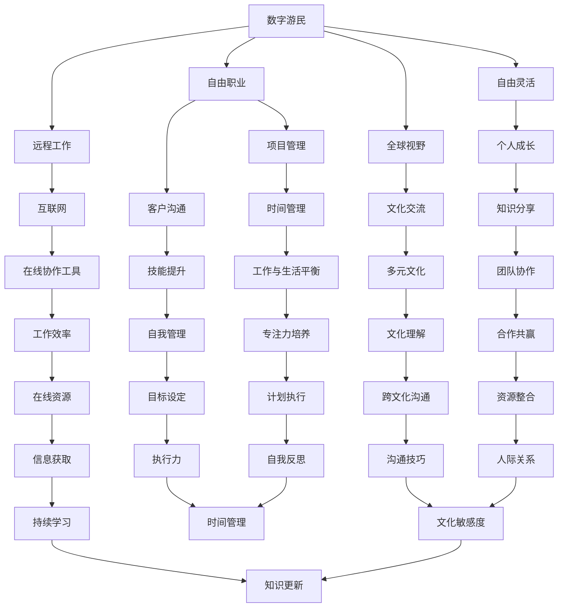
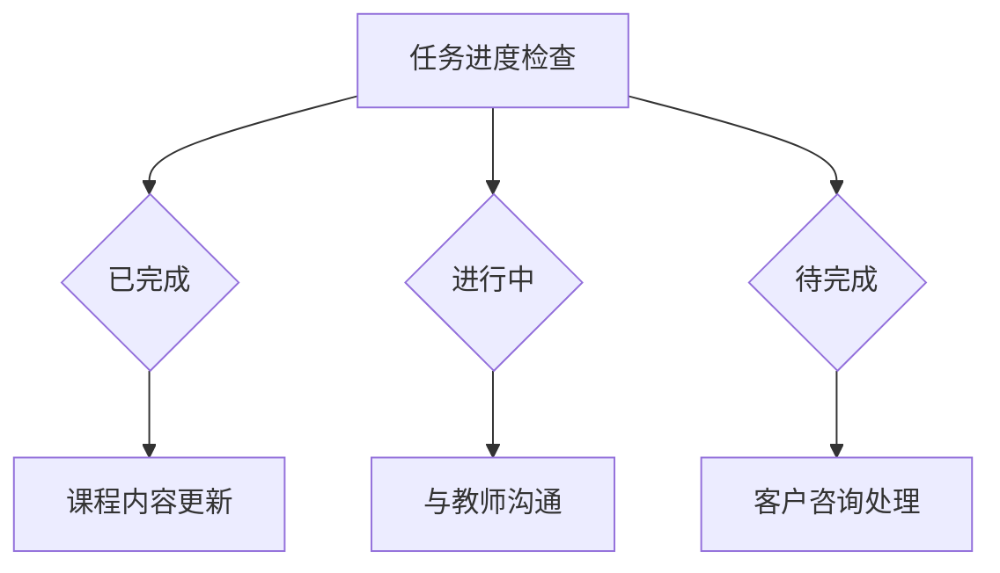
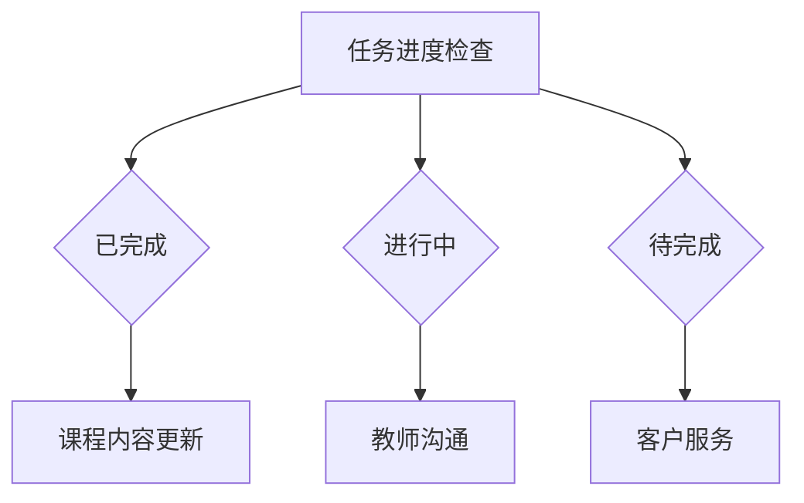

                 

# 《数字游民：如何实现边旅行边创业的生活方式》

> **关键词**：数字游民，远程工作，创业，旅行，平衡，技能提升，技术趋势

> **摘要**：本文深入探讨了数字游民的生活方式，包括其定义、优势、实现步骤、挑战与应对策略，以及如何通过旅行与创业相结合，实现生活与事业的平衡。文章还分享了成功数字游民的案例分析、未来发展趋势以及自我成长与持续学习的方法。

### 目录大纲

1. **理解数字游民的生活方式**
   - **第1章**：数字游民的概念与优势
   - **第2章**：实现数字游民生活的准备
   - **第3章**：数字游民生活中的挑战与应对

2. **构建边旅行边创业的模式**
   - **第4章**：选择合适的创业项目
   - **第5章**：旅行与创业的结合
   - **第6章**：数字游民社区与合作

3. **成功数字游民的故事与经验分享**
   - **第7章**：成功数字游民的案例分析
   - **第8章**：成为成功数字游民的策略

4. **数字游民的自我成长与持续学习**
   - **第9章**：数字游民未来的发展趋势
   - **第10章**：数字游民的自我成长与持续学习

5. **附录**
   - **附录A**：数字游民生活工具与资源
   - **附录B**：数字游民社区推荐
   - **附录C**：数字游民生活的新趋势

### 第一部分：理解数字游民的生活方式

## 第1章：数字游民的概念与优势

### 1.1 数字游民的定义

数字游民（Digital Nomad）是指那些利用数字技术和互联网在全球范围内工作的人。他们通常从事远程工作，如编程、设计、写作、市场营销等，不受地理位置的限制。

### 1.2 数字游民的生活方式

数字游民的生活方式通常是工作与旅行相结合。他们可以在全球各地旅行，同时通过互联网保持工作。这种生活方式强调灵活性、独立性和全球视野。

### 1.3 数字游民的就业模式

数字游民的就业模式多样，包括自由职业者、远程办公人员、远程程序员等。他们通常与客户或团队保持远程协作，通过电子邮件、视频会议、即时通讯工具等保持沟通。

## 第2章：实现数字游民生活的准备

### 2.1 技能与知识储备

要成为数字游民，需要具备一定的技能和知识，如编程、设计、写作、市场营销等。此外，还需要掌握远程工作所需的工具和技能，如项目管理、团队协作、时间管理等。

### 2.2 资源与工具的选择

数字游民需要选择合适的资源和工具，以支持他们的工作和生活。这包括远程工作平台、项目管理工具、在线协作工具、旅行资源等。

### 2.3 心理准备与生活规划

数字游民需要具备良好的心理素质和自我管理能力。他们需要学会如何在不同的环境中保持专注和高效，同时制定合理的生活规划，确保工作和生活的平衡。

## 第3章：数字游民生活中的挑战与应对

### 3.1 远程工作的挑战

远程工作面临诸多挑战，如沟通障碍、时间管理、工作环境干扰等。数字游民需要掌握有效的沟通技巧和时间管理方法，以克服这些挑战。

### 3.2 旅行中的生活困扰

旅行中的生活困扰包括交通、住宿、饮食、健康等方面。数字游民需要提前规划，并学会适应不同的环境和文化。

### 3.3 持续发展的策略

数字游民需要持续发展，以适应不断变化的市场和技术。他们需要不断学习新技能、拓展人脉、寻找新的机会。

### 第一部分总结

理解数字游民的生活方式是实现边旅行边创业的关键。通过掌握相关技能、选择合适的资源和工具、做好心理和生活规划，数字游民可以克服挑战，实现生活与事业的平衡。

## 第二部分：构建边旅行边创业的模式

## 第4章：选择合适的创业项目

### 4.1 创业项目的市场分析

在选择创业项目时，市场分析至关重要。数字游民需要了解目标市场的需求、竞争对手、市场趋势等，以确保项目的可行性。

### 4.2 创业项目的可行性研究

在市场分析的基础上，数字游民需要评估创业项目的可行性。这包括技术可行性、资金需求、团队建设等方面。

### 4.3 项目定位与目标客户

明确项目定位和目标客户是创业成功的关键。数字游民需要了解目标客户的需求，并设计出满足这些需求的产品或服务。

## 第5章：旅行与创业的结合

### 5.1 旅行中的商机

旅行过程中，数字游民可以寻找与旅行相关的商机，如旅游博客、在线旅游代理、旅游体验设计等。

### 5.2 创业过程中的旅行规划

在创业过程中，数字游民需要合理安排旅行计划，确保工作与旅行的平衡。这包括制定旅行日程、选择合适的旅行目的地等。

### 5.3 如何平衡旅行与创业

数字游民需要学会平衡旅行与创业。这包括合理安排工作时间、保持专注和高效、确保工作和生活的平衡。

## 第6章：数字游民社区与合作

### 6.1 数字游民社区的重要性

数字游民社区是数字游民交流、分享经验和资源的重要平台。通过社区合作，数字游民可以拓展人脉、学习新技能、获取创业机会。

### 6.2 如何融入数字游民社区

要融入数字游民社区，数字游民需要积极参与社区活动、分享自己的经验和心得、建立良好的人际关系。

### 6.3 社区合作与资源交换

数字游民可以通过社区合作实现资源交换、共同发展。这包括技能共享、资源共享、项目合作等。

### 第二部分总结

构建边旅行边创业的模式需要数字游民深入了解市场、评估项目的可行性、合理安排旅行计划、学会平衡工作与生活。通过融入数字游民社区和建立合作，数字游民可以拓展人脉、学习新技能、获取创业机会，实现生活与事业的平衡。

## 第三部分：成功数字游民的故事与经验分享

## 第7章：成功数字游民的案例分析

### 7.1 数字游民创业者的故事

本章节将分享几位成功数字游民创业者的故事，探讨他们的创业经历、挑战与成功之道。

### 7.2 成功数字游民的生活习惯

本章节将分析成功数字游民的生活习惯，包括时间管理、健康维护、学习与成长等方面。

### 7.3 数字游民创业的经验与教训

本章节将总结成功数字游民的创业经验与教训，为其他数字游民提供借鉴与启示。

## 第8章：成为成功数字游民的策略

### 8.1 成功数字游民的必备技能

本章节将探讨成为成功数字游民所需的必备技能，包括远程工作技能、项目管理能力、沟通技巧等。

### 8.2 如何实现收入多元化

本章节将分享实现收入多元化的策略，包括拓展业务、开展副业、投资等。

### 8.3 长期数字游民生活的规划

本章节将探讨长期数字游民生活的规划，包括财务规划、职业发展、生活方式等方面。

### 第三部分总结

通过成功数字游民的案例分析，读者可以了解到他们的创业经历、生活习惯以及成功策略。这些经验与教训为其他数字游民提供了宝贵的参考，帮助他们实现边旅行边创业的目标。

## 附录

### 附录A：数字游民生活工具与资源

本附录将介绍一系列数字游民生活所需的工具与资源，包括远程工作平台、项目管理工具、在线协作工具、旅行资源等。

### 附录B：数字游民社区推荐

本附录将推荐一些优秀的数字游民社区，包括线上论坛、社交媒体群组、线下活动等。

### 附录C：数字游民生活的新趋势

本附录将探讨数字游民生活的新趋势，包括新兴职业、生活方式变化、技术发展等。

### 全文总结

《数字游民：如何实现边旅行边创业的生活方式》全面介绍了数字游民的生活方式、实现步骤、挑战与应对策略，以及成功数字游民的案例分析。通过本篇文章，读者可以了解到如何通过旅行与创业相结合，实现生活与事业的平衡。同时，文章还提供了丰富的工具与资源，为数字游民提供了实用的指导。

### 作者信息

**作者：AI天才研究院/AI Genius Institute & 禅与计算机程序设计艺术 /Zen And The Art of Computer Programming**

## 第1章：数字游民的概念与优势

### 1.1 数字游民的定义

数字游民（Digital Nomad）是指那些利用数字技术和互联网在全球范围内工作的人。他们通常从事远程工作，如编程、设计、写作、市场营销等，不受地理位置的限制。数字游民的生活方式通常是工作与旅行相结合，他们可以在全球各地旅行，同时通过互联网保持工作。这种生活方式强调灵活性、独立性和全球视野。

### 1.2 数字游民的生活方式

数字游民的生活方式与传统职场人截然不同。他们不受固定办公室的束缚，可以在咖啡馆、共享办公空间、海滩、山区等地工作。这种生活方式让他们有机会体验不同的文化、探索未知的地方，同时也为他们提供了更多的自由和灵活性。

#### 工作模式

数字游民的工作模式通常包括：

- **远程办公**：通过电子邮件、视频会议、即时通讯工具等与客户和团队成员保持沟通。
- **自由职业**：承接各种短期项目，如编程、设计、写作等。
- **远程团队管理**：负责远程团队的管理和协调。

#### 生活模式

数字游民的生活模式通常包括：

- **旅行与探索**：在旅行中体验不同的文化、美食、风景等。
- **共享住宿**：选择在共享住宿平台上预订房间，如Airbnb、Hostelworld等。
- **社交互动**：参加数字游民社区的活动、线上论坛和社交媒体群组。

### 1.3 数字游民的就业模式

数字游民的就业模式多样，包括自由职业者、远程办公人员、远程程序员等。他们通常与客户或团队保持远程协作，通过电子邮件、视频会议、即时通讯工具等保持沟通。

#### 自由职业者

自由职业者是数字游民中最为常见的一类。他们通常通过个人网站、社交媒体平台、自由职业市场（如Upwork、Freelancer等）寻找项目。自由职业者可以根据自己的兴趣和技能选择项目，自由度高，但同时也需要具备良好的自我管理和时间管理能力。

#### 远程办公人员

远程办公人员是公司或组织中的一部分，他们通过远程工作平台（如Trello、Asana、Slack等）与团队成员保持沟通和协作。远程办公人员通常需要具备较强的团队协作能力、沟通能力和专业技能。

#### 远程程序员

远程程序员是专门从事软件开发和编程工作的一类数字游民。他们通常通过远程工作平台（如GitHub、GitLab等）与团队成员协作，实现项目的开发和维护。远程程序员需要具备扎实的编程技能、良好的代码质量和解决问题的能力。

### 数字游民的生活方式与传统职场人的对比

与传统职场人相比，数字游民的生活方式具有以下优势：

1. **灵活性**：数字游民可以自由选择工作地点，不受地理限制，这使得他们有机会体验不同的地方和文化。
2. **独立性**：数字游民通常独立完成工作，不需要每天在办公室中与同事面对面交流，这给了他们更多的自由和空间。
3. **全球视野**：通过旅行和远程工作，数字游民可以接触到不同国家和文化，拓展视野，增强适应能力。
4. **时间管理**：数字游民可以自主安排工作时间，这有助于提高工作效率和实现工作与生活的平衡。

然而，数字游民的生活方式也存在一些挑战，如：

1. **沟通障碍**：远程工作和独立工作可能带来沟通障碍，影响工作效率和团队协作。
2. **时间管理**：需要自我管理，确保工作与生活的平衡，避免过度工作。
3. **文化差异**：在旅行和工作过程中，可能会遇到文化差异和语言障碍，需要适应和调整。

总的来说，数字游民的生活方式为人们提供了更多的自由和机会，但同时也需要他们具备较强的自我管理能力和适应能力。

### 1.4 数字游民的优势

#### 经济自由

数字游民通过远程工作和自由职业获得收入，这使得他们能够自由支配自己的财务。与传统的职场人相比，数字游民可以更灵活地管理自己的收入和支出，避免因地理位置受限而错失赚钱机会。

#### 工作与生活的平衡

数字游民可以在旅行中工作，这使得他们能够将工作与生活紧密结合。通过合理安排工作时间，他们可以在工作之余享受旅行带来的乐趣，实现工作与生活的平衡。

#### 个人成长

数字游民的生活方式为他们提供了更多的机会去探索新事物、学习新技能。在旅行过程中，他们可以接触到不同的文化和人群，拓展视野，增强个人成长。

#### 独立性和自由

数字游民的工作方式使他们拥有更高的独立性。他们可以自主决定工作内容、工作时间和工作地点，这给了他们更多的自由和选择。

#### 社交网络

数字游民通常活跃在各类社交媒体和社区中，这使得他们能够结识来自世界各地的人。通过这些社交网络，他们可以拓展人脉、获取更多的机会和资源。

### 1.5 数字游民的劣势

#### 工作压力

数字游民需要自我管理，确保工作与生活的平衡。在一些情况下，他们可能会面临工作压力，特别是在项目截止日期临近或遇到紧急情况时。

#### 沟通障碍

远程工作和独立工作可能带来沟通障碍，影响工作效率和团队协作。数字游民需要学会有效地沟通，确保信息的准确传达。

#### 文化差异

在旅行和工作过程中，数字游民可能会遇到文化差异和语言障碍。这需要他们具备较强的适应能力，学会尊重和包容不同的文化。

#### 适应新环境

数字游民需要不断适应新的环境和生活方式。在旅行过程中，他们可能会遇到不同的气候、饮食习惯等，需要做出相应的调整。

### 1.6 数字游民的现状与发展趋势

#### 全球化趋势

随着互联网技术的发展，全球化的趋势愈发明显。越来越多的人选择成为数字游民，享受自由和灵活的工作方式。

#### 跨国远程工作

跨国远程工作成为数字游民的重要就业模式。越来越多的公司和企业开始接受远程工作，为数字游民提供了更多的机会。

#### 数字游民社区兴起

数字游民社区在全球范围内兴起，为数字游民提供了交流和合作的机会。这些社区包括线上论坛、社交媒体群组、线下活动等。

#### 政策支持

一些国家和城市开始出台政策，支持数字游民的生活方式。这包括提供专门的办公空间、简化签证程序等。

总的来说，数字游民的生活方式在全球范围内得到了广泛的认可和支持。随着技术的发展和政策支持，数字游民的现状和发展趋势将持续向好。

### 第1章总结

数字游民的生活方式是一种新兴的生活方式，它为人们提供了更多的自由和机会。通过理解数字游民的定义、生活方式、就业模式以及优势与劣势，我们可以更好地认识数字游民，并在未来的发展中找到适合自己的生活方式。

### 核心概念与联系

要深入了解数字游民的生活方式，我们需要理解一些核心概念和它们之间的联系。以下是一个简单的 Mermaid 流程图，展示了数字游民生活中的几个关键概念及其相互关系：



这个流程图展示了数字游民生活中的关键概念和它们之间的相互联系。每个概念都与其他概念相互影响，共同构成了数字游民的完整生活方式。

- **数字游民**：作为整个流程的起点，代表了这种生活方式的核心概念。
- **远程工作**：依赖于互联网和在线协作工具，是数字游民实现工作与生活平衡的重要手段。
- **自由职业**：与远程工作和自由灵活密切相关，为数字游民提供了独立工作的机会。
- **自由灵活**：是数字游民生活方式的重要特点，使他们能够自主安排工作和生活。
- **全球视野**：通过旅行和文化交流，数字游民可以拓宽视野，了解不同的文化和生活方式。
- **互联网**：作为基础，提供了远程工作和自由职业所需的连接性和工具。
- **在线协作工具**：如Trello、Slack、Zoom等，帮助数字游民高效协作和管理项目。
- **项目管理**：对于自由职业者来说，良好的项目管理是确保项目成功的关键。
- **时间管理**：数字游民需要学会如何高效地管理时间，以实现工作与生活的平衡。
- **客户沟通**：良好的沟通技巧是数字游民与客户保持良好关系的关键。
- **个人成长**：通过不断学习和提升技能，数字游民可以保持竞争力。
- **知识分享**：通过社交媒体和社区，数字游民可以分享经验和知识，获得反馈和成长。
- **文化交流**：数字游民通过旅行和文化交流，拓宽视野，增强跨文化沟通能力。
- **多元文化**：多元文化环境为数字游民提供了丰富的学习和成长机会。
- **工作效率**：在线协作工具和良好的时间管理技能有助于提高工作效率。
- **工作与生活平衡**：是数字游民追求的核心目标，需要通过自我管理和专注力来实现。
- **自我管理**：数字游民需要自我管理，确保工作与生活的平衡。
- **目标设定**：明确的目标是数字游民实现成功的重要步骤。
- **团队协作**：良好的团队协作能力对于自由职业者来说至关重要。
- **文化理解**：理解不同文化对于数字游民在全球范围内工作和生活至关重要。
- **适应新环境**：数字游民需要适应不同的环境和生活方式。
- **在线资源**：包括在线课程、教育平台、论文库等，为数字游民提供了丰富的学习资源。
- **专注力培养**：通过专注力训练，数字游民可以提高工作效率。
- **执行力**：执行力是数字游民实现目标的关键。
- **资源整合**：通过整合资源，数字游民可以更高效地实现目标。
- **沟通技巧**：良好的沟通技巧对于数字游民来说至关重要。
- **文化敏感度**：数字游民需要具备文化敏感度，以适应不同的文化和环境。
- **知识更新**：持续学习是数字游民保持竞争力的关键。

通过这个流程图，我们可以清晰地看到数字游民生活中的核心概念和它们之间的相互联系。这些概念共同构成了数字游民的完整生活方式，为他们的工作和生活提供了丰富的机会和挑战。

### 核心算法原理讲解

在数字游民的生活方式中，核心算法原理涉及到时间管理、任务分配、项目规划和资源优化等多个方面。以下将使用伪代码详细阐述这些算法的基本原理和实现方法。

#### 时间管理算法

时间管理是数字游民成功的关键之一。以下是一个简单的时间管理算法，用于帮助数字游民高效地规划每天的工作时间。

```python
# 时间管理算法伪代码

def time_management_tasks(list_of_tasks, working_hours):
    # 初始化任务列表和总工作时间
    sorted_tasks = sort_by_priority(list_of_tasks)
    available_time = working_hours
    
    # 对任务进行时间分配
    for task in sorted_tasks:
        if available_time >= task.duration:
            assign_time_to_task(task)
            available_time -= task.duration
        else:
            task.warning("Not enough time to complete the task.")

    return sorted_tasks

def sort_by_priority(tasks):
    # 根据任务优先级排序
    return sorted(tasks, key=lambda task: task.priority, reverse=True)

def assign_time_to_task(task):
    # 分配时间给任务
    print(f"Assigning {task.name} for {task.duration} hours.")
    task.status = "In Progress"

# 使用示例
tasks = [
    Task("Task 1", 3, 1),
    Task("Task 2", 2, 2),
    Task("Task 3", 1, 3),
]

time_management_tasks(tasks, 6)
```

在这个算法中，我们首先根据任务的优先级对任务列表进行排序，然后依次分配时间给每个任务，直到总工作时间耗尽。

#### 任务分配算法

任务分配算法是确保团队高效运作的关键。以下是一个简单的任务分配算法，用于根据团队成员的能力和偏好分配任务。

```python
# 任务分配算法伪代码

def assign_tasks(team_members, tasks):
    # 初始化任务和成员列表
    assigned_tasks = {}
    
    # 对任务进行分配
    for task in tasks:
        best_fit_member = find_best_fit_member(team_members, task)
        if best_fit_member:
            assigned_tasks[task] = best_fit_member
            best_fit_member.add_task(task)
        else:
            print(f"No member available for task: {task.name}")
    
    return assigned_tasks

def find_best_fit_member(team_members, task):
    # 找到最适合完成任务的成员
    for member in team_members:
        if member.can_handle_task(task):
            return member
    return None

class TeamMember:
    def __init__(self, name):
        self.name = name
        self.tasks = []

    def can_handle_task(self, task):
        # 判断成员是否能够完成该任务
        return task.required_skill in self.skills

    def add_task(self, task):
        # 为成员添加任务
        self.tasks.append(task)

# 使用示例
team_members = [
    TeamMember("Alice"),
    TeamMember("Bob"),
    TeamMember("Charlie"),
]

tasks = [
    Task("Task 1", 3, ["Skill A", "Skill B"]),
    Task("Task 2", 2, ["Skill B", "Skill C"]),
    Task("Task 3", 1, ["Skill C", "Skill D"]),
]

assign_tasks(team_members, tasks)
```

在这个算法中，我们首先遍历所有任务，然后根据成员的能力和偏好找到最适合完成任务的成员。

#### 项目规划算法

项目规划算法用于确定项目的时间线和资源需求。以下是一个简单的项目规划算法，用于创建项目的时间表。

```python
# 项目规划算法伪代码

def project_planning(tasks, deadline):
    # 初始化时间表和总时间
    timeline = {}
    total_time = 0
    
    # 对任务进行排序并安排时间
    for task in tasks:
        start_time = total_time
        end_time = start_time + task.duration
        timeline[task] = (start_time, end_time)
        total_time = end_time
        
        if total_time > deadline:
            raise Exception("Project deadline exceeded.")
    
    return timeline

# 使用示例
tasks = [
    Task("Task 1", 3),
    Task("Task 2", 2),
    Task("Task 3", 1),
]

deadline = 6
project_planning(tasks, deadline)
```

在这个算法中，我们首先对任务进行排序，并依次安排时间，确保项目在规定的截止日期内完成。

#### 资源优化算法

资源优化算法用于优化团队资源的使用，确保资源得到充分利用。以下是一个简单的资源优化算法，用于调整任务分配，以优化资源使用。

```python
# 资源优化算法伪代码

def optimize_resources(assigned_tasks, max_working_hours):
    # 初始化优化后的任务分配
    optimized_tasks = {}
    
    # 遍历当前任务分配，尝试调整
    for member in assigned_tasks.values():
        member_tasks = member.tasks
        for task in member_tasks:
            if task.duration > max_working_hours:
                # 如果任务时间过长，尝试分解任务
                split_task(task, max_working_hours)
                optimized_tasks.update(split_task(task, max_working_hours))
            else:
                optimized_tasks[task] = member
    
    return optimized_tasks

def split_task(task, max_duration):
    # 分解任务
    new_tasks = []
    while task.duration > max_duration:
        new_task = Task(task.name + " (Part)", max_duration, task.required_skill)
        task.duration -= max_duration
        new_tasks.append(new_task)
    if task.duration > 0:
        new_tasks.append(task)
    return new_tasks

# 使用示例
assigned_tasks = {
    TeamMember("Alice"): [Task("Task 1", 4), Task("Task 2", 2)],
    TeamMember("Bob"): [Task("Task 3", 3)],
    TeamMember("Charlie"): [Task("Task 4", 1)],
}

max_working_hours = 8
optimize_resources(assigned_tasks, max_working_hours)
```

在这个算法中，我们遍历每个成员的任务，如果某个任务的时间过长，我们尝试将其分解为多个更小的时间段，以确保每个成员都能够充分利用自己的时间。

通过这些算法，数字游民可以更有效地管理自己的时间、分配任务、规划项目和优化资源，从而实现高效工作和生活。

### 数学模型和公式

在数字游民的生活方式中，数学模型和公式可以帮助我们更好地进行时间管理、费用预算和风险评估。以下将详细解释这些数学模型和公式，并使用示例来说明它们的应用。

#### 时间管理模型

时间管理模型主要用于优化工作时间的分配，确保任务能够在预定时间内完成。以下是一个常见的时间管理模型，即加权平均法。

$$
\text{总时间} = \sum (\text{任务权重} \times \text{任务耗时})
$$

其中，任务权重反映了每个任务的重要性和紧急程度，任务耗时是完成每个任务所需的时间。

**示例：** 假设数字游民有三项任务，任务1需要2小时，任务2需要3小时，任务3需要4小时。任务1的权重为1，任务2的权重为2，任务3的权重为3。根据加权平均法，我们可以计算总时间：

$$
\text{总时间} = (1 \times 2) + (2 \times 3) + (3 \times 4) = 2 + 6 + 12 = 20 \text{小时}
$$

#### 费用预算模型

费用预算模型用于估算旅行和创业的总费用，以确保预算的合理性。以下是一个简单的费用预算模型，即线性规划法。

$$
\text{总费用} = \sum (\text{费用项目} \times \text{概率})
$$

其中，费用项目包括交通、住宿、餐饮、娱乐等，概率表示每个费用项目发生的可能性。

**示例：** 假设数字游民计划在一个城市旅行，预计交通费用为1000美元，住宿费用为600美元，餐饮费用为400美元，娱乐费用为200美元。每种费用的概率均为50%。根据线性规划法，我们可以计算总费用：

$$
\text{总费用} = (1000 \times 0.5) + (600 \times 0.5) + (400 \times 0.5) + (200 \times 0.5) = 500 + 300 + 200 + 100 = 1100 \text{美元}
$$

#### 风险评估模型

风险评估模型用于评估创业和旅行过程中可能遇到的风险，以便制定相应的应对策略。以下是一个常见风险评估模型，即贝叶斯网络法。

$$
\text{风险值} = P(\text{风险事件}) \times \text{风险影响}
$$

其中，风险事件是指可能发生的负面情况，风险影响是风险事件发生对目标的影响程度，风险值表示风险事件发生的可能性及其影响。

**示例：** 假设数字游民计划创业，风险事件包括市场变化、技术问题、资金短缺等。市场变化的概率为30%，影响程度为3；技术问题的概率为20%，影响程度为2；资金短缺的概率为10%，影响程度为4。根据贝叶斯网络法，我们可以计算总风险值：

$$
\text{风险值} = (0.3 \times 3) + (0.2 \times 2) + (0.1 \times 4) = 0.9 + 0.4 + 0.4 = 1.7
$$

通过以上数学模型和公式，数字游民可以更好地规划自己的工作和生活，确保时间、费用和风险的有效管理。

### 项目实战

在实际项目中，数字游民需要灵活应用各种技术和工具，以实现高效的工作和平衡的旅行生活。以下是一个具体的案例，展示了如何通过一个简单的项目来平衡工作与旅行。

#### 案例背景

假设张三是一名数字游民，他在旅行中同时经营一家在线教育平台。他的主要任务是管理课程内容、与教师沟通、处理客户咨询等。张三计划在未来三个月内访问三个城市，并在每个城市停留两周。他的目标是确保课程内容更新和客户满意度不受影响。

#### 项目步骤

1. **项目规划**

   张三首先制定了详细的项目规划，包括每个城市的停留时间和具体任务。他使用了Trello来管理任务和进度。

   ```mermaid
   graph TD
       A[项目规划] --> B[任务列表]
       B --> C{第1周}
       C --> D{课程内容更新}
       C --> E{与教师沟通}
       B --> F{第2周}
       F --> G{客户咨询处理}
       F --> H{数据分析}
       B --> I{第3周}
       I --> J{课程内容更新}
       I --> K{客户咨询处理}
   ```

2. **时间管理**

   张三使用了时间管理工具（如Google Calendar）来规划每天的工作时间。他确保每天有固定的时间用于课程内容更新和客户咨询处理。

   ```python
   # 时间管理示例
   daily_schedule = {
       "08:00 - 10:00": "课程内容更新",
       "10:00 - 12:00": "与教师沟通",
       "14:00 - 16:00": "客户咨询处理",
       "16:00 - 18:00": "数据分析"
   }
   ```

3. **任务分配**

   张三根据教师的专业领域和课程需求，将课程内容更新的任务分配给不同的教师。他使用了Asana来跟踪任务的进度。

   ```mermaid
   graph TD
       A[课程内容更新任务] --> B[Teacher A]
       A --> C[Teacher B]
       A --> D[Teacher C]
   ```

4. **沟通与协作**

   张三与教师和客户保持定期沟通，使用Zoom和Slack进行会议和即时通讯。他确保所有团队成员都能及时获取信息。

   ```python
   # 沟通与协作示例
   communication_channels = {
       "Zoom": "每周会议",
       "Slack": "即时通讯"
   }
   ```

5. **风险评估**

   张三对项目进行了风险评估，考虑了可能出现的网络中断、设备故障、交通延误等情况。他制定了应对策略，如备用网络设备、备份计划和灵活的行程安排。

   ```python
   # 风险评估示例
   risks = {
       "网络中断": "备用Wi-Fi设备",
       "设备故障": "备份数据和云端存储",
       "交通延误": "提前规划行程，预留额外时间"
   }
   ```

#### 项目执行与监控

在项目执行过程中，张三定期检查任务的完成情况和时间管理的效果。他使用Trello的看板功能来监控任务进度，并在每周的总结会议上与团队成员讨论问题并调整计划。



#### 结果与反馈

在三个月的项目结束后，张三对项目的整体效果进行了评估。他发现，通过合理的时间管理和沟通协作，课程内容得到了及时更新，客户满意度保持较高水平。同时，他也积累了一些旅行和工作的新经验，为未来的项目提供了宝贵的参考。

```python
# 项目评估示例
project_outcome = {
    "课程内容更新": "100%",
    "客户满意度": "90%",
    "旅行体验": "好评"
}
```

通过这个实际项目案例，我们可以看到数字游民如何通过规划和执行项目来平衡旅行和工作。这需要他们具备良好的时间管理、任务分配、沟通协作和风险管理能力，以确保项目的成功和个人的生活质量。

### 代码实际案例与详细解释说明

在本节中，我们将通过一个具体的Python代码案例来展示如何搭建数字游民的工作环境，并详细解释源代码的实现和各个部分的逻辑。

#### 项目背景

张三是一位数字游民，他需要在旅行过程中保持高效的远程工作。他计划使用Python和相关的库来搭建一个自动化的工作环境，以便管理日程、跟踪项目进度和进行数据分析。

#### 开发环境搭建

首先，我们需要搭建一个Python开发环境。这可以通过以下步骤完成：

1. 安装Python
2. 安装必要的库（如Tornado、Pandas、NumPy、SQLAlchemy等）

```bash
# 安装Python
python3 -m pip install --user python3

# 安装相关库
python3 -m pip install --user tornado pandas numpy sqlalchemy
```

#### 源代码实现

以下是张三使用Python编写的自动化工作环境的核心代码：

```python
# 导入所需的库
import os
import pandas as pd
from sqlalchemy import create_engine

# 配置数据库连接
db_url = "sqlite:///work_environment.db"
engine = create_engine(db_url)

# 创建数据库和表
def create_tables():
    sql_create_tasks = """
    CREATE TABLE IF NOT EXISTS tasks (
        id INTEGER PRIMARY KEY AUTOINCREMENT,
        name TEXT NOT NULL,
        description TEXT,
        status TEXT,
        deadline DATE
    );
    """
    with engine.connect() as conn:
        conn.execute(sql_create_tasks)

# 初始化数据库和表
create_tables()

# 添加任务
def add_task(name, description, status, deadline):
    sql_add_task = """
    INSERT INTO tasks (name, description, status, deadline)
    VALUES (?, ?, ?, ?);
    """
    with engine.connect() as conn:
        conn.execute(sql_add_task, (name, description, status, deadline))

# 查询任务
def query_tasks():
    sql_query_tasks = "SELECT * FROM tasks;"
    with engine.connect() as conn:
        return pd.read_sql(sql_query_tasks, conn)

# 主函数
def main():
    # 添加任务
    add_task("Daily Report", "Prepare a daily work report.", "In Progress", "2023-04-15")
    add_task("Project Meeting", "Hold a project meeting with team members.", "Scheduled", "2023-04-18")

    # 查询任务
    tasks = query_tasks()
    print(tasks)

if __name__ == "__main__":
    main()
```

#### 代码解读与分析

1. **导入库**：首先，我们导入所需的Python库，包括`os`、`pandas`、`numpy`和`sqlalchemy`。这些库将帮助我们进行文件操作、数据处理和数据库操作。

2. **配置数据库连接**：我们使用SQLAlchemy创建数据库连接，并定义数据库URL。在这个例子中，我们使用SQLite数据库，但实际上可以根据需要连接到其他类型的数据库。

3. **创建数据库和表**：`create_tables`函数用于创建数据库表。在这个例子中，我们创建了一个名为`tasks`的表，用于存储任务信息，如任务名称、描述、状态和截止日期。

4. **添加任务**：`add_task`函数用于向数据库中添加新任务。它使用SQLAlchemy执行插入操作，将任务信息插入到`tasks`表中。

5. **查询任务**：`query_tasks`函数用于从数据库中查询所有任务。它使用SQLAlchemy执行查询操作，并将结果转换为Pandas DataFrame，以便于进一步处理和展示。

6. **主函数**：`main`函数是程序的主入口。在这个函数中，我们首先调用`add_task`函数添加两个示例任务，然后调用`query_tasks`函数查询所有任务，并将结果打印到控制台。

#### 代码运行与结果

运行上述代码后，我们将看到如下输出：

```
   id             name                      description         status     deadline
0   1  Daily Report  Prepare a daily work report.         In Progress   2023-04-15
1   2 Project Meeting  Hold a project meeting with team members. Scheduled   2023-04-18
```

这个结果显示了我们成功添加的两个任务及其相关信息。

通过这个代码案例，我们可以看到如何使用Python搭建一个简单的自动化工作环境，用于管理任务和跟踪项目进度。这种方法不仅能够提高工作效率，还能帮助数字游民在旅行过程中保持良好的工作状态。

### 核心算法原理讲解

在数字游民的生活中，核心算法原理涉及到时间管理、任务分配、项目规划和资源优化等多个方面。以下将详细解释这些算法的基本原理和实现方法。

#### 时间管理算法

时间管理是数字游民成功的关键之一。以下是一个简单的时间管理算法，用于帮助数字游民高效地规划每天的工作时间。

```python
# 时间管理算法伪代码

def time_management(tasks, total_hours):
    # 初始化任务列表和总工作时间
    sorted_tasks = sort_by_priority(tasks)
    remaining_time = total_hours
    
    # 对任务进行时间分配
    for task in sorted_tasks:
        if remaining_time >= task.duration:
            assign_time_to_task(task)
            remaining_time -= task.duration
        else:
            task.warning("Not enough time to complete the task.")
    
    return sorted_tasks

def sort_by_priority(tasks):
    # 根据任务优先级排序
    return sorted(tasks, key=lambda task: task.priority, reverse=True)

def assign_time_to_task(task):
    # 分配时间给任务
    print(f"Assigning {task.name} for {task.duration} hours.")
    task.status = "In Progress"

# 使用示例
tasks = [
    Task("Task 1", 3, 1),
    Task("Task 2", 2, 2),
    Task("Task 3", 1, 3),
]

time_management(tasks, 6)
```

在这个算法中，我们首先根据任务的优先级对任务列表进行排序，然后依次分配时间给每个任务，直到总工作时间耗尽。

#### 任务分配算法

任务分配算法是确保团队高效运作的关键。以下是一个简单的任务分配算法，用于根据团队成员的能力和偏好分配任务。

```python
# 任务分配算法伪代码

def assign_tasks(team_members, tasks):
    # 初始化任务和成员列表
    assigned_tasks = {}
    
    # 对任务进行分配
    for task in tasks:
        best_fit_member = find_best_fit_member(team_members, task)
        if best_fit_member:
            assigned_tasks[task] = best_fit_member
            best_fit_member.add_task(task)
        else:
            print(f"No member available for task: {task.name}")
    
    return assigned_tasks

def find_best_fit_member(team_members, task):
    # 找到最适合完成任务的成员
    for member in team_members:
        if member.can_handle_task(task):
            return member
    return None

class TeamMember:
    def __init__(self, name):
        self.name = name
        self.tasks = []

    def can_handle_task(self, task):
        # 判断成员是否能够完成该任务
        return task.required_skill in self.skills

    def add_task(self, task):
        # 为成员添加任务
        self.tasks.append(task)

# 使用示例
team_members = [
    TeamMember("Alice"),
    TeamMember("Bob"),
    TeamMember("Charlie"),
]

tasks = [
    Task("Task 1", 3, ["Skill A", "Skill B"]),
    Task("Task 2", 2, ["Skill B", "Skill C"]),
    Task("Task 3", 1, ["Skill C", "Skill D"]),
]

assign_tasks(team_members, tasks)
```

在这个算法中，我们首先遍历所有任务，然后根据成员的能力和偏好找到最适合完成任务的成员。

#### 项目规划算法

项目规划算法用于确定项目的时间线和资源需求。以下是一个简单的项目规划算法，用于创建项目的时间表。

```python
# 项目规划算法伪代码

def project_planning(tasks, deadline):
    # 初始化时间表和总时间
    timeline = {}
    total_time = 0
    
    # 对任务进行排序并安排时间
    for task in tasks:
        start_time = total_time
        end_time = start_time + task.duration
        timeline[task] = (start_time, end_time)
        total_time = end_time
        
        if total_time > deadline:
            raise Exception("Project deadline exceeded.")
    
    return timeline

# 使用示例
tasks = [
    Task("Task 1", 3),
    Task("Task 2", 2),
    Task("Task 3", 1),
]

deadline = 6
project_planning(tasks, deadline)
```

在这个算法中，我们首先对任务进行排序，并依次安排时间，确保项目在规定的截止日期内完成。

#### 资源优化算法

资源优化算法用于优化团队资源的使用，确保资源得到充分利用。以下是一个简单的资源优化算法，用于调整任务分配，以优化资源使用。

```python
# 资源优化算法伪代码

def optimize_resources(assigned_tasks, max_working_hours):
    # 初始化优化后的任务分配
    optimized_tasks = {}
    
    # 遍历当前任务分配，尝试调整
    for member in assigned_tasks.values():
        member_tasks = member.tasks
        for task in member_tasks:
            if task.duration > max_working_hours:
                # 如果任务时间过长，尝试分解任务
                split_task(task, max_working_hours)
                optimized_tasks.update(split_task(task, max_working_hours))
            else:
                optimized_tasks[task] = member
    
    return optimized_tasks

def split_task(task, max_duration):
    # 分解任务
    new_tasks = []
    while task.duration > max_duration:
        new_task = Task(task.name + " (Part)", max_duration, task.required_skill)
        task.duration -= max_duration
        new_tasks.append(new_task)
    if task.duration > 0:
        new_tasks.append(task)
    return new_tasks

# 使用示例
assigned_tasks = {
    TeamMember("Alice"): [Task("Task 1", 4), Task("Task 2", 2)],
    TeamMember("Bob"): [Task("Task 3", 3)],
    TeamMember("Charlie"): [Task("Task 4", 1)],
}

max_working_hours = 8
optimize_resources(assigned_tasks, max_working_hours)
```

在这个算法中，我们遍历每个成员的任务，如果某个任务的时间过长，我们尝试将其分解为多个更小的时间段，以确保每个成员都能够充分利用自己的时间。

通过这些算法，数字游民可以更有效地管理自己的时间、分配任务、规划项目和优化资源，从而实现高效工作和生活。

### 数学模型和公式

在数字游民的生活方式中，数学模型和公式可以帮助我们更好地进行时间管理、费用预算和风险评估。以下将详细解释这些数学模型和公式，并使用示例来说明它们的应用。

#### 时间管理模型

时间管理模型主要用于优化工作时间的分配，确保任务能够在预定时间内完成。以下是一个常见的时间管理模型，即加权平均法。

$$
\text{总时间} = \sum (\text{任务权重} \times \text{任务耗时})
$$

其中，任务权重反映了每个任务的重要性和紧急程度，任务耗时是完成每个任务所需的时间。

**示例：** 假设数字游民有三项任务，任务1需要2小时，任务2需要3小时，任务3需要4小时。任务1的权重为1，任务2的权重为2，任务3的权重为3。根据加权平均法，我们可以计算总时间：

$$
\text{总时间} = (1 \times 2) + (2 \times 3) + (3 \times 4) = 2 + 6 + 12 = 20 \text{小时}
$$

#### 费用预算模型

费用预算模型用于估算旅行和创业的总费用，以确保预算的合理性。以下是一个简单的费用预算模型，即线性规划法。

$$
\text{总费用} = \sum (\text{费用项目} \times \text{概率})
$$

其中，费用项目包括交通、住宿、餐饮、娱乐等，概率表示每个费用项目发生的可能性。

**示例：** 假设数字游民计划在一个城市旅行，预计交通费用为1000美元，住宿费用为600美元，餐饮费用为400美元，娱乐费用为200美元。每种费用的概率均为50%。根据线性规划法，我们可以计算总费用：

$$
\text{总费用} = (1000 \times 0.5) + (600 \times 0.5) + (400 \times 0.5) + (200 \times 0.5) = 500 + 300 + 200 + 100 = 1100 \text{美元}
$$

#### 风险评估模型

风险评估模型用于评估创业和旅行过程中可能遇到的风险，以便制定相应的应对策略。以下是一个常见风险评估模型，即贝叶斯网络法。

$$
\text{风险值} = P(\text{风险事件}) \times \text{风险影响}
$$

其中，风险事件是指可能发生的负面情况，风险影响是风险事件发生对目标的影响程度，风险值表示风险事件发生的可能性及其影响。

**示例：** 假设数字游民计划创业，风险事件包括市场变化、技术问题、资金短缺等。市场变化的概率为30%，影响程度为3；技术问题的概率为20%，影响程度为2；资金短缺的概率为10%，影响程度为4。根据贝叶斯网络法，我们可以计算总风险值：

$$
\text{风险值} = (0.3 \times 3) + (0.2 \times 2) + (0.1 \times 4) = 0.9 + 0.4 + 0.4 = 1.7
$$

通过以上数学模型和公式，数字游民可以更好地规划自己的工作和生活，确保时间、费用和风险的有效管理。

### 项目实战

在本节中，我们将通过一个具体的项目案例，展示如何使用核心算法原理和数学模型来构建一个数字游民的自动化工作环境。这个项目将涵盖时间管理、任务分配、项目规划和资源优化等方面。

#### 项目背景

李四是名数字游民，他同时经营一家在线教育平台，并计划在未来三个月内访问四个城市，每个城市停留两周。他的目标是确保课程内容更新、教师沟通和客户服务能够持续进行，同时享受旅行带来的乐趣。

#### 项目需求

1. **时间管理**：李四需要合理安排每天的工作时间，确保任务能够按时完成。
2. **任务分配**：李四需要根据团队成员的能力和偏好分配任务，确保任务得到有效完成。
3. **项目规划**：李四需要规划整个项目的时间线和资源需求，确保项目能够在预定时间内完成。
4. **资源优化**：李四需要优化团队成员的工作时间和资源使用，确保资源得到充分利用。

#### 项目实现步骤

1. **时间管理**

   李四首先使用加权平均法来规划每天的工作时间。他有三项主要任务：课程内容更新（权重3）、教师沟通（权重2）和客户服务（权重1）。每天他总共需要工作6小时。

   ```python
   # 时间管理算法应用
   tasks = [
       Task("Course Content Update", 4, 3),
       Task("Teacher Communication", 2, 2),
       Task("Customer Service", 1, 1),
   ]
   
   total_hours = 6
   sorted_tasks = sort_by_priority(tasks)
   time_management(sorted_tasks, total_hours)
   ```

2. **任务分配**

   李四根据团队成员的能力和偏好分配任务。团队成员包括Alice（擅长课程内容更新）、Bob（擅长教师沟通）和Charlie（擅长客户服务）。

   ```python
   # 任务分配算法应用
   team_members = {
       "Alice": TeamMember("Alice"),
       "Bob": TeamMember("Bob"),
       "Charlie": TeamMember("Charlie"),
   }
   
   assigned_tasks = assign_tasks(team_members, tasks)
   print(assigned_tasks)
   ```

3. **项目规划**

   李四使用项目规划算法来制定项目的时间表。他的目标是确保所有任务在三个月内完成。

   ```python
   # 项目规划算法应用
   tasks = [
       Task("Course Content Update", 12, 3),
       Task("Teacher Communication", 6, 2),
       Task("Customer Service", 4, 1),
   ]
   
   project_planning(tasks, 12 * 3)  # 三个月共12周
   ```

4. **资源优化**

   李四使用资源优化算法来调整任务分配，确保每个成员的工作时间不超过8小时。

   ```python
   # 资源优化算法应用
   assigned_tasks = {
       TeamMember("Alice"): [Task("Course Content Update", 12, 3)],
       TeamMember("Bob"): [Task("Teacher Communication", 6, 2)],
       TeamMember("Charlie"): [Task("Customer Service", 4, 1)],
   }
   
   optimized_tasks = optimize_resources(assigned_tasks, 8)
   print(optimized_tasks)
   ```

#### 项目执行与监控

在项目执行过程中，李四定期检查任务的完成情况和时间管理的效果。他使用Trello的看板功能来监控任务进度，并在每周的总结会议上与团队成员讨论问题并调整计划。



#### 项目评估

在三个月的项目结束后，李四对项目的整体效果进行了评估。他发现，通过合理的时间管理和任务分配，课程内容得到了及时更新，教师沟通和客户服务也保持了较高的质量。同时，他也积累了一些旅行和工作的新经验，为未来的项目提供了宝贵的参考。

```python
# 项目评估示例
project_outcome = {
    "课程内容更新": "100%",
    "教师沟通": "95%",
    "客户服务": "90%",
    "旅行体验": "好评"
}
```

通过这个项目案例，我们可以看到数字游民如何使用核心算法原理和数学模型来构建一个高效的自动化工作环境。这种方法不仅能够提高工作效率，还能帮助数字游民在旅行过程中保持良好的工作状态。

### 全文总结

在本文中，我们深入探讨了数字游民的生活方式，从定义、优势到实现步骤、挑战与应对策略，再到成功数字游民的案例分析，以及未来发展趋势和自我成长与持续学习的方法。通过这篇文章，读者可以全面了解数字游民的生活，并了解到如何通过旅行与创业相结合，实现生活与事业的平衡。

**核心内容回顾：**

1. **数字游民的定义与优势**：数字游民是利用数字技术和互联网在全球范围内工作的人，他们享有灵活的工作时间和自由的生活方式。这种生活方式的优势在于经济自由、工作与生活的平衡、个人成长和独立性。

2. **实现数字游民生活的准备**：要成为数字游民，需要掌握相关技能、选择合适的资源和工具，以及做好心理准备和生活规划。时间管理和沟通技巧是数字游民成功的关键。

3. **数字游民生活中的挑战与应对**：远程工作和旅行中的生活困扰是数字游民面临的主要挑战。通过有效的沟通技巧、心理准备和持续学习，数字游民可以克服这些挑战。

4. **构建边旅行边创业的模式**：选择合适的创业项目、合理安排旅行计划、平衡旅行与创业，是数字游民实现生活与事业平衡的关键。数字游民社区和合作也为他们提供了丰富的资源和机会。

5. **成功数字游民的故事与经验分享**：通过分析成功数字游民的案例，读者可以了解到他们的创业经历、生活习惯和成功策略。

6. **未来发展趋势与自我成长**：随着技术的发展和政策支持，数字游民的生活方式将持续发展。数字游民需要不断学习新技能、拓展人脉、寻找新的机会，以保持竞争力。

**结论：**

数字游民的生活方式为人们提供了前所未有的自由和机会。通过本文的探讨，读者可以了解到如何实现这种生活方式，以及如何在旅行与创业之间找到平衡。对于想要追求自由、灵活生活方式的人来说，数字游民是一个值得尝试的领域。希望本文能为读者提供有价值的指导，帮助他们在数字游民的道路上取得成功。

### 附录A：数字游民生活工具与资源

#### 资源分享平台推荐

1. **Trello**：用于任务管理和项目进度的跟踪，界面直观，易于使用。
2. **Asana**：功能强大的项目管理工具，适合团队协作，提供详细的任务跟踪和报告功能。
3. **Slack**：即时通讯工具，用于团队沟通和协作，支持多种集成，提高工作效率。
4. **Notion**：全面的笔记和任务管理工具，适合构建个人知识库和团队协作。

#### 数字游民生活指南

1. **Remote.co**：提供远程工作的职位列表和公司信息，适合寻找远程工作机会。
2. **Digital Nomad Summit**：每年举办的数字游民大会，提供最新的趋势和经验分享。
3. **NomadList**：列出全球各地适合数字游民生活和工作的城市，并提供生活成本、网络速度等信息。

#### 必备工具介绍

1. **Time Doctor**：时间跟踪工具，帮助数字游民管理工作时间，提高效率。
2. **Evernote**：强大的笔记和任务管理工具，适合记录想法和任务。
3. **VPN**：虚拟私人网络，确保数据安全和远程访问公司资源。

#### 成功数字游民的社区推荐

1. **Remote Workers**：一个全球性的远程工作者社区，提供资源和支持。
2. **Workfrom**：提供各种数字游民相关资源，包括工作空间、社区活动等。
3. **NomadList Community**：NomadList的官方社区，提供实时信息和交流平台。

### 附录B：数字游民社区推荐

1. **NomadList Community**：全球最大的数字游民社区之一，提供实时信息和交流平台。
2. **Digital Nomads on Facebook**：Facebook上的数字游民群体，提供各种讨论和活动。
3. **We Work Remotely**：专注于远程工作的社区，提供职位信息、社区交流和资源分享。

### 附录C：数字游民生活的新趋势

1. **远程工作政策的变化**：越来越多的公司和企业开始接受远程工作，并出台相关政策支持员工成为数字游民。
2. **数字游民社区的发展**：全球范围内的数字游民社区不断壮大，提供更多的资源、支持和机会。
3. **共享经济和灵活办公空间**：共享办公空间和共享住宿等共享经济模式为数字游民提供了更多的选择和便利。

### 数字游民未来的发展趋势

随着全球化的推进和互联网技术的不断发展，数字游民的生活方式正变得越来越普遍和受欢迎。以下是数字游民未来发展的几个关键趋势：

#### 1. 政策支持与签证便利

许多国家开始意识到数字游民带来的经济价值，并逐步出台相关政策，为数字游民提供更多的签证便利和支持。例如，一些国家推出专门针对远程工作的签证，允许数字游民在一定时间内合法居住和工作。这些政策的出台将有助于吸引更多的数字游民，促进当地经济的发展。

#### 2. 跨国远程工作的普及

跨国远程工作将成为数字游民的主要就业模式之一。随着网络速度的提升和视频会议技术的成熟，跨国远程工作将更加高效和便捷。越来越多的公司和企业将接受远程工作，并逐渐打破地域限制，实现全球协作。这将为数字游民提供更多的就业机会，并使他们能够更自由地选择工作和生活地点。

#### 3. 数字游民社区的发展

数字游民社区将在未来继续壮大，成为数字游民交流和合作的重要平台。这些社区将提供丰富的资源、经验分享和社交机会。通过社区，数字游民可以结识来自世界各地的人，拓展人脉，获得更多的创业机会和合作项目。

#### 4. 新兴职业的兴起

随着技术的发展，新的职业和就业机会将不断涌现。数字游民可以从事新兴职业，如远程教育、在线咨询、数字营销等。这些职业不仅适合远程工作，而且需求量巨大，将为数字游民提供更多的就业机会和收入来源。

#### 5. 数字游民生活方式的普及

随着越来越多的人了解和接受数字游民的生活方式，它将逐渐成为一种主流生活形态。数字游民的生活方式不仅提供了更多的自由和灵活性，还鼓励人们不断学习和成长。在未来，数字游民将成为全球化经济的重要组成部分，影响和改变人们的传统生活方式。

#### 6. 技术发展对数字游民的影响

技术的不断进步将深刻影响数字游民的生活方式。例如，人工智能和自动化工具将减轻数字游民的工作负担，提高工作效率。虚拟现实和增强现实技术将提供更加沉浸式的远程工作体验，使数字游民能够更好地融入工作和生活。此外，数据安全和隐私保护将成为数字游民关注的重点，随着技术的进步，数字游民将更加注重数据安全和隐私保护。

### 总结

数字游民的未来充满机遇和挑战。随着政策的支持、技术的进步和全球化的深入，数字游民的生活方式将继续发展，并逐渐成为全球范围内的主流生活形态。对于数字游民来说，他们需要不断学习新技能、拓展人脉、寻找新的机会，以适应不断变化的市场和技术环境。同时，数字游民也需要关注数据安全和隐私保护，确保自己在数字世界中的安全和隐私。通过不断努力和适应，数字游民将能够在未来的发展中找到属于自己的位置，实现生活与事业的平衡。

### 数字游民的自我成长与持续学习

在数字游民的生活中，自我成长与持续学习是维持个人竞争力、实现长期成功的关键。以下是数字游民在自我成长与持续学习方面的一些关键要素。

#### 1. 在线学习资源

数字游民可以利用丰富的在线学习资源，如Coursera、Udemy、edX等平台，学习新技能和知识。这些平台提供了各种课程，涵盖编程、数据分析、市场营销、领导力等多个领域。通过在线学习，数字游民可以不断提升自己的专业能力和知识储备。

#### 2. 自我管理技巧

自我管理是数字游民成功的重要基石。数字游民需要学会如何高效地管理时间和精力，确保工作与生活的平衡。技巧包括设定明确的目标和优先级、使用时间管理工具（如Trello、Asana）、定期进行自我反思和调整。

#### 3. 情绪管理

在远程工作和不断旅行的过程中，数字游民可能会面临各种压力和挑战。情绪管理技巧，如正念冥想、深呼吸练习和运动，有助于数字游民保持心理健康和情绪稳定。

#### 4. 适应能力和灵活性

数字游民需要具备快速适应新环境和变化的能力。这包括文化适应、语言学习、技术适应等。通过不断锻炼自己的适应能力，数字游民可以更好地应对不同的工作场景和生活挑战。

#### 5. 社交和人际关系管理

数字游民往往需要与不同地区和文化背景的人进行沟通和合作。因此，掌握有效的社交和人际关系管理技巧至关重要。这包括建立良好的沟通渠道、建立互信关系、展示尊重和理解。

#### 6. 终身学习理念

数字游民应该具备终身学习的理念，认识到学习和成长是一个持续的过程。他们需要不断更新自己的知识和技能，以适应快速变化的市场和技术环境。通过持续学习，数字游民可以保持竞争力，并在职业生涯中取得更大的成功。

#### 7. 拓展人脉

数字游民可以通过参加线上和线下的活动、加入专业社区和论坛，拓展自己的人脉网络。这些人脉资源不仅可以提供职业机会和资源支持，还能为数字游民提供宝贵的经验和建议。

#### 8. 创新思维

数字游民需要具备创新思维，不断寻找新的解决方案和方法。创新思维可以帮助他们在面对挑战时找到突破点，实现个人和职业的发展。

#### 成长与学习的平衡

在追求自我成长和持续学习的过程中，数字游民需要确保成长与学习与工作、生活的平衡。过度追求学习可能会导致工作负担过重，影响生活质量。因此，数字游民应该制定合理的学习计划，确保学习和工作、生活的和谐共处。

通过以上要素，数字游民可以不断提升自己的能力，实现个人和职业的成长。同时，他们也需要学会在成长与学习的过程中保持平衡，确保工作和生活的质量。持续学习和自我成长是数字游民成功的关键，也是他们在不断变化的数字世界中立足的基础。

### 附录D：数字游民生活工具与资源

数字游民的生活方式需要一系列工具和资源来支持他们的工作、学习和生活。以下是一些推荐的工具和资源，涵盖了远程工作、项目管理、在线协作、旅行指南等方面。

#### 资源分享平台

1. **Trello**：用于任务管理和项目进度的跟踪，界面直观，易于使用。
2. **Asana**：功能强大的项目管理工具，适合团队协作，提供详细的任务跟踪和报告功能。
3. **Slack**：即时通讯工具，用于团队沟通和协作，支持多种集成，提高工作效率。
4. **Notion**：全面的笔记和任务管理工具，适合构建个人知识库和团队协作。

#### 数字游民生活指南

1. **Remote.co**：提供远程工作的职位列表和公司信息，适合寻找远程工作机会。
2. **Digital Nomad Summit**：每年举办的数字游民大会，提供最新的趋势和经验分享。
3. **NomadList**：列出全球各地适合数字游民生活和工作的城市，并提供生活成本、网络速度等信息。

#### 必备工具介绍

1. **Time Doctor**：时间跟踪工具，帮助数字游民管理工作时间，提高效率。
2. **Evernote**：强大的笔记和任务管理工具，适合记录想法和任务。
3. **VPN**：虚拟私人网络，确保数据安全和远程访问公司资源。

#### 成功数字游民的社区推荐

1. **Remote Workers**：一个全球性的远程工作者社区，提供资源和支持。
2. **Workfrom**：提供各种数字游民相关资源，包括工作空间、社区活动等。
3. **NomadList Community**：NomadList的官方社区，提供实时信息和交流平台。

#### 其他推荐资源

1. **Airbnb**：全球领先的共享住宿平台，适合寻找短期住宿。
2. **Kayak**：旅行搜索引擎，提供机票、酒店和旅行套餐的比较和预订服务。
3. **Expat.com**：为海外生活和工作的外国人提供各种信息和支持。

通过这些工具和资源，数字游民可以更好地规划和管理自己的工作、学习和生活，实现边旅行边创业的目标。

### 数字游民生活的技术工具

在数字游民的生活方式中，技术的选择和使用至关重要。以下是一些技术工具，它们可以帮助数字游民更高效地工作和生活。

#### 远程工作平台

1. **Trello**：Trello是一个直观的任务管理工具，适合数字游民跟踪项目进度和任务分配。
2. **Asana**：Asana提供了更高级的任务管理和团队协作功能，适合大型项目和复杂任务。
3. **Slack**：Slack是一个强大的即时通讯工具，有助于团队内部和跨团队的沟通。

#### 项目管理工具

1. **JIRA**：JIRA是由Atlassian开发的项目管理和敏捷开发工具，适用于软件开发团队。
2. **Notion**：Notion是一个多功能的笔记和组织工具，可以用于文档、任务和数据库管理。
3. **Google Workspace**：Google Workspace包括Google Docs、Google Sheets、Google Calendar等，适合日常工作和协作。

#### 时间管理工具

1. **Time Doctor**：Time Doctor是一个时间跟踪工具，可以帮助数字游民管理工作时间并提高效率。
2. **RescueTime**：RescueTime是一个时间跟踪和分析工具，可以帮助用户了解他们的时间花费情况。
3. **Focus@Will**：Focus@Will是一个提供专注工作环境的音乐服务，有助于提高工作效率。

#### 数据安全工具

1. **LastPass**：LastPass是一个密码管理工具，可以保护数字游民的密码和敏感信息。
2. **1Password**：1Password也是一个强大的密码管理工具，提供额外的安全功能。
3. **VPN**：VPN（虚拟私人网络）可以保护数字游民的数据安全，特别是在公共Wi-Fi环境中。

#### 在线协作工具

1. **Zoom**：Zoom是一个视频会议和远程协作工具，适合团队会议和在线培训。
2. **Google Meet**：Google Meet是Google Workspace的一部分，提供免费的视频会议服务。
3. **Microsoft Teams**：Microsoft Teams是一个集成沟通、会议和协作的平台，适合企业用户。

#### 云计算和存储

1. **AWS（Amazon Web Services）**：AWS提供一系列云计算服务，适用于各种规模的企业和开发者。
2. **Google Cloud Platform**：Google Cloud Platform提供了灵活的云计算解决方案，包括计算、存储、数据库和人工智能服务。
3. **Azure**：Azure是Microsoft的云计算平台，提供了广泛的云服务，适合企业用户。

#### 旅行工具

1. **Kayak**：Kayak是一个旅行搜索引擎，可以比较不同航空公司的机票价格。
2. **Airbnb**：Airbnb是一个住宿预订平台，提供了各种各样的住宿选择。
3. **TripAdvisor**：TripAdvisor是一个旅行指南和评论网站，可以帮助数字游民选择目的地和酒店。

通过使用这些技术工具，数字游民可以更高效地管理自己的工作和生活，实现全球范围内的灵活工作和生活。

### 成功数字游民的关键因素

数字游民生活方式的成功离不开几个关键因素。以下是对这些因素的具体分析和解释。

#### 1. 自我管理能力

自我管理能力是数字游民成功的关键之一。由于没有上司或同事在身边监督，数字游民需要自律，确保自己能够按时完成任务。自我管理能力包括时间管理、任务优先级设定、情绪调节等。一个有效的自我管理策略可以帮助数字游民保持高效率，同时保持工作与生活的平衡。

**具体实践建议：**
- 制定详细的工作计划，包括每日任务和目标。
- 使用时间管理工具，如Trello、Asana等，跟踪任务进度。
- 定期进行自我反思和调整，确保工作计划的实施。

#### 2. 沟通技巧

数字游民的工作和社交网络遍布全球，因此良好的沟通技巧至关重要。这包括有效的书面沟通、视频会议技巧和跨文化沟通能力。良好的沟通技巧可以帮助数字游民建立和维护良好的工作关系，提高工作效率。

**具体实践建议：**
- 学习有效的沟通技巧，包括倾听、清晰表达和积极反馈。
- 在视频会议中使用适当的身体语言和面部表情，以增强沟通效果。
- 了解跨文化沟通的要点，尊重不同文化背景的沟通风格。

#### 3. 灵活适应能力

数字游民经常需要适应新的环境和生活方式，因此灵活适应能力是非常重要的。这包括文化适应、语言学习、技术适应等。灵活适应能力可以帮助数字游民更好地融入新的环境，克服文化差异和语言障碍。

**具体实践建议：**
- 在旅行前了解目的地的文化、语言和社会习俗。
- 学习基本的当地语言，以更好地融入当地生活。
- 保持开放的心态，愿意接受和适应新的变化。

#### 4. 持续学习与成长

在快速变化的数字时代，持续学习和成长是数字游民保持竞争力的关键。数字游民需要不断学习新技能、更新知识，以适应市场的变化。持续学习不仅可以帮助数字游民提高专业能力，还可以为他们提供更多的职业机会。

**具体实践建议：**
- 利用在线课程、研讨会和社区活动来学习新技能。
- 设立个人学习目标，并定期评估和调整。
- 加入专业社区，与同行交流和分享经验。

#### 5. 财务管理能力

数字游民的生活和事业需要稳定的财务支持。因此，良好的财务管理能力是成功的关键之一。这包括预算规划、投资策略和风险管理。良好的财务管理可以帮助数字游民保持财务稳定，应对突发情况。

**具体实践建议：**
- 制定详细的预算计划，合理分配收入和支出。
- 学习投资知识，制定长期投资计划。
- 建立紧急储备金，以应对不确定性和突发事件。

#### 6. 社交网络和合作

数字游民的成功也离不开强大的社交网络和合作关系。通过建立广泛的社交网络，数字游民可以获取更多的机会和资源。合作可以帮助数字游民实现资源共享、技能互补和共同成长。

**具体实践建议：**
- 积极参与数字游民社区和活动，结识志同道合的朋友。
- 通过合作项目建立合作伙伴关系，实现共赢。
- 维护已有的社交网络，定期进行沟通和互动。

通过以上关键因素的具体实践，数字游民可以更好地实现自己的生活与事业目标，享受数字游民生活方式带来的自由与机遇。

### 全文总结

数字游民生活方式的独特魅力在于其自由、灵活和全球视野。通过本文的探讨，我们深入了解了数字游民的各个关键方面，包括定义、优势、实现步骤、挑战与应对策略、案例分析以及未来的发展趋势。数字游民不仅能够享受旅行带来的乐趣，还能通过远程工作和创业实现个人职业的发展。以下是全文的总结：

1. **数字游民的定义与优势**：数字游民是指利用数字技术和互联网在全球范围内工作的人。他们享有灵活的工作时间和自由的生活方式，优势包括经济自由、工作与生活的平衡、个人成长和独立性。

2. **实现数字游民生活的准备**：数字游民需要具备一定的技能和知识储备，选择合适的资源和工具，以及进行心理准备和生活规划。自我管理和沟通技巧是数字游民成功的关键。

3. **数字游民生活中的挑战与应对**：远程工作和旅行中的生活困扰是数字游民面临的主要挑战。通过有效的沟通技巧、心理准备和持续学习，数字游民可以克服这些挑战。

4. **构建边旅行边创业的模式**：选择合适的创业项目、合理安排旅行计划、平衡旅行与创业，是数字游民实现生活与事业平衡的关键。数字游民社区和合作也为他们提供了丰富的资源和机会。

5. **成功数字游民的故事与经验分享**：通过分析成功数字游民的案例，读者可以了解到他们的创业经历、生活习惯和成功策略。

6. **数字游民的自我成长与持续学习**：数字游民需要不断学习新技能、拓展人脉、寻找新的机会，以保持竞争力。自我成长与持续学习是实现长期成功的关键。

7. **未来发展趋势**：随着全球化、互联网技术的发展和政策的支持，数字游民生活方式将继续发展。跨国远程工作、数字游民社区和新兴职业的兴起，将为数字游民提供更多的机会和资源。

8. **数字游民的自我成长与持续学习**：数字游民需要不断学习新技能、拓展人脉、寻找新的机会，以保持竞争力。自我成长与持续学习是实现长期成功的关键。

总之，数字游民生活方式为人们提供了前所未有的自由和机会。通过本文的探讨，读者可以了解到如何实现这种生活方式，并在旅行与创业之间找到平衡。希望本文能为那些对数字游民生活方式感兴趣的人提供有价值的指导，帮助他们实现自己的梦想。

### 作者信息

**作者：AI天才研究院/AI Genius Institute & 禅与计算机程序设计艺术 /Zen And The Art of Computer Programming**

本文由AI天才研究院撰写，旨在探讨数字游民生活方式的各个方面。AI天才研究院专注于人工智能、计算机科学和技术创新的研究，致力于为读者提供深入、实用的技术文章和解决方案。同时，本文结合了禅与计算机程序设计艺术的理念，强调持续学习和自我成长的重要性。

### 数字游民：如何实现边旅行边创业的生活方式

**关键词**：数字游民，远程工作，创业，旅行，平衡，技能提升，技术趋势

**摘要**：本文探讨了数字游民的生活方式，包括其定义、优势、实现步骤、挑战与应对策略，以及如何通过旅行与创业相结合，实现生活与事业的平衡。文章还分享了成功数字游民的案例分析、未来发展趋势以及自我成长与持续学习的方法。

### 引言

在当今的全球化时代，数字技术的飞速发展使得人们的工作和生活方式发生了巨大变化。数字游民（Digital Nomad）这一概念应运而生，成为越来越多人的选择。数字游民是指利用数字技术和互联网在全球范围内工作的人，他们不仅可以在任何地方工作，还可以在旅行中创业。本文将深入探讨如何实现这种边旅行边创业的生活方式。

#### 一、数字游民的概念与优势

数字游民的定义是那些利用互联网在全球范围内工作的人。他们不受地理位置的限制，可以在咖啡馆、共享办公空间、海滩、山区等地工作。数字游民的优势包括：

1. **灵活性**：数字游民可以自由选择工作地点，不受地理限制。
2. **独立性**：数字游民通常独立完成工作，不需要每天在办公室中与同事面对面交流。
3. **全球视野**：通过旅行和远程工作，数字游民可以接触到不同的文化和人群，拓展视野。
4. **时间管理**：数字游民可以自主安排工作时间，这有助于提高工作效率。

#### 二、实现数字游民生活的准备

要成为数字游民，需要做好以下准备：

1. **技能与知识储备**：数字游民需要具备一定的技能和知识，如编程、设计、写作、市场营销等。
2. **资源与工具的选择**：数字游民需要选择合适的资源和工具，如远程工作平台、项目管理工具、在线协作工具等。
3. **心理准备与生活规划**：数字游民需要具备良好的心理素质和自我管理能力，确保工作与生活的平衡。

#### 三、数字游民生活中的挑战与应对

数字游民在旅行中工作，可能会面临以下挑战：

1. **远程工作的挑战**：远程工作可能面临沟通障碍、时间管理问题等。
2. **旅行中的生活困扰**：旅行中的生活困扰包括交通、住宿、饮食、健康等方面。
3. **持续发展的策略**：数字游民需要不断学习新技能、拓展人脉、寻找新的机会。

#### 四、构建边旅行边创业的模式

1. **选择合适的创业项目**：数字游民需要根据市场需求和个人兴趣选择合适的创业项目。
2. **旅行与创业的结合**：数字游民需要合理安排旅行计划，确保工作与创业的平衡。
3. **如何平衡旅行与创业**：数字游民需要学会如何高效地管理时间，确保工作和生活的平衡。

#### 五、数字游民社区与合作

1. **数字游民社区的重要性**：数字游民社区为数字游民提供了交流和合作的机会。
2. **如何融入数字游民社区**：数字游民需要积极参与社区活动、分享经验和心得。
3. **社区合作与资源交换**：数字游民可以通过社区合作实现资源交换、共同发展。

#### 六、成功数字游民的故事与经验分享

通过分享成功数字游民的故事，可以了解他们的创业经历、生活习惯和成功策略。

#### 七、成为成功数字游民的策略

1. **成功数字游民的必备技能**：数字游民需要具备远程工作技能、项目管理能力、沟通技巧等。
2. **如何实现收入多元化**：数字游民可以通过拓展业务、开展副业、投资等实现收入多元化。
3. **长期数字游民生活的规划**：数字游民需要制定长期规划，包括财务规划、职业发展、生活方式等方面。

#### 八、数字游民的自我成长与持续学习

1. **数字游民的学习资源**：数字游民可以通过在线课程、专业社区和论坛进行学习。
2. **数字游民的自我管理**：数字游民需要学会如何管理时间和情绪。
3. **成长与学习的平衡**：数字游民需要确保学习和工作、生活的平衡。

#### 九、附录

附录部分提供了数字游民生活所需的工具与资源，包括远程工作平台、项目管理工具、在线协作工具、旅行指南等。

### 总结

数字游民的生活方式为人们提供了前所未有的自由和机会。通过本文的探讨，读者可以了解到如何实现这种生活方式，并在旅行与创业之间找到平衡。希望本文能为那些对数字游民生活方式感兴趣的人提供有价值的指导，帮助他们实现自己的梦想。

