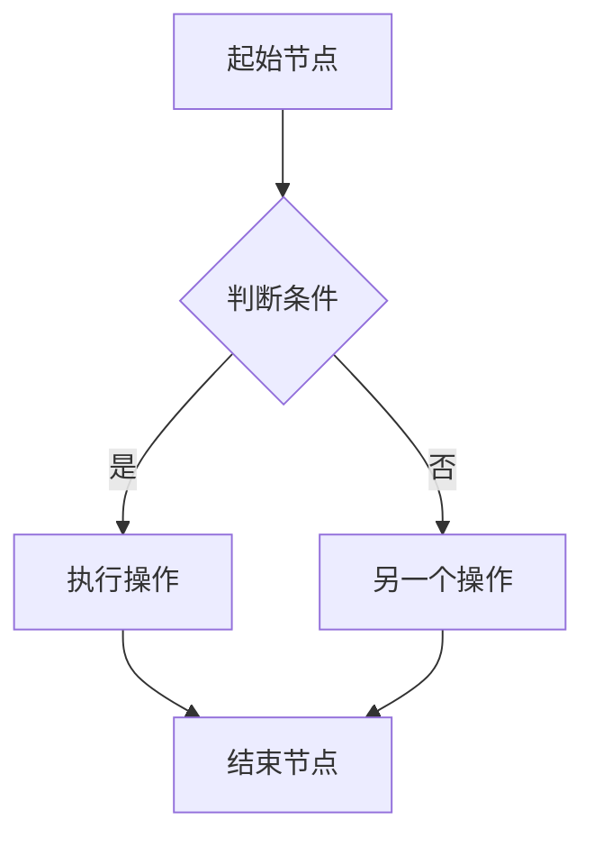

                 

# 数字艺术创业：艺术与科技的完美融合

> **关键词：** 数字艺术、创业、人工智能、融合、商业模式、社会责任

> **摘要：** 本文将探讨数字艺术创业这一新兴领域，通过分析艺术与科技的融合趋势，探讨数字艺术创业的核心要素、科技基础、项目实践以及可持续发展的经济和法律问题。文章旨在为创业者提供一份实用的指南，帮助他们在这个充满机遇的领域取得成功。

----------------------------------------------------------------

### 第一部分: 数字艺术创业概述

#### 第1章: 数字艺术创业基础

1. **1.1 数字艺术创业的背景与意义**

数字艺术创业是近年来随着科技与艺术的深度融合而产生的一种新兴商业模式。数字艺术，顾名思义，是指利用数字技术进行艺术创作和表现的艺术形式。它涵盖了数字绘画、数字雕塑、虚拟现实（VR）、增强现实（AR）等多种艺术形式。随着计算机技术、人工智能（AI）以及互联网的快速发展，数字艺术逐渐成为艺术家们表达创意的重要手段。

数字艺术创业的背景可以追溯到互联网的普及和计算机技术的进步。从20世纪90年代互联网的兴起，到21世纪计算机处理能力和存储能力的极大提升，再到人工智能技术的突破，数字艺术的发展历程实际上就是科技不断驱动艺术创新的过程。在这个过程中，艺术家们不再局限于传统的艺术媒介和形式，他们开始尝试利用科技手段，创造出全新的艺术作品和体验。

数字艺术创业的意义在于，它不仅为艺术家提供了更多的创作空间和可能性，也为观众带来了全新的艺术体验。通过数字艺术创业，艺术家们可以将自己的创意转化为商业价值，实现经济效益和社会影响力的双重提升。同时，数字艺术创业也为科技创新提供了新的应用场景，推动了艺术与科技的深度融合。

#### 1.2 数字艺术创业的核心要素

数字艺术创业的核心要素主要包括创意与技术的结合、团队建设与管理、市场需求与定位。

1. **创意与技术的结合**

创意是数字艺术创业的灵魂，而技术是实现创意的保障。在数字艺术创业中，艺术家和技术专家需要紧密合作，将创意与技术相结合，创造出具有创新性和商业价值的产品。例如，利用人工智能技术，艺术家可以开发出能够自动生成艺术作品的软件，从而大大提高创作效率。同时，技术专家可以运用计算机图形学、算法设计等技术，为艺术作品提供更多的表现形式和交互体验。

2. **团队建设与管理**

成功的数字艺术创业离不开优秀的团队。团队成员需要具备多样化的技能，包括艺术创作、编程开发、产品设计、市场营销等。在团队建设中，管理者需要明确每个成员的角色和职责，建立有效的沟通和协作机制，确保项目能够顺利推进。此外，管理者还需要关注团队成员的激励机制，激发他们的创造力和工作热情。

3. **市场需求与定位**

数字艺术创业需要准确把握市场需求，进行精准的市场定位。在创业初期，创业者需要通过市场调研，了解目标用户的需求和偏好，确定产品的市场定位。例如，一些数字艺术创业项目可能专注于高端艺术品市场，而另一些则可能瞄准大众市场，提供价格亲民的艺术体验。通过明确市场需求和定位，创业者可以更好地制定商业计划和营销策略，提高项目的成功率。

#### 1.3 数字艺术创业的挑战与应对策略

数字艺术创业面临着诸多挑战，包括技术创新风险、市场竞争与差异化策略、法律法规与知识产权保护等。

1. **技术创新风险**

数字艺术创业依赖于技术的不断创新，而技术创新往往伴随着风险。创业者需要密切关注技术发展趋势，及时进行技术更新和迭代。同时，创业者还需要具备一定的技术储备，以应对技术变革带来的不确定性。为降低技术创新风险，创业者可以采取多元化的技术布局，避免过度依赖单一技术。

2. **市场竞争与差异化策略**

数字艺术创业市场日益竞争激烈，创业者需要找到差异化的竞争优势。差异化策略可以包括技术优势、品牌优势、产品优势等。例如，通过独特的艺术风格或创新的技术应用，创业者可以打造出与众不同的艺术产品。此外，创业者还可以通过精准的市场定位，找到目标用户群体，提高市场竞争力。

3. **法律法规与知识产权保护**

数字艺术创业涉及大量的知识产权，包括著作权、商标权、专利权等。创业者需要了解相关法律法规，保护自己的知识产权。同时，创业者还需要防范竞争对手侵犯知识产权的行为，采取法律手段进行维权。为降低法律风险，创业者可以提前进行知识产权布局，建立完善的知识产权保护体系。

#### 1.4 数字艺术创业的案例研究

为了更好地理解数字艺术创业的实际操作，我们可以通过分析一些成功和失败的案例，总结经验与教训。

1. **成功案例解析**

成功案例中，艺术家和技术专家的紧密合作是关键。例如，一家名为“Artbreeder”的公司，通过人工智能技术，开发出了一款能够自动生成艺术作品的软件。这款软件受到了艺术爱好者和专业艺术家的广泛欢迎，不仅提升了创作效率，还降低了艺术创作的门槛。此外，该公司还通过众筹平台筹集资金，实现了商业模式的成功落地。

2. **失败案例分析**

失败案例中，往往存在一些共同的问题，如技术创新不足、市场定位不准、法律风险等。例如，一家名为“AI Painter”的公司，试图通过人工智能技术，打造一款能够自动绘画的软件。然而，由于技术创新不足，产品无法达到预期效果，导致市场推广失败。此外，该公司在法律风险防范方面也存在不足，最终因知识产权纠纷而面临法律诉讼。

3. **经验与教训总结**

通过分析成功和失败的案例，我们可以得出以下经验与教训：

- 创意与技术相结合是数字艺术创业的核心竞争力。
- 紧密合作是艺术家和技术专家共同实现创新的关键。
- 市场调研和精准定位是确保项目成功的关键环节。
- 法律法规和知识产权保护是数字艺术创业的重要保障。

#### 1.5 数字艺术创业的科技基础

数字艺术创业的科技基础主要涉及艺术与科技的融合原理、人工智能的应用、以及数字艺术创业的技术栈。

1. **艺术与科技的融合原理**

艺术与科技的融合原理主要包括数字艺术的基本技术原理和现代科技在艺术创作中的应用。数字艺术的基本技术原理包括计算机图形学、算法设计、虚拟现实、增强现实等。现代科技在艺术创作中的应用主要体现在人工智能、大数据、云计算等方面。例如，利用人工智能技术，艺术家可以开发出能够自动生成艺术作品的软件，从而大大提高创作效率。

2. **人工智能的应用**

人工智能在数字艺术创业中的应用场景非常广泛。例如，人工智能算法可以用于图像生成、图像编辑、音乐创作等领域。在图像生成方面，生成对抗网络（GAN）是一种常见的应用。GAN通过两个神经网络（生成器和判别器）的相互对抗，可以生成高质量的艺术图像。在图像编辑方面，卷积神经网络（CNN）可以用于图像增强、图像修复等任务。在音乐创作方面，循环神经网络（RNN）可以用于生成音乐旋律和节奏。

3. **数字艺术创业的技术栈**

数字艺术创业的技术栈包括前端技术、后端技术、数据库与存储技术等。前端技术主要包括HTML、CSS、JavaScript等，用于实现用户界面的设计和交互。后端技术主要包括服务器端编程语言（如Python、Java等）、数据库技术（如MySQL、MongoDB等）、云计算技术等。数据库与存储技术用于存储和管理艺术作品、用户数据等。

#### 1.6 数字艺术创业的发展趋势

随着科技的不断发展，数字艺术创业呈现出以下几个发展趋势：

1. **人工智能的深化应用**

人工智能在数字艺术创业中的应用将不断深化，不仅限于图像生成和音乐创作，还将扩展到艺术品的评估、艺术市场的预测等领域。例如，利用深度学习技术，可以开发出能够评估艺术品价值的智能系统，帮助艺术家和市场更好地了解艺术品的市场价值。

2. **虚拟现实和增强现实的普及**

虚拟现实（VR）和增强现实（AR）技术将在数字艺术创业中发挥越来越重要的作用。通过VR和AR技术，艺术家可以创造出沉浸式的艺术体验，让观众更加直观地感受艺术作品。例如，利用VR技术，观众可以进入一个虚拟的艺术展览馆，欣赏各种艺术作品。

3. **区块链技术的应用**

区块链技术在数字艺术创业中的应用也将逐渐普及。区块链可以用于记录艺术品的所有权信息，确保艺术品的唯一性和真实性。此外，区块链还可以用于艺术品的交易，降低交易成本，提高交易效率。

4. **跨界合作的增多**

数字艺术创业将越来越依赖于跨界合作。艺术家、技术专家、市场专家等不同领域的专业人士将共同参与数字艺术创业，通过跨界合作，实现资源的最大化利用和创意的无限拓展。

### 第2章: 数字艺术创业的科技基础

2.1 艺术与科技的融合原理

艺术与科技的融合原理是指将艺术创作与计算机技术、人工智能、虚拟现实等现代科技相结合，以创造出全新的艺术形式和体验。这种融合不仅丰富了艺术的表现手段，也为艺术家提供了更广阔的创作空间。

首先，数字艺术的基本技术原理包括计算机图形学、算法设计、虚拟现实（VR）、增强现实（AR）等。计算机图形学是数字艺术的基础，它涉及图像处理、渲染技术、三维建模等。通过计算机图形学，艺术家可以创建出丰富的视觉元素，使数字艺术作品具有逼真的视觉效果。

其次，算法设计在数字艺术创作中发挥着关键作用。艺术家可以通过编程语言，设计和实现各种算法，以生成独特的艺术效果。例如，利用生成对抗网络（GAN），艺术家可以创造出高质量的图像和视频。GAN由生成器和判别器组成，生成器生成艺术作品，判别器则评估生成作品的质量。通过两个网络的相互竞争，生成器不断优化，最终生成出高度逼真的艺术作品。

此外，虚拟现实和增强现实技术为数字艺术创作带来了全新的体验。VR技术可以创建一个完全沉浸式的虚拟世界，观众可以在这个世界中自由探索和互动。AR技术则可以将虚拟的艺术元素叠加到现实世界中，使现实世界与虚拟世界相互融合。

艺术与科技的融合原理不仅体现在技术层面，还体现在艺术创作理念和方法的转变上。艺术家不再局限于传统的创作方式，而是通过科技手段，探索更多的创作可能性。例如，一些艺术家利用人工智能算法，生成出具有独特风格的艺术作品，这些作品既有艺术家的个人风格，又融合了人工智能的创新性。

总之，艺术与科技的融合原理为数字艺术创作提供了丰富的技术手段和创作空间。通过计算机图形学、算法设计、VR和AR技术等，艺术家可以创造出更具创意和表现力的数字艺术作品，为观众带来全新的艺术体验。

2.2 艺术人工智能的应用

人工智能（AI）在数字艺术创业中的应用正逐渐成为艺术创作和创新的重要驱动力。AI技术的引入不仅提高了艺术创作的效率，还带来了前所未有的创作方式和表现形式。

首先，AI在数字艺术创作中的应用场景非常广泛。其中，最常见的是图像生成和编辑。生成对抗网络（GAN）是AI在图像生成领域的核心技术。GAN由生成器和判别器组成，生成器负责生成艺术作品，判别器则评估生成作品的真假。通过两个网络的相互对抗，生成器不断优化，最终生成出高质量的图像。例如，艺术家可以训练GAN生成出具有特定风格或主题的艺术作品，或者通过结合不同的风格和元素，创造出全新的艺术形式。

其次，AI在图像编辑方面的应用也极为重要。卷积神经网络（CNN）是图像编辑的核心算法。通过训练大量的图像数据，CNN可以学会识别和调整图像中的各种特征。例如，CNN可以用于图像增强，使低质量的图像变得清晰；也可以用于图像修复，修复图像中的损坏部分。此外，AI还可以实现图像风格转换，将一幅普通图像转换为具有某种艺术风格的图像。例如，将一张照片转换为梵高风格的油画，或将一张风景照片转换为水彩画风格。

在音乐创作方面，AI同样有着广泛的应用。循环神经网络（RNN）是音乐创作的重要算法。RNN可以学习音乐的结构和模式，生成出旋律和节奏。例如，AI可以生成出多种风格的音乐，从古典音乐到流行音乐，再到电子音乐。此外，AI还可以根据用户的需求和喜好，定制个性化的音乐作品。

除了图像生成和音乐创作，AI还在数字艺术的其他领域有着重要应用。例如，在三维建模和动画制作方面，AI可以自动生成复杂的三维模型和动画，提高创作效率。在虚拟现实（VR）和增强现实（AR）应用中，AI可以实时处理用户交互和场景变化，提供更自然的用户体验。

总之，AI在数字艺术创业中的应用不仅拓宽了艺术创作的边界，还为艺术家提供了更多的创作工具和手段。通过AI技术，艺术家可以更高效地创作出具有创意和个性化的艺术作品，同时也为观众带来了全新的艺术体验。

2.3 数字艺术创业的技术栈

数字艺术创业涉及多个技术领域，包括前端技术、后端技术和数据库与存储技术。掌握这些技术栈对于创业者来说至关重要，因为它们是构建数字艺术项目的基石。

**前端技术**

前端技术主要包括HTML、CSS和JavaScript。HTML（HyperText Markup Language）是网页内容的结构基础，用于定义网页中的文本、链接、图片等元素。CSS（Cascading Style Sheets）用于控制网页的布局和样式，使得网页内容更加美观和易于阅读。JavaScript是一种脚本语言，用于实现网页的交互功能，如动态效果、用户验证等。

在前端技术中，还有几个重要的框架和库，如React、Vue和Angular。这些框架和库提供了丰富的组件和功能，使得前端开发更加高效和模块化。React是由Facebook开发的，以其虚拟DOM和组件化设计而闻名；Vue是由Evan You开发的，以其简洁易用而受到开发者喜爱；Angular是由Google开发的，以其强大的功能和严格的架构设计而受到企业级开发者的青睐。

**后端技术**

后端技术主要负责处理数据存储、业务逻辑处理和外部接口等。后端技术包括多种编程语言和框架，如Python、Java、Node.js等。

Python是一种高级编程语言，以其简洁易读和丰富的库支持而受到开发者的喜爱。Django和Flask是Python的常用Web框架，Django以其强大的功能和易于扩展性而受到青睐，而Flask则以其轻量级和灵活性而受到欢迎。

Java是一种强类型编程语言，广泛应用于企业级开发。Spring Framework是Java的顶级Web框架，以其模块化设计和良好的扩展性而受到企业级开发者的喜爱。

Node.js是一种基于Chrome V8引擎的JavaScript运行环境，用于构建高性能的后端应用。Express.js是Node.js的常用Web框架，以其简洁和灵活而受到开发者喜爱。

**数据库与存储技术**

数据库与存储技术是数字艺术创业项目的重要组成部分，用于存储和管理艺术作品、用户数据等。

关系型数据库如MySQL、PostgreSQL和SQL Server等，以其强大的数据管理和查询能力而广泛应用于企业级应用。MySQL是一种开源的关系型数据库，以其高性能和易用性而受到广泛使用；PostgreSQL是一种功能丰富的开源数据库，以其强大的扩展性和灵活性而受到开发者的喜爱；SQL Server是微软开发的一种关系型数据库，广泛应用于Windows平台。

非关系型数据库如MongoDB、Cassandra和Redis等，以其灵活的数据模型和高性能而受到开发者的喜爱。MongoDB是一种文档型数据库，以其灵活的数据模型和强大的查询能力而受到广泛应用；Cassandra是一种分布式数据库，以其高可用性和可扩展性而受到企业级应用的首选；Redis是一种高速缓存数据库，以其高性能和丰富的数据结构而受到开发者喜爱。

**技术栈的协同作用**

前端技术、后端技术和数据库与存储技术相互协同，共同构建起数字艺术创业项目的完整架构。前端技术负责与用户互动，提供用户友好的界面和交互体验；后端技术负责处理业务逻辑和数据存储，确保系统的稳定性和安全性；数据库与存储技术负责存储和管理数据，为前端和后端提供数据支持。

通过掌握这些技术栈，数字艺术创业者可以构建出功能丰富、用户体验卓越的艺术项目。同时，这些技术也不断发展和迭代，为创业者提供了更多的创新机会和实现手段。掌握这些技术栈，不仅有助于创业者实现创业目标，也为他们未来的职业发展提供了坚实的基础。

### 第二部分：艺术创业项目的实践

#### 第3章：艺术创业项目规划

3.1 艺术创业项目的定位与目标

艺术创业项目的定位和目标是项目成功的关键。准确的定位能够帮助项目在竞争激烈的市场中找到自己的独特优势，明确的目标则能够为项目团队提供清晰的行动方向。

首先，艺术创业项目的定位需要从以下几个方面进行考虑：

1. **艺术风格和主题**：项目应该定位在哪个艺术风格或主题上？是现代艺术、古典艺术，还是某个特定的艺术流派？例如，一个项目可能专注于抽象艺术，利用计算机图形学创造出独特的视觉效果。

2. **目标用户群体**：项目的目标用户是谁？是艺术爱好者、专业人士，还是普通大众？了解目标用户的需求和偏好，有助于项目团队更好地满足市场需求，设计出用户喜爱的产品。

3. **技术应用**：项目将如何应用现代科技？是利用人工智能生成艺术作品，还是通过虚拟现实和增强现实技术创造沉浸式体验？明确技术应用，有助于项目团队在技术选型和研发过程中有的放矢。

其次，项目目标的设定需要具备可操作性和可实现性。具体来说，项目目标可以包括以下几个方面：

1. **短期目标**：短期目标通常是指项目启动后的1-2年内要实现的目标。例如，完成产品原型设计、进行市场推广、获取第一批用户等。

2. **中期目标**：中期目标通常是指项目启动后的2-5年内要实现的目标。例如，扩大产品功能、拓展市场范围、建立品牌影响力等。

3. **长期目标**：长期目标通常是指项目启动后的5年以上要实现的目标。例如，成为行业的领先者、实现规模化盈利、推动行业技术进步等。

在设定项目目标时，还需要考虑以下几点：

1. **SMART原则**：目标需要具备SMART特性，即具体（Specific）、可衡量（Measurable）、可实现（Achievable）、相关（Relevant）和有时限（Time-bound）。例如，“在明年内实现产品上线”就是一个具体、可衡量、可实现和有时限的目标。

2. **优先级排序**：项目目标应该根据重要性和紧急性进行排序，确保项目团队在资源有限的情况下，优先完成最重要的目标。

3. **灵活性**：项目目标需要具备一定的灵活性，以应对市场变化和项目进展中的不确定性。例如，在实现某个目标时，如果发现市场环境发生了重大变化，项目团队应该及时调整目标和策略。

总之，艺术创业项目的定位与目标设定是项目规划的重要环节。通过明确项目定位和目标，项目团队可以更好地规划项目发展方向，制定合理的战略和计划，为项目的成功奠定基础。

#### 3.2 艺术创业项目的团队建设

艺术创业项目的成功离不开一支高效、团结的团队。团队建设和管理是项目规划过程中至关重要的一环。以下将从团队成员的角色与职责、团队管理与激励机制、团队协作与沟通技巧三个方面，探讨艺术创业项目的团队建设。

1. **团队成员的角色与职责**

艺术创业项目的团队成员通常包括艺术家、技术专家、产品经理、市场推广人员、财务人员等。每个成员在团队中扮演着不同的角色，承担着不同的职责。

- **艺术家**：艺术家是项目的核心，负责艺术创作和设计。他们需要具备创新思维和艺术功底，能够创作出具有独特风格和创意的艺术作品。

- **技术专家**：技术专家负责项目的技术实现，包括前端开发、后端开发、算法设计等。他们需要熟悉各种编程语言和技术框架，能够高效地实现项目需求。

- **产品经理**：产品经理负责项目的整体规划和推进，包括需求分析、产品设计和用户体验。他们需要具备市场洞察力和项目管理能力，确保项目按计划进行。

- **市场推广人员**：市场推广人员负责项目的市场推广和品牌建设，包括广告投放、活动策划、社交媒体运营等。他们需要具备营销策略和执行能力，提升项目的市场知名度。

- **财务人员**：财务人员负责项目的财务管理和预算控制，确保项目的资金运转和财务健康。他们需要具备财务管理知识和专业技能。

明确团队成员的角色与职责，有助于提高团队的工作效率，确保项目目标的实现。

2. **团队管理与激励机制**

团队管理是确保项目顺利进行的重要环节。以下是一些有效的团队管理方法：

- **目标管理**：明确项目目标，并将目标分解为具体的工作任务，分配给团队成员。通过定期检查任务进度，确保项目按时完成。

- **沟通管理**：建立有效的沟通机制，确保团队成员之间能够顺畅交流。可以通过定期会议、工作汇报、在线协作工具等方式，加强团队沟通。

- **风险管理**：识别项目中的潜在风险，并制定相应的应对措施。通过风险管理和控制，降低项目风险对项目进度和质量的影响。

激励机制是提高团队士气和工作效率的重要手段。以下是一些有效的激励机制：

- **绩效评估**：定期对团队成员进行绩效评估，奖励表现优秀的成员，激励团队整体水平的提升。

- **薪酬激励**：提供有竞争力的薪酬待遇，包括基本工资、绩效奖金、股权激励等，吸引和留住优秀人才。

- **培训与发展**：为团队成员提供培训和发展机会，提高他们的专业技能和综合素质，促进个人成长和职业发展。

3. **团队协作与沟通技巧**

高效的团队协作和沟通是项目成功的关键。以下是一些团队协作与沟通技巧：

- **分工合作**：明确每个成员的职责和工作范围，确保团队成员能够相互协作，共同完成任务。

- **跨职能协作**：鼓励不同职能团队成员之间的交流与合作，促进知识共享和资源整合。

- **开放沟通**：建立开放、坦诚的沟通氛围，鼓励团队成员表达意见和反馈，促进团队决策的科学性和民主性。

- **冲突解决**：在团队协作过程中，难免会出现意见分歧和冲突。团队管理者需要及时介入，通过沟通和协商解决冲突，维护团队的稳定和和谐。

总之，艺术创业项目的团队建设是一个复杂而系统的过程。通过明确团队成员的角色与职责、实施有效的团队管理和激励机制、提高团队协作与沟通技巧，项目团队可以更好地协同工作，推动项目成功。

#### 3.3 艺术创业项目的市场推广策略

艺术创业项目的市场推广策略是确保项目成功的关键环节之一。以下将从品牌建设与形象塑造、市场推广渠道与手段、社交媒体与内容营销三个方面，探讨艺术创业项目的市场推广策略。

1. **品牌建设与形象塑造**

品牌建设是艺术创业项目市场推广的基础。一个鲜明的品牌形象能够帮助项目在竞争激烈的市场中脱颖而出，吸引目标用户的关注。

- **品牌定位**：明确项目的品牌定位，包括艺术风格、目标用户、市场定位等。例如，一个专注于现代数字艺术的创业项目，可以定位为创新、高科技、时尚的品牌形象。

- **品牌名称与标识**：选择一个易于记忆、具有辨识度的品牌名称和标识。品牌名称和标识应该与品牌定位相一致，能够传达项目的核心价值。

- **品牌故事**：构建一个有吸引力的品牌故事，让用户了解项目的起源、发展历程和愿景。品牌故事可以增强用户的情感认同，提高品牌的忠诚度。

- **品牌视觉设计**：设计统一的品牌视觉元素，包括LOGO、色彩方案、字体等。视觉设计应该简洁、直观、具有视觉冲击力，能够迅速吸引用户的注意力。

2. **市场推广渠道与手段**

市场推广渠道与手段的选择直接影响项目的市场覆盖面和推广效果。以下是一些有效的市场推广渠道与手段：

- **在线广告**：在线广告是推广项目的有效手段，包括搜索引擎广告、社交媒体广告、展示广告等。通过精准定位，在线广告能够将项目信息传递给目标用户。

- **公关活动**：举办新闻发布会、行业展览、艺术沙龙等活动，提高项目的知名度。通过公关活动，项目可以与行业媒体、潜在用户建立联系，提升品牌形象。

- **内容营销**：发布高质量的内容，如博客文章、视频、图片等，吸引用户关注。内容营销不仅可以提高项目的知名度，还可以建立项目在行业内的权威地位。

- **合作伙伴关系**：与行业内的其他品牌、机构建立合作关系，共同推广项目。合作伙伴关系可以扩大项目的影响力，提高市场覆盖面。

3. **社交媒体与内容营销**

社交媒体和内容营销是当前最受欢迎的市场推广手段之一。以下是一些有效的社交媒体与内容营销策略：

- **社交媒体平台选择**：选择合适的社交媒体平台，如Instagram、Facebook、Twitter、Pinterest等，根据项目的特点和目标用户群体的偏好，制定相应的推广策略。

- **社交媒体内容发布**：定期发布有吸引力的内容，包括艺术作品、项目进展、用户体验等。内容发布应该与品牌形象和推广目标相一致，提高用户参与度和互动性。

- **社交媒体互动**：积极与用户互动，回复用户评论、私信等，建立良好的用户关系。通过互动，项目可以了解用户的需求和反馈，不断优化和改进项目。

- **社交媒体广告**：利用社交媒体平台的广告功能，进行精准投放，提高项目的曝光度和点击率。

- **内容营销工具**：利用内容营销工具，如博客、视频、图片库等，提供有价值的信息，吸引用户关注。通过内容营销，项目可以建立品牌权威，提高用户忠诚度。

总之，艺术创业项目的市场推广策略需要综合考虑品牌建设、市场推广渠道与手段、社交媒体与内容营销等多个方面。通过制定和实施有效的市场推广策略，项目可以迅速提升市场知名度，吸引更多的目标用户，为项目的成功奠定基础。

### 第三部分：数字艺术创业的可持续性

#### 第5章：数字艺术创业的经济与法律问题

5.1 艺术创业的商业模式与盈利模式

数字艺术创业的成功离不开有效的商业模式和盈利模式。商业模式是指企业如何创造、传递和获取价值；而盈利模式则是企业如何实现商业模式的盈利。以下从商业模式的设计、盈利模式的分析以及成本控制和预算管理三个方面，探讨数字艺术创业的商业模式与盈利模式。

1. **商业模式的设计**

数字艺术创业项目的商业模式设计需要考虑以下几个关键要素：

- **价值主张**：明确项目的核心价值和目标用户群体。例如，一个数字艺术创业项目可能专注于提供高品质的艺术作品，吸引艺术爱好者和收藏家。

- **客户关系**：设计有效的客户关系管理策略，包括市场调研、客户服务、用户反馈等。通过了解客户需求，项目可以提供更符合市场需求的产品和服务。

- **渠道战略**：选择合适的销售渠道，如线上销售、实体店销售、合作伙伴销售等。线上渠道如电商平台、社交媒体平台等，可以为项目提供更广阔的市场覆盖；实体店销售则可以提升品牌形象和用户体验。

- **收入来源**：确定项目的收入来源，如产品销售、订阅服务、广告收入、版权授权等。多元化的收入来源可以降低项目风险，提高盈利能力。

- **成本结构**：合理控制项目成本，确保盈利。项目成本包括研发成本、运营成本、营销成本等。通过优化成本结构，项目可以提高利润空间。

2. **盈利模式的分析**

数字艺术创业项目的盈利模式可以分为以下几种：

- **产品销售**：通过直接销售数字艺术作品、艺术品等，获得销售收入。这种模式适用于高端艺术市场，目标用户为艺术爱好者和收藏家。

- **订阅服务**：提供付费订阅服务，用户按月或按年支付费用，享受数字艺术作品、艺术品等的在线浏览、下载等服务。这种模式可以稳定现金流，提高用户粘性。

- **广告收入**：通过在线广告、合作推广等方式，获取广告收入。这种模式适用于流量较大的数字艺术平台。

- **版权授权**：将数字艺术作品授权给其他品牌或机构使用，获取版权授权收入。这种模式可以扩大项目影响力，增加收入来源。

- **跨界合作**：与其他行业企业合作，如与时尚品牌、电子产品品牌等合作，推出联名产品，实现共赢。这种模式可以拓宽市场，提高品牌知名度。

3. **成本控制和预算管理**

成本控制和预算管理是确保数字艺术创业项目盈利的重要手段。以下是一些有效的成本控制和预算管理方法：

- **预算编制**：在项目启动前，制定详细的预算计划，包括研发成本、运营成本、营销成本等。预算编制应该考虑项目的长期目标和市场需求，确保资源合理配置。

- **成本监控**：在项目执行过程中，实时监控项目成本，确保成本控制在预算范围内。通过定期财务报表和分析，及时发现成本异常，采取相应措施进行调整。

- **成本优化**：通过优化项目流程、提升工作效率、降低资源消耗等方式，降低项目成本。例如，采用高效的技术手段，减少研发成本；通过集中采购、外包等方式，降低运营成本。

- **预算调整**：在项目执行过程中，根据实际情况和市场需求，及时调整预算计划。预算调整应该充分考虑项目风险和不确定性，确保项目顺利进行。

总之，数字艺术创业项目的商业模式与盈利模式需要结合项目特点和市场需求进行设计。通过有效的成本控制和预算管理，项目可以实现盈利，为企业的长期发展奠定基础。

#### 5.2 艺术创业的法律与法规

数字艺术创业涉及到大量的知识产权，因此了解相关法律法规对于创业者来说至关重要。以下从相关法律法规的概述、知识产权保护与维权、合同法律风险防范三个方面，探讨数字艺术创业的法律与法规问题。

1. **相关法律法规的概述**

数字艺术创业所涉及的法律主要包括著作权法、商标法、专利法、合同法等。

- **著作权法**：著作权法是保护艺术作品、文字作品、音乐作品等知识产权的基本法律。根据《中华人民共和国著作权法》，艺术作品包括绘画、书法、雕塑等，创作者对其作品享有著作权，未经许可，他人不得复制、发行、展览、表演、放映、广播、信息网络传播等。

- **商标法**：商标法是保护商标权益的法律。在数字艺术创业中，创业者需要注册商标，以保护品牌名称和标识。根据《中华人民共和国商标法》，商标注册人享有商标专用权，他人未经许可不得使用相同或近似的商标。

- **专利法**：专利法是保护发明创造的法律。数字艺术创业中的技术创新，如算法设计、技术方案等，可以通过专利申请获得保护。根据《中华人民共和国专利法》，发明人或者设计人对其发明创造享有专利申请权和专利权。

- **合同法**：合同法是规范合同关系的基本法律。在数字艺术创业中，创业者需要签订各种合同，如雇佣合同、合作协议、授权合同等。根据《中华人民共和国合同法》，合同依法成立后，即具有法律约束力，当事人应当履行合同义务。

2. **知识产权保护与维权**

数字艺术创业中的知识产权保护主要包括著作权、商标权和专利权的保护。

- **著作权保护**：创业者需要确保自己的艺术作品不受侵犯。可以通过登记著作权、发布版权声明等方式，提高作品的法律保护力度。在发现侵权行为时，可以采取法律手段进行维权，如申请禁令、赔偿损失等。

- **商标权保护**：创业者需要注册商标，保护品牌名称和标识。在商标注册过程中，需要选择合适的商标，避免侵犯他人的商标权。在商标使用过程中，需要遵守商标法的相关规定，确保商标的合法使用。

- **专利权保护**：创业者可以通过申请专利，保护自己的技术创新。在专利申请过程中，需要提交详细的专利申请文件，确保专利的合法性和有效性。在专利授权过程中，需要与专利权人签订专利授权合同，明确授权范围和期限。

3. **合同法律风险防范**

合同法律风险防范是数字艺术创业中的重要一环。以下是一些有效的合同法律风险防范措施：

- **合同审查**：在签订合同前，应请专业律师对合同内容进行审查，确保合同合法、有效，避免法律风险。

- **合同谈判**：在合同谈判过程中，应充分考虑双方利益，合理约定合同条款，避免合同争议。

- **合同管理**：在合同履行过程中，应严格执行合同条款，确保各方履行合同义务。在发现合同履行问题时，应及时采取法律手段解决。

- **合同纠纷解决**：在合同纠纷发生时，应采取合理的解决方式，如协商、调解、仲裁、诉讼等。通过合法途径解决纠纷，维护自身权益。

总之，数字艺术创业中的法律与法规问题关系到项目的顺利推进和可持续发展。创业者应深入了解相关法律法规，加强知识产权保护，防范合同法律风险，为项目的成功奠定坚实基础。

#### 5.3 艺术创业的风险管理与应对策略

数字艺术创业虽然充满了机遇，但同时也伴随着一定的风险。有效识别、评估和应对这些风险，是确保项目顺利推进和可持续发展的重要环节。以下从风险识别与评估、风险应对与防范、应急预案与危机管理三个方面，探讨数字艺术创业的风险管理与应对策略。

1. **风险识别与评估**

风险识别是风险管理的基础。数字艺术创业中的主要风险包括技术创新风险、市场风险、财务风险、法律风险等。

- **技术创新风险**：技术创新是数字艺术创业的核心竞争力，但技术革新往往伴随着不确定性和失败风险。例如，人工智能算法可能无法达到预期效果，新的技术方案可能遇到难以解决的问题。

- **市场风险**：市场风险主要包括市场需求变化、竞争加剧、市场接受度低等。市场环境的变化可能影响项目的销售和盈利能力。

- **财务风险**：财务风险包括资金不足、成本超支、收入不稳定等。财务问题可能导致项目资金链断裂，影响项目的持续发展。

- **法律风险**：法律风险包括知识产权纠纷、合同纠纷、违规操作等。法律问题可能对项目的合法性和商业运营产生严重影响。

风险评估是通过定量和定性的方法，评估风险的可能性和影响程度。创业者可以通过历史数据分析、专家评估、情景分析等方法，对风险进行评估。

2. **风险应对与防范**

针对识别出的风险，创业者需要制定相应的应对策略和防范措施。

- **技术创新风险**：创业者应关注技术发展趋势，加强与科研机构和高校的合作，提高技术创新能力。同时，应建立失败风险应对机制，如风险投资、多元化的技术储备等，以应对技术创新失败的风险。

- **市场风险**：创业者应进行充分的市场调研，了解市场需求和竞争状况。通过市场细分和定位，找到目标用户群体，提高产品的市场适应性和竞争力。此外，应建立灵活的营销策略，及时应对市场变化。

- **财务风险**：创业者应制定详细的财务预算和资金使用计划，确保项目资金的合理分配和有效利用。通过多元化的融资渠道，降低财务风险。同时，应建立财务监控和预警机制，及时发现财务问题，采取相应的应对措施。

- **法律风险**：创业者应了解相关法律法规，建立完善的知识产权保护体系，确保项目的合法性。在合同签订和履行过程中，应请专业律师进行审核，确保合同的合法性和有效性。此外，应建立法律风险防范机制，如法律培训、法律顾问等，以应对法律纠纷。

3. **应急预案与危机管理**

应急预案和危机管理是应对突发事件和危机的重要手段。

- **应急预案**：创业者应根据可能出现的突发事件，制定应急预案。例如，技术故障应急预案、资金链断裂应急预案等。应急预案应包括应急响应流程、应急资源调配、应急沟通机制等。

- **危机管理**：在危机发生时，创业者应迅速采取措施，控制危机蔓延，减少损失。危机管理包括危机预警、危机应对、危机恢复等环节。例如，在技术故障发生时，应及时通知用户，提供解决方案，避免用户流失。

- **危机沟通**：危机沟通是危机管理的关键。创业者应建立有效的沟通机制，确保内部团队和外部合作伙伴的及时沟通。通过透明的沟通，提高团队的协作效率和用户信任。

总之，数字艺术创业中的风险管理与应对策略是项目成功的重要保障。通过识别、评估和应对风险，创业者可以降低项目风险，确保项目的顺利推进和可持续发展。

#### 第6章：数字艺术创业的社会责任

6.1 艺术创业的社会价值

数字艺术创业不仅追求经济效益，还应承担起一定的社会责任，以实现可持续发展。艺术创业的社会价值体现在以下几个方面：

首先，数字艺术创业为社会提供了新的就业机会。随着数字艺术行业的快速发展，艺术家、程序员、设计师、市场营销人员等岗位需求不断增长，为社会各界提供了更多的就业机会。这不仅有助于缓解就业压力，还能促进社会经济的稳定发展。

其次，数字艺术创业推动了艺术教育和普及。通过数字艺术创作工具和平台的普及，更多的人可以接触到艺术创作，培养艺术兴趣和创作能力。数字艺术创业项目可以通过在线课程、公开课、工作坊等形式，向大众传播艺术知识，提高公众的艺术素养和审美水平。

此外，数字艺术创业为社会带来了丰富的文化产品。数字艺术作品不仅具有审美价值，还蕴含了丰富的文化内涵。通过数字技术，艺术家可以创造出独特的艺术形式，传递文化价值，促进文化交流与传播。例如，虚拟现实（VR）和增强现实（AR）技术可以为观众提供沉浸式的艺术体验，让更多人感受到艺术的魅力。

最后，数字艺术创业有助于环境保护和可持续发展。与传统艺术形式相比，数字艺术创作具有较低的环境影响。例如，数字艺术可以减少纸张的使用，降低木材消耗，减少碳排放。通过推广数字艺术创作，可以倡导绿色环保的理念，促进可持续发展。

6.2 艺术创业的社区与生态建设

数字艺术创业的社区与生态建设是确保项目可持续发展的关键。以下从创业社区的构建、创业生态的完善、社区互动与用户参与三个方面，探讨数字艺术创业的社区与生态建设。

1. **创业社区的构建**

创业社区的构建是数字艺术创业的重要基础。创业社区可以聚集艺术家、技术专家、投资人、市场推广人员等不同领域的专业人士，形成资源共享、合作共赢的生态圈。以下是一些构建创业社区的建议：

- **线上线下结合**：构建线上线下相结合的创业社区，通过线下活动、研讨会、展览等形式，加强成员之间的交流和互动。同时，利用线上平台，如社交媒体、论坛、微信群等，提供在线交流和资源共享。

- **多元化活动**：举办多元化的活动，如艺术展览、技术交流、创业分享会、投融资对接会等，满足社区成员的不同需求。通过活动，可以增强社区的凝聚力和活跃度。

- **资源整合**：整合社区内外部资源，如技术支持、资金支持、市场推广资源等，为社区成员提供全方位的支持和服务。通过资源整合，可以提升社区的整体实力和影响力。

2. **创业生态的完善**

创业生态的完善是数字艺术创业持续发展的重要保障。以下是一些完善创业生态的建议：

- **政策支持**：政府可以出台相关政策，鼓励和支持数字艺术创业。例如，提供税收优惠、资金补贴、人才引进政策等，降低创业门槛，激发创业热情。

- **技术创新**：鼓励技术创新，支持艺术家和技术专家进行技术研发和实验。通过技术创新，可以提升数字艺术创业的竞争力，推动行业进步。

- **人才培养**：加强艺术与科技人才的培养，提供专业培训、实习机会、项目资助等，为数字艺术创业提供人才支持。通过人才培养，可以提升行业整体水平，促进可持续发展。

3. **社区互动与用户参与**

社区互动与用户参与是数字艺术创业成功的关键。以下是一些促进社区互动与用户参与的建议：

- **用户反馈**：重视用户反馈，通过问卷调查、用户访谈等方式，了解用户需求和建议。通过用户反馈，可以不断优化产品和服务，提升用户体验。

- **用户共创**：鼓励用户参与艺术创作，提供平台和工具，让用户可以创作自己的数字艺术作品。通过用户共创，可以增强用户粘性和品牌忠诚度。

- **社区活动**：举办社区活动，如艺术展览、创作工作坊、技术讲座等，增强用户参与感和归属感。通过社区活动，可以提升用户对品牌的认同感和信任度。

总之，数字艺术创业的社会责任不仅体现在经济效益上，还体现在社会价值、社区与生态建设等方面。通过承担社会责任，数字艺术创业可以实现可持续发展，为社会的进步和繁荣做出贡献。

#### 6.3 艺术创业的传承与发展

艺术创业的传承与发展是一个长期而系统的过程，需要创业者具备远见卓识，持续推动创新和优化。以下从艺术创新的持续动力、创业团队的长期发展、创业成果的积累与分享三个方面，探讨数字艺术创业的传承与发展。

1. **艺术创新的持续动力**

艺术创新的持续动力是数字艺术创业成功的关键。为了保持创新的活力，创业者需要：

- **鼓励创新思维**：在团队中营造鼓励创新和容忍失败的文化氛围，激发员工的创造力和主动性。例如，定期举办创新竞赛、头脑风暴会议等，鼓励员工提出新的创意和想法。

- **持续学习与研发**：创业者应关注行业前沿技术和发展趋势，持续进行技术研发和创新。通过不断学习和实践，创业者可以掌握最新的技术，为艺术创作提供更多的可能性。

- **跨学科合作**：鼓励跨学科合作，整合艺术家、技术专家、设计师等不同领域的专业知识，创造出独特且具有影响力的数字艺术作品。跨学科合作可以带来新的视角和思路，促进艺术创新的持续发展。

2. **创业团队的长期发展**

创业团队的长期发展是数字艺术创业成功的重要保障。为了确保团队的稳定和持续发展，创业者需要：

- **人才培养与激励**：建立完善的人才培养和激励机制，提升团队整体素质和工作效率。例如，定期开展培训课程、提供职业发展规划、实施绩效奖励等，激发员工的积极性和创造力。

- **文化建设**：打造积极向上、团结协作的企业文化，增强团队的凝聚力和向心力。通过团队建设活动、文化氛围营造等，提升团队的文化认同感和归属感。

- **团队优化**：根据项目需求和团队实际情况，定期对团队结构和人员配置进行调整。通过优化团队结构，确保团队的专业能力和工作效率。

3. **创业成果的积累与分享**

创业成果的积累与分享是数字艺术创业传承与发展的重要环节。以下是一些具体的策略：

- **成果积累**：建立完善的成果积累机制，对团队的艺术创作、技术创新、市场推广等方面进行系统记录和总结。通过积累经验，可以为未来的发展提供宝贵的参考和借鉴。

- **成果分享**：鼓励团队成员之间的经验分享和知识传递，通过内部培训、会议分享、项目总结等形式，提升团队的整体能力和水平。此外，创业者还可以通过公开发布项目成果、参加行业会议和展览等方式，扩大项目的影响力。

- **合作与拓展**：与其他企业和机构建立合作关系，共同开发新的市场和业务领域。通过合作，可以共享资源、技术和管理经验，推动数字艺术创业的可持续发展。

总之，数字艺术创业的传承与发展需要创业者具备远见卓识，持续推动创新和优化。通过激发艺术创新的持续动力、推动创业团队的长期发展、积累和分享创业成果，数字艺术创业可以在激烈的市场竞争中脱颖而出，实现长期的繁荣和成功。

### 第四部分：数字艺术创业的未来展望

#### 第7章：数字艺术创业的未来趋势

7.1 科技创新对数字艺术创业的影响

随着科技的迅猛发展，数字艺术创业正迎来前所未有的机遇。科技创新不仅改变了艺术创作的手段和方式，也深刻影响了数字艺术创业的商业模式和市场格局。

首先，人工智能（AI）技术的发展为数字艺术创作带来了革命性的变化。生成对抗网络（GAN）、深度学习、强化学习等AI技术，使得艺术作品的生成和编辑变得更加高效和智能化。艺术家可以利用这些技术，创作出独特的艺术作品，同时降低创作门槛，让更多的人参与到艺术创作中来。例如，GAN技术可以生成高质量的艺术图像，而深度学习算法则可以用于音乐创作和视频编辑。这些技术的应用，不仅丰富了艺术创作的形式，也拓展了艺术家的创作空间。

其次，虚拟现实（VR）和增强现实（AR）技术的进步，为数字艺术创业带来了新的表现手段和用户体验。VR技术可以创建一个完全沉浸式的虚拟世界，让用户在虚拟空间中自由探索和互动。这种沉浸式体验不仅增强了艺术作品的感染力，也提高了观众的参与度。AR技术则可以将虚拟的艺术元素叠加到现实世界中，实现现实与虚拟的融合。例如，艺术家可以通过AR技术，将艺术作品投影到建筑物的墙壁上，或者让用户通过手机镜头看到三维立体的艺术品。

此外，区块链技术也在数字艺术创业中发挥着重要作用。区块链可以用于记录艺术品的所有权信息，确保艺术品的唯一性和真实性。通过区块链技术，艺术家和收藏家可以建立透明、可追溯的交易记录，提高艺术市场的信任度。此外，区块链还可以用于版权保护，防止艺术品的侵权和盗版。例如，艺术家可以将自己的作品上链，记录作品的版权信息，从而方便维权和交易。

总之，科技创新对数字艺术创业的影响是深远和广泛的。这些技术不仅为艺术家提供了新的创作工具和手段，也改变了艺术创作的生态系统和市场格局。随着科技的不断进步，数字艺术创业将迎来更加广阔的发展空间和机遇。

#### 7.2 数字艺术创业的国际视野

在全球化的背景下，数字艺术创业不仅局限于本地市场，更需要具备国际视野。通过了解和借鉴国际市场的成功案例，国内创业者可以更好地把握全球艺术创业的潮流，开拓国际市场。

首先，我们可以从美国市场看到一些成功的数字艺术创业案例。例如，艺术AI初创公司Artisto利用人工智能技术，为用户生成个性化的艺术作品。该公司通过众筹平台成功筹集资金，并在全球范围内获得了广泛关注。另一个例子是人工智能艺术平台Obvious，它利用GAN技术创作出独特的数字艺术品，并在艺术市场上取得了巨大的成功。这些案例展示了人工智能技术在艺术创作中的强大潜力，以及通过互联网平台实现国际化推广的可行性。

其次，欧洲市场也有一些值得关注的数字艺术创业项目。法国的Artomatix公司，通过利用机器学习技术，自动生成高质量的3D模型，为游戏开发者、设计师等提供了便捷的工具。这家公司不仅在欧洲市场取得了成功，还通过与国际合作，进一步拓展了海外市场。德国的dotdotdot公司，则通过VR和AR技术，为博物馆和画廊提供沉浸式展览解决方案，吸引了众多国际客户的关注。

亚洲市场同样不乏成功的数字艺术创业项目。日本的Makegarage，通过将数字艺术与玩具设计相结合，开发出了独特的数字玩具品牌。该公司的产品不仅在日本国内取得了巨大成功，还通过跨境电商平台，出口到了全球多个国家和地区。中国的虚拟现实公司乐元素，通过自主研发的VR技术，打造了多个受欢迎的VR游戏和体验项目，在国际市场上赢得了良好的口碑。

通过分析这些国际市场的成功案例，我们可以得出以下启示：

1. **技术创新是关键**：国际市场的成功案例表明，技术创新是数字艺术创业的核心竞争力。创业者需要紧跟科技发展趋势，不断探索新的技术手段，为艺术创作提供更多可能性。

2. **国际化推广策略**：创业者需要具备国际视野，制定合适的国际化推广策略。通过参加国际艺术展览、艺术博览会，利用社交媒体和电商平台，提高品牌在国际市场的知名度和影响力。

3. **多元化市场布局**：创业者应积极拓展多元化市场，不仅关注本地市场，也要瞄准全球市场。通过国际合作和资源整合，实现全球市场的覆盖和拓展。

总之，数字艺术创业的国际视野为国内创业者提供了丰富的借鉴和启示。通过学习国际市场的成功经验，国内创业者可以更好地把握全球艺术创业的潮流，开拓更广阔的国际市场，实现企业的可持续发展。

#### 7.3 数字艺术创业的未来挑战与机遇

数字艺术创业在未来将面临诸多挑战，同时也将迎来丰富的机遇。以下从未来趋势的预测与分析、创业者的战略选择、创业精神的传承与创新三个方面，探讨数字艺术创业的未来挑战与机遇。

1. **未来趋势的预测与分析**

未来，数字艺术创业将面临以下几大趋势：

- **人工智能与艺术的深度融合**：随着人工智能技术的不断进步，AI将在数字艺术创作中发挥更加重要的作用。从自动生成艺术作品，到艺术作品的个性化推荐，AI将极大地改变艺术创作的模式。

- **虚拟现实与增强现实技术的普及**：VR和AR技术将逐渐成熟，成为数字艺术创业的重要工具。通过这些技术，艺术家可以创造出更加沉浸式的艺术体验，观众可以在虚拟世界中自由探索艺术作品。

- **区块链技术在艺术领域的应用**：区块链技术将在艺术品交易、版权保护等方面发挥重要作用。通过区块链，艺术家可以确保作品的真实性和唯一性，收藏家可以透明地追踪作品的交易历史。

- **跨界合作的增多**：数字艺术创业将越来越依赖于跨界合作。艺术家、技术专家、设计师、市场专家等不同领域的专业人士将共同参与，通过跨界合作，实现资源的最大化利用和创意的无限拓展。

2. **创业者的战略选择**

在未来的数字艺术创业中，创业者需要做出以下战略选择：

- **技术创新**：紧跟科技发展趋势，不断进行技术创新。创业者应关注人工智能、虚拟现实、区块链等前沿技术，将其应用于艺术创作和产品开发中，提升项目的竞争力。

- **市场定位**：准确把握市场需求，进行精准的市场定位。创业者需要了解目标用户的需求和偏好，开发出符合市场潮流的艺术作品和产品。

- **品牌建设**：重视品牌建设，打造独特的品牌形象。创业者应通过独特的艺术风格、技术创新和优质的服务，树立品牌声誉，提高市场知名度。

- **国际化推广**：具备国际视野，制定国际化推广策略。通过参加国际艺术展览、艺术博览会，利用社交媒体和电商平台，拓展国际市场。

3. **创业精神的传承与创新**

在数字艺术创业中，创业精神至关重要。以下是一些值得传承和创新的创业精神：

- **创新精神**：鼓励创新思维，不断探索新的创作方式和表现形式。创业者应敢于尝试，勇于挑战，推动艺术的不断创新。

- **合作精神**：跨界合作是数字艺术创业的重要途径。创业者应积极与其他领域的专业人士合作，整合各方资源，共同创造价值。

- **持续学习**：在快速变化的技术环境中，创业者需要不断学习，提升自身素质。通过参加培训、阅读书籍、参加行业会议等，持续学习和成长。

- **社会责任**：数字艺术创业不仅追求经济利益，还应承担社会责任。创业者应关注环境保护、文化传承等方面，为社会的可持续发展贡献力量。

总之，数字艺术创业在未来将面临诸多挑战，但同时也充满机遇。创业者需要紧跟科技发展趋势，做出明智的战略选择，传承和创新创业精神，才能在这个充满竞争和机遇的领域中取得成功。

### 附录

#### 附录 A: 数字艺术创业工具与资源

A.1 创作工具推荐

在数字艺术创作中，选择合适的工具可以大大提高创作效率和作品质量。以下是一些常用的数字艺术创作工具：

1. **数字绘画与设计软件**：

   - **Adobe Photoshop**：业界领先的图像处理软件，支持丰富的图像编辑和绘画功能。

   - **Adobe Illustrator**：专业的矢量图形设计软件，适合绘制图标、标志等图形元素。

   - **Corel Painter**：数字绘画软件，模拟传统绘画技巧，适合艺术家进行数字绘画创作。

   - **Procreate**：iOS平台上的数字绘画应用，界面简洁，操作流畅，适合移动设备上的绘画创作。

2. **虚拟现实与增强现实工具**：

   - **Unity**：一款功能强大的游戏和VR/AR开发平台，支持多种VR/AR设备和插件。

   - **Unreal Engine**：一款高端的3D游戏和VR/AR开发引擎，提供强大的图形渲染和物理模拟功能。

   - **Blender**：一款免费开源的3D建模和渲染软件，适合VR/AR场景的创建和渲染。

   - **ARKit/ARCore**：苹果和谷歌推出的增强现实开发框架，用于创建AR应用。

3. **人工智能创作平台**：

   - **TensorFlow**：谷歌开发的机器学习开源框架，适用于图像生成、音乐创作等AI应用。

   - **Keras**：基于TensorFlow的高层神经网络API，易于使用和快速实验。

   - **PyTorch**：Facebook开发的深度学习框架，支持动态计算图，适合研究和应用。

   - **Artbreeder**：一款基于GAN的图像生成平台，用户可以训练模型生成艺术作品。

A.2 开发工具与框架

数字艺术创业项目的开发工具和框架也是确保项目顺利进行的关键。以下是一些常用的开发工具和框架：

1. **前端开发框架**：

   - **React**：由Facebook开发的组件化前端框架，支持虚拟DOM和高效的渲染。

   - **Vue**：易学易用的前端框架，提供了简洁的API和良好的文档。

   - **Angular**：由Google开发的前端框架，提供了完整的开发工具和功能。

2. **后端开发框架**：

   - **Django**：Python的一个高级Web框架，支持快速开发和灵活的数据库操作。

   - **Flask**：Python的一个轻量级Web框架，适合小型项目和原型开发。

   - **Spring Boot**：Java的一个微框架，提供了快速开发和生产级别的应用支持。

   - **Node.js**：基于Chrome V8引擎的JavaScript运行环境，适合构建高性能的后端应用。

3. **数据库选择与使用**：

   - **MySQL**：一款开源的关系型数据库，适用于大型应用和复杂的查询需求。

   - **MongoDB**：一款开源的文档型数据库，适合存储大量非结构化数据。

   - **PostgreSQL**：一款功能丰富的开源数据库，支持多种数据类型和复杂查询。

   - **Redis**：一款高性能的内存数据库，适用于缓存和数据存储。

A.3 艺术创业相关网站与平台

数字艺术创业需要了解和利用各种资源，以下是一些艺术创业相关的网站与平台：

1. **创业社区与论坛**：

   - **ArtStation**：艺术家展示作品和交流的平台，适合寻找合作伙伴和用户反馈。

   - **DeviantArt**：一个艺术社区，用户可以展示自己的艺术作品，参与各种艺术活动。

   - **GitHub**：一个代码托管和协作平台，适合开发者合作和项目开发。

2. **艺术市场与交易平台**：

   - **Artnet**：全球最大的在线艺术品交易市场，提供艺术品买卖和拍卖服务。

   - **1stDibs**：一个高端艺术品和家居用品在线交易平台，吸引高端艺术品收藏家。

   - **Saatchi Art**：一个在线艺术画廊，提供原创艺术品和艺术家推广服务。

3. **创新实验室与研究中心**：

   - **MIT Media Lab**：麻省理工学院的媒体实验室，专注于数字艺术、VR/AR等前沿技术研究。

   - **Google Arts & Culture**：谷歌推出的艺术与文化项目，提供全球艺术品的数字化展示和互动体验。

   - **CGIAR**：国际农业研究磋商组织，提供与数字艺术相关的创新和研究成果。

A.4 艺术创业指南与书籍推荐

为了更好地了解和参与数字艺术创业，以下是一些推荐的书籍：

1. **《数字艺术与编程》**：介绍了数字艺术的基本概念和技术，以及如何利用编程进行艺术创作。

2. **《艺术与科技的融合》**：探讨了艺术与科技的深度融合，以及数字艺术创作的方法和技巧。

3. **《创业维艰》**：作者本·霍洛维茨分享了创业过程中的经验和教训，为创业者提供了实用的指导。

4. **《创意思考》**：鼓励读者打破思维定势，激发创造力，提供创意思考的方法和技巧。

5. **《人工智能：一种现代方法》**：详细介绍了人工智能的基本原理和技术，适用于数字艺术创作中的AI应用。

#### 附录 B: Mermaid 流程图示例



#### 附录 C: 伪代码示例

```python
// 伪代码：基于机器学习的图像分类算法

function classify_image(image):
    # 预处理图像数据
    preprocessed_image = preprocess(image)
    
    # 加载训练好的模型
    model = load_model("trained_model")

    # 使用模型进行预测
    prediction = model.predict(preprocessed_image)

    # 获取预测结果
    label = get_label(prediction)

    return label
```

#### 附录 D: 数学公式与伪代码示例

$$
L = \frac{1}{2} \sum_{i=1}^{n} (y_i - \hat{y}_i)^2
$$

```python
// 伪代码：梯度下降优化算法

function gradient_descent(loss_function, model, learning_rate, epochs):
    for epoch in 1 to epochs:
        # 计算损失函数的梯度
        gradient = compute_gradient(model)

        # 更新模型参数
        model = update_model_params(model, gradient, learning_rate)
        
    return model
```

### 备注

- 本附录提供了数字艺术创业中常用的工具与资源、Mermaid流程图示例、伪代码示例以及数学公式与伪代码示例，旨在帮助读者更好地理解和应用相关技术。

- 附录中的内容涵盖了创作工具、开发工具、数据库选择、创业社区与平台，以及艺术创业指南和书籍推荐，为创业者提供了全面的参考资料。

- 读者可以根据自己的需求和兴趣，选择合适的工具和资源，进行数字艺术创作和创业实践。同时，通过学习附录中的示例，可以更好地掌握相关技术和方法。

- 本附录的内容仅供参考，随着科技和市场的不断发展，相关工具和资源可能会发生变化。读者在实践过程中，应关注最新的技术动态，不断提升自己的技术水平和创业能力。

### 作者信息

**作者：AI天才研究院/AI Genius Institute & 禅与计算机程序设计艺术 /Zen And The Art of Computer Programming**

