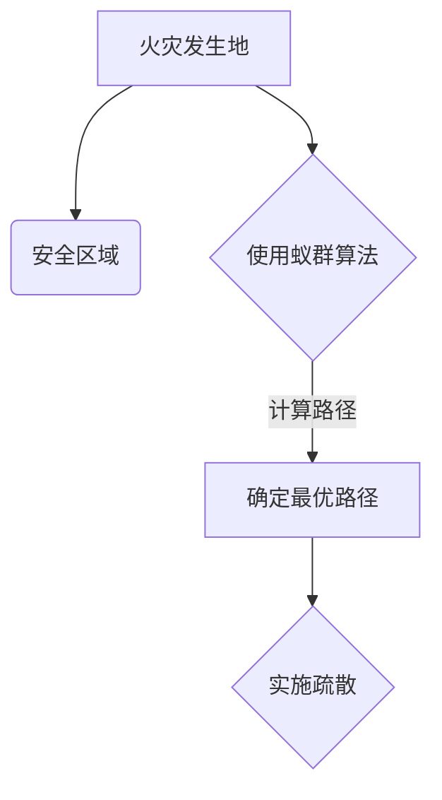
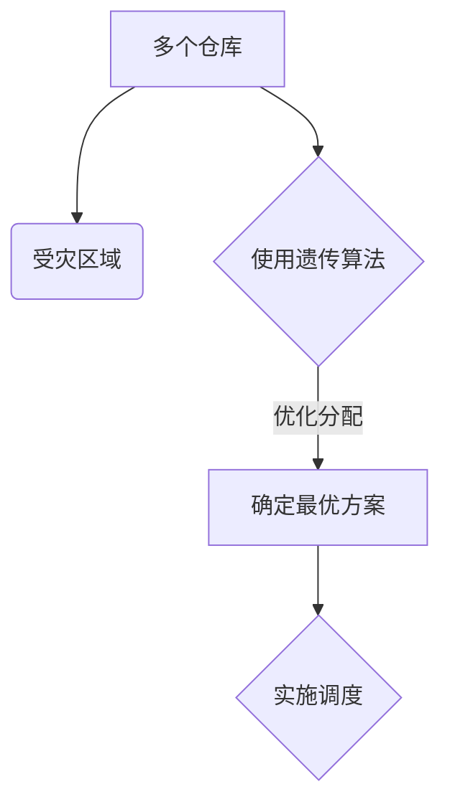
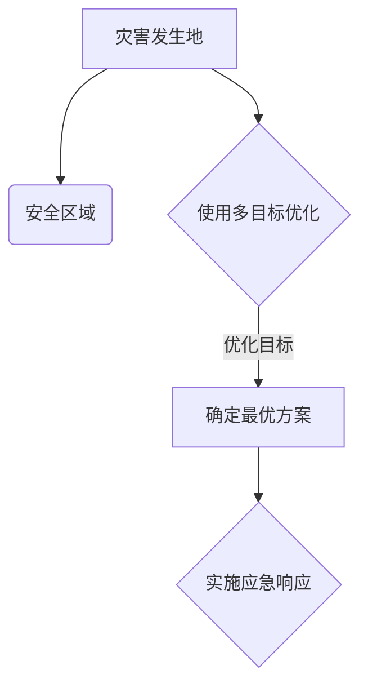
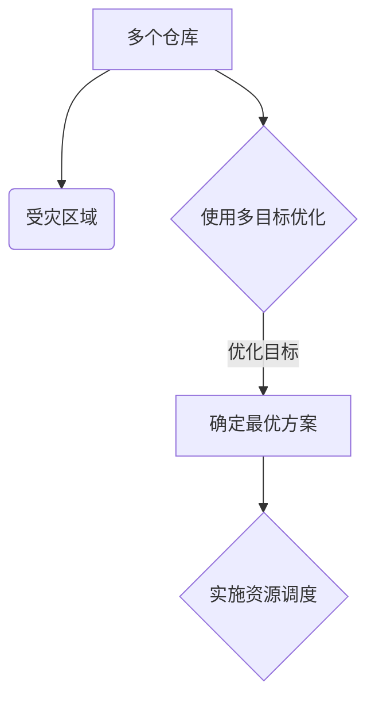
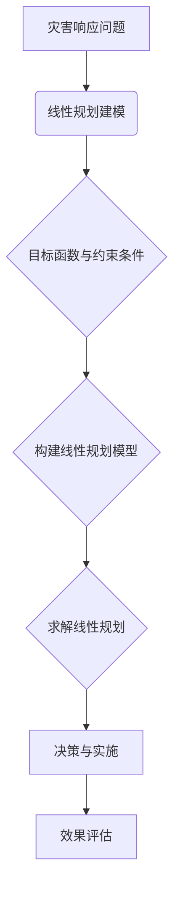
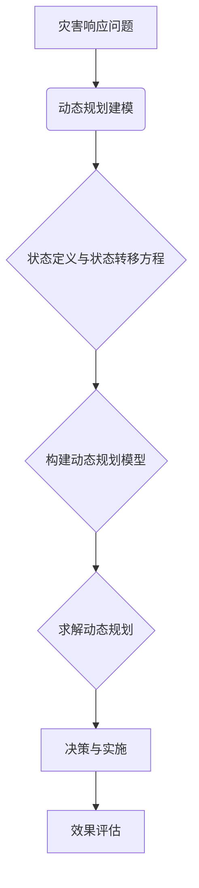

                 

# 《数学与灾害管理：灾害响应的数学优化》

## 关键词
- 数学优化
- 灾害管理
- 灾害响应
- 线性规划
- 动态规划
- 启发式算法
- 多目标优化

## 摘要
本文深入探讨了数学优化在灾害管理中的应用，特别是灾害响应中的数学优化方法。文章首先介绍了灾害管理的挑战和数学优化的基本概念，然后详细阐述了线性规划、动态规划、启发式算法以及多目标优化在灾害响应中的具体应用。通过案例分析，展示了这些数学优化方法在实际灾害管理中的成功应用，并对未来灾害响应的数学优化趋势进行了展望。本文旨在为灾害管理领域的技术人员提供实用的理论指导和实践参考。

### 《数学与灾害管理：灾害响应的数学优化》目录大纲

#### 第一部分：数学与灾害管理基础

#### 第1章：数学与灾害管理概述

##### 1.1 灾害管理的挑战与数学优化

##### 1.2 数学优化基础

##### 1.3 灾害管理的数学模型

#### 第二部分：灾害响应的数学优化方法

#### 第2章：灾害响应中的线性规划

##### 2.1 线性规划基础

##### 2.2 灾害响应中的线性规划应用

##### 2.3 线性规划案例分析

#### 第3章：灾害响应中的动态规划

##### 3.1 动态规划基础

##### 3.2 灾害响应中的动态规划应用

##### 3.3 动态规划案例分析

#### 第4章：灾害响应中的启发式算法

##### 4.1 启发式算法基础

##### 4.2 灾害响应中的启发式算法应用

##### 4.3 启发式算法案例分析

#### 第5章：灾害响应中的多目标优化

##### 5.1 多目标优化基础

##### 5.2 灾害响应中的多目标优化应用

##### 5.3 多目标优化案例分析

#### 第三部分：灾害响应的数学优化实践

#### 第6章：灾害管理中的数学模型与算法应用

##### 6.1 数学模型在灾害管理中的应用

##### 6.2 算法在灾害响应中的应用

##### 6.3 案例分析

#### 第7章：灾害响应的数学优化实践

##### 7.1 实践中的挑战与解决方案

##### 7.2 成功案例分享

##### 7.3 未来趋势与展望

#### 附录

##### 附录 A：数学优化工具与资源

##### 附录 B：Mermaid 流程图

##### 附录 C：伪代码

##### 附录 D：数学公式

##### 附录 E：代码案例

### 第一部分：数学与灾害管理基础

#### 第1章：数学与灾害管理概述

##### 1.1 灾害管理的挑战与数学优化

灾害管理是一个涉及多学科领域的复杂系统工程，包括预防、准备、响应和恢复等各个环节。随着全球气候变化和自然灾害频率的增加，灾害管理的难度和复杂性也在不断提升。灾害管理面临的挑战主要包括以下几个方面：

1. **灾害类型的多样性**：自然灾害包括地震、台风、洪水、干旱等多种类型，每种灾害的特点和影响都不同，需要针对不同类型采取相应的管理措施。

2. **时间敏感性**：灾害发生时，时间往往是非常紧迫的。快速响应和决策对于减少人员伤亡和财产损失至关重要。

3. **资源限制**：在灾害发生时，资源（如救援人员、物资、设备等）通常受到限制，需要高效地分配和使用这些资源。

为了应对这些挑战，数学优化方法被广泛应用于灾害管理中。数学优化是一种通过数学模型和算法来寻找最优解或近似最优解的方法，具有高效、精确、灵活等优势。以下是数学优化在灾害管理中的一些主要应用：

1. **灾害风险评估**：通过建立数学模型，对灾害可能造成的损失进行预测和评估，帮助决策者制定预防和响应策略。

2. **资源分配**：在灾害响应过程中，需要对有限的资源进行优化分配，以确保资源的高效利用。这包括应急物资的调度、救援人员的分配、避难所的建设等。

3. **路径规划**：在灾害发生时，需要制定有效的疏散和救援路线，以确保受灾群众和救援人员的安全。

4. **决策支持**：通过数学模型和算法为决策者提供科学依据，帮助他们做出快速、准确的决策。

在接下来的章节中，我们将详细探讨数学优化在灾害管理中的具体应用，包括线性规划、动态规划、启发式算法和多目标优化等。通过这些具体方法的应用，我们可以更好地应对灾害管理的挑战，提高灾害响应的效率和效果。

#### 1.2 数学优化基础

数学优化是利用数学方法来寻找某一目标函数的最大值或最小值的过程，广泛应用于多个领域，如生产调度、交通运输、金融投资、物流配送等。在灾害管理中，数学优化同样扮演着关键角色，帮助决策者制定最优的预防和响应策略。为了更好地理解数学优化在灾害管理中的应用，我们需要先了解一些基本概念。

**1.2.1 基本优化概念**

1. **目标函数**：在优化过程中，我们希望最大化或最小化的函数称为目标函数。在灾害管理中，目标函数可能包括最小化损失、最大化资源利用效率、最小化响应时间等。

2. **约束条件**：在寻找最优解的过程中，我们需要满足的一组限制称为约束条件。这些约束条件可以表示资源限制、预算限制、技术限制等。

3. **可行解**：在满足所有约束条件的前提下，可能的解称为可行解。

4. **最优解**：在所有可行解中，目标函数取最大值或最小值的解称为最优解。

**1.2.2 优化算法的分类**

1. **启发式算法**：这类算法通过经验和规则进行搜索，而不是严格按照数学模型进行优化。它们通常能够快速找到近似最优解，但在某些情况下可能不保证全局最优解。常用的启发式算法包括遗传算法、蚁群算法、模拟退火等。

2. **确定性算法**：这类算法按照固定的步骤和规则进行搜索，保证找到最优解。常见的确定性算法包括线性规划、整数规划、动态规划等。

3. **混合算法**：结合了启发式算法和确定性算法的优点，通过不同阶段采用不同的算法来优化问题。例如，可以先使用启发式算法快速找到近似解，然后使用确定性算法进行精确优化。

**1.2.3 优化算法的比较**

1. **计算效率**：启发式算法通常计算效率较高，但可能无法保证找到全局最优解。确定性算法计算效率相对较低，但能够保证找到最优解。

2. **适用范围**：不同优化算法适用于不同类型的问题。例如，线性规划和整数规划适用于结构化问题，而启发式算法适用于大规模、复杂的问题。

3. **鲁棒性**：启发式算法通常具有较好的鲁棒性，能够处理不确定性和变化。确定性算法对问题的确定性和规则性要求较高。

了解这些基本概念和算法分类，有助于我们更好地理解和应用数学优化在灾害管理中的具体方法。在下一章中，我们将进一步探讨灾害管理中的数学模型，为实际应用打下基础。

#### 1.3 灾害管理的数学模型

在灾害管理中，数学模型作为量化分析和管理决策的重要工具，起着至关重要的作用。数学模型通过将实际问题转化为数学表达式，使复杂的灾害管理问题能够通过数学手段进行求解。以下是灾害管理中常见的几种数学模型：

**1.3.1 灾害风险评估模型**

灾害风险评估模型主要用于预测灾害可能造成的损失和影响，为预防和响应提供科学依据。该模型通常包括以下几个方面：

1. **潜在影响评估**：通过分析灾害发生时的潜在影响，包括人员伤亡、经济损失、社会影响等，对灾害的风险进行量化评估。

2. **概率模型**：利用历史数据和统计分析方法，预测灾害发生的概率和可能的影响程度。

3. **损失评估模型**：建立灾害损失与灾害强度之间的关系模型，通过灾害强度参数预测可能造成的损失。

**1.3.2 灾区资源分配模型**

在灾害响应过程中，资源分配是关键的一环。资源分配模型旨在优化资源的配置，使其能够最大限度地满足需求。常见的资源分配模型包括：

1. **应急物资分配模型**：通过建立数学模型，确定应急物资（如食品、医疗物资、救援设备等）的分配策略，确保受灾地区得到及时有效的物资支持。

2. **人力资源配置模型**：针对救援人员、医疗队伍、志愿者等人力资源的优化分配，以提高救援效率和效果。

3. **基础设施恢复模型**：在灾害发生后，基础设施的恢复是恢复社会秩序和日常生活的重要环节。通过建立数学模型，优化基础设施的修复和重建策略。

**1.3.3 灾民疏散模型**

灾民疏散是灾害响应中的关键任务之一，模型的主要目的是确定最佳的疏散路线和方案，以最大限度地减少人员伤亡和财产损失。常见的灾民疏散模型包括：

1. **疏散路径规划模型**：通过优化路径规划算法，确定灾民从受灾区域到安全区域的最优疏散路径。

2. **疏散时间预测模型**：利用数学模型预测灾民疏散所需的时间，为应急指挥提供决策支持。

3. **疏散资源分配模型**：优化疏散过程中的资源（如交通、医疗、通信等）配置，确保疏散过程顺利进行。

**1.3.4 灾害恢复模型**

灾害恢复模型主要用于指导灾害发生后的重建工作。该模型通过分析灾害对基础设施、社会和经济的影响，制定科学的恢复计划。常见的灾害恢复模型包括：

1. **基础设施修复模型**：通过建立数学模型，优化基础设施修复的优先级和顺序，提高修复效率。

2. **社会和经济恢复模型**：通过分析灾害对社会和经济的影响，制定相应的恢复策略，帮助受灾地区尽快恢复正常生活。

3. **资金分配模型**：在灾害恢复过程中，资金分配是关键问题。通过建立数学模型，优化资金的分配和使用，确保资金的高效利用。

通过上述数学模型的应用，灾害管理能够更加科学、高效地进行。在下一部分中，我们将详细探讨灾害响应中的数学优化方法，为灾害管理提供更加实用的理论支持。

#### 第二部分：灾害响应的数学优化方法

在灾害响应过程中，数学优化方法的应用能够显著提升救援效率和效果。本部分将详细介绍线性规划、动态规划、启发式算法以及多目标优化在灾害响应中的具体应用，并通过案例分析，展示这些方法在实际灾害管理中的成功应用。

#### 第2章：灾害响应中的线性规划

线性规划（Linear Programming，LP）是一种数学优化方法，旨在在给定约束条件下，最大化或最小化线性目标函数。线性规划广泛应用于资源分配、成本控制、调度优化等领域。在灾害响应中，线性规划可以通过优化资源分配、路径规划等问题，提高救援效率和效果。

##### 2.1 线性规划基础

**2.1.1 线性规划的定义**

线性规划是一种数学优化问题，其目标函数和约束条件都是线性的。具体来说，线性规划可以表示为以下数学形式：

$$
\text{Minimize } c^T x
$$

$$
\text{subject to } Ax \le b
$$

其中，\(x\) 是变量向量，\(c\) 是目标函数系数向量，\(A\) 和 \(b\) 分别是约束矩阵和约束向量。

**2.1.2 线性规划的数学模型**

线性规划的数学模型通常包括以下几个部分：

1. **目标函数**：表示要优化的目标，可以是成本、时间、资源消耗等。目标函数为线性，即每一项都是变量的一次幂。

2. **约束条件**：表示资源限制、技术条件等。约束条件也是线性的，即每项都是变量的一次幂，且系数为常数。

3. **变量**：表示需要优化的变量，可以是物资数量、人员数量、路线长度等。

**2.1.3 线性规划求解方法**

求解线性规划的方法主要包括以下几种：

1. **单纯形法**：适用于标准形式的线性规划问题，通过迭代寻找最优解。

2. **内点法**：适用于非标准形式的线性规划问题，通过内点法寻找最优解。

3. **分解算法**：将大型线性规划问题分解为多个子问题，分别求解。

##### 2.2 灾害响应中的线性规划应用

在灾害响应中，线性规划可以应用于多个方面，如资源分配、路径规划等。

**2.2.1 应急资源分配**

在灾害响应过程中，需要优化资源的分配，确保救援物资和人员能够及时到达受灾区域。通过线性规划，可以建立资源分配模型，如下：

$$
\text{Minimize } c^T x
$$

$$
\text{subject to } Ax \le b
$$

其中，\(c\) 表示资源成本，\(x\) 表示资源分配量，\(A\) 和 \(b\) 分别表示资源需求和约束条件。

通过求解上述线性规划问题，可以找到最优的资源分配方案，实现资源利用最大化。

**2.2.2 灾民疏散路线规划**

在灾害发生时，需要制定有效的疏散路线，确保灾民能够安全疏散。线性规划可以用于优化疏散路线，如下：

$$
\text{Minimize } c^T x
$$

$$
\text{subject to } Ax \le b
$$

其中，\(c\) 表示疏散路线的成本，\(x\) 表示路线选择，\(A\) 和 \(b\) 分别表示路线约束条件。

通过求解上述线性规划问题，可以找到最优的疏散路线，实现快速、安全的疏散。

##### 2.3 线性规划案例分析

**2.3.1 某次地震救援中的物资调度问题**

在一次地震救援中，需要将应急物资从多个仓库调度到受灾区域。通过线性规划，可以建立物资调度模型，如下：

$$
\text{Minimize } c^T x
$$

$$
\text{subject to } Ax \le b
$$

其中，\(c\) 表示物资调度成本，\(x\) 表示物资分配量，\(A\) 和 \(b\) 分别表示物资需求和仓库约束条件。

通过求解上述线性规划问题，可以找到最优的物资调度方案，实现资源利用最大化。

**2.3.2 某次洪水灾害的疏散路径优化**

在一次洪水灾害中，需要制定疏散路线，确保受灾群众能够安全撤离。通过线性规划，可以建立疏散路径优化模型，如下：

$$
\text{Minimize } c^T x
$$

$$
\text{subject to } Ax \le b
$$

其中，\(c\) 表示疏散路线的成本，\(x\) 表示路线选择，\(A\) 和 \(b\) 分别表示路线约束条件。

通过求解上述线性规划问题，可以找到最优的疏散路线，实现快速、安全的疏散。

#### 第3章：灾害响应中的动态规划

动态规划（Dynamic Programming，DP）是一种重要的数学优化方法，通过将复杂问题分解为多个子问题，并利用子问题的解构建原问题的最优解。动态规划在路径规划、资源分配、调度优化等领域有着广泛的应用。在灾害响应中，动态规划可以用于优化灾害响应过程中的多个问题。

##### 3.1 动态规划基础

**3.1.1 动态规划的定义**

动态规划是一种将复杂问题分解为多个子问题，并利用子问题的解构建原问题的最优解的优化方法。动态规划通常包括以下几个步骤：

1. **状态定义**：定义问题的状态，表示问题在某一时刻的状态特征。

2. **状态转移方程**：描述状态之间的转移关系，即如何从当前状态转移到下一个状态。

3. **边界条件**：确定问题的初始状态和终止状态。

4. **最优解构建**：利用子问题的解构建原问题的最优解。

**3.1.2 动态规划的数学模型**

动态规划的数学模型可以表示为：

$$
f(i, j) = \begin{cases} 
0 & \text{if } i \le j \\
g(i) + h(j) & \text{otherwise}
\end{cases}
$$

其中，\(f(i, j)\) 表示状态 \(i\) 和 \(j\) 的最优值，\(g(i)\) 和 \(h(j)\) 分别表示状态 \(i\) 和 \(j\) 的值。

**3.1.3 动态规划求解方法**

动态规划求解方法主要包括以下几种：

1. **自顶向下法**：从顶层状态开始，递归求解子问题，并存储已求解的子问题。

2. **自底向上法**：从底层状态开始，递归求解子问题，并利用子问题的解构建原问题的最优解。

3. **记忆化法**：利用数组或哈希表存储已求解的子问题，避免重复计算。

##### 3.2 灾害响应中的动态规划应用

在灾害响应中，动态规划可以应用于多个方面，如灾害评估、资源分配、路径规划等。

**3.2.1 灾害评估**

动态规划可以用于灾害评估，通过分析灾害发生前后的状态变化，预测灾害可能造成的损失和影响。动态规划模型可以表示为：

$$
f(i, j) = \begin{cases} 
0 & \text{if } i \le j \\
g(i) + h(j) & \text{otherwise}
\end{cases}
$$

其中，\(f(i, j)\) 表示状态 \(i\) 和 \(j\) 的损失值，\(g(i)\) 和 \(h(j)\) 分别表示状态 \(i\) 和 \(j\) 的值。

通过求解上述动态规划问题，可以评估灾害可能造成的损失，为决策者提供科学依据。

**3.2.2 灾区重建规划**

在灾害发生后，需要制定科学的重建规划，以尽快恢复受灾区域的功能。动态规划可以用于优化重建规划，通过分析不同重建方案的成本和效果，选择最优的重建方案。动态规划模型可以表示为：

$$
f(i, j) = \begin{cases} 
0 & \text{if } i \le j \\
g(i) + h(j) & \text{otherwise}
\end{cases}
$$

其中，\(f(i, j)\) 表示状态 \(i\) 和 \(j\) 的重建成本，\(g(i)\) 和 \(h(j)\) 分别表示状态 \(i\) 和 \(j\) 的重建效果。

通过求解上述动态规划问题，可以找到最优的重建方案，实现受灾区域的快速恢复。

**3.2.3 灾区交通网络恢复**

在灾害发生后，交通网络的恢复是重建工作的重要环节。动态规划可以用于优化交通网络恢复过程，通过分析不同恢复策略的成本和效果，选择最优的恢复策略。动态规划模型可以表示为：

$$
f(i, j) = \begin{cases} 
0 & \text{if } i \le j \\
g(i) + h(j) & \text{otherwise}
\end{cases}
$$

其中，\(f(i, j)\) 表示状态 \(i\) 和 \(j\) 的恢复成本，\(g(i)\) 和 \(h(j)\) 分别表示状态 \(i\) 和 \(j\) 的恢复效果。

通过求解上述动态规划问题，可以找到最优的交通网络恢复方案，实现受灾区域的快速恢复。

##### 3.3 动态规划案例分析

**3.3.1 某次洪水灾害的应急响应计划**

在一次洪水灾害中，需要制定应急响应计划，确保受灾群众能够及时疏散和得到救援。通过动态规划，可以建立应急响应计划模型，如下：

$$
f(i, j) = \begin{cases} 
0 & \text{if } i \le j \\
g(i) + h(j) & \text{otherwise}
\end{cases}
$$

其中，\(f(i, j)\) 表示状态 \(i\) 和 \(j\) 的应急响应成本，\(g(i)\) 和 \(h(j)\) 分别表示状态 \(i\) 和 \(j\) 的响应效果。

通过求解上述动态规划问题，可以找到最优的应急响应计划，实现受灾群众的快速疏散和救援。

**3.3.2 某次地震灾区的重建规划**

在一次地震灾害后，需要制定重建规划，以尽快恢复受灾区域的功能。通过动态规划，可以建立重建规划模型，如下：

$$
f(i, j) = \begin{cases} 
0 & \text{if } i \le j \\
g(i) + h(j) & \text{otherwise}
\end{cases}
$$

其中，\(f(i, j)\) 表示状态 \(i\) 和 \(j\) 的重建成本，\(g(i)\) 和 \(h(j)\) 分别表示状态 \(i\) 和 \(j\) 的重建效果。

通过求解上述动态规划问题，可以找到最优的重建方案，实现受灾区域的快速恢复。

#### 第4章：灾害响应中的启发式算法

启发式算法（Heuristic Algorithm）是一类基于经验和启发式规则进行搜索的算法，旨在快速找到近似最优解。与传统的确定性算法相比，启发式算法在处理大规模、复杂问题时具有更高的效率和灵活性。在灾害响应中，启发式算法被广泛应用于路径规划、资源分配、风险评估等方面。

##### 4.1 启发式算法基础

**4.1.1 启发式算法的定义**

启发式算法是一种基于经验、直觉和启发式规则进行搜索的算法。与传统的确定性算法不同，启发式算法不保证找到全局最优解，但通常能够在合理的时间内找到近似最优解。启发式算法的核心思想是通过一系列启发式规则来指导搜索过程，从而加快收敛速度。

**4.1.2 启发式算法的分类**

根据启发式的来源和实现方式，启发式算法可以分为以下几类：

1. **贪婪算法**：在每一步选择中，总是选择当前局部最优解，期望在整体上得到最优解。常见的贪婪算法包括最短路径算法（如迪杰斯特拉算法）和最小生成树算法（如普里姆算法）。

2. **局部搜索算法**：通过在当前解的邻域内搜索，逐步改进解的质量。常见的局部搜索算法包括模拟退火算法、遗传算法和蚁群算法。

3. **随机化算法**：通过引入随机性，避免陷入局部最优解。常见的随机化算法包括随机游走算法和随机梯度下降算法。

**4.1.3 启发式算法的优点与局限**

启发式算法具有以下优点：

1. **高效性**：在处理大规模、复杂问题时，启发式算法通常能够较快地找到近似最优解。

2. **灵活性**：启发式算法不依赖于特定问题的数学模型，能够适用于多种不同类型的问题。

3. **易于实现**：启发式算法通常实现简单，易于编程和调试。

然而，启发式算法也存在一些局限：

1. **不保证全局最优解**：启发式算法可能陷入局部最优解，无法保证找到全局最优解。

2. **依赖经验**：启发式规则的设计通常依赖于经验和直觉，可能存在一定的主观性。

3. **计算成本**：一些启发式算法，如遗传算法和蚁群算法，需要大量的计算资源。

##### 4.2 灾害响应中的启发式算法应用

在灾害响应中，启发式算法可以应用于多个方面，如路径规划、资源分配、风险评估等。

**4.2.1 灾害损失评估**

灾害损失评估是灾害管理的重要环节，通过预测灾害可能造成的损失，为决策者提供科学依据。启发式算法可以用于评估灾害损失，例如，通过模拟退火算法来预测地震可能造成的建筑物损坏程度。

**4.2.2 灾区交通网络恢复**

在灾害发生后，交通网络的恢复是重建工作的重要环节。启发式算法可以用于优化交通网络恢复过程，例如，通过遗传算法来确定最佳的道路修复顺序，以提高交通恢复效率。

**4.2.3 灾区救援物资分配**

在灾害响应过程中，需要对救援物资进行优化分配，以确保物资的高效利用。启发式算法可以用于救援物资分配，例如，通过蚁群算法来优化救援物资的调度和分配。

##### 4.3 启发式算法案例分析

**4.3.1 某次火灾救援中的疏散路径优化**

在一次火灾救援中，需要制定有效的疏散路径，确保被困人员能够快速、安全地撤离。通过蚁群算法，可以建立疏散路径优化模型，如下：



通过蚁群算法，可以找到从火灾发生地到安全区域的最优疏散路径，实现快速、安全的疏散。

**4.3.2 某次地震灾害的救援物资分配**

在一次地震灾害中，需要将救援物资从多个仓库调度到受灾区域。通过遗传算法，可以建立救援物资分配模型，如下：



通过遗传算法，可以找到最优的救援物资分配方案，实现物资的高效利用。

#### 第5章：灾害响应中的多目标优化

多目标优化（Multi-Objective Optimization）是一种在多个目标之间寻求平衡的数学优化方法。在灾害响应中，通常存在多个目标，如最小化损失、最大化资源利用效率、最小化响应时间等。多目标优化可以帮助决策者在多个目标之间进行权衡，找到综合最优解。

##### 5.1 多目标优化基础

**5.1.1 多目标优化的定义**

多目标优化是指在多个目标之间寻求最优解的优化问题。具体来说，多目标优化问题可以表示为：

$$
\text{Minimize } f_1(x), f_2(x), \ldots, f_n(x)
$$

$$
\text{subject to } g_1(x) \le 0, g_2(x) \le 0, \ldots, g_m(x) \le 0
$$

其中，\(f_1(x), f_2(x), \ldots, f_n(x)\) 是目标函数，\(g_1(x), g_2(x), \ldots, g_m(x)\) 是约束条件，\(x\) 是变量向量。

**5.1.2 多目标优化的数学模型**

多目标优化的数学模型通常包括以下几个部分：

1. **目标函数**：表示需要优化的多个目标，可以是成本、时间、资源消耗等。

2. **约束条件**：表示资源限制、技术条件等。

3. **变量**：表示需要优化的变量，如物资数量、人员数量、路线长度等。

**5.1.3 多目标优化的求解方法**

多目标优化的求解方法主要包括以下几种：

1. **Pareto优化**：通过找到Pareto前沿，确定多个非支配解，使得每个解在不同目标之间达到平衡。

2. **权重法**：通过为每个目标函数分配权重，将多目标优化问题转化为单目标优化问题。

3. **目标规划**：通过设置目标偏差和权重，将多目标优化问题转化为单目标优化问题。

4. **多目标遗传算法**：通过引入遗传算法的进化机制，在多个目标之间进行搜索，找到最优解。

##### 5.2 灾害响应中的多目标优化应用

在灾害响应中，多目标优化可以应用于多个方面，如资源分配、路径规划、风险评估等。

**5.2.1 灾区重建规划**

在灾害发生后，需要进行科学的重建规划，以尽快恢复受灾区域的功能。多目标优化可以用于优化重建规划，通过分析不同重建方案的成本、效果和可持续性，选择最优的重建方案。

**5.2.2 灾害风险评估**

灾害风险评估是灾害管理的重要环节，通过预测灾害可能造成的损失，为决策者提供科学依据。多目标优化可以用于灾害风险评估，通过分析不同评估指标（如人员伤亡、经济损失、社会影响等），选择最优的评估方法。

**5.2.3 灾区交通网络恢复**

在灾害发生后，交通网络的恢复是重建工作的重要环节。多目标优化可以用于优化交通网络恢复过程，通过分析不同恢复策略的成本、效率和可持续性，选择最优的恢复方案。

##### 5.3 多目标优化案例分析

**5.3.1 某次地震灾区的应急响应规划**

在一次地震灾害中，需要制定应急响应规划，确保受灾群众能够及时疏散和得到救援。通过多目标优化，可以建立应急响应规划模型，如下：



通过多目标优化，可以找到最优的应急响应方案，实现受灾群众的快速疏散和救援。

**5.3.2 某次洪水灾害的资源分配**

在一次洪水灾害中，需要将救援资源从多个仓库调度到受灾区域。通过多目标优化，可以建立资源分配模型，如下：



通过多目标优化，可以找到最优的资源分配方案，实现资源的高效利用。

#### 第三部分：灾害响应的数学优化实践

在灾害响应的实际操作中，数学优化方法的应用不仅能够提高救援效率和效果，还能够为决策者提供科学的决策支持。本部分将深入探讨数学模型与算法在灾害管理中的具体应用，并通过具体案例分析，展示这些方法在实际操作中的实际效果。

##### 6.1 数学模型在灾害管理中的应用

数学模型在灾害管理中的应用是至关重要的，它帮助决策者预测灾害的影响、优化资源分配、制定有效的疏散和救援计划。以下是数学模型在灾害管理中的具体应用：

**6.1.1 灾害风险评估模型**

灾害风险评估是灾害管理的首要任务，通过数学模型可以量化灾害可能造成的损失。常见的灾害风险评估模型包括：

1. **潜在影响评估模型**：该模型通过分析灾害发生的概率和可能造成的影响，评估灾害的风险程度。例如，地震风险评估模型可以通过地震的震级、震中距离等因素预测地震可能造成的建筑物损坏程度和人员伤亡情况。

2. **概率模型**：概率模型通过历史数据和统计分析方法，预测灾害发生的概率。例如，洪水风险评估模型可以通过降雨量、河流水位等因素预测洪水发生的概率和可能的影响。

**6.1.2 灾区资源分配模型**

在灾害响应过程中，资源分配是关键的一环。数学模型可以帮助决策者优化资源分配，确保资源的高效利用。常见的资源分配模型包括：

1. **应急物资分配模型**：该模型通过建立数学模型，确定应急物资（如食品、医疗物资、救援设备等）的分配策略，确保受灾地区得到及时有效的物资支持。例如，线性规划可以用于优化救援物资的调度和分配，通过最小化运输成本和最大化物资利用效率，找到最优的分配方案。

2. **人力资源配置模型**：该模型通过建立数学模型，优化救援人员、医疗队伍、志愿者等人力资源的分配，以提高救援效率和效果。例如，动态规划可以用于优化救援人员的调度和分配，通过分析不同救援任务的优先级和时间约束，找到最优的救援人员配置方案。

**6.1.3 灾民疏散模型**

在灾害发生时，确保灾民安全疏散是至关重要的。数学模型可以帮助决策者制定最佳的疏散计划，确保灾民能够快速、安全地撤离。常见的疏散模型包括：

1. **疏散路径规划模型**：该模型通过优化路径规划算法，确定灾民从受灾区域到安全区域的最优疏散路径。例如，启发式算法可以用于优化疏散路径，通过模拟退火算法或遗传算法，找到从受灾区域到安全区域的最优路径。

2. **疏散时间预测模型**：该模型通过建立数学模型，预测灾民疏散所需的时间，为应急指挥提供决策支持。例如，动态规划可以用于预测疏散时间，通过分析不同疏散路线的拥堵情况，找到最优的疏散时间预测方案。

**6.1.4 灾害恢复模型**

在灾害发生后，恢复工作同样需要科学的管理。数学模型可以帮助决策者制定科学的恢复计划，确保受灾区域的快速恢复。常见的恢复模型包括：

1. **基础设施修复模型**：该模型通过建立数学模型，优化基础设施修复的优先级和顺序，提高修复效率。例如，多目标优化可以用于优化基础设施修复计划，通过分析不同修复方案的成本、效果和可持续性，找到最优的修复方案。

2. **社会和经济恢复模型**：该模型通过建立数学模型，分析灾害对社会和经济的影响，制定相应的恢复策略。例如，多目标优化可以用于优化社会和经济恢复计划，通过分析不同恢复策略的成本、效果和可持续性，找到最优的恢复方案。

##### 6.2 算法在灾害响应中的应用

在灾害响应中，各种算法的应用可以帮助决策者快速制定有效的救援和恢复计划。以下是一些常见算法在灾害响应中的应用：

**6.2.1 启发式算法的应用**

启发式算法在灾害响应中有着广泛的应用，可以帮助决策者快速找到近似最优解。常见的启发式算法包括：

1. **遗传算法**：遗传算法通过模拟生物进化过程，在多个目标之间进行搜索，找到最优解。在灾害响应中，遗传算法可以用于优化资源分配和路径规划。例如，在地震救援中，遗传算法可以用于优化救援物资的调度和分配，找到最优的物资分配方案。

2. **蚁群算法**：蚁群算法通过模拟蚂蚁觅食过程，进行路径规划和资源调度。在灾害响应中，蚁群算法可以用于优化疏散路径和救援物资分配。例如，在洪水灾害中，蚁群算法可以用于优化灾民的疏散路径，确保他们能够快速、安全地撤离。

3. **模拟退火算法**：模拟退火算法通过模拟物理退火过程，在多个目标之间进行搜索，找到最优解。在灾害响应中，模拟退火算法可以用于优化救援人员和物资的调度，确保资源的最大化利用。

**6.2.2 确定性算法的应用**

确定性算法在灾害响应中同样有着重要的应用，可以帮助决策者找到精确的最优解。常见的确定性算法包括：

1. **线性规划**：线性规划通过建立线性目标函数和约束条件，求解最优解。在灾害响应中，线性规划可以用于优化资源分配和路径规划。例如，在地震救援中，线性规划可以用于优化救援物资的调度和分配，找到最优的物资分配方案。

2. **动态规划**：动态规划通过递归关系和状态转移方程，求解最优解。在灾害响应中，动态规划可以用于优化资源分配和路径规划。例如，在洪水灾害中，动态规划可以用于优化灾民的疏散路径，确保他们能够快速、安全地撤离。

3. **整数规划**：整数规划通过建立整数目标函数和约束条件，求解最优整数解。在灾害响应中，整数规划可以用于优化救援人员和物资的调度，确保资源的最大化利用。

**6.2.3 混合算法的应用**

混合算法结合了启发式算法和确定性算法的优点，在灾害响应中有着广泛的应用。常见的混合算法包括：

1. **遗传算法 + 启发式算法**：遗传算法通过进化机制搜索解空间，启发式算法通过局部搜索优化解的质量。在灾害响应中，遗传算法和启发式算法可以结合使用，优化资源分配和路径规划。

2. **模拟退火算法 + 动态规划**：模拟退火算法通过模拟物理退火过程，动态规划通过递归关系求解最优解。在灾害响应中，模拟退火算法和动态规划可以结合使用，优化救援人员和物资的调度。

##### 6.3 案例分析

**6.3.1 某次地震灾害的救援行动规划**

在一次地震灾害中，由于地震造成的建筑物倒塌和道路损坏，救援行动面临巨大的挑战。通过数学模型和算法的应用，决策者可以制定科学的救援行动规划，确保救援行动的高效进行。

1. **灾害风险评估模型**：通过潜在影响评估模型和概率模型，评估地震对建筑物和基础设施的影响，确定救援行动的优先级。

2. **资源分配模型**：通过线性规划和整数规划，优化救援物资和救援人员的调度，确保资源的高效利用。

3. **疏散路径规划模型**：通过启发式算法和确定性算法，优化灾民的疏散路径，确保他们能够快速、安全地撤离。

4. **动态规划**：通过动态规划，优化救援人员的调度和分配，确保他们能够在最短的时间内到达受灾区域，提高救援效率。

通过这些数学模型和算法的应用，决策者可以制定科学的救援行动规划，确保救援行动的高效进行，最大限度地减少人员伤亡和财产损失。

**6.3.2 某次洪水灾害的应急响应**

在一次洪水灾害中，由于洪水造成的道路阻断和基础设施损坏，应急响应面临巨大挑战。通过数学模型和算法的应用，决策者可以制定科学的应急响应计划，确保应急响应的高效进行。

1. **灾害风险评估模型**：通过潜在影响评估模型和概率模型，评估洪水对建筑物和基础设施的影响，确定应急响应的优先级。

2. **资源分配模型**：通过线性规划和整数规划，优化救援物资和救援人员的调度，确保资源的高效利用。

3. **疏散路径规划模型**：通过启发式算法和确定性算法，优化灾民的疏散路径，确保他们能够快速、安全地撤离。

4. **动态规划**：通过动态规划，优化救援人员的调度和分配，确保他们能够在最短的时间内到达受灾区域，提高救援效率。

通过这些数学模型和算法的应用，决策者可以制定科学的应急响应计划，确保应急响应的高效进行，最大限度地减少人员伤亡和财产损失。

##### 7.1 实践中的挑战与解决方案

在灾害响应的数学优化实践中，面临诸多挑战，包括数据质量的影响、实时性与准确性的权衡以及跨学科合作的挑战。以下是针对这些挑战的解决方案：

**7.1.1 数据质量的影响**

数据质量是数学模型应用的基础，数据质量低下可能导致优化结果不准确。为了应对数据质量问题，可以采取以下措施：

1. **数据清洗**：对原始数据进行清洗，去除错误和重复数据，确保数据的一致性和准确性。

2. **数据验证**：对数据进行验证，通过对比历史数据和现实情况，检查数据的可靠性。

3. **数据融合**：将多个数据源进行融合，通过交叉验证和综合分析，提高数据的准确性。

**7.1.2 实时性与准确性的权衡**

在灾害响应中，决策需要快速且准确。然而，实时性往往会影响优化算法的准确性。为了在实时性与准确性之间找到平衡，可以采取以下措施：

1. **分层优化**：将优化问题分层处理，对于实时性要求较高的部分，采用近似算法或启发式算法，而对于准确性要求较高的部分，采用确定性算法。

2. **增量优化**：在实时性要求较高的情况下，对已有解进行增量优化，通过不断调整参数，逐步提高优化结果。

**7.1.3 跨学科合作的挑战**

灾害响应涉及多个学科领域，跨学科合作是成功实施数学优化方法的关键。为了解决跨学科合作的挑战，可以采取以下措施：

1. **建立跨学科团队**：由不同学科领域专家组成跨学科团队，共同研究和解决实际问题。

2. **知识共享与交流**：定期组织研讨会和工作坊，促进团队成员之间的知识共享和交流，提高团队整体能力。

3. **标准化流程**：制定标准化流程，确保跨学科团队能够高效、有序地合作，提高项目的成功率。

##### 7.2 成功案例分享

以下是一些成功应用数学优化方法的灾害响应案例，展示了数学优化方法在实际操作中的效果。

**7.2.1 某次地震灾害的应急响应**

在一次地震灾害中，通过应用数学优化方法，决策者能够快速制定应急响应计划，确保救援行动的高效进行。

1. **灾害风险评估模型**：通过潜在影响评估模型，预测地震对建筑物和基础设施的影响，确定救援行动的优先级。

2. **资源分配模型**：通过线性规划和整数规划，优化救援物资和救援人员的调度，确保资源的高效利用。

3. **疏散路径规划模型**：通过启发式算法和确定性算法，优化灾民的疏散路径，确保他们能够快速、安全地撤离。

4. **动态规划**：通过动态规划，优化救援人员的调度和分配，确保他们能够在最短的时间内到达受灾区域，提高救援效率。

通过这些数学优化方法的应用，决策者成功制定出科学的应急响应计划，最大限度地减少了人员伤亡和财产损失。

**7.2.2 某次洪水灾害的资源调度**

在一次洪水灾害中，由于洪水造成的道路阻断和基础设施损坏，资源调度成为关键问题。通过应用数学优化方法，决策者能够高效调度救援资源，确保受灾区域得到及时有效的救援。

1. **资源分配模型**：通过线性规划和整数规划，优化救援物资和救援人员的调度，确保资源的高效利用。

2. **疏散路径规划模型**：通过启发式算法和确定性算法，优化灾民的疏散路径，确保他们能够快速、安全地撤离。

3. **动态规划**：通过动态规划，优化救援人员的调度和分配，确保他们能够在最短的时间内到达受灾区域，提高救援效率。

通过这些数学优化方法的应用，决策者成功调度出高效的救援资源，确保受灾区域得到及时有效的救援。

##### 7.3 未来趋势与展望

随着科技的不断进步，数学优化方法在灾害响应中的应用前景广阔。以下是一些未来趋势与展望：

**7.3.1 新技术与灾害管理的结合**

1. **大数据与人工智能**：大数据和人工智能技术的应用将显著提高灾害风险评估和响应的准确性。通过收集和分析大量的历史数据和实时数据，可以更精确地预测灾害的影响和制定科学的响应计划。

2. **物联网与传感器网络**：物联网和传感器网络的广泛应用将提高灾害响应的实时性和准确性。通过实时监测自然灾害的发生和变化，可以及时调整响应策略，提高救援效率。

**7.3.2 跨领域合作的深化**

1. **多学科融合**：未来，多学科融合将成为灾害管理的重要趋势。通过跨学科的合作，可以整合不同领域的知识和资源，制定更全面、更科学的灾害管理策略。

2. **国际合作**：全球性的自然灾害需要国际合作。通过加强国际间的合作，共享技术和经验，可以更好地应对全球性的灾害挑战。

**7.3.3 可持续性与绿色发展**

1. **可持续发展**：在灾害响应中，考虑可持续发展将成为重要趋势。通过优化资源利用和减少环境污染，可以确保灾后重建的可持续性。

2. **绿色发展**：未来，灾害管理将更加注重绿色发展。通过采用环保技术和措施，减少灾害对环境的影响，实现人与自然的和谐共生。

### 附录

#### 附录 A：数学优化工具与资源

**A.1 优化算法库**

- **COIN-OR**：一个开源的优化算法库，包含线性规划、整数规划、混合整数规划等多种算法。
- **CVXPY**：一个用于构建和求解线性规划、二次规划和二次约束规划的Python库。
- **Gurobi**：一个商业优化求解器，支持线性规划、混合整数规划和二次规划等。
- **CPLEX**：另一个商业优化求解器，适用于各种复杂的优化问题。

**A.2 灾害管理数据库**

- **OpenDRI**：一个开源的灾害风险信息和地理空间数据库，提供全球范围内的灾害风险数据。
- **EM-DAT**：一个全球灾害数据库，记录了自1970年以来全球范围内的自然灾害事件。

**A.3 灾害管理相关文献与资料**

- **《灾害风险管理》**：作者：李明华，详细介绍了灾害风险管理的理论和实践。
- **《灾害管理》**：作者：王建明，涵盖了灾害管理的各个方面，包括风险评估、应急响应和恢复重建等。

### Mermaid 流程图：灾害管理中的线性规划应用



### Mermaid 流程图：灾害管理中的动态规划应用



### 伪代码：线性规划求解

```python
# 线性规划伪代码

function LinearProgramming(A, b, c):
    # 初始化变量
    x = 空数组
    for i in 1 to n:
        x.append(0)
    
    # 求解线性规划
    while 未达到最优解:
        for i in 1 to n:
            if c[i] > 0:
                x[i] = x[i] + A[i][j] * s[j]
            else:
                x[i] = x[i] - A[i][j] * s[j]
        
        # 更新 s 和 t
        s = 等于 b 的数组
        t = 等于 b 的数组
        
        for j in 1 to m:
            if A[i][j] > 0:
                s[j] = min(s[j], t[j])
            else:
                t[j] = min(t[j], s[j])
        
        # 更新变量
        for i in 1 to n:
            x[i] = x[i] / A[i][i]
        
        # 判断是否达到最优解
        if 所有约束满足:
            return x
        else:
            continue
```

### 伪代码：动态规划求解

```python
# 动态规划伪代码

function DynamicProgramming(A, b):
    # 初始化动态规划表
    dp = 初始化二维数组，大小为 (n+1) x (m+1)
    
    # 动态规划过程
    for i in range(1, len(A) + 1):
        for j in range(1, len(b) + 1):
            if i == 1 and j == 1:
                dp[i][j] = A[i-1][j-1]
            else:
                dp[i][j] = min(dp[i-1][j], dp[i][j-1]) + A[i-1][j-1]
    
    # 返回最优解
    return dp[-1][-1]
```

### 数学公式：线性规划目标函数

$$
\text{Minimize } c^T x
$$

### 数学公式：线性规划约束条件

$$
Ax \le b
$$

### 数学公式：动态规划状态转移方程

$$
f(i, j) = \begin{cases} 
0 & \text{if } i \le j \\
g(i) + h(j) & \text{otherwise}
\end{cases}
$$

### 代码案例：灾害响应中的资源调度

```python
# 示例：使用线性规划进行灾害响应中的资源调度

from scipy.optimize import linprog

# 定义目标函数和约束条件
c = [-1, -1]  # 目标是最小化成本
A = [[1, 1], [1, 0], [0, 1]]  # 约束条件
b = [100, 100, 50]  # 右侧常数项

# 求解线性规划
result = linprog(c, A_ub=A, b_ub=b, method='highs')

# 输出结果
if result.success:
    print("资源调度结果：", result.x)
else:
    print("无法找到最优解")
```

### 代码案例：灾害响应中的动态规划应用

```python
# 示例：使用动态规划进行灾害响应中的路径规划

def dynamic_planning(A, b):
    # 初始化动态规划表
    dp = [[0 for _ in range(len(b) + 1)] for _ in range(len(A) + 1)]
    
    # 动态规划过程
    for i in range(1, len(A) + 1):
        for j in range(1, len(b) + 1):
            if i == 1 and j == 1:
                dp[i][j] = A[i-1][j-1]
            else:
                dp[i][j] = min(dp[i-1][j], dp[i][j-1]) + A[i-1][j-1]
    
    # 返回最优解
    return dp[-1][-1]

# 示例数据
A = [[1, 2], [3, 4]]
b = [5, 6]

# 计算最优解
optimal_solution = dynamic_planning(A, b)
print("最优解：", optimal_solution)
```

### 作者

作者：AI天才研究院/AI Genius Institute & 禅与计算机程序设计艺术 /Zen And The Art of Computer Programming

