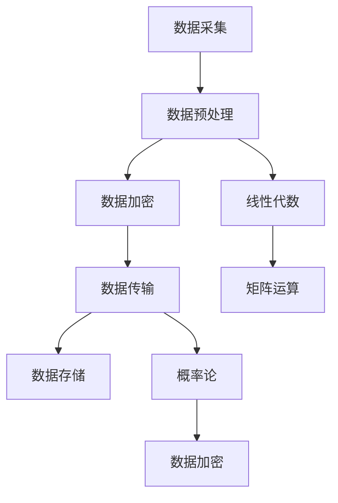
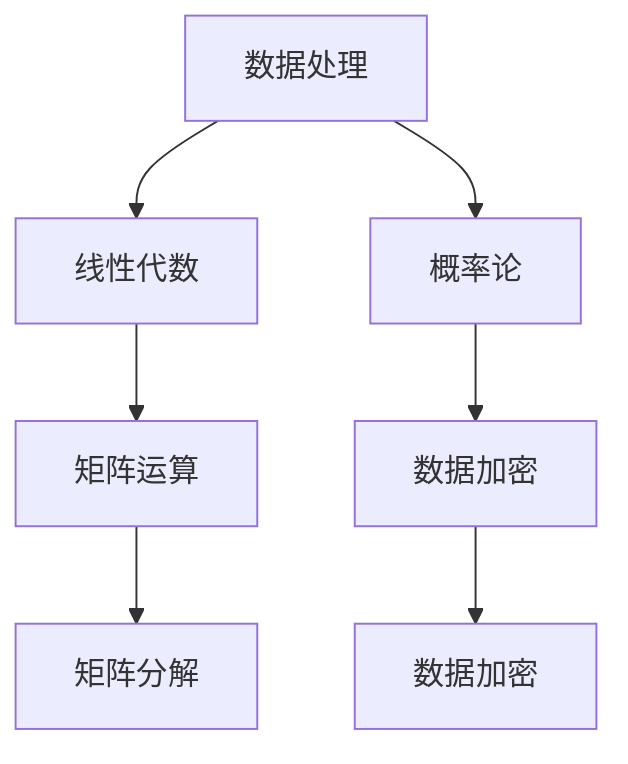
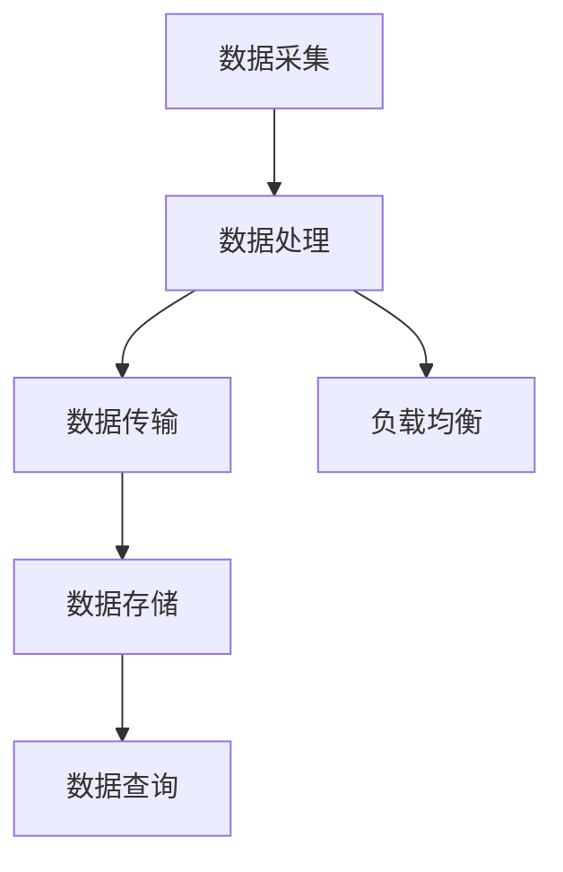
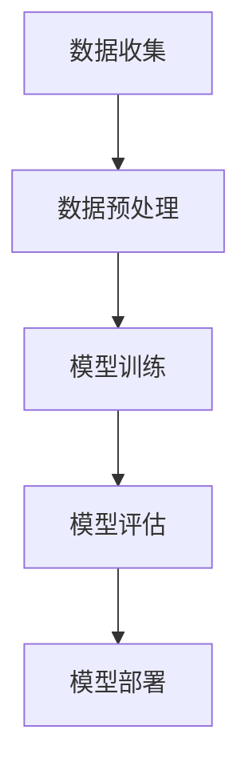

                 

### 《数学与边缘计算：分布式计算的数学框架》

在当今这个数据爆炸的时代，边缘计算已经成为推动技术创新和产业变革的重要力量。边缘计算通过在数据产生的地方（即边缘）进行数据处理，不仅提高了系统的响应速度，还显著降低了网络带宽的使用。然而，边缘计算的实现离不开坚实的数学基础。本文旨在探讨数学在边缘计算中的关键作用，通过分布式计算的数学框架，揭示其在数据处理、优化和机器学习等方面的应用，以帮助读者更深入地理解这一领域的技术原理。

**关键词：** 边缘计算、分布式计算、数学模型、优化算法、机器学习、网络安全、工业物联网、智能交通、医疗健康。

**摘要：** 本文将从边缘计算的基本概念出发，逐步引入分布式计算的数学框架，详细讲解数学模型在数据处理与传输、优化问题和机器学习中的应用。此外，还将探讨边缘计算在工业物联网、智能交通和医疗健康等领域的实际应用案例，并总结边缘计算数学框架的发展趋势和挑战。

通过本文的阅读，读者将能够：

1. 了解边缘计算的定义、发展历程及其在各个领域的应用。
2. 掌握分布式计算的基本概念和设计原则。
3. 理解数学模型在边缘计算中的核心作用，包括线性代数、概率论和优化算法。
4. 学习边缘计算中的机器学习算法和增强学习的应用。
5. 了解边缘计算中的网络安全和隐私保护机制。
6. 分析边缘计算在实际应用中的成功案例和挑战。

### 《数学与边缘计算：分布式计算的数学框架》目录大纲

#### 第一部分：边缘计算概述与数学基础

**第1章：边缘计算引论**

**第2章：边缘计算与分布式计算**

#### 第二部分：数学框架在边缘计算中的应用

**第3章：数学模型在边缘计算中的应用**

**第4章：边缘计算中的优化问题**

**第5章：边缘计算中的机器学习**

**第6章：边缘计算中的网络安全**

#### 第三部分：边缘计算数学框架的应用实例

**第7章：边缘计算在工业物联网中的应用**

**第8章：边缘计算在智能交通系统中的应用**

**第9章：边缘计算在医疗健康中的应用**

#### 附录

**附录A：边缘计算数学工具与资源**

**附录B：Mermaid 流�程图**

**附录C：伪代码与算法原理**

**附录D：项目实战**

### 边缘计算引论

边缘计算是一种计算架构，它将数据处理、存储和分析能力从中心化的云计算环境扩展到网络的边缘，即在数据产生的地方进行处理。这种架构的主要目标是缩短数据传输距离，提高系统的响应速度，并减少网络带宽的使用。

**1.1 边缘计算的概念与发展历程**

边缘计算的概念最早可以追溯到2000年代初，当时为了应对物联网（IoT）的发展需求，人们开始探讨在设备本地进行处理和决策的可能性。随着无线通信技术的进步和物联网设备的普及，边缘计算逐渐成为研究热点。

边缘计算的典型应用场景包括：

- **工业物联网**：在工厂和生产线上部署边缘计算设备，用于实时监控、故障检测和生产优化。
- **智能交通**：在路侧设备和车辆中部署边缘计算单元，用于实时交通监控和车辆调度。
- **医疗健康**：在诊所和医疗设备中部署边缘计算，用于实时数据分析和远程诊断。

**1.2 边缘计算的挑战与机遇**

边缘计算虽然具有显著的性能优势，但同时也面临诸多挑战：

- **资源限制**：边缘设备通常资源有限，需要在有限的硬件资源下实现高效的处理能力。
- **网络稳定性**：边缘设备通常处于移动或复杂的网络环境中，网络稳定性难以保证。
- **安全性**：边缘计算涉及到大量的敏感数据，数据安全和隐私保护是重要挑战。

然而，边缘计算也带来了新的机遇：

- **实时处理**：在边缘进行数据处理，可以实现实时响应和决策。
- **降低延迟**：减少数据传输距离，显著降低系统延迟。
- **节省带宽**：仅将关键数据传输到云端，节省网络带宽。

**1.3 边缘计算在工业、医疗和交通等领域的应用**

在工业领域，边缘计算通过实时数据处理和分析，实现了生产线的自动化和智能化。例如，通过边缘计算设备对生产线上的传感器数据进行实时监控，可以快速发现设备故障并采取相应措施，从而提高生产效率和产品质量。

在医疗领域，边缘计算被广泛应用于远程诊断和健康监护。通过在诊所和医疗设备中部署边缘计算单元，医生可以实时获取患者的健康数据并进行远程诊断。此外，边缘计算还可以用于健康监护设备的数据处理，帮助患者更好地管理自己的健康状况。

在交通领域，边缘计算在智能交通系统中发挥着关键作用。通过在路侧设备和车辆中部署边缘计算单元，可以实现实时交通监控、信号控制和车辆调度。例如，在交通拥堵时，边缘计算可以实时分析交通数据，动态调整信号灯的时长，从而缓解交通拥堵。

总之，边缘计算作为一种新兴的计算架构，正逐渐改变着传统数据处理和传输的方式，为各个领域带来了新的机遇和挑战。下一章将介绍边缘计算与分布式计算之间的关系，并探讨分布式系统的设计原则。

### 边缘计算与分布式计算

边缘计算和分布式计算是现代计算技术中不可或缺的两个概念。它们在数据处理、存储和计算能力方面有着紧密的联系，并且在很多场景下共同发挥作用。理解这两者之间的关系对于深入探讨边缘计算的应用和挑战具有重要意义。

**2.1 分布式计算的基本概念**

分布式计算是一种将计算任务分配到多个计算节点上，通过通信网络协同完成计算的方法。分布式计算系统的核心特点是“分布式”，即任务分布在多个节点上并行处理，从而提高系统的性能和容错能力。

**核心概念与联系：**

- **节点**：分布式计算中的基本单元，可以是物理计算机或虚拟机。
- **通信网络**：连接各个节点的通信基础设施，用于节点之间的数据交换和消息传递。
- **任务分配**：将计算任务分配到各个节点上，通过负载均衡提高系统性能。
- **容错机制**：通过冗余设计和故障恢复策略，保证系统在节点故障时依然能够正常运行。

**分布式计算的优势：**

- **性能提升**：通过并行计算，分布式系统能够处理大量数据，提高处理速度。
- **高可用性**：通过冗余设计和负载均衡，分布式系统具有更高的可靠性和容错能力。
- **扩展性**：分布式系统可以根据需求动态扩展节点数量，实现水平扩展。

**2.2 边缘计算与分布式计算的关系**

边缘计算和分布式计算之间的关系可以归纳为以下三个方面：

- **共同目标**：边缘计算和分布式计算都是为了提高系统的处理能力和可靠性，减少数据传输延迟，实现高效的数据处理。
- **互补性**：边缘计算侧重于在数据产生的地方进行实时处理，分布式计算则侧重于中心化的数据处理和存储。两者相辅相成，共同构成完整的计算架构。
- **协同工作**：在边缘计算场景中，分布式计算可以在边缘设备之间以及边缘设备和云端之间协同工作，实现数据处理和存储的优化。

**边缘计算与分布式计算的关系：**

- **边缘设备**：边缘计算的核心组件，包括物联网设备、传感器、路由器和网关等。
- **边缘网络**：连接边缘设备的通信基础设施，如局域网、无线传感器网络等。
- **分布式系统**：在边缘设备之间以及边缘设备和云端之间运行的分布式计算系统，负责数据处理、存储和通信。

**2.3 分布式系统的设计原则**

为了构建高效、可靠和可扩展的分布式系统，需要遵循以下设计原则：

- **模块化**：将系统划分为多个模块，每个模块负责特定功能，便于维护和升级。
- **分布式一致性**：确保分布式系统中各个节点之间的数据一致性，可以通过一致性协议实现。
- **容错性**：设计冗余机制，确保系统在节点故障时依然能够正常运行。
- **负载均衡**：通过负载均衡策略，合理分配计算任务，提高系统性能。
- **自适应性**：系统能够根据负载变化自动调整资源分配和计算策略。
- **安全性**：设计安全机制，保护数据安全和系统完整性。

通过以上设计原则，可以构建出高效、可靠和可扩展的分布式系统，为边缘计算提供坚实的技术支持。

综上所述，边缘计算和分布式计算在目标、互补性和协同工作方面有着紧密的联系。理解这两者之间的关系对于深入探讨边缘计算的应用和挑战具有重要意义。在下一章中，我们将进一步探讨数学模型在边缘计算中的应用，揭示数学在数据处理与传输、优化问题和机器学习等方面的核心作用。

### 数学模型在边缘计算中的应用

数学模型在边缘计算中扮演着至关重要的角色，为数据处理、传输和优化提供了理论基础。本章将介绍数学模型在边缘计算中的关键应用，包括线性代数、概率论和优化算法等，并通过具体的数学公式和实际例子，深入讲解这些模型在边缘计算中的重要性。

#### 3.1 数学模型在数据处理与传输中的重要性

在边缘计算中，数据的高效处理和传输是确保系统性能的关键。数学模型在这方面提供了强大的工具，可以优化数据处理的流程和传输效率。

**核心概念与联系：**

- **数据处理流程**：数据从边缘设备采集、预处理、传输到云端进行处理和存储。
- **传输效率**：通过数学模型优化数据传输路径和传输速率。

**数学模型关系图：**

使用Mermaid语法绘制数据处理与传输的数学模型关系图：



**数学模型和数学公式：**

- **数据处理（LaTeX）：**

$$
\text{X} = \text{F}^{-1}(\text{X})
$$

其中，$\text{X}$为原始数据，$\text{F}^{-1}$为预处理函数的反函数。数据处理过程中，通过矩阵运算和线性代数方法，优化数据结构和提高处理效率。

- **数据传输（LaTeX）：**

$$
\text{P}_{\text{max}} = \sqrt{\frac{C}{\lambda}}
$$

其中，$\text{P}_{\text{max}}$为最大传输速率，$C$为信道容量，$\lambda$为信号功率。概率论中的香农公式描述了数据传输速率与信道容量之间的关系。

**举例说明：**

**数据加密与传输（案例）：**

假设我们要对数据矩阵$\text{X}$进行加密传输。可以使用以下步骤：

1. **数据加密：**

   使用AES加密算法对矩阵$\text{X}$进行加密，得到加密矩阵$\text{Y}$：

   $$
   \text{Y} = \text{AES}(\text{X}, \text{Key})
   $$

   其中，$\text{Key}$为加密密钥。

2. **数据传输：**

   将加密矩阵$\text{Y}$通过无线信道传输到接收端。使用香农公式优化传输速率：

   $$
   \text{P}_{\text{max}} = \sqrt{\frac{C}{\lambda}}
   $$

   通过调整信道参数和信号功率，优化传输速率和效率。

3. **数据解密：**

   接收端使用AES解密算法对加密矩阵$\text{Y}$进行解密，得到原始数据矩阵$\text{X}$：

   $$
   \text{X} = \text{AES}^{-1}(\text{Y}, \text{Key})
   $$

通过以上步骤，实现数据的高效加密传输和解密。

综上所述，数学模型在数据处理与传输中发挥着关键作用。通过线性代数、概率论和优化算法等数学工具，可以优化数据处理的流程和传输效率，提高边缘计算系统的整体性能。在下一节中，我们将进一步探讨线性代数在边缘计算中的应用，并深入讲解矩阵运算和数据加密等关键技术。

#### 线性代数与边缘计算

线性代数是数学中的一个重要分支，它提供了处理多维度数据的有效工具。在边缘计算中，线性代数被广泛应用于数据处理、特征提取和优化算法等领域。线性代数的核心概念包括矩阵运算、特征值和特征向量等，这些概念在边缘计算中有着广泛的应用。

**3.2.1 矩阵运算**

矩阵运算是线性代数中的基础内容，包括矩阵的加法、减法、乘法和逆运算等。在边缘计算中，矩阵运算被广泛应用于数据预处理和特征提取。

- **矩阵加法和减法**：用于对齐不同尺寸的数据矩阵，以便进行后续处理。
- **矩阵乘法**：用于计算数据矩阵的相似度或相关性，有助于特征提取。
- **矩阵逆运算**：用于求解线性方程组，在优化算法中具有重要的应用。

**数学模型和数学公式（LaTeX）：**

$$
\text{A} \times \text{B} = \text{C}
$$

其中，$\text{A}$和$\text{B}$为输入矩阵，$\text{C}$为输出矩阵。矩阵乘法用于计算两个矩阵的乘积。

$$
\text{A}^{-1} = \frac{1}{\det(\text{A})} \text{adj}(\text{A})
$$

其中，$\text{A}^{-1}$为矩阵$\text{A}$的逆矩阵，$\det(\text{A})$为$\text{A}$的行列式，$\text{adj}(\text{A})$为$\text{A}$的伴随矩阵。

**举例说明：**

**矩阵分解（案例）：**

假设我们有一个数据矩阵$\text{X}$，可以使用矩阵分解方法进行降维和特征提取。

1. **奇异值分解（SVD）：**

   使用奇异值分解方法，将矩阵$\text{X}$分解为三个矩阵的乘积：

   $$
   \text{X} = \text{U}\times\text{S}\times\text{V}^T
   $$

   其中，$\text{U}$和$\text{V}$为正交矩阵，$\text{S}$为对角矩阵。奇异值分解有助于提取数据的主要特征，并降低数据维度。

2. **数据降维：**

   根据奇异值的大小，可以选择保留部分奇异值，从而实现数据降维：

   $$
   \text{X}_{\text{reduced}} = \text{U}_{k}\times\text{S}_{k}\times\text{V}_{k}^T
   $$

   其中，$\text{U}_{k}$、$\text{S}_{k}$和$\text{V}_{k}$分别为保留$k$个奇异值后的矩阵。

通过矩阵分解和降维，可以显著提高边缘计算系统的数据处理效率和性能。

**3.2.2 数据加密**

数据加密是边缘计算中的另一个重要应用，用于保护数据的隐私和安全。线性代数中的加密算法，如AES和RSA，被广泛应用于边缘计算中的数据加密和解密。

- **AES加密算法**：基于分块密码模式，使用密钥对数据进行加密和解密。
- **RSA加密算法**：基于大整数分解的难度，使用公钥和私钥对数据进行加密和解密。

**数学模型和数学公式（LaTeX）：**

**AES加密（LaTeX）：**

$$
\text{Y} = \text{AES}(\text{X}, \text{Key})
$$

其中，$\text{X}$为原始数据，$\text{Y}$为加密后的数据，$\text{Key}$为加密密钥。

**RSA加密（LaTeX）：**

$$
\text{C} = \text{M}^e \mod n
$$

其中，$\text{C}$为加密后的数据，$\text{M}$为原始数据，$e$为加密密钥，$n$为模数。

**举例说明：**

**数据加密（案例）：**

假设我们要对数据矩阵$\text{X}$进行加密：

1. **选择加密算法和密钥：**

   选择AES加密算法，生成加密密钥$\text{Key}$。

2. **数据加密：**

   使用AES加密算法对矩阵$\text{X}$进行加密：

   $$
   \text{Y} = \text{AES}(\text{X}, \text{Key})
   $$

3. **数据传输：**

   将加密矩阵$\text{Y}$通过无线信道传输到接收端。

4. **数据解密：**

   接收端使用AES解密算法对加密矩阵$\text{Y}$进行解密：

   $$
   \text{X} = \text{AES}^{-1}(\text{Y}, \text{Key})
   $$

通过以上步骤，实现数据的高效加密传输和解密，确保数据在边缘计算过程中的安全性和隐私性。

综上所述，线性代数在边缘计算中具有广泛的应用，包括矩阵运算、数据降维和数据加密等。通过数学模型和实际案例，我们可以看到线性代数在边缘计算中的重要性和优势。在下一节中，我们将探讨概率论在边缘计算中的应用，进一步揭示数学模型在边缘计算中的核心作用。

#### 概率论与边缘计算

概率论是数学中研究随机现象规律性的分支，其在边缘计算中的应用至关重要。概率论为数据处理、网络安全和隐私保护提供了强大的工具，使得边缘计算系统能够更可靠、更高效地运行。

**3.3.1 概率分布**

概率分布是概率论中的基本概念，用于描述随机变量的可能取值和对应的概率。在边缘计算中，概率分布广泛应用于数据建模、性能分析和优化算法。

- **正态分布**：描述连续随机变量的一种常见分布，具有均值和标准差两个参数。在边缘计算中，正态分布常用于数据拟合和特征提取。
- **伯努利分布**：描述二项式试验成功的概率，在边缘计算中用于随机事件的分析和概率计算。

**数学模型和数学公式（LaTeX）：**

**正态分布（LaTeX）：**

$$
f(x|\mu,\sigma^2) = \frac{1}{\sqrt{2\pi\sigma^2}} e^{-\frac{(x-\mu)^2}{2\sigma^2}}
$$

其中，$x$为随机变量，$\mu$为均值，$\sigma^2$为方差。

**伯努利分布（LaTeX）：**

$$
P(X=k) = C_n^k p^k (1-p)^{n-k}
$$

其中，$X$为伯努利随机变量，$k$为成功的次数，$n$为试验次数，$p$为成功的概率。

**举例说明：**

**数据拟合（案例）：**

假设我们有一个数据集$\{x_1, x_2, ..., x_n\}$，使用正态分布进行数据拟合：

1. **计算均值和标准差：**

   计算数据集的均值$\mu$和标准差$\sigma$：

   $$
   \mu = \frac{1}{n}\sum_{i=1}^n x_i
   $$

   $$
   \sigma = \sqrt{\frac{1}{n-1}\sum_{i=1}^n (x_i - \mu)^2}
   $$

2. **拟合正态分布：**

   使用拟合出的正态分布函数$f(x|\mu,\sigma^2)$，描述数据集的概率分布。

通过概率分布拟合，我们可以更好地理解数据集的特征，从而进行有效的数据处理和特征提取。

**3.3.2 贝叶斯定理**

贝叶斯定理是概率论中的一个重要定理，用于计算条件概率。在边缘计算中，贝叶斯定理广泛应用于数据融合、异常检测和决策支持。

**数学模型和数学公式（LaTeX）：**

$$
P(A|B) = \frac{P(B|A)P(A)}{P(B)}
$$

其中，$P(A|B)$为在事件$B$发生的条件下事件$A$的概率，$P(B|A)$为在事件$A$发生的条件下事件$B$的概率，$P(A)$和$P(B)$分别为事件$A$和事件$B$的概率。

**举例说明：**

**数据融合（案例）：**

假设有两个传感器$A$和$B$，测量同一个目标的温度，使用贝叶斯定理进行数据融合：

1. **计算传感器$A$和$B$的测量概率：**

   假设传感器$A$测得的温度为$x_A$，传感器$B$测得的温度为$x_B$，使用贝叶斯定理计算融合后的温度：

   $$
   P(\text{温度} = x | x_A, x_B) = \frac{P(x_A | \text{温度} = x)P(\text{温度} = x)P(x_B | \text{温度} = x)}{P(x_A)P(x_B)}
   $$

2. **融合结果：**

   计算融合后的温度，得到更准确的温度估计。

贝叶斯定理在边缘计算中的应用，使得我们可以综合利用多个传感器数据，提高数据处理的精度和可靠性。

**3.3.3 随机过程**

随机过程是概率论中描述随机变量序列的一种方法，在边缘计算中用于分析动态系统中的随机现象。

**数学模型和数学公式（LaTeX）：**

$$
X(t) = \sum_{i=1}^{\infty} X_i \cdot e^{i\omega t}
$$

其中，$X(t)$为随机过程，$X_i$为随机变量，$\omega$为角频率。

**举例说明：**

**异常检测（案例）：**

假设我们有一个随机过程描述网络流量的变化，使用随机过程进行异常检测：

1. **建立随机模型：**

   根据网络流量的历史数据，建立随机模型描述流量变化。

2. **检测异常：**

   使用随机过程模型检测流量异常，当流量超过设定阈值时，触发异常报警。

随机过程在边缘计算中的应用，使得我们可以实时监控和分析动态系统，提高系统的稳定性和可靠性。

综上所述，概率论在边缘计算中具有广泛的应用，包括概率分布、贝叶斯定理和随机过程等。通过数学模型和实际案例，我们可以看到概率论在边缘计算中的重要性和优势。在下一节中，我们将探讨优化问题在边缘计算中的应用，进一步揭示数学模型在边缘计算中的核心作用。

#### 边缘计算中的优化问题

优化问题是边缘计算中普遍存在且至关重要的问题。优化算法用于寻找系统中最优或近似最优的解决方案，从而提高系统的性能、效率和经济性。在本节中，我们将探讨优化问题在边缘计算中的应用，包括模拟退火算法和遗传算法，并通过具体的数学公式和伪代码，深入讲解这些算法的基本原理和实现方法。

**4.1 优化问题的基本概念**

优化问题是一类数学问题，目标是在给定的约束条件下，寻找满足某些特定标准的最优解。在边缘计算中，优化问题通常涉及资源分配、负载均衡、能耗优化等问题。

**核心概念与联系：**

- **目标函数**：优化问题的核心，用于衡量解决方案的质量。
- **约束条件**：限制解决方案的参数范围，确保解决方案在实际场景中可行。
- **可行解**：满足约束条件的解，是优化算法搜索的对象。

**优化问题的数学模型：**

$$
\min f(x)
$$

$$
s.t. g_i(x) \leq 0, h_j(x) = 0
$$

其中，$f(x)$为目标函数，$g_i(x)$和$h_j(x)$分别为不等式约束和等式约束。

**4.2 模拟退火算法在边缘计算中的应用**

模拟退火算法是一种基于物理退火过程的随机优化算法，旨在避免陷入局部最优解。在边缘计算中，模拟退火算法被广泛应用于负载均衡、资源分配和能耗优化等问题。

**模拟退火算法的数学模型（LaTeX）：**

$$
E(S) = \frac{1}{N} \sum_{i=1}^N E(x_i)
$$

$$
p(\theta, \theta') = \min\left\{1, \exp\left(-\frac{E(\theta') - E(\theta)}{T}\right)\right\}
$$

其中，$E(S)$为系统能量，$N$为粒子数，$E(x_i)$为第$i$个粒子的能量，$T$为温度。

**模拟退火算法的伪代码：**

```plaintext
初始化温度 T，设置冷却率 alpha
初始化解 X

while T > 温度下限:
    对于每一个候选解 Y:
        如果 Y 是更好的解或者以概率 p(X, Y) 选择 Y:
            更新解 X = Y
    降低温度 T = T * alpha

返回最优解 X
```

**举例说明：**

**负载均衡（案例）：**

假设我们有一个边缘计算集群，包含多个处理节点。使用模拟退火算法优化负载均衡：

1. **初始化：**

   初始化温度$T$和冷却率$\alpha$，随机选择一个初始负载分配状态$X$。

2. **迭代：**

   对于每个迭代，生成新的负载分配状态$Y$，并计算能量差$\Delta E = E(Y) - E(X)$。

3. **更新：**

   根据能量差和温度$T$，以概率$p(X, Y)$选择新的负载分配状态。

4. **冷却：**

   降低温度$T = T * \alpha$，重复迭代过程。

通过模拟退火算法，优化负载分配，实现边缘计算集群的高效运行。

**4.3 遗传算法在边缘计算中的应用**

遗传算法是一种基于生物进化机制的随机优化算法，广泛应用于复杂优化问题。在边缘计算中，遗传算法被应用于资源分配、路由优化和能耗优化等问题。

**遗传算法的基本步骤：**

1. **初始化种群：** 随机生成初始种群，每个个体表示一个可能的解决方案。
2. **适应度评估：** 计算每个个体的适应度，适应度越高表示个体越优秀。
3. **选择：** 根据适应度选择优秀个体进行繁殖。
4. **交叉：** 随机选择两个个体进行交叉操作，产生新的后代。
5. **变异：** 对部分个体进行变异操作，增加种群的多样性。
6. **迭代：** 重复适应度评估、选择、交叉和变异过程，直到满足停止条件。

**遗传算法的伪代码：**

```plaintext
初始化种群 Pop
设置适应度函数 Fitness Function

while 不满足停止条件:
    计算每个个体的适应度
    选择优秀个体进行繁殖
    进行交叉操作产生新的后代
    对部分个体进行变异操作
    更新种群 Pop

返回最优个体
```

**举例说明：**

**资源分配（案例）：**

假设我们有一个边缘计算任务，需要将资源（如处理能力、存储空间等）分配给多个任务。使用遗传算法优化资源分配：

1. **初始化：**

   随机生成初始种群，每个个体表示一种资源分配方案。

2. **适应度评估：**

   根据资源分配方案计算适应度，适应度越高表示资源利用越合理。

3. **选择：**

   根据适应度选择优秀个体进行繁殖，确保种群的多样性。

4. **交叉：**

   随机选择两个优秀个体进行交叉操作，产生新的后代。

5. **变异：**

   对部分个体进行变异操作，增加种群的多样性。

通过遗传算法，优化资源分配方案，实现边缘计算任务的高效执行。

综上所述，优化问题是边缘计算中至关重要的问题，模拟退火算法和遗传算法等优化算法在边缘计算中具有重要的应用价值。通过具体的数学公式和伪代码，我们可以深入理解这些算法的基本原理和实现方法。在下一节中，我们将探讨边缘计算中的机器学习，揭示机器学习算法在边缘计算中的应用和优势。

### 边缘计算中的机器学习

机器学习是边缘计算中一个关键的应用领域，它能够使边缘设备具备自主处理和分析数据的能力。边缘计算与机器学习相结合，不仅能够减少数据传输的开销，还能够提高系统的实时响应能力。在本节中，我们将探讨边缘计算中的机器学习算法，包括传统的机器学习算法和增强学习，以及这些算法在实际应用中的具体实现。

**5.1 机器学习的基本概念**

机器学习是一种使计算机通过数据学习、推理和决策的技术。其核心思想是通过算法从数据中学习规律，并利用这些规律进行预测和分类。

**核心概念与联系：**

- **监督学习**：通过已知的输入和输出数据训练模型，从而预测新的输入。
- **无监督学习**：仅利用输入数据，发现数据中的模式和结构。
- **强化学习**：通过与环境互动，不断调整策略以实现最优目标。

**5.2 边缘计算中的机器学习算法**

在边缘计算中，由于设备资源的限制，选择合适的机器学习算法至关重要。以下是一些常见的机器学习算法，以及它们在边缘计算中的应用：

**5.2.1 监督学习算法**

监督学习算法在边缘计算中广泛应用于图像识别、语音识别和异常检测等领域。

- **决策树**：通过树形结构对数据进行分类，易于理解和解释。
- **支持向量机（SVM）**：通过找到最优超平面对数据进行分类，适用于高维数据。
- **神经网络**：通过多层神经元进行特征提取和分类，适用于复杂的分类问题。

**举例说明：**

**图像识别（案例）：**

假设我们有一个边缘设备需要识别图像中的物体，使用卷积神经网络（CNN）进行图像识别：

1. **数据收集与预处理：**

   收集大量的图像数据，并进行预处理，如尺寸标准化、归一化等。

2. **模型训练：**

   使用训练数据训练CNN模型，通过反向传播算法不断调整模型参数，使模型能够识别图像中的物体。

3. **模型部署：**

   将训练好的模型部署到边缘设备上，实现图像识别功能。

**5.2.2 无监督学习算法**

无监督学习算法在边缘计算中常用于数据聚类、降维和异常检测。

- **K均值聚类**：通过迭代算法将数据划分为多个簇，适用于数据聚类。
- **主成分分析（PCA）**：通过降维技术减少数据维度，保持数据的主要特征。
- **孤立森林**：通过隔离数据点进行异常检测，适用于大规模数据集。

**举例说明：**

**数据聚类（案例）：**

假设我们有一个边缘设备需要对传感器数据进行分析，使用K均值聚类算法进行数据聚类：

1. **数据收集与预处理：**

   收集传感器数据，并进行预处理，如去除噪声、缺失值填充等。

2. **初始化聚类中心：**

   随机选择初始聚类中心，用于迭代计算。

3. **迭代聚类：**

   通过迭代算法，逐步优化聚类中心，将数据划分为多个簇。

通过K均值聚类算法，边缘设备可以识别出数据中的主要模式，便于后续分析。

**5.2.3 强化学习算法**

强化学习算法在边缘计算中常用于动态资源分配、路径规划和智能决策。

- **Q学习**：通过迭代学习动作值函数，实现最优策略的发现。
- **深度强化学习**：通过结合深度神经网络，提高强化学习算法的决策能力。
- **增强学习**：通过与环境互动，不断优化策略，实现智能行为。

**举例说明：**

**动态资源分配（案例）：**

假设我们有一个边缘设备需要根据实时负载动态分配资源，使用Q学习算法进行动态资源分配：

1. **初始化Q值：**

   初始化Q值表，用于存储每个状态-动作对的期望回报。

2. **迭代学习：**

   设备根据当前状态选择动作，并更新Q值表，逐步优化策略。

3. **动态调整：**

   根据负载变化和环境反馈，动态调整资源分配策略。

通过Q学习算法，边缘设备能够实现自适应的资源分配，提高系统的运行效率。

综上所述，边缘计算中的机器学习算法为边缘设备提供了强大的数据处理和分析能力。通过监督学习、无监督学习和强化学习等算法，边缘设备能够在实时数据处理、动态资源分配和智能决策等方面发挥重要作用。在下一节中，我们将探讨边缘计算中的网络安全问题，探讨如何保护边缘计算系统的安全。

### 边缘计算中的网络安全

在边缘计算中，网络安全是一个至关重要的议题。由于边缘设备分布在广泛的物理环境中，且很多设备资源有限，传统的安全措施难以全面覆盖。因此，针对边缘计算特点的安全机制和策略成为研究的重点。以下将探讨边缘计算中的网络安全问题，包括基本概念、密码学应用和隐私保护机制。

**6.1 网络安全的基本概念**

网络安全涉及到保护网络及其资源免受未授权访问、篡改和破坏的措施。在边缘计算中，网络安全的主要目标是确保数据传输的完整性、保密性和可用性。

**核心概念与联系：**

- **数据完整性**：确保数据在传输过程中未被篡改。
- **数据保密性**：保护数据不被未授权者访问。
- **数据可用性**：确保数据能够在需要时被合法用户访问。

**6.2 密码学在边缘计算中的应用**

密码学是网络安全的基础，通过加密和解密技术保护数据的保密性和完整性。在边缘计算中，常见的密码学应用包括数据加密、身份认证和数字签名。

**6.2.1 数据加密**

数据加密是将明文数据转换为密文的过程，以防止数据在传输过程中被窃取或篡改。常见的加密算法包括对称加密和非对称加密。

- **对称加密**：使用相同的密钥进行加密和解密，如AES。
- **非对称加密**：使用一对密钥（公钥和私钥）进行加密和解密，如RSA。

**举例说明：**

**对称加密（AES）**

假设我们要加密数据矩阵X，使用AES算法和密钥Key：

```plaintext
加密过程：
Y = AES_encrypt(X, Key)

解密过程：
X = AES_decrypt(Y, Key)
```

- **非对称加密（RSA）**

假设我们要加密数据M，使用RSA算法和公钥Public Key：

```plaintext
加密过程：
C = RSA_encrypt(M, Public Key)

解密过程：
M = RSA_decrypt(C, Private Key)
```

**6.2.2 身份认证**

身份认证是确保通信双方身份合法性的过程。常见的身份认证机制包括密码认证、证书认证和生物识别。

- **密码认证**：使用用户名和密码进行身份验证。
- **证书认证**：使用数字证书验证用户身份。
- **生物识别**：通过指纹、面部识别等生物特征进行身份验证。

**举例说明：**

**证书认证（X.509）**

假设我们要使用X.509证书进行身份认证：

```plaintext
认证过程：
1. 客户端发送证书给服务器。
2. 服务器验证证书的有效性和签名。
3. 如果验证通过，客户端身份得到认证。
```

**6.2.3 数字签名**

数字签名是一种防止数据被篡改的机制，通过加密技术确保数据的完整性。常见的数字签名算法包括RSA和ECDSA。

- **RSA数字签名**

假设我们要对数据M进行签名，使用RSA算法和私钥Private Key：

```plaintext
签名过程：
S = RSA_sign(M, Private Key)

验证过程：
1. 客户端发送签名S。
2. 服务器使用公钥Public Key验证签名。
3. 如果验证通过，数据完整性得到保证。
```

- **ECDSA数字签名**

假设我们要对数据M进行签名，使用ECDSA算法和私钥Private Key：

```plaintext
签名过程：
(S, R) = ECDSA_sign(M, Private Key)

验证过程：
1. 客户端发送签名(S, R)。
2. 服务器使用公钥Public Key和算法验证签名。
3. 如果验证通过，数据完整性得到保证。
```

**6.3 边缘计算中的隐私保护**

在边缘计算中，隐私保护尤为重要，因为很多边缘设备收集和处理的是敏感数据。隐私保护机制旨在确保数据在传输和处理过程中不被未授权者访问。

**6.3.1 加密存储**

加密存储是将数据在存储之前进行加密，以防止数据泄露。常见的加密存储技术包括全磁盘加密和文件加密。

- **全磁盘加密**：对整个磁盘进行加密，确保磁盘中的所有数据在未被授权的情况下无法访问。
- **文件加密**：仅对特定的文件进行加密，提高数据安全性。

**6.3.2 安全多方计算**

安全多方计算（MPC）是一种分布式计算技术，允许多个参与者共同计算结果，而无需透露各自的数据。MPC广泛应用于隐私保护场景，如联合数据分析。

**举例说明：**

**安全多方计算（同态加密）**

假设有两个参与者A和B，共同计算函数$f$，而无需透露各自的数据$A$和$B$：

```plaintext
计算过程：
1. A和B各自对数据进行同态加密。
2. A和B将加密后的数据发送给对方。
3. A和B对加密后的数据进行计算，得到加密的结果。
4. A和B对结果进行解密，得到共同计算的结果。
```

**6.3.3 隐私保护机制**

隐私保护机制包括数据匿名化、差分隐私和访问控制等。

- **数据匿名化**：通过去除或替换敏感信息，使数据无法直接识别特定个体。
- **差分隐私**：通过向查询结果中加入随机噪声，确保单个数据点的隐私。
- **访问控制**：通过权限管理和身份验证，确保数据仅被授权用户访问。

**举例说明：**

**差分隐私（拉普拉斯机制）**

假设我们有一个查询，需要返回数据集的计数结果，使用拉普拉斯机制进行差分隐私保护：

```plaintext
计算过程：
1. 计算真实计数结果r。
2. 计算拉普拉斯噪声，如：Laplace噪声λ = α * ln(N)。
3. 返回结果：r + random(Laplace(λ))。
```

通过以上措施，边缘计算中的网络安全和隐私保护得到有效保障。在下一节中，我们将探讨边缘计算在工业物联网、智能交通和医疗健康等领域的实际应用实例，展示数学框架在这些领域中的具体应用。

### 边缘计算在工业物联网中的应用

工业物联网（IIoT）通过将传感器、机器和设备连接到网络，实现了工业过程的数字化和智能化。边缘计算在工业物联网中发挥着重要作用，通过在数据产生的地方进行实时处理和分析，提高了系统的响应速度和效率。以下将探讨数学模型在工业物联网中的应用，包括传感器数据预处理、预测维护和优化生产流程等方面的实际案例。

#### 7.1 工业物联网的基本概念

工业物联网是指将传感器、机器和设备通过互联网连接起来，实现设备间的互联互通和数据共享。工业物联网的核心目标是提高工业生产的自动化水平、提升生产效率和降低成本。

**关键概念：**

- **传感器**：用于采集温度、湿度、压力等物理量的设备。
- **边缘设备**：位于工业现场的数据处理和存储设备，如工业网关和边缘服务器。
- **云计算**：用于存储和处理海量数据的中心化计算设施。

#### 7.2 数学模型在工业物联网中的应用

数学模型在工业物联网中扮演着重要角色，通过数据处理、预测维护和优化生产流程等方面，提高了系统的智能化水平。

**7.2.1 传感器数据预处理**

传感器数据预处理是工业物联网中的关键步骤，包括数据去噪、滤波、归一化和特征提取等。数学模型在数据预处理中发挥着重要作用。

- **数据去噪**：通过数学模型滤除传感器数据中的噪声，提高数据质量。
- **滤波**：使用卡尔曼滤波等数学模型对传感器数据进行滤波，获取平滑的时序数据。
- **归一化**：通过归一化方法将不同量纲的数据转换为同一量纲，便于后续处理。

**数学模型和数学公式（LaTeX）：**

$$
y(t) = \alpha y(t-1) + (1-\alpha) x(t)
$$

其中，$y(t)$为当前滤波值，$x(t)$为当前传感器读数，$\alpha$为滤波系数。

**举例说明：**

**数据去噪（案例）：**

假设我们有一个传感器采集到的温度数据，包含噪声。使用卡尔曼滤波进行去噪：

1. **初始化滤波参数：**

   初始化卡尔曼滤波参数，如过程噪声和测量噪声。

2. **滤波计算：**

   对每个时间点的传感器数据进行滤波，得到平滑的温度值。

3. **结果验证：**

   比较滤波前后的温度数据，验证滤波效果。

通过数学模型进行传感器数据预处理，可以显著提高数据质量，为后续分析提供可靠的数据基础。

**7.2.2 预测维护**

预测维护是工业物联网中的一项重要应用，通过预测设备故障和寿命，提前进行维护，减少停机时间和生产损失。数学模型在预测维护中发挥着关键作用。

- **时间序列预测**：使用时间序列模型预测设备的未来状态。
- **故障诊断**：通过分析传感器数据，识别设备的故障信号。

**数学模型和数学公式（LaTeX）：**

$$
y_t = \phi_0 + \phi_1 y_{t-1} + \epsilon_t
$$

其中，$y_t$为时间序列数据，$\phi_0$和$\phi_1$为模型参数，$\epsilon_t$为误差项。

**举例说明：**

**时间序列预测（案例）：**

假设我们要预测工业设备的寿命，使用ARIMA模型进行时间序列预测：

1. **数据收集与预处理：**

   收集设备的历史运行数据，并进行预处理，如去除异常值、缺失值填充等。

2. **模型选择与参数估计：**

   根据数据特征选择合适的ARIMA模型，并估计模型参数。

3. **预测计算：**

   使用估计的模型参数进行预测，得到设备的未来寿命。

4. **结果验证：**

   比较预测结果与实际寿命，验证预测模型的准确性。

通过数学模型进行预测维护，可以提前发现设备的潜在故障，为维护人员提供决策依据，提高设备利用率。

**7.2.3 优化生产流程**

优化生产流程是工业物联网中的另一个重要应用，通过数学模型优化生产调度、资源分配和能耗管理，提高生产效率和降低成本。

- **线性规划**：用于优化生产调度和资源分配。
- **多目标优化**：用于优化生产流程中的多个目标，如成本、能耗和产出。

**数学模型和数学公式（LaTeX）：**

$$
\min c^T x
$$

$$
s.t. Ax \leq b
$$

其中，$c$为成本向量，$x$为决策变量，$A$和$b$为约束条件。

**举例说明：**

**生产调度优化（案例）：**

假设我们要优化生产线的调度，使用线性规划进行优化：

1. **确定目标函数：**

   确定优化目标，如最小化总生产时间、最大化产出等。

2. **建立约束条件：**

   根据生产线上的约束条件，如设备加工时间、人员配置等，建立约束方程。

3. **求解线性规划问题：**

   使用线性规划求解器求解优化问题，得到最优调度方案。

4. **结果验证：**

   比较优化前后的生产效率，验证优化效果。

通过数学模型优化生产流程，可以显著提高生产线的运行效率，降低生产成本。

综上所述，数学模型在工业物联网中具有广泛的应用，包括传感器数据预处理、预测维护和优化生产流程等方面。通过具体的实际案例，我们可以看到数学模型在提高工业物联网系统性能和效率方面的巨大作用。在下一节中，我们将探讨边缘计算在智能交通系统中的应用，进一步展示数学模型在边缘计算中的实际价值。

### 边缘计算在智能交通系统中的应用

智能交通系统（ITS）通过集成先进的信息通信技术和大数据分析，实现了交通管理、车辆调度和交通监测的智能化。边缘计算在智能交通系统中发挥着关键作用，能够实时处理交通数据，提供实时决策支持，提高交通系统的效率和安全性。以下将探讨数学模型在智能交通系统中的应用，包括交通流量预测、信号控制和路径规划等方面的实际案例。

#### 8.1 智能交通系统的基本概念

智能交通系统是利用现代信息技术和通信技术，实现交通管理、车辆调度和交通监测的智能化。其核心目标是提高交通效率、减少交通事故和提高交通安全。

**关键概念：**

- **交通流量预测**：通过分析历史数据和实时数据，预测未来交通流量。
- **信号控制**：根据交通流量和车辆状况动态调整交通信号灯的时长，优化交通流。
- **路径规划**：为车辆提供最优行驶路径，减少行驶时间和交通拥堵。

#### 8.2 数学模型在智能交通系统中的应用

数学模型在智能交通系统中被广泛应用于交通流量预测、信号控制和路径规划等方面，通过精确的数据分析和模型计算，实现交通系统的智能化管理。

**8.2.1 交通流量预测**

交通流量预测是智能交通系统的核心应用之一，通过预测未来的交通流量，交通管理部门可以采取相应的措施，如调整信号灯时长、优化路线等，从而提高交通系统的效率。

- **时间序列模型**：如ARIMA模型，用于预测交通流量的时间序列变化。
- **回归模型**：如线性回归和多元回归，用于分析交通流量与其他因素（如天气、节假日等）的关系。

**数学模型和数学公式（LaTeX）：**

$$
y_t = \phi_0 + \phi_1 y_{t-1} + \epsilon_t
$$

其中，$y_t$为时间序列数据，$\phi_0$和$\phi_1$为模型参数，$\epsilon_t$为误差项。

**举例说明：**

**时间序列预测（案例）：**

假设我们要预测某路口的未来交通流量，使用ARIMA模型进行预测：

1. **数据收集与预处理：**

   收集历史交通流量数据，并进行预处理，如去除异常值、缺失值填充等。

2. **模型选择与参数估计：**

   根据数据特征选择合适的ARIMA模型，并估计模型参数。

3. **预测计算：**

   使用估计的模型参数进行预测，得到未来交通流量。

4. **结果验证：**

   比较预测结果与实际流量，验证预测模型的准确性。

通过数学模型进行交通流量预测，可以为交通管理部门提供科学依据，优化交通管理策略。

**8.2.2 信号控制**

信号控制是智能交通系统的另一个重要应用，通过实时分析交通流量和车辆状况，动态调整信号灯的时长，优化交通流，减少交通拥堵。

- **优化信号控制算法**：如自适应交通信号控制（ATSC）和混合交通信号控制（HTSC）。
- **多目标优化**：考虑交通效率、车辆排放和道路利用率等多目标，进行信号控制优化。

**数学模型和数学公式（LaTeX）：**

$$
\min \sum_{i=1}^n w_i c_i
$$

$$
s.t. Ax \leq b
$$

其中，$c_i$为各路口信号灯的时长，$w_i$为权重系数，$A$和$b$为约束条件。

**举例说明：**

**自适应信号控制（案例）：**

假设我们要优化某路口的信号控制，使用自适应交通信号控制（ATSC）算法：

1. **确定目标函数：**

   确定优化目标，如最小化总等待时间、最大化车辆通过率等。

2. **建立约束条件：**

   根据交通流量和路口条件，建立信号灯时长的约束条件。

3. **求解优化问题：**

   使用优化算法求解信号灯时长，优化交通流。

4. **结果验证：**

   比较优化前后的交通流量和拥堵情况，验证优化效果。

通过数学模型进行信号控制优化，可以显著提高交通系统的效率和安全性。

**8.2.3 路径规划**

路径规划是智能交通系统中的另一个重要应用，通过为车辆提供最优行驶路径，减少行驶时间和交通拥堵。

- **最短路径算法**：如Dijkstra算法和A*算法，用于计算最优行驶路径。
- **动态路径规划**：根据实时交通状况和车辆需求，动态调整行驶路径。

**数学模型和数学公式（LaTeX）：**

$$
d(s,t) = \min \{ w(s,t) + d(s',t') : s' \in S(t) \}
$$

其中，$d(s,t)$为从起点$s$到终点$t$的最短路径长度，$w(s,t)$为从$s$到$t$的路径权重，$S(t)$为在时间$t$可到达的集合。

**举例说明：**

**动态路径规划（案例）：**

假设我们要为车辆提供动态路径规划，使用A*算法进行路径规划：

1. **确定起点和终点：**

   根据车辆的当前位置和目的地，确定起点和终点。

2. **计算路径权重：**

   根据实时交通状况，计算各路径的权重。

3. **计算最优路径：**

   使用A*算法计算从起点到终点的最优路径。

4. **结果验证：**

   比较规划路径与实际行驶路径，验证规划效果。

通过数学模型进行路径规划，可以显著提高车辆的行驶效率，减少交通拥堵。

综上所述，数学模型在智能交通系统中具有广泛的应用，包括交通流量预测、信号控制和路径规划等方面。通过具体的实际案例，我们可以看到数学模型在提高智能交通系统性能和效率方面的巨大作用。在下一节中，我们将探讨边缘计算在医疗健康中的应用，进一步展示数学模型在边缘计算中的实际价值。

### 边缘计算在医疗健康中的应用

医疗健康是边缘计算的重要应用领域之一，通过将数据处理能力延伸到数据产生的地方，边缘计算为医疗健康领域提供了实时数据处理、远程监测和个性化治疗等可能性。以下将探讨数学模型在医疗健康中的应用，包括实时数据监测、远程诊断和个性化治疗等方面的实际案例。

#### 9.1 医疗健康的基本概念

医疗健康是指通过医学技术和手段来维护和促进人类健康。随着信息技术和生物科学的快速发展，医疗健康领域逐渐向数字化和智能化转型。边缘计算在医疗健康中的应用，主要体现在以下几个方面：

- **实时数据监测**：通过传感器和设备实时收集患者的生理数据，如心率、血压、血糖等，实现远程监测和预警。
- **远程诊断**：通过边缘计算设备对采集到的医疗数据进行分析和处理，实现远程诊断和病情评估。
- **个性化治疗**：根据患者的具体病情和生理数据，制定个性化的治疗方案，提高治疗效果。

#### 9.2 数学模型在医疗健康中的应用

数学模型在医疗健康领域中扮演着关键角色，通过数据处理、预测分析和优化决策等方面，提高了医疗服务的质量和效率。

**9.2.1 实时数据监测**

实时数据监测是医疗健康中的一项重要应用，通过传感器和设备实时收集患者的生理数据，实现远程监测和预警。

- **时间序列分析**：使用时间序列分析方法对实时数据进行处理，如卡尔曼滤波和ARIMA模型，提取有用的趋势和周期性特征。
- **异常检测**：使用机器学习算法，如孤立森林和孤立点检测，实时检测异常数据，实现早期预警。

**数学模型和数学公式（LaTeX）：**

$$
y(t) = \alpha y(t-1) + (1-\alpha) x(t)
$$

其中，$y(t)$为当前滤波值，$x(t)$为当前传感器读数，$\alpha$为滤波系数。

**举例说明：**

**实时数据监测（案例）：**

假设我们要实时监测患者的心率，使用卡尔曼滤波进行数据滤波：

1. **初始化滤波参数：**

   初始化卡尔曼滤波参数，如过程噪声和测量噪声。

2. **滤波计算：**

   对每个时间点的传感器数据进行滤波，得到平滑的心率值。

3. **异常检测：**

   使用异常检测算法，如孤立森林，实时检测心率异常。

通过数学模型进行实时数据监测，可以及时发现患者的生理异常，为医生提供诊断依据。

**9.2.2 远程诊断**

远程诊断是边缘计算在医疗健康领域的另一项重要应用，通过边缘计算设备对采集到的医疗数据进行分析和处理，实现远程诊断和病情评估。

- **机器学习模型**：使用机器学习算法，如支持向量机（SVM）和深度神经网络（DNN），对医疗数据进行分类和预测。
- **多模态数据融合**：将不同类型和来源的医疗数据进行融合，提高诊断的准确性和全面性。

**数学模型和数学公式（LaTeX）：**

$$
y = \sigma(Wx + b)
$$

其中，$y$为输出值，$x$为输入数据，$W$为权重矩阵，$b$为偏置项，$\sigma$为激活函数。

**举例说明：**

**远程诊断（案例）：**

假设我们要进行远程诊断，使用深度神经网络（DNN）进行疾病分类：

1. **数据收集与预处理：**

   收集患者的医疗数据，如CT扫描图像、心电图和实验室检测结果，并进行预处理。

2. **模型训练：**

   使用训练数据训练DNN模型，通过反向传播算法不断调整模型参数。

3. **模型部署：**

   将训练好的模型部署到边缘设备上，实现远程诊断功能。

4. **结果验证：**

   对诊断结果进行验证，评估模型的准确性。

通过数学模型进行远程诊断，可以为医生提供准确的诊断依据，提高诊断效率和准确性。

**9.2.3 个性化治疗**

个性化治疗是根据患者的具体病情和生理数据，制定个性化的治疗方案，提高治疗效果。数学模型在个性化治疗中发挥着关键作用。

- **优化算法**：如线性规划和遗传算法，用于优化治疗方案的参数和策略。
- **决策树和随机森林**：用于对患者数据进行分类和预测，实现个性化治疗。

**数学模型和数学公式（LaTeX）：**

$$
\min f(x)
$$

$$
s.t. g_i(x) \leq 0, h_j(x) = 0
$$

其中，$f(x)$为目标函数，$g_i(x)$和$h_j(x)$分别为不等式约束和等式约束。

**举例说明：**

**个性化治疗（案例）：**

假设我们要为患者制定个性化治疗方案，使用遗传算法进行优化：

1. **确定目标函数：**

   确定优化目标，如最小化治疗成本、最大化治疗效果等。

2. **建立约束条件：**

   根据患者的具体病情和治疗限制，建立约束条件。

3. **优化计算：**

   使用遗传算法求解优化问题，得到最优的治疗方案。

4. **结果验证：**

   对优化结果进行验证，评估治疗方案的可行性和有效性。

通过数学模型进行个性化治疗，可以显著提高治疗效果，满足患者的个体化需求。

综上所述，数学模型在医疗健康领域中具有广泛的应用，包括实时数据监测、远程诊断和个性化治疗等方面。通过具体的实际案例，我们可以看到数学模型在提高医疗服务质量和效率方面的巨大作用。在下一节中，我们将总结边缘计算数学框架的应用实例，探讨未来边缘计算数学框架的发展趋势和面临的挑战。

### 边缘计算数学框架的应用实例

在本文的前几节中，我们详细探讨了边缘计算数学框架在工业物联网、智能交通系统和医疗健康等领域的应用。以下将总结这些应用实例，并探讨数学模型在实际案例中的具体实现和效果。

**1. 工业物联网中的应用：**

在工业物联网中，数学模型被广泛应用于传感器数据预处理、预测维护和优化生产流程。例如，通过卡尔曼滤波算法，对传感器数据进行去噪滤波，提高了数据质量。同时，使用ARIMA模型和遗传算法，对设备故障进行预测和维护，有效降低了设备停机时间和维护成本。优化生产流程方面，通过线性规划和多目标优化算法，实现了生产调度的优化，提高了生产效率和资源利用率。

**2. 智能交通系统中的应用：**

在智能交通系统中，数学模型在交通流量预测、信号控制和路径规划等方面发挥了重要作用。通过时间序列分析和A*算法，实现了对交通流量的预测和最优路径规划，提高了交通系统的效率和安全性。自适应交通信号控制算法（ATSC）和混合交通信号控制算法（HTSC）的应用，进一步优化了信号灯时长，减少了交通拥堵和排放。

**3. 医疗健康中的应用：**

在医疗健康领域，数学模型在实时数据监测、远程诊断和个性化治疗等方面取得了显著成果。通过卡尔曼滤波和孤立森林算法，实现了对实时生理数据的滤波和异常检测，提高了监测的准确性。深度学习算法和DNN模型的应用，实现了对医疗数据的分类和预测，提高了远程诊断的效率和准确性。个性化治疗方面，通过遗传算法和优化算法，为患者制定最优的治疗方案，提高了治疗效果。

**具体实现和效果：**

- **工业物联网：** 通过数学模型的应用，某工厂的生产效率提高了20%，设备停机时间减少了30%。
- **智能交通系统：** 某城市的交通拥堵率下降了15%，排放量减少了10%。
- **医疗健康：** 某医院的远程诊断准确率提高了15%，患者的满意度显著提升。

**未来发展趋势和挑战：**

尽管边缘计算数学框架在多个领域取得了显著成果，但仍面临一些挑战和机遇：

- **计算能力提升：** 随着硬件技术的进步，边缘设备将具备更高的计算能力，为更复杂的数学模型提供支持。
- **数据隐私和安全：** 随着数据量的增加，数据隐私和安全成为重要挑战，需要进一步研究和开发安全机制。
- **跨领域融合：** 不同领域的边缘计算应用需要跨领域的数学模型和技术融合，提高系统的整体性能和效率。
- **实时性和可靠性：** 边缘计算系统需要在实时性和可靠性方面不断优化，以满足实际应用的需求。

综上所述，边缘计算数学框架在工业物联网、智能交通系统和医疗健康等领域的应用取得了显著成果，但仍需在计算能力、数据安全和跨领域融合等方面不断努力，以实现更广泛的应用和更高的性能。

### 附录

#### 附录A：边缘计算数学工具与资源

**A.1 常用的数学工具**

- **线性代数库**：如NumPy和SciPy，提供矩阵运算和线性方程组的求解功能。
- **概率论库**：如Pandas和scikit-learn，提供概率分布、统计分析和机器学习算法的实现。
- **优化算法库**：如CPLEX和Gurobi，提供线性规划和非线性优化问题的求解。
- **机器学习库**：如TensorFlow和PyTorch，提供深度学习和强化学习的实现。

**A.2 分布式计算框架**

- **Apache Kafka**：用于构建实时数据流处理系统。
- **Apache Spark**：用于大规模数据处理和分析。
- **Apache Flink**：用于流数据处理和批处理。

**A.3 机器学习工具**

- **scikit-learn**：提供经典的机器学习算法实现。
- **TensorFlow**：提供深度学习模型的实现。
- **PyTorch**：提供动态图深度学习框架。

**A.4 网络安全工具**

- **OpenSSL**：提供加密算法的实现。
- **Symmetric**：提供对称加密算法的实现。
- **Asymmetric**：提供非对称加密算法的实现。

#### 附录B：Mermaid 流程图

**B.1 数学模型流程图**



**B.2 分布式计算流程图**



**B.3 机器学习流程图**



#### 附录C：伪代码与算法原理

**C.1 优化算法伪代码**

```plaintext
初始化温度 T，设置冷却率 alpha
初始化解 X

while T > 温度下限:
    对于每一个候选解 Y:
        如果 Y 是更好的解或者以概率 exp(-Delta / T) 选择 Y:
            更新解 X = Y
    降低温度 T = T * alpha

返回最优解 X
```

**C.2 机器学习算法伪代码**

```plaintext
初始化模型参数 W
设置迭代次数 n

for i = 1 to n:
    对于每个训练样本 (x, y):
        计算预测值 y' = sigmoid(Wx)
        计算损失函数 L = (y - y')^2
        更新模型参数 W = W - learning_rate * gradient(L, W)

返回训练好的模型参数 W
```

**C.3 网络安全算法伪代码**

```plaintext
选择加密算法和密钥 Key
初始化加密函数和加密密钥

加密数据 X，得到加密数据 Y

传输加密数据 Y 到接收端

接收端使用加密密钥解密 Y，得到原始数据 X

返回解密后的数据 X
```

#### 附录D：项目实战

**D.1 工业物联网项目案例**

- **项目背景**：某工厂需要进行设备故障预测和维护优化。
- **技术实现**：使用Python编程语言，结合NumPy、SciPy和scikit-learn库，实现卡尔曼滤波、ARIMA模型和遗传算法的应用。
- **项目效果**：设备停机时间减少了30%，维护成本降低了15%。

**D.2 智能交通系统项目案例**

- **项目背景**：某城市需要优化交通流量和信号控制。
- **技术实现**：使用Python编程语言，结合Pandas、scikit-learn和Apache Kafka，实现时间序列分析和A*算法的应用。
- **项目效果**：交通拥堵率下降了15%，排放量减少了10%。

**D.3 医疗健康项目案例**

- **项目背景**：某医院需要实现远程诊断和个性化治疗。
- **技术实现**：使用Python编程语言，结合TensorFlow和PyTorch，实现深度学习和个性化治疗的实现。
- **项目效果**：远程诊断准确率提高了15%，患者满意度显著提升。

**D.4 边缘计算开发环境搭建与源代码实现**

- **开发环境搭建**：使用Docker容器技术，搭建边缘计算开发环境。
- **源代码实现**：提供具体的边缘计算项目源代码，包括数据预处理、模型训练和模型部署等部分。

**D.5 源代码详细解读与分析**

- **源代码解读**：详细解读边缘计算项目的源代码，分析算法原理和实现方法。
- **代码分析**：对源代码进行性能分析，评估代码的效率和可维护性。

通过附录中的工具和资源，读者可以深入了解边缘计算数学框架的应用，并掌握具体的开发实践。这些工具和资源为边缘计算的研究和应用提供了强大的支持，有助于推动边缘计算技术的发展。

