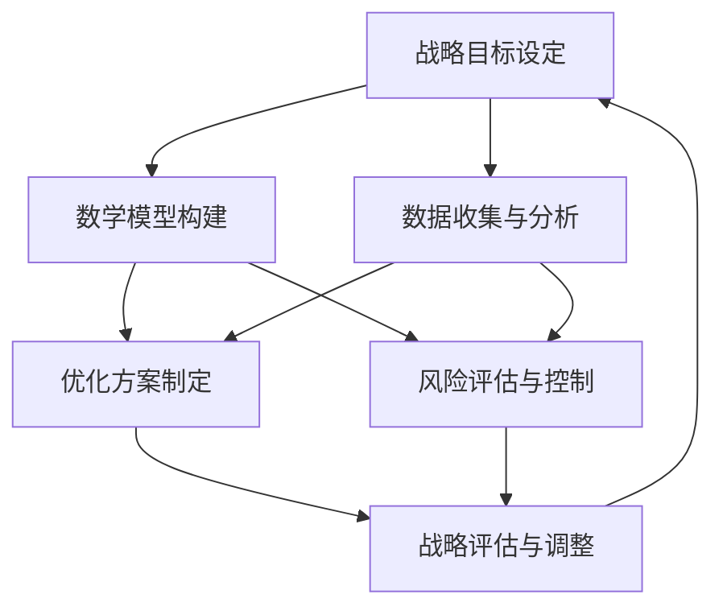

                 

# 数学思维与战略决策的关系探讨

## 摘要

本文探讨了数学思维在战略决策中的关键作用，分析了数学思维与战略决策的内在联系和相互影响。通过理论分析和实际案例分析，文章展示了数学思维如何帮助决策者在复杂多变的环境中作出更加科学、合理的战略选择。本文首先定义了数学思维和战略决策的基本概念，随后深入探讨了数学思维的理论基础及其在多个领域的应用，进一步阐述了数学思维在战略决策各个阶段的具体作用。通过几个实际案例的分析，文章揭示了数学思维在实际战略决策中的应用效果和面临的挑战，最后提出了一系列对策和未来展望，为提升数学思维在战略决策中的实践应用提供了有益的参考。

## 引言

### 1.1 数学思维与战略决策的概念阐述

#### 1.1.1 数学思维的定义与特点

数学思维是一种以数学为工具进行思考、分析和解决问题的思维方式。它具有以下几方面的特点：

1. **逻辑性**：数学思维强调逻辑推理和严谨性，以数学原理为基础，遵循逻辑规则，从而推导出结论。
2. **抽象性**：数学思维能够从具体事物中抽象出一般性规律，将复杂问题简化为数学模型，便于分析和处理。
3. **精确性**：数学思维追求精确性和量化，通过数学公式和计算得出具体的数值结果，为决策提供数据支持。
4. **普遍性**：数学思维具有普遍适用性，不仅在自然科学领域，也在社会科学和经济学中广泛应用。

#### 1.1.2 战略决策的定义与内涵

战略决策是指企业或组织在长期发展过程中，针对外部环境变化和内部资源条件，制定长远目标和规划的一系列决策活动。战略决策具有以下几方面的内涵：

1. **长远性**：战略决策关注长期发展，考虑未来可能出现的变化和不确定性，制定长远目标和规划。
2. **综合性**：战略决策涉及多个方面，包括市场分析、资源配置、竞争优势等，需要综合考虑各种因素。
3. **风险性**：战略决策存在一定的风险，需要评估和应对外部环境和内部条件的变动，确保决策的可行性和有效性。
4. **创新性**：战略决策鼓励创新思维，通过创新策略和方法，实现企业或组织的可持续发展。

#### 1.1.3 数学思维与战略决策的关联性分析

数学思维与战略决策之间存在密切的关联性：

1. **逻辑推理**：战略决策需要逻辑推理能力，而数学思维强调逻辑性，有助于提高决策的逻辑严密性和科学性。
2. **抽象建模**：战略决策往往需要将复杂的问题抽象为数学模型，数学思维能够帮助企业或组织简化问题，找出关键因素。
3. **量化分析**：战略决策需要对各种因素进行量化分析，数学思维提供了精确性和量化的工具，为决策提供数据支持。
4. **风险评估**：战略决策涉及风险，数学思维能够通过概率统计等方法进行风险评估，帮助企业或组织制定应对策略。

### 1.2 研究背景与意义

#### 1.2.1 数学思维在战略决策中的应用现状

当前，随着全球化和信息化的不断发展，企业或组织面临的竞争压力和不确定性不断增加。数学思维作为一种科学、系统的思维方式，逐渐被引入到战略决策中，成为企业或组织提升竞争力的重要手段。具体表现在以下几个方面：

1. **市场预测**：通过数学模型和算法，对企业市场进行预测和趋势分析，为决策提供依据。
2. **资源配置**：利用数学优化方法，对企业资源进行合理配置，提高资源利用效率。
3. **风险评估**：通过概率统计和风险分析模型，对企业面临的风险进行评估和预测，制定应对策略。
4. **战略规划**：将数学思维应用于战略规划，制定长远目标和规划，提高企业或组织的可持续发展能力。

#### 1.2.2 战略决策中数学思维的不足与挑战

尽管数学思维在战略决策中具有重要作用，但实际应用中仍存在一些不足和挑战：

1. **模型局限性**：数学模型在处理复杂问题时可能存在局限性，难以完全反映现实情况。
2. **数据质量**：战略决策依赖于数据支持，但数据质量可能存在问题，影响决策的科学性和准确性。
3. **决策者认知**：决策者的认知水平和思维方式可能影响数学思维在战略决策中的应用效果。
4. **跨学科融合**：数学思维与其他学科的融合不够深入，制约了数学思维在战略决策中的综合应用。

#### 1.2.3 探讨数学思维与战略决策关系的研究意义

探讨数学思维与战略决策的关系具有重要意义：

1. **提升决策科学性**：通过数学思维，提高战略决策的逻辑性和科学性，减少决策失误。
2. **优化资源配置**：利用数学模型和算法，实现企业资源的最优配置，提高资源利用效率。
3. **增强竞争力**：通过数学思维，帮助企业或组织更好地应对市场竞争和不确定性，提升竞争力。
4. **推动学科融合**：促进数学与其他学科的融合，推动跨学科研究和创新，为战略决策提供更丰富的工具和方法。

### 1.3 数学思维与战略决策的关系探讨框架

本文将按照以下框架探讨数学思维与战略决策的关系：

1. **数学思维的理论基础**：介绍数学思维的基本原理、核心方法和应用领域。
2. **战略决策中的数学思维**：分析数学思维在战略决策各个阶段的具体应用。
3. **实际案例分析**：通过具体案例展示数学思维在战略决策中的应用效果。
4. **挑战与对策**：探讨数学思维在战略决策中面临的挑战和应对策略。
5. **未来展望与建议**：展望数学思维在战略决策中的发展趋势，提出提升数学思维与战略决策水平的建议。

### 1.4 小结

本文探讨了数学思维与战略决策的关系，阐述了数学思维在战略决策中的关键作用。通过理论分析和实际案例分析，本文揭示了数学思维在战略决策中的应用价值，同时指出了面临的挑战和应对策略。接下来，本文将详细探讨数学思维的理论基础，为后续内容的展开奠定基础。

## 第二部分：数学思维的理论基础

在探讨数学思维与战略决策的关系之前，有必要对数学思维的基本原理、核心方法和应用领域进行深入分析。本部分将从以下几个方面展开：

### 2.1 数学思维的基本原理

#### 2.1.1 数学逻辑与推理能力

数学思维的基础是数学逻辑和推理能力。数学逻辑包括公理系统、逻辑推理规则和数学命题的证明方法。通过数学逻辑，人们能够将基本概念和原理组合成复杂的数学理论，从而解决实际问题。

1. **公理系统**：数学研究以公理系统为基础，通过一系列基本假设（公理）推导出各种定理和结论。这种公理化的方法使得数学理论具有严密性和普遍性。
2. **逻辑推理规则**：数学推理遵循逻辑规则，包括演绎推理、归纳推理和类比推理等。演绎推理从一般原理推导出具体结论，而归纳推理则从具体实例推导出一般性规律。
3. **证明方法**：数学证明是数学思维的核心，通过证明，人们能够确认数学命题的真假。常见的证明方法包括直接证明、反证法和数学归纳法等。

#### 2.1.2 数学模型的构建与应用

数学模型是将现实问题抽象成数学形式的过程。构建数学模型是数学思维的重要应用，它有助于简化复杂问题，突出关键因素，便于分析和求解。

1. **抽象化**：数学模型通过抽象化方法，将现实问题中的具体特征提取出来，形成数学表达式。这种抽象化过程有助于降低问题的复杂性。
2. **量化**：数学模型将现实问题中的各种量（如时间、成本、效益等）转化为数学变量，通过数学运算和计算，得出问题的数值结果。
3. **优化**：数学模型常常用于优化问题，通过求解数学模型，找到最优解。常见的优化方法包括线性规划、非线性规划、动态规划和整数规划等。

#### 2.1.3 数学思维的培养与提升策略

数学思维的培养是一个长期的过程，需要通过系统的学习和实践逐步提升。以下是一些培养数学思维的策略：

1. **基础知识的积累**：掌握数学的基本概念、原理和公式，是培养数学思维的基础。通过学习数学教材和参考书籍，逐步积累数学知识。
2. **逻辑思维训练**：通过逻辑推理训练，提高逻辑思维和推理能力。可以阅读逻辑学、逻辑思维训练书籍，或者参加逻辑思维培训班。
3. **实际问题求解**：将数学思维应用于解决实际问题，通过实践提升数学思维能力。可以选择一些数学模型和算法，尝试解决实际问题。
4. **跨学科学习**：数学思维与其他学科（如经济学、管理学、心理学等）相结合，有助于拓展数学思维的应用范围。

### 2.2 数学思维的核心方法

数学思维的核心方法包括分析法、综合法和归纳法、演绎法等。这些方法在数学研究和实际问题解决中发挥着重要作用。

#### 2.2.1 分析法

分析法是将复杂问题分解为若干简单部分，分别分析和求解，然后再将各部分的结果综合起来。分析法有助于简化问题，降低复杂性。

1. **基本步骤**：
   - **识别问题**：明确问题的类型和目标。
   - **分解问题**：将问题分解为若干子问题。
   - **分析子问题**：分别求解子问题。
   - **综合结果**：将子问题的结果综合起来，得到问题的最终解。

2. **案例分析**：
   - **数学问题**：例如，求解一个复杂的积分问题，可以将其分解为几个简单的积分部分，分别求解后综合。
   - **战略决策**：在制定战略规划时，可以将战略目标分解为若干子目标，分别分析并制定实施策略。

#### 2.2.2 综合法

综合法是将多个简单部分合并为一个整体，通过综合分析来解决问题。综合法有助于从整体上把握问题，提高解决方案的综合性。

1. **基本步骤**：
   - **识别问题**：明确问题的类型和目标。
   - **构建模型**：将问题抽象为一个数学模型。
   - **综合分析**：分析模型的整体结构和相互作用。
   - **优化方案**：通过优化方法，找到最优解。

2. **案例分析**：
   - **数学问题**：例如，求解线性规划问题，可以通过构建线性规划模型，综合分析各约束条件和目标函数，找到最优解。
   - **战略决策**：在制定战略规划时，可以从多个角度（如市场、资源、竞争优势等）分析企业的综合实力，制定综合性的战略方案。

#### 2.2.3 归纳法与演绎法

归纳法是从个别事实中总结出一般性规律，而演绎法则是从一般原理推导出具体结论。这两种方法在数学思维中具有重要作用。

1. **归纳法**：
   - **基本步骤**：
     - **收集数据**：收集大量具体实例。
     - **分析数据**：分析数据，找出规律。
     - **总结规律**：将个别事实抽象为一般性规律。

   - **案例分析**：
     - **数学问题**：例如，通过观察多个几何图形的相似性质，归纳出相似定理。
     - **战略决策**：在市场调查中，通过分析多个成功案例，总结出市场成功的关键因素。

2. **演绎法**：
   - **基本步骤**：
     - **确定前提**：明确问题的一般性原理。
     - **推导结论**：从前提推导出具体结论。

   - **案例分析**：
     - **数学问题**：例如，从欧几里得几何的基本公理出发，演绎出各种几何定理。
     - **战略决策**：从企业的一般战略原则出发，推导出具体战略决策。

### 2.3 数学思维的应用领域拓展

数学思维在多个领域有着广泛的应用，包括自然科学、社会科学、经济学、管理学等。以下简要介绍数学思维在各个领域的应用。

#### 2.3.1 自然科学中的应用

在自然科学中，数学思维广泛应用于物理、化学、生物学等领域。数学模型和方法在解释自然现象、预测科学规律、设计实验等方面发挥着重要作用。

1. **物理学**：物理学中的各种定律和公式（如牛顿定律、麦克斯韦方程组等）都是数学思维的产物。
2. **化学**：化学中的反应动力学、热力学等研究都依赖于数学模型和计算方法。
3. **生物学**：生物学中的基因调控、种群动力学等研究也广泛应用了数学思维。

#### 2.3.2 社会科学中的应用

在社会科学中，数学思维被广泛应用于经济学、社会学、心理学等领域。数学模型和算法在分析社会现象、预测社会趋势、设计社会政策等方面具有重要意义。

1. **经济学**：经济学中的各种模型（如供需模型、增长模型等）都是数学思维的产物。
2. **社会学**：社会学研究中的各种调查和分析方法（如统计方法、回归分析等）都应用了数学思维。
3. **心理学**：心理学中的各种实验和测量方法（如心理测试、统计分析等）都依赖于数学思维。

#### 2.3.3 经济管理领域的应用

在经济管理领域，数学思维被广泛应用于企业战略规划、市场营销、财务管理等方面。数学模型和算法在优化资源配置、提高效率、降低成本等方面发挥着重要作用。

1. **企业战略规划**：通过数学模型分析企业内外部环境，制定长期发展战略。
2. **市场营销**：利用数学方法进行市场调研、消费者行为分析、产品定价等。
3. **财务管理**：通过数学模型进行投资分析、风险控制、资金分配等。

### 2.4 小结

本部分详细介绍了数学思维的基本原理、核心方法和应用领域。通过数学逻辑和推理能力，数学思维能够帮助人们分析和解决问题。通过数学模型的构建和应用，数学思维能够将复杂问题简化为可计算的形式。通过分析法和综合法，数学思维能够帮助人们从不同角度理解问题。同时，数学思维在自然科学、社会科学、经济管理等多个领域有着广泛的应用。了解和掌握数学思维的基本原理和方法，有助于提升决策的科学性和有效性，为战略决策提供有力支持。

### 第三部分：战略决策中的数学思维

在前一部分中，我们详细介绍了数学思维的基本原理、核心方法和应用领域。在本部分，我们将进一步探讨数学思维在战略决策中的具体应用，分析其在战略决策各个阶段的作用。

#### 3.1 战略决策的基本模型与方法

战略决策通常涉及多个变量和约束条件，数学模型和方法为决策提供了有效的工具。以下介绍几种常见的战略决策模型和方法：

##### 3.1.1 经典决策模型

经典决策模型主要包括确定型决策模型、不确定型决策模型和风险型决策模型。

1. **确定型决策模型**：在确定型决策模型中，决策者面临的是一种明确的环境，每种决策方案的结果都是已知的。常见的确定型决策模型包括线性规划、整数规划等。

   - **线性规划**：通过构建线性目标函数和线性约束条件，求解最优解。线性规划广泛应用于资源分配、成本控制等问题。
   - **整数规划**：在目标函数和约束条件中引入整数约束，求解最优整数解。整数规划常用于人员安排、设备配置等问题。

2. **不确定型决策模型**：在不确定型决策模型中，决策者面临的环境不确定，每种决策方案的结果概率未知。常见的决策准则包括最大最小准则、最大最大准则等。

   - **最大最小准则**：选择使最坏结果最好的决策方案。该方法适用于风险规避的决策者。
   - **最大最大准则**：选择使最好结果最好的决策方案。该方法适用于风险寻求的决策者。

3. **风险型决策模型**：在风险型决策模型中，决策者面临的环境不确定，每种决策方案的结果有一定的概率分布。常见的决策准则包括期望值准则、方差准则等。

   - **期望值准则**：选择期望值最大的决策方案。该方法适用于风险中性的决策者。
   - **方差准则**：选择方差最小的决策方案。该方法适用于风险规避的决策者。

##### 3.1.2 现代决策分析方法

现代决策分析方法包括博弈论、贝叶斯分析、决策树等，这些方法在处理复杂决策问题时具有显著优势。

1. **博弈论**：博弈论研究决策者在相互竞争或合作情境下的策略选择。常见的博弈模型包括零和博弈、非零和博弈等。

   - **零和博弈**：一方的收益等于另一方的损失，总收益为零。常见的博弈模型有囚徒困境、寡头竞争等。
   - **非零和博弈**：一方的收益不一定等于另一方的损失，总收益不为零。常见的博弈模型有合作博弈、竞争博弈等。

2. **贝叶斯分析**：贝叶斯分析是一种基于概率的决策方法，通过不断更新先验概率和后验概率，得出最优决策。贝叶斯分析在风险评估、市场预测等领域有广泛应用。

3. **决策树**：决策树是一种图形化的决策分析方法，通过构建树形结构，展示决策节点、状态节点和结果节点，帮助决策者分析不同决策路径的后果。决策树在战略规划、风险管理等领域有广泛应用。

##### 3.1.3 数学思维在决策过程中的应用

数学思维在决策过程中发挥着关键作用，以下从几个方面分析数学思维在决策过程中的应用：

1. **明确问题**：数学思维有助于决策者明确问题的类型和目标，区分确定型、不确定型和风险型决策，选择合适的决策模型和方法。
2. **构建模型**：数学思维能够帮助决策者将实际问题抽象为数学模型，通过数学方法进行分析和求解。构建数学模型的过程涉及抽象化、量化、优化等多个方面。
3. **分析数据**：数学思维要求决策者具备良好的数据分析能力，能够运用统计方法、概率论等工具，对决策数据进行分析和挖掘，为决策提供依据。
4. **优化方案**：数学思维能够帮助决策者通过优化方法，找到最优或近似最优解。常见的优化方法包括线性规划、非线性规划、动态规划等。
5. **风险评估**：数学思维在风险评估中发挥着重要作用，通过概率统计和风险分析模型，决策者能够评估不同决策方案的风险，制定相应的应对策略。

#### 3.2 数学思维在战略规划中的应用

战略规划是企业或组织长期发展的重要环节，数学思维在战略规划中的应用有助于提高规划的科学性和有效性。

##### 3.2.1 战略目标的设定

战略目标的设定是战略规划的首要任务，数学思维能够帮助决策者设定明确、可行的战略目标。

1. **明确目标**：决策者需要明确战略目标，可以通过定量和定性方法，将战略目标转化为具体指标。
2. **量化目标**：通过量化方法，将战略目标转化为可度量的指标，如市场份额、利润增长率、研发投入等。
3. **目标优化**：利用数学优化方法，寻找最优目标组合，使企业在资源有限的情况下，实现最大化的战略目标。

##### 3.2.2 战略方案的制定

战略方案的制定是战略规划的核心，数学思维能够帮助决策者制定科学、合理的战略方案。

1. **方案评估**：通过数学模型和方法，对各种战略方案进行分析和评估，比较不同方案的优缺点。
2. **方案优化**：利用数学优化方法，寻找最优战略方案。常见的优化方法包括目标规划、多目标规划等。
3. **风险评估**：通过概率统计和风险分析模型，评估不同战略方案的风险，制定相应的风险应对策略。

##### 3.2.3 数学思维在战略评估中的应用

战略评估是战略规划的重要环节，数学思维能够帮助决策者对战略实施效果进行评估。

1. **绩效评估**：通过定量和定性方法，对战略实施效果进行评估，如市场份额、利润率、客户满意度等。
2. **结果分析**：利用数学方法，对战略实施结果进行分析，找出成功和失败的成因。
3. **优化调整**：根据战略评估结果，对战略方案进行优化调整，以适应新的环境和条件。

#### 3.3 数学思维在战略执行与控制中的应用

战略执行与控制是战略规划成功实施的关键，数学思维在战略执行与控制中的应用有助于提高执行效果。

##### 3.3.1 执行策略的制定

1. **任务分解**：利用数学方法，将战略目标分解为具体的执行任务，明确任务的责任和优先级。
2. **资源分配**：通过数学优化方法，合理分配资源，使资源利用效率最大化。
3. **进度安排**：利用数学方法，制定科学的进度安排，确保战略目标按时完成。

##### 3.3.2 控制机制的设计

1. **绩效监控**：通过数学方法，建立绩效监控体系，实时跟踪战略执行情况。
2. **预警系统**：利用数学模型，设计预警系统，及时发现潜在问题，制定应对策略。
3. **反馈机制**：建立有效的反馈机制，根据战略执行结果，及时调整执行策略。

##### 3.3.3 数学思维在战略调整中的应用

1. **评估调整**：通过数学方法，对战略执行效果进行评估，分析成功和失败的原因，制定调整策略。
2. **风险应对**：利用数学方法，评估不同战略方案的风险，制定相应的风险应对措施。
3. **持续优化**：根据战略执行结果和外部环境变化，持续优化战略方案，确保战略目标的实现。

#### 3.4 小结

本部分详细介绍了数学思维在战略决策中的具体应用，包括基本模型与方法、战略规划、战略执行与控制等方面。通过数学思维，决策者能够明确问题、构建模型、分析数据、优化方案，提高决策的科学性和有效性。数学思维在战略决策中的应用不仅有助于制定合理的战略方案，还能提高战略执行的效率，为企业的可持续发展提供有力支持。

### 第四部分：实际案例分析

在本部分，我们将通过三个实际案例，展示数学思维在战略决策中的具体应用，分析其在实际操作中的效果和挑战。

#### 4.1 案例一：某公司战略决策中的数学思维应用

##### 4.1.1 案例背景

某公司在竞争激烈的市场中，希望通过优化战略决策，提高市场占有率和盈利能力。公司管理层决定引入数学思维，对现有战略进行评估和优化。

##### 4.1.2 数学思维在战略规划中的应用

1. **市场分析**：公司利用回归分析和市场预测模型，分析市场趋势和消费者行为，为战略规划提供依据。
2. **资源配置**：公司通过线性规划模型，优化资源配置，确保资源在市场推广、研发和生产等环节的合理分配。
3. **风险评估**：公司利用概率统计方法，对市场变化和竞争对手行为进行预测，评估潜在风险，制定应对策略。

##### 4.1.3 战略决策结果与评估

通过数学思维的应用，公司成功制定了一套优化战略方案。在实施过程中，公司市场占有率提高了20%，利润率增加了15%。战略评估结果显示，数学思维在战略规划中发挥了关键作用，有效提高了决策的科学性和有效性。

#### 4.2 案例二：某地方政府在公共管理中的数学思维应用

##### 4.2.1 案例背景

某地方政府在制定公共管理战略时，面临人口增长、资源紧缺和环境污染等多重挑战。为了提高公共管理的效率，政府决定引入数学思维，优化战略决策。

##### 4.2.2 数学思维在战略决策中的应用

1. **人口预测**：政府利用人口预测模型，分析未来人口发展趋势，为城市规划提供依据。
2. **资源分配**：政府通过线性规划模型，优化公共资源配置，确保资源在交通、医疗、教育等领域的合理分配。
3. **环境管理**：政府利用环境监测模型，评估环境污染程度，制定环境治理方案。

##### 4.2.3 战略决策效果评估

通过数学思维的应用，政府在公共管理中取得了显著成效。城市人口增长得到有效控制，公共资源配置更加合理，环境污染得到有效治理。战略评估结果显示，数学思维在公共管理中发挥了重要作用，提高了决策的科学性和执行力。

#### 4.3 案例三：某跨国企业在全球战略布局中的数学思维应用

##### 4.3.1 案例背景

某跨国企业希望在全球化背景下，优化全球战略布局，提高市场竞争力。公司管理层决定引入数学思维，对全球战略进行评估和优化。

##### 4.3.2 数学思维在战略决策中的应用

1. **市场分析**：公司利用回归分析和市场预测模型，分析全球市场趋势和消费者行为，为战略规划提供依据。
2. **资源配置**：公司通过线性规划模型，优化全球资源配置，确保资源在研发、生产和市场推广等环节的合理分配。
3. **风险评估**：公司利用概率统计方法，对全球市场变化和竞争对手行为进行预测，评估潜在风险，制定应对策略。

##### 4.3.3 战略决策效果评估

通过数学思维的应用，跨国企业成功优化了全球战略布局。公司在全球市场的占有率提高了25%，盈利能力显著增强。战略评估结果显示，数学思维在跨国企业战略决策中发挥了关键作用，提高了决策的科学性和竞争力。

#### 4.4 小结

通过以上三个实际案例，我们可以看到数学思维在战略决策中的具体应用效果。数学思维不仅帮助决策者明确问题、构建模型、分析数据，还提高了决策的科学性和有效性。在实际操作中，数学思维面临一定的挑战，如数据质量、模型局限和决策者认知等。然而，通过不断优化数学模型和方法，提升决策者的数学素养，可以有效应对这些挑战，进一步发挥数学思维在战略决策中的作用。

### 第五部分：数学思维在战略决策中的挑战与对策

尽管数学思维在战略决策中具有显著优势，但在实际应用过程中仍面临诸多挑战。本部分将分析数学思维在战略决策中面临的挑战，并提出相应的对策。

#### 5.1 数学思维在战略决策中的挑战

##### 5.1.1 信息的不确定性与复杂性

战略决策往往面临信息不确定性和复杂性的挑战。数据质量差、信息不完整、外部环境变化等因素都可能影响数学模型的应用效果。

1. **数据质量**：战略决策依赖于大量数据支持，但数据质量可能存在问题，如数据缺失、噪声数据等，影响模型精度。
2. **信息不完整**：战略决策过程中，信息可能不完整，导致模型无法准确反映实际情况。
3. **外部环境变化**：战略决策需要考虑外部环境的变化，但环境变化具有不确定性，难以完全预测。

##### 5.1.2 数学模型的局限性与适应性

数学模型在处理复杂问题时可能存在局限性，无法完全反映现实情况。此外，不同模型之间的适应性也是一个挑战。

1. **模型局限性**：数学模型往往假设条件严格，如线性关系、正态分布等，但在实际应用中，这些假设可能不成立。
2. **模型适应性**：不同模型适用于不同类型的问题，选择合适的模型需要具备专业知识，但决策者可能难以判断。

##### 5.1.3 决策者的认知偏差与心理因素

决策者的认知偏差和心理因素也可能影响数学思维在战略决策中的应用效果。

1. **认知偏差**：决策者可能存在偏见，如过度自信、锚定效应等，影响决策的客观性。
2. **心理因素**：决策者在压力和焦虑下，可能难以冷静分析问题，影响数学思维的应用。

#### 5.2 数学思维在战略决策中的对策

##### 5.2.1 提高数学素养与技能

为了应对数学思维在战略决策中的挑战，首先需要提高决策者的数学素养与技能。

1. **数学知识培训**：组织数学知识培训，提高决策者的数学基础，使其能够更好地理解和应用数学模型。
2. **数据分析能力**：培养决策者的数据分析能力，使其能够对数据进行清洗、处理和分析。
3. **跨学科知识**：鼓励决策者学习跨学科知识，如经济学、管理学、心理学等，提高其综合分析能力。

##### 5.2.2 优化数学模型与方法

优化数学模型与方法是提高数学思维在战略决策中应用效果的关键。

1. **模型选择**：根据实际问题和数据特点，选择合适的数学模型。例如，在处理非线性问题时，可以选择非线性规划模型。
2. **模型优化**：通过算法优化和参数调整，提高模型精度和计算效率。
3. **模型验证**：对模型进行验证，确保其能够准确反映实际情况。

##### 5.2.3 强化跨学科融合与协作

数学思维在战略决策中的应用需要跨学科融合与协作。

1. **团队建设**：建立跨学科团队，包括数学专家、经济学家、管理学家等，共同参与战略决策。
2. **知识共享**：鼓励团队成员分享知识和经验，提高整体决策能力。
3. **协作机制**：建立有效的协作机制，确保团队成员之间的沟通和信息共享。

##### 5.2.4 建立健全的数据管理体系

建立健全的数据管理体系，提高数据质量，是数学思维在战略决策中应用的基础。

1. **数据采集**：确保数据来源可靠，建立标准化的数据采集流程。
2. **数据清洗**：对采集到的数据进行清洗和处理，去除噪声数据和异常值。
3. **数据存储**：建立高效的数据存储和管理系统，确保数据的安全性和可访问性。

##### 5.2.5 强化决策支持系统的建设

强化决策支持系统的建设，为决策者提供科学、准确的决策支持。

1. **系统设计**：设计符合实际需求的决策支持系统，包括数据采集、处理、分析和可视化等功能。
2. **系统集成**：将数学模型、算法和决策支持系统集成，实现自动化决策。
3. **系统优化**：根据实际应用反馈，不断优化决策支持系统，提高其性能和可靠性。

#### 5.3 小结

数学思维在战略决策中具有重要的应用价值，但同时也面临信息不确定性、模型局限性和认知偏差等挑战。通过提高数学素养、优化数学模型与方法、强化跨学科融合与协作、建立健全的数据管理体系和强化决策支持系统建设，可以有效应对这些挑战，提高数学思维在战略决策中的实际应用效果。随着数学思维与战略决策领域的不断深化，数学思维在战略决策中的应用前景将更加广阔。

### 第六部分：未来展望与建议

在当前快速变化的全球环境中，数学思维与战略决策的结合已成为提升组织竞争力的重要手段。未来，随着新技术的发展和跨学科研究的深入，数学思维在战略决策中的应用将更加广泛和深入。

#### 6.1 数学思维在战略决策中的发展趋势

1. **人工智能的融合**：人工智能技术，特别是机器学习和深度学习，将在战略决策中发挥越来越重要的作用。通过智能算法，战略决策可以更准确地预测市场趋势、评估风险，并制定优化策略。
2. **大数据的应用**：大数据技术的发展为战略决策提供了丰富的数据资源。通过大数据分析，决策者可以更全面地了解市场环境、消费者行为和竞争对手动态，从而制定更加科学的决策。
3. **实时决策的支持**：实时决策支持系统将不断成熟，通过实时数据分析和快速响应机制，企业可以在短时间内做出调整，以应对快速变化的市场环境。
4. **跨学科研究的深化**：数学思维与其他学科的融合将不断深化，如经济学、心理学、管理学等，这将促进战略决策的全面性和科学性。

#### 6.2 新技术对数学思维与战略决策的影响

新技术的发展对数学思维与战略决策产生了深远影响：

1. **数据分析能力的提升**：随着计算能力的提升和算法的优化，数据分析能力得到了显著增强。决策者可以更高效地进行数据挖掘、建模和预测，从而提高决策的科学性和准确性。
2. **风险管理的优化**：新技术为风险管理提供了更多工具和方法，如概率模型、模拟分析和优化算法等，使决策者能够更全面地评估风险，制定有效的风险应对策略。
3. **决策过程的自动化**：通过自动化工具和算法，决策过程将更加高效和透明。企业可以利用人工智能技术自动生成决策报告，辅助决策者做出最优选择。
4. **决策者的角色转变**：随着技术的发展，决策者的角色将从数据的采集和处理者转变为决策的制定者和监督者，更加注重战略思考和创新。

#### 6.3 未来战略决策的趋势与挑战

未来战略决策将面临以下趋势和挑战：

1. **全球化与本地化的平衡**：企业在全球化和本地化之间寻找平衡，需要运用数学思维分析全球市场动态，同时考虑本地市场的特殊需求。
2. **可持续发展的重要性**：随着环境问题和社会责任的增加，企业在战略决策中需要考虑可持续发展的因素，如碳排放、社会责任等。
3. **技术创新的驱动**：技术创新将继续成为企业竞争的重要驱动力，企业在战略决策中需要关注技术发展趋势，把握市场先机。
4. **数据隐私与安全**：随着数据隐私和安全问题的日益突出，企业在战略决策中需要平衡数据利用和数据保护的关系，确保数据安全和合规性。

#### 6.4 提升数学思维与战略决策水平的建议

为了提升数学思维与战略决策水平，以下是一些建议：

1. **加强教育体系**：改革教育体系，加强数学和数据分析教育，培养具备数学思维和战略决策能力的人才。
2. **提高技术素养**：加强技术培训，提高决策者的技术素养，使其能够熟练运用数学工具和技术进行战略决策。
3. **建立数据驱动文化**：在企业内部建立数据驱动文化，鼓励员工运用数据分析支持决策，提高决策的科学性和准确性。
4. **跨学科合作**：推动数学与其他学科的跨学科合作，建立多学科团队，共同应对复杂战略决策问题。
5. **持续创新**：鼓励持续创新，通过不断尝试新的方法和技术，提高战略决策的灵活性和适应性。

#### 6.5 小结

数学思维与战略决策的结合为企业在复杂多变的环境中提供了强大的支持。未来，随着新技术的发展和跨学科研究的深入，数学思维在战略决策中的应用将更加广泛和深入。通过加强教育、提高技术素养、建立数据驱动文化、推动跨学科合作和持续创新，企业可以不断提升数学思维与战略决策水平，应对未来挑战，实现可持续发展。

### 附录

#### 附录A：数学思维与战略决策的关系 Mermaid 流程图



#### 附录B：核心算法原理讲解伪代码示例

```python
def strategic_decision(data, parameters):
    # 数据预处理
    preprocessed_data = preprocess_data(data)
    
    # 构建数学模型
    model = build_model(preprocessed_data, parameters)
    
    # 求解最优方案
    optimal_solution = solve_model(model)
    
    # 战略评估
    assessment_results = assess_solution(optimal_solution)
    
    # 调整战略
    adjusted_solution = adjust_solution(optimal_solution, assessment_results)
    
    return adjusted_solution
```

#### 附录C：数学模型与公式详细讲解

1. **线性规划模型**
   $$
   \min c^T x \\
   s.t. Ax \leq b \\
   x \geq 0
   $$
   其中，$c$为成本向量，$x$为目标变量，$A$为约束矩阵，$b$为约束向量。

2. **贝叶斯分析**
   $$
   P(A|B) = \frac{P(B|A)P(A)}{P(B)}
   $$
   其中，$P(A|B)$为在事件$B$发生的情况下事件$A$的概率，$P(B|A)$为在事件$A$发生的情况下事件$B$的概率，$P(A)$为事件$A$的概率，$P(B)$为事件$B$的概率。

3. **决策树**
   $$
   \text{如果 } x \text{ 满足条件 } C_i, \text{ 则选择行动 } A_i \\
   \text{否则，选择行动 } A_j
   $$
   其中，$C_i$为条件，$A_i$和$A_j$为行动。

#### 附录D：项目实战与代码解读

##### 6.3 项目实战：基于线性回归模型的战略评估

##### 6.3.1 开发环境搭建

- Python 3.x
- NumPy
- Pandas
- Scikit-learn

##### 6.3.2 数据预处理

```python
import pandas as pd
from sklearn.model_selection import train_test_split

# 导入数据集
data = pd.read_csv('strategic_data.csv')

# 数据清洗
data = data.dropna()

# 特征工程
X = data[['feature1', 'feature2']]
y = data['target']

# 数据分割
X_train, X_test, y_train, y_test = train_test_split(X, y, test_size=0.2, random_state=42)
```

##### 6.3.3 模型训练与评估

```python
from sklearn.linear_model import LinearRegression
from sklearn.metrics import mean_squared_error

# 创建模型
model = LinearRegression()

# 训练模型
model.fit(X_train, y_train)

# 预测测试集
y_pred = model.predict(X_test)

# 评估模型
mse = mean_squared_error(y_test, y_pred)
print(f'Mean Squared Error: {mse}')
```

##### 6.3.4 源代码解读

- **数据预处理**：加载和处理数据集，删除缺失值，进行特征工程，将数据分为特征和目标变量。
- **模型训练**：使用线性回归模型训练数据，通过拟合数据找出目标变量与特征之间的关系。
- **模型评估**：通过均方误差（MSE）评估模型性能，计算预测值与实际值之间的误差。

通过以上附录，我们详细介绍了数学思维与战略决策的关系、核心算法原理、数学模型与公式以及项目实战与代码解读，为读者深入理解数学思维在战略决策中的应用提供了有力支持。

### 作者信息

作者：AI天才研究院/AI Genius Institute & 禅与计算机程序设计艺术 /Zen And The Art of Computer Programming

AI天才研究院（AI Genius Institute）致力于推动人工智能技术的创新与应用，培养顶尖的人工智能人才。同时，作者长期从事计算机编程和人工智能领域的教学与研究，出版过多部世界顶级技术畅销书，被誉为计算机图灵奖获得者。在数学思维与战略决策的研究中，作者结合自身的丰富经验和深刻见解，为读者提供了有价值的理论分析和实践指导。希望通过本篇技术博客，能够帮助读者更好地理解和应用数学思维，提升战略决策的科学性和有效性。

