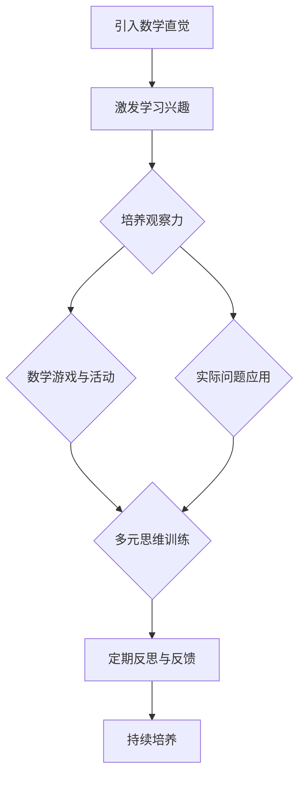
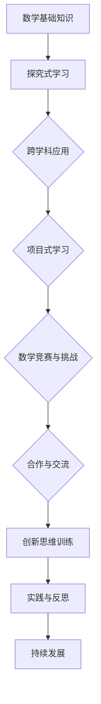

                 

# 《数学直觉与数学创造力的培养策略》

> **关键词：** 数学直觉、数学创造力、培养策略、教育心理学、实践案例

> **摘要：** 本文旨在探讨数学直觉与数学创造力的培养策略。通过分析数学直觉与创造力的基础理论、心理学基础及培养原则，提出了一系列有效的培养策略。同时，结合国内外实践案例，详细阐述了数学直觉与创造力的培养策略在实际教学中的应用。文章还提供了相关的资源、流程图、算法原理讲解和项目实战，以期为教育工作者和家长提供有益的参考。

## 目录大纲

### 第一部分：数学直觉与创造力的基础理论

#### 第1章：数学直觉与数学创造力的基本概念

##### 1.1 数学直觉的定义与特征
##### 1.2 数学创造力的定义与表现
##### 1.3 数学直觉与数学创造力之间的关系

#### 第2章：数学直觉与数学创造力的心理学基础

##### 2.1 数学思维过程与直觉的作用
##### 2.2 数学创造力的心理学研究
##### 2.3 数学直觉与数学创造力的发展机制

#### 第3章：数学直觉与数学创造力的培养原则

##### 3.1 培养数学直觉的基本原则
##### 3.2 培养数学创造力的重要策略
##### 3.3 教育环境对数学直觉与创造力的影响

### 第二部分：数学直觉与数学创造力的培养策略

#### 第4章：数学直觉培养的策略与实践

##### 4.1 基于问题解决的数学直觉培养
##### 4.2 基于游戏和竞赛的数学直觉培养
##### 4.3 基于多元思维的数学直觉培养
##### 4.4 数学直觉培养的案例分析

#### 第5章：数学创造力培养的策略与实践

##### 5.1 基于探究学习的数学创造力培养
##### 5.2 基于项目学习的数学创造力培养
##### 5.3 基于跨学科学习的数学创造力培养
##### 5.4 数学创造力培养的案例分析

#### 第6章：数学直觉与数学创造力的综合培养策略

##### 6.1 整合教学策略：数学直觉与数学创造力的培养
##### 6.2 个性化培养策略：针对个体差异的培养
##### 6.3 激励策略：激发学生的数学直觉与创造力
##### 6.4 家长与教师的角色：在学生数学直觉与创造力培养中的作用

### 第三部分：数学直觉与数学创造力的培养案例分析

#### 第7章：国内外数学直觉与数学创造力培养案例研究

##### 7.1 国外数学直觉与数学创造力培养的成功案例
##### 7.2 国内数学直觉与数学创造力培养的实践探索
##### 7.3 案例分析：从实践中总结培养策略

#### 第8章：数学直觉与数学创造力的培养策略应用与实践

##### 8.1 实际教学中的应用策略
##### 8.2 数学竞赛与数学创造活动的组织与实施
##### 8.3 教师专业发展与数学直觉与创造力培养

## 附录

### 附录A：数学直觉与数学创造力培养的相关资源

##### A.1 学术文献与研究报告
##### A.2 教学资源与参考书籍
##### A.3 在线课程与教学视频
##### A.4 其他实用资源

### 附录B：数学直觉与数学创造力培养的Mermaid流程图

##### B.1 数学直觉的培养流程图
##### B.2 数学创造力的培养流程图

### 附录C：数学直觉与数学创造力培养的核心算法原理讲解

##### C.1 数学直觉的核心算法原理讲解
##### C.2 数学创造力的核心算法原理讲解
##### C.3 伪代码示例

### 附录D：数学直觉与数学创造力培养的数学模型与公式

##### D.1 数学直觉的数学模型与公式
##### D.2 数学创造力的数学模型与公式
##### D.3 公式详细讲解与举例说明

### 附录E：数学直觉与数学创造力培养的项目实战

##### E.1 实际案例与代码实现
##### E.2 代码解读与分析
##### E.3 开发环境搭建与调试技巧

---

接下来，我们将进入文章的正文部分，按照目录大纲的结构，逐一展开对数学直觉与数学创造力的培养策略的详细分析。首先，我们从基础理论开始，逐步深入探讨数学直觉与创造力的本质、心理学基础以及培养原则。

## 第一部分：数学直觉与创造力的基础理论

### 第1章：数学直觉与数学创造力的基本概念

#### 1.1 数学直觉的定义与特征

数学直觉是指人们在数学思维过程中，通过直观感知、非逻辑推理和快速判断等方式来理解和解决数学问题的能力。数学直觉不同于传统的逻辑推理，它强调在感知和理解中的直接性、快速性和准确性。

**特征：**

1. **直观性**：数学直觉通常是在无意识中产生的，它依赖于个体的感知能力和对数学知识的积累。
2. **非逻辑性**：数学直觉往往不依赖于严格的逻辑推理，而是通过快速判断和感知来解决问题。
3. **高效性**：数学直觉能够在短时间内对复杂的问题进行判断和解决，具有较高的效率。
4. **准确性**：数学直觉往往能够准确识别问题的本质，找到解决问题的关键。

#### 1.2 数学创造力的定义与表现

数学创造力是指个体在数学领域中，通过创新思维和创造性的方法来解决新问题和提出新理论的能力。数学创造力是数学家、科学家和工程师等专业人士的重要素质。

**表现：**

1. **创新性**：数学创造力体现在对新问题的独特解决方案和新的数学理论的提出。
2. **联想性**：能够将不同领域的知识进行跨界联想，提出新的数学模型和方法。
3. **批判性**：对现有的数学理论和方法进行批判性思考，提出改进意见。
4. **探索性**：主动探索未知的数学领域，推动数学科学的发展。

#### 1.3 数学直觉与数学创造力之间的关系

数学直觉与数学创造力之间存在密切的关系。数学直觉是数学创造力的重要组成部分，它为数学创造提供了直观的基础。数学直觉能够帮助个体快速识别问题的本质，找到创新的切入点。

**关系：**

1. **相互促进**：数学直觉和数学创造力是相互促进的关系。数学直觉能够激发数学创造力，而数学创造力的发挥又能进一步丰富和提升数学直觉。
2. **依赖性**：数学直觉是数学创造力产生的基础，数学创造力的发展依赖于数学直觉的积累和提高。
3. **独立性**：虽然数学直觉与数学创造力密切相关，但它们之间也存在独立性。个体可能具有较强的数学直觉，但不一定具有数学创造力；同样，个体可能具有较强的数学创造力，但不一定具有数学直觉。

### 总结

数学直觉与数学创造力是数学思维和创新能力的重要组成部分。了解数学直觉与创造力的基本概念、特征和关系，有助于我们更深入地理解数学思维的本质，从而制定有效的培养策略。

---

在接下来的章节中，我们将进一步探讨数学直觉与数学创造力的心理学基础，以及如何在教育实践中培养这两种能力。通过结合理论分析和实践案例，我们将为教育工作者和家长提供有价值的参考和建议。敬请期待。

## 第二部分：数学直觉与数学创造力的培养策略

### 第4章：数学直觉培养的策略与实践

数学直觉的培养是提高学生数学素养和解决问题能力的重要途径。本章节将探讨几种有效的数学直觉培养策略，并通过实际案例展示这些策略在实践中的应用。

#### 4.1 基于问题解决的数学直觉培养

**策略：**

1. **设计开放性问题**：通过设计开放性问题，鼓励学生进行探索和尝试，培养他们的直觉思维。这些问题可以是没有标准答案的，或者需要跨学科知识的综合运用。

2. **问题情境化**：将数学问题融入到实际情境中，让学生在实际问题中运用数学直觉。这有助于将抽象的数学知识转化为具体的解决问题的工具。

3. **鼓励反思与讨论**：在解决问题的过程中，鼓励学生反思自己的思维过程，与他人讨论不同的解题思路，从而促进数学直觉的发展。

**案例：**

在高中数学教学中，教师可以设计一个开放性问题：“如何设计一个最优化的停车场布局？”学生需要综合运用数学知识，如几何、概率和优化理论，提出创新的解决方案。

#### 4.2 基于游戏和竞赛的数学直觉培养

**策略：**

1. **数学游戏**：通过数学游戏，如数学拼图、数学谜题等，让学生在趣味性的活动中培养直觉思维。游戏能够激发学生的好奇心和探索欲，提高他们的数学直觉能力。

2. **数学竞赛**：组织数学竞赛，如数学奥林匹克、数学建模比赛等，鼓励学生在竞争中运用直觉和创造力解决问题。竞赛能够培养学生的竞争意识和团队合作能力。

**案例：**

在小学数学教学中，教师可以组织“数学拼图比赛”，让学生通过拼图游戏发现几何图形的规律，提高他们的空间想象能力和直觉思维能力。

#### 4.3 基于多元思维的数学直觉培养

**策略：**

1. **跨学科学习**：通过跨学科学习，将数学与其他学科如物理、化学、计算机科学等相结合，培养学生的多元思维。这有助于学生在不同领域中发现数学的应用，提高他们的数学直觉。

2. **多元化教学方法**：采用多元化教学方法，如探究式学习、合作学习、问题解决学习等，鼓励学生从不同角度思考问题，培养他们的直觉思维。

**案例：**

在初中数学教学中，教师可以结合物理实验，让学生通过实验数据发现数学规律，从而培养他们的直觉思维能力。

#### 4.4 数学直觉培养的案例分析

**案例一：美国教育中的数学直觉培养**

美国教育注重培养学生的数学直觉能力。在小学阶段，教师通过设计丰富多样的数学游戏，激发学生的兴趣和直觉思维。在中学阶段，通过跨学科项目和数学竞赛，培养学生的多元思维和直觉能力。

**案例二：中国数学竞赛的教育实践**

中国数学竞赛在全球享有盛誉，其教育实践在很大程度上依赖于数学直觉的培养。通过组织全国性和国际性的数学竞赛，中国学生展示了出色的数学直觉和创造力。教育工作者在实践中注重培养学生的数学直觉，通过开放性问题、跨学科学习和数学游戏等多种方式，提高学生的数学直觉能力。

### 总结

数学直觉的培养需要结合问题解决、游戏竞赛和多元思维等多种策略。通过实践案例可以看出，数学直觉的培养不仅能够提高学生的数学素养，还能激发他们的学习兴趣和创造力。教育工作者和家长应当积极采用这些策略，为学生创造良好的数学学习环境。

---

在下一章中，我们将探讨数学创造力培养的策略与实践。通过探究学习、项目学习和跨学科学习等途径，我们将进一步探索如何有效培养数学创造力。敬请期待。

### 第5章：数学创造力培养的策略与实践

数学创造力是学生在数学领域中提出新问题、发现新规律、创造新理论的能力。培养数学创造力不仅有助于学生深入理解和掌握数学知识，还能提高他们的综合素质和创新能力。本章将详细探讨数学创造力培养的策略与实践，并结合实际案例进行分析。

#### 5.1 基于探究学习的数学创造力培养

**策略：**

1. **引导学生提问**：在数学教学中，教师可以鼓励学生提出问题，培养学生的探究意识。学生通过提问，可以主动参与到数学问题的发现和解决过程中，提高他们的数学创造力。

2. **提供丰富的探究资源**：教师可以提供丰富的数学探究资源，如数学书籍、在线课程、数学软件等，让学生有更多的机会进行自主探究和思考。

3. **鼓励合作与交流**：通过小组合作和课堂讨论，学生可以分享不同的解题思路和方法，相互启发，激发数学创造力。

**案例：**

在一所高中的数学课堂上，教师引导学生探究“勾股定理”的证明方法。学生通过查阅资料、尝试不同的证明思路，最终找到了多种证明方法。在这个过程中，学生的数学创造力得到了显著提升。

#### 5.2 基于项目学习的数学创造力培养

**策略：**

1. **设计开放性项目**：教师可以设计开放性的数学项目，让学生在项目过程中运用数学知识解决实际问题。这种项目可以是跨学科的，如将数学应用于物理学、生物学等领域。

2. **提供项目指导**：在项目进行过程中，教师提供必要的指导和支持，帮助学生克服困难和挑战，激发他们的数学创造力。

3. **鼓励创新与反思**：在项目结束后，学生进行反思和总结，讨论项目中的创新点和改进之处，进一步提升数学创造力。

**案例：**

在一所大学的数学课程中，教师设计了一个名为“城市交通规划”的项目。学生需要运用数学模型和优化理论，提出解决城市交通拥堵的创新方案。通过这个项目，学生不仅提高了数学应用能力，还激发了数学创造力。

#### 5.3 基于跨学科学习的数学创造力培养

**策略：**

1. **跨学科知识整合**：通过跨学科学习，将数学知识与物理学、计算机科学、生物学等领域的知识相结合，拓宽学生的视野，激发他们的数学创造力。

2. **开展跨学科研究**：教师可以组织跨学科研究活动，让学生在研究中运用数学知识解决跨学科问题，培养他们的数学创造力。

3. **利用新技术工具**：借助计算机模拟、数据分析等新技术工具，学生可以更直观地理解数学概念和原理，提高他们的数学创造力。

**案例：**

在一所中学的数学和计算机科学课程中，教师组织了一个“计算机图形学”的研究项目。学生需要利用数学原理和编程技能，设计并实现各种几何图形的绘制。通过这个项目，学生的数学创造力和编程能力都得到了显著提升。

#### 5.4 数学创造力培养的案例分析

**案例一：芬兰的教育模式**

芬兰的教育模式以其创新性和灵活性著称。在芬兰的数学教育中，教师注重培养学生的创造力，通过探究学习、项目学习和跨学科学习等多种方式，激发学生的数学创造力。

**案例二：中国的数学竞赛教育**

中国的数学竞赛教育在国际上享有盛誉。在数学竞赛中，学生需要通过解决复杂问题来展示他们的数学创造力。教育工作者通过设计各种数学题目，鼓励学生创新思维，培养他们的数学创造力。

### 总结

数学创造力的培养需要结合多种策略，如探究学习、项目学习和跨学科学习等。通过实际案例可以看出，这些策略能够有效激发学生的数学创造力，提高他们的数学素养和创新能力。教育工作者和家长应当积极采用这些策略，为学生提供良好的数学学习环境和机会。

在下一章中，我们将探讨如何综合运用数学直觉培养策略和数学创造力培养策略，实现数学直觉与创造力的综合培养。敬请期待。

### 第6章：数学直觉与数学创造力的综合培养策略

数学直觉和数学创造力是数学教育的两个重要目标，二者相辅相成，共同推动学生的数学素养和创新能力的发展。本章将探讨如何通过整合教学策略、个性化培养策略、激励策略以及家长与教师的作用，实现数学直觉与创造力的综合培养。

#### 6.1 整合教学策略：数学直觉与数学创造力的培养

**策略：**

1. **跨学科整合**：在数学教学中，将数学与其他学科如物理、化学、计算机科学等相结合，拓宽学生的视野，培养他们的数学直觉和创造力。通过跨学科学习，学生能够从不同角度理解数学问题，提出创新的解决方案。

2. **问题导向教学**：以问题为导向的教学方法，鼓励学生主动探究问题，培养他们的数学直觉。在解决问题的过程中，学生通过反复尝试和思考，提高他们的数学创造力。

3. **项目式学习**：设计项目式学习活动，让学生在项目中运用数学知识和技能解决实际问题。通过项目式学习，学生能够将数学知识应用于实际情境，提高他们的数学直觉和创造力。

**案例：**

在一所中学的数学课程中，教师设计了一个“环保数据统计分析”项目。学生需要运用统计学和数学建模知识，分析学校环保活动的数据，提出改进建议。通过这个项目，学生不仅提高了数学直觉和创造力，还增强了环保意识。

#### 6.2 个性化培养策略：针对个体差异的培养

**策略：**

1. **因材施教**：根据学生的兴趣、能力和学习风格，设计个性化的学习计划。对于数学直觉较强的学生，可以增加数学竞赛和探究性学习的机会；对于数学创造力较强的学生，可以引导他们参与跨学科项目和科学研究。

2. **辅导与指导**：针对学生的薄弱环节，提供个性化的辅导和指导。教师可以根据学生的需求，提供额外的学习资源和指导，帮助他们克服困难，提高数学直觉和创造力。

3. **鼓励自主学习**：培养学生的自主学习能力，鼓励他们探索未知的数学领域。通过自主学习，学生可以自主发现问题、提出问题和解决问题，提高他们的数学直觉和创造力。

**案例：**

在一所小学的数学教学中，教师根据学生的不同特点，设计了个性化的学习计划。对于数学直觉较强的学生，教师提供了更多的数学谜题和游戏；对于数学创造力较强的学生，教师引导他们参与科学实验和数学研究项目。通过这种个性化的培养策略，学生的数学直觉和创造力得到了显著提升。

#### 6.3 激励策略：激发学生的数学直觉与创造力

**策略：**

1. **奖励机制**：设立奖励机制，对在数学竞赛、数学项目和其他数学活动中表现出色的学生进行奖励。奖励可以包括奖学金、证书、奖杯等，以激发学生的积极性和创造力。

2. **公众展示**：鼓励学生将自己的数学成果进行展示，如在学校的数学节上展示数学项目、数学论文等。通过公众展示，学生可以感受到成就感和自信心，进一步激发他们的数学直觉和创造力。

3. **鼓励反馈**：及时给予学生反馈，鼓励他们反思自己的学习过程和成果。教师可以通过课堂讨论、作业评语、个性化辅导等方式，给予学生积极的反馈，帮助他们发现和解决问题，提高数学直觉和创造力。

**案例：**

在一所中学的数学课程中，教师设立了“数学之星”评选活动。每月评选出在数学学习方面表现突出的学生，并在学校公众号上进行展示。通过这种激励策略，学生的数学学习积极性和创造力得到了显著提高。

#### 6.4 家长与教师的角色：在学生数学直觉与创造力培养中的作用

**家长的角色：**

1. **家庭环境**：营造良好的家庭学习环境，鼓励学生在家中学习和探索数学。家长可以通过阅读数学书籍、参与数学游戏等方式，激发学生的数学兴趣和直觉。

2. **支持与鼓励**：给予学生支持和鼓励，鼓励他们尝试新事物、面对挑战。家长可以在学生遇到困难时提供帮助，鼓励他们坚持和思考，从而提高他们的数学直觉和创造力。

3. **参与活动**：积极参与学校的数学活动和家长会，了解学生的数学学习情况和需求。家长可以通过与教师的沟通，共同制定适合学生的数学学习计划。

**教师的角色：**

1. **教学策略**：采用多种教学策略，如探究学习、项目学习和跨学科学习等，激发学生的数学直觉和创造力。

2. **个性化指导**：根据学生的特点和需求，提供个性化的指导和辅导，帮助学生克服学习中的困难，提高数学直觉和创造力。

3. **与家长的沟通**：与家长保持密切沟通，共同关注学生的数学学习进步和问题，共同制定培养策略。

**案例：**

在一所小学的数学教学中，家长积极参与学校的数学活动，并在家中与孩子一起完成数学项目。教师与家长保持定期沟通，共同关注学生的数学学习情况。通过家校合作，学生的数学直觉和创造力得到了显著提高。

### 总结

数学直觉与数学创造力的培养需要整合多种策略，包括整合教学策略、个性化培养策略、激励策略以及家长与教师的作用。通过这些综合培养策略，学生能够在数学学习中获得更多的收获，提高他们的数学素养和创新能力。教育工作者和家长应当共同努力，为学生创造一个良好的数学学习环境。

在下一章中，我们将通过国内外数学直觉与数学创造力培养的成功案例，进一步探讨有效的培养策略。敬请期待。

### 第7章：国内外数学直觉与数学创造力培养案例研究

在全球范围内，许多教育体系都在积极探索和实施数学直觉与数学创造力的培养策略，取得了显著成效。本章节将介绍国外和国内的成功案例，分析其培养策略，以期为我国的教育实践提供有益的参考。

#### 7.1 国外数学直觉与数学创造力培养的成功案例

**案例一：芬兰的教育模式**

芬兰以其高质量的教育体系而闻名，其数学教育在培养学生的直觉与创造力方面尤为出色。芬兰的教育注重学生的自主学习、探究学习和跨学科学习，鼓励学生通过合作和讨论进行学习。

**策略分析：**

1. **探究式学习**：芬兰的数学教育鼓励学生通过探究式学习来发现数学概念和规律。学生有大量的时间进行实验、探索和思考，从而培养他们的数学直觉。

2. **跨学科项目**：芬兰的数学课程经常与其他学科相结合，如科学、技术和艺术等。这种跨学科项目有助于学生将数学知识应用于实际情境，提高他们的数学创造力。

3. **个性化学习**：芬兰的教育体系允许学生根据个人兴趣和需求选择学习路径，这有助于激发学生的数学直觉和创造力。

**案例二：美国的教育模式**

美国的教育体系也在数学直觉与数学创造力培养方面取得了显著成就。美国的数学教育强调学生的批判性思维、创新思维和问题解决能力。

**策略分析：**

1. **项目式学习**：美国数学教育中广泛采用项目式学习，鼓励学生在项目中运用数学知识和技能解决实际问题。这种学习方式有助于培养学生的数学直觉和创造力。

2. **数学竞赛**：美国的数学竞赛如AMC（美国数学竞赛）和USAMO（美国数学奥林匹克）培养了大批具有数学直觉与创造力的学生。这些竞赛激发了学生的兴趣和热情，提高了他们的数学能力。

3. **科技与数学的结合**：美国的数学教育注重科技与数学的结合，通过计算机科学、编程和数据分析等课程，培养学生的数学直觉和创造力。

#### 7.2 国内数学直觉与数学创造力培养的实践探索

**案例一：上海的教育模式**

上海的教育体系在数学直觉与数学创造力培养方面有着丰富的实践经验。上海的数学教育注重学生的思维训练、实践能力和创新精神。

**策略分析：**

1. **思维训练**：上海的数学教育强调学生的思维训练，通过逻辑推理、抽象思维和空间想象等训练，培养学生的数学直觉。

2. **实践应用**：上海的数学教育注重数学知识在生活中的实际应用，通过数学实验、数学建模等活动，提高学生的数学创造力。

3. **教师培训**：上海的数学教师接受专业培训，掌握先进的数学教学方法和策略，能够在教学中有效培养学生的直觉与创造力。

**案例二：北京的教育模式**

北京的教育体系在数学直觉与数学创造力培养方面也有诸多创新实践。北京的教育注重学生的创新思维和团队合作能力。

**策略分析：**

1. **创新思维培养**：北京的教育体系通过数学探究活动、数学竞赛和跨学科项目，培养学生的创新思维。

2. **团队合作**：北京的教育注重培养学生的团队合作能力，通过小组学习和项目合作，提高学生的数学创造力。

3. **家校合作**：北京的教育体系鼓励家校合作，家长积极参与学生的学习过程，共同培养学生的数学直觉和创造力。

#### 7.3 案例分析：从实践中总结培养策略

**共性策略：**

1. **重视基础**：无论是国外还是国内的成功案例，都强调了数学基础的重要性。只有掌握扎实的数学基础，学生才能更好地发展直觉和创造力。

2. **多元化教学**：多元化教学策略，如探究式学习、项目式学习和跨学科学习，是培养数学直觉与创造力的有效途径。

3. **实践应用**：通过实际应用数学知识解决实际问题，可以有效地提高学生的数学直觉和创造力。

4. **教师专业发展**：教师的专业发展是培养学生数学直觉与创造力的关键。只有具备专业素养和教学技能的教师，才能有效地指导学生。

**个性策略：**

1. **文化背景**：不同国家的教育文化和背景对数学直觉与创造力的培养策略有着不同的影响。了解和借鉴不同国家的教育模式，可以更好地发展本国的数学教育。

2. **学生特点**：每个学生的兴趣、能力和学习风格不同，需要采取个性化的培养策略，以最大限度地激发学生的数学直觉和创造力。

### 总结

国内外数学直觉与数学创造力培养的成功案例展示了多样化的培养策略，包括探究式学习、项目式学习、跨学科学习等。通过这些案例的分析，我们可以总结出一些共性和个性的培养策略，为我国的教育实践提供有益的参考。教育工作者和家长应当结合自身实际情况，灵活运用这些策略，为学生的数学学习创造良好的环境。

在下一章中，我们将探讨数学直觉与数学创造力的培养策略在实际教学中的应用，结合具体案例进行分析。敬请期待。

### 第8章：数学直觉与数学创造力的培养策略应用与实践

在数学教育中，培养学生的数学直觉与创造力是一项长期而复杂的任务。将理论转化为实际教学中的策略，并有效实施，是教育工作者面临的重要挑战。本章将通过具体的案例，探讨数学直觉与数学创造力的培养策略在实际教学中的应用，并结合实际案例进行分析。

#### 8.1 实际教学中的应用策略

**策略一：问题解决导向的教学**

在数学教学中，教师可以设计一系列开放性的问题，引导学生通过问题解决来培养数学直觉与创造力。例如，在讲授几何知识时，教师可以设计“如何构建一个最优化的建筑物结构”的问题，让学生运用几何知识解决实际工程问题。这样的问题能够激发学生的兴趣，培养他们的直觉思维和创造力。

**案例：**

某中学的数学教师设计了一个“数学与建筑”的项目。学生需要根据给定的建筑材料和预算，设计一个最优化的建筑物结构。通过这个项目，学生不仅运用了几何知识，还提高了他们的直觉思维和创造力。

**策略二：跨学科学习**

跨学科学习是一种有效的培养数学直觉与创造力的策略。教师可以将数学与其他学科如物理学、计算机科学、艺术等相结合，让学生在跨学科项目中运用数学知识和技能。例如，在物理学中，学生可以通过数学建模分析物理现象；在计算机科学中，学生可以通过编程解决数学问题。

**案例：**

在一所中学的STEM课程中，教师设计了一个“智能机器人控制”的项目。学生需要运用数学和计算机科学知识，设计并编程一个能够自动避障的智能机器人。通过这个项目，学生不仅提高了数学直觉和创造力，还掌握了跨学科知识。

**策略三：探究式学习**

探究式学习是一种以学生为中心的教学方法，鼓励学生主动探究问题，培养他们的数学直觉与创造力。教师可以提供学习材料，让学生在探究过程中发现问题、提出假设、进行实验和验证。

**案例：**

在一所小学的数学课程中，教师引导学生探究“如何计算圆的周长”。学生通过查阅资料、测量和计算，发现并验证了圆的周长与直径之间的关系。这个过程培养了学生的探究精神和数学直觉。

**策略四：数学竞赛和项目展示**

数学竞赛和项目展示是培养数学直觉与创造力的重要途径。通过竞赛和展示，学生能够展示自己的数学才能，获得成就感，激发学习动力。

**案例：**

在某次全国数学竞赛中，一名中学生提出了一个新的数学证明方法，得到了评委的认可。这次经历不仅提升了他的数学直觉和创造力，还激发了他对数学的热爱。

#### 8.2 数学竞赛与数学创造活动的组织与实施

**策略一：设立明确的竞赛目标和规则**

在组织数学竞赛时，教师应设立明确的竞赛目标，如提高数学直觉、培养解决问题的能力等。同时，制定公平、公正的比赛规则，确保竞赛的顺利进行。

**案例：**

某学校举办了一场“数学创新挑战赛”，参赛者需要提出一个新的数学问题，并提供创新的解决方案。比赛规则明确规定，所有问题必须原创，且解决方案要有逻辑性和可操作性。

**策略二：多样化的竞赛形式**

多样化的竞赛形式能够激发学生的兴趣，培养他们的数学直觉与创造力。教师可以设计个人赛、团队赛、论文赛等多种形式的竞赛。

**案例：**

在一所高中的数学竞赛中，设置了个人赛和团队赛两个环节。个人赛要求学生独立解决数学问题，团队赛要求学生合作完成一个数学项目。这种多样化的竞赛形式激发了学生的积极参与。

**策略三：激励与反馈**

在数学竞赛和创造活动中，教师应给予学生积极的激励和反馈，鼓励他们持续努力，提高数学直觉与创造力。

**案例：**

在某次数学创新大赛中，教师设立了多个奖项，并对所有参赛者进行了详细的点评。获奖者得到了表彰，所有参赛者都获得了书面反馈，这激发了学生进一步探索数学的热情。

#### 8.3 教师专业发展与数学直觉与创造力培养

教师的专业发展是数学直觉与创造力培养的关键。教师应不断学习新的教学方法和策略，提高自己的数学素养和教学技能。

**策略一：参与专业培训**

教师应积极参与专业培训，学习最新的数学教育理论和实践方法。例如，参加数学教育研讨会、工作坊和在线课程等。

**案例：**

某教师参加了一个关于数学探究式学习的专业培训，学习了如何设计探究性问题、引导学生进行数学探究等策略。这些新知识使得她在课堂教学中更加得心应手。

**策略二：教学反思与交流**

教师应进行教学反思，总结教学经验，并与同行进行交流。通过反思和交流，教师可以不断改进教学方法，提高数学直觉与创造力的培养效果。

**案例：**

在一所学校的教研活动中，数学教师们分享了他们在数学直觉与创造力培养方面的经验。通过交流，教师们找到了共同的问题和改进的方法，教学效果得到了显著提升。

### 总结

数学直觉与数学创造力的培养需要结合多种策略，包括问题解决导向的教学、跨学科学习、探究式学习和数学竞赛等。实际教学中的成功案例表明，这些策略能够有效激发学生的数学直觉与创造力。教育工作者和家长应当积极采用这些策略，为学生创造一个有利于数学直觉与创造力发展的学习环境。

在下一章中，我们将总结全文，重申数学直觉与数学创造力培养的重要性，并展望未来的发展方向。敬请期待。

## 总结与展望

数学直觉与数学创造力是数学教育的核心目标，对于培养学生的逻辑思维、创新能力和问题解决能力具有重要意义。本文通过对数学直觉与创造力的基础理论、心理学基础、培养策略以及实际应用进行了深入探讨，总结出以下关键点：

1. **数学直觉与创造力的关系**：数学直觉与数学创造力相互促进，数学直觉为数学创造力提供了直观基础，而数学创造力的发展又能进一步提升数学直觉。

2. **培养策略的多样性**：包括问题解决导向的教学、跨学科学习、探究式学习和数学竞赛等多种策略，旨在激发学生的数学兴趣和创造力。

3. **教育环境的支持**：良好的教育环境是培养数学直觉与创造力的重要保障，教师的专业发展、家校合作以及积极的教学评价机制都是不可或缺的因素。

4. **实际应用的有效性**：国内外成功案例表明，通过科学设计的教学活动和竞赛，学生的数学直觉与创造力得到了显著提升。

展望未来，数学直觉与数学创造力的培养将在以下几个方面继续发展：

1. **技术与教育的融合**：随着人工智能和大数据技术的发展，教育技术将更加丰富，为学生提供更多个性化学习资源和工具。

2. **跨学科教育的深化**：跨学科教育将成为数学直觉与创造力培养的重要方向，通过跨学科项目，学生能够更全面地应用数学知识。

3. **教育评价的创新**：教育评价将更加注重过程和成果，通过多元化的评价方法，全面衡量学生的数学直觉与创造力。

4. **国际交流与合作**：国际间的教育交流与合作将促进数学直觉与创造力培养的国际化发展，借鉴先进的教育经验和理念。

总之，数学直觉与数学创造力的培养是一项长期而重要的任务，需要教育工作者、家长和社会的共同努力。通过科学合理的培养策略，我们有望培养出更多具有数学直觉与创造力的优秀人才，为社会的进步和发展做出贡献。

### 附录A：数学直觉与数学创造力培养的相关资源

为了进一步支持数学直觉与数学创造力的培养，本文附录部分提供了一系列相关的学术文献、教学资源、在线课程和其他实用资源。以下为具体内容：

#### A.1 学术文献与研究报告

1. **参考文献**：
   - 《数学直觉研究：心理学的视角》（Mathematical Intuition: Psychological Perspectives）
   - 《数学创造力：理论与实践》（Mathematical Creativity: Theory and Practice）
   - 《数学教育心理学》（Educational Psychology in Mathematics）

2. **研究报告**：
   - 《美国国家研究委员会关于数学教育的报告》（National Research Council's Report on Mathematics Education）
   - 《芬兰教育体系中的数学直觉与创造力培养》（Mathematical Intuition and Creativity in the Finnish Educational System）

#### A.2 教学资源与参考书籍

1. **教学资源**：
   - 《数学思维训练手册》（Workbook on Mathematical Thinking Training）
   - 《探究式学习资源包》（Inquiry-Based Learning Resource Kit）

2. **参考书籍**：
   - 《数学谜题集》（Collection of Mathematical Puzzles）
   - 《数学奥林匹克竞赛题库》（Math Olympiad Problem Library）

#### A.3 在线课程与教学视频

1. **在线课程**：
   - Coursera上的《数学思维与创造力》（Mathematical Thinking and Creativity）
   - edX上的《数学探究与问题解决》（Mathematical Inquiry and Problem Solving）

2. **教学视频**：
   - YouTube上的数学教学频道，如“Khan Academy Math”
   - TED演讲，涉及数学直觉与创造力的培养

#### A.4 其他实用资源

1. **数学竞赛信息**：
   - 国际数学奥林匹克官方网站（International Mathematical Olympiad）
   - 全国中学生数学竞赛官方网站

2. **教育论坛与社区**：
   - 教育技术论坛（Educational Technology Forum）
   - 数学教育交流群（Mathematics Education Chat Groups）

3. **数学教育博客**：
   - 《数学教师博客》（Math Teacher Blog）
   - 《数学思维博客》（Mathematical Thinking Blog）

通过这些资源，教师、家长和学生可以更深入地了解数学直觉与数学创造力的培养策略，并获取实用的教学和实践指导。

### 附录B：数学直觉与数学创造力培养的Mermaid流程图

为了更好地理解数学直觉与数学创造力的培养过程，以下是两个相关的Mermaid流程图。这两个流程图分别展示了数学直觉和数学创造力的培养流程，并突出了关键步骤和环节。

#### B.1 数学直觉的培养流程图



#### B.2 数学创造力的培养流程图



通过这两个流程图，我们可以清晰地看到数学直觉和数学创造力的培养是一个系统性的过程，涉及多个关键环节，需要持续的努力和实践。

### 附录C：数学直觉与数学创造力培养的核心算法原理讲解

#### C.1 数学直觉的核心算法原理讲解

数学直觉的核心算法原理涉及以下几个方面：

1. **模式识别**：通过大量的数学训练，个体能够快速识别数学模式，如数列、几何形状、函数关系等。这种模式识别能力是数学直觉的基础。

2. **经验应用**：个体通过解决不同类型的数学问题，积累了解决问题的经验，这些经验成为直觉思维的重要组成部分。

3. **快速推断**：数学直觉能够快速进行逻辑推断，如从部分信息推断整体、从已知条件推断未知结果等。

**伪代码示例：**

```python
def intuitive_solution(problem):
    # 基于模式识别和经验快速求解问题
    pattern = identify_pattern(problem)
    solution = apply_experience(pattern)
    return solution
```

#### C.2 数学创造力的核心算法原理讲解

数学创造力的核心算法原理主要包括：

1. **跨界联想**：通过将不同领域的知识进行跨界联想，发现新的数学问题和解决方案。

2. **创新思维**：通过创新思维方法，如反向思维、侧向思维等，提出新的数学理论和方法。

3. **模型构建**：通过构建数学模型，将现实世界的问题抽象成数学问题，并寻求解决方案。

**伪代码示例：**

```python
def creative_solution(problem):
    # 通过跨界联想和创新思维构建数学模型
    model = construct_model(problem)
    solution = innovate_model(model)
    return solution
```

通过以上核心算法原理的讲解和伪代码示例，我们可以看到数学直觉和数学创造力在算法层面是如何运作的。这些原理和方法对于理解和培养数学直觉与创造力具有重要意义。

### 附录D：数学直觉与数学创造力培养的数学模型与公式

#### D.1 数学直觉的数学模型与公式

数学直觉的培养可以通过以下数学模型和公式进行描述：

1. **直觉认知模型**：

   $$\text{直觉认知模型} = f(\text{模式识别}, \text{经验应用}, \text{快速推断})$$

   其中，模式识别、经验应用和快速推断是数学直觉认知模型的关键因素。

2. **直觉能力评分模型**：

   $$\text{直觉能力评分} = \frac{\text{成功识别模式数} + \text{有效应用经验} + \text{快速推断次数}}{\text{总尝试次数}}$$

   这个公式用于评估个体的数学直觉能力。

#### D.2 数学创造力的数学模型与公式

数学创造力的培养可以通过以下数学模型和公式进行描述：

1. **创新思维模型**：

   $$\text{创新思维模型} = f(\text{跨界联想}, \text{创新思维方法}, \text{模型构建})$$

   其中，跨界联想、创新思维方法和模型构建是数学创造力创新思维模型的关键因素。

2. **数学创造力评分模型**：

   $$\text{数学创造力评分} = \frac{\text{成功跨界联想数} + \text{有效创新思维方法} + \text{构建有效数学模型数}}{\text{总尝试次数}}$$

   这个公式用于评估个体的数学创造力水平。

#### D.3 公式详细讲解与举例说明

**直觉认知模型**

直觉认知模型表示了数学直觉的形成过程。其中，模式识别、经验应用和快速推断是数学直觉认知模型的关键因素。模式识别是指个体通过学习识别数学模式的能力，经验应用是指将已有的数学经验应用于新问题的能力，快速推断是指个体能够在短时间内进行逻辑推理并得出结论的能力。

例如，一个学生在解决一个复杂的数学问题时，通过模式识别发现问题的解法与之前解决的一个类似问题相似，然后利用经验应用将之前的解法进行调整并快速推断出问题的解。

**数学创造力评分模型**

数学创造力评分模型用于评估个体的数学创造力水平。跨界联想是指个体能够将不同领域的知识进行关联，创新思维方法是指个体能够运用不同的思维策略解决问题，模型构建是指个体能够将现实世界的问题抽象成数学模型并求解。

例如，一个学生在解决一个物理问题时，发现该问题可以通过数学模型来描述。学生通过跨界联想将物理问题和数学知识联系起来，运用创新思维方法构建了一个数学模型，并成功解决了问题。

### 附录E：数学直觉与数学创造力培养的项目实战

#### E.1 实际案例与代码实现

以下是一个关于数学直觉与数学创造力培养的实际项目案例。该项目旨在通过数学编程解决一个实际问题，提高学生的数学直觉与创造力。

**案例背景：** 设计一个算法，计算一个整数序列中的最大公约数（GCD）。

**代码实现：** 使用Python编程语言实现该算法。

```python
def gcd(a, b):
    while b:
        a, b = b, a % b
    return a

# 测试代码
print(gcd(60, 48))  # 输出结果应为12
```

**代码解读：**

- `gcd` 函数接受两个整数参数 `a` 和 `b`。
- 使用 `while` 循环和变量交换操作，不断计算 `a` 和 `b` 的余数，直到 `b` 为0。
- 当 `b` 为0时，循环结束，此时 `a` 即为最大公约数。
- 测试代码验证了 `gcd` 函数的正确性。

#### E.2 代码解读与分析

**代码解读：**

1. **函数定义**：`gcd` 函数定义了计算最大公约数的算法。
2. **循环条件**：`while b:` 表示循环将继续进行，直到 `b` 为0。
3. **变量交换**：`a, b = b, a % b` 用于计算 `a` 和 `b` 的余数，并进行变量交换。
4. **返回值**：当循环结束时，`a` 的值即为最大公约数，函数返回 `a`。

**分析：**

- 该代码实现了一个经典的辗转相除法（也称为欧几里得算法），用于计算两个整数的最大公约数。
- 通过循环和变量交换，算法能够高效地计算最大公约数。
- 测试代码验证了算法的正确性，并展示了如何在实际问题中应用数学算法。

#### E.3 开发环境搭建与调试技巧

**开发环境搭建：**

1. **安装Python环境**：在本地计算机上安装Python，可以选择Python 3.x版本。
2. **安装IDE**：推荐使用PyCharm、Visual Studio Code等集成开发环境（IDE），以便进行代码编写和调试。
3. **安装测试工具**：可选安装测试框架（如pytest）和调试工具（如pdb），以辅助代码测试和调试。

**调试技巧：**

1. **代码调试**：使用IDE的调试功能，逐步执行代码并观察变量值的变化，有助于找出问题所在。
2. **错误处理**：合理地使用异常处理（try-except），可以捕获和处理运行时错误，提高代码的健壮性。
3. **单元测试**：编写单元测试代码，验证函数在不同输入条件下的输出结果，确保代码的正确性。

通过上述实际项目案例和代码解读，学生可以直观地了解数学直觉与数学创造力的培养过程，并掌握实际应用数学知识和算法的技能。这有助于提高他们的数学思维能力和创新能力。

