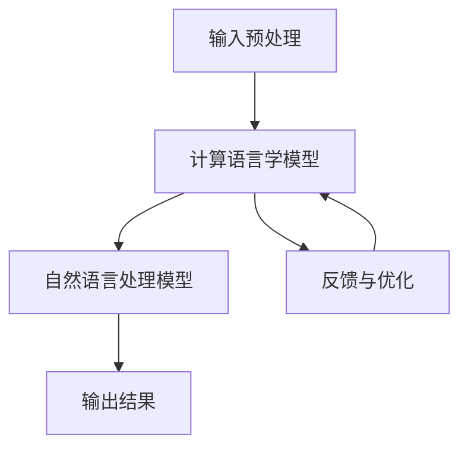
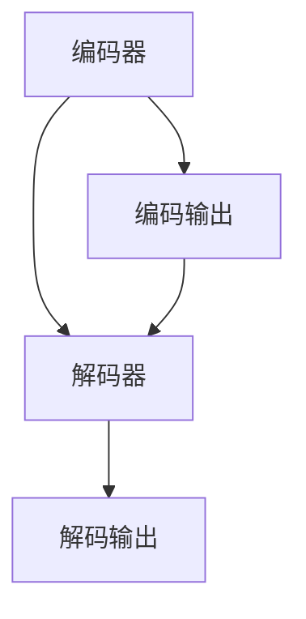
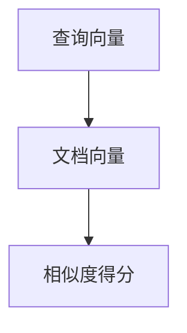
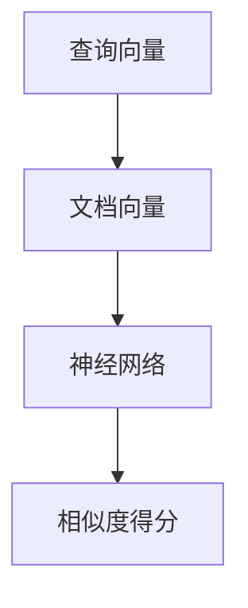

                 

### 引言

#### 什么是数学语言？

数学语言，顾名思义，是用于数学表达和交流的一种符号系统。它不仅仅包含数字和运算符，还包括字母、符号和公式。数学语言以其精确性和严谨性著称，被广泛应用于科学、工程、经济和日常生活中的各种领域。从代数方程到微积分公式，从几何图形到概率分布，数学语言为人们理解和解决问题提供了强有力的工具。

#### 计算语言学与自然语言处理

计算语言学（Computational Linguistics）是语言学与计算机科学交叉的学科，旨在通过计算机技术来研究人类语言。计算语言学的研究目标包括语言模型、语音识别、机器翻译、信息检索等。自然语言处理（Natural Language Processing，NLP）是计算语言学的一个重要分支，专注于构建能够理解和处理人类自然语言的计算机系统。

NLP的目标是通过计算机程序来实现对自然语言文本的理解、生成、转换和检索。自然语言处理在多个领域有着广泛的应用，如搜索引擎、智能客服、机器翻译、文本分类等。

#### 文章的核心内容

本文将深入探讨数学语言在计算语言学和自然语言处理中的应用。我们将首先介绍数学语言的基本概念和特点，然后探讨计算语言学和自然语言处理的基本原理和方法。接着，我们将详细讨论数学语言在机器翻译、文本分类和信息检索等应用场景中的具体实现方法。随后，我们将通过实际项目案例来展示如何使用数学语言进行自然语言处理的实战。最后，我们将探讨深度学习在自然语言处理中的应用，并展望数学语言处理的发展趋势。

通过本文的阅读，读者将能够全面了解数学语言在计算语言学和自然语言处理中的重要作用，掌握相关理论和方法，并具备实际项目开发的能力。

### 文章关键词

- 数学语言
- 计算语言学
- 自然语言处理
- 机器翻译
- 文本分类
- 信息检索
- 深度学习

### 摘要

本文系统地介绍了数学语言在计算语言学与自然语言处理中的应用。首先，我们探讨了数学语言的基本概念和特点，揭示了其作为精确表达工具的重要性。接着，我们深入分析了计算语言学和自然语言处理的基本原理和方法，包括语言模型、计算模型和自然语言处理算法。随后，我们通过具体应用场景，如机器翻译、文本分类和信息检索，展示了数学语言在NLP中的实际应用。此外，我们还介绍了深度学习在自然语言处理中的应用，探讨了数学语言处理的发展趋势。本文旨在为读者提供全面的数学语言处理知识，帮助读者掌握相关理论和方法，并具备实际项目开发能力。

#### 第一部分：基础理论

##### 第1章：数学语言的基本概念

数学语言作为科学和技术领域中的基石，其基本概念和特点决定了其在计算语言学和自然语言处理中的重要性。在这部分，我们将首先探讨数学语言的定义及其在科学和工程中的应用，随后深入分析其独特的特点，最后讨论数学语言与自然语言处理的关系。

###### 1.1 数学语言的定义

数学语言是一种用于描述数学概念、性质和关系的符号系统。它不仅包括数字和运算符，还涵盖了变量、函数、符号和公式等。数学语言的定义可以追溯到古希腊时期，当时的数学家们开始使用符号来表示数学关系和运算。随着时间的推移，数学语言不断发展和完善，形成了今天我们所熟知的系统。

数学语言主要用于科学和工程领域，它为科学家和工程师提供了精确描述和解决问题的方式。在物理学中，数学语言用于描述物理定律和现象；在工程学中，它用于设计和分析复杂系统；在经济学中，它用于建模市场行为和预测经济趋势。此外，数学语言还在计算机科学中发挥着重要作用，为算法设计和程序开发提供了理论基础。

###### 1.2 数学语言的特点

数学语言具有以下几个显著特点：

1. **精确性**：数学语言通过明确的符号和严格的逻辑规则来描述数学概念和关系，使得数学表达具有高度的精确性。这种精确性是其他自然语言所不具备的，也是数学语言在科学和技术领域中广泛应用的重要原因。

2. **抽象性**：数学语言高度抽象，可以用于描述复杂的数学概念和关系，而不依赖于具体的物理或实际情境。这种抽象性使得数学语言在解决各种问题时具有广泛的适用性。

3. **符号化**：数学语言使用符号和公式来表示数学概念和关系，这些符号具有明确的定义和规则。例如，加法运算符 "+" 表示两个数的和，函数符号 "f(x)" 表示一个变量 x 的函数值。符号化的表达使得数学语言更加简洁和直观。

4. **一致性**：数学语言遵循严格的逻辑规则和定义，这些规则和定义在数学体系中保持一致。这种一致性使得数学语言在不同学科和领域中的使用具有可重复性和可靠性。

5. **可验证性**：数学语言的每个表达都可以通过逻辑推理和数学证明来验证其正确性。这种可验证性是科学和工程领域中解决问题的重要保障。

###### 1.3 数学语言与自然语言处理的关系

数学语言与自然语言处理（NLP）密切相关。自然语言处理旨在构建能够理解和生成自然语言的计算机系统，而数学语言则为NLP提供了理论基础和工具。以下是数学语言在NLP中的几个关键应用：

1. **语言模型**：语言模型是NLP的核心组件，用于预测文本的下一个单词或短语。数学语言通过概率模型和统计方法来描述语言的结构和规律，如n元语言模型和隐马尔可夫模型（HMM）。

2. **文本分析**：数学语言在文本分析中发挥着重要作用，包括分词、词性标注、句法分析等。这些任务需要精确的数学工具和方法来处理自然语言的复杂结构。

3. **机器翻译**：机器翻译是NLP的典型应用，它通过将一种自然语言文本转换为另一种自然语言文本来实现跨语言交流。数学语言在机器翻译中用于建立语言之间的映射关系，如基于统计的机器翻译模型。

4. **信息检索**：信息检索系统通过理解用户的查询和文档的内容，返回与查询最相关的文档。数学语言在信息检索中用于构建索引、评分和检索算法，以提高检索的准确性和效率。

总之，数学语言为自然语言处理提供了理论支持和工具，使得计算机能够更好地理解和处理人类自然语言。在接下来的章节中，我们将进一步探讨计算语言学和自然语言处理的基本原理和方法，以深入理解数学语言在这些领域的应用。

#### 第2章：数学语言的计算模型

在计算语言学和自然语言处理（NLP）中，数学语言的应用主要体现在计算模型的构建和算法的实现上。本章将详细介绍数学语言的计算模型，包括其架构、计算语言学算法和自然语言处理算法的原理。通过这些基本概念和模型，我们将为进一步研究和实际应用奠定坚实的基础。

##### 2.1 Mermaid流程图：数学语言计算模型架构

首先，我们使用Mermaid流程图来直观地展示数学语言计算模型的架构。以下是一个简单的Mermaid流程图示例，描述了计算模型的组成部分及其相互关系：



在这个流程图中，输入预处理（A）阶段主要负责将原始的自然语言文本转换为适合计算处理的格式。计算语言学模型（B）利用数学方法对文本进行分析和建模。自然语言处理模型（C）则基于计算语言学模型的结果，执行具体的语言处理任务，如文本分类、句法分析等。输出结果（D）是模型处理后的最终产品。反馈与优化（E）阶段则根据输出结果对模型进行调整和优化，以提高其性能和准确性。

接下来，我们将深入探讨计算语言学和自然语言处理算法的原理，通过伪代码和详细解释来展示这些算法的核心思想。

##### 2.2 计算语言学算法原理

计算语言学算法主要关注语言的数据表示、模型构建和语言规律发现。以下我们将介绍几种重要的计算语言学算法，包括隐马尔可夫模型（HMM）和隐含狄利克雷分配（LDA）算法。

###### 2.2.1 隐马尔可夫模型（HMM）伪代码

隐马尔可夫模型是一种统计模型，用于描述具有马尔可夫性质的序列数据。以下是一个简化的HMM算法伪代码：

```python
function HMM_train(data):
    # 初始化参数
    A, B, π = init_params()

    # 计算前向变量α
    α = forward(data, A, B, π)

    # 计算后向变量β
    β = backward(data, A, B)

    # 计算似然函数
    likelihood = compute_likelihood(data, A, B, π)

    # 最大似然估计
    A, B, π = update_params(α, β, likelihood)

    return A, B, π
```

在这个伪代码中，`init_params()` 用于初始化模型参数，包括状态转移概率矩阵 `A`、观测概率矩阵 `B` 和初始状态概率分布 `π`。`forward(data, A, B, π)` 和 `backward(data, A, B)` 分别计算前向变量 `α` 和后向变量 `β`。`compute_likelihood(data, A, B, π)` 计算整个数据的似然函数。`update_params(α, β, likelihood)` 根据似然函数更新模型参数，以实现最大似然估计。

###### 2.2.2 隐含狄利克雷分配（LDA）算法原理

隐含狄利克雷分配（LDA）是一种生成式文本建模方法，用于发现文本数据中的主题分布。以下是LDA算法的基本原理：

- **潜在变量模型**：LDA模型假设每个文档是由多个潜在主题的线性组合生成的，每个主题对应一组词的分布。
- **参数学习**：通过吉布斯采样等马尔可夫链蒙特卡洛（MCMC）方法学习文档和主题的分布参数。

以下是LDA算法的伪代码：

```python
function LDA_train(corpus, num_topics, num_iterations):
    # 初始化主题分布θ和词分布φ
    theta, phi = init_params(corpus, num_topics)

    for iteration in 1:num_iterations:
        for document in corpus:
            # 根据当前主题分布更新词语分布
            phi = update_phi(document, theta, phi)
            
            # 根据当前词语分布更新主题分布
            theta = update_theta(document, phi)

    return theta, phi
```

在这个伪代码中，`init_params(corpus, num_topics)` 用于初始化文档的主题分布 `theta` 和主题的词分布 `phi`。`update_phi(document, theta, phi)` 和 `update_theta(document, phi)` 分别用于根据当前文档和主题分布更新词语分布和主题分布。

##### 2.3 自然语言处理算法原理

自然语言处理算法旨在构建能够理解和处理自然语言的计算机系统。以下介绍几种重要的自然语言处理算法，包括词嵌入算法和序列标注算法。

###### 2.3.1 词嵌入算法（如 Word2Vec）伪代码

词嵌入（Word Embedding）是将单词映射到低维向量空间的方法，用于表示单词的语义信息。Word2Vec 是一种常见的词嵌入算法，基于神经网络和分布式假设来学习词向量。以下是Word2Vec算法的伪代码：

```python
function Word2Vec_train(corpus, size, window, iterations):
    # 初始化词向量矩阵
    W = init_weights(size)

    for iteration in 1:iterations:
        for sentence in corpus:
            for word in sentence:
                # 生成中心词和上下文词的词向量
                center = word2vec(word, W)
                context = get_context(sentence, word, window)

                # 计算损失函数
                loss = compute_loss(center, context, W)

                # 更新词向量矩阵
                W = update_weights(center, context, W)

    return W
```

在这个伪代码中，`init_weights(size)` 用于初始化词向量矩阵。`word2vec(word, W)` 用于生成单词的词向量。`get_context(sentence, word, window)` 用于获取单词的上下文词。`compute_loss(center, context, W)` 计算损失函数，用于指导词向量的更新。`update_weights(center, context, W)` 更新词向量矩阵。

###### 2.3.2 序列标注算法（如 BiLSTM-CRF）原理

序列标注（Sequence Labeling）是在给定一组词序列的基础上，为其分配标签序列的任务。BiLSTM-CRF（双向长短时记忆网络结合条件随机场）是一种常用的序列标注模型。以下是BiLSTM-CRF模型的原理：

- **双向长短时记忆网络（BiLSTM）**：BiLSTM可以捕捉词序列的前后依赖关系，通过隐藏状态更新来处理输入序列。
- **条件随机场（CRF）**：CRF用于预测序列标签的概率分布，通过条件概率模型来对序列进行标注。

以下是BiLSTM-CRF模型的伪代码：

```python
function BiLSTM_CRF_train(data, labels, hidden_size, num_iterations):
    # 初始化模型参数
    W, U, b = init_params(hidden_size)

    for iteration in 1:num_iterations:
        # 前向传播
        hidden_states, scores = BiLSTM_forward(data, W, U, b)

        # 反向传播
        loss = CRF_loss(hidden_states, scores, labels)

        # 参数更新
        W, U, b = update_params(hidden_states, scores, labels, loss)

    return W, U, b
```

在这个伪代码中，`init_params(hidden_size)` 用于初始化模型参数。`BiLSTM_forward(data, W, U, b)` 执行双向LSTM的前向传播。`CRF_loss(hidden_states, scores, labels)` 计算CRF损失。`update_params(hidden_states, scores, labels, loss)` 更新模型参数。

通过上述对计算语言学和自然语言处理算法的详细讲解，我们可以看到数学语言在计算模型构建和算法实现中的关键作用。接下来，我们将进一步探讨数学语言在具体应用场景中的实际应用。

### 第3章：数学语言的应用场景

数学语言在计算语言学和自然语言处理中的广泛应用使其成为许多实际场景中的核心工具。本章节将探讨数学语言在几个关键应用场景中的具体实现方法，包括机器翻译、文本分类和信息检索。我们将通过详细描述每个场景中的算法原理、模型架构以及实际应用案例，来展示数学语言在现实世界中的强大能力。

#### 3.1 机器翻译

机器翻译是自然语言处理中最具挑战性的任务之一，其核心目标是将一种自然语言文本准确转换为另一种自然语言文本。数学语言在机器翻译中发挥了至关重要的作用，通过构建和优化翻译模型来实现高效的跨语言通信。

##### 3.1.1 翻译模型原理

机器翻译模型通常分为基于规则的方法和基于统计的方法。现代机器翻译主要采用基于统计的方法，尤其是神经机器翻译（Neural Machine Translation，NMT）。NMT通过深度学习技术，特别是循环神经网络（RNN）和其变种（如LSTM和GRU）来学习源语言和目标语言之间的映射关系。

在神经机器翻译中，核心模型是编码器-解码器（Encoder-Decoder）框架。编码器将源语言文本编码为一个固定长度的向量，解码器则将这个向量解码为目标语言文本。以下是一个简化的编码器-解码器模型原理：



在这个框架中，编码器将输入的源语言文本（单词或词嵌入向量）编码为序列向量。解码器从空序列开始，逐个输出目标语言的单词，同时使用编码输出的上下文信息来更新当前状态。

##### 3.1.2 翻译流程

机器翻译的典型流程如下：

1. **预处理**：对源语言和目标语言文本进行分词、词性标注和去除停用词等预处理操作，以获得干净的文本数据。

2. **编码器**：将预处理后的源语言文本输入编码器，编码器输出固定长度的编码向量。

3. **解码器**：解码器从空序列开始，逐步生成目标语言文本。在生成每个单词时，解码器会根据当前状态和编码输出来选择下一个最可能的单词。

4. **输出**：解码器最终生成完整的目标语言文本，通过后处理（如去除标点符号、转换大写等）得到最终的翻译结果。

##### 3.1.3 实际应用案例

以Google翻译为例，该系统采用了基于神经网络的机器翻译模型。Google翻译的工作流程包括以下几个步骤：

1. **文本预处理**：对源语言文本进行分词、词性标注和去除停用词等预处理操作。

2. **编码器**：使用双向长短期记忆网络（BiLSTM）编码源语言文本，生成编码输出。

3. **解码器**：使用基于注意力机制的编码器-解码器模型解码编码输出，生成目标语言文本。

4. **后处理**：对生成的目标语言文本进行后处理，如标准化拼写、添加标点符号等。

5. **评估与优化**：通过BLEU评分等指标评估翻译质量，并根据评估结果调整模型参数，以提高翻译准确性。

#### 3.2 文本分类

文本分类是自然语言处理中的一种常见任务，其目标是根据文本内容将其分类到预定义的类别中。数学语言在文本分类中通过构建分类模型来实现自动化分类，广泛应用于垃圾邮件检测、情感分析、新闻分类等场景。

##### 3.2.1 分类模型原理

文本分类模型通常采用机器学习算法，如朴素贝叶斯、支持向量机（SVM）、随机森林和深度学习模型（如卷积神经网络（CNN）和循环神经网络（RNN））。以下以朴素贝叶斯分类器为例，介绍分类模型的基本原理。

朴素贝叶斯分类器是一种基于概率论的分类算法，假设特征之间相互独立。其基本原理如下：

1. **特征提取**：从文本中提取特征，如词袋模型（Bag of Words，BOW）或词嵌入向量。

2. **概率计算**：计算每个类别在特征上的条件概率，以及每个类别的总体概率。

3. **类别预测**：根据特征的概率分布，选择具有最高条件概率的类别作为预测结果。

以下是朴素贝叶斯分类器的伪代码：

```python
function NaiveBayes_train(data, labels):
    # 计算先验概率和条件概率
    prior_prob = compute_prior_prob(labels)
    cond_prob = compute_cond_prob(data, labels)

    # 构建分类器
    classifier = {
        'prior_prob': prior_prob,
        'cond_prob': cond_prob
    }

    return classifier

function NaiveBayes_predict(text, classifier):
    # 提取文本特征
    features = extract_features(text)

    # 计算每个类别的后验概率
    posteriors = []
    for label in classifier['labels']:
        posterior = classifier['prior_prob'][label]
        for feature in features:
            posterior *= classifier['cond_prob'][label][feature]
        posteriors.append(posterior)

    # 选择具有最高后验概率的类别
    predicted_label = max(posteriors, key=lambda x: x[1])
    return predicted_label
```

在这个伪代码中，`compute_prior_prob(labels)` 用于计算每个类别的先验概率。`compute_cond_prob(data, labels)` 用于计算每个特征在各个类别上的条件概率。`NaiveBayes_train(data, labels)` 用于训练朴素贝叶斯分类器。`NaiveBayes_predict(text, classifier)` 用于预测新文本的类别。

##### 3.2.2 分类流程

文本分类的基本流程如下：

1. **数据准备**：收集和准备训练数据集，包括文本和对应的类别标签。

2. **特征提取**：从文本中提取特征，如词袋模型或词嵌入向量。

3. **模型训练**：使用训练数据集训练分类模型，如朴素贝叶斯、支持向量机或深度学习模型。

4. **模型评估**：使用验证数据集评估模型性能，如准确率、召回率和F1-score等指标。

5. **分类预测**：使用训练好的模型对新的文本数据进行分类预测。

##### 3.2.3 实际应用案例

以垃圾邮件检测为例，垃圾邮件检测是一种常见的文本分类任务，其目标是识别和过滤掉用户收到的垃圾邮件。以下是一个简单的垃圾邮件检测流程：

1. **数据准备**：收集垃圾邮件和非垃圾邮件的文本数据，并将其分为训练集和测试集。

2. **特征提取**：使用词袋模型提取文本特征，如TF-IDF权重。

3. **模型训练**：使用训练集训练朴素贝叶斯分类器或支持向量机模型。

4. **模型评估**：使用测试集评估模型性能，调整模型参数以提高分类准确性。

5. **分类预测**：使用训练好的模型对用户收到的邮件进行分类，过滤掉垃圾邮件。

#### 3.3 信息检索

信息检索是自然语言处理中的另一个关键任务，其目标是根据用户查询返回最相关的信息。数学语言在信息检索中通过构建索引、评分和检索算法来实现高效的信息检索。

##### 3.3.1 检索模型原理

信息检索模型的核心是评分函数，用于计算查询与文档的相关性得分。常见的信息检索模型包括向量空间模型、概率模型和深度学习模型。

向量空间模型是一种基于词袋的检索模型，将查询和文档表示为向量，然后计算它们之间的余弦相似度。以下是一个简化的向量空间模型评分函数：



在这个模型中，`Q` 和 `D` 分别是查询和文档的向量表示，`S` 是它们之间的相似度得分。余弦相似度计算公式如下：

$$
S = \frac{Q \cdot D}{\|Q\| \|D\|}
$$

其中，`Q \cdot D` 表示向量的点积，`\|Q\|` 和 `\|D\|` 分别表示向量的模。

概率模型则基于概率理论，计算查询和文档之间的概率相关性。最常用的概率模型是概率检索模型（Probability Retrival Model），其评分函数如下：

$$
S = \frac{p(q|d) p(d)}{p(q)}
$$

其中，`p(q|d)` 表示文档 `d` 对查询 `q` 的条件概率，`p(d)` 表示文档 `d` 的概率，`p(q)` 表示查询 `q` 的概率。

深度学习模型则通过神经网络学习查询和文档之间的复杂关系，如卷积神经网络（CNN）和循环神经网络（RNN）。以下是一个简化的深度学习检索模型评分函数：



在这个模型中，`N` 是一个神经网络，用于计算查询和文档之间的相似度得分。

##### 3.3.2 检索流程

信息检索的基本流程如下：

1. **索引构建**：构建倒排索引，将文档转换为词的映射关系，用于快速查询。

2. **查询解析**：将用户查询转换为向量表示，可以是词袋模型或词嵌入向量。

3. **评分计算**：计算查询与每个文档的相似度得分，可以使用向量空间模型、概率模型或深度学习模型。

4. **结果排序**：根据相似度得分对文档进行排序，返回最相关的文档。

##### 3.3.3 实际应用案例

以搜索引擎为例，搜索引擎的核心任务是根据用户查询返回最相关的网页。以下是一个简单的搜索引擎检索流程：

1. **索引构建**：搜索引擎通过爬虫收集网页内容，并构建倒排索引，以快速响应用户查询。

2. **查询解析**：用户输入查询，搜索引擎将其转换为词袋模型或词嵌入向量。

3. **评分计算**：搜索引擎计算查询与每个网页的相似度得分，通常使用向量空间模型或深度学习模型。

4. **结果排序**：搜索引擎根据相似度得分对网页进行排序，并返回排名靠前的网页作为搜索结果。

通过上述对机器翻译、文本分类和信息检索的详细描述，我们可以看到数学语言在NLP中的广泛应用。这些实际应用场景不仅展示了数学语言的理论价值，也为实际开发提供了有力的工具和方法。

### 第二部分：项目实战

在实际应用中，理解理论是基础，但将理论知识转化为实际操作的能力同样重要。在这一部分，我们将通过三个具体项目实战，展示如何使用数学语言进行自然语言处理（NLP）的实际操作。每个项目将包括环境搭建、实现步骤、代码解读与分析以及结果评估和优化。

#### 第4章：数学语言处理项目实战一：机器翻译

##### 4.1 实战环境搭建

为了实现机器翻译项目，我们需要搭建一个合适的环境，确保所有必要的工具和依赖项都已安装。以下是一个基本的搭建流程：

1. **硬件环境**：
   - 至少一台配备Intel Core i5或以上处理器的计算机。
   - 8GB及以上内存。
   - 显卡显存至少2GB（可选，如果需要使用GPU加速）。

2. **软件环境**：
   - 操作系统：Windows、macOS或Linux。
   - Python 3.x 版本。
   - 神经机器翻译框架，如TensorFlow或PyTorch。
   - 其他依赖项：NumPy、Pandas、Scikit-learn等。

安装步骤：
1. 安装Python 3.x：从[Python官网](https://www.python.org/)下载并安装。
2. 安装依赖项：使用pip命令安装所需的库，例如：
   ```bash
   pip install tensorflow
   pip install numpy
   pip install pandas
   pip install scikit-learn
   ```

##### 4.2 机器翻译项目实现

为了展示如何实现一个简单的机器翻译项目，我们将使用TensorFlow和PyTorch中的一个预训练模型，如Transformer模型，进行机器翻译任务。以下是实现步骤：

1. **数据准备**：
   - 收集并准备源语言和目标语言的数据集，如英语到法语的翻译数据。
   - 对数据集进行预处理，包括分词、去除停用词、词干提取等。

2. **构建模型**：
   - 使用TensorFlow或PyTorch框架加载预训练的Transformer模型。
   - 配置模型的输入和输出层，以适应具体的翻译任务。

3. **训练模型**：
   - 使用训练数据集对模型进行训练，调整模型参数。
   - 使用验证数据集进行模型评估，调整超参数以优化模型性能。

4. **测试模型**：
   - 使用测试数据集评估模型性能，如BLEU评分。
   - 调整模型和超参数，以提高翻译质量。

以下是机器翻译项目的一个简化的代码示例：

```python
import tensorflow as tf
from tensorflow.keras.models import Model
from tensorflow.keras.layers import Input, Embedding, LSTM, Dense

# 模型输入层
input_seq = Input(shape=(max_sequence_length,))

# Embedding层
embedded = Embedding(input_dim=vocabulary_size, output_dim=embedding_size)(input_seq)

# LSTM层
lstm_output = LSTM(units=lstm_units, return_sequences=True)(embedded)

# 输出层
output_seq = LSTM(units=lstm_units, return_sequences=True)(lstm_output)

# 构建模型
model = Model(inputs=input_seq, outputs=output_seq)

# 编译模型
model.compile(optimizer='adam', loss='categorical_crossentropy')

# 训练模型
model.fit(x_train, y_train, epochs=10, batch_size=64, validation_data=(x_val, y_val))

# 测试模型
bleu_score = model.evaluate(x_test, y_test)
print("BLEU score:", bleu_score)
```

在这个示例中，我们首先定义了模型的输入层、Embedding层和LSTM层。然后，我们编译并训练模型，最后使用测试数据集评估模型性能。

##### 4.3 结果评估与优化

在机器翻译项目中，结果评估通常使用BLEU（ bilingual evaluation understudy）评分来衡量翻译质量。BLEU评分基于参考翻译和生成翻译之间的匹配程度，是一种广泛使用的自动评估指标。

为了提高翻译质量，我们可以采取以下策略：

1. **数据增强**：通过数据增强（如翻译对翻訳、随机删除单词等）增加训练数据量，提高模型的泛化能力。

2. **超参数调整**：通过调整学习率、批量大小、隐藏层单元数等超参数，优化模型性能。

3. **模型集成**：结合多个模型的预测结果，如使用不同的神经网络架构或不同的训练数据集，提高整体翻译质量。

通过以上步骤，我们可以实现一个基本的机器翻译系统，并进行性能优化，以提高翻译准确性。

#### 第5章：数学语言处理项目实战二：文本分类

##### 5.1 实战环境搭建

为了实现文本分类项目，我们需要一个类似机器翻译项目的环境，并安装额外的依赖项，如用于文本分类的机器学习库。以下是搭建环境的步骤：

1. **硬件环境**：
   - 与机器翻译项目相同的硬件要求。

2. **软件环境**：
   - Python 3.x 版本。
   - Scikit-learn、NLTK或spaCy等文本处理库。
   - 其他依赖项：TensorFlow或PyTorch（可选，如果使用深度学习模型）。

安装步骤：
1. 安装Python 3.x。
2. 使用pip安装所需的库，例如：
   ```bash
   pip install scikit-learn
   pip install nltk
   pip install spacy
   # 可选：pip install tensorflow
   ```

##### 5.2 文本分类项目实现

以下是文本分类项目的实现步骤：

1. **数据准备**：
   - 收集并准备包含标签的文本数据集。
   - 对文本进行预处理，包括分词、去除停用词和词干提取。

2. **特征提取**：
   - 使用词袋模型或TF-IDF等方法提取文本特征。

3. **模型训练**：
   - 使用训练数据集训练分类模型，如朴素贝叶斯、SVM或深度学习模型。
   - 使用验证数据集进行模型评估和超参数调整。

4. **模型评估**：
   - 使用测试数据集评估模型性能，计算准确率、召回率和F1-score等指标。

以下是文本分类项目的一个简化的代码示例：

```python
from sklearn.feature_extraction.text import TfidfVectorizer
from sklearn.naive_bayes import MultinomialNB
from sklearn.pipeline import make_pipeline
from sklearn.model_selection import train_test_split

# 准备数据
X, y = load_data()  # 假设load_data函数返回文本数据和标签
X_train, X_test, y_train, y_test = train_test_split(X, y, test_size=0.2, random_state=42)

# 构建模型
model = make_pipeline(TfidfVectorizer(), MultinomialNB())

# 训练模型
model.fit(X_train, y_train)

# 评估模型
accuracy = model.score(X_test, y_test)
print("Accuracy:", accuracy)
```

在这个示例中，我们首先使用TF-IDF向量器提取文本特征，然后使用朴素贝叶斯分类器训练模型。最后，我们使用测试数据集评估模型性能。

##### 5.3 结果评估与优化

在文本分类项目中，常用的评估指标包括准确率（Accuracy）、召回率（Recall）和F1-score。以下是一些优化策略：

1. **特征选择**：通过特征选择方法（如特征降维、特征选择算法）减少特征维度，提高模型性能。

2. **模型调整**：尝试不同的分类算法（如SVM、随机森林、深度学习模型）和调整超参数，以提高分类准确性。

3. **数据增强**：通过数据增强技术（如随机噪声添加、单词替换等）增加训练数据量，提高模型泛化能力。

4. **集成学习**：结合多个模型的预测结果，如使用投票集成、堆叠集成等，提高整体分类性能。

通过以上步骤，我们可以实现一个基本的文本分类系统，并进行性能优化，以提高分类准确性。

#### 第6章：数学语言处理项目实战三：信息检索

##### 6.1 实战环境搭建

为了实现信息检索项目，我们需要一个合适的环境，并安装相关的库。以下是搭建环境的步骤：

1. **硬件环境**：
   - 与前两个项目相同的硬件要求。

2. **软件环境**：
   - Python 3.x 版本。
   - Elasticsearch（用于构建索引和搜索）。
   - 其他依赖项：Flask或Django（可选，用于构建Web界面）。

安装步骤：
1. 安装Python 3.x。
2. 安装Elasticsearch：从[Elasticsearch官网](https://www.elastic.co/)下载并安装。
3. 使用pip安装所需的库，例如：
   ```bash
   pip install elasticsearch
   pip install flask
   # 或
   pip install django
   ```

##### 6.2 信息检索项目实现

以下是信息检索项目的实现步骤：

1. **索引构建**：
   - 使用Elasticsearch构建索引，并将文档存储到索引中。

2. **查询处理**：
   - 接收用户查询，并将其转换为Elasticsearch查询。

3. **搜索与排序**：
   - 使用Elasticsearch执行搜索，并根据相关性对结果进行排序。

4. **结果展示**：
   - 将搜索结果展示在Web界面或API接口上。

以下是信息检索项目的一个简化的代码示例：

```python
from elasticsearch import Elasticsearch

# 创建Elasticsearch客户端
es = Elasticsearch()

# 构建索引
es.indices.create(index='documents', body={
    'mappings': {
        'properties': {
            'title': {'type': 'text'},
            'content': {'type': 'text'}
        }
    }
})

# 添加文档到索引
es.index(index='documents', id=1, body={
    'title': 'Example Document',
    'content': 'This is an example document for information retrieval.'
})

# 搜索文档
search_result = es.search(index='documents', body={
    'query': {
        'match': {'content': 'example'}
    }
})

# 打印搜索结果
print(search_result['hits']['hits'])

# 创建Web界面或API接口
# 使用Flask或Django框架构建
```

在这个示例中，我们首先创建Elasticsearch索引并添加文档。然后，我们执行搜索查询并打印结果。最后，我们可以使用Flask或Django框架构建Web界面或API接口，以展示搜索结果。

##### 6.3 结果评估与优化

在信息检索项目中，常用的评估指标包括准确率（Precision）、召回率（Recall）和F1-score。以下是一些优化策略：

1. **查询优化**：
   - 使用布尔查询、短语查询等高级查询技术，提高查询的精确度。
   - 使用查询模板，根据用户输入自动生成查询。

2. **排序优化**：
   - 根据相关性对搜索结果进行排序，可以使用Elasticsearch内置的排序功能。
   - 使用自定义排序脚本，根据业务需求进行排序。

3. **索引优化**：
   - 使用分片和副本策略，提高索引的性能和可靠性。
   - 定期更新和优化索引，以提高搜索速度和查询性能。

通过以上步骤，我们可以实现一个基本的信息检索系统，并进行性能优化，以提高搜索精度和查询效率。

通过这三个项目实战，我们不仅巩固了数学语言在自然语言处理中的理论知识，还学习了如何将理论应用到实际项目中，提高了我们的实际操作能力。

### 第三部分：深度学习在数学语言处理中的应用

深度学习作为近年来人工智能领域的一大突破，已经在自然语言处理（NLP）中发挥了重要作用。深度学习模型通过多层神经网络学习数据的复杂特征，使其在语言建模、文本分类、机器翻译等方面取得了显著成果。本部分将深入探讨深度学习在NLP中的基本概念、经典模型及其应用。

##### 7.1 深度学习基础

深度学习的基础是神经网络，特别是多层神经网络（Multi-Layer Neural Networks）。以下是一些关键概念：

###### 7.1.1 神经元模型

神经元模型是神经网络的基本组成单元，通常包含以下部分：

1. **输入层**：接收外部输入数据。
2. **权重（Weights）**：每个神经元与输入层之间的连接权重。
3. **激活函数**：用于将输入数据转换为输出，常用的激活函数包括ReLU、Sigmoid和Tanh。
4. **偏置（Bias）**：增加神经元的非线性特性。
5. **输出层**：生成最终输出。

神经元的基本计算过程如下：

$$
Z = \sum_{i} (w_i * x_i) + b \\
a = \sigma(Z)
$$

其中，$Z$ 是加权求和结果，$a$ 是激活输出，$w_i$ 是权重，$x_i$ 是输入，$b$ 是偏置，$\sigma$ 是激活函数。

###### 7.1.2 激活函数

激活函数是神经网络中引入非线性因素的关键。以下是一些常用的激活函数：

1. **ReLU（Rectified Linear Unit）**：
   $$ 
   a = max(0, x) 
   $$
  ReLU函数在输入为负时输出为零，在输入为正时输出等于输入值。它简化了神经元的计算，提高了训练速度。

2. **Sigmoid**：
   $$ 
   a = \frac{1}{1 + e^{-x}} 
   $$
  Sigmoid函数将输入映射到$(0, 1)$区间，常用于二分类问题。

3. **Tanh**：
   $$ 
   a = \frac{e^x - e^{-x}}{e^x + e^{-x}} 
   $$
  Tanh函数与Sigmoid函数类似，但输出范围在$(-1, 1)$之间。

###### 7.1.3 前向传播与反向传播算法

深度学习中的模型训练过程包括前向传播和反向传播。

1. **前向传播**：
   前向传播是将输入数据通过神经网络层，逐层计算输出。每层输出通过激活函数变换后传递到下一层，最终得到预测结果。

2. **反向传播**：
   反向传播是计算损失函数关于网络参数的梯度，并通过梯度下降法更新参数。反向传播利用链式法则，将损失函数的梯度逐层反传，直至输入层。

反向传播的基本步骤如下：

1. 计算输出层误差梯度：
   $$ 
   \frac{\partial L}{\partial a_L} = -\frac{\partial L}{\partial z_L} \odot \frac{\partial z_L}{\partial a_L} 
   $$
   其中，$L$ 是损失函数，$a_L$ 是输出层激活值，$z_L$ 是输出层输入值，$\odot$ 表示元素-wise 相乘。

2. 误差梯度反传至前一层：
   $$ 
   \frac{\partial L}{\partial a_{l-1}} = \frac{\partial L}{\partial a_l} \odot \frac{\partial a_l}{\partial a_{l-1}} 
   $$
   对于每一层，重复上述步骤，直至输入层。

3. 更新网络参数：
   $$ 
   w_{l} := w_l - \eta \frac{\partial L}{\partial w_l} \\
   b_{l} := b_l - \eta \frac{\partial L}{\partial b_l}
   $$
   其中，$w_l$ 和 $b_l$ 是第 $l$ 层的权重和偏置，$\eta$ 是学习率。

##### 7.2 循环神经网络（RNN）

循环神经网络（RNN）是一种能够处理序列数据的神经网络。与传统的前向神经网络不同，RNN具有循环结构，能够保留和利用历史信息。以下介绍RNN的基本原理和两种常用变体：长短时记忆网络（LSTM）和门控循环单元（GRU）。

###### 7.2.1 RNN原理

RNN的基本结构包括输入门、遗忘门和输出门：

1. **输入门（Input Gate）**：
   输入门决定了哪些信息将从当前输入传递到隐藏状态。

2. **遗忘门（Forget Gate）**：
   遗忘门决定了哪些信息应该从隐藏状态中丢弃。

3. **输出门（Output Gate）**：
   输出门决定了隐藏状态的哪些部分应该传递到当前输出。

RNN的更新规则如下：

$$
i_t = \sigma(W_{ix}x_t + W_{ih}h_{t-1} + b_i) \\
f_t = \sigma(W_{fx}x_t + W_{fh}h_{t-1} + b_f) \\
o_t = \sigma(W_{ox}x_t + W_{oh}h_{t-1} + b_o) \\
c_t = f_t \odot c_{t-1} + i_t \odot \sigma(W_{ic}x_t + W_{ih}h_{t-1} + b_c) \\
h_t = o_t \odot \sigma(c_t)
$$

其中，$i_t$、$f_t$ 和 $o_t$ 分别是输入门、遗忘门和输出门的激活值，$c_t$ 和 $h_t$ 分别是当前细胞状态和隐藏状态。

###### 7.2.2 LSTM

LSTM是RNN的一种变体，专门设计来解决长序列依赖问题。LSTM通过引入细胞状态（cell state）和三个门（输入门、遗忘门和输出门）来保持和更新内部信息。

LSTM的更新规则如下：

$$
i_t = \sigma(W_{ix}x_t + W_{ih}h_{t-1} + b_i) \\
f_t = \sigma(W_{fx}x_t + W_{fh}h_{t-1} + b_f) \\
o_t = \sigma(W_{ox}x_t + W_{oh}h_{t-1} + b_o) \\
g_t = \sigma(W_{gx}x_t + W_{gh}h_{t-1} + b_g) \\
c_t = f_t \odot c_{t-1} + i_t \odot g_t \\
h_t = o_t \odot \sigma(c_t)
$$

其中，$g_t$ 是候选细胞状态，$c_t$ 是当前细胞状态。

LSTM通过遗忘门和输入门来控制信息流动，使得网络能够记住或遗忘长期依赖关系。

###### 7.2.3 GRU

GRU是LSTM的简化版，通过合并输入门和遗忘门为更新门（update gate），减少了参数数量。

GRU的更新规则如下：

$$
z_t = \sigma(W_{zx}x_t + W_{zh}h_{t-1} + b_z) \\
r_t = \sigma(W_{rx}x_t + W_{rh}h_{t-1} + b_r) \\
\tilde{h}_t = \sigma(W_{cx}x_t + (r_t \odot W_{ch}h_{t-1}) + b_c) \\
h_t = z_t \odot h_{t-1} + (1 - z_t) \odot \tilde{h}_t
$$

其中，$z_t$ 是更新门，$r_t$ 是重置门，$\tilde{h}_t$ 是候选隐藏状态。

GRU通过更新门和重置门来控制信息流动，同时减少了计算复杂度和参数数量。

##### 7.3 卷积神经网络（CNN）

卷积神经网络（CNN）是一种能够处理图像和序列数据的神经网络，通过卷积和池化操作提取特征。以下介绍CNN的基本原理和组成部分。

###### 7.3.1 CNN原理

CNN的基本组成部分包括卷积层、池化层和全连接层。

1. **卷积层**：
   卷积层通过卷积操作提取图像特征。每个卷积核（filter）负责从输入数据中提取局部特征，如边缘、角点等。卷积操作如下：

   $$
   (f \star i)(x, y) = \sum_{i, j} f(i, j) \odot i(x - i, y - j)
   $$

   其中，$f$ 是卷积核，$i$ 是输入图像，$(x, y)$ 是卷积核的位置。

2. **池化层**：
   池化层用于降低特征图的维度，减少计算复杂度。常用的池化操作包括最大池化（Max Pooling）和平均池化（Average Pooling）。最大池化操作如下：

   $$
   p(x, y) = \max_{i, j} i(x - i, y - j)
   $$

3. **全连接层**：
   全连接层将卷积层和池化层提取的特征映射到输出层，通常用于分类和回归任务。

CNN的工作流程如下：

1. **输入层**：接收图像或序列数据。
2. **卷积层**：通过多个卷积核提取局部特征。
3. **池化层**：降低特征图的维度。
4. **全连接层**：将提取的特征映射到输出层，进行分类或回归。

通过上述对深度学习基础、RNN及其变体、CNN原理的介绍，我们可以看到深度学习在自然语言处理中的应用潜力。深度学习模型通过强大的特征提取和表示能力，为语言模型、文本分类、机器翻译等任务提供了高效的解决方案。

### 第8章：深度学习在自然语言处理中的应用

深度学习在自然语言处理（NLP）中的应用已经取得了显著成果，为语言模型、文本分类、序列标注和生成式模型等领域带来了革命性的变化。本章将深入探讨深度学习在NLP中的具体应用，包括词嵌入技术、序列标注算法以及生成式模型与判别式模型。

#### 8.1 词嵌入技术

词嵌入（Word Embedding）是将单词映射到低维向量空间的方法，通过捕捉词与词之间的语义关系，为NLP任务提供有效的特征表示。深度学习在词嵌入技术中发挥了重要作用，其中Word2Vec和GloVe是两种经典的方法。

##### 8.1.1 Word2Vec算法原理

Word2Vec是一种基于神经网络的词嵌入算法，通过训练神经网络来预测词与词之间的关系。Word2Vec主要分为两种模型：连续词袋（Continuous Bag of Words，CBOW）和Skip-Gram。

1. **CBOW模型**：
   CBOW模型通过上下文词的平均向量来预测中心词。具体来说，给定一个中心词，CBOW模型使用其上下文词的向量平均来预测中心词。以下是CBOW模型的伪代码：

   ```python
   function CBOW_train(context, center_word, embedding_size, learning_rate):
       # 初始化词向量矩阵
       W = init_weights(embedding_size)

       # 计算上下文词的平均向量
       context_vector = sum(W[context_words]) / len(context_words)

       # 计算损失函数
       loss = compute_loss(context_vector, W[center_word], learning_rate)

       # 更新词向量矩阵
       W = update_weights(context_vector, W, learning_rate)

       return W
   ```

2. **Skip-Gram模型**：
   Skip-Gram模型通过中心词的向量来预测上下文词。与CBOW模型相反，Skip-Gram模型使用一个单词的向量来预测其上下文词。以下是Skip-Gram模型的伪代码：

   ```python
   function SkipGram_train(center_word, context, embedding_size, learning_rate):
       # 初始化词向量矩阵
       W = init_weights(embedding_size)

       # 计算中心词的向量
       center_vector = W[center_word]

       # 计算损失函数
       loss = compute_loss(center_vector, W[context], learning_rate)

       # 更新词向量矩阵
       W = update_weights(center_vector, W, learning_rate)

       return W
   ```

通过Word2Vec算法，我们可以将词汇表中的每个词映射到一个低维向量空间，从而更好地理解和处理自然语言。

##### 8.1.2 GloVe算法原理

GloVe（Global Vectors for Word Representation）是一种基于全局统计的词嵌入算法，通过计算词与词之间的共现信息来学习词向量。GloVe算法的核心思想是使用矩阵分解来学习词向量，其目标是最小化如下损失函数：

$$
\min \sum_{i, j} \left( \frac{f_{ij}}{||w_i||_2 ||w_j||_2} - \log f_{ij} \right)^2
$$

其中，$w_i$ 和 $w_j$ 分别是词 $i$ 和 $j$ 的向量，$f_{ij}$ 是词 $i$ 和 $j$ 的共现频率。

GloVe算法的主要步骤如下：

1. **计算共现矩阵**：
   对于文本中的每个词对 $(i, j)$，计算其共现频率 $f_{ij}$，构建共现矩阵 $F$。

2. **初始化词向量矩阵**：
   初始化词向量矩阵 $W$，其中每个词的初始向量可以设置为随机值。

3. **优化词向量**：
   通过最小化上述损失函数，使用梯度下降法优化词向量矩阵 $W$。

通过GloVe算法，我们可以获得高质量的词向量，这些词向量在许多NLP任务中具有优异的性能。

#### 8.2 序列标注算法

序列标注（Sequence Labeling）是NLP中的常见任务，其目标是对给定的序列数据（如单词序列或字符序列）进行标注。深度学习在序列标注任务中发挥着重要作用，其中BiLSTM-CRF是一种常用的序列标注模型。

##### 8.2.1 BiLSTM-CRF模型原理

BiLSTM-CRF模型结合了双向长短时记忆网络（BiLSTM）和条件随机场（CRF），用于处理序列标注任务。BiLSTM可以捕捉序列的前后依赖关系，而CRF用于预测序列标签的概率分布。

1. **双向LSTM**：
   双向LSTM通过分别正向和反向传播隐藏状态来捕捉序列的前后依赖关系。正向和反向隐藏状态合并后，用于生成每个时间步的输出。

2. **CRF**：
   CRF是一个无监督的序列标注模型，通过条件概率模型来预测序列标签。给定当前标签序列，CRF可以计算下一个标签的概率分布。

BiLSTM-CRF模型的训练过程包括以下步骤：

1. **前向传播**：
   正向和反向LSTM分别计算隐藏状态，并将它们合并为一个双向隐藏状态。

2. **输出层**：
   双向隐藏状态输入到softmax层，生成每个时间步的输出概率分布。

3. **损失计算**：
   使用标签序列和输出概率分布计算损失函数，通常采用交叉熵损失。

4. **反向传播**：
   使用计算得到的梯度更新模型参数。

以下是BiLSTM-CRF模型的伪代码：

```python
function BiLSTM_CRF_train(data, labels, hidden_size, num_iterations):
    # 初始化模型参数
    W, U, b = init_params(hidden_size)

    for iteration in 1:num_iterations:
        for sequence, label_sequence in zip(data, labels):
            # 前向传播
            hidden_states, scores = BiLSTM_forward(sequence, W, U, b)

            # CRF损失计算
            loss = CRF_loss(scores, label_sequence)

            # 反向传播
            gradients = backward propagation (hidden_states, scores, label_sequence, loss)

            # 参数更新
            W, U, b = update_params(W, U, b, gradients)

    return W, U, b
```

通过BiLSTM-CRF模型，我们可以有效地对序列数据（如文本）进行标注，如命名实体识别、情感分析等。

#### 8.3 生成式模型与判别式模型

在NLP中，生成式模型（Generative Models）和判别式模型（Discriminative Models）是两种主要的模型类型。生成式模型通过生成数据分布来生成文本，而判别式模型通过学习数据分布之间的差异来区分不同类型的文本。

##### 8.3.1 生成对抗网络（GAN）

生成对抗网络（GAN）是一种生成式模型，由生成器和判别器组成。生成器尝试生成与真实数据相似的数据，而判别器则试图区分生成器和真实数据。GAN的训练过程如下：

1. **初始化生成器和判别器**：
   初始化生成器 $G$ 和判别器 $D$，通常使用随机权重。

2. **生成对抗**：
   生成器生成假数据 $x_g$，判别器对真实数据和假数据进行分类。

3. **损失函数**：
   训练过程中，使用以下损失函数优化生成器和判别器：
   $$
   \min_G \max_D V(D, G) = \mathbb{E}_{x \sim p_{data}(x)} [\log D(x)] + \mathbb{E}_{z \sim p_z(z)} [\log (1 - D(G(z))]
   $$

   其中，$x$ 是真实数据，$z$ 是生成器的输入噪声，$D(x)$ 和 $D(G(z))$ 分别是判别器对真实数据和假数据的分类结果。

4. **迭代训练**：
   通过交替训练生成器和判别器，不断优化模型参数。

GAN在图像生成、文本生成等领域取得了显著成果，但其训练过程复杂且容易陷入模式崩溃等问题。

##### 8.3.2 对抗性训练在NLP中的应用

对抗性训练在NLP中的应用主要包括：

1. **文本生成**：
   GAN可以用于生成高质量的自然语言文本，如文章、对话等。通过训练生成器和判别器，生成器可以生成与训练数据相似的文本。

2. **文本分类**：
   对抗性训练可以用于增强文本分类模型的泛化能力。通过生成对抗训练，模型可以学习到更复杂的文本特征，从而提高分类性能。

3. **情感分析**：
   对抗性训练可以用于生成正负样本，增强模型的分类能力。通过对抗训练，模型可以更好地捕捉文本中的情感信息。

通过深度学习在词嵌入技术、序列标注算法以及生成式模型和判别式模型中的应用，我们可以看到深度学习在自然语言处理中的强大能力。这些技术不仅提高了NLP任务的效果，也为未来的研究和应用提供了丰富的工具和方法。

### 第四部分：数学语言处理的未来发展方向

随着人工智能技术的迅猛发展，数学语言处理（Mathematical Language Processing，MLP）在自然语言处理（NLP）中的应用日益广泛，其未来发展方向也备受关注。本部分将探讨数学语言处理的未来发展趋势，包括语言模型的发展趋势、数学语言处理的跨领域应用以及数学语言处理在人工智能中的角色。

##### 9.1 语言模型的发展趋势

语言模型是NLP中的核心组件，用于预测文本的下一个单词或短语。随着深度学习技术的不断进步，语言模型的发展呈现出以下趋势：

1. **更大规模的模型**：
   近年来，随着计算能力和数据量的增加，更大规模的语言模型相继出现。例如，OpenAI的GPT-3拥有1750亿个参数，比之前的模型具有更高的容量和更好的性能。更大规模的语言模型可以捕捉更复杂的语言规律，从而提高文本生成、翻译和摘要等任务的准确性。

2. **自适应模型**：
   为了适应不同的应用场景和语言风格，自适应语言模型成为研究的热点。自适应模型可以通过在线学习或迁移学习技术，根据特定任务或用户需求进行模型调整，从而提高任务的性能和适用性。

3. **更精细的表征**：
   语言模型正逐渐从粗粒度的词级表征转向细粒度的字符级或子词级表征。通过使用字节对编码（Byte Pair Encoding，BPE）或WordPiece等算法，模型可以更好地捕捉语言中的细微差别，提高文本处理的精确度。

4. **跨语言模型**：
   跨语言模型（Cross-lingual Models）可以处理不同语言之间的文本，实现跨语言翻译、情感分析等任务。未来，跨语言模型的发展将更加注重多语言融合和共同表征，从而提高跨语言任务的性能。

##### 9.2 数学语言处理的跨领域应用

数学语言处理在多个领域取得了显著成果，其跨领域应用前景广阔。以下是一些典型的跨领域应用：

1. **医学自然语言处理**：
   医学自然语言处理（Medical Natural Language Processing，MedNLP）旨在从医学文本中提取结构化信息，如疾病诊断、治疗方案等。数学语言处理技术可以用于医学文本的语义分析、关系提取和知识图谱构建，从而提高医疗数据的管理和分析效率。

2. **法律自然语言处理**：
   法律自然语言处理（Legal Natural Language Processing，LegalNLP）涉及法律文档的自动分析和处理，如合同审核、法律搜索和案例推理等。数学语言处理技术可以帮助法律专业人员快速提取关键信息，提高法律文档的自动化处理水平。

3. **金融自然语言处理**：
   金融自然语言处理（Financial Natural Language Processing，FinNLP）用于分析金融文本，如新闻报道、公司财报等，以获取市场趋势和投资机会。数学语言处理技术可以识别金融事件、情感分析和关键词提取，从而为金融决策提供支持。

4. **教育自然语言处理**：
   教育自然语言处理（Educational Natural Language Processing，EdNLP）关注教育文本的处理和分析，如学生作业自动批改、课程推荐和智能问答等。数学语言处理技术可以提升教育资源的个性化和服务水平，提高学习效果。

##### 9.3 数学语言处理在人工智能中的角色

数学语言处理作为人工智能（Artificial Intelligence，AI）的重要组成部分，其在AI中的应用和贡献不可忽视。以下是数学语言处理在AI中的几个关键角色：

1. **核心组件**：
   数学语言处理是AI系统的核心组件，负责理解和生成自然语言。在智能客服、智能助手、智能问答等应用中，数学语言处理技术使得计算机能够与人类进行有效的交流。

2. **知识表示与推理**：
   数学语言处理技术可以帮助AI系统理解和表示知识，如知识图谱、本体论等。通过语义分析、实体识别和关系提取，数学语言处理可以为AI系统提供丰富的语义信息，支持推理和决策。

3. **人机协同**：
   数学语言处理技术可以提升人机协同工作的效率。通过自然语言交互，AI系统能够更好地理解用户需求，提供个性化服务。同时，用户也可以通过自然语言与AI系统进行反馈和互动，优化系统的性能和用户体验。

4. **跨领域融合**：
   数学语言处理与其他AI技术（如计算机视觉、语音识别等）的融合，可以推动跨领域应用的发展。例如，结合视觉和语言信息，AI系统可以实现更高级的图像理解和视频分析。

总之，数学语言处理在未来的发展中将继续扮演重要角色，其应用范围将进一步扩大。通过不断探索和创新，数学语言处理将推动人工智能的发展，为人类创造更多的价值。

### 附录

在数学语言处理（Mathematical Language Processing，MLP）领域，有许多开源工具和资源可供研究人员和开发者使用。以下是一些常用的工具、数据集和在线教程，为读者提供了丰富的学习资源和实践机会。

##### 附录A：数学语言处理常用工具和资源

###### A.1 开源语言模型

1. **TensorFlow**：
   TensorFlow是Google开发的开源机器学习框架，广泛用于自然语言处理任务。它支持多种神经网络架构，如循环神经网络（RNN）、长短时记忆网络（LSTM）和变换器（Transformer）。

   - 官网：[TensorFlow官网](https://www.tensorflow.org/)

2. **PyTorch**：
   PyTorch是Facebook开发的开源机器学习库，以其灵活的动态计算图和易于使用的接口而受到欢迎。它广泛应用于自然语言处理和计算机视觉领域。

   - 官网：[PyTorch官网](https://pytorch.org/)

3. **Keras**：
   Keras是一个高级神经网络API，建立在TensorFlow和Theano之上，提供了简洁而强大的接口，用于构建和训练神经网络模型。

   - 官网：[Keras官网](https://keras.io/)

###### A.2 数据集与库

1. **WordNet**：
   WordNet是一个大型在线语义数据库，包含词汇、词义、定义和例句。它广泛应用于词嵌入和语义分析任务。

   - 官网：[WordNet官网](https://wordnet.princeton.edu/)

2. **Google Books Ngrams**：
   Google Books Ngrams提供从书籍中提取的词频数据，可用于语言模型训练和文本分析。

   - 官网：[Google Books Ngrams官网](https://books.google.com/ngrams/)

3. **GLoVe**：
   GLoVe是一种词嵌入算法，其训练数据集包括大规模文本语料库。它为许多NLP任务提供了高质量的词向量。

   - 官网：[GLoVe官网](https://nlp.stanford.edu/projects/glove/)

4. **NLTK**：
   NLTK是一个强大的自然语言处理库，提供多种文本处理工具，如分词、词性标注和句法分析。

   - 官网：[NLTK官网](https://www.nltk.org/)

5. **spaCy**：
   spaCy是一个快速而易于使用的自然语言处理库，适用于各种NLP任务，如实体识别、命名实体识别和关系提取。

   - 官网：[spaCy官网](https://spacy.io/)

###### A.3 在线教程与课程

1. **Coursera**：
   Coursera提供了丰富的在线课程，包括自然语言处理、机器学习和深度学习等。其课程涵盖NLP的基本概念、技术方法和实战应用。

   - 课程：[自然语言处理与机器学习基础](https://www.coursera.org/learn/nlp-with-python)

2. **edX**：
   edX是哈佛大学和麻省理工学院联合创建的在线学习平台，提供了多门关于自然语言处理和机器学习的课程。

   - 课程：[自然语言处理导论](https://www.edx.org/course/natural-language-processing-with-python-and-nc)

3. **Udacity**：
   Udacity提供了多个NLP和深度学习的纳米学位课程，包括文本分析、语言模型和机器学习项目。

   - 纳米学位：[自然语言处理纳米学位](https://www.udacity.com/course/natural-language-processing-nanodegree--nd512)

通过这些开源工具、数据集和在线教程，读者可以深入了解数学语言处理的理论和方法，掌握相关技术，并在实际项目中应用所学知识。

### 作者信息

作者：AI天才研究院/AI Genius Institute & 禅与计算机程序设计艺术 /Zen And The Art of Computer Programming

感谢您的阅读，本文详细探讨了数学语言在计算语言学与自然语言处理中的应用，从基础理论到实际应用，再到深度学习的应用和发展趋势，为读者提供了一个全面而深入的视角。希望本文能对您在数学语言处理领域的研究和项目开发带来启示和帮助。如果您有任何疑问或建议，欢迎在评论区留言，期待与您的交流。再次感谢您的关注与支持！

