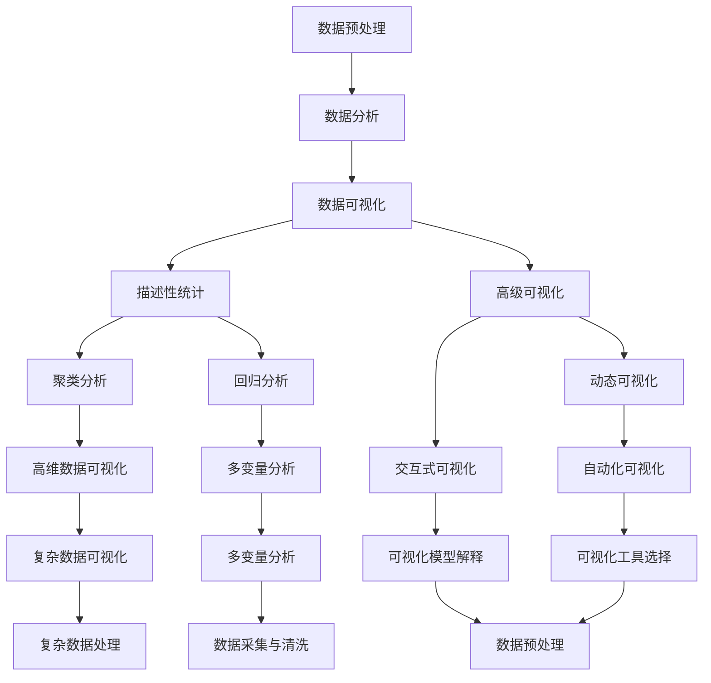

                 

# 数据科学与可视化：将复杂信息转化为直观理解

## 关键词：
- 数据科学
- 可视化
- 复杂信息
- 直观理解
- 数据处理
- 数据分析
- 数据可视化工具

## 摘要：
本文将深入探讨数据科学和可视化之间的紧密联系，阐述如何通过可视化技术将复杂的数据转化为直观且易于理解的信息。文章首先介绍了数据科学的基础概念和应用领域，接着详细讲解了数据处理、数据分析以及数据可视化的方法和原则。随后，文章深入探讨了高级数据可视化技术，包括动态可视化、交互式可视化、增量式可视化和近似可视化等。文章还探讨了复杂数据处理和高维数据的可视化问题，以及数据可视化在人工智能领域的应用。最后，通过实际项目案例，展示了如何从数据采集到可视化实现的全过程，提供了数据可视化实践指南。本文旨在为数据科学和可视化领域的研究者、实践者提供一份详尽且实用的参考资料。

---

## 第一部分：数据科学基础

### 第1章：数据科学概述

#### 1.1 数据科学的历史与现状

数据科学作为一个跨学科领域，起源于20世纪中叶，随着计算机技术的发展和大数据时代的到来，数据科学逐渐成为一门重要的学科。数据科学的历史可以追溯到计算机科学、统计学和领域科学的融合。早期的数据科学主要关注数据的存储、处理和分析，随着技术的进步，数据科学逐渐扩展到机器学习、数据挖掘和人工智能等领域。

在当今社会，数据科学已经成为各行各业不可或缺的一部分。从商业决策、金融分析到医疗研究、天气预报，数据科学无处不在。随着数据的爆炸式增长，数据科学的重要性也日益凸显，它不仅能够帮助企业发现商业机会，还能为政府和社会提供科学的决策支持。

#### 1.2 数据科学的五大领域

数据科学涵盖多个学科领域，主要包括以下五个方面：

1. **数据管理**：涉及数据的收集、存储、处理和保护。数据管理的关键技术包括数据库系统、数据仓库和数据湖。
2. **数据分析**：包括描述性统计、预测分析、数据挖掘和机器学习等，旨在从数据中提取有价值的信息和模式。
3. **数据可视化**：通过图形和图表将数据转化为直观的视觉表现形式，帮助用户理解和分析数据。
4. **数据挖掘**：利用算法和统计方法，从大量数据中自动发现有趣的知识和模式。
5. **人工智能**：将机器学习和深度学习技术应用于数据处理和预测，以实现自动化和智能化的数据处理。

#### 1.3 数据科学在行业中的应用

数据科学在各个行业中的应用日益广泛，以下是几个典型的应用案例：

1. **商业领域**：数据科学可以帮助企业进行市场分析、客户行为预测和供应链优化，从而提高运营效率和盈利能力。
2. **金融领域**：数据科学在金融风险管理、信用评分、投资组合优化和欺诈检测等方面发挥着重要作用。
3. **医疗领域**：数据科学可以帮助医生进行疾病预测、诊断辅助和个性化治疗，从而提高医疗服务的质量和效率。
4. **科学研究**：数据科学在基因组学、环境科学、社会科学等领域为科学家提供了强大的数据分析工具。

### 第2章：数据处理与存储

#### 2.1 数据预处理技术

数据预处理是数据科学中至关重要的一步，它包括数据清洗、数据集成、数据转换和数据归一化等过程。数据预处理的质量直接影响到后续数据分析和可视化的效果。

- **数据清洗**：主要包括去除重复数据、填补缺失值、处理异常值和纠正数据错误等。
- **数据集成**：将来自不同数据源的数据进行整合，以便进行统一的分析。
- **数据转换**：将数据转换为适合分析和可视化的形式，如将分类数据转换为数值形式。
- **数据归一化**：通过缩放数据使其具有相似的尺度，以便进行比较和分析。

#### 2.2 数据存储方案

数据存储是数据科学中的另一个关键环节，合理的存储方案可以提高数据的访问速度和存储效率。

- **关系型数据库**：如MySQL、PostgreSQL等，适用于结构化数据的存储和管理。
- **非关系型数据库**：如MongoDB、Redis等，适用于半结构化或非结构化数据的存储。
- **数据仓库**：如Amazon Redshift、Google BigQuery等，适用于大规模数据的存储和分析。
- **数据湖**：如Amazon S3、Google Cloud Storage等，适用于大规模非结构化数据的存储。

#### 2.3 数据库系统与数据仓库

数据库系统和数据仓库是数据存储和管理的主要工具，它们各有特点和适用场景。

- **数据库系统**：主要用于结构化数据的存储和管理，支持复杂的查询操作和事务处理。
- **数据仓库**：主要用于大规模数据的存储和分析，支持多维数据分析和数据挖掘。

### 第3章：数据分析方法

#### 3.1 描述性统计分析

描述性统计分析是对数据的基本特征进行统计分析，主要包括均值、中位数、标准差、变异系数等统计指标的计算。

- **均值**：数据集合的平均值，反映了数据的中心位置。
- **中位数**：数据集合的中间值，反映了数据的中心位置，对异常值不敏感。
- **标准差**：数据集合的离散程度，反映了数据的波动性。
- **变异系数**：标准差与均值的比值，用于比较不同数据集合的离散程度。

#### 3.2 聚类分析

聚类分析是一种无监督学习方法，用于将数据集合划分为若干个簇，使得同簇的数据之间相似度较高，不同簇的数据之间相似度较低。

- **K-means算法**：一种基于距离度量的聚类算法，通过迭代计算聚类中心和分配数据点。
- **层次聚类算法**：一种基于层次结构的聚类算法，通过自底向上的合并或自顶向下的分裂进行聚类。

#### 3.3 回归分析

回归分析是一种用于研究因变量与自变量之间关系的方法，主要通过拟合回归模型来预测因变量的值。

- **线性回归**：一种简单的回归分析方法，通过拟合一条直线来描述自变量和因变量之间的关系。
- **多项式回归**：一种更复杂的回归分析方法，通过拟合一个多项式函数来描述自变量和因变量之间的关系。

#### 3.4 决策树与随机森林

决策树是一种基于树形结构的分类和回归方法，通过递归划分特征空间来构建决策树。

- **ID3算法**：一种基于信息增益的决策树构建算法。
- **C4.5算法**：一种基于信息增益率的决策树构建算法，能够处理连续特征和缺失值。
- **随机森林**：一种基于决策树的集成学习方法，通过构建多个决策树并进行集成来提高模型的泛化能力。

### 第4章：数据可视化基础

#### 4.1 数据可视化的重要性

数据可视化是将复杂的数据转化为直观的视觉表现形式，有助于用户更好地理解数据背后的信息和趋势。数据可视化的重要性体现在以下几个方面：

- **提高数据可理解性**：通过图形和图表，用户可以快速了解数据的特征和规律。
- **发现数据中的模式**：数据可视化可以帮助用户发现数据中的潜在模式和异常值。
- **支持决策制定**：数据可视化可以为决策者提供有力的数据支持，帮助他们做出更科学的决策。
- **促进知识传播**：数据可视化可以有效地将数据知识和发现传播给更广泛的受众。

#### 4.2 数据可视化原则

为了确保数据可视化能够有效地传达信息，需要遵循以下原则：

- **清晰性**：图表应简洁明了，避免冗余和复杂的布局。
- **一致性**：图表的配色、字体和标记应保持一致，以便用户识别和理解。
- **可读性**：图表的元素应足够大，以便用户在不同设备上都能清晰地查看。
- **准确性**：图表应准确反映数据的特点和趋势，避免误导用户。

#### 4.3 常用数据可视化工具

当前市面上有许多优秀的数据可视化工具，以下是几个常用的工具：

- **Matplotlib**：Python的一个数据可视化库，支持多种图表类型和自定义样式。
- **Seaborn**：Python的一个高级数据可视化库，基于Matplotlib，提供了丰富的内置图表样式。
- **Tableau**：一款商业化的数据可视化工具，支持多种数据源和交互式分析。
- **Power BI**：微软的一款数据可视化工具，提供了丰富的图表和报告功能。
- **D3.js**：一个基于JavaScript的数据可视化库，适用于Web应用程序中的数据可视化。

## 第二部分：数据可视化技术深入

### 第5章：常见数据可视化方法

#### 5.1 条形图与折线图

条形图和折线图是数据可视化中最为常用的图表类型，分别用于展示分类数据和趋势数据。

- **条形图**：通过条形的高度或长度表示数据的大小，适用于展示不同类别之间的比较。
  - **数学模型**：条形图的高度或长度与数据值成比例关系。
  - **数学公式**：\( \text{条形图的高度} = \frac{\text{数据值}}{\text{比例因子}} \)。

- **折线图**：通过连接数据点的线条表示数据的变化趋势，适用于展示时间序列数据。
  - **数学模型**：折线图的斜率表示数据的增长或下降速率。
  - **数学公式**：\( y = mx + b \)，其中\( m \)是斜率，\( b \)是截距。

#### 5.2 饼图与散点图

饼图和散点图是另外两种常用的数据可视化方法，分别用于展示分类数据和关系数据。

- **饼图**：通过扇形的大小表示各分类数据的比例，适用于展示不同类别之间的占比关系。
  - **数学模型**：扇形面积与数据值成比例关系。
  - **数学公式**：\( \text{扇形面积} = \frac{\text{数据值}}{\text{总数}} \times \pi \times r^2 \)。

- **散点图**：通过数据点的坐标表示两个变量之间的关系，适用于展示数据之间的相关性。
  - **数学模型**：\( (x_i, y_i) = (a + bi, c + di) \)，其中\( a \)、\( b \)、\( c \)、\( d \)是参数。

#### 5.3 仪表盘与地图可视化

仪表盘和地图可视化是数据可视化中较为特殊和有用的方法，分别用于展示实时数据和地理空间数据。

- **仪表盘**：通过多个图表和指示器组合展示关键指标和实时数据，适用于监控和分析。
  - **数学模型**：通常不涉及复杂的数学模型，主要通过视觉元素表示数据。
  - **数学公式**：无具体数学公式，主要依靠视觉效果。

- **地图可视化**：通过地图展示地理位置和空间分布，适用于地理数据分析。
  - **数学模型**：涉及地理坐标系统、地图投影和空间分析等。
  - **数学公式**：无具体数学公式，主要依靠地图软件和算法。

### 第6章：高级数据可视化技术

#### 6.1 动态可视化与交互式数据可视化

动态可视化和交互式数据可视化是数据可视化领域的重要发展方向，分别用于展示数据的变化和增强用户的数据交互体验。

- **动态可视化**：通过动画效果展示数据的变化，适用于时间序列分析和动态数据分析。
  - **数学模型**：通常涉及动画原理和数据处理算法。
  - **数学公式**：无具体数学公式，主要依靠动画效果。

- **交互式数据可视化**：通过用户与图表的互动，提供更丰富的数据探索和分析功能。
  - **数学模型**：涉及交互设计、数据结构和算法。
  - **数学公式**：无具体数学公式，主要依靠交互设计。

#### 6.2 增量式可视化与近似可视化

增量式可视化和近似可视化是应对大规模数据的有效方法，分别用于逐步加载和简化大规模数据。

- **增量式可视化**：逐步加载和显示数据，减少内存占用和渲染时间。
  - **数学模型**：涉及增量加载算法和数据结构。
  - **数学公式**：无具体数学公式，主要依靠算法。

- **近似可视化**：通过近似算法和简化模型展示大规模数据的概貌，适用于大数据分析。
  - **数学模型**：涉及近似算法和统计分析。
  - **数学公式**：无具体数学公式，主要依靠算法。

#### 6.3 色彩心理学与可视化设计

色彩心理学和可视化设计是提升数据可视化效果的重要手段，分别关注色彩的选择和图表的整体设计。

- **色彩心理学**：研究色彩对人类心理和行为的影响，用于选择合适的颜色方案。
  - **数学模型**：涉及色彩理论和色彩模型。
  - **数学公式**：无具体数学公式，主要依靠色彩理论。

- **可视化设计**：通过设计原则和创意，提升数据可视化的美观度和用户体验。
  - **数学模型**：涉及设计原则、用户体验和交互设计。
  - **数学公式**：无具体数学公式，主要依靠设计原则。

### 第7章：复杂数据可视化挑战

#### 7.1 复杂数据处理

复杂数据处理是数据可视化中的关键环节，涉及数据的清洗、转换和集成等操作。

- **数据清洗**：去除重复数据、处理缺失值和纠正错误数据。
  - **数学模型**：涉及数据匹配、填充和修正算法。
  - **数学公式**：无具体数学公式，主要依靠算法。

- **数据转换**：将数据转换为适合可视化的格式。
  - **数学模型**：涉及数据归一化、标准化和特征提取算法。
  - **数学公式**：无具体数学公式，主要依靠算法。

- **数据集成**：将来自不同数据源的数据进行整合。
  - **数学模型**：涉及数据关联、合并和映射算法。
  - **数学公式**：无具体数学公式，主要依靠算法。

#### 7.2 高维数据的可视化

高维数据的可视化是数据可视化中的难点和挑战，涉及数据降维和可视化方法的优化。

- **数据降维**：将高维数据转换为低维数据，便于可视化。
  - **数学模型**：涉及主成分分析（PCA）、线性判别分析（LDA）等降维方法。
  - **数学公式**：无具体数学公式，主要依靠算法。

- **可视化方法**：选择合适的可视化方法展示高维数据。
  - **数学模型**：涉及散点图、矩阵图、热力图等可视化方法。
  - **数学公式**：无具体数学公式，主要依靠算法。

#### 7.3 多变量分析

多变量分析是数据科学中的一种重要分析方法，用于研究多个变量之间的关系。

- **线性回归**：通过拟合线性模型分析自变量和因变量之间的关系。
  - **数学模型**：线性回归模型。
  - **数学公式**：\( y = mx + b \)，其中\( m \)是斜率，\( b \)是截距。

- **聚类分析**：通过划分簇分析多个变量之间的相似性和差异性。
  - **数学模型**：K-means、层次聚类等聚类方法。
  - **数学公式**：无具体数学公式，主要依靠算法。

- **相关分析**：通过计算变量之间的相关性分析变量之间的关系。
  - **数学模型**：皮尔逊相关系数、斯皮尔曼相关系数等。
  - **数学公式**：\( \rho = \frac{\sum{(x_i - \bar{x})(y_i - \bar{y})}}{\sqrt{\sum{(x_i - \bar{x})^2} \sum{(y_i - \bar{y})^2}}} \)。

### 第8章：数据可视化与人工智能

#### 8.1 可视化在机器学习中的应用

可视化技术在机器学习中有广泛的应用，有助于理解模型的运行过程和结果。

- **模型训练可视化**：通过可视化展示模型在训练过程中的迭代过程和损失函数的变化。
  - **数学模型**：涉及梯度下降、反向传播等算法。
  - **数学公式**：无具体数学公式，主要依靠算法。

- **模型评估可视化**：通过可视化展示模型的准确率、召回率、F1分数等评估指标。
  - **数学模型**：涉及分类评价指标的计算。
  - **数学公式**：无具体数学公式，主要依靠算法。

- **特征可视化**：通过可视化展示特征的重要性和关系，有助于特征选择和模型优化。
  - **数学模型**：涉及特征提取和降维算法。
  - **数学公式**：无具体数学公式，主要依靠算法。

#### 8.2 可视化模型解释与可靠性评估

可视化技术在模型解释和可靠性评估中发挥着重要作用，有助于提高模型的透明度和可信度。

- **模型解释可视化**：通过可视化展示模型的内部结构和决策过程，有助于理解模型的运作机制。
  - **数学模型**：涉及决策树、神经网络等模型的可视化方法。
  - **数学公式**：无具体数学公式，主要依靠算法。

- **模型可靠性评估**：通过可视化展示模型的预测结果和不确定性，有助于评估模型的可靠性和适用性。
  - **数学模型**：涉及置信区间、不确定性估计等方法。
  - **数学公式**：无具体数学公式，主要依靠算法。

#### 8.3 自动化数据可视化工具

自动化数据可视化工具可以简化数据可视化的流程，提高数据可视化的效率和质量。

- **自动化可视化**：通过自动化脚本或工具生成可视化图表，减少手动操作。
  - **数学模型**：涉及自动化数据处理和可视化算法。
  - **数学公式**：无具体数学公式，主要依靠算法。

- **可视化工具**：提供丰富的可视化模板和自定义选项，支持多种数据源和图表类型。
  - **数学模型**：涉及可视化库和工具的设计和实现。
  - **数学公式**：无具体数学公式，主要依靠算法。

## 第三部分：数据可视化项目实战

### 第9章：数据可视化项目准备

#### 9.1 项目需求分析

在进行数据可视化项目之前，首先要明确项目的需求，包括数据需求、业务需求和技术需求。

- **数据需求**：明确需要哪些数据，数据的质量、格式和来源。
- **业务需求**：明确项目需要解决的问题和目标，如何满足业务需求。
- **技术需求**：明确项目所需的技术栈、工具和资源。

#### 9.2 数据采集与清洗

数据采集是数据可视化项目的基础，需要从各种数据源获取所需数据，并进行清洗和预处理。

- **数据采集**：使用API、爬虫、数据库等工具获取数据。
- **数据清洗**：去除重复数据、填补缺失值、处理异常值等。
- **数据预处理**：进行数据转换、归一化和特征提取等操作。

#### 9.3 数据可视化工具选择

选择合适的可视化工具是数据可视化项目成功的关键，需要考虑工具的易用性、功能性和扩展性。

- **工具选择**：根据项目需求和预算选择合适的可视化工具，如Matplotlib、D3.js、Tableau等。
- **工具评估**：评估工具的性能、稳定性、社区支持和文档。

### 第10章：案例分析与实现

#### 10.1 企业销售数据分析

##### 数据采集与清洗

```python
import pandas as pd

# 导入数据
data = pd.read_csv('sales_data.csv')

# 数据清洗
data = data.dropna()
data = data[data['Sales'] > 0]
```

##### 数据可视化实现

```python
import matplotlib.pyplot as plt

# 绘制折线图
plt.plot(data['Date'], data['Sales'])
plt.xlabel('Date')
plt.ylabel('Sales')
plt.title('Sales Over Time')
plt.show()

# 绘制条形图
plt.bar(data['Product'], data['Sales'])
plt.xlabel('Product')
plt.ylabel('Sales')
plt.title('Product Sales')
plt.show()
```

#### 10.2 金融风险监控

##### 数据采集与清洗

```python
import pandas as pd

# 导入数据
data = pd.read_csv('financial_data.csv')

# 数据清洗
data = data.dropna()
data = data[data['Risk Score'] > 0]
```

##### 数据可视化实现

```python
import matplotlib.pyplot as plt

# 绘制风险评分分布
plt.hist(data['Risk Score'], bins=10)
plt.xlabel('Risk Score')
plt.ylabel('Frequency')
plt.title('Risk Score Distribution')
plt.show()

# 绘制风险事件趋势
plt.plot(data['Date'], data['Risk Events'])
plt.xlabel('Date')
plt.ylabel('Risk Events')
plt.title('Risk Events Over Time')
plt.show()
```

#### 10.3 医疗数据分析

##### 数据采集与清洗

```python
import pandas as pd

# 导入数据
data = pd.read_csv('medical_data.csv')

# 数据清洗
data = data.dropna()
data = data[data['Patient Age'] > 0]
```

##### 数据可视化实现

```python
import matplotlib.pyplot as plt

# 绘制患者年龄分布
plt.hist(data['Patient Age'], bins=10)
plt.xlabel('Patient Age')
plt.ylabel('Frequency')
plt.title('Patient Age Distribution')
plt.show()

# 绘制疾病类型比例
plt.pie(data['Disease Type'].value_counts(), labels=data['Disease Type'].unique(), autopct='%1.1f%%')
plt.title('Disease Type Distribution')
plt.show()
```

#### 10.4 教育数据分析

##### 数据采集与清洗

```python
import pandas as pd

# 导入数据
data = pd.read_csv('education_data.csv')

# 数据清洗
data = data.dropna()
data = data[data['Student GPA'] > 0]
```

##### 数据可视化实现

```python
import matplotlib.pyplot as plt

# 绘制学生成绩分布
plt.hist(data['Student GPA'], bins=10)
plt.xlabel('Student GPA')
plt.ylabel('Frequency')
plt.title('Student GPA Distribution')
plt.show()

# 绘制课程成绩比例
plt.pie(data['Course Grade'].value_counts(), labels=data['Course Grade'].unique(), autopct='%1.1f%%')
plt.title('Course Grade Distribution')
plt.show()
```

### 第11章：数据可视化实践指南

#### 11.1 数据可视化流程

数据可视化项目通常包括以下步骤：

1. **需求分析**：明确项目需求和目标。
2. **数据采集**：获取所需数据。
3. **数据清洗**：处理数据中的噪声和错误。
4. **数据分析**：提取有价值的信息和模式。
5. **可视化设计**：选择合适的可视化方法和设计。
6. **可视化实现**：使用工具和代码实现可视化。
7. **评估反馈**：评估可视化效果，收集用户反馈进行优化。

#### 11.2 数据可视化最佳实践

为了提高数据可视化的效果，应遵循以下最佳实践：

- **保持简洁性**：避免过度设计和复杂图表，确保图表清晰易懂。
- **一致性**：统一图表的配色、字体和布局，提高视觉效果。
- **可交互性**：提供交互功能，使用户能够探索数据。
- **准确性和可靠性**：确保图表准确反映数据，避免误导用户。
- **可扩展性**：设计灵活的可视化组件，支持不同的数据集和场景。

#### 11.3 数据可视化团队建设与协作

成功的数据可视化项目需要一个协作紧密的团队，包括以下角色：

- **数据科学家**：负责数据分析和模型构建。
- **可视化设计师**：负责可视化设计和技术实现。
- **项目经理**：负责项目管理和进度控制。
- **业务分析师**：负责业务需求和数据理解。

通过有效的沟通和协作，团队可以共同实现高质量的数据可视化项目。

## 附录

### 附录A：数据科学与可视化工具资源

#### A.1 常用数据可视化工具

- **Matplotlib**：Python的一个数据可视化库，支持多种图表类型和自定义样式。
- **Seaborn**：Python的一个高级数据可视化库，基于Matplotlib，提供了丰富的内置图表样式。
- **Tableau**：一款商业化的数据可视化工具，支持多种数据源和交互式分析。
- **Power BI**：微软的一款数据可视化工具，提供了丰富的图表和报告功能。
- **D3.js**：一个基于JavaScript的数据可视化库，适用于Web应用程序中的数据可视化。

#### A.2 开源数据可视化库

- **Plotly**：一个开源的数据可视化库，支持多种图表类型和交互功能。
- **ECharts**：一个开源的数据可视化库，适用于Web应用程序，提供了丰富的图表和交互功能。
- **Chart.js**：一个开源的数据可视化库，适用于Web应用程序，提供了简单的图表和交互功能。
- **Highcharts**：一个开源的数据可视化库，适用于Web应用程序，提供了丰富的图表和交互功能。

#### A.3 数据可视化书籍与资源推荐

- **《数据可视化：发现信息的视觉之美》**：由Hadley Wickham著，介绍了数据可视化的基本原理和方法。
- **《数据可视化实战》**：由Roger H. L. Good所著，提供了大量实战案例，介绍了数据可视化的应用技巧。
- **《数据可视化手册》**：由Mike Bostock著，是一本详细的数据可视化教程，涵盖了多种图表类型和设计技巧。
- **在线资源**：包括Kaggle、DataCamp和Coursera等平台，提供了丰富的数据可视化和数据分析课程和项目。

### 附录B：Mermaid流程图示例

以下是本章提到的核心概念原理和架构的 Mermaid 流程图：



此流程图展示了数据预处理、数据分析、数据可视化以及相关的分析方法和工具之间的联系和交互。通过这种结构化的流程图，可以帮助读者更好地理解数据科学和可视化领域的复杂关系。

