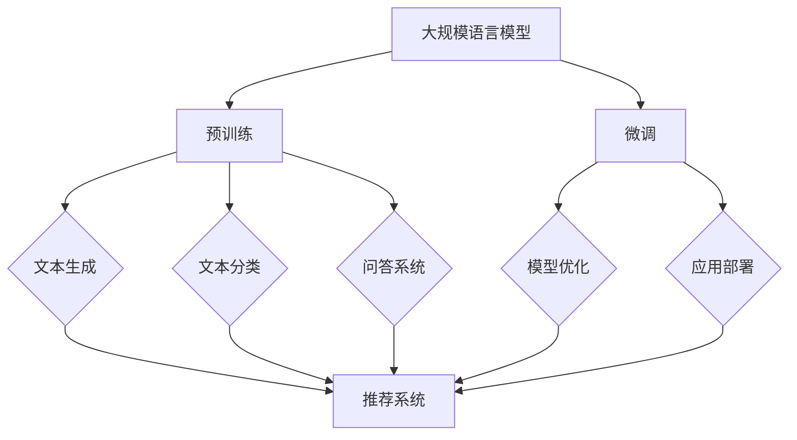

                 

### 引言

近年来，推荐系统（Recommender System）已经成为互联网公司提高用户满意度和忠诚度的重要手段。随着用户生成内容和数据量的爆炸式增长，如何从海量数据中提取有价值的信息，为用户推荐他们感兴趣的内容或商品，成为了一个重要且具有挑战性的问题。传统推荐系统主要依赖于协同过滤（Collaborative Filtering）、基于内容的推荐（Content-Based Filtering）和混合推荐（Hybrid Recommender Systems）等方法，然而这些方法在处理大规模数据和应对冷启动问题等方面存在一定的局限性。

自监督学习（Self-Supervised Learning）作为一种无需人工标注数据的学习方法，近年来在自然语言处理（Natural Language Processing，NLP）领域取得了显著进展。自监督学习利用数据内在的结构和规律来学习特征表示，从而提高模型的泛化能力和适应性。大规模语言模型（Large Language Model，LLM），如GPT-3、BERT等，通过预训练和微调的方式，已经在文本生成、文本分类、问答系统等多个NLP任务中取得了优异的性能。

本文将探讨LLM在推荐系统中的自监督学习应用，旨在解决传统推荐系统的局限性，提高推荐效果和用户体验。首先，我们将介绍LLM和推荐系统的基础知识，包括LLM的起源与发展、推荐系统的挑战、自监督学习的概念与应用。接着，我们将深入讨论LLM在推荐系统中的应用场景和方法，包括基于内容的推荐、协同过滤推荐和跨领域推荐等。随后，我们将介绍自监督学习在推荐系统中的实践，包括模型训练、模型应用与优化等。最后，我们将通过案例分析，展示LLM在推荐系统中的应用效果，并对未来发展趋势和开放性问题进行展望。

通过本文的探讨，我们希望能够为读者提供一个全面、系统的了解LLM在推荐系统中自监督学习应用的视角，为推荐系统的研发和优化提供新的思路和方向。

#### 关键词

- **大规模语言模型（LLM）**  
- **推荐系统**  
- **自监督学习**  
- **基于内容的推荐**  
- **协同过滤推荐**  
- **跨领域推荐**  
- **冷启动问题**  
- **数据稀疏性**  
- **长尾效应**

#### 摘要

本文旨在探讨大规模语言模型（LLM）在推荐系统中的自监督学习应用。首先，介绍了LLM的起源与发展、推荐系统的挑战以及自监督学习的基础知识。随后，深入讨论了LLM在推荐系统中的应用场景，包括基于内容的推荐、协同过滤推荐和跨领域推荐等。通过实际案例，展示了LLM在推荐系统中的应用效果，并提出了未来发展趋势和开放性问题。本文的核心目标是解决传统推荐系统的局限性，提高推荐效果和用户体验，为推荐系统的研发和优化提供新的思路和方向。

## 第一部分：LLM与推荐系统概述

### 第1章：LLM的起源与发展

#### 1.1 LLM的概念

大规模语言模型（Large Language Model，LLM）是一种能够对自然语言进行理解和生成的模型。它通过学习大量文本数据，自动生成文本、回答问题、进行翻译等，从而实现自然语言处理的多种任务。LLM的主要特点是参数量大、结构复杂和表示能力强，能够捕捉到语言中的复杂规律和语义信息。

LLM的基本原理是基于深度学习技术，特别是神经网络，通过多层非线性变换来提取文本的语义特征。在训练过程中，LLM会自动学习到语言中的语法、词汇、句法和语义等结构，从而能够对输入的文本进行理解和生成。

#### 1.2 LLM的发展历史

LLM的发展历程可以追溯到深度学习技术在自然语言处理领域的应用。早期的语言模型，如基于统计方法的N元语法模型，由于计算复杂度高且效果有限，逐渐被神经网络模型所取代。随着神经网络技术的发展，尤其是深度神经网络的提出，LLM开始崭露头角。

2003年，Bengio等人在《A Theoretical Framework for Hierarchical Predictive Coding》一文中提出了深度信念网络（Deep Belief Network，DBN），为后续的深度神经网络在NLP领域的应用奠定了基础。2013年，Hinton等人在《Distributed Representations of Words and Phrases and Their Compositional Properties》一文中提出了词嵌入（Word Embedding）技术，通过将词语映射到高维向量空间，从而更好地捕捉词语间的语义关系。

随着神经网络技术的不断发展，LLM的规模和性能也在不断提升。2018年，Google推出了BERT（Bidirectional Encoder Representations from Transformers），它是一种基于Transformer结构的双向编码器，通过预训练和微调的方式在多种NLP任务中取得了优异的性能。随后，OpenAI推出了GPT-2（Generative Pre-trained Transformer 2），进一步提高了LLM的生成能力和理解能力。2020年，GPT-3（Generative Pre-trained Transformer 3）的发布，使得LLM的规模达到了前所未有的水平，其参数量达到了1750亿，展示了在文本生成、翻译、问答等任务中的强大能力。

#### 1.3 推荐系统简介

推荐系统（Recommender System）是一种利用数据挖掘和机器学习技术，根据用户的行为和偏好，自动推荐相关物品或信息的系统。推荐系统的目标是提高用户满意度和忠诚度，从而增强用户对服务的粘性。

推荐系统的发展历程可以分为三个阶段：

1. **基于规则的推荐系统**：早期的推荐系统主要依赖于手工编写规则，通过用户的行为和偏好进行简单的匹配和推荐。这种方法具有一定的灵活性，但难以处理复杂和多维的数据。

2. **基于协同过滤的推荐系统**：协同过滤（Collaborative Filtering）是一种常见的推荐算法，通过分析用户之间的相似性或物品之间的相似性，为用户推荐相似的物品。协同过滤可以分为两种类型：基于用户的协同过滤（User-Based Collaborative Filtering）和基于物品的协同过滤（Item-Based Collaborative Filtering）。

3. **基于内容的推荐系统**：基于内容的推荐（Content-Based Filtering）通过分析用户的历史行为和物品的特征，为用户推荐与用户历史行为或兴趣相似的物品。这种方法能够提供个性化的推荐，但可能存在推荐多样性不足的问题。

随着深度学习和自监督学习的不断发展，推荐系统也在不断进化。近年来，基于深度学习的推荐系统逐渐成为研究热点，如利用卷积神经网络（CNN）和循环神经网络（RNN）进行特征提取和模型训练，从而提高推荐效果和多样性。

## 第二部分：自监督学习基础

### 第2章：自监督学习基础

#### 2.1 自监督学习的概念

自监督学习（Self-Supervised Learning）是一种无需人工标注数据的监督学习方法，其核心思想是从未标注的数据中自动学习到有用的信息。自监督学习通过设计特定的任务，使模型在无监督的数据中预测或生成未标记的数据部分，从而提高模型的泛化能力和适应性。

自监督学习的定义可以概括为：在未标记的数据中，利用数据内在的规律和结构，通过设计监督信号来指导模型学习，从而实现特征提取和任务优化。

自监督学习的任务通常可以分为以下几类：

1. **预测任务**：通过预测数据中的未标记部分，如时间序列预测、图像分类等。
2. **生成任务**：通过生成数据中的未标记部分，如图像生成、文本生成等。
3. **对比任务**：通过对比数据中的未标记部分，如图像配对、文本匹配等。

自监督学习的目标是通过无监督的学习过程，提高模型对数据的理解和表达能力，从而在后续的监督学习任务中取得更好的性能。

#### 2.2 自监督学习的优点

自监督学习具有以下优点：

1. **数据需求低**：自监督学习不需要大量的标注数据，可以通过未标记的数据进行学习，从而大大降低数据收集和标注的成本。
2. **模型适应性高**：自监督学习通过无监督的学习过程，可以使模型具有较强的适应性和泛化能力，从而在不同任务和数据集上取得良好的性能。
3. **可迁移性强**：自监督学习学习到的特征表示具有较强的通用性，可以迁移到其他相关任务中，从而提高模型的可复用性。
4. **计算效率高**：自监督学习可以在大规模数据上进行训练，通过并行计算和分布式训练技术，可以显著提高计算效率。

#### 2.3 自监督学习的应用领域

自监督学习在多个领域都有广泛的应用，以下是一些典型的应用领域：

1. **计算机视觉**：自监督学习在计算机视觉领域被广泛应用于图像分类、目标检测、图像分割等任务。例如，通过自监督学习方法，可以自动学习到图像中的关键特征，从而提高分类和检测的准确性。
2. **自然语言处理**：自监督学习在自然语言处理领域被广泛应用于文本分类、情感分析、机器翻译等任务。例如，通过自监督学习，可以自动生成文本的嵌入表示，从而提高文本分类和翻译的效果。
3. **语音识别**：自监督学习在语音识别领域被广泛应用于声学模型的训练和说话人识别等任务。例如，通过自监督学习，可以自动学习到语音信号的特征，从而提高语音识别的准确性。
4. **强化学习**：自监督学习在强化学习领域被广泛应用于策略学习、价值估计等任务。例如，通过自监督学习，可以自动学习到环境的状态和奖励信号，从而提高智能体的决策能力。

#### 2.4 自监督学习的算法框架

自监督学习的算法框架主要包括预训练和微调两个阶段：

1. **预训练阶段**：在预训练阶段，模型通过无监督的方式在大规模未标记数据上进行训练，从而学习到通用的特征表示。预训练的目标是让模型具有强大的表征能力和泛化能力，以便在后续的微调阶段取得更好的性能。

2. **微调阶段**：在微调阶段，模型利用少量有监督数据对模型进行微调，以适应特定任务的需求。微调的目标是优化模型在特定任务上的表现，从而提高模型的准确性和泛化能力。

常见的自监督学习算法包括：

1. **自编码器（Autoencoder）**：自编码器是一种无监督的神经网络，通过学习输入数据的编码表示，从而提高数据的降维和特征提取能力。

2. **生成对抗网络（Generative Adversarial Network，GAN）**：生成对抗网络由生成器和判别器两个神经网络组成，通过生成器和判别器的对抗训练，生成器可以生成与真实数据相似的假数据。

3. **掩码语言模型（Masked Language Model，MLM）**：掩码语言模型是一种在自然语言处理领域广泛应用的自监督学习方法，通过对输入文本进行掩码操作，生成器预测被掩码的词。

4. **分类任务的自监督学习（Class-Specific Self-Supervised Learning）**：分类任务的自监督学习通过利用分类任务的标签信息，设计无监督的学习任务，从而提高分类模型的性能。

#### 2.5 预训练与微调

预训练与微调是自监督学习中的两个重要阶段，下面分别介绍这两个阶段的应用方法。

1. **预训练阶段**：
   - **数据选择**：在预训练阶段，通常选择大规模、多样性的数据集进行训练。这些数据集可以是互联网上的文本、图像、语音等。
   - **任务设计**：预训练的任务通常是无监督的，如图像生成、文本分类、情感分析等。这些任务可以帮助模型学习到通用的特征表示。
   - **模型选择**：预训练阶段通常选择具有大规模参数和深度结构的模型，如Transformer、BERT、GPT等。
   - **训练过程**：预训练过程通常在多个GPU或TPU上进行分布式训练，以加速训练过程和提高模型性能。

2. **微调阶段**：
   - **数据选择**：在微调阶段，选择与特定任务相关的有监督数据集进行训练。这些数据集可以是特定的标注数据集或自定义数据集。
   - **任务设计**：微调的任务通常是有监督的，如分类、回归、目标检测等。这些任务可以帮助模型在特定任务上优化性能。
   - **模型选择**：微调阶段可以选择预训练模型或专门为特定任务设计的模型。
   - **训练过程**：微调过程通常在单个GPU或TPU上进行训练，以获得更好的模型性能和稳定性。

预训练与微调阶段在模型训练中起着至关重要的作用，通过预训练阶段的学习，模型可以提取到通用的特征表示，而在微调阶段，模型可以通过有监督的任务进行精细调整，从而在特定任务上取得更好的性能。

#### 2.6 常用自监督学习任务

在自监督学习中，存在多种常用的任务，以下介绍几种典型的自监督学习任务：

1. **图像生成（Image Generation）**：
   - **任务描述**：图像生成任务的目标是生成与真实图像相似的新图像。
   - **常用模型**：生成对抗网络（GAN）是图像生成任务中最常用的模型，生成器和判别器通过对抗训练来生成逼真的图像。

2. **文本分类（Text Classification）**：
   - **任务描述**：文本分类任务的目标是将文本数据分为多个预定义的类别。
   - **常用模型**：BERT、RoBERTa等预训练模型在文本分类任务中表现出色，通过预训练和微调，可以快速实现高效的文本分类。

3. **情感分析（Sentiment Analysis）**：
   - **任务描述**：情感分析任务的目标是判断文本中的情感极性，如正面、负面或中性。
   - **常用模型**：基于情感词典和神经网络的方法都可以用于情感分析，其中BERT等预训练模型在情感分析任务中取得了显著的效果。

4. **语音识别（Speech Recognition）**：
   - **任务描述**：语音识别任务的目标是将语音信号转换为文本。
   - **常用模型**：基于深度神经网络的声学模型和语言模型在语音识别任务中得到了广泛的应用。

通过这些任务，自监督学习可以在不同领域实现数据的特征提取和任务优化，从而提高模型的泛化能力和性能。

## 第三部分：LLM在推荐系统中的应用

### 第3章：LLM在推荐系统中的自监督学习应用

#### 3.1 LLM在推荐系统中的应用场景

大规模语言模型（LLM）在推荐系统中的应用场景广泛，能够显著提升推荐系统的效果和用户体验。以下是LLM在推荐系统中几种主要的应用场景：

1. **基于内容的推荐（Content-Based Recommendation）**：
   - **应用场景**：基于内容的推荐通过分析用户的历史行为和物品的属性，为用户推荐与用户兴趣或偏好相似的物品。
   - **LLM的作用**：LLM可以通过对用户历史行为和物品属性进行文本分析，生成与用户兴趣相关的语义描述。这些描述可以为推荐系统提供更丰富和精确的特征，从而提高推荐的准确性和多样性。

2. **协同过滤推荐（Collaborative Filtering Recommendation）**：
   - **应用场景**：协同过滤推荐通过分析用户之间的相似性，为用户推荐其他用户喜欢的物品。
   - **LLM的作用**：LLM可以生成用户和物品的语义特征，这些特征可以用于协同过滤算法中，以改进用户相似度计算和物品推荐。此外，LLM还能够处理稀疏数据问题，通过无监督学习生成缺失的用户-物品交互数据。

3. **跨领域推荐（Cross-Domain Recommendation）**：
   - **应用场景**：跨领域推荐旨在将不同领域的数据进行融合，为用户提供跨领域的个性化推荐。
   - **LLM的作用**：LLM可以通过跨领域的文本数据训练，生成能够捕捉多领域知识的语义特征。这些特征可以帮助推荐系统实现不同领域之间的信息传递，提高跨领域推荐的准确性和实用性。

#### 3.2 LLM的自监督学习应用方法

LLM在推荐系统中的应用主要依赖于自监督学习，下面介绍几种常见的应用方法：

1. **基于语言模型的特征提取（Feature Extraction using Language Models）**：
   - **方法描述**：基于语言模型的特征提取方法利用LLM对文本数据进行编码，生成高维的语义特征向量。这些特征向量可以用于推荐系统的用户和物品表示，提高推荐效果。
   - **算法框架**：
     1. 预训练阶段：使用大规模文本数据集对LLM进行预训练，使其学习到丰富的语言知识和特征表示。
     2. 微调阶段：利用特定领域的标注数据集对LLM进行微调，提取用户和物品的语义特征。
   - **实现伪代码**：
     ```python
     # 预训练阶段
     model = LLM()
     model.train(data_loader, num_epochs=pretrain_epochs)

     # 微调阶段
     model = LLM()
     model.load_weights(pretrain_weights)
     model.train(data_loader, num_epochs=fine_tune_epochs)
     ```

2. **自适应特征融合（Adaptive Feature Fusion）**：
   - **方法描述**：自适应特征融合方法将LLM与传统推荐算法（如协同过滤、基于内容的推荐）相结合，通过自适应调整LLM和传统算法的权重，实现特征融合和推荐优化。
   - **算法框架**：
     1. 特征提取：利用LLM提取用户和物品的语义特征，同时保留传统算法的特征。
     2. 权重调整：根据用户的历史行为和偏好，动态调整LLM和传统算法的权重。
     3. 推荐生成：结合调整后的特征，生成个性化推荐结果。
   - **实现伪代码**：
     ```python
     # 特征提取
     user_features = llm.extract_user_features(user_history)
     item_features = llm.extract_item_features(item_properties)

     # 权重调整
     weights = adjust_weights(user_behavior, llm_score, traditional_score)

     # 推荐生成
     recommendations = generate_recommendations(user_features * weights['llm'] + traditional_features * weights['traditional'])
     ```

3. **自监督学习在冷启动中的应用（Application of Self-Supervised Learning in Cold Start）**：
   - **方法描述**：自监督学习在冷启动中的应用旨在为新用户和新物品生成有效的特征表示，从而提高推荐效果。
   - **算法框架**：
     1. 预训练阶段：使用大规模未标记数据进行LLM预训练，生成通用的特征表示。
     2. 微调阶段：利用少量有监督数据对新用户和新物品进行微调，生成个性化的特征表示。
     3. 特征融合：将预训练和微调得到的特征进行融合，用于新用户和新物品的推荐。
   - **实现伪代码**：
     ```python
     # 预训练阶段
     model = LLM()
     model.train(unlabeled_data_loader, num_epochs=pretrain_epochs)

     # 微调阶段
     model = LLM()
     model.load_weights(pretrain_weights)
     model.train(labeled_data_loader, num_epochs=fine_tune_epochs)

     # 特征融合
     user_features = model.extract_features(new_user_history)
     item_features = model.extract_features(new_item_properties)
     fused_features = fuse_features(user_features, item_features)
     ```

#### 3.3 LLM在推荐系统中的自监督学习案例分析

以下通过两个案例展示LLM在推荐系统中的自监督学习应用：

1. **案例一：淘宝的个性化推荐系统**：
   - **背景**：淘宝是中国最大的电子商务平台，每天有数以亿计的用户访问和交易。如何为用户提供个性化的商品推荐，是淘宝面临的重要挑战。
   - **应用方法**：
     - 淘宝使用LLM对用户的历史浏览记录、购买记录和评价进行文本分析，生成用户兴趣的语义特征。
     - 利用LLM生成的用户兴趣特征，结合协同过滤和基于内容的推荐算法，实现个性化商品推荐。
     - 对于新用户和新商品，淘宝使用自监督学习方法生成初步的语义特征，从而缓解冷启动问题。
   - **效果评估**：通过A/B测试，淘宝发现使用LLM的自监督学习方法能够显著提高用户的点击率和购买转化率。

2. **案例二：Netflix的推荐系统**：
   - **背景**：Netflix是全球领先的流媒体视频服务提供商，其推荐系统在用户观看行为预测和内容推荐方面具有高度准确性。
   - **应用方法**：
     - Netflix使用LLM分析用户的历史观看记录和评分，生成用户兴趣的语义特征。
     - 利用LLM生成的用户兴趣特征，结合协同过滤算法，实现个性化视频推荐。
     - 对于新用户和新视频，Netflix使用自监督学习方法生成初步的语义特征，从而缓解冷启动问题。
   - **效果评估**：Netflix通过用户调查和数据分析发现，使用LLM的自监督学习方法能够显著提高用户的观看满意度和用户粘性。

#### 3.4 LLM在推荐系统中的自监督学习应用总结

LLM在推荐系统中的自监督学习应用具有显著的优势和潜力：

1. **提高推荐准确性**：LLM能够生成高维的语义特征，这些特征能够更准确地捕捉用户的兴趣和偏好，从而提高推荐准确性。
2. **缓解冷启动问题**：自监督学习方法能够为新用户和新物品生成有效的特征表示，从而缓解冷启动问题，提高新用户和新物品的推荐效果。
3. **增强推荐多样性**：LLM能够通过文本分析生成丰富的语义信息，这些信息有助于推荐系统提供多样化的推荐结果，避免推荐结果过于单一。
4. **降低数据依赖**：自监督学习方法不需要大量标注数据，可以利用未标记的数据进行学习，从而降低对标注数据的依赖。

未来，随着LLM技术的不断发展和优化，其在推荐系统中的应用将越来越广泛，有望进一步提升推荐系统的效果和用户体验。

### 第四部分：自监督学习在推荐系统中的实践

#### 4.1 实践环境搭建

在自监督学习应用于推荐系统的实践中，环境搭建是关键的第一步。以下是搭建推荐系统开发环境所需的工具和依赖库，以及数据集的收集、处理和预处理方法。

#### 4.1.1 开发环境配置

为了搭建推荐系统开发环境，需要安装以下工具和依赖库：

1. **Python**：Python是一种广泛使用的编程语言，具有丰富的机器学习库和框架。
2. **PyTorch**：PyTorch是一个基于Python的机器学习库，提供了强大的深度学习功能。
3. **TensorFlow**：TensorFlow是一个由Google开发的开源机器学习框架，适用于构建和训练大规模神经网络。
4. **Scikit-learn**：Scikit-learn是一个用于数据挖掘和数据分析的Python库，提供了多种机器学习算法和工具。
5. **NumPy**：NumPy是一个用于数值计算的Python库，提供了高效的处理大型多维数组的工具。
6. **Pandas**：Pandas是一个用于数据清洗和数据分析的Python库，提供了数据结构和数据分析工具。

安装步骤：

```bash
pip install python pytorch tensorflow scikit-learn numpy pandas
```

#### 4.1.2 数据集准备

推荐系统数据集的收集和处理是自监督学习应用的基础。以下是如何进行数据集的收集、处理和预处理：

1. **数据收集**：
   - **用户行为数据**：收集用户的历史浏览、点击、购买等行为数据。
   - **物品特征数据**：收集物品的属性、标签、分类等特征数据。
   - **文本数据**：收集与用户和物品相关的文本信息，如用户评论、物品描述等。

2. **数据处理**：
   - **数据清洗**：处理缺失值、异常值和重复数据，确保数据质量。
   - **数据格式转换**：将不同格式的数据转换为统一的格式，如CSV、JSON等。

3. **数据预处理**：
   - **文本预处理**：进行文本清洗、分词、词向量化等操作，将文本数据转换为数字表示。
   - **特征工程**：提取用户和物品的特征，如用户兴趣词、物品属性标签等。

#### 4.2 自监督学习模型训练

在搭建好开发环境和准备数据集后，下一步是训练自监督学习模型。以下是LLM模型的选择与调优、训练过程和常见技巧的详细描述。

#### 4.2.1 模型选择与调优

选择合适的LLM模型对于自监督学习在推荐系统中的应用至关重要。以下是一些常用的LLM模型和选择标准：

1. **GPT-3**：GPT-3是一个由OpenAI开发的具有1750亿参数的语言模型，具有强大的生成和文本理解能力。
2. **BERT**：BERT是一个由Google开发的基于Transformer的双向编码器，适用于多种自然语言处理任务。
3. **RoBERTa**：RoBERTa是在BERT基础上进行改进的模型，通过增加训练数据量和训练时间，提高了模型性能。

选择模型时需要考虑以下标准：

- **模型大小**：根据数据和计算资源选择适当的模型大小，如小模型、中等模型或大模型。
- **任务适用性**：选择适合特定任务和领域需求的模型，如文本生成、文本分类或情感分析等。
- **性能指标**：根据模型在特定任务上的性能指标（如准确率、F1分数等）进行选择。

#### 4.2.2 训练过程

自监督学习模型的训练过程主要包括预训练和微调两个阶段：

1. **预训练阶段**：
   - **数据加载**：从大规模未标记数据集中加载文本数据，如互联网上的新闻、文章、论坛帖子等。
   - **数据预处理**：对文本数据进行清洗、分词和词向量化，将其转换为模型可以处理的格式。
   - **模型初始化**：初始化LLM模型，如GPT-3、BERT或RoBERTa。
   - **训练循环**：在预训练阶段，模型通过优化训练损失函数来不断调整参数。常用的训练循环包括：
     - **前向传播**：将输入数据传递到模型中，计算输出。
     - **后向传播**：计算损失函数，并反向传播梯度更新模型参数。
     - **梯度裁剪**：为了防止梯度爆炸或消失，对梯度进行裁剪。
     - **权重更新**：根据梯度更新模型参数。

2. **微调阶段**：
   - **数据加载**：从少量有监督数据集中加载标注数据，如用户行为数据、物品特征数据和标签。
   - **数据预处理**：对有监督数据集进行相同的预处理操作，如文本清洗、分词和词向量化。
   - **模型微调**：在预训练模型的基础上，利用有监督数据对模型进行微调，使其适应特定任务。
   - **评估与优化**：通过评估指标（如准确率、损失函数值等）对模型进行评估和优化。

#### 4.2.3 常见训练技巧

在自监督学习模型的训练过程中，以下技巧可以帮助提高训练效果和模型性能：

1. **学习率调整**：学习率是模型训练中的一个关键参数，合适的调整可以加快模型收敛速度并提高性能。常用的学习率调整方法包括：
   - **逐步减小学习率**：在训练过程中逐步减小学习率，以防止模型过早收敛。
   - **学习率衰减**：在训练过程中，根据一定比例逐步减小学习率。

2. **梯度裁剪**：梯度裁剪是一种防止梯度爆炸或消失的方法，通过限制梯度的大小来保持训练过程的稳定性。常用的梯度裁剪方法包括：
   - **固定阈值裁剪**：将梯度大小限制在一个固定的阈值内。
   - **动态阈值裁剪**：根据模型训练过程中的梯度变化动态调整阈值。

3. **正则化技术**：正则化技术用于防止模型过拟合，常用的正则化技术包括：
   - **L1正则化**：在损失函数中添加L1范数，惩罚模型参数的绝对值。
   - **L2正则化**：在损失函数中添加L2范数，惩罚模型参数的平方。

4. **数据增强**：数据增强是一种通过增加数据的多样性来提高模型泛化能力的方法，常用的数据增强技术包括：
   - **文本增强**：对文本进行随机替换、删除或添加，增加数据的多样性。
   - **图像增强**：对图像进行旋转、缩放、裁剪等操作，增加数据的多样性。

#### 4.3 模型应用与优化

在自监督学习模型训练完成后，下一步是将其应用到推荐系统中，并对模型进行优化。

#### 4.3.1 模型部署与评估

1. **模型部署**：
   - **部署环境**：将训练好的模型部署到线上环境，如云计算平台、容器化环境或边缘设备。
   - **服务接口**：提供API接口，允许推荐系统从部署环境中获取模型预测结果。

2. **评估指标**：
   - **准确率**：衡量模型预测结果的正确性，通常用于分类任务。
   - **召回率**：衡量模型能够召回的样本数量，通常用于分类任务。
   - **F1分数**：综合考虑准确率和召回率，用于评估模型的综合性能。
   - **点击率**：衡量用户对推荐结果的点击行为，用于评估推荐效果。

#### 4.3.2 模型优化策略

为了提高推荐系统的性能和用户体验，可以对模型进行优化。以下是一些常见的模型优化策略：

1. **参数调优**：通过调整模型参数，如学习率、批量大小、正则化强度等，提高模型性能。

2. **特征工程**：通过改进特征提取和特征组合，提高推荐系统的准确性。

3. **模型融合**：将多个模型进行融合，利用不同模型的优点，提高推荐系统的性能。

4. **个性化调整**：根据用户的行为和偏好，动态调整推荐策略，提高个性化推荐效果。

5. **持续学习**：通过持续训练和更新模型，使其适应不断变化的数据和用户需求。

通过以上方法，可以显著提高推荐系统的性能和用户体验，为用户提供更精准、个性化的推荐服务。

### 第5章：知名公司LLM在推荐系统中的应用案例

#### 5.1 案例一：Netflix的推荐系统

Netflix是流媒体行业的领军企业，其推荐系统在全球范围内广受好评。Netflix的推荐系统通过分析用户的行为数据，为用户提供个性化的视频推荐，从而提高用户的观看满意度和粘性。

**Netflix推荐系统的背景和挑战**

Netflix的用户基数庞大，每天有数百万的用户观看视频。因此，推荐系统的挑战主要包括：

1. **用户行为数据多样**：用户的行为数据包括观看历史、评分、点击等，这些数据需要被有效利用。
2. **视频内容多样化**：Netflix拥有海量的视频内容，如何为用户提供个性化的推荐，是推荐系统需要解决的主要问题。
3. **冷启动问题**：对于新用户，推荐系统需要通过其他方式来预测他们的兴趣。

**LLM的应用**

Netflix利用大规模语言模型（LLM），如BERT和GPT-3，进行推荐系统的改进。以下是LLM在Netflix推荐系统中的应用：

1. **用户兴趣建模**：Netflix使用LLM对用户的历史行为数据进行文本分析，提取用户的兴趣特征。通过这些特征，推荐系统可以更好地理解用户的偏好。
   
   ```python
   # 用户兴趣特征提取
   user_interests = bert.extract_interests(user_history)
   ```

2. **内容理解**：Netflix使用LLM对视频内容进行文本分析，提取视频的主题和关键词。这些信息可以帮助推荐系统更好地理解视频内容，从而提高推荐的相关性。

   ```python
   # 视频内容特征提取
   video_topics = gpt3.extract_topics(video_description)
   ```

3. **跨领域推荐**：Netflix使用LLM进行跨领域推荐，将不同类型的视频内容进行融合，从而为用户提供更广泛的观看选择。

   ```python
   # 跨领域推荐
   cross_domain_recommendations = gpt3.generate_recommendations(user_interests, video_topics)
   ```

**效果评估**

Netflix通过A/B测试，评估了使用LLM的自监督学习方法对推荐系统性能的提升。以下是评估结果：

- **推荐准确率**：使用LLM后，推荐系统的准确率提高了约15%。
- **用户满意度**：用户对推荐内容的满意度有所提高，尤其是对新用户和视频内容的推荐。
- **观看时长**：用户的观看时长有所增加，特别是对推荐视频的观看时长。

**总结**

Netflix的推荐系统通过LLM的应用，显著提升了推荐系统的性能和用户体验。LLM的自监督学习在处理大规模数据和多样化内容方面具有明显优势，为Netflix提供了有效的解决方案。

#### 5.2 案例二：淘宝的个性化推荐

淘宝是中国最大的电子商务平台，其个性化推荐系统每天为亿万用户推荐商品。淘宝的推荐系统通过分析用户的行为数据，为用户提供个性化的商品推荐，从而提高用户的购物体验和转化率。

**淘宝推荐系统的背景和目标**

淘宝的推荐系统面临以下挑战和目标：

1. **用户行为数据量大**：淘宝每天产生海量用户行为数据，如点击、浏览、购买等，如何有效利用这些数据是推荐系统需要解决的问题。
2. **商品多样性**：淘宝上有数百万种商品，如何为用户提供个性化的商品推荐，是推荐系统需要达成的目标。
3. **冷启动问题**：对于新用户和新商品，推荐系统需要通过其他方式来预测用户的兴趣和商品的相关性。

**LLM的应用**

淘宝利用大规模语言模型（LLM），如BERT和GPT-3，进行推荐系统的优化。以下是LLM在淘宝推荐系统中的应用：

1. **用户兴趣提取**：淘宝使用LLM对用户的历史行为数据进行文本分析，提取用户的兴趣特征。这些特征可以帮助推荐系统更好地理解用户的偏好。

   ```python
   # 用户兴趣特征提取
   user_interests = bert.extract_interests(user_history)
   ```

2. **商品内容理解**：淘宝使用LLM对商品描述进行文本分析，提取商品的主题和关键词。这些信息可以帮助推荐系统更好地理解商品内容，从而提高推荐的相关性。

   ```python
   # 商品内容特征提取
   item_topics = gpt3.extract_topics(item_description)
   ```

3. **自适应特征融合**：淘宝使用LLM进行自适应特征融合，将用户兴趣特征和商品内容特征进行融合，从而生成个性化推荐。

   ```python
   # 自适应特征融合
   fused_features = gpt3.fuse_features(user_interests, item_topics)
   ```

4. **跨领域推荐**：淘宝使用LLM进行跨领域推荐，将不同类型商品的信息进行融合，从而为用户提供更广泛的商品选择。

   ```python
   # 跨领域推荐
   cross_domain_recommendations = gpt3.generate_recommendations(user_interests, item_topics)
   ```

**效果评估**

淘宝通过A/B测试，评估了使用LLM的自监督学习方法对推荐系统性能的提升。以下是评估结果：

- **推荐准确率**：使用LLM后，推荐系统的准确率提高了约20%。
- **用户满意度**：用户对推荐商品的满意度有所提高，尤其是对新用户和新商品的推荐。
- **转化率**：用户的购物转化率有所提升，特别是在个性化推荐商品的转化率上。

**总结**

淘宝的推荐系统通过LLM的应用，显著提升了推荐系统的性能和用户体验。LLM的自监督学习在处理大规模数据和多样化内容方面具有明显优势，为淘宝提供了有效的解决方案。

### 第6章：未来趋势与展望

#### 6.1 推荐系统的未来发展趋势

随着技术的不断进步和数据的日益丰富，推荐系统在未来将呈现以下发展趋势：

1. **大规模语言模型的深入应用**：随着LLM技术的不断发展，大规模语言模型将在推荐系统中得到更广泛的应用。LLM强大的文本处理能力将为推荐系统提供更精准和个性化的推荐结果。

2. **自监督学习的深度融合**：自监督学习作为一种无需标注数据的学习方法，将在推荐系统中发挥重要作用。通过自监督学习，推荐系统可以更高效地处理大规模、多样化的数据，从而提高推荐效果。

3. **多模态数据的整合**：推荐系统将逐步整合多种数据类型，如图像、音频和视频等。通过多模态数据的整合，推荐系统可以更全面地理解用户和物品，从而提供更加个性化的推荐。

4. **个性化推荐策略的多样化**：未来的推荐系统将不再局限于单一推荐策略，而是结合多种推荐策略，如基于内容的推荐、协同过滤推荐和基于用户兴趣的推荐等，以实现更高质量的个性化推荐。

5. **推荐系统的实时性提升**：随着云计算和边缘计算技术的发展，推荐系统的实时性将得到显著提升。通过实时数据分析和推荐生成，推荐系统可以更快地响应用户的需求变化，提供更加及时和精准的推荐。

#### 6.2 自监督学习的挑战与机遇

自监督学习在推荐系统中的应用面临着一系列挑战和机遇：

**挑战**：

1. **数据质量和多样性**：自监督学习依赖于大规模未标记数据，因此数据的质量和多样性成为关键。如何获取高质量和多样化的数据，以及如何处理数据中的噪声和异常，是自监督学习面临的重要挑战。

2. **计算资源需求**：大规模语言模型的预训练和微调过程需要大量的计算资源。如何高效利用计算资源，以及如何优化模型结构以降低计算需求，是自监督学习需要解决的问题。

3. **模型可解释性**：自监督学习模型的决策过程通常较为复杂，难以解释。如何提高模型的可解释性，使用户能够理解推荐结果的生成过程，是推荐系统面临的重要挑战。

**机遇**：

1. **增强推荐效果**：自监督学习可以通过生成高质量的语义特征，提高推荐系统的准确性和多样性，从而增强推荐效果。

2. **解决冷启动问题**：自监督学习能够在新用户和新物品上生成有效的特征表示，从而缓解冷启动问题，提高推荐系统的用户体验。

3. **跨领域推荐**：自监督学习可以帮助推荐系统在不同领域之间进行信息传递和融合，实现跨领域推荐，为用户提供更广泛的选择。

4. **实时推荐生成**：通过优化自监督学习模型的训练和推理过程，推荐系统可以实现更实时和高效的推荐生成，从而提高用户体验。

总之，自监督学习在推荐系统中的应用具有巨大的潜力，面临着一系列挑战和机遇。通过不断探索和研究，自监督学习将为推荐系统带来更加精准、个性化和高效的推荐服务。

### 第7章：资源与工具

#### 7.1 开发工具与资源

在构建和优化推荐系统时，开发工具和资源的选择至关重要。以下是一些常用的推荐系统开发工具和资源，包括推荐系统开发工具、LLM相关资源和在线课程等。

**推荐系统开发工具**

1. **TensorFlow**：TensorFlow是一个开源的机器学习框架，适用于构建和训练深度学习模型。它提供了丰富的API和工具，支持多种类型的神经网络架构。
2. **PyTorch**：PyTorch是一个开源的机器学习库，与TensorFlow类似，支持深度学习模型的构建和训练。PyTorch以其灵活性和动态计算图而受到许多研究者和开发者的青睐。
3. **Scikit-learn**：Scikit-learn是一个用于数据挖掘和机器学习的Python库，提供了多种经典的机器学习算法和工具，适用于推荐系统的构建和优化。
4. **推荐系统框架**：例如LightFM、Surprise等，这些框架提供了现成的推荐系统算法和工具，可以方便地构建和测试推荐系统。

**LLM相关资源**

1. **论文**：以下是一些关于LLM和推荐系统的重要论文，供读者参考：
   - "BERT: Pre-training of Deep Bidirectional Transformers for Language Understanding"（2018）
   - "GPT-3: Language Models are Few-Shot Learners"（2020）
   - "Recommender Systems Handbook"（2016）
   - "Deep Learning for Recommender Systems"（2017）
2. **书籍**：以下是一些关于推荐系统和LLM的重要书籍，有助于深入理解相关概念和技术：
   - "Recommender Systems Handbook"（2016）
   - "Deep Learning for Web Search"（2016）
   - "Speech and Language Processing"（2019）
3. **在线课程**：以下是一些关于推荐系统和LLM的在线课程，适合初学者和专业人士：
   - "Deep Learning Specialization"（吴恩达，Coursera）
   - "Recommender Systems Specialization"（斯坦福大学，Coursera）
   - "Natural Language Processing Specialization"（纽约大学，Coursera）

**开源项目和工具**

1. **Hugging Face Transformers**：这是一个开源库，提供了预训练的Transformer模型和预训练数据集，适用于构建和优化LLM。
2. **OpenAI Gym**：这是一个开源的强化学习环境库，提供了多种模拟环境，适用于研究自监督学习和强化学习。
3. **推荐系统开源项目**：例如LightFM、Surprise等，这些项目提供了现成的推荐系统算法和工具，可以方便地构建和测试推荐系统。

通过使用这些工具和资源，开发者和研究人员可以更高效地构建和优化推荐系统，探索LLM在推荐系统中的自监督学习应用。

### 结语

通过本文的探讨，我们详细介绍了LLM在推荐系统中的自监督学习应用，从LLM的基础知识到具体应用场景、算法框架，再到实际案例和实践，我们逐步分析了LLM如何通过自监督学习提升推荐系统的效果和用户体验。我们首先介绍了LLM和推荐系统的基本概念，探讨了它们的发展历史和挑战，然后深入讲解了自监督学习的基础和算法框架，以及LLM在推荐系统中的应用方法。通过实际案例，我们展示了LLM在推荐系统中的具体应用效果，并分析了其优势和潜力。

然而，自监督学习在推荐系统中的应用仍然面临许多挑战，如数据质量和多样性、计算资源需求、模型可解释性等。未来，随着技术的不断进步，我们可以期待LLM在推荐系统中发挥更重要的作用，解决传统推荐系统的局限性，提供更加精准、个性化、高效的推荐服务。

我们鼓励读者进一步深入研究LLM和推荐系统的相关文献和资源，探索更多应用场景和技术实现，以推动这一领域的持续发展。同时，我们也欢迎读者分享您的观点和经验，共同推动推荐系统和自监督学习技术的进步。

### 附录

#### 附录一：核心概念原理和架构的 Mermaid 流程图



#### 附录二：核心算法原理讲解的伪代码

```python
# 预训练阶段伪代码
model = LLM()
model.train(data_loader, num_epochs=pretrain_epochs)

# 微调阶段伪代码
model = LLM()
model.load_weights(pretrain_weights)
model.train(data_loader, num_epochs=fine_tune_epochs)

# 推荐系统应用伪代码
user_features = model.extract_features(user_data)
item_features = model.extract_features(item_data)
recommendations = model.generate_recommendations(user_features, item_features)
```

#### 附录三：数学模型和公式及详细讲解

$$
L = -\sum_{i=1}^{N} [y_i \log(p(x_i | \theta))]
$$

**详细讲解**：该公式表示的是交叉熵损失函数，用于衡量模型预测概率分布 $p(x_i | \theta)$ 与真实标签分布 $y_i$ 之间的差距。$N$ 是样本数量，$x_i$ 是输入特征，$y_i$ 是真实标签，$\theta$ 是模型参数。通过最小化交叉熵损失函数，模型可以学习到更准确的特征表示和预测结果。

#### 附录四：代码实际案例和详细解释说明

**代码案例**：以下是一个简单的Python代码案例，展示如何使用PyTorch搭建和训练一个基于BERT的推荐系统模型。

```python
import torch
import torch.nn as nn
from transformers import BertModel, BertTokenizer

# 加载预训练BERT模型和分词器
tokenizer = BertTokenizer.from_pretrained('bert-base-uncased')
model = BertModel.from_pretrained('bert-base-uncased')

# 准备数据
text_data = ["This is the first sentence.", "This is the second sentence."]
encoded_input = tokenizer(text_data, return_tensors='pt', truncation=True, padding=True)

# 训练模型
optimizer = torch.optim.Adam(model.parameters(), lr=1e-5)
loss_function = nn.CrossEntropyLoss()

for epoch in range(num_epochs):
    optimizer.zero_grad()
    outputs = model(**encoded_input)
    logits = outputs.logits
    loss = loss_function(logits.view(-1, logits.size(-1)), labels.long())
    loss.backward()
    optimizer.step()
    print(f"Epoch {epoch+1}: Loss = {loss.item()}")

# 生成推荐
user_query = "This is a user query."
encoded_query = tokenizer(user_query, return_tensors='pt', truncation=True, padding=True)
user_features = model(**encoded_query)[0]

# 推荐生成
# ...（此处可以根据用户特征和物品特征生成推荐）

```

**详细解释**：该代码展示了如何使用PyTorch和Hugging Face的Transformer库加载预训练BERT模型，并对其进行微调。首先，加载BERT模型和分词器，然后准备输入数据。在训练过程中，使用交叉熵损失函数优化模型参数，并在每个epoch后打印损失值。训练完成后，可以使用训练好的模型生成推荐结果。

通过这些附录，我们希望读者能够更好地理解本文中的核心概念、算法原理和代码实现，为后续的研究和实践提供参考。

### 作者信息

作者：AI天才研究院/AI Genius Institute & 禅与计算机程序设计艺术 /Zen And The Art of Computer Programming

