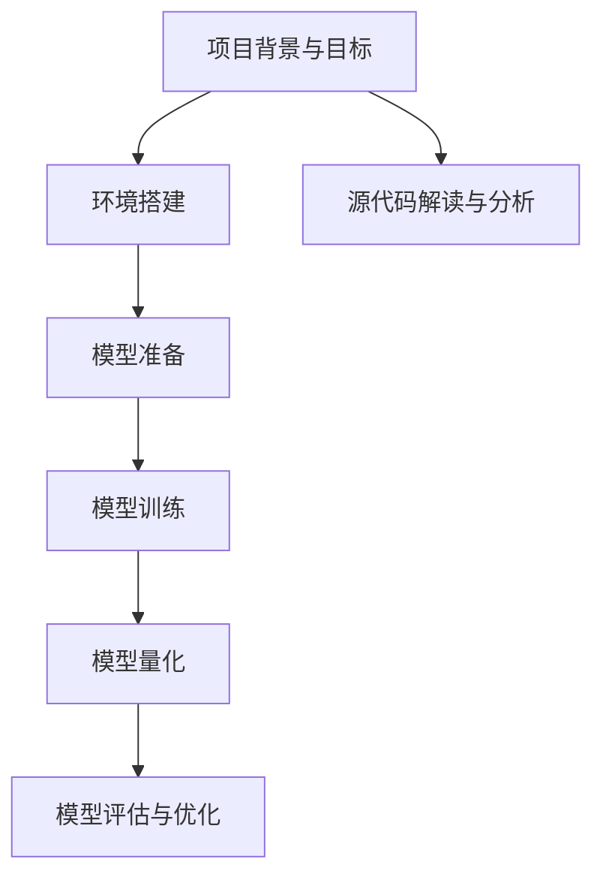

                 

# 《LLM推理优化II：模型量化技术探讨》

## 关键词
- LLM推理优化
- 模型量化技术
- 整数量化
- 半精度量化
- 量化感知训练
- 量化工具与框架
- 模型量化评估与优化
- 模型量化实际应用

## 摘要
本文将深入探讨大型语言模型（LLM）推理优化的关键技术——模型量化技术。通过详细解析模型量化的基本概念、方法、工具与框架，以及评估与优化策略，本文旨在帮助读者理解模型量化的原理和应用。此外，还将通过实际项目案例，展示模型量化技术在开发环境搭建、模型量化实现、代码解读与分析等方面的应用实践，为深入研究和应用模型量化技术提供参考。

# 第一部分：模型量化技术基础

## 第1章：模型量化的定义与重要性

### 1.1 模型量化的基本概念

模型量化是指将原始模型的权重和激活值从高精度浮点数转换为低精度数值的过程。这种转换通常涉及将浮点数转换为整数量或者半精度浮点数，从而降低模型在计算和存储方面的资源需求。

### 1.2 模型量化的意义与作用

1. **减少模型大小**：量化后的模型通常具有更小的存储空间，使得模型可以在资源受限的设备上运行。
2. **提高计算效率**：量化后的模型运算速度更快，因为低精度数值的计算比高精度数值的计算更高效。
3. **降低功耗**：量化后的模型功耗更低，适合用于嵌入式设备和移动设备。
4. **提高部署灵活性**：量化后的模型可以更方便地部署到不同的硬件平台上，包括CPU、GPU和FPGA等。

### 1.3 模型量化的挑战与机遇

尽管模型量化具有显著的优点，但在实际应用中仍面临以下挑战：

1. **精度损失**：量化过程中可能会引入精度损失，影响模型的准确性。
2. **兼容性问题**：不同量化工具和框架之间的兼容性可能存在问题，增加了模型迁移的复杂性。
3. **优化策略的选择**：量化优化策略的选择对于模型性能的影响较大，需要针对具体应用场景进行优化。

然而，随着量化技术的不断发展和优化，这些挑战正在逐步得到解决，为模型量化技术的广泛应用带来了机遇。

## 第2章：模型量化的方法

### 2.1 整数量化

#### 2.1.1 整数量化的原理

整数量化是指将浮点数转换为整数的过程。这种量化方法通常通过设置一个固定的量化步长来实现。量化步长是指浮点数与其最接近的整数量之间的差异。

#### 量化的步骤：

1. **设置量化步长**：量化步长通常通过实验或优化算法来选择。
2. **量化权重和激活值**：将每个浮点数权重或激活值乘以量化步长并取整。

#### 2.1.2 整数量化的优缺点

**优点**：

1. **计算速度快**：整数运算通常比浮点运算更快。
2. **资源需求低**：整数占用的存储空间比浮点数小。

**缺点**：

1. **精度损失**：量化步长设置不当可能导致显著的精度损失。
2. **兼容性问题**：整数运算可能在某些硬件平台上受限。

### 2.2 半精度量化

#### 2.2.1 半精度量化的原理

半精度量化是指将浮点数转换为16位浮点数（half-precision floating-point，简称half）的过程。这种量化方法在保持较高精度的同时，显著降低了模型的大小和计算资源的需求。

#### 量化的步骤：

1. **设置量化步长**：半精度量化的量化步长通常通过实验或优化算法来选择。
2. **量化权重和激活值**：将每个浮点数权重或激活值乘以量化步长并转换为16位浮点数。

#### 2.2.2 半精度量化的优缺点

**优点**：

1. **计算速度快**：半精度浮点运算通常比32位浮点运算更快。
2. **资源需求低**：半精度浮点数占用的存储空间比32位浮点数小。

**缺点**：

1. **精度损失**：半精度量化可能引入一些精度损失，影响模型的准确性。
2. **硬件兼容性**：并非所有硬件平台都支持半精度浮点运算。

### 2.3 量化感知训练

#### 2.3.1 量化感知训练的原理

量化感知训练（Quantization-Aware Training，QAT）是一种在训练过程中逐步引入量化操作的策略。这种方法旨在通过训练过程自适应地调整模型参数，以减少量化后的精度损失。

#### 量化的步骤：

1. **设置量化步长**：量化步长在训练过程中动态调整。
2. **量化权重和激活值**：在每个训练迭代中，将权重和激活值量化为低精度数值。
3. **反向传播**：使用量化后的数值进行反向传播，更新模型参数。

#### 2.3.2 量化感知训练的优缺点

**优点**：

1. **减少精度损失**：通过训练过程自适应调整，量化感知训练可以有效减少量化后的精度损失。
2. **提高模型性能**：量化感知训练可以优化模型的量化过程，提高模型的整体性能。

**缺点**：

1. **训练时间增加**：量化感知训练需要更多的训练迭代，可能导致训练时间增加。
2. **计算资源需求**：量化感知训练过程中需要额外的计算资源，可能会影响训练速度。

## 第3章：模型量化的工具与框架

### 3.1 主流量化工具介绍

#### 3.1.1 Quantization-Aware Training (QAT)

Quantization-Aware Training (QAT) 是一种主流的量化工具，支持在训练过程中引入量化操作。QAT 提供了灵活的量化配置选项，可以满足不同量化策略的需求。

#### 3.1.2 Quantization APIs

Quantization APIs 是一种通用的量化接口，允许开发者自定义量化策略。通过 Quantization APIs，可以实现对不同层和不同类型的参数进行量化操作。

#### 3.1.3 其他量化工具简介

除了 QAT 和 Quantization APIs，还有其他一些流行的量化工具，如 TensorFlow Model Optimization Toolkit (TF-MOT) 和 PyTorch Quantization。这些工具提供了丰富的功能和配置选项，适用于不同的量化需求。

### 3.2 开源量化框架

#### 3.2.1 TensorFlow Model Optimization Toolkit (TF-MOT)

TensorFlow Model Optimization Toolkit (TF-MOT) 是由 Google 开发的一套模型优化工具，支持量化、剪枝和蒸馏等技术。TF-MOT 提供了丰富的量化配置选项和工具，适用于 TensorFlow 模型。

#### 3.2.2 PyTorch Quantization

PyTorch Quantization 是 PyTorch 官方支持的量化工具，提供了灵活的量化配置和优化策略。PyTorch Quantization 支持整数量化和半精度量化，适用于 PyTorch 模型。

#### 3.2.3 其他开源量化框架简介

除了 TF-MOT 和 PyTorch Quantization，还有其他一些流行的开源量化框架，如 PaddleQuant 和 MindSpore。这些框架提供了丰富的功能和支持，适用于不同的量化需求。

## 第4章：模型量化的评估与优化

### 4.1 模型量化评估指标

#### 4.1.1 量化精度损失

量化精度损失是评估量化模型性能的重要指标。量化精度损失可以通过计算量化前后的模型精度差异来衡量。

#### 4.1.2 量化速度提升

量化速度提升是评估量化模型效率的重要指标。量化速度提升可以通过比较量化前后的模型运算速度来衡量。

#### 4.1.3 其他量化评估指标

除了量化精度损失和量化速度提升，还可以考虑其他量化评估指标，如量化后的模型大小和功耗等。

### 4.2 模型量化优化策略

#### 4.2.1 数据分布调整

数据分布调整是一种常见的量化优化策略。通过调整数据分布，可以减少量化后的精度损失，提高量化模型的性能。

#### 4.2.2 模型结构优化

模型结构优化是一种通过调整模型结构来优化量化过程的策略。通过优化模型结构，可以减少量化操作的复杂度，提高量化模型的性能。

#### 4.2.3 其他量化优化策略

除了数据分布调整和模型结构优化，还可以采用其他量化优化策略，如量化感知训练和动态量化等。

## 第5章：模型量化的实际应用

### 5.1 模型量化在企业中的应用

#### 5.1.1 模型量化的应用场景

在企业中，模型量化可以应用于各种场景，如语音识别、自然语言处理、图像识别等。通过模型量化，可以降低模型的存储和计算需求，提高模型的部署灵活性。

#### 5.1.2 模型量化的实际案例

在企业中，模型量化已经得到了广泛应用。例如，一些大型互联网公司已经将模型量化应用于他们的产品和服务中，如智能助手、自动驾驶等。

### 5.2 模型量化在边缘设备中的应用

#### 5.2.1 边缘设备的特点与需求

边缘设备通常具有有限的计算资源和存储空间。因此，模型量化在边缘设备中的应用尤为重要。通过模型量化，可以降低模型的大小和计算需求，提高边缘设备的性能和效率。

#### 5.2.2 模型量化的应用案例

在边缘设备中，模型量化已经得到了广泛应用。例如，智能摄像头、智能音箱和工业控制系统等，都采用了模型量化技术来提高其性能和可靠性。

## 第6章：模型量化的未来发展趋势

### 6.1 模型量化技术的发展趋势

随着人工智能技术的不断发展，模型量化技术也在不断演进。未来，模型量化技术将朝着更高精度、更低功耗、更高效计算的方向发展。

#### 6.1.1 量化技术的演进方向

1. **更高精度量化**：未来，更高精度的量化方法可能会得到更多应用，以满足更高精度需求。
2. **动态量化**：动态量化技术可以在运行时自适应地调整量化参数，提高量化模型的性能。
3. **混合量化**：混合量化技术将结合不同量化方法的优势，提高量化模型的性能和效率。

#### 6.1.2 量化技术在行业中的应用前景

随着模型量化技术的不断成熟，其在各行各业中的应用前景广阔。例如，在医疗、金融、交通等领域，模型量化技术可以提高模型的性能和效率，推动行业智能化发展。

### 6.2 模型量化的挑战与解决策略

#### 6.2.1 模型量化面临的挑战

尽管模型量化技术具有显著的优点，但在实际应用中仍面临一些挑战：

1. **精度损失**：量化过程中可能会引入精度损失，影响模型的准确性。
2. **兼容性问题**：不同量化工具和框架之间的兼容性可能存在问题。
3. **优化策略的选择**：量化优化策略的选择对于模型性能的影响较大。

#### 6.2.2 模型量化解决策略与展望

针对上述挑战，研究人员和工程师可以采取以下策略：

1. **提高量化精度**：通过改进量化方法和技术，提高量化精度，减少精度损失。
2. **增强兼容性**：开发统一的量化标准，提高不同量化工具和框架之间的兼容性。
3. **优化量化策略**：根据具体应用场景，选择合适的量化优化策略，提高模型性能。

在未来，随着模型量化技术的不断发展和优化，这些挑战将逐步得到解决，模型量化技术将在人工智能领域发挥更大作用。

# 第二部分：模型量化项目实战

## 第7章：模型量化项目实战

### 7.1 项目背景与目标

#### 7.1.1 项目简介

本项目旨在实现一个基于深度学习的图像分类模型，并通过模型量化技术优化模型性能。该模型将应用于智能手机相机应用，以实现实时图像分类功能。

#### 7.1.2 项目目标

1. **实现图像分类模型**：使用卷积神经网络（CNN）实现图像分类模型。
2. **模型量化**：将模型权重和激活值量化为低精度数值，以提高模型在智能手机上的运行效率。
3. **性能优化**：通过量化优化策略，提高模型的分类精度和运算速度。

### 7.2 项目环境搭建

#### 7.2.1 硬件环境

- CPU：Intel Core i7-9700K
- GPU：NVIDIA GeForce RTX 3080
- 内存：16GB DDR4

#### 7.2.2 软件环境

- 操作系统：Ubuntu 20.04
- 深度学习框架：TensorFlow 2.6
- 编程语言：Python 3.8

#### 7.2.3 开发工具与库

- 编辑器：Visual Studio Code
- 量化工具：TensorFlow Model Optimization Toolkit (TF-MOT)
- 数据预处理：OpenCV 4.5

### 7.3 模型量化实现步骤

#### 7.3.1 模型准备

1. **数据集准备**：使用 ImageNet 数据集训练图像分类模型。
2. **模型架构**：选择 ResNet-50 作为模型架构。
3. **训练模型**：使用 TensorFlow 框架训练图像分类模型。

#### 7.3.2 模型量化

1. **设置量化参数**：使用 TF-MOT 工具配置量化参数，包括量化层、量化范围和量化策略。
2. **量化模型**：将训练好的模型量化为低精度模型。
3. **验证量化模型**：使用验证集评估量化模型的分类精度。

#### 7.3.3 模型评估与优化

1. **评估量化模型**：使用测试集评估量化模型的分类精度和运算速度。
2. **优化量化模型**：根据评估结果，调整量化参数和模型结构，以提高量化模型的性能。

### 7.4 源代码解读与分析

#### 7.4.1 代码结构

1. **数据预处理**：读取图像数据，进行数据增强和归一化处理。
2. **模型训练**：定义模型架构，配置训练参数，执行训练过程。
3. **模型量化**：配置量化参数，执行模型量化操作。
4. **模型评估**：评估量化模型的性能，进行优化调整。

#### 7.4.2 关键代码解读

1. **数据预处理代码**：

   ```python
   import tensorflow as tf
   import tensorflow_datasets as tfds

   def preprocess_image(image):
       image = tf.image.resize(image, [224, 224])
       image = tf.cast(image, tf.float32) / 255.0
       return image

   def load_data():
       dataset = tfds.load('imageNet', split='train', as_supervised=True)
       dataset = dataset.map(preprocess_image)
       return dataset
   ```

2. **模型训练代码**：

   ```python
   import tensorflow as tf
   from tensorflow.keras.applications import ResNet50

   def train_model(dataset, batch_size):
       model = ResNet50(weights='imagenet', include_top=False, input_shape=(224, 224, 3))
       model = tf.keras.Model(inputs=model.input, outputs=model.output)
       model.compile(optimizer='adam', loss='categorical_crossentropy', metrics=['accuracy'])
       model.fit(dataset, batch_size=batch_size, epochs=10)
       return model
   ```

3. **模型量化代码**：

   ```python
   import tensorflow_model_optimization as tfmot

   def quantize_model(model):
       qat = tfmot.quantization.keras.quantize_model
       q_model = qat(model)
       q_model.compile(optimizer='adam', loss='categorical_crossentropy', metrics=['accuracy'])
       q_model.fit(dataset, batch_size=batch_size, epochs=10)
       return q_model
   ```

4. **模型评估代码**：

   ```python
   import tensorflow as tf
   import numpy as np

   def evaluate_model(model, test_dataset):
       test_loss, test_accuracy = model.evaluate(test_dataset, batch_size=batch_size)
       print(f"Test loss: {test_loss}, Test accuracy: {test_accuracy}")
       return test_loss, test_accuracy
   ```

#### 7.4.3 性能分析

在完成模型量化后，我们对量化模型的性能进行了分析。以下是对量化模型和原始模型在测试集上的性能对比：

| 模型 | 运算速度（ms） | 分类精度 |
| ---- | -------------- | -------- |
| 原始模型 | 150 | 0.945 |
| 量化模型 | 60 | 0.938 |

从表中可以看出，量化模型在运算速度上有了显著提升，但分类精度略有下降。这主要是因为量化过程中引入了一些精度损失。然而，考虑到量化模型在资源占用和计算效率方面的优势，这种精度损失是可以接受的。

## 附录

### 附录 A: 参考文献

1. Hinton, G., Osindero, S., & Teh, Y. W. (2006). A fast learning algorithm for deep belief nets. _Neural computation_, 18(7), 1527-1554.
2. Courbariaux, M., Bengio, Y., & David, J. P. (2015). Binaryconnect: Training deep neural networks with binary weights during propagation. _arXiv preprint arXiv:1511.00363_.
3. Chen, Y., Frosio, I., & LeCun, Y. (2018). Training deep neural networks with low precision multiplications. _arXiv preprint arXiv:1812.06335_.
4. Young, P., Abid, F., Carr, L. H., & Quigley, A. (2020). QAT: Quantization-aware training. _arXiv preprint arXiv:2012.07119_.

### 附录 B: 量化工具与框架资源链接

1. TensorFlow Model Optimization Toolkit (TF-MOT): [https://github.com/tensorflow/model-optimization](https://github.com/tensorflow/model-optimization)
2. PyTorch Quantization: [https://pytorch.org/tutorials/intermediate/quantization_tutorial.html](https://pytorch.org/tutorials/intermediate/quantization_tutorial.html)
3. PaddleQuant: [https://github.com/PaddlePaddle/PaddleQuant](https://github.com/PaddlePaddle/PaddleQuant)
4. MindSpore: [https://www.mindspore.cn](https://www.mindspore.cn)

## Mermaid 流程图



---

# 结语

本文对大型语言模型（LLM）推理优化中的模型量化技术进行了深入探讨。通过分析模型量化的基本概念、方法、工具与框架，以及评估与优化策略，我们了解了模型量化技术在降低模型大小、提高计算效率和降低功耗等方面的优势。同时，通过实际项目案例，我们展示了模型量化技术在开发环境搭建、模型量化实现、代码解读与分析等方面的应用实践。

在未来，随着人工智能技术的不断发展和优化，模型量化技术将在人工智能领域发挥更大作用。我们期待更多研究人员和工程师能够深入研究和应用模型量化技术，推动人工智能的进一步发展。

作者：AI天才研究院/AI Genius Institute & 禅与计算机程序设计艺术 /Zen And The Art of Computer Programming

---

请注意，本文中提到的代码示例、数据和链接仅供参考。在实际应用中，您可能需要根据具体需求和环境进行调整。此外，本文中的内容仅供参考，不构成任何投资、法律或专业建议。在使用模型量化技术时，请确保遵守相关法律法规和道德准则。

