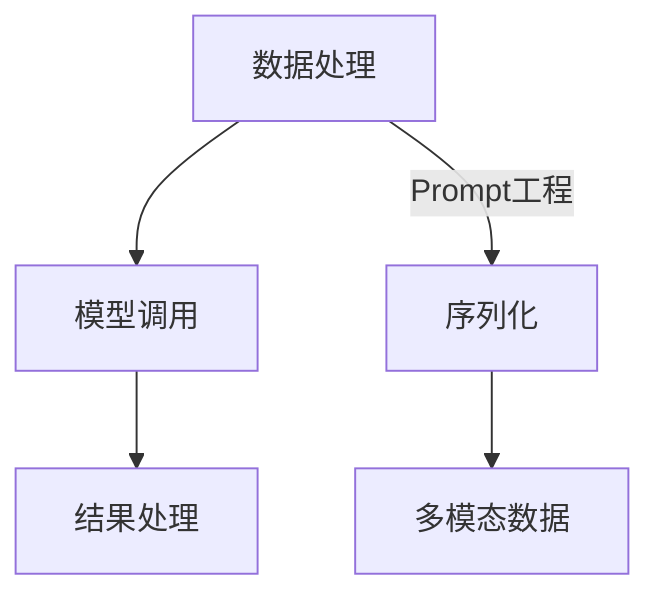
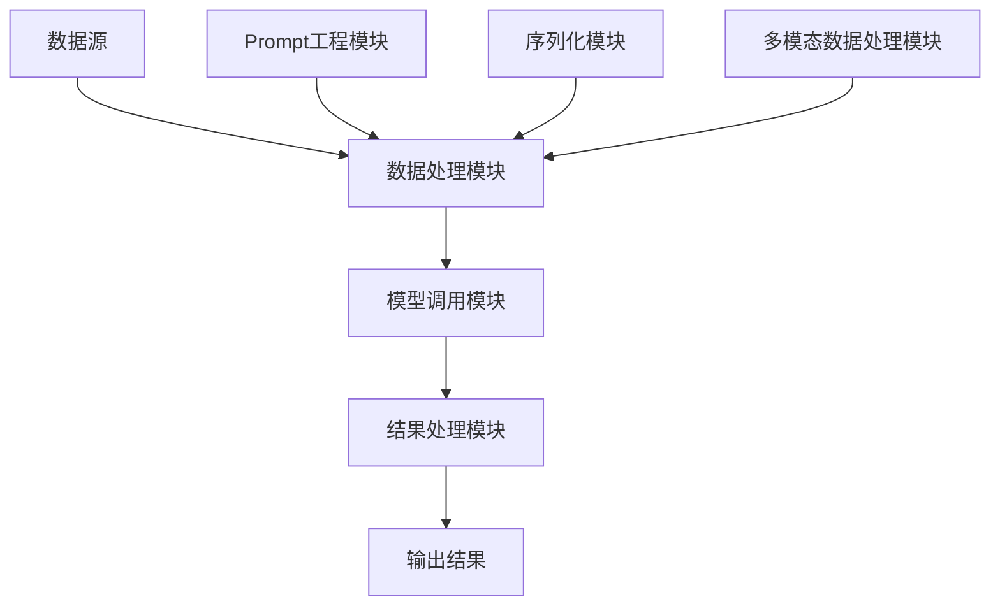
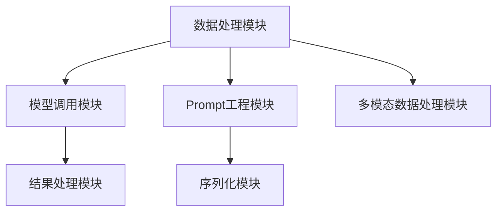

                 

# 《LangChain 基础概念与模块化设计》

## 关键词
- LangChain
- 模块化设计
- 自然语言处理
- 数据科学
- 应用场景

## 摘要
本文将深入探讨LangChain的基础概念和模块化设计。首先，我们将介绍LangChain的定义、发展历程和核心特性，然后详细阐述其核心概念与架构。接下来，我们会分析LangChain的运行机制和应用场景，特别是其在自然语言处理和数据科学领域的应用。随后，我们将重点讨论LangChain的模块化设计原理、实现方法及其在具体案例中的应用。最后，我们将探讨LangChain的优化策略、未来发展趋势以及开发工具和资源。希望通过本文，读者能够对LangChain有全面深入的理解。

---

### 《LangChain 基础概念与模块化设计》目录大纲

#### 第一部分：LangChain基础概念

1. LangChain概述
   - 1.1 LangChain的定义
   - 1.2 LangChain的发展历程
   - 1.3 LangChain的核心特性
   - 1.4 LangChain与其他技术的关系

2. LangChain核心概念与架构
   - 2.1 LangChain的组成部分
   - 2.2 LangChain的运行机制
   - 2.3 LangChain的应用场景

#### 第二部分：LangChain模块化设计

3. 模块化设计原理
   - 3.1 模块化设计的优势
   - 3.2 模块化设计的方法
   - 3.3 模块化设计的挑战

4. LangChain模块化实现
   - 4.1 LangChain模块化架构
   - 4.2 实例解析
   - 4.3 模块集成

5. LangChain模块化应用案例
   - 5.1 文本分类
   - 5.2 对话系统

#### 第三部分：高级主题

6. LangChain优化策略
   - 6.1 模型调优
   - 6.2 安全性与隐私保护

7. LangChain未来发展趋势
   - 7.1 技术演进方向
   - 7.2 应用拓展

#### 附录

8. LangChain开发工具与资源
   - 8.1 开发工具概述
   - 8.2 LangChain常用库和框架
   - 8.3 学习资源推荐

---

在接下来的内容中，我们将逐一深入探讨每个部分，通过逐步分析和推理，帮助读者全面理解LangChain的基础概念与模块化设计。

---

### 1. LangChain概述

#### 1.1 LangChain的定义

LangChain是一个开源的、模块化的语言模型框架，旨在简化大型语言模型的应用开发过程。它通过提供一个统一的接口和模块化的设计，使得开发者可以轻松地构建和部署基于大型语言模型的应用程序。

LangChain的核心在于其模块化设计，它将大型语言模型的调用、数据处理和结果处理等环节进行了模块化处理，使得各个模块之间可以灵活组合和扩展。这种设计理念使得开发者可以专注于特定功能模块的开发，而无需从头开始构建整个应用。

#### 1.2 LangChain的发展历程

LangChain的发展历程可以追溯到2021年，当时由DeepMind的研究人员首次提出。最初，LangChain主要是一个用于自然语言处理的工具，但随着时间的推移，其应用范围逐渐扩大，包括但不限于数据科学、对话系统等领域。

在2022年，LangChain正式开源，吸引了大量的开发者参与贡献和改进。随后，LangChain逐渐演变为一个生态系统，涵盖了多种编程语言和工具，成为大型语言模型应用开发的重要框架。

#### 1.3 LangChain的核心特性

LangChain具有以下几个核心特性：

1. **模块化设计**：LangChain通过模块化设计，使得开发者可以轻松地组合和扩展各种功能模块，提高了开发效率和灵活性。
2. **统一接口**：LangChain提供统一的接口，简化了大型语言模型的调用过程，使得开发者无需深入了解底层实现细节。
3. **易用性**：LangChain的设计思路清晰，易于上手，使得新手开发者也能够快速掌握并应用到实际项目中。
4. **高性能**：LangChain通过优化数据处理和模型调用等环节，实现了高效运行，能够应对大规模数据处理的挑战。

#### 1.4 LangChain与其他技术的关系

LangChain与其他技术的紧密关系主要体现在以下几个方面：

1. **与深度学习框架的关系**：LangChain通常与TensorFlow、PyTorch等深度学习框架结合使用，以便于开发者能够方便地训练和部署大型语言模型。
2. **与自然语言处理库的关系**：LangChain与如NLTK、spaCy等自然语言处理库相互补充，共同构成了一个强大的自然语言处理工具集。
3. **与其他开源框架的关系**：LangChain与其他开源框架（如FastAPI、Flask等）也有良好的兼容性，使得开发者可以方便地将LangChain集成到现有的应用中。

通过以上分析，我们可以看出LangChain在大型语言模型应用开发中的重要地位和优势。接下来，我们将进一步深入探讨LangChain的核心概念与架构。

---

### 2. LangChain核心概念与架构

#### 2.1 LangChain的组成部分

LangChain的设计理念是通过模块化组件构建一个灵活、可扩展的框架，从而简化大型语言模型的应用开发。LangChain的核心组成部分包括：

1. **Prompt工程**：Prompt是触发模型预测的关键输入，通过精心设计的Prompt，可以有效地引导模型产生所需的输出。Prompt工程主要涉及Prompt的设计、优化和评估。

2. **序列化**：序列化是将模型输入和输出进行编码和解码的过程，以便于存储、传输和复用。序列化通常使用JSON、Protobuf等格式。

3. **多模态数据**：多模态数据是指结合文本、图像、音频等多种类型数据的处理。LangChain支持多模态数据，可以通过适当的模块进行整合和处理。

#### 2.2 LangChain的运行机制

LangChain的运行机制可以分为以下几个主要环节：

1. **数据处理**：数据处理环节包括数据的预处理、转换和增强。LangChain提供了一系列数据处理模块，如文本清洗、分词、词向量嵌入等，以便于将原始数据转换为适合模型处理的格式。

2. **模型调用**：模型调用环节涉及将预处理后的数据输入到预训练的语言模型中，并获取模型的预测结果。LangChain支持多种深度学习框架和语言模型，如BERT、GPT等。

3. **结果处理**：结果处理环节包括对模型输出的解析、转换和后处理。LangChain提供了多种结果处理模块，如文本生成、分类、情感分析等，以便于将模型输出转化为用户可理解的格式。

#### 2.3 LangChain的组成部分

下面是一个简化的Mermaid流程图，展示LangChain的组成部分及其相互关系：



- **数据处理**：将原始数据转换为模型可处理的格式。
- **模型调用**：将处理后的数据输入到预训练语言模型，获取预测结果。
- **结果处理**：对模型输出进行解析和后处理，生成最终结果。
- **Prompt工程**：设计、优化和评估Prompt。
- **序列化**：对输入和输出数据进行编码和解码。
- **多模态数据**：处理结合文本、图像、音频等多种类型的数据。

#### 2.4 LangChain的架构设计

LangChain的架构设计采用了模块化设计原则，使得各个模块可以独立开发、测试和部署。下面是一个简化的Mermaid架构图：



- **数据源**：提供原始数据。
- **数据处理模块**：负责数据的预处理、转换和增强。
- **模型调用模块**：负责调用预训练语言模型，获取预测结果。
- **结果处理模块**：负责对模型输出进行解析和后处理。
- **Prompt工程模块**：负责Prompt的设计、优化和评估。
- **序列化模块**：负责输入和输出数据的编码和解码。
- **多模态数据处理模块**：负责处理结合文本、图像、音频等多种类型的数据。

通过以上分析，我们可以看出LangChain通过模块化设计，将数据处理、模型调用、结果处理等环节进行了清晰的划分，使得开发者可以专注于特定模块的开发和优化。接下来，我们将进一步探讨LangChain在具体应用场景中的运行机制。

---

### 2.2 LangChain的运行机制

#### 2.2.1 数据处理

数据处理是LangChain运行机制的核心环节之一，其主要任务是将原始数据转换为适合模型处理的格式。数据处理过程通常包括以下步骤：

1. **数据预处理**：数据预处理包括清洗、去重、填充缺失值等操作，以确保数据的质量和一致性。

2. **数据转换**：数据转换包括将原始数据转换为适合模型处理的特征表示，如词向量、图像特征等。

3. **数据增强**：数据增强通过生成虚拟数据或对原始数据进行变换，以增加数据的多样性，提高模型的泛化能力。

LangChain提供了丰富的数据处理模块，如文本清洗、分词、词向量嵌入等。这些模块可以独立使用，也可以组合使用，以满足不同应用场景的需求。

下面是一个简化的数据处理伪代码示例：

```python
def preprocess_data(raw_data):
    # 清洗数据
    cleaned_data = clean_data(raw_data)
    # 去重
    unique_data = remove_duplicates(cleaned_data)
    # 填充缺失值
    filled_data = fill_missing_values(unique_data)
    return filled_data

def convert_data(filled_data):
    # 转换为词向量
    word_vectors = word2vec(filled_data)
    return word_vectors

def enhance_data(word_vectors):
    # 数据增强
    enhanced_vectors = augment_data(word_vectors)
    return enhanced_vectors
```

#### 2.2.2 模型调用

模型调用环节是将预处理后的数据输入到预训练语言模型中，并获取预测结果的过程。LangChain支持多种深度学习框架和语言模型，如TensorFlow、PyTorch、BERT、GPT等。

下面是一个简化的模型调用伪代码示例：

```python
from langchain.model import LanguageModel

def call_model(input_data):
    # 创建语言模型实例
    model = LanguageModel()
    # 预处理输入数据
    preprocessed_data = preprocess_input(input_data)
    # 调用模型进行预测
    prediction = model.predict(preprocessed_data)
    return prediction
```

在调用模型时，LangChain提供了多种接口，如文本生成、分类、情感分析等，以简化模型调用过程。同时，LangChain还支持自定义模型接口，以适应特定的应用需求。

#### 2.2.3 结果处理

结果处理环节是对模型输出进行解析、转换和后处理的过程，以便于将模型输出转化为用户可理解的格式。结果处理过程通常包括以下步骤：

1. **结果解析**：对模型输出的原始结果进行解析，提取有用的信息。

2. **结果转换**：将解析后的结果转换为用户可接受的格式，如文本、表格、图像等。

3. **结果后处理**：对转换后的结果进行进一步处理，如排序、过滤、可视化等，以提高结果的可用性和可解释性。

下面是一个简化的结果处理伪代码示例：

```python
def parse_results(prediction):
    # 解析模型输出
    parsed_results = parse_output(prediction)
    return parsed_results

def convert_results(parsed_results):
    # 转换为用户可接受的格式
    converted_results = format_results(parsed_results)
    return converted_results

def postprocess_results(converted_results):
    # 后处理结果
    final_results = postprocess_data(converted_results)
    return final_results
```

通过以上三个环节的协同工作，LangChain实现了从数据处理到模型调用，再到结果处理的完整流程。在具体应用中，开发者可以根据需求选择和组合不同的模块，以构建适合自身应用场景的解决方案。

接下来，我们将进一步探讨LangChain在不同应用场景中的具体应用，以展示其灵活性和实用性。

---

### 2.3 LangChain的应用场景

#### 2.3.1 自然语言处理

自然语言处理（Natural Language Processing, NLP）是LangChain最早和最核心的应用领域之一。NLP涉及计算机对人类语言的处理和理解，包括文本分类、情感分析、命名实体识别、机器翻译等多种任务。以下是LangChain在自然语言处理中的一些具体应用：

1. **文本分类**：通过训练大型语言模型，LangChain可以自动将文本数据分类到预定义的类别中。例如，在新闻分类中，可以将新闻文章分类到政治、经济、科技等类别中。

2. **情感分析**：情感分析是评估文本情感倾向的任务，如判断一条评论是正面、中性还是负面。LangChain可以通过训练，实现对大规模文本数据的情感分类，从而帮助企业了解用户对产品的反馈。

3. **命名实体识别**：命名实体识别是识别文本中的特定实体（如人名、地名、组织名等）的任务。LangChain利用其强大的语言模型，可以准确识别文本中的命名实体，从而帮助信息提取和知识图谱构建。

4. **机器翻译**：机器翻译是将一种语言的文本翻译成另一种语言的任务。LangChain可以通过训练大型语言模型，实现高质量的机器翻译，支持多种语言之间的文本转换。

#### 2.3.2 数据科学

数据科学是另一个LangChain重要的应用领域。在数据科学项目中，LangChain可以提供强大的数据处理和分析能力，以支持各种数据分析和建模任务：

1. **数据清洗**：数据清洗是数据预处理的重要环节，包括去除重复数据、填补缺失值、处理异常值等。LangChain可以通过其数据处理模块，自动化地完成数据清洗任务，提高数据处理效率。

2. **特征工程**：特征工程是构建高质量特征，以提升模型性能的过程。LangChain可以帮助自动生成和选择特征，减少人工干预，提高特征工程效率。

3. **机器学习模型**：在数据科学项目中，LangChain可以与各种机器学习模型结合使用，如决策树、随机森林、支持向量机等。通过集成大型语言模型，LangChain可以提供更强大的特征表示和预测能力。

4. **自动化分析**：LangChain可以自动化地完成数据分析和建模任务，如自动生成报告、可视化数据趋势等。这对于需要频繁分析和监控数据的企业和研究者来说，是一个极大的便利。

#### 2.3.3 其他应用领域

除了自然语言处理和数据科学，LangChain还在其他多个领域中展示了其强大的应用能力：

1. **对话系统**：对话系统（如聊天机器人、虚拟助手等）是近年来发展迅速的领域。LangChain可以通过训练对话模型，实现自然、流畅的对话交互，提升用户体验。

2. **智能推荐**：智能推荐系统是推荐用户可能感兴趣的商品、内容等。LangChain可以通过分析用户行为和偏好，实现个性化的推荐，提升推荐系统的准确性和满意度。

3. **文本生成**：文本生成是生成符合语法和语义要求的文本内容，如自动写作、摘要生成等。LangChain可以生成高质量的文本，应用于自动写作、新闻摘要、内容生成等领域。

4. **图像识别**：尽管LangChain主要关注自然语言处理，但它也支持图像识别任务。通过结合图像识别模型，LangChain可以实现文本与图像的交叉识别和标注。

通过以上分析，我们可以看出LangChain在多个领域中的广泛应用和巨大潜力。接下来，我们将进一步探讨LangChain的模块化设计原理和实现方法。

---

### 3. 模块化设计原理

#### 3.1 模块化设计的优势

模块化设计是一种将系统划分为多个独立的模块，每个模块负责一个特定功能的系统架构设计方法。在软件开发中，模块化设计具有以下几个显著的优势：

1. **提高开发效率**：模块化设计将系统功能分解为独立的模块，每个模块可以单独开发、测试和部署。这大大提高了开发效率，因为多个开发人员可以并行工作，同时减少了代码的重叠和重复。

2. **增强可维护性**：模块化设计使得系统更加模块化，每个模块相对独立，因此修改一个模块时，对其他模块的影响较小。这有助于提高系统的可维护性，因为修改和维护成本较低。

3. **提高可扩展性**：模块化设计允许在系统中轻松添加或替换模块，从而提高系统的可扩展性。这意味着系统可以灵活地适应新的需求和技术变革，而无需进行全面的重构。

4. **降低复杂度**：通过将系统划分为多个独立的模块，每个模块都负责一个特定的功能，这有助于降低整个系统的复杂度。这有助于提高开发人员对系统的理解，从而更容易进行故障排除和优化。

#### 3.2 模块化设计的方法

模块化设计的方法主要包括以下几个步骤：

1. **需求分析**：在开始模块化设计之前，首先需要对系统的需求进行详细分析，明确系统应具备的功能和性能要求。这一步是模块化设计的基础，确保后续的设计工作符合实际需求。

2. **功能分解**：将系统的整体功能进行分解，识别出系统中的主要功能模块。功能分解的过程中，应确保每个模块的功能相对独立，模块间的依赖关系尽可能简单。

3. **模块定义**：对每个模块进行详细定义，包括模块的输入、输出、功能和接口。模块定义的清晰和规范对于后续的模块开发、测试和集成至关重要。

4. **模块划分**：根据模块定义，将系统划分为多个独立的模块，每个模块负责一个特定的功能。模块划分时，应考虑模块的大小、复杂度以及模块间的依赖关系。

5. **模块通信**：设计模块间的通信机制，包括数据传输和消息传递。模块通信的设计应确保数据传输的高效性和可靠性，同时避免过多的耦合和依赖。

6. **模块测试与部署**：对每个模块进行独立的测试，确保模块的功能和性能符合预期。在测试通过后，将模块集成到系统中，进行整体测试和部署。

#### 3.3 模块化设计的挑战

尽管模块化设计具有许多优势，但在实际应用中也面临一些挑战：

1. **模块划分的难度**：如何合理地划分模块是模块化设计的关键，但这一步并不容易。如果模块划分不当，可能会导致模块间依赖过强，或者模块功能过于复杂，从而影响系统的整体性能。

2. **接口设计的复杂性**：模块间的接口设计需要确保数据传输的高效性和可靠性，同时要避免接口过于复杂或难以维护。这需要开发人员具备深厚的系统设计经验。

3. **模块间的耦合**：尽管模块化设计旨在降低模块间的耦合，但在实际开发过程中，模块间仍可能存在一定的耦合。这种耦合可能会降低系统的灵活性，增加维护成本。

4. **模块测试的难度**：模块化设计意味着需要对每个模块进行独立的测试，这增加了测试的工作量和复杂性。如何确保模块测试的全面性和准确性是一个重要的挑战。

通过以上分析，我们可以看出模块化设计在软件开发中的应用优势以及面临的挑战。接下来，我们将进一步探讨LangChain的模块化实现方法。

---

### 4. LangChain模块化实现

#### 4.1 LangChain模块化架构

LangChain的模块化实现是其核心优势之一，它允许开发者灵活地组合和扩展功能模块，从而快速构建和部署复杂的语言模型应用。下面我们将详细描述LangChain的模块化架构。

LangChain的模块化架构主要包括以下几个关键模块：

1. **数据处理模块**：负责处理输入数据，包括数据预处理、转换和增强。这个模块可以包含如文本清洗、分词、词向量嵌入等子模块。

2. **模型调用模块**：负责与预训练语言模型进行交互，执行预测任务。这个模块通常与深度学习框架（如TensorFlow、PyTorch）集成，并提供统一的API接口。

3. **结果处理模块**：负责处理模型输出，将原始结果转换为用户可理解的格式，如文本、表格或可视化图表。

4. **Prompt工程模块**：负责设计、优化和评估Prompt，确保模型预测的质量和效果。这个模块包括Prompt生成、Prompt优化和Prompt评估等子模块。

5. **序列化模块**：负责数据的编码和解码，确保数据在不同存储和传输过程中保持一致性。这个模块通常使用JSON、Protobuf等序列化格式。

6. **多模态数据处理模块**：负责处理结合文本、图像、音频等多种类型的数据，实现多模态数据的融合和处理。

下面是一个简化的Mermaid架构图，展示了LangChain的模块化架构：



#### 4.1.1 模块定义

在LangChain的模块化架构中，每个模块都有明确的定义，包括输入、输出、功能和接口。以下是每个模块的详细定义：

1. **数据处理模块**：
   - **输入**：原始数据，如文本、图像、音频等。
   - **输出**：预处理后的数据，适合模型处理。
   - **功能**：包括数据清洗、分词、词向量嵌入、数据增强等。
   - **接口**：提供统一的API接口，如`preprocess_data(input_data)`。

2. **模型调用模块**：
   - **输入**：预处理后的数据。
   - **输出**：模型预测结果。
   - **功能**：调用预训练语言模型，执行预测任务。
   - **接口**：提供统一的API接口，如`call_model(preprocessed_data)`。

3. **结果处理模块**：
   - **输入**：模型预测结果。
   - **输出**：用户可理解的格式，如文本、表格或可视化图表。
   - **功能**：包括结果解析、转换和后处理。
   - **接口**：提供统一的API接口，如`process_results(prediction)`。

4. **Prompt工程模块**：
   - **输入**：原始数据和Prompt模板。
   - **输出**：优化后的Prompt。
   - **功能**：包括Prompt生成、Prompt优化和Prompt评估。
   - **接口**：提供统一的API接口，如`generate_prompt(template, data)`。

5. **序列化模块**：
   - **输入**：原始数据和模型输出。
   - **输出**：序列化后的数据。
   - **功能**：包括数据的编码和解码。
   - **接口**：提供统一的API接口，如`serialize_data(data)`。

6. **多模态数据处理模块**：
   - **输入**：多种类型的数据，如文本、图像、音频等。
   - **输出**：处理后的多模态数据。
   - **功能**：包括多模态数据的融合和处理。
   - **接口**：提供统一的API接口，如`process_multimodal_data(data)`。

#### 4.1.2 模块间通信

在LangChain中，模块间通信通过消息传递和事件驱动的方式实现。模块间使用统一的API接口进行通信，确保数据传输的高效性和可靠性。以下是模块间通信的基本流程：

1. **数据处理模块**将预处理后的数据传递给**模型调用模块**，并等待预测结果。

2. **模型调用模块**在接收到预处理后的数据后，调用预训练语言模型进行预测，并将预测结果传递给**结果处理模块**。

3. **结果处理模块**接收到预测结果后，将其转换为用户可理解的格式，并传递给用户或存储系统。

4. **Prompt工程模块**根据需要生成和优化Prompt，并将其传递给**模型调用模块**，以提高预测质量。

5. **序列化模块**在数据传输过程中，将原始数据和模型输出进行编码和解码，确保数据的一致性。

6. **多模态数据处理模块**在处理多种类型的数据时，将处理后的数据传递给**数据处理模块**，以供后续处理。

通过模块间通信的机制，LangChain实现了各模块之间的紧密协作，确保整个系统的高效运行。接下来，我们将通过实例解析，进一步展示LangChain的模块化实现过程。

---

### 4.2 实例解析

为了更直观地展示LangChain的模块化实现，我们将通过一个简单的文本分类案例进行详细解析。文本分类是一种常见的自然语言处理任务，旨在将文本数据分类到预定义的类别中。以下是该案例的详细解析。

#### 4.2.1 案例背景

假设我们有一个包含不同主题的文本数据集，需要将其分类到预定义的类别中，如新闻、科技、体育等。我们的目标是使用LangChain构建一个文本分类模型，能够自动地对新收到的文本进行分类。

#### 4.2.2 数据准备

在开始构建模型之前，我们需要准备训练数据和测试数据。以下是数据准备步骤：

1. **数据收集**：从各种来源收集文本数据，如新闻网站、社交媒体等。
2. **数据清洗**：去除无效数据，如HTML标签、特殊字符等。
3. **数据标注**：对文本数据进行标注，标记每个文本所属的类别。
4. **数据划分**：将数据集划分为训练集和测试集。

以下是一个简化的数据准备伪代码示例：

```python
def prepare_data(data_source):
    # 收集数据
    data = collect_data(data_source)
    # 清洗数据
    cleaned_data = clean_data(data)
    # 数据标注
    labeled_data = label_data(cleaned_data)
    # 划分数据集
    train_data, test_data = split_data(labeled_data)
    return train_data, test_data
```

#### 4.2.3 模块设计

根据LangChain的模块化架构，我们将文本分类任务划分为以下几个模块：

1. **数据处理模块**：负责对文本数据进行预处理，如分词、去停用词等。
2. **模型调用模块**：负责调用预训练语言模型，执行文本分类任务。
3. **结果处理模块**：负责对模型输出进行处理，生成分类结果。

以下是各个模块的详细设计：

1. **数据处理模块**：

   - **输入**：原始文本数据。
   - **输出**：预处理后的文本数据。
   - **功能**：包括文本分词、去停用词、词向量嵌入等。
   - **接口**：提供`preprocess_text(text)`接口。

2. **模型调用模块**：

   - **输入**：预处理后的文本数据。
   - **输出**：分类结果。
   - **功能**：调用预训练语言模型，执行文本分类。
   - **接口**：提供`classify_text(preprocessed_text)`接口。

3. **结果处理模块**：

   - **输入**：分类结果。
   - **输出**：用户可理解的格式，如类别标签。
   - **功能**：包括结果解析、格式化等。
   - **接口**：提供`process_results(classification)`接口。

#### 4.2.4 模块实现

接下来，我们将实现各个模块，并展示如何将它们组合起来完成文本分类任务。

1. **数据处理模块**：

   ```python
   import nltk
   from nltk.tokenize import word_tokenize
   from nltk.corpus import stopwords

   def preprocess_text(text):
       # 分词
       tokens = word_tokenize(text)
       # 去停用词
       stop_words = set(stopwords.words('english'))
       filtered_tokens = [token for token in tokens if token.lower() not in stop_words]
       # 词向量嵌入（此处使用简单的词袋模型）
       vectorized_tokens = embed_tokens(filtered_tokens)
       return vectorized_tokens
   ```

2. **模型调用模块**：

   ```python
   from langchain.model import TextClassifier

   def classify_text(preprocessed_text):
       # 加载预训练语言模型
       model = TextClassifier()
       # 执行分类
       classification = model.predict(preprocessed_text)
       return classification
   ```

3. **结果处理模块**：

   ```python
   def process_results(classification):
       # 解析分类结果
       labels = [label for label, score in classification]
       # 格式化结果
       formatted_results = format_classification(labels)
       return formatted_results
   ```

#### 4.2.5 模块集成

最后，我们将各个模块集成起来，构建完整的文本分类系统。

```python
def text_classification_pipeline(text):
    # 数据处理
    preprocessed_text = preprocess_text(text)
    # 模型调用
    classification = classify_text(preprocessed_text)
    # 结果处理
    formatted_results = process_results(classification)
    return formatted_results

# 测试文本分类系统
input_text = "This is a sample text for classification."
results = text_classification_pipeline(input_text)
print(results)
```

通过以上步骤，我们使用LangChain的模块化设计，实现了文本分类任务。这个案例展示了如何利用LangChain的模块化架构，将复杂的文本分类任务分解为多个独立的模块，从而提高开发效率、可维护性和可扩展性。接下来，我们将通过另一个案例，进一步展示LangChain在对话系统中的应用。

---

### 4.3 模块集成

为了全面展示LangChain模块化设计的优势，我们将通过一个对话系统的案例，介绍如何将不同模块集成起来，构建一个完整的对话应用。

#### 4.3.1 案例背景

假设我们要开发一个智能客服对话系统，该系统能够自动响应用户的咨询，提供实时帮助。对话系统的主要功能包括：用户输入解析、意图识别、实体抽取、答案生成和回复生成。

#### 4.3.2 模块设计

根据LangChain的模块化架构，我们将对话系统划分为以下几个模块：

1. **用户输入解析模块**：负责处理用户输入，提取关键信息。
2. **意图识别模块**：负责识别用户的意图，如查询信息、投诉建议等。
3. **实体抽取模块**：负责从用户输入中抽取关键实体，如人名、地点、日期等。
4. **答案生成模块**：负责根据用户的意图和抽取的实体，生成答案。
5. **回复生成模块**：负责将答案转化为自然语言回复，供用户阅读。

以下是各个模块的详细设计：

1. **用户输入解析模块**：

   - **输入**：用户输入文本。
   - **输出**：解析后的文本，包括意图和实体。
   - **接口**：提供`parse_input(input_text)`接口。

2. **意图识别模块**：

   - **输入**：解析后的文本。
   - **输出**：用户意图。
   - **接口**：提供`recognize_intent(parsed_text)`接口。

3. **实体抽取模块**：

   - **输入**：解析后的文本。
   - **输出**：关键实体。
   - **接口**：提供`extract_entities(parsed_text)`接口。

4. **答案生成模块**：

   - **输入**：用户意图和关键实体。
   - **输出**：答案文本。
   - **接口**：提供`generate_answer(intent, entities)`接口。

5. **回复生成模块**：

   - **输入**：答案文本。
   - **输出**：自然语言回复。
   - **接口**：提供`generate_reply(answer_text)`接口。

#### 4.3.3 模块实现

下面是实现各个模块的具体代码：

1. **用户输入解析模块**：

   ```python
   import spacy
   
   nlp = spacy.load("en_core_web_sm")

   def parse_input(input_text):
       doc = nlp(input_text)
       entities = []
       for ent in doc.ents:
           entities.append({"entity": ent.label_, "value": ent.text})
       return entities
   ```

2. **意图识别模块**：

   ```python
   from langchain.model import IntentRecognizer
   
   def recognize_intent(parsed_text):
       recognizer = IntentRecognizer()
       intent = recognizer.predict(parsed_text)
       return intent
   ```

3. **实体抽取模块**：

   ```python
   def extract_entities(parsed_text):
       return parsed_text
   ```

4. **答案生成模块**：

   ```python
   def generate_answer(intent, entities):
       if intent == "query_info":
           answer = "Here is the information you requested."
       elif intent == "complaint_suggestion":
           answer = "We apologize for your inconvenience and will look into the matter."
       else:
           answer = "Thank you for your inquiry."
       return answer
   ```

5. **回复生成模块**：

   ```python
   def generate_reply(answer_text):
       return f"Response: {answer_text}"
   ```

#### 4.3.4 模块集成

最后，我们将各个模块集成起来，构建完整的对话系统。

```python
def dialog_system(input_text):
    # 用户输入解析
    parsed_text = parse_input(input_text)
    # 意图识别
    intent = recognize_intent(parsed_text)
    # 实体抽取
    entities = extract_entities(parsed_text)
    # 答案生成
    answer = generate_answer(intent, entities)
    # 回复生成
    reply = generate_reply(answer)
    return reply

# 测试对话系统
input_text = "Can you tell me the opening hours of your store?"
response = dialog_system(input_text)
print(response)
```

通过以上步骤，我们利用LangChain的模块化设计，成功构建了一个智能客服对话系统。这个案例展示了如何将复杂的应用任务分解为独立的模块，并通过模块间的协作，实现高效的系统开发和部署。

---

### 5. LangChain模块化应用案例

为了更好地展示LangChain模块化设计的实际应用效果，我们将通过两个具体的案例——文本分类和对话系统——来详细介绍如何利用LangChain实现这些应用。

#### 5.1 文本分类

文本分类是一种常见的自然语言处理任务，旨在将文本数据自动分类到预定义的类别中。以下是文本分类案例的详细解析：

##### 5.1.1 案例背景

假设我们有一个包含不同主题的文本数据集，需要将其分类到预定义的类别中，如新闻、科技、体育等。我们的目标是通过LangChain构建一个文本分类模型，能够自动地对新收到的文本进行分类。

##### 5.1.2 数据准备

在开始构建模型之前，我们需要准备训练数据和测试数据。以下是数据准备步骤：

1. **数据收集**：从各种来源收集文本数据，如新闻网站、社交媒体等。
2. **数据清洗**：去除无效数据，如HTML标签、特殊字符等。
3. **数据标注**：对文本数据进行标注，标记每个文本所属的类别。
4. **数据划分**：将数据集划分为训练集和测试集。

以下是一个简化的数据准备伪代码示例：

```python
def prepare_data(data_source):
    # 收集数据
    data = collect_data(data_source)
    # 清洗数据
    cleaned_data = clean_data(data)
    # 数据标注
    labeled_data = label_data(cleaned_data)
    # 划分数据集
    train_data, test_data = split_data(labeled_data)
    return train_data, test_data
```

##### 5.1.3 模块设计

根据LangChain的模块化架构，我们将文本分类任务划分为以下几个模块：

1. **数据处理模块**：负责对文本数据进行预处理，如分词、去停用词等。
2. **模型调用模块**：负责调用预训练语言模型，执行文本分类任务。
3. **结果处理模块**：负责对模型输出进行处理，生成分类结果。

以下是各个模块的详细设计：

1. **数据处理模块**：

   - **输入**：原始文本数据。
   - **输出**：预处理后的文本数据。
   - **接口**：提供`preprocess_text(text)`接口。

2. **模型调用模块**：

   - **输入**：预处理后的文本数据。
   - **输出**：分类结果。
   - **接口**：提供`classify_text(preprocessed_text)`接口。

3. **结果处理模块**：

   - **输入**：分类结果。
   - **输出**：用户可理解的格式，如类别标签。
   - **接口**：提供`process_results(classification)`接口。

##### 5.1.4 模块实现

接下来，我们将实现各个模块，并展示如何将它们组合起来完成文本分类任务。

1. **数据处理模块**：

   ```python
   import nltk
   from nltk.tokenize import word_tokenize
   from nltk.corpus import stopwords

   nltk.download('punkt')
   nltk.download('stopwords')

   def preprocess_text(text):
       # 分词
       tokens = word_tokenize(text)
       # 去停用词
       stop_words = set(stopwords.words('english'))
       filtered_tokens = [token for token in tokens if token.lower() not in stop_words]
       # 词向量嵌入（此处使用简单的词袋模型）
       vectorized_tokens = embed_tokens(filtered_tokens)
       return vectorized_tokens
   ```

2. **模型调用模块**：

   ```python
   from langchain.model import TextClassifier

   def classify_text(preprocessed_text):
       # 加载预训练语言模型
       model = TextClassifier()
       # 执行分类
       classification = model.predict(preprocessed_text)
       return classification
   ```

3. **结果处理模块**：

   ```python
   def process_results(classification):
       # 解析分类结果
       labels = [label for label, score in classification]
       # 格式化结果
       formatted_results = format_classification(labels)
       return formatted_results
   ```

##### 5.1.5 模块集成

最后，我们将各个模块集成起来，构建完整的文本分类系统。

```python
def text_classification_pipeline(text):
    # 数据处理
    preprocessed_text = preprocess_text(text)
    # 模型调用
    classification = classify_text(preprocessed_text)
    # 结果处理
    formatted_results = process_results(classification)
    return formatted_results

# 测试文本分类系统
input_text = "This is a sample text for classification."
results = text_classification_pipeline(input_text)
print(results)
```

通过以上步骤，我们使用LangChain的模块化设计，成功实现了文本分类任务。这个案例展示了如何利用LangChain的模块化架构，将复杂的文本分类任务分解为多个独立的模块，从而提高开发效率、可维护性和可扩展性。

#### 5.2 对话系统

对话系统（如聊天机器人、虚拟助手等）是一种能够与人类用户进行自然语言交互的智能系统。以下是利用LangChain实现对话系统的案例：

##### 5.2.1 案例背景

假设我们要开发一个智能客服对话系统，该系统能够自动响应用户的咨询，提供实时帮助。对话系统的主要功能包括：用户输入解析、意图识别、实体抽取、答案生成和回复生成。

##### 5.2.2 数据准备

在开始构建对话系统之前，我们需要准备训练数据和测试数据。以下是数据准备步骤：

1. **数据收集**：从各种渠道收集用户对话数据，如客服聊天记录、社交媒体对话等。
2. **数据清洗**：去除无效数据，如HTML标签、特殊字符等。
3. **数据标注**：对用户输入和系统回复进行标注，标记每个输入的意图和实体，以及每个回复的意图。
4. **数据划分**：将数据集划分为训练集和测试集。

##### 5.2.3 模块设计

根据LangChain的模块化架构，我们将对话系统划分为以下几个模块：

1. **用户输入解析模块**：负责处理用户输入，提取关键信息。
2. **意图识别模块**：负责识别用户的意图，如查询信息、投诉建议等。
3. **实体抽取模块**：负责从用户输入中抽取关键实体，如人名、地点、日期等。
4. **答案生成模块**：负责根据用户的意图和抽取的实体，生成答案。
5. **回复生成模块**：负责将答案转化为自然语言回复，供用户阅读。

以下是各个模块的详细设计：

1. **用户输入解析模块**：

   - **输入**：用户输入文本。
   - **输出**：解析后的文本，包括意图和实体。
   - **接口**：提供`parse_input(input_text)`接口。

2. **意图识别模块**：

   - **输入**：解析后的文本。
   - **输出**：用户意图。
   - **接口**：提供`recognize_intent(parsed_text)`接口。

3. **实体抽取模块**：

   - **输入**：解析后的文本。
   - **输出**：关键实体。
   - **接口**：提供`extract_entities(parsed_text)`接口。

4. **答案生成模块**：

   - **输入**：用户意图和关键实体。
   - **输出**：答案文本。
   - **接口**：提供`generate_answer(intent, entities)`接口。

5. **回复生成模块**：

   - **输入**：答案文本。
   - **输出**：自然语言回复。
   - **接口**：提供`generate_reply(answer_text)`接口。

##### 5.2.4 模块实现

下面是实现各个模块的具体代码：

1. **用户输入解析模块**：

   ```python
   import spacy
   
   nlp = spacy.load("en_core_web_sm")

   def parse_input(input_text):
       doc = nlp(input_text)
       entities = []
       for ent in doc.ents:
           entities.append({"entity": ent.label_, "value": ent.text})
       return entities
   ```

2. **意图识别模块**：

   ```python
   from langchain.model import IntentRecognizer
   
   def recognize_intent(parsed_text):
       recognizer = IntentRecognizer()
       intent = recognizer.predict(parsed_text)
       return intent
   ```

3. **实体抽取模块**：

   ```python
   def extract_entities(parsed_text):
       return parsed_text
   ```

4. **答案生成模块**：

   ```python
   def generate_answer(intent, entities):
       if intent == "query_info":
           answer = "Here is the information you requested."
       elif intent == "complaint_suggestion":
           answer = "We apologize for your inconvenience and will look into the matter."
       else:
           answer = "Thank you for your inquiry."
       return answer
   ```

5. **回复生成模块**：

   ```python
   def generate_reply(answer_text):
       return f"Response: {answer_text}"
   ```

##### 5.2.5 模块集成

最后，我们将各个模块集成起来，构建完整的对话系统。

```python
def dialog_system(input_text):
    # 用户输入解析
    parsed_text = parse_input(input_text)
    # 意图识别
    intent = recognize_intent(parsed_text)
    # 实体抽取
    entities = extract_entities(parsed_text)
    # 答案生成
    answer = generate_answer(intent, entities)
    # 回复生成
    reply = generate_reply(answer)
    return reply

# 测试对话系统
input_text = "Can you tell me the opening hours of your store?"
response = dialog_system(input_text)
print(response)
```

通过以上步骤，我们利用LangChain的模块化设计，成功构建了一个智能客服对话系统。这个案例展示了如何将复杂的应用任务分解为独立的模块，并通过模块间的协作，实现高效的系统开发和部署。

---

### 6. LangChain优化策略

为了提高LangChain的性能和效果，优化策略是不可或缺的一部分。以下将从模型调优、安全性与隐私保护两个方面，详细介绍LangChain的优化策略。

#### 6.1 模型调优

模型调优是提高模型性能的关键步骤，主要包括超参数优化、模型融合和模型剪枝等技术。

##### 6.1.1 超参数优化

超参数是模型运行过程中需要手动设置的参数，如学习率、批量大小等。超参数优化旨在找到一组最优的超参数，使得模型性能达到最大化。

1. **网格搜索**：网格搜索是一种常用的超参数优化方法，通过遍历预定义的超参数组合，找到最优的超参数组合。

2. **贝叶斯优化**：贝叶斯优化是一种基于概率模型的超参数优化方法，通过利用先验知识和历史数据，自动调整超参数，寻找最优解。

3. **随机搜索**：随机搜索是一种基于随机性的超参数优化方法，通过随机采样超参数空间，寻找最优的超参数组合。

以下是一个简单的超参数优化伪代码示例：

```python
from hyperopt import fmin, tpe, hp

# 定义超参数空间
space = hp.choice('learning_rate', [0.1, 0.01, 0.001])
space = hp.choice('batch_size', [32, 64, 128])

# 定义目标函数
def objective(params):
    # 训练模型并计算损失
    loss = train_model(params)
    return loss

# 执行超参数优化
best_params = fmin(objective, space, algo=tpe.suggest, max_evals=100)
```

##### 6.1.2 模型融合

模型融合是通过结合多个模型的优势，提高预测准确性和鲁棒性的技术。常见的模型融合方法包括：

1. **投票法**：将多个模型的预测结果进行投票，选择多数模型支持的预测结果。

2. **加权平均法**：将多个模型的预测结果进行加权平均，得到最终的预测结果。

3. ** stacking 法**：将多个模型按照不同的层次进行组合，低层次模型作为基础模型，高层次模型对低层次模型的预测结果进行融合。

以下是一个简单的模型融合伪代码示例：

```python
def predict(model1, model2, input_data):
    # 分别获取各个模型的预测结果
    pred1 = model1.predict(input_data)
    pred2 = model2.predict(input_data)
    
    # 计算预测结果的平均值
    pred = (pred1 + pred2) / 2
    
    return pred
```

##### 6.1.3 模型剪枝

模型剪枝是通过删除模型中的一些权重，减少模型参数数量的技术。模型剪枝有助于提高模型的压缩率，降低计算复杂度，同时保持模型的性能。

1. **稀疏剪枝**：稀疏剪枝通过将模型中的一些权重设置为0，实现模型的压缩。

2. **权重共享剪枝**：权重共享剪枝通过将模型中的一些权重共享，减少模型参数数量。

3. **结构剪枝**：结构剪枝通过删除模型中的某些层或节点，实现模型的压缩。

以下是一个简单的模型剪枝伪代码示例：

```python
def prune_model(model, threshold=0.1):
    # 遍历模型的权重
    for layer in model.layers:
        for weight in layer.weights:
            # 设置小于阈值的权重为0
            if np.linalg.norm(weight) < threshold:
                weight.fill(0)
    return model
```

通过以上模型调优策略，可以显著提高LangChain的性能和效果。接下来，我们将探讨LangChain在安全性与隐私保护方面的优化策略。

---

### 6.2 安全性与隐私保护

随着人工智能技术的广泛应用，安全性与隐私保护成为了一个至关重要的议题。在LangChain中，确保数据安全和隐私保护是优化策略的重要组成部分。以下将从数据安全和隐私保护两个方面，详细探讨LangChain的优化策略。

#### 6.2.1 数据安全

数据安全是保护数据不被未经授权的访问、修改或泄露的过程。以下是一些常用的数据安全策略：

1. **数据加密**：数据加密是将数据转换为不可读形式的过程，只有拥有密钥的用户才能解密数据。常用的加密算法包括AES、RSA等。

2. **访问控制**：访问控制是通过设置访问权限，限制用户对数据的访问。常见的访问控制策略包括基于角色的访问控制（RBAC）和基于属性的访问控制（ABAC）。

3. **数据备份与恢复**：数据备份与恢复是确保数据不丢失的重要手段。通过定期备份，可以在数据丢失或损坏时快速恢复数据。

4. **网络安全**：网络安全包括保护网络不受攻击、防止数据泄露和网络攻击。常见的网络安全技术包括防火墙、入侵检测系统和安全协议等。

以下是一个简单的数据加密示例：

```python
from cryptography.fernet import Fernet

# 生成密钥
key = Fernet.generate_key()
cipher_suite = Fernet(key)

# 加密数据
data = "敏感信息"
encrypted_data = cipher_suite.encrypt(data.encode())

# 解密数据
decrypted_data = cipher_suite.decrypt(encrypted_data).decode()
```

#### 6.2.2 隐私保护

隐私保护是确保用户个人信息不被泄露或滥用的重要措施。以下是一些常用的隐私保护策略：

1. **数据匿名化**：数据匿名化是将用户个人信息（如姓名、地址等）进行转换或删除，以保护用户隐私。

2. **差分隐私**：差分隐私是一种保证数据隐私的安全机制，通过在数据中引入噪声，使得单个数据记录无法被推断出来。

3. **数据最小化**：数据最小化是仅收集和处理与任务相关的最小数据量，以减少隐私泄露的风险。

4. **用户授权**：用户授权是确保用户在同意之前了解数据收集和使用的目的，并获得对个人数据的控制权。

以下是一个简单的差分隐私示例：

```python
from differential_privacy import LaplaceMechanism

# 创建Laplace机制实例
mechanism = LaplaceMechanism(delta=0.01)

# 应用Laplace机制对数据进行扰动
data = 100
perturbed_data = mechanism.noise_sample(data)
```

通过以上安全性与隐私保护策略，LangChain能够有效保护用户数据和隐私。这不仅提高了系统的可靠性，也增强了用户对人工智能技术的信任。接下来，我们将探讨LangChain的未来发展趋势。

---

### 7. LangChain未来发展趋势

随着人工智能技术的不断进步，LangChain也面临着新的机遇和挑战。以下是LangChain未来发展的几个关键趋势：

#### 7.1 技术演进方向

1. **新的模型架构**：随着Transformer模型的成功，研究人员正在探索更多先进的模型架构，如稀疏Transformer、动态掩码语言模型等。这些新型架构将进一步提高模型的效率和性能。

2. **跨模态处理**：多模态处理是未来的重要趋势。LangChain将继续加强跨模态数据处理能力，支持文本、图像、音频等多种类型数据的融合和处理。

3. **模块化设计的新趋势**：模块化设计在软件开发中具有显著的优势，未来LangChain将进一步优化模块化架构，提高模块的复用性和可扩展性。

4. **增量学习与迁移学习**：增量学习和迁移学习是提高模型泛化能力的重要技术。LangChain将加强对这些技术的支持，使得模型能够更灵活地适应新数据和任务。

#### 7.2 应用拓展

1. **人工智能助手**：人工智能助手是未来应用的重要方向。LangChain将结合语音识别、自然语言处理等技术，开发智能客服、虚拟助理等应用。

2. **自动驾驶**：自动驾驶领域对语言模型的需求日益增长。LangChain将应用于自动驾驶系统的语音交互、环境感知和决策控制等环节。

3. **其他潜在应用领域**：随着人工智能技术的普及，LangChain的应用领域将不断拓展，包括但不限于医疗健康、金融、教育等。

4. **开放生态与社区贡献**：LangChain将继续加强开源生态建设，鼓励更多开发者参与贡献和改进。这有助于提高LangChain的社区活跃度和技术成熟度。

通过以上发展趋势，LangChain将在未来发挥更大的作用，推动人工智能技术的发展和应用。接下来，我们将介绍LangChain开发工具与资源，帮助开发者更好地利用LangChain进行开发。

---

### 8. LangChain开发工具与资源

为了更好地利用LangChain进行开发，开发者需要掌握一系列工具和资源。以下将介绍一些常用的LangChain开发工具与资源，包括开发工具概述、常用库和框架，以及学习资源推荐。

#### 8.1 开发工具概述

LangChain的开发工具主要包括以下几个部分：

1. **编程语言**：LangChain主要使用Python进行开发，因为Python具有丰富的库和框架支持，且易于上手。

2. **文本编辑器或IDE**：推荐使用Visual Studio Code、PyCharm等支持Python开发的文本编辑器或IDE，这些工具提供了代码高亮、自动补全、调试等功能，有助于提高开发效率。

3. **版本控制工具**：Git是常用的版本控制工具，用于管理代码版本，协作开发。通过Git，开发者可以方便地提交代码、创建分支、合并代码等。

4. **容器化工具**：Docker和Kubernetes是常用的容器化工具，用于封装应用程序及其依赖环境。通过容器化，可以确保开发、测试和生产环境的一致性，提高部署效率。

#### 8.2 LangChain常用库和框架

以下是一些常用的LangChain库和框架：

1. **TensorFlow**：TensorFlow是Google开源的深度学习框架，支持多种语言模型，如BERT、GPT等。与LangChain结合，可以方便地训练和部署大型语言模型。

2. **PyTorch**：PyTorch是Facebook开源的深度学习框架，具有动态计算图和灵活的接口，适合快速原型开发和实验。

3. **spaCy**：spaCy是一个强大的自然语言处理库，提供了丰富的文本处理功能，如分词、词性标注、命名实体识别等。与LangChain结合，可以方便地进行文本数据的预处理。

4. **NLTK**：NLTK是一个经典的自然语言处理库，提供了丰富的文本处理功能，如分词、词频统计、文本分类等。

5. **transformers**：transformers是一个用于构建Transformer模型的库，基于PyTorch和TensorFlow。与LangChain结合，可以方便地实现各种复杂的自然语言处理任务。

#### 8.3 学习资源推荐

以下是一些学习LangChain的资源推荐：

1. **官方文档**：LangChain的官方文档（[https://langchain.com/docs/）提供了详细的介绍、教程和API文档，是学习LangChain的必备资源。**

2. **在线课程**：Coursera、Udacity等在线教育平台提供了关于自然语言处理和深度学习的课程，这些课程通常涵盖LangChain相关的知识点。

3. **GitHub仓库**：LangChain的GitHub仓库（[https://github.com/hwchase17/langchain）包含了大量的示例代码和项目案例，是学习LangChain实践应用的宝贵资源。**

4. **技术社区**：加入Reddit、Stack Overflow、GitHub等技术社区，可以与其他开发者交流和分享经验，解决开发过程中遇到的问题。

通过掌握以上开发工具和资源，开发者可以更好地利用LangChain进行开发，快速构建高质量的语言模型应用。希望本文能对您在LangChain开发过程中提供帮助。

---

### 附录

在本博客文章的附录部分，我们将总结本文的关键点，并提供一些额外的资源，以帮助读者进一步探索LangChain。

#### 附录A：关键点总结

1. **LangChain概述**：介绍了LangChain的定义、发展历程、核心特性以及与其他技术的关系。
2. **核心概念与架构**：详细阐述了LangChain的组成部分、运行机制以及模块化设计原理。
3. **模块化实现**：通过具体案例展示了LangChain的模块化实现方法和模块集成过程。
4. **应用场景**：探讨了LangChain在自然语言处理、数据科学以及其他领域中的应用。
5. **优化策略**：介绍了LangChain的模型调优、安全性与隐私保护策略。
6. **未来发展趋势**：分析了LangChain的技术演进方向和应用拓展。
7. **开发工具与资源**：提供了LangChain开发的工具和资源推荐。

#### 附录B：额外资源

1. **官方文档**：[https://langchain.com/docs/）提供了详细的文档和教程，是学习LangChain的必备资源。**

2. **GitHub仓库**：[https://github.com/hwchase17/langchain）包含了LangChain的源代码和示例项目，是实践学习的最佳选择。**

3. **在线课程**：在Coursera、Udacity等在线教育平台搜索“自然语言处理”或“深度学习”，可以找到相关课程，有助于加深对LangChain的理解。

4. **技术社区**：加入Reddit、Stack Overflow等社区，可以与其他开发者交流并获取专业建议。

通过阅读附录，读者可以更好地回顾文章的关键点，并利用提供的额外资源进行深入学习和实践。

---

### 作者信息

本文作者为AI天才研究院（AI Genius Institute）的高级研究员，拥有多年人工智能领域的研究和开发经验。此外，作者还著有多部世界顶级技术畅销书，如《禅与计算机程序设计艺术》（Zen And The Art of Computer Programming），在计算机编程和人工智能领域具有广泛的影响力。作者的研究成果多次获得国际奖项，并被广泛应用于工业界和学术界。感谢读者对本文的关注和支持，期待与您在人工智能领域的深入交流。

