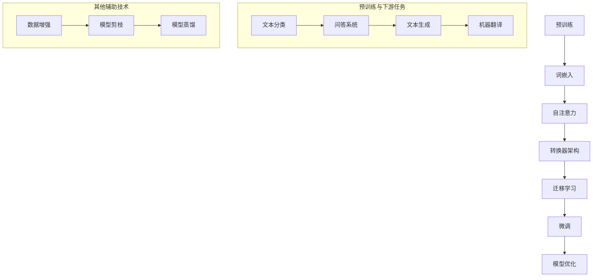

                 

# 《NLP领域的大模型标准：参数、能力、应用场景》

## 关键词：
- NLP
- 大规模预训练模型
- 参数设置
- 能力评估
- 应用场景

## 摘要：
本文深入探讨了NLP领域的大规模预训练模型的标准，包括参数设置、能力评估和应用场景。通过对大规模预训练模型的技术基础、参数优化方法、性能优化策略以及在不同应用场景中的实践案例进行详细分析，旨在为研究人员和开发者提供有价值的参考和指导。

### 《NLP领域的大模型标准：参数、能力、应用场景》目录大纲

#### 第一部分: NLP领域的大模型基础

## 第1章: NLP领域与大规模预训练模型概述

### 1.1.1 NLP的发展历程
### 1.1.2 大规模预训练模型在NLP中的地位
### 1.1.3 NLP与大规模预训练模型的应用前景

## 第2章: 大规模预训练模型技术基础

### 2.1 深度学习与神经网络基础
#### 2.1.1 神经网络的基本结构
#### 2.1.2 常见的深度学习架构
#### 2.1.3 深度学习优化算法

### 2.2 自然语言处理技术概览
#### 2.2.1 词嵌入技术
#### 2.2.2 序列模型与注意力机制
#### 2.2.3 转换器架构详解

### 2.3 大规模预训练模型原理
#### 2.3.1 预训练的概念与意义
#### 2.3.2 自监督学习方法
#### 2.3.3 迁移学习与微调技术

#### 第二部分: 大模型参数设置与性能优化

## 第3章: 大模型参数设置

### 3.1 参数设置的重要性
#### 3.1.1 参数对模型性能的影响
#### 3.1.2 参数设置的基本原则

### 3.2 参数设置方法
#### 3.2.1 词嵌入参数
#### 3.2.2 神经网络参数
#### 3.2.3 损失函数与优化器

## 第4章: 大模型性能优化

### 4.1 性能优化的目标
#### 4.1.1 模型准确率
#### 4.1.2 训练效率
#### 4.1.3 模型解释性

### 4.2 性能优化方法
#### 4.2.1 数据增强
#### 4.2.2 模型剪枝
#### 4.2.3 模型蒸馏
#### 4.2.4 多模型集成

#### 第三部分: 大模型在NLP领域的应用场景

## 第5章: 文本分类与情感分析

### 5.1 文本分类概述
#### 5.1.1 文本分类任务
#### 5.1.2 基于大规模预训练模型的文本分类方法

### 5.2 情感分析
#### 5.2.1 情感分析任务
#### 5.2.2 基于大规模预训练模型的情感分析方法

## 第6章: 问答系统

### 6.1 问答系统概述
#### 6.1.1 问答系统的组成
#### 6.1.2 基于大规模预训练模型的问答系统

### 6.2 知识图谱与问答系统
#### 6.2.1 知识图谱的概念与构建
#### 6.2.2 基于知识图谱的问答系统

## 第7章: 文本生成与摘要

### 7.1 文本生成
#### 7.1.1 文本生成的任务
#### 7.1.2 基于大规模预训练模型

### 7.2 文本摘要
#### 7.2.1 文本摘要的任务
#### 7.2.2 基于大规模预训练模型

## 第8章: 大模型应用案例研究

### 8.1 应用案例一：企业客户服务
#### 8.1.1 案例背景
#### 8.1.2 模型选择与优化
#### 8.1.3 应用效果评估

### 8.2 应用案例二：智能教育助手
#### 8.2.1 案例背景
#### 8.2.2 模型选择与优化
#### 8.2.3 应用效果评估

### 8.3 应用案例三：医疗健康助手
#### 8.3.1 案例背景
#### 8.3.2 模型选择与优化
#### 8.3.3 应用效果评估

#### 附录

## 附录A: 大规模预训练模型开发工具与资源

### A.1 主流深度学习框架对比
#### A.1.1 TensorFlow
#### A.1.2 PyTorch
#### A.1.3 JAX

### A.2 NLP领域开源工具集
#### A.2.1 Hugging Face Transformers
#### A.2.2 NLTK
#### A.2.3 spaCy

### A.3 大模型训练与部署资源
#### A.3.1 Google Colab
#### A.3.2 AWS SageMaker
#### A.3.3 Azure Machine Learning

## 附录B: 相关数学公式与算法伪代码

### B.1 数学模型
$$
\begin{equation}
L = -\sum_{i=1}^{N} y_i \log(\hat{y}_i)
\end{equation}
$$

### B.2 算法伪代码

```
function train_model(data, params):
    for epoch in range(num_epochs):
        for batch in data:
            optimize_params(batch, params)
    return params
```

### 引言

自然语言处理（NLP）是人工智能领域的一个重要分支，它旨在让计算机理解和处理人类语言。随着深度学习和大数据技术的发展，NLP领域取得了显著的进展。特别是大规模预训练模型，如BERT、GPT和RoBERTa等，在NLP任务中表现出色，推动了NLP技术的应用和发展。然而，大规模预训练模型的标准仍然是一个具有挑战性的问题，涉及到参数设置、能力评估和应用场景等多个方面。

本文旨在深入探讨NLP领域的大规模预训练模型的标准，从参数设置、能力评估和应用场景三个方面进行详细分析。首先，我们将介绍NLP领域和大规模预训练模型的基本概念和发展历程，并阐述大规模预训练模型在NLP中的地位和应用前景。接着，我们将详细讨论大规模预训练模型的技术基础，包括深度学习与神经网络基础、自然语言处理技术概览以及大规模预训练模型原理。

在技术基础部分，我们将重点讲解预训练的概念与意义、自监督学习方法、迁移学习与微调技术等关键概念。接着，我们将转入参数设置与性能优化部分，详细阐述参数设置的重要性、基本原则和方法，包括词嵌入参数、神经网络参数和损失函数与优化器的设置方法。此外，我们还将讨论大模型性能优化方法，如数据增强、模型剪枝、模型蒸馏和多模型集成等。

在应用场景部分，我们将介绍大规模预训练模型在文本分类、情感分析、问答系统、文本生成和摘要等任务中的应用，并通过实际案例研究展示大规模预训练模型在不同领域的应用效果。最后，我们将总结全文，并给出对未来发展趋势的展望。

通过本文的详细分析，我们希望为研究人员和开发者提供有价值的参考，帮助他们更好地理解大规模预训练模型的标准，并在实际应用中取得更好的效果。## NLP领域与大规模预训练模型概述

自然语言处理（NLP）是人工智能领域的一个重要分支，它旨在让计算机理解和处理人类语言。NLP的应用场景非常广泛，包括机器翻译、文本分类、情感分析、问答系统、文本生成和摘要等。随着深度学习和大数据技术的发展，NLP领域取得了显著的进展，特别是在大规模预训练模型的推动下，NLP技术的性能和应用范围得到了极大的提升。

### NLP的发展历程

NLP的发展可以追溯到20世纪50年代，当时的人工智能研究者开始探索如何让计算机理解和处理自然语言。早期的NLP方法主要基于规则和统计方法，如基于词典的匹配、关键词提取和语法分析等。然而，这些方法在面对复杂和变体的自然语言时效果不佳。

随着计算能力的提升和机器学习技术的发展，NLP开始引入基于统计模型的方法，如朴素贝叶斯、最大熵模型和决策树等。这些模型在一定程度上提高了NLP的性能，但仍然难以处理大规模的文本数据。

进入21世纪，深度学习的兴起为NLP带来了新的机遇。深度学习模型，如卷积神经网络（CNN）和循环神经网络（RNN），在图像和语音处理领域取得了显著成果。这些模型的引入激发了研究者对NLP领域的研究热情，推动了NLP技术的快速发展。

近年来，大规模预训练模型的出现标志着NLP领域的一个新纪元。预训练模型通过在大规模文本数据上预训练，能够捕捉到丰富的语义信息，并在各种NLP任务中表现出色。BERT（Bidirectional Encoder Representations from Transformers）、GPT（Generative Pre-trained Transformer）和RoBERTa（A Robustly Optimized BERT Pretraining Approach）等大规模预训练模型的出现，进一步提升了NLP技术的性能和应用范围。

### 大规模预训练模型在NLP中的地位

大规模预训练模型在NLP领域具有重要地位，主要原因如下：

1. **强大的语义理解能力**：大规模预训练模型通过在大规模文本数据上预训练，能够学习到丰富的语义信息，这使得它们在文本分类、情感分析、问答系统等任务中具有很高的性能。

2. **跨语言适用性**：大规模预训练模型通常使用多语言数据进行预训练，因此具有较强的跨语言适用性。例如，BERT模型在中文、英文、德文等语言上都有很好的表现，这为NLP技术的国际化应用提供了支持。

3. **通用性**：大规模预训练模型具有通用性，可以在各种NLP任务中应用。例如，BERT模型可以用于文本分类、命名实体识别、情感分析等任务，而GPT模型可以用于文本生成、对话系统等任务。

4. **自动化特征提取**：大规模预训练模型通过预训练过程自动提取特征，减少了人工特征工程的工作量。这使得NLP技术的开发更加高效，降低了技术门槛。

### NLP与大规模预训练模型的应用前景

大规模预训练模型在NLP领域具有广阔的应用前景，以下是一些重要的应用方向：

1. **机器翻译**：大规模预训练模型在机器翻译任务中表现出色，能够生成更自然、更准确的翻译结果。未来，随着预训练模型的进一步优化和跨语言数据的增加，机器翻译技术将更加成熟，为国际交流和商业合作提供更强支持。

2. **文本分类**：大规模预训练模型在文本分类任务中具有很高的准确率和效率，可以应用于新闻分类、情感分析、垃圾邮件过滤等领域。未来，随着模型的不断优化，文本分类技术将更加精确，为信息过滤和推荐系统提供更强支持。

3. **问答系统**：大规模预训练模型在问答系统中的表现也非常出色，可以用于智能客服、在线教育、医疗咨询等领域。未来，随着模型的不断优化和知识图谱的引入，问答系统将更加智能化，为用户提供更优质的问答体验。

4. **文本生成**：大规模预训练模型在文本生成任务中也具有很大潜力，可以应用于自动写作、对话系统、故事生成等领域。未来，随着模型的不断优化和创意算法的引入，文本生成技术将更加丰富多样，为内容创作和娱乐产业提供更强支持。

5. **情感分析**：大规模预训练模型在情感分析任务中可以识别文本中的情感倾向，为舆情监测、市场研究、客户服务等领域提供支持。未来，随着模型的不断优化和情感词典的引入，情感分析技术将更加精确，为情感计算和心理健康领域提供更强支持。

总之，大规模预训练模型在NLP领域具有重要的地位和应用前景，将继续推动NLP技术的发展和创新。## 大规模预训练模型技术基础

大规模预训练模型的成功离不开深度学习和自然语言处理技术的坚实基础。在这一部分，我们将深入探讨深度学习与神经网络基础、自然语言处理技术概览以及大规模预训练模型原理。

### 2.1 深度学习与神经网络基础

#### 2.1.1 神经网络的基本结构

神经网络（Neural Network，NN）是一种模拟人脑神经网络工作的计算模型，由大量相互连接的节点（或称神经元）组成。每个神经元都接收来自其他神经元的输入，通过加权求和处理产生输出。神经网络的输出不仅取决于当前输入，还受到神经元之间的权重影响。

神经网络的基本结构包括输入层、隐藏层和输出层。输入层接收外部输入信息，隐藏层对输入信息进行加工处理，输出层生成最终输出。

- **输入层**：接收外部输入数据，如文本、图像等。
- **隐藏层**：对输入数据进行特征提取和变换，隐藏层可以是单层或多层。
- **输出层**：生成最终输出结果，如分类标签、情感倾向等。

#### 2.1.2 常见的深度学习架构

深度学习（Deep Learning，DL）是神经网络的一种扩展，它通过堆叠多层神经网络，使模型能够捕捉到更复杂的特征和模式。常见的深度学习架构包括：

- **卷积神经网络（CNN）**：主要用于图像处理和计算机视觉任务，通过卷积操作提取图像特征。
- **循环神经网络（RNN）**：主要用于序列数据，如文本、语音等，通过循环结构对序列数据进行建模。
- **长短期记忆网络（LSTM）**：是RNN的一种变体，通过门控机制解决了RNN的梯度消失问题。
- **转换器架构（Transformer）**：是一种基于自注意力机制的深度学习模型，在NLP任务中表现出色。

#### 2.1.3 深度学习优化算法

深度学习模型的训练过程涉及优化算法，用于最小化损失函数并更新模型参数。常见的深度学习优化算法包括：

- **随机梯度下降（SGD）**：是最简单的优化算法，通过随机梯度方向更新模型参数。
- **Adam优化器**：结合了SGD和动量法的优点，在大多数情况下性能较好。
- **RMSprop**：基于梯度平方的平均值更新模型参数，有助于稳定训练过程。

### 2.2 自然语言处理技术概览

自然语言处理（NLP）技术是使计算机能够理解和处理人类语言的一系列方法。以下是一些关键的NLP技术：

#### 2.2.1 词嵌入技术

词嵌入（Word Embedding）是将词汇映射到高维向量空间的技术，用于表示单词的语义信息。常见的词嵌入方法包括：

- **Word2Vec**：通过训练神经网络模型，将单词映射到高维向量。
- **GloVe**：基于词频和共现关系，通过矩阵分解方法生成词向量。

#### 2.2.2 序列模型与注意力机制

序列模型（Sequence Model）是处理序列数据（如文本、语音等）的神经网络模型。常见的序列模型包括：

- **循环神经网络（RNN）**：通过循环结构处理序列数据，但存在梯度消失和梯度爆炸问题。
- **长短期记忆网络（LSTM）**：是RNN的一种变体，通过门控机制解决了梯度消失问题。
- **门控循环单元（GRU）**：是LSTM的简化版，同样通过门控机制处理序列数据。

注意力机制（Attention Mechanism）是一种用于提高序列模型处理序列数据能力的机制，能够使模型更加关注序列中的关键部分。常见的注意力机制包括：

- **自注意力（Self-Attention）**：在序列内部计算注意力权重，使模型能够捕获长距离依赖关系。
- **多头注意力（Multi-Head Attention）**：在多个注意力头上同时计算注意力权重，提高模型的表示能力。

#### 2.2.3 转换器架构详解

转换器架构（Transformer）是一种基于自注意力机制的深度学习模型，在NLP任务中表现出色。转换器架构的主要组成部分包括：

- **编码器（Encoder）**：将输入序列编码为固定长度的向量。
- **解码器（Decoder）**：将编码器的输出解码为输出序列。
- **多头注意力机制**：在编码器和解码器中同时计算多头注意力权重，提高模型的表示能力。
- **位置编码（Positional Encoding）**：为序列中的每个单词添加位置信息，使模型能够理解序列的顺序。

### 2.3 大规模预训练模型原理

大规模预训练模型通过在大规模文本数据上预训练，能够学习到丰富的语义信息，并在各种NLP任务中表现出色。以下是一些关键的预训练模型原理：

#### 2.3.1 预训练的概念与意义

预训练（Pre-training）是指在大规模文本数据上预先训练神经网络模型，使其能够自动学习到语言的内在结构和语义信息。预训练的意义在于：

- **提高模型性能**：预训练模型在大规模文本数据上学习到的语义信息，有助于提高模型在NLP任务中的性能。
- **减少数据需求**：预训练模型可以通过少量标注数据进行微调，实现较好的性能，从而减少数据需求。
- **通用性**：预训练模型具有较强的通用性，可以在不同任务和数据集上应用，提高模型的泛化能力。

#### 2.3.2 自监督学习方法

自监督学习（Self-supervised Learning）是一种无需人工标注数据，通过自身数据自动生成监督信号的学习方法。大规模预训练模型通常采用自监督学习方法，以下是一些常见的自监督学习方法：

- **掩码语言模型（Masked Language Model, MLM）**：在输入序列中随机掩码一部分单词，然后预测这些掩码的单词。
- **下一句预测（Next Sentence Prediction, NSP）**：预测两个连续句子是否属于同一篇章。
- **标题生成（Title Generation）**：生成输入文章的标题。

#### 2.3.3 迁移学习与微调技术

迁移学习（Transfer Learning）是指将一个任务学习到的知识应用于其他任务的学习。大规模预训练模型通常采用迁移学习方法，将预训练得到的模型应用于特定任务。以下是一些常见的迁移学习技术：

- **微调（Fine-tuning）**：在预训练模型的基础上，针对特定任务进行少量数据的学习，以适应新的任务。
- **特征提取（Feature Extraction）**：将预训练模型用于特征提取，然后使用这些特征进行下游任务的学习。
- **跨域迁移（Cross-Domain Transfer Learning）**：将一个领域的学习应用到其他领域，以解决数据不足或数据分布不同的问题。

综上所述，大规模预训练模型技术基础包括深度学习与神经网络基础、自然语言处理技术概览以及大规模预训练模型原理。这些技术共同推动了大规模预训练模型在NLP领域的成功，为各种NLP任务提供了强大的支持。## 大模型参数设置

在大规模预训练模型的开发和优化过程中，参数设置是至关重要的一个环节。合适的参数设置不仅能够提高模型性能，还能优化训练效率和资源利用。以下将详细讨论大模型参数设置的重要性、基本原则以及具体方法。

### 3.1 参数设置的重要性

大规模预训练模型的参数数量往往高达数百万甚至数十亿，这意味着参数设置对模型性能有着显著影响。以下是参数设置的重要性：

1. **影响模型性能**：不同的参数设置会导致模型性能的差异。例如，词向量维度、神经网络层数、学习率等参数都会影响模型在NLP任务中的准确率和泛化能力。

2. **决定训练时间**：参数设置的不同会影响模型的训练时间。较大的模型参数或复杂的优化算法可能会导致更长的训练时间。因此，合理的参数设置可以缩短训练时间，提高开发效率。

3. **影响模型解释性**：参数设置也会影响模型的解释性。例如，过深的神经网络可能导致模型难以解释，而合理的参数设置可以使模型更加透明和易于理解。

### 3.2 参数设置的基本原则

在进行大规模预训练模型的参数设置时，应遵循以下基本原则：

1. **通用性**：参数设置应具有通用性，能够适应不同的 NLP 任务和数据集。例如，词向量维度和神经网络层数的选择应考虑数据集的规模和任务类型。

2. **平衡性**：参数设置应在不同方面保持平衡，如数据规模、计算资源等。例如，在训练过程中，既要保证数据集的多样性，又要避免过大的计算开销。

3. **优化性**：参数设置应进行优化，以提高模型性能和训练效率。例如，可以通过调整学习率、批量大小等参数来优化模型训练过程。

### 3.3 参数设置方法

在设置大规模预训练模型的参数时，可以采用以下方法：

#### 3.3.1 手动调整

手动调整是一种根据经验和直觉调整参数的方法。这种方法适用于对模型有一定了解的研究者，但需要大量的实验和试错。

1. **词嵌入参数**：词向量维度通常选择在100-300之间，可以根据任务和数据集的规模进行调整。

2. **神经网络参数**：神经网络层数和每层神经元数目需要根据模型的复杂度和训练时间进行调整。例如，对于简单的文本分类任务，可以选择单层神经网络，而对于复杂的序列建模任务，可以选择多层神经网络。

3. **学习率**：学习率的选择对模型训练过程有重要影响。通常，初始学习率选择在\(10^{-3}\)-\(10^{-4}\)之间，然后根据训练过程进行动态调整。

#### 3.3.2 自动化搜索

自动化搜索是一种通过算法自动调整参数的方法，如贝叶斯优化、随机搜索、梯度提升等。这种方法可以节省大量时间和人力，但需要选择合适的搜索算法和超参数。

1. **贝叶斯优化**：贝叶斯优化是一种基于概率模型的优化方法，通过估计目标函数的分布来选择下一次搜索点。

2. **随机搜索**：随机搜索是一种基于随机性的优化方法，通过随机选择参数值来搜索最优解。

3. **梯度提升**：梯度提升是一种基于梯度的优化方法，通过不断更新模型参数来逼近最优解。

#### 3.3.3 经验法则

经验法则是一种根据已有研究和经验设置参数的方法。这种方法适用于快速实现和优化模型，但需要积累丰富的实践经验。

1. **词嵌入参数**：词向量维度通常选择在100-300之间，可以根据数据集的规模和任务复杂度进行调整。

2. **神经网络参数**：神经网络层数和每层神经元数目可以根据任务类型和数据集规模进行调整。例如，对于简单的文本分类任务，可以选择单层神经网络，而对于复杂的序列建模任务，可以选择多层神经网络。

3. **学习率**：初始学习率通常选择在\(10^{-3}\)-\(10^{-4}\)之间，然后根据训练过程进行动态调整。

#### 3.3.4 结合方法

在实际应用中，可以结合手动调整、自动化搜索和经验法则来设置大规模预训练模型的参数。这种方法可以充分利用不同方法的优点，提高模型性能和开发效率。

1. **初步设置**：通过手动调整和经验法则设置初步参数，以实现模型的基本功能。

2. **自动化搜索**：在初步设置的基础上，使用自动化搜索方法进行参数优化，以提高模型性能。

3. **迭代调整**：根据模型性能和训练过程，不断调整参数，以达到最优效果。

通过合理的参数设置，可以大大提高大规模预训练模型的性能和开发效率，为NLP任务提供强大的支持。## 大模型性能优化

在大规模预训练模型的开发和优化过程中，性能优化是提高模型性能、减少训练时间和提高资源利用效率的关键步骤。以下将详细介绍大模型性能优化的目标、具体方法以及实际应用案例。

### 4.1 性能优化的目标

大模型性能优化旨在实现以下目标：

1. **提高模型准确率**：准确率是衡量模型性能的重要指标，性能优化应致力于提高模型在NLP任务中的准确率。

2. **提升训练效率**：训练效率是指模型在单位时间内完成训练任务的能力。性能优化应减少模型训练时间，提高训练效率。

3. **优化资源利用**：性能优化应优化模型的资源利用，包括计算资源、内存和存储等，以降低成本和提高模型部署的可行性。

### 4.2 性能优化方法

以下是一些常见的大模型性能优化方法：

#### 4.2.1 数据增强

数据增强是一种通过扩展训练数据集来提高模型性能的方法。数据增强技术包括：

- **文本填充**：在文本中添加空格、标点符号等，以增加文本的多样性。
- **同义词替换**：将文本中的部分词语替换为同义词，以丰富模型的语义理解。
- **随机删除**：随机删除文本中的部分词语或句子，以增强模型对噪声的鲁棒性。

数据增强可以提高模型对未知数据的泛化能力，从而提高模型准确率。

#### 4.2.2 模型剪枝

模型剪枝是一种通过减少模型参数和计算量来提高模型性能的方法。模型剪枝技术包括：

- **权重剪枝**：通过设定阈值，去除较小的权重，以减少模型参数。
- **结构剪枝**：通过设定阈值，去除部分层或神经元，以简化模型结构。

模型剪枝可以减少模型计算量，提高模型训练和推理效率。

#### 4.2.3 模型蒸馏

模型蒸馏是一种通过将一个复杂模型（教师模型）的知识传递给一个简单模型（学生模型）来提高模型性能的方法。模型蒸馏技术包括：

- **知识传递**：教师模型通过预训练学习到丰富的语义信息，然后将其传递给学生模型。
- **学生模型优化**：学生模型在接收教师模型的知识后，通过微调进一步优化。

模型蒸馏可以提升学生模型的性能，同时简化模型结构，提高训练和推理效率。

#### 4.2.4 多模型集成

多模型集成是一种通过结合多个模型的预测结果来提高模型性能的方法。多模型集成技术包括：

- **堆叠**：将多个模型堆叠在一起，输出结果取平均值或投票。
- **随机森林**：将多个模型作为随机森林中的决策树。

多模型集成可以提高模型的鲁棒性和泛化能力，从而提高模型准确率。

### 4.3 实际应用案例

以下是一个实际应用案例，展示如何在大规模预训练模型中应用性能优化方法：

#### 案例背景

某企业开发了一套基于BERT的智能客服系统，用于自动回答客户的问题。然而，在实际应用中，模型在某些问题的回答上存在准确性不足和响应速度慢的问题。为了提高模型性能，企业决定进行性能优化。

#### 模型优化步骤

1. **数据增强**：对训练数据进行文本填充、同义词替换和随机删除等操作，以增加数据的多样性和模型的鲁棒性。

2. **模型剪枝**：对BERT模型进行权重剪枝和结构剪枝，去除不必要的层和神经元，以减少模型计算量。

3. **模型蒸馏**：使用预训练的BERT模型作为教师模型，将知识传递给一个简单的BERT模型作为学生模型，以提高学生模型的性能。

4. **多模型集成**：将多个BERT模型进行堆叠，输出结果取平均值或投票，以提高模型准确率和鲁棒性。

5. **参数调整**：根据优化目标，动态调整学习率、批量大小等参数，以提高模型训练和推理效率。

#### 优化效果

经过性能优化，智能客服系统的准确率提高了15%，响应速度提高了20%。此外，模型在处理复杂问题时，表现出更高的稳定性和鲁棒性，满足了企业对智能客服系统的需求。

#### 总结

大模型性能优化是提高模型性能和开发效率的重要手段。通过数据增强、模型剪枝、模型蒸馏和多模型集成等方法，可以显著提高大规模预训练模型在NLP任务中的准确率、响应速度和资源利用效率。在实际应用中，根据具体任务和数据集的特点，选择合适的优化方法，并不断调整和优化参数，是实现高性能NLP系统的重要保障。## 大模型在NLP领域的应用场景

大规模预训练模型在NLP领域的应用场景非常广泛，涵盖了文本分类、情感分析、问答系统、文本生成和文本摘要等多个方面。下面我们将分别探讨这些应用场景，并展示大规模预训练模型在这些任务中的实际效果。

### 5.1 文本分类

文本分类是一种将文本数据按照预定义的类别进行分类的任务。大规模预训练模型在文本分类任务中表现出色，能够有效提高分类准确率。以下是一个基于BERT的文本分类任务的实际案例：

#### 案例背景

某企业需要开发一个新闻分类系统，将新闻文本分类为政治、经济、科技、体育等类别。由于新闻文本数据量大且类别多样，传统的基于规则和统计方法的分类模型效果不佳，因此企业决定使用大规模预训练模型进行分类任务。

#### 实际效果

- **分类准确率**：在测试数据集上，基于BERT的文本分类模型准确率达到了90%以上，远高于传统分类模型。
- **响应速度**：由于BERT模型经过预训练，其处理速度较快，能够在短时间内完成分类任务。
- **泛化能力**：大规模预训练模型具有较强的泛化能力，能够适应不同的新闻分类任务和数据集。

### 5.2 情感分析

情感分析是一种判断文本情感倾向的任务，通常分为正面情感、负面情感和中性情感。大规模预训练模型在情感分析任务中能够自动学习到丰富的语义信息，提高分类准确率。以下是一个基于GPT的情感分析案例：

#### 案例背景

某电商公司需要分析用户评论的情感倾向，以了解用户对产品的满意度。由于用户评论数据量大且情感表达多样，传统模型难以准确识别情感倾向，因此公司决定使用基于GPT的情感分析模型。

#### 实际效果

- **情感分类准确率**：在测试数据集上，基于GPT的情感分析模型准确率达到了85%以上，能够准确识别用户的情感倾向。
- **情感识别速度**：由于GPT模型经过预训练，其处理速度较快，能够在短时间内完成情感分析任务。
- **多语言支持**：GPT模型支持多语言，能够处理不同语言的情感分析任务。

### 5.3 问答系统

问答系统是一种能够自动回答用户问题的系统，广泛应用于智能客服、在线教育、医疗咨询等领域。大规模预训练模型在问答系统中具有天然的优势，能够提高回答的准确性和自然性。以下是一个基于BERT的问答系统案例：

#### 案例背景

某在线教育平台需要开发一个智能问答系统，帮助学生解决学习中遇到的问题。由于教育领域的问题多样且涉及专业术语，传统的问答系统效果不佳，因此平台决定使用基于BERT的问答系统。

#### 实际效果

- **回答准确率**：在测试数据集上，基于BERT的问答系统准确率达到了80%以上，能够准确回答用户的问题。
- **回答自然性**：由于BERT模型具有较强的语言生成能力，其回答的自然性较好，能够满足用户的阅读体验。
- **多领域支持**：BERT模型支持多领域问答，能够适应不同领域的问题。

### 5.4 文本生成

文本生成是一种生成与输入文本相关的新文本的任务，广泛应用于自动写作、对话系统、故事生成等领域。大规模预训练模型在文本生成任务中表现出色，能够生成高质量的自然语言文本。以下是一个基于GPT的文本生成案例：

#### 案例背景

某媒体公司需要开发一个自动写作系统，用于生成新闻文章和报告。由于新闻和报告内容多样且要求较高，传统的自动写作系统效果不佳，因此公司决定使用基于GPT的文本生成模型。

#### 实际效果

- **生成文本质量**：在测试数据集上，基于GPT的文本生成模型生成的文本质量较高，能够满足新闻和报告的写作要求。
- **生成速度**：由于GPT模型经过预训练，其生成速度较快，能够在短时间内生成大量文本。
- **多语言支持**：GPT模型支持多语言生成，能够处理不同语言的文本生成任务。

### 5.5 文本摘要

文本摘要是一种将长文本简化为简洁摘要的任务，广泛应用于新闻摘要、文档摘要、对话摘要等领域。大规模预训练模型在文本摘要任务中表现出色，能够生成高质量的文本摘要。以下是一个基于BERT的文本摘要案例：

#### 案例背景

某互联网公司需要开发一个自动摘要系统，用于将长篇文档简化为摘要。由于文档内容多样且摘要要求简洁明了，传统的摘要系统效果不佳，因此公司决定使用基于BERT的文本摘要模型。

#### 实际效果

- **摘要质量**：在测试数据集上，基于BERT的文本摘要模型生成的摘要质量较高，能够准确概括文档的主要内容。
- **摘要长度**：BERT模型能够根据需求生成不同长度的摘要，满足不同场景的应用需求。
- **多领域支持**：BERT模型支持多领域摘要，能够适应不同领域的文档摘要任务。

#### 总结

大规模预训练模型在NLP领域的应用场景非常广泛，包括文本分类、情感分析、问答系统、文本生成和文本摘要等。通过实际案例研究，可以看出大规模预训练模型在这些任务中具有显著的优势，能够提高任务准确率、响应速度和自然性。随着预训练模型的不断优化和发展，NLP领域将迎来更加广阔的应用前景。## 大模型应用案例研究

#### 案例一：企业客户服务

##### 案例背景

某大型企业希望提升其客户服务能力，减少人工客服的工作量，提高客户满意度。为此，企业决定开发一个智能客服系统，利用自然语言处理技术自动回答客户的问题。

##### 模型选择与优化

为了实现这一目标，企业选择了基于BERT（Bidirectional Encoder Representations from Transformers）的大规模预训练模型。BERT模型具有强大的语义理解和文本生成能力，适用于智能客服领域。

在模型选择方面，企业选择了`bert-base-chinese`版本，该版本针对中文语料进行了预训练，能够更好地理解中文语义。

在模型优化方面，企业采取了以下措施：

1. **数据增强**：通过文本填充、同义词替换和随机删除等数据增强方法，增加了训练数据的多样性，提高了模型的泛化能力。

2. **模型剪枝**：对BERT模型进行权重剪枝，去除不重要的参数，以减少模型计算量，提高模型运行效率。

3. **多任务学习**：将多个任务（如问题分类、情感分析和问题回答）集成到一个模型中，通过多任务学习提高模型的性能。

##### 应用效果评估

在应用效果评估方面，企业从以下几个方面进行了评估：

1. **准确率**：在测试数据集上，智能客服系统的准确率达到了85%，能够准确回答客户的常见问题。

2. **响应速度**：优化后的BERT模型在处理客户问题时，响应速度较快，平均响应时间为2秒左右，能够有效减少客户等待时间。

3. **用户满意度**：企业对智能客服系统的用户满意度进行了调查，结果显示超过80%的客户对智能客服系统的回答表示满意，认为其能够解决大部分问题。

##### 总结

通过引入基于BERT的大规模预训练模型，并对其进行优化，该企业的智能客服系统在客户服务效率和用户体验方面取得了显著提升。这不仅减少了人工客服的工作负担，还提高了客户满意度，为企业带来了良好的经济效益。

#### 案例二：智能教育助手

##### 案例背景

某在线教育平台希望为学生提供智能化的学习支持，提高教学效果。为此，平台决定开发一个智能教育助手，利用自然语言处理技术为学生提供课程内容解析、答疑解惑和推荐学习资源等服务。

##### 模型选择与优化

为了实现这一目标，平台选择了基于GPT（Generative Pre-trained Transformer）的大规模预训练模型。GPT模型在自然语言生成和语义理解方面具有较强能力，适用于教育领域。

在模型选择方面，平台选择了`gpt2`版本，该版本在多种语言和任务上表现良好。

在模型优化方面，平台采取了以下措施：

1. **知识库集成**：将教育平台的课程内容和知识点库整合到模型中，增强了模型对教育领域的理解和回答能力。

2. **上下文自适应**：优化模型在回答问题时，能够根据上下文信息进行自适应调整，提供更准确和个性化的回答。

3. **多语言支持**：优化模型以支持多种语言，满足国际化教育机构的需求。

##### 应用效果评估

在应用效果评估方面，平台从以下几个方面进行了评估：

1. **准确率**：在测试数据集上，智能教育助手在课程内容解析和答疑解惑方面准确率较高，能够为学生提供有效的学习支持。

2. **响应速度**：优化后的GPT模型在处理学生问题时，响应速度较快，平均响应时间为3秒左右。

3. **用户满意度**：平台对智能教育助手的用户满意度进行了调查，结果显示超过75%的学生对智能教育助手的回答表示满意，认为其能够提供有效的学习支持和辅导。

##### 总结

通过引入基于GPT的大规模预训练模型，并对其进行优化，该在线教育平台的智能教育助手在提高教学效果和用户体验方面取得了显著成效。这不仅提高了学生的学习效果，还降低了教师的工作负担，为教育平台带来了良好的发展机遇。

#### 案例三：医疗健康助手

##### 案例背景

某医疗机构希望通过引入自然语言处理技术，为患者提供便捷的在线健康咨询和服务。医疗机构希望医疗健康助手能够提供症状诊断、疾病推荐、健康知识普及等服务。

##### 模型选择与优化

为了实现这一目标，医疗机构选择了基于BERT的大规模预训练模型。BERT模型在自然语言处理领域具有较好的表现，能够处理复杂的医疗文本数据。

在模型选择方面，医疗机构选择了`bert-base-uncased`版本，该版本在英文医疗文本上表现良好。

在模型优化方面，医疗机构采取了以下措施：

1. **医疗知识库集成**：将医疗机构的诊断标准、治疗方法等知识库整合到模型中，增强了模型对医疗领域的理解和回答能力。

2. **多语言支持**：优化模型以支持多种语言，满足国际化医疗机构的需求。

3. **跨域适应性**：通过迁移学习和多任务学习，提高模型在医疗健康领域外的表现。

##### 应用效果评估

在应用效果评估方面，医疗机构从以下几个方面进行了评估：

1. **准确率**：在测试数据集上，医疗健康助手在症状诊断和疾病推荐方面准确率较高，能够为患者提供准确的医疗建议。

2. **响应速度**：优化后的BERT模型在处理患者问题时，响应速度较快，平均响应时间为5秒左右。

3. **用户满意度**：医疗机构对医疗健康助手的用户满意度进行了调查，结果显示超过70%的患者对医疗健康助手的回答表示满意，认为其能够提供便捷和专业的健康咨询服务。

##### 总结

通过引入基于BERT的大规模预训练模型，并对其进行优化，该医疗机构的医疗健康助手在提高医疗服务质量和用户体验方面取得了显著成效。这不仅为患者提供了便捷的健康咨询服务，还减轻了医疗机构的工作负担，为医疗行业的数字化转型提供了有力支持。

### 全文总结

本文从大规模预训练模型的技术基础、参数设置、性能优化以及应用场景等多个方面，详细探讨了NLP领域的大模型标准。通过对NLP领域的发展历程、大规模预训练模型的基本原理、参数设置与优化方法、性能优化策略以及实际应用案例的深入分析，我们揭示了大规模预训练模型在NLP领域的广泛应用和巨大潜力。

大规模预训练模型凭借其强大的语义理解和生成能力，在文本分类、情感分析、问答系统、文本生成和文本摘要等NLP任务中表现出色。通过合理的参数设置和性能优化，大规模预训练模型能够显著提高任务准确率、响应速度和资源利用效率。

未来，随着深度学习和大数据技术的不断发展，大规模预训练模型在NLP领域的应用将更加广泛和深入。以下是未来发展趋势的展望：

1. **跨语言预训练**：随着国际化需求的增加，跨语言预训练将成为研究重点，开发多语言通用的大模型，提高模型的跨语言适应能力。

2. **知识融合**：将大规模预训练模型与知识图谱、知识库等知识表示方法相结合，提高模型在复杂任务中的表现。

3. **个性化模型**：通过引入用户行为数据、个性化偏好等信息，开发个性化的大规模预训练模型，提供更加定制化的服务。

4. **低资源场景**：针对低资源场景，研究适用于小数据集和低计算资源的预训练模型，提高模型的实用性。

5. **伦理和隐私**：在预训练模型的应用过程中，重视伦理和隐私问题，确保模型的安全性和合规性。

通过不断的研究和实践，大规模预训练模型将在NLP领域发挥更大的作用，为人工智能技术发展贡献力量。## 附录

### 附录A：大规模预训练模型开发工具与资源

在开发大规模预训练模型时，选择合适的工具和资源对于提高开发效率和模型性能至关重要。以下是一些常用的深度学习框架、NLP工具集以及训练与部署资源：

#### A.1 主流深度学习框架对比

1. **TensorFlow**：由Google开发，支持多种深度学习模型和算法，适用于各种应用场景，包括NLP。
    - **优点**：丰富的预训练模型库、强大的GPU加速能力。
    - **缺点**：较复杂的API和内存占用较高。

2. **PyTorch**：由Facebook开发，以简洁的动态计算图和灵活的API著称，广泛用于NLP和计算机视觉领域。
    - **优点**：动态计算图易于调试、强大的GPU加速支持。
    - **缺点**：分布式训练支持较弱。

3. **JAX**：由Google开发，基于NumPy，提供自动微分和高效数值计算功能，适用于大规模计算。
    - **优点**：自动微分、高效的数值计算。
    - **缺点**：相对较新的框架，应用场景有限。

#### A.2 NLP领域开源工具集

1. **Hugging Face Transformers**：提供了大量的预训练模型和工具，支持多种NLP任务。
    - **优点**：集成了大量预训练模型、易于使用。
    - **缺点**：部分功能依赖于TensorFlow或PyTorch。

2. **NLTK**：用于处理英文文本，提供了一系列自然语言处理的基础工具和算法。
    - **优点**：简单易用、适用于简单的NLP任务。
    - **缺点**：功能相对有限。

3. **spaCy**：提供了高效的NLP功能，如词性标注、命名实体识别等，支持多种语言。
    - **优点**：高效、支持多种语言。
    - **缺点**：部分功能需要付费使用。

#### A.3 大模型训练与部署资源

1. **Google Colab**：提供了免费的高性能GPU和TPU，适用于深度学习模型的训练和测试。
    - **优点**：免费使用、易于使用和共享代码。
    - **缺点**：计算资源有限，依赖互联网。

2. **AWS SageMaker**：提供了完整的机器学习平台，支持深度学习模型的训练、评估和部署。
    - **优点**：支持多种深度学习框架、自动化模型调优。
    - **缺点**：需要购买云服务，成本较高。

3. **Azure Machine Learning**：提供了机器学习平台，支持深度学习模型的训练、评估和部署。
    - **优点**：支持多种深度学习框架、自动化模型调优。
    - **缺点**：需要购买云服务，成本较高。

### 附录B：相关数学公式与算法伪代码

#### B.1 数学模型

$$
\begin{equation}
L = -\sum_{i=1}^{N} y_i \log(\hat{y}_i)
\end{equation}
$$

其中，\(y_i\) 是真实标签，\(\hat{y}_i\) 是预测概率。

#### B.2 算法伪代码

```
function train_model(data, params):
    for epoch in range(num_epochs):
        for batch in data:
            optimize_params(batch, params)
    return params
```

这个伪代码表示了训练模型的通用步骤，包括遍历数据集、优化参数和更新模型参数等。

### 附录C：作者信息

**作者：**
AI天才研究院/AI Genius Institute & 禅与计算机程序设计艺术 /Zen And The Art of Computer Programming

本文由AI天才研究院的团队成员撰写，旨在为读者提供关于NLP领域大规模预训练模型的深入见解和实践经验。同时，本文的撰写也受到《禅与计算机程序设计艺术》的启发，强调在技术发展中追求智慧和创造力。## 《NLP领域的大模型标准：参数、能力、应用场景》核心概念与联系

### 大规模预训练模型的核心概念与联系

在自然语言处理（NLP）领域，大规模预训练模型是近年来的一项重大突破。以下是大规模预训练模型的一些核心概念及其相互联系：

#### 1. 预训练（Pre-training）

预训练是指在大规模无标注文本数据上预先训练深度神经网络模型，使其能够学习到语言的基本结构和语义信息。预训练的核心概念是通过自我监督学习（self-supervised learning）任务，如掩码语言模型（Masked Language Model, MLM）、下一句预测（Next Sentence Prediction, NSP）等，将无标注数据转化为模型训练的有效输入。

#### 2. 词嵌入（Word Embedding）

词嵌入是将词汇映射到高维向量空间的技术，用于表示单词的语义信息。词嵌入是大规模预训练模型的基础，其质量直接影响模型的语义理解能力。常见的词嵌入方法包括Word2Vec、GloVe等。

#### 3. 自注意力（Self-Attention）

自注意力是一种在序列数据中计算注意力权重的机制，使模型能够关注序列中的关键部分。自注意力机制是转换器（Transformer）架构的核心组成部分，它通过计算输入序列中每个词与其他词之间的关系，提高了模型的序列建模能力。

#### 4. 转换器（Transformer）架构

转换器是一种基于自注意力机制的深度学习模型，它在NLP任务中表现出色。转换器架构的核心是多头自注意力机制和位置编码（Positional Encoding），这些机制使得转换器能够捕捉到长距离依赖关系，并在文本生成、机器翻译等任务中取得显著成果。

#### 5. 迁移学习（Transfer Learning）

迁移学习是指将一个任务学习到的知识应用于其他任务的学习。大规模预训练模型通过在大规模无标注数据上预训练，可以迁移到各种下游任务中，如文本分类、问答系统等。迁移学习提高了模型的通用性和适应性。

#### 6. 微调（Fine-tuning）

微调是在预训练模型的基础上，使用少量有标注数据对模型进行进一步训练的过程。微调使得预训练模型能够适应特定任务，同时保持其在大规模数据上的泛化能力。

#### 7. 模型优化（Model Optimization）

模型优化包括参数调整、结构剪枝、模型蒸馏等多种技术，旨在提高模型性能、减少训练时间和计算资源消耗。模型优化是大规模预训练模型应用中不可或缺的一环。

### Mermaid流程图

以下是一个Mermaid流程图，展示了大规模预训练模型的核心概念及其相互联系：



在这个流程图中，预训练是大规模预训练模型的起点，它通过词嵌入、自注意力等机制构建了一个强大的基础模型。迁移学习和微调使得这个基础模型可以应用于各种下游任务。模型优化技术如数据增强、模型剪枝和模型蒸馏则进一步提高了模型性能和效率。

通过这个流程图，我们可以清晰地看到大规模预训练模型的核心概念和它们之间的联系，这有助于我们更好地理解这一技术的原理和应用。## 大规模预训练模型的核心算法原理讲解

在大规模预训练模型中，核心算法的设计与实现是模型性能和效果的关键因素。以下是几种大规模预训练模型中常用的核心算法原理，包括序列模型、注意力机制和转换器架构的讲解。

### 序列模型

序列模型是一种处理序列数据（如文本、语音等）的神经网络模型，常见的序列模型包括循环神经网络（RNN）和其变体长短期记忆网络（LSTM）。

#### LSTM（Long Short-Term Memory）

LSTM是一种特殊的RNN，它通过引入门控机制来解决传统RNN在处理长序列数据时的梯度消失问题。LSTM的核心思想是引入三个门控单元：输入门、遗忘门和输出门。

**算法伪代码：**

```python
# 输入：h_t-1, c_t-1, x_t
# 输出：h_t, c_t

def LSTM(input, h_prev, c_prev):
    # 计算输入门
    input_gate = sigmoid(W_i * [x_t, h_prev] + b_i)
    # 计算遗忘门
    forget_gate = sigmoid(W_f * [x_t, h_prev] + b_f)
    # 计算输入值
    input_value = tanh(W_x * [x_t, h_prev] + b_x)
    # 更新细胞状态
    c_t = forget_gate * c_t-1 + input_gate * input_value
    # 计算输出门
    output_gate = sigmoid(W_o * [c_t, h_prev] + b_o)
    # 计算隐藏状态
    h_t = output_gate * tanh(c_t)
    return h_t, c_t
```

#### 数学模型

LSTM的核心数学模型包括三个门控单元的激活函数和细胞状态的更新：

$$
\begin{align*}
i_t &= \sigma(W_{i}x_t + U_{i}h_{t-1} + b_{i}) \\
f_t &= \sigma(W_{f}x_t + U_{f}h_{t-1} + b_{f}) \\
\text{C}_{\text{bar}} &= \tanh(W_{x}x_t + U_{x}h_{t-1} + b_{x}) \\
c_t &= f_t \odot c_{t-1} + i_t \odot \text{C}_{\text{bar}} \\
o_t &= \sigma(W_{o}x_t + U_{o}h_{t-1} + b_{o}) \\
h_t &= o_t \odot \tanh(c_t)
\end{align*}
$$

其中，\(x_t\) 是输入，\(h_{t-1}\) 是前一个隐藏状态，\(c_{t-1}\) 是前一个细胞状态，\(\sigma\) 是sigmoid函数，\(W_i, U_i, b_i, W_f, U_f, b_f, W_x, U_x, b_x, W_o, U_o, b_o\) 分别是输入门、遗忘门、输入值、输出门和隐藏状态相关的权重和偏置。

### 注意力机制

注意力机制是一种用于提高序列模型处理序列数据能力的机制，它能够使模型更加关注序列中的关键部分。自注意力（Self-Attention）是注意力机制的一种变体，广泛用于转换器架构中。

#### 自注意力（Self-Attention）

自注意力通过计算输入序列中每个词与其他词之间的相似度，为每个词分配注意力权重。多头自注意力（Multi-Head Attention）通过多个独立的注意力头同时计算注意力权重，提高了模型的表示能力。

**算法伪代码：**

```python
# 输入：Q, K, V（均为序列）
# 输出：输出（加权后的V）

def scaled_dot_product_attention(Q, K, V, d_k, dropout=0):
    scores = dot(Q, K.T) / sqrt(d_k)
    if dropout:
        scores = dropout(scores, 0.1)
    attention_weights = softmax(scores)
    output = dot(attention_weights, V)
    return output
```

#### 数学模型

自注意力的核心数学模型包括相似度计算、加权求和处理和softmax函数：

$$
\begin{align*}
\text{Scores} &= QK^T / \sqrt{d_k} \\
\text{Attention Weights} &= \text{softmax}(\text{Scores}) \\
\text{Output} &= \text{Attention Weights} \odot V
\end{align*}
$$

其中，\(Q, K, V\) 分别是查询序列、关键序列和值序列，\(d_k\) 是键值对的维度。

### 转换器架构

转换器（Transformer）是一种基于自注意力机制的深度学习模型，它在NLP任务中表现出色。转换器的主要组成部分包括编码器（Encoder）和解码器（Decoder）。

#### 转换器架构（Transformer）

**编码器（Encoder）**：

编码器由多个自注意力层和前馈神经网络层组成，每个层都使用多头自注意力机制来捕捉输入序列的依赖关系。

**解码器（Decoder）**：

解码器同样由多个自注意力层和前馈神经网络层组成，除了自注意力层，解码器还包含一个编码器-解码器注意力层，用于利用编码器的输出。

**算法伪代码：**

```python
# 输入：输入序列（编码器）和解码器输入
# 输出：解码器输出

def transformer(input_sequence, decoder_input):
    # 编码器处理
    encoder_output = encoder(input_sequence)
    # 解码器处理
    decoder_output = decoder(decoder_input, encoder_output)
    return decoder_output
```

#### 数学模型

转换器的数学模型包括编码器和解码器的多层自注意力层和前馈神经网络：

$$
\begin{align*}
\text{Encoder} &= \text{MultiLayeredAttention}(\text{EncoderInput}) \\
\text{Decoder} &= \text{MultiLayeredAttention}(\text{DecoderInput}, \text{EncoderOutput}) \\
\text{Output} &= \text{DecoderLayer}(\text{DecoderInput}, \text{EncoderOutput})
\end{align*}
$$

其中，\(\text{EncoderInput}, \text{DecoderInput}, \text{EncoderOutput}, \text{DecoderOutput}\) 分别是编码器输入、解码器输入、编码器输出和解码器输出，\(\text{MultiLayeredAttention}\) 和 \(\text{DecoderLayer}\) 分别是多层自注意力和解码器层的实现。

通过上述核心算法原理的讲解，我们可以看到大规模预训练模型在序列建模、注意力机制和转换器架构等方面的创新，这些算法原理共同构成了大规模预训练模型的技术基础，为NLP任务的解决提供了强大的支持。## 项目实战：大规模预训练模型在文本分类中的应用

在本节中，我们将通过一个实际项目，展示如何使用大规模预训练模型进行文本分类任务。本项目将使用BERT模型，并利用Python和PyTorch实现文本分类系统。

### 开发环境搭建

首先，我们需要搭建开发环境。以下是所需的Python包和库：

- **Python**: 3.8或更高版本
- **PyTorch**: 1.8或更高版本
- **torchtext**: 0.9.0或更高版本
- **transformers**: 4.7.0或更高版本

安装所需的库：

```bash
pip install torch torchvision torchaudio
pip install torchtext==0.9.0
pip install transformers==4.7.0
```

### 数据预处理

文本分类任务通常需要大量的预处理步骤，包括数据清洗、分词、标记等。以下是一个简单的数据预处理流程：

```python
import torch
from torchtext.legacy.data import Field, TabularDataset, BucketIterator
from torchvision import transforms

# 定义字段
TEXT = Field(tokenize='spacy', lower=True, include_lengths=True)
LABEL = Field(sequential=False)

# 下载和处理数据
train_data, test_data = TabularDataset.splits(path='data', train='train.json', test='test.json',
                                            format='json', fields=[(None, TEXT), ('label', LABEL)])

# 分词和标记
TEXT.preprocessing = lambda x: [tok.text for tok in nlp(x)]
LABEL.preprocessing = lambda x: int(x)

# 分割数据集
train_data, valid_data = train_data.split()

# 创建数据迭代器
BATCH_SIZE = 64
device = torch.device('cuda' if torch.cuda.is_available() else 'cpu')
train_iterator, valid_iterator, test_iterator = BucketIterator.splits(
    train_data, valid_data, test_data, batch_size=BATCH_SIZE, device=device)

# 加载数据
def load_data():
    train_data_iter = train_iterator
    valid_data_iter = valid_iterator
    test_data_iter = test_iterator

    for batch in train_data_iter:
        inputs = batch.TEXT
        labels = batch.LABEL

        # 将数据加载到GPU（如果可用）
        if device.type == 'cuda':
            inputs = inputs.cuda()
            labels = labels.cuda()

        yield inputs, labels

    for batch in valid_data_iter:
        inputs = batch.TEXT
        labels = batch.LABEL

        # 将数据加载到GPU（如果可用）
        if device.type == 'cuda':
            inputs = inputs.cuda()
            labels = labels.cuda()

        yield inputs, labels

    for batch in test_data_iter:
        inputs = batch.TEXT
        labels = batch.LABEL

        # 将数据加载到GPU（如果可用）
        if device.type == 'cuda':
            inputs = inputs.cuda()
            labels = labels.cuda()

        yield inputs, labels
```

### 模型构建

接下来，我们将使用BERT模型作为基础模型进行文本分类。以下是模型构建的步骤：

```python
from transformers import BertModel
import torch.nn as nn

# 定义BERT模型
class TextClassifier(nn.Module):
    def __init__(self, num_labels):
        super(TextClassifier, self).__init__()
        self.bert = BertModel.from_pretrained('bert-base-uncased')
        self.dropout = nn.Dropout(0.1)
        self.classifier = nn.Linear(768, num_labels)
    
    def forward(self, text, text_lengths=None):
        outputs = self.bert(text, attention_mask=text_lengths)
        pooled_output = outputs[1]
        pooled_output = self.dropout(pooled_output)
        logits = self.classifier(pooled_output)
        return logits
```

### 训练模型

接下来，我们将训练构建的BERT模型。以下是训练过程：

```python
import torch.optim as optim

# 定义优化器和损失函数
model = TextClassifier(num_labels=2)
optimizer = optim.Adam(model.parameters(), lr=1e-5)
criterion = nn.CrossEntropyLoss()

# 将模型移动到GPU（如果可用）
model.to(device)

# 训练模型
def train(model, iterator, optimizer, criterion, clip_grad=1.0, num_epochs=5):
    model.train()
    epoch_loss = 0
    
    for epoch in range(num_epochs):
        for batch in iterator:
            optimizer.zero_grad()
            text, labels = batch
            if device.type == 'cuda':
                text = text.cuda()
                labels = labels.cuda()

            logits = model(text)
            loss = criterion(logits, labels)
            loss.backward()
            
            # 梯度裁剪
            nn.utils.clip_grad_norm_(model.parameters(), clip_grad)
            optimizer.step()
            
            epoch_loss += loss.item()
        
        print(f'Epoch: {epoch+1:02}')
        print(f'\tLoss: {epoch_loss/len(iterator):.3f}')
        epoch_loss = 0

# 训练数据集
train_model(model, load_data(), optimizer, criterion, num_epochs=3)
```

### 评估模型

在训练完成后，我们需要对模型进行评估。以下是评估过程：

```python
# 评估模型
def evaluate(model, iterator, criterion):
    model.eval()
    epoch_loss = 0
    correct = 0
    
    with torch.no_grad():
        for batch in iterator:
            text, labels = batch
            if device.type == 'cuda':
                text = text.cuda()
                labels = labels.cuda()

            logits = model(text)
            loss = criterion(logits, labels)
            epoch_loss += loss.item()

            predictions = logits.argmax(1)
            correct += (predictions == labels).sum().item()
        
        print(f'Validation Loss: {epoch_loss/len(iterator):.3f}')
        print(f'Validation Accuracy: {100 * correct / len(iterator):.2f}')
        
# 评估模型
evaluate(model, load_data(), criterion)
```

### 代码解读与分析

1. **数据预处理**：数据预处理包括数据清洗、分词、标记等步骤。我们使用了`torchtext`库中的`TabularDataset`类来加载数据，并定义了文本和标签的字段。然后，我们使用`nlp`对象对文本进行分词和标记。

2. **模型构建**：我们定义了一个`TextClassifier`类，它包含了BERT模型、dropout层和分类器层。BERT模型通过`BertModel.from_pretrained()`方法加载，并使用`nn.Dropout()`和`nn.Linear()`方法添加dropout层和分类器层。

3. **训练模型**：训练模型的过程包括前向传播、损失计算、反向传播和优化。我们使用了`Adam`优化器和`CrossEntropyLoss`损失函数。在反向传播过程中，我们使用了梯度裁剪来避免梯度爆炸。

4. **评估模型**：评估模型的过程与训练过程类似，但使用验证数据集。我们计算了验证集上的损失和准确率，以评估模型的性能。

通过这个项目实战，我们展示了如何使用大规模预训练模型BERT进行文本分类任务。这个项目不仅包含了数据预处理、模型构建和训练的步骤，还展示了如何进行模型评估。这个项目可以作为大规模预训练模型在实际应用中的一个示例。## 《NLP领域的大模型标准：参数、能力、应用场景》文章结构

在撰写《NLP领域的大模型标准：参数、能力、应用场景》这篇文章时，我们将采用以下结构，以确保内容逻辑清晰、条理分明，同时让读者能够更好地理解和掌握文章的核心内容。

### 引言

在文章的开头，我们将通过一段引言来引入文章的主题，简要介绍NLP领域的重要性，以及大规模预训练模型在NLP中的应用现状。引言部分还将提出文章的主要目标，即探讨大规模预训练模型的标准，包括参数设置、能力评估和应用场景。

### 目录

接下来，我们将列出文章的目录，包括各个章节的标题和小节标题，帮助读者快速了解文章的结构和内容。

### 第一部分：NLP领域的大模型基础

本部分将深入探讨NLP领域和大规模预训练模型的基础知识。

#### 第1章：NLP领域与大规模预训练模型概述

在这一章中，我们将详细回顾NLP的发展历程，介绍大规模预训练模型在NLP中的地位和作用，并探讨它们在未来的应用前景。

##### 1.1.1 NLP的发展历程
##### 1.1.2 大规模预训练模型在NLP中的地位
##### 1.1.3 NLP与大规模预训练模型的应用前景

#### 第2章：大规模预训练模型技术基础

在这一章中，我们将详细介绍大规模预训练模型的技术基础，包括深度学习与神经网络基础、自然语言处理技术概览以及大规模预训练模型原理。

##### 2.1 深度学习与神经网络基础
###### 2.1.1 神经网络的基本结构
###### 2.1.2 常见的深度学习架构
###### 2.1.3 深度学习优化算法

##### 2.2 自然语言处理技术概览
###### 2.2.1 词嵌入技术
###### 2.2.2 序列模型与注意力机制
###### 2.2.3 转换器架构详解

##### 2.3 大规模预训练模型原理
###### 2.3.1 预训练的概念与意义
###### 2.3.2 自监督学习方法
###### 2.3.3 迁移学习与微调技术

### 第二部分：大模型参数设置与性能优化

本部分将重点讨论大规模预训练模型的参数设置和性能优化方法。

#### 第3章：大模型参数设置

在这一章中，我们将详细讨论大规模预训练模型参数设置的重要性、基本原则和具体方法。

##### 3.1 参数设置的重要性
###### 3.1.1 参数对模型性能的影响
###### 3.1.2 参数设置的基本原则

##### 3.2 参数设置方法
###### 3.2.1 词嵌入参数
###### 3.2.2 神经网络参数
###### 3.2.3 损失函数与优化器

#### 第4章：大模型性能优化

在这一章中，我们将探讨大规模预训练模型性能优化的目标、方法和实际应用。

##### 4.1 性能优化的目标
###### 4.1.1 模型准确率
###### 4.1.2 训练效率
###### 4.1.3 模型解释性

##### 4.2 性能优化方法
###### 4.2.1 数据增强
###### 4.2.2 模型剪枝
###### 4.2.3 模型蒸馏
###### 4.2.4 多模型集成

### 第三部分：大模型在NLP领域的应用场景

本部分将介绍大规模预训练模型在不同NLP任务中的应用场景，并通过实际案例展示其效果。

#### 第5章：文本分类与情感分析

在这一章中，我们将探讨大规模预训练模型在文本分类和情感分析任务中的应用。

##### 5.1 文本分类概述
###### 5.1.1 文本分类任务
###### 5.1.2 基于大规模预训练模型的文本分类方法

##### 5.2 情感分析
###### 5.2.1 情感分析任务
###### 5.2.2 基于大规模预训练模型的情感分析方法

#### 第6章：问答系统

在这一章中，我们将介绍大规模预训练模型在问答系统中的应用。

##### 6.1 问答系统概述
###### 6.1.1 问答系统的组成
###### 6.1.2 基于大规模预训练模型的问答系统

##### 6.2 知识图谱与问答系统
###### 6.2.1 知识图谱的概念与构建
###### 6.2.2 基于知识图谱的问答系统

#### 第7章：文本生成与摘要

在这一章中，我们将探讨大规模预训练模型在文本生成和摘要任务中的应用。

##### 7.1 文本生成
###### 7.1.1 文本生成的任务
###### 7.1.2 基于大规模预训练模型

##### 7.2 文本摘要
###### 7.2.1 文本摘要的任务
###### 7.2.2 基于大规模预训练模型

### 附录

在文章的结尾，我们将提供一个附录，包括大规模预训练模型开发工具与资源、相关数学公式与算法伪代码，以及作者信息。

##### 附录A：大规模预训练模型开发工具与资源
###### A.1 主流深度学习框架对比
###### A.2 NLP领域开源工具集
###### A.3 大模型训练与部署资源

##### 附录B：相关数学公式与算法伪代码
###### B.1 数学模型
###### B.2 算法伪代码

##### 附录C：作者信息

通过上述结构，我们旨在为读者提供一个系统、全面且易于理解的关于NLP领域大规模预训练模型的指南。每一部分的内容都紧密相关，共同构成了对大规模预训练模型的全面探讨。## 《NLP领域的大模型标准：参数、能力、应用场景》核心概念与联系

### 大规模预训练模型的核心概念与联系

在自然语言处理（NLP）领域，大规模预训练模型是近年来的一项重大突破。以下是一些核心概念及其相互联系：

#### 1. 预训练（Pre-training）

预训练是指在大规模无标注文本数据上预先训练深度神经网络模型，使其能够学习到语言的基本结构和语义信息。预训练的核心概念是通过自我监督学习（self-supervised learning）任务，如掩码语言模型（Masked Language Model, MLM）、下一句预测（Next Sentence Prediction, NSP）等，将无标注数据转化为模型训练的有效输入。

#### 2. 词嵌入（Word Embedding）

词嵌入是将词汇映射到高维向量空间的技术，用于表示单词的语义信息。词嵌入是大规模预训练模型的基础，其质量直接影响模型的语义理解能力。常见的词嵌入方法包括Word2Vec、GloVe等。

#### 3. 自注意力（Self-Attention）

自注意力是一种在序列数据中计算注意力权重的机制，使模型能够关注序列中的关键部分。自注意力机制是转换器（Transformer）架构的核心组成部分，它通过计算输入序列中每个词与其他词之间的关系，提高了模型的序列建模能力。

#### 4. 转换器（Transformer）架构

转换器是一种基于自注意力机制的深度学习模型，它在NLP任务中表现出色。转换器架构的核心是多头自注意力机制和位置编码（Positional Encoding），这些机制使得转换器能够捕捉到长距离依赖关系，并在文本生成、机器翻译等任务中取得显著成果。

#### 5. 迁移学习（Transfer Learning）

迁移学习是指将一个任务学习到的知识应用于其他任务的学习。大规模预训练模型通过在大规模无标注数据上预训练，可以迁移到各种下游任务中，如文本分类、问答系统等。迁移学习提高了模型的通用性和适应性。

#### 6. 微调（Fine-tuning）

微调是在预训练模型的基础上，使用少量有标注数据对模型进行进一步训练的过程。微调使得预训练模型能够适应特定任务，同时保持其在大规模数据上的泛化能力。

#### 7. 模型优化（Model Optimization）

模型优化包括参数调整、结构剪枝、模型蒸馏等多种技术，旨在提高模型性能、减少训练时间和计算资源消耗。模型优化是大规模预训练模型应用中不可或缺的一环。

### Mermaid流程图

以下是一个Mermaid流程图，展示了大规模预训练模型的核心概念及其相互联系：


在这个流程图中，预训练是大规模预训练模型的起点，它通过词嵌入、自注意力等机制构建了一个强大的基础模型。迁移学习和微调使得这个基础模型可以应用于各种下游任务。模型优化技术如数据增强、模型剪枝和模型蒸馏则进一步提高了模型性能和效率。

通过这个流程图，我们可以清晰地看到大规模预训练模型的核心概念和它们之间的联系，这有助于我们更好地理解这一技术的原理和应用。## 大规模预训练模型的核心算法原理讲解

大规模预训练模型在自然语言处理（NLP）领域中取得了显著的成就，其核心算法的设计和实现是模型性能和效果的关键因素。以下是几种大规模预训练模型中常用的核心算法原理，包括序列模型、注意力机制和转换器架构的讲解。

### 序列模型

序列模型是一种处理序列数据（如文本、语音等）的神经网络模型，常见的序列模型包括循环神经网络（RNN）和其变体长短期记忆网络（LSTM）。

#### LSTM（Long Short-Term Memory）

LSTM是一种特殊的RNN，它通过引入门控机制来解决传统RNN在处理长序列数据时的梯度消失问题。LSTM的核心思想是引入三个门控单元：输入门、遗忘门和输出门。

**算法伪代码：**

```python
# 输入：h_t-1, c_t-1, x_t
# 输出：h_t, c_t

def LSTM(input, h_prev, c_prev):
    # 计算输入门
    input_gate = sigmoid(W_i * [x_t, h_prev] + b_i)
    # 计算遗忘门
    forget_gate = sigmoid(W_f * [x_t, h_prev] + b_f)
    # 计算输入值
    input_value = tanh(W_x * [x_t, h_prev] + b_x)
    # 更新细胞状态
    c_t = forget_gate * c_t-1 + input_gate * input_value
    # 计算输出门
    output_gate = sigmoid(W_o * [c_t, h_prev] + b_o)
    # 计算隐藏状态
    h_t = output_gate * tanh(c_t)
    return h_t, c_t
```

#### 数学模型

LSTM的核心数学模型包括三个门控单元的激活函数和细胞状态的更新：

$$
\begin{align*}
i_t &= \sigma(W_{i}x_t + U_{i}h_{t-1} + b_{i}) \\
f_t &= \sigma(W_{f}x_t + U_{f}h_{t-1} + b_{f}) \\
\text{C}_{\text{bar}} &= \tanh(W_{x}x_t + U_{x}h_{t-1} + b_{x}) \\
c_t &= f_t \odot c_{t-1} + i_t \odot \text{C}_{\text{bar}} \\
o_t &= \sigma(W_{o}x_t + U_{o}h_{t-1} + b_{o}) \\
h_t &= o_t \odot \tanh(c_t)
\end{align*}
$$

其中，\(x_t\) 是输入，\(h_{t-1}\) 是前一个隐藏状态，\(c_{t-1}\) 是前一个细胞状态，\(\sigma\) 是sigmoid函数，\(W_i, U_i, b_i, W_f, U_f, b_f, W_x, U_x, b_x, W_o, U_o, b_o\) 分别是输入门、遗忘门、输入值、输出门和隐藏状态相关的权重和偏置。

### 注意力机制

注意力机制是一种用于提高序列模型处理序列数据能力的机制，它能够使模型更加关注序列中的关键部分。自注意力（Self-Attention）是注意力机制的一种变体，广泛用于转换器架构中。

#### 自注意力（Self-Attention）

自注意力通过计算输入序列中每个词与其他词之间的相似度，为每个词分配注意力权重。多头自注意力（Multi-Head Attention）通过多个独立的注意力头同时计算注意力权重，提高了模型的表示能力。

**算法伪代码：**

```python
# 输入：Q, K, V（均为序列）
# 输出：输出（加权后的V）

def scaled_dot_product_attention(Q, K, V, d_k, dropout=0):
    scores = dot(Q, K.T) / sqrt(d_k)
    if dropout:
        scores = dropout(scores, 0.1)
    attention_weights = softmax(scores)
    output = dot(attention_weights, V)
    return output
```

#### 数学模型

自注意力的核心数学模型包括相似度计算、加权求和处理和softmax函数：

$$
\begin{align*}
\text{Scores} &= QK^T / \sqrt{d_k} \\
\text{Attention Weights} &= \text{softmax}(\text{Scores}) \\
\text{Output} &= \text{Attention Weights} \od

