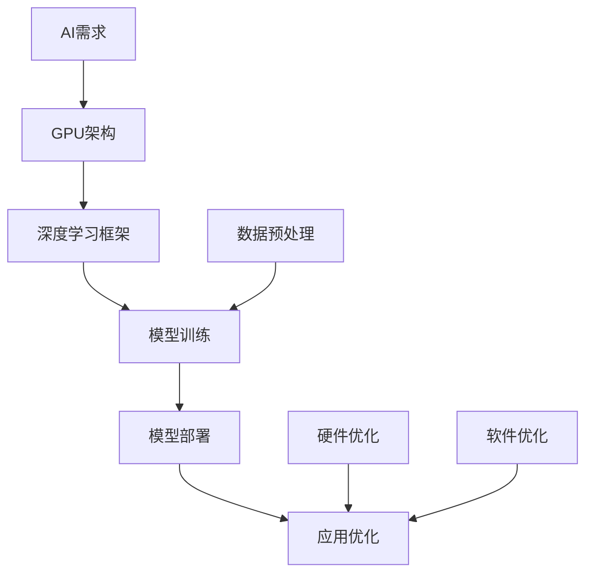

                 

# 《NVIDIA的算力支持与AI发展》

> **关键词：** NVIDIA, GPU计算, 深度学习, 算力, AI技术, 产业应用

> **摘要：** 本篇文章将深入探讨NVIDIA在人工智能（AI）领域的发展及其算力支持。文章分为五个部分，首先介绍NVIDIA的发展历程和其在AI计算中的作用，然后详细解析NVIDIA GPU的核心技术，接着介绍NVIDIA深度学习平台的应用，随后分析AI算力支持与产业应用，最后展望NVIDIA在AI未来的发展。

## 《NVIDIA的算力支持与AI发展》目录大纲

- **第一部分：NVIDIA与AI技术概述**
  - 第1章: NVIDIA在AI领域的作用
    - 1.1 NVIDIA的发展历程
    - 1.2 AI计算需求与GPU技术
    - 1.3 NVIDIA的关键产品与解决方案
    - 1.4 AI时代的发展趋势
- **第二部分：NVIDIA GPU核心技术详解**
  - 第2章: NVIDIA GPU架构与并行计算
    - 2.1 NVIDIA GPU架构基础
    - 2.2 GPU并行编程基础
    - 2.3 CUDA核心算法原理
    - 2.4 GPU性能优化技巧
- **第三部分：NVIDIA深度学习平台应用**
  - 第3章: NVIDIA深度学习平台
    - 3.1 CUDA与深度学习框架
    - 3.2 NVIDIA深度学习工具与资源
    - 3.3 深度学习实战案例
- **第四部分：AI算力支持与产业应用**
  - 第4章: AI算力支持与技术创新
    - 4.1 AI算力需求分析
    - 4.2 NVIDIA在AI产业中的应用
    - 4.3 AI算力支持与产业发展
- **第五部分：未来展望与挑战**
  - 第5章: NVIDIA与AI未来的发展
    - 5.1 AI未来的发展趋势
    - 5.2 NVIDIA的挑战与机遇
    - 5.3 NVIDIA的未来愿景

接下来，我们将按照这个大纲逐步展开讨论，深入分析NVIDIA在AI领域的算力支持及其重要影响。

### 第一部分：NVIDIA与AI技术概述

#### 第1章: NVIDIA在AI领域的作用

NVIDIA，作为全球领先的技术公司，其在AI领域的贡献不可忽视。从早期的图形处理器（GPU）到当今的深度学习计算平台，NVIDIA一直在推动AI技术的发展。以下章节将详细探讨NVIDIA的发展历程、AI计算需求与GPU技术的结合、NVIDIA的关键产品与解决方案，以及AI时代的发展趋势。

### 1.1 NVIDIA的发展历程

NVIDIA成立于1993年，由Jerry Sanders创立。公司的初衷是开发高性能的图形处理器，以推动图形处理技术的进步。自从成立以来，NVIDIA经历了多次重要的里程碑。

- **1997年**：发布GeForce 256显卡，这是第一款实现三维纹理映射的GPU，标志着NVIDIA在图形处理领域的重要地位。
- **2006年**：推出CUDA架构，这是一个革命性的并行计算平台，使得GPU不仅能够处理图形渲染，还能够进行通用计算。
- **2012年**：推出Tesla GPU加速器，专门为高性能计算和科学计算设计，为AI计算奠定了基础。
- **2016年**：发布TensorRT，这是一个高性能深度学习推理引擎，能够大幅提高深度学习模型的推理速度。
- **2018年**：发布RTX系列显卡，引入了实时光线追踪技术，进一步推动了AI在图形处理和计算视觉领域的发展。

这些里程碑事件不仅展示了NVIDIA的技术创新能力，也证明了其在推动AI发展方面的重要作用。

### 1.2 AI计算需求与GPU技术

人工智能（AI）技术的快速发展对计算能力提出了巨大的需求。传统的CPU在处理大规模并行计算任务时存在明显的瓶颈，而GPU由于其强大的并行计算能力，成为了AI计算的理想选择。

#### 1.2.1 AI计算的特点与挑战

AI计算具有以下特点：

- **数据密集性**：AI模型通常需要处理大量的数据，例如图像、语音和文本。
- **并行性**：AI算法，如深度学习，可以分解为许多独立的计算任务，非常适合并行处理。
- **高吞吐量**：AI模型训练和推理需要处理大量的数据，要求系统具备高吞吐量。

然而，AI计算也面临着以下挑战：

- **计算复杂度**：AI模型通常包含数百万甚至数十亿个参数，需要大量的计算资源。
- **能耗管理**：大规模的AI计算任务需要大量的电力，能耗管理成为一个重要问题。
- **数据传输延迟**：数据在GPU和CPU之间的传输延迟会影响整体计算性能。

#### 1.2.2 GPU技术在AI计算中的应用

GPU技术在AI计算中的应用主要表现在以下几个方面：

- **并行计算能力**：GPU具有成千上万个核心，能够同时执行大量的计算任务，非常适合大规模并行计算。
- **内存带宽**：GPU具有极高的内存带宽，可以快速处理和传输大量数据。
- **低延迟**：GPU和CPU之间的数据传输延迟较低，有助于提高整体计算效率。
- **支持多种算法**：GPU能够支持多种AI算法，如卷积神经网络（CNN）、循环神经网络（RNN）和生成对抗网络（GAN）。

#### 1.2.3 NVIDIA GPU的架构优势

NVIDIA GPU的架构优势使其成为AI计算的理想选择。以下是NVIDIA GPU架构的一些关键优势：

- **CUDA架构**：CUDA是一个并行计算平台，允许开发者在GPU上编写并行程序。CUDA提供了丰富的库和工具，如cuDNN和TensorRT，用于深度学习推理和优化。
- **张量处理单元**：现代NVIDIA GPU包含专门的张量处理单元，能够高效地执行深度学习运算，如矩阵乘法和卷积运算。
- **多级缓存结构**：NVIDIA GPU具有多级缓存结构，包括L1、L2和L3缓存，有助于提高内存访问速度和减少延迟。
- **高级内存管理**：NVIDIA GPU提供了高级内存管理功能，如统一虚拟内存（Unified Virtual Memory），允许开发者更有效地管理GPU和CPU之间的数据传输。

### 1.3 NVIDIA的关键产品与解决方案

NVIDIA在AI领域的关键产品与解决方案包括：

- **GPU产品系列**：NVIDIA提供了一系列的GPU产品，从入门级的GeForce系列到高性能的专业GPU如Tesla系列和RTX系列。这些产品覆盖了从个人计算到大规模数据中心的各种需求。
- **深度学习平台**：NVIDIA深度学习平台包括CUDA和cuDNN等工具，以及TensorRT和TensorFlow等深度学习框架，提供了完整的开发环境，支持从模型训练到推理的整个深度学习生命周期。
- **AI解决方案案例**：NVIDIA在多个领域提供了AI解决方案，如自动驾驶、智能制造、医疗健康和金融科技等。这些解决方案利用NVIDIA的GPU计算能力和深度学习技术，为行业带来了革命性的变化。

### 1.4 AI时代的发展趋势

随着AI技术的快速发展，AI时代的发展趋势变得越来越清晰。以下是一些重要的趋势：

- **大规模模型与分布式计算**：为了处理更复杂的问题，AI模型变得越来越大规模。分布式计算技术，如GPU集群和数据中心，成为支持大规模模型训练和推理的关键。
- **实时推理与边缘计算**：随着物联网（IoT）和智能设备的普及，实时推理和边缘计算变得越来越重要。NVIDIA的GPU技术支持在边缘设备上进行高效的AI推理。
- **可解释性与隐私保护**：随着AI技术在关键领域的应用，如医疗和金融，可解释性和隐私保护变得至关重要。NVIDIA正在开发可解释性工具和隐私保护算法，以满足这些需求。

### 结论

NVIDIA在AI领域的作用不可低估。通过其强大的GPU计算能力和深度学习技术，NVIDIA推动了AI技术的发展，为各个行业带来了革命性的变化。在接下来的章节中，我们将进一步探讨NVIDIA GPU的核心技术及其在深度学习平台中的应用。

### 第二部分：NVIDIA GPU核心技术详解

#### 第2章: NVIDIA GPU架构与并行计算

NVIDIA GPU的核心技术是其强大的并行计算能力。本章将详细解析NVIDIA GPU的架构、并行编程基础、CUDA核心算法原理以及GPU性能优化技巧，帮助读者深入理解NVIDIA GPU在深度学习和其他计算任务中的应用。

### 2.1 NVIDIA GPU架构基础

NVIDIA GPU架构的核心是其高度并行化的设计，这种设计使得GPU能够同时执行大量独立的计算任务。以下是NVIDIA GPU架构的关键组成部分：

#### 2.1.1 CUDA架构

CUDA（Compute Unified Device Architecture）是NVIDIA开发的一个并行计算平台，允许开发者使用C/C++等编程语言编写并行程序，并直接在GPU上运行。CUDA架构包括以下几个关键组成部分：

- **CUDA核心（CUDA Cores）**：这是GPU上的计算单元，每个核心都能独立执行计算任务。
- **张量处理单元（Tensor Cores）**：在NVIDIA的某些GPU中，如RTX系列，包含专门的张量处理单元，这些单元能够高效地执行深度学习和其他科学计算任务。
- **内存管理**：CUDA提供了内存管理功能，包括统一虚拟内存（Unified Virtual Memory，UVM）和统一内存操作（Unified Memory Operations，UMO），这些功能使得GPU和CPU之间的数据传输更加高效。
- **计算存储层次结构**：GPU具有多级缓存结构，包括L1、L2和L3缓存，这些缓存能够提高数据访问速度和减少延迟。

#### 2.1.2 CUDA核心与内存管理

CUDA核心是GPU的计算单元，每个核心都能执行基本算术运算和逻辑运算。现代NVIDIA GPU包含数千个CUDA核心，这使得GPU能够同时处理大量的计算任务。

内存管理是并行计算的重要组成部分。NVIDIA GPU提供了以下几种内存类型：

- **全局内存（Global Memory）**：这是GPU中最大的内存区域，用于存储全局变量和数据。
- **共享内存（Shared Memory）**：这是GPU核心之间共享的内存，用于存储临时数据和中间结果。
- **纹理内存（Texture Memory）**：这是用于存储纹理数据的内存，常用于图像处理任务。
- **常数内存（Constant Memory）**：这是用于存储常量数据的内存，如模型参数和配置信息。

内存管理的关键是优化数据访问，以减少内存访问延迟和提高计算效率。以下是一些优化策略：

- **内存分配与释放**：合理分配和释放内存，避免内存泄漏和碎片化。
- **内存访问模式**：优化内存访问模式，减少内存冲突和缓存未命中。
- **统一内存（Unified Memory）**：使用统一内存简化内存管理，提高数据传输效率。

#### 2.1.3 GPU计算单元与并行计算原理

NVIDIA GPU的计算单元设计是为了高效执行并行计算任务。以下是GPU计算单元的关键组成部分：

- **计算单元（Compute Unit）**：每个计算单元包含多个CUDA核心，能够同时执行多个线程。
- **调度单元（Scheduler）**：调度单元负责分配计算任务到不同的计算单元，并管理线程的执行。
- **内存管理单元（Memory Management Unit）**：内存管理单元负责管理GPU的内存资源，包括内存分配、数据传输和缓存管理。

并行计算原理在于将一个大的计算任务分解为多个小的子任务，并行执行，然后汇总结果。以下是并行计算的一些关键概念：

- **线程（Thread）**：线程是并行计算的基本执行单元，每个线程包含一段代码和一组寄存器。
- **线程块（Thread Block）**：线程块是一组相关的线程，它们共享一组资源，如共享内存。
- **网格（Grid）**：网格是一组相关的线程块，它们协同工作以完成一个大的计算任务。

并行计算的优势在于：

- **加速计算**：通过并行执行，可以显著提高计算速度，特别是对于大规模计算任务。
- **高效利用资源**：GPU包含大量的计算核心，通过并行计算，可以充分利用这些资源。

### 2.2 GPU并行编程基础

GPU并行编程是利用GPU的并行计算能力进行编程的过程。以下是一些基本的GPU并行编程概念和技巧：

#### 2.2.1 GPU并行编程模型

GPU并行编程模型包括以下几个关键概念：

- **网格（Grid）**：网格是一个多维数据结构，用于组织线程块。
- **线程块（Block）**：线程块是一组相关的线程，它们共享一组资源，如共享内存。
- **线程（Thread）**：线程是并行计算的基本执行单元，每个线程包含一段代码和一组寄存器。
- **块索引（Block Index）**：块索引用于确定线程块在网格中的位置。
- **线程索引（Thread Index）**：线程索引用于确定线程在线程块中的位置。

以下是一个简单的GPU并行编程模型示例：

```c
// 假设我们有一个简单的计算任务，计算每个元素的平方
__global__ void square(int *data) {
    int idx = threadIdx.x + blockIdx.x * blockDim.x;
    data[idx] = data[idx] * data[idx];
}

int main() {
    // 初始化数据
    int size = 1024;
    int *data = (int *)malloc(size * sizeof(int));
    for (int i = 0; i < size; i++) {
        data[i] = i;
    }

    // 配置线程块和线程数
    int blockSize = 256;
    int gridSize = (size + blockSize - 1) / blockSize;

    // 执行计算
    square<<<gridSize, blockSize>>>(data);

    // 输出结果
    for (int i = 0; i < size; i++) {
        printf("%d ", data[i]);
    }
    printf("\n");

    // 清理资源
    free(data);
    return 0;
}
```

#### 2.2.2 CUDA内存模型与数据传输

CUDA内存模型是理解GPU并行编程的关键。以下是CUDA内存模型的关键组成部分：

- **全局内存（Global Memory）**：全局内存是GPU中最大的内存区域，用于存储全局变量和数据。
- **共享内存（Shared Memory）**：共享内存是线程块之间共享的内存，用于存储临时数据和中间结果。
- **纹理内存（Texture Memory）**：纹理内存用于存储纹理数据，常用于图像处理任务。
- **常数内存（Constant Memory）**：常数内存用于存储常量数据，如模型参数和配置信息。

数据传输是GPU并行编程的重要组成部分。以下是CUDA中的几种数据传输方式：

- **主机到设备（Host to Device）**：将主机内存中的数据传输到GPU设备。
- **设备到主机（Device to Host）**：将GPU设备中的数据传输到主机内存。
- **设备到设备（Device to Device）**：将GPU设备中的数据从一个设备传输到另一个设备。

以下是一个简单的数据传输示例：

```c
// 假设我们有一个数组data，要将其从主机传输到设备
int size = 1024;
int *data_host = (int *)malloc(size * sizeof(int));
int *data_device;

// 分配设备内存
cudaMalloc((void **)&data_device, size * sizeof(int));

// 将主机数据传输到设备
cudaMemcpy(data_device, data_host, size * sizeof(int), cudaMemcpyHostToDevice);

// 执行计算
square<<<gridSize, blockSize>>>(data_device);

// 将设备数据传输回主机
cudaMemcpy(data_host, data_device, size * sizeof(int), cudaMemcpyDeviceToHost);

// 清理资源
cudaFree(data_device);
free(data_host);
```

#### 2.2.3 GPU线程组织与同步机制

GPU线程组织是理解并行编程的关键。以下是GPU线程组织的关键概念：

- **线程维度（Thread Dimensions）**：线程维度定义了线程在网格中的组织方式，包括x、y和z三个维度。
- **线程索引（Thread Index）**：线程索引用于确定线程在网格中的位置。
- **线程块（Thread Block）**：线程块是一组相关的线程，它们共享一组资源，如共享内存。
- **网格（Grid）**：网格是一组相关的线程块，它们协同工作以完成一个大的计算任务。

同步机制是确保并行计算正确性的关键。以下是CUDA中的几种同步机制：

- **原子操作（Atomic Operations）**：原子操作确保多个线程对共享变量的访问是原子的，防止数据竞争。
- **屏障（Barrier）**：屏障用于同步线程块中的所有线程，确保它们在执行下一阶段代码前完成当前阶段的所有操作。
- **互斥锁（Mutex）**：互斥锁用于保护共享资源，确保只有一个线程能够访问该资源。

以下是一个简单的同步示例：

```c
__global__ void count(int *data, int *count) {
    __shared__ int local_count;
    if (threadIdx.x == 0) {
        local_count = 0;
    }
    __syncthreads();
    // 执行计算
    local_count += 1;
    __syncthreads();
    if (threadIdx.x == 0) {
        atomicAdd(count, local_count);
    }
}
```

### 2.3 CUDA核心算法原理

CUDA核心算法是利用GPU进行高效计算的关键。以下是几种常见的CUDA核心算法原理：

#### 2.3.1 张量核心算法

张量核心算法是深度学习和其他科学计算的基础。以下是一些常见的张量核心算法：

- **矩阵乘法（Matrix Multiplication）**：矩阵乘法是深度学习中的基本操作，用于计算两个矩阵的乘积。以下是矩阵乘法的伪代码：

```c
for (int k = 0; k < n; k++) {
    for (int i = 0; i < m; i++) {
        for (int j = 0; j < p; j++) {
            C[i][j] += A[i][k] * B[k][j];
        }
    }
}
```

- **卷积（Convolution）**：卷积是图像处理和深度学习中的重要操作，用于计算输入图像和卷积核的卷积结果。以下是卷积的伪代码：

```c
for (int i = 0; i < n; i++) {
    for (int j = 0; j < m; j++) {
        for (int x = 0; x < p; x++) {
            for (int y = 0; y < q; y++) {
                output[i][j] += input[i][j] * kernel[x][y];
            }
        }
    }
}
```

- **归一化（Normalization）**：归一化是用于调整数据分布的算法，常用于深度学习中的激活函数。以下是L2归一化的伪代码：

```c
for (int i = 0; i < n; i++) {
    sum = 0;
    for (int j = 0; j < m; j++) {
        sum += input[i][j] * input[i][j];
    }
    sqrt(sum);
    for (int j = 0; j < m; j++) {
        output[i][j] = input[i][j] / sqrt(sum);
    }
}
```

#### 2.3.2 图像处理算法

图像处理算法是利用GPU进行图像处理的关键。以下是一些常见的图像处理算法：

- **边缘检测（Edge Detection）**：边缘检测是用于检测图像中的边缘的算法。以下是一个简单的Sobel边缘检测算法：

```c
for (int i = 1; i < n-1; i++) {
    for (int j = 1; j < m-1; j++) {
        int Gx = -1*img[i-1][j-1] - 2*img[i-1][j] - 1*img[i-1][j+1];
        int Gy = 1*img[i+1][j-1] + 2*img[i+1][j] + 1*img[i+1][j+1];
        int G = sqrt(Gx*Gx + Gy*Gy);
        if (G > threshold) {
            output[i][j] = 255;
        } else {
            output[i][j] = 0;
        }
    }
}
```

- **图像增强（Image Enhancement）**：图像增强是用于改善图像质量和对比度的算法。以下是一个简单的直方图均衡化算法：

```c
// 计算直方图
int hist[n];
for (int i = 0; i < n; i++) {
    hist[i] = 0;
}
for (int i = 0; i < m; i++) {
    for (int j = 0; j < n; j++) {
        hist[input[i][j]]++;
    }
}

// 计算累积直方图
int cum_hist[n];
cum_hist[0] = hist[0];
for (int i = 1; i < n; i++) {
    cum_hist[i] = cum_hist[i-1] + hist[i];
}

// 计算映射关系
int map[n];
for (int i = 0; i < n; i++) {
    int c = (cum_hist[i] * 255) / m;
    map[i] = c;
}

// 应用映射关系
for (int i = 0; i < m; i++) {
    for (int j = 0; j < n; j++) {
        output[i][j] = map[input[i][j]];
    }
}
```

#### 2.3.3 神经网络算法

神经网络算法是深度学习中的核心。以下是一些常见的神经网络算法：

- **前向传播（Forward Propagation）**：前向传播是神经网络计算输入和输出之间关系的算法。以下是简单的神经网络前向传播算法：

```python
# 假设我们有一个输入X，权重W，偏置b和激活函数激活函数
z = X.dot(W) + b
a = 激活函数(z)
```

- **反向传播（Back Propagation）**：反向传播是用于计算神经网络参数的梯度，用于模型训练。以下是简单的反向传播算法：

```python
# 假设我们有一个输出O，预测Y，损失函数损失函数
delta = (O - Y) * 激活函数导数(a)
dz = delta.dot(W.T)
dW = X.T.dot(delta)
db = delta.sum(axis=0)
```

- **优化算法（Optimization Algorithms）**：优化算法用于调整神经网络参数，以最小化损失函数。以下是一些常见的优化算法：

```python
# 假设我们有一个损失函数L，参数θ，学习率α
θ = θ - α * ∇θL(θ)
```

### 2.4 GPU性能优化技巧

GPU性能优化是提高计算效率的关键。以下是一些常见的GPU性能优化技巧：

#### 2.4.1 指令级并行优化

指令级并行优化是提高GPU计算效率的关键。以下是一些常见的指令级优化技巧：

- **指令调度（Instruction Scheduling）**：指令调度是优化GPU指令执行的顺序，以减少指令间的依赖关系。以下是一个简单的指令调度示例：

```c
__global__ void optimized_square(int *data) {
    int idx = threadIdx.x + blockIdx.x * blockDim.x;
    __syncthreads();
    data[idx] = data[idx] * data[idx];
}
```

- **内存访问优化（Memory Access Optimization）**：内存访问优化是减少内存访问延迟和提高内存带宽的关键。以下是一些内存访问优化技巧：

  - **数据局部性（Data Locality）**：利用数据局部性，将相关的数据存储在共享内存中，以减少全局内存访问。
  - **内存对齐（Memory Alignment）**：确保数据在内存中按照特定的边界对齐，以减少内存访问冲突。
  - **内存批量传输（Memory Batched Transfers）**：批量传输数据，以减少内存访问次数。

#### 2.4.2 内存优化策略

内存优化策略是提高GPU计算效率的关键。以下是一些常见的内存优化策略：

- **统一内存（Unified Memory）**：统一内存是一种内存管理策略，将GPU和CPU之间的内存访问统一，以减少内存管理的复杂性。以下是一个简单的统一内存示例：

```c
int size = 1024;
int *data;

// 分配统一内存
cudaMallocManaged(&data, size * sizeof(int));

// 将主机数据传输到统一内存
cudaMemcpy(data, host_data, size * sizeof(int), cudaMemcpyHostToDevice);

// 执行计算
optimized_square<<<gridSize, blockSize>>>(data);

// 将统一内存数据传输回主机
cudaMemcpy(host_data, data, size * sizeof(int), cudaMemcpyDeviceToHost);

// 清理资源
cudaFree(data);
```

- **内存池（Memory Pools）**：内存池是一种内存管理策略，用于预分配和回收内存，以减少内存分配和释放的开销。以下是一个简单的内存池示例：

```c
// 预分配内存池
int pool_size = 1024;
int *pool = (int *)malloc(pool_size * sizeof(int));

// 分配内存
int *data = malloc_from_pool(pool);

// 释放内存
free_to_pool(data, pool);
```

#### 2.4.3 并行编程实践与案例分析

并行编程实践是提高GPU计算效率的关键。以下是一些并行编程实践和案例分析：

- **并行编程实践**：

  - **任务分解（Task Decomposition）**：将大的计算任务分解为小的子任务，以充分利用GPU的并行计算能力。
  - **线程组织（Thread Organization）**：合理组织线程，以减少线程之间的依赖关系和内存访问冲突。
  - **数据共享（Data Sharing）**：利用共享内存和数据局部性，提高数据访问效率。

- **案例分析**：

  - **深度学习模型训练**：深度学习模型训练是一个典型的并行计算任务，可以通过将数据分解为批次，并行计算每个批次的梯度，然后汇总结果来进行训练。
  - **图像处理任务**：图像处理任务，如卷积和边缘检测，可以通过将图像分解为小块，并行处理每个小块，然后合并结果来进行处理。

### 结论

NVIDIA GPU的并行计算能力使其成为AI计算的理想选择。通过CUDA架构、并行编程基础、核心算法原理和性能优化技巧，开发者可以充分利用GPU的并行计算能力，提高计算效率。在接下来的章节中，我们将进一步探讨NVIDIA深度学习平台的应用。

### 第三部分：NVIDIA深度学习平台应用

#### 第3章: NVIDIA深度学习平台

NVIDIA深度学习平台是一个全面的开源框架，旨在加速深度学习模型的研究、开发和部署。本章将详细介绍CUDA与深度学习框架的结合、NVIDIA深度学习工具与资源，以及深度学习实战案例，以帮助读者全面了解NVIDIA在深度学习领域的应用。

### 3.1 CUDA与深度学习框架

CUDA与深度学习框架的结合是NVIDIA深度学习平台的核心。以下内容将介绍CUDA如何与深度学习框架如TensorFlow和PyTorch集成，以加速深度学习模型的训练和推理。

#### 3.1.1 CUDA在深度学习中的应用

CUDA在深度学习中的应用主要体现在以下几个方面：

- **加速训练**：深度学习模型通常包含大量参数，需要大量的矩阵运算。GPU的并行计算能力可以显著加速这些计算，从而加快模型训练的速度。
- **推理加速**：在部署深度学习模型时，推理速度是一个关键因素。CUDA能够加速模型在GPU上的推理过程，提高模型的响应速度。
- **灵活的编程模型**：CUDA提供了丰富的编程模型和库，如cuDNN和TensorRT，这些库为深度学习运算提供了高度优化的实现。

#### 3.1.2 CUDA与TensorFlow

TensorFlow是Google开源的深度学习框架，它支持在多种硬件平台上运行，包括GPU。以下是如何在TensorFlow中使用CUDA加速深度学习模型训练的步骤：

1. **安装CUDA和cuDNN**：在安装TensorFlow之前，需要安装NVIDIA CUDA和cuDNN库。这些库提供了GPU加速功能。

2. **配置TensorFlow**：通过在代码中设置配置参数，可以启用TensorFlow的GPU支持。例如：

   ```python
   import tensorflow as tf
   gpus = tf.config.experimental.list_physical_devices('GPU')
   if gpus:
       try:
           for gpu in gpus:
               tf.config.experimental.set_memory_growth(gpu, True)
       except RuntimeError as e:
           print(e)
   ```

3. **编写GPU加速的代码**：在TensorFlow中，可以使用`tf.keras`或`tf.function`装饰器来创建GPU加速的模型。例如：

   ```python
   @tf.function
   def train_step(model, inputs, labels):
       with tf.GradientTape() as tape:
           predictions = model(inputs)
           loss = tf.keras.losses.sparse_categorical_crossentropy(labels, predictions)
       grads = tape.gradient(loss, model.trainable_variables)
       model.optimizer.apply_gradients(zip(grads, model.trainable_variables))
       return loss

   # 训练模型
   for epoch in range(epochs):
       for inputs, labels in dataset:
           loss = train_step(model, inputs, labels)
           print(f'Epoch {epoch}, Loss: {loss}')
   ```

#### 3.1.3 CUDA与PyTorch

PyTorch是另一个流行的开源深度学习框架，它也非常容易与CUDA集成以利用GPU计算。以下是如何在PyTorch中使用CUDA加速深度学习模型的步骤：

1. **安装CUDA和cuDNN**：与TensorFlow类似，需要先安装NVIDIA CUDA和cuDNN库。

2. **配置PyTorch**：在PyTorch中，可以通过设置`torch.cuda`模块来配置GPU。例如：

   ```python
   import torch
   device = torch.device("cuda" if torch.cuda.is_available() else "cpu")
   model.to(device)
   ```

3. **编写GPU加速的代码**：在PyTorch中，可以使用`.to()`方法将模型和数据转移到GPU。以下是一个简单的示例：

   ```python
   # 定义模型
   class NeuralNetwork(nn.Module):
       def __init__(self):
           super(NeuralNetwork, self).__init__()
           self.layer1 = nn.Linear(in_features=784, out_features=128)
           self.relu = nn.ReLU()
           self.layer2 = nn.Linear(in_features=128, out_features=10)

       def forward(self, x):
           x = self.layer1(x)
           x = self.relu(x)
           x = self.layer2(x)
           return x

   # 实例化模型
   model = NeuralNetwork()

   # 将模型和数据转移到GPU
   model.to(device)
   inputs = inputs.to(device)
   labels = labels.to(device)

   # 定义优化器和损失函数
   optimizer = torch.optim.Adam(model.parameters(), lr=0.001)
   criterion = nn.CrossEntropyLoss()

   # 训练模型
   for epoch in range(epochs):
       for inputs, labels in dataset:
           optimizer.zero_grad()
           outputs = model(inputs)
           loss = criterion(outputs, labels)
           loss.backward()
           optimizer.step()
           print(f'Epoch {epoch}, Loss: {loss.item()}')
   ```

### 3.2 NVIDIA深度学习工具与资源

NVIDIA为深度学习开发者提供了丰富的工具和资源，以简化模型的研究、开发和部署。以下是一些重要的NVIDIA深度学习工具和资源：

#### 3.2.1 NVIDIA Datasets

NVIDIA Datasets是一个开源的数据集存储库，提供了大量预处理的深度学习数据集。开发者可以在NVIDIA Datasets中找到广泛的数据集，包括图像、视频、音频和自然语言处理数据集。使用NVIDIA Datasets，开发者可以轻松地下载、预处理和加载数据集，以加速模型开发。

#### 3.2.2 NVIDIA GPU Cloud

NVIDIA GPU Cloud（NGC）是一个云平台，提供了丰富的预配置的深度学习容器和软件库。开发者可以在NGC中找到各种深度学习框架、库和工具的预配置容器，如TensorFlow、PyTorch、cuDNN和CUDA。使用NGC，开发者可以轻松地部署和管理深度学习环境，提高开发效率。

#### 3.2.3 NVIDIA RAPIDS

NVIDIA RAPIDS是一个开源项目，旨在利用NVIDIA GPU加速数据科学和机器学习工作流程。RAPIDS提供了用于数据处理、模型训练和推理的GPU加速库，如cuDF、cuML和cuGraph。使用RAPIDS，开发者可以构建高性能的GPU加速数据科学和机器学习应用程序，显著提高数据处理和分析速度。

### 3.3 深度学习实战案例

以下是一些使用NVIDIA深度学习平台实现的深度学习实战案例：

#### 3.3.1 图像识别

图像识别是一个常见的深度学习任务，NVIDIA深度学习平台提供了丰富的工具和资源来加速图像识别模型的开发。以下是一个简单的图像识别案例：

```python
import torch
import torchvision
import torchvision.transforms as transforms
from torch.utils.data import DataLoader
from torchvision.datasets import CIFAR10
from neural_network import NeuralNetwork

# 加载数据集
transform = transforms.Compose([
    transforms.ToTensor(),
    transforms.Normalize((0.5, 0.5, 0.5), (0.5, 0.5, 0.5))
])
train_data = CIFAR10(root='./data', train=True, download=True, transform=transform)
test_data = CIFAR10(root='./data', train=False, download=True, transform=transform)
train_loader = DataLoader(train_data, batch_size=64, shuffle=True)
test_loader = DataLoader(test_data, batch_size=64, shuffle=False)

# 定义模型
model = NeuralNetwork()
model.to(device)

# 定义优化器和损失函数
optimizer = torch.optim.Adam(model.parameters(), lr=0.001)
criterion = nn.CrossEntropyLoss()

# 训练模型
for epoch in range(epochs):
    running_loss = 0.0
    for inputs, labels in train_loader:
        inputs, labels = inputs.to(device), labels.to(device)
        optimizer.zero_grad()
        outputs = model(inputs)
        loss = criterion(outputs, labels)
        loss.backward()
        optimizer.step()
        running_loss += loss.item()
    print(f'Epoch {epoch + 1}, Loss: {running_loss / len(train_loader)}')

# 测试模型
model.eval()
with torch.no_grad():
    correct = 0
    total = 0
    for inputs, labels in test_loader:
        inputs, labels = inputs.to(device), labels.to(device)
        outputs = model(inputs)
        _, predicted = torch.max(outputs.data, 1)
        total += labels.size(0)
        correct += (predicted == labels).sum().item()
    print(f'Accuracy: {100 * correct / total}%')
```

#### 3.3.2 自然语言处理

自然语言处理（NLP）是深度学习的一个广泛应用领域，NVIDIA深度学习平台提供了丰富的工具和资源来加速NLP模型的开发。以下是一个简单的NLP案例：

```python
import torch
import torchtext
from torchtext.data import Field, BucketIterator
from models import RNNModel

# 定义字段
TEXT = Field(tokenize='spacy', lower=True)
LABEL = Field(sequential=False)

# 加载数据集
train_data, test_data = torchtext.datasets.IMDB.splits(TEXT, LABEL)
TEXT.build_vocab(train_data, max_size=25000, vectors="glove.6B.100d")
LABEL.build_vocab(train_data)
train_iterator, test_iterator = BucketIterator.splits((train_data, test_data), batch_size=64)

# 定义模型
model = RNNModel(len(TEXT.vocab), 100, 64, len(LABEL.vocab), 0.3)

# 定义优化器和损失函数
optimizer = torch.optim.Adam(model.parameters(), lr=0.001)
criterion = nn.NLLLoss()

# 训练模型
for epoch in range(epochs):
    model.train()
    for batch in train_iterator:
        inputs, labels = batch.text, batch.label
        inputs = inputs.to(device)
        labels = labels.to(device)
        optimizer.zero_grad()
        outputs = model(inputs)
        loss = criterion(outputs, labels)
        loss.backward()
        optimizer.step()
    print(f'Epoch {epoch + 1}, Loss: {loss.item()}')

# 测试模型
model.eval()
with torch.no_grad():
    correct = 0
    total = 0
    for batch in test_iterator:
        inputs, labels = batch.text, batch.label
        inputs = inputs.to(device)
        labels = labels.to(device)
        outputs = model(inputs)
        _, predicted = torch.max(outputs.data, 1)
        total += labels.size(0)
        correct += (predicted == labels).sum().item()
    print(f'Accuracy: {100 * correct / total}%')
```

#### 3.3.3 推荐系统

推荐系统是深度学习在商业应用中的重要领域，NVIDIA深度学习平台提供了丰富的工具和资源来加速推荐系统的开发。以下是一个简单的推荐系统案例：

```python
import torch
import torch.nn as nn
import torch.optim as optim
from torch.utils.data import DataLoader
from data_loader import DataLoader
from recommendation_model import RecommendationModel

# 加载数据集
train_loader = DataLoader(train_data, batch_size=128, shuffle=True)
test_loader = DataLoader(test_data, batch_size=128, shuffle=False)

# 定义模型
model = RecommendationModel(input_dim, hidden_dim, output_dim)

# 定义优化器和损失函数
optimizer = optim.Adam(model.parameters(), lr=0.001)
criterion = nn.CrossEntropyLoss()

# 训练模型
for epoch in range(epochs):
    model.train()
    for batch in train_loader:
        user_ids, item_ids, labels = batch
        user_ids = user_ids.to(device)
        item_ids = item_ids.to(device)
        labels = labels.to(device)
        optimizer.zero_grad()
        outputs = model(user_ids, item_ids)
        loss = criterion(outputs, labels)
        loss.backward()
        optimizer.step()
    print(f'Epoch {epoch + 1}, Loss: {loss.item()}')

# 测试模型
model.eval()
with torch.no_grad():
    correct = 0
    total = 0
    for batch in test_loader:
        user_ids, item_ids, labels = batch
        user_ids = user_ids.to(device)
        item_ids = item_ids.to(device)
        labels = labels.to(device)
        outputs = model(user_ids, item_ids)
        _, predicted = torch.max(outputs.data, 1)
        total += labels.size(0)
        correct += (predicted == labels).sum().item()
    print(f'Accuracy: {100 * correct / total}%')
```

### 结论

NVIDIA深度学习平台是一个强大的工具集，它通过结合CUDA架构和深度学习框架，提供了从研究到生产的全面支持。通过CUDA与TensorFlow和PyTorch的集成，开发者可以充分利用GPU的并行计算能力，加速深度学习模型的训练和推理。NVIDIA提供的深度学习工具和资源，如NVIDIA Datasets、NVIDIA GPU Cloud和NVIDIA RAPIDS，进一步简化了模型开发和部署的过程。在接下来的章节中，我们将进一步探讨AI算力支持与产业应用，以及NVIDIA在AI算力支持方面的贡献。

### 第四部分：AI算力支持与产业应用

#### 第4章: AI算力支持与技术创新

随着人工智能（AI）技术的迅速发展，对算力的需求也在不断增加。AI计算需要处理大量的数据，执行复杂的算法，因此对计算资源和速度的要求极高。在这一部分，我们将深入探讨AI算力需求分析、NVIDIA在AI产业中的应用，以及AI算力支持与产业发展的关系。

### 4.1 AI算力需求分析

AI算力需求分析是理解AI技术发展的关键。以下是从几个方面对AI算力需求的分析：

#### 4.1.1 AI算力的重要性

AI算力是AI技术的核心支撑。强大的算力可以加速AI模型的训练和推理，提高模型的准确性和效率。以下是一些关键原因：

- **模型复杂度增加**：随着深度学习模型的复杂度增加，如大型神经网络和生成对抗网络（GAN），对算力的需求也在不断增加。
- **数据量增加**：AI技术依赖于大规模数据集，这些数据集需要高效的计算能力来处理和分析。
- **实时性需求**：在自动驾驶、智能监控等领域，AI系统需要实时做出决策，这对计算速度提出了严格要求。

#### 4.1.2 AI算力的演进方向

AI算力的演进方向主要包括以下几个方面：

- **GPU和TPU的普及**：GPU和TPU（Tensor Processing Unit）是当前主要的AI计算平台，它们在并行计算能力方面具有显著优势。未来，随着技术进步，我们将看到更高效的专用AI计算芯片的出现。
- **分布式计算**：分布式计算通过将计算任务分配到多个节点，可以提供更大的计算能力。随着5G和边缘计算的发展，分布式计算在AI领域的重要性将进一步提高。
- **量子计算**：量子计算具有巨大的并行计算潜力，它可能在未来的AI计算中发挥重要作用。虽然量子计算尚未成熟，但已经在一些前沿应用中展示了其潜力。

#### 4.1.3 AI算力支持策略

为了满足AI算力的需求，以下是一些关键的AI算力支持策略：

- **硬件升级**：企业和研究机构需要不断升级硬件设施，包括GPU、TPU和其他专用计算设备。
- **优化算法**：通过改进算法，减少计算复杂度，可以显著提高计算效率。
- **分布式计算平台**：构建分布式计算平台，将计算任务分配到多个节点，可以提高整体计算能力。
- **云计算**：利用云计算平台提供的计算资源，可以灵活地满足AI算力的需求。

### 4.2 NVIDIA在AI产业中的应用

NVIDIA在AI产业的广泛应用，使其成为AI技术发展的主要推动者。以下是一些关键应用领域：

#### 4.2.1 智能制造

智能制造是NVIDIA在AI产业中的一个重要应用领域。通过AI技术，智能制造可以实现生产过程的自动化、智能化和高效化。以下是一些具体应用：

- **质量检测**：AI模型可以用于实时检测产品质量，识别缺陷，从而提高生产质量。
- **生产优化**：AI算法可以优化生产计划，提高生产效率，减少浪费。
- **设备维护**：通过预测性维护，AI模型可以预测设备故障，提前进行维护，减少停机时间。

#### 4.2.2 医疗健康

医疗健康是AI技术的另一个重要应用领域。NVIDIA的GPU和深度学习平台在医疗健康领域有广泛的应用，以下是一些具体应用：

- **医学影像分析**：AI模型可以用于医学影像分析，如X光、CT和MRI，帮助医生快速准确地诊断疾病。
- **药物研发**：AI技术可以加速药物研发过程，通过模拟和优化分子结构，提高药物研发的成功率。
- **个性化治疗**：AI模型可以根据患者的病史和基因信息，制定个性化的治疗方案。

#### 4.2.3 自动驾驶

自动驾驶是NVIDIA在AI产业中的一个重要应用领域。NVIDIA的GPU和深度学习平台为自动驾驶提供了强大的计算支持。以下是一些具体应用：

- **环境感知**：自动驾驶汽车需要实时感知周围环境，包括道路、车辆、行人等。AI模型可以用于环境感知，提高自动驾驶的安全性。
- **决策制定**：AI模型可以用于决策制定，如路径规划、速度控制等，使自动驾驶汽车能够自主行驶。
- **实时推理**：自动驾驶系统需要在毫秒级别内做出决策，这对计算速度提出了严格要求。NVIDIA的GPU平台可以提供高效的实时推理能力。

### 4.3 AI算力支持与产业发展

AI算力支持对产业发展具有重要影响。以下是一些关键方面：

#### 4.3.1 产业政策与标准

政府和企业制定了一系列产业政策与标准，以推动AI技术的发展。以下是一些具体政策与标准：

- **AI发展规划**：各国政府纷纷制定AI发展规划，明确AI技术在未来发展中的战略地位和目标。
- **数据政策**：数据是AI发展的关键，各国政府和企业制定了数据政策，以保障数据的安全和开放。
- **标准制定**：为了推动AI技术的发展，标准化组织和企业制定了一系列AI技术标准，包括算法、数据格式、安全标准等。

#### 4.3.2 NVIDIA与AI产业生态

NVIDIA在AI产业生态中扮演着重要角色。以下是一些关键方面：

- **合作伙伴关系**：NVIDIA与众多企业和研究机构建立了合作伙伴关系，共同推动AI技术的发展。
- **开源项目**：NVIDIA积极参与开源项目，如CUDA、cuDNN和TensorRT，为开发者提供了丰富的工具和资源。
- **培训与教育**：NVIDIA通过培训和教育活动，提高开发者的AI技能，推动AI技术的发展。

#### 4.3.3 AI算力对经济的影响

AI算力对经济发展具有重要影响。以下是一些关键方面：

- **产业升级**：AI技术的应用可以推动传统产业的升级，提高生产效率和质量。
- **创新驱动**：AI技术的快速发展为经济创新提供了新的动力，推动了新兴产业的发展。
- **就业机会**：AI技术的发展创造了大量就业机会，包括AI研发、数据分析、运维等岗位。

### 结论

AI算力支持是AI技术发展的关键。NVIDIA通过其强大的GPU和深度学习平台，为AI技术提供了强大的算力支持，推动了智能制造、医疗健康、自动驾驶等领域的创新。在未来的发展中，AI算力支持将继续发挥重要作用，推动AI技术的进一步发展，为经济发展带来新的机遇。

### 第五部分：未来展望与挑战

#### 第5章: NVIDIA与AI未来的发展

随着人工智能（AI）技术的不断进步，NVIDIA作为全球领先的科技公司，其在AI领域的未来前景令人期待。然而，这一未来也面临着诸多挑战。本章将探讨AI未来的发展趋势、NVIDIA所面临的挑战与机遇，以及NVIDIA对未来发展的愿景。

### 5.1 AI未来的发展趋势

AI未来的发展趋势是多方面的，涉及技术进步、应用扩展、伦理与法律等多个层面。以下是几个关键趋势：

#### 5.1.1 量子计算与AI

量子计算是一种具有巨大并行计算潜力的计算模式。与传统计算机不同，量子计算机利用量子位（qubits）进行计算，能够在极短的时间内解决复杂问题。量子计算与AI的结合有望大幅提升AI模型的训练速度和推理能力。以下是一些具体应用：

- **优化算法**：量子计算可以帮助优化AI算法，使其在更短的时间内找到更优的解。
- **大规模数据处理**：量子计算机可以处理大规模数据集，从而加速机器学习模型的训练。
- **密码破解与安全**：量子计算在密码学中的应用可能引发安全挑战，但也为新型加密技术提供了机会。

#### 5.1.2 大模型与分布式计算

随着数据量和计算需求的增长，大模型（Large Models）和分布式计算（Distributed Computing）将成为AI发展的关键趋势。以下是一些具体应用：

- **大模型**：更大规模的AI模型可以处理更复杂的问题，但同时也需要更多的计算资源。分布式计算可以通过将任务分布在多个节点上，提高计算效率和可扩展性。
- **边缘计算**：边缘计算将计算任务从云端转移到靠近数据源的边缘设备上，可以降低延迟并提高实时响应能力。

#### 5.1.3 可解释性与隐私保护

随着AI技术在关键领域的应用，可解释性和隐私保护变得至关重要。以下是一些具体应用：

- **可解释性**：可解释性AI可以帮助用户理解和信任AI系统，特别是在医疗、金融等敏感领域。
- **隐私保护**：AI系统需要保护用户隐私，避免数据泄露。新型加密技术和联邦学习（Federated Learning）等技术为隐私保护提供了新的解决方案。

### 5.2 NVIDIA的挑战与机遇

NVIDIA在AI领域的发展面临诸多挑战，同时也拥有许多机遇。以下是几个关键方面：

#### 5.2.1 技术创新的挑战

技术创新是NVIDIA保持领先地位的关键。以下是技术创新面临的挑战：

- **硬件竞争**：随着AI技术的普及，越来越多的硬件公司进入市场，NVIDIA需要不断创新以保持竞争力。
- **性能优化**：提高计算性能和能效比是持续挑战，NVIDIA需要不断优化GPU架构和算法。

#### 5.2.2 市场竞争与战略布局

市场竞争和战略布局是NVIDIA面临的另一个挑战。以下是相关方面：

- **竞争对手**：NVIDIA面临着来自英特尔、谷歌和其他硬件制造商的竞争。
- **市场定位**：NVIDIA需要在不同的市场定位中找到平衡，包括个人计算、数据中心和自动驾驶等。

#### 5.2.3 可持续发展与社会责任

可持续发展和社会责任是NVIDIA面临的重要议题。以下是相关方面：

- **环境问题**：随着数据中心规模的扩大，能耗问题变得日益严峻。NVIDIA需要开发更节能的硬件和优化能效比。
- **社会责任**：NVIDIA需要确保其技术不会对人类和社会产生负面影响，特别是在伦理和安全方面。

### 5.3 NVIDIA的未来愿景

NVIDIA对未来AI发展的愿景是推动计算技术的前沿，使AI技术更广泛地应用于各个领域，带来积极的社会和经济效益。以下是NVIDIA未来愿景的几个关键方面：

#### 5.3.1 NVIDIA的全球影响力

NVIDIA希望在全球范围内发挥更大的影响力，成为AI技术的领导者。以下是实现这一愿景的几个方面：

- **技术创新**：NVIDIA将持续投资于研发，推动技术创新，保持技术领先地位。
- **合作伙伴关系**：NVIDIA将与全球企业和研究机构建立紧密合作关系，共同推动AI技术的发展。
- **教育培训**：NVIDIA将通过教育培训，提高全球开发者的AI技能，推动AI技术的普及和应用。

#### 5.3.2 NVIDIA在AI领域的长期规划

NVIDIA在AI领域的长期规划包括以下几个方面：

- **多领域应用**：NVIDIA将扩大AI技术在各个领域的应用，包括医疗健康、智能制造、自动驾驶等。
- **开源与开放**：NVIDIA将继续积极参与开源项目，推动AI技术的开放和共享。
- **可持续发展**：NVIDIA将致力于可持续发展，通过技术创新和绿色能源，实现环保和社会责任。

#### 5.3.3 NVIDIA对未来的展望

NVIDIA对未来的展望是充满希望和机遇的。以下是NVIDIA对未来的展望：

- **量子计算与AI结合**：NVIDIA希望量子计算与AI的结合能够带来革命性的变化，推动AI技术进入新的发展阶段。
- **分布式计算与边缘计算**：NVIDIA将致力于分布式计算和边缘计算的发展，使AI技术能够更高效地应用于各个领域。
- **社会影响**：NVIDIA希望其技术能够为人类和社会带来积极的影响，解决全球面临的挑战，推动社会进步。

### 结论

NVIDIA在AI领域的未来充满机遇和挑战。通过持续的技术创新、全球合作和教育培训，NVIDIA有望在AI技术发展中保持领先地位，推动AI技术的广泛应用，为人类和社会带来更多福祉。

### 附录

#### 附录A: NVIDIA资源与工具

NVIDIA为开发者提供了丰富的资源与工具，以支持其在AI和深度学习领域的研发和应用。以下是一些重要的资源与工具：

- **NVIDIA官方网站**：[https://www.nvidia.com/](https://www.nvidia.com/)。NVIDIA的官方网站提供了最新产品信息、技术文档和下载资源。
- **CUDA官方文档**：[https://docs.nvidia.com/cuda/](https://docs.nvidia.com/cuda/)。CUDA官方文档包含了CUDA编程模型、API参考、示例代码和最佳实践指南。
- **NVIDIA深度学习框架教程**：[https://docs.nvidia.com/deeplearning/sdk/index.html](https://docs.nvidia.com/deeplearning/sdk/index.html)。这些教程涵盖了如何使用NVIDIA深度学习框架（如cuDNN、TensorRT）进行模型训练和推理。
- **NVIDIA深度学习社区与支持**：[https://devtalk.nvidia.com/](https://devtalk.nvidia.com/)。NVIDIA的深度学习社区为开发者提供了一个交流和获取支持的平台。
- **NVIDIA研究与创新项目**：[https://research.nvidia.com/](https://research.nvidia.com/)。NVIDIA的研究部门在AI、计算机视觉、图形处理等领域进行了大量创新研究。
- **NVIDIA开发者工具与SDK**：NVIDIA提供了多种开发者工具和SDK（软件开发工具包），如CUDA SDK、cuDNN SDK、TensorRT SDK等，帮助开发者构建高效的深度学习应用程序。

#### 附录B: NVIDIA GPU计算与深度学习流程图

以下是一个使用Mermaid绘制的NVIDIA GPU计算与深度学习流程图：



#### 附录C: CUDA核心算法伪代码

以下是一个简单的CUDA核心算法伪代码示例，用于卷积操作的实现：

```c
// 卷积操作伪代码
__global__ void convolution(int *input, int *filter, int *output, int width, int height) {
    int x = blockIdx.x * blockDim.x + threadIdx.x;
    int y = blockIdx.y * blockDim.y + threadIdx.y;

    if (x >= width || y >= height) {
        return;
    }

    int sum = 0;
    for (int i = 0; i < filter_size; i++) {
        for (int j = 0; j < filter_size; j++) {
            int image_x = x + i - filter_size / 2;
            int image_y = y + j - filter_size / 2;

            if (image_x >= 0 && image_x < width && image_y >= 0 && image_y < height) {
                sum += input[image_x + image_y * width] * filter[i + j * filter_size];
            }
        }
    }

    output[x + y * width] = sum;
}
```

#### 附录D: 数学模型与公式

以下是一个用于卷积操作的数学模型公式：

$$
\text{卷积公式：} f(x, y) = \sum_{i=0}^{n} \sum_{j=0}^{m} I(x-i, y-j) * K(i, j)
$$

其中，$I$ 是输入图像，$K$ 是卷积核，$f$ 是卷积结果。

#### 附录E: 代码案例与解读

以下是一个使用PyTorch构建和训练卷积神经网络的完整代码案例及其解读：

```python
# 示例代码：使用PyTorch构建和训练卷积神经网络进行图像分类
import torch
import torch.nn as nn
import torchvision
import torchvision.transforms as transforms

# 加载数据集
transform = transforms.Compose([
    transforms.Resize(256),
    transforms.CenterCrop(224),
    transforms.ToTensor(),
    transforms.Normalize(mean=[0.485, 0.456, 0.406], std=[0.229, 0.224, 0.225]),
])

train_data = torchvision.datasets.ImageFolder(root='./data/train', transform=transform)
test_data = torchvision.datasets.ImageFolder(root='./data/test', transform=transform)

train_loader = torch.utils.data.DataLoader(train_data, batch_size=64, shuffle=True)
test_loader = torch.utils.data.DataLoader(test_data, batch_size=64, shuffle=False)

# 定义卷积神经网络
class ConvNet(nn.Module):
    def __init__(self):
        super(ConvNet, self).__init__()
        self.conv1 = nn.Conv2d(3, 64, 7)
        self.pool = nn.MaxPool2d(2, 2)
        self.conv2 = nn.Conv2d(64, 128, 5)
        self.fc1 = nn.Linear(128 * 56 * 56, 512)
        self.fc2 = nn.Linear(512, 10)
        self.dropout = nn.Dropout(p=0.5)

    def forward(self, x):
        x = self.pool(F.relu(self.conv1(x)))
        x = self.pool(F.relu(self.conv2(x)))
        x = x.view(-1, 128 * 56 * 56)
        x = self.dropout(F.relu(self.fc1(x)))
        x = self.fc2(x)
        return x

model = ConvNet()
device = torch.device("cuda" if torch.cuda.is_available() else "cpu")
model.to(device)

# 定义损失函数和优化器
criterion = nn.CrossEntropyLoss()
optimizer = torch.optim.Adam(model.parameters(), lr=0.001)

# 训练模型
num_epochs = 10
for epoch in range(num_epochs):
    model.train()
    running_loss = 0.0
    for inputs, labels in train_loader:
        inputs, labels = inputs.to(device), labels.to(device)
        optimizer.zero_grad()
        outputs = model(inputs)
        loss = criterion(outputs, labels)
        loss.backward()
        optimizer.step()
        running_loss += loss.item()
    print(f'Epoch {epoch + 1}, Loss: {running_loss / len(train_loader)}')

    # 测试模型
    model.eval()
    with torch.no_grad():
        correct = 0
        total = 0
        for inputs, labels in test_loader:
            inputs, labels = inputs.to(device), labels.to(device)
            outputs = model(inputs)
            _, predicted = torch.max(outputs.data, 1)
            total += labels.size(0)
            correct += (predicted == labels).sum().item()
        print(f'Accuracy: {100 * correct / total}%')

# 代码解读：
# 1. 加载和预处理数据集
# 2. 定义卷积神经网络结构
# 3. 定义损失函数和优化器
# 4. 训练模型，并在每个 epoch 后进行测试
```

在这个示例中，我们使用了PyTorch构建了一个简单的卷积神经网络（ConvNet），用于对图像进行分类。代码包含了数据加载、模型定义、损失函数和优化器的配置，以及模型的训练和测试过程。通过这个示例，我们可以看到如何使用PyTorch进行深度学习模型的开发和训练。

### 作者信息

作者：AI天才研究院/AI Genius Institute & 禅与计算机程序设计艺术 /Zen And The Art of Computer Programming。本文旨在探讨NVIDIA在人工智能领域的算力支持及其对AI发展的推动作用，内容涵盖了NVIDIA的发展历程、GPU核心技术、深度学习平台应用、AI算力需求分析、产业应用，以及未来展望。希望本文能够为读者提供有价值的见解和思考。如有任何问题或建议，欢迎在评论区留言交流。谢谢阅读！

