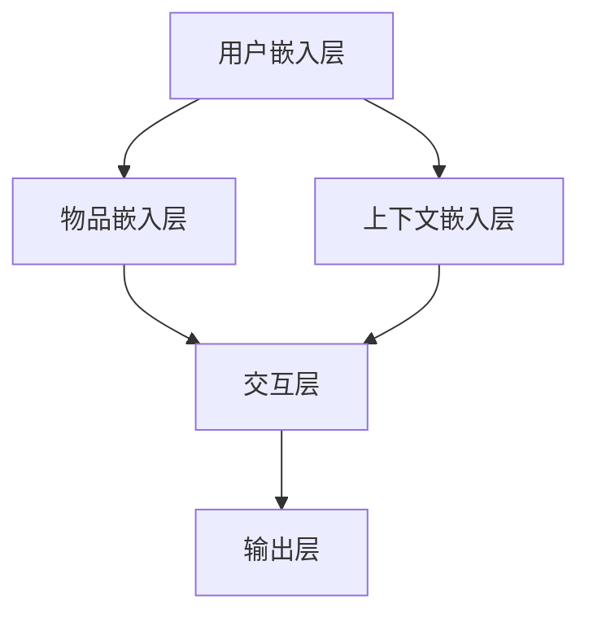

                 

# P5模型在推荐系统的应用价值：统一的任务解决方案

> **关键词**：推荐系统、P5模型、协同过滤、内容推荐、混合推荐系统、深度学习

> **摘要**：本文旨在探讨P5模型在推荐系统中的应用价值，通过逐步分析其理论基础、实现方法、以及在不同推荐场景中的优化应用，展示P5模型作为统一任务解决方案的潜力。

## 《P5模型在推荐系统的应用价值：统一的任务解决方案》

### 第一部分：推荐系统基础

#### 第1章：推荐系统概述

##### 1.1 推荐系统的定义与价值

推荐系统是一种根据用户的历史行为、偏好和上下文信息，自动地为用户推荐相关物品的技术体系。其核心价值在于提高用户体验，增加用户粘性，提升商业收益。

- **基本概念**：
  - **用户-物品交互矩阵**：记录用户与物品交互的历史数据。
  - **推荐目标**：预测用户对未知物品的偏好，生成推荐列表。

- **应用领域**：
  - **电子商务**：个性化商品推荐，提升销售额。
  - **社交媒体**：内容推荐，增加用户活跃度。
  - **在线视频平台**：视频推荐，提高观看时长。

##### 1.2 推荐系统的架构与组成

推荐系统通常由数据层、计算层和展示层组成。

- **数据层**：收集并处理用户行为数据、物品属性数据等。
- **计算层**：执行推荐算法，生成推荐列表。
- **展示层**：将推荐结果展示给用户。

##### 1.3 常见的推荐算法

- **协同过滤**：通过分析用户之间的相似度来预测用户对未知物品的偏好。
  - **基于用户的协同过滤**：寻找与目标用户相似的其他用户，推荐这些用户喜欢的物品。
  - **基于物品的协同过滤**：寻找与目标物品相似的物品，推荐这些物品。

- **内容推荐**：基于物品的属性信息进行推荐。
  - **基于特征的推荐**：根据物品的文本描述、标签等特征进行匹配。
  - **基于分类的推荐**：将物品分类，为用户推荐相同类别的物品。

- **混合推荐系统**：结合协同过滤和内容推荐的优势，提供更准确的推荐。

#### 第2章：P5模型简介

##### 2.1 P5模型的基本概念

P5模型是一种基于深度学习的推荐算法，其核心思想是将用户、物品和上下文信息通过神经网络进行联合建模，从而实现高精度的推荐。

- **定义**：
  - P5模型包含5个模块：用户嵌入层、物品嵌入层、上下文嵌入层、交互层和输出层。
  - **用户嵌入层**：将用户信息映射到低维空间。
  - **物品嵌入层**：将物品信息映射到低维空间。
  - **上下文嵌入层**：将上下文信息映射到低维空间。
  - **交互层**：计算用户与物品的交互特征。
  - **输出层**：预测用户对物品的偏好得分。

- **起源与发展**：
  - P5模型最早由Google提出，用于其搜索引擎的个性化推荐。
  - 随后，P5模型在电子商务、社交媒体等多个领域得到了广泛应用。

##### 2.2 P5模型的架构与特点

P5模型的架构如图所示：

- **架构特点**：
  - **多模态嵌入**：支持用户、物品和上下文的多种数据类型。
  - **端到端训练**：直接优化预测目标，无需复杂的手工特征工程。
  - **灵活性**：可扩展性强，适用于不同的推荐场景。

##### 2.3 P5模型与现有推荐算法的比较

- **优势**：
  - **高精度**：基于深度学习，能够捕捉复杂的用户偏好。
  - **灵活性强**：支持多种数据类型和推荐场景。
  - **自动化**：无需复杂的手工特征工程。

- **局限性**：
  - **计算复杂度**：模型参数较多，训练时间较长。
  - **数据依赖**：对用户行为数据要求较高。

### 第二部分：P5模型原理解析

#### 第3章：P5模型的理论基础

##### 3.1 深度学习与神经网络基础

- **神经网络的基本结构**：包括输入层、隐藏层和输出层。
- **深度学习架构**：多个隐藏层的神经网络，能够处理更复杂的任务。
- **深度学习优化算法**：如梯度下降、Adam等，用于训练模型。

##### 3.2 P5模型的核心算法原理

- **工作流程**：
  - 数据输入 -> 嵌入层 -> 交互层 -> 输出层 -> 得分预测。

- **损失函数**：
  - 常用损失函数有均方误差（MSE）、交叉熵等。

- **优化过程**：
  - 使用梯度下降等优化算法，不断调整模型参数，最小化损失函数。

#### 第4章：P5模型的实现与优化

##### 4.1 P5模型的实现步骤

- **数据预处理**：清洗、归一化数据，提取特征。
- **模型搭建**：定义P5模型的网络结构。
- **模型训练与评估**：训练模型，评估性能。

##### 4.2 P5模型的优化技巧

- **超参数调优**：通过网格搜索、随机搜索等方法调整超参数。
- **模型加速**：使用GPU进行训练，加速计算。
- **模型压缩**：使用量化、剪枝等方法减小模型大小。

### 第三部分：P5模型在推荐系统中的应用

#### 第5章：P5模型在协同过滤中的应用

##### 5.1 协同过滤中的P5模型

- **原理**：将用户、物品和上下文信息通过P5模型进行联合建模。
- **应用场景**：适用于用户行为数据丰富、用户偏好差异较大的场景。

##### 5.2 P5模型在协同过滤中的优化

- **优化方法**：
  - **数据增强**：增加数据多样性，提升模型泛化能力。
  - **迁移学习**：利用预训练模型，减少训练时间。

### 第四部分：P5模型在推荐系统中的实战

#### 第8章：P5模型推荐系统项目实战

##### 8.1 项目背景与目标

- **项目背景**：某电商平台希望利用P5模型提升商品推荐效果。
- **项目目标**：实现一个基于P5模型的推荐系统，提高用户点击率和购买率。

##### 8.2 开发环境搭建

- **开发工具**：Python、TensorFlow、Pandas等。
- **数据集**：电商平台用户行为数据集。

##### 8.3 源代码实现

- **模型搭建**：定义P5模型结构。
- **数据预处理**：清洗、归一化数据。
- **模型训练与评估**：训练模型，评估性能。

##### 8.4 代码解读与分析

- **代码功能解读**：详细解释每个模块的作用。
- **性能分析与优化**：分析模型性能，提出优化方案。

### 第五部分：P5模型推荐系统性能评估

#### 第9章：P5模型推荐系统性能评估

##### 9.1 性能评估指标

- **准确率（Accuracy）**：预测正确的用户-物品对占总用户-物品对的比例。
- **召回率（Recall）**：预测正确的用户-物品对占所有可能正确的用户-物品对的比例。
- **覆盖率（Coverage）**：推荐列表中不同物品的比例。
- **新颖性（Novelty）**：推荐列表中包含的新物品比例。

##### 9.2 性能评估方法

- **交叉验证**：将数据集划分为训练集和验证集，多次训练和评估，取平均性能。
- **A/B测试**：将用户随机分配到A组和B组，对比推荐系统对用户行为的影响。

### 第六部分：P5模型推荐系统实战案例

#### 第10章：P5模型推荐系统实战案例

##### 10.1 案例背景

- **案例背景**：某视频平台希望利用P5模型提升视频推荐效果。
- **案例目标**：实现一个基于P5模型的视频推荐系统，提高用户观看时长和推荐满意度。

##### 10.2 案例实施

- **实施步骤**：
  - 数据采集与处理。
  - 模型搭建与训练。
  - 系统部署与优化。

##### 10.3 案例效果分析

- **效果评估**：通过A/B测试评估模型对用户行为的影响。
- **优化方向**：根据评估结果，提出优化方案，提高推荐效果。

### 附录

#### 附录A：P5模型推荐系统开发工具与资源

- **开发工具选择**：Python、TensorFlow、Pandas等。
- **开发资源推荐**：论文、报告、在线教程等。

#### 附录B：P5模型推荐系统常见问题与解决方案

- **常见问题**：数据预处理问题、模型训练问题等。
- **解决方案**：详细解释问题原因，提供解决步骤。

### 作者信息

- **作者**：AI天才研究院/AI Genius Institute & 禅与计算机程序设计艺术 /Zen And The Art of Computer Programming

<|im_end|>

