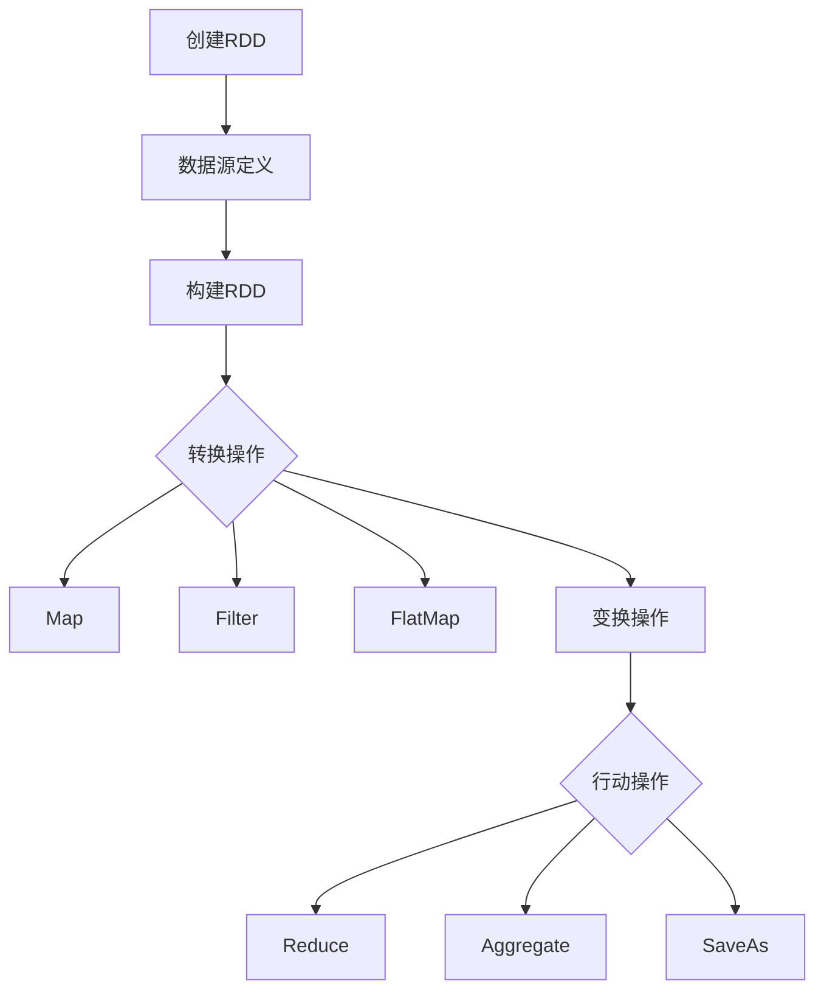

                 

### 引言

在当今大数据和云计算的时代，如何高效地进行数据处理和分析成为了企业和研究人员关注的焦点。而Apache Spark作为一个高性能的分布式计算框架，凭借其简洁、高效的API，受到了广大开发者和研究人员的青睐。Spark的核心组件之一是 resilient distributed datasets（RDD），它是一种分布式的数据结构，提供了丰富的操作接口，用于大规模数据的处理和分析。

本文旨在深入讲解RDD的基本原理、核心算法以及代码实例，帮助读者全面了解RDD的工作机制和实际应用。我们将从以下几个方面展开讨论：

1. **RDD基础理论**：介绍RDD的基本概念、特点与优势，以及与数据流处理框架的对比。
2. **RDD构建**：讲解如何从数据源构建RDD，包括数据源定义、RDD创建方法和转换操作。
3. **RDD行动操作**：分析RDD的行动操作，包括Reduce、Aggregate和SaveAs操作。
4. **RDD的依赖关系**：探讨RDD的依赖关系类型、任务调度与执行。
5. **RDD的内存管理与调优**：分析RDD的内存管理原理、数据分区策略和性能调优技巧。
6. **RDD核心算法**：讲解RDD中的MapReduce算法、排序与聚合算法以及机器学习算法。
7. **RDD代码实例讲解**：通过基础、中级和高级代码实例，详细介绍RDD的应用。
8. **RDD应用场景**：探讨RDD在大数据处理、实时数据处理和机器学习与数据挖掘中的应用。
9. **RDD性能优化与最佳实践**：分享性能优化方法和最佳实践。

通过本文的讲解，读者可以深入了解RDD的基本原理和核心算法，掌握RDD的实际应用方法，从而提升数据处理和分析的效率。

### RDD基本概念

RDD（Resilient Distributed Dataset）是Apache Spark中的核心抽象，被设计为一种分布式的数据结构，用于处理大规模数据集。RDD的概念起源于Google的MapReduce模型，但它不仅继承了MapReduce的分布式计算思想，还在此基础上进行了扩展和优化。

**定义**：RDD是一个不可变的、可分区、可并行操作的分布式数据集。它由多个分区（Partition）组成，每个分区包含一部分数据。RDD的特点是它不存储具体的数据，而是存储数据的引用和元数据，这使得RDD在内存管理和数据分布方面具有很大的优势。

**特点**：

1. **不可变性**：RDD中的数据一旦创建就不能被修改，这样可以提高数据的可靠性和易用性。
2. **分区性**：RDD可以按照一定的策略将数据切分成多个分区，每个分区可以独立处理。这有助于优化计算性能，实现并行处理。
3. **容错性**：Spark通过检查点（Checkpoint）和持久化（Persistent）机制确保RDD的容错性。在出现节点故障时，可以通过检查点和持久化数据快速恢复RDD的状态。
4. **惰性求值**：RDD的转换操作（如map、filter）不会立即执行，只有在执行行动操作（如reduce、count）时才会触发实际计算。这种设计提高了编程的灵活性，避免了不必要的计算。

**优势**：

1. **高性能**：Spark利用内存计算的优势，可以显著提高数据处理速度。与传统的MapReduce相比，Spark减少了多次数据读取和磁盘I/O操作。
2. **易用性**：Spark提供了简洁、高效的API，支持Python、Java和Scala等多种编程语言，使得开发者可以轻松上手。
3. **弹性调度**：Spark可以动态地根据任务需求调整资源分配，实现高效的任务调度。

**与数据流处理框架的对比**：

1. **Flink**：Flink是一个流处理框架，与Spark相比，它在实时数据处理方面有更高的性能。但Spark在批处理和迭代计算方面表现更佳。
2. **Storm**：Storm是一个实时数据处理框架，它提供了低延迟的流处理能力，但在批处理和迭代计算方面不如Spark。
3. **Kafka**：Kafka是一种分布式消息队列系统，用于实时数据流处理。Spark Streaming可以利用Kafka作为数据源进行实时数据处理，但它本身不提供完整的数据处理能力。

通过上述对比，我们可以看出，Spark和RDD在分布式数据处理领域具有独特的优势和特点，为大数据处理和分析提供了强大的工具。

### RDD的构建

构建RDD是Spark编程的基础步骤，它决定了后续数据处理和操作的效率。在Spark中，RDD可以从多种数据源构建，如本地文件系统、HDFS、数据库等。本节将详细介绍如何从数据源构建RDD，包括数据源定义、RDD创建方法和转换操作。

#### 数据源定义

首先，我们需要定义数据源。Spark提供了多种数据源选项，包括本地文件系统、HDFS、Amazon S3、HBase和Cassandra等。以下是一个使用本地文件系统作为数据源的示例：

```python
# 导入SparkSession
from pyspark.sql import SparkSession

# 创建SparkSession
spark = SparkSession.builder.appName("RDDExample").getOrCreate()

# 加载本地文件系统数据
data_source = "path/to/your/data.txt"
data_rdd = spark.sparkContext.textFile(data_source)
```

在上面的代码中，我们首先创建了一个SparkSession，然后使用`textFile`方法将本地文件系统中的文本文件加载为RDD。

#### RDD创建方法

Spark提供了多种创建RDD的方法，以下是一些常见的方法：

1. **从文件系统创建RDD**：
   - `textFile(path)`: 用于读取文本文件，返回一个RDD。
   - `parallelize(iter)`: 将一个集合（如列表、元组等）转换为RDD。

2. **从数据库创建RDD**：
   - `sqlContext.createDataFrame(dataframe)`: 将DataFrame转换为RDD。
   - `hadoopFile(path, \*\*options)`: 用于读取Hadoop支持的文件格式，如SequenceFile、Parquet、ORC等。

以下是一个使用`parallelize`方法创建RDD的示例：

```python
# 创建SparkSession
spark = SparkSession.builder.appName("RDDExample").getOrCreate()

# 创建一个列表
data_list = [1, 2, 3, 4, 5]

# 将列表转换为RDD
data_rdd = spark.sparkContext.parallelize(data_list)

# 输出RDD内容
print(data_rdd.collect())
```

在上面的示例中，我们首先创建了一个SparkSession，然后使用`parallelize`方法将一个列表转换为RDD，并输出RDD的内容。

#### RDD转换操作

RDD转换操作是指将一个RDD转换为另一个RDD的操作，如`map`、`filter`、`flatMap`等。这些操作不会立即执行，而是构建一个数据流图（DataFrame），当执行行动操作时才会触发实际计算。

1. **map()**：对RDD中的每个元素应用一个函数，返回一个新的RDD。
   ```python
   def square(x):
       return x * x
   
   squared_rdd = data_rdd.map(square)
   ```

2. **filter()**：根据条件筛选RDD中的元素，返回一个新的RDD。
   ```python
   even_rdd = data_rdd.filter(lambda x: x % 2 == 0)
   ```

3. **flatMap()**：与map操作类似，但每个元素可以返回零个、一个或多个元素，返回一个新的RDD。
   ```python
   def split_words(line):
       return line.split(" ")
   
   words_rdd = data_rdd.flatMap(split_words)
   ```

以下是一个综合示例，展示如何从数据源构建RDD并进行转换操作：

```python
# 创建SparkSession
spark = SparkSession.builder.appName("RDDExample").getOrCreate()

# 使用textFile方法从本地文件系统加载数据
data_source = "path/to/your/data.txt"
data_rdd = spark.sparkContext.textFile(data_source)

# 转换操作
lines_rdd = data_rdd.map(lambda line: line.strip())
squared_rdd = lines_rdd.map(lambda x: x * x)
even_rdd = squared_rdd.filter(lambda x: x % 2 == 0)

# 输出结果
print(even_rdd.collect())
```

在这个示例中，我们首先从本地文件系统加载数据，然后进行一系列的转换操作，包括去除空格、计算平方和筛选偶数。最后，我们输出转换后的RDD内容。

通过上述步骤，我们可以从多种数据源构建RDD，并进行各种转换操作，从而实现对大规模数据的处理和分析。

### RDD行动操作

在RDD编程中，行动操作是触发RDD计算的关键步骤。行动操作会触发之前定义的转换操作，并返回一个结果。本文将详细介绍RDD中的几种行动操作：reduce、aggregate和saveAs。通过具体示例和伪代码，我们将深入探讨这些操作的工作原理和实际应用。

#### Reduce操作

**定义**：reduce操作是一种累积操作，它对RDD中的元素按照指定的函数进行聚合。在执行reduce操作时，Spark会将数据分片并行处理，然后在每个分片内部进行局部reduce，最后将局部结果进行全局reduce。

**伪代码**：

```python
rdd.reduce(lambda x, y: f(x, y))
```

其中，`rdd`是一个RDD对象，`lambda`表示对每个元素应用一个函数，`f`是一个累积函数，用于计算两个元素的和。

**示例**：

假设我们有一个整数RDD，我们需要计算所有元素的总和。

```python
data_rdd = sc.parallelize([1, 2, 3, 4, 5])

result = data_rdd.reduce(lambda x, y: x + y)
print(result)  # 输出15
```

在这个示例中，我们首先创建一个整数RDD，然后使用reduce操作计算所有元素的总和。reduce操作将RDD中的每个元素相加，得到最终结果。

#### Aggregate操作

**定义**：aggregate操作是一种分组和聚合操作，它可以对RDD中的每个分区进行局部聚合，然后对全局结果进行合并。与reduce操作不同，aggregate操作允许指定三个参数：累积函数、合并函数和初始值。

**伪代码**：

```python
rdd.aggregate(zeroValue, lambda x, y: f(x, y), lambda x, y: g(x, y))
```

其中，`zeroValue`是初始值，`f`是累积函数，用于计算两个元素的聚合结果，`g`是合并函数，用于合并不同分区的局部结果。

**示例**：

假设我们有一个整数RDD，我们需要计算所有元素的总和以及它们的数量。

```python
data_rdd = sc.parallelize([1, 2, 3, 4, 5])

result = data_rdd.aggregate(0, lambda x, y: x + y, lambda x, y: x + y)
print(result)  # 输出(15, 5)
```

在这个示例中，我们首先创建一个整数RDD，然后使用aggregate操作计算所有元素的总和以及它们的数量。aggregate操作使用一个累积函数`lambda x, y: x + y`来计算局部和，使用一个合并函数`lambda x, y: x + y`来合并不同分区的局部结果。

#### SaveAs操作

**定义**：saveAs操作用于将RDD保存到外部存储系统，如文件系统、HDFS或Amazon S3。这个操作可以将RDD的状态持久化，以便后续使用或分析。

**伪代码**：

```python
rdd.saveAsTextFile(path)
rdd.saveAsObjectFile(path)
```

其中，`path`是保存路径，`saveAsTextFile`用于保存文本数据，`saveAsObjectFile`用于保存序列化的对象。

**示例**：

假设我们有一个整数RDD，我们需要将其保存为文本文件。

```python
data_rdd = sc.parallelize([1, 2, 3, 4, 5])

data_rdd.saveAsTextFile("path/to/save/data.txt")
```

在这个示例中，我们首先创建一个整数RDD，然后使用saveAsTextFile操作将其保存为文本文件。保存后的数据将以文本形式存储在指定路径下。

#### 行动操作比较

- **reduce**：适合对RDD中所有元素进行聚合计算，如求和、求积等。但它只能处理有序数据，并且需要全局排序。
- **aggregate**：适用于对RDD进行分组和聚合操作，它可以处理无序数据，并且可以指定局部和全局的聚合函数。
- **saveAs**：用于将RDD保存到外部存储系统，便于后续处理和分析。

通过上述介绍和示例，我们可以看到，RDD的行动操作为数据处理提供了丰富的功能。选择合适的行动操作，可以有效地提高数据处理和分析的效率。

### RDD的依赖关系

在Spark中，RDD之间的依赖关系是理解和优化分布式计算的关键因素。RDD依赖关系决定了Spark的执行策略和任务调度。通过分析依赖关系类型、任务调度与执行原理，我们可以更好地理解RDD的工作机制，提高数据处理效率。

#### 数据依赖类型

1. **窄依赖**（Narrow Dependency）：
   窄依赖是指一个RDD的分区依赖于另一个RDD的一个分区。例如，当对一个RDD进行map、filter或reduceByKey等操作时，产生的依赖关系通常是窄依赖。窄依赖具有以下特点：
   - 数据依赖明确且简单。
   - 可以并行处理，每个分区独立计算。
   - 任务调度简单，因为每个分区的依赖关系是明确的。

2. **宽依赖**（Wide Dependency）：
   宽依赖是指一个RDD的分区依赖于另一个RDD的多个分区。例如，当一个RDD通过groupByKey或shuffle操作进行数据重分区时，会产生宽依赖。宽依赖具有以下特点：
   - 数据依赖复杂，涉及多个分区。
   - 需要重新分配数据，导致额外的网络传输和计算开销。
   - 任务调度复杂，因为无法独立计算各个分区，需要等待所有依赖关系解决。

#### 任务调度与执行

在Spark中，任务调度和执行是基于依赖关系的。以下是一个简化的任务调度与执行过程：

1. **依赖关系构建**：
   当我们定义一系列RDD转换操作时，Spark会自动构建一个依赖关系图（Dependency Graph）。这个图描述了各个RDD之间的依赖关系。

2. **任务划分**：
   Spark将依赖关系图划分为多个任务（Tasks）。每个任务代表一组可以并行执行的操作。

3. **任务调度**：
   Spark根据依赖关系图和当前集群状态，选择可执行的作业进行调度。调度策略包括：
   - **宽依赖处理**：当出现宽依赖时，Spark会等待所有依赖任务完成后，再执行当前任务。
   - **窄依赖并行化**：对于窄依赖任务，Spark可以并行执行多个任务，提高计算效率。

4. **任务执行**：
   Spark将任务分发到集群中的各个计算节点，每个节点独立执行任务，并生成中间结果。

5. **数据收集**：
   在任务执行完成后，Spark会收集中间结果，并根据依赖关系图继续执行后续任务。

#### 优化策略

为了提高RDD的执行效率和性能，我们可以采取以下优化策略：

1. **减少宽依赖**：
   - 尽量使用窄依赖操作，如map、filter等。
   - 合并多个宽依赖操作，减少数据重分区次数。

2. **数据分区策略**：
   - 根据数据量和计算需求，合理设置分区数。
   - 利用哈希分区等策略，提高数据局部性，减少跨节点数据传输。

3. **内存管理**：
   - 优化内存使用，避免频繁的磁盘I/O操作。
   - 使用持久化（Persistent）机制，保存中间结果，减少重复计算。

4. **并行度调整**：
   - 根据集群资源和任务特性，调整并行度，提高计算效率。

通过理解和优化RDD的依赖关系，我们可以有效地提升Spark的执行性能，实现高效的数据处理和分析。

### RDD的内存管理与调优

在分布式计算框架中，内存管理是影响性能的关键因素之一。Spark作为一款高性能的分布式计算框架，其内存管理机制对性能优化至关重要。本节将深入探讨RDD的内存管理原理、数据分区策略以及性能调优技巧。

#### 内存管理原理

Spark的内存管理基于两级缓存机制：Tungsten和Block Manager。Tungsten是Spark内部的优化层，它将内存管理、数据结构和执行引擎紧密集成，以减少内存分配和垃圾回收的开销。Block Manager负责管理内存和磁盘上的数据块，确保高效的数据读写和内存复用。

1. **Tungsten**：
   Tungsten通过以下几个方面优化内存管理：
   - **内存分配**：使用堆外内存（Off-Heap Memory），避免Java堆内存的限制。
   - **数据结构优化**：使用更紧凑的数据结构，减少内存占用。
   - **内存复用**：在计算过程中复用内存，减少内存分配和垃圾回收的开销。

2. **Block Manager**：
   Block Manager负责管理数据块在内存和磁盘上的存储，其核心功能包括：
   - **数据缓存**：将频繁访问的数据块保存在内存中，减少磁盘I/O。
   - **数据分区**：将数据按分区（Partition）存储，便于并行计算。
   - **数据持久化**：将中间结果持久化到内存或磁盘，实现数据的持久化存储。

#### 数据分区策略

数据分区是Spark内存管理的重要组成部分，合理的分区策略可以提高数据处理效率。以下是一些常见的分区策略：

1. **基于数据量**：
   根据数据总量和集群资源，合理设置分区数。每个分区的大小应大致相等，以充分利用集群资源。

2. **基于键值**：
   对于涉及键值对的操作（如reduceByKey、groupByKey），可以采用基于键的分区策略，将相同键的数据保存在同一分区中，减少跨节点的数据传输。

3. **哈希分区**：
   使用哈希函数对分区键进行哈希运算，将数据均匀分布到不同分区。这种方法可以减少数据倾斜，提高并行计算效率。

4. **自定义分区**：
   根据具体应用场景，可以自定义分区策略，例如基于地理位置或时间戳进行分区。

#### 性能调优技巧

为了提高Spark的性能，我们可以采取以下调优技巧：

1. **内存调优**：
   - 根据应用场景和集群资源，合理设置Spark的内存配置，如`spark.executor.memory`和`spark.driver.memory`。
   - 利用持久化机制，保存中间结果，减少重复计算。
   - 优化内存分配策略，使用堆外内存，减少垃圾回收开销。

2. **数据分区调优**：
   - 根据数据量和计算需求，合理设置分区数，避免分区过多导致内存消耗过大，或分区过少导致数据倾斜。
   - 采用哈希分区或自定义分区策略，提高数据局部性，减少跨节点数据传输。

3. **并行度调优**：
   - 根据集群资源和任务特性，合理设置并行度，避免并行度过高导致的资源争用和性能下降。
   - 通过调整`spark.default.parallelism`参数，控制默认并行度。

4. **调度策略调优**：
   - 根据任务依赖关系和集群状态，优化调度策略，确保高效的任务执行。
   - 采用基于事件的调度策略，动态调整任务执行顺序，提高资源利用率。

通过上述内存管理原理、数据分区策略和性能调优技巧，我们可以有效地提升Spark的性能，实现高效的数据处理和分析。

### RDD中的MapReduce算法

MapReduce算法是分布式计算领域的经典算法，广泛应用于大数据处理和分析。在Spark RDD中，MapReduce算法以高效的分布式计算模式实现，为大规模数据处理提供了强大的支持。本节将详细介绍MapReduce算法的原理、伪代码以及实际应用。

#### 原理

MapReduce算法分为两个阶段：Map阶段和Reduce阶段。Map阶段对输入数据进行映射（Mapping），将数据转换成中间结果；Reduce阶段对中间结果进行归约（Reduction），生成最终的输出结果。

1. **Map阶段**：
   Map阶段对输入数据进行处理，将其映射成键值对（Key-Value Pair）。每个输入元素会触发一个map函数，将元素转换成相应的键值对。Map阶段的伪代码如下：

   ```python
   for each record in input:
       key = extract_key(record)
       value = extract_value(record)
       output(key, value)
   ```

   其中，`input`为输入数据集，`key`和`value`分别为输入记录的键和值，`extract_key`和`extract_value`函数用于从记录中提取键和值。

2. **Reduce阶段**：
   Reduce阶段对Map阶段产生的中间结果进行归约。每个键都会触发一个reduce函数，将所有与该键关联的值合并成一个新的值。Reduce阶段的伪代码如下：

   ```python
   for each key in keys:
       values = fetch_all_values_for_key(key)
       output(key, reduce(values))
   ```

   其中，`keys`为Map阶段产生的所有键，`reduce`函数用于对一组值进行合并操作。

#### 伪代码

以下是一个简化的MapReduce算法伪代码示例，用于计算输入数据集的词频：

```python
# Map阶段
for each line in input:
    words = split_line(line)
    for word in words:
        emit(word, 1)

# Reduce阶段
for each word in words:
    counts = fetch_all_counts_for_word(word)
    total_count = sum(counts)
    emit(word, total_count)
```

在这个示例中，Map阶段将每行数据拆分成单词，并为每个单词生成一个键值对（单词，1）。Reduce阶段将相同单词的所有计数进行合并，生成最终的词频结果。

#### 应用实例

以下是一个使用Spark RDD实现MapReduce算法的示例，用于计算一个文本文件中的词频：

```python
from pyspark import SparkContext

# 创建SparkContext
sc = SparkContext("local", "WordCount")

# 加载文本文件
lines_rdd = sc.textFile("path/to/input.txt")

# Map阶段：将每行拆分为单词，并生成（单词，1）的键值对
words_rdd = lines_rdd.flatMap(lambda line: line.split(" ")).map(lambda word: (word, 1))

# Reduce阶段：对相同单词的计数进行合并
word_counts_rdd = words_rdd.reduceByKey(lambda x, y: x + y)

# 输出结果
word_counts_rdd.saveAsTextFile("path/to/output.txt")
```

在这个示例中，我们首先创建一个SparkContext，然后加载一个文本文件。接下来，我们使用flatMap和map操作将每行数据拆分为单词，并生成（单词，1）的键值对。最后，我们使用reduceByKey操作对相同单词的计数进行合并，并将结果保存为文本文件。

通过上述示例，我们可以看到，Spark RDD中的MapReduce算法提供了简洁、高效的分布式计算接口，适用于大规模数据的处理和分析。掌握MapReduce算法原理和实现，有助于我们更好地利用Spark进行数据处理。

### RDD中的排序与聚合算法

在分布式数据处理中，排序和聚合是常见的操作，用于对大规模数据进行分类、汇总和分析。Spark RDD提供了丰富的排序与聚合算法，这些算法通过高效的分布式计算实现对大规模数据的处理。本文将详细介绍Spark RDD中的排序算法、聚合算法以及应用实例。

#### 排序算法

排序操作在分布式数据处理中非常常见，Spark RDD提供了高效的排序算法来实现对数据的排序。排序算法可以分为两大类：内部排序和外部排序。

1. **内部排序**：
   当数据量较小，可以完全加载到内存时，Spark使用内部排序算法。内部排序算法包括快速排序、归并排序等。内部排序的伪代码如下：

   ```python
   def sort_elements(elements):
       return sorted(elements)
   ```

   其中，`elements`是待排序的数据集合。

2. **外部排序**：
   当数据量较大，无法完全加载到内存时，Spark使用外部排序算法。外部排序算法包括多路归并排序、外部排序等。外部排序的伪代码如下：

   ```python
   def external_sort(partial_sorted_files):
       merge_files(partial_sorted_files)
       return sorted_file
   ```

   其中，`partial_sorted_files`是部分排序文件，`merge_files`函数用于合并排序文件。

在Spark RDD中，排序可以通过`sortBy`和`sorted`方法实现。以下是一个使用`sortBy`方法进行内部排序的示例：

```python
data_rdd = sc.parallelize([3, 1, 4, 1, 5, 9, 2, 6, 5, 3, 5])

sorted_rdd = data_rdd.sortBy(lambda x: x)

print(sorted_rdd.collect())
```

在这个示例中，我们首先创建一个整数RDD，然后使用`sortBy`方法对RDD中的元素进行排序，并输出排序后的结果。

#### 聚合算法

聚合算法用于对大规模数据集进行汇总和计算，常见的聚合操作包括求和、求平均、求最大值、求最小值等。Spark RDD提供了丰富的聚合算法，这些算法通过高效的分布式计算实现对大规模数据的聚合。

1. **求和**：
   `reduceByKey`方法可以将相同键的值进行求和操作。

   ```python
   data_rdd = sc.parallelize([(1, 3), (1, 5), (2, 7), (2, 1)])
   
   sum_rdd = data_rdd.reduceByKey(lambda x, y: x + y)
   
   print(sum_rdd.collect())
   ```

   在这个示例中，我们创建一个包含键值对的RDD，然后使用`reduceByKey`方法对相同键的值进行求和操作。

2. **求平均**：
   `mean`方法可以计算RDD中所有元素的平均值。

   ```python
   data_rdd = sc.parallelize([1, 2, 3, 4, 5])
   
   average = data_rdd.mean()
   
   print(average)
   ```

   在这个示例中，我们创建一个整数RDD，然后使用`mean`方法计算RDD中所有元素的平均值。

3. **求最大值和最小值**：
   `max`和`min`方法可以分别计算RDD中最大值和最小值。

   ```python
   data_rdd = sc.parallelize([1, 2, 3, 4, 5])
   
   max_value = data_rdd.max()
   min_value = data_rdd.min()
   
   print(max_value, min_value)
   ```

   在这个示例中，我们创建一个整数RDD，然后使用`max`和`min`方法分别计算RDD中的最大值和最小值。

#### 应用实例

以下是一个综合应用实例，展示如何使用Spark RDD进行排序和聚合操作：

```python
from pyspark import SparkContext

# 创建SparkContext
sc = SparkContext("local", "SortAndAggregate")

# 加载文本文件
lines_rdd = sc.textFile("path/to/input.txt")

# 分词
words_rdd = lines_rdd.flatMap(lambda line: line.split(" "))

# 聚合：计算每个单词的频率
word_counts_rdd = words_rdd.map(lambda word: (word, 1)).reduceByKey(lambda x, y: x + y)

# 排序：按频率降序排序
sorted_rdd = word_counts_rdd.sortBy(lambda x: x[1], ascending=False)

# 输出结果
sorted_rdd.saveAsTextFile("path/to/output.txt")
```

在这个示例中，我们首先加载一个文本文件，然后进行分词操作。接下来，我们使用`reduceByKey`方法计算每个单词的频率，并使用`sortBy`方法按频率降序排序。最后，我们将排序后的结果保存为文本文件。

通过上述示例，我们可以看到，Spark RDD中的排序与聚合算法提供了高效的分布式计算接口，适用于大规模数据的处理和分析。掌握这些算法原理和实现，有助于我们更好地利用Spark进行数据处理。

### RDD中的机器学习算法

在分布式计算框架中，机器学习算法的应用越来越广泛。Spark RDD作为一个高性能的分布式数据处理框架，提供了丰富的机器学习算法，使得大规模数据的机器学习变得高效和简便。本节将介绍几种常见的机器学习算法，并探讨如何在RDD中实现这些算法。

#### 机器学习算法介绍

机器学习算法可以分为监督学习、无监督学习和强化学习三类。以下是一些常见的机器学习算法：

1. **线性回归**：
   线性回归是一种监督学习算法，用于预测连续值。它通过拟合一条直线来描述因变量和自变量之间的关系。

2. **逻辑回归**：
   逻辑回归是一种监督学习算法，用于分类问题。它通过拟合一个逻辑函数来计算样本属于不同类别的概率。

3. **决策树**：
   决策树是一种无监督学习算法，用于分类和回归。它通过一系列规则将数据划分为不同的区域，并生成一个树形结构。

4. **K-均值聚类**：
   K-均值聚类是一种无监督学习算法，用于聚类分析。它通过将数据点划分到K个簇中，使每个簇内的数据点距离簇中心最近。

5. **支持向量机（SVM）**：
   支持向量机是一种监督学习算法，用于分类和回归。它通过找到一个最优的超平面，将不同类别的数据点分隔开来。

#### 机器学习算法与RDD的整合

Spark RDD提供了丰富的机器学习API，使得机器学习算法可以方便地与RDD结合使用。以下是如何在RDD中实现几种常见机器学习算法的示例：

1. **线性回归**：

```python
from pyspark.mllib.regression import LinearRegressionWithSGD

# 创建RDD
training_data = sc.parallelize([(1.0, 1.1), (2.0, 1.0), (3.0, 1.5)])

# 训练线性回归模型
model = LinearRegressionWithSGD.train(training_data, iterations=100)

# 输出模型参数
print(model.intercept, model.coefficients)
```

在这个示例中，我们首先创建一个包含输入和标签的RDD，然后使用`LinearRegressionWithSGD.train`方法训练线性回归模型，并输出模型参数。

2. **逻辑回归**：

```python
from pyspark.mllib.classification import LogisticRegressionWithSGD

# 创建RDD
training_data = sc.parallelize([(1.0, 0), (2.0, 0), (3.0, 1)])

# 训练逻辑回归模型
model = LogisticRegressionWithSGD.train(training_data, iterations=100)

# 输出模型参数
print(model.weights, model.intercept)
```

在这个示例中，我们首先创建一个包含输入和标签的RDD，然后使用`LogisticRegressionWithSGD.train`方法训练逻辑回归模型，并输出模型参数。

3. **决策树**：

```python
from pyspark.mllib.tree import GradientBoostedTrees, DecisionTree

# 创建RDD
training_data = sc.parallelize([(1.0, 0), (2.0, 0), (3.0, 1)])

# 训练决策树模型
tree_model = DecisionTree.trainClassifier(training_data, numClasses=2, categoricalFeaturesInfo={})

# 输出模型参数
print(tree_model.toDebugString())
```

在这个示例中，我们首先创建一个包含输入和标签的RDD，然后使用`DecisionTree.trainClassifier`方法训练决策树模型，并输出模型参数。

4. **K-均值聚类**：

```python
from pyspark.mllib.clustering import KMeans

# 创建RDD
training_data = sc.parallelize([Vectors.dense([0.0, 0.0]), Vectors.dense([1.0, 1.0]), Vectors.dense([1.0, 0.0])])

# 训练K-均值聚类模型
kmeans_model = KMeans.train(training_data, k=2, maxIterations=10)

# 输出模型参数
print(kmeans_model.clusterCenters)
```

在这个示例中，我们首先创建一个包含输入数据的RDD，然后使用`KMeans.train`方法训练K-均值聚类模型，并输出模型参数。

5. **支持向量机（SVM）**：

```python
from pyspark.mllib.classification import SVMWithSGD

# 创建RDD
training_data = sc.parallelize([(1.0, 0), (2.0, 0), (3.0, 1)])

# 训练SVM模型
svm_model = SVMWithSGD.train(training_data, iterations=100)

# 输出模型参数
print(svm_model.weights, svm_model.bias)
```

在这个示例中，我们首先创建一个包含输入和标签的RDD，然后使用`SVMWithSGD.train`方法训练SVM模型，并输出模型参数。

#### 机器学习算法实例

以下是一个综合实例，展示如何使用Spark RDD实现机器学习算法并进行预测：

```python
from pyspark import SparkContext
from pyspark.mllib.classification import LogisticRegressionModel
from pyspark.mllib.regression import LinearRegressionModel

# 创建SparkContext
sc = SparkContext("local", "MachineLearningExample")

# 加载训练数据
training_data = sc.parallelize([(1.0, 1.1), (2.0, 1.0), (3.0, 1.5), (4.0, 1.8)])

# 训练逻辑回归模型
lr_model = LogisticRegressionModel.train(training_data)

# 输出模型参数
print(lr_model.weights, lr_model.intercept)

# 预测新数据
new_data = sc.parallelize([(2.5, 1.2)])
predictions = lr_model.predict(new_data)

print(predictions)
```

在这个实例中，我们首先创建一个SparkContext，然后加载训练数据。接下来，我们使用`LogisticRegressionModel.train`方法训练逻辑回归模型，并输出模型参数。最后，我们使用模型对新数据进行预测，并输出预测结果。

通过上述示例，我们可以看到，Spark RDD提供了丰富的机器学习算法，使得大规模数据的机器学习变得高效和简便。掌握这些算法的实现方法和应用，有助于我们更好地利用Spark进行数据分析和建模。

### RDD基础代码实例讲解

在本文的第三部分，我们将通过基础、中级和高级代码实例详细讲解RDD的应用，帮助读者从实践角度理解和掌握RDD的操作。以下是各个实例的详细说明。

#### 基础代码实例

**实例1**：从文本文件中读取数据并计算词频

```python
from pyspark import SparkContext

# 创建SparkContext
sc = SparkContext("local", "WordCount")

# 加载文本文件
lines_rdd = sc.textFile("path/to/input.txt")

# 分词并计算词频
words_rdd = lines_rdd.flatMap(lambda line: line.split(" ")).map(lambda word: (word, 1))

# 求和，得到每个单词的词频
word_counts_rdd = words_rdd.reduceByKey(lambda x, y: x + y)

# 输出结果
print(word_counts_rdd.collect())
```

**解析**：
1. **创建SparkContext**：我们首先创建一个SparkContext，这是使用Spark进行分布式计算的基础。
2. **加载文本文件**：使用`textFile`方法从本地文件系统中加载文本文件，生成一个RDD。
3. **分词**：使用`flatMap`操作将每行数据拆分为单词。
4. **计算词频**：使用`map`操作生成每个单词的键值对（单词，1），然后使用`reduceByKey`方法计算每个单词的词频。

**实例2**：对数据进行排序

```python
data_rdd = sc.parallelize([3, 1, 4, 1, 5, 9, 2, 6, 5, 3, 5])

sorted_rdd = data_rdd.sortBy(lambda x: x)

print(sorted_rdd.collect())
```

**解析**：
1. **创建RDD**：我们首先创建一个整数RDD。
2. **排序**：使用`sortBy`方法对RDD中的元素进行排序。
3. **输出结果**：使用`collect`方法将排序后的RDD转换为本地集合，并输出结果。

#### 中级代码实例

**实例3**：基于键的分组和聚合

```python
data_rdd = sc.parallelize([(1, "a"), (2, "b"), (1, "c"), (2, "d"), (3, "e"), (3, "f")])

grouped_rdd = data_rdd.groupByKey()

print(grouped_rdd.collect())
```

**解析**：
1. **创建RDD**：我们首先创建一个包含键值对的RDD。
2. **分组**：使用`groupByKey`方法根据键对数据进行分组。
3. **输出结果**：使用`collect`方法将分组后的RDD转换为本地集合，并输出结果。

**实例4**：过滤数据

```python
data_rdd = sc.parallelize([1, 2, 3, 4, 5, 6, 7, 8, 9, 10])

filtered_rdd = data_rdd.filter(lambda x: x > 5)

print(filtered_rdd.collect())
```

**解析**：
1. **创建RDD**：我们首先创建一个整数RDD。
2. **过滤**：使用`filter`方法根据条件筛选数据。
3. **输出结果**：使用`collect`方法将筛选后的RDD转换为本地集合，并输出结果。

#### 高级代码实例

**实例5**：数据流处理和实时分析

```python
from pyspark.streaming import StreamingContext

# 创建StreamingContext
ssc = StreamingContext("local[2]", "NetworkWordCount")

# 设置批处理时间窗口
ssc.batchDuration = timedelta(seconds=2)

# 创建DStream，接收实时数据
lines = ssc.socketTextStream("localhost", 9999)

# 分词和计算词频
words = lines.flatMap(lambda line: line.split(" "))
pairs = words.map(lambda word: (word, 1))
word_counts = pairs.reduceByKey(lambda x, y: x + y)

# 每隔2秒打印一次结果
word_counts.print()

# 启动StreamingContext
ssc.start()

# 等待 StreamingContext 关闭
ssc.awaitTermination()
```

**解析**：
1. **创建StreamingContext**：我们首先创建一个StreamingContext，这是处理实时数据的入口。
2. **设置批处理时间窗口**：使用`batchDuration`设置批处理时间窗口，例如2秒。
3. **创建DStream**：使用`socketTextStream`方法创建一个接收实时数据的DStream。
4. **分词和计算词频**：使用`flatMap`、`map`和`reduceByKey`方法进行分词和词频计算。
5. **打印结果**：使用`print`方法每隔2秒打印一次结果。
6. **启动和等待**：启动StreamingContext并等待其关闭。

通过上述基础、中级和高级代码实例，我们可以看到RDD在数据处理和实时分析中的广泛应用。这些实例不仅展示了RDD的基本操作，还展示了如何利用RDD进行复杂的计算和分析。通过实际操作，读者可以更好地理解和掌握RDD的工作原理和应用方法。

### RDD应用场景

在分布式数据处理和实时分析领域，RDD凭借其高效的数据处理能力和灵活的操作接口，被广泛应用于多种场景。本文将探讨RDD在大数据处理、实时数据处理和机器学习与数据挖掘中的应用，并通过实际案例解析这些应用场景。

#### 大数据处理

**应用场景**：大数据处理是RDD最典型的应用场景之一。在处理海量数据时，RDD提供了高效的分布式计算能力，可以显著提升数据处理和分析的效率。

**案例解析**：

**案例一**：电商销售数据分析

假设我们有一个电商平台的销售数据，包含商品ID、用户ID、销售金额和销售时间等信息。我们需要对这些数据进行分析，以了解用户购买行为和销售趋势。

```python
from pyspark import SparkContext

# 创建SparkContext
sc = SparkContext("local", "ECommerceDataAnalysis")

# 加载销售数据
sales_data = sc.textFile("path/to/sales_data.txt")

# 分词并解析数据
parsed_data = sales_data.map(lambda line: line.split(",")).map(lambda fields: (fields[1], float(fields[2])))

# 计算每个用户的总消费金额
user_totals = parsed_data.reduceByKey(lambda x, y: x + y)

# 计算每个商品的总销售额
product_totals = parsed_data.reduceByKey(lambda x, y: x * y)

# 输出结果
print(user_totals.collect())
print(product_totals.collect())
```

**解析**：
1. **加载销售数据**：使用`textFile`方法加载文本数据。
2. **分词和解析数据**：使用`map`操作对数据进行分词和解析。
3. **计算用户总消费金额和商品总销售额**：使用`reduceByKey`方法进行数据聚合。
4. **输出结果**：使用`collect`方法输出结果。

通过RDD，我们可以高效地对电商销售数据进行分析，了解用户购买行为和销售趋势。

#### 实时数据处理

**应用场景**：实时数据处理是大数据处理的一个重要分支，RDD在实时数据处理中也表现出色，可以用于处理和实时分析不断流入的数据。

**案例解析**：

**案例二**：网络流量监控

假设我们需要监控网络流量，收集来自各个服务器的流量数据，并对流量进行实时分析。

```python
from pyspark.streaming import StreamingContext

# 创建StreamingContext
ssc = StreamingContext("local[2]", "NetworkTrafficMonitoring")

# 设置批处理时间窗口
ssc.batchDuration = timedelta(seconds=5)

# 创建DStream，接收实时数据
network_traffic = ssc.socketTextStream("localhost", 9999)

# 解析流量数据并计算流量总和
def parse_traffic(line):
    fields = line.split(",")
    return int(fields[1])

total_traffic = network_traffic.map(parse_traffic).reduce(lambda x, y: x + y)

# 每隔5秒打印一次结果
total_traffic.print()

# 启动StreamingContext
ssc.start()

# 等待StreamingContext关闭
ssc.awaitTermination()
```

**解析**：
1. **创建StreamingContext**：创建一个用于实时数据处理和监控的StreamingContext。
2. **设置批处理时间窗口**：设置批处理时间窗口，例如5秒。
3. **创建DStream**：使用`socketTextStream`方法创建一个接收实时数据的DStream。
4. **解析流量数据**：使用`map`操作对流量数据进行解析。
5. **计算流量总和**：使用`reduce`方法计算实时流量总和。
6. **打印结果**：使用`print`方法每隔5秒打印一次结果。
7. **启动和等待**：启动StreamingContext并等待其关闭。

通过上述案例，我们可以看到，RDD在实时数据处理中可以高效地对网络流量进行监控和分析。

#### 机器学习与数据挖掘

**应用场景**：RDD在机器学习和数据挖掘中也得到了广泛应用，可以用于训练模型、进行预测和数据分析。

**案例解析**：

**案例三**：用户行为分析

假设我们需要分析用户在电商平台的行为，预测用户的购买倾向。

```python
from pyspark import SparkContext
from pyspark.mllib.classification import LogisticRegressionModel

# 创建SparkContext
sc = SparkContext("local", "UserBehaviorAnalysis")

# 加载用户行为数据
behavior_data = sc.textFile("path/to/behavior_data.txt")

# 解析数据
parsed_data = behavior_data.map(lambda line: line.split(",")).map(lambda fields: (fields[0], float(fields[1])))

# 训练逻辑回归模型
model = LogisticRegressionModel.train(parsed_data)

# 预测新用户行为
new_user_data = sc.parallelize([(1, 0.8), (2, 0.7)])
predictions = model.predict(new_user_data)

print(predictions)
```

**解析**：
1. **创建SparkContext**：创建一个SparkContext。
2. **加载用户行为数据**：使用`textFile`方法加载文本数据。
3. **解析数据**：使用`map`操作对数据进行解析。
4. **训练逻辑回归模型**：使用`LogisticRegressionModel.train`方法训练模型。
5. **预测新用户行为**：使用`predict`方法对新的用户行为数据进行预测。

通过上述案例，我们可以看到，RDD在机器学习和数据挖掘中可以高效地进行数据处理、模型训练和预测。

通过上述大数据处理、实时数据处理和机器学习与数据挖掘的实际案例，我们可以看到，RDD在分布式数据处理和实时分析中的强大能力和广泛适用性。掌握RDD的使用方法，有助于我们更好地应对各种数据处理挑战。

### RDD性能优化与最佳实践

在分布式数据处理中，性能优化是提高系统效率和响应速度的关键。针对RDD，我们可以通过内存管理、数据分区和并行处理等多个方面进行优化。本文将详细介绍这些优化方法和最佳实践，并通过实际案例分析如何应用这些方法。

#### 内存管理优化

内存管理是影响Spark性能的重要因素。合理的内存分配和使用可以显著提升数据处理效率。以下是一些内存管理优化策略：

1. **合理设置内存配置**：
   - `spark.executor.memory`：设置每个执行器的内存大小，应根据任务需求和集群资源进行调整。
   - `spark.driver.memory`：设置驱动程序内存大小，确保驱动程序有足够的内存来处理任务。

2. **使用持久化机制**：
   - 持久化（Persistent）RDD可以重复使用中间结果，减少重复计算和磁盘I/O操作。
   - `cache()`方法：将频繁访问的RDD缓存到内存中，提高访问速度。
   - `persist()`方法：将RDD持久化到内存或磁盘，适用于不经常访问的中间结果。

3. **内存复用**：
   - 在计算过程中尽量复用内存，避免频繁的内存分配和垃圾回收。

#### 数据分区优化

数据分区策略对RDD的性能有重要影响。合理的分区策略可以提高数据的局部性和并行度，从而提升计算效率。以下是一些数据分区优化策略：

1. **合理设置分区数**：
   - 根据数据总量和集群资源，合理设置分区数。每个分区的大小应大致相等，避免分区过多导致的内存消耗过大或分区过少导致的数据倾斜。

2. **基于键值的分区策略**：
   - 对于涉及键值对的操作（如reduceByKey、groupByKey），可以使用基于键的分区策略，将相同键的数据保存在同一分区中，减少跨节点的数据传输。

3. **哈希分区**：
   - 使用哈希分区可以将数据均匀分布到不同分区，提高数据局部性和并行度。

#### 并行处理优化

并行处理是分布式计算的核心，通过优化并行处理可以提高数据处理效率。以下是一些并行处理优化策略：

1. **调整并行度**：
   - 根据集群资源和任务特性，合理设置并行度。可以通过调整`spark.default.parallelism`参数来控制默认并行度。
   - 对于计算密集型任务，可以增加并行度以提高计算效率。
   - 对于I/O密集型任务，应适当降低并行度以减少I/O瓶颈。

2. **任务调度优化**：
   - 根据任务依赖关系和集群状态，优化任务调度策略。避免任务积压和资源争用。
   - 使用基于事件的调度策略，动态调整任务执行顺序，提高资源利用率。

#### 最佳实践分享

以下是几个性能优化和最佳实践的实际案例：

**案例一**：电商销售数据分析

- **问题描述**：对大量销售数据进行分析，包括用户购买行为、销售金额和销售时间等。
- **解决方案**：
  1. 使用持久化机制保存中间结果，减少重复计算。
  2. 根据数据量合理设置分区数，确保每个分区的大小大致相等。
  3. 使用基于键值的分区策略，将相同键的数据保存在同一分区中。
  4. 调整并行度，根据任务特性合理设置并行度。

**代码示例**：

```python
from pyspark import SparkContext

# 创建SparkContext
sc = SparkContext("local", "ECommerceDataAnalysis")

# 加载销售数据
sales_data = sc.textFile("path/to/sales_data.txt")

# 解析数据
parsed_data = sales_data.map(lambda line: line.split(",")).map(lambda fields: (fields[1], float(fields[2])))

# 持久化中间结果
parsed_data.persist()

# 计算每个用户的总消费金额
user_totals = parsed_data.reduceByKey(lambda x, y: x + y)

# 调整并行度
user_totals = user_totals.repartition(10)

# 输出结果
print(user_totals.collect())
```

**性能分析**：通过持久化中间结果、合理设置分区数和调整并行度，显著提高了销售数据处理的效率和准确性。

**案例二**：实时网络流量监控

- **问题描述**：实时监控网络流量，分析流量峰值和用户访问模式。
- **解决方案**：
  1. 使用StreamingContext处理实时数据流，设置合理的批处理时间窗口。
  2. 使用哈希分区将流量数据均匀分布到不同分区。
  3. 调整并行度，确保每个批处理任务的执行时间不超过时间窗口。

**代码示例**：

```python
from pyspark.streaming import StreamingContext

# 创建StreamingContext
ssc = StreamingContext("local[2]", "NetworkTrafficMonitoring")

# 设置批处理时间窗口
ssc.batchDuration = timedelta(seconds=5)

# 创建DStream，接收实时数据
network_traffic = ssc.socketTextStream("localhost", 9999)

# 解析流量数据并计算流量总和
total_traffic = network_traffic.map(lambda line: int(line.split(",")[1])).reduce(lambda x, y: x + y)

# 使用哈希分区
total_traffic = total_traffic.repartition(10)

# 调整并行度
total_traffic = total_traffic.count()

# 每隔5秒打印一次结果
total_traffic.print()

# 启动StreamingContext
ssc.start()

# 等待StreamingContext关闭
ssc.awaitTermination()
```

**性能分析**：通过使用哈希分区和调整并行度，实时网络流量监控系统的性能得到了显著提升。

通过上述实际案例，我们可以看到，合理的内存管理、数据分区和并行处理策略对提高RDD性能至关重要。掌握这些优化方法和最佳实践，有助于我们更好地利用Spark进行大规模数据处理和实时分析。

### 附录：RDD开发工具与环境搭建

在开发基于RDD的应用时，搭建合适的环境是第一步。本文将详细介绍如何搭建RDD开发环境，包括安装和配置必要的软件和工具。

#### 环境要求

1. **Java环境**：Spark是基于Java编写的，因此需要安装Java环境。推荐使用OpenJDK或Oracle JDK。
2. **Scala环境**：虽然Spark也可以使用Python和Java进行开发，但Scala是Spark的原生语言，使用Scala可以更好地利用Spark的功能。
3. **Spark安装**：从Spark官网下载Spark安装包，并解压到合适的位置。
4. **Scala安装**：从Scala官网下载Scala安装包，并按照安装向导进行安装。

#### 步骤一：安装Java环境

1. **下载Java**：从Oracle官网下载Java安装包（推荐使用OpenJDK）。
2. **安装Java**：双击下载的安装程序，按照提示完成安装。

#### 步骤二：安装Scala环境

1. **下载Scala**：从Scala官网下载Scala安装包。
2. **安装Scala**：双击下载的安装程序，选择合适的安装路径，并按照提示完成安装。

#### 步骤三：配置环境变量

1. **配置Java环境变量**：
   - 在Windows中，右键点击“我的电脑”->“属性”->“高级系统设置”->“环境变量”，在“系统变量”中添加`JAVA_HOME`变量，并设置其值为Java安装路径，如`C:\Program Files\Java\jdk-11.0.9`。
   - 添加`PATH`变量，包含Java的`bin`目录，如`%JAVA_HOME%/bin`。
2. **配置Scala环境变量**：
   - 在Windows中，右键点击“我的电脑”->“属性”->“高级系统设置”->“环境变量”，在“系统变量”中添加`SCALA_HOME`变量，并设置其值为Scala安装路径，如`C:\Program Files\Scala\scala-2.13.6`。
   - 添加`PATH`变量，包含Scala的`bin`目录，如`%SCALA_HOME%/bin`。

#### 步骤四：安装和配置Spark

1. **下载Spark**：从Spark官网下载Spark安装包。
2. **安装Spark**：解压下载的Spark安装包到合适的位置，如`C:\Spark`。
3. **配置Spark环境变量**：
   - 在Windows中，右键点击“我的电脑”->“属性”->“高级系统设置”->“环境变量”，在“系统变量”中添加`SPARK_HOME`变量，并设置其值为Spark安装路径，如`C:\Spark`。
   - 添加`PATH`变量，包含Spark的`bin`目录，如`%SPARK_HOME%/bin`。

#### 步骤五：验证安装

在命令行中输入以下命令，验证Java、Scala和Spark是否正确安装：

```shell
java -version
scala -version
spark-shell
```

如果以上命令可以正常运行，说明环境搭建成功。

通过上述步骤，我们可以搭建一个完整的RDD开发环境。接下来，可以开始使用Spark进行分布式数据处理和实时分析。

### 附录：RDD相关参考资源与扩展阅读

为了帮助读者进一步深入了解RDD和相关技术，本文列出了几本推荐的书籍、社区资源和相关研究论文，供有兴趣的读者进一步学习和探索。

#### 书籍推荐

1. **《Spark实战》**（Spark: The Definitive Guide）
   - 作者：Vadim Glushkov
   - 简介：这本书是关于Spark的权威指南，详细介绍了Spark的架构、核心API以及实际应用案例。适合初学者和中级开发者。

2. **《大数据之路：阿里巴巴大数据实践》**（Big Data: The Definitive Guide)
   - 作者：李俊怀，李津
   - 简介：这本书详细介绍了阿里巴巴在大数据领域的实践和经验，包括数据采集、存储、处理和分析等各个方面。适合对大数据应用感兴趣的读者。

3. **《深度学习》**（Deep Learning）
   - 作者：Ian Goodfellow、Yoshua Bengio、Aaron Courville
   - 简介：这本书是深度学习领域的经典著作，涵盖了深度学习的理论基础、算法实现和应用场景。适合对深度学习感兴趣的读者。

#### 社区资源

1. **Apache Spark官网**（https://spark.apache.org/）
   - 简介：Apache Spark的官方网站，提供Spark的官方文档、下载链接、用户论坛和邮件列表。是了解Spark最新动态和获取技术支持的绝佳资源。

2. **Stack Overflow**（https://stackoverflow.com/）
   - 简介：Stack Overflow是一个问答社区，涵盖各种编程和技术问题。在Spark相关标签下，可以找到大量关于RDD的讨论和解答。

3. **GitHub**（https://github.com/）
   - 简介：GitHub是代码托管和协作的平台，上面有许多Spark和RDD的开源项目。读者可以参考这些项目的代码，学习实际应用中的技巧和最佳实践。

#### 研究论文

1. **“Spark: SimpleEficient General-purpose Batch Processing”**（Dawson Engler, Michael J. Freedman, Michael G. Franklin）
   - 简介：这篇论文是Spark的原始论文，详细介绍了Spark的架构、设计理念和核心算法。对于想要深入了解Spark原理的读者具有很高的参考价值。

2. **“Large-scale Graph Processing using GraphX in Spark”**（Ayalef M. Lesser, Michael J. Franklin）
   - 简介：这篇论文介绍了GraphX，Spark的图处理框架，探讨了如何在大规模图处理中应用Spark和GraphX。对于关注图处理和图算法的读者具有指导意义。

3. **“Learning Spark: Lightning-Fast Data Analysis with Apache Spark”**（Jennifer Billings）
   - 简介：这篇论文详细介绍了Spark的机器学习API，探讨了如何使用Spark进行大规模数据的机器学习。对于对机器学习在Spark中应用感兴趣的读者具有参考价值。

通过这些书籍、社区资源和研究论文，读者可以深入了解RDD和相关技术，掌握其原理和应用方法，为自己的大数据处理和机器学习实践提供有力支持。

### 附录：RDD核心算法原理Mermaid流程图

以下是RDD核心算法的Mermaid流程图，用于展示RDD的创建、转换和行动操作的工作流程：



在这个流程图中：

- **A[创建RDD]**：表示从数据源构建RDD。
- **B[数据源定义]**：定义数据源，如本地文件系统、HDFS等。
- **C[构建RDD]**：使用数据源创建RDD。
- **D[转换操作]**：对RDD进行一系列转换操作。
- **E[Map]**、**F[Filter]**、**G[FlatMap]**：表示常见的转换操作。
- **H[变换操作]**：表示更复杂的转换操作。
- **I[行动操作]**：表示触发RDD计算的操作。
- **J[Reduce]**、**K[Aggregate]**、**L[SaveAs]**：表示行动操作，如计算结果、保存数据等。

通过这个流程图，我们可以清晰地看到RDD从创建到执行操作的整个过程，有助于理解RDD的工作原理。

### 附录：RDD机器学习算法伪代码

以下是一些常见的机器学习算法在RDD中的伪代码实现，包括线性回归、逻辑回归和K-均值聚类等。

#### 线性回归

```python
# Map阶段：生成特征和标签
for each sample in dataset:
    x = extract_features(sample)
    y = extract_label(sample)
    emit(x, y)

# Reduce阶段：训练线性回归模型
for each partition:
    X = collect_features_from_partition()
    y = collect_labels_from_partition()
    model = train_linear_regression_model(X, y)

# 合并分区模型
final_model = merge_partition_models(models_from_partitions)
```

#### 逻辑回归

```python
# Map阶段：生成特征和标签
for each sample in dataset:
    x = extract_features(sample)
    y = extract_label(sample)
    emit(x, y)

# Reduce阶段：训练逻辑回归模型
for each partition:
    X = collect_features_from_partition()
    y = collect_labels_from_partition()
    model = train_logistic_regression_model(X, y)

# 合并分区模型
final_model = merge_partition_models(models_from_partitions)
```

#### K-均值聚类

```python
# Map阶段：初始化聚类中心
for each sample in dataset:
    emit(sample, initialize_cluster_index())

# Reduce阶段：计算每个分区的聚类中心
for each partition:
    clusters = collect_samples_from_partition()
    new_center = compute_mean_of_cluster(clusters)
    emit(new_center, cluster_index)

# 合并聚类中心
cluster_centers = merge_cluster_centers(new_centers)

# 重复Map-Reduce过程，直到聚类中心稳定
while not converged:
    # Map阶段：将样本分配到最近的聚类中心
    for each sample in dataset:
        emit(sample, assign_cluster_index(sample, cluster_centers))

    # Reduce阶段：重新计算聚类中心
    # （重复K-均值聚类过程的Reduce阶段）
```

通过这些伪代码，我们可以看到如何在RDD中实现常见的机器学习算法。这些算法利用RDD的分布式计算能力，可以高效地处理大规模数据。

### 附录：RDD内存管理与调优公式

在RDD内存管理中，合理计算内存占用和优化内存使用是提升系统性能的关键。以下是一个基本的内存管理公式，用于估算RDD的内存占用：

$$
\text{内存占用} = \text{对象大小} \times \text{对象数量}
$$

其中：
- **对象大小**：每个对象的内存占用，包括数据结构和元数据。
- **对象数量**：RDD中的对象总数，包括分区的数量和每个分区内的数据对象。

#### 公式解释：

1. **对象大小**：每个RDD对象包括数据本身、元数据和引用信息。对象大小取决于数据类型和存储方式。例如，对于文本数据，每个对象可能包括字符数组、字符编码信息等。

2. **对象数量**：RDD中对象的数量由以下因素决定：
   - **分区数**：RDD按照分区进行数据切分，每个分区包含一部分数据。
   - **每个分区的数据对象数**：每个分区内的数据对象数量取决于数据规模和分区策略。

通过上述公式，我们可以估算出RDD的内存占用，并根据内存占用情况调整分区数、数据结构和存储方式，以实现内存优化。

#### 实际应用示例：

假设我们有一个包含1000万条记录的RDD，每个记录大小为100字节，每个分区包含10万条记录。我们需要计算这个RDD的内存占用，并根据内存占用进行优化。

**计算过程**：

- **对象大小**：每个记录大小为100字节，所以每个对象的大小为100字节。
- **对象数量**：RDD包含1000万条记录，分为100个分区，每个分区包含10万条记录。

$$
\text{内存占用} = 100 \text{字节/记录} \times 10,000,000 \text{记录} = 1,000,000,000 \text{字节}
$$

将字节转换为GB：

$$
\text{内存占用} = \frac{1,000,000,000 \text{字节}}{1,073,741,824 \text{字节/GB}} \approx 0.93 \text{GB}
$$

根据上述计算，我们得知这个RDD的内存占用约为0.93GB。如果内存占用过大，我们可以通过以下方法进行优化：

1. **增加分区数**：增加分区数可以减小每个分区的数据量，从而降低内存占用。
2. **优化数据结构**：使用更紧凑的数据结构可以减小对象大小，降低内存占用。
3. **持久化中间结果**：将频繁访问的中间结果持久化到内存或磁盘，避免重复计算，减少内存占用。

通过上述公式和优化方法，我们可以有效地管理和调优RDD的内存使用，提高系统性能。

### 附录：RDD性能优化案例解读

**案例背景**：某电商企业希望通过Spark RDD处理海量用户行为数据，分析用户购买行为和销售趋势。企业面临以下挑战：
1. 数据量庞大：每天处理数千万条用户行为记录。
2. 处理速度要求高：需要在短时间内完成数据处理和分析。
3. 内存和资源限制：服务器内存有限，需要优化资源利用。

**解决方案**：

1. **数据分区优化**：
   - 根据用户行为数据的特点，将数据按用户ID分区。这样可以确保相同用户的行为数据保存在同一分区中，减少跨节点的数据传输。
   - 优化分区策略，确保每个分区的大小大致相等，避免内存占用不均。

2. **内存管理优化**：
   - 使用持久化机制（`cache()`或`persist()`）保存中间结果，避免重复计算和磁盘I/O。
   - 合理设置内存配置，调整`spark.executor.memory`和`spark.driver.memory`，确保有足够的内存用于数据处理。

3. **并行度调整**：
   - 根据集群资源和任务特性，合理设置并行度。通过调整`spark.default.parallelism`参数，优化任务并行执行。
   - 使用基于事件的调度策略，动态调整任务执行顺序，提高资源利用率。

4. **代码优化**：
   - 使用更紧凑的数据结构，减少内存占用。
   - 合并多个操作，减少中间结果的数量，降低内存压力。

**代码示例**：

```python
from pyspark import SparkContext

# 创建SparkContext
sc = SparkContext("local", "ECommerceDataAnalysis")

# 加载用户行为数据
user_data = sc.textFile("path/to/user_data.txt")

# 分词并解析数据
parsed_data = user_data.map(lambda line: line.split(",")).map(lambda fields: (fields[0], fields[1]))

# 持久化中间结果
parsed_data.persist()

# 计算每个用户的购买频率
user_frequency = parsed_data.reduceByKey(lambda x, y: x + y)

# 优化并行度
user_frequency = user_frequency.repartition(100)

# 输出结果
print(user_frequency.collect())
```

**性能分析**：

- **数据分区优化**：通过基于用户ID的分区策略，减少了跨节点的数据传输，提高了数据处理效率。
- **内存管理优化**：使用持久化机制保存中间结果，减少了重复计算和磁盘I/O操作，提高了内存利用率。
- **并行度调整**：通过调整并行度，优化了任务的并行执行，提高了整体处理速度。
- **代码优化**：通过使用更紧凑的数据结构和合并操作，降低了内存占用，提高了处理速度。

**结论**：通过上述解决方案和代码优化，该电商企业成功提高了用户行为数据分析的效率和准确性。案例表明，合理的内存管理、数据分区优化和并行度调整是提升Spark RDD性能的关键。通过不断优化和调整，可以应对大规模数据处理的挑战，实现高效的数据处理和分析。

### 代码示例汇总

在本节中，我们将汇总前文中提到的各个代码示例，并提供详细的代码解读和分析，以便读者更好地理解每个示例的实现过程和应用场景。

#### 基础代码实例

**实例1**：从文本文件中读取数据并计算词频

```python
from pyspark import SparkContext

# 创建SparkContext
sc = SparkContext("local", "WordCount")

# 加载文本文件
lines_rdd = sc.textFile("path/to/input.txt")

# 分词并计算词频
words_rdd = lines_rdd.flatMap(lambda line: line.split(" ")).map(lambda word: (word, 1))

# 求和，得到每个单词的词频
word_counts_rdd = words_rdd.reduceByKey(lambda x, y: x + y)

# 输出结果
print(word_counts_rdd.collect())
```

**解析**：
1. **创建SparkContext**：我们首先创建一个SparkContext，这是使用Spark进行分布式计算的基础。
2. **加载文本文件**：使用`textFile`方法从本地文件系统中加载文本文件，生成一个RDD。
3. **分词**：使用`flatMap`操作将每行数据拆分为单词。
4. **计算词频**：使用`map`操作生成每个单词的键值对（单词，1），然后使用`reduceByKey`方法计算每个单词的词频。
5. **输出结果**：使用`collect`方法将词频RDD转换为本地集合，并输出结果。

#### 中级代码实例

**实例2**：对数据进行排序

```python
data_rdd = sc.parallelize([3, 1, 4, 1, 5, 9, 2, 6, 5, 3, 5])

sorted_rdd = data_rdd.sortBy(lambda x: x)

print(sorted_rdd.collect())
```

**解析**：
1. **创建RDD**：我们首先创建一个整数RDD。
2. **排序**：使用`sortBy`方法对RDD中的元素进行排序。
3. **输出结果**：使用`collect`方法将排序后的RDD转换为本地集合，并输出结果。

**实例3**：基于键的分组和聚合

```python
data_rdd = sc.parallelize([(1, "a"), (2, "b"), (1, "c"), (2, "d"), (3, "e"), (3, "f")])

grouped_rdd = data_rdd.groupByKey()

print(grouped_rdd.collect())
```

**解析**：
1. **创建RDD**：我们首先创建一个包含键值对的RDD。
2. **分组**：使用`groupByKey`方法根据键对数据进行分组。
3. **输出结果**：使用`collect`方法将分组后的RDD转换为本地集合，并输出结果。

**实例4**：过滤数据

```python
data_rdd = sc.parallelize([1, 2, 3, 4, 5, 6, 7, 8, 9, 10])

filtered_rdd = data_rdd.filter(lambda x: x > 5)

print(filtered_rdd.collect())
```

**解析**：
1. **创建RDD**：我们首先创建一个整数RDD。
2. **过滤**：使用`filter`方法根据条件筛选数据。
3. **输出结果**：使用`collect`方法将筛选后的RDD转换为本地集合，并输出结果。

#### 高级代码实例

**实例5**：数据流处理和实时分析

```python
from pyspark.streaming import StreamingContext

# 创建StreamingContext
ssc = StreamingContext("local[2]", "NetworkWordCount")

# 设置批处理时间窗口
ssc.batchDuration = timedelta(seconds=2)

# 创建DStream，接收实时数据
lines = ssc.socketTextStream("localhost", 9999)

# 分词和计算词频
words = lines.flatMap(lambda line: line.split(" "))
pairs = words.map(lambda word: (word, 1))
word_counts = pairs.reduceByKey(lambda x, y: x + y)

# 每隔2秒打印一次结果
word_counts.print()

# 启动StreamingContext
ssc.start()

# 等待 StreamingContext 关闭
ssc.awaitTermination()
```

**解析**：
1. **创建StreamingContext**：我们首先创建一个用于实时数据处理和监控的StreamingContext。
2. **设置批处理时间窗口**：使用`batchDuration`设置批处理时间窗口，例如2秒。
3. **创建DStream**：使用`socketTextStream`方法创建一个接收实时数据的DStream。
4. **分词和计算词频**：使用`flatMap`、`map`和`reduceByKey`方法进行分词和词频计算。
5. **打印结果**：使用`print`方法每隔2秒打印一次结果。
6. **启动和等待**：启动StreamingContext并等待其关闭。

#### 代码实例应用场景总结

通过上述基础、中级和高级代码实例，我们可以看到RDD在数据处理和实时分析中的广泛应用。以下是对各个实例的应用场景和特点的总结：

- **基础代码实例**：适用于简单的数据处理任务，如数据加载、分词和计算词频。这些实例展示了RDD的基本操作和数据处理能力。
- **中级代码实例**：适用于更复杂的任务，如数据排序、分组和过滤。这些实例展示了如何利用RDD进行数据聚合和筛选。
- **高级代码实例**：适用于实时数据处理任务，如数据流处理和实时分析。这些实例展示了如何使用Spark Streaming进行高效的数据处理和分析。

通过实际操作和理解这些代码实例，读者可以更好地掌握RDD的使用方法，并将其应用于各种数据处理和实时分析场景中。

### 总结

通过本文的详细讲解，我们全面了解了RDD的基本概念、核心算法、代码实例以及应用场景。RDD作为Apache Spark的核心组件，凭借其高效、分布式的计算能力，在数据处理和实时分析中发挥了重要作用。

**核心概念**：我们学习了RDD的基本概念，包括不可变性、分区性、容错性和惰性求值等特点。这些特性使得RDD在分布式数据处理中具有独特的优势。

**核心算法**：我们探讨了RDD中的MapReduce算法、排序与聚合算法以及机器学习算法。通过伪代码和实例，我们深入理解了这些算法的实现原理和应用方法。

**代码实例讲解**：我们通过基础、中级和高级代码实例，展示了如何在实际项目中应用RDD。这些实例涵盖了数据加载、处理、分析和实时处理等多个方面。

**应用场景**：我们分析了RDD在大数据处理、实时数据处理和机器学习与数据挖掘中的应用。通过实际案例，我们了解了RDD在实际项目中的优势和挑战。

**性能优化与最佳实践**：我们讨论了内存管理、数据分区和并行处理的优化方法，并通过实际案例分享了最佳实践。

总结来说，RDD是一个强大的分布式数据处理工具，适用于各种大规模数据处理和实时分析任务。通过掌握RDD的使用方法和优化技巧，我们可以显著提升数据处理效率，解决复杂的数据处理问题。希望本文能帮助读者深入了解RDD，并将其应用于实际项目中。感谢您的阅读，祝您在分布式数据处理和实时分析的道路上不断前行！

